# 1

# Swift 入门第一步

自从我在 12 岁时用 BASIC 编写了我的第一个程序以来，我就对编程充满热情。即使我成为了一名专业程序员，编程对我来说更多的是一种热情而非工作，但在 Swift 首次发布之前的那几年里，这种热情已经减弱。我不确定为什么我会失去这种热情。我试图通过一些我的副项目来重新找回它，但没有什么真正能让我找回曾经拥有的那种兴奋感。然后，发生了令人惊讶的事情：苹果公司在 2014 年宣布了 Swift。Swift 是一种如此令人兴奋和进步的语言，它让我重新找回了很多那种热情，并让编程再次变得有趣。随着 Swift 的官方版本可用于 Linux 和 Windows 平台，以及 ARM 平台的不官方版本，使用 Swift 进行开发正在变得对苹果生态系统之外的人开放。还有一些非常令人兴奋的项目使用 Swift，例如用于机器学习的 TensorFlow 和用于 IBM Watson 的 CoreML。这是一个学习 Swift 语言的好时机。

在本章中，你将学习以下主题：

+   什么是 Swift？

+   Swift 有哪些特性？

+   什么是 playgrounds？

+   如何使用 playgrounds

+   Swift 语言的基本语法是什么？

# 什么是 Swift？

Swift 是一种由苹果公司在 2014 年的**全球开发者大会**（**WWDC**）上推出的编程语言。Swift 可以说是 2014 年 WWDC 上最重要的公告，包括苹果内部人士在内的很少有人在此之前知道这个项目的存在。

即使按照苹果的标准，他们能够将 Swift 保密这么长时间，而且没有人怀疑他们将要宣布一个新的开发语言，这仍然令人惊讶。在 2015 年 WWDC 上，苹果公司再次引起了轰动，当他们宣布 Swift 2 时。Swift 2 是对 Swift 语言的重大增强。在这次会议上，Chris Lattner 表示，许多增强都是基于苹果从开发社区直接收到的反馈。还宣布 Swift 将成为一个开源项目。在我看来，这是 2015 年 WWDC 上最令人兴奋的公告。

在 2015 年 12 月，苹果公司正式将 Swift 语言以开源的形式发布，网址为[`swift.org/site`](https://swift.org/site)，该网站致力于开源 Swift 社区。Swift 的代码库位于苹果公司的 GitHub 页面([`github.com/apple`](http://github.com/apple))上。Swift 进化代码库([`github.com/apple/swift-evolution`](https://github.com/apple/swift-evolution))通过记录提议的变更来追踪 Swift 的进化。可以在这个进化代码库中找到哪些提议被接受和拒绝的列表。除此之外，苹果公司已经不再使用邮件列表作为与 Swift 社区的主要沟通方式，并建立了 Swift 论坛([`forums.swift.org`](https://forums.swift.org))。

2016 年发布的 Swift 3 是对 Swift 语言的重大增强，它不与 Swift 语言的先前版本保持源代码兼容性。它包含了语言本身和 Swift 标准库的根本性变化。Swift 3 的主要目标之一是在所有平台上保持源代码兼容性，这意味着为某一平台编写的代码应该与其他所有平台兼容。这意味着我们为 macOS 开发的代码应该在 Linux 上运行。

2017 年 9 月，发布了 Swift 4。Swift 4 编译器的主要目标之一是与 Swift 3 保持源代码兼容性。这使得我们能够使用 Swift 4 编译器编译 Swift 3 和 Swift 4 的项目。苹果公司建立了一个社区拥有的源代码兼容性测试套件，该套件将用于回归测试编译器的变更。

被添加到测试套件中的项目将定期与 Swift 的最新开发版本进行构建，以帮助我们了解对 Swift 所做的变更的影响。您可以在以下页面找到 Swift 源代码兼容性页面：[`swift.org/source-compatibility/`](https://swift.org/source-compatibility/)。

Swift 4 的原始目标之一是稳定 Swift 的**应用程序二进制接口**（**ABI**）。稳定 ABI 的主要好处是允许我们在多个 Swift 版本之间以二进制格式分发框架。如果有一个稳定的 ABI，我们可以使用 Swift 4 编译器构建一个框架，并且它能够与使用未来版本 Swift 编写的应用程序一起工作。这个特性最终被推迟到了 Swift 5。

随着 Swift 5 的发布，ABI 已被宣布对所有苹果平台稳定。您可以在以下链接中阅读 Swift 的 ABI 稳定性宣言：[`github.com/apple/swift/blob/master/docs/ABIStabilityManifesto.md`](https://github.com/apple/swift/blob/master/docs/ABIStabilityManifesto.md)。随着 Swift 在其他平台，如 Linux 上的开发逐渐成熟，Swift 核心团队表示，他们还将评估稳定这些平台的 ABI。稳定的 ABI 意味着为 Swift 的某个版本编译的库——比如说 Swift 5——理论上可以与未来的 Swift 版本一起工作，而无需重新编译。

自 Swift 5 发布以来，苹果已经发布了三个额外的版本：5.1、5.2 和 5.3。这些版本都对 Swift 进行了补充或改进。在这本书的整个过程中，我们将看到其中的一些变化，并展示您如何使用它们。然而，其中一个最令人兴奋的变化将不会展示，因为我们没有实际展示它的方法。这个变化发生在 Swift 5.1 时，Swift 社区实现了**语言服务器协议**（**LSP**）。

LSP 允许代码编辑器和 IDE 标准化对语言的支持。在 LSP 之前，当编辑器或 IDE 想要支持某种特定语言时，这种支持必须集成到工具中。有了 LSP，语言本身提供了这种功能，因此任何支持 LSP 的编辑器或 IDE 现在都可以支持 Swift，具有语法高亮、自动完成和工具提示等功能。这使得任何支持 LSP 的编辑器，如 VSCode，都可以支持 Swift。如果你曾经尝试在 vi 中编写 Swift 应用程序，这将是一个令人兴奋的消息。

随着 Swift 5.3 的发布，最令人兴奋的事情之一是发布了官方支持的 Windows 10 版本的 Swift。这是因为我们现在能够使用我们的 Swift 知识在 Windows 平台上进行开发。Windows 版本由 Swift Windows 平台支持者 Saleem Abdulrasool 提供。

Swift 的开发始于 2010 年，由克里斯·拉特纳（Chris Lattner）发起。当只有少数人知道其存在时，他就实现了大部分基本语言结构。直到 2011 年晚些时候，其他开发者才开始为 Swift 做贡献。2013 年 7 月，它成为苹果开发者工具组的主要关注点。

克里斯于 2005 年夏天开始在苹果公司工作。他在开发者工具组内担任了多个职位，并在 2017 年离开苹果公司时是该组的总监和架构师。在他的主页（[`www.nondot.org/sabre/`](http://www.nondot.org/sabre/））上，他提到 Xcode 的 playground（我们将在本章稍后更详细地讨论 playground）成为他个人的热情所在，因为它使编程更加互动和易于接近。如果您在苹果平台上使用 Swift，您将大量使用 playground 作为测试和实验平台。您还可以在 iPad 上使用 Swift Playgrounds。

Swift 和 Objective-C 之间有很多相似之处。Swift 采用了 Objective-C 的命名参数的可读性和动态对象模型。当我们说 Swift 具有动态对象模型时，我们指的是类型在运行时可以改变的能力。这包括添加新的（自定义）类型和修改/扩展现有类型。

虽然 Swift 和 Objective-C 之间有很多相似之处，但它们之间也存在一些显著的不同。Swift 的语法和格式与 Python 比起 Objective-C 来说更接近，但 Apple 仍然保留了花括号。我知道 Python 的人会不同意我，这很正常，因为我们都持有不同的观点，但我喜欢花括号。实际上，Swift 要求在控制语句（如 `if` 和 `while`）中使用花括号，这消除了诸如 Apple SSL 库中的 `goto fail` 这样的错误。

# Swift 功能

当 Apple 首次推出 Swift 时，它说“Swift 是没有 C 的 Objective-C”。这实际上只告诉我们故事的一半。Objective-C 是 C 的超集，为 C 语言提供了面向对象的能力和动态运行时。这意味着使用 Objective-C，Apple 需要维护与 C 的兼容性，这限制了它对 Objective-C 语言的增强。例如，Apple 不能改变 `switch` 语句的功能，同时仍然保持与 C 语言的兼容性。

由于 Swift 不需要像 Objective-C 那样维护相同的 C 兼容性，因此 Apple 可以自由地向语言添加任何功能/增强。这使得 Apple 能够包含当今许多最受欢迎和现代语言中的最佳功能，例如 Objective-C、Python、Java、Ruby、C# 和 Haskell。

以下表格展示了 Swift 相比 Objective-C 语言提供的最激动人心的增强功能列表：

| Swift 功能 | 描述 |
| --- | --- |
| 类型推断 | Swift 可以根据初始值自动推断变量或常量的类型。 |
| 泛型 | 泛型允许我们编写一次代码，以对不同类型的对象执行相同任务。 |
| 集合可变性 | Swift 没有为可变或不可变容器定义单独的对象。相反，你通过定义容器为常量或变量来定义可变性。 |
| 闭包语法 | 闭包是包含功能性的自包含块，可以在我们的代码中传递和使用。 |
| 可选 | 可选定义了一个可能没有值的变量。 |
| `switch` 语句 | `switch` 语句得到了大幅改进。这是我最喜欢的改进之一。 |
| 元组 | 函数可以通过使用元组来具有多个返回类型。 |
| 运算符重载 | 类可以提供现有运算符的自己的实现。 |
| 带关联值的枚举 | 在 Swift 中，我们可以使用枚举做很多不仅仅是定义一组相关值的事情。 |
| 协议和协议导向设计 | 苹果在 Swift 2 中引入了协议导向编程范式。这是一种不仅编写应用程序，而且改变我们思考编程方式的新方法。这在第十章“协议导向设计”中有详细讨论。 |

表 1.1：Swift 特性

在我们开始探索 Swift 开发的奇妙世界之前，让我们绕道访问一个自从我还是个孩子就喜欢的地点：游戏场。

# 游戏场

当我还是个孩子的时候，学校一天中最美好的时光就是去游戏场。我们玩什么并不重要，只要我们在游戏场就好。当苹果公司将游戏场作为 Xcode 6 的一部分引入时，我仅仅是因为这个名字就感到兴奋，但我怀疑苹果能否让它的游戏场像我的童年游戏场一样有趣。虽然苹果的游戏场可能没有我在 9 岁时踢垒球的乐趣，但它确实为实验和玩代码带来了很多乐趣。

游戏场也适用于 iPad。虽然我们不会在本节中具体介绍 iPad 版本，但 iPad 版本是实验 Swift 语言的好方法，也是吸引孩子们对编程产生兴趣的好方法。

## 开始使用游戏场

游戏场是交互式的工作环境，允许我们在代码发生变化时立即看到结果。这意味着游戏场是学习 Swift 和进行实验的绝佳方式。现在我们可以在 iPad 上使用 Swift Playgrounds，我们甚至不需要在面前有电脑就可以实验 Swift。

如果您在 Linux 平台上使用 Swift，您将没有游戏场可用，但您可以使用**读取-评估-打印-循环**（**REPL**）shell 在不需要编译代码的情况下实验 Swift。如果您在除 macOS 计算机或 iPad 以外的设备上使用 Swift，您可以安全地跳过本节，转到“Swift 语言语法”部分。在第二章“Swift 文档和安装 Swift”中，我们探讨了 Swift 包管理器和 Swift 编译器等额外工具，作为我们构建和运行本书中示例代码的替代方法。

游戏场还使我们尝试新 API、原型化新算法和展示代码工作方式变得极其容易。您可以使用游戏场来查看示例代码的工作方式。因此，在我们真正开始 Swift 开发之前，让我们花些时间学习和熟悉游戏场。

如果 Swift 代码现在看起来没有太多意义，请不要担心；随着我们继续阅读这本书，我们将在接下来的示例中使用的代码将开始变得有意义。我们只是现在试图对游戏场有一个感觉。

一个游戏场可以有几个部分，但在这本书中我们将广泛使用以下三个部分：

+   **编码区域**：这是您输入 Swift 代码的地方。

+   **结果侧边栏**：这是显示你代码结果的地方。每次你输入新的一行代码时，结果都会重新评估，并且 **结果侧边栏** 部分会更新为新的结果。

+   **调试区域**：这个区域显示代码的输出，对于调试来说非常有用。

以下截图显示了这些部分在游乐场中的排列方式：

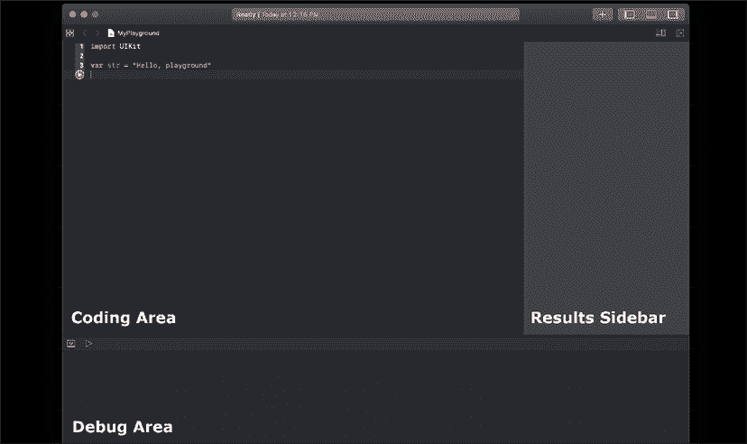

图 1.1：游乐场布局

让我们开始一个新的游乐场。我们首先需要启动 Xcode。一旦 Xcode 启动，我们可以选择 **使用游乐场开始** 选项，如下面的截图所示：

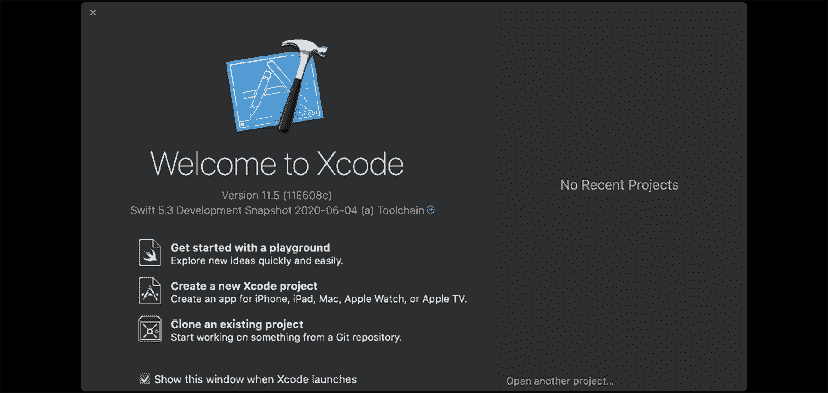

图 1.2：开始新的游乐场

或者，我们可以通过从顶部菜单栏的 **文件** | **新建** 转到 **游乐场...** 来导航，如下面的截图所示：

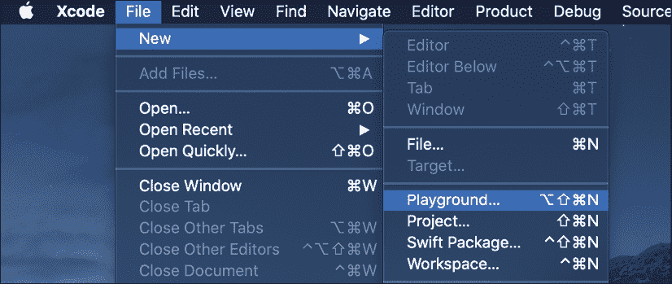

图 1.3：创建新的游乐场

接下来，我们应该看到一个类似于 *图 1.4* 的屏幕。这个屏幕允许我们命名我们的游乐场，并选择游乐场是 **iOS**、**tvOS** 还是 **macOS** 游乐场。在本章的大部分示例中，可以安全地假设你可以选择任何操作系统选项，除非另有说明。你还可以选择一个模板来使用。对于本书的示例，我们将使用 **空白** 模板来编写所有代码：

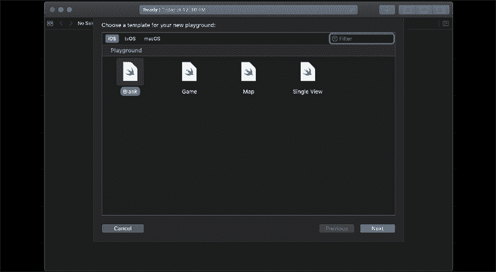

图 1.4：游乐场模板

最后，我们需要选择保存游乐场的位置。选择位置后，游乐场将打开并看起来类似于 *图 1.5*：

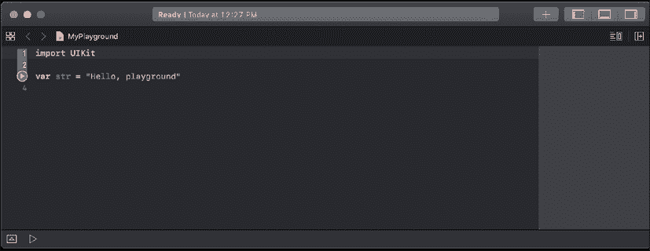

图 1.5：游乐场屏幕

在前面的截图中，我们可以看到游乐场的编码区域看起来与 Xcode 项目的编码区域相似。这里的不同之处在于右侧的侧边栏。这个侧边栏是显示我们代码结果的地方。前面的截图中的代码导入了 **Cocoa** 框架，因为它是一个 macOS 游乐场。如果它是一个 iOS 游乐场，它将导入 **UIKit** 框架。

如果你的新游乐场没有打开调试区域，你可以通过同时按下 shift + command + Y 键来手动打开它。或者，你也可以使用游乐场窗口右上角的侧边栏按钮。再次按下 shift + command + Y 可以关闭调试区域。在本章的后面部分，我们将看到为什么调试区域如此有用。打开或关闭调试区域的另一种方法是点击一个看起来像倒三角形的按钮，该按钮位于调试区域和编码区域之间的边界框中。

## iOS、tvOS 和 macOS 游乐场

当你开始一个新的 iOS 或 tvOS 游乐场时，游乐场会导入 UIKit 框架。这使我们能够访问 UIKit 框架，它为 iOS 和 tvOS 应用程序提供核心基础设施。当我们开始一个新的 macOS 游乐场时，游乐场会导入 Cocoa 框架。

上一段话的意思是，如果我们想对 UIKit 或 Cocoa 的特定功能进行实验，我们需要打开正确的游乐场。例如，如果我们有一个 iOS 游乐场打开，并且我们想创建一个表示颜色的对象，我们会使用 `UIColor` 对象。如果我们有一个 macOS 游乐场打开，我们会使用 `NSColor` 对象来表示颜色。

## 在游乐场中创建和显示图形

在原型设计新算法时，创建和显示图形非常有用。这是因为它们允许我们在整个计算过程中看到变量的值。要了解图形化工作原理，请查看以下游乐场：

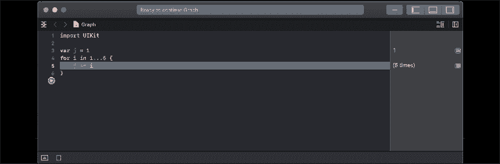

图 1.6：创建循环

在这个游乐场中，我们将 `j` 变量设置为 `1`。接下来，我们创建一个 `for` 循环，将数字 `1` 到 `5` 分配给 `i` 变量。在 `for` 循环的每一步中，我们将 `j` 变量的值设置为当前 `j` 的值加上 `i`。图形可以在 `for` 循环的每一步中改变 `j` 变量的值，帮助我们看到变量随时间的变化。我们将在本书的后面详细讲解 `for` 循环。

要显示图形，点击形状像圆圈带点的符号。然后我们可以移动时间线滑块，查看 `for` 循环每一步中 `j` 变量的值。以下游乐场显示了图形应该看起来像什么：

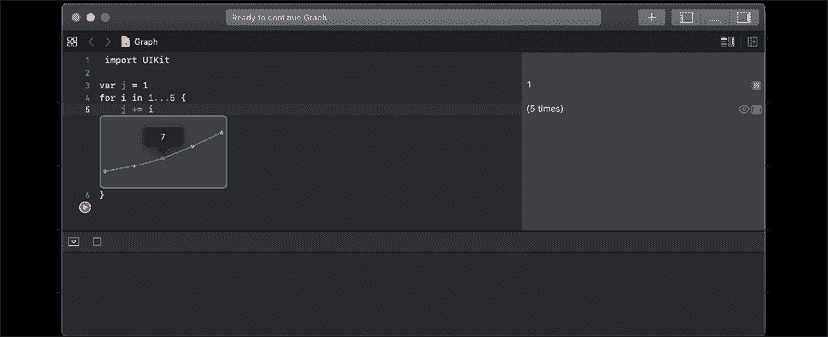

图 1.7：绘制图形

当我们想看到变量在代码执行过程中的变化时，图形非常有帮助。

## 什么不是游乐场

我们可以用游乐场做很多事情，而我们在这里的快速介绍中只是触及了皮毛。在我们离开这个简短的介绍之前，让我们看看什么是游乐场不是，以便我们更好地理解何时不应使用游乐场：

+   **游乐场不应用于性能测试**：在游乐场中运行的任何代码的性能并不能代表代码在项目中的运行速度

+   **游乐场不支持设备上的执行**：你不能将游乐场中的代码作为外部应用程序或在外部设备上运行

现在，让我们熟悉一些基本的 Swift 语法。

# Swift 语言语法

如果你是一名 Objective-C 开发者，并且你对现代语言如 Python 或 Ruby 不熟悉，前面截图中的代码可能看起来相当奇怪。Swift 语言的语法与基于 Smalltalk 和 C 的 Objective-C 有很大的不同。

Swift 语言使用现代概念和语法来创建非常简洁和可读的代码。同时，也强调消除常见的编程错误。

在我们深入研究 Swift 语言本身之前，让我们看看一些 Swift 语言的基本语法。

## 注释

在 Swift 代码中编写注释与在 Objective-C 代码中编写注释略有不同。我们仍然可以使用双斜杠 (`//`) 进行单行注释，以及使用 `/**` 和 `*/` 进行多行注释；然而，如果我们想使用注释来记录代码，我们需要使用三斜杠 (`///`) 或多行注释块。

您可以使用 Xcode 根据方法的签名自动生成注释模板，只需突出显示它，然后同时按下 *command* + *option* + */*。

为了记录我们的代码，我们通常使用 Xcode 识别的字段。这些字段如下：

+   **参数**：当我们以 `parameter {param name}:` 开头一行时，Xcode 会将其识别为参数的描述。

+   **返回**：当我们以 `return:` 开头一行时，Xcode 会将其识别为返回值的描述。

+   **抛出**：当我们以 `throws:` 开头一行时，Xcode 会将其识别为该方法可能抛出的任何错误描述。

下面的游乐场展示了单行和多行注释的示例以及如何使用注释字段：

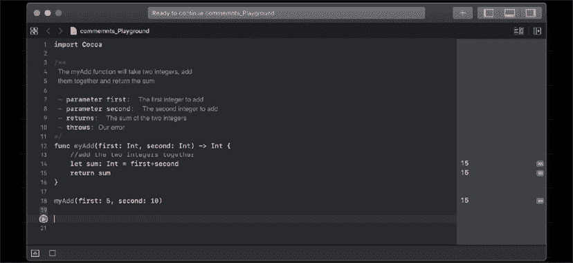

图 1.8：在游乐场中添加注释

要写好注释，我建议在函数内部使用单行注释，以快速给出代码的一行解释。然后，我们在函数和类外部使用多行注释来解释函数和类的作用。前面的游乐场展示了如何正确使用注释。通过使用适当的文档，就像我们在前面的截图中所做的那样，我们可以在 Xcode 中使用文档功能。如果我们按住 *option* 键，然后在代码中的任何地方点击函数名，Xcode 将显示一个包含函数描述的弹出窗口。

下面的截图显示了弹出窗口的外观：

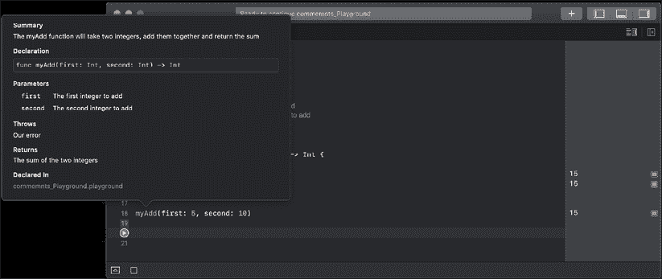

图 1.9：Xcode 中关于函数的文档

我们可以看到，文档包含五个字段。这些字段如下：

+   **声明**：这是函数的声明。

+   **参数**：这是函数参数在注释中的描述。参数描述以注释部分的 `Parameters:` 标签为前缀。

+   **抛出异常**：`throws` 描述前缀为 `throws` 标签，用于描述方法抛出的错误。

+   **返回值**：`returns` 描述前缀在注释部分为 `returns:` 标签。

+   **声明在**：这是函数声明的文件，这样我们就可以轻松找到它。

我们可以在注释中添加更多的字段。你可以在 Apple 的网站上找到完整的列表：[`developer.apple.com/library/content/documentation/Xcode/Reference/xcode_markup_formatting_ref/MarkupFunctionality.html`](https://developer.apple.com/library/content/documentation/Xcode/Reference/xcode_markup_formatting_re)。

如果你正在为 Linux 平台开发，我仍然建议使用 Apple 的文档指南，因为随着其他 Swift IDE 的开发，我相信它们将支持相同的指南。

## 分号

你可能已经注意到，到目前为止的代码示例中我们没有在行尾使用分号。在 Swift 中，分号是可选的；因此，以下 playground 中的两行在 Swift 中都是有效的：

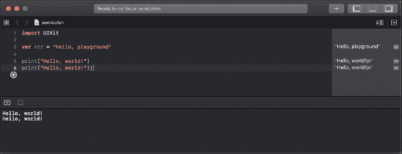

图 1.10：Swift 中分号的使用

为了风格上的考虑，强烈建议你在 Swift 代码中不要使用分号。如果你真的想使用分号，请保持一致性，并在每一行代码中使用它们；然而，如果你忘记了，也不会有警告。

我再强调一次：建议你在 Swift 中不要使用分号。

## 括号

在 Swift 中，条件语句周围的括号是可选的；例如，以下 playground 中的两个 `if` 语句都是有效的：

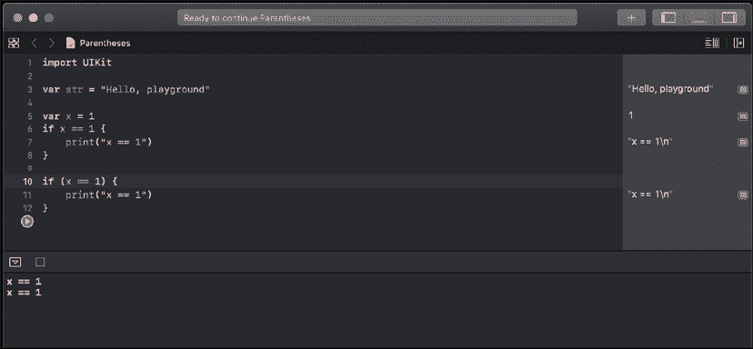

图 1.11：Swift 中的括号

为了风格上的考虑，建议你除非在同一行上有多个条件语句，否则不要在代码中使用括号。为了可读性，将括号放在同一行上的单个条件语句周围是一个好的做法。

## 花括号

在 Swift 中，与大多数其他语言不同，在条件或循环语句之后需要使用花括号。这是 Swift 内置的安全特性之一。可以说，如果开发者使用了花括号，那么可能已经避免了大量的安全漏洞。这些漏洞也可以通过其他方式避免，例如单元测试和代码审查，但在我看来，要求开发者使用花括号是一个良好的安全标准。

以下 playground 展示了如果你忘记包含花括号时将得到的错误：

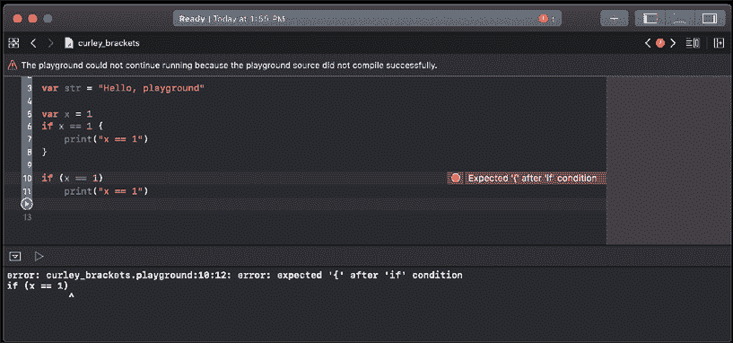

图 1.12：Swift 中的花括号

## 赋值运算符不返回值

在大多数其他语言中，以下行代码是有效的，但可能并不是开发者想要执行的操作：

```swift
if (x = 1) {} 
```

在 Swift 中，这个语句是无效的。在条件语句（`if`、`while` 和 `guard`）中使用赋值运算符（`=`）会引发错误。这是 Swift 中内置的另一个安全特性。它防止开发者忘记比较语句中的第二个等号（`=`）。以下 playground 展示了此错误：

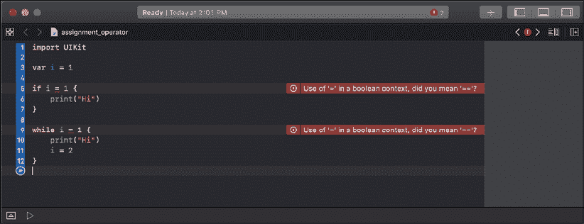

图 1.13：Swift 中的赋值运算符

## 在条件和赋值语句中，空白是可选的。

对于条件（`if` 和 `while`）和赋值（`=`）语句，空白是可选的。因此，在以下 playground 中，`i` 和 `j` 代码块都是有效的：

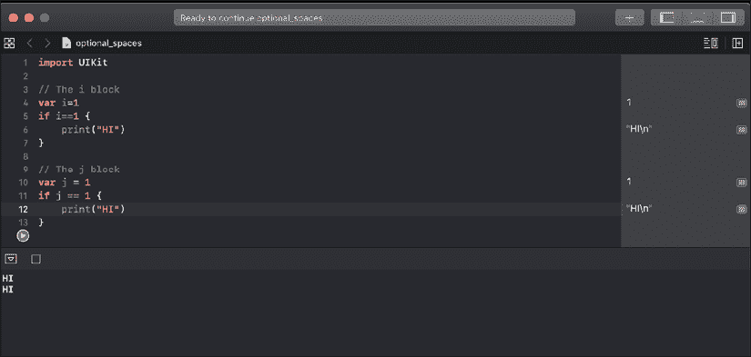

图 1.14：Swift 中的空格

为了风格上的考虑，我建议添加空白，就像 `j` 块所示（为了可读性），但只要您选择一种风格并保持一致，任何风格都是可接受的。

# Hello World

所有旨在教授计算机语言的优秀计算机书籍都有一个部分，展示了用户如何编写 Hello World 应用程序。这本书也不例外。在本节中，我们将向您展示如何编写两个不同的 Hello World 应用程序。

我们的第一个 Hello World 应用程序将是一个传统的 Hello World 应用程序，它只是将 Hello World 打印到控制台。让我们首先创建一个新的 playground，并将其命名为 `Chapter_1_Hello_World`。

在 Swift 中，要打印消息到控制台，我们使用 `print()` 函数。在其最基本的形式中，我们会使用 `print()` 函数打印出一条单独的消息，如下面的代码所示：

```swift
print("Hello World") 
```

通常，当我们使用 `print()` 函数时，我们希望打印的不仅仅是静态文本。我们可以通过使用字符串插值或通过在 `print()` 函数中使用逗号分隔值来包含变量和/或常量的值。字符串插值使用一个特殊的字符序列，`\( )`，在字符串中包含变量和/或常量的值。以下代码展示了如何做到这一点：

```swift
let name = "Jon"
let language = "Swift"
var message1 = " Welcome to the wonderful world of "
var message2 = "\(name), Welcome to the wonderful world of \(language)!"
print(message2)
print(name, message1, language, "!") 
```

我们还可以在 `print()` 函数中定义两个参数，这两个参数会改变消息在控制台中的显示方式。这些参数是 `separator` 和 `terminator` 参数。`separator` 参数定义了一个用于在 `print()` 函数中分隔变量/常量值的字符串。默认情况下，`print()` 函数使用空格分隔每个变量/常量。`terminator` 参数定义了在行尾放置的字符。默认情况下，会在行尾添加换行符。

以下代码展示了我们如何创建一个以逗号分隔的列表，列表末尾没有换行符：

```swift
let name1 = "Jon" 
let name2 = "Kailey" 
let name3 = "Kara"
print(name1, name2, name3, separator:", ", terminator:"") 
```

我们还可以向我们的 `print()` 函数添加一个参数：`to:` 参数。这个参数将允许我们重定向 `print()` 函数的输出。在下面的示例中，我们将输出重定向到名为 `line` 的变量中：

```swift
let name1 = "Jon" 
let name2 = "Kailey" 
let name3 = "Kara"
var line = ""
print(name1, name2, name3, separator:", ", terminator:"", to:&line) 
print(line) 
```

之前，`print()` 函数只是一个用于基本调试的有用工具，但现在，随着新的增强型 `print()` 函数，我们可以用它做更多的事情。

前两个示例的输出是一个以逗号分隔的 Jon、Kailey、Kara 列表。

# 摘要

我们在本章的开始讨论了 Swift 语言，并简要介绍了其历史。我们还提到了 Swift 新版本中的一些变化。然后我们向您展示了如何启动和使用游乐场来实验 Swift 编程。我们还涵盖了 Swift 语言的基本语法，并讨论了适当的语言风格。本章以两个 Hello World 示例结束。

在下一章中，我们将查看 Apple 和 Swift 社区提供的文档。然后我们将了解如何从源代码构建 Swift 以及如何使用 Swift 编译器。
