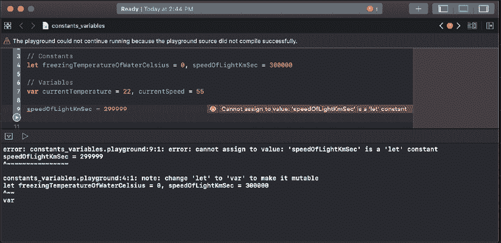
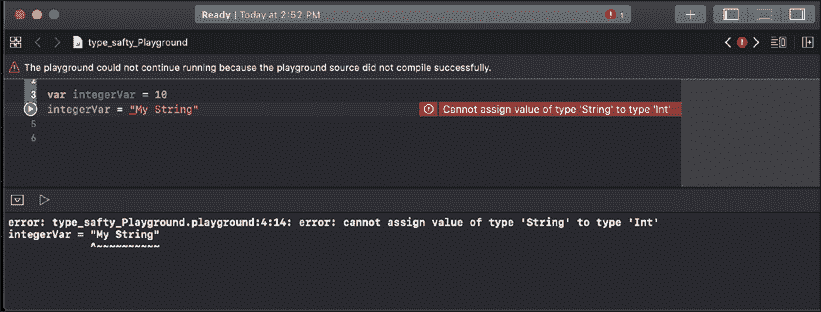
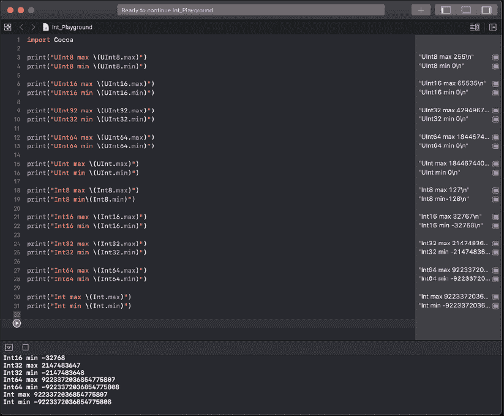
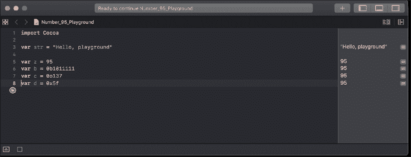
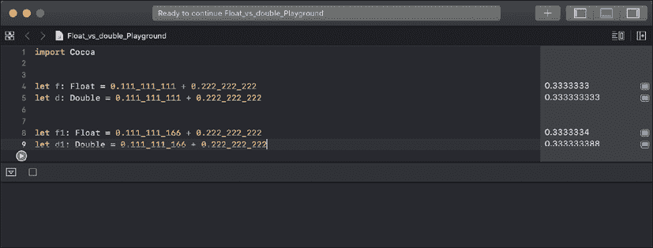
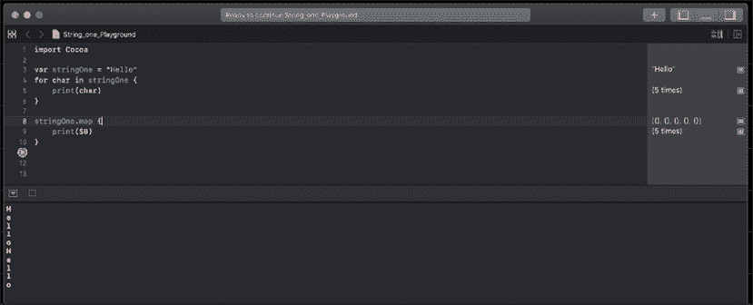
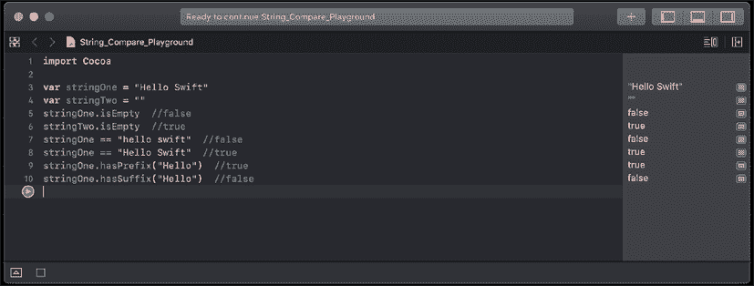

# 第三章：学习关于变量、常量、字符串和操作符的知识

我写的第一个程序是用 BASIC 编写的，是一个典型的 Hello World 应用程序。这个应用程序一开始很令人兴奋，但打印静态文本的兴奋感很快就消失了。对于我的第二个应用程序，我使用了 BASIC 的输入命令来询问用户的名字，然后打印出带有他们输入的名字的自定义“hello”消息。12 岁的时候，显示`Hello Han Solo`还是挺酷的。这个应用程序让我创建了大量的 Mad Libs 风格的应用程序，这些应用程序会提示用户输入各种单词，然后在用户输入所有必需的单词后显示一个故事。这些应用程序让我了解到，并教会了我变量的重要性。从那时起，我创建的每个有用的应用程序都使用了变量。

在本章中，我们将涵盖以下主题：

+   变量和常量是什么？

+   显式类型和推断类型有什么区别？

+   数字、字符串和布尔类型是什么？

+   解释 Swift 中枚举的工作原理

+   解释 Swift 操作符的工作原理

我们认识到 Swift 正在成为苹果生态系统之外的平台上的非常流行的语言。因此，从本章开始，在可下载的代码示例中，我们将包括 Swift playground 和所有示例代码的 `.swift` 代码文件。这将使您能够轻松地在您选择的任何平台上尝试这些示例。这是从 *Mastering Swift 5.3*，*第六版* 书籍开始的一个新特性。让我们通过了解常量和变量来开始我们的 Swift 语言之旅。

# 常量和变量

常量和变量将一个标识符（如 `myName` 或 `currentTemperature`）与特定类型的值（如 `String` 或 `Integer` 类型）关联起来，其中标识符可以用来检索值。常量和变量之间的区别在于，变量可以被更新或更改，而一旦为常量分配了值，它就不能被更改。

常量适用于定义那些你知道永远不会改变的值，比如水结冰的温度或光速。常量也适用于定义我们在整个应用程序中多次使用的值，例如标准字体大小或缓冲区中字符的最大数量。本书中会有许多关于常量的例子，建议尽可能使用常量而不是变量。

变量在软件开发中比常量更常见。这主要是因为开发者倾向于更喜欢变量。在 Swift 中，如果声明了一个值永远不会改变的变量，编译器会警告我们。我们可以不使用常量（尽管使用它们是良好的实践）来创建有用的应用程序；然而，没有变量几乎不可能创建一个有用的应用程序。

在 Swift 中鼓励使用常量。如果我们不期望或不想一个值发生变化，我们应该将其声明为常量。这为我们代码添加了一个非常重要的安全约束，确保该值永远不会改变。

您可以在变量或常量的命名/标识符中使用几乎任何字符（甚至 Unicode 字符）；然而，您必须遵循一些规则：

+   标识符不得包含任何空白字符。

+   它不能包含任何数学符号或箭头。

+   标识符不得包含私有用途或无效的 Unicode 字符。

+   它不能包含行或框绘制字符。

+   它不能以数字开头，但它可以包含数字。

+   强烈不建议使用 Swift 关键字作为标识符，但如果您确实这样做，请用反引号包围它。

关键字是 Swift 编程语言使用的单词。本章中您将看到的几个关键字示例是 `var` 和 `let`。您应该避免使用 Swift 关键字作为标识符，以避免在阅读代码时产生混淆。

## 定义常量和变量

常量和变量在使用之前必须定义。要定义一个常量，您使用 `let` 关键字，要定义一个变量，您使用 `var` 关键字。以下代码显示了如何定义常量和变量：

```swift
// Constants
let freezingTemperatureOfWaterCelsius = 0
let speedOfLightKmSec = 300000
// Variables
var currentTemperature = 22
var currentSpeed = 55 
```

我们可以在一行中声明多个常量或变量，通过逗号分隔它们。例如，我们可以将前面的四行代码缩减为两行，如下所示：

```swift
// Constants
let freezingTemperatureOfWaterCelsius = 0, speedOfLightKmSec = 300000
// Variables
var currentTemperature = 22, currentSpeed = 55 
```

我们可以将变量的值更改为兼容类型的另一个值；然而，正如我们之前提到的，我们无法更改常量的值。让我们看看以下游乐场。你能从错误信息中看出代码哪里有问题吗？



图 3.1：尝试更改常量时抛出的错误

你弄清楚代码哪里出问题了吗？任何物理学家都可以告诉你，我们无法改变光速，在我们的代码中，`speedOfLightKmSec` 是一个常量，因此我们在这里也无法改变它。当我们尝试更改 `speedOfLightKmSec` 常量时，会抛出一个错误。我们可以不产生错误地更改 `highTemperature` 的值，因为它是一个变量。我们已经多次提到变量和常量的区别，因为它是一个非常重要的概念，尤其是在我们进入定义可变和不可变集合类型时，尤其是在第五章 *使用 Swift 集合* 中。

当某物是可变的时，这意味着我们能够改变它，当我们说某物是不可变的时，这意味着我们无法改变它。

## 类型安全

Swift 是一种类型安全的语言，这意味着我们被要求定义将要存储在变量中的值的类型。如果我们尝试将一个错误类型的值分配给变量，我们会得到一个错误。以下游乐场显示了如果我们尝试将字符串值放入期望整数值的变量中会发生什么：

我们将在本章后面讨论最流行的类型。



图 3.2：Swift 游乐场中的类型安全错误

Swift 在编译代码时会执行类型检查，因此它会用错误标记任何不匹配的类型。在这个游乐场中的错误信息清楚地解释了我们试图将字符串值插入到整数变量中。

Swift 如何知道常量 `integerVar` 是整数类型？Swift 使用类型推断来确定合适的类型。让我们看看什么是类型推断。

## 类型推断

类型推断允许我们在变量定义时省略变量类型，如果变量有初始值。编译器将根据该初始值推断类型。例如，在 Objective-C 中，我们会这样定义一个整数：

```swift
int myInt = 1 
```

这告诉编译器 `myInt` 变量是 `Int` 类型，初始值是数字 `1`。在 Swift 中，我们会这样定义相同的整数：

```swift
var myInt = 1 
```

Swift 推断变量类型是整数，因为初始值是整数。让我们看看更多例子：

```swift
var x = 3.14  // Double type
var y = "Hello"  // String type
var z = true   // Boolean type 
```

在前面的例子中，编译器将正确推断变量 `x` 是 `Double` 类型，变量 `y` 是 `String` 类型，变量 `z` 是 `Boolean` 类型，基于它们的初始值。我们能够显式地定义变量类型。然而，建议我们只在未为变量分配初始值时这样做。

## 显式类型

类型推断是 Swift 中一个非常棒的功能，你可能会很快习惯它。然而，有时我们可能希望显式地定义一个变量的类型。例如，在上一个例子中，变量 `x` 被推断为 `Double` 类型，但如果我们想将变量类型定义为 `Float` 呢？我们可以这样显式地定义变量类型：

```swift
var x:Float = 3.14 
```

注意变量标识符后面的 `Float` 声明（冒号和 `Float` 这个词）。这告诉编译器将这个变量定义为 `Float` 类型，并给它一个初始值 `3.14`。当我们以这种方式定义变量时，我们需要确保初始值与定义的变量类型相同。如果我们尝试给变量一个与定义的变量类型不同的初始值，那么我们会收到一个错误。例如，以下行将引发错误，因为我们显式地将变量定义为 `Float` 类型，而我们在尝试放入一个 `String` 值：

```swift
var x: Float = "My str" 
```

如果我们没有设置初始值，我们需要显式地定义变量类型。例如，以下代码行是无效的，因为编译器不知道将变量 `x` 设置为什么类型：

```swift
var x 
```

如果我们在应用程序中使用此代码，我们将收到一个 **模式中缺少类型注解** 错误。如果我们没有为变量设置初始值，我们必须定义变量类型，如下例所示：

```swift
var x: Int 
```

现在我们已经看到了如何显式定义变量类型，让我们看看一些最常用的类型。

# 数值类型

Swift 包含许多适合存储各种整数和浮点值的标准数值类型。让我们首先看看整数类型。

## 整数类型

整数是一个完整的数字，可以是带符号的（正数、负数或零）或无符号的（正数或零）。Swift 提供了多种不同大小的 **整数** 类型。*表 3.1* 展示了 64 位系统上不同整数类型的值范围：

| 类型 | 最小值 | 最大值 |
| --- | --- | --- |
| `Int8` | -128 | 127 |
| `Int16` | -32,768 | 32,767 |
| `Int32` | -2,147,483,648 | 2,147,483,647 |
| `Int64` | - 9,223,372,036,854,775,808 | 9,223,372,036,854,775,807 |
| `Int` | - 9,223,372,036,854,775,808 | 9,223,372,036,854,775,807 |
| `UInt8` | 0 | 255 |
| `UInt16` | 0 | 65,535 |
| `UInt32` | 0 | 4,294,967,295 |
| `UInt64` | 0 | 18,446,744,073,709,551,615 |
| `UInt` | 0 | 18,446,744,073,709,551,615 |

表 3.1：Swift 中可用的不同整数类型

您可能会注意到从图表中，无符号整数以 U 开头（`UInt`、`UInt8` 等），而带符号的整数则没有（`Int`、`Int8`）。

除非有特定原因需要定义整数的大小，我建议使用标准的 `Int` 或 `UInt` 类型。这将避免您以后需要在不同的整数类型之间进行转换。

在 Swift 中，`Integer` 类型和其他数值类型实际上是命名类型，并且使用结构体在 Swift 标准库中实现。这为我们提供了一种一致的机制来管理所有数据类型的内存，以及我们可以访问的属性。对于前面的图表，我使用了 `Integer` 类型的 `min` 和 `max` 属性来检索每个 `Integer` 类型的最小和最大值。查看以下游乐场，看看这些值是如何检索的：



图 3.3：不同数值类型的范围

整数也可以表示为二进制、八进制和十六进制数。我们只需要在数字前加上一个前缀，告诉编译器数字应该使用哪种基数。前缀的形式是一个零，后跟基数指定符。*表 3.2* 展示了每个数值基数的前缀：

| 基数 | 前缀 |
| --- | --- |
| 十进制 | 无 |
| 二进制 | 0b |
| 八进制 | 0o |
| 十六进制 | 0x |

表 3.2：每个数值基数的前缀

以下游乐场展示了数字 95 在每种数值基数中的表示方式：



图 3.4：使用不同的数值基数定义值

Swift 还允许我们在我们的数值字面量中插入任意下划线。这可以提高我们代码的可读性，而不会改变其底层值。例如，如果我们正在定义光速，这是一个常数，我们可以这样定义它：

```swift
let speedOfLightKmSec = 300_000 
```

Swift 编译器将忽略这些下划线，并像没有下划线一样解释这个值。

Swift 中的 `Integer` 类型有一个名为 `isMultiple(of:)` 的方法，这个方法非常有用。此方法允许我们检查一个数字是否是另一个数字的倍数。在此方法之前，我们会使用以下代码：

```swift
let number = 4
if number % 2 == 0 { 
    print("Even")
} else {
    print("Odd")
} 
```

现在，我们可以这样使用 `isMultiple(of:)` 方法：

```swift
let number = 4
if number.isMultiple(of: 2) { 
    print("Even")
} else {
    print("Odd")
} 
```

虽然这个新方法实际上并没有消除很多代码，但它确实使我们的代码更容易阅读和理解。现在，让我们看看浮点数和 `Double` 类型。

## 浮点数和 Double 值

浮点数是一个带有小数部分的数字。Swift 中有两种标准的浮点数类型：`Float` 和 `Double`。`Float` 类型表示 32 位浮点数，而 `Double` 类型表示 64 位浮点数。虽然 `Float` 类型是 32 位浮点数，但 Swift 实际上支持四种浮点数类型。这些是 `Float16`、`Float32`、`Float64` 和 `Float80`。记住，当使用 `Float` 类型时，它是一个 32 位浮点数；如果你想要使用其他精度，你需要定义它。

Swift 5.3，随着 Swift Evolution SE-0277 的加入，将 `Float16` 类型添加到了 Swift 语言中，因为它在图形编程和机器学习中被广泛使用。

建议我们使用 `Double` 类型而不是 `Float` 类型，除非有特定的理由使用后者。`Double` 类型的精度至少为 15 位十进制数字，而 `Float` 类型的精度可能小到只有六位十进制数字。让我们看看一个例子，看看这如何影响我们的应用程序，而我们却不知道。*图 3.5* 展示了如果我们使用 `Float` 类型和使用 `Double` 类型将两个十进制数相加会发生什么：



图 3.5：Float 和 Double 的计算

如前一个屏幕截图所示，我们正在相加的前两个十进制数包含九位小数点后的数字；然而，`Float` 类型的结果只包含七位数字，而 `Double` 类型的结果包含完整的九位数字。这种精度损失可能会在处理货币或其他需要精确计算的数字时引起问题，正如我们在第二组数字的比较中可以看到的那样。

注意，当你为十进制数字使用类型推断时，Swift 将默认使用 `Double` 类型而不是 `Float` 类型。

如果我们有两个变量，其中一个为整数，另一个为双精度浮点数？你认为我们能否像以下代码所示那样将它们相加？

```swift
var a: Int = 3
var b: Double = 0.14
var c = a + b 
```

如果我们将前面的代码放入游乐场，我们会收到以下错误：

```swift
operator '+' cannot be applied to operands of type Int and Double 
```

这个错误告诉我们我们正在尝试添加两种不同类型的数字，这是不允许的。要添加 `Int` 和 `Double` 类型，我们需要将整数值转换为双精度浮点数。以下代码展示了如何做到这一点：

```swift
var a: Int = 3
var b: Double = 0.14
var c = Double(a) + b 
```

注意我们如何使用 `Double()` 函数用 `Int` 值初始化一个 `Double` 值。Swift 中所有数值类型都有一个用于这些类型转换的初始化器。这些初始化器被称为 **便利初始化器**，类似于前面代码示例中显示的 `Double()` 函数。例如，以下代码展示了如何用整数值初始化 `Float` 或 `uint16` 值：

```swift
var intVar = 32
var floatVar = Float(intVar)
var uint16Var = UInt16(intVar) 
```

通常情况下，当我们把两种不同的类型相加时，我们会希望将精度最低的数字（如整数或浮点数）转换为精度最高的类型，比如双精度浮点数。

# 布尔类型

**布尔**值通常被称为逻辑值，因为它们可以是`true`或`false`。Swift 有一个内置的 `Boolean` 类型，它接受两个内置布尔常量之一：`true` 和 `false`。

布尔常量和变量可以定义如下：

```swift
let swiftIsCool = true
var itIsRaining = false 
```

布尔值在处理条件语句（如 `if`、`while` 和 `guard` 语句）时特别有用。例如，你认为这段代码会做什么？

```swift
let isSwiftCool = true
var isItRaining = false
if isSwiftCool {
    print("YEA, I cannot wait to learn it")
}
if isItRaining {
    print("Get a rain coat")
} 
```

如果你回答说这段代码会打印出 `YEA, I cannot wait to learn it`，那么你就对了。这一行被打印出来是因为 `isSwiftCool` 布尔类型被设置为 `true`，而 `isItRaining` 变量被设置为 `false`；因此，`Get a rain coat` 消息没有被打印。

在大多数语言中，如果我们想要切换布尔变量的值，我们必须做类似这样的事情：

```swift
isItRaining = !isItRaining 
```

在 Swift 中，布尔类型有一个名为 `toggle()` 的方法，允许我们切换变量的值。如果我们不知道变量中存储的值，就会用到这个方法。例如，如果 `isItRaining` 常量是一个变量，并且我们想要改变它的值，但我们不知道它实际是什么，我们可以使用以下代码行来改变它：

```swift
isItRaining.toggle() 
```

就像整数的 `isMultiple(of:)` 方法一样，这使得我们的代码更容易阅读和理解。现在，让我们看看 `String` 类型。

# 字符串类型

**字符串**是有序字符集合，如 `Hello` 或 `Swift`，由 `String` 类型表示。我们在本书中已经看到了几个字符串的例子，因此以下代码应该看起来很熟悉。这段代码展示了如何定义两个字符串：

```swift
var stringOne = "Hello"
var stringTwo = "World" 
```

我们也可以使用多行字符串字面量来创建字符串。以下代码展示了我们如何做到这一点：

```swift
var multiLine = """
This is a multiline string literal.
This shows how we can create a string over multiple lines.
""" 
```

注意我们用三个双引号包围了多行字符串。我们可以在多行字符串中使用引号来引用特定的文本。以下代码展示了如何做到这一点：

```swift
var multiLine = """
This is a multiline string literal.
This shows how we can create a string over multiple lines.
Jon says, "multiline string literals are cool"
""" 
```

由于字符串是有序字符集合，我们可以遍历字符串中的每个字符。以下代码展示了如何做到这一点：

```swift
var stringOne = "Hello"
for char in stringOne {
    print(char)
} 
```

以下代码将显示以下截图所示的结果：



图 3.6：遍历字符串的字符

我们还可以使用 `map()` 函数，如 *图 3.6* 所示，从 `String` 类型中检索每个字符，如下面的代码所示：

```swift
stringOne.map {
    print($0)
} 
```

我们将在本书的后面部分探讨 `map()` 方法及其工作原理。

我们可以将一个字符串添加到另一个字符串中的两种方式。我们可以连接它们或内联它们。要连接两个字符串，我们可以使用 `+` 或 `+=` 运算符。以下代码展示了两种连接字符串的方法。第一个示例将 `stringB` 追加到 `stringA` 的末尾，并将结果放入新的 `stringC` 变量中。第二个示例直接将 `string` 追加到 `stringA` 的末尾，而不创建新的字符串：

```swift
var stringC = stringA + stringB
stringA += string 
```

要将一个字符串内联到另一个字符串中，我们使用一个特殊的字符序列：`\()`。以下代码展示了如何将字符串插值与另一个字符串结合使用：

```swift
var stringA = "Jon"
var stringB = "Hello \(stringA)" 
```

在前面的示例中，`stringB` 将包含消息 `Hello Jon`，因为 Swift 将 `\(stringA)` 字符序列替换为 `stringA` 变量的值。

从 Swift 5 开始，我们有了创建原始字符串的能力。在 Swift 的早期版本中，如果我们想在字符串中包含引号或反斜杠，我们必须使用反斜杠进行转义，如下面的代码所示：

```swift
let str = "The main character said \"hello\"" 
```

对于原始字符串，双引号和反斜杠被视为字符串字面部分的一部分，因此我们不需要对它们进行转义。以下示例展示了如何进行这一操作：

```swift
let str1 = #"The main character said "hello""# 
```

注意字符串开头和结尾的井号和双引号。这告诉 Swift 这是一个原始字符串。这使得阅读字符串实际包含的内容变得容易得多。如果我们想像之前那样在行内追加另一个字符串，我们会使用 `\#()` 字符序列。以下代码说明了这一点：

```swift
let ans = 42
var str2 = #"The answer is \#(ans)"# 
```

此代码的结果将是一个包含以下字符串的 `str2` 变量：**答案是 42**。

在 Swift 中，我们使用 `var` 和 `let` 关键字来定义变量和集合的可变性。如果我们使用 `var` 将字符串定义为变量，则该字符串是可变的，这意味着我们可以更改和编辑其值。如果我们使用 `let` 将字符串定义为常量，则该字符串是不可变的，这意味着一旦设置，我们无法更改或编辑其值。以下代码显示了可变字符串和不可变字符串之间的区别：

```swift
var x = "Hello" 
let y = "HI"
var z = " World"
//This is valid because x is mutable
x += z
//This is invalid because y is not mutable.
y += z 
```

Swift 中的字符串有两种方法可以转换字符串的大小写。这些方法是 `lowercased()` 和 `uppercased()`。以下示例演示了这些方法：

```swift
var stringOne = "hElLo"
print("Lowercase String:	\(stringOne.lowercased())")
print("Uppercase String:	\(stringOne.uppercased())") 
```

如果我们运行此代码，结果将如下所示：

```swift
Lowercase String: hello
Uppercase String: HELLO 
```

Swift 提供了四种比较字符串的方法；这些是字符串相等性、前缀相等性、后缀相等性和 `isEmpty`。以下示例演示了这些方法：



图 3.7：Swift 中的字符串比较方法

`isEmpty()` 方法检查字符串是否包含任何字符。字符串相等性（`==`）检查两个字符串中的字符（区分大小写）是否相同。前缀和后缀相等性检查字符串是否以特定字符串开头或结尾。前缀和后缀相等性也是区分大小写的。

我们可以用另一个字符串替换目标字符串的所有出现，这是通过 `replacingOccurrences(of:)` 方法完成的。以下代码演示了这一点：

```swift
var stringOne = "one,to,three,four"
var stringTwo = stringOne.replacingOccurrences(of: "to", with: "two")
print(stringTwo) 
```

前面的例子将打印 `one, two, three, four` 到屏幕上，因为我们正在将 `stringOne` 变量中所有 `to` 的出现替换为 `two`。

注意，`replacingOccurrences(of:)` 方法仅在 Apple 平台上可用，在其他平台上不可用。

我们还可以从我们的字符串中检索子字符串和单个字符；然而，当我们从字符串中检索子字符串时，该子字符串是 `Substring` 类型的实例，而不是 `String` 类型。`Substring` 类型包含与 `String` 类型大多数相同的方法，因此你可以以类似的方式使用它们。然而，与 `String` 类型不同，它们旨在仅用于短时间内，仅在我们处理值时使用。如果你需要长时间使用 `Substring` 类型，你应该将其转换为 `String` 类型。以下示例显示了如何处理子字符串：

```swift
var path = "/one/two/three/four"
//Create start and end indexes
let startIndex = path.index(path.startIndex, offsetBy: 4)
let endIndex = path.index(path.startIndex, offsetBy: 14)
let sPath = path[startIndex ..< endIndex] //returns the "/two/three"
//convert the substring to a string 
let newStr = String(sPath)
path[..<startIndex]    //returns the "/one"
path[endIndex...]     //returns the "/four"
path.last
path.first 
```

在前面的例子中，我们使用了下标路径来检索起始和结束索引之间的子字符串。索引是通过 `index(_: offsetBy:)` 函数创建的。`index(_: offsetBy:)` 函数的第一个属性给出了我们希望开始的索引位置，而 `offsetBy` 属性告诉我们需要增加索引多少。

`path[..<startIndex]` 行从字符串的开始到索引创建一个子字符串，而 `path[endIndex...]` 行从索引到字符串的末尾创建一个子字符串。然后我们使用最后一个属性来获取字符串的最后一个字符，使用第一个属性来获取第一个字符。

我们在前面例子中看到的 `..<` 操作符被称为 **半开区间操作符**。我们将在本章末尾查看不同的范围操作符。

我们可以通过使用 `count` 属性来检索字符串中的字符数。以下示例显示了如何使用此函数：

```swift
var path = "/one/two/three/four"
var length = path.count 
```

这就完成了我们对字符串的快速浏览。我们非常快速地浏览了这些属性和函数，但在这本书中我们将广泛使用字符串，所以会有很多代码帮助你熟悉它们。

# 元组

元组将多个值组合成一个单一的复合类型。这些值不需要是同一类型。

以下示例展示了如何定义一个元组：

```swift
var team = ("Boston", "Red Sox", 97, 65, 59.9) 
```

在前面的示例中，创建了一个无名的元组，其中包含两个字符串、两个整数和一个双精度浮点数。元组的值可以分解成一组变量，如下面的示例所示：

```swift
var team = ("Boston", "Red Sox", 97, 65, 59.9)
var (city, name, wins, losses, percent) = team 
```

在前面的代码中，`city` 变量将包含 `Boston`，`name` 变量将包含 `Red Sox`，`wins` 变量将包含 `97`，`losses` 变量将包含 `65`，最后 `percent` 变量将包含 `59.9`。

也可以通过指定值的定位来检索元组的值。以下示例展示了如何通过值的位置来检索值：

```swift
var team = ("Boston", "Red Sox", 97, 65, 59.9)
var city = team.0
var name = team.1
var wins = team.2
var losses = team.3
var percent = team.4 
```

命名元组，也称为 **named tuples**，允许我们避免分解步骤。命名元组将一个名称（键）与元组的每个元素关联起来。以下示例展示了如何创建一个命名元组：

```swift
var team = (city:"Boston", name:"Red Sox", wins:97, losses:65, percent:59.9) 
```

可以使用点语法访问命名元组的值。在前面代码中，我们可以这样访问元组的 `city` 元素：`team.city`。在前面的代码中，`team.city` 元素将包含 `Boston`。

元组极其有用，可以用于各种目的。我发现它们对于替换仅设计用于存储数据且不包含任何方法的类和结构体非常有用。它们也非常适用于从函数中返回多个不同类型的值。现在，让我们看看枚举。

# 枚举

枚举（也称为 **enums**）是一种特殊的数据类型，它使我们能够将相关的类型组合在一起，并以类型安全的方式使用它们。与 C 或 Java 等其他语言不同，Swift 中的枚举不与整数值绑定。在 Swift 中，我们可以定义一个具有类型（字符串、字符、整数或浮点值）的枚举，然后定义其实际值（称为 **raw value**）。枚举还支持传统上只有类才支持的功能，例如计算属性和实例方法。我们将在 *第七章*，*类、结构和协议* 中深入讨论这些高级功能。在本节中，我们将探讨枚举的传统特性。

我们将定义一个包含 `Planets` 列表的枚举，如下所示：

```swift
enum Planets {
    case mercury
    case venus
    case earth
    case mars
    case Jupiter
    case Saturn
    case Uranus
    case neptune
} 
```

注意：当定义枚举类型时，枚举的名称应该大写，就像其他类型一样。枚举值可以是大写或小写；然而，建议使用小写。

在枚举中定义的值被认为是枚举的成员值（或简单地称为成员）。在大多数情况下，你将看到成员值定义得像前面的示例一样，因为这样更容易阅读；然而，还有一个更简短的版本。这个简短版本允许我们在一行中定义多个成员，成员之间用逗号分隔，如下面的示例所示：

```swift
enum Planets {
case mercury, venus, earth, mars, jupiter
case saturn, uranus, neptune
} 
```

然后，我们可以这样使用 `Planets` 枚举：

```swift
var planetWeLiveOn = Planets.earth
var furthestPlanet = Planets.neptune 
```

当我们使用 `Planets` 枚举的一个成员值初始化 `planetWeLiveOn` 和 `furthestPlanet` 变量时，变量类型会被推断出来。一旦变量类型被推断出来，我们就可以在不使用 `Planets` 前缀的情况下分配新值，如下所示：

```swift
planetWeLiveOn = .mars 
```

我们可以使用传统的等于运算符 (`==`) 或使用 `switch` 语句来比较枚举值。

注意：我们将在本书后面的 *第六章*，*控制流* 中学习 Swift 的 `switch` 语句。现在，我们想通过使用枚举类型来展示其用法。

以下示例展示了如何使用等于运算符和 `switch` 语句与枚举一起使用：

```swift
// Using the traditional == operator
if planetWeLiveOn == .earth {
    print("Earth it is")
}
// Using the switch statement
switch planetWeLiveOn {
case .mercury:
    print("We live on Mercury, it is very hot!")
case .venus:
    print("We live on Venus, it is very hot!")
case .earth:
    print("We live on Earth, just right")
case .mars:
    print("We live on Mars, a little cold")
default:
    print("Where do we live?")
} 
```

枚举可以预先填充原始值，这些原始值必须是同一类型。以下示例展示了如何定义具有字符串值的枚举：

```swift
enum Devices: String {
    case MusicPlayer = "iPod"
    case Phone = "iPhone"
    case Tablet = "iPad"
}
print("We are using an \(Devices.Tablet.rawValue)") 
```

前面的示例创建了一个包含三种设备类型的枚举。然后我们使用 `rawValue` 属性来检索 `Devices` 枚举中 `Tablet` 成员的存储值。此示例将打印一条消息，表示“我们正在使用 iPad”。

让我们创建另一个 `Planets` 枚举，但这次，我们将数字分配给成员，如下所示：

```swift
enum Planets: Int {
    case Mercury = 1
    case Venus
    case Warth
    case Mars
    case Jupiter
    case Saturn
    case Uranus
    case Neptune
}
print("Earth is planet number \(Planets.earth.rawValue)") 
```

这两个最后枚举示例之间的主要区别在于，在第二个示例中，我们只分配了一个值给第一个成员（`mercury`）。如果枚举的原始值使用整数，那么我们不需要为每个成员分配值。如果没有值存在，原始值将自动递增。

在 Swift 中，枚举也可以有关联值。关联值允许我们存储额外的信息，以及成员值。这些额外信息每次使用成员时都可能不同。它们也可以是任何类型，并且每个成员的类型可以不同。让我们通过定义一个包含两种产品类型的 `Product` 枚举来了解如何使用关联类型：

```swift
enum Product {
    case Book(Double, Int, Int)
    case Puzzle(Double, Int)
}
var masterSwift = Product.Book(49.99, 2017, 310) 
var worldPuzzle = Product.Puzzle(9.99, 200)
switch masterSwift {
case .Book(let price, let year, let pages):
    print("Mastering Swift was published in \(year) for the price of \(price) and has \(pages) pages")
case .Puzzle(let price, let pieces):
    print("Mastering Swift is a puzzle with \(pieces) and sells for \(price)")
}
switch worldPuzzle {
case .Book(let price, let year, let pages):
    print("World Puzzle was published in \(year) for the price of \(price) and has \(pages) pages")
case .Puzzle(let price, let pieces):
    print("World Puzzle is a puzzle with \(pieces) and sells for \(price)")
} 
```

在前面的示例中，我们首先定义了一个`Product`枚举，它有两个成员：`Book`和`Puzzle`。`Book`成员具有`Double`、`Int`和`Int`类型的关联值，而`Puzzle`成员具有`Double`和`Int`类型的关联值。请注意，我们正在使用命名关联类型，为每个关联类型分配一个名称。然后我们创建了两个产品，`masterSwift`和`worldPuzzle`。我们将`masterSwift`变量的值设置为`Product.Book`，并带有关联值`49.99`、`2017`和`310`。然后我们将`worldPuzzle`变量的值设置为`Product.Puzzle`，并带有关联值`9.99`和`200`。

然后，我们可以使用`switch`语句检查`Product`枚举，就像我们在之前的示例中所做的那样。然后我们在`switch`语句中提取关联值。在这个例子中，我们使用`let`关键字将关联值提取为常量，但您也可以使用`var`关键字将关联值提取为变量。

如果你将之前的代码放入游乐场，将会显示以下结果：

```swift
"Master Swift was published in 2017 for the price of 49.99 and has 310 pages"
"World Puzzle is a puzzle with 200 and sells for 9.99" 
```

我们能够选择使我们的枚举符合`Comparable`协议，这些枚举要么没有关联值，要么它们的关联值本身符合`Comparable`协议。通过符合`Comparable`协议，我们能够使用`<`和`>`运算符比较相同枚举的案例。让我们看看这是如何工作的：

如果你现在还不理解协议是什么，或者类型如何符合它们，请不要担心。我们将在第九章“协议和协议扩展”中介绍协议。

```swift
enum Grades: Comparable {
    case f
    case d
    case c
    case b
    case a
}
let acceptableGrade = Grades.c
let testOneGrade = Grades.b
if  testOneGrade < acceptableGrade {
    print("Grade is unacceptable")
}
else {
    Print("Grade is acceptable")
} 
```

在之前的代码中，我们定义了一个枚举，它定义了不同的成绩等级。通过在枚举声明后添加`: Comparable`，我们添加了对`Comparable`协议的符合。然后我们创建了一个常量，定义了我们的可接受成绩等级。现在我们能够将包含`Grades`值的任何变量与`acceptableGrade`常量进行比较，以确保它包含一个可接受的成绩，正如我们在示例中所展示的那样。

枚举的合成`Comparable`符合性是在 Swift 5.3 版本中通过 Swift Evolution SE-0266 添加的，这是我最兴奋的功能之一。它允许我们使我们的枚举符合`Comparable`协议，而无需编写代码来自己符合该协议。

在本书的后续章节中，我们将探讨枚举的附加功能，并了解为什么它们可以如此强大。到目前为止，在本书中，我们在许多示例中使用了运算符。让我们更仔细地看看它们。

# 运算符

运算符是我们可以使用来检查、更改或组合值的符号或符号组合。在本书的许多示例中，我们已经使用了运算符，但并没有特别提到它们。在本节中，我们将向您展示如何使用 Swift 支持的大多数基本运算符。

Swift 支持大多数标准 C 运算符，并对其中一些进行了改进，以消除几个常见的编码错误。例如，赋值运算符不返回值，这防止了它在应该使用等于运算符的地方被使用，等于运算符是两个等号（`==`）。

让我们看看 Swift 中的运算符。

## 赋值运算符

赋值运算符初始化或更新一个变量。这里有一个原型：

```swift
var A = var B 
```

这里有一个例子：

```swift
let x = 1
var y = "Hello"
a = b 
```

## 比较运算符

比较运算符如果语句为真则返回布尔值`true`，如果语句不为真则返回布尔值`false`。

这里有一些原型：

```swift
Equality:  varA == varB
Not equal:  varA != varB 
Greater than:  varA > varB 
Less than:  varA < varB
Greater than or equal to: varA >= varB
Less than or equal to: varA <= varB 
```

这里有一些例子：

```swift
2 == 1 //false, 2 does not equal 1
2 != 1 //true, 2 does not equal 1
2 > 1 //true, 2 is greater than 1
2 < 1 //false, 2 is not less than 1
2 >= 1 //true, 2 is greater or equal to 1
2 <= 1 //false, 2 is not less or equal to 1 
```

## 算术运算符

算术运算符执行四种基本的数学运算。这里有一些原型：

```swift
Addition: varA + varB
Subtraction: varA - varB
Multiplication: varA * varB
Division: varA / varB 
```

这里有一些例子：

```swift
var x = 4 + 2  //x will equal 6
var x = 4 – 2  //x will equal 2
var x = 4 * 2  //x will equal 8
var x = 4 / 2  //x will equal 2
var x = "Hello " + "world"  //x will equal "Hello World" 
```

## 余数运算符

余数操作符计算第一个操作数除以第二个操作数后的余数。在其他语言中，这有时被称为取模或模运算符。

这里有一个原型：

```swift
varA % varB 
```

这里有一个例子：

```swift
var x = 10 % 3  //x will equal 1
var x = 10 % 6  //x will equal 4 
```

## 复合赋值运算符

复合赋值运算符将算术运算符与赋值运算符组合起来。

这里有一些原型：

```swift
varA += varB
varA -= varB
varA *= varB
varA /= varB 
```

这里有一些例子：

```swift
var x = 6
x += 2  //x now is 8
x -= 2  //x now is 4
x *= 2  //x now is 12
x /= 2  //x now is 3 
```

## 闭区间操作符

闭区间操作符定义了一个从第一个数字到第二个数字的范围。数字之间由三个点分隔。

这里有一个原型：

```swift
(a...b) 
```

这里有一个例子。注意，我们将在*第六章*，*控制流*中介绍`for`循环：

```swift
for i in 1...3 {
    print("Number: \(i)")
} 
```

这个例子将打印出以下内容：

```swift
Number: 1
Number: 2
Number: 3 
```

## 半开区间操作符

半开区间操作符定义了一个从第一个数字到第二个数字减一的数字的范围。数字之间由两个点和小于号分隔。

这里有一个原型：

```swift
(a..<b) 
```

这里有一个例子：

```swift
for i in 1..<3 { 
    print("Number: \(i)")
} 
```

这个例子将打印出以下内容：

```swift
Number: 1
Number: 2 
```

注意，在闭区间操作符中，打印出了行`Number: 3`，但在半开区间操作符中却没有。

此外，还有我们与数组一起使用的一侧范围操作符。我们将在*第五章*，*使用 Swift 集合*中探讨这些。

## 三元条件运算符

三元条件操作符根据比较操作符或布尔值的评估将值赋给一个变量。

这里有一个原型：

```swift
(boolValue ? valueA : valueB) 
```

这里有一个例子：

```swift
var x = 2
var y = 3
var z = (y >x ? "Y is greater" : "X is greater")  //z equals "Y is greater" 
```

## 逻辑非运算符

逻辑非操作符反转一个布尔值。这里有一个原型：

```swift
varA = !varB 
```

这里有一个例子：

```swift
var x = true
var y = !x	  //y equals false 
```

## 逻辑与运算符

逻辑与运算符如果两个操作数都为真则返回`true`；否则返回`false`。

这里有一个原型：

```swift
varA && varB 
```

这里有一个例子：

```swift
var x = true 
var y = false
var z = x && y  //z equals false 
```

## 逻辑或运算符

逻辑或运算符如果任一操作数为真则返回`true`。这里有一个原型：

```swift
varA || varB 
```

这里有一个例子：

```swift
var x = true
var y = false
var z = x|| y  //z is true 
```

对于熟悉 C 或类似语言的人来说，这些运算符看起来应该很熟悉。对于那些不太熟悉 C 运算符的人来说，请放心，一旦你开始频繁使用它们，它们将变得像第二本能一样自然。

# 摘要

在本章中，我们涵盖了从变量和常量到数据类型和运算符的各种主题。本章中的内容将成为你编写每个应用程序的基础；因此，理解我们在这里讨论的概念非常重要。

在本章中，我们了解到当值不会改变时，我们应该优先使用常量而不是变量。如果你设置了一个变量但从未改变其值，Swift 将在编译时给出警告。我们还看到，我们应该优先使用类型推断而不是显式声明类型。

数字和字符串类型，在其他语言中作为原语实现，在 Swift 中是通过结构体实现的命名类型。在未来的章节中，你将看到为什么这一点很重要。本章需要记住的最重要的事情之一是，如果一个变量包含一个 nil 值，你必须将其声明为可选的。

在下一章中，我们将探讨 Swift 的可选类型。如果你习惯于不使用可选类型的语言，Swift 中的可选类型可能是一个最难掌握的概念。
