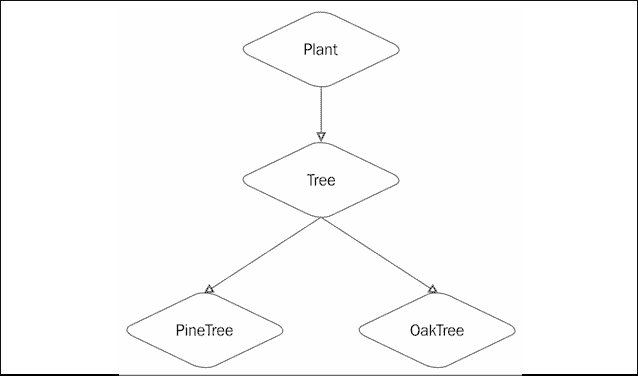

# 8

# 类、结构体和协议

我最初学习的编程语言是 BASIC。这是一个开始编程的好语言，但当我用 Commodore Vic-20 交换了 PCjr（是的，我有一台 PCjr，我真的很喜欢它）后，我意识到还有其他更高级的语言，我花了很多时间学习 Pascal 和 C。直到我开始上大学，我才听到**面向对象编程语言**这个术语。当时，面向对象编程语言还非常新，没有真正的课程，但我能够用 C++ 进行一些实验。毕业后，我放弃了面向对象编程，直到几年后，当我再次开始尝试 C++ 时，我才真正发现了面向对象编程的强大和灵活性。在本章中，我们将涵盖以下主题：

+   什么是类和结构体？

+   如何向类和结构体添加属性和属性观察器

+   如何向类和结构体添加方法

+   如何向类和结构体添加初始化器

+   如何以及何时使用访问控制

+   如何创建类层次结构

+   如何扩展类

# 什么是类和结构体？

在 Swift 中，类和结构体非常相似。如果我们真的想精通 Swift，不仅理解使类和结构体如此相似的原因非常重要，而且理解使它们区别开来的原因也非常重要，因为它们是我们应用程序的构建块。苹果公司是这样描述它们的：

> 类和结构体是通用、灵活的构造，它们成为你程序代码的构建块。你可以通过使用已经熟悉的常量、变量和函数的语法来定义属性和方法，为你的类和结构体添加功能。

让我们先快速看一下类和结构体之间的一些相似之处。

## 类和结构体之间的相似之处

在 Swift 中，类和结构体比在其他语言（如 Objective-C）中更相似。以下是类和结构体共享的一些功能列表：

+   **属性**: 这些用于在类和结构体中存储信息

+   **方法**: 这些为我们的类和结构体提供功能

+   **初始化器**: 这些用于初始化我们的类和结构体实例

+   **下标**: 这些通过下标语法提供对值的访问

+   **扩展**: 这些有助于扩展类和结构体

现在，让我们快速看一下类和结构体之间的一些区别。

## 类和结构体之间的区别

虽然类和结构体非常相似，但也有几个非常重要的区别。以下是 Swift 中类和结构体之间的一些区别列表：

+   **类型**: 结构体是一个值类型，而类是一个引用类型

+   **继承**: 结构体不能从其他类型继承，而类可以

+   **析构器**：结构体不能有自定义析构器，而类可以

在本章中，我们将强调类和结构体之间的区别，以帮助我们了解何时使用每个。在我们真正深入类和结构体之前，让我们看看值类型（结构体）和引用类型（类）之间的区别。为了完全理解何时使用类和结构体以及如何正确使用它们，理解值类型和引用类型之间的区别非常重要。

# 值类型与引用类型

结构体是值类型。当我们在我们应用程序中传递结构体的实例时，我们传递的是结构体的一个副本，而不是原始的结构体。类是引用类型；因此，当我们在我们应用程序中传递类的实例时，传递的是原始实例的引用。理解这种区别非常重要。在这里，我们将提供一个非常高级的概述，并在*第十八章*，*内存管理*中提供更多细节。当我们在我们应用程序中传递结构体时，我们传递的是结构体的副本，而不是原始的结构体。由于函数会得到结构体自己的副本，因此它可以按需更改它，而不会影响结构体的原始实例。当我们在我们应用程序中传递类的实例时，我们传递的是类的原始实例的引用。由于我们将类的实例传递给函数，函数得到的是原始实例的引用；因此，在函数退出后，函数内所做的任何更改都将保留。为了说明值类型和引用类型之间的区别，让我们看看一个现实世界的对象：一本书。如果我们有一个朋友想阅读*精通 Swift 5.3*，我们要么可以为他们买一本自己的书，要么分享我们的书。如果我们为我们朋友买了一本自己的书，他们在书中做的任何笔记都会保留在他们自己的书里，而不会反映在我们的副本中。这就是结构体和变量按值传递的方式。在函数中对结构体或变量所做的任何更改都不会反映在结构体或变量的原始实例中。如果我们分享我们的书，他们在还书时在书中做的任何笔记都会保留在书中。这就是按引用传递的方式。对类的实例所做的任何更改在函数退出后都将保留。

# 创建类或结构体

我们使用相同的语法来定义类和结构体。唯一的区别是我们使用`class`关键字定义类，使用`struct`关键字定义结构体。

让我们看看用于创建类和结构体的语法：

```swift
class MyClass {
    // MyClass definition
}
struct MyStruct {
    // MyStruct definition
} 
```

在前面的代码中，我们定义了一个名为`MyClass`的新类和一个名为`MyStruct`的新结构体。这实际上创建了两个新的 Swift 类型，分别命名为`MyClass`和`MyStruct`。当我们命名一个新类型时，我们希望使用 Swift 设定的标准命名约定，即名称采用驼峰式，首字母大写。这也被称为`PascalCase`。在类或结构体内部定义的任何方法或属性也应使用驼峰式命名，首字母大写。空类和结构体并不那么有用，因此让我们看看我们如何向我们的类和结构体添加属性。

# 属性

属性将值与类或结构体关联。属性有两种类型：

+   **存储属性**: 这些属性将变量或常量值作为类或结构体实例的一部分进行存储。存储属性还可以有属性观察器，可以监视属性的变化，并在属性值发生变化时执行自定义操作。

+   **计算属性**: 这些属性本身不存储值，而是检索并可能设置其他属性。计算属性的返回值也可以在请求时计算。

## 存储属性

存储属性是作为类或结构体实例的一部分存储的变量或常量。这些属性使用`var`和`let`关键字定义，就像普通变量和常量一样。在以下代码中，我们将创建一个名为`MyStruct`的结构体和一个名为`MyClass`的类。该结构体和类都包含两个存储属性`c`和`v`。存储属性`c`是一个常量，因为它使用`let`关键字定义，而`v`是一个变量，因为它使用`var`关键字定义。让我们看看以下代码：

```swift
struct MyStruct
{ 
    let c = 5
    var v = ""
}
class MyClass 
{ 
    let c = 5 
    var v = ""
} 
```

如前例所示，定义存储属性的语法对类和结构体都是相同的。让我们看看我们将如何创建结构体和类的实例。以下代码创建了一个名为`myStruct`的`MyStruct`结构体实例和一个名为`myClass`的`MyClass`类实例：

结构体和类之间的一种区别是，默认情况下，结构体会创建一个初始化器，允许我们在创建结构体实例时填充存储属性。因此，我们也可以像这样创建`MyStruct`的实例：

```swift
var myStruct = MyStruct(v: "Hello") 
```

在前面的示例中，初始化器用于设置`v`变量，而`c`常量仍然包含在结构体中定义的数字`5`。如果我们没有为常量提供一个初始值，如以下示例所示，则默认初始化器也会用于设置常量：

```swift
struct MyStruct { 
    let c: Int
    var v = ""
} 
```

以下示例显示了此新结构体的初始化器将如何工作：

```swift
var myStruct = MyStruct(c: 10, v: "Hello") 
```

这允许我们在运行时初始化类或结构体时设置值，而不是在类型内硬编码常量的值。参数在初始化器中出现的顺序是我们定义它们的顺序。在先前的例子中，我们首先定义了 `c` 常量，因此它是初始化器中的第一个参数。接下来我们定义了 `v` 参数，因此它是初始化器中的第二个参数。

从 Swift 5.1 开始，随着 SE-0242 的引入，结构体的初始化器得到了增强，可以给任何参数添加默认值，使得参数在初始化器中是可选的。让我们创建一个新的结构体来说明这一点：

```swift
struct MyStruct {
    var a: Int
    var b = "Hello"
    var c = "Jon"
} 
```

在此代码中，我们定义了三个参数，a、b 和 c，其中 b 和 c 参数都有默认值。现在我们可以以下任何一种方式初始化 `MyStruct` 结构体：

```swift
let myStruct1 = MyStruct(a: 2)
let myString2 = MyStruct(a: 3, b: "Bonjour")
let myString3 = MyStruct(a: 4, b: "Bonjour", c: "Kara") 
```

我们能够在初始化器中省略 c 参数或 b 和 c 参数，因为我们定义参数时设置了默认值。需要注意的是以下代码将抛出错误：

```swift
let myString3 = MyStruct(b: "Hello", c: "Kara") 
```

当我们在结构体中定义参数时，我们首先定义参数 a，然后是 b，最后是 c，这意味着初始化器中的顺序也是 a，然后是 b，最后是 c。当我们使多个参数成为可选时，我们不能省略其中一个参数但仍包括其后的其他参数，因此我们不能省略参数 a 而仍然包括参数 `b` 和 `c`。

要设置或读取存储属性，我们使用标准的点语法。让我们看看在 Swift 中如何设置和读取存储属性：

```swift
var x = myClass.c
myClass.v = "Howdy" 
```

在代码的第一行中，我们读取 `c` 属性并将其存储在一个名为 `x` 的变量中。在第二行代码中，我们将 `v` 属性设置为 `Howdy` 字符串。在我们继续到计算属性之前，让我们创建一个表示员工的结构体和类。我们将在此章中使用并扩展这些内容，以展示类和结构体的相似之处以及它们的不同之处：

```swift
struct EmployeeStruct { 
    var firstName = "" 
    var lastName = "" 
     var salaryYear = 0.0
}
class EmployeeClass { 
    var firstName = "" 
    var lastName = "" 
    var salaryYear = 0.0
} 
```

员工结构体的名称为 `EmployeeStruct`，员工类的名称为 `EmployeeClass`。类和结构体都有三个存储属性：`firstName`、`lastName` 和 `salaryYear`。在结构体和类中，我们可以通过使用属性名和 `self` 关键字来访问这些属性。每个结构体或类的实例都有一个名为 `self` 的属性。这个属性指向实例本身；因此，我们可以用它来访问实例内的属性。以下示例展示了如何在结构体或类的实例中使用 `self` 关键字来访问属性：

```swift
self.firstName = "Jon" self.lastName = "Hoffman" 
```

## 计算属性

计算属性是没有后端变量的属性，这些变量用于存储与属性相关的值，但对外部代码是隐藏的。计算属性的值通常在代码请求时计算。你可以将计算属性视为一个伪装成属性的函数。让我们看看如何定义一个只读计算属性：

```swift
var salaryWeek: Double { 
    get{
        self.salaryYear/52
    }
} 
```

要创建一个只读计算属性，我们首先使用`var`关键字定义它，就像定义一个普通变量一样，然后是变量名，一个冒号，以及变量类型。接下来的是不同的；我们在声明末尾添加一个花括号，然后定义一个 getter 方法，当请求计算属性的值时会被调用。在这个例子中，getter 方法将`salaryYear`属性的当前值除以 52，以获取员工的周薪。

我们可以通过删除`get`关键字来简化只读计算属性的定义，如下例所示：

```swift
var salaryWeek: Double { 
    self.salaryYear/52
} 
```

计算属性不仅限于只读；我们也可以向它们写入。为了使`salaryWeek`属性可写，我们将添加一个 setter 方法。以下示例展示了我们如何添加一个 setter 方法，该方法将根据传递给`salaryWeek`属性的值设置`salaryYear`属性：

```swift
var salaryWeek: Double { 
    get {
        self.salaryYear/52
    }
    set(newSalaryWeek){
        self.salaryYear = newSalaryWeek*52
    }
} 
```

我们可以通过不定义新值的名称来简化 setter 定义。在这种情况下，值将被分配给默认变量`newValue`，如下例所示：

```swift
var salaryWeek: Double { 
    get {
        self.salaryYear/52
    }
    set{
        self.salaryYear = newValue*52
    } 
```

如前述示例中所示，`salaryWeek`计算属性可以添加到`EmployeeClass`类或`EmployeeStruct`结构体中，无需任何修改。让我们看看如何通过将`salaryWeek`属性添加到我们的`EmployeeClass`类中来实现这一点：

```swift
class EmployeeClass { 
    var firstName = "" 
    var lastName = "" 
    var salaryYear = 0.0
    var salaryWeek: Double { 
        get {
            self.salaryYear/52
        }
        set(newSalaryWeek) {
            self.salaryYear = newSalaryWeek*52
        }
    }
} 
```

现在，让我们看看如何将`salaryWeek`计算属性添加到`EmployeeStruct`结构体中：

```swift
struct EmployeeStruct { 
    var firstName = "" 
    var lastName = "" 
     var salaryYear = 0.0
    var salaryWeek: Double { 
        get {
            self.salaryYear/52
        }
        set(newSalaryWeek) {
            self.salaryYear = newSalaryWeek*52
        }
    }
} 
```

如我们所见，类和结构定义到目前为止是相同的，只是用于定义它们的初始`class`或`struct`关键字不同。我们读写计算属性的方式与读写存储属性的方式完全相同。类或结构体外部的代码不应知道该属性是计算属性。让我们通过创建`EmployeeStruct`结构体的实例来观察这一点：

```swift
var f = EmployeeStruct(firstName: "Jon", lastName: "Hoffman", salaryYear: 39_000)
print(f.salaryWeek) //prints 750.00 to the console f.salaryWeek = 1000
print(f.salaryWeek) //prints 1000.00 to the console
print(f.salaryYear) //prints 52000.00 to the console 
```

上一示例首先创建了一个`EmployStruct`结构的实例，并将`salaryYear`的值设置为 39,000。接下来，我们将`salaryWeek`属性的值打印到控制台。这个值目前是 750.00。然后我们将`salaryWeek`属性设置为 1,000.00，并将`salaryWeek`和`salaryYear`属性的值都打印到控制台。现在`salaryWeek`和`salaryYear`属性的值分别是 1,000.00 和 52,000。正如我们所看到的，在这个例子中，设置`salaryWeek`或`salaryYear`属性中的任何一个都会改变两个属性返回的值。计算属性可以非常有用，可以提供相同数据的不同视图。例如，如果我们有一个表示某物长度的值，我们可以将长度存储为厘米，然后使用计算属性来计算米、毫米和千米的值。现在，让我们看看属性观察者。

## 属性观察者

每当属性的值被设置时，都会调用属性观察者。我们可以将属性观察者添加到任何非延迟存储属性。我们还可以通过在子类中重写属性来将属性观察者添加到任何继承的存储或计算属性，我们将在*重写属性*部分讨论这一点。Swift 中有两种可以设置的属性观察者：`willSet`和`didSet`。`willSet`观察者在属性被设置之前被调用，而`didSet`观察者在属性被设置之后被调用。关于属性观察者需要注意的一点是，它们在初始化过程中设置值时不会被调用。让我们看看如何将属性观察者添加到我们的`EmployeeClass`类和`EmployeeStruct`结构中的工资属性：

```swift
var salaryYear: Double = 0.0 { 
    willSet(newSalary) {
        print("About to set salaryYear to \(newSalary)")
    }
    didSet {
        if salaryWeek > oldValue { 
            print("\(firstName) got a raise.")
        } else {
            print("\(firstName) did not get a raise.")
        }
    }
} 
```

当我们向一个存储属性添加属性观察者时，我们需要在属性的定义中包含要存储的值的类型。在上一示例中，我们不需要将我们的`salaryYear`属性定义为`Double`类型；然而，当我们添加属性观察者时，定义是必需的。在属性定义之后，我们定义了`willSet`观察者，它简单地打印出`salaryYear`属性将被设置为的新值。我们还定义了一个`didSet`观察者，它将检查新值是否大于旧值，如果是，它将打印出员工得到了加薪；否则，它将打印出员工没有得到加薪。与计算属性的 getter 方法一样，我们不需要为新值定义名称。如果我们不定义名称，新值将被放入一个名为`newValue`的常量中。以下示例显示了如何在不为新值定义名称的情况下重写之前的`willSet`观察者：

```swift
willSet {
    print("About to set salaryYear to \(newValue)")
} 
```

正如我们所见，属性主要用于存储与类或结构体相关联的信息。方法主要用于向类或结构体添加业务逻辑。让我们看看我们如何向类或结构体添加方法。

# 方法

方法是与类或结构体实例相关联的函数。与函数一样，方法将封装与类或结构体相关联的特定任务或功能的相关代码。让我们看看我们如何为类和结构体定义方法。以下代码将使用`firstName`和`lastName`属性返回员工的完整姓名：

```swift
func fullName() -> String { 
    firstName + " " + lastName
} 
```

我们定义这个方法就像定义任何函数一样。方法只是一个与特定类或结构体相关联的函数，我们在前几章中学到的关于函数的所有内容都适用于方法。`fullName()`函数可以直接添加到`EmployeeClass`类或`EmployeeStruct`结构体中，无需任何修改。要访问方法，我们使用与访问属性相同的点语法。

以下代码显示了如何访问类和结构体的`fullName()`方法：

```swift
var e = EmployeeClass()
var f = EmployeeStruct(firstName: "Jon", lastName: "Hoffman", salaryYear: 50000)
e.firstName = "Jon"
e.lastName = "Hoffman"
e.salaryYear = 50000.00
print(e.fullName()) //Jon Hoffman is printed to the console
print(f.fullName()) //Jon Hoffman is printed to the console 
```

在前面的示例中，我们初始化了`EmployeeClass`类和`EmployeeStruct`结构体的实例。我们用相同的信息填充结构和类，然后使用`fullName()`方法将员工的完整姓名打印到控制台。在两种情况下，都会打印出`Jon Hoffman`。在定义需要更新属性值的类和结构体的方法时，存在差异。让我们看看我们如何在`EmployeeClass`类中定义一个给员工加薪的方法：

```swift
func giveRaise(amount: Double) { 
    salaryYear += amount
} 
```

如果我们将前面的代码添加到我们的`EmployeeClass`中，它将按预期工作，当我们用金额调用该方法时，员工会得到加薪。然而，如果我们尝试将此方法以当前形式添加到`EmployeeStruct`结构体中，我们会收到一个`mark`方法和一个`mutating to make self mutable`错误。默认情况下，我们不允许在结构体的方法中更新属性值。如果我们想修改一个属性，我们可以通过在方法声明的`func`关键字之前添加`mutating`关键字来修改该方法的`mutating`行为。因此，以下代码将是为`EmployeeStruct`结构体定义`giveRaise(amount:)`方法的正确方式：

```swift
mutating func giveRase(amount: Double) { 
    self.salaryYear += amount
} 
```

在前面的示例中，我们使用`self`属性来引用实例本身内部的当前类型实例，因此当我们写`self.salaryYear`时，我们要求当前类型实例的`salaryYear`属性的值。

`self`属性仅在必要时使用。我们在这些示例中使用它来展示它是什么以及如何使用它。

`self` 属性主要用于区分具有相同名称的局部变量和实例变量。让我们通过一个示例来解释这一点。我们可以将此函数添加到 `EmployeeClass` 或 `EmployeeStruct` 类型中：

```swift
func isEqualFirstName(firstName: String) -> Bool { 
    self.firstName == firstName
} 
```

在前面的示例中，该方法接受一个名为 `firstName` 的参数。在该类型中还有一个具有相同名称的属性。我们使用 `self` 属性来指定我们想要具有 `firstName` 名称的实例属性，而不是具有此名称的局部变量。除了对于需要更改结构属性值的 `mutating` 关键字是必需的外，方法可以像函数定义和使用一样定义和使用。因此，我们在 *第六章*，*函数* 中学到的所有关于函数的知识都可以应用到方法上。有时我们希望在类或结构首次初始化时初始化属性或执行一些业务逻辑。为此，我们将使用初始化器。

## 自定义初始化器

当我们初始化一个类型（类或结构）的新实例时，会调用初始化器。初始化是准备实例以供使用的进程。初始化过程可能包括设置存储属性的初始值、验证外部资源是否可用，或正确设置用户界面。初始化器通常用于确保类或结构的实例在使用前得到适当的初始化。初始化器是用于创建类型新实例的特殊方法。我们定义初始化器的方式与定义其他方法类似，但我们必须使用 `init` 关键字作为初始化器的名称，以告知编译器此方法是一个初始化器。在其最简单形式中，初始化器不接受任何参数。让我们看看用于编写简单初始化器的语法：

```swift
init() {
    //Perform initialization here
} 
```

此格式适用于类和结构。默认情况下，所有类和结构都有一个空的默认初始化器，可以重写。我们在上一节中初始化 `EmployeeClass` 类和 `EmployeeStruct` 结构时使用了这些默认初始化器。结构还有另一个默认初始化器，我们在 `EmployeeStruct` 结构中看到了它，它接受每个存储属性的值并将它们初始化为这些值。让我们看看如何向 `EmployeeClass` 类和 `EmployeeStruct` 结构添加自定义初始化器。在以下代码中，我们创建了三个自定义初始化器，它们将适用于 `EmployeeClass` 类和 `EmployeeStruct` 结构：

```swift
init() {
    firstName ="" 
    lastName = "" 
    salaryYear = 0.0
}
init(firstName: String, lastName: String) { 
    self.firstName = firstName
    self.lastName = lastName 
    salaryYear = 0.0
}
init(firstName: String, lastName: String, salaryYear: Double) { 
    self.firstName = firstName
    self.lastName = lastName
    self.salaryYear = salaryYear
} 
```

第一个初始化器 `init()` 将将所有存储属性设置为它们的默认值。第二个初始化器 `init(firstName: String, lastName: String)` 将使用参数的值填充 `firstName` 和 `lastName` 属性。第三个初始化器 `init(firstName: String, lastName: String, salaryYear: Double)` 将使用参数的值填充所有属性。在之前的示例中，我们可以看到在 Swift 中，初始化器没有显式的返回值，但它确实返回该类型的实例。这意味着我们不需要为初始化器定义返回类型或在初始化器中包含返回语句。让我们看看我们如何使用这些初始化器：

```swift
var g = EmployeeClass()
var h = EmployeeStruct(firstName: "Me", lastName: "Moe")
var i = EmployeeClass(firstName: "Me", lastName: "Moe", salaryYear: 45_000) 
```

`EmployeeClass` 类的 `g` 实例使用 `init()` 初始化器创建 `EmployeeClass` 类的一个实例；因此，这个实例的所有属性都包含它们的默认值。`EmployeeStruct` 结构的 `h` 实例使用 `init(firstName: String, lastName: String)` 初始化器创建 `EmployeeStruct` 结构的一个实例；因此，`firstName` 属性被设置为 `Me`，`lastName` 属性被设置为 `Moe`，这两个参数被传递到初始化器中。`salaryYear` 属性仍然设置为默认值 `0.0`。`EmployeeClass` 类的 `i` 实例使用 `init(firstName: String, lastName: String, salaryYear: Double)` 初始化器创建 `EmployeeClass` 类的一个实例；因此，`firstName` 属性被设置为 `Me`，`lastName` 属性被设置为 `Moe`，`salaryYear` 属性被设置为 `45_000`。由于所有初始化器都与 `init` 关键字相关联，参数和参数类型被用来识别使用哪个初始化器。与结构不同，类可以有析构器。析构器在类的实例被销毁并从内存中移除之前被调用。在 *第十八章*，*内存管理* 中，我们将展示析构器的示例并看到它在何时被调用。让我们看看带有初始化器的内部和外部参数名称。

## 内部和外部参数名称

就像函数一样，与初始化器关联的参数可以有独立的内部和外部名称。如果我们没有为我们的参数提供外部参数名称，Swift 会自动为我们生成它们。在之前的示例中，我们没有在初始化器的定义中包含外部参数名称，因此 Swift 使用内部参数名称作为外部参数名称为我们创建了它们。如果我们想提供自己的参数名称，我们可以在内部参数名称之前放置外部参数名称，这与我们对任何正常函数的做法完全一样。让我们看看我们如何通过重新定义 `EmployeeClass` 类中的一个初始化器来定义我们自己的外部参数名称：

```swift
init(employeeWithFirstName firstName: String, lastName lastName: String, andSalary salaryYear: Double) {
    self.firstName = firstName
    self.lastName = lastName
    self.salaryYear = salaryYear
} 
```

在前面的例子中，我们创建了`init(employeeWithFirstName firstName: String, lastName lastName: String, andSalary salaryYear: Double)`初始化器。这个初始化器将创建`EmployeeClass`类的一个实例，并用参数的值填充实例属性。在这个例子中，每个参数都有外部和内部属性名。让我们看看我们如何使用这个初始化器，使用外部属性名：

```swift
var i = EmployeeClass(withFirstName: "Me", lastName: "Moe", andSalary: 45000) 
```

注意我们现在正在使用初始化器中定义的外部参数名。使用外部参数名可以帮助使我们的代码更易读，并有助于区分不同的初始化器。那么，如果我们的初始化器失败会怎样呢？例如，如果我们的类依赖于特定的资源，比如当前不可用的网络服务，会发生什么？这就是 failable 初始化器发挥作用的地方。

## Failable 初始化器

Failable 初始化器是一种可能无法初始化类或结构所需资源的初始化器，从而使实例无法使用。当使用 failable 初始化器时，初始化器的结果是可选类型，包含该类型的有效实例或 nil。可以通过在`init`关键字后添加一个问号（`?`）来使初始化器成为 failable。让我们看看我们如何创建一个不允许用年薪低于每年 20,000 美元初始化新员工的 failable 初始化器：

```swift
init?(firstName: String, lastName: String, salaryYear: Double) { 
    self.firstName = firstName
    self.lastName = lastName
    self.salaryYear = salaryYear
    if self.salaryYear < 20_000 {
        return nil
    }
} 
```

在前面的例子中，我们没有在初始化器中包含`return`语句，因为 Swift 不需要返回初始化的实例；然而，在 failable 初始化器中，如果初始化失败，它必须返回 nil。如果初始化器成功初始化了实例，我们不需要返回任何内容。因此，在我们的例子中，如果传入的年薪低于每年 20,000 美元，我们返回`nil`，表示初始化失败，否则不返回任何内容。让我们看看我们如何使用 failable 初始化器来创建类或结构的实例：

```swift
if let f = EmployeeClass(firstName: "Jon", lastName: "Hoffman", salaryYear: 29_000) {
    print(f.fullName())
} else { 
    print("Failed to initialize")
} 
```

在前面的例子中，我们用超过 20,000 美元的年薪初始化了`EmployeeClass`类的实例；因此，实例被正确初始化，并且`Jon Hoffman`的全名被打印到控制台。现在，让我们尝试用低于 20,000 美元的年薪初始化`EmployeeClass`类的实例，看看它会如何失败：

```swift
if let f = EmployeeClass(firstName: "Jon", lastName: "Hoffman", salaryYear: 19_000) {
    print(f.fullName())
} else {
    print("Failed to initialize")
} 
```

在前面的例子中，我们尝试为我们的员工初始化的年薪低于 20,000 美元，因此初始化失败，并在控制台打印出`Failed to initialize`消息。

有时候我们想要限制对代码某些部分的访问。为此，我们使用访问控制。

# 访问控制

访问控制使我们能够隐藏实现细节，仅暴露我们想要暴露的接口。这个功能是通过访问控制来处理的。我们可以为类和结构体分配特定的访问级别。我们还可以为属于我们的类和结构体的属性、方法和初始化器分配特定的访问级别。在 Swift 中，有五个访问级别：

+   **公开（Open）**：这是最可见的访问控制级别。它允许我们在任何想要导入模块的地方使用属性、方法、类等。基本上，任何具有公开访问级别项都可以被任何模块使用。任何标记为公开的项可以由定义它们的模块内的任何项以及导入该模块的任何模块进行子类化或重写。这个级别主要用于框架，以暴露框架的公共 API。公开访问控制仅适用于类及其成员。

+   **公共（Public）**：这个访问级别允许我们在任何想要导入模块的地方使用属性、方法、类等。基本上，任何具有公共访问级别项都可以被任何模块使用。任何标记为公共的项只能由定义它们的模块内的任何项进行子类化或重写。这个级别主要用于框架，以暴露框架的公共 API。

+   **内部（Internal）**：这是默认的访问级别。这个访问级别允许我们在定义项的模块中使用属性、方法、类等。如果在框架中使用此级别，它允许框架的其他部分使用该项，但框架外部的代码将无法访问它。

+   **文件私有（Fileprivate）**：这种访问控制允许从定义项的同一源文件中的任何代码访问属性和方法。

+   **私有（Private）**：这是最不可见的访问控制级别。它只允许我们在定义它的源文件中声明的扩展内使用属性、方法、类等。

当我们开发框架时，访问控制变得非常有用。我们需要将面向公众的接口标记为公共或公开，以便其他模块，如导入框架的应用程序，可以使用它们。然后，我们将使用内部和私有访问控制级别来标记我们希望在框架和源文件内部使用的接口。要定义访问级别，我们在实体的定义之前放置级别的名称。以下代码显示了我们可以如何向多个实体添加访问级别的示例：

```swift
private struct EmployeeStruct {}
public class EmployeeClass {} 
internal class EmployeeClass2 {} 
public var firstName = "Jon" 
internal var lastName = "Hoffman" 
private var salaryYear = 0.0
public func fullName() -> String {} 
private func giveRaise(amount: Double) {} 
```

在访问控制方面存在一些限制，但这些限制是为了确保 Swift 中的访问级别遵循一个简单的指导原则：不能以具有较低（更限制性）访问级别的另一个实体来定义实体。这意味着当实体依赖于具有较低（更限制性）访问级别的另一个实体时，我们不能将其访问级别设置为较高（较少限制性）。以下示例演示了这一原则：

+   当其中一个参数或返回类型的访问级别为 private 时，我们不能将方法标记为 public，因为外部代码无法访问私有类型。

+   当类或结构的访问级别为 private 时，我们不能将方法或属性的访问级别设置为 public，因为外部代码在类为 private 时无法访问构造函数。

现在让我们看看 Swift 5.2 中的一个新特性，即作为函数的关键路径表达式。

# 作为函数的关键路径表达式

Swift 5.2 中的 SE-0249 引入了一个非常方便的快捷方式，使我们能够轻松访问特定集合中对象的属性。这意味着如果我们使用 `map` 算法遍历一个集合，我们能够使用关键路径表达式 `(\Root.value)` 来访问集合中项的属性。让我们看看一个使用我们之前创建的员工结构的示例。我们将从创建三个员工并将它们添加到数组中开始：

```swift
let employee1 = EmployeeStruct(firstName: "Jon", lastName: "Hoffman", salaryYear: 90000)
let employee2 = EmployeeStruct(firstName: "Kailey", lastName: "Hoffman", salaryYear: 32000)
let employee3 = EmployeeStruct(firstName: "Kara", lastName: "Hoffman", salaryYear: 28000)
let employeeCollection = [employee1, employee2, employee3] 
```

现在我们有一个员工数组，让我们检索我们员工的全部姓名。我们可以通过遍历数组并逐个提取名称，但如果我们结合我们在第五章“使用 Swift 集合”中看到的 map 算法以及这个新特性，我们可以这样检索所有姓名：

```swift
let firstNames = employeeCollection.map(\.firstName) 
```

使用此代码，firstName 数组将包含 employeeCollection 数组中每个员工的姓名。

让我们看看 Swift 5.2 中的另一个新特性，即作为函数的类型调用。

# 将类型作为函数调用

在 Swift 5.2 的 SE-0253 中，我们能够将类型作为函数调用。为了更好地解释，具有名为 `callAsFunction` 的方法的类型的实例可以像函数一样被调用。让我们看看这个示例。我们将从创建一个 `Dice` 类型开始，它可以用来创建任何大小的骰子实例：

```swift
struct Dice {
    var highValue: Int
    var lowValue: Int

    func callAsFunction() -> Int {
        Int.random(in: lowValue...highValue)
    }
} 
```

注意在函数中调用的方法 callAsFunction()。这个函数使用 `lowValue` 和 `highValue` 属性生成随机数。由于我们把这个方法命名为 `callAsFunction`，所以我们能够使用实例的名称来调用它，就像它是一个函数一样。让我们通过创建一个六面骰子并生成一个随机值来查看这是如何工作的：

```swift
let d6 = Dice(highValue: 6, lowValue: 1)
let roll = d6() 
```

`roll` 变量将包含由 `callAsFunction()` 方法生成的随机值。这使得我们可以简化调用某些函数的方式。在先前的例子中，我们能够通过简单地调用 `d6()` 来生成骰子的点数，而不是通过像 `d6.generateRoll()` 这样的函数名来调用实例。

现在让我们看看什么是继承。

# 继承

继承的概念是面向对象开发的基本概念。继承允许一个类被定义为具有某些特性，然后其他类可以从该类派生。派生类继承了它所继承的类的所有特性（除非派生类覆盖了这些特性），然后通常还会添加它自己的额外特性。

继承是区分类和结构体的基本差异之一。类可以从父类或超类派生，但结构体不能。

使用继承，我们可以创建所谓的类层次结构。在类层次结构中，位于层次结构顶部的类被称为基类，而派生类被称为子类。我们不仅限于仅从基类创建子类，我们还可以从其他子类创建子类。一个子类派生自的类被称为父类或超类。在 Swift 中，一个类只能有一个父类。这被称为单继承。

子类可以调用和访问它们从超类继承的属性、方法和下标。它们还可以覆盖它们从超类继承的属性、方法和下标。

子类可以给它们从超类继承的属性添加属性观察者，以便在属性值发生变化时得到通知。让我们看看一个示例，说明 Swift 中继承是如何工作的。我们将从定义一个名为 `Plant` 的基类开始。`Plant` 类将有两个属性：`height` 和 `age`。它还将有一个方法：`growHeight()`。`height` 属性将表示植物的高度，`age` 属性将表示植物的年龄，`growHeight()` 方法将用于增加植物的高度。以下是定义 `Plant` 类的方法：

```swift
class Plant {
    var height = 0.0 
    var age = 0
    func growHeight(inches: Double) { 
        height += inches;
    }
} 
```

现在我们有了我们的 `Plant` 基类，让我们看看我们如何定义它的子类。我们将把这个子类命名为 `Tree`。`Tree` 类将继承 `Plant` 类的 `age` 和 `height` 属性，并添加一个额外的属性，命名为 `limbs`。它还将继承 `Plant` 类的 `growHeight()` 方法，并添加两个额外的方法：`limbGrow()`，用于生长新的枝条，和 `limbFall()`，用于枝条从树上掉落。让我们看看以下代码：

```swift
class Tree: Plant { 
    var limbs = 0 
    func limbGrow() {
        self.limbs += 1
    }
    func limbFall() {
        self.limbs -= 1
    }
} 
```

我们通过在类定义的末尾添加一个冒号和超类的名称来表示一个类有一个超类。在这个例子中，我们指明`Tree`类有一个名为`Plant`的超类。现在，让我们看看我们如何使用从`Plant`类继承来的`age`和`height`属性的`Tree`类：

```swift
var tree = Tree() 
tree.age = 5
tree.height = 4 
tree.limbGrow() 
tree.limbGrow() 
```

之前的示例首先创建了一个`Tree`类的实例。然后我们将`Age`和`height`属性分别设置为`5`和`4`，并通过调用`limbGrow()`方法两次为树添加了两条枝条。现在我们有一个名为`Plant`的基类，它有一个名为`Tree`的子类。这意味着`Tree`的超类（或父类）是`Plant`类。这也意味着`Plant`的一个子类（或子类）被命名为`Tree`。然而，世界上有各种各样的树木。让我们从`Tree`类创建两个子类。这些子类将是`PineTree`类和`OakTree`类：

```swift
class PineTree: Tree { 
    var needles = 0
}
class OakTree: Tree{ 
    var leaves = 0
} 
```

当前类的层次结构看起来是这样的：



图 8.1：继承类层次结构

在 Swift 中，一个类可以有多个子类；然而，一个类只能有一个超类。有时，子类需要提供它从超类继承来的方法或属性的自己的实现。这被称为**重写**。

## 方法重写和属性重写

要重写一个方法、属性或下标，我们需要在定义前加上`override`关键字。这告诉编译器我们打算重写超类中的某个东西，并且我们没有错误地创建了重复的定义。`override`关键字会提示 Swift 编译器验证超类（或其父类之一）是否有可以重写的匹配声明。如果它在一个超类中找不到匹配的声明，将会抛出一个错误。

## 方法重写

让我们看看我们如何重写一个方法。我们将首先向`Plant`类添加一个`getDetails()`方法，然后在其子类中重写它。以下代码显示了新`Plant`类的代码：

```swift
class Plant {
    var height = 0.0 
    var age = 0
    func growHeight(inches: Double) { 
        self.height += inches;
}
    func getDetails() -> String { 
        return "Plant Details"
    }
} 
```

现在，让我们看看我们如何在`Tree`类中重写`getDetails()`方法：

```swift
class Tree: Plant { 
    private var limbs = 0 
    func limbGrow() {
        self.limbs += 1
    }
    func limbFall() {
        self.limbs -= 1
    }
    override func getDetails() -> String { 
        return "Tree Details"
    }
} 
```

这里需要注意的是，我们不在`Plant`类中使用`override`关键字，因为它是最先实现这个方法的类；然而，我们在`Tree`类中包含它，因为我们正在重写从`Plant`类继承来的`getDetails()`方法。现在，让我们看看如果我们从`Plant`和`Tree`类的实例中调用`getDetails()`方法会发生什么：

```swift
var plant = Plant() 
var tree = Tree()
print("Plant: \(plant.getDetails())") 
print("Tree: \(tree.getDetails())") 
```

之前的示例将在控制台打印以下两行：

```swift
Plant: Plant Details
Tree: Tree Details 
```

如我们所见，`Tree`子类中的`getDetails()`方法覆盖了其父类`Plant`的`getDetails()`方法。在`Tree`类内部，我们仍然可以通过使用`super`前缀来调用其超类（或任何覆盖的方法、属性或下标）的`getDetails()`方法（或任何覆盖的方法、属性或下标）。我们将首先用以下方法替换`Plant`类中的`getDetails()`方法，该方法将生成包含`height`和`age`属性值的字符串：

```swift
func getDetails() -> String {
    return "Height:\(height) age:\(age)"
} 
```

现在，我们将用以下方法替换`Tree`类的`getDetails()`方法，该方法将调用超类的`getDetails()`方法：

```swift
override func getDetails() -> String { 
    let details = super.getDetails() 
    return "\(details) limbs:\(limbs)"
} 
```

在前面的例子中，我们首先调用超类（在本例中为`Plant`类）的`getDetails()`方法来获取一个包含树木高度和年龄的字符串。然后我们构建一个新的字符串对象，该对象结合了`getDetails()`方法的输出和一个包含来自`Tree`类肢体数量的新字符串。然后返回这个新字符串。让我们看看如果我们调用这个新方法会发生什么：

```swift
var tree = Tree()
tree.age = 5
tree.height = 4
tree.limbGrow()
tree.limbGrow()
print(tree.getDetails()) 
```

如果我们运行前面的代码，以下行将被打印到控制台：

```swift
Height: 4.0
age: 5
limbs: 2 
```

如我们所见，返回的字符串包含了来自`Plant`类的`height`和`age`信息以及来自`Tree`类的`limbs`信息。

## 覆盖属性

我们可以提供自定义的 getter 和 setter 来覆盖任何继承的属性。当我们覆盖一个属性时，我们必须提供我们正在覆盖的属性名称和类型，以便编译器可以验证类层次结构中的某个类是否有一个匹配的属性可以覆盖。让我们看看我们如何通过向我们的`Plant`类添加以下属性来覆盖一个属性：

```swift
var description: String {
    return "Base class is Plant."
} 
```

`description`属性是一个基本的只读属性。该属性返回`Base class is Plant`字符串。现在，让我们通过向`Tree`类添加以下属性来覆盖这个属性：

```swift
override var description: String {
    return "\(super.description) I am a Tree class."
} 
```

当覆盖属性和方法时，也使用相同的`override`关键字。此关键字告诉编译器我们想要覆盖一个属性，以便编译器可以验证类层次结构中的另一个类是否包含一个可以覆盖的匹配属性。然后我们像其他任何属性一样实现该属性。调用`Tree`类实例的`description`属性将返回`Base class is Plant. I am a Tree class`字符串。有时我们希望防止子类覆盖属性和方法。也有时候我们希望防止整个类被子类化。让我们看看我们如何做到这一点。

## 防止覆盖

为了防止覆盖或子类化，我们可以使用`final`关键字。要使用`final`关键字，我们在项目定义之前添加它。例如，`final func`、`final var`和`final class`。任何尝试覆盖带有此关键字的项都将导致编译时错误。

# 协议

有时候，我们可能希望在实际上不提供任何实现的情况下描述类型的实现（方法、属性和其他要求）。为此，我们可以使用协议。协议定义了类或结构体的方法、属性和其他要求的蓝图。然后，类或结构体可以提供一个符合这些要求的实现。提供实现的类或结构体被称为符合协议。协议对 Swift 语言非常重要。整个 Swift 标准库都是基于它们构建的，我们将在第九章“协议和协议扩展”和第十章“面向协议设计”中探讨协议及其使用。

## 协议语法

定义协议的语法与我们定义类或结构体的语法非常相似。以下示例显示了用于定义协议的语法：

```swift
protocol MyProtocol {
    //protocol definition here
} 
```

我们通过在类型名称之后放置协议名称，并用冒号分隔来声明一个类或结构体符合一个协议。以下是一个示例，说明我们如何声明一个结构体符合 `MyProtocol` 协议：

```swift
struct MyStruct: MyProtocol {
    // Structure implementation here
} 
```

一个类型可以符合多个协议。我们通过逗号分隔来列出类型符合的协议。以下示例显示了如何说明我们的结构体符合多个协议：

```swift
struct MyStruct: MyProtocol, AnotherProtocol, ThirdProtocol {
    // Structure implementation here
} 
```

如果我们需要一个类同时继承自一个超类并实现一个协议，我们应该首先列出超类，然后是协议。以下示例说明了这一点：

```swift
class MyClass: MySuperClass, MyProtocol, MyProtocol2 {
    // Class implementation here
} 
```

## 属性要求

协议可以要求符合协议的类型提供具有指定名称和类型的某些属性。协议不指定属性应该是存储属性还是计算属性，因为实现细节留给符合协议的类型。在协议中定义属性时，我们必须使用 `get` 和 `set` 关键字来指定属性是只读的还是可读写的。让我们通过创建一个名为 `FullName` 的协议来看看如何在协议中定义属性：

```swift
protocol FullName {
    var firstName: String { get set } 
    var lastName: String { get set }
} 
```

`FullName` 协议定义了两个属性，任何符合该协议的类型都必须实现。这两个属性是 `firstName` 和 `lastName` 属性，它们都是可读写属性。如果我们想指定属性为只读，我们只需使用 `get` 关键字来定义它，如下所示：

```swift
var readOnly: String { get } 
```

让我们看看我们如何创建一个符合此协议的 `Scientist` 类：

```swift
class Scientist: FullName { 
    var firstName = ""
    var lastName = ""
} 
```

如果我们忘记包含任何一个必需的属性，我们会收到一个错误消息，告知我们忘记的属性。我们还需要确保属性的类型相同。例如，如果我们将 `Scientist` 类中 `lastName` 属性的定义更改为 `var lastName = 42`，我们也会收到一个错误消息，因为协议指定我们必须有一个字符串类型的 `lastName` 属性。

## 方法要求

协议可以要求符合的类或结构体提供某些方法。我们可以在协议中定义一个方法，就像在类或结构体中定义一样，只是不需要方法体。让我们向我们的 `FullName` 协议和 `Scientist` 类添加一个 `fullName()` 方法：

```swift
protocol FullName {
    var firstName: String { get set } 
    var lastName: String { get set } 
    func fullName() -> String
} 
```

现在，我们需要向我们的 `Scientist` 类添加一个 `fullName()` 方法，以便它符合协议：

```swift
class Scientist: FullName { 
    var firstName = ""
    var lastName = "" 
    var field = ""
    func fullName() -> String {
        return "\(firstName) \(lastName) studies \(field)"
    }
} 
```

结构体可以像类一样完全符合 Swift 协议。实际上，Swift 标准库的大多数内容都是实现了组成标准库的各种协议的结构体。以下示例展示了我们如何创建一个同时符合 `FullName` 协议的 `FootballPlayer` 结构体：

```swift
struct FootballPlayer: FullName { 
    var firstName = ""
    var lastName = "" 
    var number = 0
    func fullName() -> String {
        return "\(firstName) \(lastName) has the number \(number)"
    }
} 
```

当一个类或结构体符合 Swift 协议时，我们可以确信它已经实现了所需属性和方法。当我们需要确保在多个类中实现某些属性或方法时，这非常有用，就像我们前面的示例所展示的那样。当我们想要解耦代码，使其不依赖于特定类型时，协议也非常有用。以下代码展示了我们如何使用 `FullName` 协议、`Scientist` 类和我们已经构建的 `FootballPlayer` 结构体来解耦代码：

```swift
var scientist = Scientist() 
scientist.firstName = "Kara" 
scientist.lastName = "Hoffman" 
scientist.field = "Physics"
var player = FootballPlayer()
player.firstName = "Dan"
player.lastName = "Marino"
player.number = 13
var person: FullName
person = scientist
print(person.fullName()) 
person = player 
print(person.fullName()) 
```

在前面的代码中，我们首先创建了一个 `Scientist` 类的实例和一个 `FootballPlayer` 结构体的实例。然后我们创建了一个 `person` 变量，其类型为 `FullName (protocol)`，并将其设置为刚才创建的 `scientist` 实例。然后我们调用 `fullName()` 方法来获取我们的描述。这将打印出 `Kara Hoffman 研究物理学` 消息到控制台。然后我们将 `person` 变量设置为 `player` 实例，并再次调用 `fullName()` 方法。这将打印出 `Dan Marino 穿着 13 号球衣` 消息到控制台。正如我们所看到的，`person` 变量并不关心实际的实现类型。由于我们定义了 `person` 变量为 `FullName` 类型，我们可以将变量设置为任何符合 `FullName` 协议的类型的实例。这被称为多态。我们将在第九章 *协议和协议扩展* 和第十章 *面向协议设计* 中更详细地介绍多态和协议。

# 扩展

使用扩展，我们可以添加新的属性、方法、构造函数和下标，或者使现有的类型符合协议，而无需修改该类型的源代码。需要注意的是，扩展不能覆盖现有的功能。要定义一个扩展，我们使用 `extension` 关键字，后跟我们要扩展的类型。

以下示例展示了我们如何创建一个扩展来扩展 `string` 类：

```swift
extension String {
    //add new functionality here
} 
```

让我们通过向 Swift 的标准 `string` 类添加一个 `reverse()` 方法和 `firstLetter` 属性来查看扩展是如何工作的：

```swift
extension String {
    var firstLetter: Character? { 
        get {
            return self.first
        }
    }
    func reverse() -> String {
        var reverse = ""
        for letter in self {
            reverse = "\(letter)" + reverse
        }
        return reverse
    }
} 
```

当我们扩展现有类型时，我们定义属性、方法、初始化器、下标和协议的方式与我们在标准类或结构体中通常定义它们的方式完全相同。在字符串扩展的例子中，我们可以看到我们定义 `reverse()` 方法和 `firstLetter` 属性的方式，就像我们在正常类型中定义它们一样。然后我们可以像使用任何其他方法一样使用这些方法，如下面的例子所示：

```swift
var myString = "Learning Swift is fun" 
print(myString.reverse()) 
print(myString.firstLetter!) 
```

Swift 4 为字符串类型添加了 `reversed()` 方法，这应该比我们在这里创建的方法更受欢迎。这个例子只是说明了如何使用扩展。扩展对于从外部框架添加额外功能到现有类型非常有用，就像在这个例子中演示的那样。我们更倾向于使用扩展来向外部框架的类型添加额外功能，而不是子类化，因为这允许我们在整个代码中继续使用该类型，而不是将其更改为子类。在我们完成本章之前，现在我们已经理解了类和结构体，让我们再次看看可选链。

# 属性包装器

属性包装器是在 Swift 5.1 中通过 SE-0258 引入的，它们允许使用自定义类型来包装属性值。为了执行这种包装，我们必须创建一个自定义属性和一个将处理该属性的类型。为了看看这个例子，假设我们想要从字符串值的开始和结束处删除所有空白字符。我们可以通过使用属性的获取器和设置器方法来删除空白字符；然而，我们必须为每个想要删除空白的属性放入这种逻辑。使用属性包装器，我们会更容易做到这一点。我们将从创建用作包装器的自定义类型开始；我们将它命名为 Trimmed：

```swift
@propertyWrapper
struct Trimmed {
    private var str: String = ""
    var wrappedValue: String {
        get { str }
        set { str = newValue.trimmingCharacters(in: .whitespacesAndNewlines) }
    }
    init(wrappedValue: String) {
        self.wrappedValue = wrappedValue
    }
} 
```

之前的代码首先使用 @propertyWrapper 属性来定义这个类型可以用作属性包装器。任何被定义为属性包装器的类型都必须有一个非静态属性名为 wrappedValue，我们在 Trimmed 类型内将其定义为 `String` 类型。最后，我们创建一个初始化器，用于设置 wrappedValue 属性。

如果我们回顾一下本章早期创建的 `EmployeeStruct` 结构体，我们定义了两个类似这样的 `String` 属性：

```swift
var firstName = ""
var lastName = "" 
```

如果我们想要从这些属性的起始和结束处删除所有空白字符，我们现在只需要给它们添加一个 @Trimmed 属性，如下所示：

```swift
@Trimmed var firstName = ""
@Trimmed var lastName = "" 
```

现在如果我们像这样创建了 `EmployeeStruct` 结构体的新实例（注意初始化器中的空格）：

```swift
let employee1 = EmployeeStruct(firstName: " Jon ", lastName: " Hoffman ") 
```

`firstName` 和 `lastName` 属性将包含自动删除空白字符的值。

# 可选链

可选绑定允许我们一次解包一个可选值，但如果我们在其他可选类型中嵌入了可选类型会怎样呢？这将迫使我们必须在其他可选绑定语句中嵌入可选绑定语句。有一种更好的处理方法：使用可选链。在我们查看可选链之前，让我们看看这是如何与可选绑定一起工作的。我们将从定义三个我们将在本节示例中使用的类型开始：

```swift
class Collar {
    var color: String
    init(color: String) {
        self.color = color
    }
}
class Pet {
    var name: String
    var collar: Collar?
    init(name: String) {
        self.name = name
    }
}
class Person {
    var name: String
    var pet: Pet?
    init(name: String) {
        self.name = name
    }
} 
```

在这个例子中，我们首先定义了一个名为 `Collar` 的类，它有一个属性被定义。这个属性名为 `color`，其类型为字符串。我们可以看到 `color` 属性不是可选的；因此，我们可以安全地假设它总是会有一个有效的值。接下来，我们定义了一个名为 `Pet` 的类，它有两个属性被定义。这些属性分别命名为 `name` 和 `collar`。`name` 属性的类型为字符串，而 `collar` 属性是可选的，可能包含 `Collar` 类型的实例，或者可能不包含任何值。最后，我们定义了一个名为 `Person` 的类，它也有两个属性。这些属性分别命名为 `name` 和 `pet`。`name` 属性的类型为字符串，而 `pet` 属性是可选的，可能包含 `Pet` 类型的实例，或者可能不包含任何值。对于接下来的示例，让我们使用以下代码来初始化这些类：

```swift
var jon = Person(name: "Jon")
var buddy = Pet(name: "Buddy")
jon.pet = buddy
var collar = Collar(color: "red")
buddy.collar = collar 
```

现在，假设我们想要获取一个人的宠物的颜色；然而，这个人可能没有宠物（`pet` 属性可能为 `nil`）或者宠物可能没有项圈（`collar` 属性可能为 `nil`）。我们可以使用可选绑定来逐层深入，如下面的示例所示：

```swift
if let tmpPet = jon.pet, let tmpCollar = tmpPet.collar { 
    print("The color of the collar is \(tmpCollar.color)")
} else {
    print("Cannot retrieve color")
} 
```

虽然这个例子完全有效，并且会打印出 `The color of the collar is red` 的消息，但代码相当混乱且难以理解，因为我们有多个可选绑定语句在同一行上，其中第二个可选绑定语句依赖于第一个。可选链允许我们在一行代码中深入多个属性、方法和子脚本的多个可选类型层。这些层可以链接在一起，如果任何层返回 `nil`，整个链优雅地失败并返回 `nil`。如果链中的所有值都没有返回 `nil`，则返回链的最后一个值。由于可选链的结果可能是一个 `nil` 值，结果始终以可选类型返回，即使我们检索的最终值不是可选类型。为了指定可选链，我们在链中的每个可选值后面放置一个问号 (`?`)。以下示例展示了如何使用可选链使前面的示例更加简洁和易于阅读：

```swift
if let color = jon.pet?.collar?.color { 
    print("The color of the collar is \(color)")
} else {
    print("Cannot retrieve color")
} 
```

在这个例子中，我们在`pet`和`collar`属性后面加上一个问号，以表示它们是可选类型，并且如果任一值是`nil`，整个链将返回`nil`。此代码还会打印出`The color of the collar is red`消息；然而，它比前面的例子更容易阅读，因为它清楚地显示了我们所依赖的可选类型。

# 摘要

在本章中，我们深入探讨了类和结构体。我们看到了它们如此相似的原因，也看到了它们如此不同的原因。在接下来的章节中，记住类是引用类型而结构体是值类型是很重要的。我们还探讨了协议和扩展。随着本章的结束，我们结束了 Swift 编程语言的介绍。到目前为止，我们对 Swift 语言的知识已经足够开始编写自己的应用程序；然而，还有很多东西要学习。在接下来的章节中，我们将更深入地探讨我们已经讨论的一些概念，例如协议和下标。我们还将看到如何使用面向协议的编程技术来编写易于管理的代码。最后，我们将有一些章节帮助我们编写更好的代码，例如一个 Swift 风格指南的示例，以及一个关于设计模式的章节。
