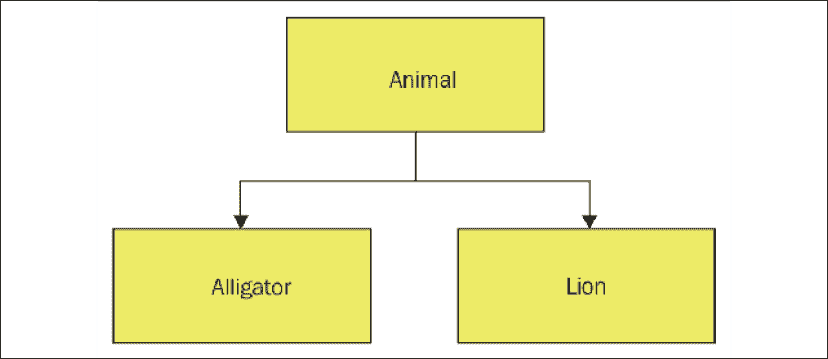
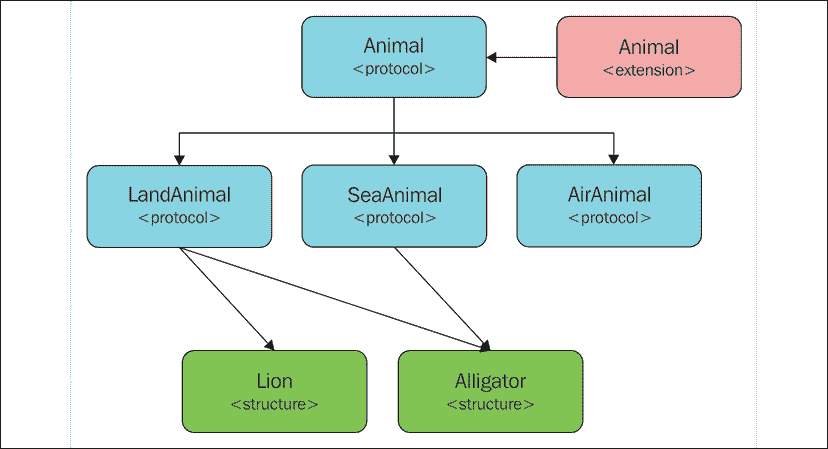

# 协议导向设计

当苹果公司在 2016 年的**全球开发者大会**（**WWDC**）上宣布 Swift 2 时，他们也宣布 Swift 是世界上第一个**协议导向编程**（**POP**）语言。从其名称来看，我们可能会认为 POP 完全是关于协议；然而，这将是错误的假设。POP 不仅仅是关于协议；它实际上是一种不仅编写应用程序，而且思考编程的新方式。

在本章中，我们将涵盖以下主题：

+   面向对象（OOP）和协议导向（POP）设计之间的区别是什么？

+   协议导向设计是什么？

+   协议组合是什么？

+   协议继承是什么？

在 Dave Abrahams 在 2016 年 WWDC 上关于 POP 的演讲之后，互联网上出现了许多关于 POP 的教程，这些教程采用了非常面向对象的方法。通过这个声明，我的意思是这些教程采取的方法集中在用协议和协议扩展替换超类。虽然协议和协议扩展可能是 POP 中两个更为重要的概念，但这些教程似乎遗漏了一些非常重要的概念。

在本章中，我们将比较协议导向设计和面向对象设计，以突出两者之间的概念差异。我们将探讨如何使用协议和协议扩展来替换超类，以及协议导向设计将如何为我们提供一个更干净、更容易维护的代码库。为此，我们将探讨如何以面向对象和协议导向的方式为视频游戏定义动物类型。让我们首先定义我们动物的需求。

# 需求

当我们开发应用程序时，我们通常有一套我们需要针对其进行开发的规范。考虑到这一点，让我们定义我们将在本章中创建的动物类型的规范：

+   我们将有三类动物：陆地、海洋和空中。

+   动物可能是多个类别的成员。例如，鳄鱼可以是陆地和海洋类别的成员。

+   当动物位于与它们所在类别匹配的方格上时，它们可能会攻击和/或移动。

+   动物将开始时拥有一定数量的生命值，如果这些生命值达到 0 或以下，它们将被视为死亡。

在此示例中，我们将定义两种动物，`Lion`和`Alligator`，但我们知道随着游戏的开发，动物类型的数量将会增长。

我们将首先探讨如何使用面向对象的方法来设计动物类型。

# 面向对象设计

在我们开始编写代码之前，让我们创建一个非常基本的图表，展示我们将如何设计**动物**类层次结构。在这个图表中，我们将简单地展示类，而不涉及太多细节。这个图表将帮助我们在大脑中形成类层次结构的图像。*图 10.1*显示了面向对象设计的类层次结构：



图 10.1：动物类层次结构

*图 10.1* 显示我们有一个名为**Animal**的超类，以及两个名为`Alligator`和`Lion`的子类。我们可能会认为，根据三个类别（陆地、空中和海洋），我们想要创建一个更大的类层次结构，其中中间层将包含陆地、空中和海洋动物的类。这将使我们能够将每个动物类别的代码分开；然而，根据我们的要求，这是不可能的。这不可能的原因是任何动物类型都可以是多个类别的成员，而在类层次结构中，每个类只能有一个且仅有一个超类。这意味着`Animal`超类将需要包含为三个类别中每一个所需的代码。

让我们从查看`Animal`超类的代码开始。

我们将从定义`Animal`超类的 10 个属性开始。这些属性将定义动物的类型以及它可以执行的类型攻击/移动。我们还定义了一个属性，它将跟踪动物的剩余生命值。

我们将这些属性定义为`internal`变量。我们将在子类中设置这些属性；然而，我们不想外部实体（除了定义动物的模块之外）更改它们。首选的是将它们作为常量，但在面向对象的方法中；子类不能设置/更改在超类中定义的常量的值。为了使这可行，子类需要与`Animal`超类定义在同一个模块中：

```swift
class Animal {
    internal var landAnimal = false
    internal var landAttack = false
    internal var landMovement = false
    internal var seaAnimal = false 
    internal var seaAttack = false 
    internal var seaMovement = false
    internal var airAnimal = false
    internal var airAttack = false
    internal var airMovement = false
    internal var hitPoints = 0
} 
```

接下来，我们定义一个初始化器，它将设置属性。我们将默认将所有属性设置为`false`，并将生命值设置为`zero`。适当的属性将由子类来设置：

```swift
init() { 
    landAnimal = false
    landAttack = false
    landMovement = false
    airAnimal = false
    airAttack = false
    airMovement = false
    seaAnimal = false
    seaAttack = false
    seaMovement = false
    hitPoints = 0
} 
```

由于我们的属性是内部的，我们需要创建一些获取器方法，以便我们可以检索它们的值。我们还将创建一些额外的方法来检查动物是否存活。当动物受到攻击时，我们还需要另一个方法来扣除生命值：

```swift
func isLandAnimal() -> Bool { 
    return landAnimal
}
func canLandAttack() -> Bool { 
    return landAttack
}
func canLandMove() -> Bool { 
    return landMovement
}
func isSeaAnimal() -> Bool { 
    return seaAnimal
}
func canSeaAttack() -> Bool { 
    return seaAttack
}
func canSeaMove() -> Bool { 
    return seaMovement
}
func isAirAnimal() -> Bool { 
    return airAnimal
}
func canAirAttack() -> Bool { 
    return airAttack
}
func canAirMove() -> Bool { 
    return airMovement
}
func doLandAttack() {} 
func doLandMovement() {}
func doSeaAttack() {} 
func doSeaMovement() {}
func doAirAttack() {} 
func doAirMovement() {}
func takeHit(amount: Int) { 
    hitPoints -= amount
}
func hitPointsRemaining() -> Int { 
    return hitPoints
}
func isAlive() -> Bool {
    return hitPoints > 0 ? true : false
} 
```

现在我们有了`Animal`超类，我们可以创建`Alligator`和`Lion`类，它们将是`Animal`类的子类：

```swift
class Lion: Animal { 
    override init() {
        super.init() landAnimal = true
        landAttack = true
        landMovement = true
        hitPoints = 20
    }
    override func doLandAttack() { 
        print("Lion Attack")
    }
    override func doLandMovement() { 
        print("Lion Move")
    }
}
class Alligator: Animal { 
    override init() {
        super.init()
        landAnimal = true
        landAttack = true
        landMovement = true
        seaAnimal = true
        seaAttack = true
        seaMovement = true
        hitPoints = 35
    }
    override func doLandAttack() { 
        print("Alligator Land Attack")
    }
    override func doLandMovement() { 
        print("Alligator Land Move")
    }
    override func doSeaAttack() { 
        print("Alligator Sea Attack")
    }
    override func doSeaMovement() { 
        print("Alligator Sea Move")
    }
} 
```

正如我们所见，这些类为每个动物设置了所需的功能。`Lion`类包含陆地动物的功能，而`Alligator`类包含陆地和海洋动物的功能。

这种面向对象设计的另一个缺点是我们没有单个点来定义这种动物的类型（空中、陆地或海洋）。当我们复制粘贴或输入代码时，很容易设置错误的标志或添加错误的功能。这可能导致我们拥有像这样的动物：

```swift
class landAnimal: Animal { 
    override init() {
        super.init()
        landAnimal = true
        airAttack = true
        landMovement = true
        hitPoints = 20
    }
    override func doLandAttack() { 
        print("Lion Attack")
    }
    override func doLandMovement() { 
        print("Lion Move")
    }
} 
```

在之前的代码中，我们将`landAnimal`属性设置为 true；然而，我们不小心也将`airAttack`设置为 true。这将给我们一个可以在陆地上移动但不能攻击的动物，因为`landAttack`属性没有被设置。希望我们能在测试中捕捉到这类错误；然而，正如我们将在本章后面看到的那样，面向协议的方法将有助于防止这类编码错误。

由于这两个类都有相同的`Animal`超类，我们可以通过`Animal`超类提供的接口使用多态来访问它们：

```swift
var animals = [Animal]()
animals.append(Alligator())
animals.append(Alligator())
animals.append(Lion())
for (index, animal) in animals.enumerated() { 
    if animal.isAirAnimal() {
        print("Animal at \(index) is Air")
    }
    if animal.isLandAnimal() { 
        print("Animal at \(index) is Land")
    }
    if animal.isSeaAnimal() { 
        print("Animal at \(index) is Sea")
    }
} 
```

我们在这里设计的动物类型是可行的；然而，这种设计有几个缺点。第一个缺点是庞大的单体`Animal`超类。那些熟悉为视频游戏设计角色的人可能意识到这个超类及其子类缺少了多少功能。这是故意的，这样我们就可以专注于设计而不是功能。对于那些不熟悉为视频游戏设计角色的人来说，当我说这个类可能会变得非常大时，请相信我。

另一个缺点是无法在子类可以设置的父类中定义常量。我们可以为父类定义各种初始化器，这些初始化器将正确设置不同动物类别的常量；然而，随着我们添加更多动物，这些初始化器将变得相当复杂且难以维护。建造者模式可以帮助我们进行初始化，但正如我们即将看到的，面向协议的设计会更好。

我要指出的最后一个缺点是使用标志（`landAnimal`、`seaAnimal`和`airAnimal`属性）来定义动物类型，以及动物可以执行攻击和移动的类型。如果我们没有正确设置这些标志，那么动物的行为将不会正确。例如，如果我们把`Lion`类中的`seaAnimal`标志而不是`landAnimal`标志设置，那么狮子将无法在陆地上移动或攻击。相信我，即使是经验最丰富的开发者，也很容易设置错误的标志。

现在我们来看看我们如何以面向协议的方式定义相同的功能。

# 面向协议的设计

就像我们的面向对象设计一样，我们将从一个显示所需类型及其之间关系的图表开始。*图 10.2*展示了我们的面向协议设计：



图 10.2：面向协议的设计

如我们所见，POP 设计与 OOP 设计相当不同。在这个设计中，我们使用了三种使 POP 与 OOP 显著不同的技术。这些技术是协议继承、协议组合和协议扩展。我们在上一章中讨论了协议扩展，但尚未涉及协议继承或组合。理解这些概念很重要，因此在我们进入设计之前，让我们看看协议继承和协议组合是什么。

## 协议继承

协议继承是指一个协议可以继承一个或多个附加协议的要求。这与 OOP 中的类继承类似，但不同的是，我们继承的是要求，而不是功能。我们还可以从多个协议中继承要求，而 Swift 中的类只能有一个超类。让我们首先定义四个协议，分别命名为`Name`、`Age`、`Fur`和`Hair`：

```swift
protocol Name {
    var firstName: String { get set }
    var lastName: String { get set }
}
protocol Age {
    var age: Double { get set }
}
protocol Fur {
    var furColor: String { get set }
}
protocol Hair {
    var hairColor: String { get set }
} 
```

四个协议各有不同的要求。

有一点我想指出。如果你发现自己正在创建具有单一要求的协议（如本例所示），你可能需要重新考虑你的整体设计。协议不应该这样细粒度，因为我们最终会拥有太多的协议，而且它们变得难以管理。我们在这里使用较小的协议作为示例。

现在，让我们看看我们如何使用这些协议和协议继承来创建额外的协议。我们将定义另外两个协议，分别命名为`Person`和`Dog`：

```swift
protocol Person: Name, Age, Hair { 
    var height: Double { get set }
}
protocol Dog: Name, Age, Fur { 
    var breed: String { get set }
} 
```

在这个例子中，任何符合`Person`协议的类型都需要满足`Name`、`Age`和`Hair`协议的要求，以及`Person`协议本身定义的要求。任何符合`Dog`协议的类型都需要满足`Name`、`Age`和`Fur`协议的要求，以及`Dog`协议本身定义的要求。这是协议继承的基础，其中我们可以有一个协议继承一个或多个协议的要求。

协议继承非常强大，因为我们可以定义几个较小的协议，并将它们混合/匹配以创建较大的协议。你需要注意不要创建过于细粒度的协议，因为它们将变得难以维护和管理。

## 协议组合

协议组合允许类型符合多个协议。这是面向协议设计相对于面向对象设计所具有的许多优势之一。在面向对象设计中，一个类只能有一个超类。这可能导致非常庞大且单一的超级类，正如我们在本章的“面向对象设计”部分所看到的。在面向协议设计中，我们鼓励创建多个具有非常具体要求的较小协议。让我们看看协议组合是如何工作的。

让我们在“协议继承”部分的示例中添加另一个协议，命名为`Occupation`：

```swift
protocol Occupation {
    var occupationName: String { get set } 
    var yearlySalary:Double { get set }
    var experienceYears: Double { get set }
} 
```

接下来，让我们创建一个新的类型`Programmer`，它将符合`Person`和`Occupation`协议：

```swift
struct Programmer: Person, Occupation { 
    var firstName: String
    var lastName: String 
    var age: Double
    var hairColor: String 
    var height: Double
    var occupationName: String 
    var yearlySalary: Double 
    var experienceYears: Double
} 
```

在这个示例中，`Programmer`结构符合`Person`和`Occupation`协议的所有要求。请记住，`Person`协议是由`Name`、`Age`、`Hair`和`Person`协议的要求组合而成的；因此，`Programmer`类型需要符合所有这些协议以及`Occupation`协议。

再次提醒大家，不要让你们的协议过于细化。协议继承和组合是非常强大的功能，但如果使用不当也可能导致问题。

协议组合和继承本身可能看起来并不那么强大；然而，当我们结合协议扩展时，就形成了一种非常强大的编程范式。让我们看看这种范式有多强大。

## 协议式设计——整合一切

我们将首先将`Animal`超类重写为一个协议：

```swift
protocol Animal {
    var hitPoints: Int { get set }
} 
```

在`Animal`协议中，我们定义的唯一项目是`hitPoints`属性。如果我们在一个视频游戏中为动物添加所有要求，这个协议将包含所有动物共有的要求。为了与我们的面向对象设计保持一致，我们只需要将`hitPoints`属性添加到这个协议中。

接下来，我们需要添加一个`Animal`协议扩展，它将包含所有符合该协议的类型共有的功能。我们的`Animal`协议扩展将包含以下代码：

```swift
extension Animal {
    mutating func takeHit(amount: Int) { 
        hitPoints -= amount
    }
    func hitPointsRemaining() -> Int { 
        return hitPoints
    }
    func isAlive() -> Bool {
        return hitPoints > 0 ? true : false
    }
} 
```

`Animal`协议扩展包含了我们在面向对象示例中看到的`Animal`超类中的相同`takeHit()`、`hitPointsRemaining()`和`isAlive()`方法。任何符合`Animal`协议的类型将自动继承这三个方法。

现在让我们定义我们的`LandAnimal`、`SeaAnimal`和`AirAnimal`协议。这些协议将分别定义`land`、`sea`和`air`动物的要求：

```swift
protocol LandAnimal: Animal { 
    var landAttack: Bool { get }
    var landMovement: Bool { get }
    func doLandAttack() 
    func doLandMovement()
}
protocol SeaAnimal: Animal { 
    var seaAttack: Bool { get }
    var seaMovement: Bool { get }
    func doSeaAttack()
    func doSeaMovement()
}
protocol AirAnimal: Animal { 
    var airAttack: Bool { get }
    var airMovement: Bool { get }
    func doAirAttack()
    func doAirMovement()
} 
```

与面向对象设计中的`Animal`超类不同，这三个协议只包含特定类型动物所需的功能。每个协议只包含四行代码，而面向对象示例中的`Animal`超类包含的内容则显著更多。这使得我们的协议设计更容易阅读和管理。协议设计也更为安全，因为各种动物类型的功能被隔离在其各自的协议中，而不是嵌入在一个巨大的超类中。我们还能避免使用标志来定义动物类别，而是通过动物符合的协议来定义类别。

在完整的设计中，我们可能需要为每种动物类型添加一些协议扩展，但再次强调，为了与我们的面向对象设计保持一致，我们在这里的示例中不需要它们。

现在，让我们看看我们如何使用面向协议的设计来创建我们的`Lion`和`Alligator`类型：

```swift
struct Lion: LandAnimal { 
    var hitPoints = 20 
    let landAttack = true
    let landMovement = true
    func doLandAttack() { 
        print("Lion Attack")
    }
    func doLandMovement() { 
        print("Lion Move")
    }
}
struct Alligator: LandAnimal, SeaAnimal { 
    var hitPoints = 35
    let landAttack = true 
    let landMovement = true 
    let seaAttack = true 
    let seaMovement = true
    func doLandAttack() { 
        print("Alligator Land Attack")
    }
    func doLandMovement() { 
        print("Alligator Land Move")
    }
    func doSeaAttack() { 
        print("Alligator Sea Attack")
    }
    func doSeaMovement() { 
        print("Alligator Sea Move")
    }
} 
```

注意，我们指定`Lion`类型符合`LandAnimal`协议，而`Alligator`类型符合`LandAnimal`和`SeaAnimal`协议。正如我们之前所看到的，一个类型符合多个协议被称为**协议组合**，这正是我们能够使用较小的协议而不是像面向对象示例中那样使用一个巨大的单体超类的原因。

`Lion`和`Alligator`类型都源自`Animal`协议；因此，它们将继承`Animal`协议扩展中添加的功能。如果我们的动物类型协议也有扩展，那么它们也会继承那些扩展添加的功能。通过协议继承、组合和扩展，我们的具体类型只包含它们所符合的特定动物类型所需的功能，这与面向对象设计不同，在面向对象设计中，每个动物都会包含从庞大的单一超类中继承的所有功能。

由于`Lion`和`Alligator`类型源自`Animal`协议，我们仍然可以使用多态性，就像我们在面向对象示例中所做的那样。让我们看看这是如何工作的：

```swift
var animals = [Animal]()
animals.append(Alligator())
animals.append(Alligator())
animals.append(Lion())
for (index, animal) in animals.enumerated() { 
    if let _ = animal as? AirAnimal {
        print("Animal at \(index) is Air")
    }
    if let _ = animal as? LandAnimal { 
        print("Animal at \(index) is Land")
    }
    if let _ = animal as? SeaAnimal { 
        print("Animal at \(index) is Sea")
    }
} 
```

在这个例子中，我们创建了一个将包含名为`animals`的`Animal`类型的数组。然后我们创建了两个`Alligator`类型的实例和一个`Lion`类型的实例，并将它们添加到`animals`数组中。最后，我们使用`for-in`循环遍历数组，根据实例符合的协议打印出动物类型。

## 使用协议的 where 语句

使用协议，我们能够使用`where`语句来过滤我们类型的实例。例如，如果我们只想获取符合`SeaAnimal`协议的实例，我们可以创建一个如下所示的`for`循环：

```swift
for (index, animal) in animals.enumerated() where animal is SeaAnimal { 
    print("Only Sea Animal: \(index)")
} 
```

这将只检索符合`SeaAnimal`协议的动物。这比我们在面向对象设计示例中使用标志更安全。

# 结构体与类

你可能已经注意到，在面向对象设计中我们使用了类，而在面向协议的设计示例中我们使用了结构体。类是引用类型，是面向对象编程的支柱之一，每个主要的面向对象编程语言都使用它们。对于 Swift，苹果公司表示我们应该优先选择值类型（结构体）而不是引用类型（类）。虽然对于有丰富面向对象编程经验的人来说这看起来可能有些奇怪，但这个建议有几个很好的理由。

在我看来，使用结构体（值类型）而不是类的主要原因是我们获得性能提升。值类型不会产生引用类型所承担的额外引用计数开销。值类型也存储在栈上，与存储在堆上的引用类型相比，提供了更好的性能。还值得一提的是，在 Swift 中复制值相对便宜。

请记住，随着我们的值类型变得越来越大，复制的性能成本可能会抵消值类型带来的其他性能优势。在 Swift 标准库中，苹果公司已经实现了写时复制行为，以减少复制大型值类型所产生的高额开销。

使用写时复制行为，当我们将值类型赋值给新变量时，并不会立即创建其新副本。复制操作会推迟到其中一个实例改变值时才进行。这意味着，如果我们有一个包含一百万个数字的数组，当我们把该数组传递给另一个数组时，我们不会复制这 一百万个数字，直到其中一个数组发生变化。这可以大大减少从复制值类型实例所产生的高额开销。

值类型也比引用类型更安全，因为我们没有多个引用指向同一个实例，正如我们在第十八章“内存管理”中将要讨论的强引用循环那样。值类型也更安全，因为我们不会因为常见的编程错误（如内存泄漏）而产生内存泄漏，例如我们将要讨论的强引用循环。

如果你对本节中讨论的一些项目不理解，请不要担心。需要理解的是，值类型，如结构体，更安全，并且在大多数情况下，与引用类型（如类）相比，在 Swift 中提供更好的性能。

# 摘要

随着我们阅读本章并观察面向协议设计相对于面向对象设计的优势，我们可能会认为面向协议设计明显优于面向对象设计。然而，这个假设并不完全正确。

面向对象设计自 20 世纪 70 年代以来一直存在，是一种经过验证的编程范式。面向协议的设计是新兴的，旨在纠正面向对象设计的一些问题。

面向对象和面向协议的设计有相似的哲学，例如创建自定义类型来模拟现实世界对象，以及多态性以使用单个接口与多个类型交互。不同之处在于这些哲学是如何实现的。

对我来说，使用面向协议设计的项目代码库比使用面向对象设计的项目更安全、更容易阅读、更容易维护。这并不意味着我将完全停止使用面向对象设计。我仍然可以在某些情况下看到类层次结构的需要。

记住，当我们设计我们的应用程序时，我们应该始终使用适合的工具来完成工作。我们不想用链锯来切割一块 2 x 4 英寸的木材，但同样，我们也不想用电锯来砍伐树木。因此，赢家是那些可以选择使用不同编程范式而不是仅限于一种的程序员。在下一章中，我们将探讨泛型。
