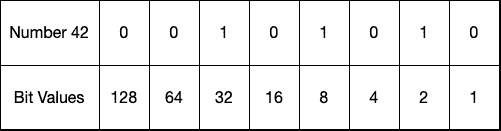
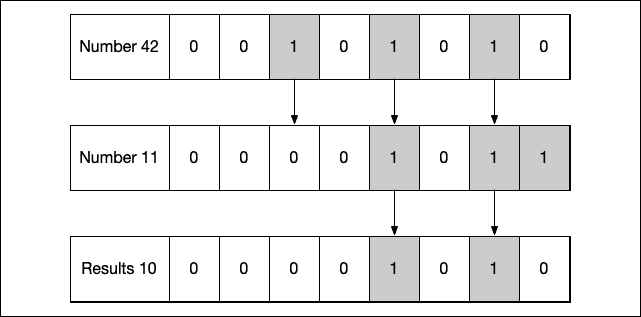
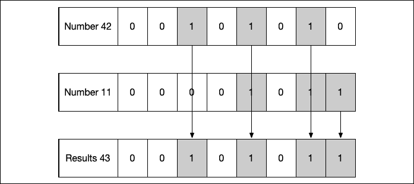
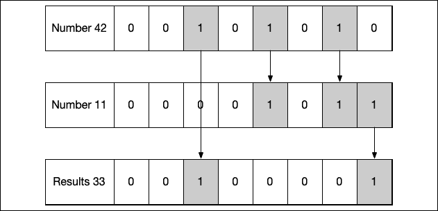
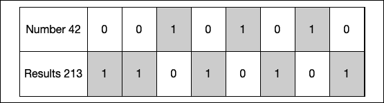
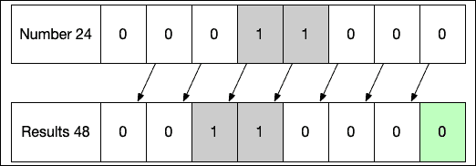
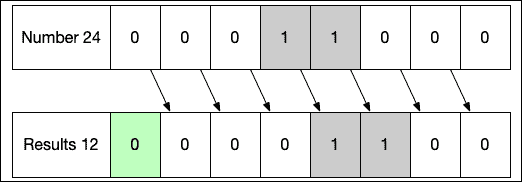
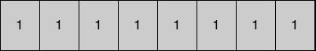
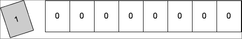

# 高级和自定义运算符

当我开始学习如何编程计算机时，我首先学到的就是如何使用运算符。这些包括基本的运算符，如赋值和算术运算符，这些在*第三章*，*了解变量、常量、字符串和运算符*中有所介绍。直到我后来学习 C 语言编程时，我才了解到高级运算符，如位运算符。虽然高级运算符不如基本运算符流行，但使用得当的话，它们可以非常强大。如果你打算编写使用基于 C 的低级库的应用程序，高级运算符特别有用。

在本章中，你将学习：

+   如何使用位运算符

+   溢出运算符的作用

+   如何编写运算符方法

+   如何创建自己的自定义运算符

在*第三章*，*了解变量、常量、字符串和运算符*中，我们探讨了最常见的运算符，如赋值、比较和算术运算符。虽然这些运算符在几乎每个有用的应用程序中都会使用，但还有一些不太常用但当你知道如何使用时可以非常强大的运算符。在本章中，我们将探讨一些这些更高级的运算符，从位运算符开始，但首先，我们需要了解比特和字节是什么。

# 比特和字节

计算机以二进制位的形式思考。这些数字被称为**比特**，并且只能有两个值：*0*或*1*，在电气术语中代表*开*或*关*。比特非常小，单独使用时用途有限，除了用作真/假标志。它们被组合成 4、8、16、32 或 64 位的组合，以形成计算机可以使用的数据。

在计算机术语中，**字节**是一组 8 位。如果我们从字节的角度思考，数字 42 表示如下，其中最低有效位在右边，最高有效位在左边：



图 15.1：以比特表示的数字 42

*图 15.1*的顶部行显示了 8 位字节中每个比特的值，即开或关，等于数字**42**。第二行显示了字节中每个比特所表示的值。我们可以看到，对于数字**42**，值为**32**、**8**和**2**的比特被设置。然后我们可以将这些值相加，看到它们等于 42：32+8+2 = 42。这意味着 8 位字节的值为 42。

默认情况下，Swift 使用 64 位数字；例如，标准的`Int`类型是 64 位。在本章中，我们将主要使用`UInt8`类型，它是一个无符号整数，只有 8 位或 1 字节。请注意，64 位类型以与字节相同的方式存储比特；它们只是包含更多的比特。

在上一个例子中，最低有效位在右边，而最高有效位在左边。这是位在图中通常表示的方式。然而，在现实世界的计算机架构中，位可能存储在内存中，其中最高有效位或最低有效位存储在最低的内存地址中。让我们看看这意味着什么。

# 端序

在计算机术语中，一个架构的 **端序** 是位在内存中存储的顺序。端序表示为大端序或小端序。在一个被认为是小端序的架构中，最低有效位存储在最低的内存地址中，而在被认为是大端序的架构中，最高有效位存储在最低的内存地址中。

当使用 Swift 标准库，以及在大多数情况下仅使用 Swift 语言本身时，你不需要担心位是如何存储的。如果你需要与低级别的 C 库一起工作，跨多个架构，那么你可能需要了解信息在系统中的存储方式，因为你可能正在处理指向内存位置的指针。

当你需要担心架构的端序时，比如当我们需要与低级别的 C 库交互时，Swift 确实为整数提供了内置的实例属性，名为 `littleEndian` 和 `bigEndian`。以下示例展示了如何使用这些属性：

```swift
let en = 42
en.littleEndian
en.bigEndian 
```

`en.littleEndian` 行将返回数字 42 的小端序表示，而 `en.bigEndian` 行将返回数字 42 的大端序表示。

英特尔处理器和苹果自己的 A 处理器的端序都是小端序；因此，在本章中，我们将假设一切都是小端序。

让我们看看位运算符是什么以及我们如何使用它们。

# 位运算符

**位运算符**使我们能够操作值的单个位。位运算符的一个优点是它们直接由处理器支持，因此可以比基本的算术运算（如乘法和除法）快得多。我们将在本章后面看到如何使用位移运算符进行基本的乘法和除法。

在我们查看位运算符能做什么之前，我们需要有能力显示我们变量的二进制表示，以便看到运算符在做什么。让我们看看我们可以这样做的一些方法。

## 打印二进制数

苹果为我们提供了`String`类型的通用初始化器，它将提供给定值的字符串表示。这个初始化器是`init(_:radix:uppercase:)`。默认情况下，`uppercase`设置为`false`，`radix`设置为`10`。`radix`定义了将要显示的数字基数，其中`10`代表十进制。为了看到二进制表示，我们需要将其设置为`2`。我们可以使用这个初始化器来显示类似以下这样的值的二进制表示：

```swift
let en = 42
print(String(en, radix:2))
print(String(53, radix:2)) 
```

之前的代码将显示以下结果：

```swift
101010
110101 
```

这里，`101010`是数字`42`的二进制表示，`110101`是数字`53`的二进制表示。这工作得非常好；然而，它没有显示前导零。例如，如果我们比较`53`和`123456`的二进制表示，如下面的代码所示：

```swift
print(String(53, radix:2))
print(String(123456, radix:2)) 
```

我们得到的结果看起来像这样：

```swift
110101
11110001001000000 
```

这可能比较难以比较。当我需要轻松地看到数字的二进制表示时，我通常将以下扩展放入我的代码库中：

```swift
extension BinaryInteger {
    func binaryFormat(_ nibbles: Int) -> String {
        var number = self
        var binaryString = ""
        var counter = 0
        let totalBits = nibbles*4
        for _ in (1...totalBits).reversed() {
            binaryString.insert(contentsOf: "\(number & 1)", at:
binaryString.startIndex)
            number >>= 1
            counter += 1
            if counter % 4 == 0 && counter < totalBits {
                binaryString.insert(contentsOf: " ", at: binaryString.startIndex)
            }
        }
        return binaryString
    }
} 
```

如果你现在还不理解这段代码是如何工作的，这是完全可以的，因为位移运算符还没有被解释。一旦在本章后面解释了它们，你将能够理解它是如何工作的。

这个扩展将接受一个整数，并返回该数字的二进制表示，带有适当数量的半字节。在本章前面提到，一个字节有 8 位；半字节是字节的一半或 4 位。在返回的字符串中，这段代码将在每个半字节之间放置一个空格，以便更容易阅读。我们可以像以下代码所示使用这个扩展：

```swift
print(53.binaryFormat(2))
print(230.binaryFormat(2)) 
```

使用这段代码，我们显示了数字`53`和`230`在两个半字节中的二进制表示。以下结果显示了将打印到控制台的内容：

```swift
0011 0101
1110 0110 
```

现在我们已经对位、字节、半字节和字节序有了非常基本的了解，并且能够以二进制格式显示数字，让我们来看看位运算符，从位与运算符开始。

## 位与运算符

位与运算符（`&`）接受两个值，并返回一个新值，其中新值中的位仅当两个输入值的对应位都设置为 1 时才设置为 1。与运算符可以读作：如果第一个值的位与第二个值的位都是 1，则将结果值的对应位设置为 1。让我们通过看看如何对数字 42 和 11 进行位与运算来了解它是如何工作的：



图 15.2：AND 运算符

如此图所示，从右数第二位和第四位都是 1，因此 AND 运算的结果将那些位设置为 1，得到输出值**10**。现在让我们看看代码中是如何实现的：

```swift
let numberOne: Int8 = 42
let numberTwo: Int8 = 11
print("\(numberOne) = \(numberOne.binaryFormat(2))")
print("\(numberTwo) = \(numberTwo.binaryFormat(2))")
let andResults = numberOne & numberTwo
print("\(andResults) = \(andResults.binaryFormat(2))") 
```

之前的代码将两个整数设置为`42`和`11`。然后它使用`binaryFormat`扩展在控制台打印数字的二进制表示，以两个十六进制位为单位。然后它对整数执行按位 AND 运算并将结果的二进制表示打印到控制台。以下结果将被打印到控制台：

```swift
42 = 0010 1010
11 = 0000 1011
10 = 0000 1010 
```

如我们所见，代码的结果与图表中显示的相同，结果为`10`。现在让我们看看按位 OR 运算符。

## 按位 OR 运算符

按位 OR 运算符（`|`）接受两个值并返回一个新值，其中结果的位仅当任一或两个值的对应位设置为 1 时才设置为 1。OR 运算读作：如果第一个值的位或第二个值的位为 1，则将结果中的位设置为 1。让我们看看我们如何对数字 42 和 11 进行按位 OR 运算：



图 15.3：OR 运算符

如此图表所示，从右数起的第一、第二、第四和第六位在其中一个或两个值中设置为 1，因此 OR 运算的结果将所有这些位都设置为 1。现在让我们看看这在代码中是如何工作的：

```swift
let numberOne: Int8 = 42
let numberTwo: Int8 = 11
print("\(numberOne) = \(numberOne.binaryFormat(2))")
print("\(numberTwo) = \(numberTwo.binaryFormat(2))")
let orResults = numberOne | numberTwo
print("\(orResults) = \(orResults.binaryFormat(2))") 
```

之前的代码将两个整数设置为`42`和`11`。然后它使用`binaryFormat`扩展在控制台打印数字的二进制表示，以两个十六进制位为单位。然后它对整数执行按位 OR 运算并打印结果的二进制表示。以下结果将被打印到控制台：

```swift
42 = 0010 1010
11 = 0000 1011
43 = 0010 1011 
```

如我们所见，代码的结果与*图 15.3*中显示的相同，结果为`43`。现在让我们看看按位 XOR 运算符。

## 按位 XOR 运算符

按位 XOR 运算符（`^`）接受两个值并返回一个新值，其中新值的位仅当任一但不是两个输入值的对应位设置为 1 时才设置为 1。XOR 运算符读作：如果第一个值的位或第二个值的位为 1，但不是两个都为 1，则将结果中的位设置为 1。让我们看看我们如何对数字 42 和 11 进行按位 XOR 运算：



图 15.4：XOR 运算符

如此图表所示，对于两个数，从右数起的第二和第四位都设置为**1**，因此在结果中这些位没有被设置。然而，数字**42**中的第六位被设置为**1**，而数字**11**中的第一位被设置为**1**，因此在这些结果中这些位被设置。现在让我们看看这在代码中是如何工作的：

```swift
let numberOne: Int8 = 42
let numberTwo: Int8 = 11
print("\(numberOne) = \(numberOne.binaryFormat(2))")
print("\(numberTwo) = \(numberTwo.binaryFormat(2))")
let xorResults = numberOne ^ numberTwo
print("\(xorResults) = \(xorResults.binaryFormat(2))") 
```

之前的代码将两个整数设置为`42`和`11`。然后使用`binaryFormat`扩展将数字的二进制表示打印到两个四分位上。接着对整数执行按位异或操作，并打印结果的二进制表示。以下结果将被打印到控制台：

```swift
42 = 0010 1010
11 = 0000 1011
33 = 0010 0001 
```

如我们所见，代码的结果与图表中显示的相同，结果为`33`。现在让我们看看按位非运算符。

## 按位非运算符

按位非运算符（`~`）与其他逻辑运算符不同，因为它只接受一个值。按位非运算符将返回一个所有位都被反转的值。这意味着输入值中设置为 1 的任何位在结果值中将被设置为 0，而输入值中设置为 0 的任何位在结果值中将被设置为 1。让我们看看给定 42 这个值会如何：



图 15.5：非运算符

图表说明了当我们执行按位非操作时，结果值中的所有位都将与原始值中的位相反。让我们看看代码中的样子：

```swift
let numberOne: Int8 = 42
let notResults = ~numberOne
print("\(notResults) = \(notResults.binaryFormat(2))") 
```

之前的代码对`numberOne`变量的值执行了非操作。以下结果将被打印到控制台：

```swift
-43 = 1101 0101 
```

注意结果是一个负数。这是因为整数是有符号数。在有符号数中，最高有效位表示该数是正数还是负数。通过所有位反转，非操作后，负数将始终变成正数，而正数将始终变成负数。

现在我们已经了解了逻辑按位运算符，让我们来看看按位移位运算符。

## 按位移位运算符

Swift 提供了两个按位移位运算符，即按位左移运算符（`<<`）和按位右移运算符（`>>`）。这些运算符将所有位向左或向右移动指定的位数。移位运算符的效果是乘以（左移运算符）或除以（右移运算符）2 的因子。通过将位向左移动一位，你将值翻倍，而将位向右移动一位将值减半。让我们看看这些运算符是如何工作的，从左移运算符开始：



图 15.6：左移运算符

使用左移运算符，原始值中的所有位都向左移动一位，最高有效位掉落且不计入最终结果。结果中的最低有效位始终被设置为 0。现在让我们看看右移操作：



图 15.7：右移运算符

使用右移运算符，原始值中的所有位都向右移动一个位置，最低有效位掉落。结果中的最高有效位始终被设置为 0。

现在让我们看看这在代码中是什么样子：

```swift
let numberOne: UInt8 = 24
let resultsLeft = numberOne << 1
let resultsRight = numberOne >> 1
let resultsLeft3 = numberOne << 3
let resultsRight4 = numberOne >> 4
print("24  \(numberOne.binaryFormat(2))")
print("<<1 \(resultsLeft.binaryFormat(2))")
print(">>1 \(resultsRight.binaryFormat(2))")
print("<<3 \(resultsLeft3.binaryFormat(2))")
print(">>4 \(resultsRight4.binaryFormat(2))") 
```

在这段代码中，我们首先将一个变量设置为数字`24`。然后我们使用左移运算符将位向左移动一个位置。移位运算符后面的数字定义了移动的位置数。下一行将位向右移动一个位置，下一行将位向左移动三个位置，下一行将位向右移动四个位置。最后的五行将结果打印到控制台。如果你运行这段代码，你应该看到以下结果：

```swift
24  0001 1000
<<1 0011 0000
>>1 0000 1100
<<3 1100 0000
>>4 0000 0001 
```

观察结果，我们可以看到位根据所使用的移位运算符向左或向右移动。在最后一行，我们可以看到当我们向右移动四个位置时，只有一个位被设置为`1`而不是两个。这是因为原始数字从右数第四位的位实际上已经掉落了。如果我们向右移动五个位置，原始数字中设置为`1`的两个位都会掉落，我们就会剩下全部为零。

现在让我们看看溢出运算符。

# 溢出运算符

Swift 的核心设计是为了安全。这些安全机制之一是当变量的类型太小无法容纳时，无法将一个数插入到变量中。例如，以下代码将抛出以下错误：`算术运算 '255 + 1'（在类型 'UInt8' 上）导致溢出`：

```swift
let b: UInt8 = UInt8.max +1 
```

抛出错误的原因是我们试图将一个数加到`UInt8`能持有的最大数上。这种错误检查可以帮助防止我们应用程序中意外且难以追踪的问题。让我们花点时间看看如果 Swift 在溢出发生时不抛出错误会发生什么。在`UInt8`变量中，它是一个 8 位的无符号整数，数字 255 是这样存储的，其中所有的位都设置为 1：



图 15.8：255 的二进制表示

现在如果我们给这个数加 1，新的数字将这样存储：



图 15.9：尝试表示 256 时的溢出

注意，表示`UInt8`数字的 8 位都是零，而最高位的`1`掉落或溢出，因为我们只能存储 8 位。在这种情况下，当我们给数字 255 加 1 时，如果没有溢出错误检查，结果中存储的数字将是 0。这可能导致我们代码中非常意外的行为，难以追踪。

如果这是我们想要的行为，Swift 确实提供了三个溢出操作符，允许我们选择这种行为。这些是溢出加法操作符（`&+`）、溢出减法操作符（`&-`）和溢出乘法操作符（`&*`）。以下代码显示了这些操作符的工作方式：

```swift
let add: UInt8 = UInt8.max &+ 1
let sub: UInt8 = UInt8.min &- 1
let mul: UInt8 = 42 &* 10
print("add: \(add): \(add.binaryFormat(2))")
print("sub: \(sub): \(sub.binaryFormat(2))")
print("mul: \(mul): \(mul.binaryFormat(2))") 
```

在此代码中，我们将 1 加到`UInt8`类型的最大值 255 上，从`UInt8`类型的最低值 0 减去 1，然后将`42`乘以`10`，其结果大于`UInt8`类型的 255 最大值。打印到控制台的结果是：

```swift
add: 0: 0000 0000
sub: 255: 1111 1111
mul: 164: 1010 0100 
```

从结果中我们可以看出，当我们将 1 加到`UInt8`类型的最大值上时，结果是`0`。当我们从`UInt8`类型的最低值减去 1 时，结果是`255`（`UInt8`类型的最大值）。最后，当我们用`42`乘以`10`，这通常是我们的数学老师会告诉我们的结果是 420，但实际上我们得到了`164`，因为发生了溢出。

现在我们来看看如何使用操作符方法将操作符添加到我们的自定义类型中。

# 操作符方法

操作符方法使我们能够向类和结构体添加标准 Swift 操作符的实现。这也被称为操作符重载。这是一个非常有用的特性，因为它使我们能够使用已知的操作符为我们自定义类型提供常用功能。我们将看看如何做到这一点，但首先，让我们创建一个名为`MyPoint`的自定义类型：

```swift
struct MyPoint {
    var x = 0
    var y = 0
} 
```

`MyPoint`结构体定义了一个图表上的二维点。现在让我们向这个类型添加三个操作符方法。我们将添加的操作符是加法操作符（`+`）、加法赋值操作符（`+=`）和逆操作符（`-`）。加法操作符和加法赋值操作符是中缀操作符，因为操作中有左操作数（值）和右操作数（值），而逆操作符是前缀操作符，因为它用于单个值之前。我们还有后缀操作符，它们用于单个值的末尾：

```swift
extension MyPoint {
    static func + (left: MyPoint, right: MyPoint) -> MyPoint {
        return MyPoint(x: left.x + right.x, y: left.y + right.y)
    }
    static func += (left: inout MyPoint, right: MyPoint) {
        left.x += right.x
        left.y += right.y
    }
    static prefix func -(point: MyPoint) -> MyPoint {
        return MyPoint(x: -point.x, y: -point.y)
    }
} 
```

当我们将操作符方法添加到我们的类型中时，我们使用操作符符号作为方法名称，将它们添加为静态函数。当我们添加前缀或后缀操作符时，我们还在函数声明之前包含`prefix`或`postfix`关键字。

加法操作符是一个中缀操作符；因此，它接受两个输入参数，都是`MyPoint`类型的。一个参数是为加法操作符左侧的`MyPoint`实例，另一个参数是为加法操作符右侧的`MyPoint`实例。

加法赋值运算符也是一个中缀运算符；因此，它也接受两个`MyPoint`类型的输入参数。与加法运算符的主要区别在于，加法运算的结果被赋值给加法赋值运算符左侧的`MyPoint`实例。因此，这个参数被指定为`inout`参数，以便可以在该实例内返回结果。

我们添加的最后一个运算符方法是逆运算符。这是一个前缀运算符，用于`MyPoint`类型的实例之前；因此，它只接受一个`MyPoint`类型的参数。让我们看看这些运算符是如何工作的：

```swift
let firstPoint = MyPoint(x: 1, y: 4)
let secondPoint = MyPoint(x: 5, y: 10)
var combined = firstPoint + secondPoint
print("\(combined.x), \(combined.y)")
combined += firstPoint
print("\(combined.x), \(combined.y)")
let inverse = -combined
print("\(inverse.x), \(inverse.y)") 
```

在这段代码中，我们首先定义了两个点，然后使用我们创建的加法运算符将它们相加。这个运算符的结果被放入新的`combined`实例中，该实例是`MyPoint`类型。`combined`实例将包含`x`值为 6 和`y`值为 14。

我们接着使用我们创建的加法赋值运算符将`firstPoint`实例中的值添加到`combined`实例中的值。这个操作的结果被放入`MyPoint`类型的`combined`实例中。现在`combined`实例包含`x`值为 7 和`y`值为 14。

最后，我们使用`combined`实例的逆运算符来反转值，并将新值保存到`MyPoint`类型的`inverse`实例中。`inverse`实例包含`x`值为-7 和`y`值为-18。

我们不仅限于使用当前运算符，还可以创建自己的自定义运算符。让我们看看我们如何做到这一点。

# 自定义运算符

自定义运算符使我们能够在 Swift 语言提供的标准运算符之外声明和实现自己的运算符。新的运算符必须使用`operator`关键字全局声明。它们还必须使用`infix`、`prefix`或`postfix`关键字进行定义。一旦一个运算符被全局定义，我们就可以使用前一个章节中展示的运算符方法将其添加到我们的类型中。让我们通过添加两个新的运算符来查看这一点：`•`，我们将用它来相乘两个点，以及`••`，它将用于平方一个值。我们将把这些运算符添加到我们在上一节中创建的`MyPoint`类型中。

`•`符号可以在运行 macOS 的计算机上通过按住*option*键并按下数字*8*来输入。

我们需要做的第一件事是全局声明运算符。这可以通过以下代码完成：

```swift
infix operator •
prefix operator •• 
```

注意，我们定义了它是什么类型的运算符（`infix`、`prefix`或`postfix`），然后是`operator`关键字，然后是用于运算符的符号。现在我们可以像使用正常的运算符一样使用它们，针对我们的`MyPoint`类型：

```swift
extension MyPoint {
    static func • (left: MyPoint, right: MyPoint) -> MyPoint {
        return MyPoint(x: left.x * right.x, y: left.y * right.y)
    }

    static prefix func •• (point: MyPoint) -> MyPoint {
        return MyPoint(x: point.x * point.x, y: point.y * point.y)
    }
} 
```

这些新的自定义操作符就像我们添加标准操作符一样，被添加到`MyPoint`类型中，使用静态函数。我们现在能够像使用标准操作符一样使用这些操作符：

```swift
let firstPoint = MyPoint(x: 1, y: 4)
let secondPoint = MyPoint(x: 5, y: 10)
let multiplied = firstPoint • secondPoint
print("\(multiplied.x), \(multiplied.y)")
let squared = ••secondPoint
print("\(squared.x), \(squared.y)") 
```

在第一行，我们使用`•`操作符将两个`MyPoint`类型的实例相乘。结果被放入`MyPoint`类型的乘积实例中。现在，乘积实例将包含`x`的值为 5 和`y`的值为 40。

然后，我们使用`••`操作符平方`secondPoint`实例的值，并将新值放入平方实例中。现在，`squared`实例将包含`x`的值为 25 和`y`的值为 100。

# 摘要

在本章中，我们探讨了如何使用高级位与、或、异或和非操作符来操作存储在变量中的值的位。我们还探讨了如何使用左移和右移操作符将位向左和向右移动。然后我们看到如何使用溢出操作符来改变加法、减法和乘法的默认行为，以便在操作返回超出类型的最大值或小于最小值时不会抛出错误。

在本章的后半部分，我们看到了如何向类型添加操作符方法，这使得我们能够使用 Swift 提供的标准操作符与我们的自定义类型一起使用。我们还看到了如何创建我们自己的自定义操作符。

在下一章中，我们将探讨如何使用大中央调度和操作队列向我们的应用程序代码中添加并发性和并行性。
