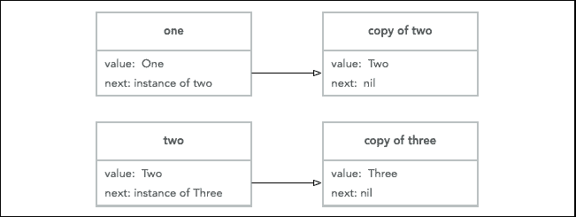
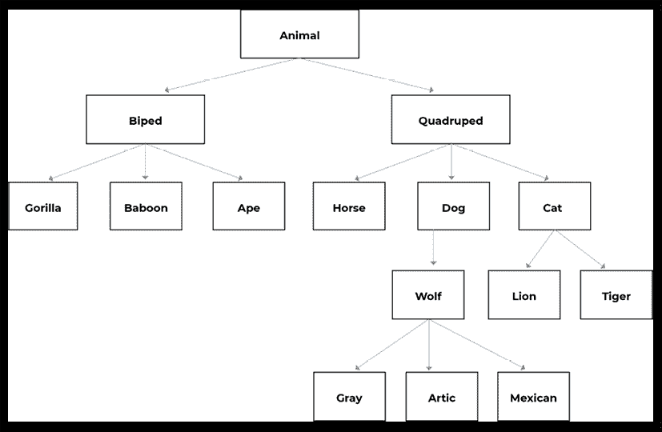

# 自定义值类型

在大多数传统的面向对象编程语言中，我们创建类（引用类型）作为我们对象的蓝图。在 Swift 中，与其它面向对象语言不同，结构体具有与类相似的大部分功能，然而，它们是值类型。苹果公司表示，我们应该优先选择值类型，如结构体，而不是引用类型，但引用类型和值类型之间有什么区别呢？

在本章中，你将探索以下主题：

+   值类型和引用类型之间的区别

+   为什么递归数据类型不能作为值类型创建

+   如何在你的自定义类型中实现写时复制

+   如何遵守 `Equatable` 协议

正如我们在第八章 *类、结构体和协议* 中所看到的，我们有能力将我们的自定义类型创建为引用类型（或类）或值类型（或结构体）。让我们回顾一下这两种类型之间的区别，因为在确定我们自定义类型使用哪种类型时，理解这些区别非常重要。

# 值类型和引用类型

结构体是值类型；当我们在我们应用程序中传递结构体的实例时，我们传递的是结构体的副本，而不是原始结构体。类是引用类型；因此，当我们在我们应用程序中传递类的实例时，传递的是原始实例的引用。理解这种区别非常重要。我们在这里将提供一个非常高级的概述，但在第十八章 *内存管理* 中将提供更多详细信息。

当我们在应用程序中传递结构体时，我们传递的是结构体的副本，而不是原始结构体。这意味着函数会得到结构体自己的副本，它可以按需更改，而不会影响结构体的原始实例。

当我们在应用程序中传递类的实例时，我们传递的是类的原始实例的引用，因此，对类的实例所做的任何更改都会持续存在。

为了说明值类型和引用类型之间的区别，让我们考察一个现实世界的对象：一本书。如果我们有一个朋友想阅读 *Mastering Swift 5.3, Sixth Edition*，我们可以为他们购买自己的副本，或者分享我们的。

如果我们为我们朋友购买了他们自己的书，那么他们在书中做的任何笔记都会保留在他们自己的书中，而不会反映在我们的书中。这就是结构体和变量按值传递的工作方式。在函数内部对结构体或变量所做的任何更改都不会反映到结构体或变量的原始实例上。

如果我们分享我们的书，那么当书归还给我们时，书中所做的任何笔记都会保留在书中。这就是按引用传递的工作方式。对类的实例所做的任何更改在函数退出时都会保留。

当我们传递一个值类型的实例时，我们实际上是在传递该实例的一个副本。你可能想知道当大值类型从一个代码部分传递到另一个代码部分时，其性能如何。对于可能变得非常大的结构，我们可以使用写时复制（copy-on-write）。

前一段落的解释相当直接；然而，这是一个我们必须理解的重要概念。在本节中，我们将检查值类型和引用类型之间的差异，以便我们知道何时使用每种类型。

让我们从创建两个类型开始；一个是结构（或值类型），另一个是类（或引用类型）。我们将在这部分使用这些类型来演示值类型和引用类型之间的差异。我们将要检查的第一个类型名为`MyValueType`。我们将使用结构来实现`MyValueType`，这意味着它是一个值类型，正如其名称所暗示的：

```swift
struct MyValueType { 
    var name: String
    var assignment: String 
    var grade: Int
} 
```

在`MyValueType`中，我们定义了三个属性。其中两个属性是`String`类型（`name`和`assignment`），另一个是`Integer`类型（`grade`）。现在，让我们看看我们如何将这个实现为一个类：

```swift
class MyReferenceType { 
    var name: String
    var assignment: String 
    var grade: Int
    init(name: String, assignment: String, grade: Int) { 
        self.name = name
        self.assignment = assignment 
        self.grade = grade
    }
} 
```

`MyReferenceType`类型定义了与`MyValueType`类型相同的三个属性，然而，我们需要在`MyReferenceType`类型中定义一个初始化器，而在`MyValueType`类型中我们不需要定义。这是因为结构为我们提供了一个默认初始化器，如果未提供默认初始化器，它将初始化所有需要初始化的属性。

让我们看看我们如何使用这些类型。以下代码显示了如何创建这些类型的实例：

```swift
var ref = MyReferenceType(name: "Jon", assignment: "Math Test 1", grade: 90)
var val = MyValueType(name: "Jon", assignment: "Math Test 1", grade: 90) 
```

如此代码所示，结构的实例与类的实例的创建方式完全相同。能够使用相同的格式来创建结构和类的实例是有好处的，因为它使我们的生活更简单；然而，我们确实需要记住，值类型的操作方式与引用类型不同。让我们来探讨这个问题；我们需要做的第一件事是创建两个函数，这两个函数将改变两种类型实例的成绩：

```swift
func extraCreditReferenceType(ref: MyReferenceType, extraCredit: Int) {
    ref.grade += extraCredit
}
func extraCreditValueType(val: MyValueType, extraCredit: Int) { 
    val.grade += extraCredit
} 
```

这些函数中的每一个都接受我们类型的一个实例和一个额外的学分。在函数内部，我们将额外的学分添加到成绩中。如果我们尝试使用此代码，我们将在`extraCreditValueType()`函数中收到一个错误，告诉我们可变操作的左侧不可变。这是因为值类型参数默认是不可变的，因为函数接收的是参数的不可变副本。

使用这样的值类型可以保护我们免受意外更改实例的影响；这是因为实例的范围限定在创建它们的函数或类型中。值类型还可以保护我们免受对同一实例的多个引用。因此，它们默认是线程（并发）安全的，因为每个线程都将有自己的值类型版本。如果我们绝对需要在范围之外更改值类型的实例，我们可以使用一个`inout`参数。

我们通过在参数定义的开始处放置`inout`关键字来定义一个`inout`参数。一个`inout`参数有一个值被传递到函数中。然后这个值被函数修改，并从函数中传回以替换原始值。

让我们探索如何使用`inout`参数。我们将首先创建一个函数，该函数旨在从一个数据存储中检索一个作业的成绩。然而，为了简化示例，我们将简单地生成一个随机分数。以下代码演示了我们可以如何编写这个函数。

让我们看看如何使用带有`inout`关键字的值类型来创建一个正确工作的前一个示例版本。我们需要做的第一件事是修改`getGradesForAssignment()`函数，使其能够使用它可以修改的`MyValueType`实例：

```swift
func getGradeForAssignment(assignment: inout MyValueType) {
    // Code to get grade from DB
    // Random code here to illustrate issue 
    let num = Int.random(in: 80..<100)
    assignment.grade = num
    print("Grade for \(assignment.name) is \(num)")
} 
```

此函数旨在检索在`MyValueType`实例中定义的作业成绩，并将其传递到函数中。一旦检索到成绩，我们将使用它来设置`MyValueType`实例的 grade 属性。我们还将打印成绩到控制台，以便我们可以看到它是多少。现在让我们探索如何使用此函数：

```swift
var mathGrades = [MyValueType]()
var students = ["Jon", "Kailey", "Kara"]
var mathAssignment = MyValueType(name: "", assignment: "Math Assignment", grade: 0)
for student in students { 
    mathAssignment.name = student
    getGradeForAssignment(assignment: &mathAssignment)
    mathGrades.append(mathAssignment)
}
for assignment in mathGrades { 
    print("\(assignment.name): grade \(assignment.grade)")
} 
```

在前面的代码中，我们创建了一个`mathGrades`数组，用于存储我们的作业成绩，以及一个`students`数组，包含我们希望检索成绩的学生姓名。然后我们创建了一个包含作业名称的`MyValueType`结构实例。我们将使用此实例从`getGradeForAssignment()`函数请求成绩。注意，当我们传递`mathAssignment`实例时，我们在实例名称前加上了`&`符号。这让我们知道我们传递的是原始实例的引用，而不是副本。现在一切都已经定义好了，我们将遍历学生列表以检索成绩。此代码的输出将类似于以下片段：

```swift
Grade for Jon is 87 
Grade for Kailey is 90 
Grade for Kara is 83
Jon: grade 87
Kailey: grade 90
Kara: grade 83 
```

此代码的输出是我们预期的结果，其中`mathGrades`数组中的每个实例都代表正确的成绩。此代码正确工作的原因是我们在从`mathAssignment`实例传递到`getGradeForAssignment()`函数时传递了一个引用，而不是一个副本。

有些事情我们不能用值类型做，但可以用引用（或类）类型做。我们将首先查看递归数据类型。

## 用于引用类型的递归数据类型

递归数据类型是一种包含与类型相同的值的类型的类型的类型。当我们想要定义动态数据结构，如列表和树时，会使用递归数据类型。这些动态数据结构的大小可以根据我们的运行时需求增长或缩小。

链表是我们可以使用递归数据类型实现的动态数据结构的完美示例。链表是一组相互链接的节点，在其最简单的形式中，每个节点都维护对列表中下一个节点的链接。*图 17.1*展示了一个非常基本的链表是如何工作的：


图 17.1：基本链表

列表中的每个节点都包含一个值或数据，同时也包含指向列表中下一个节点的链接。如果列表中的某个节点失去了对下一个节点的引用，那么列表的其余部分将会丢失，因为每个节点只知道下一个节点。一些链表维护对前一个节点和后一个节点的链接，这样我们就可以在列表中前后移动。

以下代码展示了我们如何使用引用类型创建链表：

```swift
class LinkedListReferenceType { 
    var value: String
    var next: LinkedListReferenceType? 
    init(value: String) {
        self.value = value
    }
} 
```

在`LinkedListReferenceType`类中，我们有两个属性。第一个属性名为`value`，它包含此实例的数据。第二个属性名为`next`，它指向链表中的下一个项目。如果`next`属性为`nil`，则此实例将是列表中的最后一个节点。如果我们尝试将此链表实现为值类型，代码将类似于以下内容：

```swift
struct LinkedListValueType { 
    var value: String
    var next: LinkedListValueType?
} 
```

当我们将此代码添加到游乐场时，我们收到以下错误：`Recursive` `value type LinkedListValueType is not allowed`。这告诉我们 Swift 不允许递归值类型。然而，我们可以将它们实现为引用类型，这是我们之前讨论过的。

如果你仔细想想，递归值类型因为值类型的功能而是一个非常糟糕的想法。让我们花点时间来探讨这一点，因为这会真正强调值类型和引用类型之间的差异。这也有助于你理解*为什么*我们需要引用类型。

假设我们能够无错误地创建`LinkedListValueType`结构。现在让我们为我们的列表创建三个节点，如下面的代码所示：

```swift
var one = LinkedListValueType(value: "One",next: nil) 
var two = LinkedListValueType(value: "Two",next: nil)
var three = LinkedListValueType(value: "Three",next: nil) 
```

现在我们将使用以下代码将这些节点链接在一起：

```swift
one.next = two
two.next = three 
```

你看到这个问题了吗？如果没有，想想值类型是如何传递的。在第一行`one.next = two`中，我们实际上并没有将`next`属性设置为原始的`two`实例；实际上，我们将其设置为`two`实例的一个副本，因为我们通过将`LinkedListValueType`实现为值类型，我们传递的是值而不是实际的实例。这意味着在下一行`two.next = three`中，我们将原始的`two`实例的下一个属性设置为`three`实例。

然而，这种变化并没有反映到为`one`实例的下一个属性所制作的副本中。听起来有点令人困惑？让我们通过查看一个图表来稍微澄清一下，如果能够运行这段代码，图表将显示我们三个`LinkedListValueType`实例的状态：



图 17.2：链表结构示例

如从图中所示，`one`实例的下一个属性指向一个`two`实例的副本，其下一个属性仍然是`nil`。然而，原始的`two`实例的下一个属性指向`three`实例。这意味着，如果我们从`one`实例开始遍历列表，我们将无法到达`three`实例，因为`two`实例的副本仍然有一个`next`属性是`nil`。

我们只能使用引用（或类）类型做的另一件事是类继承。

## 引用类型的继承

在面向对象编程中，继承指的是一个类（称为**子**或**子类**）从另一个类（称为**超**或**父类**）派生而来。子类将继承方法、属性和其他特征。通过继承，我们还可以创建一个类层次结构，其中可以有多个继承层。

让我们看看如何使用 Swift 中的类来创建一个类层次结构。我们将从创建一个名为`Animal`的基本类开始：

```swift
class Animal {
    var numberOfLegs = 0 
    func sleeps() {
        print("zzzzz")
    }
    func walking() {
        print("Walking on \(numberOfLegs) legs")
    }
    func speaking() {
        print("No sound")
    }
} 
```

在`Animal`类中，我们定义了一个属性（`numberOfLegs`）和三个方法（`sleeps()`、`walking()`和`speaking()`）。现在，任何是`Animal`类子类的类也将拥有这些属性和方法。让我们通过创建两个是`Animal`类子类的类来检查这是如何工作的。这两个类将被命名为`Biped`（两足动物）和`Quadruped`（四足动物）：

```swift
class Biped: Animal { 
    override init() {
        super.init() numberOfLegs =2
    }
}
class Quadruped: Animal { 
    override init() {
        super.init() numberOfLegs = 4
    }
} 
```

由于这两个类继承自`Animal`类中的所有属性和方法，我们只需要创建一个初始化器，将`numberOfLegs`属性设置为正确的腿数。现在，让我们通过创建一个`Dog`类来添加另一层继承，这个类将是`Quadruped`类的子类：

```swift
class Dog: Quadruped { 
    override func speaking() {
        print("Barking")
    }
} 
```

在`Dog`类中，我们继承自`Quadruped`类，而`Quadruped`类又继承自`Animal`类。因此，`Dog`类将具有`Animal`和`Quadruped`类中所有属性、方法和特征。如果`Quadruped`类覆盖了`Animal`类中的任何内容，那么`Dog`类将继承来自`Quadruped`类的版本。

我们可以用这种方式创建非常复杂的类层次结构；例如，*图 17.3*扩展了我们刚刚创建的类层次结构，添加了几个其他动物类：



图 17.3：动物类层次结构

类层次结构可能会变得非常复杂。然而，正如你所看到的，它们可以消除大量的重复代码，因为我们的子类从它们的超类中继承了方法、属性和其他特征。因此，我们不需要在所有子类中重新创建它们。

类层次结构的一个主要缺点是复杂性。当我们有一个复杂的层次结构（如前图所示）时，很容易做出改变而不知道它将如何影响所有子类。例如，如果我们考虑`Dog`和`Cat`类，我们可能想在`Quadruped`类中添加一个`furColor`属性，以便我们可以设置动物的毛色。然而，马没有毛，它们有鬃毛。因此，在我们对层次结构中的任何类做出任何更改之前，我们需要了解它将如何影响层次结构中的所有子类。

在 Swift 中，最好避免使用复杂的类层次结构（如本例所示），而应使用面向协议的设计，除非当然有特定的理由使用它们。现在我们已经很好地理解了引用类型和值类型，让我们来探索动态分派。

## 动态分派

在上一节中，我们学习了如何使用类继承来继承和覆盖超类中定义的功能。你可能想知道何时以及如何选择合适的实现。选择调用哪个实现的过程是在运行时进行的，这被称为**动态分派**。

从上一段中理解的一个关键点是，实现的选择是在运行时进行的。这意味着使用类继承会带来一定量的运行时开销，正如在*引用类型继承*部分所示。对于大多数应用程序来说，这个开销不是问题；然而，对于性能敏感的应用程序，如游戏，这个开销可能是昂贵的。

我们可以减少与动态分派相关的开销的一种方法是在类、方法或函数上使用`final`关键字。`final`关键字对类、方法或函数施加限制，表明它不能被覆盖，在方法或函数的情况下，或者在类的情况下，子类。

要使用`final`关键字，您将其放在类、方法或函数声明之前，如下面的代码所示：

```swift
final func myFunc() {} 
final var myProperty = 0 
final class MyClass {} 
```

在*引用类型的继承*部分，我们定义了一个以`Animal`超类开始的`class`层次结构。如果我们想限制子类覆盖`walking()`方法和`numberOfLegs`属性，我们可以修改`Animal`的实现，如下一个示例所示：

```swift
class Animal {
    final var numberOfLegs = 0
    func sleeps() { 
        print("zzzzz")
    }
    final func walking() {
        print("Walking on \(numberOfLegs) legs")
    }
    func speaking() { 
        print("No	sound")
    }
} 
```

这个更改允许应用程序在运行时直接调用`walking()`方法，而不是间接调用，这会给应用程序带来轻微的性能提升。如果您必须使用类层次结构，尽可能使用`final`关键字是一种好的做法；然而，使用以协议为导向的设计，结合值类型，以避免这种情况会更好。

现在，让我们看看可以帮助我们自定义值类型性能的东西：写时复制。

## 写时复制

通常情况下，当我们传递一个值类型的实例，例如一个结构体时，会创建该实例的新副本。这意味着如果我们有一个包含 100,000 个元素的大的数据结构，那么每次我们传递该实例时，我们都必须复制所有 100,000 个元素。这可能会对我们的应用程序的性能产生不利影响，尤其是如果我们将实例传递给许多函数时。

为了解决这个问题，Apple 在 Swift 标准库中为所有数据结构（如`Array`、`Dictionary`和`Set`）实现了写时复制功能。使用写时复制，Swift 不会在修改数据结构之前再次复制该数据结构。因此，如果我们将包含 50,000 个元素的数组传递到代码的另一个部分，并且该代码不对数组进行任何修改，我们将避免复制所有元素的运行时开销。

这是一个非常有用的功能，可以大大提高我们应用程序的性能。然而，我们的自定义值类型默认情况下并不会自动获得这个功能。在本节中，我们将探讨如何使用引用类型和值类型一起实现我们自定义值类型的写时复制功能。为此，我们将创建一个非常基本的队列类型，以展示您如何将写时复制功能添加到您的自定义值类型中。

我们将首先创建一个名为`BackendQueue`的后端存储类型，并将其实现为一个引用类型。以下代码为我们的`BackendQueue`类型提供了队列类型的基本功能：

```swift
fileprivate class BackendQueue<T> { 
    private var items = [T]()
    public func addItem(item: T) { 
        items.append(item)
    }
    public func getItem() -> T? {
        if items.count > 0 {
            return items.remove(at: 0)
        } else {
            return nil
        }
    }
    public func count() -> Int { 
        return items.count
    }
} 
```

`BackendQueue`类型是一个泛型类型，它使用数组来存储数据。此类型包含三个方法，使我们能够向队列中添加项目、从队列中检索项目以及返回队列中的项目数量。我们使用`fileprivate`访问级别来防止在定义源文件之外使用此类型，因为它应该只用于实现我们主要队列类型的写时复制功能。

我们现在需要向 `BackendQueue` 类型添加一些额外的项目，以便我们可以使用它来实现主队列类型的写时复制特性。我们将添加的第一件事是公共默认初始化器和私有初始化器，后者可以用来创建 `BackendQueue` 类型的新的实例；以下代码展示了这两个初始化器：

```swift
public init() {}
private init(_ items: [T]) { 
    self.items = items
} 
```

公共初始化器将用于创建一个不包含任何项目的 `BackendQueue` 类型实例。私有初始化器将用于内部创建一个包含当前队列中任何项目的自身副本。现在我们需要创建一个方法，当需要时将使用私有初始化器来创建自身的副本：

```swift
public func copy() -> BackendQueue<T> {
    return BackendQueue<T>(items)
} 
```

很容易将私有初始化器公开，然后让主队列类型调用该初始化器来创建副本；然而，将创建新副本所需的逻辑保持在类型本身中是一种良好的实践。这样做的原因是，如果您需要更改类型，可能会影响类型的复制方式。相反，您需要更改类型的逻辑被嵌入在类型本身中，并且易于查找。此外，如果您将 `BackendQueue` 类型用作多个类型的后端存储，那么如果需要更改，您只需在一个地方更改复制逻辑即可。

这里是 `BackendQueue` 类型的最终代码：

```swift
fileprivate class BackendQueue<T> { 
    private var items = [T]()
    public init() {}
    private init(_ items: [T]) { 
        self.items = items
    }
    public func addItem(item: T) { 
        items.append(item)
    }
    public func getItem() -> T? { 
        if items.count > 0 {
            return items.remove(at: 0)
        } else {
            return nil
        }
    }
    public func count() -> Int { 
        return items.count
    }
    public func copy() -> BackendQueue<T> { 
        return BackendQueue<T>(items)
    }
} 
```

现在让我们创建我们的 `Queue` 类型，它将使用 `BackendQueue` 类型来实现写时复制的特性。以下代码为我们的 `Queue` 类型添加了基本队列功能：

```swift
struct Queue {
    private var internalQueue = BackendQueue<Int>()
    public mutating func addItem(item: Int) {
        internalQueue.addItem(item: item)
    }
    public mutating func getItem() -> Int? { 
        return internalQueue.getItem()
    }
    public func count() -> Int { 
        return internalQueue.count()
    }
} 
```

`Queue` 类型被实现为一个值类型。该类型有一个 `BackendQueue` 类型的私有属性，用于存储数据。该类型包含三个方法，用于向队列中添加项目、从队列中检索项目以及返回队列中的项目数量。现在让我们探讨如何将写时复制特性添加到 `Queue` 类型中。

Swift 有一个名为 `isKnownUniquelyReferenced()` 的全局函数。如果只有一个引用指向引用类型的实例，该函数将返回 `true`；如果有多个引用，则返回 `false`。

我们将首先添加一个函数来检查是否对 `internalQueue` 实例有唯一的引用。这将是一个名为 `checkUniquelyReferencedInternalQueue` 的私有函数。以下代码展示了我们如何实现这个方法：

```swift
mutating private func checkUniquelyReferencedInternalQueue() { 
    if !isKnownUniquelyReferenced(&internalQueue) {
        internalQueue = internalQueue.copy() 
        print("Making a copy of internalQueue")
    } else {
        print("Not making a copy of internalQueue")
    }
} 
```

在这个方法中，我们检查是否存在对 `internalQueue` 实例的多个引用。如果有多个引用，那么我们知道我们有多份 `Queue` 实例的副本，因此我们可以创建一个新的副本。

`Queue`类型本身是一个值类型；因此，当我们将`Queue`类型的实例传递到我们的代码中时，接收该实例的代码将接收该实例的新副本。《BackendQueue》类型，`Queue`类型正在使用，是一个引用类型。因此，当创建`Queue`实例的副本时，新副本将接收对原始`Queue`的`BackendQueue`实例的引用，而不是一个新副本。这意味着`Queue`类型的每个实例都引用相同的`internalQueue`实例。以下代码作为示例；`queue1`和`queue2`都引用相同的`internalQueue`实例：

```swift
var queue1 = Queue()
var queue2 = queue1 
```

在`Queue`类型中，我们知道`addItem()`和`getItem()`方法都会改变`internalQueue`实例。因此，在我们进行这些更改之前，我们将想要调用`checkUniquelyReferencedInternalQueue()`方法来创建`internalQueue`实例的新副本。这两个方法现在将具有以下代码：

```swift
public mutating func addItem(item: Int) { 
    checkUniquelyReferencedInternalQueue()
    internalQueue.addItem(item: item)
}
public mutating func getItem() -> Int? { 
    checkUniquelyReferencedInternalQueue()
    return internalQueue.getItem()
} 
```

使用此代码，当调用`addItem()`或`getItem()`方法（这将更改`internalQueue`实例中的数据）时，我们使用`checkUniquelyReferencedInternalQueue()`方法来创建数据结构的新实例。

让我们在`Queue`类型中添加一个额外的方法，这样我们就可以看到是否有对`internalQueue`实例的唯一引用。以下是该方法的代码：

```swift
mutating public func uniquelyReferenced() -> Bool { 
    return isKnownUniquelyReferenced(&internalQueue)
} 
```

这是`Queue`类型的完整代码列表：

```swift
struct Queue {
    private var internalQueue = BackendQueue<Int>()
    mutating private func checkUniquelyReferencedInternalQueue() { 
        if !isKnownUniquelyReferenced(&internalQueue) {
            print("Making a copy of internalQueue")
            internalQueue = internalQueue.copy()
        } else {
            print("Not making a copy of internalQueue")
        }
    }
    public mutating func addItem(item: Int) { 
        checkUniquelyReferencedInternalQueue()
        internalQueue.addItem(item: item)
    }
    public mutating func getItem() -> Int? {
        checkUniquelyReferencedInternalQueue(); 
        return internalQueue.getItem()
    }
    public func count() -> Int { 
        return internalQueue.count()
    }
    mutating public func uniquelyReferenced() -> Bool { 
        return isKnownUniquelyReferenced(&internalQueue)
    }
} 
```

现在我们来检查`Queue`类型的复制写入功能是如何工作的。我们将从创建`Queue`类型的新实例开始，向队列中添加一个项目，然后检查我们是否对`internalQueue`实例有唯一的引用。以下代码演示了如何做到这一点：

```swift
var queue3 = Queue()
queue3.addItem(item: 1)
print(queue3.uniquelyReferenced()) 
```

当我们将项目添加到队列中时，以下消息将被打印到控制台。这告诉我们，在`checkUniquelyReferencedInternalQueue()`方法中，确定只有一个引用指向`internalQueue`实例：

```swift
Not making a copy of internalQueue 
```

我们可以通过将`uniquelyReference()`方法的结果打印到控制台来验证这一点。现在让我们通过将其传递给一个新变量来创建`queue3`实例的一个副本，如下所示：

```swift
var queue4 = queue3 
```

现在我们来检查我们是否对`queue3`或`queue4`实例的`internalQueue`实例有唯一的引用。以下代码将执行此操作：

```swift
print(queue3.uniquelyReferenced())
print(queue4.uniquelyReferenced()) 
```

这段代码将在控制台打印出两条`false`消息，告诉我们这两个实例都没有对它们的`internalQueue`实例具有唯一的引用。现在让我们向这两个队列中的任何一个添加一个项目。以下代码将向`queue3`实例添加另一个项目：

```swift
queue3.addItem(item: 2) 
```

当我们将项目添加到队列中时，我们将看到以下消息打印到控制台：

```swift
Making a copy of internalQueue 
```

这条消息告诉我们，当我们向队列中添加新项目时，会创建`internalQueue`实例的新副本。为了验证这一点，我们可以再次将`uniquelyReferenced()`方法的结果打印到控制台。如果你进行检查，这次你将看到控制台打印出两个`true`消息，而不是两个`false`方法。现在我们可以向队列中添加额外的项目，我们会看到我们没有创建`internalQueue`实例的新副本，因为`Queue`类型的每个实例现在都有自己的副本。

如果你计划创建可能包含大量项目的自定义数据结构，建议你使用此处描述的写时复制（copy-on-write）功能来实现它。

如果你正在比较自定义类型，也建议你在这些自定义类型中实现`Equatable`协议。这将使你能够使用等于（`==`）和不等（`!=`）运算符来比较类型的两个实例。

# 实现 Equatable 协议

在本节中，我们将演示如何使用扩展来符合`Equatable`协议。当一个类型符合`Equatable`协议时，我们可以使用等于（`==`）运算符来比较相等性，以及不等（`!=`）运算符来比较不等性。

如果你将比较自定义类型的实例，那么让该类型符合`Equatable`协议是一个好主意，因为它使得比较实例变得非常容易。

让我们首先创建我们将要比较的类型。我们将把这个类型命名为`Place`：

```swift
struct Place {
    let id: String
    let latitude: Double 
    let longitude: Double
} 
```

在`Place`类型中，我们有三个属性，它们代表地点的 ID 以及其位置的纬度和经度坐标。如果有两个`Place`类型的实例具有相同的 ID 和坐标，那么它们将被视为同一个地点。

要实现`Equatable`协议，我们可以创建一个全局函数；然而，这并不是面向协议编程的推荐解决方案。我们也可以将静态函数添加到`Place`类型本身，但有时将符合协议所需的功能从实现中提取出来会更好。以下代码将使`Place`类型符合`Equatable`协议：

```swift
extension Place: Equatable {
    static func ==(lhs: Place, rhs: Place) -> Bool { 
        return lhs.id == rhs.id &&
            lhs.latitude == rhs.latitude && 
            lhs.longitude == rhs.longitude
    }
} 
```

我们现在可以如下比较`Place`类型的实例：

```swift
var placeOne = Place(id: "Fenway Park", latitude: 42.3467, longitude: -71.0972)
var placeTwo = Place(id: "Wrigley Field", latitude: 41.9484, longitude: -87.6553)
print(placeOne == placeTwo) 
```

这将打印`false`，因为`芬威公园`和`惠利球场`是两个不同的棒球场。

你可能想知道为什么我们说将符合协议所需的功能从实现本身中提取出来可能更好。好吧，想想你过去创建的一些大型类型。就我个人而言，我见过有几百行代码的类型，并且符合了许多协议。通过将符合协议所需的代码从类型的实现中提取出来，并将其放入它自己的扩展中，我们使代码在未来的可读性和可维护性方面变得更加容易，因为实现代码被隔离在其自己的扩展中。

从 Swift 5.2 开始，如果所有属性都符合 `Equatable` 协议，并且你想比较所有属性，就像之前的例子中那样，实际上我们不需要实现 `==` 函数。我们真正需要做的只是按照以下示例实现代码：

```swift
struct Place: Equatable {
    let id: String
    let latitude: Double 
    let longitude: Double
} 
```

在之前的代码中，Swift 会自动添加所有必要的代码，使 `Place` 结构体符合 `Equatable` 协议；然而，了解如何自己实现这一点是有好处的，尤其是当所有属性都不符合 `Equatable` 协议，或者我们不想比较所有属性时。

# 摘要

在本章中，我们探讨了值类型和引用类型之间的区别。我们还探讨了如何使用自定义类型实现 copy-on-write 和 `Equatable` 协议。我们可以为变得非常大的值类型实现 copy-on-write 功能。当我们需要比较两个实例时，我们可以为任何自定义类型实现 `Equatable` 协议，包括引用类型。

虽然 Swift 会帮我们管理内存，但了解这种内存管理的工作原理仍然是一个好主意，这样我们可以避免可能导致其失败的陷阱。在下一章中，我们将探讨 Swift 中内存管理的工作方式，并演示它可能失败的情况。
