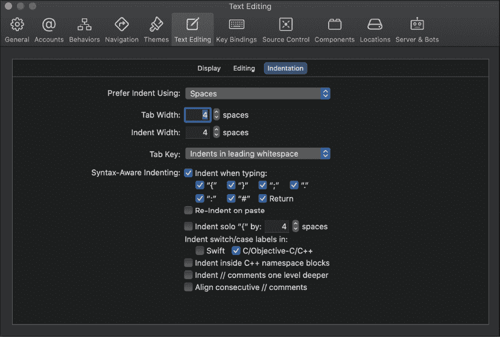

# 19

# Swift 格式和风格指南

在我的开发经验中，每次我学习一门新的编程语言时，通常都会提到如何编写和格式化该语言的代码。在我的开发生涯早期（那是很久以前），这些推荐非常基础，主要是关于如何缩进代码，或者每行只有一个语句等。实际上，直到最近 10-12 年，我才开始看到不同编程语言的复杂和详细的格式和风格指南。如今，你很难找到一个拥有超过两三个开发者的开发机构，他们没有为每种使用的语言制定风格/格式指南。即使不创建自己的风格指南的公司，通常也会参考其他公司发布的某些标准指南，如 Google、Oracle 或 Microsoft。这些风格指南帮助团队编写一致且易于维护的代码。

在本章中，你将学习以下内容：

+   什么是风格指南

+   什么使一个好的风格指南

+   为什么使用风格指南很重要

+   如何创建一个示例风格指南

# 什么是编程风格指南？

编程风格非常个人化，每个开发者都有自己的首选风格。这些风格可以从一种语言到另一种语言，从一个人到另一个人，随着时间的推移而变化。编程风格的个人性质可能会使得当众多个人共同贡献代码时，难以保持代码库的一致性和可读性。

虽然大多数开发者可能都有自己的首选风格，但不同语言之间推荐或首选的风格可能不同。例如，在 C#中，当我们命名一个方法或函数时，建议我们使用 Pascal 大小写，这与驼峰式大小写类似，只是首字母大写。在大多数其他语言中，如 C、Objective-C 和 Java，也建议我们使用驼峰式大小写，首字母小写。

最佳的应用程序编写得易于维护，代码易于阅读。如果每个开发者都使用自己的编程风格，那么对于大型项目和拥有许多开发者的公司来说，要拥有易于维护和阅读的代码是很困难的。这就是为什么拥有多个开发者的公司和项目通常为每种使用的语言采用编程风格指南。

编程风格指南定义了一套规则和指南，开发者在编写项目或公司中特定语言的程序时应该遵循。这些风格指南在公司或项目之间可能差异很大，反映了公司或项目期望代码的编写方式。这些指南也可能随时间而变化。遵循这些风格指南以保持代码库的一致性是很重要的。

许多开发者不喜欢被告知他们应该如何编写代码的想法，并声称只要他们的代码能正确运行，他们的代码格式如何并不重要。这种哲学在编码团队中不起作用，原因和它在运动队中不起作用的原因相同。您认为如果一支篮球队的所有球员都认为他们可以按照自己的方式打球，并且当他们都按照自己的方式打球时球队会表现得更好，会发生什么？那支球队可能会输掉很多比赛。一支篮球队（或任何运动队）要想持续获胜，除非所有队员都一起合作。确保每个人都在一起合作并执行相同的比赛计划的责任在于教练，就像在开发项目的团队领导确保所有开发者都按照采用的风格指南编写代码一样。

# API 设计指南

苹果已经发布了 Swift 的 API 设计指南。这定义了 API 应该如何设计，并且与语言风格指南不同。语言风格指南定义了特定语言的代码应该如何编写；API 设计指南定义了 API 应该如何设计。如果您正在创建将被其他 Swift 开发者使用的 API，您应该熟悉苹果的 API 设计指南，该指南可以在以下位置找到：[`swift.org/documentation/api-design-guidelines/`](https://swift.org/documentation/api-design-guidelines/)。

## 您的风格指南

在本书中定义的风格指南只是一个指南。它反映了作者对如何编写 Swift 代码的看法，并旨在成为创建您自己的风格指南的一个良好起点。如果您真的喜欢这个指南并直接采用它，那太好了。如果您对其中某些部分不同意，并在您的指南中进行了修改，那也很好。

对您和您的团队来说，合适的风格是您和您的团队感到舒适的风格，它可能和本书中的指南不同。不要害怕根据需要调整您的风格指南。在本章的风格指南中，以及在大多数优秀的风格指南中，一个明显的特点是关于为什么每个项目被推荐或不推荐的解释非常少。风格指南应该提供足够的细节，以便读者了解每个项目的推荐和非推荐方法，但同时也应该小巧紧凑，以便易于阅读和快速阅读。如果一个开发者对为什么某个特定方法被推荐有疑问，他们应该将这个疑问提出给开发团队。考虑到这一点，让我们开始指南的学习。

### 不要在语句的末尾使用分号

与许多语言不同，Swift 不需要在语句的末尾使用分号。因此，我们不应该使用它们。让我们看看以下代码：

```swift
//Preferred Method
var name = "Jon" 
print(name)
//Non-preferred Method
var name = "Jon";
print(name); 
```

### 不要在条件语句中使用括号

与许多语言不同，条件语句周围不需要括号；因此，除非需要澄清，否则我们应该避免使用它们。让我们看看以下代码：

```swift
//Preferred Method
if speed == 300_000_000 { 
    print("Speed of light")
}
//Non-Preferred Method
if (speed == 300_000_000) { 
    print("Speed of light")
} 
```

### 命名

我们应该始终使用描述性的驼峰命名法为自定义类型、方法、变量、常量等命名。让我们看看一些通用的命名规则。

#### 自定义类型

自定义类型应该有一个描述性的名称，描述该类型的作用。名称应使用帕斯卡大小写。以下是根据我们的风格指南的适当名称和非适当名称的示例：

```swift
//Proper Naming Convention
BaseballTeam
LaptopComputer
//Non-Proper Naming Convention 
baseballTeam  //Starts with a lowercase letter 
Laptop_Computer  //Uses an underscore 
```

#### 函数和方法

函数名应该是描述性的，描述函数或方法。它们应该使用驼峰命名法。以下是一些适当名称和非适当名称的示例：

```swift
//Proper Naming Convention
getCityName
playSound
//Non-Proper Naming Convention
get_city_name  //All lowercase and has an underscore
PlaySound  //Begins with an uppercase letter 
```

#### 常量和变量

常量和变量应该有一个描述性的名称。它们应该以小写字母开头，并使用驼峰命名法。唯一的例外是当常量是全局的；在这种情况下，常量的名称应包含所有大写字母，单词之间用下划线分隔。我见过许多不赞成使用全大写名称的指南，但我就个人而言，我喜欢在全局作用域中的常量使用全大写名称，因为这样它们是全球作用域，而不是局部作用域。

以下是一些适当名称和非适当名称的示例：

```swift
//Proper Names
playerName
driveSize
//Non-Proper Names
PlayerName  //Starts with uppercase letter
drive_size  //Has underscore in name 
```

### 缩进

在 Xcode 中，默认的缩进宽度定义为四个空格，制表符宽度也定义为四个空格。我们应该将其保留为默认设置。以下截图显示了 Xcode 中的缩进设置：



图 19.1：缩进

我们应在函数/方法之间添加额外的空白行。我们还应使用空白行来分隔函数或方法内的功能。也就是说，在函数或方法内使用过多的空白行可能表明我们应该将函数分解成多个函数。

### 注释

我们应该根据需要使用注释来解释我们的代码是如何和为什么被编写的。我们应在自定义类型和函数之前使用块注释。我们应使用双斜杠来注释单行代码。以下是如何编写注释的示例：

```swift
/**
This is a block comment that should be used to explain a class or function
**/
public class EmployeeClass {
    // This is an inline comment with double slashes
    var firstName = ""
    var lastName = ""
/**
    Use Block comments for functions
        parameter paramName: use this tag for parameters
        returns: explain what is returned
        throws: Error thrown
**/
    func getFullName() -> String { 
        return firstName + " " + lastName
    }
} 
```

当我们注释方法时，我们还应该使用文档标签，这些标签将在 Xcode 中生成文档，如前例所示。至少，如果适用，我们应该使用以下标签：

+   **参数（Parameter）**: 这用于参数

+   **返回（Returns）**: 这用于描述返回的内容

+   **抛出（Throws）**: 这用于记录可能抛出的错误

### 使用`self`关键字

由于 Swift 在访问对象的属性或调用对象的方法时不需要我们使用`self`关键字，因此除非我们需要区分实例属性和局部变量，否则我们应该避免使用它。以下是一个你应该使用`self`关键字的示例：

```swift
public class EmployeeClass { 
    var firstName = ""
    var lastName = ""
    func setName(firstName: String, lastName: String) { 
       self.firstName = firstName
       self.lastName = lastName
    }
} 
```

这里是一个不使用`self`关键字示例：

```swift
public class EmployeeClass { 
    var firstName = ""
    var lastName = ""
    func getFullName() -> String {
       return self.firstName + " " + self.lastName
    }
} 
```

### 常量和变量

常量与变量的区别在于常量的值永远不会改变，而变量的值可能会改变。 wherever possible，我们应该定义常量而不是变量。

做这件事最简单的方法是将所有内容默认定义为常量，然后在代码中需要更改定义的地方将其更改为变量。在 Swift 中，如果你定义了一个变量但从未在代码中更改其值，你会收到一个警告。

### 可选类型

只有在绝对必要时才使用可选类型。如果没有绝对必要将 nil 值分配给变量，我们就不应该将其定义为可选。

#### 使用可选绑定

我们应该避免强制解包可选，因为这很少是必要的。我们最好使用可选绑定或可选链而不是强制解包。

以下示例展示了定义`myOptional`变量为可选时的首选和非首选方法：

```swift
//Preferred Method Optional Binding
if let value = myOptional {
    // code if myOptional is not nil
} else {
    // code if myOptional is nil
}
//Non-Preferred Method
if myOptional != nil {
    // code if myOptional is not nil
} else {
    // code if myOptional is nil
} 
```

如果我们需要解包多个可选，我们应该将它们包含在同一个`if-let`或`guard`语句中，而不是在单独的行上解包。然而，有时我们的业务逻辑可能需要我们以不同的方式处理 nil 值，这可能需要我们在单独的行上解包可选。

```swift
//Preferred Method Optional Binding
if let value1 = myOptional1, let value2 = myOptional2 {
// code if myOptional1 and myOptional2 is not nil
} else {
// code if myOptional1 and myOptional2 is nil
}
//Non-Preferred Method Optional Binding
if let value1 = myOptional1 {
    if let value2 = myOptional2 {
        // code if myOptional is not nil
    } else {
        // code if myOptional2 is nil
    } else {
    // code if myOptional1 is nil
} 
```

#### 使用可选链

当我们需要解包多层时，我们应该使用可选链而不是多个可选绑定语句。以下示例展示了首选和非首选方法：

```swift
//Preferred Method
if let color = jon.pet?.collar?.color { 
    print("The color of the collar is \(color)")
} else {
    print("Cannot retrieve color")
}
//Non-Preferred Method
if let tmpPet = jon.pet, let tmpCollar = tmpPet.collar{ 
    print("The color of the collar is \(tmpCollar.color)")
} else {
    print("Cannot retrieve color")
} 
```

### 使用类型推断

而不是定义变量类型，我们应该让 Swift 推断类型。我们定义变量或常量类型的唯一情况是我们没有在定义时给它赋值。让我们看看以下代码：

```swift
//Preferred method
var myVar = "String Type" //Infers a String type
var myNum = 2.25 //Infers a Double type
//Non-Preferred method
var myVar: String = "String Type"
var myNum: Double = 2.25 
```

### 使用集合的简写声明

当声明原生 Swift 集合类型时，我们应该使用简写语法，并且除非绝对必要，否则我们应该初始化集合。以下示例展示了首选和非首选方法：

```swift
//Preferred Method
var myDictionary: [String: String] = [:]
var strArray: [String] = []
var strOptional: String?
//Non-Preferred Method
var myDictionary: Dictionary<String,String>
var strArray: Array<String>
var strOptional: Optional<String> 
```

### 使用 switch 语句而不是多个 if 语句

wherever possible，我们应该更倾向于使用单个`switch`语句而不是多个`if`语句。以下示例展示了首选和非首选方法：

```swift
//Preferred Method
let speed = 300_000_000
switch speed {
   case 300_000_000: 
       print("Speed of light") 
   case 340:
       print("Speed of sound")
   default:
       print("Unknown speed")
}
//Non-preferred Method
let speed = 300_000_000 if speed == 300_000_000 {
       print("Speed of light")
} else if speed == 340 { 
       print("Speed of sound")
} else {
       print("Unknown speed")
} 
```

### 不要在应用程序中留下注释掉的代码

如果我们在尝试替换代码块时注释掉该代码块，一旦我们对更改感到满意，我们应该移除我们注释掉的代码。大量注释掉的代码块会使代码库看起来杂乱无章，并使其更难跟踪。

# 摘要

当我们在团队环境中开发应用程序时，拥有一个由团队中每个人遵守的良好定义的编码风格非常重要。这使我们能够拥有一个易于阅读和维护的代码库。

如果一个风格指南长时间保持不变，这可能意味着它可能没有跟上语言中的最新变化。对于每种语言，“太长时间”的定义是不同的。例如，对于 C 语言，太长时间将以年为单位定义，因为该语言非常稳定；然而，对于 Swift，该语言相对较新，变化发生得相对频繁，因此“太长时间”可能被定义为几个月。

建议我们将风格指南保存在版本控制系统之中，这样在需要时我们可以参考旧版本。这使我们能够拉取风格指南的旧版本，并在查看旧代码时回溯参考。

不仅在 Swift 中，在其他语言中也是如此，建议您使用代码检查工具来检查和强制执行良好的编码实践。对于 Swift，有一个名为 SwiftLint ([`github.com/realm/SwiftLint`](https://github.com/realm/SwiftLint)) 的优秀工具，它有一个命令行工具。

在为您的组织编写风格指南时，您可能需要关注 Swift 进化提案 SE-0250 ([`github.com/apple/swift-evolution/blob/master/proposals/0250-swift-style-guide-and-formatter.md`](https://github.com/apple/swift-evolution/blob/master/proposals/0250-swift-style-guide-and-formatter.md))。该提案旨在创建一个官方的 Swift 风格指南和格式化工具。如果这个提案被接受并且发布了官方的风格指南，那么您应该采用这些指南。
