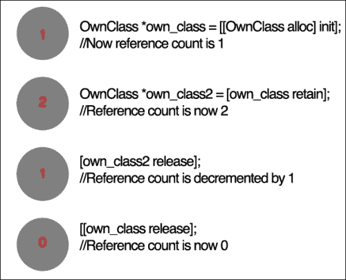

# 第一章： Objective-C 内存管理简介

在本章中，我们将主要关注内存管理问题的核心问题以及基于 Objective-C 的解决方案。我们将研究对象的所有权和生命周期。这个基本思想被称为手动引用计数，或**手动保留释放**（**MRR**），其中你需要声明和放弃每个对象的所有权。它定义了对象的生命周期。最后，我们将更深入地探讨**NSObject**，以便更好地理解正在发生的事情。

在本章中，我们将涵盖以下主题：

+   为什么我们需要在 Objective-C 中进行内存管理？

+   对象的所有权和生命周期

+   引用计数的原理

+   什么是内存泄漏，为什么要注意它？

# 为什么我们需要在 Objective-C 中进行内存管理？

无论使用什么编程语言，内存管理的问题总是存在的。一般来说，这是一个无法避免的资源管理问题，因为内存始终是有限的资源。

脚本语言和 Java，在内存管理由虚拟机或应用程序（在代码中隐藏）处理的情况下，并不总是足够有效。虽然这种方式对程序员来说更容易，但它可能会对资源产生负面影响，因为你没有对其绝对的控制权，而且当不再需要时，仍然有对象“活着”，此外，这些“活着”的对象仍然占用宝贵的内存空间，这些空间本可以由其他对象使用。另外，根据你的要求，另一种观点认为，自动内存管理是唯一正确的方向。

这样的讨论通常开始于像“哪种编程语言最好？”和“内存管理的最佳方式是什么？”这样的讨论。让我们把那些无意义的争论留给博客和论坛上的“圣战”吧。每个工具在正确的上下文中都有其用途，而 Objective-C 的内存管理概念在时间和资源节约方面都相当高效。

Objective-C 中的内存管理方式与一些广泛使用的语言（如 C/C++、Java 或 C#）不同，这些语言通常在学校教授，因为它引入了新的概念，如对象所有权。对于运行在有限内存上的设备（如手机、智能手表等）来说，内存管理至关重要，因为有效的内存管理将允许你从这些小型设备中榨取每一滴性能，在这些设备上，内存非常稀缺。

# 对象的所有权和生命周期

对象所有权抽象的想法很简单——一个实体简单地负责另一个实体，并且实体有拥有对象的能力。当一个实体拥有一个对象时，该实体也负责释放该对象。

让我们回到我们的代码示例。如果一个对象在主函数中被创建并使用，那么主函数对该对象负责，如下面的代码列表所示：

```swift
int main(int argc, char *argv[]) {

  SomeObject *myOwnObject;
  // myOwnObject is created in main
   myOwnObject = [[SomeObject alloc] init];

    // myOwnObject can be used by other objects
  [anotherObject using:myOwnObject];

    // but main is responsible for releasing it
   [myOwnObject release];
```

### 小贴士

**下载示例代码**

您可以从您在 [`www.packtpub.com`](http://www.packtpub.com) 的账户下载示例代码文件，以获取您购买的所有 Packt 出版物的代码。如果您在其他地方购买了这本书，您可以访问 [`www.packtpub.com/support`](http://www.packtpub.com/support) 并注册，以便将文件直接通过电子邮件发送给您。

使这个概念变得稍微复杂一点的是，对象可能被多个实体拥有。因此，一个对象可能被在主函数中创建和拥有，同时也会被另一个实体使用，该实体将声明对对象的拥有权。

您会在使用数组时看到多个对象拥有权的情况是一个常见的情况。数组是对象的索引列表，当一个对象被放入数组中时，数组声明对对象的拥有权。因此，如果我在主函数中创建一个对象并将其放入数组中，主函数和数组将同时声明对对象的拥有权并为其创建一个引用。拥有权和引用是不同的，因为一个对象引用另一个对象，它并不拥有，并且两者都负责清理对象。以下代码演示了这一点：

```swift
int main (int argc, char *argv[]) {

  SomeObject *myOwnObject;
  // myOwnObject is created in main
myOwnObject = [[SomeObject alloc] init];

// myOwnObject can be used by other objects
NSMutableArray *myArray;
// add my object to myArray    
myArray = [[NSMutableArray alloc] initWithObjects:myOwnObject, nil];

// main does not need myOwnObject any more
[myOwnObject release];

// but myOwnObject still is needed inside the array
[anotherObj usingArray: myArray];
```

就像现实世界中的对象一样，Objective-C 对象被创建；它们存在，然后在应用程序关闭时消失。这就是对象生命周期的工作方式。显然，数组必须声明对对象的拥有权，并防止在主函数中调用的释放方法中删除对象。

然而，实体如何正确地对其拥有的对象声明其权利呢？让我们更深入地看看这个问题。

# 对象拥有权和引用计数

为了表示使用对象的拥有者数量，这些对象被赋予了一个引用计数。

在开始时，对象的引用计数为 `1`。这是因为创建对象的函数将要使用该对象。当任何实体需要声明对对象的拥有权时，由于该实体将要访问和使用该对象，它会向其发送保留消息，并且其保留计数增加 `1`。当实体完成对对象的操作后，它会向对象发送释放消息，并且其保留计数减少 `1`。只要这个对象的引用计数大于零，一些“东西”正在使用它。当它降到零时，该对象对那些“东西”就不再有用，并且可以安全地释放。

让我们回到由数组拥有的对象的例子。以下代码注释和图中给出了解释：

```swift
int main(int argc, char *argv[]) {

  SomeObject *myOwnObject;
  // myOwnObject is created in main
   myOwnObject = [[SomeObject alloc] init];
  // myOwnObject has retain count equal to 1

// myOwnObject can be used by other objects
NSMutableArray *myArray;
// add my object to myArray    
myArray = [[NSMutableArray alloc] initWithObjects:myOwnObject, nil];
//inside myOwnObject got another retain message
//and now its retain count equal 2

// main does not need myOwnObject any more
[myOwnObject release];
// release decrements retain count
// and now myOwnObject retain count now is 2-1 = 1

// but myOwnObject still is needed inside the array
[anotherObj usingArray: myArray];

[myArray release];
// on array destruction every object inside array gets release message

//myOwnObject retain count decreases this time to 0 and myOwnObject will be deleted together with the array
```

以下图表说明了引用计数的原理：



在将指针设置为指向其他对象之前忘记向对象发送释放消息将保证你会有内存泄漏。为了在初始化之前创建一个对象，操作系统会分配一块内存来存储它。此外，如果你向一个之前未发送过释放语句的对象发送了释放语句，则会向该对象发送一个保留语句。这将被视为**过早释放**，即之前分配给它的内存不再与其相关。调试这些问题会花费很多时间，在大项目中这些问题很容易变得非常复杂。如果你不遵循一些关于内存管理的坚实基础原则，你经常会忘记，并且很快就会发现自己花费数小时检查每一个保留和释放语句。更糟糕的是，如果你正在查看别人的代码，而他们搞砸了。在别人的代码中修复内存管理问题可能需要很长时间。

# 什么是内存泄漏，为什么要注意它？

内存泄漏是指你的程序失去了对已分配但忘记释放的内存的跟踪。结果是，“泄漏”的内存将永远不会被程序释放。在某个时间点之后，如果继续泄漏更多内存，将没有更多空闲内存，这将导致你的应用程序崩溃。通常，这倾向于发生在代码执行 `new`、`malloc` 或 `alloc`，但从未执行相应的“delete”、“free”或“release”操作时。

当你执行 `new`、`malloc` 或 `alloc` 时，操作系统所做的就是给你的程序在堆上分配一块内存。操作系统会说：“这里，拿这个内存地址，并在它上面有一个内存块。”因此，你需要创建对该内存地址的引用（通常以指针的形式），根据操作系统，例如，“我完成了这个，它不再有用”（通过调用“free”、“delete”或“release”）。

当你丢弃指向该内存的指针时，内存泄漏就会发生。如果你的程序不知道你的内存是在堆上分配的，你怎么能释放它呢？以下代码行展示了如果你从未调用释放方法，它将是一个内存泄漏的例子：

```swift
NSMutableString *str = [[NSMutableString alloc] initWithString:@"Leaky"];
```

那为什么你应该关心呢？最好的情况是，你是当用户退出你的应用程序时将被释放的消耗内存。最坏的情况是，每个屏幕都可能发生内存泄漏。这并不是结束程序的好方法，特别是如果用户让它长时间运行。程序崩溃很难调试，因为它可以在应用程序的随机时刻崩溃，因为内存泄漏很难复制。创建一个经常崩溃的应用程序会导致你的程序在 App Store 上或通过口碑收到差评，这是你不想发生的事情。

正因如此，在进化的过程中，Objective-C 中有其他内存管理方法，你将在本书中进一步了解。

# Objective-C 中的对象是什么？

Objective-C 内部是如何工作的？`NSObject`是大多数 Objective-C 类层次结构的根类，通过它，对象继承基本方法，并表现出 Objective-C 对象的特性。

这个对象是一个类的实例，也可以是类的一个成员或其派生类之一。因此，让我们更深入地了解`NSObject`。在早期，Objective-C 有一个名为`Object`的类。它有一个名为`+new`的方法，该方法封装了`malloc()`，还有一个名为`-free`的方法。由于 Objective-C 对象通常被别名化，并且管理对象的生命周期变得相当复杂，这很麻烦。

NSObject 被 NeXT（史蒂夫·乔布斯在 1985 年被苹果公司解雇后创立的第二家公司）使用，以便提供引用计数，因此，将对象指针分为两类：拥有引用的指针和不拥有引用的指针。那些对对象引用计数有贡献的指针是拥有引用指针。如果确定一个引用将在变量生命周期的某个时刻被其他地方持有，可以使用非拥有引用指针，从而避免引用计数操作的额外开销，因为非拥有引用指针没有跟踪对象拥有的额外成本。

非拥有引用指针通常用于自动释放值。自动释放池使得临时对象能够接收非拥有引用指针作为回报。通过接收一个`-autorelease`消息，对象被添加到一个列表中，之后将被释放，与当前自动释放池的销毁同时进行。您可以使用如下所示的自动释放方法调用自动释放：

```swift
 [myObject autorelease];
```

以下表格显示了自动释放和释放的一些描述：

| 释放类型 | 描述 |
| --- | --- |
| 自动释放方法 | 对象收到释放消息，但放入自动释放池，对象将在运行循环中稍后池被耗尽时释放，但仍然占用内存 |
| 释放方法 | 对象被立即释放，并在对象释放后释放内存 |

任何收到自动释放消息的对象将在自动释放池耗尽时被释放。使用自动释放而不是常规释放方法将延长对象的生命周期，直到运行循环结束时池被耗尽。

在 2011 年的**全球开发者大会**（**WWDC**）上，苹果公司引入了 ARC（自动引用计数）的缩写。它强制编译器在编译时处理内存管理调用，而不是传统的垃圾回收功能，该功能在运行时发生。ARC 还向语言模型中添加了一些内容。它自 iOS5、OS X 10.7 以及 GNUstep 以来一直得到支持。

首先，我们将发现 Cocoa 中有两个 NSObjects，一个类和一个协议。为什么会这样，这个设计的目的是什么？让我们来看看类和协议。

在 Objective-C 中，协议定义了一组对象在运行时预期遵循的行为。例如，一个表格视图对象预期能够与某个数据源进行通信，以便表格视图知道要显示哪些数据和信息。协议和类不共享相同的命名空间（包含名称、类和协议名称的标识符集合，因此相同的名称可以存在于不同的命名空间中）。两者都可以存在，在语言层面上它们是无关的，但具有相同的名称。这种情况在 NSObject 中就是这样。

在语言中，没有地方可以使用协议或类名。将类名用作消息发送的目标、类型名称和在 `@interface` 声明中是允许的。同样，在几个相同的位置可以使用协议名称；然而，方式不同。具有与类相同名称的协议不会引起任何问题。

根类不可能有超类，因为它们位于层次结构的顶部，因此没有根类之上的超类，NSObject 类就是其中之一。我强调说“其中之一”，因为在与其他编程语言相比的 Objective-C 中，存在多个根类的存在是完全可能的。

Java 的单一根类名为 `java.lang.Object`，它是任何其他类的父终极类。因此，任何来自对象的 Java 代码，都添加了由 `java.lang.Object` 添加的基本方法。

Cocoa 可以有多个根类。除了 `NSObject`，还有 `NSProxy` 和其他一些根类；这些根类部分是 `NSObject` 协议存在的原因。`NSObject` 协议确定了一组特定的基本方法，期望其他根类实现这些方法，从而使得这些方法在需要时随时可用。

`NSObject` 类遵循 `NSObject` 协议，这导致了该基本方法的实现：

```swift
   //for NSObject class 
  @interface NSObject <NSObject>
```

对于 `NSProxy`，实现相同的方法也是适用的，它也遵循 `NSObject` 协议：

```swift
   // for NSProxy class @interface NSProxy <NSObject>
```

在 `NSObject` 协议中可以找到诸如 hash、description、`isEqual`、`isKindOfClass`、`isProxy` 等方法。`NSProxy` 到 `NSObject` 协议表示，即使实现了基本的 `NSObject` 方法，仍然可以依赖 `NSProxy` 实例。

继承 `NSObject` 会带来很多可能引起问题的负担。`NSProxy` 通过提供一个更简单的超类来帮助防止这种情况，这个超类中包含的额外内容较少。

对于大多数 Objective-C 编程来说，`NSObject`协议对根类的有用性并不那么有趣，因为简单的事实是我们不经常使用其他根类。然而，当你需要创建自己的协议时，这将非常方便。

假设，你有一个以下协议：

```swift
    @protocol MyOwnProtocol
    - (void)myFunction;
    @end
```

并且有一个指向简单对象`myOwnObject`的指针，它符合它：

```swift
    id<MyProtocol> myOwnObject;
```

你可以告诉这个对象执行`myFunction`：

```swift
    [myOwnObject myFunction];
```

然而，你不能要求对象提供其描述：

```swift
    [myOwnObject description]; // no such method in the protocol
```

你无法检查它的相等性：

```swift
    [myOwnObject isEqual: anotherObject];
    // no such method in the protocol
```

通常，你不能要求它执行任何正常对象可以执行的操作。有时候这并不重要，但在某些情况下，你可能会希望能够执行这个任务。

如前所述，`NSObject`是大多数 Objective-C 类层次结构的根类，通过`NSObjects`，你的 Objective-C 类可以继承系统接口，并获得作为 Objective-C 对象的行为能力。因此，如果你想让你的对象能够访问`isEqual`等方法，`NSObject`就很重要。这就是`NSObject`协议出现的地方。协议可以继承自其他协议，这意味着`MyProtocol`可以继承自`NSObject`协议：

```swift
    @protocol MyOwnProtocol <NSObject>
    - (void)myFunction;
    @end
```

这表示不仅符合`MyOwnProtocol`的对象会响应`myFunction`，它们还会响应`NSObject`协议中的所有那些常见消息。既然知道你的应用程序中的任何对象都是直接或间接地从`NSObject`类继承而来，并且符合`NSObject`协议，那么对实现`MyOwnProtocol`的人就没有额外的要求，同时允许你在实例上使用这些基本方法。

### 注意

对于框架来说，存在两个不同的`NSObject`是不正常的；然而，当你深入了解时，这开始变得有意义。`NSObject`协议允许所有具有相同基本方法的根类获得权限，这也为声明一个包含任何对象预期功能的基本功能协议提供了一个非常简单的方法。`NSObject`类将所有这些功能一起引入，因为它符合`NSObject`协议。这里需要注意的是，一个创建的且没有继承`NSObject`的自定义类可以被视为根类，但一旦你的自定义类从`NSObject`继承，那么根类就不再是你的自定义类，而是`NSObject`。然而，通常，你的大多数自定义类都应该继承自 NSObjects；它将实现 NSObject 的功能，如`alloc`、`init`、`release`等，如果没有从 NSObject 继承，这些功能需要由你编写和实现。

# 摘要

在本章中，你学习了 Objective-C 中的内存管理是什么以及它是如何工作的。你还学习了在手动管理保留和释放时的一些最佳实践，并了解了自动引用计数（ARC）、Objective-C 对象和根类的基础知识。ARC 基本上可以被视为一种编译时防止内存泄漏的防护措施，因为编译器会在编译时自动为你编写释放语句。因此，你不需要在代码中编写冗长的释放语句来保持代码的简洁和紧凑。

在使用内存管理进行编码时，需要注意的一个小贴士是，无论何时你执行 `alloc` 和 `init`，然后在该之后编写你的释放代码，并将其放在你的类中适当的位置，你可能会忘记在编写某些代码或修复某些错误后调用释放方法。因此，在你执行 `alloc` 和 `init` 之后编写你的对象释放语句将帮助你将内存泄漏降到最低，这样你就不会因为忘记编写对象释放语句而出现内存泄漏的情况。

在下一章中，你将学习更多关于 ARC 的内容，包括它是如何工作的、它的优点，以及如何设置你的项目以使用 ARC 和 Objective-C 及 UI Kit 中的内存模型。
