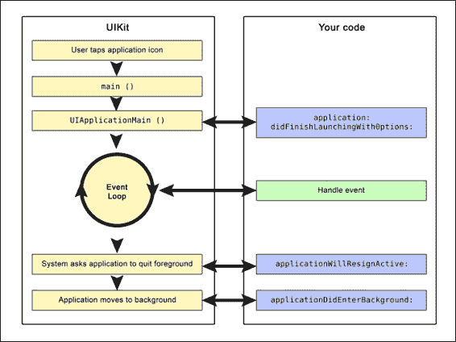

# 第三章：使用 Autorelease Pools

假设你正在返回一个你创建（因此拥有）的对象给调用者。如果它在你的方法中被释放，返回的对象将是无效的。另一方面，有一个基本规则，你必须释放你拥有的对象；那么，你该如何释放它们？简单来说，将对象放入自动释放池。当自动释放池被清空时，对象就会被释放。

本章将涵盖以下主题：

+   理解自动释放池机制

+   Autorelease Pool 如何帮助

+   自动释放类

+   自动释放池块和线程

+   Objective-C 中的内存模型

+   弱引用 ARC

# 理解自动释放池机制

当你刚开始为 Cocoa（iOS 或 Mac OS）开发时，你会很快学会遵循标准的`alloc`、`init`和（最终）`release`周期：

```swift
// Allocate and init
NSMutableDictionary *dictionary = [[NSDictionary alloc] init];

// Do something with dictionary
// ...

// Release
[dictionary release];
```

这很好，直到你发现以下操作的便利性：

```swift
// Allocate and init
NSMutableDictionary *dictionary = [NSDictionary dictionary];

// Do something with dictionary
// …
```

让我们看看内部实际发生了什么：

```swift
NSMutableDictionary *dictionary = [[NSDictionary alloc] init];
return [dictionary autorelease];
```

这种方法被称为自动释放池，它们是 Cocoa 平台使用的**自动引用计数（ARC**）内存管理模型的一部分。

ARC 编译器会为你自动释放任何对象，除非它来自一个以`new`、`alloc`、`init`、`copy`或`mutableCopy`开头的方法。和之前一样，这些对象被放入自动释放池，但为了引入一个新的语言结构，`NSAutoreleasePool`已被`@autoreleasepool`编译器指令所取代。即使使用 ARC，我们仍然可以自由地使用`autorelease`消息在任何时候清空/创建我们的池。它不会影响实现`retain`和`release`消息时的编译器，但提供了当自动释放对象安全退出作用域时的提示。

Cocoa 框架（Foundation Kit、Application Kit 和 Core Data）为从`NSObject`继承的基本类提供了一些合适的方法来处理，例如`NSString`、`NSArray`、`NSDictionary`等。这些方法会快速为你分配、初始化并返回创建的对象，而且你无需过多担心，该对象将会自动释放。

### 注意

注意，我真正想说的是“不必过多担心”，而不是“完全不担心”，因为即使有这些方便的框架为你创建和清除对象，也仍然会有你想要更多控制并自己创建额外的自动释放池的情况。

基本上，Autorelease Pool 存储对象，当它被清空时，它只是向对象发送一个`release`消息。`NSAutoreleasePool`类用于支持 Cocoa 的引用计数内存管理系统。

自动释放池是由苹果公司制作的，并且自 OS X 10.7 以来一直是语言的一部分。如果在 ARC 模式下程序引用了`NSAutoreleasePool`类，则被视为无效，并在构建阶段被拒绝。相反，在 ARC 模式下，你需要用`@autoreleasepool`块来替换它，从而定义一个自动释放池有效的区域，如下面的代码所示：

```swift
// Code in non-ARC mode NSAutoreleasePool *myPool = [[NSAutoreleasePool alloc] init];
// Taking advantage of a local autorelease pool.
[myPool release];
```

然而，在 ARC 模式下，你应该这样写：

```swift
@autoreleasepool {
    // Taking advantage of a local autorelease pool.
}
```

即使你不使用自动引用计数（ARC），你也可以利用比`NSAutoreleasePool`类更有效的`@autoreleasepool`块。

与使用垃圾回收的环境相反，在引用计数的环境中，每个收到`autorelease`消息的对象都会被放入一个`NSAutoreleasePool`对象中。这个`NSAutoreleasePool`类就像是一个这些对象的集合，当它被清空时，会逐个发送释放消息。当你超出作用域时，它会清空池子。然后，每个对象的保留计数会减少 1。通过使用`autorelease`作为释放消息的替代，你延长了对象的生命周期，这次可能甚至更长，如果对象后来被保留，或者至少直到`NSAutoreleasePool`类被清空。如果你多次将对象放入同一个池子中，每次都会收到一个`release`消息。

在引用计数的环境中，Cocoa 假设始终会有一个可用的`autorelease`池；否则，收到`autorelease`消息的对象将不会被释放。这种做法会导致内存泄漏并生成适当的警告消息。

在事件循环的周期开始时，应用程序套件（Cocoa 框架之一，也称为 AppKit）会创建一个`autorelease`池。它提供了创建和交互 GUI 的代码，并在该周期的末尾清空，然后处理事件时创建的每个自动释放对象都会被释放。这意味着你不需要自己创建池子，因为应用程序套件会为你做这件事。然而，如果你的应用程序创建了大量的自动释放对象，你应该考虑创建“局部”的自动释放池；这有助于避免峰值内存占用。

要创建一个`NSAutoreleasePool`对象，你可以使用常规的`alloc`和`init`方法，并使用`drain`来销毁它。池子不能被保留；`drain`的效果就像是一个释放操作，这在同一个上下文中创建它非常重要。

每个线程都有自己的 autorelease pool 栈。这些栈包含`NSAutoreleasePool`对象，这些对象反过来包含 autoreleased 对象。每个新的 autoreleased 对象都放在池的顶部，每个新的 pool 都放在栈的顶部。当池被清空时，它从栈中被移除。在线程完成之前，它会清空其栈上的所有 autorelease pool。尽管可以手动创建 autorelease pool 并手动将其添加到对象中，但 ARC 仍然会自动清空池：不允许你自己这样做。

为了确保你不必担心所有权，这是 ARC 所做的事情：轻松创建 autorelease pools，并暂时为你处理 autoreleased 对象的持有和释放。

# Autorelease pool 机制

有时候你需要放弃一个对象的所有权，而使用 autorelease pool blocks 是一个好方法。这些 blocks 提供了一个机制，让你可以放弃所有权并避免对象立即被释放。即使有时你需要创建自己的 blocks，或者这样做对你有利，你通常不需要创建它们，但有些情况下你可能需要。

正如以下代码所示，autorelease pool block 是通过使用`@autoreleasepool`来标记的：

```swift
@autoreleasepool {
     //-----
	 // Here you create autoreleased objects.
	 //-----
}
```

在 block 内部创建的对象在 block 结束时收到释放消息。一个对象在 block 内部接收的释放消息次数与它接收的 autorelease 消息次数相同。

Autorelease pool blocks 也可以嵌套：

```swift
@autoreleasepool {
    // . . .
    @autoreleasepool {
        // . . .
    }
    //. . .
}
```

如果在 autorelease pool block 内部没有发送 autorelease 消息，Cocoa 将返回错误消息，你的应用程序将发生内存泄漏。你通常不需要创建自己的 autorelease pool blocks，但有三种情况下你需要：

+   在创建一个不基于 UI 的程序时，例如命令行程序

+   在创建一个生成大量临时对象的循环时

+   当需要创建一个次要线程时

## 使用 autorelease pool blocks 减少峰值内存占用

内存占用基本上是程序在运行时使用的内存的主要数量。在无数应用程序中，临时 autoreleased 对象被创建，并且它们会添加到应用程序的内存占用中，直到 block 结束。在某些情况下，允许这种积累直到当前事件循环最终结束，可能会导致过高的开销，你可能希望快速去除这些临时对象；毕竟，它们极大地增加了内存占用。在这种情况下，创建自己的“局部”autorelease pool blocks 是一个解决方案。最终，所有对象都会被释放，从而被释放，有益地减少了内存占用。

这里，你可以看到如何为`for`循环使用 autorelease pool block：

```swift
NSArray *myUrls = <# Sample Array of URLs #>;
for (NSURL *url in myUrls) {
    @autoreleasepool {

/* Two objects are created inside this pool:
NSString "contents", NSError "error"
At the end of the pool, they are released. */

       NSError *error;
       NSString *contents = [NSString
        stringWithContentsOfURL:url encoding:NSUTF8StringEncoding error:&error];

         /* Here you can process the NSString contents,
    thus creating and autoreleasing more objects. */
    }
}
```

有一个包含许多文件 URL 的`NSArray`，循环一次处理一个文件。在块内部创建的每个对象在结束时都会被释放。

在 autorelease pool 块内部自动释放的每个对象，在块终止后都被视为已废弃。如果你想在 autorelease pool 块结束后保持一个临时对象并使用它，你必须做两件事：在块内部，向该对象发送一个`retain`消息，然后，只有在块之后，发送`autorelease`消息，如下面的代码示例所示：

```swift
– (id)findTheMatchingObject:(id)myObject {

   id myMatch;
   while (myMatch == nil) {
  @autoreleasepool {

  /*
      This search creates a large number of temporary      
      objects
  */
           myMatch = [self expensiveSearchForObject:myObject];

           if (myMatch != nil) {
	/*
      Keep myMatch in order to use it even after the block is
      ended.
    */
      [myMatch retain];
      break;
            }
        }
    }
     /*
        Here - outside the block - you send it an autorelease message and return it to the method's invoker
    */
    return [myMatch autorelease];
}
```

如前述代码中的注释所解释，通过在 autorelease pool 块内部向`myMatch`发送`retain`消息，然后，只有在块之后，再发送`autorelease`消息，可以增加该对象的生存期，使其能够接收外部消息并正确地返回给方法的调用者。

# Apple 自动释放类的概述

正如之前所说，Cocoa 框架为许多基本类提供了带 autorelease 的工厂方法，例如`NSString`、`NSArray`、`NSDictionary`、`NSColor`和`NSDate`。然而，同时也有一些类值得特别注意。

## NSRunLoop

当使用`NSRunLoop`时，在每次运行循环的开始，都会创建一个 autorelease pool，并且它只会在这次运行循环结束时被销毁。为了澄清，在它内部创建的每个临时对象将在运行迭代的结束时被释放。如果你在块内部创建大量临时对象，这可能并不有利；在这种情况下，你应该考虑创建一个新的 autorelease pool，如下所示：



以下代码演示了之前讨论的内容：

```swift
id myPool = [NSAutoreleasePool new];
[myObject somethingThatCreatesManyObjects];
[myPool drain];
```

注意，为了结束 autorelease pool，我们发送的是`drain`消息而不是`release`消息。这样做的原因是因为在垃圾回收器模式下，Objective-C 运行时会简单地忽略`release`消息，而`drain`消息则不会被忽略，这为回收器提供了一个提示；然而，它并不会销毁 autorelease pool。

Application Kit 在每个迭代的开始时在主线程中创建一个 autorelease pool，并在每个迭代的结束时释放它，从而免除了在事件处理过程中创建的所有 autorelease 对象。

基本上，iOS 中的运行循环会等待事件的完整执行，直到应用程序执行其他操作。这些事件可以是触摸屏交互、来电等。

对于每个 iOS 事件处理，在事件处理的开始时创建一个新的 autorelease pool，并在事件处理完成后释放（排空）。理论上，可以有任意数量的嵌套 autorelease pool，但请记住它们是在事件处理开始时创建的。

## NSException

可能会发生异常，如果确实发生了，异常发生后的自动释放池会自动清理。自动释放池被证明是编写异常安全代码的有力工具。

即使是异常对象本身也应该自动释放：

```swift
// This exception will be autoreleased
 +[NSException exceptionWithName:...]

// Or the alternative below
 +[NSException raise:...]
```

使用前面提到的任何一种模式，如果抛出异常，将正确释放内存。它还会在垃圾回收器模式下释放内存，即使在这个 GC 模式下不是必需的：

```swift
    id myObj = [[[SampleClass alloc] init] autorelease];
    ThisMightThrowAnException();

    id myObj = [[SampleClass alloc] init];
    @try {
        ThisMightThrowAnException();
    } @finally {
        [myObj release];
    }
```

# ARC 和自动释放

ARC 仍然使用自动释放作为机制，但除此之外，其编译代码被创建为与 MRC 编译代码无问题地交互操作，因此自动释放存在。

尽管 ARC 为我们很好地处理了内存管理，但仍然存在需要使用自动释放的情况。有时，我们创建大量临时对象，其中许多只使用一次。在这种情况下，你可能希望释放它们使用的内存。

为了将这些对象释放到自动释放池而不是等待它们自然释放，请查看以下非 ARC 环境中的代码示例：

```swift
/*
  -------------------------------------------------------
  Non-ARC Environment with Memory Leaks
*/
@autoreleasepool 
{
  // No autorelease call here
   MyObject *obj = [[MyObject alloc] init];

   /* Since MyObject is never released its
     a leak even when the pool exits
  */
}

  /*
  -------------------------------------------------------
  Non-ARC Environment with NO Memory Leaks
*/
@autoreleasepool 
{
  // Memory is freed once the block ends
  MyObject *obj = [[[MyObject alloc] init] autorelease]; 
}
```

以下示例代码是为 ARC 环境编写的：

```swift
/*
  -------------------------------------------------------
  ARC Environment
*/
@autoreleasepool 
{

    MyObject *obj = [[MyObject alloc] init]; 
  /* 
     No need to do anything once the obj variable
     is out of scope. There are no strong pointers
     so the memory will be free
  */

}

/*
  -------------------------------------------------------
  ARC Environment
*/
MyObject *obj; // Strong pointer from elsewhere in scope

@autoreleasepool 
{
    obj = [[MyObject alloc] init]; 
    // Not freed still has a strong pointer 
}
```

# 自动释放池块和线程

如果你正在应用程序套件的主线程之外进行 Cocoa 调用，你需要创建自己的自动释放池。例如，你可能创建了一个仅使用基础库的应用程序，或者分离了一个线程。

如果你的应用程序生成大量自动释放对象，而不是维护单个自动释放池，强烈建议你频繁地排空自动释放池并创建一个新的。这种行为在应用程序套件的主线程上被使用。如果你忽视了这一点，你的自动释放对象不会释放，从而增加了内存占用。另一方面，如果你的线程没有进行 Cocoa 调用，你可以轻松忽略这一建议。

# 摘要

在本章中，我们回顾了自动释放池及其正确使用方法。我们还强调了`NSAutoreleasePool`和新的`@autoreleasepool`类及其好处之间的差异。

在下一章中，我们将讨论与对象创建和初始化相关的一些概念，例如不可变性、继承等。我们将深入研究如单例模式等设计模式，这些模式在 iOS SDK 中常用，例如具有名为`sharedApplication`方法的`UIApplication`类。我们还将探讨属性作为定义类意图封装的信息的方式。我们还将探讨在第四章中自定义方法和格式说明符，*对象创建和存储*。下一章我们将涵盖大量内容，所以请坐稳，在我们前往第四章，*对象创建和存储*时，请紧握不放！
