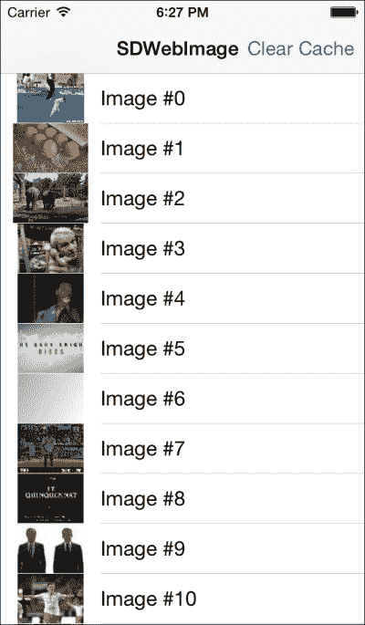
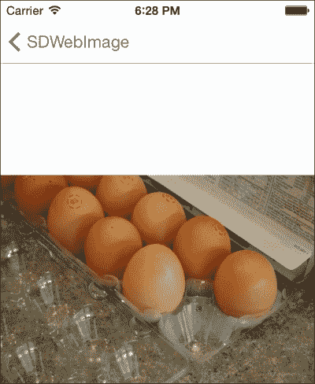

# 第五章 管理您的应用程序数据

在本章中，您将了解管理应用程序数据的概念，以确保您的应用程序在运行时表现最佳。以下内容将涵盖：

+   资源优化

+   磁盘和内存缓存

+   序列化

+   不同形式的数据保存

+   各种数据保存方法的优缺点

我们还将涵盖一些常见的陷阱和假设，人们通常将这些与 iOS 应用程序的开发联系起来。一个例子是图片加载，如果开发者没有仔细规划他们应用程序的正确架构，他们可能会遇到应用程序卡顿或内存不足的情况，从而导致应用程序崩溃。

# 设备内存

就像所有计算设备一样，iPad 和 iPhone 都有有限的内存，您可能会被诱惑在不考虑内存使用的情况下开发应用程序。这样做并不理想，因为无论您在哪个平台上进行开发，内存优化和管理都应该始终是您心中的首要任务。

让我们来看看 iOS 设备中每个设备有多少内存，我们将从 iPhone 开始：

|   | iPhone 4S | iPhone 5 | iPhone 5C | iPhone 5S |
| --- | --- | --- | --- |
| **RAM** | 512 MB | 1 GB | 1 GB | 1 GB |

这里是 iPad 的 RAM：

|   | iPad Air | iPad Mini 2 | iPad Mini Wi-Fi + Cellular | iPad 2 Wi-Fi + 3G | iPad Mini Wi-Fi | iPad 3 Wi-Fi | iPad 3 Wi-Fi + Cellular | iPad 4 Wi-Fi | iPad 2 Wi-Fi |
| --- | --- | --- | --- | --- | --- | --- | --- | --- | --- |
| **RAM** | 1 GB | 1 GB | 512 MB | 512 MB | 512 MB | 1 GB | 1 GB | 1 GB | 512 MB |

现在，内存的量看起来确实很令人印象深刻，您可能会深情地回忆起那些旧日子，当时您的旧台式机运行在 256 MB 的 RAM 上，但请记住，iOS 不会让您玩转完整的 512 MB 或 1 GB RAM。操作系统会为您的设备中的系统进程分配一些，您将只能获得可用 RAM 的一个子集用于您的应用程序。

在您的应用程序中，所有内容都将占用内存和存储空间。其中一些最大的罪魁祸首是二进制资源，例如视频和图片，它们甚至可能成为您类对象的大消耗者，如果您在开发时没有注意到它们，它们可能会占用宝贵的空间。因此，让我们从图片优化开始，因为几乎每个应用程序都会以某种方式使用图片。

## 图片优化

任何应用程序如果没有使用 `.png` 格式和一些漂亮的图片，看起来都会显得单调乏味。然而，关于图片的一个问题是，它们占用的内存比文件大小所暗示的要多得多。一个单独的 1 MB `.png` 文件在加载到内存中时，可能会占用其内存大小的两倍或三倍。原因是 PNG 基本上是一种压缩文件格式，就像 ZIP 文件一样。因此，所有的图像数据都被压缩进 PNG 文件中，当你的应用程序需要显示 PNG 图像时，它需要将 PNG 文件加载到内存中，解压缩它，然后才能获取用于代码的图像数据，在这个过程中会消耗更多的内存。所以，如果你的应用程序有 20 MB 的 PNG 文件，你可能会看到 40 MB 或更多的 RAM 分配仅用于图像。因此，以下是一些图像优化的技巧：

+   将你的图像保存为 PNG-8 而不是 PNG-24，因为 PNG-8 比等效的 PNG-24 消耗更少的 RAM。只有在你需要透明通道时才使用 PNG-24。PNG-8 和 PNG-24 之间的区别在于图像质量和你可以拥有的颜色数量。8 和 24 分别代表每像素 8 位和每像素 24 位。因此，PNG-8 只能支持多达 256 种颜色，而 PNG-24 可以支持多达 1600 万种颜色，所以如果你需要显示颜色丰富的图像，如照片，PNG-24 是最佳选择，而标志和用户界面元素，如图标，可能可以用 PNG-8 来处理。PNG-24 也支持透明度，这对于需要透明背景的图像来说是个优点。因此，了解在哪种情况下使用哪种格式将有助于你减少应用程序的内存消耗。

+   如果你可以使用 JPG 文件，那么请使用它们，因为它们是一种有损格式，这意味着你会有一些图像退化，但通常这种图像退化对肉眼几乎不可见。然而，请注意，JPG 文件不支持透明度。

PNG 是一种无损格式，这意味着当你使用 PNG 文件时，没有图像退化，但代价是它加载到你的设备中时比有损格式的 JPG 消耗更多的 RAM。

所以，如果可能的话，尽量将 PNG 文件和 JPG 文件的数量控制在绝对最小，并且只有在必要时才使用它们。

## 懒加载

懒加载是什么？它是一种设计模式，或者是在软件设计中处理事情的一种方式，其中你只在需要时才加载资源，如 PNG、MP3 文件等。这有助于减轻一次性加载所有资源时内存不足的问题。你只有在需要时以“懒”的方式加载它。还有一个优点，那就是它最小化了应用程序的启动时间，因为你只按需加载资源，这需要更少的时间来加载。因此，你在时间上获得了速度提升。

假设您有多个`UIView`，每个视图有 10 个`UIImages`，但任何时候只能看到一个视图。如果没有经过适当的思考，您可能会倾向于编写一次性加载所有 10 个`UIImages`的代码。然而，经过进一步的反思，问题出现了，即是否有必要这样做。如果您将代码重构为仅在用户可以看到该`UIView`时加载 10 个`UIImages`，并在用户不再查看它时清理它，然后从下一个视图加载下一批`UIImages`，这将对该视图可见，这将更好。这将为您增加一些编码工作，但就有效内存使用而言，这种权衡将是值得的。

这是一种最简单的实现，我们只是覆盖了类的获取方法：

```swift
- (A_Class *)aObject {
    if (aObject == nil) {//Check if the object exists and if not
        aObject = [[A_Class alloc] init];//then create the object
    }

    return aObject;//returns the object
}
```

您可以将前面的代码替换为您的类的正常获取方法。前面的代码检查对象是否存在，如果不存在，则创建对象。然而，如果对象已经存在，则不会再次创建它。

## 控件创建

控件是每个 iOS 应用程序的一部分，它们也会消耗您的设备上的内存，每个实例都会消耗字节和比特的内存。当您创建大量的`UITableViewCell`类时，例如，您迟早会看到一个消耗大量内存的控件。

此外，像加载图像和从远程服务器获取数据这样的任务被认为是缓慢的过程，并将减慢您的应用程序。我相信您已经使用过 iOS 应用程序，当您向下滚动`UITableView`视图对象时，您会注意到当新图像被加载到新出现的单元格中时，会有明显的延迟。在这个人们习惯于在桌面和手机上快速加载图像的世界里，这种缓慢和卡顿的用户界面是不可接受的，并且可能意味着用户是继续与您的应用程序互动还是卸载您的应用程序之间的区别。

基本原则是，您绝对不能让用户等待超过 1 秒或 1 毫秒。为了弥补应用程序感知到的缓慢，一个技巧是在显示旋转器后淡入一个图像，以使用户感觉到应用程序实际上并不非常慢，因为有一个动画正在播放。

如果您正在经历巨大的内存使用，这影响了您 iOS 应用程序的可用性，那么重用您的控件是必须的。稍后，我们将介绍如何使用 Xcode 中的**Instrument**工具来监控内存使用。创建对象是一个昂贵的流程，并且有性能成本。

如果您需要在短时间内动态创建对象，例如快速滚动`UITableView`视图对象，您将体验到一些延迟，因为您的代码将创建新的`UITableViewCell`类而不是重用旧的类。

重复使用 `UITableViewCell` 可以大大提高应用程序的性能。幸运的是，苹果已经为我们创建了重复使用单元格的代码，这可以通过几行代码轻松实现。因此，让我们以以下代码为例，看看 `dequeueReusableCellWithIdentifier` 方法：

```swift
- (UITableViewCell *)tableView:(UITableView *)tableView cellForRowAtIndexPath:(NSIndexPath *)indexPath {
    UITableViewCell *cell = [tableView dequeueReusableCellWithIdentifier:@"Cell"];
    if (!cell) {
        //create a new cell
    }

    //Do what we need with our cell here

    return cell;
}
```

查看前面的代码，你可以看到我们尝试使用 `dequeueReusableCellWithIdentifier` 方法分配一个单元格，如果该单元格已经存在，它将返回对该单元格的指针。接下来，我们的代码（`!cell`）将检查该指针是否不为空，然后创建单元格。这正是我们在上一节 *懒加载* 中使用的相同技术，只不过这次我们将此技术应用于 iOS 控件，在这种情况下，是一个 `UITableViewCell` 对象。这几行代码有三个功能：

+   这有助于防止在向上滚动时应用程序出现卡顿的情况，因为它消除了创建新的 `UITableViewCell` 实例的需求。

+   如果你有一千行数据，但任何给定时间只有四行可见，那么当你只需要创建五个单元格时创建一千个 `UITableViewCell` 是没有意义的。一些其他单元格可能部分可见，因此也需要创建。所以，只有当单元格需要对用户可见时才会创建这五个单元格，而其余单元格则不会加载。

+   虽然 `UITableViewCell` 类本身占用大量内存，但存储一千个这样的类并不容易，通过几行额外的代码，你可以避免不必要的内存使用，并将节省的内存用于代码的其他部分。

# 缓存

缓存是一个在磁盘或内存中存储资源以实现更快访问的概念。缓存将占用更多空间，但在需要更多地考虑加载速度而不是内存的情况下，缓存可以是一个非常有效的技术。考虑以下常见场景：

+   下载大文件，如图片甚至电影

+   将文件写入磁盘

+   从磁盘读取文件并显示它们

如果你遵循前面提到的常规方法，你将面临的一个瓶颈是文件从磁盘加载缓慢。磁盘访问可能比内存访问慢 10,000 倍甚至 1,000,000 倍，这不会提供良好的用户体验，因为用户在等待你的应用程序从磁盘加载文件时会被保持等待。缓存可以帮助减缓这个问题，因为你的文件被保存在内存中，而读取访问更快。

从用户的角度来看，这是很好的，因为他们不需要等待很长时间来加载文件，并且可以帮助优化应用程序的用户体验，因为每一秒钟的浪费都可能导致用户离开你的应用程序。磁盘或内存上的缓存有其优缺点，如下表所示：

|   | 磁盘 | 内存 |
| --- | --- | --- |
| **存储** | 持久性，因为当设备关闭时数据不会丢失 | 临时性，因为当设备关闭时数据会丢失 |
| **速度** | 慢 | 快 |
| **存储大小** | 大 | 小，因为内存通常小于磁盘存储 |

所以，作为一个经验法则，最好首先在内存中进行所有缓存，然后在您的应用程序内存不足或遇到内存警告错误时，才将缓存移动到磁盘上。如果您正在下载大文件，如电影，您需要将电影文件存储在磁盘上，因为文件通常无法适应内存。

作为旁注，缓存实现使用了几个算法，例如 **最近最少使用**（**MRU**）或 **最近最少使用**（**LRU**）。MRU 表示当缓存满时，缓存将首先丢弃最近最少使用的项目，而 LRU 则相反，将丢弃最少使用的项目。实现策略超出了本书的范围，由制造商决定。

幸运的是，我们不需要编写很多代码来实现高效的缓存。有一些 iOS 缓存库我们可以使用，它们可供我们使用。因此，在本节中，我们将查看最受欢迎的缓存库之一。

## SDWebImage

我们将要查看的第一个库名为 SDWebImage。源代码可以通过 Git 克隆从 [`github.com/rs/SDWebImage`](https://github.com/rs/SDWebImage) 下载，并且它还附带了一个演示项目。因此，让我们看看这个演示项目的重要部分。我已经为您总结了以下步骤：

1.  打开 Xcode 项目。

1.  打开 `masterviewcontroller`。

1.  导入 `UIImageView`+`WebCache.h`。

1.  查找 `cellforrowatindexpath` 方法。

1.  将此方法命名为 `setImageWithURL:placeholderImage`。

现在，让我们详细看看这些步骤：

打开 `SDWebImage Demo.xcodeproj` 项目并运行它。您应该看到以下屏幕，其中包含带有图片和文本的表格视图单元格列表：



如果您点击表格视图单元格，它将显示此屏幕，显示您点击的图片的较大尺寸：



接下来，打开 `MasterViewController` 并查找以下代码片段：

```swift
- (UITableViewCell *)tableView:(UITableView *)tableView cellForRowAtIndexPath:(NSIndexPath *)indexPath
{
    static NSString *CellIdentifier = @"Cell";

    UITableViewCell *cell = [tableView dequeueReusableCellWithIdentifier:CellIdentifier];
    if (cell == nil)
    {
        cell = [[UITableViewCell alloc] initWithStyle:UITableViewCellStyleDefault reuseIdentifier:CellIdentifier];
    }

    cell.textLabel.text = [NSString stringWithFormat:@"Image #%d", indexPath.row];
    cell.imageView.contentMode = UIViewContentModeScaleAspectFill;
    [cell.imageView setImageWithURL:[NSURL URLWithString:[_objects objectAtIndex:indexPath.row]]
                   placeholderImage:[UIImage imageNamed:@"placeholder"] options:indexPath.row == 0 ? SDWebImageRefreshCached : 0];
    return cell;
}
```

这里的代码将从服务器获取图片，然后在设备上进行缓存。

要在自己的代码中实现此功能，您需要导入 `UIImageView`+`WebCache.h`，然后调用 `setImageWithURL:placeholderImage` 方法，您可以在其中添加自己的占位符 PNG 和 JPG 图片来替换 `@"placeholder"`。

因此，当您再次运行应用程序时，您会注意到图片不再从服务器拉取，而是从设备上的缓存中提供，因此您会看到图片加载速度更快。

## 对象序列化

什么是序列化？这是一个很多人觉得难以解释或理解的问题。序列化是将数据结构或对象转换成一种格式的方法或概念，以便将其存储在内存或磁盘上进行存储，或者通过网络链路进行传输。它还可以帮助进行内存管理，因为它提供了一个替代机制，即我们将一些文件保存到磁盘而不是内存中，这对于大文件，如电影文件通常是这种情况。序列化格式包括 JSON、XML、YAML 等。幸运的是，对于 iOS 开发者来说，Apple 提供了一个强大的框架，帮助我们在我们想要进行序列化时移除底层代码。因此，当我们想要将我们的数据结构或对象存储在内存或磁盘上时，我们可以使用 Apple 的框架，如 Core Data 或 NSCoding，它提供了一个抽象层，并隐藏了底层的编码工作。

当涉及到数据保存或序列化时，我们往往倾向于坚持我们最熟悉的方法。然而，这并不是一个好的做法，因为各种方法都有其优缺点，我们在决定最佳方法之前应该考虑我们的用例。在这方面，Apple 为我们提供了一些不同的数据序列化方法，这取决于我们，即开发者，来决定哪种方法最适合我们。其中最简单的方法之一是使用 NSCoding。什么是 NSCoding？NSCoding 是 Apple 提供的一个协议，用于将您的数据编码和解码到缓冲区，然后可以持久化到磁盘进行持久存储。

使用 `NSCoding` 协议也涉及到 `NSKeyedArchiver` 和 `NSKeyedUnarchiver` 方法，因为 `NSCoding` 是一个协议，它提供了用于将我们的数据结构和自定义对象序列化成可以存储在内存或磁盘上的格式的代理方法。`NSKeyedArchiver` 和 `NSKeyedUnarchiver` 是实际将我们的序列化数据存储到磁盘以进行持久存储的方法。因此，为了开始，我们将使用一个示例来帮助我们理解序列化和归档在 iOS 应用程序中的工作方式。

使用以下步骤进行以下示例：

1.  将 `NSCoding` 协议添加到您的自定义对象中。

1.  实现 `encodeWithCoder` 和 `initWithCoder` 方法，并分配您希望存储的值。

1.  调用 `archiveRootObject` 和 `unarchiveObjectWithFile` 方法来将您的序列化数据保存到磁盘，并从磁盘加载它。

1.  例如，我们创建了一个名为 `OurCustomObject` 的自定义对象，然后为了使用 `NSCoding` 协议，我们需要将其添加到我们的接口声明中：

    ```swift
    @interface OurCustomObject : NSObject <NSCoding>
    {
        bool isReset;
        NSString *userName;
        int score;
    }
    @property (nonatomic, retain) NSString *userName;
    @property (nonatomic, assign) bool  isReset;
    @property (nonatomic, assign) int score;
    @end
    ```

1.  然后，我们需要编写 `encodeWithCoder` 方法来保存数据：

    ```swift
    - (void)encodeWithCoder:(NSCoder *)coder {
        //do encoding to save the data
        [coder encodeBool:isReset forKey:@"isReset"];
        [coder encodeObject:userName    forKey:@"userName"];
        [coder encodeInt:score forKey:@"score"];
    }
    To load the data back into our objects, we add in the initWithCoder method:
    - (id)initWithCoder:(NSCoder *)decoder {
        if (self = [super init]) {
            self.isReset = [decoder decodeBoolForKey:@"isReset"];
            self.userName = [decoder decodeObjectForKey:@"userName"];
            self.score = [decoder decodeIntForKey:@"score"];
        }
        return self;
    }
    ```

1.  现在我们已经有了将数据编码和解码成序列化格式的代码，我们需要输入实际的代码来将数据保存到我们的设备磁盘上，因此我们可以使用 `NSKeyedArchiver` 来执行实际的磁盘写入操作，同时我们使用 `NSKeyedUnarchiver` 来从磁盘获取数据：

    ```swift
    OurCustomObject *ourObj = [[OurCustomObject alloc] init];
        ourObj.userName = @"John Doe";
        ourObj.isReset   = true;
        ourObj.score = 99;    
       //get our file path
    NSArray *paths = NSSearchPathForDirectoriesInDomains(NSDocumentDirectory, NSUserDomainMask, YES);
        NSString *documentsDirectoryPath = [paths objectAtIndex:0];
        NSString *filePath = [documentsDirectoryPath stringByAppendingPathComponent:@"OurData"];
        [NSKeyedArchiver archiveRootObject: ourObj toFile:filePath];
    ```

1.  然后要从磁盘加载我们的对象，我们只需使用以下代码：

    ```swift
        OurCustomObject *ourObj2 = [NSKeyedUnarchiver unarchiveObjectWithFile:filePath];
        NSLog(@"Score is %d", [ourObj2 score]);
        NSLog(@"Name is %@", [ourObj2 userName]);
    ```

在我们的代码中，没有必要调用`initWithCoder`和`encodeWithCoder`，因为这些方法调用是在你调用`unarchiveObjectWithFile`和`archiveRootObject`时进行的。然而，你需要实现`initWithCoder`和`encodeWithCoder`，因为这两个方法需要包含必要的代码来编码和解码构成`OurCustomObject`的`isReset`、`userName`和`score`变量。正如你所见，与`NSUserDefaults`相比，`NSCoding`是一种相对强大的将数据存储到磁盘的方法，代码也相当容易理解和编写。然而，如果你需要更多数据存储功能，NSCoding 可能不是最佳选择，而 Core Data 将是更好的选择，因为它具有更多功能，例如能够执行查询，针对速度优化，支持不同的序列化格式，如 XML、SQLite 或 NSDate，以及其他好处。

# SQLite

对于熟悉**关系型数据库管理系统**（**RDBMS**）的人来说，SQLite 是一个基于关系模型的数据库。一个 SQLite 数据库，作为 iOS 中可用的 RDBMS，具有许多人们熟悉的功能和功能，如 ACID 属性、查询等。Core Data 是 Apple 的数据存储框架，你可以使用 Core Data 将数据存储到 SQLite 数据库中。然而，在某些情况下，你需要使用 SQLite 而不是 Core Data。因此，我将进一步阐述这一点：

+   SQLite 作为一个数据库，除了 iOS 平台外，还可在多个平台上使用。这意味着，如果你正在开发一个需要在多个平台或有可能在其他非 iOS 平台上运行的应用程序，SQLite 将是你需要认真考虑的选项，因为你将避免使用 Core Data 时框架锁定的问题。SQLite 也比 NSCoding 更快，并且它增加了查询功能，这是使用`NSUserDefaults`时无法实现的。

+   此外，如果你有 SQLite 的使用经验，并且你的数据存储用例非常直接，没有 Core Data 的使用经验，那么你应该选择 SQLite。

+   它不需要**模型-视图-控制器**（**MVC**）概念模型。

现在，这并不意味着当你需要将数据存储到磁盘时，SQLite 应该成为你的默认数据存储解决方案。这是因为还有其他选项，如 Core Data，以及诸如速度和编码的简便性等因素，这些因素将在我们稍后在本章和 Core Data 章节中看到，将在你的决策中扮演重要角色。

## SQLite 与 Core Data 的比较

Core Data 是一个丰富且复杂的对象图管理框架，具有许多你为复杂用例所需的功能。在 *Core Data 编程指南简介* 中，苹果提到 Core Data 框架为与对象生命周期和对象图管理相关的常见任务提供了通用和自动化的解决方案，包括持久化，这意味着它防止你编写大量代码来完成日常数据存储任务。

Core Data 使用的是你的对象模型，这些模型在常用的 MVC 架构中被称为模型。这些模型使你能够存储整个对象，并且与你的 iOS 应用程序中的控制器和视图类紧密相连。因此，使用 MVC 架构的开发者将不会在吸收 Core Data 概念和模型时遇到问题。

使用 Core Data 框架进行开发的工具与 Xcode 深度集成，它使开发者能够快速编写代码并以快速高效的方式布局他们的数据模型，从而节省时间，这让你可以将时间投入到项目的其他部分。

Core Data 框架也适用于 Mac OS，如果你打算创建应用程序的 Mac 版本，这将使你的代码具有可重用性。

通过苹果的 iCloud 存储和计算平台，你可以使用 Core Data 利用 iCloud 在多个设备（如 iPad 等）之间同步你的应用程序和用户数据。iOS 8 通过引入 CloudKit 框架与 iCloud 的集成更加紧密，该框架具有新的功能，例如允许数据集的部分下载，所有这些功能都只能通过 Core Data 实现。

SQLite 是一个纯关系型数据库管理系统（RDBMS），很多人将 Core Data 与 SQLite 混淆。SQLite 是一个 RDBMS，纯粹而简单。因此，它具有许多你将与 RDBMS 相关的特性，例如 ACID 属性、查询等。然而，这就结束了。Core Data 是在数据存储之上的一层抽象，这个数据存储可以是 SQLite 或其他形式的数据持久化，例如 XML 文件。所以，使用 Core Data 仍然可以让你在 SQLite 中存储数据，但有些情况下你可能更愿意使用 SQLite 而不是 Core Data。

如果数据可移植性对你来说是一个重要的特性，那么使用 SQLite 应该是你的首选选择，因为 SQLite 是平台无关的，而 Core Data 仅适用于苹果平台。所以，如果你使用 SQLite，你可以确信你的数据文件几乎可以在支持 SQLite 的任何平台上移动和访问，而不仅仅是苹果支持的平台上。

Core Data 最终是在你的代码和数据库之间的一个抽象层。然而，有时你想要深入到代码的底层，避免抽象层来理解代码是如何工作的。因此，使用 SQLite 将允许你做到这一点，因为它允许你在处理大量数据集时进行底层优化。Core Data 也可以用来抽象对 SQLite 的访问，以节省开发时间并使你的代码更简洁。

最终，关于何时何地使用 Core Data 或 SQLite 并没有硬性规定。在每一个工程项目中，都会有问题和决策需要做出，这涉及到资源数量和平台可扩展性等因素，因为 Core Data 仅支持 Apple 平台，如果你打算支持非 Apple 平台，Core Data 可能不是一个好的选择。因此，使用 Core Data 框架可以让你为简单应用快速找到解决方案，但它也把你绑定在 Apple 的框架上，这阻碍了数据可移植性，就像你创建的应用需要用户数据（如游戏数据）存在于另一个非 Apple 设备上时。如果你使用 Core Data，你将遇到技术锁定。

另一方面，SQLite 允许根据各种原因轻松调整和优化。最终，你的用例复杂性、数据模型以及平台需求将是帮助你做出选择正确选项的因素。

# 摘要

总结来说，本章涵盖了应用数据的管理，包括将数据缓存到内存以及将数据存储到磁盘上。我们还讨论了在不同情况下使用各种存储框架的优缺点，并给出了一些使用 NSCoding 协议和 SDWebImage 开源缓存框架的代码示例。

本章简要介绍了 Core Data，这将有助于我们在下一章深入探讨 Core Data 时，结合一些代码示例。下一章将全部关于 Core Data 及其用途。
