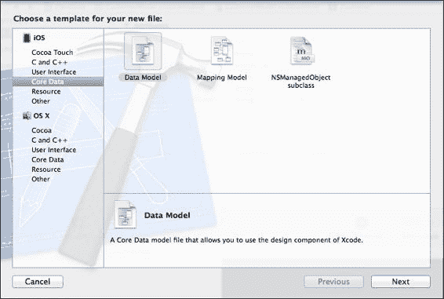
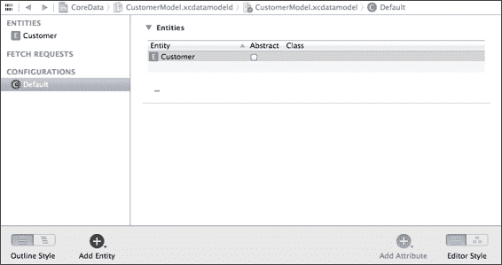
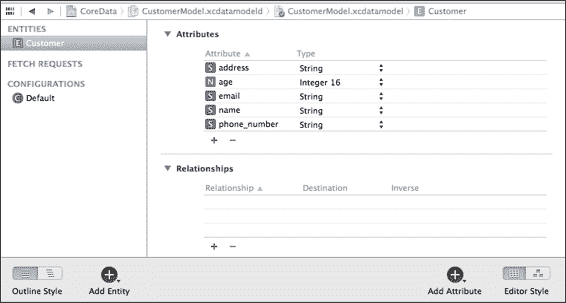
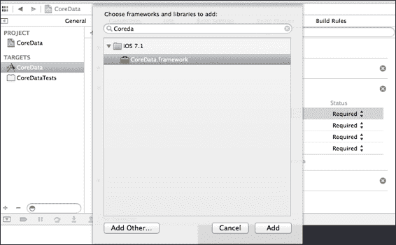
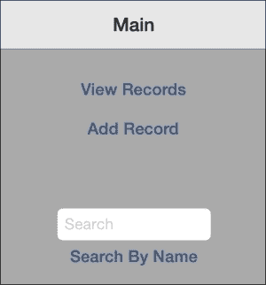
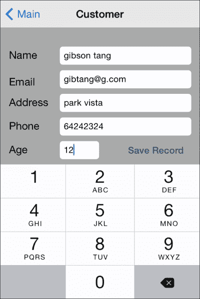
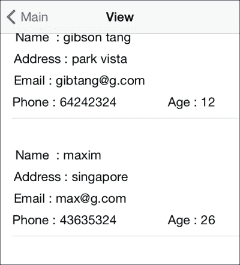
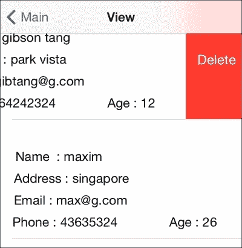

# 第六章. 使用 Core Data 进行持久化

如果您进行任何严肃的 iOS 开发，数据持久化是您迟早会遇到的事情。毕竟，如果一个应用程序不能保存用户数据，并且需要在您再次启动应用程序时重新填写，那么这个应用程序有什么好处呢？

这就是数据持久化出现的地方。实际上，iOS 开发者有几个数据持久化的选项，从属性列表、二进制格式到 SQLite 等。

与这些选项一样，每个选项都有其优点和缺点，何时使用每种特定的持久化方法将取决于您的用例。您还必须编写特定的代码来处理 SQLite 和二进制数据的数据持久化。Core Data 可以用于将数据存储在**plist**、SQLite 和其他格式中，这使得它本身就是一个相当强大的框架，正如我们将在本章中看到的那样。

在本章中，我们将涵盖以下主题：

+   为什么使用 Core Data？

+   Core Data 概念

+   将 Core Data 付诸实践

+   进入代码编写

+   将数据保存到持久存储中

+   从持久存储中删除数据

# 为什么使用 Core Data？

您可能正在想，“为什么我必须学习另一种方法，因为我们已经有了这么多方法？”因此，在本节和随后的页面上，我们将看到为什么 Core Data 是 iOS 和 Mac OS 平台上存储数据的首选方式。

您需要知道的第一件事是，Core Data 本身不是另一种数据持久化方法；它实际上是 SQLite、plists 等之上的抽象。这意味着您实际上可以使用 Apple 的 Core Data API 将数据保存到持久存储中，只需使用 Core Data API，无需编写 plist 特定或 SQLite 特定代码，如果您选择将数据存储为 plists 或 SQLite。这个抽象层说明了为什么 Core Data 如此强大的基本概念。

现在您已经感到震惊，抽象层意味着您只需使用 Core Data API，抽象层将为您处理所有特定存储的代码，因为所有这些高级功能都将帮助您摆脱编写低级代码，这些代码针对每种不同的数据持久化格式，如 SQLite、属性列表等。

Core Data 与 iCloud 紧密集成，并提供了一系列与 iCloud 相关的优势，如数据同步。它还允许您在查询的同时进行实体建模，使其在访问速度方面非常快，并给您选择存储类型的自由，可以是 SQLite、XML 或 NSDate。鉴于 Core Data 提供的所有优势，它需要与 NSCoding 相比编写更多的代码。然而，正如我们稍后将会看到的，代码量并不多，Core Data 框架也不难理解。

关于 Core Data，我还想提到几点：由于它与 Apple 平台紧密集成，你可以访问许多相关类，如`NSFetchedResultsController`，这使得你轻松地将实体添加到`UITableViews`中。它还提供了一个不错的图形对象模型编辑器，允许你轻松地思考你的对象/实体设计，并使用 Core Data 的视觉工具轻松地概念化它。有了所有这些好处，现在让我们深入了解 Core Data。

# 理解 Core Data 概念

Core Data 允许你以多种存储类型存储数据。因此，如果你想使用其他类型的内存存储，如 XML 或二进制存储，你可以使用以下存储类型：

+   `NSSQLiteStoreType`: 这是最常用的选项，因为它只是将你的数据库存储在 SQLite 数据库中。

+   `NSXMLStoreType`: 这种存储方式会将你的数据保存在一个 XML 文件中，速度较慢，但你可以打开 XML 文件，它将是可读的。这个选项可以帮助你调试与数据存储相关的错误。然而，请注意，这种存储类型仅适用于 Mac OS X。

+   `NSBinaryStoreType`: 这种存储方式占用的空间最少，并且由于它将所有数据存储为二进制文件，因此速度最快，但整个数据库二进制文件需要能够适应内存才能正常工作。

+   `NSInMemoryStoreType`: 这种存储方式将所有数据保存在内存中，并提供最快的访问速度。然而，要保存的数据库大小不能超过内存中可用的空闲空间，因为数据是保存在内存中的。然而，请注意，内存存储是短暂的，并且不会永久保存在磁盘上。

接下来，有两个概念你需要了解，它们是：

+   实体

+   属性

现在，这些术语可能对你来说很陌生。然而，对于那些了解数据库的人来说，你会知道它们是表格和列。所以，为了便于理解，可以把 Core Data 实体看作是你的数据库表格，Core Data 属性看作是你的数据库列。

因此，Core Data 通过使用实体和属性的概念来处理数据持久化，这些是抽象数据类型，实际上将数据保存到属性列表、SQLite 数据库或甚至 XML 文件（仅适用于 Mac OS）。回顾一下，Core Data 是 Apple 的**企业对象框架**（**EOF**）的后代，EOF 由 NeXT, Inc 在 1994 年引入，EOF 是一个**对象关系映射器**（**ORM**），但 Core Data 本身不是一个 ORM。Core Data 是一个用于管理对象图框架，它的一项强大功能是它允许你在必要时将对象放入和移出内存，从而处理通常无法适应内存的极大规模数据集和对象实例。Core Data 将 Objective-C 数据类型映射到相关数据类型，如字符串、日期和整数，分别由`NSString`、`NSDate`和`NSNumber`表示。所以，正如你所见，Core Data 不是一个需要学习的全新概念，因为它基于我们所有人都知道的简单数据库概念。由于实体和属性是抽象数据类型，你不能直接访问它们，因为它们在物理上不存在。因此，要访问它们，你需要使用 Apple 提供的 Core Data 类和方法。

Core Data 的类实际上相当多，你不会经常使用它们的所有类。所以，这里有一个更常用类的列表：

| 类名 | 示例用途 |
| --- | --- |
| `NSManagedObject` | 访问属性和数据行 |
| `NSManagedObjectContext` | 检索数据和保存数据 |
| `NSManagedObjectModel` | 存储 |
| `NSFetchRequest` | 请求数据 |
| `NSPersistentStoreCoordinator` | 持久化数据 |
| `NSPredicate` | 数据查询 |

现在，深入探索这些类：

+   `NSManagedObject`：这是一个你将使用并对其执行操作的记录，所有实体都将扩展这个类。

+   `NSManagedObjectContext`：这可以被视为一个智能便签本，在你从持久化存储中检索对象后，临时副本会被带入其中。因此，在这个智能便签本中进行的任何修改都不会保存，直到你将这些更改保存到持久化存储，即`NSManagedObjectModel`。如果你愿意，可以将其视为实体集合或数据库模式。 

+   `NSFetchRequest`：这是一个描述搜索条件的操作，你将使用它从持久化存储中检索数据，类似于大多数开发者熟悉的常见 SQL 查询。

+   `NSPersistentStoreCoordinator`：这就像是粘合剂，将你的托管对象上下文和持久化存储关联起来。

+   `NSPersistentStoreCoordinator`：没有这个，你的修改将不会保存到持久化存储中。

+   `NSPredicate`：这用于定义在搜索或内存过滤中使用的逻辑条件。基本上，这意味着`NSPredicate`用于指定数据如何被检索或过滤，并且您可以与`NSFetchRequest`一起使用，因为`NSFetchRequest`有一个谓词属性。

# 付诸实践

现在我们已经涵盖了 Core Data 的基础知识，让我们继续一些代码示例，展示如何使用 Core Data，其中我们使用 Core Data 在`Customer`表中存储客户详细信息。我们想要存储的信息是：

+   `name`

+   `email`

+   `phone_number`

+   `address`

+   `age`

### 注意

请注意，所有属性名称必须全部小写，并且不应包含空格。例如，我们将使用 Core Data 存储之前提到的客户详细信息，以及使用 Core Data 框架和方法检索、更新和删除客户记录。

1.  首先，我们将选择**文件** | **新建** | **文件**，然后选择**iOS** | **Core Data**：

1.  然后，我们将通过点击屏幕左下角的**添加实体**按钮来创建一个新的**实体**，名为**Customer**，如下截图所示：

1.  然后，我们将继续添加**Customer**实体的属性，并给它们分配适当的**类型**，例如，对于**name**或**address**等属性，可以使用**String**类型，对于**age**可以使用**Integer 16**类型：

1.  最后，我们需要添加**CoreData.framework**，如下截图所示：

1.  因此，我们已经创建了一个由`Customer`实体和一些属性组成的 Core Data 模型类。请注意，所有核心模型类都有`.xcdatamodeld`文件扩展名，对于我们来说，我们可以将 Core Data 模型保存为`Model.xcdatamodeld`。

1.  接下来，我们将创建一个示例应用程序，该应用程序以下列方式使用 Core Data：

    +   保存记录

    +   搜索记录

    +   删除记录

    +   加载记录

现在，我不会涵盖 UIKit 和 storyboard 的使用，而是专注于核心代码，以向您展示 Core Data 的工作示例。因此，为了开始，这里有一些应用程序的截图供您查看，以了解我们将做什么：

+   这是启动应用程序时的主屏幕：

+   插入记录的屏幕如下所示：

+   列出我们从持久存储中所有记录的屏幕如下所示：

+   通过从持久存储中删除记录，您将得到以下输出：

# 进入代码

让我们从代码示例开始：

1.  对于我们的代码，我们首先需要在`AppDelegate.h`文件中的`AppDelegate`类中声明一些 Core Data 对象，例如：

    ```swift
    @property (readonly, strong, nonatomic) NSManagedObjectContext
    *managedObjectContext;
    @property (readonly, strong, nonatomic) NSManagedObjectModel
    *managedObjectModel;
    @property (readonly, strong, nonatomic) NSPersistentStoreCoordinator
    *persistentStoreCoordinator;
    ```

    这些在这里声明，以便我们可以轻松地从任何屏幕访问它们。

1.  接下来，我们将声明在 `AppDelegate.m` 中每个对象的代码，例如以下创建 `NSManagedObjectContext` 实例并返回已存在实例的代码行。这很重要，因为你希望只有一个上下文实例存在，以避免对上下文的冲突访问：

    ```swift
    - (NSManagedObjectContext *)managedObjectContext
    {
        if (_managedObjectContext != nil) {
            return _managedObjectContext;
        }
        NSPersistentStoreCoordinator *coordinator = [self persistentStoreCoordinator];
        if (coordinator != nil) {
            _managedObjectContext = [[NSManagedObjectContext alloc] init];
            [_managedObjectContext setPersistentStoreCoordinator:coordinator];
        }

        if (_managedObjectContext == nil)
            NSLog(@"_managedObjectContext is nil");
        return _managedObjectContext;
    }
    ```

    此方法将创建 `NSManagedObjectModel` 实例并返回该实例，但如果已经存在，则返回现有的 `NSManagedObjectModel` 实例：

    ```swift
    // Returns the managed object model for the application.
    - (NSManagedObjectModel *)managedObjectModel
    {
        if (_managedObjectModel != nil) {
            return _managedObjectModel;//return model since it already exists
        }

        //else create the model and return it
        //CustomerModel is the filename of your *.xcdatamodeld file
        NSURL *modelURL = [[NSBundle mainBundle] URLForResource:@"CustomerModel" withExtension:@"momd"];
        _managedObjectModel = [[NSManagedObjectModel alloc] initWithContentsOfURL:modelURL];

        if (_managedObjectModel == nil)
            NSLog(@"_managedObjectModel is nil");
        return _managedObjectModel;
    }
    ```

    此方法将在不存在时创建 `NSPersistentStoreCoordinator` 类的实例，并在存在时返回现有实例。我们还将使用 `NSLog` 方法在我们的 Xcode 控制台中添加一些日志，以告知用户 `NSPersistentStoreCoordinator` 的实例是否为 nil，并使用 `NSSQLiteStoreType` 关键字向系统表明我们打算将数据存储在 SQLite 数据库中：

    ```swift
    // Returns the persistent store coordinator for the application.
    - (NSPersistentStoreCoordinator *)persistentStoreCoordinator
    { NSPersistentStoreCoordinator
        if (_persistentStoreCoordinator != nil) {
            return _persistentStoreCoordinator;//return persistent store
        }//coordinator since it already exists

        NSURL *storeURL = [[self applicationDocumentsDirectory] URLByAppendingPathComponent:@"CustomerModel.sqlite"];

        NSError *error = nil;
        _persistentStoreCoordinator = [[NSPersistentStoreCoordinator alloc] initWithManagedObjectModel:[self managedObjectModel]];

        if (_persistentStoreCoordinator == nil)
            NSLog(@"_persistentStoreCoordinator is nil");

        if (![_persistentStoreCoordinator addPersistentStoreWithType:NSSQLiteStoreType configuration:nil URL:storeURL options:nil error:&error]) {
            NSLog(@"Error %@, %@", error, [error userInfo]);
            abort();
        }

        return _persistentStoreCoordinator;
    }
    ```

    以下代码行将返回设备上存储数据的 URL：

    ```swift
    #pragma mark - Application's Documents directory// Returns the URL to the application's Documents directory.
    - (NSURL *)applicationDocumentsDirectory
    {
        return [[[NSFileManager defaultManager] URLsForDirectory:NSDocumentDirectory inDomains:NSUserDomainMask] lastObject];
    }
    ```

    如你所见，我们所做的是检查像 `_managedObjectModel` 这样的对象是否为 nil，如果不是 nil，则返回该对象，或者我们会创建该对象然后返回它。这个概念与我们在第五章中讨论的懒加载概念完全相同，即*管理你的应用程序数据*。我们将同样的方法应用到 `managedObjectContext` 和 `persistentStoreCoordinator` 上。我们这样做是为了确保在任何给定时间我们只有一个 `managedObjectModel`、`managedObjectContext` 和 `persistentStoreCoordinator` 的实例被创建和存在。这是为了帮助我们避免有多个这些对象的副本，这将增加内存泄漏的机会。

### 注意

注意，在 ARC 之后的世界上，内存管理仍然是一个真正的问题。所以我们所做的是遵循最佳实践，这将帮助我们避免内存泄漏。

在之前展示的示例代码中，我们采用了一种结构，以确保在任何给定时间只有一个 `managedObjectModel`、`managedObjectContext` 和 `persistentStoreCoordinator` 的实例可用。

接下来，让我们继续展示如何在我们的持久存储中存储数据。如前一个截图所示，我们有 `name`、`age`、`address`、`email` 和 `phone_number` 等字段，它们对应于我们的 `Customer` 实体中的相应字段。

### 注意

本章中的示例代码将在 Packt Publishing 网站上提供完整内容，你可以下载它并直接运行 Xcode 项目。

# 将数据保存到持久存储

要成功使用 Core Data 进行保存，你需要：

+   `NSManagedObject`

+   `NSManagedObjectContext`

+   `NSPersistentStoreCoordinator`

+   `NSManagedObjectModel`

因此，在我们的屏幕中，这些变量被保存到我们的 `Customer` 实体中，以下代码片段为 `(IBAction)save:(id)sender` 方法执行所有魔法。这将使我们能够从新客户或更新现有客户的信息中保存数据：

```swift
- (IBAction)save:(id)sender {
    if ([nameTxtField text].length == 0)
    {
        UIAlertView *alert = [[UIAlertView alloc] initWithTitle:@"Error"
                message:@"Name must not be empty" delegate:self
                        cancelButtonTitle:@"OK" otherButtonTitles:nil];
        [alert show];
        return;
    }
    NSString *name = [nameTxtField text];
    NSString *phone = [phoneTxtField text];
    NSString *email = [emailTxtField text];
    NSString *address = [addressTxtField text];
    int age = [[ageTxtField text] intValue];

    //save using core data
    NSManagedObjectContext *context = nil;
    id delegate = [[UIApplication sharedApplication] delegate];
    if ([delegate performSelector:@selector(managedObjectContext)]) {
        context = [delegate managedObjectContext];
    }//prepare the context for saving

    if (customer)//if we are showing existing customer data
    {
        NSNumber *age = [NSNumber numberWithInt:[[ageTxtField text] intValue]];
        [customer setValue:[nameTxtField text] forKey:@"name"];
        [customer setValue:age forKey:@"age"];
        [customer setValue:[addressTxtField text] forKey:@"address"];
        [customer setValue:[emailTxtField text] forKey:@"email"];
        [customer setValue:[phoneTxtField text] forKey:@"phone_number"];
    }
    else
    {
        // Insert new object into the context
        NSManagedObject *newCustomer = [NSEntityDescription insertNewObjectForEntityForName:@"Customer" inManagedObjectContext:context];
        [newCustomer setValue:name forKey:@"name"];
        [newCustomer setValue:phone forKey:@"phone_number"];
        [newCustomer setValue:email forKey:@"email"];
        [newCustomer setValue:address forKey:@"address"];
        [newCustomer setValue:[NSNumber numberWithInteger:age] forKey:@"age"];
    }

    NSError *error = nil;
    // Save the object to persistent store
    NSString *str;
    if (![context save:&error]) {
        str = [NSString stringWithFormat:@"Error saving %@ with localized description %@", error, [error localizedDescription]];
        NSLog(@"%@", str);
    }
    else
    {
        str = @"Customer record saved to persistent store";
        if (customer)
            str = @"Customer record updated to persistent store";
        NSLog(@"%@", str);
    }

    UIAlertView *alert = [[UIAlertView alloc] initWithTitle:@"Alert"
                                        message:str delegate:self
                                cancelButtonTitle:@"OK" otherButtonTitles:nil];

    [alert show];
}
```

因此，我们需要记住的步骤是：

1.  获取`NSManagedObjectContext`的实例，它使用`managedObjectModel`设置`persistentStoreCoordinator`。

1.  创建一个`NSManagedObject`的实例，并设置你想要保存的值。

1.  使用 `NSManagedObjectContext` 类型的对象并调用 `save` 方法，因为上下文将代表你所做的所有更改，你需要调用 `save` 方法以将上下文中的更改保存到磁盘。

# 从持久存储中删除数据

现在，我们将继续学习如何从持久存储中删除记录。在我们的表格视图中，我们将使用 `NSFetchRequest` 的实例来加载客户，如下所示：

```swift
- (void)viewDidAppear:(BOOL)animated
{
    [super viewDidAppear:animated];

    //Get the context first
    NSManagedObjectContext *managedObjectContext = [self managedObjectContext];

    //load data from Customer entity
    NSFetchRequest *fetchRequest = [[NSFetchRequest alloc] initWithEntityName:@"Customer"];
    self.customers = [[managedObjectContext executeFetchRequest:fetchRequest error:nil] mutableCopy];

    [tblView reloadData];
}
```

在这里，我们将`customers`声明为一个可变数组，用于存储来自`Customer`实体的记录：

```swift
@property (strong) NSMutableArray *customers;
```

要删除一条记录，我们只需从`customers`数组中获取我们的`Customer`记录，这是一个`NSManagedObject`的实例，然后使用`managedObjectContext`的实例调用其上的`deleteObject`方法，最后调用`save`方法来保存我们的更新记录：

```swift
- (void)tableView:(UITableView *)tableView commitEditingStyle:(UITableViewCellEditingStyle)editingStyle forRowAtIndexPath:(NSIndexPath *)indexPath
{
    NSManagedObjectContext *context = [self managedObjectContext];

    if (editingStyle == UITableViewCellEditingStyleDelete) {

        NSManagedObject *obj = [self.customers objectAtIndex:indexPath.row];
        [context deleteObject: obj];

        NSError *error = nil;
        NSString *str;
        // Attempt to delete record from database
        if (![context save:&error]) {
            str = @"Cannot delete record! %@", [error localizedDescription];
            NSLog(@"%@", str);
        }
        else
        {
            // Remove customer from table view
            [self.customers removeObject:obj];

            //update tableview
            [tblView deleteRowsAtIndexPaths:[NSArray arrayWithObject:indexPath]
                           withRowAnimation:UITableViewRowAnimationNone];
            str = @"Record removed";
            NSLog(@"%@", str);
        }

        UIAlertView *alert = [[UIAlertView alloc] initWithTitle:@"Alert"
                                        message:str delegate:self
                                cancelButtonTitle:@"OK" otherButtonTitles:nil];

        [alert show];
    }
}
```

# 更新数据

最后，要更新一条记录，比你想象的要简单得多，多亏了抽象层。要更新数据，我们只需在`(IBAction)save:(id)sender`方法中将值分配给我们的`customer`对象，这个方法你之前已经看到了：

```swift
if (customer)//if we showing existing customer data
{
        NSNumber *age = [NSNumber numberWithInt:[[ageTxtField text] intValue]];
        [customer setValue:[nameTxtField text] forKey:@"name"];
        [customer setValue:age forKey:@"age"];
        [customer setValue:[addressTxtField text] forKey:@"address"];
        [customer setValue:[emailTxtField text] forKey:@"email"];
        [customer setValue:[phoneTxtField text] forKey:@"phone_number"];
    }
```

在我们设置`customer`对象的值之后，我们将添加以下代码：

```swift
NSError *error = nil;
    // Save the object to persistent store
    NSString *str;
    if (![context save:&error]) {
        str = [NSString stringWithFormat:@"Error saving %@ with localized description %@", error, [error localizedDescription]];
        NSLog(@"%@", str);
    }
```

在这里，`customer`是一个`NSManagedObject`的实例：

```swift
@property (strong) NSManagedObject *customer;
```

更新数据的代码需要添加到以下代码片段之后，在`-(IBAction)save:(id)sender`方法内部：

```swift
if ([delegate performSelector:@selector(managedObjectContext)]) {
        context = [delegate managedObjectContext];
    }//prepare the context for saving
```

# 摘要

因此，总结一下，Core Data 并不是特别复杂的东西，使用 Core Data 的代码如我们之前在代码示例中所见，相当直接。Core Data 框架是一个相对容易使用的框架，用于处理数据存储抽象，无需担心不同的数据存储格式。

你必须了解的概念是 Core Data 类，如 `NSManagedObject`、`NSManagedObjectContext`、`NSPersistentStoreCoordinator` 等，以及相关的 `save` 和 `deleteObject` 等方法。通过这些简单的代码行，你可以利用 Core Data 框架在高级抽象层面上进行数据持久化，无需关心低级数据格式规范。

在下一章中，我们将介绍键值编程以及它是如何被用来允许我们通知状态变化的。所以，我希望你喜欢我们关于 Core Data 的这一章！
