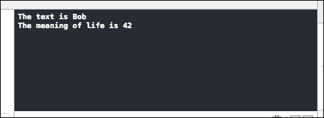

# 第八章. Swift 简介

苹果公司在 2014 年 6 月 2 日在旧金山的 Moscone West 举办了他们的**全球开发者大会**（**WWDC**），与往年一样，地点设在同一个场馆。他们宣布了一系列新的 API、用于游戏的技术如 Metal、新的 iOS（iOS 8）和 Mac（Yosemite）操作系统，以及 2014 年对 iOS 开发者来说最重要的公告，即 Swift 编程语言的发布，有些人认为 Swift 是为了取代 Objective-C，因为 Objective-C 自 1983 年推出以来，由于其历史悠久，已经开始显得有些过时。Swift 旨在成为一个易于学习和简单的编程语言，这将降低那些被 Objective-C 吓到的开发者的入门门槛。然而，Swift 是什么？它有哪些优点？它与 Objective-C 有多大的不同？最后，学习 Swift 有多容易？这些问题我们将在本章中探讨，为了开始，以下是我们将要涵盖的主题列表：

+   欢迎来到 Swift

+   Swift 基础知识

+   内存管理

# 欢迎来到 Swift

Swift 实际上并不是一门新语言，因为苹果公司早在 2010 年就开始了 Swift 的开发。随着像 Ruby、Python、Haskell、Rust 等编程语言的流行，Swift 的开发使用了这些流行语言的语言理念。正如苹果公司将 Swift 描述为“没有 C 的 Objective-C”，你可以将 Swift 视为一种语言，它是对 Objective-C 的重新构想，使用了来自 JavaScript 等语言的现代概念和语法，同时仍然保留了 Objective-C 的本质和精神。

Swift 通过使用 ARC（自动引用计数）来消除指针，并通过这种方式使内存管理对开发者来说是透明的，这样他们就可以专注于 iOS 应用程序的开发，而无需担心大多数时候的内存管理。Swift 使用 ARC 而不是 Java 中发现的 GC（垃圾回收）方法。这意味着如果你不小心使用循环强引用，Swift 仍然可能会泄漏内存。Smalltalk 是一种在 1972 年发布的编程语言，它在架构方面对 Objective-C 产生了重大影响，例如消息传递。Objective-C 中的 Smalltalk 方面，如方法调用，已被点符号和类似 Java 和 C#的命名空间系统所取代。然而，Swift 并不是完全脱离 Objective-C 的。Objective-C 的关键概念，如协议、闭包和类别，仍然存在于 Swift 中，只是语法更加清晰和简洁。

Swift 对内存管理的处理方法是使用 ARC，ARC 的一个问题是开发者可能会无意中创建一个强引用循环，其中两个不同类的实例都包含对另一个类的引用。因此，Swift 提供了弱引用和弱引用键（unowned）来防止强引用循环的发生。

对于一个有 C 或 C++背景的资深 Objective-C 程序员来说，Swift 可能看起来像一门全新的语言，因为它摒弃了一些 Objective-C 的方面，例如冗长性。我相信很多 Objective-C 开发者都经历过“方括号地狱”，其中简单的功能需要用很多方括号包裹，这使得代码难以阅读，并且也可能会将错误引入你的应用程序。Swift 的目标是让开发者能够在没有 C 的情况下利用 Objective-C 的力量。因此，Swift 确实有一些方面让开发者更容易使用，但相反，Swift 也有一些部分似乎还没有完全完善。然而，请记住，在撰写本文时，Swift 仍然处于 beta 测试阶段，Apple 在接下来的几周和几个月内可能还会引入很多变化。然而，随着 Apple 全力支持 Swift，现在是开始学习一些 Swift 基础的好时机。就像 Apple 引入的所有新技术一样，你需要 Xcode 6 beta 或更高版本来运行和构建你的 Swift 代码，因为 Xcode 5 不支持 Swift。你的 Swift 代码也可以在 iOS 7 和 Mac OS 10.9.3 上运行。所以，如果你是苹果开发者，你可以下载 Xcode 6 beta 并将其安装在你的 Mac 上，因为它将与你的 Xcode 5 并行安装，不会覆盖任何内容或破坏你的当前 Xcode 项目。那么，让我们开始吧。

# Swift 基础

Swift 的语法与 Objective-C 非常不同，虽然 Objective-C 有很多依赖于 C 和 C++组件，如指针、强类型等。Swift 在简洁性和变量声明方面与流行的脚本语言（如 Python 和 Ruby）非常相似。让我们看看 Swift 的一些基础知识，以便熟悉它。

## 变量声明

Swift 摒弃了记住`int`、`float`、`NSString`等的需求，并将所有这些类型的变量合并为一种类型，即`var`类型。如果你熟悉 JavaScript，那么`var`关键字应该不会陌生。Swift 支持类型推断，根据你分配给变量的值，它会推断其类型：

```swift
var welcome
welcome = "Hello world"
```

这意味着变量`welcome`被推断为字符串类型，因为我将它赋值为文本`Hello world`。然而，如果你想更具体一些，你可以这样注释一个变量：

```swift
var welcome: String.
```

然后在 Swift 中，要将两个字符串连接起来，你可以这样做：

```swift
welcome += " Bob"
```

如果你之前使用的是 Objective-C，你需要输入更长的语法：

```swift
NSString *hello = @"Hello world";
str = [str stringByAppendingString:@" Bob];
```

Swift 还支持使用`let`关键字声明常量。因此，要声明一个常量，你只需输入以下语法：

```swift
let LIFE_MEANING = 42
```

注意，Swift 现在推断 `LIFE_MEANING` 是一个整数，因为你已经将它赋值为 `42`。要打印一行用于日志的文本，类似于 Apple 的 Cocoa 框架中的 NSLog，你可以使用 `println` 关键字，而使用 NSLog 时，你需要指定格式说明符，例如 `%d` 用于整数，`%@` 用于 NSStrings，或 `%f` 用于 float/double。

对于 Swift 来说，没有必要这样做；你可以直接使用以下语法示例：

```swift
println("The text is \(welcome)") //print out the value of variable welcome
println("The meaning of life is \(LIFE_MEANING)")//print out the meaning of life
```

一件没有从 Objective-C 改变的事情是，Swift 中的注释用 `//` 表示单行注释，用 `/*` 和 `*/` 表示多行注释。

分号也是可选的。有些人可能想过于严谨，会加上分号，但就我个人而言，我不喜欢比必要的多打任何多余的字符，所以我倾向于在我的 Swift 代码中省略分号 (;)。



与所有编程语言一样，Swift 支持用于算术比较和赋值的运算符数组。

所有如 `/`、`*`、`+` 等运算符的功能与 Objective-C 中相同，只是 `+` 运算符在需要连接多个字符串时还充当字符串连接运算符的双重功能。

Swift 引入了闭区间运算符的概念，它定义了一个从 *x* 到 *y* 的范围，如果你使用它像这样 (*x...y*)，它包括 *x* 和 *y* 的值。例如：

```swift
for index in 1...5 { print("Value is \(index)") }
```

这将打印出值 **1**、**2**、**3**、**4** 和 **5**。正如你可能已经注意到的，这可以用来替换 Objective-C 中更冗长的传统 for 循环，它由以下代码行表示：

```swift
for (int i = 0; i <= 5, i ++)
NSLog(@"Value is %d", i);
```

然而，如果你想要执行一些常见的 `for` 循环代码来遍历数组呢？那么，你需要一个半开区间运算符，它与闭区间运算符类似，只是少了一个点 (*x..y*)：

```swift
let breeds = ["Pitbull", "Terrier", Bull dog", "Maltese"]
let count = breeds.count
for i in 0..count { println("This breed is \(breeds[i])") }
```

如你之前所见，Swift 也支持集合类型，如之前展示的数组以及字典，我们将在接下来的几页中介绍。要开始声明一个数组，你只需使用以下语法：

```swift
var catBreeds = ["Siamese", "Scottish"]
```

然后，还有一些有用的属性，例如：

+   `count`：这个属性返回数组中的项目数量

+   `isEmpty`：这是一个布尔变量，当计数属性为 `0` 时返回 true

+   `append`：这个属性将允许你向数组的末尾添加一个项目

Swift 提供了一些辅助代码来迭代数组，而不是使用 `for` 循环、`while` 循环或 `do-while` 循环。在 Swift 中，数组迭代更容易，因为你只需这样做即可进行迭代：

```swift
for item in catBreeds{
  println(item)
}//prints out "Siamese" and "Scottish"
```

你不再需要为 `for`、`while` 或 `do-while` 循环编写任何冗长且不必要的代码，因为你可以使用项目变量来访问数组。

接下来，我们将介绍字典。在 Swift 中，字典的功能和用法与 Cocoa 中的 `NSDictionary` 类似。然而，有一个主要区别在于，在 `NSDictionary` 和 `NSMutableDictionary` 中，你可以使用任何对象作为键和值，这并不提供有关对象性质的信息。在 Swift 中，字典中键和值的类型总是通过显式类型注解或类型推断明确指定。

Swift 中字典的语法非常简单，如下所示：

```swift
var breeds = Dictionary<String, String> = ["Breed1": "Bull Dog", "Breed2": "Terrier"]
```

前面的代码使用了显式的类型表示法，正如你所见，键和值被明确地定义为 `String` 和 `String`。这与你在 JavaScript 中声明字典或在 Java 中声明 Map 的方式非常相似，只需运行以下代码即可：

```swift
var breeds = ["Breed1": "Bull Dog", "Breed2": "Terrier"]
```

前面的代码使用了类型推断，一旦我们将 `Breed1` 分配给键，将 `Bull Dog` 分配给值，Swift 就会自动推断我们的字典将包含两个字符串。

在 Swift 中修改字典的方式与访问数组类似，只是你使用键而不是索引，在我们的例子中键是一个字符串。因此，如果你想修改映射到 `Breed1` 键的值，你可以像下面这样操作：

```swift
breeds["Breed1"] = "Dalmatian"
```

另一方面，Swift 允许我们以另一种方式更新值，即 `updateValue` 方法，如下所示：

```swift
breeds.updateValue("Breed2", forKey: "Bloodhound")
```

这两种方式都可以让你使用键来更新值，但我更喜欢第一种方式，因为它更简洁，但同样易于阅读和理解。

在 Swift 中遍历字典与遍历数组类似，我们可以放弃旧的 Objective-C `for`、`while` 或 `do-while` 循环方法。要在 Swift 中进行字典迭代，我们只需使用以下代码：

```swift
for (breed, breedname) in breeds{
  println("\(breed) is \(breedname)")
}//prints Breed1 is Dalmation, Breed2 is Bloodhound
```

在任何通用编程语言中，控制流语句都是必要的，以便控制代码和应用程序的流程。因此，尽管 Swift 与 Objective-C 相去甚远，但它仍然允许使用类似于 C++ 的 C 语言风格的控制流结构。

这里是一个 Swift 中可用的控制流结构的列表：

+   `for` 循环

+   `for-in` 循环

+   `while` 循环

+   `do-while` 循环

+   `if` 语句

+   `switch` 语句

这些控制流语句与 Objective-C 中的作用相同，但它们有一些改进，我将简要解释。

## 迭代语句

对于像 `for` 循环这样的重复执行语句，Swift 强调使用 `for-in` 循环进行迭代。在其他编程语言（如 Java）中也称为增强型 for 循环。这提高了代码的可读性，并使代码更加简洁。例如：

```swift
var dogs = ["Bulldog", "Terrier", "Dalmatian"]
for dog in dogs {
  println("This dog is a \(dog)");
}
```

然而，如果你需要 Objective-C 传统的 `for` 循环风格，你可以使用 Swift 来实现，如下所示：

```swift
for index = 0; index < 3; ++index {
//do something here
}
```

## 条件语句

If 语句的行为与 Objective-C 中的行为相同，除了语法上有一个小的变化，如下所示。请注意，括号是可选的，所以我们没有将它们放在条件表达式周围：

```swift
if temperatureInCelsius < 10 {
  println("It is cold here");
}
```

注意，在前面的例子中，我们有一个非常简单的条件，所以我们选择消除我们的括号。但是，如果你有多个条件呢？在这种情况下，Swift 将使用你熟悉的正常优先级规则，但缺少括号可能会使操作难以理解。因此，在这种情况下，我更倾向于使用括号来处理多个条件和操作，如下所示：

```swift
if (temperatureInCelsius < 10) && (temperatureinCelsius > 0)
{
  println("It is chilly here");
}
```

然而，在 Swift 中，Switch 语句现在通过不需要进入下一个 case 来简化了调试。因此，现在整个 switch 语句在第一个匹配的 switch case 完成后立即完成其执行。所以，下面的语句将显示以下输出：

```swift
let number = 2
switch number {
  case 1:
    println("Number is 1");
  case 2:
    println("Number is 2");
  case 3:
    println("Number is 3");
}
```

在 Swift 中，输出将是 `"Number is 2"`，而不是在 Objective-C 中看到的 `"Number is 1"` 和 `"Number is 3"`。

Swift 中的控制流已经得到改进，语法已经改进以提高可读性，并防止开发者创建非明显的错误，例如由于缺少`break`语句而导致的 Switch case fallthrough。

## 函数

函数是每种编程语言的基本构建块，在 Swift 中也是如此，但也有一些改进，我们现在将介绍。函数的语法已经发生了很大的变化，因此 Swift 中的函数现在具有以下语法：

```swift
func animalType(animalName: String)-> String {
  let text = "This is a " + animalName
  return text;
}
```

因此，你可以使用 `println(animalType("Dog"))` 来调用它。如果一个函数没有返回值，你可以避免添加箭头（`->`），如下所示：

```swift
func animalType(animalName: String) {
  println("This is a \(animalName)")
}
```

Swift 中的函数现在可以具有多个返回值，作为复合返回值的一部分，你可以使用元组返回类型。

元组类型只是对由逗号分隔的零个或多个类型列表的一个花哨的称呼，这些类型被括号包围。因此，为了让一个函数有多个返回值，你需要使用元组，如下所示：

```swift
func myFunc(iCount: Int) -> (intA: Int, intB: int) {
  var intX = 1, intY = 2
  intA = iCount + intX
  intB = iCount + intY
  return (intA, intB)
}
```

然后为了使用返回值，你需要将其分配给一个变量：

```swift
let num = myFunction(10)
println("Value is \(num.intA) and \(num.intB)")
```

Swift 允许在函数中使用默认值，如果函数参数没有被使用，将使用默认值：

```swift
func add(num1: Int, num2: Int = 0)
{
  var total = num1 + num2
}
```

因此，在前面的例子中，如果在不传递第二个参数的情况下调用 add 函数，`num2`将具有默认值 0，如下所示：

```swift
add(1)
```

Swift 函数还允许函数接受可变数量的参数，这在需要向函数传递可变数量的参数时非常有用。要使函数能够接受可变数量的参数，你只需要在你的函数中添加三个点（`...`），如下所示：

```swift
func getAverage(numbers: Double...) -> Double
{
  var total: Double = 0
  for num in numbers {
    total += num
  }

  total = total&/Double(num.count)
  return total
}
```

因此，你可以使用可变数量的参数调用`getAverage`函数，例如`getAverage(1, 2, 3)`或`getAverage(1, 2, 3, 4, 5)`。默认情况下，Swift 将所有函数参数视为常量，以促进良好的编程实践。这是 Swift 的更多独特功能之一，你在其他过程式编程语言（如 C++、Objective-C 等）中找不到。因此，尝试修改函数参数将导致错误。但是，如果你需要在代码中修改函数参数，你只需添加`var`关键字来告诉 Swift 将该函数参数视为变量，而不是常量，如下所示：

```swift
//num is now a variable and can be modified inside the function myFunction
func myFunction(var num: Int)
{
}
```

Swift 中函数的一个重要变化，与 Objective-C 不同，是你可以在另一个函数内部创建嵌套函数。但请注意，内部函数仅对封装函数可用。要声明嵌套函数，你只需使用正常的函数调用即可：

```swift
func adder(num: Int)
{
  func addOne(number: Int) -> Int   { return number + 1 }
}
```

## Swift 中的类和结构体

如你所知，类和结构体是通用数据结构，是应用程序代码的构建块。你可以定义属性和方法来为这些类和结构体添加功能，使用与变量、函数等相同的语法。

Swift 中的类和结构体有许多共同点，例如：

+   定义属性以存储值

+   定义方法以提供附加功能

+   能够扩展以扩展其功能

+   能够遵守协议以提供标准功能

然而，类与结构体有其他结构体不具备的差异；它们是：

+   继承，允许子类继承另一个类的特性

+   类型转换，允许你在运行时检查和解释类实例的类型

+   引用计数，允许对类实例有多个引用

+   析构器，允许类进行资源释放

+   结构体在你代码中传递时会被复制

要声明一个类或结构体，分别使用`class`和`struct`关键字：

```swift
class myClass {
  var x = 0
  var y = 0
}

struct myStruct {
  var x = 0
  var y = 0
}
```

与 Objective-C 一样，要使用`struct`或`class`，你需要在使用它之前创建其实例。因此，对于`struct`和`class`，你需要使用`()`来创建`class`或`struct`的实例。

```swift
let classA = myClass()//creating an instance of a class
let structB = myStruc()//creating an instance of a struct
```

要访问`class`或`struct`中的属性，你可以使用"`.`"运算符来访问它，如下所示：

```swift
var myX = classA.x
var myY = structB.y
```

对于类，你可以在你的类文件中定义自己的自定义初始化器和析构器。你的结构体成员的初始化器会自动为你创建，你可以使用，如下所示：

```swift
let yourStruct = myStruct(x: 50, y: 80)
```

通常，你不需要手动清理你分配的实例，因为 Swift 会为你使用 ARC 来完成。然而，如果你使用了一些自定义资源，那么你可能需要自己进行额外的清理。一个用例是当你有一个类打开一个文本文件并向其中写入或追加数据时。所以，在这种情况下，你可能需要在你的实例被销毁之前关闭文件。一个初始化器语法的例子如下：

```swift
deinit{
//Your deinitialization code here which could be closing an open file etc
}
```

Swift 类和 Swift 结构体之间最重要的区别之一是 Swift 类是通过引用传递的，这意味着当你将它赋给另一个实例时，会创建现有类实例的引用，任何对新的实例的改变都会影响原始实例。这与按值传递形成对比，按值传递会将值的副本传递给变量，因此新变量中发生的事情不会影响原始变量。

因此，根据这种差异，在某些情况下使用类可能更有用，而在其他情况下使用结构体会更好。这完全取决于你的程序或应用程序的上下文。所以，让我们用一些代码来帮助我们更好地理解这一点：

```swift
classA = myClass()
classA.x = 80
classB = classA
classB.x = 100
```

如果你使用以下代码，你会注意到`classA`成员`x`也会被设置为`100`的值，因为当你运行`classB = classA`代码时，会传递一个`classA`的引用。所以，任何影响`classB`的也会影响`classA`。

## 闭包

Swift 中的闭包在 Objective-C 中被称为 blocks。两者都有创建自包含代码块的概念，这些代码块可以被传递和使用。

闭包使用`{`和`}`分别表示开始和结束。所以，创建一个闭包并调用的一个非常简单的例子可能是这样的：

```swift
  var name = "Gibson"
      var greet = {  println("Hello \(name)")   }
      greet()
```

你可以在你的调试控制台中看到输出**Hello Gibson**。

当然，你需要向闭包传递参数并从闭包获取返回值。你还需要使用`(`和`)`来包围你的参数，并使用`->`来表示你的返回值，就像你在这里看到的那样：

```swift
  var s1: String = "Howdy"
      var name: String = "Gibby"
      var holler = { (s1: String, name: String) -> String in
            return s1 + " " + name
        }
        var ret = holler(s1, name)
        println(ret)
```

如果你运行代码，你会得到输出**Howdy Gibby**，因为我传递了两个字符串变量`s1`和`name`，分别对应于你从`(s1: String, name: String)`行中看到的，而我要求返回一个字符串类型的值，使用`-> String`。

接下来，让我们继续讨论 Swift 中的内存管理，这你仍然需要注意，因为自动引用计数（ARC）让你免于许多内存管理技术，但你仍然需要在 Swift 中注意一些内存管理技术，因为如果你不小心，Swift 仍然可能会泄漏内存。

# Swift 中的内存管理

Swift 的创建是为了避免 C 语言的一些缺点，其中之一就是内存管理。注意，在本章中，我并没有提到任何关于指针、内存分配、释放等内容。这是因为 Swift 中的内存管理被设计得尽可能简单，以便你，作为开发者，可以更多地关注应用程序开发而不是调试内存泄漏。每当创建一个新的类实例时，ARC 会分配一块内存用于存储该实例的信息。这块内存包含有关实例类型（字符串、整数等）以及与该实例相关联的属性值等信息。当该实例不再需要或被引用时，ARC 会释放该实例使用的内存。这是为了避免实例在不再使用或需要时仍然占用宝贵的内存空间的情况。

然而，如果你在 ARC 释放实例之后尝试访问实例的属性或方法，那么你很可能会看到崩溃的结果。所以，为了确保这种情况不会发生在你身上，ARC 会跟踪当前有多少属性、变量和常量正在引用一个类实例，并且只要代码中的某个地方至少有一个活动引用指向该实例，ARC 就不会允许释放。当你将类实例赋给属性、常量或变量时，就会创建一个强引用，这个强引用会紧紧地保持对那个类实例的控制，并且只要这个强引用存在，ARC 就不会进行释放调用。让我们通过一些代码来进一步说明这一点：

1.  让我们声明一个名为 `Dog` 的类：

    ```swift
    class Dog {
      let type: String
      init(_type: String) {
        self.type = _type
        println("Init done")
      }
      deinit {
        println("Deinit done")
      } 
    }
    ```

1.  然后，我们将创建两个对 `Dog` 类的引用：

    ```swift
    var dog1: Dog?
    Var dog2: Dog?
    ```

    ### 注意

    注意到存在一个 `?` 关键字，这意味着 `dog1` 是一个可选类型，这意味着它可能是 nil。在 Swift 中，任何带有 `?` 关键字的变量都意味着它有可能包含一个 nil 值。由于我们声明了 `dog1` 和 `dog2` 为可选类型，这意味着 `dog1` 和 `dog2` 被初始化为 nil 值，并且没有对 `Dog` 类的引用。

1.  接下来，我们将创建一个实例，并将两个变量分别赋值为 `dog1` 和 `dog2`：

    ```swift
    dog1 = Dog(type: "Bulldog")
    dog2 = dog1//1 strong reference to dog1 is created
    ```

    现在，有两个对 `Dog` 实例的强引用。一个是通过 `dog1`，另一个是从 `dog2` 到 `dog1`。

    关于 Swift，有一点需要注意，类型推断仅适用于初始赋值；将另一个类型赋给同一变量将引发错误。这与 JavaScript 等其他语言截然不同，后者不会抛出错误。让我用一个例子来说明我的意思：

    ```swift
    var hello = "Hello World"//this means hello is inferred to have a type of string 
    hello = 42 
    //This will throw an error as now you are assigning an integer to a string variable
    ```

1.  因此，你可以尝试将 `dog1` 赋值为 nil，如下所示：

    ```swift
    dog1 = nil
    ```

    ARC 会看到 `dog2` 仍然持有强引用，因此不会释放 `Dog` 实例。`Dog` 实例将被释放的唯一情况是当 `dog2` 被设置为 nil，如下所示：

    ```swift
    dog2 = nil //this will let ARC deallocate the Dog instance
    ```

相反，Swift 也支持弱引用，其中引用没有对它引用的实例的强引用。因此，即使有弱引用，ARC 也会销毁实例。要创建弱引用，你需要使用 `weak` 关键字，如下所示：

```swift
weak var cat: String?
```

注意，`?` 关键字被添加到 `String` 关键字末尾，因为弱引用可以允许有 `nil` 的值，所以所有弱引用都必须使用 `?` 关键字声明为可选。注意，它也被声明为变量，因为弱引用的值在代码运行时可能会改变。因此，弱引用不能声明为常量，因为弱引用对其引用的实例没有强引用。所以，当这个实例即将被释放而弱引用仍然指向它时，ARC 会在这种情况下将弱引用设置为 `nil`，你可以检查弱引用的值以查看该对象是否已被释放。这样你可以避免出现最终得到一个指向已由 ARC 释放的无效实例的引用的情况。

在强引用和弱引用之间，还有一种引用类型，它对其引用的实例保持弱引用，但不能设置为 `nil`，因此它总是假定有一个值。这被称为非拥有引用。它可以作为弱引用的替代品，以及在某些用例中，正如我们将在这里看到的：

```swift
class Country {
  let name: String
  let capital: City!
  init(name: String, capital: String) {
    self.name = name
    self.capital = City(name: name, country: self)
  }

class City {
  let name: String
  unowned let country: Country
  init(name: String, country: Country) {
    self.name = name
    self.country = country
  }
}
```

注意，我们在 `Country` 的初始化方法中初始化了 `City`，但我们还需要在 `City` 的初始化方法中初始化 `Country`，这本身就是一个难题，因为 `Country` 依赖于 `City` 的初始化器，而 `City` 依赖于 `Country` 的初始化器。为了解决这个问题，你可以将 `Country` 的 `capital` 变量声明为一个隐式解包的可选属性，这可以通过使用 `!` 来表示。这意味着 `capital` 属性将有一个默认值 `nil`。

`!` 关键字还充当一个解包函数，你可以获取属性值而不必将该属性分配给局部变量。如前所述，带有可选符号（即 `?` 关键字）的变量可以包含一个值或者什么都没有。因此，当你测试这个类型为可选的变量时，你需要知道是否有值，而不必直接访问其底层值。`!` 关键字意味着你可以解包变量以获取访问值。

然而，这并不能免除你检查该属性是否为 `nil` 的责任，因为你仍然需要在代码中检查 `nil`。

因此，现在的情况是 `capital` 具有默认的 nil 值，一旦 `Country` 实例在其初始化方法中设置了其 `name` 属性，它就被视为完全初始化。这意味着 `Country` 初始化方法可以在设置 `name` 属性后立即开始引用和传递其 `self` 属性。因此，现在 `Country` 初始化方法可以在设置自己的 `city` 属性时，将 `self` 属性作为参数之一传递给 `City` 初始化方法。

# 摘要

如您所见，Swift 在语法、风格和范式方面与 Objective-C 有很大不同。Swift 是为了摆脱编程中的 C 范式，在那里我们需要理解内存管理、分配和释放。我们回顾了 Swift 的一些基本特性，并指出 Swift 具有更简洁的代码，内存管理更加简单，因为 ARC 在 Swift 中为我们处理内存管理。然而，Swift 在撰写本文时仍处于测试阶段，因此在其走向 alpha 版本和发布状态的过程中，其功能仍可能发生变化。因此，您可以预期在此期间某些功能可能会被添加或删除。但是，Swift 的基础将不会发生重大变化，我希望这一章能帮助您更好地理解 Swift，并为您在不久的将来使用 Swift 进行编程做好准备。

要了解更多关于 Swift 的信息，最佳参考资料是苹果公司 Swift 编程网站 [`developer.apple.com/swift/blog/`](https://developer.apple.com/swift/blog/)，因为自 Swift 公布以来，该网站的内容一直持续更新。

在下一章中，我们将探讨使用 Xcode 中的一些优秀工具（如静态分析器）进行内存管理的技术，我们还将更详细地介绍各种技术，以便您知道在不同情况下哪种调试工具是最好的工具。
