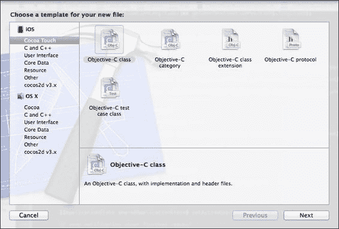
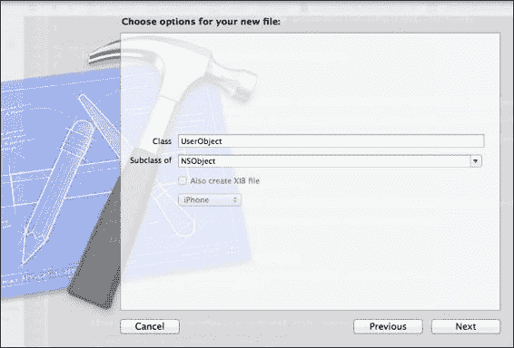
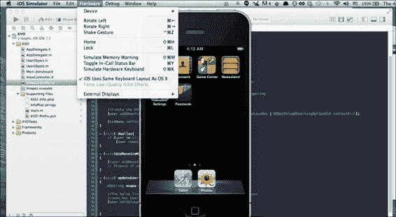

# 第十章. 内存管理的技巧和窍门

内存管理是每个处理 Objective-C 的程序员都会遇到的问题，尽管苹果引入了许多工具来帮助查找与内存相关的问题，如 Instruments 和 NSZombies。在本章中，我们将探讨一些更微妙的技术和工具，有些是显而易见的，有些将为你提供关于 Objective-C 的新视角。我们还将涵盖一些重要主题，例如：

+   使用 @property 关键字

+   使用获取器/设置器方法

+   理解 Objective-C 中的属性属性

+   何时避免使用 KVC 和 KVO

因此，让我们开始吧！

# Objective-C、C 和内存管理

Objective-C 和 C 编程语言密切相关，因为 Objective-C 是 C 的一个真正的超集，这意味着在 C 中工作的一切都将与 Objective-C 一起工作。因此，本质上这也意味着你在 C 或 C++ 中熟悉的内存管理方法和协议也将适用于 Objective-C。然而，Objective-C 的一个好处是编译器在幕后为你做了大量的内存管理工作。这意味着与 C 或 C++ 相比，在 Objective-C 中处理内存管理不需要编写太多的代码。

然而，请注意，尽管你可以混合使用 C++ 和 Objective-C，但 Objective-C 并不是 C++ 的超集。这并不意味着你可以完全放手内存管理，因为 Objective-C 没有像 Java 那样的垃圾回收器。

随着 Xcode 4.2 和 iOS 4 及 5 及以后版本的 **自动引用计数（ARC**） 支持的发布，世界各地的开发者都认为他们繁琐的内存管理日子已经结束，但不要误解，你需要记住 ARC 是一个编译时内存管理机制，编译器将检查源代码，然后在编译后的代码中添加 `retain` 和 `release` 消息。ARC 不是 Java 和 C# 程序员熟悉的传统垃圾回收机制，垃圾回收是在运行时由垃圾回收器完成的。

因此，ARC 的引入意味着作为开发者的你甚至需要更少的输入，因为你不需要在代码中显式地输入 `retain` 和 `release` 消息，这使得你的代码更加冗长。然而，正如我们在前几章中看到的，当我们介绍了保留周期和其他类型的内存泄漏时，使用 ARC 意味着你仍然需要了解内存管理原则，这正是 Objective-C 和 Xcode 与其 C 编程语言对应物相比的优势所在。其内置机制帮助程序员通过一系列良好的实践避免内存泄漏。因此，让我们在本章中详细探讨这些良好实践。

# 获取器和设置器

如果您已经进行了一些 Java 和 C# 编程，并且来自 Java 或 C# 背景，您应该熟悉获取器和设置器方法，或者您可能也知道它们分别被称为访问器和修改器。它们是良好编程的基本支柱。获取器/设置器或访问器/修改器，也被称为用于保持封装原则的方法，其中成员变量被设置为私有以保护它们免受可能有害的其他代码的影响，而获取器/设置器充当私有成员变量和其他代码之间的守门人或中介。看看以下代码行：

```swift
public int getAge()
{
  return Age;
}
public void setAge(int _age)
{
  Age = _age
}
```

从 Java 或 C# 的角度来看，前面的两种方法应该不会让您感到陌生。如果使用不当，获取器和设置器可能会被认为是糟糕的。将变量设置为公共的，同时编写获取器和设置器方法是一个很好的例子，因为这违反了封装的概念。现在，获取器和设置器方法是推荐编程实践的良好基础，因为它们提供了以下好处以及更多：

+   隐藏对象的内部状态

+   设置不同的访问级别，如只读、只写等

+   创建一个公共接口将使您在需要更改实现层时更容易进行代码更改，这在您需要跨多个文件进行更改时将变得明显

+   允许您通过这些获取器和设置器方法对您的对象执行的操作进行严格的规则约束

获取器和设置器方法通常以 get 和 set 前缀开头。这可能会让您感到惊讶，但 Objective-C 对获取器和设置器方法提供了非常强的支持。然而，您可能会问：“Objective-C 中的获取器和设置器方法在哪里？我不记得设置过任何以 `get` 或 `set` 开头的方法或编写过任何代码？”然而，实际上，它们确实存在，并且已经存在于您的代码中，但您还没有意识到这一点，因为 Objective-C 为您提供了一个抽象层，这样您就不需要花费太多时间编写获取器和设置器方法。这个抽象层允许我们稍后看到，您可以通过代码中的 `@property` 关键字定义获取器和设置器方法以及各种属性，如 `readonly`、`readwrite` 等。获取器和设置器与内存管理密切相关，因为您可以在这些方法中编写代码来清理内存。

# Objective-C 中的属性属性

如果您已经进行了一些 Objective-C 编程，您可能会遇到以下语法：

```swift
@property (nonatomic, readonly) UIView *rearView;
or
@property (nonatomic, retain) UIActivityIndicatorView *loadingView;
```

现在，我敢打赌，当你将这些属性如`nonatomic`等分配给对象时，你对诸如`nonatomic`或`retain`之类的术语的含义可能只有一个模糊的概念。这些关键字，如`nonatomic`或`readonly`，实际上定义了您的对象的属性，这些属性在 Xcode 为您自动创建的 getter 和 setter 方法中使用。这些术语是与内存管理和访问控制相关的编码关键字，并不是为了迷惑您或给您增加额外的输入（至少不会像输入 getter 和 setter 方法那样多）。无论如何，让我们来看看这些术语的含义，以便您更好地理解这些关键字与 getter 和 setter 的关系：

| 属性名称 | 描述 |
| --- | --- |
| `nonatomic` | 这个属性不是线程安全的，但比`atomic`更快。 |
| `atomic` | 这个属性用于完整性，将不允许在您的代码中某个时刻有其他线程尝试访问此对象时发生不良情况。然而，由于需要额外的簿记开销，它比`nonatomic`慢。 |
| `strong` | 这与 ARC 一起使用，通过在您完成对象后自动释放对象，帮助您不必担心对象的 retain 计数。在不支持 ARC 的代码中，它是 retain 属性的同义词。 |
| `weak` | 这意味着引用计数不会增加 1，它不会成为对象的所有者，但它确实持有对它的引用。这是非 ARC 代码中`unsafe_unretained`的另一个术语。 |
| `assign` | 这个属性将生成一个 setter 方法，该方法将分配值给对象而不是复制或保留它。 |
| `copy` | 当对象是可变时使用，此时您会创建对象的副本。请注意，copy 不能与 retain 一起使用，因为对象的副本其 retain 计数已经增加 1。 |
| `readonly` | 这个属性将使对象为只读，代码的`@implementation`部分将不会创建 setter 方法。 |
| `readwrite` | 这意味着`read`和`write`属性属性是可用的，并且会自动为您创建 getter 和 setter 方法。 |

因此，`@property(nonatomic, retain) NSString *text`将告诉编译器，“我有一个名为 text 的 NSString 类型的成员变量，所以我将需要一个 getter/setter 方法对，它们将使用 retain/release 过程。”

既然你已经定义了成员变量的属性，比如哪个是`readonly`，哪个是`readwrite`等等，接下来是什么？

接下来，您将使用`@synthesize`关键字。`@synthesize`关键字将告诉编译器，“既然我已经为我的`NSString *text`对象声明了`nonatomic`和`retain`属性，请现在为我的`NSString *text`对象创建 getter 和 setter 方法对。”

因此，仅用这两行代码，我们就可以告诉 Objective-C 为我们创建获取器和设置器方法，并为我们的对象或变量分配只读、只写等属性。这比在 Java 或 C# 中输入冗长的获取器和设置器代码要好得多。

### 注意

请注意，从 Xcode 4.4 开始，`@synthesize` 关键字默认由 Xcode 自动提供，但可能存在需要您显式添加 `@synthesize` 关键字的情况，我们将在后面进行说明。

现在您知道 `@synthesize` 为什么会这样做。`@property` 和 `@synthesize` 有助于自动化获取器和设置器方法的创建，以及通过仅几行代码轻松创建访问规则和控制。

看看我的属性声明：

```swift
@property (nonatomic, readwrite) int myInt;

@synthesize myInt;
```

在您的实现文件中，您会发现以下代码可以完美编译，这表明 `_myInt` 正在直接访问变量：

```swift
int yourInt = _myInt;
```

一旦变量被合成，就会自动创建一个实例变量（或简称为 iVar），并在其前面加上下划线。变量名中下划线的存在是一种命名约定，表示这是一个 iVar，Objective-C 会为您自动完成这项工作。

因此，当您以 `_myInt` 的形式调用 `_myInt` 时，不会出现编译错误，因为当您告诉编译器 `myInt` 将执行哪些属性时，编译器会自动为您创建 `_myInt`。

`@synthesize` 还会创建验证规则，您可以使用 `@property` 关键字将这些规则分配给变量。例如，`readonly` 验证规则意味着当您尝试为变量赋值时，您将收到编译错误“只读属性不能重新赋值”，这正是您自动创建的设置器（修改器）方法的工作原理，而无需编写冗长的代码。

让我们看看一些代码，好吗？让我们创建一个名为 `UserObject` 的对象，并将其变量命名为 `Age`。

那么，让我们开始吧！

1.  我们首先点击 **文件** | **新建** 或按键盘上的 *Command* + *N*，然后选择 **Cocoa Touch** 和 **Objective-C 类**，如图所示：

1.  接下来，我们输入类的名称，即 `UserObject`，并将其留为 `NSObject` 的子类：

1.  然后，点击 **下一步**，然后点击 **创建**，您的 `UserObject` 类将为您创建。然后，您应该在您的 `UserObject.h` 文件中得到以下内容。在 `UserObject` 头文件中添加一个名为 `age` 的整数，并将其 `nonatomic` 和 `readonly` 属性分配给它，如图所示：

    ```swift
    #import <Foundation/Foundation.h>

    @interface UserObject : NSObject
    {
        int age;
    }
    @property (readwrite, nonatomic) int age;
    @end
    ```

1.  现在如果你尝试构建你的代码，你会得到一个警告，**自动生成的属性 'age' 将使用自动生成的实例变量 '_age'，而不是现有的实例变量 'age'**，因为你没有在`UserObject`类的`.m`实现文件中显式添加`@synthesize age`代码。

    这个警告只是一个友好的提醒，因为你没有添加`@synthesize age`代码，Xcode 将为你的所有 setter 和 getter 方法创建一个名为`_age`的实例变量。这是一个无害的警告，但对我来说，我更喜欢尽可能让我的代码没有警告，所以我会在`UserObject`的`.m`实现文件中添加`@synthesize age;`代码行，得到如下所示的内容：

    ```swift
    @implementation UserObject

    @synthesize age;//This is to remove the warning

    @end
    ```

1.  接下来，我们在`UserObject`类中添加`NSString *name`，并分配`readwrite`、`nonatomic`属性，这样我们的代码现在看起来如下。如前所述的`readwrite`属性将告诉编译器我们希望自动为我们创建 getter 和 setter 方法，而`nonatomic`属性意味着我们接受`age`变量不是线程安全的：

    ```swift
    @interface UserObject : NSObject
    {
        int _age;
        NSString *name;
    }

    @property (readwrite, nonatomic) int age;
    @property (readwrite, nonatomic) NSString *name;
    @end

    while our .m implementation file will look like this

    #import "UserObject.h"

    @implementation UserObject

    @synthesize age, name;

    @end
    ```

1.  我们现在可以使用`UserObject *user = [[UserObject alloc] init]`创建`UserObject`类的一个实例。

1.  接下来，我们可以看到 Xcode 的神奇之处，我们放入以下代码：

    ```swift
    [user setName:"Joe"];
    ```

    注意，我们没有为`NSString *name`创建 getter 或 setter 方法，但 Xcode 足够聪明，一旦我们将属性分配给`NSString *name`，就会为我们创建它。

1.  然而，在某些特定情况下，你可能想覆盖 Xcode 提供的默认 getter 和 setter 方法。这样做非常简单，以我们的`int age`为例，我们只需在我们的`UserObject.h`头文件中创建以下方法：

    ```swift
    -(void) setAge:(int)aAge;
    -(int) getAge;
    ```

1.  我们在`.m`、`UserObject`实现文件中放入自定义的 getter 和 setter 方法，如下所示：

    ```swift
    -(void) setAge:(int)aAge;
    {
        int MIN_AGE = 20;//add in our validation logic for our setter here
        if (aAge < MIN_AGE)
            age = 20;
        else
            age = aAge;
    }

    -(int) getAge
    {
        return age;
    }
    ```

因此，现在当你显式地使用如`[self setAge];`这样的语法调用`setAge`方法时，代码将调用你的自定义 setter 方法，因为你已经添加了自己的 getter 和 setter 代码来覆盖 Xcode 为你创建的默认 getter 和 setter 代码。这为你提供了效率和灵活性，因为 Xcode 会假设你希望变量的默认 getter 和 setter 方法，而你又有权在需要时覆盖它们，这可能会在特殊情况下发生。

# 性能指南

尽管与早期的诺基亚手机相比，iOS 设备如 iPhone 和 iPad 拥有更多的内存，但这并不意味着你可以对内存管理粗心大意。iOS 内存模型和其他移动操作系统不包括计算机操作系统上存在的磁盘交换空间，在计算机操作系统上，持久存储空间被用作内存空间的扩展，以便持久存储可以作为低内存情况下的一种 RAM 使用。因此，为 iOS 设备开发的 app 在可访问的内存量上更加有限。

使用大量内存会导致系统性能严重下降并触发三个内存警告级别，最后一个警告级别将导致您的应用程序崩溃。此外，在多任务模式下运行的应用程序将与所有其他具有更高优先级的应用程序（如短信应用程序和电话应用程序）共享系统内存。因此，在任何情况下，您都无法获得 100%的手机内存供您的应用程序使用，即使是全新的 iOS 设备也会有后台进程在运行。因此，减少 iOS 应用程序使用的内存量应该是一个高优先级任务，而不是应该归档为低优先级标签的任务。

如果您的设备中可用的空闲内存较少，这意味着系统将有更高的概率无法满足未来的内存请求。如果出现这种情况，系统将移除被怀疑的应用程序和非易失性资源。然而，这并不是一个好的解决方案，因为这只是临时的，那些挂起的应用程序和非易失性资源可能很快又会被需要。

iOS SDK 中的`UIKit`中的`UIViewController`类提供了有用的方法来帮助您在控制台中接收内存警告，这在之前的章节中已经看到。我列出了三种实现内存警告通知的方法：

+   您应该实现`applicationDidReceiveMemoryWarning`代理方法，因为当您的应用程序有一些内存警告时，它将被触发。

+   要在调试控制台中获取更细粒度的内存警告，例如`Received memory warning. Level=1`或`Received memory warning. Level=2`，特别是针对您的`UIViewController`，您可以实现您自定义的`UIViewController`子类的`didReceiveMemoryWarning`方法。

+   要达到类级别，您可以通过`addObserver`方法注册您的对象以接收`UIApplicationDidReceiveMemoryWarningNotification`通知，以便在内存不足时调用特定方法，如下所示：

    ```swift
    [[NSNotificationCenter defaultCenter] addObserver:self selector:@selector(seeMemoryWarning:) name: UIApplicationDidReceiveMemoryWarningNotification object:nil];
    - (void) seeMemoryWarning:(NSNotification *)notification
    {
      NSLog(@"Low memory");
    }
    ```

一旦您在代码中看到任何这些警告被触发，您应该立即响应，查看如何编写代码来释放任何不想要的内存。以下是一些实现此目的的方法：

+   通过调用`removeFromSuperview`方法（例如`[myView removeFromSuperview];`）移除对用户不可见但仍然被加载到内存中的任何视图。

+   通过将它们设置为`nil`释放不在屏幕上的任何图像。

+   通过调用`release`方法清除当前代码未使用的任何数据结构。

想象一下，你的应用程序中存在内存泄漏，导致崩溃的泄漏只有在应用程序使用 2 小时后才会出现。因此，如果你想在代码中复现内存泄漏并触发崩溃，你需要每次运行应用程序 2 小时以看到崩溃。这可能会是一个耗时的任务，因为你需要让你的应用程序持续运行，但幸运的是，Xcode 提供了一种在不实际产生内存泄漏的情况下触发内存警告的方法，这个功能归功于 iOS 模拟器。你可以点击**硬件** | **模拟内存警告**来触发内存警告，这样你就可以在相关的内存警告方法处理程序下编写和测试你的内存清理代码。

以下图表显示了你需要点击的位置来触发内存警告：



这样做将允许你在低内存条件下测试你的 iOS 应用程序，然后编写相关代码以减少内存使用。

# 不要过度思考内存管理

内存管理并不是一件过于复杂或难以理解的事情。因此，为了进一步帮助你进行内存管理，这里有一些实用的技巧：

+   你可以尝试将你的资源文件，如音频、图像和属性列表，尽可能地缩小。为了减少属性列表文件占用的空间，你可以在使用`NSPropertyListSerialization`类的同时，使用名为 Pngcrush 的免费开源命令行工具来压缩 PNG 文件，这样你可以节省 20%或更多的空间，具体取决于你的 PNG 文件。

+   Core Data 不仅仅是一个持久化存储框架。Core Data 提供了一种内存高效的方式来管理大型数据集，如果你操作大量结构化数据，使用 Core Data 持久存储或 SQLite 数据库作为数据存储，而不是使用 NSData 或 NSUserDefault，将确保你可以利用 Apple 自己的 Core Data 框架提供的有效内存使用。

+   资源应该在需要时加载，例如，当你只需要在设备屏幕上看到它时。这被称为懒加载，我们在上一章中已经看到过。你可能会在真正使用之前提前加载所有资源。然而，这实际上意味着你的资源在当前时刻实际上没有被使用时却在占用内存。因此，为了优化内存使用，始终实践懒加载。

+   最后，这是一个鲜为人知的技巧，你可以在你的 **构建设置** 中使用：你可以添加 `-mthumb` 编译器标志，通过使用 16 位指令而不是 32 位指令来帮助减小代码的大小，这会占用更少的空间，并且这可能导致高达 35% 的节省。然而，有一个注意事项是，如果你的 iOS 应用程序包含浮点运算密集型代码，并且你的应用程序需要支持 ARMv6，例如旧一代的 iPod Touch 和旧款 iPhone，那么不应该为你的应用程序使用 `-mthumb` 选项。然而，如果你的代码是为 ARMv7 编写的，那么你可以在你的 Xcode 项目中启用 `-mthumb` 选项，这是默认启用的。

# 何时避免使用 KVC 和 KVO

我们之前在 第七章 中讨论的 KVC 和 KVO，*键值编程方法*，看起来像是一个非常细粒度的通知机制，但如果使用不当，KVO 是可能出现错误的。如果你不是该键路径的观察者，`removeObserver` 方法会导致崩溃，因此精确跟踪你正在观察的属性是必须的。

KVO 只有一个回调方法。如果你有多个通知，你需要在同一个回调方法中处理它们，这使得你的代码显得不够优雅，就像这样：

```swift
- (void)observeValueForKeyPath:(NSString *)keyPath ofObject:(id)object change:(NSDictionary *)change context:(void *)context {
  if ([keyPath isEqualToString:@"mySize"])
  {
            //Do something else
      }
   else if ([keyPath isEqualToString:@"anotherSize"])
   {
    //Do something else
  }
}
```

随着更多通知的出现，你将编写大量的 if-else 语句，你将能够看到代码将多么难以控制，并且会出现许多不良情况，如崩溃、错误等，这需要更多的调试时间。

如果多次注册 KVO，可能会使你的应用程序崩溃。如果你有一个父类正在观察同一对象上的相同参数，`removeObserver` 方法将被调用两次，这会导致第二次调用时崩溃。

KVO 以一种奇妙而神奇的方式工作，就像回调一样。使用回调的代码可能难以调试。所以，如果你对 KVO 有足够的经验，我建议从小型项目开始使用 KVO，因为 API 文档很少，如果你不熟悉 KVO，这可能会导致未来的调试问题。

# 摘要

最后，我们到达了本章的结尾。本章涵盖了 Objective-C 的一些细节，例如属性属性，这些属性你可能一直在输入，但并没有一个清晰的概念。我们还讨论了内存管理指南，我在其中概述了一些可以添加到你对内存管理和调试代码中内存相关问题的知识的技巧和窍门。本章仅涵盖了内存管理的一小部分，我希望你已经深入研究了前面的章节，其中更深入地讨论了各种内存管理技术。最后，还有一个章节在前面，我们将探讨 Xcode 6 的一些新工具和功能，你可以在你的项目中使用。那么，我们继续吧，好吗？
