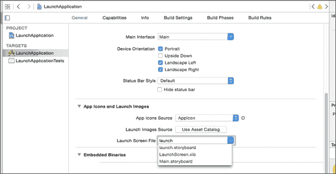

# 第十一章 Xcode 6 的功能

在这个最后的章节中，我们将深入探讨苹果提供的实际**集成开发环境**（**IDE**），开发者使用它来创建 iOS 和 Mac OS 应用程序。

在本章中，我们将涵盖以下主题：

+   Xcode 6 简介

+   Storyboard 中的新特性？

+   Xcode 6 中的调试

+   Xcode 6 中的 Interface Builder

+   探索游乐场

# Xcode 6 介绍

Xcode 6 于 2014 年 6 月 2 日在**全球开发者大会**（**WWDC**）上由苹果公司宣布，并于 2014 年 9 月 17 日正式发布。Xcode 6 在 iOS 和 Mac 开发者的功能和工具方面有了很大的改进，因为它支持苹果在 2014 年创建并宣布的新 Swift 编程语言。

Xcode 6 还包括了新的特性，如 Interface Builder 中的实时渲染，你的手写 UI 代码在 UI 画布中显示，并且当你输入代码时，任何更改也会立即反映出来。它还有一个新的视图调试工具，你可以使用它来帮助你以 3D 可视化方式查看你的 UI 层，这样你可以理解界面的组成，并查看和识别任何被裁剪或重叠的视图。

随着苹果每年发布具有不同屏幕尺寸的新设备，支持多个屏幕设备并不是一件容易的事情。然而，Xcode 6 现在有一些旨在减少为多个屏幕开发 iOS 应用程序的繁琐任务的新特性。因此，让我们深入本章，看看苹果为我们提供的新工具。

在本章的整个内容中，我们将用以下段落来检查 Xcode 6 内部的和新特性。

# Storyboard 中的新特性

Xcode 6 在 Storyboard 和 Interface Builder 方面引入了一些新特性。自从 Xcode 4 引入以来，Storyboard 允许你通过可视化界面链接屏幕，描述不同屏幕之间的转换，并对所有屏幕有一个良好的概念性概述，因为它们都被放置在一个单独的文件中。Storyboard 一直是程序员、开发人员和设计师创建界面并使用 GUI 轻松链接的重要工具。这对于设计师来说尤其有用，因为它允许他们克服编写代码的恐惧，Storyboard 也允许他们轻松创建直观的界面。

同样，随着 Xcode 6 的引入，Storyboard 也增加了新的功能和变化。其中一些新的功能包括：

+   允许 Storyboard 或 NIB 文件替换启动图像

+   通用 Storyboard

现在，让我们更深入地探讨我之前提到的 Xcode 6 的两个新特性。

## 允许 Storyboard 或 NIB 文件替换启动图像

当 iOS 应用程序忙于加载其初始的第一个屏幕时，iOS（操作系统）将显示一个静态图像，这是应用程序开发者插入的。为了达到最佳效果，启动图像应该类似于应用程序的用户界面。有关启动图像的更多信息，可以在 Apple 的网站上找到，网址为[`developer.apple.com/library/ios/documentation/userexperience/conceptual/mobilehig/LaunchImages.html`](https://developer.apple.com/library/ios/documentation/userexperience/conceptual/mobilehig/LaunchImages.html)，其中提到以下几点：

> *"启动文件或图像提供了一个简单的占位符图像，iOS 在应用程序启动时显示。占位符图像给用户留下应用程序运行速度快、响应灵敏的印象，因为它立即出现，并迅速被应用程序的第一个屏幕所取代。每个应用程序都必须提供启动文件或至少一个静态图像。*
> 
> *在 iOS 8 及以后版本中，你可以创建一个 XIB 或故事板文件，而不是静态的启动图像。当你在 Interface Builder 中创建启动文件时，你使用尺寸类别来定义不同显示环境的不同布局，并使用 Auto Layout 进行细微调整。使用尺寸类别和 Auto Layout 意味着你可以创建一个适用于所有设备和显示环境的单个启动文件。"*

在 iOS 8 和 Xcode 6 之前，开发者必须为每种屏幕尺寸提供启动图像，这些图像可以覆盖 iPad、iPhone 4S、iPhone 5S 等设备。如果你的应用程序是通用应用程序，这意味着你需要提供多个版本的启动图像以支持各种设备。但现在，随着使用故事板作为启动图像的引入，你可以使用 Auto Layout 创建单个启动故事板，这个启动故事板可以用作你支持的所有设备的启动图像。这是一个非常方便的节省时间的方法，因为这意味着你不再需要为各种屏幕尺寸创建多个启动图像。

因此，在接下来的几页中，我们将简要介绍如何使用故事板作为启动图像，你将欣赏到 Xcode 6 为所有开发者添加的这项附加功能。请注意，此功能仅在 iOS 8 上工作，不在 iOS 7 上工作。因此，如果你针对使用 iOS 7 的设备，那么使用故事板作为启动图像将不起作用，你需要回退到使用静态图像的旧方法。然而，考虑到这一点，大多数 iOS 用户在发布新版本时都会升级他们的操作系统。从现在开始，你应该经常使用故事板作为启动图像。但是，请记住，如果你需要支持 iOS 7，你可以使用启动图像作为运行 iOS 7 设备的后备，同时使用启动故事板为运行 iOS 8 的设备服务。那么，让我们开始吧，我将带你了解 Xcode 6 中这个新巧的功能。

### 从你的应用程序启动图像

对于本节，我们将创建一个简单的应用来加载故事板作为启动图像。那么，让我们开始吧，好吗？

1.  首先，我们将创建我们的项目。在本教程中，我们将在选择 **文件** | **新建项目** 后使用单视图应用：

    您还会看到以下屏幕：

    

    然后，我们需要创建一个故事板，这将是在用户启动应用时看到的第一个图像，因此我们需要创建一个新的故事板，并将其命名为 `launch.storyboard`。请注意，我们需要向我们的启动故事板添加一个视图控制器，并可以添加其他控件，例如 UILabels：

    

1.  接下来，我们需要点击我们的项目，其名称为 **LaunchApplication**，然后设置 **启动屏幕文件** 选项为 `launch.storyboard`，这是我们刚刚创建的故事板：

1.  为了验证，我们可以前往 `info.plist` 并查找此键：**启动屏幕界面文件**。如果此键存在，则表示映射到该键的值是我们用于启动图像的故事板或 NIB 文件的名称：

1.  然后，我们需要前往我们的 `launch.storyboard` 文件，然后选择 `launch.storyboard` 文件的 **视图控制器**，然后点击属性检查器图标，确保已勾选 **是否为初始视图控制器**。

1.  最后，我们需要构建项目并运行它，以查看启动图像现在显示的是 `launch.storyboard` 文件，其中包含文本 **欢迎使用启动故事板**：

只需几个步骤，我们就能使用故事板或 NIB 文件来替换我们的启动图像、PNG 图像，借助自动布局，只需几个步骤就可以轻松地用单个故事板或 NIB 替换多个启动图像。

只需这些简单的步骤，我们就可以使用启动故事板。

## 通用故事板

现在，让我们继续探讨 Xcode 6 的下一个酷炫功能，那就是通用故事板。通用故事板意味着你的故事板将能够以正确的位置显示 UI 元素，如`UITextfields`和`UIButtons`，无论它是用 iPad、iPhone 6+等查看。因此，你可以创建一个故事板，并用于 iPad、iPhone 和其他设备。那些可以一次性下载并在 iPhone 和 iPad 上同样良好运行的通用应用程序，现在已成为 iTunes App Store 中的常态。过去，存在为 iPhone、iPad、视网膜设备和非视网膜设备生成不同布局的问题。然而，随着自动布局的引入，它让全球的开发者生活变得更加容易，而 Xcode 6 通过添加通用故事板使其变得更加容易。使用通用故事板，Xcode 6 现在允许我们在使用自动布局创建用户界面布局后，轻松地看到我们的布局在不同分辨率的设备上的外观。

要激活通用故事板，我们只需要几个简单的步骤，并使用我们创建的 Xcode 项目启动图像来展示我们需要执行的简单步骤。请注意，此功能仅在 iOS 8 上有效。

首先，我们需要在`Main.storyboard`中选择我们的**视图控制器**，然后点击屏幕右侧的文件检查器图标，并确保**使用大小类**被勾选：


接下来，你会在你的故事板底部注意到一个可以点击的图标，你可以拖动并调整其大小来模拟你的自动布局用户界面在不同屏幕布局下的外观，例如 iPad 纵向、iPhone 横向等。因此，请随意点击并移动它，看看你的布局将如何呈现，然后根据你的偏好和规格进行调整：


# Xcode 6 中的调试

如你所见，Xcode 6 为我们开发者增加了一些实用的新工具，以帮助我们工作。然而，不仅如此，调试现在也变得更加容易，因为一些额外的功能现在已成为 Xcode 6 的一部分。以下是一些提供的调试好工具：

+   视图层次结构调试器

+   调试仪表盘

+   增强的队列调试

在额外的调试好工具列表中，视图层次结构调试器是其中最有用的一个。在 Xcode 6 之前，如果你想查看应用程序的视图层次结构，你必须使用插件，如 Spark Inspector、Reveal 等。然而，随着 Xcode 6 的发布，视图层次结构可视化现在得到了官方支持，你将在 Xcode 6 中获得视图层次结构的全部功能。

要在 Xcode 6 中使用视图层次结构调试器，您需要确保您的应用程序当前正在运行，然后您需要点击 Xcode 底部的调试视图层次结构图标，如图所示，当您移过图标时，按钮将显示鼠标悬停文本**调试视图层次结构**：


当您点击该图标时，您将看到一个旋转的**UIActivityIndicator**图标出现几秒钟，然后您的当前视图的图像出现。然后您只需向上、向下、向左和向右拖动，就可以沿着 3D 轴旋转您的视图，以查看图像是否对齐，如图所示：


视图层次结构调试器将有一些选项，如图所示，您可以使用这些选项来帮助您的调试：


从左到右，以下表格显示了各个按钮的功能：

| 图标 | 按钮名称 | 功能 |
| --- | --- | --- |
|  | 显示裁剪内容 | 这将隐藏或显示被裁剪的内容 |
|  | 显示约束 | 这显示了自动布局约束 |
|  | 重置查看区域 | 这将视图重置为默认状态 |
|  | 调整视图模式 | 这显示了带有内容的线框视图 |
|  | 缩放、实际大小和缩放 | 这将设置视图的缩放比例 |

## 调试仪表盘

调试仪表盘已经增加了两个新的仪表盘，它们是：

+   网络活动仪表盘

+   磁盘活动仪表盘

网络活动仪表盘将显示发送和接收的数据量，以及一个打开端口的列表和诸如 IP 地址等详细信息，如下面的截图所示。您将使用此网络活动仪表盘的典型场景是当您需要跟踪发送和接收的数据量以进行网络优化时，同时查看远程 IP 地址和端口号，以便您了解设备连接的位置。

这些功能将有助于您最小化发送和使用的网络流量，使用网络活动仪表盘将是您首先应该查看的地方：


磁盘活动调试仪表盘将显示应用程序对磁盘进行的所有读取和写入操作的真实时间数据。它还提供了所有打开的文件信息，以及磁盘 I/O 活动日志，供您查看，您可以在下面的屏幕截图中看到。如果您正在开发对磁盘进行大量读取和写入操作的应用程序，并且遇到不规则的磁盘读取和写入故障，那么这个磁盘活动调试仪表盘将为您带来巨大的帮助，因为它会告诉您读取和写入操作的大小。这是一个非常适合您的工具，您可以使用这些数据来跟踪您实际读取和写入到磁盘的数据量，这反过来又可以帮助您更好地了解情况，以便修复问题：


# Interface Builder 的新功能

在 Xcode 6 中，Interface Builder 新增的功能很少，它们是：

+   实时渲染

+   大小类

+   预览助手

实时渲染功能正如其名所暗示的那样工作。因此，实时渲染所做的就是在 Xcode IDE 中显示和渲染自定义对象，如自定义按钮、字体等，而无需编写一行代码。这意味着当您更新自定义对象的代码时，Interface Builder 设计画布将自动更新为编辑器中输入的新外观，而无需您构建和运行项目来在模拟器或设备上查看。以前，您必须运行应用程序才能看到对自定义对象所做的更改，这些对象是您在故事板中创建或通过编程创建的，并且具有自定义的外观。然而，现在，苹果通过在 Xcode 6 中引入实时渲染来简化了我们的工作，因为它在开发过程中节省了我们的时间，使我们不必浪费时间去构建和运行代码以查看自定义对象。您可以预期构建和运行代码成千上万次，甚至数百万次，因此节省的每一秒都会在后续的开发中节省您数小时的时间。

Xcode 6 中新增的最后一项功能是大小类概念；在我介绍通用故事板概念时，我们简要地讨论了大小类。为了更详细地解释，iOS 8 的大小类允许开发者创建和设计一个通用的故事板，并为 iPad 和 iPhone 提供定制的布局。随着大小类的引入，您可以一次性定义常见的视图和约束，然后为每个支持的设备屏幕和形态添加您自己的自定义变体。

最后，Xcode 6 中还有一个令人兴奋的新功能，即预览助手。预览助手允许您预览并查看您的布局在不同设备/目标上并排时的外观。因此，您可以看到您的布局在 iPad 或 iPhone 4S 上并排时的样子。要激活预览助手，您需要点击右上角的**显示助手编辑器**按钮以激活助手编辑器，然后当助手编辑器出现时，点击带有两个相互连接图标的图标，这将显示一个名为**预览**的菜单项。点击**预览**项并选择您希望预览的故事板，如图所示：


接下来，您可以在左下角看到一个**+**图标。点击它，您将看到一个包含不同屏幕尺寸的 iOS 设备列表，例如 iPhone 4 英寸、iPhone 4.7 英寸等。


这些对应于您希望预览的各种 iOS 屏幕设备。因此，点击一个设备，将出现一个显示该屏幕大小的画布，在该画布中，您可以看到您选定的故事板在该屏幕尺寸下的外观。因此，无需构建和选择您的目标模拟器，Xcode 6 允许您预览布局的外观，而无需浪费几秒钟的构建时间。这个功能对故事板和 XIB 文件也很有用。总之，使用预览助手的步骤如下：

1.  点击右上角的**显示助手编辑器**以激活助手编辑器。

1.  点击带有两个相互连接图标的图标以显示名为**预览**的菜单。

1.  点击**预览**项并选择您希望预览的故事板。

1.  点击左下角的**+**图标以选择一个 iOS 设备列表，以查看您的故事板在该选定设备屏幕上的外观。

# Swift 的 Playground

苹果公司在 2014 年的 WWDC 上宣布了 Swift 编程语言，与此相应，Xcode 6 带来了一个名为 Playground 的新功能，您可以在其中拥有一个交互式工作区来编写 Swift 代码并在 Xcode 中获得实时反馈。这使得编写 Swift 代码变得简单且有趣，因为您可以在一行代码中输入并立即看到结果。如果您的代码通过循环迭代，您可以通过时间线助手查看其运动。时间线助手还会以图表形式显示您的变量，并在视图组合时绘制每个步骤。为了更好地了解 Playground，让我们通过一个简单的项目来尝试一下：

1.  首先，我们需要通过选择**文件**|**新建**|**Playground**菜单来创建一个新的 Playground，并像您在这里看到的那样为我们的 Playground 命名。对于这个项目，让我们将我们的 Playground 项目命名为 `MyPlayground`：

1.  接下来，将出现一个屏幕，您可以在其中输入 Swift 代码，结果将立即显示在右侧。为了测试它，请尝试输入以下代码：

    ```swift
    import UIKit

    var str = "Hello, playground"
    var name = "Gib"

    var sum = 0
    for i in 0...10
    {
        sum += i
    }

    sum
    ```

1.  接下来，你将在屏幕右侧看到你的 Swift 输入的结果，你可以在这里看到：

    现在，这看起来相当酷，因为实时反馈会告诉你输出结果，并提供代码验证。这对于想要测试算法而不必构建代码的开发者来说很有用，或者你可以显示绘图代码并立即看到它。

虽然游乐场听起来不错，但有一些限制需要注意，特别是关于游乐场的限制。以下是不能使用游乐场完成的限制列表：

+   它不能用于用户交互

+   游乐场只能在模拟器上运行，而不能在设备上运行

+   客户端库和框架不能导入，因为只能使用系统库和框架

# 摘要

正如你所见，随着新工具如视图层次结构调试器、预览编辑器和新增功能（如允许将故事板和 NIBs 用作应用的启动图像，而不是仅仅静态图像）的引入，Xcode 为开发者向前迈出了重要的一步。有了所有这些可以玩的新组件，苹果使得开发者能够轻松地创建和编码酷炫的项目，并减少了完成这些任务的努力。因此，我将你留给你的编码任务，并希望你在阅读这本书并获得一些有用的提示时有一个愉快的时光。就此，我向你道别，祝你编码愉快。

P.S. 如果你希望深入了解 Xcode 6，这里有一个链接到官方的 Xcode 6 Apple 文档：[`developer.apple.com/library/ios/documentation/DeveloperTools/Conceptual/WhatsNewXcode/Articles/xcode_6_0.html`](https://developer.apple.com/library/ios/documentation/DeveloperTools/Conceptual/WhatsNewXcode/Articles/xcode_6_0.html).
