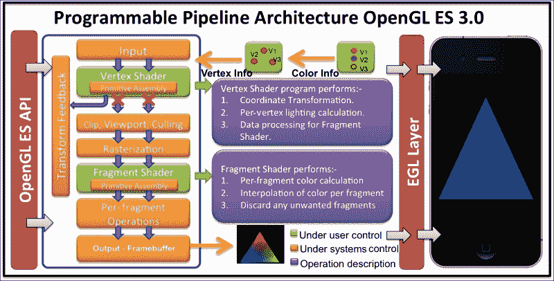
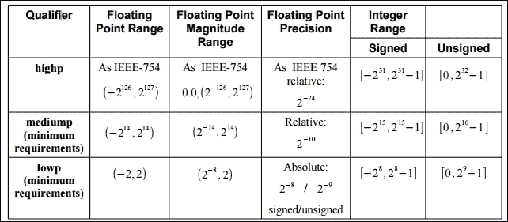
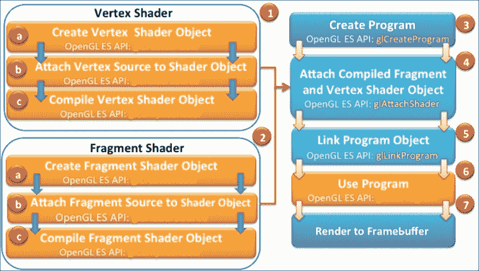
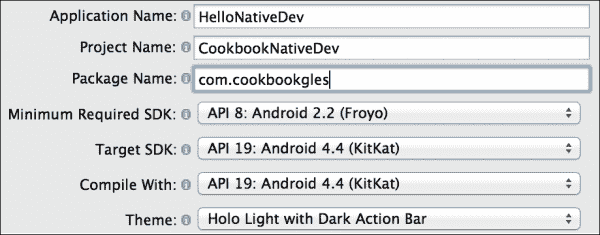
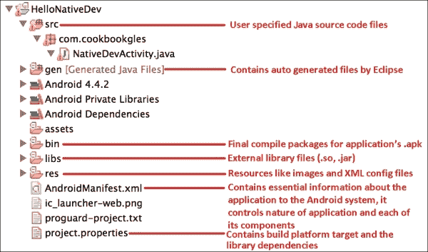
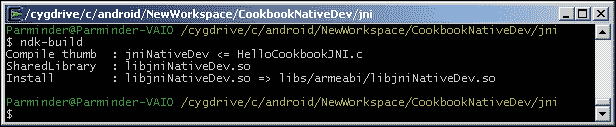
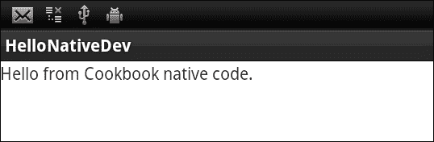
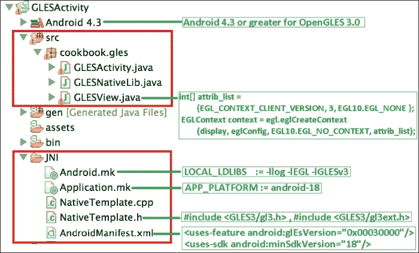
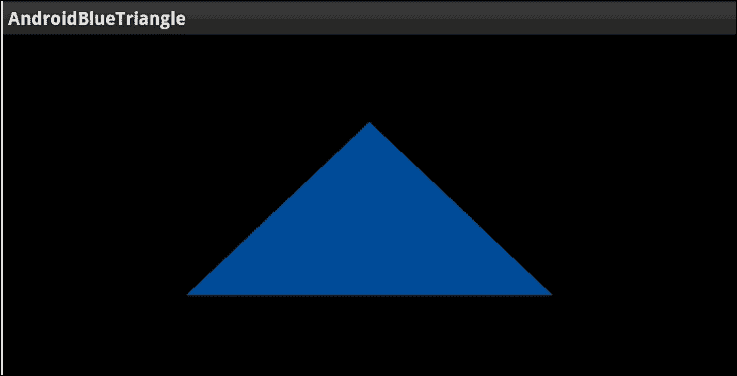
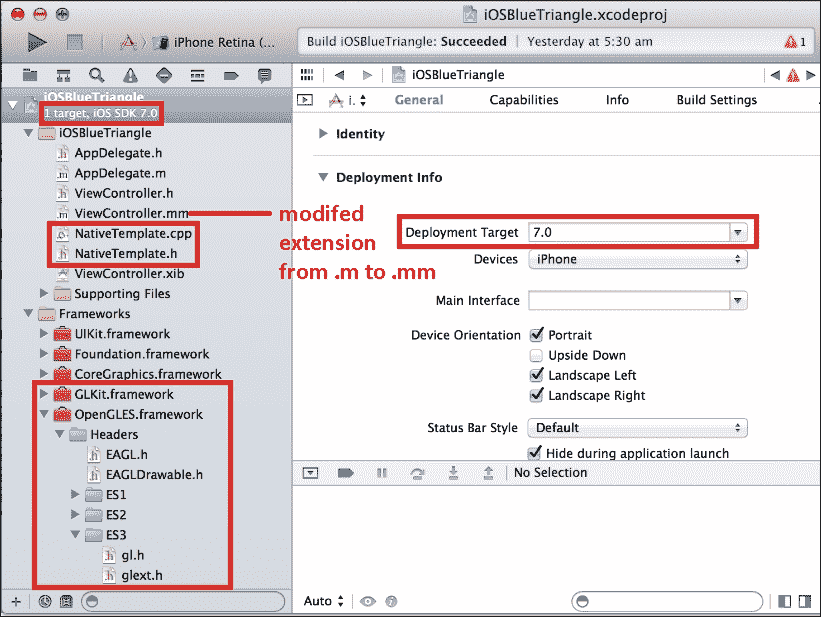

# 第一章. Android/iOS 上的 OpenGL ES 3.0

在本章中，我们将介绍以下食谱：

+   使用 OpenGL ES 着色语言 3.0 编程着色器

+   加载和编译着色器程序

+   链接着色器程序

+   检查 OpenGL ES 3.0 中的错误

+   使用顶点属性将数据发送到着色器

+   使用统一变量将数据发送到着色器

+   编程 OpenGL ES 3.0 的 Hello World 三角形

+   在 Android 上使用 JNI 与 C/C++ 通信

+   开发 Android OpenGL ES 3.0 应用程序

+   开发 iOS OpenGL ES 3.0 应用程序

# 简介

OpenGL ES 3.0 代表嵌入式系统版 Open Graphics Library 3.0。它是由 Khronos Group 建立的一套标准 API 规范。Khronos Group 是一个由成员和组织组成的协会，专注于为免版税 API 产生开放标准。OpenGL ES 3.0 规范于 2012 年 8 月公开发布。这些规范与 OpenGL ES 2.0 兼容，OpenGL ES 2.0 是嵌入式系统渲染 2D 和 3D 图形的公认事实标准。嵌入式操作系统，如 Android、iOS、BlackBerry、Bada、Windows 以及许多其他操作系统都支持 OpenGL ES。

OpenGL ES 3D API 是 OpenGL 的简化版本，OpenGL 是一个跨平台的桌面环境 3D API，适用于 Linux、各种 UNIX 版本、Mac OS 和 Windows。这个简化版本主要专注于根据嵌入式系统需求提供 3D 图形功能，如低功耗、有限的处理能力和小的内存占用。

OpenGL ES 2.0/3.0 图形库与着色语言兼容，与其前身 1.1 不同。OpenGL ES 1.1 和 OpenGL ES 2.0/3.0 之间的主要区别是图形管线架构。前者的图形管线框架被称为固定功能管线，而后者的则是可编程管线。以下表格中解释了这些框架：

| OpenGL ES 版本 | 架构管线类型 | 需要着色器 |
| --- | --- | --- |
| 1.1 | 固定功能管线 | 否 |
| 2.0 和 3.0 | 可编程管线 | 是 |

管线是一系列在预定义的固定顺序中发生的事件，从向图形引擎提供输入数据到生成用于渲染帧的输出数据。帧是指图形引擎在屏幕上生成的输出图像。

在固定功能管线架构中，每一帧都是由一组固定的算法、计算和事件序列生成的。你只能指定你想要的内容，但不能指定如何计算。例如，如果你对在你的实心球体模型上应用一些光照着色感兴趣，那么你需要指定光照位置、其强度、材料属性和其他类似属性。固定管线使用这些输入，并负责生成光照着色所需的全部物理和数学。因此，你不必担心，因为“如何”因素已经完全抽象化。固定功能管线的优点是它非常容易理解，编程也很快。

相比之下，在可编程管线架构中，你不仅需要指定你想要实现的目标，还需要说明如何实现它。这个管线还通过着色器提供了非凡的能力。着色器是控制你的场景几何形状和着色外观的特殊程序。例如，为了在实心球体上实现相同的光照着色效果，你必须了解物理和数学的基本知识，以便编程光照着色技术。由于你正在编程光照着色的行为，你可以完全控制它。这为创建无限着色效果打开了无限可能。着色器非常快。它们使用**图形处理单元**（**GPU**）并行处理模式执行渲染。

现在，问题是如果固定功能管线正在执行所有轻量级物理和数学抽象，那么为什么我们还需要理解它对于可编程管线呢？原因在于，使用固定管线，我们只能执行有限的图形功能，并且它不能有效地用于生成逼真的图形。然而，可编程管线为生成最先进的图形渲染提供了无限的可能性和机会。

本章将介绍在 Android 和 iOS 上使用 OpenGL ES 3.0 进行开发。我们将通过一个简单的示例来渲染屏幕上的三角形，了解 OpenGL ES 3.0 的基本编程。你将逐步学习如何在两个平台上设置和创建你的第一个应用程序。

**理解 EGL**：OpenGL ES API 在能够有效地在硬件设备上使用之前，需要 EGL 作为先决条件。EGL 提供了 OpenGL ES API 和底层本地窗口系统之间的接口。不同的操作系统供应商有自己的方式来管理绘图表面的创建、与硬件设备的通信以及其他配置来管理渲染上下文。EGL 提供了一种抽象，即底层系统需要以平台无关的方式实现。平台供应商的 SDK 通过他们自己的框架提供了 EGL 的实现。这些可以直接在应用程序中使用，以快速完成开发任务。例如，iOS 通过 `EAGL (`EAGLContext`) 类与 `GLkit` 一起提供 EGL 来创建 `GLSurface`。在 Android 平台上，`GLView` 类通过 `GLView.EGLContextFactory` 和 `GLView.EGLConfigChooser` 提供了 EGL 的接口。

EGL 为 OpenGL ES API 提供了两件重要的事情：

+   **渲染上下文**：这存储了渲染目的所必需的数据结构和重要的 OpenGL ES 状态

+   **绘图表面**：这提供了渲染原语所需的绘图表面

以下截图显示了 OpenGL ES 3.0 的可编程管道架构：



EGL 在原生窗口系统之上运行，例如 WGL（Windows）、GLX 或 X-Windows（Linux）、或 Mac OS X 的 Quartz。有了 EGL 规范，跨平台开发变得更加容易。

EGL 负责以下任务：

+   检查可用的配置以创建设备窗口系统的渲染上下文

+   创建用于绘图的 OpenGL 渲染表面

+   与其他图形 API（如 OpenVG、OpenAL 等）的兼容性和接口

+   管理资源，如纹理映射

    ### 注意

    您可以参考以下链接获取有关 EGL 的更多信息 [`www.khronos.org/egl`](http://www.khronos.org/egl)。

# 使用 OpenGL ES 着色语言 3.0 编程着色器

OpenGL ES 着色语言 3.0（也称为 GLSL）是一种类似于 C 的语言，允许我们为 OpenGL ES 处理管道中的可编程处理器编写着色器。着色器是在 GPU 上并行运行的程序。没有这些程序，编写 OpenGL ES 3.0 程序是不可能的。

OpenGL ES 3.0 支持两种类型的着色器：顶点着色器和片段着色器。每个着色器都有特定的职责。例如，顶点着色器用于处理几何顶点；然而，片段着色器处理像素或片段颜色信息。更特别的是，顶点着色器通过应用 2D/3D 变换来处理顶点信息。顶点着色器的输出传递到光栅化器，在那里生成片段。片段由片段着色器处理，它负责为它们上色。

着色器的执行顺序是固定的；顶点着色器总是首先执行，然后是片段着色器。每个着色器都可以将其处理后的数据与管道中的下一阶段共享。GLSL 支持用户定义的变量，如 C 语言；这些变量用于输入和输出目的。还有内置变量，用于跟踪着色器中的状态，以便在处理这些着色器中的数据时做出决策。例如，片段着色器提供了一个状态，可以测试传入的片段是否属于多边形的正面或背面。

## 准备工作

在 OpenGL ES 3.0 处理管道中，有两种类型的处理器用于执行顶点着色器和片段着色器可执行文件；它被称为可编程处理单元：

+   **顶点处理器**：顶点处理器是一个可编程单元，它对传入的顶点和相关数据进行操作。它使用顶点着色器可执行文件并在顶点处理器上运行它。顶点着色器需要首先进行编程、编译和链接，以生成可执行文件，然后可以在顶点处理器上运行。

+   **片段处理器**：这是 OpenGL ES 管道中的另一个可编程单元，它对片段和相关数据进行操作。片段处理器使用片段着色器可执行文件来处理片段或像素数据。片段处理器负责计算片段的颜色。它们不能改变片段的位置。它们也不能访问相邻的片段。然而，它们可以丢弃像素。从这个着色器计算出的颜色值用于更新帧缓冲区内存和纹理内存。

## 如何做到这一点...

这里是顶点和片段着色器的示例代码：

1.  编程以下顶点着色器并将其存储到`vertexShader`字符类型数组变量中：

    ```java
    #version 300 es             
    in vec4     VertexPosition;     
    in vec4     VertexColor;        
    uniform float  RadianAngle;

    out vec4     TriangleColor;     
    mat2 rotation = mat2(cos(RadianAngle),sin(RadianAngle),
                        -sin(RadianAngle),cos(RadianAngle));
    void main() {
      gl_Position = mat4(rotation)*VertexPosition;
      TriangleColor = VertexColor;
    }
    ```

1.  编程以下片段着色器并将其存储到另一个名为`fragmentShader`的字符数组类型变量中：

    ```java
    #version 300 es         
    precision mediump float;
    in vec4   TriangleColor;  
    out vec4  FragColor;     
    void main() {           
      FragColor = TriangleColor;
    };
    ```

## 它是如何工作的...

与大多数语言一样，着色器程序也是从`main()`函数开始控制的。在两个着色器程序中，第一行`#version 300 es`指定了 GLES 着色语言版本号，在本例中为 3.0。顶点着色器接收一个每个顶点的输入变量`VertexPosition`。这个变量的数据类型是`vec4`，它是 OpenGL ES 着色语言提供的内置数据类型之一。变量开头的`in`关键字指定它是一个传入变量，并接收一些数据，这些数据超出了我们当前着色器程序的作用域。同样，`out`关键字指定该变量用于将一些数据值发送到着色器的下一阶段。同样，颜色信息数据在`VertexColor`中接收。这些颜色信息传递给`TriangleColor`，它将此信息发送到片段着色器，这是处理管道的下一阶段。

`RadianAngle` 是一种包含旋转角度的统一类型变量。这个角度用于将旋转矩阵计算到 `rotation` 中。参考以下 *也参见* 部分，以获取关于 `per-vertex` 属性和 `uniform` 变量的参考信息。

`VertexPosition` 接收到的输入值通过旋转矩阵相乘，这将旋转我们三角形的几何形状。此值被分配给 `gl_Position`。`gl_Position` 是顶点着色器的一个内置变量。这个变量应该以齐次形式写入顶点位置。此值可以被任何固定功能阶段使用，例如原语装配、光栅化、裁剪等。有关固定阶段的更多信息，请参考 附录 中的 *固定功能和可编程管道架构* 菜谱。

在片段着色器中，精度关键字指定了所有浮点类型（以及聚合，如 `mat4` 和 `vec4`）的默认精度为 `mediump`。此类声明的类型的可接受值需要落在声明的精度指定的范围内。OpenGL ES 着色语言支持三种精度类型：`lowp`、`mediump` 和 `highp`。在片段着色器中指定精度是强制性的。然而，对于顶点，如果未指定精度，则默认为最高精度（`highp`）。

`FragColor` 是一个 `out` 变量，它将每个片段计算出的颜色值发送到下一阶段。它接受 RGBA 颜色格式的值。

## 还有更多…

如前所述，有三种精度限定符类型，以下表格描述了这些类型：

| 限定符 | 描述 |
| --- | --- |
| `highp` | 这些变量提供最大范围和精度。但它们可能导致某些实现中的操作运行得更慢；通常，顶点具有高精度。 |
| `lowp` | 这些变量通常用于存储高动态范围颜色和低精度几何形状。 |
| `mediump` | 这些变量通常用于存储 8 位颜色值。 |

这些精度限定符的范围和精度如下所示：



上一张图片来自 [`www.khronos.org/registry/gles/specs/3.0/GLSL_ES_Specification_3.00.3.pdf`](https://www.khronos.org/registry/gles/specs/3.0/GLSL_ES_Specification_3.00.3.pdf) 的第 48 页。

### Tip

**下载示例代码**

您可以从您在 [`www.packtpub.com`](http://www.packtpub.com) 的账户中下载您购买的所有 Packt 书籍的示例代码文件。如果您在其他地方购买了这本书，您可以访问 [`www.packtpub.com/support`](http://www.packtpub.com/support) 并注册以直接将文件通过电子邮件发送给您。

## See also

+   *加载和编译着色器程序*

+   *使用顶点属性将数据发送到着色器* 

+   *使用统一变量向着色器发送数据*

# 加载和编译着色器程序

在前面的菜谱中创建的着色器程序需要加载并编译成二进制形式。本菜谱将有助于理解加载和编译着色器程序的过程。

## 准备中

编译和链接着色器是必要的，这样这些程序才能被底层图形硬件/平台（即顶点和片段处理器）理解和执行。

下图提供了创建着色器可执行文件的完整过程的概述。不同的数字标签帮助我们理解构建过程中的流程顺序。构建过程中的每个阶段都标记了负责它的相应 OpenGL ES API。



## 如何操作...

为了加载和编译着色器源代码，请按照以下步骤操作：

1.  创建一个 `NativeTemplate.h`/`NativeTemplate.cpp` 文件，并在其中定义一个名为 `loadAndCompileShader` 的函数。使用以下代码，然后继续下一步以获取有关此函数的详细信息：

    ```java
    GLuint loadAndCompileShader(GLenum shaderType, const char* sourceCode) {
         // Create the shader
      GLuint shader = glCreateShader(shaderType);
      if ( shader ) {
         // Pass the shader source code
         glShaderSource(shader, 1, &sourceCode, NULL);

         // Compile the shader source code
         glCompileShader(shader);

         // Check the status of compilation
         GLint compiled = 0;
         glGetShaderiv(shader,GL_COMPILE_STATUS,&compiled);
         if (!compiled) {

          // Get the info log for compilation failure
           GLint infoLen = 0;
           glGetShaderiv(shader,GL_INFO_LOG_LENGTH, &infoLen);
           if (infoLen) {
              char* buf = (char*) malloc(infoLen);
              if (buf) {
                glGetShaderInfoLog(shader, infoLen, NULL, buf);
                printf("Could not compile shader %s:" buf);
                free(buf);
              }

          // Delete the shader program
              glDeleteShader(shader);
              shader = 0;
           }
        }
      }
      return shader;
    }
    ```

    此函数负责加载和编译着色器源代码。参数 `shaderType` 接受需要加载和编译的着色器类型；可以是 `GL_VERTEX_SHADER` 或 `GL_FRAGMENT_SHADER`。`sourceCode` 指定了相应着色器的源程序。

1.  使用 OpenGL ES 3.0 API 的 `glCreateShader` 创建一个空着色器对象。此着色器对象负责根据指定的 `shaderType` 参数加载顶点或片段源代码：

    +   **语法**:

        ```java
        GLuint glCreateShader(  Glenum shaderType);
        ```

        如果对象成功创建，此 API 返回非零值。此值用作引用此对象的句柄。如果失败，此函数返回 `0`。`shaderType` 参数指定要创建的着色器类型。它必须是 `GL_VERTEX_SHADER` 或 `GL_FRAGMENT_SHADER`：

        ```java
        // Create the shader object
        GLuint shader = glCreateShader(shaderType);
        ```

        ### 注意

        与 C++ 中的对象创建是透明的不同，在 OpenGL ES 中，对象是在幕后创建的。您可以根据需要访问、使用和删除对象。所有对象都由一个唯一的标识符识别，可用于编程目的。

        创建的空着色器对象（`shader`）需要首先与着色器源绑定，以便进行编译。此绑定是通过使用 `glShaderSource` API 实现的：

        ```java
        // Load the shader source code
        glShaderSource(shader, 1, &sourceCode, NULL);
        ```

        此 API 在着色器对象 `shader` 中设置着色器代码字符串。源字符串简单地复制到着色器对象中；它不会被解析或扫描。

    +   **语法**:

        ```java
        void glShaderSource(GLuint shader, GLsizei count, const GLchar * const *string, const GLint *length);
        ```

        | 变量 | 描述 |
        | --- | --- |
        | `shader` | 这是需要绑定的着色器对象的句柄 |
        | `count` | 这是字符串和长度数组中的元素数量 |
        | `string` | 这指定了包含需要加载的源代码的字符串指针数组 |
        | `length` | 这指定了字符串长度的数组 |

    计数指定了数组中的字符串数量。如果长度数组是 `NULL`，这意味着所有字符串都是空终止的。如果此数组中的值非零，则指定对应字符串的长度。任何小于 `0` 的值都假定它是一个空终止的字符串。

1.  使用 `glCompileShader` API 编译着色器。它接受一个着色器对象句柄 shader：

    ```java
           glCompileShader(shader);    // Compile the shader
    ```

    +   **语法**:

        ```java
        void glCompileShader (GLuint shader);
        ```

        | 变量 | 描述 |
        | --- | --- |
        | `shader` | 这是需要编译的着色器对象的句柄 |

1.  着色器的编译状态存储为着色器对象的状态。可以使用 `glGetShaderiv` OpenGL ES API 检索此状态：

    ```java
         GLint compiled = 0;    // Check compilation status
         glGetShaderiv(shader, GL_COMPILE_STATUS, &compiled);
    ```

    `glGetShaderiv` API 接受着色器句柄和 `GL_COMPILE_STATUS` 作为参数来检查编译状态。它将状态检索到 params 中。如果最后的编译成功，params 返回 `GL_TRUE`。否则，它返回 `GL_FALSE`。

    +   **语法**:

        ```java
        void glGetShaderiv(GLuint shader, GLenum pname, GLint *params);
        ```

        | 变量 | 描述 |
        | --- | --- |
        | `shader` | 这是需要检查编译状态的着色器对象的句柄。 |
        | `pname` | 这指定了对象的状态参数。接受的符号名称是 `GL_SHADER_TYPE`、`GL_DELETE_STATUS`、`GL_COMPILE_STATUS`、`GL_INFO_LOG_LENGTH` 和 `GL_SHADER_SOURCE_LENGTH`。 |
        | `params` | 这返回请求的对象参数状态。 |

        如果编译失败，可以使用 `glGetShaderiv` API 通过传递 `GL_INFO_LOG_LENGTH` 作为参数从 OpenGL ES 状态机检索信息日志。`infoLen` 返回信息日志的长度。如果返回的值是 `0`，则表示没有信息日志。如果 `infoLen` 值大于 `0`，则可以使用 `glGetShaderInfoLog` 检索信息日志消息：

        ```java
               if (!compiled) {      // Handle Errors
                  GLint infoLen = 0; // Check error string length
                  glGetShaderiv(shader, GL_INFO_LOG_LENGTH, &infoLen);
                  . . . . .
               }
        ```

1.  使用 `glGetShaderInfoLog` 获取错误报告：

    +   **语法**:

        ```java
        void glGetShaderInfoLog(GLuint shader, GLsizei maxLength, GLsizei*length, GLchar* infoLog);
        ```

        | 变量 | 描述 |
        | --- | --- |
        | `shader` | 这是需要获取信息日志的着色器对象的句柄 |
        | `maxLength` | 这是存储返回的信息日志的字符缓冲区的大小 |
        | `length` | 这是信息长度返回的字符串长度 |
        | `infoLog` | 这指定了字符数组 |

1.  如果着色器源无法编译，则删除着色器。使用 `glDeleteShader` API 删除着色器对象。

    +   **语法**:

        ```java
        void glDeleteShader(GLuint shader);
        ```

        | 变量 | 描述 |
        | --- | --- |
        | `shader` | 这是需要删除的着色器对象的句柄 |

1.  如果着色器编译成功，则返回着色器对象 ID：

    ```java
    return shader; // Return the shader object ID
    ```

## 它是如何工作的...

`loadAndCompileShader`函数首先创建一个空的着色器对象。这个空对象由`shader`变量引用。此对象与相应着色器的源代码绑定。源代码通过着色器对象使用`glCompileShader` API 进行编译。如果编译成功，则成功返回着色器对象句柄。否则，着色器对象返回`0`，需要显式使用`glDeleteShader`删除。可以使用`glGetShaderiv`与`GL_COMPILE_STATUS`检查编译状态。

## 更多内容...

为了区分不同版本的 OpenGL ES 和 GL 着色语言，从您设备的当前驱动程序中获取此信息是有用的。这将有助于使程序健壮且易于管理，避免由于版本升级或安装在较旧版本的 OpenGL ES 和 GLSL 上的应用程序而引起的错误。其他关键信息也可以从当前驱动程序中查询，例如供应商、渲染器和设备驱动程序支持的可用扩展。可以使用`glGetString` API 查询这些信息。此 API 接受一个符号常量，并以字符串形式返回查询的系统度量值。我们程序中的`printGLString`包装函数有助于打印设备度量：

```java
static void printGLString(const char *name, GLenum s) {
    printf("GL %s = %s\n", name, (const char *) glGetString(s));
}
// Print the OpenGL ES system metrics
void printOpenGLESInfo(){
   printGLString("Version",    GL_VERSION);
   printGLString("Vendor",    GL_VENDOR);
   printGLString("Renderer",    GL_RENDERER);
   printGLString("Extensions",    GL_EXTENSIONS);
   printGLString("GLSL version",  GL_SHADING_LANGUAGE_VERSION);
}
```

## 相关内容

+   *将着色器程序链接*

# 将着色器程序链接

链接是一个将一组（顶点和片段）着色器聚合为一个程序的过程，该程序映射到 OpenGL ES 3.0 图形管道的可编程阶段的全集。着色器使用我们在前面的菜谱中创建的着色器对象进行编译。这些对象用于创建称为程序对象的特殊对象，以将其链接到 OpenGL ES 3.0 管道。在本菜谱中，您将了解着色器链接过程。

## 如何操作...

以下指令提供了一步一步的过程来链接一个着色器：

1.  在`NativeTemplate.cpp`中创建一个新的函数`linkShader`。这将是将着色器程序链接到 OpenGL ES 3.0 管道的包装函数。按照以下步骤详细了解此程序：

    ```java
    GLuint linkShader(GLuint vertShaderID,GLuint fragShaderID){
        if (!vertShaderID || !fragShaderID){ // Fails! return
       return 0; 
     }

       // Create an empty program object
        GLuint program = glCreateProgram();
        if (program) {
       // Attach vertex and fragment shader to it
          glAttachShader(program, vertShaderID);
          glAttachShader(program, fragShaderID);

       // Link the program
    glLinkProgram(program);
          GLint linkStatus = GL_FALSE;
          glGetProgramiv(program, GL_LINK_STATUS, &linkStatus);

          if (linkStatus != GL_TRUE) {
              GLint bufLength = 0;
              glGetProgramiv(program, GL_INFO_LOG_LENGTH,
              &bufLength);
              if (bufLength) {
                 char* buf = (char*) malloc(bufLength);
    if(buf) { glGetProgramInfoLog(program,bufLength,NULL,buf);
              printf("Could not link program:\n%s\n", buf);
                free(buf);
                }
             }
              glDeleteProgram(program);
              program = 0;
          }
      }
      return program;
    }
    ```

1.  使用`glCreateProgram`创建一个程序对象。此 API 使用一个空的程序对象创建，该对象用于链接着色器对象：

    ```java
    GLuint program = glCreateProgram(); //Create shader program
    ```

    +   **语法**:

        ```java
        GLint glCreateProgram( void);
        ```

1.  使用`glAttachShader` API 将着色器对象附加到程序对象。为了创建可执行程序，必须将着色器附加到程序对象：

    ```java
     // Attach the vertex and fragment shader
     glAttachShader(program, vertShaderID);
     glAttachShader(program, fragShaderID);
    ```

    下面是`glAttachShader` API 的语法：

    +   **语法**:

        ```java
        void glAttachShader(GLuint program, GLuint shader);
        ```

        | 变量 | 描述 |
        | --- | --- |
        | `program` | 这指定了将要附加着色器对象（着色器）的程序对象 |
        | `shader` | 这指定了将要附加的程序对象 |

1.  为了创建程序可执行文件，着色器必须链接到程序。链接过程是通过 `glLinkProgram` 执行的。此 API 通过 `program` 标识符链接程序对象，该标识符必须包含附加的顶点和片段着色器对象：

    ```java
    glLinkProgram(program); // Link the shader program
    ```

1.  可以使用 `glGetShaderiv` 来检查链接操作的状态。此 API 接受程序和 `GL_LINK_STATUS` 作为参数。如果程序上的最后一个链接成功，它将返回 `GL_TRUE`；否则，它将返回 `GL_FALSE`。

    +   **语法**:

        ```java
        void glGetProgramiv(GLuint program, GLenum pname, GLint *params);
        ```

        | 变量 | 描述 |
        | --- | --- |
        | `program` | 这指定了要查询的程序对象 |
        | `pname` | 这指定了符号状态参数 |
        | `params` | 这返回请求的程序对象参数状态 |

        如果返回的链接状态是 `GL_FALSE`，则必须使用 `glDeleteProgram` 释放程序对象占用的内存。此 API 撤销了 `glCreateProgram` 的所有效果。它还使与之关联的句柄无效。

    +   **语法**:

        ```java
        void glDeleteProgram(Glint program);
        ```

        | 变量 | 描述 |
        | --- | --- |
        | `program` | 这指定了需要删除的程序句柄 |

## 它是如何工作的...

`linkShader` 包装函数用于链接着色器。它接受两个参数：`vertShaderID` 和 `fragShaderID`。它们是编译后的着色器对象的标识符。`createProgram` 函数创建程序对象。这是另一个 OpenGL ES 对象，着色器对象通过 `glAttachShader` 附加到该对象上。如果不再需要，着色器对象可以从程序对象中分离。程序对象负责创建在可编程处理器上运行的可执行程序。在 OpenGL ES 中，程序是 OpenGL ES 3.0 管道中运行的、在顶点和片段处理器上运行的可执行文件。

程序对象是通过 `glLinkShader` 链接的。如果链接失败，则必须使用 `glDeleteProgram` 删除程序对象。当程序对象被删除时，它将自动断开与其关联的着色器对象。需要显式删除着色器对象。如果请求删除程序对象，它将仅在当前 OpenGL ES 状态中不被其他渲染上下文使用时被删除。

如果程序的对象链接成功，则将创建一个或多个可执行文件，具体取决于与程序附加的着色器的数量。可执行文件可以在运行时通过 `glUseProgram` API 的帮助使用。这使得可执行文件成为当前 OpenGL ES 状态的组成部分。

## 相关内容

+   *检查 OpenGL ES 3.0 中的错误*

# 检查 OpenGL ES 3.0 中的错误

在编程过程中，遇到意外的结果或错误在源代码中是非常常见的。确保程序不生成任何错误非常重要。在这种情况下，您可能希望优雅地处理错误。本节将指导我们跟踪 OpenGL ES 3.0 和 GL 着色语言中的错误。

## 如何操作...

OpenGL ES 3.0 允许我们使用一个简单的名为 `getGlError` 的例程来检查错误。以下包装函数会打印出编程过程中发生的所有错误信息：

```java
static void checkGlError(const char* op) {
     for(GLint error = glGetError(); error; error= glGetError()){
        printf("after %s() glError (0x%x)\n", op, error);
     }
}
```

`getGlError` 返回一个错误代码。以下表格描述了这些错误：

**语法**:

```java
GLenum glGetError(void);
```

| 错误代码 | 描述 |
| --- | --- |
| `GL_NO_ERROR` | 这表示没有发现错误 |
| `GL_INVALID_ENUM` | 这表示 `GLenum` 参数超出了范围 |
| `GL_INVALID_VALUE` | 这表示数值参数超出了范围 |
| `GL_INVALID_OPERATION` | 这表示在当前状态下操作非法 |
| `GL_STACK_OVERFLOW` | 这表示命令会导致栈溢出 |
| `GL_STACK_UNDERFLOW` | 这表示命令会导致栈下溢 |
| `GL_OUT_OF_MEMORY` | 这表示执行命令时没有足够的内存 |

这里有一些产生 OpenGL ES 错误的代码示例：

```java
// Gives a GL_INVALID_ENUM error
glEnable(GL_TRIANGLES);

// Gives a GL_INVALID_VALUE
// when attribID >= GL_MAX_VERTEX_ATTRIBS
glEnableVertexAttribArray(attribID);
```

## 它是如何工作的...

当 OpenGL ES 检测到错误时，它会将错误记录到错误标志中。每个错误都有一个唯一的数值代码和符号名称。OpenGL ES 不会跟踪每次错误发生的情况。由于性能原因，检测错误可能会降低渲染性能，因此，错误标志不会在调用 `glGetError` 例程之前设置。如果没有检测到错误，此例程将始终返回 `GL_NO_ERRORS`。在分布式环境中，可能有多个错误标志，因此，建议在循环中调用 `glGetError` 例程，因为此例程可以记录多个错误标志。

# 使用顶点属性向着色器发送数据

在着色器编程中，每个顶点的属性有助于从 OpenGL ES 程序接收每个唯一顶点属性的数据。接收到的数据值不会在顶点之间共享。顶点坐标、法线坐标、纹理坐标、颜色信息等都是顶点属性的例子。顶点属性仅用于顶点着色器，它们不能直接提供给片段着色器。相反，它们通过顶点着色器中的变量进行共享。

通常，着色器在 GPU 上执行，允许使用多核处理器并行处理多个顶点。为了在顶点着色器中处理顶点信息，我们需要一些机制将位于客户端（CPU）上的数据发送到服务器端（GPU）上的着色器。这个配方将有助于理解使用顶点属性与着色器通信的使用方法。

## 准备工作

在 *GL 着色语言 3.0 中编写着色器* 的配方中，顶点着色器包含两个名为 `VertexPosition` 和 `VertexColor` 的顶点属性：

```java
// Incoming vertex info from program to vertex shader
in vec4  VertexPosition;
in vec4  VertexColor;
```

`VertexPosition` 包含定义我们要在屏幕上绘制的物体形状的三角形的 3D 坐标。`VertexColor` 包含该几何体每个顶点的颜色信息。

在顶点着色器中，一个非负属性位置 ID 唯一标识每个顶点属性。如果未在顶点着色器程序中指定，则该属性位置在编译时分配。有关指定 ID 的更多信息，请参阅本食谱的*另请参阅*部分。

基本上，将数据发送到其着色器的逻辑非常简单。这是一个两步的过程：

+   **查询属性**: 从着色器中查询顶点属性位置 ID。

+   **将数据附加到属性**: 将此 ID 附加到数据。这将创建数据与使用 ID 指定的每个顶点属性之间的桥梁。OpenGL ES 处理管道负责发送数据。

## 如何操作...

按照以下步骤使用每个顶点属性将数据发送到着色器：

1.  在`NativeTemplate.cpp`中声明两个全局变量以存储查询到的`VertexPosition`和`VertexColor`的属性位置 ID：

    ```java
    GLuint positionAttribHandle;
    GLuint colorAttribHandle;
    ```

1.  使用`glGetAttribLocation` API 查询顶点属性位置：

    ```java
    positionAttribHandle = glGetAttribLocation
    (programID, "VertexPosition");
    colorAttribHandle    = glGetAttribLocation
    (programID, "VertexColor");
    ```

    此 API 提供了一个方便的方法来从着色器查询属性位置。返回值必须大于或等于`0`，以确保存在具有给定名称的属性。

    +   **语法**:

        ```java
        GLint glGetAttribLocation(GLuint program, const GLchar *name);
        ```

        | 变量 | 描述 |
        | --- | --- |
        | `program` | 这是成功链接的 OpenGL 程序的句柄 |
        | `name` | 这是着色器源程序中顶点属性的名字 |

1.  使用`glVertexAttribPointer` OpenGL ES API 将数据发送到着色器：

    ```java
    // Send data to shader using queried attrib location
    glVertexAttribPointer(positionAttribHandle, 2, GL_FLOAT,
          GL_FALSE, 0, gTriangleVertices);
    glVertexAttribPointer(colorAttribHandle, 3, GL_FLOAT, GL_FALSE, 0, gTriangleColors);
    ```

    与几何数据相关联的数据以数组的格式通过`glVertexAttribPointer` API 使用通用顶点属性传递。

    +   **语法**:

        ```java
        void glVertexAttribPointer(GLuint index, GLint size, GLenum type,  GLboolean normalized, GLsizei stride, const GLvoid * pointer);
        ```

        | 变量 | 描述 |
        | --- | --- |
        | `index` | 这是通用顶点属性的索引。 |
        | `size` | 这指定了每个通用顶点属性中组件的数量。该数字必须是`1`、`2`、`3`或`4`。初始值是`4`。 |
        | `type` | 这是包含几何信息数组的每个组件的数据类型。 |
        | `normalized` | 这指定了在访问时是否应该规范化（`GL_TRUE`）或直接转换为定点值（`GL_FALSE`）的任何定点数据值。 |
        | `stride` | 这用于连续的通用属性；它指定它们之间的偏移量。 |
        | `pointer` | 这些是指向数组数据中第一个属性指针的指针。 |

1.  着色器中的通用顶点属性必须通过使用`glEnableVertexAttribArray` OpenGL ES API 启用：

    ```java
        // Enable vertex position attribute
        glEnableVertexAttribArray(positionAttribHandle);
        glEnableVertexAttribArray(colorAttribHandle);
    ```

    启用属性位置非常重要。这允许我们在着色器侧访问数据。默认情况下，顶点属性是禁用的。

    +   **语法**:

        ```java
        void glEnableVertexAttribArray(GLuint index);
        ```

        | 变量 | 描述 |
        | --- | --- |
        | `index` | 这是将要启用的通用顶点属性的索引 |

1.  同样，可以使用`glDisableVertexAttribArray`禁用属性。此 API 与`glEnableVertexAttribArray`具有相同的语法。

1.  将传入的每个顶点的属性颜色`VertexColor`存储到输出的属性`TriangleColor`中，以便将其发送到下一阶段（片段着色器）：

    ```java
    in vec4 VertexColor; // Incoming data from CPU
    . . .
    out vec4 TriangleColor; // Outgoing to next stage
    void main() {
          . . . 
          TriangleColor = VertexColor;
    }
    ```

1.  从顶点着色器接收颜色信息并设置片段颜色：

    ```java
    in vec4   TriangleColor; // Incoming from vertex shader
    out vec4   FragColor;     // The fragment color
    void main() {           
          FragColor = TriangleColor;
    };
    ```

## 工作原理...

在顶点着色器中定义的每个顶点属性变量`VertexPosition`和`VertexColor`是顶点着色器的生命线。这些生命线不断从客户端（OpenGL ES 程序或 CPU）向服务器端（GPU）提供数据信息。每个顶点属性都有一个唯一的属性位置，可以在着色器中使用`glGetAttribLocation`查询。每个顶点查询的属性位置存储在`positionAttribHandle`；`colorAttribHandle`必须使用属性位置与数据绑定，使用`glVertexAttribPointer`。此 API 在客户端和服务器端之间建立逻辑连接。现在，数据已准备好从我们的数据结构流向着色器。最后一件重要的事情是，为了优化目的，在着色器端启用属性。默认情况下，所有属性都是禁用的。因此，即使为客户端提供了数据，在服务器端也是不可见的。`glEnableVertexAttribArray` API 允许我们在着色器端启用每个顶点的属性。

## 相关内容

+   请参阅第三章中*使用限定符管理变量属性*的配方，*OpenGL ES 3.0 的新特性*

# 使用常量变量将数据发送到着色器

常量变量包含全局的数据值。它们在顶点和片段着色器中由所有顶点和片段共享。通常，一些不特定于每个顶点的信息以常量变量的形式处理。常量变量可以存在于顶点和片段着色器中。

## 准备工作

在*OpenGL ES 着色语言 3.0 配方中的着色器编程*中编写的顶点着色器包含一个常量变量`RadianAngle`。该变量用于旋转渲染的三角形：

```java
// Uniform variable for rotating triangle
uniform float  RadianAngle;
```

此变量将在客户端（CPU）更新，并通过特殊的 OpenGL ES 3.0 API 发送到服务器端（GPU）。类似于每个顶点的属性对于常量变量，我们需要查询和绑定数据，以便使其在着色器中可用。

## 如何操作...

按照以下步骤使用常量变量将数据发送到着色器：

1.  在`NativeTemplate.cpp`中声明一个全局变量以存储查询到的`radianAngle`属性位置 ID：

    ```java
    GLuint radianAngle;
    ```

1.  使用`glGetUniformLocation` API 查询常量变量的位置：

    ```java
    radianAngle=glGetUniformLocation(programID,"RadianAngle");
    ```

    此 API 将返回一个大于或等于`0`的值，以确保存在具有给定名称的常量变量。

    +   **语法**:

        ```java
        GLint glGetUniformLocation(GLuint program,const GLchar *name)
        ```

        | 变量 | 描述 |
        | --- | --- |
        | `program` | 这是成功链接的 OpenGL ES 程序的句柄 |
        | `name` | 这是着色器源程序中常量变量的名称 |

1.  使用 `glUniform1f` API 将更新的弧度值发送到着色器：

    ```java
    float degree = 0; // Global degree variable
    float radian;     // Global radian variable

    // Update angle and convert it into radian
    radian = degree++/57.2957795; 
    // Send updated data in the vertex shader uniform 
    glUniform1f(radianAngle, radian);
    ```

    `glUniform` API 有许多变体。

    +   **语法**:

        ```java
        void glUniform1f(GLint location, GLfloat v0);
        ```

        | 变量 | 描述 |
        | --- | --- |
        | `location` | 这是着色器中均匀变量的索引 |
        | `v0` | 这是需要发送的浮点类型数据值 |

    ### 注意

    有关其他变体的更多信息，请参阅[OpenGL ES 3.0 参考页面](http://www.khronos.org/opengles/sdk/docs/man3/)。

1.  使用 2D 旋转的一般形式应用于所有传入的顶点坐标：

    ```java
    . . . . 
    uniform float  RadianAngle;
    mat2 rotation = mat2(cos(RadianAngle),sin(RadianAngle),
                        -sin(RadianAngle),cos(RadianAngle));
    void main() {
      gl_Position = mat4(rotation)*VertexPosition;
      . . . . .
    }
    ```

## 工作原理...

在顶点着色器中定义的均匀变量 `RadianAngle` 用于对传入的每个顶点属性 `VertexPosition` 应用旋转变换。在客户端，此均匀变量通过 `glGetUniformLocation` 查询。此 API 返回均匀变量的索引并将其存储在 `radianAngle` 中。此索引将用于绑定存储在 `radian` 中的更新数据信息，使用 `glUniform1f` OpenGL ES 3.0 API。最后，更新后的数据达到顶点着色器可执行文件，其中计算了欧拉旋转的一般形式：

```java
mat2 rotation = mat2(cos(RadianAngle),sin(RadianAngle),
              -sin(RadianAngle),cos(RadianAngle));
```

旋转变换以 2 x 2 矩阵旋转的形式计算，随后在乘以 `VertexPosition` 时提升为 4 x 4 矩阵。结果顶点导致三角形在 2D 空间中旋转。

## 参见

+   请参阅第三章中的*分组均匀变量和创建缓冲区对象*配方，*OpenGL ES 3.0 的新特性*

# 编程 OpenGL ES 3.0 Hello World 三角形

此配方基本上包含了我们在此章节中之前配方中收集的所有知识。此配方的输出将是一个 `NativeTemplate.h/cpp` 文件，其中包含 OpenGL ES 3.0 代码，演示了一个旋转的彩色三角形。此配方的输出本身不可执行。它需要一个提供必要 OpenGL ES 3.0 先决条件的主应用程序，以便在设备屏幕上渲染此程序。因此，此配方将在以下两个配方中使用，这两个配方将为 Android 和 iOS 中的 OpenGL ES 3.0 提供主机环境：

+   开发 Android OpenGL ES 3.0 应用程序

+   开发 iOS OpenGL ES 3.0 应用程序

此配方将提供设置 OpenGL ES、渲染以及从着色器查询所需属性以渲染我们的 OpenGL ES 3.0 "Hello World 三角形"程序所需的所有必要先决条件。在此程序中，我们将在屏幕上渲染一个简单的彩色三角形。

## 准备工作

OpenGL ES 需要一个物理尺寸（像素）来定义一个名为视口的 2D 渲染表面。这用于定义 OpenGL ES 帧缓冲区的大小。

在 OpenGL ES 中，缓冲区是内存中的 2D 数组，它表示视口区域中的像素。OpenGL ES 有三种类型的缓冲区：颜色缓冲区、深度缓冲区和模板缓冲区。这些缓冲区统称为帧缓冲区。所有绘图命令都会影响帧缓冲区中的信息。

此配方的生命周期大致分为三个状态：

+   **初始化**：着色器被编译并链接以创建程序对象

+   **调整大小**：此状态定义了渲染表面的视口大小

+   **渲染**：此状态使用着色器程序对象在屏幕上渲染几何图形

在我们的配方中，这些状态由 `GraphicsInit()`、`GraphicsResize()` 和 `GraphicsRender()` 函数表示。

## 如何做到这一点...

按照以下步骤来编程这个配方：

1.  使用 `NativeTemplate.cpp` 文件并创建一个 `createProgramExec` 函数。这是一个高级函数，用于加载、编译和链接着色器程序。此函数在成功执行后将返回程序对象 ID：

    ```java
    GLuint createProgramExec(const char* vertexSource, const
                                       char* fragmentSource) {
    GLuint vsID = loadAndCompileShader(GL_VERTEX_SHADER,
    vertexSource);
    GLuint fsID = loadAndCompileShader(GL_FRAGMENT_SHADER, 
    fragmentSource);
       return linkShader(vsID, fsID);
    }
    ```

    访问加载和编译着色器程序以及链接着色器程序的配方，以获取有关 `loadAndCompileShader` 和 `linkShader` 工作原理的更多信息。

1.  使用 `NativeTemplate.cpp`，创建一个 `GraphicsInit` 函数并通过调用 `createProgramExec` 创建着色器程序对象：

    ```java
    GLuint programID; // Global shader program handler
    bool GraphicsInit(){

    // Print GLES3.0 system metrics
    printOpenGLESInfo();

    // Create program object and cache the ID
    programID = createProgramExec(vertexShader,
    fragmentShader);
        if (!programID) { // Failure !!! return 
           printf("Could not create program."); return false;
        }
        checkGlError("GraphicsInit"); // Check for errors
    }
    ```

1.  创建一个新的函数 `GraphicsResize`。这将设置视口区域：

    ```java
    // Set viewing window dimensions 
    bool GraphicsResize( int width, int height ){
        glViewport(0, 0, width, height);
    }
    ```

    视口决定了在 OpenGL ES 表面窗口上执行原语渲染的部分。OpenGL ES 中的视口是通过 `glViewPort` API 设置的。

    +   **语法**：

        ```java
        void glViewport( GLint x, GLint y, GLsizei width, GLsizei height);
        ```

        | 变量 | 描述 |
        | --- | --- |
        | `x`, `y` | 这些代表以像素为单位的视口指定的左下角矩形 |
        | `width`, `height` | 这指定了视口的宽度和高度（以像素为单位） |

1.  创建包含三角形顶点的全局变量 `gTriangleVertices`：

    ```java
    GLfloat gTriangleVertices[] = { 
    { 0.0f,  0.5f}, // Vertex 0
    {-0.5f, -0.5f}, // Vertex 1
    { 0.5f, -0.5f}  // Vertex 2
    }; // Triangle vertices
    ```

1.  创建 `GraphicsRender` 渲染器函数。此函数负责渲染场景。在它里面添加以下代码，并执行以下步骤来理解此函数：

    ```java
    bool GraphicsRender(){
        // Which buffer to clear? – color buffer
        glClear( GL_COLOR_BUFFER_BIT );

        // Clear color with black color
        glClearColor(0.0f, 0.0f, 0.0f, 1.0f);

        // Use shader program and apply 
        glUseProgram( programID );
        radian = degree++/57.2957795;

    // Query and send the uniform variable.    
    radianAngle = glGetUniformLocation(programID, "RadianAngle");
        glUniform1f(radianAngle, radian);

        // Query 'VertexPosition' from vertex shader
        positionAttribHandle = glGetAttribLocation
                                (programID, "VertexPosition");
        colorAttribHandle    = glGetAttribLocation
                                 (programID, "VertexColor");

        // Send data to shader using queried attribute
        glVertexAttribPointer(positionAttribHandle, 2, 
                   GL_FLOAT, GL_FALSE, 0, gTriangleVertices);
        glVertexAttribPointer(colorAttribHandle, 3, 
                  GL_FLOAT, GL_FALSE, 0, gTriangleColors);

        // Enable vertex position attribute
        glEnableVertexAttribArray(positionAttribHandle);
        glEnableVertexAttribArray(colorAttribHandle);

        // Draw 3 triangle vertices from 0th index
        glDrawArrays(GL_TRIANGLES, 0, 3);
    }
    ```

1.  选择每次渲染帧时想要清除的帧缓冲区（颜色、深度和模板）中适当的缓冲区，使用 `glClear` API。在我们的配方中，我们想要清除颜色缓冲区。`glClear` API 可以用来选择需要清除的缓冲区。此 API 接受一个位或（`OR`）参数掩码，可以用来设置任何组合的缓冲区。

    +   **语法**：

        ```java
        void glClear( GLbitfield mask )
        ```

        | 变量 | 描述 |
        | --- | --- |
        | `mask` | 位或（`OR`）掩码，每个掩码指向一个特定的缓冲区。这些掩码是 `GL_COLOR_BUFFER_BIT`、`GL_DEPTH_BUFFER_BIT` 和 `GL_STENCIL_BUFFER_BIT`。 |

        可能的值掩码可以是 `GL_COLOR_BUFFER_BIT`（颜色缓冲区）、`GL_DEPTH_BUFFER_BIT`（深度缓冲区）和 `GL_STENCIL_BUFFER_BIT`（模板缓冲区）的位或。

        ```java
        glClear(GL_COLOR_BUFFER_BIT | GL_DEPTH_BUFFER_BIT)
        ```

1.  使用`glClearColor` API 以黑色清除颜色缓冲区。这个缓冲区负责存储场景的颜色信息。它接受 RGBA 空间作为参数，范围在 0.0 到 1.0 之间。

1.  使用着色器程序，并通过`glUseProgram` API 将其设置为当前渲染状态。`glUseProgram` API 将指定的程序对象安装为当前渲染状态。顶点着色器的程序可执行文件在可编程顶点处理器上运行。同样，片段着色器的程序可执行文件在可编程片段处理器上运行。

    +   **语法**:

        ```java
        void glUseProgram(GLuint program);
        ```

        | 变量 | 描述 |
        | --- | --- |
        | `program` | 这指定了着色器程序的句柄（ID）。 |

1.  使用`glGetAttribLocation`从顶点着色器查询`VertexPosition`通用顶点属性位置 ID 到`positionAttribHandle`。这个位置将用于通过`glVertexAttribPointer`将存储在`gTriangleVertices`中的三角形顶点数据发送到着色器。按照相同的说明来获取`VertexColor`的句柄到`colorAttributeHandle`：

    ```java
    // Query attribute location & send data using them
    positionAttribHandle = glGetAttribLocation
                             (programID, "VertexPosition");
    colorAttribHandle = glGetAttribLocation
                             (programID, "VertexColor");
    glVertexAttribPointer(positionAttribHandle, 2, GL_FLOAT,
    GL_FALSE, 0, gTriangleVertices);
    glVertexAttribPointer(colorAttribHandle, 3, GL_FLOAT, 
                             GL_FALSE, 0, gTriangleColors);
    ```

1.  在渲染调用之前，使用`positionAttribHandle`启用通用顶点属性位置，并渲染三角形几何形状。同样，对于每个顶点的颜色信息，使用`colorAttribHandle`：

    ```java
    glEnableVertexAttribArray(positionAttribHandle);
    glDrawArrays(GL_TRIANGLES, 0, 3);
    ```

## 它是如何工作的...

当应用程序启动时，控制从`GraphicsInit`开始，其中打印系统度量以确保设备支持 OpenGL ES 3.0。OpenGL ES 可编程管道需要在渲染管道中包含顶点着色器和片段着色器程序的可执行文件。在附加编译后的着色器对象并将它们链接到程序之后，程序对象包含一个或多个可执行文件。在`createProgramExec`函数中，编译并链接顶点和片段着色器，以生成程序对象。

`GraphicsResize`函数生成给定维度的视口。OpenGL ES 3.0 内部使用它来维护帧缓冲区。在我们的当前应用程序中，它用于管理颜色缓冲区。有关 OpenGL ES 3.0 中其他可用缓冲区的更多信息，请参阅*更多内容…*部分。

最后，通过`GraphicsRender`函数执行场景的渲染，这个函数使用黑色背景清除颜色缓冲区，并在屏幕上渲染三角形。它使用着色器对象程序，并通过`glUseProgram` API 将其设置为当前渲染状态。

每次渲染一帧时，数据都会通过`glVertexAttribPointer`从客户端（CPU）发送到服务器端（GPU）上的着色器可执行文件。这个函数使用查询到的通用顶点属性将数据与 OpenGL ES 管道绑定。

## 更多内容...

在 OpenGL ES 3.0 中，还有其他缓冲区可供使用：

+   **深度缓冲区**：当存在更近的像素时，此功能用于防止背景像素的渲染。可以通过 OpenGL ES 3.0 提供的特殊深度规则来控制像素的预防规则。有关更多信息，请参阅第二章，*OpenGL ES 3.0 基础*。

+   **模板缓冲区**：模板缓冲区存储每个像素的信息，并用于限制渲染区域。

OpenGL ES API 允许我们分别控制每个缓冲区。根据渲染需求，这些缓冲区可以被启用或禁用。OpenGL ES 可以直接使用这些缓冲区（包括颜色缓冲区）以不同的方式操作。可以通过 OpenGL ES API，如`glClearColor`、`glClearDepthf`和`glClearStencil`，使用预设值来设置这些缓冲区。

### 注意

您可以参考[`www.khronos.org/opengles/sdk/docs/man3/`](http://www.khronos.org/opengles/sdk/docs/man3/)以获取有关`glClearDepthf`、`glClearStencilAPI`以及所有其他 API 的更多信息。相同的链接可以用来探索 OpenGL ES 3.0 官方 API 规范。

## 参见

+   请参阅第二章中的*OpenGL ES 3.0 深度测试*配方，*OpenGL ES 3.0 基础*。

+   *开发 Android OpenGL ES 3.0 应用程序*

+   *开发 iOS OpenGL ES 3.0 应用程序*

# 在 Android 上使用 JNI 与 C/C++通信

Android 应用程序通常是用 Java 开发的。然而，有时可能需要开发 C/C++代码或重用 Android 中的现有 C/C++库。例如，如果您正在寻找跨平台部署的开发，那么选择 C/C++作为开发语言将是一个更好的选择。本书中的代码是用 C/C++编写的，以满足跨平台需求。本配方将提供一个示例，演示如何从 Android Java 应用程序中与 C/C++代码进行通信。您将学习如何使用**Java 本地接口**（**JNI**）从 Java 调用 C/C++方法。

## 准备工作

JNI 通过 JNI 接口在 Java 和本地代码之间创建了一座桥梁。Android NDK 提供了所有必要的工具，如库、源文件和编译器，以帮助构建本地代码。据信，与 Java 代码相比，本地代码的开发速度更快。因此，本地开发在内存管理、性能和跨平台开发方面更为优越。

在我们的第一个配方中，您将学习如何在 Android Java 应用程序中编程 C/C++代码。在本配方中，我们将在 Android 框架中创建一个 UI `TextView`控件，并显示从 C/C++代码发送的字符串消息。Java 通过静态/共享库与 C/C++通信，NDK 使用 JNI，并提供在 Java 环境下开发这些库的方法。

作为 NDK 开发的先决条件，您必须将 Android NDK 添加到 PATH 环境变量中，以便可以从命令行终端直接访问 NDK API。

## 如何操作...

按照以下步骤创建一个具有 JNI 支持的 Android 应用程序：

1.  通过访问 **新建** | **Android 应用程序项目** 创建一个新的 Android 应用程序项目。

1.  将 **应用程序名称** 设置为 `HelloNativeDev`，**项目名称** 设置为 `CookbookNativeDev`，**包名称** 设置为 `com.cookbookgles`。您可以根据自己的选择提供名称——没有限制：

1.  接受默认设置并点击 **下一步**，直到出现 **创建活动** 页面。从提供的选项中选择 **空白活动** 并点击 **下一步**。

1.  在最后的 **空白活动** 页面上，将 **活动名称** 更改为 `NativeDevActivity`，然后点击 **完成**。这将创建项目解决方案，如图所示：

    项目解决方案中包含各种文件和文件夹，每个都有其特定的角色和责任，如前图所示。

1.  前往 `src` | `com.cookbookgles` | `NativeDevActivity.java` 并将代码替换为以下代码片段。编译并执行程序。这将生成必要的类，这些类将被 JNI 使用：

    ```java
    package com.cookbookgles;

    import android.os.Bundle;
    import android.widget.TextView;
    import android.app.Activity;

    public class NativeDevActivity extends Activity {

       static {
         //Comment #1
         // "jniNativeDev.dll" in Windows.
         System.loadLibrary("jniNativeDev");
       }

         //Comment #2
         // Native method that returns a Java String
         // to be displayed on the TextView
         public native String getMessage();

         @Override
         public void onCreate(Bundle savedInstanceState) {
         super.onCreate(savedInstanceState);

         //Comment #3
         // Create a TextView widget.
         TextView textView = new TextView(this);

         //Comment #4
         // Retrieve the text from native method
         // getMessage() and set as text to be displayed
         textView.setText(getMessage());
         setContentView(textView);
       }
    }
    ```

1.  在项目解决方案中添加一个名为 `JNI` 的新文件夹。这个文件夹将包含所有的 C/C++ 文件。在 `JNI` 内部创建另一个新文件夹 `include`。这个文件夹将用于头文件。分别在 `include` 和 `JNI` 文件夹下添加 `HelloCookbookJNI.h` 和 `HelloCookbookJNI.c`。添加以下代码：

    +   `HelloCookbookJNI.h`：

        ```java
        #ifndef _Included_com_cookbook_JNIActivity
        #define _Included_com_cookbook_JNIActivity
        #include <jni.h>

        JNIEXPORT jstring JNICALL Java_com_cookbookgles_ NativeDevActivity_getMessage(JNIEnv *, jobject);

        #endif
        ```

    +   `HelloCookbookJNI.c`：

        ```java
        #include "include/HelloCookbookJNI.h"

        JNIEXPORT jstring JNICALL Java_com_cookbookgles_ NativeDevActivity_getMessage(JNIEnv *env, jobject thisObj){
            return (*env)->NewStringUTF(env, 
                       "Hello from Cookbook native code.");
        }

        ```

    JNI 函数的语法如下：

    ```java
    JNIEXPORT <return type> JNICALL <static function name> (JNIEnv *, jobject);
    ```

    JNI 下的函数名包含它在项目中定义位置的完整层次路径。规则如下：

    +   函数名应该以 `Java_` 为前缀。

    +   从包名 (`com.cookbookgles`) 开始，每个层次文件夹和文件名必须连接起来

    +   每个连接必须包含两个连续名称之间的下划线 (`_`)。

    例如：

    ```java
        com.cookbookgles -> NativeDevActivity.java -> getMessage()
    ```

    函数的名称将如下定义：

    ```java
    Java_com_cookbookgles_NativeDevActivity_getMessage
    ```

    完整签名和名称如下：

    ```java
    JNIEXPORT jstring JNICALL Java_com_cookbookgles_NativeDevActivity_getMessage (JNIEnv *, jobject);
    ```

    此过程可以使用 javah 工具自动化。有关更多信息，请参阅 *更多内容…* 部分）：

1.  在 JNI 下添加 `Android.mk`。添加以下代码：

    ```java
    // Android.mk
    LOCAL_PATH := $(call my-dir)

    include $(CLEAR_VARS)

    LOCAL_MODULE    := JNINativeDev
    LOCAL_SRC_FILES := HelloCookbookJNI.c

    include $(BUILD_SHARED_LIBRARY)
    ```

    本地代码构建过程使用 `Android.mk` 进行文件编译。此 makefile 指示 NDK 编译器列出所有需要编译的文件。它还维护了需要编译的文件顺序。

    +   `LOCAL_PATH` 是一个预定义变量。它将构建系统的路径设置为当前工作目录的路径。换句话说，它用于在开发树中定位源文件。它使用 `$(call my-dir)` 通过当前目录路径指定。

    +   `include $(CLEAR_VARS)`帮助构建系统删除任何之前存在的变量。它确保不会使用来自其他模块的系统或本地变量。这种在不同 makefile 中多次声明相同变量可能会使构建系统困惑。此命令清除所有本地预定义变量，例如`LOCAL_PATH`、`LOCAL_MODULE`和`LOCAL_SRC_FILES`。

    +   `LOCAL_MODULE`是一个系统变量，包含 JNI 导出的库的名称。在原生代码成功编译后，JNI 将生成一个名为`LOCAL_MODULE`中指定的库。在当前菜谱中，它是`JNINativeDev.so`。`LOCAL_SRC_FILE`帮助 JNI 编译器理解哪些文件需要编译。

    +   `include $(BUILD_SHARED_LIBRARY)`帮助编译器将库构建为动态形式（例如，Windows 上的`.dll`或 Linux 上的`.so`）。这些库也可以使用`include $(BUILD_STATIC_LIBRARY)`构建为静态形式。这个菜谱使用的是共享库。

1.  打开命令行终端。转到当前`JNI`文件夹路径并执行`ndk-build`。这个命令，在`Android.mk`的帮助下，编译源文件，并在`CookbookNativeDev\libs\armeabi`文件夹路径下生成名为`JNINativeDev.so`的共享库：

1.  在`NativeDevActivity.java`内部，在使用之前需要加载库：

    ```java
    System.loadLibrary("jniNativeDev");
    ```

1.  将你的物理 Android 设备连接到系统，并使用*Ctrl* + *F11*执行 Android 项目。这将在屏幕上显示以下输出。你可以访问示例代码文件夹`simpleJNI`中的第一个示例：

    ### 注意

    本书中的所有菜谱都使用 Android 设备作为目标。你也可以使用 Android 模拟器。避免使用模拟器的主要原因是 Android 模拟器的支持不完整，性能较慢。

## 工作原理...

Java 常规代码需要知道如何调用原生 C 代码。这是通过在 Java 文件中声明函数来实现的，每个函数的签名前都带有`native`关键字。这些函数的定义在 C/C++源文件中定义。这些函数需要在头文件中重新声明，这些头文件必须位于`JNI`文件夹中。这些声明遵循`ndk`构建系统理解的特殊语法规则。这些函数最终以共享或静态库的形式提供给 Java。您需要在 Java 代码中调用这个共享/静态库来使用这些导出的函数。

## 更多内容…

在这个菜谱中，你学习了生成 JNI 函数原生方法签名的约定。在处理大型项目时，有时进行这样的更改可能会很繁琐，因为代码可能非常大。此外，人为错误的可能性也相当高。

或者，可以使用**javah 工具**来自动化此过程。它生成实现本地方法所需的 C 头文件和源文件。它读取 Java 类文件，并在当前工作目录中创建一个 C 语言头文件。生成的头文件和源文件被 C 程序用于从本地源代码中引用对象的实例变量。关于此工具的详细描述超出了本书的范围。然而，我强烈建议您参考*另请参阅*部分以获取更多相关信息。

## 另请参阅

+   您可以从[`docs.oracle.com/javase/7/docs/technotes/guides/jni/spec/jniTOC.html`](http://docs.oracle.com/javase/7/docs/technotes/guides/jni/spec/jniTOC.html)详细了解 JNI 编程（JNI 规范）。

+   javah 工具参考文档可在[`docs.oracle.com/javase/7/docs/technotes/tools/windows/javah.html`](http://docs.oracle.com/javase/7/docs/technotes/tools/windows/javah.html)找到。

# 开发 Android OpenGL ES 3.0 应用程序

本菜谱使用前一个菜谱中的 NDK 和 JNI 知识来开发我们的第一个 Android OpenGL ES 3.0 应用程序。我们将使用在*编程 OpenGL ES 3.0 Hello World 三角形*菜谱中编写的`NativeTemplate.h`/`NativeTemplate.cpp`源代码。本菜谱使用 Android 框架来提供必要的服务，以在其中托管 OpenGL ES 程序。

## 准备工作

对于我们的第一个 Android OpenGL ES 3.0 菜谱，我们建议您在本章中找到示例`AndroidHelloWorldTriangle`菜谱。将内容导入以快速构建应用程序将非常有帮助。有关导入菜谱的说明，请参阅附录中的*在 Android ADT 和 iOS 中打开示例项目*菜谱，*OpenGL ES 3.0 补充信息*。

## 如何操作...

这里是逐步编程我们的第一个 Android OpenGL ES 3.0 应用程序的步骤：

1.  通过转到**新建** | **Android 项目**创建一个空白活动项目。为应用程序和项目提供合适的名称。例如，将**应用程序名称**指定为`AndroidBlueTriangle`，**项目名称**指定为`AndroidBlueTriangle`，并将**包名**指定为`cookbookgles`。Java 中的包名与 C/C++中的命名空间概念等效。

1.  在最后一页，将**活动名称**指定为`GLESActivity`，**布局名称**指定为`activity_gles`，**导航类型**指定为`None`。

1.  在**包资源管理器**中，浏览到`AndroidBlueTriangle` | `src` | `cookbook.gles`。在这里，您将找到我们的`GLESActivity`类。在同一个名为`cookbook.gles`的包下，添加两个新类，分别命名为`GLESView`和`GLESNativeLib`。为了添加一个新类，在包资源管理器中右键单击`cookbookgles`包，然后转到**新建** | **类**。

1.  使用示例菜谱`AndroidBlueTriangle`并将`GLESActivity.java`、`GLESView.java`和`GLESNativeLib.java`的内容复制/粘贴到项目中的相应文件。在下一节中，你将更好地理解这些文件以及它们包含的类。

1.  在此项目下添加一个名为 JNI 的新文件夹。在此文件夹内，创建`Android.mk`、`Application.mk`、`NativeTemplate.h`和`NativeTemplate.cpp`。`android.mk`原生代码 makefile 由 JNI 使用，如前一个菜谱中所述。使用`HelloWorldAndroid`将这两个文件的源内容复制到相应的文件中。

1.  对于 OpenGL ES 3.0，`Android.mk`必须包含`-lEGL`和`-lGLESv3`标志，以便与 EGL 和 OpenGL ES 3.0 库进行链接。此外，由于我们针对运行 Android 版本 18（Jelly Bean）的 Android 设备，`Application.mk`必须包含`APP_PLATFORM:=android-18`平台。

1.  打开命令行终端，在`jni`文件夹内运行`ndk-build`。在 Eclipse 中，刷新**Package Explorer**，以便由`ndk-build`创建的库在项目中更新。以下是执行后的渲染输出：

## 它是如何工作的...

第一个 OpenGL ES 3.0 的 Android 菜谱包含两个 OpenGL ES 类：

+   `GLESActivity`是 Activity 的扩展版本。Activity 是一个应用程序组件，允许在屏幕上显示各种类型的视图。每个活动都有一个窗口区域，在其中渲染各种类型的视图。为了满足我们的需求，我们需要一个可以渲染 OpenGL ES 的表面。因此，`GLESActivity`类使用`GLESView`进行查看。

+   `GLESView`是我们从`GLSurfaceView`扩展的自定义类。它提供了一个 OpenGL ES 渲染的表面。它帮助 OpenGL ES 了解各种事件，例如活动状态、是否处于活动或睡眠模式、是否改变了其尺寸等等。`GLSurfaceView`提供了一些重要的类接口。其中，最重要的三个如下：

    +   `GLSurfaceView.EGLConfigChooser`：这个类负责根据我们的需求选择正确的 EGL 配置。基本上，EGL 是 OpenGL ES API 和渲染上下文之间的接口。为了使用正确的渲染上下文，我们应该知道适合我们需求的 EGL 配置。在这个菜谱中，我们扩展了`ConfigChooser`自`GLSurfaceView.EGLconfigChooser`。

    +   `GLSurfaceView.EGLContextFactory`：渲染上下文在很大程度上取决于设备硬件配置。OpenGL ES API 不会知道或关心创建渲染上下文。您的本地 SDK 提供者负责提供创建它的接口并将其附加到您的本地应用程序系统中。在 Android 上，这是通过 `EGLContextFactory` 类实现的。这需要 EGL 配置。我们已经看到 `EGLConfigChooser` 类如何根据我们的要求提供正确的 EGL 配置。您需要使用此配置来创建您的自定义 `ContextFactory`，这是我们配方中 `GLSurfaceView.EGLContextFactory` 的扩展版本。

        要创建 OpenGL ES 3.0 上下文，请使用 `eglCreateContext` 函数。此函数接受一个属性列表，其中第二个项目属于 OpenGL ES 版本，必须是 3.0。请参阅此处提供的示例代码，了解 OpenGL ES 3.0 的支持情况：

        ```java
        private static double glVersion = 3.0;
        int[] attrib_list = {EGL_CONTEXT_CLIENT_VERSION, (int) glVersion, EGL10.EGL_NONE };
        EGLContext context = egl.eglCreateContext(display, eglConfig, EGL10.EGL_NO_CONTEXT,  attrib_list);
        ```

    +   `GLSurfaceView.Renderer`：这提供了管理 OpenGL ES 调用来渲染一帧的接口。它循环调用渲染函数。

+   `NativeTemplate.cpp`：这是包含负责在屏幕上渲染蓝色三角形的 OpenGL ES 命令的原生代码文件。

当 Android OpenGL ES 框架启动活动时，它首先检查设备上的可用 EGL 配置，并选择最适合我们要求的配置。此配置用于创建 OpenGL ES 渲染上下文。最后，通过 `GLSurfaceRenderer` 执行渲染，其中它通过 `GLESNativeLib` 类调用原生 OpenGL ES 代码。

OpenGL ES 渲染源代码在 `NativeTemplate.cpp` 中编写，该文件通过 `libglNative.so` 静态库暴露给 Android 框架。此库使用 `ndk-build` 命令从 NDK 编译，并自动存储在 `AndroidBlueTriangle` | `libs` | `armeabi` | `libglNative.so` 文件夹下。

### 注意

在编译 NDK 构建后，生成的库以 `lib` 为前缀。如果 `Android.mk` 中提到的名称已经以 `lib` 为前缀，则此前缀将被丢弃。

## 更多内容...

您可以在 [`developer.android.com/reference/android/opengl/package-summary.html`](http://developer.android.com/reference/android/opengl/package-summary.html) 上探索官方 Android OpenGL ES 及其框架类。

## 参见

+   请参阅 附录 中的 *OpenGL ES 3.0 – Android ADT 软件要求* 配方，*OpenGL ES 3.0 补充信息*

+   *在 Android 上使用 JNI 与 C/C++ 通信*

# 开发 iOS OpenGL ES 3.0 应用程序

与 Android 相比，在 iOS 上开发 OpenGL ES 应用程序要简单得多。iOS 7 SDK、Xcode 5.0 及更高版本支持 OpenGL ES 3.0。使用 Xcode 5.0 中的 App Wizard，可以轻松开发 OpenGL ES 3.0 应用程序。

## 准备工作

确保你的 Xcode IDE 中应有 iOS 7 支持。更多信息，请参阅附录中的*OpenGL ES 3.0 – Android ADT 软件要求*配方，*OpenGL ES 3.0 补充信息*。建议在 Xcode 中导入示例配方`iOSHelloWorldTriangle`。这将有助于快速理解理论。

## 如何操作...

这里是第一个 iOS OpenGL ES 3.0 应用程序的逐步描述：

### 注意

开发 OpenGL ES 3.0 应用程序使用 Xcode App Wizard。

1.  打开 Xcode，转到**文件** | **新建** | **项目**，选择**OpenGL 游戏**，然后点击**下一步**。

1.  根据你的选择提供**产品名称**、**组织名称**和**公司标识符**。例如，我们分别使用`iOSBlueTriangle`、`macbook`和`Cookbook`。转到**下一页**，选择位置，并创建项目。

1.  从项目导航器中删除`ViewController.m`。相反，我们将使用自己的文件。转到**文件** | **添加文件**到`iOSBlueTriangle`。现在，定位本书提供的源代码并打开`HelloWorldiOS`文件夹。选择`ViewController.mm`、`NativeTemplate.cpp`和`NativeTemplate.h`，并将这些添加到项目中。随意探索这些添加的文件。构建（*command* + *B*）并执行（*command* + *R*）项目。

1.  Xcode 中 OpenGL ES 的开发确保使用正确的 OpenGL ES 版本。它由 Xcode 构建系统自动通过**部署目标**解决。如果部署目标是 iOS 7，则使用 OpenGL ES 3.0 库；否则，使用 OpenGL ES 2.0 库。如果源文件中的代码使用固定功能管线编程 API，则表示使用 OpenGL ES 1.1。对于我们当前的配方，请确保您已将**部署目标**设置为**7.0**：

程序会自行处理引用计数。因此，建议您禁用**自动**引用计数（**ARC**）来构建程序。否则，编译可能会失败。按照以下步骤禁用 ARC：

+   点击左侧组织器中的你的项目

+   在下一列选择你的目标

+   选择顶部的**构建设置**选项卡

+   滚动到**Objective-C 自动引用计数**（可能在**用户定义**设置组下列为`CLANG_ENABLE_OBJC_ARC`）并将其设置为**否**。

## 它是如何工作的...

Xcode 为构建 iOS 7.0 的应用程序提供了一个应用程序向导。OpenGL ES 开发使用 GLKit，该框架是在 iOS 5.0 中引入的。GLKit 是一个 Objective C/C++ 的 OpenGL ES 开发框架。它用于开发适用于可编程管道架构的 3D 图形应用程序。由于我们正在开发一个跨平台工作的可移植应用程序，这个套件可能对我们来说（GLKit 是 Objective C/C++）在那一方向上并不完全有帮助。我们将创建我们自己的自定义图形开发框架，这将有助于跨 Android 和 iOS 的可移植应用程序。我们将使用 GLKit 来构建我们的图形开发框架套件和 iOS 之间的桥梁。我们将在 第二章，*OpenGL ES 3.0 基础* 中介绍这个框架。

应用程序向导为我们创建了两个类，`AppDelegate` 和 `ViewController`。这些类在此处描述如下：

+   `AppDelegate`: 这个类继承自 `UIResponder<UIApplicationDelegate>`，它定义了响应触摸和运动事件的 `UIobject` 接口。`UIApplication` 和 `UIView` 也都是 `UIResponder` 的子类。在 iOS 中，`UIApplication` 类为底层操作系统提供了一个集中的控制点，以协调应用程序。每个 `UIApplication` 都必须实现一些 `UIApplicationDelegate` 的方法，这些方法提供了关于应用程序中发生的键事件的信息。例如，这些关键事件可以是应用程序启动、终止、内存状态和状态转换。

+   `ViewController`: GLKit 通过 `GLKitView` 和 `GLKitController` 提供了一个标准的 `View` 和 `Controller` 类比。`ViewController` 是从 `GLKitController` 继承而来的。这两个类共同完成渲染任务。`GLKitView` 管理应用程序的帧缓冲区对象。当它更新时，它负责将绘制命令渲染到帧缓冲区中。然而，`GLKitController` 提供了必要的接口来控制帧的节奏和它们的渲染循环：

    ```java
    //AppDelegate.h
    #import <UIKit/UIKit.h>

    @class ViewController;
    @interface AppDelegate : UIResponder <UIApplicationDelegate>
    @property (strong, nonatomic) UIWindow *window;
    @property (strong, nonatomic) ViewController *viewController;
    @end
    ```

当 iOS 启动一个应用程序时，它创建了一个 `UIResponder` 的实例，这基本上创建了应用程序对象。这个应用程序对象为应用程序提供了一个在屏幕窗口中的物理空间的服务。这种窗口化是由 `UIWindow` 对象提供的，该对象将在 `UIApplication` 的构建过程中创建。这个窗口对象包含要在屏幕上显示的视图。在我们的情况下，这个视图应该是某些 OpenGL 渲染表面，由 `GLKitController` 提供。当 `GLKitController` 的类对象被创建时，它会自动创建与之关联的视图。这有助于应用程序提供必要的 OpenGL 渲染表面：

```java
// AppDelegate.m
- (BOOL)application:(UIApplication *)application didFinishLaunchingWithOptions:(NSDictionary *)launchOptions
{
self.window = [[[UIWindow alloc] initWithFrame:[[UIScreen mainScreen]  bounds]] autorelease];
// Override point for customization after application launch.
self.viewController = [[[ViewController alloc] initWithNibName:@"ViewController" bundle:nil] autorelease];
self.window.rootViewController = self.viewController;
[self.window makeKeyAndVisible];
return YES;
}
```

`didFinishLaunchingWithOptions` 接口从 `UIApplicationDelete` 通知应用程序已完成加载的事件状态。在此事件中，我们创建了窗口并设置了 `ViewController`。

当从 `GLKitController` 扩展子类时，重写 `viewDidLoad` 和 `viewDidUnload` 方法非常重要：

```java
//  ViewController.mm
- (void)viewDidLoad
{
  [super viewDidLoad];

  self.context = [[[EAGLContext alloc] initWithAPI:kEAGLRenderingAPIOpenGLES3] autorelease];
  if (!self.context) {
    NSLog(@"Failed to create ES context");
  }

  GLKView *view = (GLKView *)self.view;
  view.context = self.context;
  view.drawableDepthFormat = GLKViewDrawableDepthFormat24;

  [self setupGL];
}
```

`viewDidLoad` 方法有助于创建渲染上下文并为其设置所有可绘制属性以进行适当的配置。为了创建 OpenGL ES 3.0 渲染上下文，我们使用 `initWithAPI`。它接受 `kEAGLRenderingAPIOpenGLES3` 作为参数。此参数确保渲染上下文是为 OpenGL ES 3.0 版本设计的。

我们可以修改渲染上下文属性以配置可绘制帧缓冲对象格式，例如 `drawableColorFormat`、`drawableDepthFormat`、`drawableStencilFormat` 和 `drawableMultisample`。

此方法也是初始化和其他资源分配的好地方。最后一行是在 Objective C++ 语法中调用 `setupGL `函数`[self setupGL]`。因此，它等同于 C++ 中的 `setupGL()`：

```java
//  ViewController.mm
- (void)setupGL
{
  [EAGLContext setCurrentContext:self.context];
  GLint defaultFBO, defaultRBO;

  glGetIntegerv(GL_FRAMEBUFFER_BINDING &defaultFBO);
  glGetIntegerv(GL_RENDERBUFFER_BINDING, &defaultRBO);
  glBindFramebuffer( GL_FRAMEBUFFER, defaultFBO );
  glBindRenderbuffer( GL_RENDERBUFFER, defaultRBO );

  setupGraphics(self.view.bounds.size.width,
  self.view.bounds.size.height);

}
```

`setupGL` 函数使用我们在 `viewDidApplication` 中创建的上下文设置当前上下文。这对于使 OpenGL ES APIs 工作非常重要。`glBindFramebuffer` 和 `glBindRenderbuffer` API 帮助其他 API 知道要在哪个目标帧缓冲区上渲染。在 OpenGLES 中，数据在称为帧缓冲区的信息缓冲容器矩形数组中渲染。帧缓冲区由许多其他辅助缓冲区组成，如颜色、深度和模板缓冲区，以在屏幕窗口上完成渲染。有时，可能会出现丢失帧缓冲区或渲染缓冲区的情况。在这种情况下，在调用任何 OpenGL ES 3.0 API 之前，建议使用这两个函数绑定这些缓冲区。

为了渲染我们的应用程序，我们必须重写 `drawRect` 方法：

```java
//  ViewController.mm
- (void)glkView:(GLKView *)view drawInRect:(CGRect)rect
{
    renderFrame();
}
```

`renderFrame` 函数包含渲染蓝色三角形的所有必要代码。

## 参见

+   请参阅 附录 中的 *固定功能管道和可编程管道架构* 配方，*OpenGL ES 3.0 补充信息*

+   请参阅 附录 中的 *OpenGL ES 3.0 – iOS 的软件要求* 配方，*OpenGL ES 3.0 补充信息*

+   请参阅 *使用 GLPI 框架构建原型* 的配方，第二章, *OpenGL ES 3.0 基础*
