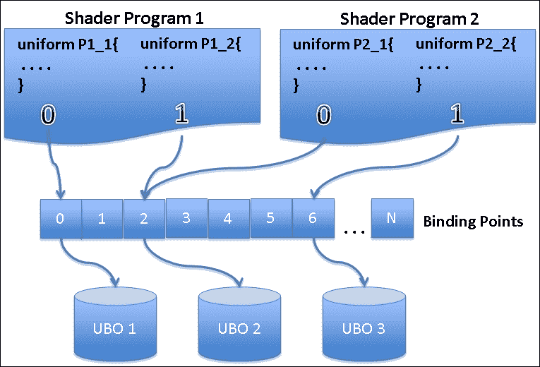
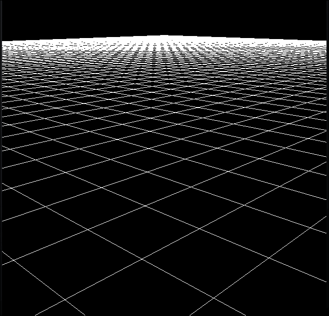
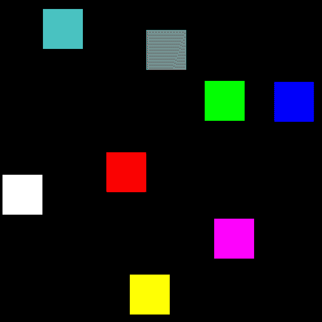
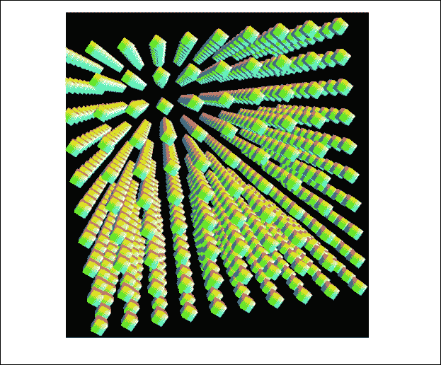
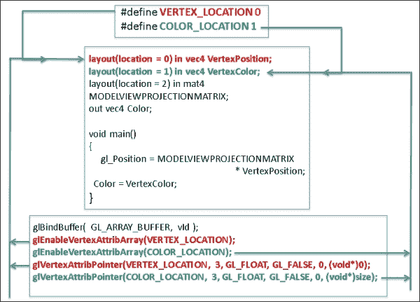
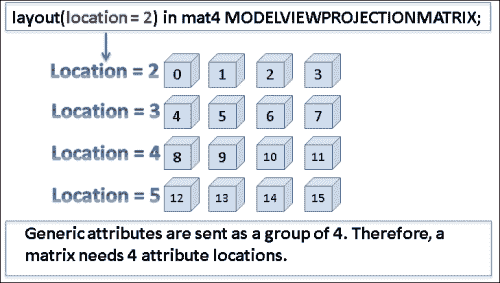
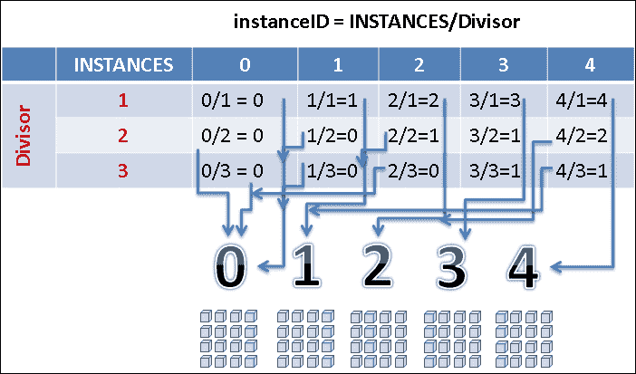
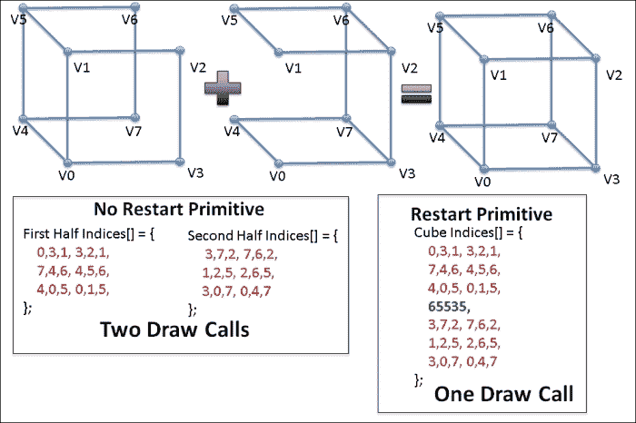
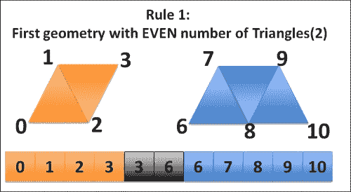
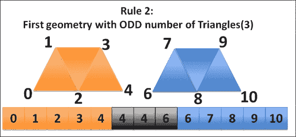

# 第三章：OpenGL ES 3.0 的新特性

在本章中，我们将涵盖以下配方：

+   使用限定符管理变量属性

+   分组统一变量和创建缓冲区对象

+   使用顶点数组对象管理 VBO

+   使用映射读写缓冲区对象

+   使用几何实例化渲染多个对象

+   使用原始重启渲染多个原语

# 简介

OpenGL ES 3.0 于 2012 年 8 月公开发布。它将移动 3D 图形提升到了新的水平。这次发布专注于提供增强的 3D 功能，并提高了在不同移动设备、嵌入式操作系统和平台之间的可移植性。OpenGL ES 3.0 完全向后兼容 OpenGL ES 2.0。这使得应用程序能够逐步增长图形能力和视觉功能。OpenGL ES 3.0 还引入了新的**GL 着色语言**（**GLSL**）3.0 版本。GLSL 用于编写着色器。新的着色语言也在许多方面扩展了功能，你将在下一节中了解到。

本章将有助于理解 OpenGL ES 3.0 和 GL 着色语言 3.0 引入的新特性。本书在所有配方中使用 OpenGL ES 3.0 与 GLSL 3.0 结合。

OpenGL ES 3.0 的新特性可以大致分为以下五个类别：

+   **几何**：这些特性专注于顶点属性规范，如数据存储、数据传输、属性状态、原语组装等。它们如下所述：

    +   **变换反馈**：这个特性允许我们捕获顶点着色器的输出，为 GPU 提供下一帧渲染的反馈。这样，它避免了 CPU 的干预，并使渲染更高效。

    +   **遮挡查询**：这允许快速硬件测试以检查一个像素是否将出现在屏幕上，或者是否被另一个像素遮挡。这种检查有助于决定是否跳过某些操作，例如几何处理，因为它被遮挡。

    +   **几何实例化**：这允许在不需要调用多个渲染 API 的情况下高效地渲染一个对象多次。这在人群模拟、树木渲染等情况下非常有用。

    +   **原始重启**：这个新特性允许我们使用单个绘图 API 调用渲染多个不连续的原语。索引数组用于将多个原语（同一类型）打包在一个捆绑包中。这个数组包含多个不连续的原语，并有一个特殊的标记，帮助 GPU 一次性渲染不连续的原语。

+   **纹理**：OpenGL ES 3.0 为纹理添加了许多新特性。这些特性在此描述：

    +   **深度纹理和阴影比较**：深度纹理允许将深度缓冲区信息存储到纹理中。这对于使用**百分比最近过滤**（**PCF**）技术渲染阴影非常有帮助，其中深度信息通过渲染到纹理技术显式地从深度缓冲区存储到纹理中。随后，这些信息用于测试传入的片段，以确定它们是否是阴影的一部分。OpenGL ES 3.0 允许隐式地进行这种比较测试。

    +   **无缝立方体贴图**：立方体贴图渲染得到了改进，以消除图像边界边缘的伪影。现在，过滤技术考虑相邻面的纹理数据，以在面边缘产生无缝的纹理边界。您可以参考第七章中的*使用无缝立方体贴图实现天空盒*配方，*纹理和映射技术*。

    +   **ETC2/EAC 纹理压缩格式**：在 OpenGL ES 3.0 之前，OpenGL ES 没有官方支持的标准压缩格式。开发者依赖于不同供应商提供的特定压缩格式，例如 Imagination Technologies 的 PVRTC，Sony Ericsson 的**Ericsson Texture Compression**（**ETC**），Qualcomm 的 ATC 等。现在，ETC2 和 EAC 纹理压缩格式在 OpenGL ES 3.0 中得到全面支持。请参考第七章中的*使用 ETC2 压缩纹理进行高效渲染*配方，*纹理和映射技术*。

    +   **非 2 的幂次方纹理**（**NPOT**）：现在，支持具有非 2 的幂次方像素维度的纹理以全环绕模式和米级贴图。在 OpenGL ES 的早期规范中，纹理必须以 2 的幂次方（POT）维度形式存在。因此，需要外部图像工具将 NPOT 转换为 POT 格式。

    +   **纹理混色**：GLSL 提供了一种访问纹理组件（R、G、B 和 A）的抽象级别，无论它们在物理存储中的顺序如何。

    +   **增加的 2D 纹理维度**：OpenGL ES 3.0 中 2D 纹理的维度为 2048，这比 OpenGL ES 2.0 大得多。

    +   **3D 纹理**：OpenGL ES 3.0 支持 3D 纹理目标。3D 纹理在医学成像中得到广泛应用。

    +   **2D 纹理数组**：这一新特性允许我们将多个 2D 纹理以数组的形式存储。这对于动画目的非常有用。在此之前，使用纹理精灵。

+   **着色器**：这些是在现代计算机图形编程中用于控制几何和像素颜色着色的特殊小程序。着色器的特性如下：

    +   **程序二进制文件**: 顶点和片段着色器被编译并存储在二进制格式中。在 OpenGL ES 2.0 中，这个二进制格式需要在运行时链接到程序。OpenGL ES 3.0 允许通过将此二进制存储到不要求运行时链接的离线二进制格式中来实现优化。这种优化通过避免运行时链接来帮助更快地加载应用程序。

    +   **平坦/平滑插值器**: 在 OpenGL ES 2.0 中，所有插值器都在原语之间执行线性插值。借助 GLSL 3.0，在 OpenGL ES 3.0 中，插值可以显式声明为具有平坦和光滑着色。

+   **缓冲区对象**: 这些允许我们在 GPU 内存上存储顶点数据。新特性扩展了缓冲区对象的功能，使其更高效。以下是新特性：

    +   **统一块**: 这允许将相关的统一值组合成一个可管理的单个组。这增加了着色器程序的可读性。

    +   **布局限定符**: 在顶点和片段着色器中定义的属性可以直接绑定到用户定义的位置。这样，就不需要飞行绑定 API 调用。

    +   **顶点数组对象**: 此功能提供了一种高效的方法来绑定顶点数组和相应的属性。**顶点数组对象**（**VAO**）用于封装 VBO。当调用 VAO API 时，它有效地切换存储在 VBO 中的状态，而不调用多个 API。这减少了顶点数组状态切换的开销。

    +   **统一缓冲区对象**: 此功能以高效的方式将统一块存储为缓冲区对象。此统一块对象可以随时绑定。这为一次共享多个程序中的统一数据提供了机会。此外，它允许我们一次性设置多个统一变量。

    +   **子范围缓冲区映射**: 与从 GPU 到 CPU 侧映射整个缓冲区不同，此机制提供了一种高效的方法来访问 GPU 内存空间中的内存内容范围。有时，目的是仅更新缓冲区的一小部分。因此，映射整个缓冲区是不高效的。在这种情况下，子范围缓冲区映射减少了从 GPU 到 CPU 再到 GPU 的序列化时间。

    +   **缓冲区对象复制**: 此机制将一个缓冲区对象的数据传输到另一个缓冲区对象，而不涉及 CPU。

    +   **同步对象**: 这提供了一种在应用程序和 GPU 之间的同步机制。这样，应用程序可以确保 GPU 侧 OpenGL ES 操作的完成。

    +   **栅栏**: 此功能通知 GPU 等待排队新的 OpenGL ES 操作，直到旧操作在 GPU 上完全执行。

+   **帧缓冲区**: 新特性还包括与帧缓冲区离屏渲染相关的增强功能。以下是新特性：

    +   **多个渲染目标（MRT）**：此功能允许我们同时将离屏渲染到多个颜色缓冲区或纹理。这些纹理可以用作其他着色器的输入，或者用于 3D 模型。MRTs 最常用于实现延迟着色。

    +   **多采样渲染缓冲区**：此功能使应用程序能够执行具有多采样抗锯齿的离屏帧缓冲区渲染。这提高了生成图像的视觉效果，并减少了在屏幕上以对角线方向绘制的线条或尖锐几何边缘中出现的锯齿状效果。

本章将重点介绍几何和缓冲区对象的新特性。随着我们进入即将到来的章节，我们还将介绍着色器、纹理和帧缓冲区的新特性。

### 注意

您可以在[`www.khronos.org/registry/gles/specs/3.0/es_spec_3.0.3.pdf`](http://www.khronos.org/registry/gles/specs/3.0/es_spec_3.0.3.pdf)和[`www.khronos.org/opengles/sdk/docs/man3/`](http://www.khronos.org/opengles/sdk/docs/man3/)上探索更多关于 OpenGL ES 3.0 规范和文档。

# 使用限定符管理变量属性

GLSL 3.0 引入了两个新的限定符：存储和布局。让我们详细看看它们：

+   **存储限定符**：这是一个特殊的关键字，用于指定全局或局部变量的存储或行为。它在着色器编程中使用。它使得应用程序和着色器之间建立通信桥梁。它还用于从一个着色器阶段向另一个阶段共享信息。例如，3D 光照技术需要物体的几何信息以便创建逼真的光照着色。这些几何信息在顶点着色器中计算，并传递给片元着色器，在那里这个输入被用来着色几何原语的部分。

    在 GL SL 3.0 中提供了六种存储限定符。它们在以下表中描述：

    | 限定符 | 含义 |
    | --- | --- |
    | `const` | 变量的值在编译时不改变。 |
    | `in` | 这是来自前一阶段的复制输入变量，它与当前着色器链接。如果在函数参数中指定，这是一个输入变量。 |
    | `centroid in` | 这是与中心插值器链接的输入类型变量。 |
    | `out` | 这是来自前一阶段的复制输入变量，它与当前着色器链接。如果在函数参数中指定，这是一个输出变量。 |
    | `centroid out` | 这是与中心插值器链接的输出类型变量。 |
    | `uniform` | 变量的值在处理过程中不会改变。这些统一变量在着色器之间共享。 |

+   **布局限定符**：这影响变量的属性，如存储、位置、内存对齐等。此限定符在声明着色器中变量位置时广泛使用。在着色器中声明的每个变量或通用属性都存储在 GPU 上分配的内存位置。此内存位置用于存储数据，作为运行时计算的结果或来自着色器前一个阶段的数据输入。与 C/C++指针不同，着色语言使用位置 ID 来访问变量。位置是变量的 ID（数值），用于将着色语言中存在的变量与应用程序程序连接起来。

## 准备工作

下表指定了存储和布局限定符的语法。存储限定符在变量的数据类型之前提及。最常用的限定符是 in 和 out。这些存储限定符告诉我们顶点属性是输入变量还是输出变量。

布局限定符为顶点属性分配一个 ID 或位置，以便避免运行时的绑定和查询位置。布局限定符始终在存储限定符之前提及。

| 限定符 | 语法 |
| --- | --- |
| 存储 | `(存储限定符) [数据类型] [变量名]` |
| 布局 | `layout (限定符 1,限定符 2 = value, . . .) [存储限定符]` |

## 如何操作...

着色器中的变量以位置 ID 的形式抽象化。每个变量或通用属性都通过其位置 ID 识别，并用于将数据绑定到 OpenGL ES 程序中。这些位置 ID/索引可以使用布局限定符中的`location`关键字定义。

在我们的第一个配方中，我们将演示存储和布局限定符的使用：

1.  创建一个顶点着色器`LayoutVertex.glsl`，如下所示：

    ```java
    #version 300 es
    layout(location = 0) in vec4 VertexPosition; 
    layout(location = 1) in vec4 VertexColor; 
    out vec4 Color;
    uniform mat4 MODELVIEWPROJECTIONMATRIX;

    // Function with two input and one output storage qualifier
    void calculatePosition(in mat4 MVP, in vec4 vp, out vec4 position){
       position = MVP * vp;
    }

    void main() 
    {
       vec4 position;
       calculatePosition(MODELVIEWPROJECTIONMATRIX,
                             VertexPosition, position);
       gl_Position  = position;
       Color        = VertexColor;
    }
    ```

1.  创建片段着色器`LayoutFragment.glsl`并修改它，如下所示：

    ```java
    #version 300 es
    precision mediump float;
    in vec4 Color; //in variable receive from shader
    float blendFactor = 0.8;
    layout(location = 0) out vec4 outColor; 
    // Function with input argument and output as return type
    vec4 addBlend( in vec4 colorOpaque ) 
    {
        return vec4(colorOpaque.x, colorOpaque.y, 
    colorOpaque.z, blendFactor);
    }

    void main() {
        outColor = addBlend( Color );
    }
    ```

1.  重新使用*使用顶点缓冲对象进行高效渲染*配方第二章, *OpenGL ES 3.0 基础*，并在应用程序程序`Cube.cpp`中根据您的选择定义位置索引。确保在着色器程序中指定相同的索引：

    ```java
    #define VERTEX_LOCATION 0
    #define COLOR_LOCATION 1
    ```

1.  在构造函数中创建 VBO 和 IBO，并启用以下属性：

    ```java
    glGenBuffers(1, &vId); // Create VBO and bind data
    glGenBuffers(1, &iId); // Create IBO and bind data

    // Enable the attribute locations
    glEnableVertexAttribArray(VERTEX_LOCATION);
    glEnableVertexAttribArray(COLOR_LOCATION);
    ```

1.  将 VBO 几何数据附加到位置 ID。这将用于从应用程序发送数据到 GPU 着色器处理器。显然，使用布局限定符可以避免对顶点属性的布局查询(`glGetAttribLocation`)：

    ```java
    void Cube::RenderCube() {
       . . . . . 
       glBindBuffer( GL_ARRAY_BUFFER, vId );
       glVertexAttribPointer(VERTEX_LOCATION, 3, 
       GL_FLOAT, GL_FALSE, 0, (void*)0);
       glVertexAttribPointer(COLOR_LOCATION, 3, GL_FLOAT, 
       GL_FALSE, 0, (void*)size);
       glBindBuffer( GL_ELEMENT_ARRAY_BUFFER, iId );
       glDrawElements(GL_TRIANGLES, 36, 
       GL_UNSIGNED_SHORT, (void*)0);
       . . . . . 
    }
    ```

## 它是如何工作的...

OpenGL ES 程序在 `Cube.cpp` 中定义了两个索引 ID，分别为 `VERTEX_LOCATION` 和 `COLOR_LOCATION`，分别用于顶点和颜色数据。这些索引将用于在着色器程序中定义属性位置。程序员必须确保在着色器程序中用于属性的布局位置 ID 必须与在 OpenGL ES 程序中使用的 ID 相同。这可以通过使用布局限定符声明变量属性来实现。将 `layout` 关键字与 `location` 限定符结合使用，允许用户定义的位置与属性变量关联。如果某些属性变量没有通过用户定义的位置索引指定，则编译器会自动生成并分配它们。

在着色器程序中，`VertexPosition` 和 `VertexColor` 分别被分配到与 OpenGL ES 程序中定义的相同的位置索引 `0` 和 `1`。这两个变量声明为 `vec4` 类型，并带有存储限定符 `in`。这表明这两个变量是从 OpenGL ES 程序输入到顶点着色器的。通过在 `RenderCube` 函数中使用 `glVertexAttribPointer` API 将数据附加到 `VertexPosition` 和 `VertexColor` 的位置索引，将几何数据（顶点和颜色）发送到顶点着色器。需要注意的是，在使用 `glEnableVertexAttribArray` API 附加之前，必须启用通用属性变量。这个配方在 `Cube` 构造函数中启用它们。

当顶点着色器接收到 `VertexPosition` 中的顶点输入数据和统一变量 `MODELVIEWPROJECTIONMATRIX` 中的变换坐标时，它使用这两个变量作为 `calculatePosition` 函数的输入参数来计算传入顶点的变换位置。这个计算出的位置作为输出存储限定符返回到主函数中的 `position` 变量。`calculatePosition` 函数在本配方中引入，以展示在着色器程序的局部作用域中存储限定符的另一种可能用途。

`Color` 变量使用 `VertexColor` 的输入值，并将其传递到下一个阶段，其中片段着色器消耗这个值来为片段分配颜色。为了从顶点着色器将数据发送到片段着色器，两个着色器应使用相同的属性变量名称。顶点着色器的存储限定符必须定义为 `out`，因为它为片段着色器生成输出数据。相比之下，片段着色器必须指定为 `in` 存储限定符，因为它接收来自前一阶段的数据。片段着色器展示了从着色器编程函数返回值的另一种使用方式。

## 还有更多...

在当前教程中，你学习了如何使用布局限定符从着色器程序中绑定 OpenGL ES 中通用属性变量的位置索引。作为替代，也可以使用`glBindAttribLocation` API 显式绑定位置索引。

**语法**：

```java
void glBindAttribLocation( GLuint program, GLuint index, const GLchar *name );
```

| 变量 | 描述 |
| --- | --- |
| `program` | 这是程序对象句柄 |
| `index` | 这是通用顶点属性或变量的索引 |
| `name` | 这是顶点着色器属性变量，索引将被绑定 |

然而，建议鼓励使用布局限定符，因为它不会产生将位置索引附加到着色器程序的 API 调用的开销。在着色器程序中使用布局位置限定符可以避免在 OpenGL ES 程序中运行时绑定属性位置。

## 参见

+   参考第一章中的*使用顶点属性将数据发送到着色器*教程，*OpenGL ES 3.0 在 Android/iOS 上*，第一章

+   参考第二章中的*使用顶点缓冲对象进行高效渲染*教程，*OpenGL ES 3.0 基础知识*，第二章

# 分组统一变量和创建缓冲对象

接口块有助于将统一变量分组到一个逻辑组中。这在着色器程序中分组相关变量非常有用。接口块为一次共享多个程序中的统一数据提供了机会。这允许我们一次性设置多个统一变量，这些变量可以多次使用。

**统一缓冲对象**（**UBO**）是一种用于接口块（包含统一变量）的缓冲对象，类似于 VBO、IBO 等。它在 GPU 内存中存储接口块的内容，以便在运行时快速访问数据。UBO 使用绑定点，作为统一块和统一缓冲之间的中介。在本教程中，我们将创建一个统一块并学习如何编程统一缓冲对象。

本教程演示了接口块的概念。在本教程中，我们创建了一个接口块来存储变换矩阵。此块包含三个统一变量。接口块使用 UBO 功能作为缓冲对象存储。这允许我们将接口块作为 OpenGL ES 缓冲对象存储。

## 准备工作

创建统一块的语法非常简单。以下表格显示了语法和实现测试用例：

| 语法 | 单个统一变量 | 统一块 |
| --- | --- | --- |

|

```java
uniform <block name>{
[Type] <variable name 1>;
[Type] <variable name 2>;
. . .
};
```

|

```java
uniform mat4 ModelMatrix;
uniform mat4 ViewMatrix;
uniform mat4 ProjectionMatrix;
```

|

```java
uniform Transformation{
    mat4 ModelMatrix;
    mat4 ViewMatrix;
    mat4 ProjectionMatrix;
};
```

|

## 如何实现...

下面是逐步描述，展示了接口块并有助于编程统一块对象：

1.  重新使用之前的教程，*使用限定符管理变量属性*，并创建顶点着色器（`UniformBlockVertex.glsl`），如下所示：

    ```java
    #version 300 es

    layout(location = 0) in vec4 VertexPosition;
    layout(location = 1) in vec4 VertexColor;

    out vec4 Color;
    // Uniform Block Declaration
    uniform Transformation{
        mat4 ModelMatrix;
        mat4 ViewMatrix;
        mat4 ProjectionMatrix;
    };

    void main()
    {
        gl_Position = ProjectionMatrix * ViewMatrix * 
                      ModelMatrix * VertexPosition;
        Color = VertexColor;
    }
    ```

1.  创建片段着色器（`UniformBlockFragment.glsl`），如下所示：

    ```java
    #version 300 es
    precision mediump float;
    in vec4 Color;
    layout(location = 0) out vec4 outColor;
    void main() {
      outColor = vec4(Color.x, Color.y, Color.z, 1.0);
    }
    ```

1.  在 `Cube::InitModel()` 函数中，编译给定的着色器（们）并创建程序对象。在尝试创建 UBO 之前，确保程序正在使用中（`glUseProgram`）。在此配方中，我们在一个单独的类成员函数 `CreateUniformBufferObject` 中创建了 UBO。按照以下步骤来理解此函数：

    ```java
    void Cube::CreateUniformBufferObject()
    {
        // Get the index of the uniform block
        char blockIdx = glGetUniformBlockIndex
        (program->ProgramID, "Transformation");

        // Query uniform block size
        GLint blockSize;
        glGetActiveUniformBlockiv(program->ProgramID, blockIdx,
        GL_UNIFORM_BLOCK_DATA_SIZE, &blockSize);

        // Bind the block index to BindPoint
        GLint bindingPoint = 0;
        glUniformBlockBinding(program->ProgramID, 
        blockIdx, bindingPoint);

        // Create Uniform Buffer Object(UBO) Handle
        glGenBuffers(1, &UBO);
        glBindBuffer(GL_UNIFORM_BUFFER, UBO);
        glBufferData(GL_UNIFORM_BUFFER, blockSize, 
        0, GL_DYNAMIC_DRAW);

        // Bind the UBO handle to BindPoint
        glBindBufferBase(GL_UNIFORM_BUFFER, bindingPoint, UBO);
    }
    ```

1.  使用 `glGetUniformBlockIndex` API 查询在顶点着色器中定义的统一块索引，并将其存储在 `blockIdx` 中。此 API 接受程序 ID 和需要查询块索引的统一块名称。

1.  使用 `blockIdx` 并借助 `glGetActiveUniformBlockiv` API 查询 `blockSize` 变量中的块数据大小。使用 `glUniformBlockBinding` 将统一块索引绑定到绑定点 `bindingPoint`。

1.  创建统一缓冲块的对象句柄，并将其绑定到符号常量 `GL_UNIFORM_BUFFER`，并分配由 `blockSize` 指定的所需内存。最后，使用 `glBindBufferBase` 通过绑定点绑定 UBO。

1.  在渲染函数中，利用缓冲对象内存映射来修改 UBO 的内容：

    ```java
    void Cube::RenderCube()
    {
       // Bind the UBO
       glBindBuffer( GL_UNIFORM_BUFFER, UBO );
       // Map the buffer block for MVP matrix
       glm::mat4* matrixBuf = (glm::mat4*)glMapBufferRange
       (GL_UNIFORM_BUFFER, 0, sizeof(glm::mat4*)*(3),
    GL_MAP_WRITE_BIT);
    // Assign updated matrix
       matrixBuf[0] = *TransformObj->TransformGetModelMatrix();
       matrixBuf[1] = *TransformObj->TransformGetViewMatrix();
                matrixBuf[2]=*TransformObj->TransformGetProjectionMatrix();
    // UnMap the buffer block
       glUnmapBuffer ( GL_UNIFORM_BUFFER );

    // Draw Geometry using VBO..
    . . . .    
    }
    ```

## 它是如何工作的...

在顶点着色器中的统一块声明将模型、视图和投影矩阵组合成一个名为 **transformation** 的逻辑块。当着色器程序被编译时，它为该块分配一个唯一的 ID/索引，称为块索引。在统一块中不允许使用用户定义的位置索引。创建 UBO 需要以下五个步骤：

1.  使用 `glGetUniformBlockIndex` API 查询 `blockIdx` 变量中的 `Transformation` ID。

1.  为了为 UBO 分配内存，使用 `glGetActiveUniformBlockiv` API 查询 `Transformation` 统一块的大小并将其存储在 `blockSize` 变量中。

1.  使用 `glUniformBlockBinding` API 将 `blockIdx`（块索引）绑定到 `bindingPoint`（绑定点）。UBO 使用绑定点的概念在块索引和缓冲对象之间建立连接。两者都必须绑定到绑定点。

1.  与在 OpenGL ES 中创建的缓冲对象（VBO 和 IBO）类似，同样创建统一缓冲对象。必须使用 `GL_UNIFORM_BUFFER` 符号常量来确保 UBO 缓冲区与 OpenGL ES 状态机。

1.  如第 3 步所述，我们需要将 UBO 与已附加到块索引的相应绑定点相关联。使用 `glBindBufferBase` API 绑定 UBO 和 `bindingPoint`。

UBO 可以通过单个 UBO 绑定调用设置多个值。`RenderCube()` 绑定 UBO 来设置模型、视图和投影矩阵的统一值。缓冲对象允许使用缓冲区映射技术修改缓冲区元素。

OpenGL ES 3.0 的发布引入了一个新的范围缓冲区映射特性。这个特性允许我们修改缓冲对象的一个子集。与需要将整个缓冲区映射到 CPU 侧的老式缓冲区映射技术不同，这种技术看起来要高效得多。

使用`glMapBufferRange` API 在客户端映射 UBO 以修改模型、视图和投影矩阵的更新值。确保在修改完成后使用`glUnmapBufferAPI`取消映射缓冲对象。使用现有的 VBO 渲染代码。

## 还有更多...

下图描述了 UBO 中绑定点的概念。每个统一块在着色程序中都有一个唯一的索引。这个索引附加到一个绑定点上。同样，UBO 也附加到绑定点上，并提供了一种在不同程序间共享相同数据的方法。



在前面的图中，**P1_2**和**P2_1**指向同一个绑定点。因此，它们共享相同的数据。

## 参见

+   请参阅第二章中的*使用顶点缓冲对象进行高效渲染*食谱。

+   *使用映射读取和写入缓冲对象*

# 使用顶点数组对象管理 VBO

在第二章中，我们介绍了使用顶点数组和**顶点缓冲对象**（**VBO**）来加载顶点属性的两个特性。这两个特性允许我们在 OpenGL ES 渲染管道中加载顶点属性。与顶点数组相比，VBO 被认为更高效，因为它们将顶点数据存储在 GPU 内存中。这减少了 CPU 和 GPU 之间数据复制的成本。在本食谱中，我们将了解一个新特性：OpenGL ES 3.0 的**顶点数组对象**（**VAO**）。这个特性比 VBO 更高效。

当加载顶点属性时，需要在 OpenGL ES 渲染管道中设置一些额外的调用以设置属性状态。例如，在渲染之前，使用`glBindBuffer` API 绑定缓冲对象，使用`glVertexAttribPointer` API 分配数据数组，并使用`glEnableVertexAttribArray` API 启用顶点属性。VAO 将这些状态存储在单个对象中，以消除这些调用造成的开销。

这允许应用程序快速在可用的顶点数组缓冲区之间切换，并设置它们各自的状态。这使得渲染更高效，同时也帮助保持编程代码紧凑且干净。

## 如何做到这一点...

本食谱演示了使用 VAO 和 VBO 结合进行简单网格几何渲染。对于 VAO 的编程，不需要对着色器进行任何更改。也许可以使用本章之前的食谱。

创建 VAO 的步骤非常简单：

1.  创建一个`Grid`类，并在`CreateGrid`函数中定义几何形状。此函数接受网格的维度和分割。在此函数内部，创建一个 VBO、IBO 和 VAO，如下面的代码所示：

    ```java
    void Grid::CreateGrid(GLfloat XDim, GLfloat ZDim, int XDiv, int ZDiv)
    {
       // Define geometry using Dimension and divisions
       // Create VBO and IBO for grid geometry
       // Create Vertex Array Object
       // Enable VBO and set attribute parameters
       // Unbind VAO, VBO and IBO 
    }
    ```

1.  创建一个 VBO，生成缓冲区，并将顶点信息填充到缓冲对象中：

    ```java
     // Create VBO ID
     glGenBuffers(1, &vIdGrid);
     glBindBuffer( GL_ARRAY_BUFFER, vIdGrid);
     glBufferData( GL_ARRAY_BUFFER,size,0, GL_STATIC_DRAW);
     glBufferSubData( GL_ARRAY_BUFFER, 0, size,gridVertex);
    ```

1.  类似地，创建一个 IBO，并用元素索引填充缓冲区：

    ```java
     // Create IBO for Grid
     unsigned short indexSize=sizeof(unsigned short)*indexNum;
     glGenBuffers(1, &iIdGrid);
     glBindBuffer( GL_ARRAY_BUFFER, iIdGrid );
     glBufferData(GL_ARRAY_BUFFER,indexSize,0,GL_STATIC_DRAW);
     glBufferSubData(GL_ARRAY_BUFFER,0,indexSize,gridIndices);
    ```

1.  使用`glGenVertexArrays` API 生成 VAO ID。使用`glBindVertexArray`绑定生成的`Vertex_VAO_Id`。因此，在 VAO 创建后的代码记录在 VAO 对象的状态向量中。因此，使用 VBO 并将数据绑定到所需的顶点属性以进行渲染：

    ```java
          // Create Vertex Array Object
          glGenVertexArrays(1, &Vertex_VAO_Id);
          glBindVertexArray(Vertex_VAO_Id);    
          // Create VBO and set attribute parameters
          glBindBuffer( GL_ARRAY_BUFFER, vIdGrid );
          glEnableVertexAttribArray(VERTEX_LOCATION);
          glVertexAttribPointer(VERTEX_LOCATION,3,GL_FLOAT,
          GL_FALSE,0, (void*)0);
          glBindBuffer( GL_ELEMENT_ARRAY_BUFFER, iIdGrid );
    ```

1.  一旦正确设置顶点状态和属性，解绑 VAO、VBO 和 IBO：

    ```java
    glBindVertexArray(0);
    glBindBuffer( GL_ARRAY_BUFFER, 0 );
    glBindBuffer( GL_ELEMENT_ARRAY_BUFFER, 0 );
    ```

1.  使用`Render()`函数通过 VAO 渲染几何形状，如下所示：

    ```java
       // void Grid::Render() 
       // Use shader program and apply transformation    
       . . . . .
       glBindVertexArray(Vertex_VAO_Id); // Bind VAO
       glDrawElements(GL_LINES,((XDivision+1)+(ZDivision+1))*2,
       GL_UNSIGNED_SHORT, (void*)0); }
    ```

## 它是如何工作的...

VAO 将顶点数组客户端状态和缓冲区绑定存储在状态向量中。当 VAO ID 被绑定时，后续的操作调用，如绑定 VBO、启用客户端状态和将数据缓冲区附加到通用属性，都存储在 VAO 的状态向量中。这样，当 VAO 被绑定时，状态向量提供了当前设置、配置和顶点数组的客户端状态的完整状态。而不是进行多次调用，这个绑定调用就足以启用顶点数组的配置和状态。



## 参见

+   请参考第二章中的*使用顶点数组渲染原语*配方，*OpenGL ES 3.0 基础*

# 使用映射读取和写入缓冲对象

之前的配方介绍了一个新功能，即使用 VAO 访问顶点数组。此对象最小化了在顶点数组及其相应状态之间切换的开销。本配方将进一步教你如何使用缓冲映射更新缓冲对象的 数据。VBO 可以使用`glBufferData`和`glBufferSubData`进行更新，如许多配方中所示。这些 API 可以用于将数据上传或下载到设备。相比之下，缓冲映射是更新驻留在 GPU 内存中的缓冲对象的效率较高的方法。

本示例将演示缓冲对象范围映射。在这个示例中，我们将重用立方体几何形状，并将立方体的每个顶点渲染为点原语，而不是三角形原语。立方体的每个顶点都经过编程，在固定的时间间隔后使用缓冲对象范围映射功能随机改变其颜色。

## 准备工作

在开始逐步描述之前，这里是对缓冲对象范围映射的概述：

1.  使用`glBindBuffer`绑定需要映射的缓冲区。

1.  使用`glMapBufferRange` API 从驱动器内存空间获取内存位置的指针。

1.  使用此指针对获取的内存执行任何读写操作。

1.  使用 `glUnmapBuffer` API 无效化获取指针。此 API 允许我们将更新后的内存内容发送到 GPU 内存空间。

## 如何做到...

此配方不需要在顶点和片段着色器中进行任何特殊更改。对于此配方，我们使用了一个新的 GL 着色语言 API，称为 `gl_PointSize`。此 API 用于指定 `GL_POINTS` 原始形状的大小。利用 第二章 中的 *使用顶点缓冲对象进行高效渲染* 配方，并按照以下步骤将范围映射编程到缓冲区对象：

1.  首先，使用之前的 VAO 配方创建立方体几何的 VAO。

1.  在 `Render()` 函数内部编程映射范围缓冲区，如下所示。以下步骤将描述此函数：

    ```java
    void Cube::RenderCube(){
         if (clock() - last >= CLOCKS_PER_SEC * 0.1){
            // Bind the Buffer Object for vertex Array.
            glBindBuffer( GL_ARRAY_BUFFER, vId );
            // Get the mapped memory pointer.
            GLfloat* colorBuf = (GLfloat* )glMapBufferRange(
     GL_ARRAY_BUFFER, size, size, GL_MAP_WRITE_BIT);
            for(int i=0; i<size/sizeof(GLfloat); i++)
    {  colorBuf[i] = float(rand()%255)/255; }
            last = clock();
            // Invalidate the mapped memory.
            glUnmapBuffer ( GL_ARRAY_BUFFER );
        }
        // Perform Transformation.
       . . . . . . .    
        // Bind the VAO and Render the cube 
        // with Point primitive.
        glBindVertexArray(Vertex_VAO_Id);
        glDrawElements(GL_POINTS,36,GL_UNSIGNED_SHORT,(void*)0);
    }
    ```

1.  首先，绑定 VBO 以使用 `glBindBuffer` API 映射颜色缓冲区数据。将指针映射到颜色数据内存。VBO 中的颜色数据从大小索引开始，也是大小字节长：

    ```java
    colorBuf = (GLfloat*)glMapBufferRange (GL_ARRAY_BUFFER,
     size, size, GL_MAP_WRITE_BIT);
    ```

    在成功映射缓冲区对象后，它返回指向内存映射位置的合法指针。如果发生错误，API 将返回 `NULL` 指针。

    +   **语法**:

        ```java
        void *glMapBufferRange(GLenum target, GLintptr offset,
                        GLsizeiptr length, GLbitfield access);
        ```

        | 变量 | 描述 |
        | --- | --- |
        | `target` | 这指定了预期用于内存映射的缓冲区类型，例如，`GL_MAP_READ_BIT` 和 `GL_MAP_WRITE_BIT` |
        | `offset` | 这指定了映射对象中感兴趣映射的起始偏移量 |
        | `length` | 这指定了需要映射的缓冲区范围 |
        | `access` | 这是指示所需访问缓冲区范围的符号常量标志组合 |

1.  复制映射内存缓冲区中的新颜色值：

    ```java
    // size/sizeof(GLfloat) gives total number of elements 
    // that needs to be updated with new color, the formula 
    // is- total size of buffer / unit item size 
    for(int i=0; i<size/sizeof(GLfloat); i++){
        colorBuf[i] = float(rand()%255)/255;
    }
    ```

1.  解除内存映射缓冲区，以指示 OpenGL ES 渲染管道将此数据传输到 GPU 内存空间：

    ```java
    glUnmapBuffer ( GL_ARRAY_BUFFER );
    ```

    `UnmapBuffer` API 在成功解除当前映射的缓冲区时返回布尔值 `TRUE`。如果发生某些错误，它返回 `FALSE`。

    +   **语法**:

        ```java
        GLboolean glUnmapBuffer(GLenum target);
        ```

        | 变量 | 描述 |
        | --- | --- |
        | `target` | 这指定了需要解除绑定的缓冲区类型 |

1.  绑定 VAO 并使用 `GL_POINTS` 原始形状渲染几何形状。`GL_POINTS` 原始形状在屏幕上渲染小点。为了增加这些点的尺寸，可以在顶点着色器中使用 `gl_PointSize` API，如下一步所示：

    ```java
    glBindVertexArray(Vertex_VAO_Id);
    glDrawElements(GL_POINTS, 36, GL_UNSIGNED_SHORT, (void*)0);
    ```

1.  创建 `BufferMappingVertex.glsl` 如下：

    ```java
    layout(location = 0) in vec4 VertexPosition;
    layout(location = 1) in vec4 VertexColor;
    uniform mat4 MODELVIEWPROJECTIONMATRIX;
    out vec4 Color;
    void main(){
      gl_Position = MODELVIEWPROJECTIONMATRIX * VertexPosition;
      gl_PointSize= 80.0; // Size of GL_POINTS primitive
      Color       = VertexColor;
    }
    ```

## 它是如何工作的...

在 VBO 中，`glBufferData` 和 `glBufferSubData` 使用用户数据并将其复制到设备内存位置的钩子/固定位置。此钩子位置可以被 GPU 访问。用户数据像 `memcpy` 内部一样复制到这个内存位置。随着数据复制过程的完成，驱动程序开始 **直接内存分配**（**DMA**），而不干预 CPU 周期。

DMA 的目标目的地取决于(`GL_STREAM_DRAW`, `GL_STREAM_READ`, `GL_STREAM_COPY`, `GL_STATIC_DRAW`, `GL_STATIC_READ`, `GL_STATIC_COPY`, `GL_DYNAMIC_DRAW`, `GL_DYNAMIC_READ`, 或 `GL_DYNAMIC_COPY`) API 的使用提示。

相比之下，`glMapBufferRange`方法被认为效率更高。API 首先将一个内存位置直接钩接到驱动程序内存空间中。这个固定的内存位置可以通过指向应用程序的指针来访问。这个指针可以直接用来更新上传或下载数据的位置。一旦对映射位置的读写操作完成，可以通过调用`glUnMapBuffer`使指针无效。这个 API 调用提示 OpenGL ES 管道使用 DMA 调用将更新后的数据推送到 GPU 内存。



## 参考以下内容

+   请参阅附录中的*Swizzling*配方，*OpenGL ES 3.0 补充信息*

+   请参阅第十二章中的*带有同步对象和栅栏的变换反馈粒子系统*配方，*实时阴影和粒子系统*

# 使用几何实例化渲染多个对象

几何实例化允许我们在单个渲染 API 调用中渲染同一对象的多个实例。这些多个实例在通用属性上有所不同，例如变换矩阵、颜色、缩放等。这个特性对于实现粒子系统、人群模拟、丛林树木渲染等非常有用。与传统方式渲染多个对象相比，这种技术非常高效，因为它只需要一个 API 调用。这减少了将多个渲染调用发送到 OpenGL ES 渲染引擎的 CPU 处理开销。

这个配方演示了使用几何实例化渲染 1000 个立方体的过程。为此，我们将使用 VBO 中的 1000 个矩阵。每个矩阵包含一个变换，用于将立方体放置在 3D 空间中。矩阵信息通过前一个配方中讨论的范围映射缓冲区功能进行更新。这允许我们在运行时动态传递新的变换数据。变换数据包含新的旋转和移动位置。



## 如何做到这一点...

到目前为止，在我们的配方中，模型视图投影矩阵在顶点着色器中始终被视为统一变量。对于这个配方，我们将使用 VAO 并将模型视图投影矩阵声明为一个通用属性，而不是统一变量。由于矩阵是一个属性，需要一个新的 VBO。这个 VBO 存储在`matrixId`变量中。`RenderCube()`使用映射缓冲区来更新变换矩阵数据。

实现几何实例化的步骤如下：

1.  创建顶点着色器并添加以下代码。对于片段着色器不需要任何更改，它可以被重用：

    ```java
    #version 300 es
    layout(location = 0) in vec4 VertexPosition;
    layout(location = 1) in vec4 VertexColor;
    layout(location = 2) in mat4 MODELVIEWPROJECTIONMATRIX;
    out vec4 Color;
    void main() {
      gl_Position = MODELVIEWPROJECTIONMATRIX * VertexPosition;
      Color = VertexColor;
    }
    ```

1.  在`Cube::InitModel()`中，使用现有代码并添加一个新的 VBO 用于矩阵变换。在`matrixId`中获取生成的缓冲区对象的 ID：

    ```java
    // Create VBO for transformation matrix
    glGenBuffers(1, &matrixId);
    glBindBuffer (GL_ARRAY_BUFFER, matrixId);
    ```

1.  为矩阵变换的 VBO 分配内存。维度变量初始化为 10。它给出了沿轴的立方体数量。因此，沿*x*、*y*和*z*轴，*10 x 10 x 1 0 = 1000 个立方体*。缓冲区的总大小将是*(GLfloat) * 16（mat4 中的 16 个浮点元素）* * 1000（立方体）*：

    ```java
    glm::mat4 transformMatrix[dimension][dimension][dimension];
    glBufferData(GL_ARRAY_BUFFER, sizeof(transformMatrix) , 0, GL_DYNAMIC_DRAW);
    ```

    `glBufferData`使用`GL_DYNAMIC_DRAW`。这个符号常量指定缓冲区将包含一些动态性质的数据。换句话说，数据需要在缓冲区中更新。这个符号常量帮助图形驱动程序以最佳方式管理缓冲区内存，以实现高性能的图形渲染。

1.  在同一函数中，在创建 VAO（`Vertex_VAO_Id`）之后，定义变换矩阵缓冲区对象的通用属性状态和配置。这有助于在 VAO（`Vertex_VAO_Id`）中保存顶点数组客户端状态和缓冲区绑定。`glVertexAttribDivisor`从提供的实例总数计算实例 ID。有关更多信息，请参阅本食谱中的*更多内容…*部分：

    ```java
    // Create VBO for transformation matrix and set attributes
    glBindBuffer( GL_ARRAY_BUFFER, matrixId );
    glEnableVertexAttribArray(MATRIX1_LOCATION);
    glEnableVertexAttribArray(MATRIX2_LOCATION);
    glEnableVertexAttribArray(MATRIX3_LOCATION);
    glEnableVertexAttribArray(MATRIX4_LOCATION);

    glVertexAttribPointer(MATRIX1_LOCATION,4,GL_FLOAT,GL_FALSE,
      sizeof(glm::mat4),(void*)(sizeof(float)*0));
    glVertexAttribPointer(MATRIX2_LOCATION,4,GL_FLOAT,GL_FALSE,
      sizeof(glm::mat4),(void*)(sizeof(float)*4));
    glVertexAttribPointer(MATRIX3_LOCATION,4,GL_FLOAT,GL_FALSE,
      sizeof(glm::mat4), (void*)(sizeof(float)*8));
    glVertexAttribPointer(MATRIX4_LOCATION,4,GL_FLOAT,GL_FALSE,
      sizeof(glm::mat4), (void*)(sizeof(float)*12));

    glVertexAttribDivisor(MATRIX1_LOCATION, 1);
    glVertexAttribDivisor(MATRIX2_LOCATION, 1);
    glVertexAttribDivisor(MATRIX3_LOCATION, 1);
    glVertexAttribDivisor(MATRIX4_LOCATION, 1);
    ```

1.  在`Cube::RenderCube()`函数中，使用范围缓冲区映射将变换缓冲区映射到客户端内存。更新内存中的数据，然后取消映射。使用 VAO 并通过调用几何实例 API `glDrawElementsInstanced`渲染立方体的立方体。此 API 的最后一个参数指定了给定原语将被渲染的实例数：

    ```java
    void Cube::RenderCube()
    {
       glBindBuffer( GL_ARRAY_BUFFER, matrixId );
       glm::mat4* matrixBuf = (glm::mat4*)glMapBufferRange
       (GL_ARRAY_BUFFER, 0, sizeof(glm::mat4*)*(dimension    *dimension*dimension), GL_MAP_WRITE_BIT);
       static float l = 0;
       TransformObj->TransformRotate(l++, 1, 1, 1);
       TransformObj->TransformTranslate
       (-distance*dimension/4,-distance*dimension/4, -distance*dimension/4);
       glm::mat4 projectionMatrix = *TransformObj->
       TransformGetProjectionMatrix();
       glm::mat4 modelMatrix = *TransformObj->
       TransformGetModelMatrix();
       glm::mat4 viewMatrix = *TransformObj->
       TransformGetViewMatrix();
       int instance= 0;
       for ( int i = 0; i < dimension; i++ ){
       for ( int j = 0; j < dimension; j++ ){
       for ( int k = 0; k < dimension; k++ ){
       matrixBuf[instance++] = projectionMatrix *
       viewMatrix * glm::translate(modelMatrix, glm::vec3( i*distance , j*distance, k*distance)) * glm::rotate( modelMatrix, l, glm::vec3(1.0, 0.0, 0.0));
                                            }
                                            }
                                            }

       glUnmapBuffer ( GL_ARRAY_BUFFER );

       glBindVertexArray(Vertex_VAO_Id);
       glDrawElementsInstanced(GL_TRIANGLES,36,
       GL_UNSIGNED_SHORT, (void*)0, dimension*dimension*dimension);
    }
    ```

## 它是如何工作的...

应用程序首先编译着色器程序。这使得我们了解在着色器程序中使用的所有通用属性位置。创建一个包含 1000 个矩阵元素的 VBO。每个元素代表一个变换矩阵。此矩阵元素在`RenderCube`函数中通过每一帧的变换更新新值。

首先使用`glEnableVertexAttribArray`启用通用属性。使用`glVertexAttribPointer`将数据数组附加到通用位置。以下图示展示了如何将 OpenGL ES 程序 API 附加到顶点着色器的布局位置以发送数据：



注意，通用属性作为一组四个发送。因此，对于 4 x 4 矩阵，我们需要四个属性位置。属性的开始位置应使用布局限定符在顶点着色器中指定：

```java
layout(location = 2) in mat4 MODELVIEWPROJECTIONMATRIX;
```

以下图示展示了编译器如何管理属性位置：



与其他位置类似，例如`VERTEX_LOCATION (0)`和`COLOR_LOCATION (1)`，变换矩阵位置（`2`, `3`, `4`, `5`）也需要启用并附加到数组数据上。

`glVertexAttribDivisor` API 负责控制 OpenGL ES 从实例数组中推进数据的速率。此 API 的第一个参数指定了需要作为实例数组处理的通用属性。这告诉 OpenGL ES 管道使用此属性进行每个实例渲染。例如，在这个例子中，通用属性`2`、`3`、`4`、`5`是实例属性。因此，OpenGL ES 将转换矩阵数组的数据作为实例 ID 消耗。我们将在稍后看到这个实例 ID 是如何计算的。

### 注意

当在程序中未显式指定除数时，除数的默认值为`0`。如果除数为`0`，则属性索引在每个顶点处前进一次。如果除数不为`0`，则属性在每个除数实例的集合（组）中渲染时前进一次。

**语法**:

```java
void glVertexAttribDivisor(GLuint index, GLuint divisor);
```

| 变量 | 描述 |
| --- | --- |
| `index` | 这指定了通用属性布局位置 |
| `divisor` | 这指定了在索引槽更新通用属性之间的实例数量 |

几何实例化渲染需要 OpenGL ES 3.0 的特殊基于实例的绘图 API，如这里所述的基于数组和索引的几何数据。

**语法**:

```java
void glDrawElementsInstanced(GLenum mode, GLsizei count, 
GLenum type, const void * indices, GLsizei primcount);
```

| 变量 | 描述 |
| --- | --- |
| `mode` | 这指定了需要渲染的原始类型 |
| `count` | 这指定了在绘图中考虑的索引数量 |
| `type` | 这由`glDrawElementsInstanced`使用，指定存储索引的数据类型 |
| `indices` | 这指定了包含索引顺序的数组 |
| `primcount` | 这指定了要渲染的副本数量 |

在当前配方中，使用了`glDrawElementsInstanced` API 来渲染相同对象的多个实例。此 API 与另一个名为`glVertexAttribDivisor`的 API 协同工作。为了更新 VBO 矩阵元素，使用了缓冲区映射，这是一种高效更新缓冲区元素的方法。如果几何数据不是基于索引而是基于数组，则可以使用`glDrawArraysInstanced`。此 API 接受几乎相同的参数。有关更多信息，请参阅在线*OpenGL ES 3.0 参考手册*。

## 更多内容...

`glVertexAttribDivisor`的第二个属性指定了除数。这个除数有助于从实例总数中计算实例 ID。以下图显示了此 API 工作逻辑的简单示例。在这个图中，我们假设有总共五个要渲染的实例，图中包含五个矩阵。当除数为`5`时，它产生`5`个实例 ID（`0`、`1`、`2`、`3`、`4`）。这个实例 ID 将用作转换矩阵数组的索引。同样，当除数为`2`时，它生成三个实例（`0`、`1`、`2`）。当除数为`3`时，它生成两个实例（`0`、`1`）。



## 参见

+   *使用顶点数组对象管理 VBO*

+   请参考第七章中的*使用 ETC2 压缩纹理进行高效渲染*和*使用无缝立方映射实现 Skybox*配方，*纹理和映射技术*

# 使用原始重启渲染多个原始形状

OpenGL ES 3.0 引入了一个名为原始重启的新功能，其中可以使用单个 API 渲染多个断开连接的几何原始形状。该功能使用顶点数据或索引数据中的特殊标记将同一绘图类型的不同几何形状连接成一个批次。重启原始功能在 GPU 上执行。因此，它消除了每次绘图调用时的通信开销。这通过避免从 CPU 到 GPU 的多次绘图调用，提供了高性能的图形。

这个配方展示了如何使用原始重启技术，通过两套几何形状来渲染一个立方体，这些几何形状由一个特殊的标记分隔。



## 准备工作

重启原始功能用于分隔几何形状的标记是用于指定元素索引或顶点数据数组的特定数据类型的最高值。例如，`GLushort`和`GLint`的索引值应分别为*0x FFFF* (*65535*)和*0x FFFFFFFF* (4*294967295*)。

## 如何做到这一点...

要渲染多个原始形状，请按照以下步骤操作：

1.  定义立方体的顶点和索引，如下所示：

    | 立方体顶点 | 索引 |
    | --- | --- |

    |

    ```java
    GLfloat  cubeVerts[][3] = {
      -1, -1, 1 , // V0
      -1, 1, 1 ,  // V1
      1, 1, 1 ,   // V2
      1, -1, 1 ,  // V3
      -1, -1, -1 ,// V4
      -1, 1, -1 , // V5
      1, 1, -1 ,  // V6
      1, -1, -1   // V7
      };
    ```

    |

    ```java
    // 36 indices
    GLushort cubeIndices[] = {
        0,3,1, 3,2,1,
        7,4,6, 4,5,6,
        4,0,5, 0,1,5,
        0xFFFF, 3,7,2,
        7,6,2, 1,2,5,
        2,6,5, 3,0,7,
        0,4,7
    };
    ```

    |

1.  为了使用原始重启渲染立方体，首先必须启用它，使用`glEnable(GL_PRIMITIVE_RESTART_FIXED_INDEX)`。指定索引的总大小，并包括在几何索引中使用的标记数量：

    ```java
    //Bind the VBO
    glBindBuffer( GL_ARRAY_BUFFER, vId );
    glVertexAttribPointer(VERTEX_LOCATION, 3, GL_FLOAT, GL_FALSE, 0, (void*)0);
    glVertexAttribPointer(COLOR_LOCATION, 3, GL_FLOAT, GL_FALSE, 0, (void*)size);

    glEnable(GL_PRIMITIVE_RESTART_FIXED_INDEX);
    glBindBuffer( GL_ELEMENT_ARRAY_BUFFER, iId );
    // Plus 36 + 1 because it has 1 Primitive Restart Index.
    glDrawElements(GL_TRIANGLES, 36+1, GL_UNSIGNED_SHORT, (void*)0);
    glDisable(GL_PRIMITIVE_RESTART_FIXED_INDEX);
    ```

## 还有更多...

另一种渲染断开连接的几何原始形状的方法被称为三角形退化。三角形退化是指 GPU 能够根据某些特殊模式识别三角形带或三角形扇索引信息中的断开原始形状的能力。

例如，以下图显示了可以使用`glDrawElement`或`glDrawElementsInstanced` API 渲染退化三角形的特殊索引模式数据。



两个几何形状之间的退化是通过重复前一个几何形状的最后一个索引和下一个原始形状的第一个索引来实现的。这种退化的规则仅适用于前一个几何形状包含奇数个三角形的情况。幕后，三角形将按照以下顺序绘制：(0, 1, 2)，(2, 1, 3)，(2, 3, 3)，(3, 3, 6)，(3, 6, 6)，(6, 6, 7)，(6, 7, 8)，(8, 7, 10)。重复的索引形成一个等效于零的区域，允许 GPU 丢弃这些三角形。这些零面积三角形用粗体字提及。

第二种退化情况是第一种几何图形包含奇数个三角形。例如，以下图像展示了包含三个（奇数）三角形的第一个几何图形。根据此规则，第一个几何图形的最后一个索引重复两次，然后是第二个几何图形的第一个索引。



例如，为退化三角形指定的索引（0, 1, 2, 3, 4, 4, 4, 8, 8, 9, 10, 11）生成以下三角形：（0, 1, 2），（2, 1, 3），（2, 3, 4），（4, 3, 4），（4, 4, 4），（4, 4, 6），（4, 6, 6），（6, 6, 9），（6, 7, 8），（8, 7, 9），（9, 8, 10）。

## 参见

+   参考第一章中的*使用顶点属性将数据发送到着色器*配方，*OpenGL ES 3.0 在 Android/iOS 上*，第一章

+   参考第二章中的*使用顶点缓冲对象进行高效渲染*配方，*OpenGL ES 3.0 基础知识*，第二章
