# 第五章 光与材料

在本章中，我们将涵盖以下内容：

+   实现每顶点环境光分量

+   实现每顶点的漫反射光分量

+   实现每顶点的镜面光分量

+   使用半向量技术优化镜面光

+   Gouraud 着色 - 每顶点着色技术

+   Phong 着色 - 每片段着色技术

+   实现方向光和点光源

+   在场景中实现多个光源

+   实现双面着色

# 简介

本章将介绍 3D 图形中光和材料的概念。我们将从物理学的角度理解光的概念及其双重性质。我们将讨论不同类型的光分量，如环境光、漫反射光和镜面光，以及它们的实现技术。在本章的后面部分，我们将介绍一些重要的常见照明技术（如 Phong 着色和 Gouraud 着色）。这将帮助我们实现看起来逼真的照明模型。此外，你将了解方向光和位置光之间的区别，并了解如何通过使用半向量技术来优化镜面光。在本章的最后，我们将演示如何在场景中设置多个光源并使用双面着色渲染对象。

光是一种电磁辐射；它存在一个巨大的频率或波长的范围。人眼只能看到电磁波谱中的一部分波长，这部分波长的范围被称为可见光。我们的眼睛将这些可见波长接收为颜色，可见光光谱从 400 nm（紫色）到 700 nm（红色）变化：

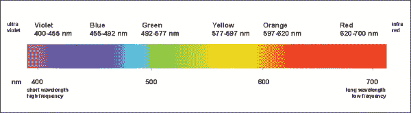

光具有重要的特性（如强度、方向、颜色和位置）。在 3D 图形中，我们使用这些重要的光特性来模拟各种光模型。在本章中，我们将使用 OpenGL ES 可编程管道通过着色器编程各种光模型。这将有助于深入了解用于照明目的所需的所有数学和物理学。

在 17 世纪，人们认为颜色是光和黑暗的混合物。在 1672 年，艾萨克·牛顿爵士发表了一系列实验，并为我们提供了对光的现代理解。他成功地证明了白光是由七种不同颜色的混合物组成的：红、橙、黄、绿、蓝、靛和紫。他还提出了光是由粒子或微粒组成的。

在 1802 年很久以后，托马斯·杨通过他的一个实验证明了光的行为像波。他将颜色与波长联系起来，并设法计算了由艾萨克·牛顿爵士发现的七种颜色的近似波长。

光的最终理论是由阿尔伯特·爱因斯坦在 1905 年 3 月提出的。那年，他发表了光的量子理论，其中他提出光作为粒子，并将这些粒子命名为**光子**。1905 年 6 月，他完成了他的狭义相对论理论，这给他的早期关于光被认为是粒子的提议增加了一个转折。狭义相对论将光视为波。这种矛盾为爱因斯坦提供了足够的证据来提出光的二象性。据他所说，光既表现为粒子又表现为波：

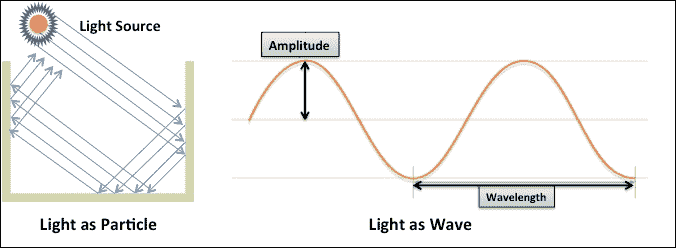

光具有二象性；它可以同时表现为粒子又表现为波。让我们更详细地看看：

+   **光作为粒子**：光表现为粒子。这些粒子是能量的小包，与原子的小物理粒子不同。这些能量包具有恒定的速度和没有质量，表现出类似于台球游戏中使用的台球反射特性。当粒子相互碰撞时，它们沿着力的方向传播，并由于障碍物而反射。当光子粒子撞击障碍物时，它们以吸收的形式损失能量。由于持续的反射，这些粒子撞击并减小。由于碰撞，这些粒子从障碍物中获取能量并保持能量守恒定律。

+   **光作为波**：光表现为波。它们是具有电和磁性质的电磁波。电磁波不需要任何介质来穿越空间，因为它们能够穿越真空。每个波看起来像正弦波。波的强度用振幅来测量，如图所示。一个完整正弦波的长度称为**波长**。波长越大，颜色越明显。将光视为 3D 计算机图形中的波可以打开许多可能性，这是光粒子性质所不能实现的。例如，粒子表现出以射线形式传播；它不能模拟衍射和干涉，这是波的重要特性。

在计算机图形模拟中，光波的特性由存储为复数二维数组的波前表示。计算机图形中光的研究本身就是一个庞大的主题；涵盖基于波的照明超出了本章的范围。本章将帮助建模基于粒子的局部光照明建模技术。

光由三种类型的成分组成：环境光（**A**）、漫反射光（**D**）和镜面反射光（**S**）。它们如下所述：

+   **环境光（A）**：这种光成分从所有方向均匀地发出，并且被它所落到的物体均匀地散射到所有方向；这使得物体表面看起来具有恒定的光强度。

+   **漫反射（D）**：这个光分量来自光源的特定方向。它以可变强度撞击物体的表面，这取决于朗伯照明定律。换句话说，强度取决于光出现在物体表面的方向和物体表面点的方向。

+   **镜面反射（S）**：这个光分量也来自特定的方向，并在相机视角或观察者眼睛的方向上反射得最多。它给模型表面带来光泽效果：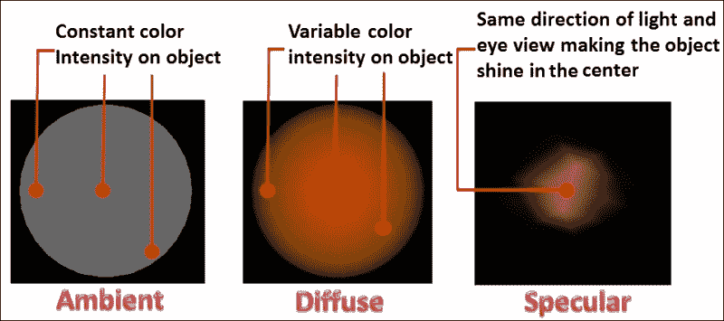

在计算机图形学中，光和材料都被数学上视为颜色。与物体相关的颜色称为材质，与照明相关的颜色称为光。光和材质的颜色强度用 RGB（红、蓝、绿）分量来指定。物体之所以可见，是因为它们反射了落在它们身上的光。例如，当阳光照在一个绿色的材质颜色球上时，绿色材质吸收了所有其他波长，并反射了光光谱中的绿色部分。因此，它对观众来说看起来是绿色的。从数学上讲，反射或最终的颜色是光和材质颜色强度的乘积：

```java
*Reflected color                   =           Light intensity      *       Material color*
*[R1*R2, G1*G2, B1*B2]                         [R1, G1, B1]                 [R2, G2, B2]*
```

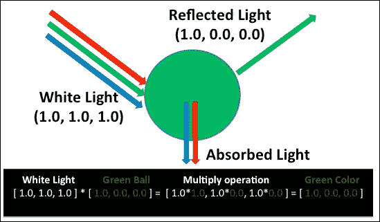

在现代计算机图形学中，有两种计算光照着色方程式的方法：顶点着色和片段着色。它们如下所述：

+   **顶点光照着色**：在这种着色类型中，计算光照颜色的数学方程式是在顶点着色器中制定的。每个顶点颜色在顶点着色器内计算，然后传递到片段着色器。这些顶点颜色随后被插值到几何面，以得到每个片段或像素颜色。由于颜色是在顶点着色器中计算的，因此称为顶点着色。

+   **片段光照着色**：这为每个片段在片段着色器内计算光颜色。片段着色的质量比顶点着色好得多。片段着色的性能比顶点着色慢。这是因为处理顶点比处理数千个像素要快。在今天的现代图形中，处理器能够以闪电般的速度执行多个并行操作；因此，对于通用应用需求来说，这可能并不非常昂贵。

    ### 注意

    每个顶点光照着色的一个缺点是，它可能对生成预期的镜面反射光着色没有帮助，因为片段颜色是在每个顶点计算的，并在面之间共享；因此，它不会生成平滑的椭圆形发光表面，而会生成一个平坦的发光表面。

# 实现顶点环境光分量

环境光在应用到的所有方向上均匀照亮物体的表面。所有面都接收相等数量的光线；因此，在整个物体上观察不到颜色的变化。环境光基本上是两个组件的混合：光的颜色强度和材质。

### 注意

从数学上讲，这是环境光（L[a]）和环境材质（K[a]）的乘积。

*I[a] = L[a]K[a]*

环境光在 phong 和 gouraud 渲染中起着至关重要的作用；这些渲染的漫反射和镜面颜色分量是通过使用照射到物体上的光的方向来计算的。因此，物体的一侧或背面可能会因为光的方向而接收较少或没有光线。在这种情况下，由于产生的黑色光线，这些面可能会看起来不可见；选择正确的环境光和材质颜色将有助于使这些暗面变得可见。

## 准备工作

本章将使用我们在 第四章 中实现的 Wavefront 3D 网格模型，*处理网格*。我们将重用该章节中的 ObjLoader 菜谱来实现本章的新菜谱。

## 如何做...

环境光的逐步实现如下：

1.  重用前一章中的 ObjLoader 菜谱，创建一个新的顶点着色器文件，名为 `AmbientVertex.glsl`，并添加以下代码：

    ```java
    // Geometry vertex position
    layout(location=0) in vec4 VertexPosition;
    uniform mat4 ModelViewProjectionMatrix;  

    // Ambient Light and Material information
    uniform vec3 MaterialAmbient, LightAmbient;

    // Shared calculated ambient from vertex shader
    out vec4 FinalColor;
    void main(){
       // Calculate the ambient intensity 
       vec3 ambient = MaterialAmbient  * LightAmbient;
       FinalColor   = vec4(ambient, 1.0);
       gl_Position  = ModelViewProjectionMatrix*VertexPosition;
    }
    ```

1.  类似地，创建 `AmbientFragment.glsl` 片段着色器文件如下：

    ```java
    precision mediump float;
    in vec4 FinalColor;
    layout(location = 0) out vec4 outColor;
    void main() {
    outColor = FinalColor; // Apply ambient intensity
    }
    ```

1.  在 `ObjLoader` 类的 `InitModel()` 中，编译这些着色器并设置环境光和材质的统一变量参数：

    ```java
    void ObjLoader::InitModel(){
      // Compile AmbientVertex and AmbientFragment shader.
      Many line skipped here . . . . . 
      // Use the shader program
      glUseProgram( program->ProgramID ); 

      // Query uniforms for light and material 
      MaterialAmbient = GetUniform(program,("MaterialAmbient");
      LightAmbient    = GetUniform(program,"LightAmbient");

      // Set Red colored material 
      if (MaterialAmbient >= 0)
      { Uniform3f(MaterialAmbient, 1.0f, 0.0f, 0.0f); }

      // Set white light 
      if (LightAmbient >= 0)
      { glUniform3f(LightAmbient, 1.0f, 1.0f, 1.0f); }

      // Get Model-View-Projection Matrix location
      MVP = GetUniform(program, "ModelViewProjectionMatrix");
    }
    ```

1.  `Render()` 函数与之前相同；它使用 VAO 渲染 Wavefront `OBJ` 模型。

## 如何工作...

当创建 `ObjLoader` 类对象时，它会在构造函数中初始化必要的参数。`InitModel` 函数编译着色器程序并设置任何必要的统一变量；顶点着色器包含两个名为 `MaterialAmbient` 和 `LightAmbient` 的统一变量。前者用于定义物体的材质属性的环境颜色属性，后者用于指定光的颜色。

这些变量被发送到顶点着色器，环境颜色阴影被计算为这两个变量的乘积；结果存储在一个新的输出变量中，称为 `FinalColor`。该变量被发送到片段着色器，并作为最终颜色应用于每个片段。`gl_position` 是裁剪坐标值，它是顶点位置和 `ModelViewProjectionMatrix` 的乘积。`ModelViewProjectionMatrix` 统一变量是投影、视图和模型矩阵的乘积。

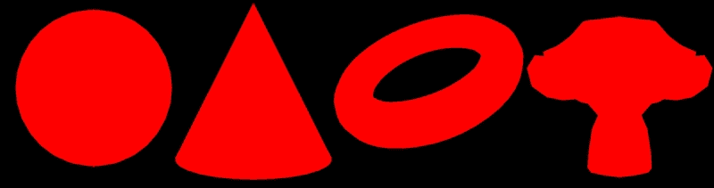

## 参考信息

+   请参阅 第四章 中 *渲染 wavefront OBJ 网格模型* 的菜谱。

+   请参考第三章中的*使用顶点数组对象管理 VBO*配方，*OpenGL ES 3.0 的新特性*

+   请参考第二章中的*使用顶点缓冲对象进行高效渲染*配方，*OpenGL ES 3.0 基础知识*

# 实现每个顶点的漫反射光分量

漫反射光来自特定方向，在撞击物体表面后向各个方向反射。在本节中，我们通过使用 Bui Tuong Phong 于 1973 年开发的 Phong 反射模型来模拟这种行为。该模型提出了一种使用正常表面和入射光方向的光照着色技术。当光击中物体的表面时，其中一部分被反射，其余部分部分吸收。因此，如果给出其中一个分量，我们可以计算吸收或反射的光强度。

### 注意

总光强度 = 反射光强度 + 吸收光强度

当 100%的光强度落在平面上，并且其中 50%被反射时，很明显有 50%的光强度被吸收或损失在周围环境中。在 3D 图形中，我们只关心反射的光强度，因为我们看到物体是由于光在其表面上的反射。光的漫反射和镜面反射分量基本上使用 Phong 反射模型，这是由于光和表面相互作用来模拟光照技术。

Phong 反射模型使用拉姆伯特余弦定律来演示反射。拉姆伯特余弦定律使用入射光的方向和表面几何形状的方向来计算几何表面上的光强度。

### 注意

拉姆伯特余弦定律指出，漫反射表面的光照强度与表面法线向量与光方向所成的角的余弦值成正比。

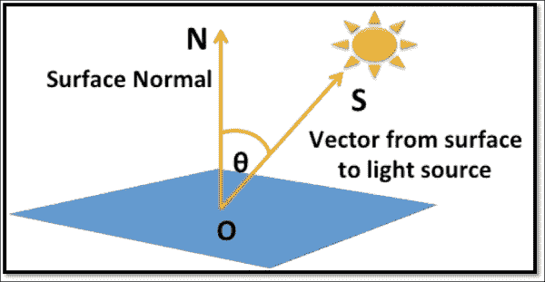

## 准备工作

计算漫反射光的一般数学方程是：

*I[d] = L[d]Kd*

*L[d]*和*K[d]*是光和材料的漫反射分量；(*N.S*)是用于计算表面法线(*N*)和入射光向量(*S*)之间角度余弦值的点积；这两个向量在计算点积之前必须先归一化。归一化向量是一个长度为 1 的向量；它也称为单位向量。对于这个配方，我们将重复使用我们的第一个配方，即环境光，并进行修改，如下一节所述。

## 如何操作...

使用以下说明来实现漫反射光分量：

1.  重复使用上一个配方中的每个顶点环境光分量（环境光配方），并在其中创建一个新的顶点着色器文件，命名为`DiffuseVertex.glsl`，如下面的代码所示：

    ```java
    layout(location = 0) in vec4  VertexPosition;
    layout(location = 1) in vec3  Normal;

    uniform mat4 ModelViewProjectionMatrix;
    uniform mat4 ModelViewMatrix;
    uniform mat3 NormalMatrix;

    // Diffuse Light and Material information
    uniform vec3 MaterialDiffuse, LightDiffuse;

    // Position of the light source
    uniform vec3 LightPosition;

    out vec4 FinalColor; // Output color to frag. shader

    void main(){
       // Calculate normal, eye coord and light vector
       vec3 nNormal   = normalize ( NormalMatrix * Normal );
       vec3 eyeCoord  = vec3 (ModelViewMatrix* VertexPosition);
       vec3 nLight    = normalize( LightPosition - eyeCoord );

       // Calculate cosine Normal and light vector
       float cosAngle = max( 0.0, dot( nNormal, nLight ));
       vec3 diffuse = MaterialDiffuse  * LightDiffuse;
       FinalColor   = vec4(cosAngle * diffuse, 1);
       gl_Position = ModelViewProjectionMatrix*VertexPosition;
    }
    ```

1.  片段着色器没有变化；我们可以从上一个配方中重用它，除了我们将将其重命名为 `DiffuseFragment.glsl`。

1.  在着色器编译成功后的 `InitModel` 中，设置扩散光和材料颜色的配置，并指定光在世界坐标中的位置：

    ```java
      // ObjLoader::InitModel()
      . . . . 
      glUseProgram( program->ProgramID );

      // Query Light and Material uniform for ambient comp.
      MaterialDiffuse  = GetUniform(program, "MaterialDiffuse");
      LightDiffuse     = GetUniform(program, "LightDiffuse");
      LightPosition    = GetUniform(program, "LightPosition");

      // Set Red colored diffuse material uniform 
      glm::vec3 color = glm::vec3(1.0, 0.0, 0.0);
      if (MaterialDiffuse >= 0)
          { glUniform3f(MaterialDiffuse,1.0, 0.0, 0.0); }

      // Set white diffuse light
      if (LightDiffuse >= 0)
          { glUniform3f(LightDiffuse, 1.0f, 1.0f, 1.0f); }

      // Set light position
      glm::vec3 lightPosition(0.0, 0.0, 5.0);
      glUniform3fv(LightPosition,1,(float*)&lightPosition);
    ```

1.  在 `Render()` 函数中，指定法线矩阵、模型视图矩阵和模型视图投影矩阵，以及通用的顶点属性：

    ```java
       // ObjLoader::Render()   
       mat3 matrix=*(TransformObj->TransformGetModelViewMatrix());
       mat3 normalMat = glm::mat3( glm::vec3(matrix[0]),
                     vec3(matrix[1]), glm::vec3(matrix[2]) );
       glUniformMatrix3fv(NormalMatrix,1,GL_FALSE,
                         (float*)&normalMat );
       glUniformMatrix4fv( MV,1,GL_FALSE,(float*)TransformObj->
                               TransformGetModelViewMatrix() );
       glUniformMatrix4fv( MVP,1,GL_FALSE,(float*)TransformObj->
       TransformGetModelViewProjectionMatrix());

       // Bind with Vertex Array Object and Render
       glBindVertexArray(OBJ_VAO_Id);    
       glDrawArrays(GL_TRIANGLES, 0, IndexCount );
    ```

## 如何工作...

扩散光顶点着色器使用顶点位置、顶点法线和光位置，通过使用 Phong 反射模型来计算光照着色；每个 `VertexPosition` 都通过乘以 `ModelViewMatrix` 转换为眼睛坐标。同样，顶点法线也需要转换为眼睛坐标，以便变换也应用于法线。这是通过将 `Normal` 乘以 `NormalMatrix` 来实现的。

### 注意

与顶点位置不同，顶点法线是通过使用 `NormalMatrix` 来转换的，而顶点位置是通过使用 `ModelView` 矩阵转换成眼睛坐标的。法线矩阵是模型视图矩阵的子矩阵，但它的特点是当应用仿射变换时，它保留了几何体的法线。`NormalMatrix` 是模型视图矩阵左上角 3x3 矩阵的逆转置。

`nLight` 光向量是通过从 `LightPosition` 减去 `eyeCoord` 顶点位置的眼睛坐标来计算的；`nLight` 方向是从表面到光源的方向。在计算它们之间的余弦角之前，`nLight` 和 `nNormal` 必须被归一化，以便找到它们之间的余弦角。

光强度存储为表面法线向量和光向量之间的余弦角。材料和光的颜色信息指定在两个统一变量中，即 `MaterialDiffuse` 和 `LightDiffuse`；这两个变量的乘积存储在新的变量中，称为扩散。余弦角是通过计算 `nLight` 和 `nNormal` 的点积并存储在 `cosAngle` 变量中得到的。

### 注意

光和材料的强度基本上是以 RGB 分量的形式使用的，这些分量总是非负的。R、G 和 B 的每个分量都存储为介于 `0.0f` 和 `1.0f` 之间的浮点数。光强度是作为余弦函数计算的，这可能导致介于 -1 和 1 之间的范围值。我们不希望有负的光强度，因为它们没有意义。因此，我们应该只考虑 0.0 和 1.0 范围内的光强度；因此，在最终的光强度中使用 `max()` 函数。

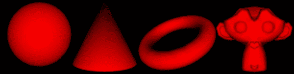

漫射颜色阴影是漫射和 `cosAngle` 的乘积，并存储在一个新的输出变量 `FinalColor` 中。该变量被发送到片段着色器并应用于每个片段。顶点着色器的最后一行通过将顶点位置与模型视图投影矩阵相乘来帮助计算裁剪坐标。

## 参考以下内容

+   *实现每个顶点的环境光分量*

# 实现每个顶点的镜面光分量

镜面光负责在物体表面产生光泽。与使用入射光线和表面法线来找到光强度的漫射光不同，镜面光使用反射光线和观察者的方向来找到光强度。

## 准备中

下图说明了将观察者的位置（相机）引入画面以演示镜面光数学计算的情景。光线入射角与表面法线的夹角始终等于与同一法线的反射角。因此，**S** 和 **R** 向量都与 **N** 形成相同的 **θ** 角。**S** 向量表示相反方向（**-S**）；这是因为我们感兴趣的是计算**R**反射向量：

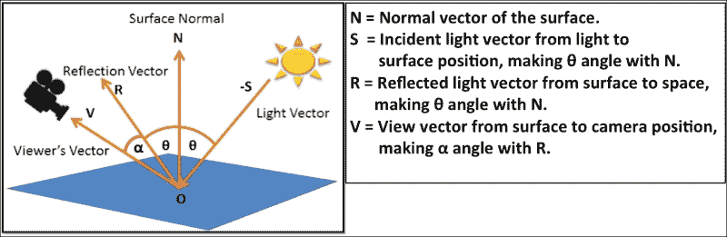

这种光泽取决于观察者与反射光之间的角度；如果观察者向量与反射向量的夹角小，则表面越亮。

在 Phong 反射模型中，数学上，镜面分量的反射向量（**R**）的计算如下：

*R = 2N (N.S) + (-S)*

然而，在 OpenGL ES 着色语言中，我们可以使用 `reflect()` 函数来计算向量 `R`：

```java
R = reflect( -S, N )
```

*R* 和 *V* 向量之间的 *α* 角度可以通过这两个向量的点积来计算。*V* 向量在眼睛坐标系中；与 *R* 向量方向相同的顶点越接近，表面就会越有光泽。给定 *R* 和 *V*，镜面照明可以通过数学方法计算如下：

*I[s] = L[s]Ks[G]*

在前一个公式中的 *G* 上标用于光泽因子；其实际意义是在物体表面产生较大或较小的光泽点。其值介于 1 到 200 之间；数值越大，光泽点越小越亮，反之亦然。

## 如何操作...

重用之前实现的漫射着色器配方，并在着色器和程序代码中根据以下步骤进行必要的更改：

1.  创建 `SpecularVertex.glsl` 并使用以下指令进行顶点着色器；片段着色器没有变化。我们可以重用现有的代码：

    ```java
    #version 300 es
    layout(location = 0) in vec4  VertexPosition;
    layout(location = 1) in vec3  Normal;

    uniform mat4    ModelViewProjectionMatrix, ModelViewMatrix;
    uniform mat3    NormalMatrix;

    // Specular Light and Material information
    uniform vec3 MaterialSpecular, LightSpecular,LightPosition;
       uniform float   ShininessFactor;
    out vec4        FinalColor;

    void main() 
    {
          vec3 nNormal = normalize( NormalMatrix * Normal );
          vec3 eyeCoord= vec3( ModelViewMatrix* VertexPosition );
          vec3 nLight  = normalize( LightPosition - eyeCoord);
          vec3 V       = normalize( -eyeCoord);
          vec3 R       = reflect( -nLight, nNormal );

          float sIntensity=pow(max(0.0,dot(R,V)),ShininessFactor);
          vec3 specular= MaterialSpecular * LightSpecular;
          FinalColor   = vec4( sIntensity * specular, 1 );

          gl_Position  = ModelViewProjectionMatrix*VertexPosition;
    }
    ```

1.  在 `InitModel,` 中加载并编译镜面着色器，并设置镜面光和材质颜色的配置。同时，指定光在世界坐标系中的位置：

    ```java
        // ObjLoader::InitModel()
        . . . . .  

        if (MaterialSpecular >= 0)
              { glUniform3f(MaterialSpecular, 1.0, 0.5, 0.5); }

        if (LightSpecular >= 0)
              { glUniform3f(LightSpecular, 1.0, 1.0, 1.0); }

        if (ShininessFactor >= 0)
              { glUniform1f(ShininessFactor, 40); }

        if (LightPosition >= 0){
           glm::vec3 lightPosition(0.0, 0.0, 10.0);
              glUniform3fv(LightPosition,1,&lightPosition);
        }
    ```

## 它是如何工作的...

光滑光顶点着色器以与之前配方中相同的方式计算 `nNormal`、`eyeCoord` 和 `nLight`。通过使用 reflect() 函数，通过归一化眼坐标和 *R* 反射向量来计算观察者或 (*V*) 相机的方向。*R* 和 *V* 的点积通过 max 函数限制在 0.0 和 1.0 的范围内。这个结果用于计算带有 `ShininessFactor` 的功率函数，该函数负责在表面上产生光泽点；计算结果存储在 sIntensity 中。`FinalColor` 通过 `sIntensity`、`MaterialSpecular` 和 `LightSpecular` 的乘积来计算。这些颜色信息作为输出变量发送到片段着色器，并应用于由顶点形成的原语创建的相应片段：

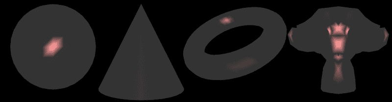

## 参见

+   *实现每个顶点的环境光分量*

+   *实现每个顶点的漫反射光分量*

# 使用半程向量优化镜面光

在之前的配方中实现的镜面反射照明使用入射光线的反射向量来展示点状照明。这个反射向量是通过 GLSL 中的 `reflect()` 函数计算的。这个函数的计算稍微有些昂贵。因此，我们不仅可以计算反射和 (`R.V`) 相机向量之间的点积，还可以计算 (`nNormal.H`)，即我们的表面法线向量和半程向量之间的点积。`H` 半程向量是相机（观察者）向量与入射光之间的向量。在下面的图中，你可以看到 `V` 和 `S` 向量的结果（注意：不是 `-S`）：

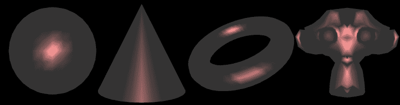

从数学上讲，半程向量是计算如下：

*半程向量 (H) = 入射光向量 (S) + 相机向量 (V)*

计算半程镜面光的方程是：

*H = S + V*

*I[s] = L[s]K[s] ( N.H )[G]*

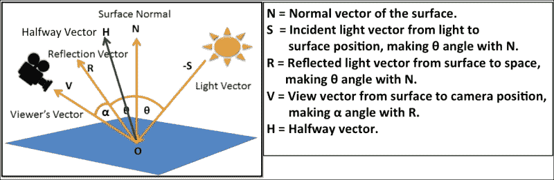

## 如何做...

使用之前的配方，*实现* *每个顶点的镜面光分量*，并在 `SpecularVertex.glsl` 中进行以下更改。以下代码中的更改以粗体标注。在片段着色器中不需要进行任何更改：

```java
// No change in the global variables
. . . . . .
void main() 
{
   vec3 nNormal = normalize( NormalMatrix * Normal );
   vec3 eyeCoord= vec3( ModelViewMatrix * VertexPosition );
   vec3 nLight  = normalize( LightPosition - eyeCoord);
   vec3 V       = normalize( -eyeCoord);
   vec3 H       = normalize (nLight + V);
   float sIntensity = 0.0;
   sIntensity=pow(max(0.0,dot(H,nNormal)),ShininessFactor);

   vec3 specular   = MaterialSpecular * LightSpecular;
   FinalColor      = vec4( sIntensity * specular, 1 );
   gl_Position     = ModelViewProjectionMatrix * VertexPosition;
 }
```

## 它是如何工作的...

在这个技术中，我们使用 `nLight` 入射光向量和 (`V`) 相机向量通过相加来找到 (`H`) 结果向量。这两个向量都必须在眼坐标中；结果半程向量必须归一化，以便生成正确的结果。计算 (`nNormal`) 法线表面向量与 (`H`) 半程向量之间的点积，并将其代入前面提到的方程中计算镜面照明：

```java
sIntensity = pow(max(0.0, dot(H, nNormal)), ShininessFactor)
```

与我们之前实现的先前的镜面技术相比，当前技术被认为更高效。前面的图像显示了两种技术之间的差异。毫无疑问，使用中点向量技术是一种近似，与原始技术相比，生成的结果特征不那么明显。这种近似非常接近现实；因此，如果您不太在意精确的质量，可以使用中点向量来计算表面的光泽度。

### 注意

记住始终使用（`-S`）来计算反射向量，并使用（`S`）来计算（`H`）中点向量。

## 参见

+   *实现每顶点的镜面反射光分量*

# Gouraud 着色 - 每顶点着色技术

本配方实现了包含光的三种成分（即周围（A）、漫反射（D）和镜面（S））的 Phong 反射模型，这些我们在之前的配方中已经探讨过。这种照明技术也称为 ADS 或 Gouraud 着色。Gouraud 着色技术是每顶点着色，因为片段的颜色是在顶点着色器中通过使用每个顶点的位置信息来计算的。

## 准备工作

本配方结合了我们之前配方中实现的周围（A）、漫反射（D）和镜面（S）照明效果，使用的是 Phong 反射模型技术。从数学上讲，它是周围、漫反射和镜面片段颜色的总和：

*Gouraud 着色颜色 = 周围颜色 + 漫反射颜色 + 镜面颜色*

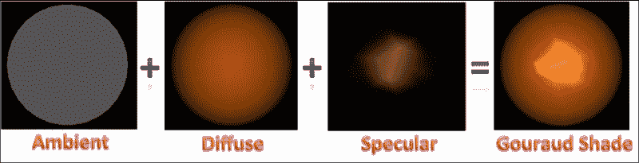

在实现 Gouraud 着色之前，建议您彻底理解本章中提到的周围、漫反射和镜面照明技术。

## 如何实现...

Gouraud 着色配方实现将使用当前顶点着色器中名为`GouraudShadeVertex.glsl`的现有顶点着色器文件，这些文件来自周围、漫反射和镜面配方。本配方使用一个全局函数`GouraudShading()`来实现 Gouraud 着色技术；片段着色器可以完全重用，因为它不需要任何更改。以下代码片段描述了 Gouraud 着色顶点着色器：

```java
. . . . // global variables, vertex attribute and matrixes.
vec3 GouraudShading()
{
    nNormal   = normalize ( NormalMatrix * Normal );
    eyeCoord  = vec3 ( ModelViewMatrix * VertexPosition );
    nLight    = normalize( LightPosition - eyeCoord );

    // Diffuse Intensity
    cosAngle = max( 0.0, dot( nNormal, nLight ));

    // Specular Intensity
    V       = normalize( -eyeCoord );
    R       = reflect( -nLight, nNormal );
    sIntensity=pow( max(0.0, dot(R, V) ), ShininessFactor);

    // ADS color as result of Material & Light interaction
    ambient = MaterialAmbient  * LightAmbient;//Ambient light
    diffuse = MaterialDiffuse  * LightDiffuse;//Diffuse light
    specular = MaterialSpecular*LightSpecular;//Specular light

    return ambient + (cosAngle*diffuse) + (sIntensity*specular);
}

void main(){
    FinalColor = vec4(GouraudShading(), 1);
    gl_Position = ModelViewProjectionMatrix * VertexPosition;
}
```

## 它是如何工作的...

`GouraudShading()`函数通过添加周围、漫反射和镜面光颜色来计算每个顶点的颜色；结果的颜色信息返回到`main()`程序。然后顶点着色器将此颜色信息共享给片段着色器。片段着色器通过使用从顶点着色器接收到的颜色信息，通过插值计算每个片段的整个颜色。

### 注意

OpenGL ES 着色语言中的函数定义与 C 语言类似；它可以返回值并通过值传递参数。它不支持指针或引用通过地址发送信息。有关 GL 着色语言 3.0 中函数定义的更多信息，请参阅 [`www.khronos.org/files/opengles_shading_language.pdf`](http://www.khronos.org/files/opengles_shading_language.pdf)。

本例使用点光实现；点光从不同角度发出光线，当它照射到物体上时与顶点形成不同的角度。

## 参考信息

+   *实现方向光和点光*

# phong 着色 – 按片段着色技术

这种着色技术也称为平滑着色。在本例中，我们将实现 phong 着色，它是一种按片段的照明技术。使用按片段技术，与按顶点技术相比，光照着色可以为渲染场景添加更多真实感。我们将比较 Gouraud 着色与 phong 着色，以查看两种技术之间的相对差异。

在 phong 着色中，顶点着色器负责在眼坐标系统中计算法线和顶点位置；然后这些变量传递到片段着色器。顶点法线和顶点位置对每个片段进行插值和归一化，以产生最终的片段颜色。

## 如何实现...

使用以下步骤实现并查看此技术的实际效果：

1.  创建 `PhongShadeVertex.glsl` 并重用之前示例中的大多数变量。参考以下代码。主要区别在于 `normalCoord` 和 `eyeCoord`，它们被定义为输出变量。注意：我们不会在顶点着色器中使用光和材质的属性；相反，这些将在片段着色器中使用：

    ```java
    #version 300 es
    // Vertex information
    layout(location = 0) in vec4  VertexPosition;
    layout(location = 1) in vec3  Normal;

    // Model View Project Normal Matrix
    uniform mat4 ModelViewProjectionMatrix, ModelViewMatrix;
    uniform mat3 NormalMatrix;

    //Out variable shared with Fragment shader
    out vec3 normalCoord, eyeCoord;

    void main() {
      normalCoord = NormalMatrix * Normal;
      eyeCoord    = vec3(ModelViewMatrix * VertexPosition);
      gl_Position = ModelViewProjectionMatrix * VertexPosition;
    }
    ```

1.  创建 `PhongShadeFragment.glsl` 片段着色器文件，并将所有光和材质属性变量添加到所需的精度限定符中。我们将使用中等精度限定符；这个精度限定符位于变量声明中的类型之前：

    ```java
    #version 300 es
    precision mediump float;

    // Material & Light property
    uniform vec3 MaterialAmbient,MaterialSpecular,MaterialDiffuse; 
    uniform vec3 LightAmbient, LightSpecular, LightDiffuse;
    uniform float   ShininessFactor;

    uniform vec3 LightPosition;

    in vec3    normalCoord;
    in vec3    eyeCoord;

    layout(location = 0) out vec4 FinalColor;

    vec3 normalizeNormal, normalizeEyeCoord, normalizeLightVec, V, R, ambient, diffuse, specular;
    float sIntensity, cosAngle;

    vec3 PhongShading()
    {
      normalizeNormal   = normalize(normalCoord);
      normalizeEyeCoord = normalize(eyeCoord);
      normalizeLightVec = normalize(LightPosition-eyeCoord);

      // Diffuse Intensity
      cosAngle = max(0.0,
                    dot(normalizeNormal,normalizeLightVec));

      // Specular Intensity
      V = -normalizeEyeCoord; // Viewer's vector
      R = reflect(-normalizeLightVec, normalizeNormal);
      sIntensity = pow(max(0.0,dot(R,V)), ShininessFactor);

      ambient    = MaterialAmbient  * LightAmbient;
      diffuse    = MaterialDiffuse  * LightDiffuse;
      specular   = MaterialSpecular * LightSpecular;

      return ambient+(cosAngle*diffuse)+(sIntensity*specular);
    }

    void main() {
      FinalColor = vec4(PhongShading(), 1.0);
    }
    ```

## 工作原理...

在 phong 着色中，顶点着色器计算顶点法线（`normalCoord`）和顶点位置在眼坐标系（`eyeCoord`）中的值，并将其发送到片段着色器。片段着色器使用这些值并对每个片段的顶点法线和顶点位置进行插值。为了产生准确的结果，插值值必须归一化。计算环境光、漫反射和镜面光的剩余过程与前面讨论的相同。

默认情况下，顶点着色器不需要定义任何精度（它是可选的）。如果在顶点着色器中没有定义精度，则它将使用最高精度。在片段着色器中，需要定义精度限定符（它不是可选的）。

有三种精度限定符，分别是`lowp`、`medium`和`highp`。这些精度限定符可能会影响应用程序的性能；因此，建议根据实现要求使用正确的精度。较低的精度可能有助于提高 FPS 和功耗效率；然而，它可能会降低渲染质量。在我们的案例中，我们将为片段着色器中的所有变量使用`mediump`精度。

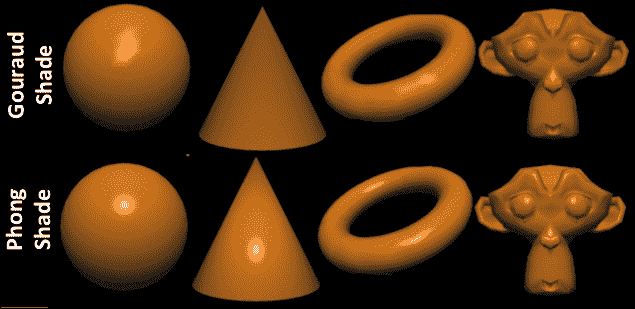

## 还有更多...

我们已经使用 Wavefront OBJ 网格来演示对 3D 网格模型的光照效果；你可以在第四章*处理网格*中探索更多关于网格的内容。同一章节描述了使用法向量实现的平面/平滑着色。

可以通过使用`ObjMesh`类的成员函数`ParseObjModel`来启用平面/平滑着色实现。这指定第二个参数为布尔值`true`（平面着色）或`false`（平滑着色）。两种着色类型的比较结果如图所示：

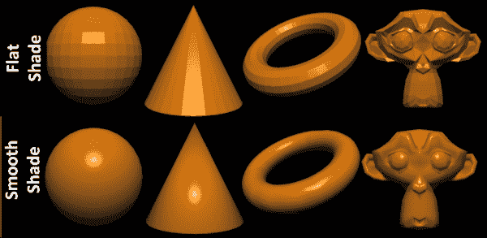

## 参见

+   参考第四章渲染 Wavefront OBJ 网格模型*处理网格*中的配方

# 实现方向光和点光

光可以分为三种类型，即点光、方向光和聚光灯。让我们详细看看：

+   **点光或位置光**：这种类型的光来自 3D 空间中的一个固定位置。光的位置和它落下的物体的顶点用于计算光的方向。点光向所有方向发射光。每个顶点可以有不同的光方向，这取决于它从光源的位置，如图所示。

+   **方向光**：这种类型的光是点光的一种特殊情况。在这里，考虑物体上落下的光的方向是不变的。这意味着所有光线的方向都是平行的。在方向光中，光源被认为是无限远处的模型，它应该落在上面。有时，在 3D 场景渲染过程中假设光方向为平行会更好。如果光源点和模型之间的距离明显较大，这是实现与点光几乎相同效果的最佳方式。

+   **聚光灯**：这种类型的光使用光的方向和一个截止角度来形成一个圆锥形的虚拟 3D 空间，如图所示。超出这个形状的光被丢弃，而圆锥内的光形成聚光灯效果：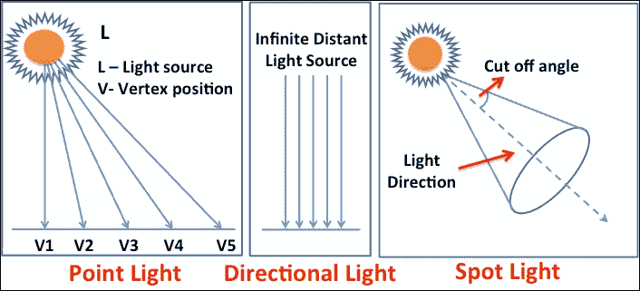

## 准备工作

有时，光源的位置与物体相当远。在这种情况下，建议使用方向光照来实现光照着色技术。点光源着色技术稍微昂贵一些，因为需要为每个顶点计算光线方向。它与几何中的顶点数量成正比。相比之下，方向光被视为在恒定方向上，假设光线以平行方向传播。与点光源不同，方向光中的光线方向不考虑顶点位置：

| 光源类型 | **数学公式** | **光线方向** |
| --- | --- | --- |
| 点 | 光线方向 = 光源位置 - 眼睛位置 | 可变 |
| 方向 | 光线方向 = 光源位置 | 常数 |

## 如何实现...

此配方将演示点光源与方向光源之间的区别；我们迄今为止已实现的全部配方都使用了点光源。实际上，在本配方的前一节中，我们了解了何时使用哪种光源。以下加粗的指令是在基于 Phong 着色的片段着色器中实现的；如果实现 Gouraud 着色，则需要在顶点着色器中执行类似更改：

+   **点光源或位置光源**: 实现点光源需要做一项更改：

    ```java
    vec3 PhongShading(){
        normalizeNormal   = normalize( normalCoord );
        normalizeEyeCoord = normalize( eyeCoord );
        // Calculate Point Light Direction
        normalizeLightVec = normalize( LightPosition - eyeCoord );
        . . . . . .
        // Calculate ADS Material & Light
        . . . . . .
        return ambient+(cosAngle*diffuse)+(sIntensity*specular);
    }
    ```

+   **方向光**: 类似地，更改加粗标记的方向光语句：

    ```java
    vec3 PhongShading(){
        normalizeNormal   = normalize( normalCoord );
        normalizeEyeCoord = normalize( eyeCoord );
        // Calculate Direction Light Direction
        normalizeLightVec = normalize( LightPosition );
        . . . . . .
        // Calculate ADS Material & Light
        . . . . . .
        return ambient+(cosAngle*diffuse)+(sIntensity*specular);
    }
    ```

## 它是如何工作的...

在点光源中，光向量用于计算相对于每个顶点的眼睛坐标的光的方向向量；这会产生可变的方向向量，这些向量负责每个顶点不同的光照强度。

相比之下，方向光假设所有顶点都在原点（0.0, 0.0, 和 0.0）。因此，每个顶点的方向向量都是平行的。以下图比较了点光源技术和方向光源技术：

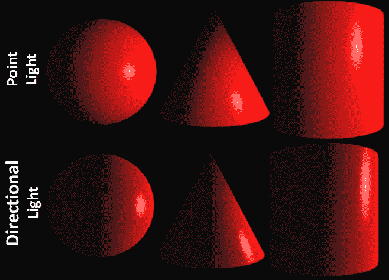

# 场景中实现多个光源

到目前为止，我们所有的配方都是使用单个光源进行演示的。本节将帮助我们实现场景中的多个光源。与只能向场景添加八个光源的固定管线架构不同，可编程管线不对多个光源的数量设置上限。向场景添加多个光源非常简单。这与我们添加一个光源位置以创建每个片段一个颜色的方式相似。现在，我们添加*N*个光源以生成每个片段*N*种颜色的平均值：

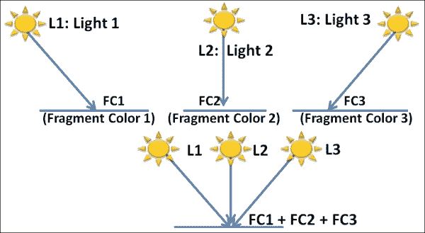

从数学上讲，如果光源如**L1**、**L2**和**L3**分别创建**FC1**、**FC2**和**FC3**片段颜色，那么这些光源的综合效果将是一个单一的片段颜色，这是所有片段颜色的平均权重结果。

## 准备工作

这个菜谱的顶点着色器不需要对源代码进行任何特殊修改。因此，我们可以重用相同的顶点着色器（在 Phong 着色菜谱中实现）。这个菜谱需要对片段着色器进行一些修改。

## 如何操作...

实现多光源菜谱的步骤如下：

1.  创建一个名为`MultiLightFragment.glsl`的片段着色器文件，并突出显示，如下面的代码所示：

    ```java
    // Many line skipped
    . . . . . 
    // Light uniform array of 4 elements containing light 
    // position and diffuse color information.
    uniform vec3    LightPositionArray[4];
    uniform vec3    LightDiffuseArray[4];
    uniform float   ShininessFactor;

    vec3 PhongShading( int index )
    {
        normalizeNormal   = normalize( normalCoord );
        normalizeEyeCoord = normalize( eyeCoord );
        normalizeLightVec = normalize
        (LightPositionArray[index] - eyeCoord );

        cosAngle = max(0.0,dot(normalizeNormal,normalizeLightVec));

        V = -normalizeEyeCoord; // Viewer's vector
        R =reflect(-normalizeLightVec,normalizeNormal);//Reflectivity
        sIntensity = pow( max( 0.0, dot( R, V ) ), ShininessFactor );

        ambient   = MaterialAmbient * LightAmbient;
        diffuse = MaterialDiffuse * LightDiffuseArray[index];
        specular  = MaterialSpecular * LightSpecular;

        return ambient+(cosAngle*diffuse)+(sIntensity*specular);
    }

    void main() {
       vec4 multipleLightColor = vec4( 0.0 );
       for (int i=0; i<4; i++){
          multipleLightColor += vec4(PhongShading(i),1.0);
       }
       FinalColor = multipleLightColor;
    }
    ```

1.  对于顶点着色器不需要进行任何更改；然而，主程序指定了四个不同的灯光位置和四个不同的漫反射颜色配置：

    ```java
       // Inside ObjLoader::InitModel()
       // Compile and  use Multiple Light Shade Program
       glUseProgram( program->ProgramID );
       // Get Material & Light uniform variables from shaders
       float lightpositions[12]={{-10.0,0.0,5.0}, {0.0,10.0,5.0}, {10.0,0.0,5.0},{0.0,-10.0,5.0}};
       glUniform3fv(LightPositionArray,
       sizeof(lightpositions)/sizeof(float), lightpositions);

       float lightdiffusecolors[12]={{1.0,0.0,0.0}, {0.0,1.0,0.0},{1.0,0.0,0.0}, {0.0,1.0,0.0} };
       glUniform3fv(LightDiffuseArray, sizeof(lightdiffusecolors)/ 
       sizeof(float), lightdiffusecolors);
    ```

## 工作原理...

当前菜谱使用四个灯光来演示场景中的多光源着色。这些灯光位于对象周围（左、右、上、下）。左侧和右侧的灯光使用红色漫反射光颜色，而底部和顶部的灯光设置为绿色漫反射光颜色。

在我们的着色器程序中，灯光的位置和漫反射光颜色以数组的形式定义，分别用`LightPosition`和`LightDiffuseArray`表示。

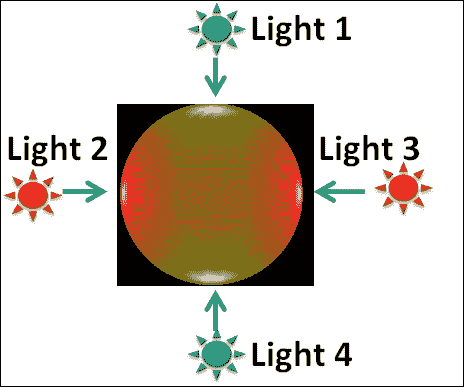

`GouraudShading()`函数被修改为接受一个参数，该参数使用需要处理的灯光位置的索引。主程序循环计算平均片段颜色强度。这个片段颜色返回到主程序。

接近球面表面的灯光位置接收更多的强度；因此我们可以清楚地看到，球面在顶部、底部、左侧和右侧用绿色和红色照亮。球面的前部是绿色和红色的混合，因为球面在正面从所有四个光方向接收到的强度是相等的。

# 实现双面着色

在第二章中，我们探讨了裁剪技术，这是一种快速提高性能的方法。这项技术避免了渲染面向背面的多边形面；通常不希望裁剪背面（不完全封闭的对象通常使用背面渲染）。有时，用不同的颜色查看这些背面是有意义的。这将有助于定义几何形状的特性，这些特性在面（背面和正面）的同一颜色上可能不可见。

在这个菜谱中，我们将渲染一个具有不同面颜色（内部和外部）的半空心圆柱体。我们首先需要做的是关闭背面裁剪。我们可以通过`glDisable (GL_CULL_FACE)`来关闭背面裁剪。

为了在正面和背面应用不同的颜色，我们首先需要识别它们。OpenGL ES 着色语言在片段着色器中提供了一个简单的全局变量`gl_FrontFacing`，它帮助我们识别属于正面面的片段。此 API 返回布尔值`true`，如果面是正面，反之亦然。

面的法线位置有助于定义其指向的方向。正面面的法线位置始终与背面面的方向相反；我们将使用这个线索用不同的颜色着色正面和背面。

## 准备工作

多光源着色配方可以重用来实现双面着色。

### 注意

确保在程序代码中禁用了剔除；否则，双面着色将不会工作。

## 如何操作...

在顶点着色器中不需要进行任何更改。创建一个名为`TwoSideShadingFragment.glsl`的片段着色器文件，并按照以下加粗内容进行更改：

```java
vec3 GouraudShading( bool frontSide ){
  normalizeNormal   = normalize ( normalCoord );
  normalizeLightVec = normalize ( LightPosition - eyeCoord );
 if ( frontSide ) // Diffuse Intensity
 { cosAngle=max(0.0, dot(normalizeNormal,normalizeLightVec)); }
 else
 { cosAngle=max(0.0, dot(-normalizeNormal,normalizeLightVec));}

  V = normalize( -eyeCoord );
  R = reflect(-normalizeLightVec, normalizeNormal);
  sIntensity = pow(max(0.0,dot(R,V)), ShininessFactor);
 ambient    = MaterialAmbient  * LightAmbient; // Net Ambient
 specular   = MaterialSpecular * LightSpecular;// Net Specular
 if ( frontSide ) // Front and back face net Diffuse color
 { diffuse=MaterialDiffuse*LightDiffuse; }
 else
 { diffuse=MaterialDiffuseBackFace*LightDiffuse; }

  return ambient + (cosAngle*diffuse) + (sIntensity*specular);
}

void main() {
 if (gl_FrontFacing)
 { FinalColor = vec4(GouraudShading(true), 1.0); }
 else
 { FinalColor = vec4(GouraudShading(false), 1.0); }
}
```

## 如何工作...

此配方的原理非常简单；其背后的理念是检查原始片段是否属于正面或背面。如果属于正面，则分配一种类型的颜色编码；否则，选择另一种类型。在片段着色器中，使用`gl_FrontFacing`检查正面。将片段面的类型作为参数传递给`GouraudShading`函数。根据正面和背面的布尔值，此函数将生成颜色。我们将使用`MaterialDiffuseBackFace`和`LightDiffuse`分别用于背面和正面漫反射光颜色。为了计算背面表面的 Gouraud 着色，我们必须使用负方向法线：

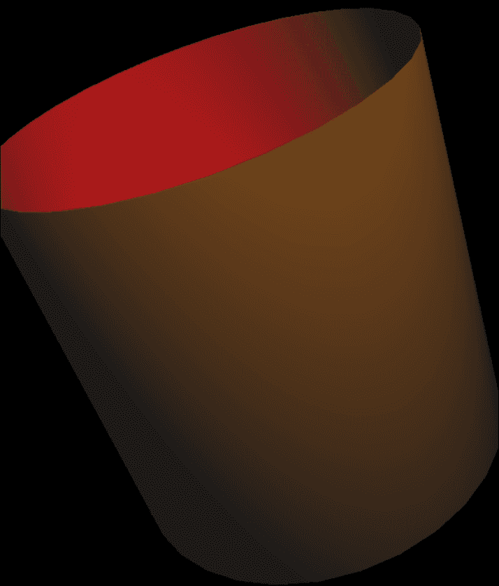

## 参见

+   参考第二章中的*OpenGL ES 3.0 中的剔除*配方，*OpenGL ES 3.0 基础*
