# 第六章. 与着色器一起工作

在本章中，我们将涵盖以下配方：

+   实现摇摆和波纹效果

+   基于对象坐标的程序纹理着色

+   创建圆形图案并使其旋转

+   生成砖块图案

+   生成圆点图案

+   抛弃片段

+   基于纹理坐标的程序纹理着色

# 简介

本章将为你深入理解着色器编程技术。它讨论了可以使用顶点和片段着色器实现的各种技术，揭示了它们的特性。我们将从理解着色器在 OpenGL ES 3.0 可编程管道中的作用开始本章。你还将了解顶点着色器和片段着色器如何在 GPU 多核上处理信息。

你将学习如何通过使用顶点着色器来变形几何形状；这将产生在 3D 网格模型上的摇摆效果。稍作修改后，我们将使用相同的变形概念来实现池塘水波纹效果。此外，我们将了解程序纹理和图像纹理之间的区别。借助模型坐标，我们将实现我们的第一个简单的程序纹理配方。

使用顶点绘制圆形几何体可能渲染成本过高，因为它需要太多的顶点来形成更平滑的边缘；圆形着色器配方演示了一种使用程序纹理高效渲染圆形的方法。砖块着色器配方演示了如何在物体表面渲染砖块图案。利用圆形图案的知识，我们将编写如何在 3D 网格对象上渲染圆点的程序。我们将扩展相同的配方来展示 GL 着色语言的一个有趣特性，该特性允许我们通过丢弃片段在 3D 几何体中产生孔洞。最后，你将学习如何使用纹理坐标来编程程序纹理。有了这些知识，我们将在 3D 立方网格对象上创建一个网格或笼状几何体。

着色器角色和责任：以下图展示了顶点和片段着色器在两个重叠模型中的作用，以在屏幕上产生最终图像；预期的输出标记为标签 1。图形引擎提供了一个矩形形状的模型（四个顶点）和一个三角形形状的模型（三个顶点）。这些模型首先被发送到顶点着色器。顶点和片段着色器程序具有类似于 C 编程语言的语法；程序的主入口点始终从`main()`函数开始。

顶点着色器在运行时编译和执行；它为几何中的每个顶点调用一次，如下图中标记为**2**和**3**所示。着色器程序在多处理器 GPU 上执行，这允许同时操纵多个顶点。顶点着色器总是在片段着色器之前执行。

顶点着色器主要有两个目标：

+   计算顶点坐标的变换

+   计算片段着色器所需的任何顶点计算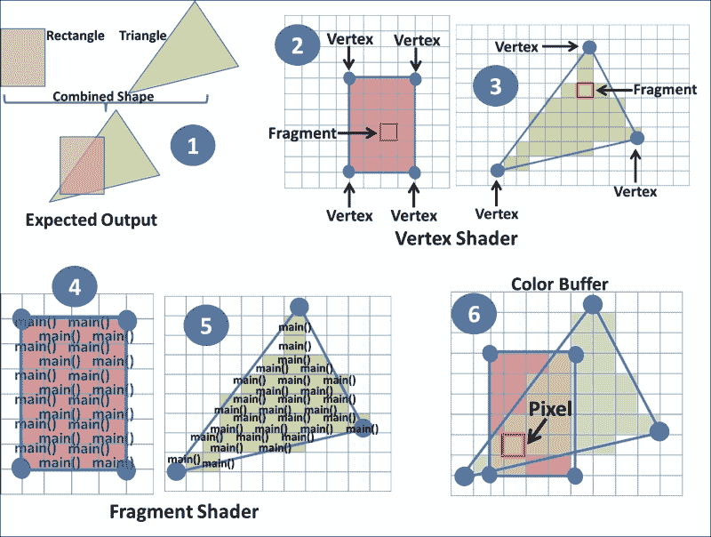

片段着色器总是在顶点着色器之后执行。与顶点着色器不同，片段着色器也包含一个`main()`函数作为其入口点。片段着色器也会为每个单独的片段在运行时进行编译和执行；标签**4**和标签**5**显示了片段着色器在每个片段上的执行。

标签为**6**的图像展示了光栅化过程后的生成片段；像素显示在红色框中。每个片段可能对应也可能不对应原始图元中的单个像素。帧缓冲区中的像素可以由一个或多个片段组成，如下图所示；使用片段着色器，这些生成的片段可以通过程序控制来分配颜色、纹理和其他属性信息；每个片段都与位置、深度和颜色相关联。

片段着色器的主要目标是计算每个片段的颜色信息或根据编程决策丢弃片段。

片段具有执行以下任务的能力：

+   颜色插值或每个片段的计算

+   计算纹理坐标

+   将纹理分配给每个像素

+   每个像素的法线插值

+   计算每个像素的光信息

+   动画效果的计算

着色器的并发执行模型：现代图形引擎架构能够渲染高性能的先进图形。得益于现代图形处理器，它能够以惊人的速度快速并行处理大量数据集，这种能力需要计算大量数据集，只需微秒级的几分之一。**图形处理器单元**（**GPUs**）是专门为满足这些要求而设计的特殊专用处理器；这些处理器是多核的，可以实现并行处理。

现代图形的一个主要要求是它需要高效的浮点计算和快速的多边形变换操作。GPU 专门优化以满足这些类型的要求；它们提供了一组功能。其中，包括快速三角函数，这在 CPU 架构上被认为是昂贵的。GPU 中的处理器核心数量可以从几百到几千不等。

下图显示了 GPU 上顶点着色器和片段着色器的并发执行：

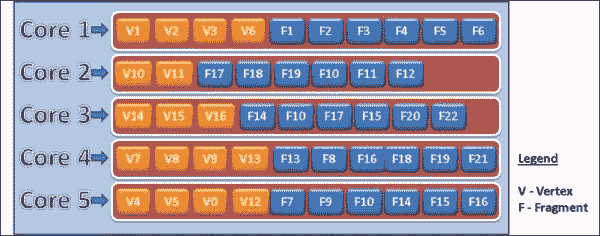

GPU 的每个核心都能够运行顶点或片段着色器的一个实例；每个核心首先处理顶点，然后处理片段，如图所示。

# 实现波动和涟漪效果

这是一个简单而有效的顶点着色器技术，可以在对象的几何形状上产生摆动效果。这个着色器在几何形状上产生类似正弦波的动画效果；此效果在顶点着色器中实现。这个配方还演示了另一种动画技术，可以产生水塘波纹效果。

## 准备工作

对于这个配方，我们将重用前一章中现有的 Phong 着色器配方。将着色器文件重命名为你选择的名称；对于这个配方，我们将重命名为 `WobbleVertex.glsl` 和 `WobbleFragment.glsl`。摆动和波纹着色器都是基于顶点着色器的配方。

## 如何做到这一点...

本节将提供实现顶点着色器以产生摆动效果所需的更改。根据以下代码修改 `WobbleVertex.glsl`；不需要对片段着色器进行更改：

```java
#version 300 es

// Define amplitude for Wobble Shader
#define AMPLITUDE           1.2

// Geometries vertex and normal information
layout(location = 0) in vec4  VertexPosition;
layout(location = 1) in vec3  Normal;

// Model View Project and Normal matrix
uniform mat4 ModelViewProjectionMatrix, ModelViewMatrix;
uniform mat3 NormalMatrix;

uniform float Time; // Timer

// Output variable for fragment shader
out vec3    nNormal, eyeCoord;

void main(){
    nNormal   = normalize ( NormalMatrix * Normal );
    eyeCoord  = vec3 ( ModelViewMatrix * VertexPosition );
    vec4 VertexCoord = VertexPosition;
    VertexCoord.y += sin(VertexCoord.x+Time)*AMPLITUDE;
    gl_Position = ModelViewProjectionMatrix * VertexCoord;
}
```

## 如何工作...

正弦波具有产生平滑重复振荡的数学特性。以下图显示了正弦波；正弦波的振幅定义了波谷或波峰的高度或深度。摆动顶点着色器将每个对象顶点 V (V[x], V[y], 和 V[z]) 的 Y 分量移动以产生摆动效果；位移是通过始终介于 -1.0 和 1.0 之间的正弦函数完成的。

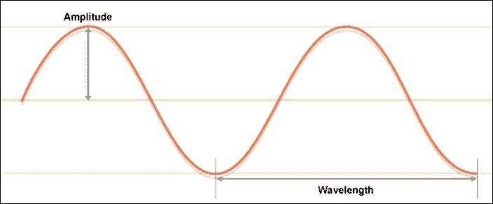

统一 `Time` 属性变量用于时钟滴答。当这些时钟滴答被输入到 GLSL `sin()` 函数时，它生成介于 -1.0 到 1.0 之间的值。每个顶点的 Y 分量 (V[y]) 被添加到这个正弦值 (*VertexCoord.y += sin(Time)*) 以产生跳跃效果动画。尝试这个方程，它会使物体跳跃：

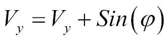

此外，为了产生摆动动画，考虑每个顶点的 X (V[x]) 或 Z (V[z]) 分量，使用 (*VertexCoord.y += sin(VertexCoord.x + Time)*) 产生类似波浪的振荡动画。将结果的 Y (V[y]) 分量乘以 `AMPLITUDE` 将影响摆动波动画的高度：

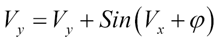

每个顶点的新的 Y (V[y]) 组件，通过乘以 `ModelViewProjection` 矩阵来计算顶点的裁剪坐标。

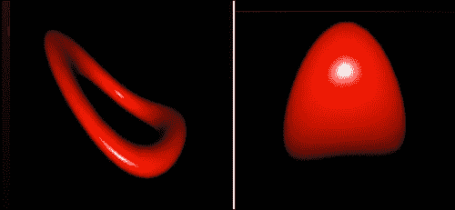

## 还有更多...

摆动着色器配方还展示了池塘水波动画，如本节前面的图像所示。从数学上讲，正弦波作为时间的函数定义为以下：

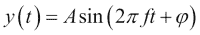

其中 *t* 是时间，*A* 是波的振幅，*f* 是频率。使用这个公式，可以编程波纹效果如下。相位变化 (*φ*) 假设为 *t*：

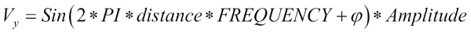

根据以下代码片段中给出的说明修改现有的顶点着色器，粗体部分如下：

```java
#define RIPPLE_AMPLITUDE 0.05
#define FREQUENCY 5.0
#define PI 3.14285714286
void main(){
    nNormal   = normalize ( NormalMatrix * Normal );
    eyeCoord  = vec3 ( ModelViewMatrix * VertexPosition );
    vec4    VertexCoord = VertexPosition;
    float distance = length(VertexCoord);
 VertexCoord.y = sin( 2.0 * PI * distance * FREQUENCY + Time)
 * RIPPLE_AMPLITUDE;
    gl_Position = ModelViewProjectionMatrix * VertexCoord;
}
```

距离变量用于计算每个变量与其原点的距离；此距离使用 OpenGL ES 着色语言`length()` API 计算。最后，通过将`VertexCoord`和`ModelViewProjection`矩阵相乘来计算裁剪坐标。

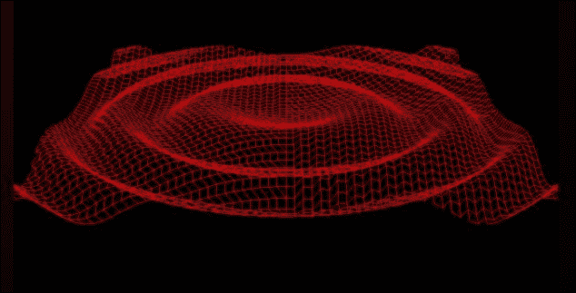

## 参见

+   参考第五章中关于*Phong 着色 - 每个片段着色技术*的配方，*光与材料*章节

# 使用对象坐标进行过程纹理着色

在本配方中，你将学习如何借助过程纹理在 3D 几何体的表面上生成纹理图案。基本上，在 2D/3D 网格对象上的纹理可以分成两类：

+   **过程纹理**：过程纹理是使用算法数学上生成的一个图像或纹理；此类算法使用 2D/3D 对象的各个属性来创建图像；这种纹理类型高度可控。过程纹理用于创建图案，如云彩、大理石、木材、混合、噪声、musgrave、voronoi 等。

+   **图像纹理**：在这种类型的纹理中，一个静态图像被包裹在物体上；由于这是一个光栅图像，因此该图像在仿射缩放变换中可能会发生扭曲。你将在下一章中学习更多关于图像纹理的内容，该章节名为纹理。

在本章中，我们将使用对象和纹理坐标生成多个过程纹理。当前的配方利用对象坐标来演示如何用它来控制 3D 模型上的片段颜色。

对象坐标是一个坐标系，其中定义了物体的原始形状。例如，以下图像中的正方形沿*x-z*平面有 2 x 2 个单位；原点位于正方形的中间。*x*轴和*z*轴将正方形分为围绕原点的四个象限。本配方使用此逻辑将网格的 3D 空间逻辑上分为四个象限，每个象限以不同的颜色着色：

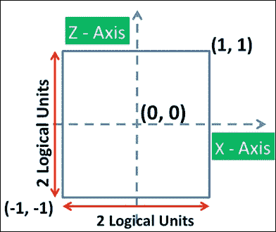

## 如何做...

执行以下步骤以实现此简单配方：

1.  创建`SimpleVertexShader.glsl`并将其添加到以下代码片段中：

    ```java
    #version 300 es
    // Vertex information
    layout(location = 0) in vec4  VertexPosition;
    layout(location = 1) in vec3  Normal;

    // Model View Project and Normal matrix
    uniform mat4 ModelViewProjectionMatrix, ModelViewMatrix;
    uniform mat3    NormalMatrix;

    // output variable to fragment shader
    out vec3 nNormal, eyeCoord, ObjectCoord;

    void main() {
        nNormal     = normalize ( NormalMatrix * Normal );
        eyeCoord    = vec3 (ModelViewMatrix * VertexPosition);
        ObjectCoord = VertexPosition.xyz;
        gl_Position = ModelViewProjectionMatrix * VertexPosition;
    }
    ```

1.  如下修改`SimpleFragmentShader.glsl`：

    ```java
    // Reuse the Light and Material properties. . 
    in vec3 eyeCoord;    // Vertex eye coordinate
    in vec3 ObjectCoord; // Vertex object coordinate 
    layout(location = 0) out vec4 outColor;

    vec3 PhongShading(){ 
      . . . . . .   // Reuse Phong shading code.
    }

    void main() {
        if (objectCoord.x  > 0.0 && objectCoord.z  > 0.0)
            FinalColor = vec4(1.0, 0.0, 0.0, 1.0);
        else if (objectCoord.x  > 0.0  && objectCoord.z  < 0.0)
            FinalColor = vec4(0.0, 01.0, 0.0, 1.0);
        else if (objectCoord.x  < 0.0  && objectCoord.z  > 0.0)
            FinalColor = vec4(0.0, 01.0, 1.0, 1.0);
        else if (objectCoord.x  < 0.0  && objectCoord.z  < 0.0)
            FinalColor = vec4(1.0, 0.0, 1.0, 1.0);

        FinalColor = FinalColor  * vec4(PhongShading(), 1.0);
    }
    ```

    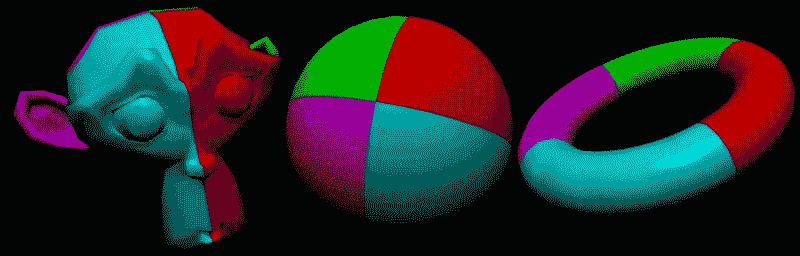

前面的图显示了我们的简单过程着色器的结果。模型沿*x-z*平面分为四个象限，每个象限以不同的颜色显示。通过在屏幕上轻触一次来在这些模型之间切换。

## 它是如何工作的...

着色器作业从顶点着色器开始，其中对象坐标作为 `VertexPosition` 变量中的顶点属性由顶点程序接收；该变量包含在定义对象时在局部 3D 空间中的顶点位置。此值存储在 `ObjectCoord` 中并传递到片段着色器。在片段着色器中，对象坐标值与原点进行比较，以测试它在 *x-z* 平面上的哪个象限。根据象限的结果，为片段分配颜色。以下图像显示了使用对象坐标将 3D 空间分为四个象限：

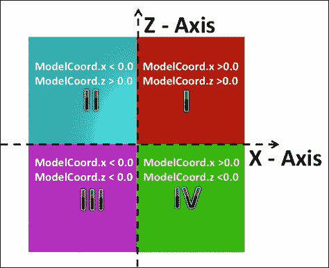

## 还有更多...

着色器程序不提供任何可用于调试目的的打印语句；在着色器中调试坐标值的最简单解决方案之一是将颜色分配给片段。如果你对处理 3D 空间中模型的坐标范围感兴趣，你可以使用条件语句分配各种颜色。例如，如果将之前的片段着色器替换为以下代码，它将根据坐标范围渲染不同颜色的条带：

```java
// Reuse the Light and Material properties. . 
in vec3 eyeCoord;    // Vertex eye coordinate
in vec3 ObjectCoord; // Vertex object coordinate 
layout(location = 0) out vec4 outColor;

vec3 PhongShading(){ 
  . . . . . .// Reuse Phong shading code.
}

void main() {
    //Debuging Shader with Model coordinates
    if (objectCoord.x  > 0.9 )
        FinalColor = vec4(1.0, 0.0, 0.0, 1.0);
    else if (objectCoord.x  > 0.8 )
        FinalColor = vec4(1.0, 1.0, 0.0, 1.0);
    else if (objectCoord.x  > 0.7 )
        FinalColor = vec4(1.0, 0.0, 1.0, 1.0);
    else if (objectCoord.x  > 0.6 )
        FinalColor = vec4(0.60, 0.50, 0.40, 1.0);
    else if (objectCoord.x  > 0.5 )
        FinalColor = vec4(0.30, 0.80, 0.90, 1.0);
    else
        FinalColor = vec4(1.0, 1.0, 1.0, 1.0);

    if (objectCoord.z  > 0.9 )
        FinalColor = vec4(1.0, 0.0, 0.0, 1.0);
    else if (objectCoord.z  > 0.8 )
        FinalColor = vec4(1.0, 1.0, 0.0, 1.0);
    else if (objectCoord.z  > 0.7 )
        FinalColor = vec4(1.0, 0.0, 1.0, 1.0);
    else if (objectCoord.z  > 0.6 )
        FinalColor = vec4(0.60, 0.50, 0.40, 1.0);
    else if (objectCoord.z  > 0.5 )
        FinalColor = vec4(0.30, 0.80, 0.90, 1.0);

    FinalColor = FinalColor  * vec4(PhongShading(), 1.0);
}
```

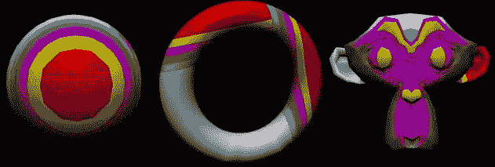

每种独特的颜色指定了沿 *x* 或 *z* 轴的对象坐标范围。以下图像显示了每种颜色代表沿 *x-z* 平面从 0.5 到 1.0 单位的 0.1 逻辑单位带：

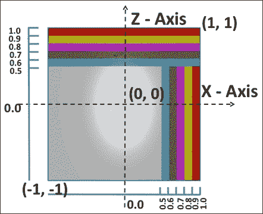

## 参见

+   请参考第七章中的*使用 UV 映射应用纹理*配方，*纹理和映射技术*。

# 创建圆形图案并使其旋转

这个程序纹理配方将使用片段坐标来演示使用 `gl_FragCoord` 的圆形图案。`gl_FragCoord` 是在片段着色器中可用的一个关键字，它负责存储当前片段在 *x* 和 *y* 坐标中的窗口位置；*z* 坐标存储片段在 `[0, 1]` 范围内的深度。

这些坐标始终相对于 OpenGL ES 表面窗口；`gl_FragCoords` 是一个固定功能的结果，其中在顶点处理阶段之后对原语进行插值以生成片段。默认情况下，`gl_FragCoord` 假设 OpenGL ES 渲染表面窗口的左下角为原点。以下图像显示了不同尺寸的 OpenGL ES 表面窗口中的原点：

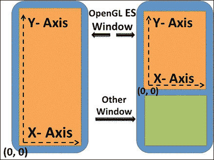

## 如何操作...

此菜谱的光照着色技术将与之前的菜谱相似；更多信息，请参阅第五章中的*Phong 着色 - 每个片段着色技术*菜谱，*光和材料*。创建`CircleVertexShader.glsl`顶点着色器并重用之前菜谱中的代码；对于`CircleFragmentShader.glsl`片段着色器，进行以下更改：

```java
#version 300 es
// Reuse the variables . . . no change
vec3 PhongShading(){
   // Reuse Phong shading code.
   . . . . . .
   return ambient + diffuse + sIntensity * specular;
}

// Model and Dot color
uniform vec3 ModelColor, DotColor;

// Output color for fragment
layout(location = 0) out vec4 FinalColor;

// Size of the logical square
uniform float Side;

// Dot size 25% of Square size
float DotSize   = Side * 0.25;
vec2 Square     = vec2(Side, Side);

void main() {
    vec2 position = mod(gl_FragCoord.xy, Square) - Square*0.5;
    float length = length(position);
    float inside = step(length,DotSize);

    FinalColor = vec4(mix(ModelColor, DotColor, inside), 1.0);
    FinalColor = FinalColor * vec4(GouraudShading(), 1.0);
}
```

以下图像显示了此菜谱的输出：

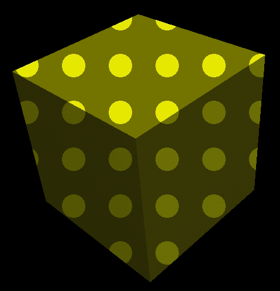

## 它是如何工作的...

对于从`gl_Fragcoord`接收到的每个片段的窗口位置，它通过将左下角坐标移动到想象中的正方形区域中心来处理；这个正方形区域用于在其中绘制一个圆。以下代码负责相对于逻辑正方形中心的每个坐标进行位移，如图所示：

```java
vec2 position = mod(gl_FragCoord.xy, Square) - Square*0.5;
```

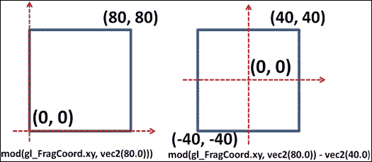

由于`位置`是相对于想象中的正方形中心的，我们可以使用矢量图形中的标准长度公式来计算每个坐标与中心的距离。这个长度用于渲染具有圆圈颜色的片段，圆圈的颜色是通过`DotColor`指定的；如果长度小于`DotSize`，则使用`ModelColor`渲染身体颜色。

从数学上讲，圆是一个点的轨迹，该点始终与给定点等距；当原点移动到中心时，我们可以在正方形内绘制一个圆，如图所示。落在圆下的坐标可以使用`DotColor`渲染，以在模型上产生圆圈图案。为了检查长度是否大于或小于`DotSize`，我们使用了`step()` GLSL API：

```java
   inside  = step(length,DotSize);
```

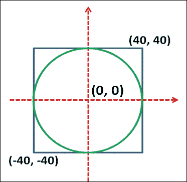

**语法**:

```java
float step(float edge, float x);
```

| 变量 | 描述 |
| --- | --- |
| `edge` | 这指定了步骤函数边缘的位置 |
| `x` | 这指定了用于生成步骤函数的值 |
| `返回值` | 此步骤函数如果 x 小于边缘则返回 0.0；否则返回 1.0 |

## 更多...

当前实现的圆圈图案非常静态；它不会在圆的图案上显示任何运动。在本节中，我们将应用二维旋转矩阵的一般形式来在欧几里得空间中执行单次旋转；旋转矩阵的一般形式是：

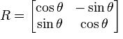

修改现有的片段着色器菜谱以查看圆形图案的旋转效果；高亮代码负责根据二维方程计算旋转矩阵：

```java
uniform float   RadianAngle;
void main() {
    float cos  = cos(RadianAngle); // Calculate Cos of Theta
    float sin  = sin(RadianAngle); // Calculate Sin of Theta

    mat2 rotation  = mat2(cos, sin, -sin, cos);
    vec2 position  = mod( rotation * gl_FragCoord.xy, Square) 
    - Square*0.5;
    float length  = length(position);
    float inside  = step(length,DotSize);

    FinalColor = vec4(mix(ModelColor, DotColor, inside), 1.0);
    FinalColor = FinalColor * vec4(PhongShading(), 1.0);
}
```

## 参见

+   *生成* *圆点图案*

# 生成砖块图案

砖块着色器生成给定 3D 网格对象表面的砖块图案；这是过程纹理的另一个非常好的例子。砖块图案由两个组件（砖块和砂浆）组成；这些使用两种不同的颜色表示，如图所示。这些颜色使用 `BrickColor` 和 `MortarColor` 作为全局变量在顶点着色器中定义。

砖块的矩形尺寸由砖块和砂浆材料组成；矩形区域的总体尺寸为 0.40 x 0.10 平方单位，其中 90% 的水平尺寸（0.40）保留用于沿 *x* 轴的砖块尺寸；剩余的 10% 用于沿同一轴的砂浆。同样，砖块的垂直尺寸沿 *y* 轴为 85%，剩余的 15% 由砂浆的垂直尺寸使用：

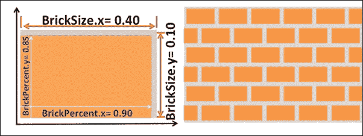

## 如何操作...

执行以下步骤以实现砖块着色器：

1.  创建 `BrickVertex.glsl` 并重用前一个配方中的顶点着色器代码。

1.  创建 `BrickFragment.glsl` 并修改以下代码：

    ```java
    // Brick uniform parameters
    uniform vec3  BrickColor, MortarColor;
    uniform vec2  RectangularSize, BrickPercent;

    // Object coordinates of the mesh
    in vec3    ObjectCoord;

    vec3 PhongShading(){ //Reuse code for Phong shading
       . . . . . .
       return ambient + diffuse + specular;
    }

    vec3  color;
    vec2  position, useBrick;

    void main() {
        position = ObjectCoord.xy / RectangularSize;

       // Displace rows alternately after 0.5 decimals
        if (fract(position.y * 0.5) > 0.5){
            position.x += 0.5;
        }

        position = fract(position);
        useBrick = step(position, BrickPercent);
        color    = mix(MortarColor, BrickColor, 
                          useBrick.x * useBrick.y);
        FinalColor  = vec4(color * PhongShading(), 1.0);
    }
    ```

1.  使用主程序并指定 `BrickColor` 和 `MortarColor` 常量变量的颜色：

    ```java
        BrickColor = ProgramGetUniformLocation(program,"BrickColor");
        MortarColor= ProgramGetUniformLocation(program, "MortarColor");

        if (BrickColor >= 0)
           {glUniform3f(BrickColor, 1.0, 0.3, 0.2 );}
        if (MortarColor >= 0)
           {glUniform3f(MortarColor, 0.85, 0.86, 0.84);}
    ```

1.  类似地，指定总矩形尺寸和砖块百分比：

    ```java
        RectangularSize= ProgramGetUniformLocation(program,"RectangularSize");
        BrickPercent = ProgramGetUniformLocation(program,"BrickPercent");
        if (RectangularSize >= 0)
           {glUniform2f(RectangularSize, 0.40, 0.10 );}
        if (BrickPercent >= 0)
           {glUniform2f(BrickPercent, 0.90, 0.85 );}
    ```

    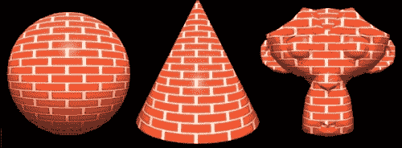

## 工作原理...

在片段着色器中，每个传入的对象坐标 `ObjectCoord` 都被除以 `BrickSize`；结果位置包含砖块所属的行和列。对于每个交替的行，使用程序中的以下代码片段在水平方向上将砖块的位置向前推进 0.5 个单位：

```java
    if (fract(position.y * 0.5) > 0.5)
    {
        position.x += 0.5;
    }
```

`fract` GLSL API 计算位置的小数部分并将其存储在 `position` 变量中；由于它是一个小数值，它必须在 0.0 和 1.0 之间；我们必须使用这个新值来使用 GLSL step 函数与 `BrickPercent` 进行比较。步进函数接受两个参数，一个阈值和一个需要与阈值进行比较的参数；如果参数值小于阈值值，则函数返回 `0`；否则，它将返回 `1`：

```java
position = fract(position);
useBrick = step(position, BrickPercent);
color    = mix(MortarColor,BrickColor,useBrick.x * useBrick.y);
```

混合函数使用权重参数混合两种颜色；在这个配方中，权重参数是 `useBrick.x` 和 `useBrick.y` 的乘积。结果颜色与 `PhongShading()` 相乘，产生砖块着色器上的最终光照着色。

## 更多内容...

在砖块着色器中使用的混合函数负责根据权重值在两个给定值之间执行线性插值。

**语法**:

```java
genType mix(genType x, genType y, genType a);
```

| 变量 | 描述 |
| --- | --- |
| `x` | 这指定了插值范围的起点 |
| `y` | 这指定了插值范围的终点 |
| `a` | 这指定了用于在 x 和 y 之间进行插值的值 |

从数学上讲，*mix(x, y, and a)* 函数计算 *x* 和 *y* 之间的线性插值，使用 `a` 作为权重。计算出的值如下：*x * (1 − a) + y * a*。

## 参见

+   参考第五章 *Gouraud 着色 – 每片段着色技术* 配方，*光与材料*。

# 生成波点图案

这个配方是另一种程序纹理，它是我们圆形图案着色器的扩展。在那个配方中，我们研究了在平面表面上产生二维圆形图案的逻辑；这个平面表面是通过片段坐标创建的。在这个配方中，我们将在三维网格对象表面上创建波点图案；这里的主要区别在于，我们不会在方形中产生逻辑圆形，而是在逻辑立方体的 **Side** x **Side** x **Side** 单位内使用内嵌的逻辑球体：

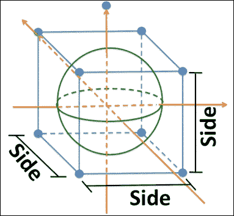

## 准备工作

在这个配方中，我们重用了第五章 *实现双面着色* 配方中的照明技术，*光与材料*。顶点位置、法线和纹理坐标的通用顶点属性分别用 0、1 和 2 个索引排列。

## 如何做到这一点...

执行以下步骤以实现波点图案的配方：

1.  创建 `PolkaDotsVertex.glsl` 并重用前一个配方中的顶点着色器代码。

1.  创建 `PolkaDotsFragment.glsl`；编辑以下片段着色器文件：

    ```java
    #version 300 es
    precision mediump float;
    layout(location = 0) out vec4 outColor;

    in vec3  ObjectCoord;

    // Size of the logical cube
    uniform float Side;
    uniform float DotSize;
    vec3 Cube       = vec3(Side, Side, Side);
    vec3 RenderColor= vec3(0.0, 0.0, 0.0);

    // Front and Back face Model(mesh)/polka dot color
    uniform vec3 ModelColor, DotColor, BackSideModelColor, BackSideDotColor;

    void main() {

        float insideSphere, length;
        vec3 position = mod(ObjectCoord, Cube) – Cube*0.5;
        // Note: length() can also be used here
        length = sqrt( (position.x*position.x) +
        (position.y*position.y) + (position.z*position.z) );
        insideSphere = step(length,DotSize);

        // Determine color based on front/back shading
     if (gl_FrontFacing){){           
       RenderColor=vec3(mix(ModelColor,DotColor,insideSphere));
           outColor = vec4(RenderColor , 1.0);
        }
        else{
           RenderColor==vec3(mix(BackSideModelColor,BackSideDotColor, insideSphere));
            outColor = vec4(RenderColor, 1.0);
        }
    }
    ```

    以下图像显示了波点着色器在各个 3D 网格模型上的输出；在这些模型中，空心圆柱展示了双面着色技术，其中内部和外部面以从内部和外部不同颜色的波点渲染：

    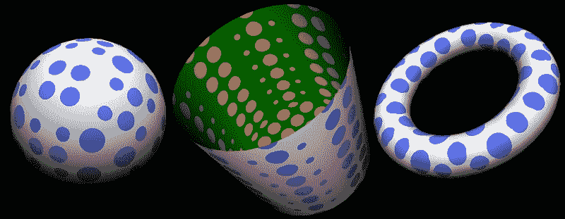

## 它是如何工作的...

波点着色器使用对象坐标在网格模型表面产生波点；这些对象坐标以 `ObjectCoord` 输入顶点属性变量的形式由顶点着色器共享。使用 `Cube` 变量对 `ObjectCoord` 执行模运算，`Cube` 是一个 `vec3` 的 `Side`。这产生了一个逻辑立方体，然后从这个逻辑立方体的半立方维度中减去，以便将原点置于逻辑立方体的中心：

```java
    vec3 position = mod(ObjectCoord, Cube) - Cube/0.5;
```

计算平移后的 `ObjectCoord` 与此中心的距离将提供从平移原点到位置向量的长度：

```java
length = sqrt( (position.x*position.x) +
 (position.y*position.y)+(position.z*position.z));
```

最后，使用 GLSL step 函数将长度与 `DotSize` 进行比较，以检查它是否在 `DotSize` 半径的虚球体内部：

```java
    insideSphere = step(length,DotSize);
```

根据 `insideSphere` 的结果，颜色值被分配给主体和波点；用于前表面的颜色与用于背面颜色的颜色不同，以便展示双面着色。

## 参见

+   参考第五章 *实现双面着色* 的配方，*光与材料*

+   *使用对象坐标进行过程纹理着色*

+   *创建圆形图案并使它们旋转*

# 丢弃片段

OpenGL ES 着色语言提供了一个重要的功能，即使用 `discard` 关键字丢弃片段；这个关键字仅在片段着色器中使用，以防止更新帧缓冲区。换句话说，使用这个关键字会丢弃当前片段并停止片段着色器的执行。OpenGL ES 着色语言的这个特性是一个简单而有效的特性，它为产生 3D 几何体的横截面视图、孔或穿孔表面提供了可能性。

## 准备工作

这个配方重用了上一个配方；这需要在片段着色器中做一些更改以展示丢弃片段的功能。

## 如何操作...

将圆点着色器的顶点着色器文件和片段着色器文件重命名为 `DiscardFragVertex.glsl` 和 `DiscardFragFragment.glsl`。打开片段着色器文件并添加以下高亮代码：

```java
#version 300 es
// Many lines skipped . . . 
layout(location = 0) out vec4 FinalColor;
vec3 GouraudShading( bool frontSide )
{
 // Reuse two sides shade recipe PhongShading code here
   return ambient + diffuse + specular;
}

in vec3  ObjectCoord;
uniform float Side, DotSize;
vec3 Square     = vec3(Side, Side, Side);
vec3 RenderColor;

// Front and Back face polka dot color
uniform vec3 ModelColor, DotColor, BackSideModelColor, BackSideDotColor;

// Variable for toggling the use of discard keyword
uniform int toggleDiscardBehaviour;

void main() {

    float insideCircle, length;
    vec3 position = mod(ObjectCoord, Square) - Square/2.0;

   length = sqrt( (position.x*position.x) +
          (position.y*position.y)+(position.z*position.z));
    insideCircle      = step(length,DotSize);

 // The toggleDiscardBehaviour change the behavior
 // automatically after fixed interval time.
 // The timer is controlled from the OpenGL ES program.
 if(toggleDiscardBehaviour == 0){
 if (insideCircle != 0.0)
 discard;
 }
 else{
 if (insideCircle == 0.0)
 discard;
 }

 // Determine final color based on front and back shading
    if (gl_FrontFacing){
     RenderColor = vec3(mix( ModelColor, DotColor, insideCircle));
     FinalColor = vec4(RenderColor * PhongShading(true), 1.0);
    }
    else{
     RenderColor=vec3(mix(BackSideModelColor, 
     BackSideDotColor, insideCircle));
     FinalColor=vec4(RenderColor * PhongShading(false), 1.0);
    }
}
```

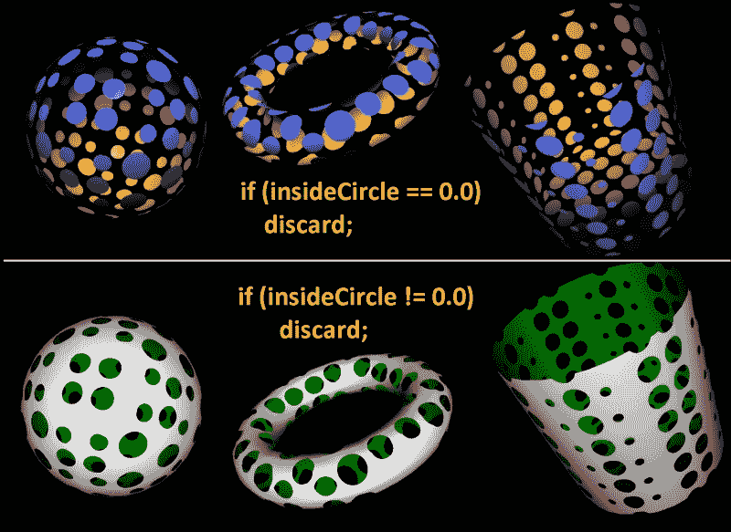

## 它是如何工作的...

前面的输出显示了在圆点片段着色器程序中应用 `discard` 关键字。在这个配方中，片段基于 `insideCircle` 变量进行判断。这个变量检查片段是否落在圆内或圆外。如果落在圆内，则丢弃该片段；这会导致如前图所示的多孔外观。

在相反的情况下，位于圆外的片段会被丢弃，如前图所示。一般来说，不建议广泛使用 `discard` 关键字，因为它会增加图形管道执行额外操作的开销。根据 Imagination Technologies 的建议，对于 PowerVR 架构，建议在编程实践中限制使用 `discard` 关键字。尽管这很大程度上取决于应用程序本身，但建议对应用程序进行性能分析，以查看 `discard` 是否会导致其性能显著下降。

## 参见

+   *生成圆点图案*

+   *使用纹理坐标进行过程纹理着色*

# 使用纹理坐标进行过程纹理着色

纹理坐标控制纹理在模型表面的包裹方式；这些是用于将纹理映射到几何体 3D 表面的 2D 坐标。纹理坐标映射到称为 **UV 映射** 的不同坐标系中。字母 **U** 和 **V** 分别表示沿 *x* 轴和 *y* 轴的纹理轴：

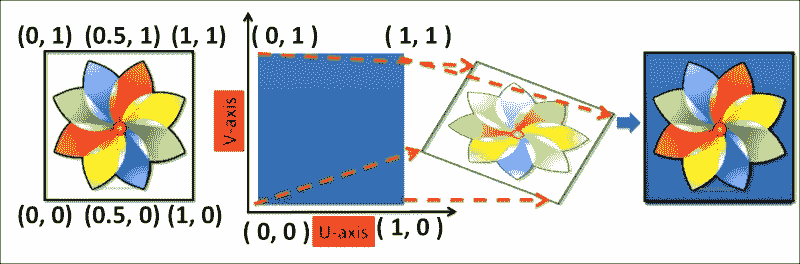

前面的最左边的图像显示了一个需要映射到某个任意尺寸蓝色方块的图标。一个图像（无论其尺寸如何）总是在 U 和 V 轴上的 0 到 1 的范围之间进行 UV 映射。因此，左下角的图像始终是**(0, 0**)，左上角的图像是**(1, 1**)；在 OpenGL ES 程序中不需要分配这些值。默认情况下，图形管线会理解这一点。

需要提到的是 2D/3D 模型的纹理坐标；例如，在前面的图像中，蓝色方块被分配了四个 UV 坐标，这显示了图像将如何完全映射到方块的表面：

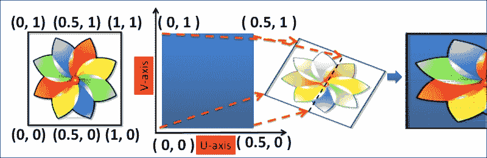

在前面的图像中，蓝色方块被分配了新的纹理坐标，底部左角和右上角分别为**(0, 0**)和**(0.5, 1**)；映射后的图像显示在右下角，我们可以清楚地看到新的纹理坐标沿*U*轴粘贴在图像的一半上。

纹理坐标对于基于图像的纹理是强制性的；然而，对于程序化纹理来说并非必须。程序化纹理中的纹理坐标有其自身的重要性，其应用是无限的。本食谱将演示纹理坐标的一个应用，即在 3D 立方网格模型表面产生类似网格的程序化纹理。有关 UV 贴图及其相关应用的信息，请参阅下一章。

## 准备工作

对于这个食谱，网格模型必须包含纹理坐标信息。有关如何创建带有纹理坐标的 Wavefront 对象模型的信息，请参阅第八章，*与网格一起工作*。

## 如何做...

为了实现这个食谱，执行以下步骤：

1.  创建 `GridVertex.glsl` 顶点着色器程序并添加以下代码：

    ```java
    #version 300 es
    // Vertex layout information
    layout(location = 0) in vec4  VertexPosition;
    layout(location = 1) in vec3  Normal;
    layout(location = 2) in vec2  TexCoords;

    // Model View Projection Normal matrix
    uniform mat4    ModelViewProjectionMatrix, ModelViewMatrix;
    uniform mat3    NormalMatrix;

    out vec3    nNormal, eyeCoord;
    out vec2    TextureCoord;

    void main()
    {
        nNormal      = normalize ( NormalMatrix * Normal );
        eyeCoord     = vec3 ( ModelViewMatrix * VertexPosition );
        TextureCoord = TexCoords;

        gl_Position = ModelViewProjectionMatrix * VertexPosition;
    }
    ```

1.  对于编程网格着色器，我们需要在片段着色器中进行修改。创建一个新的片段着色器文件，命名为 `GridFragment.glsl`，并使用以下代码：

    ```java
    vec3 PhongShading( bool frontSide ){
       // Reuse the Phong shading code.
       return ambient + diffuse + specular;
    }

    in vec2    TextureCoord;
    layout(location = 0) out vec4 FinalColor;

       // Scale factor of the texture coord & Grid strip width
       uniform float texCoordMultiplyFactor, stripWidth;  

    void main() {
       // multiplicationFactor scales number of stripes
       vec2 t = TextureCoord * texCoordMultiplyFactor;

       // The stripWidth is used to define the line width
       if (fract(t.s) < stripWidth  || fract(t.t) < stripWidth ){
       // Front Face coloring
          if (gl_FrontFacing){ 
             FinalColor = vec4(PhongShading(true), 1.0);
          }
          // Back Face coloring
          else{ 
              FinalColor = vec4(GouraudShading(false), 1.0);
          }
       }
          // Throw the fragment
          else{ 
          discard;
       }
    }
    ```

    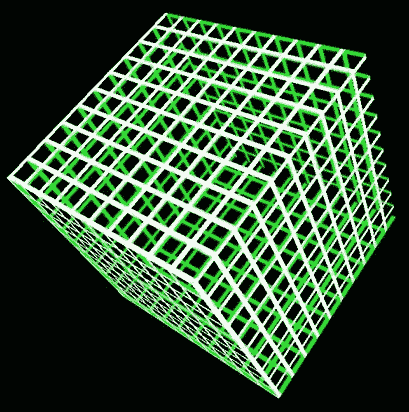

## 它是如何工作的...

顶点着色器从 OpenGL ES 程序中的`TexCoord`顶点属性接收纹理坐标；该属性使用索引**2**定义为布局位置。纹理坐标通过`TextureCoord`作为输出变量传递给片段着色器。在这个配方中，我们使用了一个由六个正方形面组成的立方体；这些面的纹理坐标在 UV 映射中定义。这些 UV 映射坐标乘以一个名为`texCoordMultiplyFactor`的乘数因子变量，产生称为**ST**坐标的表面映射坐标。请注意，ST 坐标是逻辑坐标，用于创建表面映射计算；在许多地方，它们可以互换使用：

```java
vec2 t = TextureCoord * texCoordMultiplyFactor;
```

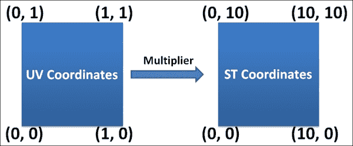

`texCoordMultiplyFactor`的实际意义是定义水平和垂直方向上的条带数量。条带的宽度由`stripWidth`变量控制。当坐标转换为 ST 映射时，现在可以假设水平和垂直轴上有 10 条条带，每条条带宽**1**个单位。使用 GLSL 的`frac()` API 将`stripWidth`与 ST 坐标的分数值进行比较；此 API 返回十进制数的分数值。如果分数值大于`stripWidth`，则将其丢弃；否则，根据片段的前后面对齐，它们被分配颜色：

```java
   if (fract(t.s) < stripWidth  || fract(t.t) < stripWidth ){
   //Front Face coloring  
   if (gl_FrontFacing) 
   { outColor = vec4( GouraudShadingGouraud(true), 1.0); }
   //Back Face coloring 
   else{ 
   { outColor = vec4( GouraudShadingGouraud(false), 1.0); }
   }
   // Throw the fragment 
   else{ 
   discard;
   }
```

## 参考信息

+   参考第五章中关于*实现双面着色*的配方，*光和材料*

+   *丢弃片段*

+   参考第七章中关于*使用 UV 映射应用纹理*的配方，*纹理和映射技术*
