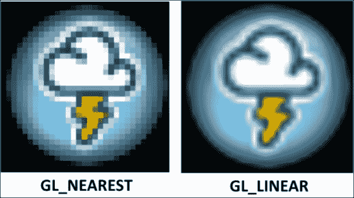
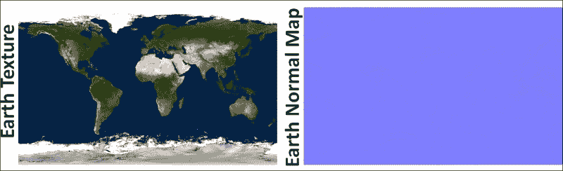

# 第七章. 纹理和映射技术

在本章中，我们将涵盖以下食谱：

+   使用 UV 映射应用纹理

+   使用 ETC2 压缩纹理格式进行高效渲染

+   应用多种纹理

+   使用无缝立方贴图实现 Skybox

+   使用环境贴图实现反射和折射

+   使用帧缓冲对象实现渲染到纹理

+   使用位移贴图实现地形

+   使用凹凸贴图实现

# 简介

本章将简要介绍纹理，这是 3D 计算机图形研究中的一个非常有趣的部分。纹理是一种技术，通过该技术，3D 网格模型的表面被涂上静态图像。在我们上一章中，我们描述了过程纹理和图像纹理技术。前者使用特殊算法计算片段的颜色以生成特定图案。另一方面，后者使用静态图像，这些图像被包裹在 3D 网格或几何体上。

本章全部关于图像纹理，解释了其在 3D 计算机图形领域的各种应用。我们将从演示 UV 映射以在二维平面表面上渲染纹理的简单食谱开始本章；从单个纹理开始，你将学习如何将多个纹理应用于 3D 对象。OpenGL ES 3.0 引入了许多新特性。在这些特性中，非 2 的幂（NPOT）纹理支持、ETC2/EAC 纹理压缩支持和无缝立方贴图在本章中通过一些实际食谱进行了详细解释。在章节的后续部分，我们将实现环境贴图食谱以模拟物体表面的反射和折射行为。章节将继续解释一种称为渲染到纹理的有效技术；这允许你将场景渲染到用户定义的纹理缓冲区。此外，我们将讨论位移贴图技术，它可以用来渲染地形；本章的最后一个食谱将讨论凹凸贴图技术，该技术用于使用低多边形网格生成高质量、详细的表面。

# 使用 UV 映射应用纹理

纹理基本上是计算机内存中由一块内存表示的图像；这块内存包含以红色（R）、绿色（G）、蓝色（B）和 alpha（A）组件形式存在的颜色信息；每个组件都表示为一串位/字节，具体取决于纹理类型的格式。

在这个食谱中，我们将创建一个简单的正方形并对其应用纹理；纹理映射需要以下三个要素：

1.  首先需要使用纹理对象将图像加载到 OpenGL ES 纹理内存中。

1.  使用纹理坐标将纹理映射到几何体上。

1.  使用纹理坐标从纹理中获取相应的颜色，以便将其应用于几何体的表面。

## 准备工作

GLPI 框架允许使用名为 `.png` 的高层抽象类加载 **可移植网络图形** （**PNG**）图像文件，该类是从图像派生出来的；此类加载 `.png` 图像并在类中存储图像度量，如名称、尺寸、原始位和 OpenGL ES 纹理名称（ID）。内部，此类使用 `libpng`，这是一个平台无关的库，允许您解析 `.png` 图像。

## 如何做到这一点...

以下过程描述了使用 `.png` 图像纹理渲染几何形状的步骤：

1.  `libpng` 库位于 `GLPLFramework` 文件夹下；本书将使用 `libpng` 的 1.5.13 版本。

    +   **iOS**：在 iOS 上，需要将此库添加到项目中。在 Xcode 中，在您的项目下，您可以通过 **文件** | **添加到 <项目名称>** 来包含此库。

    +   **Android**：对于 Android，`libpng` 可以编译为一个名为 `GLPipng` 的共享库；为此，在 `libpng` 文件夹中创建 `Android.mk` 并添加以下代码：

        ```java
               LOCAL_PATH := $(call my-dir)
               include $(CLEAR_VARS)

               LOCAL_MODULE    := GLPipng
               LOCAL_SRC_FILES := png.c pngerror.c pngget.c \
               pngmem.c pngpread.c pngread.c pngrio.c \
               pngrtran.c pngrutil.c pngset.c pngtrans.c \
               pngwio.c pngwrite.c pngwtran.c pngwutil.c

               LOCAL_LDLIBS := -lz
               LOCAL_CFLAGS := -I. -g
               include $(BUILD_SHARED_LIBRARY)
        ```

    此 makefile (`<GLPIFramework>/libpng/Android.mk`) 需要包含在主项目 makefile (`SimpleTexture/Android/JNI/Android.mk`) 中，并且必须在主项目的 makefile 中包含以下行，以便编译它：

    ```java
    include $(MY_CUR_LOCAL_PATH)/../ ../../../GLPIFramework/libpng/Android.mk
    ```

    生成的名为 `GLPipng` 的共享库必须添加到项目中，如下代码所示：

    ```java
    LOCAL_SHARED_LIBRARIES := GLPipng
    ```

1.  为了在外部存储上读取或写入文件，您的应用必须获取系统权限：

    ### 注意

    从 Android 4.4 开始，如果您只读取或写入您应用私有的文件，则不需要这些权限。

    ```java
    <manifest ...><uses-permission android:name="android.permission.WRITE_EXTERNAL_STORAGE" />...</manifest>
    ```

1.  创建一个从 `Model` 派生的 `SimpleTexture` 类；在这个类的构造函数中，使用 `PngImage` 类成员变量 image 加载图像：

    ```java
    SimpleText::SimpleText( Renderer* parent ){
        . . . .
       modelType          = ImageDemoType;
       char fname[MAX_PATH]= {""};

        #ifdef __APPLE__
          GLUtils::extractPath( getenv( "FILESYSTEM" ), fname );
        #else
           strcpy( fname, "/sdcard/Images/" );
        #endif

        strcat( fname, "cartoon.png" );
        image = new PngImage();
        image->loadImage(fname);
    }
    ```

1.  `PngImage::loadImage()` 负责加载图像并为加载的纹理分配一个唯一的名称，该名称由 OpenGL ES 在系统中唯一识别纹理。

    +   **语法**：

        ```java
        void PngImage::loadImage(char* fileName, bool generateTexID = true, GLenum target = GL_TEXTURE_2D );
        ```

        | 变量 | 描述 |
        | --- | --- |
        | `fileName` | 这是需要加载的图像文件名称。 |
        | `generateTexID` | 这是一个布尔值，用于决定图像是否需要唯一的名称 ID。如果布尔值为 `true`，则加载的图像被分配一个唯一的 ID；如果布尔值为 `false`，则不分配 ID 给图像。此参数的默认值是布尔值 `true`。 |
        | `target` | 这指定了需要绑定纹理的目标。可能的目标是 `GL_TEXTURE_2D`、`GL_TEXTURE_3D`、`GL_TEXTURE_2D_ARRAY` 或 `GL_TEXTURE_CUBE_MAP`。此参数的默认值是 `GL_TEXTURE_2D`。 |

    +   **代码**：`PngImage` 类的 `loadImage` 函数的工作代码如下：

        ```java
        bool PngImage::loadImage(char* fileName, 
                       bool generateTexID, GLenum target ){

        // Get the image bits from the png file.
        memData.bitsraw = read_png_file( fileName);

           // Generate the texture ID if it is not produced before
           if ( generateTexID ){
                GLuint texID;
                glGenTextures ( 1,&texID );
                memData.texID = texID;

              // Depending upon the target type bind the
              // texture using generated texture ID handler 

                if (target == GL_TEXTURE_2D){
                    glBindTexture(GL_TEXTURE_2D,texID );
                }
           // Similarly, handle cases like GL_TEXTURE_2D, 
                // GL_TEXTURE_3D, and GL_TEXTURE_2D_ARRAY etc.
            }

            // Get the colorType from ligpng for current 
            // image and prepare the texture accordingly
            switch (colorType) {
               case PNG_COLOR_TYPE_RGB_ALPHA: {
                    glTexImage2D ( target,  0, GL_RGBA,
                     memData.width, memData.height, 0, GL_RGBA,
                     GL_UNSIGNED_BYTE,memData.bitsraw);
                break; 
                }
               // Similarly, handle other cases: -
              // PNG_COLOR_TYPE_GRAY,PNG_COLOR_TYPE_RGBetc.

            }

                     // Release the allocate memory for image bits.
            free(memData.bitsraw);
            memData.bitsraw=NULL;return true;
        }
        ```

1.  `loadImage` 函数解析指定的图像文件名并将读取的图像缓冲区存储在 `PngImage` 类的 `bitraw` 成员中。

    唯一的纹理名称是通过使用`glGenTexture` OpenGL ES API 生成的。此 API 根据`n`指定的数量在纹理中生成一定数量的未使用名称。该名称以无符号整数 ID 的形式存在；生成的 ID 存储在 PngImage 的成员变量`texID`中。

    +   **语法**:

        ```java
        void glGenTextures(GLsizei n, GLuint * textures);
        ```

        | 变量 | 描述 |
        | --- | --- |
        | `n` | 这指定了要生成的纹理名称数量 |
        | `textures` | 这指定了一个未使用的生成纹理名称数组 |

    +   考虑以下代码：

        ```java
        GLuint texID;
        glGenTextures   ( 1,&texID );
        memData.texID = texID;
        ```

    使用`glBindTexture`将生成的`texID`绑定到指定的目标；OpenGL ES 3.0 的此 API 指定了管道以及它需要管理的纹理类型。例如，以下代码提到 OpenGL ES 当前状态包含一个 2D 类型的纹理：

    ```java
             if (target == GL_TEXTURE_2D){
                glBindTexture ( GL_TEXTURE_2D,texID );
              }
    ```

    此 API 非常重要，必须调用以在纹理上执行任何操作；它将正确的纹理名称绑定到 OpenGL ES，这允许您对其进行任何纹理操作。

    +   **语法**:

        ```java
        void glBindTexture(GLenum target, GLuint texture);
        ```

        | 变量 | 描述 |
        | --- | --- |
        | `target` | 这指定了纹理绑定的目标。这必须是`GL_TEXTURE_2D`、`GL_TEXTURE_3D`、`GL_TEXTURE_2D_ARRAY`或`GL_TEXTURE_CUBE_MAP`之一。 |
        | `texture` | 这指定了一个未使用的生成纹理名称数组。 |

1.  使用 OpenGL ES 3.0 的`glTexImage2D` API 将图像加载到 OpenGL ES 纹理内存中：

    ```java
    glTexImage2D ( target, 0, GL_RGBA,  memData.width,
    memData.height,0,GL_RGBA,GL_UNSIGNED_BYTE,memData.bitsraw);
    ```

    描述`glTexImage2D` API 每个参数的语法如下：

    +   **语法**:

        ```java
        void glTexImage2D(GLenum target, GLint level, GLint internalFormat, GLsizei width, GLsizei height, GLint border, GLenum format, GLenum type, const GLvoid * data);
        ```

        | 变量 | 描述 |
        | --- | --- |
        | `target` | 这指定了纹理绑定的目标。 |
        | `level` | 这是米级映射的细节级别数。 |
        | `internalFormat` | 这指定了纹理中的组件数。例如，这个配方使用了一个具有四个组件（红色、绿色、蓝色和 alpha）的图像。因此，格式将是`GL_RGBA`。 |
        | `width` | 这指定了纹理的宽度；OpenGL ES 3.0 的新版本支持所有实现中的 2048 个 texels。 |
        | `height` | 这指定了纹理的高度；OpenGL ES 3.0 的新版本支持所有实现中的 2048 个 texels。 |
        | `border` | 此值必须是 0。 |
        | `format` | 这指定了像素数据格式；对于这个配方，它是`GL_RGBA`。 |
        | `type` | 这指定了像素数据的数据类型；在这个配方中，所有使用的组件都是 8 位无符号整数。因此，类型必须是`GL_UNSIGNED_BYTE`。 |
        | `data` | 这是一个指向图像解析数据的指针。 |

1.  创建一个名为`SimpleTextureVertex.glsl`的顶点着色器文件，并添加以下代码；此着色器文件从 OpenGL ES 程序接收顶点和纹理坐标信息；接收到的纹理坐标随后被发送到片段着色器以进行纹理采样：

    ```java
    #version 300 es
    layout(location = 0) in vec3  VertexPosition;
    layout(location = 1) in vec2  VertexTexCoord;
    out vec2 TexCoord;
    uniform mat4 ModelViewProjectMatrix;

    void main( void ) {
      TexCoord = VertexTexCoord;
      gl_Position=ModelViewProjectMatrix*vec4(VertexPosition,1.0);
    }
    ```

    类似地，创建一个名为 `SimpleTexureFragment.glsl` 的着色器文件；这个文件负责接收从顶点着色器传来的纹理坐标和纹理图像。纹理以 sampler2D 的形式接收，这是 GLSL 中的一个内置数据类型，用于在着色器中访问纹理。另一个 GLSL API 纹理用于检索片段颜色；这个 API 接受纹理和纹理坐标作为参数：

    ```java
    #version 300 es
    precision mediump float;
    in vec2 TexCoord;
    uniform sampler2D Tex1;
    layout(location = 0) out vec4 outColor;

    void main() {
        outColor = texture(Tex1, TexCoord);
    }
    ```

1.  定义正方形的几何顶点和纹理坐标以将纹理映射到几何形状上：

    ```java
    float quad[12] = { -1.0, -1.0,  0.0, 1.0, -1.0,  0.0,
                       -1.0, 1.0, -0.0, 1.0, 1.0, -0.0 };
    float texCoords[8] = { 0.0, 1.0, 1.0, 1.0, 0.0, 0.0, 1.0, 0.0 };
    ```

    

    ### 注意

    单个纹理始终在 UV 坐标系中以 (0.0, 0.0) 左下角到 (1.0, 1.0) 右上角表示。如果纹理坐标超出这些尺寸范围，则可以应用特殊的包裹规则来控制纹理包裹。有关更多信息，请参阅本配方中的 *还有更多…* 部分。

1.  OpenGL ES 着色器通过纹理单元访问加载的图像；纹理单元是能够访问图像的硬件部件。每个纹理单元都有一个从 `0` 到 `GL_MAX_COMBINED_TEXTURE_IMAGE_UNITS -1` 的 ID。为了使一个纹理单元生效，使用 `glActiveTexture`。在当前配方中，加载的纹理通过纹理单元 0 (`GL_TEXTURE0`) 使着色器可访问。将纹理绑定到这个纹理单元：

    ```java
    glActiveTexture(GL_TEXTURE0); //Make texture unit 0 active.
    glBindTexture(GL_TEXTURE_2D, image->getTextureID());
    ```

    使用 `glUniform1i` 将纹理单元 ID 发送到片段着色器。在片段着色器中，`Tex1` 常量变量接收这个信息；查询这个常量变量的位置以提供纹理单元信息。注意，这里的 `0` 是纹理单元号，而不是纹理句柄：

    ```java
       TEX = ProgramManagerObj->ProgramGetUniformLocation
                               ( program, (char *) "Tex1" );
        glUniform1i(TEX, 0);
    ```

1.  使用 `glTexParameterf` 设置纹理的缩小、放大和包裹行为：

    ```java
       glTexParameterf(GL_TEXTURE_2D,GL_TEXTURE_MAG_FILTER,GL_LINEAR);
       glTexParameterf(GL_TEXTURE_2D,GL_TEXTURE_MIN_FILTER, GL_LINEAR);
       glTexParameteri(GL_TEXTURE_2D,GL_TEXTURE_WRAP_S,GL_CLAMP_TO_EDGE);
       glTexParameteri(GL_TEXTURE_2D,GL_TEXTURE_WRAP_T,GL_CLAMP_TO_EDGE);
    ```

1.  使用当前着色器程序并将顶点和纹理坐标信息发送到着色器以渲染几何形状：

    ```java
          glUseProgram(program->ProgramID);
          glDisable(GL_CULL_FACE); // Disable culling
          glEnable(GL_BLEND);      // Enable blending
          glBlendFunc(GL_SRC_ALPHA,GL_ONE_MINUS_SRC_ALPHA);
                                   //Send Vertices
          glEnableVertexAttribArray(VERTEX_POSITION); 
          glEnableVertexAttribArray(TEX_COORD); //Send Tex Coordinate
          glVertexAttribPointer
          TEX_COORD, 2, GL_FLOAT, GL_FALSE, 0, texCoords);
          glVertexAttribPointer
          (VERTEX_POSITION, 3, GL_FLOAT, GL_FALSE, 0, quad);
          glUniformMatrix4fv
          ( MVP, 1, GL_FALSE,( float * )TransformObj->
          TransformGetModelViewProjectionMatrix() );
    ```

## 它是如何工作的...

GLPI 框架提供了一个名为 `PNGImage` 的高级 PNG 图像解析类；它内部使用 `libpng` 库解析 PNG 文件，并将关键信息存储在本地数据结构中。这个类生成纹理对象，与 OpenGL 状态机绑定，并在其中加载图像缓冲区数据。

OpenGL ES 通过纹理对象支持纹理；这些纹理对象是在 `loadImage` 函数中使用 `glGenTextures` API 准备的。这个 API 在幕后生成一个纹理对象，并返回一个唯一的 (`texID`) 名称 ID。OpenGL ES 是一个状态机；因此，在纹理上应用任何操作之前，需要将其设置为当前纹理；这可以通过 `glBindTexture` 实现。这个 API 将 `texID` 绑定到当前的 OpenGL ES 状态作为当前纹理，这使得 OpenGL ES 状态机能够将所有与纹理相关的操作应用于当前纹理对象。

OpenGL ES 以图像缓冲区形式将其纹理加载到其纹理内存中；此信息通过`glTexImage2D`提供，该函数指定了底层可编程管道中图像的格式。`glActiveTexture` API 用于将纹理绑定到纹理单元；OpenGL ES 中的纹理单元旨在访问片元着色器中的纹理。在我们的菜谱中，加载的纹理附加到纹理单元`0`（`GL_TEXTURE0`）。片元使用包含通过纹理单元附加的句柄的统一`Sampler2D`数据类型。`glUniform1i`用于将信息发送到片元着色器中的`Tex1`变量：

```java
   TEX = ProgramManagerObj->ProgramGetUniformLocation
   ( program, (char *) "Tex1" );
   glUniform1i(TEX, 0);
```

顶点着色器有两个通用属性，即`VertexPosition`和`VertexTexCoord`，它们接收顶点坐标和纹理坐标。每个顶点的纹理坐标（在顶点着色器中接收）通过`TexCoord`发送到片元着色器。

片元着色器负责采样纹理；采样是一个使用纹理坐标选择一个期望的`texel`的过程；这个`texel`提供了需要应用到原始图形中相应像素的颜色信息。它使用传入的每个顶点的通用属性`TexCoord`来检索纹理坐标和在采样器 2D 中的纹理句柄。纹理句柄允许您从 OpenGL ES 纹理内存中访问纹理，以便在着色器中执行采样操作。着色语言为采样目的提供了一个纹理；它使用纹理句柄，在这个菜谱中为`0`，以及`TexCoord`纹理坐标。


## 还有更多...

在本节中，我们将讨论 OpenGL ES 3.0 管道中可用的各种内置过滤和包装技术。这些技术通过指定各种符号常量通过`glTexParamterf`、`glTexParameteri`、`glTexParameterf`、`glTexParameteriv`或`glTexParameterfv`来应用。

### 注意

与纹理不同，坐标具有 UV 坐标系；采样的`texel`具有 ST 坐标系的传统，其中 S 对应水平轴，T 对应垂直轴。这可以用来定义采样过程中 S 和 T 方向上的过滤和包装行为。

### 过滤

纹理过滤技术允许您控制纹理质量的外观；有时，在正确的深度，一个`texel`在屏幕上正好对应一个像素。然而，在其他情况下，将较小的纹理映射到较大的几何体上可能会导致纹理看起来被拉伸（放大）。同样，在相反的情况下，许多`texel`被几个像素所着色（最小化）。

这种情况被称为最小化处理和放大处理。让我们详细看看：

+   **最小化处理**：这种情况发生在几个屏幕像素对应许多 texel 时。

+   **放大**：这种情况发生在几个屏幕像素对应少数`texel`时。

为了处理缩小和放大，OpenGL ES 3.0 提供了以下两种类型的过滤技术：

+   `GL_NEAREST`：这使用最接近纹理坐标的像素颜色

+   `GL_LINEAR`：这使用最接近纹理坐标的四个周围像素的加权平均值

OpenGL ES 3.0 提供了`GL_TEXTURE_MAG_FILTER`和`GL_TEXTURE_MIN_FILTER`作为符号常量，可以在`glTexParameterf`中用作参数，分别指定放大和缩小时的过滤技术。

### 包装

一个显而易见的问题是，当纹理映射的范围大于 1.0 时会发生什么；OpenGL ES 3.0 采样允许三种类型的包装模式：

+   `GL_REPEAT`：这会产生重复图案

+   `GL_MIRRORED_REPEAT`：这会产生一个相邻纹理镜像的重复图案

+   `GL_CLAMP_TO_EDGE`：这会产生重复的边缘像素

以下图像使用了 2 x 2 纹理坐标，并演示了包装模式的使用：


### MIP 映射

这是一种纹理映射技术，通过减少走样效应来提高视觉输出，并通过减少纹理带宽来提高系统的性能。MIP 映射使用预先计算的版本作为纹理（其中每个纹理的分辨率是前一个纹理的一半）。根据观察者与纹理的距离，在运行时选择合适的纹理。

纹理可以从远距离或近距离的观察者处查看；这会改变纹理的形状和大小，导致纹理出现缩小和放大的伪影。这些伪影可以通过使用之前提到的过滤器来最小化，但只有在纹理大小以半或双倍的比例缩放时，才能产生有效结果。超出这些比例，过滤器可能不会产生令人满意的结果。MIP 映射通过根据观察者与给定纹理的距离选择正确的分辨率来提高质量。它不仅通过最小化缩小/放大的伪影来提高图像质量，而且还通过选择正确的分辨率纹理而不是使用全分辨率图像来提高系统的性能：


可以使用`glGenerateMipmap` API 生成 MIP 映射。

**语法**：

```java
void glGenerateMipmap(GLenum target);
```

| 变量 | 描述 |
| --- | --- |
| `target` | 这指定了纹理 MIP 映射将要生成和绑定的目标类型。目标必须是`GL_TEXTURE_2D`、`GL_TEXTURE_3D`、`GL_TEXTURE_2D_ARRAY`或`GL_TEXTURE_CUBE_MAP`之一。 |

生成的 MIP 映射可以使用`glTexImage2D` API 绑定到特定的深度级别；此 API 的第二个参数可以用来指定细节级别。请参阅当前配方下的“如何做……”部分的步骤 2，以查看`glTexImage2D` API 的完整描述。

## 参见

+   请参考第六章中的*使用纹理坐标进行程序纹理着色*菜谱，*使用着色器*

+   *应用多个纹理*

+   *使用 ETC2 压缩纹理进行高效渲染*

# 使用 ETC2 压缩纹理进行高效渲染

由于许多原因，压缩纹理比未压缩纹理更受欢迎；主要好处是减少了设备上的内存占用，应用程序的下载大小更小，并且性能有所提高。OpenGL ES 3.0 规范要求所有供应商必须支持 ETC2 和 EAC 纹理压缩格式。在此之前，在 OpenGL ES 2.0 中，纹理压缩不是标准化的，因此出现了各种针对特定硬件的扩展。为了在不同的设备上实现纹理压缩，开发者必须支持各种扩展的程序。

在本菜谱中，我们将演示非常著名的 ETC2，它在不同的纹理压缩方案中都非常受欢迎。ETC 代表**Ericson Texture Compression**，这是一种有损纹理压缩技术；该方案支持 RGB 和 RGBA 格式。此外，本菜谱还演示了 OpenGL ES 3.0 的新特性，能够加载**非 2 的幂**（**NPOT**）纹理。

## 准备工作

ETC2 压缩纹理可以存储在两种文件格式中，即 KTX 和`PKM`。`KTX`文件格式是一个标准的 Khronos Group 压缩格式，它将多个纹理存储在单个文件中；例如，`KTX`中的 mipmap 只需要一个文件来包含所有 mipmap 纹理。另一方面，`PKM`是一个非常简单的文件格式，它将每个压缩纹理存储为单独的文件。因此，在 mipmap 的情况下，将生成多个文件。对于本菜谱，我们将使用`PKM`文件格式。它由一个头部和一个随后的有效负载组成；以下 c 结构声明描述了头部：

```java
   struct ETC2Header {
     char name[4];                 // "PKM "
     char version[2];              // "20" for ETC2
     unsigned short format;        // Format
     unsigned short paddedWidth;   // Texture width,(big-endian)
     unsigned short paddedHeight;  // Texture height,(big-endian)
     unsigned short origWidth;    // Original width(big-endian)
     unsigned short origHeight;   // Original height(big-endian)
   };
```

OpenGL ES 3.0 支持使用`glCompressedTexImage2D` API 进行压缩纹理。

**语法**:

```java
void glCompressedTexImage2D(GLenum target, GLint level, Glint internalFormat, GLsizei width, GLsizei height, GLint border, GLenum imageSize, const GLvoid * data);
```

除了`internalFormat`和`imageSize`，大多数参数与`glTexImage2D`类似，这在第一道菜谱中已有描述。前者是压缩纹理的格式，后者指定了图像大小，它使用公式进行特别计算。例如，在本菜谱中，`internalFormat`是一个`GL_COMPRESSED_RGB8_PUNCHTHROUGH_ALPHA1_ETC2`格式，它是一个 RGBA 格式。`imageSize`使用公式`*ceil(width/4) * ceil(height/4) * 8*`计算，其中 width 和 height 是图像的尺寸。

### 注意

关于内部结构和图像大小计算的更多信息，请参阅[`www.khronos.org/opengles/sdk/docs/man3/html/glCompressedTexImage2D.xhtml`](https://www.khronos.org/opengles/sdk/docs/man3/html/glCompressedTexImage2D.xhtml)的 OpenGL ES 3.0 参考页面。

## 如何操作...

执行以下步骤以编程压缩纹理；您可以参考本章的`CompressedTexture`示例食谱。在本食谱中，我们将在正方形平面上渲染压缩图像：

1.  本食谱重用了我们的第一个`SimpleTexture`；顶点或片段着色器没有变化；渲染正方形几何体的代码也已重用。有关更多信息，请参阅*使用 UV 映射应用纹理*。

1.  为了处理压缩的 PKM 格式图像，GLPI 框架提供了一个名为`CompressImage`的高级辅助类。该类负责使用`loadImage`函数加载压缩的 PKM 图像。可以使用以下代码加载压缩图像：

    ```java
        char fname[MAX_PATH]= {""};
        #ifdef __APPLE__
        GLUtils::extractPath( getenv( "FILESYSTEM" ), fname );
        #else
        strcpy( fname, "/sdcard/Images/" );
        #endif
        strcat( fname, "SmallEarth.pkm" );
       compressImage = new CompressedImage();
       compressImage->loadImage(fname);
    ```

1.  在`CompressedImage::loadImage`中，打开压缩图像并读取之前提到的 ETC2 头部规范中指定的头部字节：

    ```java
       FILE *fp = fopen(fileName, "rb");
       if (!fp){ return false; }
       ETC2Header pkmfile;    
       fread(&pkmfile, sizeof(ETC2Header), 1, fp);
    ```

1.  将读取的字节转换为 Big Endian 格式：

    ```java
       pkmfile.format      = swap_uint16(pkmfile.format);
       pkmfile.paddedWidth = swap_uint16(pkmfile.paddedWidth);
       pkmfile.paddedHeight = swap_uint16(pkmfile.paddedHeight);
       pkmfile.origWidth   =  swap_uint16(pkmfile.origWidth);
       pkmfile.origHeight  = swap_uint16(pkmfile.origHeight);
    ```

1.  根据本食谱中“准备工作”部分中提到的指定公式计算压缩图像的大小；使用它来读取有效载荷图像缓冲区：

    ```java
       memData.width   = pkmfile.paddedWidth;  // Texture Width
       memData.height  = pkmfile.paddedHeight; // Texture Height

       // This only handles the pkmfile format
       unsigned int imageSize =       ceil(memData.width/4)*ceil(memData.height/4)*8;
       memData.bitsraw = (unsigned char*) malloc(imageSize);

       fread(memData.bitsraw, imageSize, 1, fp); //Load Payload
       if (!memData.bitsraw){ return false; }
    ```

1.  生成并绑定名为`texID`的纹理，并使用`glCompressedTexImage2D`加载压缩纹理图像缓冲区：

    ```java
       GLuint texID;
       glGenTextures( 1,&texID );
       glBindTexture( GL_TEXTURE_2D,texID );
       glCompressedTexImage2D(GL_TEXTURE_2D, 0, GL_COMPRESSED_RGB8
       _PUNCHTHROUGH_ALPHA1_ETC2, memData.width,memData.height,
       0,imageSize, memData.bitsraw);
    ```

## 它是如何工作的...

`CompressedTexture`类有助于加载 PKM 格式 ETC2 压缩纹理图像。PKM 文件格式很简单；头部`ETC2Header`大小为 16 字节，有效载荷是可变的。头部的前四个字节必须是 PKM，接下来的两个字节必须是`20`以确保 ETC2 方案。该格式提供了压缩图像的内部格式，接下来的两个字节提供了图像填充的维度，最后两个字节分别代表图像的原始像素维度。内部格式有助于识别正确的公式来计算图像的大小：

```java
imageSize = ceil(memData.width/4) * ceil(memData.height/4) * 8;
```

最后，使用 OpenGL ES 3.0 API 的`glCompressedTexImage2D`加载压缩纹理；此 API 还将提供所有压缩内部格式的表格参考，这对于了解图像大小计算公式非常有帮助，如前述代码中所述。有关使用 UV 纹理坐标进行纹理渲染的更多信息，请参阅前面的食谱。

## 还有更多...

有许多纹理压缩工具可供使用，可用于纹理压缩；其中，著名的工具有 PVRtexTool、Mali GPU 纹理压缩工具等。您可以使用它们将所需的图像压缩成 PKM 格式。

## 参见

+   *使用 UV 映射应用纹理*

# 应用多个纹理

多纹理允许您在给定的几何体上应用多个纹理，以产生许多有趣的结果；现代图形允许您通过纹理单元将多个纹理应用到几何体上。在本食谱中，您将学习如何利用多个纹理单元来实现多纹理。

## 准备工作

这个配方与我们的第一个配方类似，即`SimpleTexture`。唯一的区别是我们将使用多个纹理。我们不会使用 2D 平面几何形状，而是使用 3D 立方体。此外，还需要在片段着色器中进行一些更改。我们将在下一节中讨论这个问题。

## 如何操作...

本节将讨论为支持多个纹理所做的所有重要更改：

1.  修改片段着色器以同时支持两个给定的纹理；这两个纹理使用`TexFragile`和`Texwood`句柄引用：

    ```java
    #version 300 es
    precision mediump float;

    in vec2 TexCoord;
    uniform sampler2D TexFragile; // First Texture
    uniform sampler2D TexWood;    // Second Texture

    layout(location = 0) out vec4 Color;

    void main() {
       vec4 TextureFragile = texture(TexFragile, TexCoord);
       vec4 TextureWood    = texture(TexWood, TexCoord);  
       Color=mix(TextureWood,TextureFragile,TextureFragile.a);
    }
    ```

1.  创建一个名为`loadMultiTexture`的函数，该函数将负责在`MultipleTexture`类中加载多个纹理；它必须在加载和编译着色器程序之后调用。在这个函数中，查询`TexFragile`和`Texwood`均匀采样器变量的位置：

    ```java
    void MultipleTexture::loadMultiTexture(){
        glUseProgram( program->ProgramID );
        // Query uniform samplers location
        TEX  = ProgramManagerObj->ProgramGetUniformLocation
                        ( program, (char *) "TexFragile" );
        TEX2 = ProgramManagerObj->ProgramGetUniformLocation
                        ( program, (char *) "TexWood" );
    }
    ```

1.  激活纹理单元`1`，并使用 PngImage 类和`loadImage`函数加载`fragile.png`图像。这负责创建命名纹理 ID 并将其绑定到当前 OpenGL ES 状态。内部，此 API 使用`glGenTextures`、`glBindTexture`和`glTexImage2D`来加载图像；此包装 API 使加载图像变得容易：

    ```java
         glActiveTexture(GL_TEXTURE1);
          image = new PngImage();
          image->loadImage(creatPath(fname, (char*)"fragile.png"));
    ```

1.  设置纹理过滤和包装属性：

    ```java
       glTexParameterf
       (GL_TEXTURE_2D, GL_TEXTURE_MAG_FILTER, GL_LINEAR);
       glTexParameterf
       (GL_TEXTURE_2D, GL_TEXTURE_MIN_FILTER, GL_LINEAR);
       glUniform1i(TEX, 1);
    ```

1.  使用`TexFragile`的`TEX`位置，通过`glUniform1i` API 将纹理单元信息发送到着色器。可以使用纹理单元`1`访问 Fragile.png 纹理；因此，在`glUniform1i` API 中将`1`作为参数发送：

    ```java
       glUniform1i(TEX, 1); // Attached to texture unit 1
    ```

1.  类似地，对于第二个纹理，即 wooden.png，按照从第三步到第五步提到的相同程序进行操作：

    ```java
       glActiveTexture(GL_TEXTURE2);
       image->loadImage(creatPath(fname, (char*)"woodenBox.png"));
       image2 = new PngImage();
       image2->loadImage(fname);
       glTexParameterf
       (GL_TEXTURE_2D, GL_TEXTURE_MAG_FILTER, GL_LINEAR);
       glTexParameterf
       (GL_TEXTURE_2D, GL_TEXTURE_MIN_FILTER, GL_LINEAR);
       glUniform1i(TEX2, 2); // Attached to texture unit 2
    ```

## 它是如何工作的...

片段着色器使用两个采样器，即`TexFragile`和`TexWood`；这些用于在着色器中访问纹理图像。它存储纹理单元的句柄；因此，从片段着色器查询它们的地址并将其存储在`TEX`和`TEX1`中非常重要。使用`PngImage::loadImage`函数在 OpenGL 纹理内存中加载纹理图像。对于单个或多个纹理，必须激活纹理单元，以便它们在着色器程序中可用；使用`glActiveTexture` API 激活纹理单元。它接受纹理单元的句柄作为参数。有关纹理单元的更多信息，请参阅下一节。

为第一个纹理对象（`fragile.png`）激活了纹理单元 1，并使用`glUniform1i(TEX1, 1)`将其对应的统一变量设置为`1`。同样，第二个纹理单元（`woodenBox.png`）被激活，其对应的统一变量`TEX1`被设置为值`2`。对于顶点着色器没有特殊的要求，因为它设置了输入位置的裁剪坐标，并与片段着色器共享纹理坐标。片段着色器利用这些纹理坐标从可用的两个纹理中进行纹理采样；采样提供了存储在`TextureFragile`和`TextureWood`中的两个颜色值；这些颜色通过混合 GLSL API 混合在一起，以产生混合颜色效果；此 API 接受三个输入参数。前两个参数指定需要混合的颜色，而第三个参数指定这些颜色混合的比例。

## 还有更多...

可以将纹理单元视为包含纹理信息的缓冲区，并且纹理单元的数量是固定的；这个数字非常具体，取决于 OpenGL ES 3.0 的硬件实现。这个数字可以通过使用`GL_MAX_COMBINED_TEXTURE_IMAGE_UNITS`宏来检查。纹理对象不是直接绑定到着色器程序上的。相反，它们绑定到纹理单元的索引上。

在以下图中，纹理内存显示了 16 个纹理单元。其中，只有三个看起来是空的（以蓝色表示），其余的都被各种纹理图像所占用。纹理单元可以通过它们的索引唯一识别；这些可以直接在着色器程序中访问，从而赋予多纹理的独特能力。纹理单元 1 和 2 在片段着色器中被访问，以产生如图所示所需输出：


# 使用无缝立方图映射实现天空盒

立方图映射是一种在 3D 图形中使用的纹理技术，用于用给定的一组图像填充场景的背景。这项技术减少了绘制场景所需的对象数量，以使场景看起来更加拥挤（场景看起来更大）。它通常用于游戏，以渲染天空地平线、房间、山脉、昼夜效果、反射和折射。

立方图是通过将六组图像分别包裹在立方体的六个面上来实现的；这些图像在边缘处完美拼接。在立方图映射技术中，观察者或相机始终位于立方体的中心。当相机在三维空间中移动时，立方体也会相对于它移动。这样，相机永远不会接近立方体的任何一面，从而产生一个始终与观察者保持相同距离的地平线幻觉。

## 准备中

此配方使用六个图像（底部、顶部、左侧、右侧、前侧和后侧）为要映射的立方体每个面命名，如图所示。当这些图像围绕立方体包裹并从内部观看时，会产生天空环境的幻觉。到目前为止，我们已经在我们之前的配方中学习了如何使用 UV 纹理坐标映射将纹理映射到给定的几何形状。然而，OpenGL ES 提供了一种特殊的映射称为立方体贴图；这种映射使得将图像包裹到立方体形状几何形状的工作变得更容易。

在 OpenGL ES 3.0 中创建立方体贴图很简单：

1.  使用`glGenTexture`创建一个纹理对象。

1.  使用带有`GL_TEXTURE_CUBE_MAP`参数的`glBindTexture` API 绑定纹理。这将帮助 OpenGL ES 理解它需要存储的纹理类型。

1.  使用`glTexImage2D`和`GL_CUBE_MAP_{POSITIVE, NEGATIVE}_{X, Y, Z}`作为目标参数，在 OpenGL ES 纹理内存中加载六个图像：

## 如何操作...

本节将描述实现此配方所需的实际步骤：

1.  创建一个名为 Skybox 的类来渲染立方体几何形状；你可以重用第二章中提到的*使用顶点缓冲对象进行高效渲染*配方。

1.  实现如以下代码所示的顶点和片段着色器。对于立方体贴图，我们在片段着色器中需要顶点信息。因此，每个传入的顶点信息都需要与片段着色器共享：

    | 顶点着色器 | 片段着色器 |
    | --- | --- |

    |

    ```java
    //CubeMappingVertex.glsl
    #version 300 es

    layout(location = 0) in vec4  VertexPosition;
    uniform mat4 MVP;
    out vec4 Vertex;

    void main( void ) {
      Vertex = VertexPosition;
      gl_Position

    x       =MVP*VertexPosition;
    }
    ```

    |

    ```java
    //CubeMappingFragment.glsl
    #version 300 es
    precision mediump float;
    uniform samplerCube CubeMapTexture;
    in vec4 Vertex;
    layout(location = 0) out vec4 outColor;

    void main() {
     outColor = texture(
      CubeMapTexture, Vertex.xyz);
    }
    ```

    |

1.  在`Skybox`类中创建一个名为`createCubeMap`的函数，并在着色器加载和编译后调用以下函数：

    ```java
    void Cube::InitModel(){
       //Load and compile shaders . . . .
       . . . .
       createCubeMap(); // Create the Cube Map
    }

    void Skybox::createCubeMap(){
       glActiveTexture(GL_TEXTURE1);
       char fname[MAX_PATH]= {""};
       image = new PngImage();

       image->loadImage(creatPath(fname, (char*)"Right.png"),
                     true,  GL_TEXTURE_CUBE_MAP_POSITIVE_X);
       image->loadImage(creatPath(fname, (char*)"Left.png"),  
                      false, GL_TEXTURE_CUBE_MAP_NEGATIVE_X);
       image->loadImage(creatPath(fname, (char*)"Top.png"),
                      false, GL_TEXTURE_CUBE_MAP_POSITIVE_Y);
       image->loadImage(creatPath(fname, (char*)"Bottom.png"),
                      false, GL_TEXTURE_CUBE_MAP_NEGATIVE_Y);
       image->loadImage(creatPath(fname, (char*)"Front.png"),  
                      false, GL_TEXTURE_CUBE_MAP_POSITIVE_Z);
       image->loadImage(creatPath(fname, (char*)"Back.png"),
                      false, GL_TEXTURE_CUBE_MAP_NEGATIVE_Z);

       glTexParameterf(GL_TEXTURE_CUBE_MAP,
                      GL_TEXTURE_MAG_FILTER, GL_LINEAR);
       glTexParameterf(GL_TEXTURE_CUBE_MAP,
                      GL_TEXTURE_MIN_FILTER, GL_LINEAR);

       // The clamping is important for Skyboxes 
       // due to texel filtering
       glTexParameterf(GL_TEXTURE_CUBE_MAP,
                      GL_TEXTURE_WRAP_R, GL_CLAMP_TO_EDGE);
       glTexParameterf(GL_TEXTURE_CUBE_MAP,
                      GL_TEXTURE_WRAP_S, GL_CLAMP_TO_EDGE);
       glTexParameterf(GL_TEXTURE_CUBE_MAP,
                      GL_TEXTURE_WRAP_T, GL_CLAMP_TO_EDGE);

       uniformTex=ProgramManagerObj->ProgramGetUniformLocation
                      (program,(char*)"CubeMapTexture" );

       if (uniformTex >= 0)
          { glUniform1i(uniformTex, 1); }
    }
    ```

1.  在`createCubeMap`函数中，使纹理单元`1`激活；这允许你从片段着色器访问立方体贴图纹理：

    ```java
    glActiveTexture(GL_TEXTURE1);
    ```

1.  `createCubeMap`函数首先使用`PngImage::loadImage`加载六个图像。这个函数将纹理对象创建到 OpenGL ES 纹理内存中。只有第一个图像需要在第二个参数中发送`true`值；这个参数将告诉函数生成指定的纹理（给纹理对象一个 ID）。其余的图像将使用相同的纹理名称（ID）；因此，其余的必须使用`false`参数发送。如果图像出现在立方体盒子的右手侧角，并且(`Right.png`)位于正*x*轴上，那么使用`GL_TEXTURE_CUBE_MAP_POSITIVE_X`作为第四个参数。同样，对于其他图像，使用适当的参数，如前述代码所示。

1.  设置线性过滤用于缩小/放大和包装方案。

1.  从片段着色器查询`CubeMapTexture`统一采样器的位置，并将纹理单元句柄设置为`1`。

1.  使用`Skybox::Render`函数渲染场景：

    ```java
       void Skybox::Render(){
       glDisable(GL_CULL_FACE); glDisable(GL_DEPTH_TEST);
       glUseProgram( program->ProgramID );
       // Transform as per your scene requirement. . .
       glBindBuffer( GL_ARRAY_BUFFER, vId );
       glBindBuffer( GL_ELEMENT_ARRAY_BUFFER, iId );
       glDrawElements(GL_TRIANGLES,36,GL_UNSIGNED_SHORT,(void*)0);
             }
    ```

## 它是如何工作的...

立方体贴图纹理需要六组 2D 图像；这些图像被映射到立方体几何的六个面上。选择一个纹理单元并使其激活。在本例中，其纹理单元为`1`（`GL_TEXTURE1`）。使用`PngImage::loadImage`加载图像；此函数在`Skybox::InitModel`中被调用。在着色器加载后，它接受三个参数。第一个参数指定要加载的图像文件，第二个参数决定是否创建纹理对象。例如，在立方体贴图的情况下，只需要第一张图像来创建纹理对象；其余的图像将共享相同的纹理对象。最后一个参数指定图像属于立方体贴图的哪个面。在此函数中，它使用`glGenTexture`创建一个纹理对象，并使用`glBindTexture`与`GL_TEXTURE_CUBE_MAP`参数将其绑定。`glTexImage2D` API 将为所有纹理分配必要的存储空间；此 API 接受重要的参数，如`GL_TEXTURE_CUBE_MAP_POSITIVE_X`、`GL_TEXTURE_CUBE_MAP_NEGATIVE_X`等，并帮助 OpenGL ES 知道在哪个表面上应用哪个纹理。将存储在纹理单元`1`中的立方体贴图纹理共享到片段着色器。

为了渲染立方体，我们重用了第二章, *《OpenGL ES 3.0 基础》*中的*使用顶点缓冲对象高效渲染*配方。渲染过程发生在`Render()`函数中，立方体被缩放以填满屏幕，并且应该禁用剔除和深度测试。

从着色器的角度来看，立方体顶点在顶点着色器中被接收；这些以位置向量的形式共享到片段着色器中，原点位于（0.0，0.0，0.0）。位置向量实际上与顶点位置相同。片段着色器中的这个顶点位置用于采样目的，其中纹理 API 提供了采样器和顶点位置；它返回片段的相应颜色。

## 参见

+   *使用环境贴图实现反射和折射*

+   请参考第二章, *《OpenGL ES 3.0 基础》*中的*使用顶点缓冲对象高效渲染*配方。

# 使用环境贴图实现反射和折射

环境映射是一种简单、有效且高效的技巧，允许你将周围环境效果映射到渲染 3D 对象。环境映射可以使用两种方式：反射和折射。在前一种技术中，渲染的对象被映射到周围环境的反射，显示了对象的周围视图的反射。然而，在后一种情况下，通过折射映射的对象允许你透过对象看。这些环境映射技术需要我们在先前的食谱“无缝立方体贴图天空盒”中编写的立方体贴图。在本食谱中，我们将实现反射和折射的环境映射。

## 准备中

对于这个食谱，我们可以重用第五章中“*实现无缝立方体贴图天空盒*”和“*渲染 wavefront OBJ 网格模型*”的食谱。前者不需要任何特殊更改。然而，我们将为后者编写一个新的着色器。

反射是一种现象，当光/波与其他介质相互作用时，会改变其方向。结果，它从它来的相同介质弹回。光线入射角在弹跳后始终等于反射角，如下面的图所示：


折射是一种现象，当波/光通过其传播的传输介质时，会改变其方向。这种弯曲的原因是这两种介质的光学密度之间的差异。例如，一根放在水杯中的吸管看起来是弯曲的，因为光在给定介质/材料（如空气和水）中的传播速度不同。这种影响光速的介质或材料的特性称为折射率。介质的折射率告诉我们光在给定介质中的传播速度；它是光在真空中的速度（c）与在该介质中的速度（v）的比值，*n=c/v*，因此，光的弯曲由其折射率决定。

斯涅尔定律给出了折射率与传播方向之间的关系。数学上，*n1.sinθ1 = n2.sinθ2*。根据此定律，入射角的正弦与折射角的正弦之比（*sinθ1/sinθ2*）等于介质折射率之比的倒数（*n2/n1*）。

## 如何操作...

在本节中，你将学习逐步编写环境映射以实现反射和折射的程序：

1.  环境映射所需的环境是通过本章先前的配方中使用的立方体贴图 Skybox 创建的。在 Skybox 内部，简单的 3D 波形，对象被渲染（参考*渲染波前 OBJ 网格模型*配方第五章, *与网格一起工作*)。在`createModels`函数中添加`Skybox`和`ObjLoader`模型，并包含所需的头文件：

    ```java
    #include "ObjLoader.h"
    #include "Skybox.h"

    void Renderer::createModels(){
       clearModels();
       addModel( new Skybox ( this ) );
       addModel( new ObjLoader ( this ) );
    }
    ```

    Skybox 模型负责使用立方体贴图纹理渲染 Skybox 环境；着色器程序不需要更改。立方体贴图纹理存储在纹理单元`1`。

1.  ObjLoader 模型渲染网格对象，并使用包含立方体贴图纹理的纹理单元`1`来应用反射和折射映射。

1.  定义新的着色器程序（`ReflectionVertex.glsl`）用于顶点着色器：

    ```java
    #version 300 es

    // Vertex information
    layout(location = 0) in vec4  VertexPosition;
    layout(location = 1) in vec3  Normal;
    uniform vec3    CameraPosition;

    // Model View Project matrix
    uniform mat4    MODELVIEWPROJECTIONMATRIX, MODELMATRIX;
    uniform mat3    NormalMatrix;

    vec3 worldCoordPosition, worldCoordNormal;
    out vec3 reflectedDirection;

    void main( void ) {
       worldCoordPosition = vec3(MODELMATRIX * VertexPosition);
       worldCoordNormal   = normalize(vec3( MODELMATRIX *
       vec4(Normal, 0.0)));

       // Make negative normals positive so that the face 
       // of back side will still remain illuminated, 
       // otherwise these will appear complete black 
       // when object is rotated and back side faces
        // the camera.
       if(worldCoordNormal.z < 0.0){
          worldCoordNormal.z = -worldCoordNormal.z;
        }
        worldView = normalize(CameraPosition – worldCoordPosition);
        reflectedDirection = reflect(worldView, worldCoordNormal );
        gl_Position = MODELVIEWPROJECTIONMATRIX * VertexPosition;
    }
    ```

1.  在`ReflectionFragment.glsl`中使用以下代码反射映射片段着色器：

    ```java
    #version 300 es
    precision mediump float;
    uniform samplerCube CubeMap;
    in vec3    reflectedDirection;

    layout(location = 0) out vec4 outColor;
    void main() {
        outColor = texture(CubeMap, reflectedDirection); }
    ```

    类似地，对于折射，重用前面的反射着色器，并定义一个名为`RefractIndex`的折射指数统一浮点变量。此外，用折射 API 替换 GLSL `reflect` API，并将`reflectedDirection`重命名为`refractedDirection`：

    ```java
    uniform float    RefractIndex;
    out vec3 refractedDirection;
    void main() {
      . . . . . .
      refractedDirection =
          -refract(worldView, worldCoordNormal, RefractIndex);
      gl_Position = MODELVIEWPROJECTIONMATRIX * VertexPosition;
    }
    ```

1.  创建`RefractionFragment.glsl`并重用`ReflectionFragment.glsl`中的代码；所需更改仅是将传入的共享属性`reflectedDirection`重命名为`refractedDirection`。

1.  在`ObjLoader::InitModel`函数中加载和编译着色器，并初始化反射和折射着色器所需的所有统一变量。将当前纹理`CubeMap`从纹理单元`1`设置为它包含立方体贴图纹理。请注意，此纹理单元是从 Skybox 模型类加载的：

    ```java
    void ObjLoader::InitModel()
    {
       glUseProgram( program->ProgramID );
       char uniformTex = ProgramManagerObj>
       ProgramGetUniformLocation(program, (char*)"CubeMap");
       if (uniformTex >= 0) {
       glUniform1i(uniformTex, 1);
       }
       char Camera = ProgramManagerObj->
       ProgramGetUniformLocation(program, "CameraPosition");
       if (Camera >= 0){
       glm::vec3 cp = RendererHandler->getCameraPosition();
       glUniform3fv(Camera, 1, (float*)&cp);
       }

       MVP = ProgramManagerObj->ProgramGetUniformLocation
       ( program, ( char* )"MODELVIEWPROJECTIONMATRIX" );
       M   = ProgramManagerObj->ProgramGetUniformLocation
       ( program, ( char* )"MODELMATRIX" );
       NormalMatrix  = ProgramManagerObj->
       ProgramGetUniformLocation(program, (char*)"NormalMatrix");
       return;
    }
    ```

## 工作原理...

反射和折射环境映射的工作模型非常相似；两者都使用立方体贴图纹理来产生反射和折射效果。以下图像展示了这种工作模型的逻辑。在这里，立方体贴图的上视图用绿色矩形表示，所有标记的边缘都是立方体的面。摄像机位置用一个眼睛表示，它朝向放置在立方体贴图 Skybox 内部的球体方向。每个顶点位置从摄像机位置产生一个入射光线，该光线与顶点位置的法向量一起用于计算反射向量。这个反射向量与立方体贴图纹理一起用于查找相应的 texel。例如，在以下图像中，反射后的顶点 v1、v2 和 v3 对应于立方体贴图的右面、后面和左面。同样，折射光线对应于立方体贴图的前面：


反射和折射的位置向量在顶点着色器中计算；这些向量与片段着色器共享，其中使用立方图纹理查找相应的 texel。

现在，我们知道环境映射的工作在更高层次；让我们了解反射环境映射的代码。顶点着色器使用模型矩阵（`MODELMATRIX`）在全局坐标中计算每个顶点位置（`VertexPosition`）和法线向量（`Normal`），并将其分别存储在`worldCoordPosition`和`worldCoordNormal`中。根据相机位置计算每个向量的入射光线并存储在`incidenceRay`中。OpenGL ES 着色语言提供了一个高级的`reflect()` API 来计算反射向量。此 API 接受入射光线、法线向量，并返回反射向量。

**语法**:

```java
genType reflect(genType I, genType N);
```

| 变量 | 描述 |
| --- | --- |
| `I` | 这是来自源到目的地的入射光线 |
| `N` | 这是表面的法线 |
| `Return` | 这是通过 *I - 2.0 * dot(N, I) *N* 给出的反射向量 |

反射向量通过一个名为反射方向的输出变量与片段着色器共享。片段着色器使用此向量通过`texture()` API 在立方图中查找相应的 texel。


类似地，折射是通过`refract()` GLSL API 计算的；与反射 API 不同，它接受一个额外的参数，即材料的折射率，并返回折射向量。

**语法**:

```java
genType refract(genType I, genType N, float RI);
```

| 变量 | 描述 |
| --- | --- |
| `I` | 这是来自源到目的地的入射光线 |
| `N` | 这是表面的法线 |
| `RI` | 这是介质的折射率 |
| `Return` | 这是折射向量 |

折射向量通过`refractedDirection`与片段着色器共享。为相应的片段计算 texel 颜色。

## 参见

+   *实现无缝立方映射的天空盒*

+   请参考第四章中的*渲染波前 OBJ 网格模型*配方，*处理网格*

# 使用帧缓冲对象实现渲染到纹理

OpenGL ES 在帧缓冲上渲染场景；这个帧缓冲被称为默认帧缓冲。帧缓冲由各种缓冲区组成，例如颜色、深度和模板缓冲区。**帧缓冲对象**（**FBO**）允许您创建用户定义的帧缓冲区，可用于在非默认帧缓冲区上渲染场景。在非默认帧缓冲区上渲染的场景可以用作纹理来映射对象。在本配方中，我们将演示渲染到纹理，其中场景被渲染到纹理，并将此纹理映射到二维平面表面；二维平面可以使用触摸手势事件在三维空间中旋转。

## 如何操作...

使用 FBO 实现渲染到纹理的详细步骤如下。我们将重用第六章中*使用着色器*的*生成圆点图案*配方：

1.  创建一个从`Model`基类派生的`DemoFBO`类，并添加`SimpleTexture`和`ObjLoader`指针对象；在`DemoFBO`的构造函数中初始化这些对象。有关依赖配方的信息，请参阅本配方中的*也见*子节：

    ```java
    #include "ObjLoader.h"
    #include "SimpleTexture.h"
    class DemoFBO : public Model
    {
     private:
        void InitModel();
        ObjLoader* objModel;
        SimpleText* textureQuad;
        GLuint fboId, rboId, textureId, depthTextureId;
     public:
        DemoFBO( Renderer* parent = 0);
        ~DemoFBO();
        unsigned int generateTexture
    (int width,int height,bool isDepth=false);
        void GenerateFBO(); . . . .
    };
    ```

1.  定义`generateTexture`函数；此函数负责根据传递给它的(`isDepth`)布尔参数生成颜色或深度纹理：

    ```java
    unsigned int DemoFBO::generateTexture
    (int width, int height, bool isDepth) {
    unsigned int texId;
    glGenTextures(1, &texId);
        glBindTexture(GL_TEXTURE_2D, texId);
       . . . . Set Minification and Maxification filters
       if (isDepth){
         glTexImage2D( GL_TEXTURE_2D, 0, GL_DEPTH_COMPONENT32F,
             width, height, 0,GL_DEPTH_COMPONENT, GL_FLOAT, 0);  
       }
       else{
         glTexImage2D(GL_TEXTURE_2D, 0, GL_RGBA, width, height,
             0, GL_RGBA, GL_UNSIGNED_BYTE, 0);
       }

       int error;
       error = glGetError();
       if(error != 0){
          std::cout<<"Error: Fail to generate texture."<<error;
       }
       glBindTexture(GL_TEXTURE_2D,0);
       return texId;
    }
    ```

1.  定义`GenerateFBO`并使用以下代码。此函数负责生成 FBO；它使用帧缓冲区中的颜色缓冲区和深度缓冲区。此配方还包含`GenerateFBOWithRenderBuffer`备用函数，它使用渲染缓冲区的深度缓冲区来创建 FBO。有关更多信息，请参阅本配方中的*更多内容*子节：

    ```java
    void DemoFBO::GenerateFBO(){
       // create a frame buffer object
       glGenFramebuffers(1, &fboId);
       glBindFramebuffer(GL_FRAMEBUFFER, fboId);

       textureId = createTexture(TEXTURE_WIDTH,TEXTURE_HEIGHT);
       depthTextureId = createTexture(
       TEXTURE_WIDTH,TEXTURE_HEIGHT, true);
       // attach texture to FBO color attachment point
       glFramebufferTexture2D(
       GL_FRAMEBUFFER,       //1.fbo target: GL_FRAMEBUFFER
       GL_COLOR_ATTACHMENT0, //2.Color attachment point
       GL_TEXTURE_2D,        //3.tex target: GL_TEXTURE_2D
       textureId,            //4.Color texture ID
       0);                   //5.mipmap level: 0(base)

       // Attach texture to FBO depth attachment point
       glFramebufferTexture2D(
       GL_FRAMEBUFFER,       //1.fbo target: GL_FRAMEBUFFER
       GL_DEPTH_ATTACHMENT,  //2.Depth attachment point
       GL_TEXTURE_2D,        //3.tex target: GL_TEXTURE_2D
       depthTextureId,       //4.depth texture ID
       0);                   //5.mipmap level: 0(base)

       // check FBO status
       GLenum status = glCheckFramebufferStatus(GL_FRAMEBUFFER);
       if(status != GL_FRAMEBUFFER_COMPLETE){
       printf("Framebuffer creation fails");
       }
    }
    ```

1.  定义`InitModel`函数并初始化圆点和简单纹理类。此外，使用以下代码生成 FBO：

    ```java
    void DemoFBO::InitModel(){
       objModel->InitModel();
       textureQuad->InitModel();
       GenerateFBO();
    }
    ```

1.  在`Render()`函数中，渲染 FBO 纹理中的圆点并将其映射到 2D 平面上：

    ```java
    void DemoFBO::Render(){// Render to Texture
        int CurrentFbo;
        glGetIntegerv(GL_FRAMEBUFFER_BINDING, &CurrentFbo);
        glBindFramebuffer(GL_FRAMEBUFFER,fboId);
        glViewport(0, 0, TEXTURE_WIDTH, TEXTURE_HEIGHT);
        glClear(GL_COLOR_BUFFER_BIT|GL_DEPTH_BUFFER_BIT);
        objModel->Render();
        glBindFramebuffer(GL_FRAMEBUFFER, CurrentFbo);
        TransformObj->TransformError();

        // Render Quad with render buffer mapped.
        glViewport(0, 0, RendererHandler->screenWidthPixel()*2,
                    RendererHandler->screenHeightPixel()*2);
        glClearColor(0.710,0.610,0.30,1.0);
        glClear(GL_COLOR_BUFFER_BIT|GL_DEPTH_BUFFER_BIT);
        glActiveTexture (GL_TEXTURE0);
        glBindTexture(GL_TEXTURE_2D, textureId);
        textureQuad->Render();
        TransformObj->TransformError();
    }
    ```

着色器程序可以完全重用，无需任何更改。唯一的例外是我们将着色器从`SimpleTexture`重命名为 FBO。

## 工作原理...

渲染管线中所有渲染命令的最终目的地是默认帧缓冲区；OpenGL ES 3.0 提供了使用 FBO 创建附加帧缓冲区的手段。FBO 允许您直接将场景渲染到纹理中，这可以像任何其他纹理一样用于映射目的。它还可以用于场景的后处理。类似于默认帧缓冲区，FBO 也包含颜色、深度和模板缓冲区；这些缓冲区通过(`GL_COLOR_ATTACHMENT0..N`、`GL_DEPTH_ATTACHMENT`、`GL_STENCIL_ATTACHMENT`)附加点访问，如*更多内容*部分所示的下图中所示。

首先，就像 OpenGL ES 中的任何其他缓冲对象一样，创建一个 FBO 并使用`glGenFramebuffer`和`glBindFrameBuffer`将其绑定。使用`generateTexture`函数创建一个空的 256 x 256 颜色和深度缓冲纹理对象，并将句柄分别存储在`textureId`和`depthTextureId`中。OpenGL ES 3.0 的 FBO 实现允许一个颜色缓冲区和一个深度缓冲区，可以使用`glFramebufferTexture2D` API 将其附加到 FBO；更多的颜色缓冲区可能取决于 OpenGL ES 驱动程序的实现。这通过宏`MAX_COLOR_ATTACHMENTS`定义。

`glFramebufferTexture2D` API 将创建的颜色和深度缓冲区的句柄附加：

```java
glFramebufferTexture2D(GL_FRAMEBUFFER,GL_COLOR_ATTACHMENT0,GL_TEXTURE_2D,textureId,0);  
glFramebufferTexture2D(GL_FRAMEBUFFER,GL_DEPTH_ATTACHMENT,GL_TEXTURE_2D,depthTextureId,0);
```

**语法**:

```java
void glFramebufferTexture2D(GLenum target, GLenum attachment, GLenum textarget, GLuint texture, GLint level);
```

| 变量 | 描述 |
| --- | --- |
| `target` | 这指定了帧缓冲区目标，应该是`GL_FRAMEBUFFER`、`GL_DRAW_FRAMEBUFFER`或`GL_READ_FRAMEBUFFER`。 |
| `attachment` | 这指定了帧缓冲区目标。对于这个配方，它应该是颜色缓冲区的`GL_COLOR_ATTACHMENT0`和深度缓冲区的`GL_DEPTH_ATTACHMENT`。 |
| `textarget` | 这指定了 2D 纹理目标，在本例中是`GL_TEXTURE_2D`。 |
| `texture` | 这指定了纹理缓冲区的句柄。在当前配方中，它应该是颜色缓冲区的`textureID`和深度缓冲区的`depthTextureId`。 |
| `level` | 这指定了 Mipmap 级别。 |

使用`glCheckFramebufferStatus` API 检查创建的帧缓冲区的状态；如果帧缓冲区创建成功，此 API 必须返回`GL_FRAMEBUFFER_COMPLETE`。

现在，我们已经有一个带有颜色和深度缓冲区的 FBO；接下来我们需要做的是将场景渲染到这个纹理上。为此，我们需要将渲染命令重定向到我们的 FBO 而不是默认帧缓冲区。我们需要使用`glGetIntegerv`函数和`GL_FRAMEBUFFER_BINDING`参数查询默认框架的句柄，并将其存储在`currentFbo`中；我们将使用这个句柄在渲染到纹理操作完成后恢复默认帧缓冲区。使用`glBindFramebuffer`函数绑定渲染管线与`fboID`帧缓冲区对象句柄。使用`glViewPort`和`glClearColor` API 分别准备视口并清除 FBO 的颜色和深度缓冲区。最后，渲染波点将所有程序纹理图案网格重定向到我们的`textureId` FBO 颜色纹理对象。渲染完成后，通过使用`glBindFramebuffer`函数并将句柄绑定到渲染管线中的`CurrentFbo`来恢复默认帧缓冲区。

第三件重要的事情是使用（`textureId`）FBO 纹理并将其应用到这个 2D 正方形上；这个过程与我们的第一个配方类似，即简单的纹理；这里唯一的区别是，我们不会使用静态纹理，而是使用 FBO 纹理。因为我们已经切换到默认缓冲区，所以我们需要设置视口并清除颜色和深度缓冲区。使用`glActiveTexture`函数和`GL_TEXTURE0`参数将活动纹理单元 ID 设置为`0`，或者确保这个纹理单元与发送到片段着色器的相同。最后，渲染正方形几何形状，看看渲染到纹理的效果：


确保在不需要时使用`glDeleteFramebuffers` API 删除 FBO。

## 还有更多...

当前 FBO 配方使用来自`Texture`对象的深度缓冲区。作为替代，我们也可以使用渲染缓冲区的深度缓冲区来完成这个目的。渲染缓冲区是一个特殊的 OpenGL ES 对象，与 FBO 一起使用，允许你在屏幕外进行渲染；它将场景直接渲染到渲染缓冲区对象而不是纹理对象。渲染缓冲区只能在其内部格式中存储单个图像。

在以下代码中，我们将看到如何使用渲染缓冲区的深度缓冲区而不是使用纹理对象的深度缓冲区；创建 FBO 对象并与纹理图像的颜色缓冲区附加的过程与上一节中描述的相同：

```java
void DemoFBO::GenerateFBOWithRenderBuffer()
{
    // create a frame buffer object
    glGenFramebuffers(1, &fboId);
    glBindFramebuffer(GL_FRAMEBUFFER, fboId);
    // attach the texture to FBO color attachment point
    textureId = generateTexture(TEXTURE_WIDTH,TEXTURE_HEIGHT);
    glFramebufferTexture2D(GL_FRAMEBUFFER,GL_COLOR_ATTACHMENT0,
                           GL_TEXTURE_2D,textureId,0);
    // create a renderbuffer object to store depth info
    glGenRenderbuffers(1, &rboId);
    glBindRenderbuffer(GL_RENDERBUFFER, rboId);
    glRenderbufferStorage(GL_RENDERBUFFER, GL_DEPTH_COMPONENT16,
                            TEXTURE_WIDTH,TEXTURE_HEIGHT);

    // attach the renderbuffer to depth attachment point
    glFramebufferRenderbuffer(GL_FRAMEBUFFER, GL_DEPTH_ATTACHMENT,
                             GL_RENDERBUFFER, rboId);

    // check FBO status
    GLenum status = glCheckFramebufferStatus(GL_FRAMEBUFFER);
    if(status != GL_FRAMEBUFFER_COMPLETE)
        {printf("Framebuffer creation fails"); }
}
```

渲染缓冲区是通过 `glGenRenderBuffers` 创建的，此 API 在成功创建 **渲染** **缓冲区对象**（**RBO**）时返回非零值。与其它 OpenGL ES 对象一样，在使用之前也需要先绑定，这可以通过 `glBindRenderBuffer` API 实现。创建的对象是空的。因此，它使用 `glRenderbufferStorage` API 分配到内存空间；此 API 需要四个参数。第一个参数指定了分配的目标（即 `GL_RENDERBUFFER`），第二个参数是内部格式渲染缓冲区图像（可能是一个可渲染颜色、深度或模板的格式）。对于此配方，我们将使用深度可渲染格式。最后两个参数用于指定渲染缓冲区的尺寸。

**语法**:

```java
void glRenderbufferStorage(GLenum target, GLenum internalformat, GLsizei width, GLsizei height);
```

最后，`glFramebufferRenderbuffer` API 帮助 RBO 深度缓冲区附加到 FBO 深度附加点。此 API 的第一个参数指定了帧缓冲区目标，在这种情况下应该是 `GL_FRAMEBUFFER`。第二个参数是 FBO 的附加点；因为我们想要附加到深度附加点，所以它应该是 `GL_DEPTH_ATTACHMENT`。第三个参数指定了渲染缓冲区目标，必须是 `GL_RENDERBUFFER`。最后一个参数指定了 `rboId` 渲染缓冲区对象的句柄。当 RBO 不再需要时，可以使用 `glDeleteRenderbuffers` 删除它。

**语法**:

```java
  GLsync glFramebufferRenderbuffer(GLenum target, GLenum
    attachment, GLenum renderbuffertarget, GLuint renderbuffer);
```


## 参见

+   *应用* *UV 贴图纹理*

+   参考第六章 中 *生成圆点图案* 的配方，*使用着色器*

# 使用位移贴图实现地形

位移贴图技术使用程序纹理或纹理图像修改几何形状的表面。此配方使用名为高度图的纹理图像在二维平面上实现地形表面。高度图是一个灰度图像，其中每个 texel 存储了 0.0 到 1.0 范围内的海拔信息（白色映射到 1.0，黑色映射到 0.0）。二维平面由一组以网格方式排列的顶点表示；此 3D 网格空间中每个顶点的海拔信息是从高度图中读取的。此配方还使用另一个纹理图像，用于将草地纹理映射到生成的地面上，使其更加逼真。

## 如何实现...

执行以下步骤以实现位移贴图高度场配方：

1.  创建一个 `HeightField` 类并在其中声明以下成员变量：

    ```java
    class HeightField: public Model
    {

    public:
       HeightField(Renderer* parent, float rDimension, float
                    cDimension, int Rows = 10, int Columns = 10);
       ~HeightField();

        void InitModel();             // Initialize Model class
        void Render();               // Render the Model class

    private:
        Image* image;                // Image object
       int imageHeight, imageWidth; // Image texture dimension
        char MVP, TEX;               // uniform attrib locations
        float rot;

        GLint NormalMatrix;
        GLuint HeightFieldVAO_Id;     // VAO of Height Field
        GLuint vId, iId;              // VBO and IBO
        int faces;                    // Number of faces

        // Size of vertices, texture, faces indexes, color
        int sizeofVertex, sizeofTex, sizeofFace, sizeofColor;
        float *v, *n, *tex;           // temporary buffers
        unsigned short *faceIdx;
    };
    ```

    定义参数化构造函数；第一个参数指定`HeightField`类的父类，接下来的两个参数定义地形的维度，最后的两个参数指定用于创建地形平面顶点网格的行和列。

    在这个函数中，加载`HeightMap.png`和`grass.png`纹理分别用于位移映射和纹理映射；这将生成两个纹理对象。我们只对地形的正面感兴趣；面的总数将是行和列的乘积。为总数量的顶点（`v`）、法线（`n`）、纹理坐标（`tex`）分配内存空间，并用它们各自的信息填充它们。使用维度参数计算顶点坐标；假设每个顶点的法线信息是沿*y*轴的正单位向量。为网格平面中的每个顶点分配纹理坐标。最后，使用这个填充的缓冲区信息生成 VBO 和 IBO：

    ```java
              HeightField::HeightField(Renderer*parent, float rDimension,
                                 float cDimension, int Rows, int Columns)
    {
        . . . .
        // Load height map image & grass texture file.    
         . . . . . .

       // Load HeightMap.png
       imageHeightMap->loadImage(fname); 

       // Load grass.png 
          imageGrass->loadImage(fname);    

          faces = Rows * Columns; // Front side faces
          v     = new float[3 * (Rows + 1) * (Columns + 1)];
          n     = new float[3 * (Rows + 1) * (Columns + 1)];
        tex   = new float[2 * (Rows + 1) * (Columns + 1)];

          faceIdx= new  unsigned short [6 * Rows * Columns];
          sizeofVertex = sizeof(float)*3*(Rows+1)*(Columns+1);
          sizeofTex    = sizeof(float)*2*(Rows+1)*(Columns+1);
        sizeofFace  = sizeof(unsigned short) * 6 * Rows * Columns;

       float x2, z2; 
       x2     = rDimension/2.0f;     
       z2     = cDimension/2.0f;

       float zFactor, xFactor;    
       zFactor   = cDimension/Columns;
       xFactor   = rDimension/Rows;

       float texi, texj;
       texi       = 1.0f/Columns;   
       texj       = 1.0f/ Rows;

       float x, z; int vidx = 0, tidx = 0;

       // Calculate the Vertices,Normals and TexCoords
          for( int i = 0; i <= Columns; i++ ) {
             z = zFactor * i - z2; // Column

             for( int j = 0; j <= Rows; j++ ) {
                 x = xFactor * j - x2; // Row

                 // Vertex position
                 v[vidx]      =x;
                 v[vidx+1]   =0.0f;  
                 v[vidx+2]   =z;

                // Normals along +Y direction
                n[vidx]      =0.0f; 
                n[vidx+1]    =1.0f;  
                n[vidx+2]    =0.0f;

                 // Jump to the next vertex index
                  vidx += 3; 

                 // Texture coordinates
                 tex[tidx]   =j*texj; 
                 tex[tidx+1] =i*texi;

                 // Jump to the next vertex index
                tidx += 2;
            }
        }

       // Calculate the face indices
        unsigned int rowStart, nextRowStart, idx = 0; 
        for( int i = 0; i < Columns; i++ ) {
            rowStart = i * (Rows+1);
            nextRowStart = (i+1) * (Rows+1);
            for( int j = 0; j < Rows; j++ ) {
                faceIdx[idx]    = rowStart + j;
                faceIdx[idx+1]  = nextRowStart + j;
                faceIdx[idx+2]  = nextRowStart + j + 1;
                faceIdx[idx+3]  = rowStart + j;
                faceIdx[idx+4]  = nextRowStart + j + 1;
                faceIdx[idx+5]  = rowStart + j + 1;
                idx += 6;
            }
        }

         // Generate and bind the VBO and IBO
        // Create the Vertex Array object for height field
        . . . . . . .

       // Refer to:- Managing VBO's with vertex array
       // objects (VAO), OpenGL ES 3.0 New Features

         // Bind the VBO and IBO for VAO and
        // Delete temporary buffer
        . . . . . . .
    }
    ```

1.  在`initModel`函数中，链接和编译顶点着色器和片段着色器。激活纹理单元并将其与高度图和草地纹理对象绑定。高度图纹理由顶点着色器用于读取每个顶点的海拔信息。然而，草地纹理在片段着色器中用于绘制几何表面。顶点着色器使用一个`heightFactor`统一变量来控制每个顶点的海拔值：

    ```java
       void HeightField::InitModel(){
    . .Compile and Link shaders

       glUseProgram( program->ProgramID );    
       TEX_HEIGHT = ProgramManagerObj->
       ProgramGetUniformLocation(program, "ImageTexture");
       glActiveTexture (GL_TEXTURE0);
       if (imageHeightMap) {
       glBindTexture(GL_TEXTURE_2D, imageHeightMap->getTextureID());
       glTexParameterf(GL_TEXTURE_2D,GL_TEXTURE_MAG_FILTER,GL_LINEAR);
    glTexParameterf(GL_TEXTURE_2D,GL_TEXTURE_MIN_FILTER,GL_LINEAR);
    glTexParameteri(GL_TEXTURE_2D,GL_TEXTURE_WRAP_S,GL_REPEAT);
    glTexParameteri(GL_TEXTURE_2D,GL_TEXTURE_WRAP_T,GL_REPEAT);

    TEX_GRASS = ProgramManagerObj->
    ProgramGetUniformLocation(program,"ImageGrassTexture");
    glActiveTexture (GL_TEXTURE1);
    if (imageGrass) {
       glBindTexture(GL_TEXTURE_2D, imageGrass->getTextureID());

       glTexParameterf(GL_TEXTURE_2D,GL_TEXTURE_MAG_FILTER,GL_LINEAR);
       glTexParameterf(GL_TEXTURE_2D,GL_TEXTURE_MIN_FILTER,GL_LINEAR);
       glTexParameteri(GL_TEXTURE_2D,GL_TEXTURE_WRAP_S,GL_REPEAT);
       glTexParameteri(GL_TEXTURE_2D,GL_TEXTURE_WRAP_T,GL_REPEAT);
    }

       MVP = ProgramManagerObj->ProgramGetUniformLocation
       ( program, (char*)"ModelViewProjectionMatrix" );
       FACTOR = ProgramManagerObj->ProgramGetUniformLocation
       ( program, (char*)"heightFactor" );
       if ( FACTOR >= 0 ){
       glUniform1f(FACTOR, 3);
       }
    }
    ```

1.  创建`HeightFldVertex.glsl`顶点着色器并添加以下代码。在这个着色器中，使用纹理坐标并从存储在`HeightMapTexture`中的高度图纹理中读取每个顶点的海拔信息：

    ```java
    #version 300 es
    layout(location = 0) in vec4  VertexPosition;
    layout(location = 2) in vec2  TexCoords;
    uniform mat4    ModelViewProjectionMatrix;

    out vec2    TextureCoord;
    out vec3    vertexColor;
    uniform sampler2D HeightMapTexture;
    uniform float heightFactor;
    void main()
    {
        TextureCoord    = TexCoords;
        vec4 height     = texture(HeightMapTexture, TexCoords);
        if(heightFactor>0){
            height /= heightFactor;
        }else{
           height = 0.333; // Assumption, some arbitrary value
        }

        gl_Position = ModelViewProjectionMatrix * vec4(
               VertexPosition.x, height.r, VertexPosition.z, 1.0);
    }
    ```

1.  类似地，对于`HeightFldFragment.glsl`片段着色器，添加以下代码。利用纹理坐标并将`ImageGrassTexture`纹理单元中的草地纹理映射到地形表面：

    ```java
    #version 300 es
    precision mediump float;

    layout(location = 0) out vec4 FinalColor;
    uniform sampler2D ImageGrassTexture;
    in vec2    TextureCoord;

    void main() {
        FinalColor = texture(ImageGrassTexture, TextureCoord);
    }
    ```

1.  在`Renderer.cpp`中添加`HeightField`模型，如下所示；该模型在水平和垂直维度上为`5`个单位，包含`50`行和列：

    ```java
    void Renderer::createModels(){
       clearModels();
       addModel( new HeightField( this, 5, 5, 50, 50 ));
    }
    ```

## 它是如何工作的...

以下图像显示了位移贴图的工作原理，它渲染了虚拟的地理地形。在这个简单的例子中，我们假设地形平面具有 1 x 1 单位的尺寸，有三行和三列，从而产生一个 3 x 3 的顶点网格。顶点位置是计算得，使得原点始终位于中心；所有顶点的高度默认为 0.0。顶点着色器负责使用灰度高度图纹理计算每个给定顶点的高度。这个纹理是通过`HeightMapTexture`纹理单元（图像部分**A**）加载和访问的，高度信息是通过`TexCoords`纹理坐标（图像部分**D**）从高度图中读取的，并分配给高度坐标（图像部分**B: H0**，**H1...H8**）。最后，位移贴图的输出看起来像以下图像中的部分**C**。这是实际配方的截图，其中地形宽度为 5 x 5，包含 50 x 50 行和列。

在片段着色器中，使用简单的纹理映射技术将草地图像纹理应用到地形几何体的表面上；这使得几何体更加逼真。图像部分**D**，**E**和**F**显示了片段着色器的输出：


## 参见

+   请参考第二章中的*使用顶点缓冲对象高效渲染*配方，*OpenGL ES 3.0 基础知识*

+   请参考第三章中的*使用顶点数组对象管理 VBO*配方，*OpenGL ES 3.0 新特性*

# 实现凹凸贴图

与位移贴图相比，凹凸贴图技术是一种非常高效的技巧。这项技术也用于向几何体的表面添加深度细节或高度。然而，这种深度或高度是虚假的。几何体的顶点在高度上没有发生任何变化。相反，它使用光照来模拟光滑表面上的深度外观。光照使用存储在法线图中的顶点法线信息来添加深度。与存储高度或高度信息的法线图一样，法线图存储法线信息。法线图中的想法是避免为每个三角形面计算法线图；这些可以从纹理中采样。

负责设计网格模型的设计师首先创建一个非常高多边形的网格模型（100,000+），然后从它创建一个法线图，保存在图像文件中。最后，他们将高分辨率模型降低到低多边形网格（介于 3000 到 5000 之间）。在运行时，使用法线图将深度细节应用到低多边形网格上，从而产生与高多边形网格相似的外观。因此，凹凸贴图用于在低多边形网格模型中添加高细节。

在这个菜谱中，我们将实现一个地球球体，它利用法线图来产生凹凸映射效果；这使得球面表面的 3D 深度信息更加明显。

## 准备工作

为了实现这个菜谱，我们需要两个纹理。第一个纹理包含应用于几何表面的颜色信息。第二个纹理是第一个纹理的法线图。有许多工具可以生成法线图，例如 CrazyBump、GIMP、PixPlant、Photoshop 插件、XNormals 等等。



## 如何做...

实现凹凸映射的逐步说明如下：

1.  使用`ObjLoader::LoadMesh()`加载`sphere.obj`；此函数使用`OBJMesh`类来加载网格数据。这个菜谱需要从加载的网格中获取切线信息以实现凹凸映射；这由`OBJMesh`类通过`CalculateTangents`函数自动计算。有关此函数和数学计算的更多信息，请参阅此菜谱的*更多内容…*部分。

1.  加载`earthcolor.png`地球纹理及其法线（`earthnormal.png`），在`ObjLoader::initModel`中创建纹理对象，如前述菜谱所示。将这两个纹理对象分别附加并绑定到纹理单元`0`和`1`，以便它们可用于着色器程序。

1.  创建`BumpVertex.glsl`并添加以下代码片段；此代码通过法线（`N`）和切线（`T`）的叉积来计算双法线切线（`B`）。所有这些顶点参数都在切线空间中；这些必须归一化并存储为表示为（`[Tx, Bx, Nx]`, `[Ty, By, Ny]`, 和 `[Tz, Bz, Nz]`）的 3x3 切线空间矩阵。这用于将视空间转换为切线空间。在当前情况下，`eyecoord`被转换为切线空间并与片段着色器共享：

    ```java
    #version 300 es
    // Vertex information
    layout(location = 0) in vec4  VertexPosition;
    layout(location = 1) in vec3  Normal;
    layout(location = 2) in vec2  TexCoords;
    layout (location = 3) in vec4 VertexTangent;

    // Model View Project matrix
    uniform mat4    ModelViewProjectionMatrix, ModelViewMatrix;
    uniform mat3    NormalMatrix;
    uniform mediump vec3 LightPosition;
    out vec2    textureCoord;
    out vec3    eyeCoord;
    out mat3    tangentSpace;

    void main(){
        // Transform normal and tangent to eye space
        vec3 norm = normalize(NormalMatrix * Normal);
        vec3 tang = normalize(NormalMatrix * vec3(VertexTangent));

        // Compute the binormal
        vec3 binormal = cross( norm, tang );

        // Matrix for transformation to tangent space
        tangentSpace = mat3(tang.x, binormal.x, norm.x, tang.y,
             binormal.y, norm.y, tang.z, binormal.z, norm.z );

        // Transform view direction to tangent space
        eyeCoord=vec3(ModelViewMatrix*VertexPosition)*tangentSpace;
        textureCoord = TexCoords;
        gl_Position  = ModelViewProjectionMatrix * VertexPosition;
    }
    ```

1.  创建`BumpFragment.glsl`并使用以下代码；片段着色器将光方向从眼坐标转换为切线空间；这在计算漫反射和镜面强度时很有帮助：

    ```java
    #version 300 es
    precision mediump float;

    // Light information
    uniform vec3 LightAmbient,LightSpecular,LightDiffuse, 
                                      LightPosition;

    // Material information
    uniform vec3 MaterialAmbient,MaterialSpecular, 
                                         MaterialDiffuse,;
    uniform float ShininessFactor;

    in vec2 textureCoord; 
    in vec3 eyeCoord;
    in mat3 tangentSpace;
    layout(location = 0) out vec4 FinalColor;

    vec3 normalizeNormal, normalizeEyeCoord, normalizeLightVec;

    vec3 V, R, ambient, diffuse, specular;

    float sIntensity, cosAngle;

    vec3 PhongShading( vec3 norm, vec3 MaterialDiffuse ) {
        normalizeNormal   = normalize( norm ) ;
        normalizeEyeCoord = normalize( eyeCoord);
        normalizeLightVec = normalize( (LightPosition-eyeCoord)
                              *tangentSpace);

        // Diffuse Intensity
        cosAngle = max( 0.0, dot(normalizeNormal,
                             normalizeLightVec )); 

        // Viewer's vector
        V = -normalizeEyeCoord; 
        R = reflect( -normalizeLightVec, normalizeNormal);
        sIntensity = pow(max(0.0,dot(R,V)),ShininessFactor);

        // ADS as result of Material & Light interaction
        ambient = MaterialAmbient * LightAmbient;
        diffuse = MaterialDiffuse * LightDiffuse * cosAngle;
        specular= MaterialSpecular*LightSpecular*sIntensity;

        return  ambient + diffuse + specular;
    }

    uniform sampler2D ImageTexture, ImageTextureNormal;

    void main() {
      //Lookup normal map
       vec4 normalMap = texture(ImageTextureNormal, vec2(1.0-
                       textureCoord.x, textureCoord.y));

      //Convert[0,1] -> [-1,1]
       normalMap      =  (2.0*normalMap-1.0); 
      vec4 texColor   = texture(ImageTexture, vec2(1.0 –
                          textureCoord.x, textureCoord.y));
       FinalColor     = vec4( PhongShading(normalMap.xyz,
                          texColor.rgb), 1.0 );
    }
    ```

## 它是如何工作的...

凹凸映射需要两个纹理文件。第一个纹理文件包含颜色信息，用于漫反射着色。第二个纹理称为法线图，包含几何形状的法线信息；这些信息对于镜面着色很有帮助。这两个纹理都加载并存储在纹理单元中，以便着色器可以访问。

法线贴图高度依赖于在加载网格时在`ObjMesh`类中计算出的切线信息。有关切线计算的更多信息，请参阅本食谱中的下一节。计算出的切线存储在网格 VBO 中，并且可供顶点着色器使用，与其他顶点属性不同。在顶点着色器中，这些信息与法线信息结合，有助于计算每个顶点的双切线向量。一旦有了法线（N）、切线（T）和双切线（B）向量，它们就会被归一化并用于创建切线空间矩阵，如图所示：


获得的切线空间矩阵（`tangentSpace`）与`VertexPosition`的视口坐标相乘，以产生切线空间视口坐标（`eyeCoord`）。然后这些坐标与切线空间矩阵和`TexCoords`纹理坐标一起与片段着色器共享。

在片段着色器中，使用纹理坐标采样图像纹理和法线纹理，并存储在`texColor`和`normalMap`中。有必要将法线贴图值从范围`[0, 1]`转换为`[-1, 1]`。一旦更改，这两个纹理值随后被发送到`GouraudShading`。在这个函数中，计算每个顶点的光方向并将其与`tangentSpace`相乘以转换为切线空间。然后使用修改后的`normalizeLightVec`和`eyeCoord`以与我们在 Gouraud 着色技术中计算相同的方式计算漫反射和镜面反射分量。有关此技术的更多信息，请参阅第五章，*光与材料*。


## 还有更多...

在法线贴图技术中使用的法线贴图存储了在生成法线贴图时相对于某个默认方向的空间几何体的法线信息。当此纹理映射到几何体并用于渲染目的时，可能会产生不正确的结果，因为几何体的所有面并不都具有与映射的法线贴图相同的方向。因此，法线贴图需要在运行时动态操作，取决于面的方向，这通过切平面来完成。在`ObjMesh`类中，此切平面是通过`OBJMesh::CalculateTangents`计算的；切平面由切线（T）和双切线（B）向量组成。

切线是一个在给定点上接触曲面上的向量；在给定点上可能会有太多的切线。因此，选择正确的切线非常重要。因此，我们希望我们的切线空间以这种方式对齐，即**X**方向对应于纹理坐标的**U**方向，**Y**方向对应于纹理坐标的**V**方向。

考虑一个三角形，其顶点为 P[0]、P[1]和 P[2]，相应的纹理坐标为(U[0], V[0])、(U[1], V[1])和(U[2], V[2])，以下图像解释了切线空间的计算（见方程）。这给出了使用 P[0]、P[1]和 P[2]创建的三角形面的未归一化切线(T)和双切线(B)。为了计算给定顶点的切线，取共享此顶点的所有三角形面的平均切线：


在前面的图示说明和其中的方程中，切线信息是在`OBJMesh`类中计算的，如下面的代码所示：

```java
bool OBJMesh::CalculateTangents(){
    vector<vec3> tan1Accum, tan2Accum; // Accumulated tangents
    objMeshModel.tangents.resize(objMeshModel.positions.size());

    for( uint i = 0; i < objMeshModel.positions.size(); i++ ) {
     tan1Accum.push_back(vec3(0.0f));tan2Accum.push_back(vec3(0.0f));
     objMeshModel.tangents.push_back(vec4(0.0f));
    }

    int index0, index1, index2, index0uv, index1uv, index2uv;

    // Compute the tangent vector
    for( uint i = 0; i < objMeshModel.vecFaceIndex.size(); i += 3 ){
       index0 = objMeshModel.vecFaceIndex.at(i).vertexIndex;
       index1 = objMeshModel.vecFaceIndex.at(i+1).vertexIndex;
       index2 = objMeshModel.vecFaceIndex.at(i+2).vertexIndex;

      const vec3 &p0 = objMeshModel.positions.at(index0);
      const vec3 &p1 = objMeshModel.positions.at(index1);
      const vec3 &p2 = objMeshModel.positions.at(index2);

      index0uv = objMeshModel.vecFaceIndex.at(i).uvIndex;
      index1uv = objMeshModel.vecFaceIndex.at(i+1).uvIndex;
      index2uv = objMeshModel.vecFaceIndex.at(i+2).uvIndex;

      const vec2 &tc1 = objMeshModel.uvs.at(index0uv);
      const vec2 &tc2 = objMeshModel.uvs.at(index1uv);
      const vec2 &tc3 = objMeshModel.uvs.at(index2uv);

      // Using Equation 1
      vec3 q1 = p1 - p0; 
       vec3 q2 = p2 - p0;

      // Using Equation 2
      float s1 = tc2.x-tc1.x, s2 = tc3.x-tc1.x; 
      float t1 = tc2.y-tc1.y, t2 = tc3.y-tc1.y;

   // From Equation 5
      float r = 1.0f / (s1 * t2 - s2 * t1);

      // Using Equation 5
      vec3 tan( (t2*q1.x - t1*q2.x) * r,
                 (t2*q1.y - t1*q2.y) * r,
                 (t2*q1.z - t1*q2.z) * r);  
      vec3 bTan( (s1*q2.x - s2*q1.x) * r,
                 (s1*q2.y - s2*q1.y) * r,
                 (s1*q2.z - s2*q1.z) * r);

        tan1Accum[index0] += tan1; tan1Accum[index1] += tan1;
        tan1Accum[index2] += tan1; tan2Accum[index0] += bTan;
        tan2Accum[index1] += bTan; tan2Accum[index2] += bTan;
    }

    for( uint i = 0; i < objMeshModel.positions.size(); ++i ){
      objMeshModel.tangents[i] = vec4(
                       glm::normalize(tan1Accum[i] ),1.0);
    }

    for(int i = 0; i < objMeshModel.vecFaceIndex.size(); i++){
     int index = objMeshModel.vecFaceIndex.at(i + 0).vertexIndex;
    objMeshModel.vertices[i].tangent=objMeshModel.tangents.at(index);
    }

   // Clear & Return
    tan1Accum.clear();tan2Accum.clear(); 
  return true; 
}
```

## 参考以下内容

+   参考第五章中关于*Gouraud 着色 - 每顶点着色技术*的配方，*光与材质*

+   参考第四章中的*渲染 wavefront OBJ 网格模型*配方，*处理网格*
