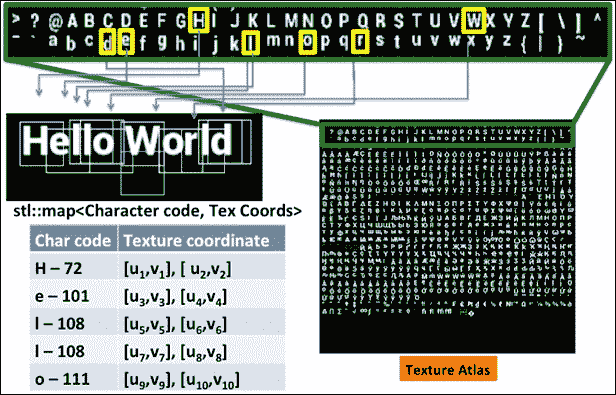
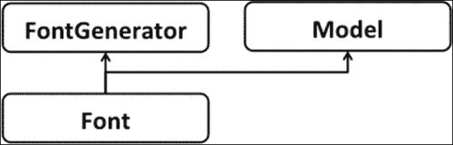
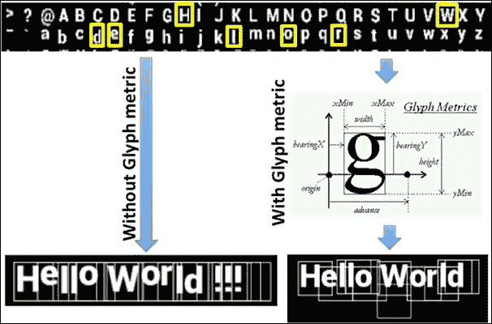
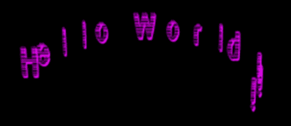
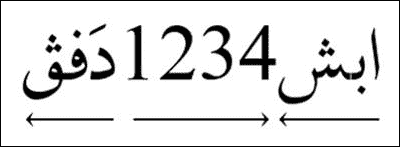
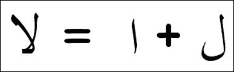
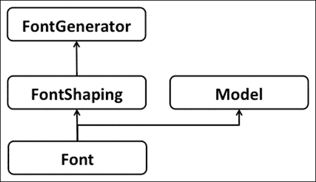
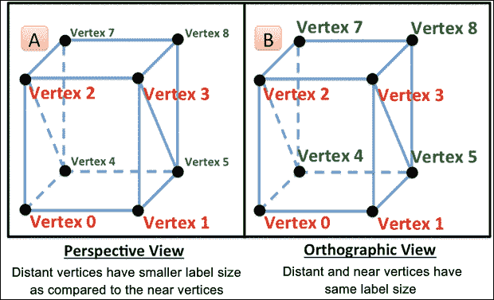
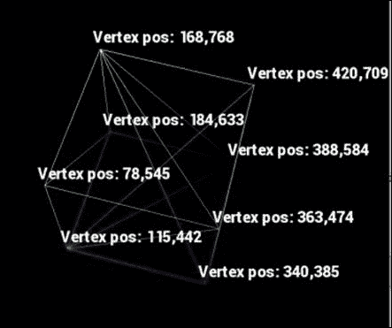

# 第八章：字体渲染

在本章中，我们将介绍以下食谱：

+   使用 FreeType 项目进行字体渲染

+   使用 Harfbuzz 渲染不同语言

+   在抬头显示（HUD）上渲染文本

# 简介

字体渲染是计算机应用程序的一个基本部分；它帮助用户以可读的形式与系统交互和理解信息。OpenGL ES 不提供内置的字体渲染支持；相反，字体引擎需要由开发者编程。有许多字体渲染技术；本章将介绍最流行的字体渲染技术，即使用**FreeType**项目和**Harfbuzz**库进行渲染。前者用于使用字体文件对符号字符或字形进行光栅化；这个库支持不同类型的字体文件格式，如 TTF、BDF、OTF、Windows FNT 等。后者库用于多语言支持。使用这个库，几乎可以渲染所有世界著名的语言脚本。

本章将提供如何构建字体引擎的详细描述；我们将使用 FreeType 实现简单的文本渲染。我们将使用 Harfbuzz 库的能力来打印多语言文本渲染，如阿拉伯语、泰语、泰米尔语、旁遮普语等。最后但同样重要的是，你将学习在屏幕坐标系上渲染文本在**抬头显示（HUD**）或叠加层上的技术。

# 使用 FreeType 项目进行字体渲染

在这个食谱中，我们将渲染一个简单的拉丁文本在 3D 空间中。为此，我们可以为每个字符创建一个纹理位图并将其渲染为四边形几何形状（矩形）。然而，创建每个字符位图在内存管理和性能方面可能是昂贵的，因为它需要在纹理内存中加载多个位图。更好的解决方案是创建一个包含所有字符的大纹理，并使用它们的纹理坐标将它们映射到几何四边形上。

使用 FreeType 库渲染字体的过程概述如下：

1.  初始化 FreeType 库。这会初始化必要的 FreeType 数据结构。

1.  加载字体面。这会加载字体文件并生成字体样式（字体面）信息。

1.  指定字体大小。使用指定的字体大小，创建一个足够大的空纹理以包含所有字形。为了使纹理与 OpenGL ES 2.0 向后兼容，选择其纹理大小为 2 的幂。

1.  访问字体面数据内容。这使用字体面和度量信息在空纹理上创建字形图像，这被称为纹理图集。字形将以行和列的形式绘制，如图下一幅图像所示。

1.  映射字形。这将在数据结构中存储从纹理图集中每个字形图像的纹理坐标，并将其映射到相应的 charcode。

1.  渲染文本。字形映射包含所有字符代码，选择所需的字符，并将从纹理着色图中映射到每个字符的四边形几何形状的相应纹理坐标。例如，以下图像显示了从纹理着色图中打印的 Hello World：

**类和数据结构**:

以下是对在字体渲染中使用的所有类和相关数据结构的简要描述：

+   `FontGenerator`: 此类在 FreeType 库的帮助下加载字体文件。它将字体文件中的重要信息存储在相关的数据结构中。它使用 FreeType 库的数据结构构建位图纹理；每个字符/字形的位图信息存储在本地快速访问的映射中：

    +   `library`: 这是 FreeType 库实例的句柄。

    +   `fontface`: 每个字体可能包含一个或多个字体面或字型；它具有特定的重量、样式、紧缩、宽度、倾斜、斜体化、装饰以及设计师或铸造厂。

    +   `glyphs`: 这是字形和字符代码的 STL 映射。

    +   `atlasTex`: 这包含着色图纹理对象的句柄。

+   `Glyph`: 此数据结构存储与字体文件中存在的字形相关的信息：

    +   `度量`: 字形度量用于在 2D/3D 空间中定位渲染的字形。

    +   `texCoordX`、`texCoordY`、`atlasX` 和 `atlasY`：这些存储纹理着色图中字形的纹理坐标。

    +   `advanceHorizontal` 和 `advanceVertical`: 进度信息有助于相对于当前字形放置下一个相邻字符。

+   `Font`: 此类继承自 `FontGenerator`，并提供加载字体文件和渲染文本的辅助函数的接口。

+   `FontSample`: 此类充当字体渲染器的消费者；它用于演示目的渲染示例文本。

以下图表显示了设计类图；`Font` 类继承自 `FontGenerator` 和 `Model`：



## 准备工作

FreeType 项目是一个用于字体光栅化的开源库；它读取字体文件，并能够从存储在文件中的矢量/曲线信息生成位图。这个库是用 ANSI-C 编写的，这使得它在各个平台上都是可移植的。

### 注意

该库在下载部分免费提供，网址为 [`www.freetype.org`](http://www.freetype.org)。

**FreeType 许可证**（**FTL**）是最常用的一个。这是一个带有信用条款的 BSD 风格许可，与 GNU 公共许可证（GPL）版本 3 兼容，但不与 GPL 版本 2 兼容。在我们的 GLPI 框架中，我们将使用 2.5.4 版本，它位于 `GLPIFramework/Font/FreeType` 文件夹下。

**构建过程**: 以下要点提供了 FreeType 库以及实现此配方所需的其他源文件的构建过程的详细描述：

+   **Android 平台**：我们需要 makefile 来构建 FreeType 项目库。在`GLPIFramework/Font/FreeType`下添加`Android.mk` makefile；编辑此 makefile，如下所示。这将编译为共享库，命名为 GLPift2\. 可选地，您也可以直接在主项目 makefile 中添加源代码，而不是编译共享库：

    ```java
    ifndef USE_FREETYPE
    USE_FREETYPE := 2.4.2
    endif
    ifeq ($(USE_FREETYPE),2.4.2)

    LOCAL_PATH:= $(call my-dir)
    include $(CLEAR_VARS)

    LOCAL_SRC_FILES:= \
    src/base/ftbbox.c src/base/ftbitmap.c \
    src/base/ftfstype.c src/base/ftglyph.c \
    src/base/ftlcdfil.c src/base/ftstroke.c\
    src/base/fttype1.c src/base/ftxf86.c \
    src/base/ftbase.c src/base/ftsystem.c \
    src/base/ftinit.c src/base/ftgasp.c \
    src/raster/raster.c src/sfnt/sfnt.c \
    src/smooth/smooth.c src/autofit/autofit.c \ src/truetype/truetype.c src/cff/cff.c \ src/psnames/psnames.c src/pshinter/pshinter.c

    LOCAL_C_INCLUDES += $(LOCAL_PATH)/builds $(LOCAL_PATH)/include

    LOCAL_CFLAGS+=-W –Wall -fPIC –DPIC -O2
    LOCAL_CFLAGS+="-DDARWIN_NO_CARBON" "-DFT2_BUILD_LIBRARY"

    LOCAL_MODULE:= libGLPift2
    include $(BUILD_SHARED_LIBRARY)
    ```

    打开位于`JNI`文件夹（`<源代码路径>/SimpleFont/Android/JNI`）下的项目目录中的`Android.mk` makefile，并包含我们之前代码中创建的 FreeType 库`Android.mk`文件的路径：

    ```java
    FONT_PATH= $(FRAMEWORK_DIR)/Font
    $(MY_CUR_LOCAL_PATH)/../../../../GLPIFramework/Font/FreeType/Android.mk
    LOCAL_C_INCLUDES += $(FONT_PATH)/FreeType/include
    LOCAL_SRC_FILES += $(SCENE_DIR)/FontGenerator.cpp \
                       $(SCENE_DIR)/Font.cpp \
                       $(SCENE_DIR)/FontSample.cpp \
                       $(SCENE_DIR)/SimpleTexture.cpp
    LOCAL_SHARED_LIBRARIES += GLPift2
    ```

    在`GLESNativeLib.java`中，编辑`GLESNativeLib`类，并添加我们的`GLPift2.so`共享库的引用以在运行时链接：

    ```java
    public class GLESNativeLib {
    static {
    System.loadLibrary("GLPift2");
       . . . . . . Other code
    }
    ```

+   **iOS 平台**：在 iOS 平台上，我们需要使用**构建阶段** | **编译源文件**项目属性将相同的 FreeType 项目源文件（在`LOCAL_SRC_FILES` makefile 变量下提到）添加到您的项目中；点击添加以选择源文件。

    使用**构建设置** | **搜索路径** | **头文件搜索路径**来为 free type 项目提供包含头文件的路径。对于当前情况，它应该是：

    ```java
    ../../../../GLPIFramework/Font/FreeType/Include
    ```

    在**Apple LLVM <编译器版本>** | **预处理器** | **预处理器宏**下添加以下预处理器宏：

    ```java
    FT2_BUILD_LIBRARY=1 DARWIN_NO_CARBON
    ```

    使用**文件** | **将文件添加到<项目名称>**添加`FontGenerator.h/cpp`、`Font.h/cpp`项目源文件和`FontSample.h/cpp`。

## 如何做到这一点...

执行以下步骤以了解实现此菜谱的程序：

1.  创建`FontGenerator`类，并将以下代码体添加到其中；重要的数据结构已在上一节中在类和数据结构部分介绍：

    ```java
    struct Glyph {
    FT_Glyph_Metrics metric; // Glyph metric
       float advanceHorizontal; // Horizontal advance
       float advanceVertical;   // Horizontal advance
       float texCoordX, texCoordY; // Atlas Texture Coords
       float atlasX, atlasY;    // Position in texture Altas
    };

    class FontGenerator {
      public:
       FontGenerator ();     // Constructor
       ~FontGenerator ();    // Destructor
       bool errorState ();     // Error check flag
       bool loadFont(const char* filename, int resolution);

       GLuint         atlasTex;     // Texture atlas handle  
       std::map<unsigned long, Glyph>  glyphs; // Glyph map
       float          texDimension;
       float          squareSize;   // Glyph square size
       LanguageType   languageType; // Current language
       FT_Face        fontFace;     // typeface information

    private:
       bool readFont (const FT_Face& fontFace,
       int resolution, int glyphMargin);

       bool getCorrectResolution(const FT_Face& fontFace,
       int resolution, int& newResolution, int& newMargin);

       void generateTexFromGlyph (FT_GlyphSlot glyph, GLubyte*
       texture, int atlasX, int atlasY, int texSize,
       int resolution, int marginSize, bool drawBorder);

       void setPixel (GLubyte* texture, int offset,
       int size, int x, int y, GLubyte val);

       bool                errorStatus;
       FT_Library          library;  // FreeType lib handle
    };
    ```

1.  确保源中包含了`<ft2build.h>`头文件。

1.  使用`FT_Init_FreeType`函数在构造函数中初始化 FreeType 库；此构造函数将在从`Renderer::createModels`函数创建 Font 类的对象时被 Font 类调用。此函数创建 FreeType 库的新实例并设置库句柄：

    ```java
    FontGenerator::FontGenerator () : errorStatus(false),
     atlasTex(0), texDimension(0), squareSize(0)  {
        if (FT_Init_FreeType(&library)){
     errorStatus = true;return;
     }
    }
    ```

1.  `loadFont`函数负责使用 FreeType 的`FT_New_Face`函数加载字体文件。此函数使用字体文件中可用的字体和样式信息创建一个新的面。例如，Arial Bold 和 Arial Italic 对应于两个不同的面。此函数调用`getCorrectResolution`函数，该函数将在下一步进行描述：

    ```java
    bool FontGenerator::loadFont(char* file,int resolution){
        // Generate the face object, return on error
        if(FT_New_Face(library,filename,0 &fontFace))
       { 
       return false;
       }

       // Check if current resolution is supported?
       int calculatedResoution; int calculatedMargin;
       if( getCorrectResolution(fontFace, resolution,
       calculatedResoution, calculatedMargin)){
       return readFont(fontFace, calculatedResoution,calculatedMargin);
       }
       return true;
    }
    ```

    在创建纹理图集之前，使用`getCorrectResolution`函数检查设备是否支持纹理大小非常重要。可以使用`GL_MAX_TEXTURE_SIZE`符号标志查询最大纹理大小。如果纹理超过最大支持的限制，此函数将回退到下一个立即较小的可用 2 的幂大小：

    ### 注意

    为此配方生成的纹理图集由 2.0 的幂组成，以便与 OpenGL ES 2.0 版本兼容。

    ```java
       bool FontGenerator::getCorrectResolution(const FT_Face&
       fontFace, int resolution, int&
       newResolution, int& newGlyphMargin){

       int glyphMargin = 0;
       GLint MaxTextureSize;
       glGetIntegerv(GL_MAX_TEXTURE_SIZE, &MaxTextureSize);

       while(resolution>0){
       glyphMargin = (int)ceil(resolution*0.1f);       
      const long numGlyphs = fontFace->num_glyphs;    
      const int squareSize = resolution + glyphMargin;

      const int numGlyphsPerRow = (int)ceilf(sqrt((double)numGlyphs));
      const int texSize         = (numGlyphsPerRow)*squareSize;
      int realTexSize           = GLUtils::nextPowerOf2(texSize);

      if(realTexSize<=MaxTextureSize )
      {    break; }

      resolution  = resolution - 5; // Decrease 5 units.
      }

      if(resolution > 0){
      newResolution   = resolution;
      newGlyphMargin  = glyphMargin;
      return true;
      }
      else{
      return false;
      }
    }
    ```

    在`readFont`函数中从 FreeType 库读取字体信息。此函数使用`FT_Set_Pixel_Sizes`以像素为单位设置字体大小：

    ```java
    bool FontGenerator::readFont (const FT_Face& fontFace,
    int resolution, int glyphMargin) {
      FT_Set_Pixel_Sizes(fontFace, resolution, resolution);
      const int numGlyphs = fontFace->num_glyphs;
      . . . .
    }
    ```

1.  `fontFace`包含有关字体文件中字符总数的信息。使用此信息和提供的字体大小，计算纹理图集的总大小为 2 的幂次维度。分配一个双通道纹理内存并存储在`textureData`变量中，用于亮度和 alpha：

    ```java
      // Inside FontGenerator::readFont() function
      squareSize = resolution + glyphMargin;

      // Texture size for all glyphs in power of 2
      const int numGlyphsPerRow = ceilf(sqrt(numGlyphs));     
       const int texSize = numGlyphsPerRow*squareSize;
       int realTexSize  = GLUtils::nextPowerOf2(texSize);

       // Two channel texture (luminance and alpha)
       GLubyte* textureData = NULL;
       textureData = new GLubyte[realTexSize*realTexSize*2];

       // if there exist an old atlas delete it. 
       if (atlasTex){ 
       glDeleteTextures(1,&atlasTex); 
       atlasTex=0; 
    }

       glGenTextures(1, &atlasTex);
       glBindTexture(GL_TEXTURE_2D, atlasTex);
       glTexParameteri
       (GL_TEXTURE_2D,GL_TEXTURE_MAG_FILTER, GL_LINEAR);
       glTexParameteri
       (GL_TEXTURE_2D, GL_TEXTURE_MIN_FILTER, GL_LINEAR);
       GLUtils::checkForOpenGLError(__FILE__, __LINE__);
    ```

1.  字体面中的每个字形都有一个唯一的索引；面对象包含一个或多个称为字符映射（charmaps）的表，用于将字形索引映射到字符码。例如，`A`在 ASCII 编码中的字符码为 65。

    遍历字体中所有可用的字形，并使用`FT_Load_Glyph`加载当前字形图像的信息。此函数将字形图像存储在称为字形槽的特殊对象中。`FT_Load_Glyph`接受三个参数，处理字体面对象、字形索引和加载标志：

    ```java
       // Inside FontGenerator::readFont() function
       int texAtlasX  = 0;      int texAtlasY  = 0;
       FT_UInt gindex = 0;   FT_ULong charcode = 0;

       for (FT_ULong charcode=FT_Get_First_Char(fontFace,
       &gindex); gindex != 0;charcode=FT_Get_Next_Char
       (fontFace, charcode, &gindex)) {

       if(FT_Load_Glyph(fontFace,gindex,FT_LOAD_DEFAULT)){
       LOGE("Error loading glyph with index %i and charcode %i. Skipping.", gindex, charcode);
       continue;
       }
       // Many lines skipped.
       }
    ```

1.  字形槽是一个容器，一次只存储一种图像。这可以是位图、轮廓等。可以使用**fontFace** | **glyph**访问字形槽对象。使用`FT_Render_Glyph` API 从字形槽生成位图信息；它接受两个参数，第一个参数是字形槽，第二个参数是渲染模式标志，它指定如何渲染字形图像。

    字形信息被加载到字形数据结构中，并以字符码作为键存储在 STL 映射`glyphs`中的值：

    ```java
       // Inside FontGenerator::readFont() function
       // This is part of the glyph loading loop.
       FT_GlyphSlot glyph = fontFace->glyph;
       FT_Render_Glyph(glyph, FT_RENDER_MODE_NORMAL);

       // Calculate glyph information
       Glyph glyphInfo;
       glyphInfo.metric     = glyph->metrics;

       // Get texture offset in the image
       glyphInfo.atlasX=texAtlasX*squareSize/realTexSize;
       glyphInfo.atlasY=texAtlasY*squareSize/realTexSize;

       // Advance stored as fractional pixel format
       // (=1/64 pixel), as per FreeType specs
       glyphInfo.advanceHorizontal=glyph->advance.x/64.0f;
       glyphInfo.advanceVertical=glyph->advance.y/64.0f;
       glyphs[charcode] = glyphInfo;
    ```

1.  使用`generateTexFromGlyph`函数在纹理图集中加载字形位图。此函数将来自字形槽的栅格信息写入纹理数据。所有字符都栅格化后，使用`glTexImage2D`的帮助将纹理图集加载到 OpenGL ES 纹理对象中，并删除本地纹理图集：

    ```java
       // Inside FontGenerator::readFont()
    {    
       . . . . .     
       // Copy the bits to the texture atlas
       generateTexFromGlyph(glyph, textureData, texAtlasX,
       texAtlasY, realTexSize, resolution, glyphMargin, false);

       texAtlasX++;
       if (texAtlasX >= numGlyphsPerRow){
       texAtlasX=0; 
       texAtlasY++; 
       }

       // set texture atlas to OpenGL ES tex object
       glTexImage2D (GL_TEXTURE_2D, 0, GL_LUMINANCE_ALPHA,
       realTexSize, realTexSize, 0, GL_LUMINANCE_ALPHA,
       GL_UNSIGNED_BYTE, textureData);

       // Delete local texture atlas 
       delete[] textureData; 
       GLUtils::checkForOpenGLError(__FILE__, __LINE__);
       texDimension = (squareSize)/(float)realTexSize;
       return true;
    }
    ```

1.  `generateTexFromGlyph`函数负责将当前指定的字形加载到字形槽中，并将其加载到由`atlasX`、`atlasY`和`texSize`指定的纹理图集中的特定位置。此函数的最后一个参数用于在字符周围绘制边框，这在调试纹理渲染中字符定位时非常有帮助。例如，参见前面的**Hello World**示例文本图像；它包含每个字符周围的边框：

    ```java
       void FontGenerator::generateTexFromGlyph (FT_GlyphSlot
       glyph, GLubyte* texture, int atlasX, int atlasY, int
       texSize,int resolution,int marginSize,bool drawBorder){

       int squareSize = resolution + marginSize;
       baseOffset=atlasX*squareSize+atlasY*squareSize*texSize;

       if (drawBorder) {
       for (int w=0; w<squareSize; w++)
       { setPixel(texture,baseOffset,texSize, w, 0, 255); }

       for (int h=1; h<squareSize; h++){
       for (int w=0; w<squareSize; w++){
       setPixel(texture,baseOffset,texSize,w,h,
       (w==0||w==squareSize-1)?255:
       (h==squareSize-1)?255:0);
                                       }
                                       }
       }

       const int gr = glyph->bitmap.rows;
       const int gw = glyph->bitmap.width;
       for (int h=0; h<gr; h++) {
       for (int w=0; w<gw; w++) {
       setPixel(texture, baseOffset+marginSize, texSize,
       w, marginSize+h, glyph->bitmap.buffer[w+h*gw]);
       }
       }
    }
    ```

1.  创建从`Model`和`FontGenerator`派生的`Font`类：

    ```java
       class Font : public Model, public FontGenerator {
       public:
       Font(const char* ttfFile, int Size, Renderer* parent,
       LanguageType Language= English);
       ~Font();
       void Render();
       void InitModel();
       void printText (const char* str, GLfloat Red = 1.0f,
       GLfloat Green = 1.0f, GLfloat Blue = 1.0f,
       GLfloat Alpha = 1.0f);
       private:
       void drawGlyph (const Glyph& gi);
       char MVP, TEX, FRAG_COLOR;
    };
    ```

    创建一个名为`fontVertex.glsl`的顶点着色器文件，并添加以下代码；此着色器文件从 OpenGL ES 程序接收顶点和纹理坐标信息。接收到的纹理坐标随后被发送到片段着色器，用于纹理采样的目的：

    ```java
    #version 300 es
    layout(location = 0) in vec3  VertexPosition;
    layout(location = 1) in vec2  VertexTexCoord;
    out vec2 TexCoord;
    uniform mat4 ModelViewProjectMatrix;

    void main( void ) {
      TexCoord      = VertexTexCoord;
      gl_Position   =ModelViewProjectMatrix  *
                      vec4(VertexPosition,1.0);
    }
    ```

1.  创建 `fontfrag.glsl` 片段着色器；它包含一个用于纹理输入的 `sampler2D` 变量和用于文本颜色的 `uniform TexColor`：

    ```java
    #version 300 es
    precision mediump float;

    in vec2 TexCoord;
    uniform sampler2D FontTexture;
    uniform vec4 TextColor;
    layout(location = 0) out vec4 outColor;

    void main() {
        vec4 texcol = texture(FontTexture, TexCoord);
        outColor    = vec4(vec3(TextColor.rgb), texcol.a);
    }
    ```

1.  在 `initModel` 函数中加载和编译着色器，并查询顶点着色器属性：

    ```java
    void Font::InitModel() {
        . . . . . // Other code . . . .
      program->VertexShader  = ShaderManager::ShaderInit
                 (VERTEX_SHADER_PRG, GL_VERTEX_SHADER);
      program->FragmentShader   = ShaderManager::ShaderInit
                 (FRAGMENT_SHADER_PRG, GL_FRAGMENT_SHADER);
      . . . . . // Other code . . . .

      MVP = ProgramManagerObj->ProgramGetUniformLocation
                 (program,"ModelViewProjectMatrix");
      TEX = ProgramManagerObj->ProgramGetUniformLocation
                 (program, (char*) "Tex1");
      FRAG_COLOR = ProgramManagerObj->ProgramGetUniformLocation
                 (program, (char*)"TextColor");
    }
    ```

1.  `drawGlyph` 函数负责渲染字形。通过映射存储在字形数据结构中的纹理坐标，在逻辑正方形上渲染字形。使用纹理单元 `0` 初始化纹理采样：

    ```java
    void Font::drawGlyph(const Glyph& gi) {
        glUseProgram(program->ProgramID);

       // Using the glyph metrics to get the glyph info.
        float xmargin = flot(gi.metric.width)/(2.0*64.0);
       float ymargin =float(gi.metric.horiBearingY)/(2.0*64.0);

        // Calculate texture coord for glyph rendering
        float texCoords[8] = {
            gi.atlasX, gi.atlasY,
            gi.atlasX + texDimension, gi.atlasY,
            gi.atlasX, gi.atlasY + texDimension,
            gi.atlasX + texDimension, gi.atlasY + texDimension
        };

        // 1x1 glyph Quad.
        float quad[12]   = {
            {-0.5f, 0.5f,  0.0f},{ 0.5f, 0.5f,  0.0f},
            {-0.5f, -0.5f, 0.0f},{0.5f, -0.5f, 0.0f }};

       for (int i = 0; i<12;){
           quad[i] *= squareSize/2.0;
           quad[i+1] *= squareSize/2.0;
           quad[i+2] *= 0.0;
           i += 3;
       }

        // Initialize the texture with texture unit 0
        glUniform1i(TEX, 0);
        TransformObj->TransformPushMatrix();
        TransformObj->TransformTranslate(-xmargin, ymargin,
                                                   0.0f );
        glUniformMatrix4fv(MVP, 1, GL_FALSE, (float*)
        TransformObj->TransformGetModelViewProjectionMatrix());
        TransformObj->TransformPopMatrix();

        // Send the vertex and texture info to shader
        glEnableVertexAttribArray(VERTEX_POSITION);
        glEnableVertexAttribArray(TEX_COORD);
        glVertexAttribPointer(VERTEX_POSITION, 3, GL_FLOAT,
             GL_FALSE, 0, quad);
        glVertexAttribPointer(TEX_COORD, 2, GL_FLOAT,
             GL_FALSE, 0, texCoords);
        glDrawArrays(GL_TRIANGLE_STRIP, 0, 4);
    }
    ```

1.  消息字符串是通过 `printText` 函数打印的。此函数遍历消息字符串并调用 `drawGlyph` 函数来渲染其中的每个字符。渲染每个字符后，下一个字形通过存储在对应字符代码的字形数据结构中的水平偏移 `advanceHorizontal` 信息来前进：

    ```java
    void Font::printText(char* str, GLfloat Red,
          GLfloat Green, GLfloat Blue, GLfloat Alpha) {
         // Initialize OpenGL ES States
         glDisable(GL_CULL_FACE);
         glDisable(GL_DEPTH_TEST);
         glEnable(GL_BLEND);
         glBlendFunc(GL_SRC_ALPHA, GL_ONE_MINUS_SRC_ALPHA);

         // Use font program
        glUseProgram(program->ProgramID);

         // Activate Texture unit 0 and assign the altas
         glActiveTexture (GL_TEXTURE0);
        glBindTexture(GL_TEXTURE_2D, atlasTex);

        TransformObj->TransformPushMatrix();
        GLfloat color[4] = {Red, Green, Blue, Alpha};
        glUniform4fv(FRAG_COLOR, 1, color);

        for (const char* c = str; *c != '\0'; c++) {
            const Glyph& gi = glyphs[((unsigned long) *c)];
            TransformObj->TransformTranslate
              (gi.advanceHorizontal/ 2.0, 0.0, 0.0);
            drawGlyph(gi);
        }
        TransformObj->TransformPopMatrix();
        return;
    }
    ```

    当前 `drawGlyph()` 的情况可以通过将多个绘制调用组合成一个来优化。如果所有字形四元组都计算并指定了它们的纹理坐标，并且这些坐标存储在顶点属性缓冲区中，则可以一次性定义和绘制多个字形。我们将把这个优化留给读者作为练习。

1.  创建一个从 `Model` 派生的 `FontSample` 类，并覆盖 `Render()` 方法以渲染示例文本，如下面的代码所示：

    ```java
    void FontSample::Render(){
        Font* English = dynamic_cast<Font*>
                    (RendererHandler->getModel(FontEnglish));
        static float angle = 0.0;
        TransformObj->TransformPushMatrix();
        TransformObj->TransformTranslate(-0.50, 0.0, 0.0);
        TransformObj->TransformRotate(angle++, 1.0, 0.0, 0.0);
        English->printText((char*)"Hello World !!!",1,1,0,1);
        TransformObj->TransformPopMatrix();
    }
    ```

1.  在 `Renderer::createModel` 函数中，加载所需字号的字体文件并添加 `FontSample` 模型。确保字体文件已添加到项目中：

    ```java
    void Renderer::createModels(){
        clearModels();
        char fname[500]= {""};
      #ifdef __APPLE__
        GLUtils::extractPath( getenv("FILESYSTEM"), fname);
      #else
        strcpy( fname, "/sdcard/GLPIFramework/Font/");
      #endif
        addModel(new Font(strcat(fname,"ACUTATR.TTF"),
           50, this, English) );
        addModel( new FontSample(this) );
    }
    ```

## 它是如何工作的...

为了正确使用 FreeType 并在使用过程中避免任何意外惊喜，初始化 FreeType 是必要的；这种初始化是在 `Font` 类的构造函数中通过使用 `FT_Init_FreeType` API 来完成的。这确保了库中的所有模块都准备好使用。初始化成功时，此 API 返回 `0`；否则，它返回一个错误并将句柄设置为 `NULL` 值。

构造函数还调用了 `loadFont` 函数；此函数使用 `FT_New_Face` API 加载字体文件并创建面对象。一个字体文件可能包含一个或多个字体面；面包含字体样式信息。它描述了给定的字体类型和样式。例如，*Times New Roman Regular* 和 *Times New Roman Italic* 对应于两个不同的面。`loadFont` 函数调用 `getCorrectResolution` 确保硬件设备支持请求的纹理大小纹理图集分配。最大纹理大小限制可以通过 `GL_MAX_TEXTURE_SIZE` 查询；如果纹理大小大于支持的限制，则回退到下一个可用的最小大小，并在 `calculatedResolution` 和 `calculatedSize` 中返回新的更新分辨率和边距大小。

`readFont` 函数使用 `FT_Set_Pixel_Size` API 设置字体大小信息。此函数接受三个参数，即字体样式、像素宽度和像素高度。字体文件中字形的总数、像素分辨率和边距大小被用来计算纹理图集的大小，该图集以 2 的幂次方分配并存储在 `textureData` 中。分配的纹理存储为两个通道信息：一个用于颜色信息，另一个用于 alpha 分量。

使用 `FT_Load_Glyph` API 遍历并加载库中存在的每个字形。这将在字形槽中加载当前字形，可以通过 `fontFace` | `glyph` 获取，并传递给 `FT_Render_Glyph`，并将位图位写入。这些位使用 `generateTexFromGlyph` 函数写入 `textureData`。在纹理中的字形写入是从左到右方向进行的。当字形的数量达到每行的最大字形数时，写入指针被设置为下一行。在 `textureData` 纹织图集纹理中写入所有字形后，创建一个 OpenGL ES 纹理对象，并使用以下信息设置它：



`Font` 类提供了纹理渲染的外部接口。这个类首先在 `initModel` 函数中初始化着色器，类似于其他 GLPI 框架模型。可以使用 `printText` 函数来渲染文本信息；此函数接受一个文本消息字符串作为第一个参数，以及 RGBA 格式的颜色信息作为接下来的四个参数。打印函数应禁用剔除和深度测试。前者测试被禁用，因为我们想查看字体在背面；否则，当纹理突然消失时，会令用户感到惊讶。后者情况有助于保持渲染在顶部的文本始终可见；我们不希望它被其他对象遮挡。必须使用 `glBlendFunc` (`GL_SRC_ALPHA`, `GL_ONE_MINUS_SRC_ALPHA`) 混合函数打开 alpha 混合。遍历每个字符打印字符串；从当前字符代码的字符映射中获取相应的字形，并将其传递给 `drawGlyph` 函数。`drawGlyph` 函数利用字形结构生成在 2D 或 3D 空间中绘制位图图像所需的信息。每个字形被渲染到一个正方形中，并使用纹理图集的纹理坐标进行映射；字形需要根据字体度量或 2D/3D 空间中的字形度量进行放置。

### 注意

字形度量包含与特定字形相关的距离信息，有助于在创建文本布局时进行定位。


## 更多内容...

`printText`函数渲染简单的文本，其中可以将转换应用于字符串以实现各种效果。我们已经看到每个字符串一次渲染为一个单独的符号。因此，可以对单个符号执行转换动画。以下图像是符号动画的示例，其中符号以圆形排列并沿*y*轴旋转：



在当前配方中，可以使用`animateText`函数以动画方式渲染符号。函数定义将在稍后解释；它接受两个额外的参数：半径和旋转，以及`printText`参数。此函数渲染以圆形排列的符号，并沿*y*轴旋转。

根据字符串中的字符数量和给定的半径，计算一个轨迹，并将每个字符放置得使其始终面向相机。这样，字母始终面向相机，无论其在*y*轴上的位置和角度如何：

```java
void Font::animateText(const char* str, GLfloat Red, GLfloat Green,
  GLfloat Blue, GLfloat Alpha,float radius,float rotation){
    // Same code as printText, reuse it
    int num_segments = strlen(str); int index = 0;
    float theta = 0;
    for (const char* c = str; *c != '\0'; c++) {
        TransformObj->TransformPushMatrix();
        TransformObj->TransformRotate(rot , 0.0, 1.0, 0.0);

         // position of character on the locus
        theta = 2.0f * PI_VAL * (index++)/num_segments;
        TransformObj->TransformPushMatrix();
        TransformObj->TransformTranslate
             (radius*cosf(theta), 0.0, radius * sinf(theta));
        const Glyph& gi = glyphs[((unsigned long) *c)];
        TransformObj->TransformRotate(-rot , 0.0, 1.0, 0.0);

       // Draw Glyph
       drawGlyph(gi);
        TransformObj->TransformPopMatrix();
        TransformObj->TransformPopMatrix();
    }
    TransformObj->TransformPopMatrix();
}
```

## 参见

+   *使用 Harfbuzz 渲染不同语言*

+   参考第七章中关于*使用 UV 映射应用纹理*的配方，*纹理和映射技术*

# 使用 Harfbuzz 渲染不同语言

FreeType 库执行光栅化操作，其中每个字符都与一个符号索引相关联；这个符号索引映射到位图图像。对于像英语这样的简单脚本，这些信息或多或少是足够的，因为英语的形状不会随着上下文而改变。例如，基于上下文，阿拉伯语有四种不同的形状形式，其中字符的形状可能取决于其自身位置或周围字符。随着 Unicode 的出现，不同语言需要能够创建符号的复杂转换，如替换、定位、双向文本、上下文敏感的形状和连字符。因此，我们需要一些特殊的库来理解语言的上下文，并为我们执行形状任务；这就是 Harfbuzz 发挥作用的地方。

Harfbuzz 是一个文本形状引擎，它管理复杂文本；它使用用户指定的语言脚本和布局方向在给定的 Unicode 文本上执行形状任务。这个库不提供文本布局或渲染。

复杂文本的一些特性如下：

+   **双向性**：从左到右和相反方向编写的/显示的文本。阿拉伯语和希伯来语脚本使用从右到左的方向。然而，包括拉丁语在内的大多数其他语言都是从左到右编写的。以下图像显示了双向顺序中英语数字和阿拉伯文本的混合。

+   **形状**：字符形状取决于上下文。例如，当阿拉伯字符与相邻字符连接时，其形状会发生变化。以下示例显示了阿拉伯语中的上下文形状。使用 Harfbuzz 渲染不同语言

+   **连字符**：连字符是一种特殊字符，它将两个或多个字符组合成一个单一字符。以下是一个阿拉伯连字符的示例。

+   **定位**：字符在垂直或水平方向上相对于给定字符进行调整；以下图像展示了泰语中定位的概念。使用 Harfbuzz 渲染不同语言

+   **重新排序**：字符的位置取决于上下文。在以下示例中，印地语文本（达拉字母）的最后一个字符在最终输出中位于倒数第二个字符之前。使用 Harfbuzz 渲染不同语言

+   **分割字符**：在这种情况下，相同的字符出现在多个位置。使用 Harfbuzz 渲染不同语言

    ### 注意

    图片来源：[`scripts.sil.org`](http://scripts.sil.org)

这个配方将展示不同类型语言的文本渲染，例如阿拉伯语、泰语、旁遮普语、泰米尔语和英语。

**类和数据结构**：

这个配方将介绍一个新的类，该类负责根据指定的语言对文本进行形状处理。

**字体形状**：这个类是从`FontGenerator`派生出来的。它继承了从 FreeType 库中必要的所有重要信息，这些信息对于光栅化是必需的。这个类使用`Harfbuzz-ng`库进行文本形状处理：



## 准备工作

`Harfbuzz-ng`库是一个用 ANSI-C 编写的开源库。这个库在 MIT 许可下免费提供。

### 注意

该库可以从[`freedesktop.org/wiki/Software/HarfBuzz/`](http://freedesktop.org/wiki/Software/HarfBuzz/)下载。

**构建过程**：以下步骤提供了对`Harfbuzz-ng`库和其他实现此配方所需源文件安装过程的详细描述：

+   **Android**：在 Android 平台上，我们需要 makefile 来构建`Harfbuzz-ng`库。在`GLPIFramework/Font/harfbuzz-ng`下添加`Android.mk` makefile。根据以下代码编辑此 makefile。这将作为一个共享库编译，并命名为`GLPiharfbuzz`：

    ```java
    LOCAL_SRC_FILES:= \
       src/hb-blob.cc src/hb-buffer-serialize.cc \
    src/hb-buffer.cc src/hb-common.cc \
    src/hb-fallback-shape.cc src/hb-font.cc \
       src/hb-ft.cc src/hb-ot-tag.cc src/hb-set.cc \
    src/hb-shape.cc src/hb-shape-plan.cc \
    src/hb-shaper.cc src/hb-tt-font.cc \
       src/hb-unicode.cc src/hb-warning.cc \
    src/hb-ot-layout.cc src/hb-ot-map.cc \
    src/hb-ot-shape.cc src/hb-ot-shape-complex-arabic.cc\
       src/hb-ot-shape-complex-default.cc \
       src/hb-ot-shape-complex-indic.cc \
       src/hb-ot-shape-complex-indic-table.cc \
       src/hb-ot-shape-complex-myanmar.cc \
       src/hb-ot-shape-complex-sea.cc \
       src/hb-ot-shape-complex-thai.cc \
       src/hb-ot-shape-normalize.cc \
       src/hb-ot-shape-fallback.cc \

    LOCAL_CPP_EXTENSION := .cc

    LOCAL_C_INCLUDES += $(LOCAL_PATH)/src external/icu4c/common \
                 $(LOCAL_PATH)/src $(LOCAL_PATH)/../freetype/include

    LOCAL_CFLAGS := -DHAVE_OT
    LOCAL_MODULE:= GLPiharfbuzz
    LOCAL_STATIC_LIBRARIES := GLPift2
    include $(BUILD_SHARED_LIBRARY)
    ```

    在`GLESNativeLib.java`中，编辑`GLESNativeLib`类并添加我们的`GLPiharfbuzz.so`共享库的引用，以便在运行时链接：

    ```java
    public class GLESNativeLib {
    static {
     System.loadLibrary("GLPiharfbuzz");
        . . . . . . Other code
    }
    ```

    在当前项目目录下 (`<源代码路径>/Localization/Android/JNI`) JNI 文件夹中打开 `Android.mk` makefile，并包含我们在 `harfbuzz` 库中创建的 `Android.mk` makefile 的路径。此外，添加以下源文件以构建此配方：

    ```java
    FONT_PATH= $(FRAMEWORK_DIR)/Font
    include $(MY_CUR_LOCAL_PATH)/../../../../GLPIFramework/Font/harfbuzz-ng/Android.mk

    LOCAL_C_INCLUDES += $(FONT_PATH)/FreeType/include
    LOCAL_C_INCLUDES += $(FONT_PATH)/harfbuzz-ng/src

    LOCAL_SRC_FILES += $(SCENE_DIR)/FontGenerator.cpp \
                       $(SCENE_DIR)/FontShaping.cpp \
                       $(SCENE_DIR)/Font.cpp \
                       $(SCENE_DIR)/FontSample.cpp \
                       $(SCENE_DIR)/SimpleTexture.cpp
    LOCAL_SHARED_LIBRARIES += GLPiharfbuzz
    ```

+   **iOS**: 在 iOS 平台上，我们需要将相同的 FreeType 项目源文件（在 `LOCAL_SRC_FILES` makefile 变量下提到）添加到您的项目中，使用 **构建阶段** | **编译源文件** 项目属性。点击添加以选择源文件。

    使用 **构建设置** | **搜索路径** | **头文件搜索路径** 提供一个路径以包含 Harfbuzz 项目的头文件。对于当前情况，应该是：

    ```java
    ../../../../GLPIFramework/Font/harfbuzz-ng/src/
    ```

    此外，使用 **文件** | **将文件添加到 <项目名称>** 添加 `FontGenerator.h/cpp`、`FontShaping.h/cpp`、`Font.h/cpp` 和 `FontSample.h/cpp`。

## 如何做...

重新使用第一个实现的配方，即 *使用 FreeType 项目的字体渲染*，然后按照以下步骤编程此配方：

1.  从 `FontGenerator` 派生出 `FontShaping` 类，并添加以下代码。这个类包含两个主要功能：`setDirectionAndScript` 和 `produceShape`：

    ```java
    class FontShaping : public FontGenerator{
     public:
        FontShaping(){ font = NULL; buffer = NULL; }
        ~FontShaping(){}
        void setDirectionAndScript
             (hb_buffer_t *&buffer, LanguageType languageType);
        bool produceShape(const char* string, vector<FT_UInt >&);

     private:
        hb_font_t  *font;
        hb_buffer_t  *buffer;
    };
    ```

1.  `produceShape` 函数负责使用 `Harfbuzz-ng` 库进行文本形状。它接受一个需要形状的字符串作为输入参数，并返回处理形状后的代码点。这些代码点不过是字形索引：

    ```java
    bool FontShaping::produceShape(const char* str, std::vector< FT_UInt >& codePoints){
        FT_UInt glyph_index = 0;
        hb_glyph_info_t *glyph_info;
        FT_Face     ft_face = fontFace; //handle to face object
        if (!ft_face)
            { return false; }

        int num_chars = (int)strlen(str);
        if (!font) { font=hb_ft_font_create(ft_face, NULL); }

        /* Create a buffer for harfbuzz to use */
        if (buffer){ hb_buffer_destroy(buffer); buffer=NULL; }

        buffer = hb_buffer_create();

        // The languageType is an enum containing enum of
        // different supported languages
       setDirectionAndScript(buffer, languageType);

        /* Layout the text */
        hb_buffer_add_utf8(buffer, str, num_chars, 0, num_chars);
        hb_shape(font, buffer, NULL, 0);

        glyph_count = hb_buffer_get_length(buffer);
        glyph_info  = hb_buffer_get_glyph_infos(buffer, 0);
        for (int i = 0; i < glyph_count; i++) {
            glyph_index = glyph_info[i].codepoint;
            codePoints.push_back(glyph_index);
        }

        if (buffer) {hb_buffer_destroy(buffer); buffer=NULL;}
        if (codePoints.size() <=0 ) { return false; }
        return true;
    }
    ```

1.  Harfbuzz 需要脚本和布局方向提示才能执行文本形状。因此，最终用户必须提供脚本类型和文本布局的方向：

    ```java
    void FontShaping::setDirectionAndScript
    (hb_buffer_t *&buffer, LanguageType languageType){
        switch( languageType ){
            case Thai:{
                hb_buffer_set_direction(buffer, HB_DIRECTION_LTR);
                hb_buffer_set_script(buffer, HB_SCRIPT_THAI);
            }break;

            case Punjabi:{
                hb_buffer_set_direction(buffer, 
                                      HB_DIRECTION_LTR);
                hb_buffer_set_script(buffer, 
                                      HB_SCRIPT_GURMUKHI);
            }break;

            case Arabic:{
                hb_buffer_set_direction(buffer, 
                                      HB_DIRECTION_RTL);
                hb_buffer_set_script(buffer, HB_SCRIPT_ARABIC);
            }break;

            case Tamil:{
                hb_buffer_set_direction(buffer,
                                      HB_DIRECTION_LTR);
                hb_buffer_set_script(buffer, HB_SCRIPT_TAMIL);
            }break;

            default:{
                hb_buffer_set_direction(buffer,
                                      HB_DIRECTION_LTR);
                hb_buffer_set_script(buffer, HB_SCRIPT_COMMON);
            }break;
        }
    }
    ```

1.  在 `FontGenerator::readFont` 函数中，替换以下代码。这将有助于在文本形状后映射 Harfbuzz 生成的代码点：

    ```java
    for (FT_ULong charcode=FT_Get_First_Char(fontFace, &gindex);
           gindex != 0; charcode=FT_Get_Next_Char
          (fontFace, charcode, &gindex)) { . . }
    ```

    用此代码替换前面的代码：

    ```java
    for(int myc = 0; myc < numGlyphs; myc++) {  . . . }
    ```

1.  关于在 `FontGenerator::readFont` 函数中进行的先前代码更改，替换 `Font::printText` 函数中的以下代码：

    ```java
        for (const char* c = str; *c != '\0'; c++) {
            const Glyph& gi = glyphs[((unsigned long) *c)];
            TransformObj->TransformTranslate
                 (gi.advanceHorizontal / 2.0, 0.0, 0.0);
            drawGlyph(gi);
        }
    ```

    用此代码替换前面的代码：

    ```java
        std::vector< FT_UInt > codePointsPtr;
      int glyph_count = 0;
      if ( !produceShape(str, codePointsPtr, glyph_count) ){
         LOGI("Error in producing font shape");return;}

      glyph_count = (int) codePointsPtr.size();
      FT_UInt glyph_index = 0;
      for (int i = 0; i < glyph_count; i++) {
          glyph_index = codePointsPtr.at(i);
          const Glyph& gi = glyphs[glyph_index];
          TransformObj->TransformTranslate
              (gi.advanceHorizontal / 2.0, 0.0, 0.0);
          drawGlyph(gi);
      }
    ```

1.  在 `Renderer::createModels` 函数中，根据支持的语言添加必要的字体文件：

    ```java
    void Renderer::createModels(){
       clearModels();
       . . . . // Other code . . .
       addModel( new Font(strcat(fname,"ae_Nagham.ttf"),
             50, this, Arabic) );
       addModel( new Font(strcat(fname,"Roboto-Black.ttf"),
             50, this, English) );
       addModel( new Font(strcat(fname,"DroidSansThai.ttf"),
             50, this, Thai) );
       addModel( new Font(strcat(fname,"Uni Ila.Sundaram-03.ttf"),
            50, this, Tamil) );
       addModel(new Font(strcat(fname,"AnmolUni.ttf"),
            50, this, Punjabi) );
        addModel( new FontSample(this) );
    }
    ```

    

## 它是如何工作的...

在当前配方中渲染字体的工作逻辑与上一个配方相同。因此，强烈建议在阅读本节之前先了解第一个配方，本节将仅涵盖文本形状的工作概念。

这个配方介绍了一个名为 `FontShaping` 的新类，它是由 `FontGenerator` 派生出来的。从现在起，`Font` 类将继承自 `FontShaping`，而不是 `FontGenerator`。`FontShaping` 类是文本形状的核心引擎。内部，这个类使用了 `Harfbuzz-ng` 库。

我们在`Font::printText`函数中发送 UTF-8 编码作为多语言文本渲染的输入参数。这个函数调用`FontShaping::produceShaping`，它除了接受 UTF-8 文本外，还接受一个额外的参数，即从该函数返回给调用函数的代码点向量列表。代码点基本上是字体文件中符号的索引。在多语言文本渲染中，我们使用了符号的索引而不是符号映射中的字符代码。

`Harfbuzz-ng`库使用它自己的临时缓冲区（`hb_buffer_t`类型）来计算形状信息；这个临时缓冲区是通过`hb_buffer_create` API 分配的。创建的缓冲区用于在`setDirectionAndScript`函数中设置文本布局方向（`hb_buffer_set_direction`）和语言脚本（`hb_buffer_set_script`）。

使用`hb_buffer_add_utf8` API 并提供 UTF8 编码的文本到`Harfbuzz`库。此外，还需要从 FreeType 获取字体面信息以创建自己的字体（`hb_font_t`）。这个字体是通过`hb_ft_font_create` API 创建的。`hb_shape` API 为输入字符串执行形状任务。它接受`hb_font_t`和`hb_buffer_t`对象作为参数。

在库中完成形状过程后，符号的数量可能会改变。`hb_buffer_get_length` API 提供了新的符号计数。可以通过`hb_buffer_get_glyph_infos` API 检索形状信息，该 API 返回包含所有符号代码点的`hb_glyph_info_t`对象。这些代码点收集在一个向量列表中，并返回到`printText`函数。确保在过程结束时释放临时缓冲区。

在`Font::printText`中，从向量列表中检索`codePoint`或符号索引，并以相同的方式渲染（我们在第一个菜谱中描述过）。

## 参见

+   *使用 FreeType 项目进行字体渲染*

# 在抬头显示（HUD）上渲染文本

在屏幕坐标系上渲染文本是打印文本的一个非常常见的用例。HUD，也称为叠加层，允许你在正常场景之上渲染文本。场景对象的深度不会改变文本的大小。HUD 的例子包括菜单项、状态栏、游戏计分板等。

技术上，HUD 是一个正交视图，其中左、右、上、下四个方向的尺寸设置为场景视口的尺寸。在这个菜谱中，我们将打印旋转 3D 立方体的顶点位置到屏幕坐标。立方体中的所有顶点（近或远）都有相同大小的文本。它不受顶点与相机位置距离的影响：



在当前配方中，我们将重用第二章中的*OpenGL ES 3.0 绘图 API*配方，*OpenGL ES 3.0 基础*。这将渲染一个在 3D 空间中旋转的立方体。我们将使用 HUD 机制来显示屏幕坐标中每个顶点的位置。

## 准备工作

重用上一个配方，*使用 Harfbuzz 渲染不同语言*，并添加来自另一个配方*OpenGL ES 3.0 绘图 API*的以下文件，第二章，*OpenGL ES 3.0 基础*：

1.  打开`Cube.h`和`Cube.cpp` GL ES 程序文件

1.  打开`CubeVertex.glsl`和`CubeFragment.glsl` GLSL 着色器文件

## 如何做到这一点...

以下指令将提供一个逐步过程来实现 HUD：

1.  编辑`Cube.h`/`cpp`并定义一个名为`GetScreenCoordinates`的新方法。这将从立方体顶点的逻辑坐标生成屏幕坐标并将它们收集在`screenCoordinateVector`向量列表中。对于导入的着色器不需要进行任何更改：

    ```java
    void Cube::GetScreenCoordinates(){
        // Get Screen Coordinates for cube vertices
        int   viewport_matrix[4];
        float screenCoord[3];
        glGetIntegerv( GL_VIEWPORT, viewport_matrix );
        screenCoordinateVector.clear(); // Clear vector

        for(int i=0; i<sizeof(cubeVerts)/(sizeof(GLfloat)*3);i++){
            GLfloat x = cubeVerts[i][0]; // Vertex X coordinate
            GLfloat y = cubeVerts[i][1]; // Vertex Y coordinate
            GLfloat z = cubeVerts[i][2]; // Vertex Z coordinate

            int success = TransformObj->TransformProject
                   (x, y, z,
                   TransformObj->TransformGetModelViewMatrix(),
                   TransformObj->TransformGetProjectionMatrix(),
                   viewport_matrix, &screenCoord[0],
                   &screenCoord[1], &screenCoord[2]);

           if (!success)
              {memset(screenCoord,0,sizeof(float)*3);continue;}
            int screenX  = screenCoord[0];
            int screenY  = viewport_matrix[3] - screenCoord[1];
            screenCoordinateVector.push_back
                         (glm::vec2(screenX,screenY));
        }
    }
    ```

1.  在渲染原语之后，在`Cube::Render`函数中调用`GetScreenCoordinates`。对于这个配方，我们将渲染原语从`GL_TRIANGLES`更改为`GL_LINE_LOOP`：

    ```java
    void Cube::Render(){

      . . . . Other Rendering Code . . . .
       glVertexAttribPointer(attribVertex, 3, GL_FLOAT,
                GL_FALSE, 0, vertexBuffer);
       glDrawArrays(GL_LINE_LOOP, 0, 36);
       GetScreenCoordinates();
    }
    ```

1.  在`FontSample.h`/`cpp`中创建一个名为`HeadUpDisplay`的函数；这个函数将负责设置正确的投影系统和其尺寸以用于抬头显示。HUD 的投影系统必须是正交的，尺寸必须设置为视口尺寸：

    ```java
    void FontSample::HeadUpDisplay(int width, int height){
        TransformObj->TransformSetMatrixMode( PROJECTION_MATRIX );

        TransformObj->TransformLoadIdentity();
        // Left ,Right ,Bottom , Top, Near, Far
        TransformObj->TransformOrtho(0, width, 0, height,-1,1);

        TransformObj->TransformSetMatrixMode( VIEW_MATRIX );
        TransformObj->TransformLoadIdentity();

        TransformObj->TransformSetMatrixMode( MODEL_MATRIX );
        TransformObj->TransformLoadIdentity();
    }
    ```

1.  在`FontSample::Render()`中，在渲染任何绘图原语之前调用`HeadUpDisplay`函数。这将启用 HUD 查看。从`Cube`类获取向量列表，并使用`Font::printText`函数渲染顶点位置：

    ```java
    void FontSample::Render(){
        int viewport_matrix[4];
        glGetIntegerv( GL_VIEWPORT, viewport_matrix );
        HeadUpDisplay(viewport_matrix[2], viewport_matrix[3]);

        Font* English = dynamic_cast<Font*>
                       (RendererHandler->getModel(FontEnglish));
        Cube* cubeObject = dynamic_cast<Cube*>
                        (RendererHandler->getModel(CubeType));
        std::vector<glm::vec2>* vertexVector =
                       cubeObject->getScreenCoordinateVertices();

        char buffer[500];
        for(int i = 0; i<vertexVector->size(); i++) {
            TransformObj->TransformPushMatrix();
            TransformObj->TransformTranslate
            (vertexVector->at(i).x, vertexVector->at(i).y, 0.0);
            TransformObj->TransformScale(2.0, 2.0, 2.0);
            memset(buffer, 0, 500);
            sprintf(buffer, "Vertex pos: %d,%d", (int)
            vertexVector->at(i).x, (int)vertexVector->at(i).y);
            English->printText(buffer, 1.0, 1.0, 1.0, 1.0f );
            TransformObj->TransformPopMatrix();
        }
    }
    ```

## 工作原理...

HUD 的投影系统必须始终处于正交视图中。`FontSample::HeadUpDisplay`函数使用`Transform::TransformOrtho` API 将投影矩阵设置为正交视图。它接受八个参数，其中左右和上下必须指定与视口尺寸匹配的正确尺寸。将`Model`和`View`设置为单位矩阵：

```java
TransformObj->TransformSetMatrixMode( PROJECTION_MATRIX );
TransformObj->TransformLoadIdentity();
// Left, Right, Bottom, Top, Near, Far
TransformObj->TransformOrtho(0, width, 0, height,-1,1);
```

在渲染原语之前必须调用`HeadUpDisplay`函数。对于这个配方，我们从`Cube`类收集了每个顶点的屏幕坐标，并使用`Font::printText`函数以及它们各自的屏幕坐标位置来显示它们。顶点的屏幕空间坐标可以使用`Transform::TransformProject`函数在逻辑坐标系中计算：



## 参考信息

+   *使用 Harfbuzz 渲染* *不同语言*

+   参考第二章理解 GLPI 中的投影系统中的配方

+   请参考第二章中的*OpenGL ES 3.0 绘图 API*配方，*OpenGL ES 3.0 基础*
