# 第十章. 使用场景图进行场景管理

在本章中，我们将涵盖以下食谱：

+   使用场景图实现第一个场景

+   添加局部和相对变换

+   在场景图中添加父子支持

+   使用变换图创建复杂模型

+   使用光线追踪技术实现拾取

+   实现二维纹理按钮小部件

+   使用相机系统导航场景

+   实现具有多个视图的场景

# 简介

在我们之前的所有章节中，我们都是以模型为中心的方式编写各种食谱，其中有一个引擎管理器（渲染器）负责为模型执行所有必要的渲染活动。这种方法对于学习目的来说很棒，但在实际应用中，我们需要可扩展性和可管理性，以便轻松处理多个复杂场景。本章将介绍场景图范式，它允许您有效地编程和管理复杂场景。

**基于场景图的架构**：我们在现有食谱中使用的当前设计包含一个渲染引擎，它与其他辅助类协同工作以渲染程序模型。这种简单的架构非常适合快速原型设计。这一点已经在之前章节的所有食谱中得到了证明。

现代三维图形应用不仅限于在三维空间中渲染少量对象块，真正的挑战是产生一个顶级的图形引擎，以满足所有现代图形要求。这包括优化渲染涉及节点层次结构的复杂场景，包括迷人的着色效果、状态、语义逻辑、细节级别、事件处理、地理空间服务等等。为了满足这些要求，现代三维图形应用使用基于场景图的架构。场景图架构封装了完整三维场景的层次结构，主要包含两个方面：语义和渲染。语义方面就像一个数据库，它管理视觉表示和状态管理。想象一下，它就像一个视觉数据库，告诉图形系统即将出现的场景和未使用的场景，以便它可以与其资源一起释放，以实现更好的优化和内存管理。另一方面，渲染方面处理可绘制实体或模型的生命周期管理，包括初始化、反初始化、处理、控制管理和在屏幕上显示它们。

场景图是一个庞大且不断发展的主题。涵盖其所有（要求）方面超出了本标题的范围。在本章中，我们将创建一个小的架构，允许你管理多个场景；每个场景可以包含多个灯光、相机和模型。可以使用父子关系以及局部和相对变换来创建复杂模型。模型可以动态地应用于预定义的材料，所有这些操作都将在外部图形引擎的单独 C++文件中完成。这将保持场景图层次逻辑在单一位置，以便易于管理。

**与现有设计的区别**：本章利用我们现有的渲染引擎知识来产生基于场景图的架构。现有设计主要包含渲染器和模型类。前者负责管理模型、创建单个视图和处理事件。另一方面，后者包含灯光、材料，执行事件处理过程，并渲染 3D 对象。

对于实时 3D 应用程序，我们需要扩展我们的设计以满足场景图架构的要求：

+   **层次关系**：系统的各个模块可以以层次化的方式排列。例如，`Application`模块内部包含`Renderer`模块，并且应用程序以单例模式运行。然而，它可以产生许多线程以运行每个渲染器实例。每个`Renderer`实例包含一个`Scene`模块，该模块包含`Model`和`Camera`。场景模块可以从不同的相机创建不同的视图，以可视化屏幕上模型的渲染。

+   **父子关系对象**：类似类型的对象必须支持父子关系。在父子关系中，父对象自动管理所有子对象。这样，语义和渲染可以以优化的方式进行管理。

+   **变换图**：系统中的每个可渲染对象都存储了相对于其父对象的变换。为了理解这一点，让我们以一个简单的 3D 模型汽车为例，该汽车由四个轮胎、四个车门和车身组成。如果我们想在*x*轴方向上平移这个汽车 2 个单位，那么使用现有设计，我们需要将汽车的九个部分都移动 2 个单位。然而，如果我们将车门和轮胎作为汽车车身的子对象，那么我们就不需要担心移动所有九个部分；只需要移动父部分（车身）就足够了。

+   **多个场景管理**：在现有设计中，创建多个场景是不可能的；实际上，所有内容都被绘制为一个单独的场景。

+   **分离语义和渲染**：对象的渲染必须与语义松散耦合。渲染输出可能受到许多因素的影响，例如状态变化、用户输入或两者兼有。设计应该足够灵活，以管理状态和事件。

+   **细节级别**（**LOD**）：LOD 使用对象的计算信息，并揭示它距离摄像机视图或观察者的距离。如果对象位于视锥体之外，则可以在消耗系统关键资源之前忽略它。视锥体视图中的对象，如果远离摄像机，则可以以较低的保真度渲染，可以使用较少的多边形和小纹理。

+   **状态封装**：在系统中，每个节点或对象包含一个能够揭示对象本质的状态是很重要的。这样可以通过遍历父子层次结构将几种类似类型的对象组合在一起；这将非常高效地避免随机状态切换，例如，纹理加载和绑定。

本章将带我们通过一种系统的方法来开发场景图：

+   **在场景图中实现第一个场景**（**菜谱 1**）：本菜谱将构建场景图的基础，其中它将支持场景、模型、灯光和材质模块。建模将在渲染引擎之外的 `NativeTemplate.cpp` 中完成。

+   **添加局部和相对变换**（**菜谱 2**）：本菜谱将局部和相对变换概念引入现有的场景图中。局部变换仅适用于可渲染对象内部，而相对变换则从父对象接收并传播到其子对象。

+   **在场景图中添加父子支持**（**菜谱 3**）：本菜谱将在类似类型的对象之间建立父子关系。

+   **使用变换图创建复杂模型**（**菜谱 4**）：本菜谱将利用之前的菜谱概念，并演示如何构建复杂的动画模型，例如旋转的风车。

+   **使用光线追踪技术实现拾取**（**菜谱 5**）：本菜谱将为场景图添加事件支持，并帮助实现基于光线追踪的拾取技术，允许你在场景中选择 3D 对象。

+   **实现 2D 纹理按钮小部件**（**菜谱 6**）：实现 2D 小部件使用屏幕坐标系。本菜谱包含另一个子菜谱，该子菜谱实现了在按钮小部件上点击。

+   **使用摄像机系统导航场景**（**菜谱 7**）：本菜谱将实现摄像机对场景的支持。

+   **使用多个视图实现场景**（**菜谱 8**）：本菜谱使场景图形能够将多个视图渲染到单个场景中。

# 使用场景图实现第一个场景

让我们从查看现有引擎的块图（左侧）和新的预期场景图设计（右侧）开始。此设计被划分为许多更简单的可重用模块，其中每个模块在图像本身中都是自解释的。`Object`模块是大多数其他模块的基类。这些模块表现出父子关系。同样，支持事件处理过程的模块必须从`Event`继承。

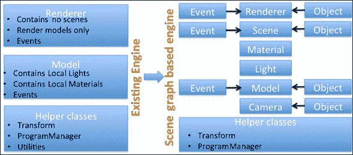

在以下图像中，您可以看到场景图中不同模块之间的层次关系。`Renderer`是一个包含各种场景的图形引擎。这些场景可以动态地添加到和从渲染引擎中移除。根据需要，场景包含一个或多个相机；它还包含场景需要渲染的模型。

变换在模型-视图-投影类比中管理，其中建模变换在`Model`模块中执行，而投影和视图变换在`Camera`模块中计算。正如我们所知，任何可渲染的对象都必须从`Model`类派生，它表现出父子关系，其中父类完全负责管理其子类的生命周期。系统中的事件按自上而下的方向流动，原生应用程序接收事件并将它们传递给`Renderer`，然后`Renderer`进一步将事件传播到场景。场景检测事件属于哪个视图，并将事件发送到所有相应的模型派生类，在那里最终处理：

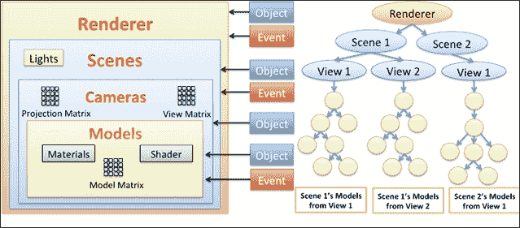

## 准备工作

这个第一个配方将实现介绍部分中先前描述的场景图架构的基本结构。对于这个配方，我们将实现`Renderer`、`Scene`、`Light`和`Material`模块。对于`Model`类，更改非常小。在场景图方法中，由于添加了其他模块，`Renderer`已经简化。随着我们继续到后续的配方，我们将进一步将复杂性分解为更简单的模块：


在下一节中，我们将了解实现第一个场景的逐步过程。这个配方构建了场景图的基类，我们将描述类结构和重要成员函数的定义。

### 小贴士

在这个配方中，可能无法编写所有函数的定义。我们将建议读者遵循本章示例代码中提供的`SG1_withSceneLightMaterial`配方来查看完整的源代码。

## 如何操作...

实现场景图架构的步骤如下：

1.  在 `RendererEx.h` 中创建新的 `Renderer` 类；与旧版本相比，这个新版本有非常少的代码。它管理它包含的所有场景，并负责生命周期，如初始化和渲染：

    ```java
       class Renderer{
       std::vector <Scene*> scenes; // Scene List   

    public:
    void initializeScenes();     // Initialize Engine
    void resize( int w, int h );// resize screen
    void render();             // Render the Scenes
    void addScene(Scene* scene);// Add new scene
       bool removeScene( Scene* scene); // Remove the scene
    };
    ```

1.  定义 `RendererEx.cpp` 的成员函数，如下面的代码所示：

    ```java
    // When renderer initializes it initiates each Scene
    void Renderer::initializeScenes(){ 
         for( int i=0; i<scenes.size();  i++ )
                scenes.at(i)->initializeScene();
    }

    // Resize all the scenes to adapt new window size
    void Renderer::resize( int w, int h ){
      for( int i=0; i<scenes.size();  i++ )
        scenes.at(i)->resize(w, h); 
    }

    // Add a new Scene into the rendering engine
    void Renderer::addScene( Scene* scene){
      if(!scene) return;

      for( int i=0; i<scenes.size();  i++ ){
          if(scenes.at(i) == scene ){
              return; // If already added return;
          }
      }

      scenes.push_back( scene );
      scene->setRenderer(this);
    }

    // No longer need a scene, then remove it
    bool Renderer::removeScene(Scene* scene){
      for( int i=0; i<scenes.size();  i++ ){
    if(scenes.at(i) == scene){
    scenes.erase(scenes.begin()+i); 
    return true; 
    }
      }
      return false;
    }

    // Render Each Scene
    void Renderer::render(){ 
        glClearColor(0.0f, 0.0f, 0.0f, 1.0f);
        glClear(GL_COLOR_BUFFER_BIT|GL_DEPTH_BUFFER_BIT);

        for( int i=0; i<scenes.size();  i++ )
            scenes.at(i)->render();
    }
    ```

1.  在 `Light.h`/`.cpp` 中创建 `Light` 类并实现它，如下面的代码所示：

    ```java
    class Light {
      private:
        int lightID;
      public:
        Material material;
        glm::vec4 position;
        GLfloat constantAttenuation, linearAttenuation,
                quadraticAttenuation;
        Light() {}
        Light(Material mt, glm::vec4 p, GLfloat ca = 1.0,
                   GLfloat la = 0.2, GLfloat qa = 0.05) {
            material                = mt;
            position               = p;
            constantAttenuation    = ca;
            linearAttenuation      = la;
            quadraticAttenuation   = qa;
            enabled                = false;
        }
    };
    ```

1.  同样，创建 `Material.h`/`.cpp` 并实现 `Material` 类，如下所示：

    ```java
    class Material{
    public:
       glm::vec4 ambient, diffuse, specular;
       GLfloat shines;
       std::string name;
    MaterialType typeOfMaterial;
       Material(glm::vec4  ambient, glm::vec4 diffuse,
     glm::vec4 specular, GLfloat shiness);
       Material(const Material & p);
    Material & operator = (const Material & p);
    Material(MaterialType type = MaterialNone);
    };
    ```

1.  定义一些常见的材料类型。有关更多信息，请参阅本菜谱的示例代码：

    ```java
    typedef enum {
        MaterialNone,
        MaterialGold,
        MaterialCopper,
    } MaterialType;

    // Copper Material
    const vec4 CopperAmbient(0.19f, 0.07f, 0.022f, 1.0f);
    const vec4 CopperDiffuse(0.70f, 0.27f, 0.082f, 1.0f);
    const vec4 CopperSpecular(0.2f, 0.13f, 0.086f, 1.0f);
    const GLfloat   CopperShiness = 2.8f;

    // Gold Material
    const vec4 GoldAmbient(0.24f, 0.19f, 0.07f, 1.0f);
    const vec4 GoldDiffuse(0.75f, 0.60f, 0.22f, 1.0f);
    const vec4 GoldSpecular(0.62f,0.55f, 0.36f, 1.0f);
    const GLfloat   GoldShiness=51.2f;
    ```

    ### 注意

    所有浮点数据类型（`GLfloat` 或 `float`）变量都应明确声明，并在末尾带有额外的 `f` 标志。否则，在赋值时，变量将被视为双精度类型，并转换为浮点类型，这将极大地降低性能。

1.  在 `Scene.h` 中创建一个场景类。它管理其内部包含的模型。目前，它内部不包含任何相机。我们将在本章后面添加相机。场景为模型提供许多服务，例如管理着色器程序、转换服务、模型的渲染等。每个场景都可以通过一个独特的名称来识别。在渲染每个模型时，场景在 `currentModel` 中维护当前渲染模型的引用：

    ```java
    class Scene{
    public:
    Scene(string name="",Renderer* parentObj = NULL);  virtual ~Scene(void);       // Destructor
       void initializeScene();      // Initialize Scene
       inline ProgramManager* SceneProgramManager(){
     return &ProgramManagerObj; }
        inline Transform*  SceneTransform() {
     return &TransformObj;  }
        void render();              // Render the Models
        void initializeModels();    // Initialize Models
        void clearModels();         // Remove models
        void addModel( Model* );   // Add into model list
        void addLight( Light* );   // Add lights
        Renderer* getRenderer();    // Get scene's renderer
        void setUpProjection();      // Set projection
        std::vector<Light*>& getLights(){ return lights; }

    private:
        ProgramManager   ProgramManagerObj;
        Transform      TransformObj;
        vector<Model*> models; // Model's List
        vector<Light*> lights; // Light's List
        Renderer* renderManager;  // Scene's Renderer
        Model* currentModel;   // Current Model in use
    };
    ```

1.  场景包含多个光源和模型；这些模型和光源是通过在 `Scene.cpp` 中定义的 `addModel` 和 `addLight` 函数添加到场景中的：

    ```java
    void Scene::addModel(Model* model){
        if(!model) { return; }
    models.push_back( model );
    model->setSceneHandler(this);
    }

    void Scene::addLight( Light* lightObj){
        for(int i =0; i<lights.size(); i++){
            if(lights.at(i) == lightObj) return;
        }
        lights.push_back(lightObj);
    }
    ```

1.  在 `ModelEx.h` 中创建 `Model` 类。这个 `Model` 类的新版本包含了材料和父场景对象：

    ```java
    class Model {
    public:
       Model(Scene* SceneHandler, Model* model,
            ModelType type, string objectName="");  

       // Define setter and getter function for Scene
       // and material class. 

    // Reuse the older Model class existing methods

    protected:
       Scene*  SceneHandler; 
    Material materialObj;
    };
    ```

1.  由于 `ObjLoader` 类也是 `Model` 类的派生类，它也必须包含它将执行的场景的引用。修改 `ObjLoader` 构造函数以保留场景引用，并创建两个新函数 (`ApplyLight`，`ApplyMaterial`) 来应用光照和材料信息：

    ```java
    class ObjLoader : public Model{
    public:
        // Constructor for ObjLoader
        ObjLoader( Scene* parent, Model* model, MeshType
     mesh, ModelType type);
        void ApplyLight();   // Apply scenes light
        void ApplyMaterial();// Object's material

        // Rest of the function are same, for more info please
        // refer to SG1_withSceneLightMaterial recipe.
    };
    ```

1.  在将网格对象渲染到 `ObjLoader::render` 方法之前，必须应用新的光照和材料应用方法，如下面的代码所示：

    ```java
    void ObjLoader::Render(){
        glUseProgram(program->ProgramID);
        ApplyMaterial();
        ApplyLight();

        // Apply Transformation.
     // Bind with Vertex Array Object for OBJ

        // Draw Geometry
        glDrawArrays(GL_TRIANGLES, 0, IndexCount );
        glBindVertexArray(0);
    }
    ```

1.  在 `NativeTemplate.cpp` 中，在 `GraphicsInit` 函数中创建一个场景，并向其中添加一个光源和网格对象。通过将这些对象添加到引擎中来执行场景：

    ```java
    Renderer* engine   = NULL; 
    ObjLoader* Suzzane = NULL; 
    Scene* scene1      = NULL;

    bool GraphicsInit(){
      // Create a new Renderer instance 
       engine = new Renderer(); 

    // Add a new scene named "Mesh Scene" to engine
       scene1 = new Scene("MeshScene", engine);

       // Create a new light and set into the scene
       scene1->addLight(new Light(Material(MaterialWhite)
     ,glm::vec4(0.0, 0.0, 10.0, 1.0)));

       // Create Suzzane,added into the scene1.
       Suzzane = new ObjLoader(scene1,NULL,SUZZANE,None);
    Suzzane->SetMaterial(Material(MaterialCopper));

       // Add Suzzane into Scene 
    scene1->addModel( Suzzane); 

    // Initialize engine 
    engine->initializeScenes(); 
    }
    ```

1.  同样，`GraphicsRender` 函数渲染网格模型并更新场景和相关模块。在本菜谱中，它每秒对网格模型应用各种预定义的材料类型：

    ```java
    bool GraphicsRender(){
        static int i=0;   static clock_t start = clock();
     // Switch material each second
        if(clock()-start > CLOCKS_PER_SEC){
            start = clock(); 
            (i %=6)++; //Plus one to avoid None type

           // Assign a new material   
            Suzzane->SetMaterial(Material(MaterialType(i)));
        }
       engine->render();
    }
    ```

## 它是如何工作的...

与早期重载版本相比，场景图模型中的`Renderer`类高度简化；`Scenes`是`Renderer`类的容器。场景必须动态创建并添加到渲染引擎中。同样，它可以从引擎中移除，这允许您节省重要的内存资源和 CPU 周期。每个场景都有一个唯一名称，可以用于从引擎中检索场景；场景与灯光和模型具有包含关系。每个场景可以有多个灯光。然而，当前实现仅支持单个灯光；模型从它们各自的场景中检索灯光信息。模型类的实现没有太大变化，除了从现在开始，材质可以使用场景的灯光信息在运行时应用。场景图允许在没有任何开销的情况下从一个场景共享模型到另一个场景，从而使其非常灵活。

### 注意

为了区分旧版图形引擎中基于场景图架构的`Renderer`和`Model`类，新类文件名后缀为`Ex`（`RendererEx.h`/`.cpp`，`ModelEx.h`/`.cpp`）。

场景图架构允许您在引擎外部创建场景建模和控制逻辑；这是一种更通用和预期的编程方式。此配方使用`NativeTemplate.cpp`作为建模和渲染的外部文件。在此文件中，初始化场景在`GraphicsInit()`中完成。首先，创建`graphicsEngine`渲染引擎对象。此引擎设置为名为`scene1`的`Scene`对象，`Scene`的参数化构造函数包含其名称和它所在的渲染引擎的父对象。场景包含一个位于*z*方向 10 个单位处的白色光源。

`Model`对象，即`Suzzane`，是使用`ObjLoader`的参数化构造函数创建的，并应用于预定义的铜色材质类型。

场景在`GraphicsRender()`中控制。在此函数中，各种类型的材质在每秒正常间隔后运行时应用，如下所示：

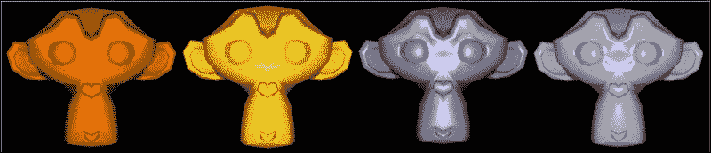

## 参见

+   请参阅第二章中的*使用 GLPI 框架构建原型*配方，*OpenGL ES 3.0 基础*。

# 添加局部和相对变换

变换可以分为两种类型：

+   **局部变换**：此类变换仅适用于对象本身；它不会影响其子对象。例如，如果两个对象之间存在父子关系，那么应用局部缩放变换将不会缩放子对象。

+   **相对变换**：此类变换相对于对象的父对象应用。在这里，父对象的变换被传播到子对象，从而影响 3D 空间中的几何顶点位置。例如，在本例中，对父对象的缩放变换将缩放所有子对象及其子对象。

    ### 注意

    如果一个对象没有父对象（称为`root`对象），则 OpenGL ES 坐标系将被视为其父对象。下一个配方将讨论更多关于父子关系的内容。

此配方将创建两个网格对象（`Torus`，`Suzzane`）并产生类似于月亮（`Suzzane`）围绕地球（`Torus`）公转的效果。月亮不仅围绕地球公转，同时也在围绕自己的轴旋转。

### 注意

关于 3D 变换内部机制的更多信息，您可以参考第二章中“使用模型、视图和投影类比实现场景”的配方，*OpenGL ES 3.0 基础*。本主题涵盖了各种类型的变换、变换矩阵约定、齐次坐标以及变换操作，如平移、缩放和旋转。

## 准备工作

此配方需要第一个配方作为先决条件；建议您理解第一个配方的实现。您可以在本章提供的示例代码中找到当前配方（`SG2_withSG1+Transformation`）的源代码。

## 如何操作…

下面是实现现有场景图架构中局部和相对变换的步骤：

1.  在`ModelEx.h`中，向`Model`类中添加以下成员变量。这些变量负责存储局部和相对变换矩阵。它还有一个变换的原点中心：

    ```java
         mat4 transformation; mat4 transformationLocal; vec3 center;
    ```

1.  前往`ModelEx.cpp`并实现局部变换函数和相对变换函数：

    ```java
       // Many line skipped, refer to source for CTOR/DTOR
       void Model::Rotate(float angle,float x,float y,float z){
      transformation = translate( transformation, center);
      transformation=rotate(transformation,angle,vec3(x,y,z));
      transformation = translate( transformation, -center);
    }

    void Model::Translate(float x, float y, float z ){
     transformation = translate(transformation,vec3(x,y,z));
    }

    void Model::Scale(float x, float y, float z ){    
     transformation = scale(transformation,vec3(x,y,z)); }

    void Model::RotateLocal(float ang,float x,float y,float z){
    transformationLocal = rotate(transformationLocal, ang,
                               vec3( x, y, z ) ); }

    void Model::TranslateLocal(float x, float y, float z ){
        transformationLocal = translate
    (transformationLocal, vec3( x, y, z ));
    }
    void Model::ScaleLocal(float x, float y, float z ){
              transformationLocal=scale(transformationLocal,vec3(x,y,z));
    }
    void Model::SetCenter(vec3 cntrPoint){center=cntrPoint;}
    vec3 Model::GetCenter(){ return center; }
    ```

1.  此步骤非常重要；它提供了在`Model`函数派生类中应用局部和相对变换的拇指规则。更多信息，请参阅`ObjLoader.cpp`中`Render()`函数的实现，并将以下成员函数添加到相应的变量中：

    ```java
    ObjLoader::Render(){
      // USE PROGRAM, APPLY MATERIAL AND LIGHT
         // APPLY RELATIVE TRANSFORMATION
          TransformObj->TransformPushMatrix();
          *TransformObj->TransformGetModelMatrix() =
    *TransformObj->TransformGetModelMatrix()
    *transformation;

          // APPLY LOCAL TRANSFORMATION
          TransformObj->TransformPushMatrix();
          *TransformObj->TransformGetModelMatrix() =
    *TransformObj->TransformGetModelMatrix()
    *transformationLocal;
                // RENDER GEOMETRY, REUSE CODE
                // POP LOCAL TRANSFORMATION
          TransformObj->TransformPopMatrix(); // Local Level

          Model::Render();
       // POP RELATIVE TRANSFORMATION
          TransformObj->TransformPopMatrix();
       }
    ```

1.  在`NativeTemplate.cpp`中，编辑`GraphicsInit()`函数，如下所示：

    ```java
    // GLOBAL VARIABLES
    //  Renderer* graphicsEngine;  ObjLoader* Suzzane;
    //  ObjLoader* Torus; Scene* scene1;

      graphicsEngine = new Renderer();
      scene1         = new Scene("MeshScene", graphicsEngine);
      Suzzane        = new ObjLoader(scene1, NULL, SUZZANE, None);
      Torus          = new ObjLoader(scene1, NULL, TORUS, None);

    // Set Light and Material
      scene1->addLight(new Light(Material(MaterialWhite),
      glm::vec4(0.0, 0.0, 10.0, 1.0)));
      Suzzane->SetMaterial(Material(MaterialCopper));
      Torus->SetMaterial(Material(MaterialGold));
      Torus->Scale(0.40, 0.40, 0.4);

      scene1->addModel( Suzzane ); //Add Suzzane to scene
      scene1->addModel( Torus );   //Add Torus to scene

    // Set position in the 3D space.
      Suzzane->SetCenter(glm::vec3 (-3.0, 0.0, 0.0));
      Suzzane->Translate(3.0, 0.0, 0.0);

      graphicsEngine->initializeScenes(); //Init Scene
    ```

1.  使用相同的文件并编辑`GraphicsRender()`函数，以在`Suzzane`上应用相对和局部变换，如下所示：

    ```java
    bool GraphicsRender() {
        Suzzane->Rotate(1.0, 0.0, 1.0, 0.0);     // Relative
        Suzzane->RotateLocal(6.0, 0.0, 1.0, 0.0);// Local
        graphicsEngine->render();    return true;
    ```

## 它是如何工作的…

每个`Model`对象的变换存储在本地变换和变换 Local 变量中。这些变量存储平移、旋转和缩放信息。前一个变量累积应用于父及其祖先的所有变换；每个父对象将其变换信息传播给其子对象。后一个变量仅存储应用于当前对象的本地变换信息；它永远不会将此变换传递给其子对象。区分相对变换和本地变换的机制需要由开发者在`Render`函数中实现的`Model`派生类中实现（参见前一小节中的第三步）：

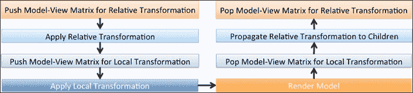

在当前配方中，Torus 将作为父 OpenGL ES 坐标系统中心点的参考。更具体地说，Torus 将渲染到 OpenGL ES 原点，即(0.0, 0.0, 0.0)。模型也被缩小了，看起来像是一个中心点。`Suzzane`执行两种类型的旋转以演示相对和本地变换。在前一种变换中，`Suzzane`将被放置在原点 3 个单位之外，并且设置中心为(0.0, 0.0, -3.0)，以便它可以围绕新的原点（中心）旋转。然而，在后一种变换中，`Suzzane`围绕其自身轴旋转。在`GraphicsRender`函数中，`Suzzane`在每个帧上本地和相对旋转一度，如图所示：


## 参见：

+   *在场景图中添加父子关系支持*

# 在场景图中添加父子关系支持

这个配方是场景图架构中的一个非常重要的里程碑；不用说，场景图全部关于层次连接性。在当前的概念中，我们维护相似类型对象之间的父子关系。这个配方包含两个子配方：

1.  在可渲染对象之间构建简单的父子关系

1.  理解虚拟父的概念

    ### 注意

    父子关系适用于所有可渲染对象（从`Model`类派生）和逻辑引擎实体，如场景、渲染器等。在当前的场景图架构中，这种关系是通过`Object`类实现的。这个类允许你动态地添加/删除子对象；每个对象都可以通过用户定义的名称来识别。

## 如何实现...

利用本章中我们实现的最后一个配方以及以下步骤来添加父子关系的支持：

1.  创建 `Object.h` 并编辑以下代码。这个类的每个对象都有一个名称、一个父对象，以及存储在子列表中的一个或多个子对象。父对象的信息在构造函数中设置。这个类提供了高级功能来检索父或子信息，这些信息可以在运行时添加或删除。每个名称的功能都是不言自明的，用来描述它执行的工作类型：

    ```java
    class Object{
    public:
        Object(string name="", Object* parentObj=NULL);
        virtual ~Object(){}
        void SetName(string mdlName){ name = mdlName;}
        string GetName() { return name; }

        void SetChild(Object* child = 0);
        void RemoveFromParentChildList();
        Object*  GetParent() { return parent; }
        vector<Object*>* GetChildren(){ return &childList; }

        void SetVisible(bool flag,bool applyToChildren=false);
        bool GetVisible(){ return isVisible; }

    protected:
        string name;          // Model's name
        Object* parent;      // Model's parent
        vector<Object*> childList; // Model's child list
     bool isVisible;      // Is Model Visible
    };
    ```

1.  创建 `Object.cpp` 并定义在头文件中无法内联定义的高级方法。构造函数接受对象的名称和父对象（`parentObj`）；`RemoveParent` 方法移除对象的父对象，并确保父对象的 `childList` 中不存在任何子对象：

    ```java
    Object::Object(std::string objectName, Object* parentObj){
        parent = NULL;          name = objectName;
        SetParent(parentObj);   return;
    }

    void Object::RemoveParent()
    { RemoveFromParentChildList(); parent = NULL; }

    void Object::SetChild(Object* child){
        for(int i =0; i<childList.size(); i++){ 
    if(child == childList.at(i)) { return; } 
     }
        child->parent = this;
        childList.push_back(child);
    }

    void Object::RemoveFromParentChildList(){
       for(int i=0; parent&&i<parent->childList.size(); i++){
            if(this == parent->childList.at(i))
                 { parent->childList.erase
    (parent->childList.begin()+i); return; }
       }
    }
    ```

1.  实现 `setVisible` 并根据最后一个参数 `applyToChildren`（如果适用）传播子对象的可见性：

    ```java
    void Model::SetVisible(bool flag, bool applyToChildren){
        isVisible = flag;
        if(applyToChildren){
          for(int i =0; i<childList.size(); i++)
            dynamic_cast<Model*>(childList.at(i))->
    SetVisible( flag, applyToChildren );}
    }
    ```

1.  从 `Object` 类派生出 `Renderer`、`Scene` 和 `Model` 类。

1.  在派生的 `Model` 类版本中，处理对象的可见性，如下代码所示。更多信息，请参考 `ObjLoader::Render`：

    ```java
    ObjLoader::Render(){
      // REUSE CODE, APPLY RELATIVE TRANSFORMATION
    if(isVisible){
          // APPLY LOCAL TRANSFORMATION
    // RENDER GEOMETRY, REUSE CODE   
       // POP LOCAL TRANSFORMATION
    }
       // POP RELATIVE TRANSFORMATION
       }
    ```

1.  实现子模型的渲染：

    ```java
    void Model::Render(){
        for(int i =0; i<childList.size(); i++)
            dynamic_cast<Model*>(childList.at(i))->Render();
    }
    ```

1.  使用 `NativeTemplate.cpp` 并添加实现父子建模：

    ```java
    Renderer* graphicsEngine; Scene* scene1;
    ObjLoader *Sphere, *BaseSphere, *Cube[2];

    bool GraphicsInit(){
        graphicsEngine = new Renderer();
        scene1 = new Scene("MeshScene", graphicsEngine);
        scene1->addLight(new Light(Material(MaterialWhite)
    ,vec4(0.0,0.0,10.0,1.0)));
        BaseSphere =  new ObjLoader   (scene1,NULL,SPHERE,None);
        BaseSphere->SetMaterial(Material(MaterialGold));
        BaseSphere->ScaleLocal(1.5,1.5,1.5);
        int j = 0;
        for(int i=-1; i<2; i+=2){
          Cube[j] = new ObjLoader(scene1,BaseSphere,CUBE,None);
          Cube[j]->SetMaterial(Material(MaterialCopper));
          Cube[j]->Translate(10.0*i, 0.0, 0.0);
          for(int i=-1; i<2; i+=2){
            Sphere=new ObjLoader(scene1,Cube[j],SPHERE,None);
            Sphere->SetMaterial(Material(MaterialSilver));
            Sphere->Translate(0.0, -5.0*i, 0.0);
          } j++;
        }
        scene1->addModel( BaseSphere);
        graphicsEngine->initializeScenes();
    }

    bool GraphicsRender(){
        BaseSphere->Rotate(1.0, 0.0, 1.0, 0.0);
        Cube[0]->Rotate(-1.0, 1.0, 0.0, 0.0);
        Cube[1]->Rotate( 1.0, 1.0, 0.0, 0.0);
        graphicsEngine->render();
    }
    ```

## 它是如何工作的...

任何可渲染的实体（`Model` 及其派生类）或不可渲染的实体（`Renderer`、`Scene` 及其派生类）都可以从 `Object` 类派生出来，以实现父子关系。`Object` 类在父变量中存储父对象信息，在名为 `childList` 的向量列表中存储子对象信息；任何其他类对象都可以使用 `GetParent()` 和 `GetChildren()` 函数访问父和子信息。

### 注意

每个父对象都负责照顾其子对象的执行生命周期。例如，父场景将自动逐个加载子场景。同样，`Model` 加载其子对象并管理它们的初始化，加载所需的着色器，将父对象的转换传播到子对象，并渲染每个子模型。

这个配方包含七个模型（五个球体（一个大的，四个小的），两个立方体），如下左图所示。父子关系如下右图所示，其中黄色球体是两个铜色立方体的父对象，每个立方体都连接有两个银色球体。黄色球体绕 *y* 轴旋转；这使得所有子元素围绕黄色球体旋转，而立方体则绕 *y* 轴旋转。同时，它们还绕自己的 *x* 轴旋转，一个顺时针方向，另一个逆时针方向：

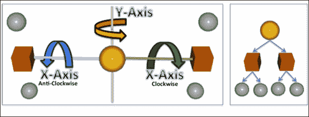

### 注意

参考使用转换图创建复杂模型的配方。这个配方指导你使用父子关系和局部/相对转换创建风车模型。

## 还有更多...

看看下面的图片，尝试弄清楚我们如何使用现有的父子关系方法来解决这个问题。

**问题陈述**：

一组半圆（由立方体创建）以同心方式排列，其中每个半圆相对于其相邻半圆旋转方向相反：

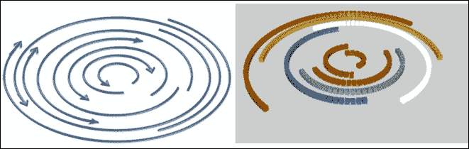

在当前情况下，我们有八个同心半圆。将最内层的半圆视为其他半圆的父级，解决它（尝试一下）确实需要动脑筋。

有时，存在一些复杂的父子关系问题可以轻松解决。作为对这个问题的解决方案，我们可以创建八个父级，根据需要应用变换，创建两个父级对象（最内层），并根据旋转方向添加子级。最后，将一个父级顺时针移动，另一个逆时针移动。这个配方使用了前面描述的带有虚拟父级的解决方案。

到目前为止，我们已经看到了所有可渲染实体的父级，这些实体也是可渲染的。这就是虚拟父级概念出现的地方。这允许你创建一个没有几何形状的父级。因此，它不能被渲染，并提供了一个逻辑上的父子关系。`Render` 方法不渲染任何内容，仅用于应用变换。这里的局部变换没有意义，因为对象的几何形状不存在：

```java
class DummyModel : public Model{
public:
   DummyModel(Scene* SceneHandler, Model* model, ModelType type,
           string objectName = "");  // Constructor
   virtual ~DummyModel(){}      // Destructor
      void Render();           // Render the dummy model.
};

DummyModel::DummyModel(Scene*  parentScene, Model* model, ModelType type,std::string objectName):Model(parentScene, model, type, objectName){}          // DummyModel CTOR.

void DummyModel::Render(){
   SceneHandler->SceneTransform()->TransformPushMatrix();
   ApplyModelsParentsTransformation();//Parent Transformation
       Model::Render(); // Base renderer process the childs
   SceneHandler->SceneTransform()->TransformPopMatrix();
}
```

## 参见

+   *使用变换图创建复杂模型*

# 使用变换图创建复杂模型

变换图是一棵语义变换的森林，其中每个节点代表一个模型树。结合所有这些树模型产生了一个复杂的 3D 模型结构。左侧的图像显示了变换的语义模型。右侧的图像显示了由语义变换图中的每个节点表示的树结构：

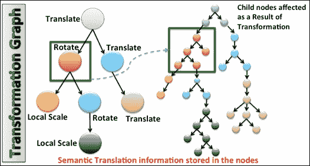

### 注意

变换图广泛使用父子关系。没有它，变换图层次结构很难管理。变换图表示节点层次结构，其中每个子节点包含相对于其父节点的变换信息（平移、缩放和旋转）。

这个配方是前两个配方的混合体。它将使用父子关系和局部和相对变换来生成语义变换图。在这个配方中，你将学习如何使用基本的网格模型（如立方体、圆柱体和球体）创建复杂的风车模型。

## 如何做...

这个配方不需要对场景图引擎进行任何特殊更改。使用 `NativeTemplate.cpp` 并编辑 `GraphicsInit` 和 `GraphicsRender`，如下面的代码所示：

```java
Renderer*    graphicsEngine;   Scene* scene1;
ObjLoader    *Base,   *Stand, *MotorShaft, *CubePlane;
ObjLoader    *Sphere,  *Torus, *Suzzane;

bool GraphicsInit(){
    graphicsEngine = new Renderer();
    scene1 = new Scene("MeshScene", graphicsEngine);
    scene1->addLight(new Light(
            Material(MaterialWhite),vec4(0.0, 0.0, 10.0, 1.0)));

    Base =  new ObjLoader(scene1, Sphere, CUBE);// Base
    Base->SetMaterial(Material(MaterialSilver));
    Base->SetName(std::string("Base"));
    Base->ScaleLocal(1.5, 0.25, 1.5);

    Stand = new ObjLoader(scene1,Base,SEMI_HOLLOW_CYLINDER);// Stand
    Stand->SetMaterial(Material(MaterialSilver));
    Stand->SetName(std::string("Stand"));
    Stand->Translate(0.0, 4.0, 0.0);
    Stand->ScaleLocal(0.5, 4.0, 0.5);

    MotorShaft = new ObjLoader(scene1,Stand,CUBE); // MotorShaft
    MotorShaft->SetMaterial(Material(MaterialSilver));
    MotorShaft->SetName(std::string("MotorShaft"));
    MotorShaft->Translate(0.0, 4.0, 1.0);
    MotorShaft->ScaleLocal(0.5, 0.5, 2.0);

    Sphere = new ObjLoader(scene1,MotorShaft,SPHERE);// MotorEngine
    Sphere->SetMaterial(Material(MaterialGold));
    Sphere->Translate(0.0, 0.0, 2.0);
    Sphere->SetName(std::string("Sphere"));

    for(int i=0; i<360; i+=360/18){ // 20 Fan Blades
        CubePlane =  new ObjLoader   ( scene1, Sphere, CUBE);
        CubePlane->SetMaterial(Material(MaterialCopper));
        CubePlane->SetName(std::string("FanBlade"));
        CubePlane->Translate(0.0, 2.0, 0.0);
        CubePlane->SetCenter(glm::vec3(0.0, -2.0, 0.0));
        CubePlane->ScaleLocal(0.20, 2.0, 0.20);
        CubePlane->Rotate(i, 0.0, 0.0, 1.0);
    }

    scene1->addModel( Base);
    graphicsEngine->initializeScenes(); return true;
}

bool GraphicsRender(){
    Sphere->Rotate(3.0, 0.0, 0.0, 1.0);
    Base->Rotate(1.0, 0.0, 1.0, 0.0);
        graphicsEngine->render(); return true;
}
```

## 它是如何工作的...

风车模型由总共 24 个部分组成：一个底座、一个支架、一个电机轴、一个电机引擎和 20 个风扇叶片。底座、电机轴和风扇叶片由立方网格制成，而支架和电机引擎则分别由圆柱和球体网格制成。所有这些部分必须按照正确的父子顺序排列，并且同时应用正确的放置，使用 3D 空间中的局部和相对变换。一图胜千言，通过查看以下图片，你一定能对如何逐部分编织完整模型有所了解。

让我们了解这个风车的工作原理。在`GraphicsInit()`中，我们首先需要的是风车的底座，它使用一个完美的立方体（**A**）创建。这个立方体在局部缩放以产生由（**B**）表示的形状。接下来，支架由一个圆柱体制成，并平移到原点前四个单位（**C**），然后进行缩放（**D**），以便在垂直方向上完美扩展以适应底座。这里的底座是支架的父节点。电机轴也由（**E**）立方体组成，它平移到四个单位（**F**）。此模型在局部缩放以获得（**G**）形状。

### 注意

我们应用的每个变换都是相对于其父节点。因此，在当前情况下，垂直方向上的四个单位是相对于支架，它是`MotorShaft`的父节点。

创建一个球体以产生一个`MotorEngine`（**H**），并将其渲染到**+Z**方向两个单位（**I**）。最后一部分是创建风扇叶片。每个风扇叶片由一个立方体（**J**）组成。这个立方体需要垂直方向上远离父节点中心四个单位进行渲染（**K**）。然后将平移叶片应用于局部缩放，以创建类似叶片的形状（**L**）。同样，这个过程重复 20 次以构建完整的风扇（**M**，**N**）。

最后，一旦创建了几何形状，风车的父节点（底座）就被添加到场景中。为什么其他模型没有被添加到场景中？在之前的菜谱中，我们提到每个父模型都会照顾其子模型。由于底座被添加到场景中，它就会照顾其子元素。同样的规则适用于所有子元素，它们本身也是其他项目的父节点：

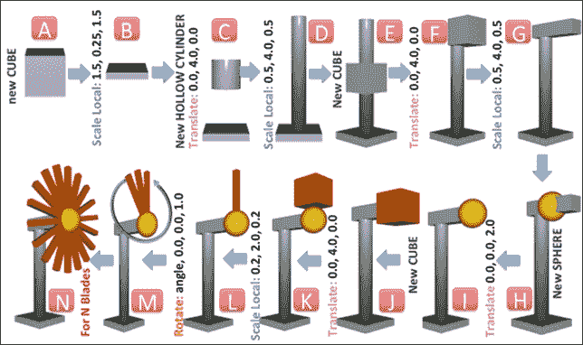

风车风扇叶片围绕每个帧的*z*轴旋转三个度。这种变换可以通过在所有叶片的父节点球体上应用旋转来简单地实现。同样，为了使整个模型围绕*y*轴旋转，在`GraphicsRender()`中在底座上应用一度旋转。

## 参见

+   *在场景图中添加父子支持*

+   *添加局部和相对变换*

# 使用光线追踪技术实现拾取

拾取是通过用户输入在场景中 3D 空间选择对象的过程。这是 3D 图形应用中非常常见的需求，您可能对最终用户点击的对象感兴趣。点击点包含屏幕坐标系中的位置，这是视口的参考。此参考点可用于各种拾取技术来检测点击的对象。在本例中，我们将使用一种非常通用的拾取技术，称为“光线拾取”或“光线追踪拾取”。

在此技术中，使用场景中的点击点模拟一条光线。当光线与对象相交时，假设它被点击。光线可以与给定场景中的多个对象相交；可以选择的对象可以根据从视点的距离进行收集和排序，以成为最近的选中对象。在本例中，我们将实现光线追踪拾取技术，该技术在高精度定位 3D 对象方面非常准确。

以下步骤概述了实现光线追踪拾取的过程：

1.  检测屏幕上的点击点（Sx, Sy）。

1.  使用（Sx, Sy）并找到近平面（Nx, Ny）和远平面（Fx, Fy）上的未投影坐标。

1.  从（Nx, Ny）和（Fx, Fy）未投影坐标创建一条光线。

1.  考虑网格几何形状中的每个三角形并执行光线与三角形的交点测试。可以使用低多边形网格优化此测试。

## 如何实现...

实现光线追踪拾取的步骤如下：

1.  在名为`Event.h`/`.cpp`的新文件中创建一个从`Event`派生的接口类`GestureEvent`。这将提供触摸屏事件所需的接口。希望利用手势优势的类必须从`GestureEvent`类派生：

    ```java
    class Event {
     public:
       Event(){          // Define CTOR };
       virtual ~Event(){ // Define DTOR };
    };
    class GestureEvent : public Event {
      public:
       GestureEvent():Event(){  // Define CTOR }
       virtual ~GestureEvent(){ // Define DTOR }
       virtual void TouchEventDown(float x, float y) = 0;
       virtual void TouchEventMove(float x, float y) = 0;    
       virtual void TouchEventRelease(float x, float y) = 0;
    };
    ```

1.  `Renderer`、`Scene`和`Model`类需要继承`GestureEvent`以支持触摸事件。在各自的类中包含`Event.h`头文件：

    ```java
    class Renderer: public Object, public GestureEvent
    class Scene    : public Object, public GestureEvent
    class Model    : public Object, public GestureEvent
    ```

1.  在`Renderer`类中将手势事件传播到所有场景：

    ```java
    void Renderer::TouchEventDown(float x, float y){
        for( int i=0; i<scenes.size();  i++ )
            { scenes.at(i)->TouchEventDown(x, y); } }
    // Similarly, implement TouchEventMove &
    // TouchEventRelease like TouchEventDown.
    ```

1.  在`Scene`类中实现手势界面，并将接收到的触摸事件从 renderer 传播到以下代码中包含的所有模型：

    ```java
    void Scene::TouchEventDown(float x, float y){
        for( int i=0; i<models.size(); i++ ){
          models.at(i)->TouchEventDown(x, y); }
    }
    //Similarly, defineTouchEventMove & TouchEventRelease
    ```

1.  在`Model`中实现手势界面并将其应用于每个子项：

    ```java
    void Model::TouchEventDown(float x, float y){
        for(int i =0; i<childList.size(); i++){
          dynamic_cast<Model*>
           (childList.at(i))->TouchEventDown(x, y);}
    }
    //Similarly, define TouchEventMove & TouchEventRelease
    ```

1.  创建一个名为`Ray.h`/`.cpp`的文件并定义`Ray`类，如下面的代码所示：

    ```java
    class Ray{
     public:
       vec3 dest, dir; // Destination and Direction
       Ray(){ dest = vec3(); dir = vec3(); }
       Ray(vec3 de, vec3 di){ dest = de; dir = di; }
       Ray(const Ray & r){ dest=r.dest; dir=r.dir; }
       Ray & operator=(const Ray&r)
    {dest=r.dest; dir=r.dir; return *this; }
    };
    ```

1.  在基类`Model`中创建一个名为`IntersectWithRay`的函数，并在`ObjLoader`派生类中实现：

    ```java
    bool ObjLoader::IntersectWithRay(Ray ray0,vec3& intersect){
        vec4 p0, p1, p2;
        // COMPUTE EACH TRIANGLE AND CHECK INTERSECTION
        for(uint i=0; i<objMeshModel->vertices.size(); i+=3){
         p0=vec4(objMeshModel->vertices.at(i).position,1);
         p1=vec4(objMeshModel->vertices.at(i+1).position,1);
         p2=vec4(objMeshModel->vertices.at(i+2).position,1);
         mat4 mat = *TransformObj->TransformGetModelMatrix();

         p0 = mat*GetEyeCoordinatesFromRoot() * p0;
         p1 = mat*GetEyeCoordinatesFromRoot() * p1;
         p2 = mat*GetEyeCoordinatesFromRoot() * p2;

         if (intersectLineTriangle(ray0.destination,
         ray0.dir, vec3(p0.x,p0.y,p0.z),
         vec3(p1.x,p1.y,p1.z), vec3(p2.x,p2.y,p2.z),
         intersect))
         { return true; }
        }
        return false;
    }
    ```

1.  在基类`Model`中创建一个名为`IntersectWithRay`的函数，并在当前场景中的派生版本类（如`ObjLoader`）中实现：

    ```java
    void ObjLoader::TouchEventDown( float x, float y ){
       GLint vp[4] = { 0, 0, 0, 0 }; //Store's viewport
       glGetIntegerv( GL_VIEWPORT, vp );
       vec4 viewport(vp[0], vp[1],vp[2], vp[3]);
       vec3 win(x, vp[3]-y, 0.0);
       vec3 nearPoint = glm::unProject(win, *TransformObj->
       TransformGetModelViewMatrix(), *TransformObj-> TransformGetProjectionMatrix(), viewport);
       win.z = 1.0; // On the far plane.
       vec3 farPoint = glm::unProject(win,
    *TransformObj->TransformGetModelViewMatrix(), *TransformObj->TransformGetProjectionMatrix(), viewport);
        Ray ray0(nearPoint, farPoint-nearPoint);
        glm::vec3 intersectionPoint;
        if(IntersectWithRay( ray0, intersectionPoint)){
          printf("Intersect with %s", GetName().c_str());
            isPicked = !isPicked;
         }

        Model::TouchEventDown(x,y); //Propagate to children
    }
    ```

## 工作原理...

`GestureEvent`类从 Renderer 中的主应用程序接收屏幕坐标系中的点击事件（Sx, Sy），并通过相应的父场景传递给 Model 类。然后，这些坐标用于计算近平面和远平面上的未投影坐标。在本例中，我们使用了`glm::unproject` API：

**语法**：

```java
void glm::unproject(vec3 const& win, mat4 const& modelView,
mat4 const& proj, vec4 const& viewport);
```

| 变量 | 描述 |
| --- | --- |
| `win` | 组件 *x*、*y* 指定屏幕坐标。值为零和一的 *z* 分别指定近平面和远平面。 |
| `modelView` | 这指定了视图和模型矩阵的乘积。 |
| `proj` | 这指定了当前场景的投影矩阵。 |
| `viewport` | 这指定了视口区域的当前维度。 |

反投影操作反转了投影计算的操作，其中使用世界坐标来计算屏幕坐标的顺序如下：

```java
Screen Coordinates => Viewport => Projection => ModelView => World coordinates
```

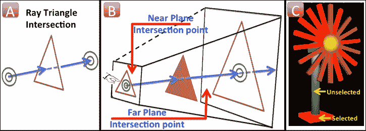

在近平面（Nx, Ny）和远平面（Fx, Fy）上的未投影坐标用于从近平面向远平面发射一条射线，如图中所示（**B**）。当这条射线击中一个 3D 对象时，它被认为是已选中。从数学上讲，这种选择是通过取网格多边形和产生的射线的交点来执行的。为了简化，我们在本配方中使用了线和三角形的交点，如图（**A**）所示。网格迭代每个三角形，并使用从 `Model` 继承的 `IntersectWithRay` 函数与射线相交。此函数必须在派生版本中重写，以便执行交点测试。`ObjLoader` 类重写了此函数，并使用 `glm::intersectLineTriangle` API 计算射线-三角形交点。此配方将所有选中的 3D 网格对象用环境红色绘制，这些对象与射线相交。为了找到最近的选中对象，对整个选中项进行排序，并从摄像机视图中选择最近的那个。

## 参见

+   *实现二维纹理按钮小部件*

# 实现二维纹理按钮小部件

OpenGL ES 不提供内置的 UI 组件，例如按钮、单选框、复选框等。通常，这些组件被称为 2D 小部件，并在屏幕坐标系中的 HUD 中布局，其中 *z* 分量要么为零，要么根本不使用。此配方将指导我们使用 OpenGL ES 在屏幕坐标系上设计和布局 2D 小部件。

此配方包含两个配方：

+   第一个配方允许你创建一个简单按钮的几何形状。几何坐标是在局部屏幕坐标系中指定的，这在设计布局时非常有用。

+   第二个配方在配方的 *还有更多...* 部分实现，其中我们使用了射线选择技术，使按钮可点击。选择按钮将改变其颜色。

下一个图像显示了第一个配方的输出。它包含六个 32 x 32 维度的按钮。每个按钮都按比例因子二进行缩放，最终尺寸为 64 x 64。最左边的按钮（向上按钮）是所有剩余按钮的父按钮。这意味着应用于父按钮的任何属性都将传播到所有子按钮。

## 如何操作...

下面是实现此配方的步骤：

1.  创建`Button.h`/`.cpp`并定义从`Model`类派生的`Button`类：

    ```java
    class Button : public Model{
    public:
        Button(Scene* parent,Model* model,ModelType type,vec3*
     vertices,vec2* textureCoordinates,char* texture);
        virtual ~Button();      // Destructor for Button class
        void InitModel();    // Initialize our Button class
        void Render();       // Render the Button class
    private:
     char MVP, TEX; Image* image;  char* textureImage;
        vec3 vertices[4]; vec2 texCoordinates[4];  
    };
    ```

1.  `Button`类渲染按钮的几何形状。按钮几何形状有四个顶点，在这些顶点上粘贴了纹理，借助纹理坐标：

    ```java
    void Button::Render(){
        glBindBuffer(GL_ARRAY_BUFFER, 0);
        glUseProgram(program->ProgramID);

        glDisable(GL_CULL_FACE); // Disable culling
        glEnable(GL_BLEND);      // Enable blending
        glBlendFunc(GL_SRC_ALPHA,GL_ONE_MINUS_SRC_ALPHA);

        glActiveTexture (GL_TEXTURE0);
        glUniform1i(TEX, 0);
        if (image)
      {glBindTexture(GL_TEXTURE_2D,image->getTextureID());}

        TransformObj->TransformPushMatrix(); //Parent Level
        ApplyModelsParentsTransformation();

        if(isVisible){
            TransformObj->TransformPushMatrix(); // Local Level
            ApplyModelsLocalTransformation();

            glEnableVertexAttribArray(VERTEX_POSITION);
            glEnableVertexAttribArray(TEX_COORD);
            glVertexAttribPointer(TEX_COORD, 2, GL_FLOAT,
    GL_FALSE, 0, &texCoordinates[0]);
            glVertexAttribPointer(VERTEX_POSITION, 3, GL_FLOAT,
                    GL_FALSE, 0, &vertices[0]);
            glUniformMatrix4fv( MVP, 1, GL_FALSE,TransformObj->
    TransformGetModelViewProjectionMatrix());
            glDrawArrays(GL_TRIANGLE_STRIP, 0, 4); // Draw
            TransformObj->TransformPopMatrix();//Local Level
        }

        Model::Render();
        TransformObj->TransformPopMatrix(); //Parent Level
    }
    ```

1.  使用正交投影系统设置抬头显示：

    ```java
    void Scene::setUpProjection(){
      TransformObj.TransformSetMatrixMode(PROJECTION_MATRIX );
      TransformObj.TransformLoadIdentity();
      int viewport_matrix[4];
      glGetIntegerv( GL_VIEWPORT, viewport_matrix );
      TransformObj.TransformOrtho( 0, viewport_matrix[2],
     viewport_matrix[3], 0 , -1, 1);
      TransformObj.TransformSetMatrixMode( VIEW_MATRIX );
      TransformObj.TransformLoadIdentity();
      TransformObj.TransformSetMatrixMode( MODEL_MATRIX );
      TransformObj.TransformLoadIdentity(); return;    
    }
    ```

1.  在`NativeTemplate.cpp`中，编辑`GraphicsInit()`函数，如下面的代码所示。此函数在屏幕坐标系上布局按钮。这些按钮接受几何顶点和纹理坐标作为输入，这些是可选参数。如果未提供这些参数，按钮的尺寸将与图像大小相等。纹理坐标具有默认值（0.0，0.0）和（1.0，1.0），分别对应左下角和右上角：

    ```java
    Renderer* graphicsEngine; 
    Scene* scene2;
    Button* buttonUp, *buttonDown, *buttonLeft,
    Button* buttonRight, *buttonForward, *buttonBackward;

    bool GraphicsInit(){
       graphicsEngine = new Renderer();    
    vec2 texCoords[4]={ 
    vec2(0.0, 0.0),
    vec2(1.0,0.0), 
    vec2(0.0, 1.0), 
    vec2(1.0,1.0) 
    };

    vec3 vertices[4]={ 
    vec3(0.0,0.0,0.0), 
    vec3(400.0,0.,0.),
                              vec3(0.0,400.0,0.0),
    vec3(400.0,400.0,0.0)
    };

        scene2      = new Scene("ButtonScene");    
        buttonUp     = new Button(scene2, NULL, None,
    NULL, texCoords, "dir_up.png");
        buttonUp->SetName(std::string("Direction Up"));
        buttonUp->Translate(50.0, 100, 0.0);
        buttonUp->Scale(2.0, 2.0, 2.0);

        // MAKE THE buttonUp AS PARENT OF OTHER BUTTONS
        buttonBackward = new Button(scene2, buttonUp,
    None, NULL, texCoords, "dir_down.png");
        buttonBackward->SetName(string("Direction Backward"));
        buttonBackward->Translate(250.0, 0.0, 0.0);
        buttonBackward->SetCenter(vec3(16, 16, 0));
        buttonBackward->Rotate(-135.0, 0.0, 0.0, 1.0);
        // SIMILARLY DEFINE OTHER BUTTONS. . . . .
     // buttonDown, buttonLeft, buttonRight, buttonForward

        scene2->addModel(buttonUp); // ADD TO THE SCENE
        graphicsEngine->addScene(scene2);
        graphicsEngine->initializeScenes(); return true;
    }
    ```

## 它是如何工作的...

2D 按钮小部件的几何形状使用四个顶点创建，这些顶点在屏幕坐标系中指定。这个几何形状通过几何形状上的纹理坐标使用指定的图像进行纹理化。OpenGL ES 在笛卡尔坐标系中工作，其中原点存在于逻辑坐标系中视口维度的中心。视口也有相同的坐标系，并在像素坐标系中工作，但在这个情况下，原点位于左下角，如以下图像所示。相比之下，2D 小部件是在设备坐标系中设计的，其中原点被认为是左上角（见以下图像）。

现在，抬头显示是一种机制，我们可以通过使用 OpenGL ES 坐标系统和视口来制定设备坐标系统。为此，我们需要使用`setUpProjection`函数中的正交视图渲染场景的投影系统，其中原点在右上角移动。

按钮类对象在`NativeTemplate.cpp`中的`GraphicsInit()`函数中创建，其中创建了六个按钮，每个按钮上都有不同的图像。每个按钮都被赋予一个独特的名称，以便以后在相机配方中使用。以下图像显示了这些按钮在右侧。为了简化在 2D 抬头显示屏幕空间中放置图标的工作，我们将第一个按钮（向上方向）作为其他按钮的父级。这样，我们都可以通过在父级上应用单个操作来调整所有按钮的大小和位置。最后，使用`GraphicsRender()`将这些按钮渲染到抬头显示中：

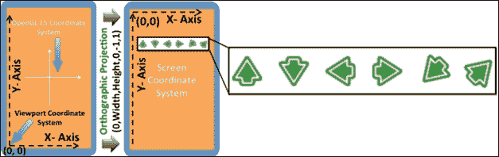

## 更多...

与我们在上一个配方中实现的选择技术不同，这次我们将实现按钮类中的选择技术，这将帮助我们了解哪个按钮被点击，以便用户可以对其执行适当的操作。请参考下一个配方，以了解这些按钮是如何控制场景中相机移动的。

`Button`类必须从`GestureEvent`类派生，并实现虚拟手势函数，例如`TouchEventDown`和`TouchEventRelease`，以便处理手势事件并将它们传播到子成员对象：

```java
class Button : public Model, public GestureEvent
    {//Multiple code skipped};
void Button::TouchEventDown(float x, float y){
    GLint viewport_matrix[4]   = { 0, 0, 0, 0 };
    glGetIntegerv( GL_VIEWPORT, viewport_matrix );
    glm::vec4 viewport(viewport_matrix[0],viewport_matrix[1],
                       viewport_matrix[2],viewport_matrix[3]);
    glm::vec3 win(x, viewport_matrix[3]-y, 0.0);
    mat4 matMV  = *TransformObj->TransformGetModelMatrix();
    mat4 matMVP = *TransformObj->TransformGetModelMatrix();
    glm::vec3 nearPoint = unProject(win, mat, matMVP, viewport);
    win.z = 1.0;
    glm::vec3 farPoint = unProject(win, matMV,matMVP, viewport);
    Ray ray0(nearPoint, farPoint-nearPoint);

    glm::vec3 intersectionPoint;
    if(IntersectWithRay( ray0, intersectionPoint)){
        printf("Intersect with %s", this->GetName().c_str());
        isPicked = !isPicked; clicked = true; return;
    }
    Model::TouchEventDown(x,y);
}

void Button::TouchEventRelease( float x, float y ){
    clicked = false; isPicked = false;
    Model::TouchEventRelease(x,y);
}
```

这个类必须重写`IntersectWithRay`函数。在这个函数中，它执行了包含按钮几何形状的两个三角形的线和三角形交点。以下图像显示了当触摸事件发生时按钮颜色的变化。当触摸释放事件触发时，按钮将恢复到原始颜色：


让我们看看以下代码：

```java
bool Button::IntersectWithRay(Ray ray0, vec3& intersectionPoint){
    // CHECK INTERSECTION WITH FIRST TRIANGLE
    mat4 = *TransformObj->TransformGetModelMatrix();
    p0 = mat * GetEyeCoordinatesFromRoot() * vec4(vertices[0], 1.0);
    p1 = mat * GetEyeCoordinatesFromRoot() * vec4(vertices[1], 1.0);
    p2 = mat * GetEyeCoordinatesFromRoot() * vec4(vertices[2], 1.0);
    if ( intersectLineTriangle(ray0.destination, ray0.direction,
         vec3(p0.x,p0.y,p0.z), vec3(p1.x,p1.y,p1.z),
         vec3(p2.x,p2.y,p2.z), intersectionPoint)){
        return true;
    }

    // CHECK INTERSECTION WITH SECOND TRIANGLE
    p0 = mat * GetEyeCoordinatesFromRoot() * vec4(vertices[1], 1.0);;
    p1 = mat * GetEyeCoordinatesFromRoot() * vec4(vertices[3], 1.0);;
    p2 = mat * GetEyeCoordinatesFromRoot() * vec4(vertices[2], 1.0);;
    if ( intersectLineTriangle(ray0.destination, ray0.direction,
          vec3(p0.x,p0.y,p0.z), vec3(p1.x,p1.y,p1.z),
          vec3(p2.x,p2.y,p2.z), intersectionPoint)){
       return true;
    }
    return false;
}
```

## 参见

+   *请参阅第八章中关于抬头显示渲染文本的食谱第八章，字体渲染*

# 使用摄像头系统导航场景

在 3D 图形中，摄像头允许你在 3D 空间中导航；它可以用于在任意轴上进行旋转和位移。在 OpenGL ES 中，没有摄像头这样的东西。这必须通过编程实现。实现摄像头非常简单。实际上，我们不需要任何特定的 OpenGL ES API 来完成这个任务，这完全关乎矩阵的操作。在本食谱中，我们将模拟一个第一人称摄像头。

## 如何实现...

重新使用上一个实现食谱，并执行以下步骤以实现摄像头系统：

1.  创建一个`Camera.h`/`.cpp`文件，并定义一个从`Object`派生的`Camera`类。这个类包含三个单位向量：`Left`、`Up`和`Forward`，它们分别存储沿*x*、*y*和*z*轴在 3D 空间中的方向单位向量。`Position`指定摄像头的位置，而`Target`指定摄像头视图的位置：

    ```java
       struct ViewPort{ int x, y, width, height; };
       struct CameraViewParams{ float left, right, bottom, top,
       front, back; float fov, nearPlane, farPlane; };

       class Camera : public Object{
       vec3 Forward, Up, Right, Position, Target;
       CameraType type; // Type of cameras

       protected:
       int viewport_matrix[4]; ViewPort viewPortParam;
       CameraViewParams cameraViewParameters;

       public:
       Camera(string name, Scene* parent = NULL,
       CameraType camType = perspective);

       void Viewport (int x, int y, int width, int height);
       virtual void Render ();
       void Rotate(vec3 orientation, float angle);
       void MoveForwards( GLfloat Distance );
       // Similarly,define MoveBackwards, StrafeRightSide etc.

       void SetLeft(float val) {cameraViewParameters.left=val;}
       // Similarly,define SetRight, SetBottom, SetTop Etc.

       float GetLeft(){ return cameraViewParameters.left; }
       //Similarly, define GetRight, GetBottom, GetTop etc Etc.
       vec3 PositionCamera(){return Position + Forward;}
    };
    ```

1.  定义摄像头的旋转，如下代码所示：

    ```java
    #define DEGREE_TO_RADIAN   M_PI / 180.0f
    #define RADIAN_TO_DEGREE   180.0f / M_PI
    #define COS(Angle) (float)cos(Angle*DEGREE_TO_RADIAN)
    #define SIN(Angle) (float)sin(Angle*DEGREE_TO_RADIAN)

    void Camera::Rotate(vec3 orientation, float angle){
      if(orientation.x == 1.0){ //Rotate along X axis
       Forward=normalize(Forward*COS(angle)+Up*SIN(angle));
       Up     = -cross( Forward, Right ); }

      if(orientation.y == 1.0){ //Rotate along Y axis
        Forward=normalize(Forward*COS(angle)-Right*SIN(angle));
        Right  = cross( Forward, Up ); }

      if(orientation.z == 1.0){ //Rotate along Z axis
       Left = normalize(Right*COS(angle)+Up*SIN(angle));
       Up   = -cross(Forward, Right); }
    }
    ```

1.  使用移动函数使摄像头沿着三个轴移动，如下代码所示：

    ```java
    void Camera::MoveForwards(GLfloat d){   
      Position += Forward*d;
    }

    void Camera::StrafeRightSide(GLfloat d){
      Position += Left*d;
    }

    void Camera::StrafeUpside(GLfloat d){
      Position += Up*d;
    }

    void Camera::MoveBackwards(GLfloat d){
      MoveForwards( -d );
    }

    void Camera::StrafeLeftSide(GLfloat d){
      StrafeRightSide(-d);
    }

    void Camera::StrafeDownside(GLfloat d){
      StrafeUpside(-d); 
    }
    ```

1.  以下代码设置了`Camera::Render()`中的投影矩阵：

    ```java
    void Camera::Render(){
      Scene* scene = dynamic_cast<Scene*>(this->GetParent());
      Transform* TransformObj = scene->SceneTransform();
      glViewport( viewPortParam.x, viewPortParam.y,
      viewPortParam.width, viewPortParam.height );
      TransformObj->TransformSetMatrixMode(PROJECTION_MATRIX);
      TransformObj->TransformLoadIdentity();

      if ( type == perspective ){
         // Multiple code line skipped
         // Apply perspective view:TransformPerspective
      }else{
         // Multiple code line skipped
         // Apply Orthographic view: TransformOrtho
      }
    }

    TransformObj->TransformSetMatrixMode(VIEW_MATRIX);
    TransformObj->TransformLoadIdentity();
    vec3 viewPoint = Position + Forward;
    TransformObj->TransformLookAt(&Position,&viewPoint,&Up);

    TransformObj->TransformSetMatrixMode(MODEL_MATRIX);
    TransformObj->TransformLoadIdentity();
    }
    ```

1.  结合我们在之前的食谱中创建的两个场景。第一个场景包含风车。第二个场景包含选择按钮。前一个场景将被渲染到透视摄像头。然而，后一个将使用 HUD 摄像头：

    ```java
    Camera *camera1, *camera2;
    bool GraphicsInit(){
        graphicsEngine = new Renderer();
        scene1   = new Scene("MeshScene", graphicsEngine);
        camera1 = new Camera("Camera1", NULL);
        scene1->addCamera(camera1);
        // Multiple code lines skipped
        graphicsEngine->initializeScenes();

        scene2   = new Scene("ButtonScene");
        camera2 = new CameraHUD("Camera2", scene2);
        // Multiple code line skipped
        graphicsEngine->addScene(scene2);
        graphicsEngine->initializeScenes();}

    bool GraphicsResize(int width, int height){
       graphicsEngine->resize(width, height);
       camera1->Viewport(0, 0, width, height);
       camera2->Viewport(0, 0, width, height);}
    ```

## 它是如何工作的...

摄像头包含三个方向单位向量：前向（0.0, 0.0, 和 -1.0）、右向（1.0, 0.0, 和 0.0）和上向量（0.0, 1.0, 和 0.0）。第一个向量指向摄像头前进的方向。例如，在本例中，摄像头将沿着负*z*轴方向移动。同样，右向量指定*x*轴上的移动方向，上向量指定*y*轴上的移动方向。上向量也可以理解为头部，它指定摄像头是向上（0.0, 1.0, 和 0.0）还是向下（0.0, -1.0, 和 0.0）观看场景。

使用这些向量，相机可以沿三个轴中的任何一个移动。例如，如果你想将相机向前移动五个单位，那么`|5| *`向前的乘积将使你的相机位于（0.0，0.0，或-5.0）并朝相同方向看，而将相机向右移动四个单位则将相机放置在（4.0，0.0，或-5.0）。再次强调，相机仍然朝向负*z*方向。在当前配方中，使用诸如`MoveForwards`、`StrafeRightSide`、`StrafeUpSide`等函数来转换相机的当前位置。相机的*x*、*y*或*z*轴方向可以使用`Rotate`函数来改变。

### 注意

在任意轴上由前向、右向和上向单位向量指定的相机位移不会影响相机的方向。方向保持不变，相机将继续朝由前向向量指定的相同方向看。只有当相机沿任意轴旋转时，相机的方向才能受到影响。

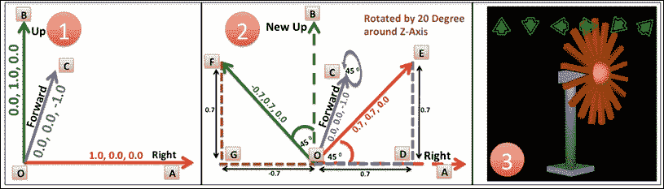

前面的图像（部分**1**）显示了在*z*轴上执行 45 度旋转时，旋转对前向（**OC**）、右向（**OA**）和上向（**OB**）向量的影响。这导致（图像部分**2**）新的右向（**OE**）和新的上向（**OF**）向量。前向向量在*z*轴上旋转时没有变化：

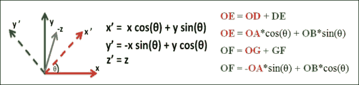

## 更多内容...

当前配方为每个场景包含两个相机。第一个相机渲染透视投影系统。第二个相机以正交投影视图渲染场景到抬头显示。我们在上一个配方中实现的`Camera`类不能用于满足 HUD 相机的要求。因此，我们需要一个新的`Camera`派生类，称为`CameraHUD`，来实现 HUD。

以下代码显示了 HUD 相机的实现。重写了`Render`函数。此函数查询当前视口尺寸并将其映射到正交投影的左右和上下参数，这样原点从中心移动到左上角，与设备屏幕坐标系相同。有关 HUD 的更多信息，请参阅本配方中的“参考以下内容”子节：

```java
class CameraHUD : public Camera{
public:
    CameraHUD(std::string name, Scene* parent = NULL);
    void Render();
    virtual ~CameraHUD();
};

   // Code skipped, see sample for CTOR and DTOR definition.
   void CameraHUD::Render(){ // Render HUD VIEW
    Scene* scene = dynamic_cast<Scene*>(this->GetParent());
    glViewport( viewPortParam.x, viewPortParam.y,
           viewPortParam.width, viewPortParam.height );

    Transform*  TransformObj = scene->SceneTransform();
    TransformObj->TransformSetMatrixMode(PROJECTION_MATRIX);
    TransformObj->TransformLoadIdentity();

    glGetIntegerv( GL_VIEWPORT, viewport_matrix );
    TransformObj->TransformOrtho( viewport_matrix[0],
       viewport_matrix[2], viewport_matrix[3],
        viewport_matrix[1] , -1, 1);
    // Code skipped, Load Model/View Matrix with Identity matrix.

}
```

## 参考以下内容

+   *请参阅第八章中的“抬头显示渲染文本”配方，字体渲染*

# 实现具有多个视图的场景

实时 3D 应用中最常见的需求之一是同时将场景渲染到多个视图窗口中。例如，基于 CAD/CAM 的应用程序将场景渲染到四种类型的视图中：透视、正交前视图、侧视图和俯视图。在场景图架构中，通过将场景渲染到两个或更多相机中来实现多个视图。

此食谱扩展了上一个食谱，以支持多个相机，其中每个相机具有不同的视口区域（可能重叠），并且可以具有不同的清除颜色（根据需求）。

## 如何做到这一点...

实施此食谱的步骤如下：

1.  从现在开始，屏幕清除颜色和缓冲区清除将在相机视图中应用。从 `Renderer::render()` 中删除清除代码。定义一个名为 `clearColor` 的 `vec4` 类型变量来存储清除颜色信息：

    ```java
    void Camera::SetClearColor(glm::vec4 color){
        clearColor = color;
    }
    ```

1.  在 `Camera::render()` 中应用清除颜色信息和帧缓冲区。在同一个函数中，确保 `glViewPort` 和 `glScissor` 以完全相同的尺寸传递。如果启用了裁剪测试，`glScissor()` 将生效。它定义了一个在屏幕坐标系中的矩形屏幕空间区域，在此区域之外将不会绘制任何内容：

    ```java
    void Camera::Render(){
       // Setup Viewport Info
       glViewport( viewPortParam.x, viewPortParam.y,
       viewPortParam.width, viewPortParam.height );
       // Apply scissoring
       glScissor ( viewPortParam.x, viewPortParam.y,
       viewPortParam.width, viewPortParam.height );

       glClearColor( clearColor.x, clearColor.y,
       clearColor.z, clearColor.w );
       glClear(GL_COLOR_BUFFER_BIT|GL_DEPTH_BUFFER_BIT);

       // Reuse code for Setting up Projection/Model/View
    }
    ```

1.  在 `NativeTemplate.cpp` 中，按照以下方式编辑 `GraphicsInit()` 函数：

    ```java
    Camera *camera1, *camera2, *camera3, *camera4;
    bool GraphicsInit(){
        graphicsEngine = new Renderer();
        scene1  = new Scene("MeshScene", graphicsEngine);
        camera1 = new Camera("Camera1", scene1);
        camera2 = new Camera("Camera2", scene1);
        camera3 = new Camera("Camera3", scene1);
        camera4 = new Camera("Camera4", scene1);
        // Multiple code line skipped
    }
    ```

1.  使用 `GraphicsResize()` 并为前面代码中定义的所有四个相机定义视口大小。为每个相机指定清除颜色信息，以便绘制视图的背景：

    ```java
    bool GraphicsResize( int width, int height ){
       graphicsEngine->resize(width, height);
       // Third Quadrant
       camera1->Viewport(0, 0, width/2, height/2);
       camera1->SetClearColor(glm::vec4(0.0, 0.0, 0.0, 1.0));
       // Second Quadrant
       camera2->Viewport(0, height/2, width/2, height/2);
       camera2->SetClearColor(glm::vec4(1.0, 1.0, 1.0, 1.0));
       // Fourth Quadrant
       camera3->Viewport(width/2, 0, width/2, height/2);
       camera3->SetClearColor(glm::vec4(1.0, 0.0, 1.0, 1.0));
       // First Quadrant
       camera4->Viewport(width/2,height/2,width/2,height/2);
       camera4->SetClearColor(glm::vec4(1.0, 1.0, 0.0, 1.0));}
    ```

## 如何工作...

多视图场景具有多个相机将当前场景渲染到屏幕的不同区域。每个不同的区域由相机中指定的视口维度指定。为了在场景图中支持多个视图，我们需要：

1.  指定视口区域。这将根据指定的视口维度从场景的世界坐标生成屏幕坐标。

1.  清除颜色。这是每次绘制帧缓冲区时用于清除颜色缓冲区的颜色。

1.  当指定清除命令时，它将清除整个帧缓冲区。因此，您可能根本看不到不同的视图，因为最后一个相机的清除命令已经清除了帧缓冲区中的现有绘制。可以通过裁剪测试避免这种意外的颜色缓冲区清除。在 OpenGL ES 3.0 中，您可以使用 `glScissor` 命令裁剪帧缓冲区区域，该命令在屏幕坐标系中定义了一个矩形屏幕空间区域，在此区域之外将不会绘制任何内容。

在使用任何模型、视图和投影矩阵之前，需要指定以下命令以实现多个相机：

```java
glViewport( viewPortParam.x, viewPortParam.y,
          viewPortParam.width, viewPortParam.height );
glScissor ( viewPortParam.x, viewPortParam.y,
         viewPortParam.width, viewPortParam.height );
glClearColor( clearColor.x, clearColor.y,
         clearColor.z, clearColor.w );
glClear(GL_COLOR_BUFFER_BIT|GL_DEPTH_BUFFER_BIT);
```

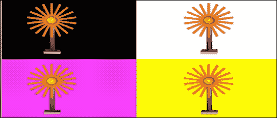

## 还有更多...

只有当裁剪测试启用时，`glScissor()` 才会工作；`glScissor` 定义一个矩形并在窗口坐标中调用裁剪框。前两个参数：`x` 和 `y` 指定框的左下角。宽度和高度指定框的尺寸。

要启用和禁用裁剪测试，请使用带有`GL_SCISSOR_TEST`参数的[`www.khronos.org/opengles/sdk/docs/man/xhtml/glEnable.xml`](https://www.khronos.org/opengles/sdk/docs/man/xhtml/glEnable.xml)和[`www.khronos.org/opengles/sdk/docs/man/xhtml/glDisable.xml`](https://www.khronos.org/opengles/sdk/docs/man/xhtml/glDisable.xml)调用。此测试最初是禁用的。当裁剪测试被启用时，只有位于裁剪框内的像素可以被绘图命令修改。窗口坐标在帧缓冲区像素的共享角落具有整数值。

**语法**:

```java
void glScissor(GLint x, GLint y, GLsizei width, GLsizei height);
```

| 变量 | 描述 |
| --- | --- |
| `x`, `y` | 这指定了裁剪框的左下角。`x`，`y`的初始值是(`0`, `0`)。 |
| `width`, `height` | 这指定了裁剪框的宽度和高度。当一个 GL 上下文首次附加到窗口时，宽度和高度被设置为该窗口的尺寸。 |

## 参见

+   *参考第八章中的“在抬头显示上渲染文本”配方，字体渲染*
