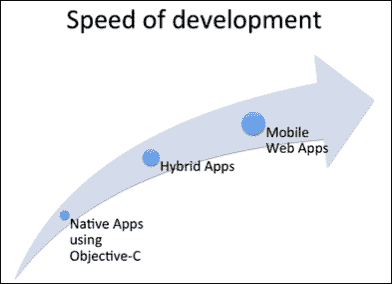
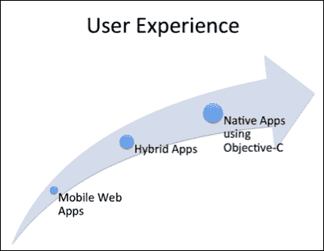
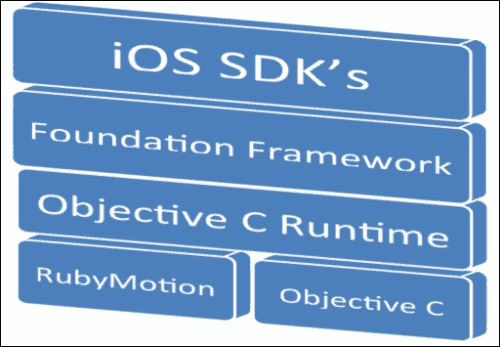
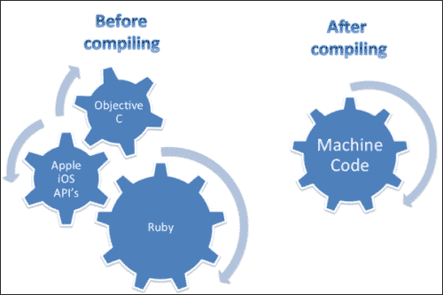
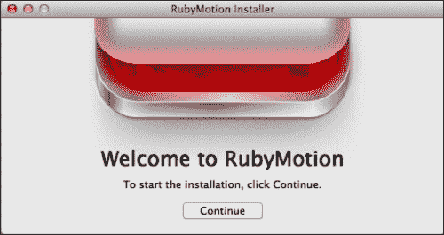
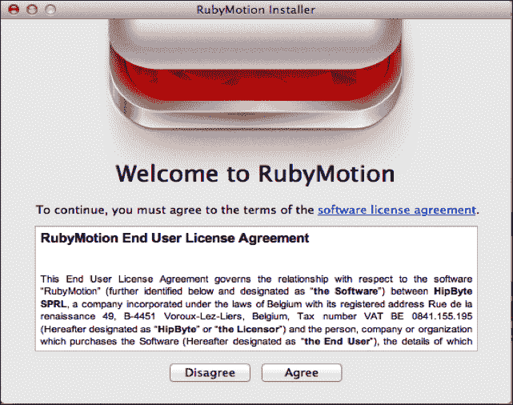
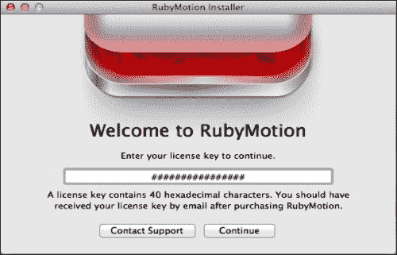
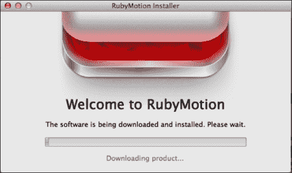

# 第一章。为 RubyMotion 做准备

*"如果你从未开始，你就永远不会赢。"*

*–*海伦·罗兰**

欢迎来到**RubyMotion** **iOS**开发基础。本书的目标是让您快速熟悉 RubyMotion，并开始为您的最爱 iOS 设备构建应用。自从第一代 iPhone 推出以来，紧接着是 iPad，iOS 设备因其革命性地改变了人们的工作方式而变得非常受欢迎，从而开启了一个提高生产力的时代。这些设备背后惊人的增长成功在于它们所捆绑的应用程序，这些应用程序极大地增加了它们的功能。

我们将通过从头开始构建示例应用来学习如何使用 RubyMotion 开发 iOS 应用。我们将在每个章节结束时尝试通过运行代码来获得一些有形的东西，以便您可以看到章节之间的清晰进展。尽管 RubyMotion 和 iOS Cocoa API 非常庞大，并且是快速移动框架的一部分，但我们将关注在发布后已经固化的较小、更稳定的 RubyMotion 核心技术集。这意味着您在这里获得的知识不会很快过时。本书是以零到部署的方法编写的。

在本章中，我们将学习：

+   创建 iOS 应用的多种方式

+   RubyMotion 与其他框架的不同之处

+   RubyMotion 安装

# 我该如何开发 iOS 应用？

要开发 iOS 应用，除了 Apple 库之外，还有各种第三方框架可用。如果我们从广义上分类我们可以创建 iOS 应用的方式，我们可以将它们分为三种。

## 使用 Objective-C 编写的原生应用

这是构建您应用的最标准方式，通过与 Apple API 交互，并用**Objective-C**编写应用。使用原生 Apple API 制作的应用可以使用所有可能的设备功能，并且相对更可靠、性能更高（然而，根据开发者的代码质量，性能的话题是有争议的）。

## 移动网页应用

移动网页应用是针对移动网页浏览器扩展的简单网页应用，可以使用标准网页技术（如 HTML5）创建。例如，如果我们在一个移动浏览器中浏览[`www.twitter.com`](http://www.twitter.com)，它将被重定向到[`mobile.twitter.com`](http://mobile.twitter.com)，为移动设备渲染相应的视图。这些应用易于创建，但缺点是它们对用户数据（例如，电话簿）和硬件（例如，摄像头）的访问有限。

## 混合应用

这些应用介于移动网页应用和原生应用之间。它们使用常见的网页技术（如 HTML5 和 JavaScript）创建，并且能够通过自家的 API 使用设备功能。一些流行的混合框架包括 Rhomobile 和 Phonegap。

如果我们将开发速度和用户体验进行比较，可以用以下图表来总结：



从前面的图中我们可以看出，移动网页应用可以非常快速地创建，但我们必须在用户体验上做出妥协。虽然使用 Objective-C 开发的本地应用具有良好的用户体验，但对于 Web 开发者来说，它们的学习曲线非常陡峭。

RubyMotion 对用户和开发者来说都是好消息。用户可以体验到原生应用程序的惊人体验，而开发者能够比使用 Objective-C 开发的应用程序更快地开发应用程序。现在让我们来了解 RubyMotion。

# 什么是 RubyMotion？

RubyMotion 是一个工具链，允许开发者使用 Ruby 编程语言开发本地 iOS 应用程序。RubyMotion 作为一个编译器与 iOS **SDK**（**软件开发工具包**）交互。这使我们能够充分利用苹果的库；因此，一旦应用程序编译并加载，设备就不知道它是使用 Objective-C 还是 RubyMotion 制作的。

RubyMotion 是 HipByte 的产品，由 Laurent Sansonetti 创立。

### 注意

Laurent Sansonetti 是一位前苹果员工，也是 MacRuby 的幕后推手。MacRuby 是在 Mac OS X 核心技术之上实现的 Ruby，苹果公司维护了超过 4 年。最好的部分是 RubyMotion 是基于 MacRuby 的。

当使用 Ruby 开发 RubyMotion 应用程序时，你始终可以访问 iOS SDK 类。这使你能够混合使用 Objective-C 和 Ruby 代码，因为 RubyMotion 在 Objective-C 运行时和 iOS Foundation 类之上实现了 Ruby。



这就是典型的 RubyMotion 应用程序的工作方式。RubyMotion 编写的代码完全编译成机器码，因此 RubyMotion 创建的应用程序与使用 Objective-C 创建的应用程序一样快。



# 为什么选择 RubyMotion？

到目前为止，我们已经了解了 RubyMotion 是什么，但脑海中浮现的问题是我们为什么要使用 RubyMotion？RubyMotion 是构建健壮 iOS 应用程序的良好选择，有许多原因。以下几节详细介绍了我们认为最重要的几个原因。

## 如果你不是 Objective-C 的粉丝

对于新手开发者来说，Objective-C 是一项艰巨的任务。编写代码很复杂；即使是做一件简单的事情，我们也必须编写很多行代码。尽管它是一种功能强大的语言，也是最好的面向对象语言之一，但它耗时且学习曲线非常陡峭。另一方面，与 Objective-C 相比，Ruby 更具有表现力、简单且高效。由于其简单性，开发者可以将注意力转移到解决问题上，而不是花费时间在 Ruby 本身就能处理的琐事上。简而言之，我们可以这样说，RubyMotion 允许我们使用 Objective-C 的力量，同时拥有 Ruby 的简单性。

在 RubyMotion 中使用的 Ruby 类是从 Objective-C 类继承的。如果你熟悉面向对象编程的概念，你可以理解它的强大之处。这意味着我们可以直接在 RubyMotion 代码中使用 Apple iOS SDK 类。我们将在下一章中进一步讨论这一点。

### 小贴士

RubyMotion 中的 Ruby 类与 Objective-C 有相同的祖先。

## 它不是一个桥接器

RubyMotion 应用可以直接访问 iOS SDK API，这意味着使用 RubyMotion 创建的应用程序大小和性能与使用 Objective-C 创建的应用程序相当。它是在 Objective-C 运行时和 iOS Foundation 类之上实现 Ruby 的。RubyMotion 使用基于**低级虚拟机**（**LLVM**）的先进静态编译器，将 Ruby 源代码转换为极快的机器代码。原始源代码永远不会出现在应用程序包中。一个典型的应用程序大小小于 1 MB，但根据使用情况，大小可能会增加。

## 管理内存

RubyMotion 的一个关键特性是它负责内存管理。就像 Xcode 4.4 及更高版本中的**ARC**（**自动引用计数**）一样，一旦对象不再使用，我们就不必痛苦地释放内存。RubyMotion 会自动处理，我们不需要考虑它。它自己处理这一切。

## 基于终端的工作流程

RubyMotion 有一个基于终端的工作流程；从创建应用程序到部署，所有操作都可以通过终端完成。如果你习惯于在终端上工作，你知道这有助于加快开发速度。

## 使用 REPL 轻松调试

运行 Rake 的终端窗口还提供了使用**REPL**（**读取-评估-打印循环**）进行调试的选项，这允许你使用即时评估的 Ruby 表达式，并且当应用程序仍在运行时，结果会反映在模拟器上。在运行时对用户界面和内部应用程序数据结构进行实时更改的能力对于测试和解决应用程序问题非常有用，因为这可以节省大量时间，并且比传统的**编辑-编译-运行**循环要快得多。如果你现在感到困惑，不要担心，我们将在后面的章节中进一步讨论这个强大的功能。

### 小贴士

REPL 与 Ruby 中的 IRB 类似。

## 它是可扩展的

我们只需在 `Rakefile` 中添加它们，就可以轻松使用 RubyMotion 盐化宝石。什么是 RubyMotion 盐化宝石？我们无法使用目前所有可用的 Ruby 宝石，但有很多是为 RubyMotion 专门开发的宝石。随着 RubyMotion 开发者社区的扩大，其宝石集合也将扩大，这将使我们的应用程序开发更加快速。

第三方 Objective-C 库可以很容易地在 RubyMotion 项目中使用。它支持 CocoaPods，这是一个 Objective-C 库的依赖管理器，这使得这个过程变得更容易一些。

## 调试和测试

RubyMotion 拥有一个基于控制台的内置交互式调试器，用于在模拟器和设备上使用 **GDB**（**GNU 调试器**）来调试问题。GDB 本身就非常强大，RubyMotion 使用它来调试编译后的 Ruby 代码。此外，RubyMotion 项目非常适合测试驱动开发（TDD）。我们可以从代码一开始就编写单元测试。我们可以使用行为驱动开发（BDD）与 RubyMotion，这是每个项目都集成的。我们将在后面的章节中更详细地讨论测试。

### 小贴士

RubyMine 编辑器也支持 RubyMotion，并且它通过断点拥有一个非常强大的调试机制。

# 快速问答

Q.1. 我们如何区分由 RubyMotion 创建的 iOS 应用程序和由 Objective-C 创建的 iOS 应用程序？

1.  您可以根据应用程序的用户体验来区分。

1.  您可以根据应用程序的性能来区分。

1.  您不能根据应用程序的用户体验和性能来区分。

    解决方案：如果你的答案是选项 3，你是正确的。我们不能区分由 RubyMotion 或 Objective-C 创建的应用程序，因为用户体验和性能相似。

Q.2. 我们如何扩展 RubyMotion？

1.  我们可以使用 Objective-C 库。

1.  我们可以使用所有 Ruby 宝石。

1.  我们可以使用 RubyMotion 风格的宝石。

1.  我们不能使用任何其他库。

    解决方案：如果你的答案是选项 1 和 3，你是正确的。是的，我们可以使用 Objective-C 库以及 RubyMotion 风格的宝石。

# RubyMotion 安装 – 准备您的环境

现在我们已经对 RubyMotion 有了一个很好的介绍，让我们设置我们的开发环境；但在那之前，让我们先了解一下一些先决条件。

## RubyMotion 的先决条件

+   您需要一个 Mac OS：我们无法在其他操作系统上使用 RubyMotion 开发 iOS 应用程序；所以我们肯定需要一个 Mac OS。

+   OSX 10.6 或更高版本：RubyMotion 需要运行 OSX 10.6 或更高版本的 Mac。强烈推荐使用 OSX 10.7 狮子版。

+   Ruby：Ruby 框架在 Mac OS X 中预先安装。如果你有多个 Ruby 版本，我们建议你使用 **Ruby 版本管理器**（**RVM**）。更多详情，请访问 [`rvm.io/`](https://rvm.io/)。

+   Xcode：接下来我们需要安装 Xcode，它包括由 Apple 开发的 iOS SDK，对于开发 iOS 应用程序是必不可少的。它可以从 App Store 免费下载。它还包括 iPhone/iPad 模拟器，我们将用它来测试我们的应用程序。

+   **命令行工具**：在安装 Xcode 工具链后，我们需要安装命令行工具包，这对于 RubyMotion 是必要的。要确认命令行工具已与你的 Xcode 一起安装，请打开“应用程序”文件夹中的`Xcode`，转到“首选项”窗口，并点击“下载”标签。你应该在这个列表中看到“命令行工具”包。如果尚未安装，请确保点击“安装”按钮。

### 小贴士

如果你有一个旧的 Xcode 版本，请在终端上运行以下命令：

```swift
sudo xcode-select -switch /Applications/Xcode.app/Contents/Developer

```

此命令将设置默认的 Xcode 路径。

## 安装 RubyMotion

RubyMotion 的安装非常简单，几乎不需要时间。RubyMotion 是一个需要从 [www.rubymotion.com](http://www.rubymotion.com) 购买的商业产品。一旦购买，你将收到你独特的许可证密钥和安装程序。

RubyMotion 安装是一个五步程序，如下所示：

1.  一旦你收到软件包，按照以下方式运行 RubyMotion 安装程序：

1.  阅读并接受 **EULA**（**最终用户许可协议**）。

1.  输入你收到的许可证编号，如以下截图所示：

1.  短暂休息时间——RubyMotion 下载和安装到你的系统上需要几分钟。你可以放松一下。

1.  哈哈！没有第五步。这就是开始使用 RubyMotion 的工作如此之快的原因。

## 更新 RubyMotion

RubyMotion 是一个快速发展的框架，一旦有新版本发布，我们就需要升级它。升级 RubyMotion 真的是非常简单——只需一条命令，你就可以轻松升级到最新版本。

```swift
sudo motion update

```

升级需要连接到互联网。

### 注意

如果你想要使用旧版本，可以使用以下命令降级：

```swift
sudo motion update –force-version=1.2

```

但我们建议使用最新版本。

## 我们如何检查我们已经做了一切正确？

现在我们已经安装了 RubyMotion 的副本，确认我们安装了哪个版本是一个好习惯；为此，请转到终端并运行以下命令：

```swift
motion –v

```

此命令输出你机器上安装的 RubyMotion 版本。如果你收到错误，你需要重新安装。

## 选择你自己的编辑器——你不必强制使用 Xcode

使用 RubyMotion，你不必强制使用 Xcode。由于每个开发者都更习惯于特定的编辑器，你可以自由选择你喜欢的。然而，我们推荐以下编辑器用于 Ruby 开发：

+   RubyMine

+   Vim

+   TextMate

+   Sublime

+   Emacs

### 小贴士

RubyMine 现在为 RubyMotion 项目提供全面支持。

## 如何获取帮助

如果您遇到一些问题，获取解决方案的首选方式是在 RubyMotion Google 群组中讨论，([`groups.google.com/forum/?fromgroups#!forum/rubymotion`](https://groups.google.com/forum/?fromgroups#!forum/rubymotion))，在那里您可以与社区中的其他开发者互动并获得快速解决。

有时您可能无法从 RubyMotion 群组获得精确的回复。不用担心，RubyMotion 支持团队在那里帮助您。如果您有功能请求、问题或只是想提问，您可以提交支持工单——也可以使用以下命令从命令行提交：

```swift
$ motion support

```

这将在您的浏览器中打开一个新窗口。您可以在其中填写并提交您的查询表单。您的 RubyMotion 许可证密钥、电子邮件地址和环境详情将自动添加。

### 小贴士

RubyMotion 社区正在以非常快的速度增长。在很短的时间内，许多流行的 RubyMotion gems 都是由开发者创建的。

# 常见问题解答

我们相信没有问题是无厘头的。到目前为止，您可能对 RubyMotion 有很多疑问。我们试图回答了一些与该节中涵盖的主题相关的最常见问题（FAQ）。以下是一些：

Q1. 使用 RubyMotion 创建的应用程序是否符合苹果的指导方针？

答案。是的，RubyMotion 严格遵循苹果提供的审查指南。许多使用 RubyMotion 创建的应用程序已经在 App Store 上可用。

Q2. 我的 RubyMotion 应用程序能在 Blackberry、Android 或 Windows 手机上运行吗？

答案。不，使用 RubyMotion 创建的应用程序仅适用于 iOS 设备；它是 Objective-C 编程的替代方案。对于单源多设备应用程序，我们建议使用混合框架，如 Rhomobile、Phonegap 和 Titanium。如果您想使用 Ruby 进行 Android 开发，可以尝试 Rubuto。

Q3. 我可以与他人分享应用程序吗？

答案。是的和不是。作为苹果开发者计划会员，您只能将应用程序用于测试目的，最多分享给 100 台设备，每台设备都必须单独向苹果注册。此外，您不能在 App Store 上分发您的应用程序进行测试。一旦您完成应用程序的开发并准备发布，您可以将其提交给苹果进行 App Store 审查。

Q4. 我可以使用 Ruby gems 吗？

答案。是的和不是。不是因为我们不能使用您通常在 Ruby on Rails 项目中使用的普通 Ruby gems；但是可以，因为您可以使用专门为 RubyMotion 开发的 gem，而且已经有许多这样的 gem。

Q5. 我的应用程序能在 iPad 和 iPod Touch 上运行吗？

答案。绝对可以，您的应用程序将在任何 iOS 设备上运行，即 iPhone、iPad 和 iPod Touch。

Q6 Ruby 是否允许在 App Store 上使用？

答案。App Store 无法区分使用 Objective-C 和 RubyMotion 制作的应用程序。所以，不用担心，我们的 RubyMotion 应用程序适合 App Store。

Q7\. 我可以使用第三方 Objective-C 库吗？

答案。当然可以。你可以在项目中使用第三方 Objective-C 库。RubyMotion 提供了与 CocoaPods 依赖管理器的集成，这有助于减少麻烦。你也可以使用 C/C++代码，只要你将其封装到 Objective-C 类和方法中。

Q8\. RubyMotion 是否开源？

答案。RubyMotion 作为一个工具链是开源的（可在 GitHub 上找到）。封闭源代码的部分是 Ruby 运行时，然而，它与 MacRuby 运行时（也是开源的）非常相似。

# 摘要

在我们进入下一章之前，让我们回顾一下到目前为止所学的所有内容。我们首先讨论了创建 iOS 应用程序的不同方法。然后我们从 RubyMotion 开始，讨论了为什么要使用它。在最后一节中，我们学习了如何开始使用 RubyMotion 以及哪种编辑器适合它。

现在我们已经将 RubyMotion 框架搭建并运行起来，接下来的明显任务就是创建我们的第一个应用程序，也就是最基础的`Hello World`应用程序。在下一章中，我们还将学习 RubyMotion 应用程序的一般结构。
