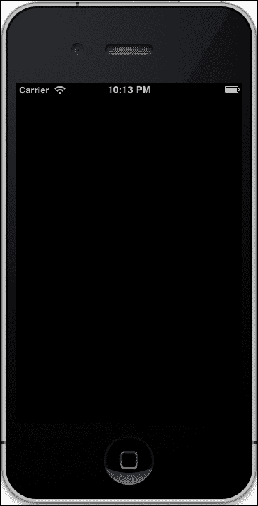
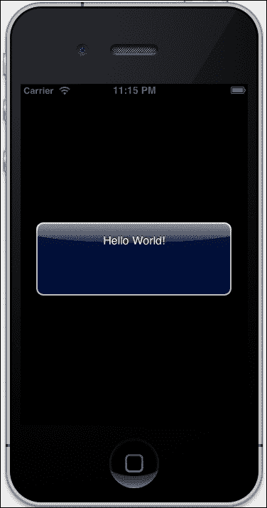
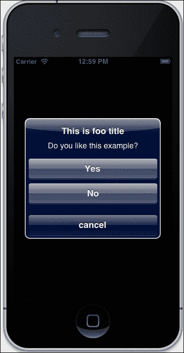
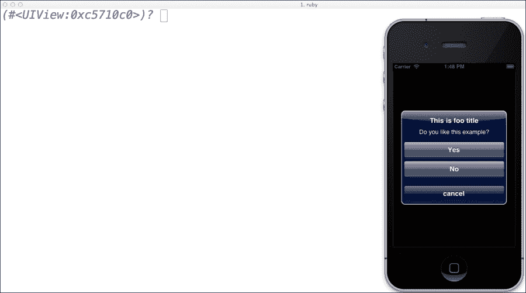
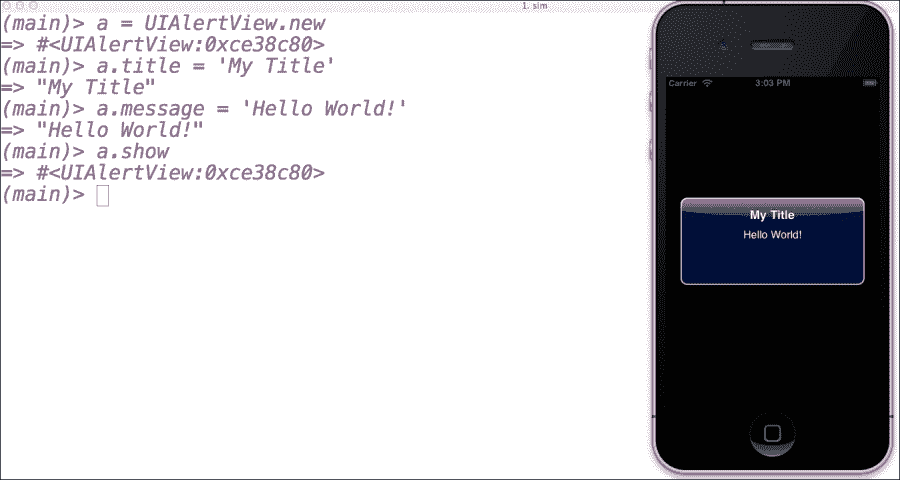

# 第二章. 立即满足感 – 您的第一个应用程序

*"梦想不可能的事情，探索未知，成就伟大。"*

*–*匿名**

既然我们对 RubyMotion 充满热情，并且已经设置了系统，让我们创建一个简单的 RubyMotion 应用程序。我们将尽量保持简单，但有时您可能会因为单调地输入代码而感到脱节。尽管如此，目前跟随进度就足够了。请记住，模仿是一种强大的学习方法；这就是我们学会大多数技能的方式，比如说话、阅读、写作，这也是您学习使用 RubyMotion 编程的方式。我们向您保证，到这本书的结尾，您将拥有足够的 RubyMotion 知识来创建 iOS 应用程序并将其发布到 App Store。在本章中，我们将涵盖以下主题：

+   创建您的第一个 RubyMotion 应用程序

+   理解文件夹结构

+   探索命令行

+   配置您的应用程序

+   REPL – 交互式控制台

+   调试器

# 您的第一个应用程序

让我们从经典的 `HelloWorld` 应用程序开始。正如我们在上一章中讨论的，RubyMotion 有基于终端的流程，所以让我们启动我们的终端并创建我们的第一个 RubyMotion 应用程序。

```swift
$motion create HelloWorld
Create HelloWorld
    Create HelloWorld/.gitignore
    Create HelloWorld/Rakefile
    Create HelloWorld/app
    Create HelloWorld/app/app_delegate.rb
    Create HelloWorld/resources
    Create HelloWorld/spec
Create HelloWorld/spec/main_spec.rb
```

如果您仔细观察终端屏幕上的输出，您将看到单个 `motion` 命令生成了许多文件和目录，它自动创建了标准目录，您还将看到将快速使我们熟悉应用程序开发的文件结构，我们可以在以后对其进行工作并增强以制作一个功能齐全的应用程序。此外，由于结构对所有 RubyMotion 应用程序都是通用的，因此很容易理解。

### 注意

就像 `motion` 命令一样，流行的框架如 Ruby on Rails 也有 `rails` 这样的命令来创建预定义的应用程序布局。

以下步骤会自动编译代码并在模拟器上启动应用程序：

1.  启动应用程序，切换到应用程序目录，并输入以下命令：

    ```swift
    $ cd HelloWorld
    $rake
    Build ./build/iPhoneSimulator-6.0-Development
    Compile ./app/app_delegate.rb
    Create ./build/iPhoneSimulator-6.0-Development/HelloWorld.app
    Link ./build/iPhoneSimulator-6.0-Development/HelloWorld.app/HelloWorld
    Create ./build/iPhoneSimulator-6.0-Development/HelloWorld.app/Info.plist
    Create ./build/iPhoneSimulator-6.0-Development/HelloWorld.app/PkgInfo
    Create ./build/iPhoneSimulator-6.0-Development/HelloWorld.dSYM
    warning: no debug symbols in executable (-arch i386)
    Simulate ./build/iPhoneSimulator-6.0-Development/HelloWorld.app

    ```

    

    哇！`rake` 命令自动编译代码并在模拟器上启动应用程序。到目前为止，我们还没有为我们的应用程序创建任何视图；这就是为什么我们看到一个空白屏幕。看起来很无聊，但请记住，我们还没有编写一行代码。所以让我们写一些代码，创建一些视图，并再次构建我们的应用程序。

    ### 小贴士

    您可以使用您最喜欢的编辑器打开 RubyMotion 项目。如果您还没有编辑器，您可以使用 TextEdit 或 VIM。

1.  在应用程序文件夹中打开 `app_delegate.rb` 文件，并在其中添加以下代码：

    ```swift
    class AppDelegate
      def application(application, didFinishLaunchingWithOptions:launchOptions)
       alert = UIAlertView.new
       alert.message = "Hello World!"
       alert.show
       true
      end
    end
    ```

1.  让我们重新运行我们的应用程序，切换到应用程序目录并输入执行命令（`rake`）：

    ```swift
    $rake

    ```

    `rake` 命令将编译我们的代码并启动 iPhone 模拟器。您可以在以下屏幕截图中看到一个蓝色的弹出窗口，上面写着 **Hello World!**：

    

    让我们了解我们在 `AppDelegate` 中编写的代码。在这里，当我们的应用程序启动时，首先调用应用程序方法（`didFinishLaunchingWithOptions:launchOptions`）。这将是我们应用程序的起点，也是定义我们窗口的正确位置。

    RubyMotion 函数是常用 Ruby 方法名（`didFinishLaunchingWithOptions`）与其命名参数的组合；一个变量直接跟在函数后面，它引用了这个函数，因此，我们不需要知道函数的实现。

    ### 注意

    命名参数被添加到 RubyMotion 中，以保留现有的 Objective-C API，额外的符号是方法名称的必要部分，例如，`didFinishLaunchingWithOptions:``launchOptions`。

    如前所述，在应用程序初始化时，`AppDelegate` 中编写的代码将被自动调用。

    在下面的代码片段中，我们创建了一个 `UIAlertView` 类的 alert 对象，并将一个 `Hello World!` 字符串赋值给对象的 message 属性。现在我们的 alert 对象已经准备好了。要在设备屏幕上显示这个 alert，我们可以在 alert 对象上调用 show 方法，如下所示：

    ```swift
       alert = UIAlertView.new
       alert.message = "Hello World!"
       alert.show
    ```

    `UIAlertView` 是 iOS 的 `UIKit` 框架中捆绑的一个类。我们可以使用这个类在屏幕上显示一个 alert 消息。这个类是从 `UIView` 继承的，而 `UIView` 又是从 `UIResponder` 继承的，`UIResponder` 又是从 `NSObject` 继承的。

    ### 注意

    **为什么我们看到 NS 前缀？**

    Objective-C 是 C 的超集，因此没有像 C++ 中的命名空间；因此，符号必须使用唯一的前缀来标记，以避免冲突。这对于在框架中定义的符号尤其重要。Cocoa 框架的原始代码来自 NextStep 库，因此 NextStep 工程师选择使用 NS 前缀来标记他们的符号。

1.  要退出应用程序，通过选择 **退出** 选项或按 *Command* + *Q* 来关闭模拟器。

    ### 小贴士

    iOS 模拟器是一个快速测试应用程序的强大工具。它随 Xcode 一起提供。但是，你无法在模拟器上测试所有内容。为了测试设备的摇晃、相机、GPS、加速度计、陀螺仪和其他设备功能，你可能需要额外的产品将设备数据传递到模拟器中的应用程序中。

# 文件夹结构

在本节中，我们将了解我们应用程序的文件夹结构，正如我们从前一节中知道的那样，`motion create <project name>` 会设置目录结构，包括运行简单 RubyMotion 应用程序所需的所有基本文件。让我们逐一了解它们的功能：

+   `app` 文件夹：这是你应用程序代码的核心；你将在这个文件夹中编写大部分代码。RubyMotion 会在这个文件夹中迭代，并加载它捕获的任何 `.rb` 文件。

    ### 小贴士

    如果你想在 `app` 目录之外的其他地方保存代码，请将文件夹路径添加到 `Rakefile` 中。

+   `app`文件夹中的`app_delegate.rb`文件：这个文件是 RubyMotion 应用程序的核心。如果您对 iOS 开发有些了解，这个文件就是代理文件。代理是一个对象，它通常会对另一个对象中的某些事件做出反应，并且/或者可以影响另一个对象的行为。可以在`UIApplicationDelegate`中实现各种方法。这些方法在应用程序的不同阶段被调用，例如在启动完成时、在终止时、当应用程序内存不足时以及发生重要变化时。当应用程序运行时，跟踪其状态转换是应用程序代理的主要任务之一。

    应用程序代理使用`application:didFinishLaunchingWithOptions`方法作为第一个入口点。当您的应用程序启动后，该方法会被调用。当这个方法被调用时，您的应用程序处于非活动状态。还有一些其他的方法可用：

    +   `applicationWillEnterForeground`

    +   `applicationWillTerminate`

    +   `application:shouldSaveApplicationState`

    +   `application:shouldRestoreApplicationState`

    可以从 iOS 开发者库（[`developer.apple.com/library/ios`](http://developer.apple.com/library/ios)）中获得可用的方法列表。这里的好处是，大多数方法的名字本身就具有自解释性。例如，当您的应用程序重新启动时，会调用`applicationWillEnterForeground`。

    ### 小贴士

    我们看到在某些 iOS 6 应用程序中，应用程序被恢复到之前的状态；我们可以在应用程序代理中处理这种情况。

+   `resources`文件夹：正如其名所示，`resources`文件夹包含静态内容，例如图像、声音、UI 布局和我们在应用程序中使用的图标。

+   `Spec`文件夹：这个文件夹包含自动测试用例。RubyMotion 支持 Ruby 测试框架 Bacon；它是一个小的 RSpec 克隆，用于编写单元测试、功能测试和 UI 测试。默认情况下，它创建`main_spec.rb`作为示例。

+   `Rakefile`: 使用`Rakefile`，我们可以配置应用程序名称、资源、要包含的 gem 以及代码位置。我们将在本章后面更详细地讨论`Rakefile`。

# 一些额外的功能

我们知道，只有简单的`HelloWorld`弹出窗口作为我们的第一个应用程序并不是很有趣，所以让我们通过向警告框添加一些额外的功能来使我们的代码更加丰富；这次，让我们以更好的方式来做这件事。

之前我们在代理本身中添加了一个警告框。实际上，在应用程序代理中编写代码并不是一个好主意。更好的做法是以模型-视图-控制器（MVC）的方式编写代码。现在我们不会涵盖 MVC 架构的所有三个部分，让我们先从我们的应用程序的控制器开始，在这个警告框中添加三个按钮，添加一个标题，并为标题框添加一条消息。

我们在上一个章节中使用的`UIAlertView`类有众多属性，例如标题、消息、委托、取消按钮标题、其他按钮等。让我们在我们的应用程序中使用其中的一些，如下所示：

1.  在`app`文件夹中创建一个名为`root_controller.rb`的文件，并添加以下代码：

    ```swift
    class RootController < UIViewController
        def viewDidLoad
        alert = UIAlertView.alloc.initWithTitle "This is foo title",
          message:"Do you like this example?",
            delegate: nil,
            cancelButtonTitle: "cancel"
            otherButtonTitles: "Yes","No",nil
        alert.show
        end
    end
    ```

1.  要调用此控制器，我们需要更新我们的`AppDelegate`类。替换你的`app_delegate.rb`文件中的以下代码：

    ```swift
    class AppDelegate
      def application
        (application,didFinishLaunchingWithOptions:
          launchOptions)
        @window = UIWindow.alloc.initWithFrame
          (UIScreen.mainScreen.bounds)
        @window.rootViewController = RootController.alloc.init
        @window.rootViewController.wantsFullScreenLayout = true
        @window.makeKeyAndVisible
        true
      end
    end
    ```

1.  通过在应用程序目录内的控制台中运行`rake`命令来启动模拟器，具体操作如下：

    非常酷；我们之前的`HelloWorld`弹出窗口现在已被替换为具有标题、取消按钮和两个其他按钮的警告框。

    ### 注意

    iOS SDK 是围绕 MVC 模式构建的，该模式分离了责任，最终得到一个易于设计和维护的应用程序。

## 让我们理解代码

当 iPhone 应用程序启动时，它会在屏幕上放置一个窗口，这是我们使用`UIWindow`类创建的。你可以把窗口想象成一个画布，你可以在上面放置任何东西，比如按钮、文本框或标签。`UIWindow`类的实例管理并协调应用程序在设备屏幕上显示的视图。

`UIScreen`对象包含设备整个屏幕的边界矩形。因此，`UIScreen.mainScreen.bounds`返回根据设备屏幕大小和方向返回的矩形大小。

### 小贴士

每个 iOS 应用程序至少需要一个窗口，它是一个`UIWindow`类的实例。

你可能想知道，我是否需要记住所有 Apple iOS SDK 的属性和方法，例如`UIAlertView`？没有必要记住它们，因为你可以随时从 iOS 开发库中查阅属性和方法。然而，对类的使用有一个基本的了解有时会很有帮助。流行的 IDE，RubyMine，支持 RubyMotion。它还拥有一个有用的自动完成功能。

### 小贴士

理解得越多，需要记住的就越少。

# 探索命令行

RubyMotion 基于一个基本原理，“使用开发者喜爱的工具”。因此，要使用 RubyMotion 创建应用程序，我们只需要两个工具；第一个是你的首选编辑器，第二个是终端。在开发 RubyMotion 应用程序时，你需要熟悉命令行。熟悉终端总是有助于更快、更舒适地开发。

现在我们已经创建了`HelloWorld`应用程序，让我们探索一些我们已经使用过的命令，并记住 RubyMotion 相当程度上使用它们。这些命令负责启动我们的 RubyMotion 项目，`motion`和`rake`。

## 动作命令 – 一站式商店

如前所述，`motion` 命令创建我们的 RubyMotion 项目，并支持各种其他选项。`motion` 命令类似于流行的框架 Ruby on Rails 的 `rails` 命令。在我们继续前进之前，让我们打开终端，看看可以使用 `motion` 命令做什么。

```swift
$ motion
Usage:
 motion [-h, --help]
 motion [-v, --version]
 motion <command> [<args...>]
Commands:
 account      Access the software license account
 activate     Activate the software license
 create       Create a new project 
 ri           Display API reference 
 update       Update the software
 support      Create a support ticket

```

+   `motion account`：此命令在浏览器上显示账户/许可证信息。

+   `motion activate`：如果你想使用新的许可证激活你的 RubyMotion 框架，或者你尚未激活框架，可以使用 `motion activate`。

+   `motion create <项目名称>`：此命令将生成一个 RubyMotion 项目的骨架，其中包含开始开发 iOS 应用程序所需的所有基本文件。

+   `motion ri <API-name>`：此命令帮助我们找到已提及的 API 的文档。

+   `motion update`：RubyMotion 是一个快速发展的框架，通常需要更新。`motion update` 命令可以从命令行本身更新你的框架。

+   `motion support`：有时你可能只有专家才能回答的问题。`motion support` 帮助你直接与 RubyMotion 连接，你可以通过填写表格来提问。它也可以用于任何功能请求或报告错误。

## Rake 任务 – 快速完成任务

Rake 是一个简单的 Ruby 构建程序，其功能类似于 `Make`。RubyMotion 的 `rake` 命令拥有许多预定义的任务，可以帮助你轻松完成一些琐碎的工作，例如将你的代码编译以在模拟器中测试，或者创建一个用于设备测试的包。让我们再次打开终端，并检查可以使用 `rake --tasks` 执行哪些任务。

```swift
$ rake ––tasks

```

下表详细说明了不同的 Rake 任务：

| Rake task | 描述 |
| --- | --- |
| Rake archive | 创建 `.ipa` 归档 |
| Rake archive:distribution | 创建用于分发的 `.ipa` 归档 |
| Rake build | 构建所有内容 |
| Rake build:device | 构建设备版本 |
| Rake build:simulator | 构建模拟器版本 |
| Rake clean | 清除构建对象 |
| Rake config | 显示项目配置 |
| Rake ctags | 生成 ctags |
| Rake default | 构建项目，然后运行模拟器 |
| Rake device | 在设备上部署 |
| Rake simulator | 运行模拟器 |
| Rake spec | 与 `spec:simulator` 相同 |
| Rake spec:device | 在设备上运行测试/规范套件 |
| Rake spec:simulator | 在模拟器上运行测试/规范套件 |
| Rake static | 创建静态库 |

因此，Rake 有许多任务可以执行，但最重要的是，在所有这些任务中，如果我们简单地运行 Rake，它将在 iOS 模拟器上构建和运行我们的应用程序。

## Rake 文件 – 配置你的应用程序

RubyMotion 应用程序可以通过 `Rakefile` 中的不同属性进行高度配置。默认情况下，这些属性具有合理的值，但可以用自定义值覆盖。让我们探索每一个——随着我们继续进行应用程序的开发，这一部分将一次又一次地派上用场。

要查看当前应用程序配置，请运行`rake config`任务，您将看到以下列表：

```swift
$ rake config
background_modes       : []
build_dir              : "./build"
codesign_certificate   : "Error"
delegate_class         : "AppDelegate"
deployment_target      : "6.0"
device_family          : :iphone
entitlements           : {}
files                  : ["./app/app_delegate.rb", "./app/twitter.rb", "./app/twitter_controller.rb"]
fonts                  : []
frameworks             : ["UIKit", "Foundation", "CoreGraphics", "CoreGraphics"]
icons                  : []
identifier             : "com.yourcompany.MacBaconUI"
interface_orientations : [:portrait, :landscape_left, :landscape_right]
libs                   : []
motiondir              : "/Library/RubyMotion"
name                   : "MacBacon UI"
prerendered_icon       : false
provisioning_profile   : "Error"
resources_dir          : "./resources"
sdk_version            : "6.0"
seed_id                : "Error"
short_version          : "1"
specs_dir              : "./spec"
status_bar_style       : :default
version                : "1.0"
weak_frameworks        : []
xcode_dir              : "/Applications/Xcode.app/Contents/Developer"

```

您可以查看应用程序的完整配置设置。这些设置可以在`Rakefile`中修改。您可能通过它们的名称就能轻松理解这些属性的作用，但让我们解释其中的一些：

+   `name`: 这里您可以指定项目名称，以字符串形式表示。默认情况下，应用程序的名称将是您在`motion create`期间传递的属性。

+   `version`: 此变量以字符串形式保存当前应用程序版本；默认值为 1.0。

+   `identifier`: 项目标识符是一个字符串，采用反向 DNS 命名约定——即域名表示法的反向顺序——例如`com.yourcompany.yourapp`。

+   `delegate_class`: 这里您指定应用程序代理类，以字符串形式表示，一旦应用程序启动就会加载。默认值是`AppDelegate`，该类在`app`/`app_delegate.rb`文件中定义。然而，我们可以将`AppDelegate`类重命名为我们选择的任何自定义名称，然后必须在`Rakefile`中进行更新。

+   `Files`: 以数组格式显示`app`目录中的每个`.rb`文件。默认值是执行以下表达式的结果：

    ```swift
    Dir.glob(./app/*/.rb)
    ```

+   `framework`: 以数组格式显示我们应用程序中使用的 iOS 框架名称。很快您将使用许多 iOS 框架，例如 CoreFoundation、CoreMotion 等，与您的应用程序一起使用。构建系统能够处理依赖项，因此它们应该在这里提及。默认值可以是`UIKit`、`Foundation`或`CoreGraphics`。

+   `libs`: 此变量以数组格式显示要链接到应用程序的库路径。它包含公共系统库的路径，例如**/usr/lib/libz.dylib**。默认值是`[]`，一个空数组。

+   `build_dir`: 此变量用于指定要创建应用程序构建的目录路径，以字符串格式表示。它必须是项目目录的相对路径。目录最初会自动创建。如果未创建，将使用临时目录代替。默认值是`build`。

+   `resources_dir`: 此变量用于指定资源文件所在的目录，所有图像和图标都放在字符串格式中。它必须是项目目录的相对路径。默认值是`resources`。

+   `spec_dir`: 此变量用于指定包含所有测试用例的`spec`文件所在的目录，以字符串格式表示。默认值是`spec`。它应该是项目目录的相对路径。

+   `icons`：此变量以数组格式列出 `resources` 文件夹中用于应用程序的图标，例如 `icon.png` 和/或 `icon-72.png`。文件应与 Apple 的 **HIG**（**人类界面指南**）保持一致。默认值为 `[]`，一个空数组。

+   `fonts`：此变量以数组格式列出 `resources` 目录中存在的字体文件名称。这些字体将在生成应用程序包或模拟器测试时被考虑。

+   `prerendered_icon`：iOS 应用程序图标通常具有反射光泽。为此目的，使用此属性。如果为 false，则图标上会有反射光泽。默认值为 false。

+   `device_family`：使用此属性，我们可以指定应用程序支持哪种 iOS 设备系列。值可以是 `iphone`、`ipad`，或者对于通用应用程序【`:iphone`、`:ipad`】。默认值为 `:iphone`。

+   `interface_orientations`：Apple iOS 设备支持应用程序的各种方向。它们可以是 `portrait`、`landscape_left`、`landscape_right` 或 `portrait_upside_down`。默认值为包含 `:portrait`、`:landscape_left` 或 `:landscape_right` 的数组。

+   `Xcode_dir`：此配置告诉我们 Xcode 的安装位置。

    ### 注意

    给 `XCode_dir` 属性赋予新值通常应该在更改其他 `Rakefile` 属性之前完成。

+   `sdk_version`：此配置让我们决定将使用哪个 SDK 版本。默认值为支持的 SDK 的最新版本。

+   `deployment_target`：此配置显示 RubyMotion 项目应针对哪个 iOS SDK。默认值为当前安装的 SDK 版本，但可以更改为任何所需的 iOS SDK 版本，例如，使用 iOS SDK 版本 6.0 的 6.0。

+   `codesign_certificate`：此配置显示使用哪个代码签名证书。默认值为密钥链工具中的第一个 iPhone 开发者证书；例如，在我们的案例中是 **iPhone developer: Paul Akshat (S3KPMT842Z)**。

+   `provisioning_profile`：此配置变量指定配置文件的路径。

+   `seed_id`：Apple 配置文件有一个标识符。此配置显示的是相同的标识符，通常是首次从配置文件中选择的第一个应用程序标识符。

# REPL – 交互式控制台

RubyMotion 内置了一个交互式控制台，允许我们遍历和扫描我们在应用程序中使用到的代码。好事是控制台连接到了模拟器上运行的应用程序。这意味着如果我们从控制台进行任何更改，它将在模拟器上实时反映。让我们用我们的 `HelloWorld` 应用程序来试一试。

按以下步骤运行应用程序：

```swift
$rake

```

如预期，它将打开一个模拟器，终端屏幕将显示：

```swift
(main)>

```

现在按住 *Command* 键，将鼠标悬停在模拟器上。你会看到一个红色边框的框。当我们把鼠标指针移到元素上时，我们可以在终端窗口中看到其对应的类对象 `(UIView:0xc5710c0)?`，如下面的截图所示。现在点击鼠标选择你想要动态工作的对象。



在终端尝试以下命令并观察模拟器中的变化：

`self` 返回当前鼠标选定的对象。

```swift
(#<UIView:0x7652680>)> self
=> #<UIView:0x7652680>

```

为 `UIColor` 类创建一个名为 `blue` 的对象，并将蓝色分配给变量，如下所示：

```swift
(#<UIView:0x7652680>)> blue = UIColor.blueColor

```

要更改视图的背景颜色，请使用所选视图的 `backgroundColor` 属性，如下所示：

```swift
=> #<UICachedDeviceRGBColor:0xb05a800>
 (#<UIView:0x7652680>)>  self.backgroundColor = blue
=> #<UICachedDeviceRGBColor:0xb05a800>

```

确保模拟器上的背景颜色已更改为如下截图所示的蓝色：


让我们通过点击任何按钮来关闭警告框，并使用以下代码添加一个新的警告框：

```swift
a = UIAlertView.new
a.title = "My Title"
a.message = "Hello World!"
a.show
```

模拟器在屏幕上显示一个新的警告框，而无需编译代码，如下面的截图所示：



你可以按照以下方式关闭警告框：

```swift
(main) > a.dismiss

```

我们可以看到 REPL 是一个开发 iOS 应用的优秀工具，以及它如何帮助我们动态地做出更改。为了使这些更改永久化，我们需要将相同的代码添加到我们的源代码中。

# 调试器 – 捕捉你的错误！

一个典型的调试器提供了在遇到特定条件时停止的能力。它还提供了复杂的功能，例如逐步运行程序、根据断点中断或暂停程序以进行检查，以及跟踪该状态下变量的值。RubyMotion 版本 1.24 及以上支持使用 GDB 进行调试：GNU 项目调试器 ([`www.gnu.org/software/gdb/`](http://www.gnu.org/software/gdb/))。

RubyMotion 调试器提供了以下内置调试功能：

+   它在特定行停止程序

+   它检查程序停止时的问题

+   它检查特定断点处的变量值

    ### 注意

    RubyMotion 编译器实现了 Ruby 语言的 **DWARF** 调试格式的元数据。这使得外部程序，例如我们案例中的调试器，能够检索 RubyMotion 应用程序关于源级别的信息。元数据保存在项目构建目录中与 `.app` 包同一级别的 `.dSYM` 包文件中。

## 如何开始调试

我们有三种方式可以启动调试器。

### 在模拟器上进行测试时

我们可以使用模拟器启动调试器。调试器将直接附加到应用上并替换交互式外壳（REPL）。

要开始，只需输入：

```swift
$rake simulator debug=1

```

### 在设备上进行测试时

我们可以在设备运行的同时开始调试。构建系统将在设备上启动 iOS 调试服务器，然后在应用程序部署到设备后立即在您的 shell 上远程附加调试器。

```swift
$rake device debug=1

```

在发布模式下，局部变量可能无法在调试器中访问，因为它们被优化以适应 CPU 寄存器。

### 小贴士

要在设备上测试您的应用程序，您需要注册 **Apple Developer Program**。我们将在后面的章节中详细讨论。

### 在开始之前输入命令

在加载应用程序之前，我们可能需要一些断点；我们可以这样做：

```swift
$rake debug=1 no_continue=1

```

执行此命令后，GDB 将启动，我们将能够设置断点。这将在下一节中更详细地讨论。

## 断点

我们可以使用 `break` 命令在应用程序代码的特定位置设置断点，然后使用 `file_name:line_number` 表示法传递调试器应停止代码执行的位置。

让我们在当前应用程序中尝试设置一个断点。为此，我们需要以调试模式启动我们的 `HelloWorld` 应用程序，如下所示：

```swift
$rake simulator debug=1
/Library/RubyMotion/lib/motion/project/config.rb:89: 
 Build ./build/iPhoneSimulator-5.1-Development
 Simulate ./build/iPhoneSimulator-5.1-Development/HelloWorld.app
Attaching to process 86665.
Reading symbols for shared libraries . done
0x8fe6c030 in __dyld__dyld_start ()
Function "rb_exc_raise" not defined.
Breakpoint 1 (rb_exc_raise) pending.
Function "malloc_error_break" not defined.
Breakpoint 2 (malloc_error_break) pending.
Reading symbols for shared libraries .............................................................................................................. done
Breakpoint 1 at 0x37136
Pending breakpoint 1 – "rb_exc_raise" resolved
Breakpoint 2 at 0x97bdec97
Pending breakpoint 2 – "malloc_error_break" resolved
Reading symbols for shared libraries . done
Reading symbols for shared libraries . done
Reading symbols for shared libraries ... done
(gdb)

```

现在，让我们在 `app_delegate.rb` 文件的第八行设置一个断点，如下所示：

```swift
(gdb) break app_delegate.rb:8
Breakpoint 3 at 0x80085: file app_delegate.rb, line 8

```

使用前面的命令，您的应用程序将在 `app_delegate.rb` 文件的第 8 行处停止执行。

## 列出断点

要列出当前调试环境中设置的断点，我们使用以下 `info breakpoint` 命令：

```swift
(gdb) info breakpoint
Num Type           Disp Enb Address    What
1   breakpoint     keep y   0x000adff6 <rb_exc_raise+6>
2   breakpoint     keep y   0x97bdec97 <malloc_error_break+6>
3   breakpoint     keep y   0x00080085 in rb_scope__application:didFinishLaunchingWithOptions:__ at app_delegate.rb:8

```

我们可以看到，上一节中创建的断点列表也可以在列表中看到。

## 在不同的断点之间移动

`continue` 命令将继续程序的执行，直到达到下一个断点。

```swift
(gdb) continue

```

我们也可以使用其别名 `c` 如下；这样更方便：

```swift
(gdb) c
Breakpoint 3, rb_scope__application:didFinishLaunchingWithOptions:__ (self=0x9408440, application=0x9401750, launchOptions=0x4) at app_delegate.rb:8
8    alert.show

```

`next` 命令将继续程序的执行，直到下一个源级位置。这通常是 Ruby 源代码中的下一行。您应该查看终端以获取相关的源代码行。

```swift
(gdb) next

```

### 检查局部变量的值

这是有助于调试的重要功能，可以在特定的断点检查变量的值。

```swift
(gdb) pro alert
#<UIAlertView:0x944b9b0>

```

这表明警报是 `UIAlertView` 类的对象

**Pro** （**print-ruby-object**）接受以下两个参数：

+   将检索变量的对象。

+   您想要获取的变量名称。

### 小贴士

要检查我们可以执行的变量，请运行以下命令：

```swift
$info locals
```

### 检查实例变量的值

我们也可以在某个断点期间使用 **pri** （**print-ruby-ivar**）检查实例变量的值，如下所示：

```swift
pri self "@tweet"

```

`pri` 接受以下两个命令：

+   将检索实例变量的对象。

+   您想要获取的实例变量。请确保在名称中包含 `@` 字符。

### 小贴士

您可以使用 `pri @tweet` 而不是 `pri self @tweet`。

## 禁用断点

要禁用断点，请使用 `disable` 后跟断点编号；它必须按照以下方式禁用：

```swift
(gdb) disable 3

```

## 退出调试器

输入 `quit` 以退出调试器，如下所示：

```swift
(gdb) quit
The program is running.  Quit anyway (and detach it)? (y or n) y
Detaching from process 6792.

```

### 小贴士

**下载示例代码**

你可以从你购买的所有 Packt 书籍的账户中下载示例代码文件，以及本书的图形包，请访问 [`www.packtpub.com`](http://www.packtpub.com)。

如果你在其他地方购买了这本书，你可以访问 [`www.packtpub.com/support`](http://www.packtpub.com/support) 并注册以直接将文件通过电子邮件发送给你。

# 摘要

让我们回顾一下本章我们所做的工作：

+   创建了一个简单的 RubyMotion 应用程序

+   讨论了基本的 RubyMotion 应用程序结构

+   探索了 RubyMotion 可用的命令

+   使用 RubyMotion 执行了不同的 Rake 任务

+   学习了如何配置你的 RubyMotion 应用程序

+   使用交互式控制台——REPL 进行工作

+   使用 RubyMotion 调试器调试你的应用程序

在下一章中，我们将关注 RubyMotion 数据类型对象——例如字符串和数组。我们还将学习如何与 C 进行接口，并重点关注 RubyMotion 中的内存管理。
