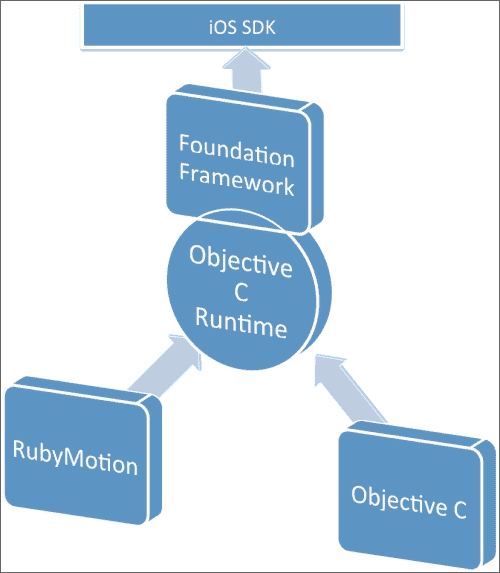

# 第三章. 进化 – 从 Objective-C 到 RubyMotion

*"实际上，我正在尝试让 Ruby 变得自然，而不是简单。"*

*— 松本行弘*

在本章中，我们将详细讨论 Ruby 在 RubyMotion 中的实现方式。我们还将了解如何在我们的 Ruby 代码中使用各种 Objective-C 对象。正如我们所知，iOS SDK 是用 Objective-C 编写的，它是 C 语言的一个简单扩展。由于这是一本关于学习 RubyMotion 的书，我们不会过多关注这一点。然而，我们将确保你拥有足够的 Objective-C 知识来在 RubyMotion 中编程。在本章中，我们将涵盖以下主题：

+   Ruby 和 Objective-C 在 RubyMotion 中的协作方式

+   RubyMotion 对象是如何从 Objective-C 继承的

+   与 C 和 Objective-C 接口 – 了解数据类型

+   RubyMotion 的内存管理

# Ruby 和 Objective-C – 一种伙伴关系

你可能想知道 Objective-C 和 Ruby 是如何协作的，因为 Objective-C 是一种编译型语言，而 Ruby 是一种解释型语言。那么，它们在 RubyMotion 中是如何协作的呢？

实际上，iOS SDK 中的 Objective-C 不仅有一个编译器，还有一个运行时系统来执行编译后的代码。这个运行时系统充当 Objective-C 语言的接口；这就是使语言工作的原因。RubyMotion 利用 Objective-C 运行时，我们的 Ruby 代码通过这个运行时系统与 Objective-C 代码以相同的方式交互。这意味着 Ruby 和 Objective-C 实际上是在 Objective-C 运行时之上工作的。



上述图表展示了 RubyMotion 和 Objective-C 在 iOS SDK 生态系统中的协作方式。简单来说，这意味着我们可以通过 Objective-C 运行时使用 RubyMotion 访问所有 iOS SDK 类。**Foundation 框架**是一个 Objective-C 框架，但好消息是 RubyMotion 实际上是基于 Objective-C 运行时的；因此，定义的类可以自然地在 RubyMotion 中重用。

### 注意

运行时库主要用 C 语言编写，并且是开源的。可以在[`opensource.apple.com`](http://opensource.apple.com)找到。

## Ruby 和 Objective-C 有共同的祖先

RubyMotion 的一些内置类基于 Foundation 框架。为了更好地理解这一点，让我们在我们的控制台中启动之前章节中的现有 RubyMotion 应用程序的 REPL。如您所记，在那个章节中我们学习了如何使用 REPL。运行`rake`命令以启动 REPL，然后在 REPL 中运行以下命令：

```swift
(main)> a = 5
=> 5
(main)> a.class
=> Fixnum
(main)> a.superclass
=> NSNumber
(main)> name = ""Abhishek""
=> ""Abhishek""
(main)> name.class
=> String
(main)> name.superclass
=> NSMutableString
(main)> a.superclass.superclass
=> NSString
(main)> a.superclass.superclass.superclass
=> NSObject

```

在前面的例子中，我们找到了 Ruby `integer` 和 `string` 类的根。首先，我们声明了一个变量并将其赋值为一个整数。当我们跟踪其类时，我们看到一个熟悉的名字，`Fixnum`，这是一个 Ruby 数据类型。但是当我们跟踪 `Fixnum` 的超类时，我们看到它是一个 Objective-C 的 Integer 类型。这表明 RubyMotion 的 `Fixnum` 数据类型是从 `NSNumber` 继承而来的。

同样，当我们声明一个字符串变量名并跟踪其类时，我们会看到一个可识别的 Ruby 类，`String`。此外，这个字符串类是从 `NSMutableString` 继承而来的。这意味着 RubyMotion 的 `String` 类是 RubyMotion 中 Objective-C 的 `String` 类的子类。


在使用 Ruby 内置类覆盖 Foundation 的情况下，其实例可以响应更多的消息。例如，`NSString` 类定义了 `uppercase` 字符串方法。由于 `String` 类是 `NSString` 的子类，因此 Ruby 中创建的字符串也可以响应该方法，如下所示：

```swift
''hello''.uppercaseString # => ''HELLO''

```

这使我们能够不仅使用 Ruby 方法，还可以访问来自 Foundation 框架的数千个类和方法，从而能够创建任何可以想象的应用程序。

其他数据类型也是以相同的方式继承的。只需看一下以下表格（来源 – [`www.rubymotion.com/developer-center/guides/runtime`](http://www.rubymotion.com/developer-center/guides/runtime))：

| Ruby 类 | 祖先 |
| --- | --- |
| `foo` | `NSObject` → `Kernel` |
| `String` | `NSMutableString` → `NSString` → `Comparable` → `NSObject` → `Kernel` |
| `Array` | `NSMutableArray` → `NSArray` → `Enumerable` → `NSObject` → `Kernel` |
| `Hash` | `NSMutableDictionary` → `NSDictionary` → `Enumerable` → `NSObject` → `Kernel` |
| `Numeric` | `Comparable` → `NSNumber` → `NSValue` → `NSObject` → `Kernel` |
| `Time` | `Comparable` → `NSDate` → `NSObject` → `Kernel` |

你一定注意到了，在 RubyMotion 中创建的字符串是从 `NSMutableString` 继承的，而不是从 `NSMutable`。这难道不奇怪吗？了解这两者之间的区别将是有益的。`NSMutableString` 对象为我们提供了更改它们所表示的字符数组的方法，而 `NSString` 对象则没有。例如，`NSMutableString` 提供了 `appendString`、`deleteCharactersInRange`、`insertString` 和 `replaceOccurrencesWithString` 等方法。所有这些方法都直接在内存中的 `NSMutableString` 对象上操作，这意味着我们可以修改原始值。另一方面，`NSString` 是一个一次性创建然后只读的字符串。我们有许多用于 `NSString` 对象的操纵方法（如 `substring`、`uppercaseString` 等）。然而，它们返回一个新的 `NSString` 对象，并且永远不会实际修改内存中的现有字符串，如下所示：

```swift
NSString.new.strip!           # raises RuntimeError: can't 
 # modify frozen/immutable string

NSMutableString.new.strip!    # works
```

由于 Ruby 中没有只读字符串，并且我们需要更新字符串，所以我们默认使用 `NSMutableString`。对于从 `NSMutableArray` 和 `NSMutableDictionary` 继承的数组和哈希表也是同样的情况。

### 注意

基础类库包含 `NSObject` 根对象类，以及一系列其他原始对象类。在 RubyMotion 中，`Object` 是 `NSObject` 的别名，使得 `NSObject` 成为所有 Ruby 类的根类。

# 与 C 和 Objective-C 的接口

虽然使用 RubyMotion 不需要学习 Objective-C，甚至 C 语言，但有时当你想使用 iOS API 时，了解其 Ruby 等效类型是有益的。Objective-C 是 C 语言的超集。因此，Objective-C 方法可以接受和返回 C 语言类型。

## 类型

C 语言——以及间接的 Objective-C——有一组基本数据类型，这些类型在 iOS SDK API 中被使用。为了接受或返回这些数据类型，我们需要一些等效的 Ruby 数据类型。

例如，让我们创建一个名为 `foo` 的函数，它接受一个 C 整数类型作为参数，并返回 `some_number` 整数：

```swift
int foo(int some_number)
{
  return some_number;
}
```

因此，如果我们想从 Ruby 调用前面的函数，我们需要一些等效的 Ruby 类型。基本 C 类型不能直接从 Ruby 创建，但会自动转换为和转换为等效的 Ruby 类型。你不必担心，RubyMotion 会为你处理这些。

让我们讨论所有基本 C 类型，并讨论它们如何从 C 数据类型转换为 Ruby 数据类型：

+   `void`：

    +   从 Ruby 到 C – `nil` 与 `void` 类似。

    +   从 C 到 Ruby – `void` 与 `nil` 类似。

+   `char`、`short`、`int`、`long` 和 `long_long`：

    +   从 Ruby 到 C – 如果对象是 `Fixnum` 或 `Bignum`，则返回其值。如果对象是 `true` 或 `false`，则分别返回 `1` 或 `0`。`char` 数据类型映射为 `string`，返回的值相同。

    +   从 C 到 Ruby – 返回的是一个 `Fixnum` 或 `Bignum` 对象。

+   `Bool`/`BOOL`：

    +   从 Ruby 到 C – 如果对象的值为 `false` 或 `nil`，则返回 `false`，否则返回 `true`。而对于 `0`，则返回 `Fixnum true`。

    +   从 C 到 Ruby – 返回 `true` 或 `false`。

+   `float` 和 `double`：

    +   从 Ruby 到 C：

        +   对于 `float` 对象，返回一个值。

        +   对于 `true` 或 `false`，分别返回 `1.0` 或 `0.0`。

        +   如果对象响应 `to_f` 消息，则发送该消息并返回结果。

    +   从 C 到 Ruby – 返回的是 `float` 对象。

## 枚举和常量

通常，C 代码会广泛使用枚举和常量，但在 Ruby 中我们没有这些。因此，它们被映射到 `Object` 类的常量。Foundation 定义的枚举和常量都可以直接访问。

例如，`NSNotFound` 是一个枚举，我们可以直接像下面这样访问它：

```swift
if ary.indexOfObject(obj) == NSNotFound
  # Some Code
end
```

此外，像 `AVMediaTypeAudio` 这样的常量也可以直接访问。

### 注意

iOS SDK 中定义了许多以小写字母开头的枚举或常量，例如`kCLLocationAccuracyNearestTenMeters`，它以`k`开头。但由于 Ruby 常量总是以大写字母开头，因此它们的名称必须通过将第一个字母的小写形式转换为大写形式来更改。因此，前面示例中的常量在 Ruby 中变为`KCLLocationAccuracyNearestTenMeters;`（以大写`K`开头）。

```swift
locationManager.desiredAccuracy = kCLLocationAccuracyNearestTenMeters;
# NameError: undefined local variable or method
locationManager.desiredAccuracy = KCLLocationAccuracyNearestTenMeters; # works
```

## 函数

C 函数可以作为 RubyMotion 中 Ruby 代码中的方法使用。

例如，可以使用`CGPointMake`函数在 Ruby 中创建一个矩形结构体。

```swift
pt = CGPointMake(100, 200)
''Hello''.drawAtPoint(pt, withFont: font)
```

iOS SDK 中的许多函数以大写字母开头。还有一些函数可能不接受任何参数；在这种情况下，可能会造成混淆，编译器可能会将这些表达式视为常量。因此，在调用此类函数时，显式使用括号非常重要，如下面的示例所示：

```swift
NSHomeDirectory   # NameError: uninitialized constant  
 # NSHomeDirectory
NSHomeDirectory() # works
```

### 注意

RubyMotion 也支持在框架头文件中实现的内联函数。

## 结构体

结构体是一组一个或多个变量，可能具有不同的数据类型，它们在单个名称下分组，以便于处理。为了将 C 结构体映射到 Ruby，RubyMotion 使用类，这意味着可以在 Ruby 中创建结构体，然后将其传递给期望 C 结构体的 API。同样，返回 C 结构体的 API 将返回适当的结构体类的实例。

结构类为其包装的相应 C 结构体中的每个字段都有一个`accessor`方法。

例如，以下代码段创建了一个`CGPoint`结构体，设置了其`x`和`y`字段，然后将其传递给`drawAtPoint:withFont:`方法：

```swift
pt = CGPoint.new
pt.x = 100
pt.y = 200
''Hello''.drawAtPoint(pt, withFont: font)
```

我们也可以直接将此值传递给构造函数：

```swift
pt = CGPoint.new(100, 200)
''Hello''.drawAtPoint(pt, withFont: font)
```

RubyMotion 还将接受数组以方便我们使用。它们必须包含与结构体中期望的数量和类型的对象相同。以下是一个示例：

```swift
''Hello''.drawAtPoint([100, 200], withFont: font)
```

## 指针

C 和 Objective-C 都普遍使用指针，因此在 iOS SDK 中也广泛使用。在 iOS SDK 中，指针通常用作返回对象的引用的参数。例如，`NSData`方法期望一个错误指针，在失败的情况下将设置为`NSError`对象。

由于 Ruby 中没有指针概念，RubyMotion 使用`Pointer`类来创建和操作指针。要创建一个新的指针，请使用以下语法：

```swift
name = Pointer.new(:char)
```

我们可以看到，我们在`new`初始化器中传递了`char`，这将创建一个字符串指针。同样，要创建不同类型的指针，我们可以在`Pointer`类中传递以下参数（来源 – [`www.rubymotion.com/developer-center/guides/runtime/#_pointers`](http://www.rubymotion.com/developer-center/guides/runtime/#_pointers)）：

| C 类型指针 | 运行时类型字符串 | 快捷符号 |
| --- | --- | --- |
| `id*` | `""@""` | `:object` |
| `Char` | `""c""` | `:char` |
| `unsigned char*` | `""C""` | `:uchar` |
| `short*` | `""s""` | `:short` |
| `unsigned short*` | `""S""` | `:ushort` |
| `int*` | `""i""` | `:int` |
| `unsigned int*` | `""I""` | `:uint` |
| `long*` | `""l""` | `:long` |
| `unsigned long*` | `""L""` | `:ulong` |
| `long long*` | `""q""` | `:long_long` |
| `unsigned long long*` | `""Q""` | `:ulong_long` |
| `float` | `""f""` | `:float` |
| `double*` | `""d""` | `:double` |

### 注意

指向 C 字符的指针，也称为**C 字符串**，由 RubyMotion 自动从和到`String`对象转换。

## 类

在 Ruby 中创建类很简单，但由于 iOS SDK 是用 Objective-C 编写的，因此有必要了解 Objective-C 接口并学习如何使用 Ruby 来使用它们。

Objective-C 接口始终以减号或加号开头，用于声明实例或类方法。

例如，以下接口声明了`Foo`类上的`foo`实例方法：

```swift
@class Foo
- (id)foo;
 @end
```

### 注意

类实例可以使用的方法称为**实例方法**，并用减号标记。

以下声明了同一类上的 `foo` 类方法：

```swift
@class Foo
+ (id)foo;
 @end
```

### 注意

可以由类对象使用的方法名称前有一个加号。

如前节所示，Objective-C 方法中的参数可以用关键字命名。以下接口声明了`Test`类上的`sharedInstanceWithObject:andObject:`类方法：

```swift
@class Test
+ (id)sharedInstanceWithObject:(id)obj1 andObject:(id)obj2;
 @end
```

上述代码对应的 Ruby 方法如下：

```swift
instance = Test.sharedInstanceWithObject(obj1, andObject:obj2)
```

它将调用`Test`类的`sharedInstanceWithObject`方法，其中`obj1`和`obj2`是参数的变量。

## Objective-C 消息

我们可以使用 RubyMotion 发送和定义 Objective-C 消息。由于 Objective-C 使用命名参数，这与 Ruby 方法不同，如果它包含多个参数，它看起来与典型的 Ruby 方法不同。

Objective-C 中的每个参数都与一个关键字相关联，最终的 Objective-C 消息是所有这些关键字的组合。

```swift
UIColor *myColor = [UIColor colorWithRed:0.5f green:0.5f blue:0.5f alpha:1.0f];
```

使用类似语法，RubyMotion 可以从 Ruby 发送 Objective-C 消息。

```swift
myColor = UIColor.colorWithRed(0.5, green:0.5, blue:0.5, alpha:1)
```

消息关键字是`colorWithRed:`, `green:`, `blue:`, 和 `alpha:`。完整的消息是这些关键字的组合。如果你是 Ruby 开发者，你可能会觉得在 Ruby 代码中看到冒号很奇怪。原因是这被称为**命名参数**，在 RubyMotion 应用程序中非常常见。由于我们与 Objective-C 方法和这些接收命名参数互动很多，我们必须以这种方式传递它们。

### 注意

用于定义 Objective-C 选择器的语法是添加到 RubyMotion 中的，不是 Ruby 标准的一部分。

## RubyMotion 选择器

RubyMotion 运行时为某些 Objective-C 选择器提供了方便的快捷方式（来源 – [`www.rubymotion.com`](http://www.rubymotion.com))。

| 选择器 | 快捷方式 |
| --- | --- |
| `setFoo:` | `foo=` |
| `isFoo` | `foo?` |
| `objectForKey:` | `[]` |
| `setObject:forKey:` | `[]=` |

# 内存管理

内存管理是处理对象生命周期并在它们在应用程序中不再需要时释放它们的重要编程原则。管理对象内存对于获得良好的性能是必要的；如果一个应用程序不释放不再需要的对象，它的内存占用会增长，性能会受到影响。

RubyMotion 提供自动内存管理；你不需要回收未使用的对象。此外，由于任何 iOS 设备的内存都是有限的，表现不佳的应用程序最终会被杀死。

在不使用垃圾回收机制的情况下，Cocoa 应用程序的内存管理基于引用计数方法。RubyMotion 也使用引用计数方式来回收内存。当你创建或复制一个对象时，它的保留计数是`1`。此后，其他对象可能表达对你的对象的所有权兴趣，这会增加其保留计数。对象的所有者也可能放弃他们对它的所有权兴趣，这会减少保留计数。当保留计数变为零时，对象将被释放（销毁）。

由 Objective-C 或 Core-Foundation 风格的 API 创建的对象将由 RubyMotion 自动管理。无需向它们发送保留、释放或自动释放消息，或使用`CFRetain`或`CFRelease`函数。

# 概述

让我们回顾一下本章我们所学到的内容：

+   Objective-C 和 Ruby 如何协同工作

+   RubyMotion 对象如何从 Objective-C 继承

+   RubyMotion 如何与 C 和 Objective-C 接口

+   RubyMotion 提供的内存管理

在下一章中，我们将学习如何在 RubyMotion 应用程序中使用**模型-视图-控制器**（**MVC**）设计原则。我们将详细讨论 MVC 架构。在章节的后面部分，我们将有一些实际示例来学习如何将我们的移动应用程序与外部 API 集成。
