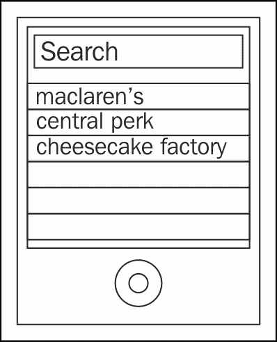
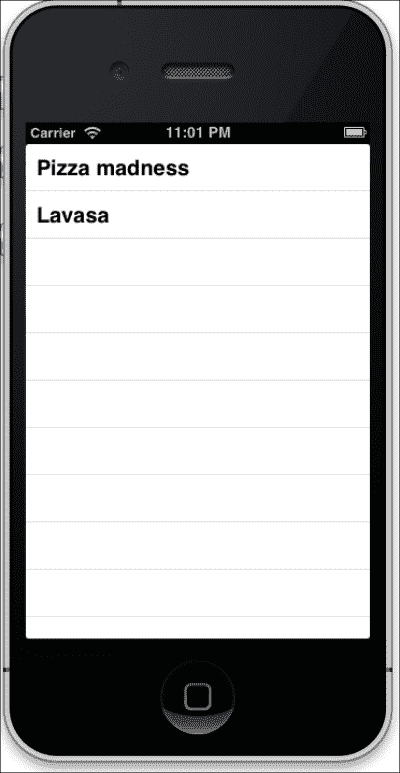
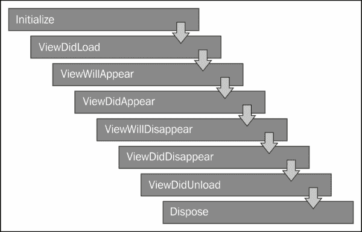
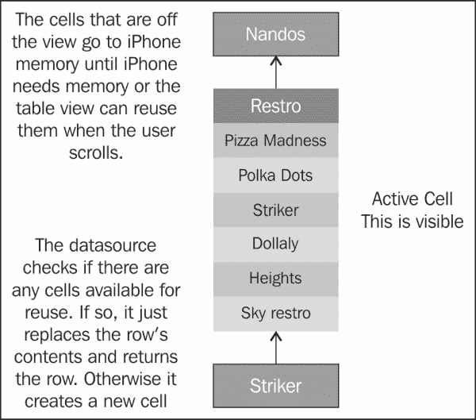
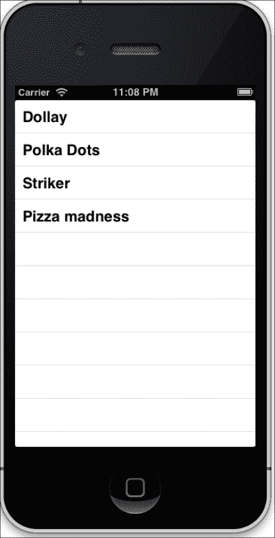
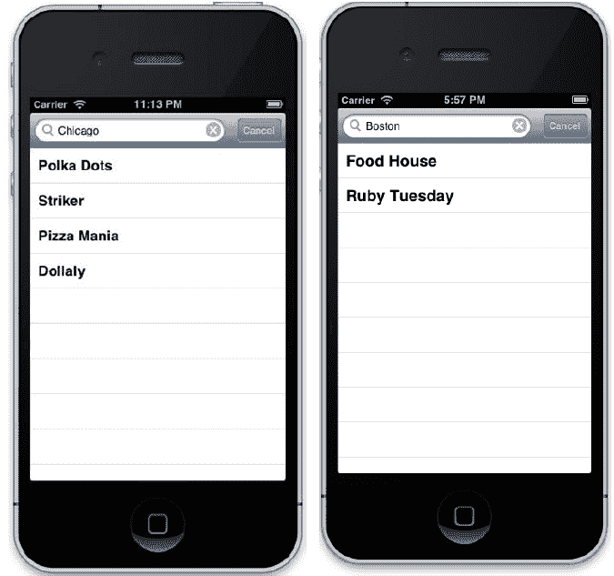
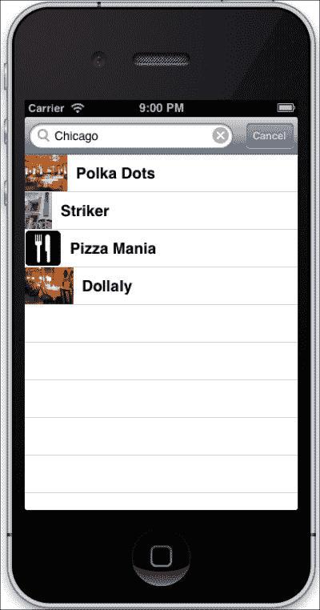
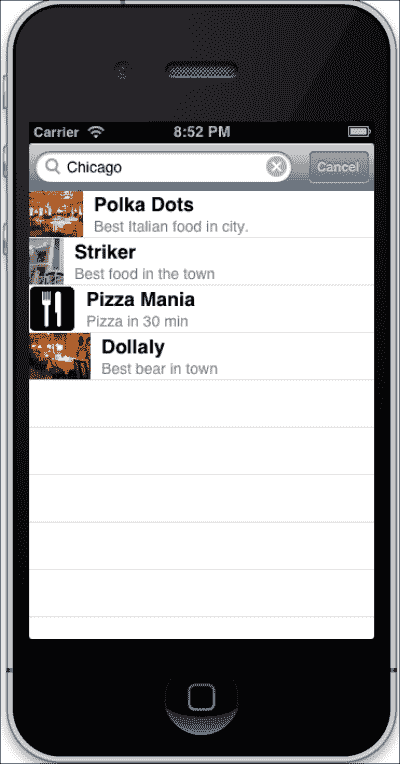

# 第四章 掌握 MVC 范式

*"模型-视图-控制器不是纯净的必然法则，而是一种有效的实用原则。"*

*—匿名*

在本章中，我们将学习关于模型-视图-控制器（通常缩写为 MVC）的内容，它是一种基于代码重用和**关注点分离**（**SoC**）理念的设计原则。这种架构对应用程序的结构施加了严格的限制，然而，令人惊讶的是，这些限制使得设计和维护应用程序变得更加容易。在本章中，我们将涵盖以下主题：

+   理解模型-视图-控制器范式

+   使用 MVC 创建 RubyMotion 应用程序

+   连接到外部 API

+   通过搜索和图像增强应用程序

+   DIY 练习

# 模型-视图-控制器（MVC）

**模型-视图-控制器**（**MVC**）是一种设计原则，它将信息表示与用户的交互分离。MVC 的主要目的是使代码更加模块化和可重用，从而提高产品质量。

大多数流行的商业和非商业应用程序框架都是为了强制执行 MVC 设计模式而创建的。然而，RubyMotion 并不强制你使用 MVC 风格，但这种方式是应用程序开发良好设计的关键。如果我们开发应用程序时使用 MVC，那么这对我们来说将是有益的，因为我们将能够更容易地添加新功能。

### 注意

苹果的 Cocoa 框架也是基于模型-视图-控制器。

如其名所示，该应用程序被分为三个不同的部分：模型、视图和控制器，其中模型封装了应用程序数据，视图用于显示和编辑数据，而控制器是两个（模型和视图）之间交互逻辑所在的地方。让我们分别了解它们。

## 模型

模型包含应用程序数据和业务规则。模型可能只是实际的数据存储，无论是内存中的（可能作为`NSArray`或`NSDictionary`类）还是从磁盘到磁盘。在更复杂的应用程序中，你可能选择使用 SQLite 数据库或 Core Data，而你的模型将是一个简单的实例或数据的一部分。

## 视图

视图是应用程序中通过控制器从模型输出信息的那部分。逻辑永远不应该写在视图中；视图的唯一目的只是展示信息。在 iOS 和 RubyMotion 中，大多数视图都是`UIView`类的子类，提供了处理触摸事件和绘制的功能。《UIKit》框架包含用于绘制典型界面元素（如表格、按钮、文本字段和滑块）的类。

## 控制器

控制器是模型和视图之间的链接。控制器充当一个或多个应用程序视图与一个或多个模型之间的中介。在 iOS 中，控制器通常是一个`UIViewController`的子类，它还管理一个视图；这个类还负责响应用户代理消息和目标-动作消息。

模型-视图-控制器层之间耦合非常紧密，如下所示：


**视图**和**控制器**层通过**用户操作**和**更新**进行交互，如图所示。每当**视图**层创建或修改数据时，它将通过**用户操作**传达给**控制器**。同样，每当**模型**更新任何更改时，它将首先**通知****控制器**，然后通过**更新**在**视图**上反映出来。

# 餐厅应用程序

现在为了更好地理解 MVC，我们将创建一个`restro`应用程序。这个应用程序将在一个城市中搜索餐厅。世界还需要另一个餐厅应用程序吗？不，但这不会阻止我们编写一个。认真地说，这将帮助我们探索 RubyMotion 的许多功能，也将帮助我们学习和掌握 MVC。

让我们了解在这个应用程序中我们将要做什么。餐厅应用程序将列出餐饮场所，我们可以根据城市进行搜索。场所列表将包含缩略图图像以及与餐厅相关的信息。

想象应用程序的视图形式为原型是一个好习惯。最好的方法是使用一个白板，在上面绘制出你为应用程序设想的概念图。



你一定想知道所有这些数据从哪里来。我需要直接将它们硬编码到我的应用程序中吗？这没有意义！首先，我们将硬编码这些值；但随后，随着我们的进展和演变，我们将学习如何使用外部 API 来获取信息，这在现实世界的应用程序中是常见做法。我们为这本书专门创建了一个后端 API，其中包含了所有用于练习的数据。

现在让我们使用神奇的`motion`命令用 RubyMotion 创建一个`restro`项目：

```swift
>motion create restro
 Create restro
 Create restro/.gitignore
 Create restro/Rakefile
 Create restro/app
 Create restro/app/app_delegate.rb
 Create restro/resources
 Create restro/spec
 Create restro/spec/main_spec.rb

```

如前几章所述，`motion`命令将为 RubyMotion 项目创建基本结构。

### 小贴士

随意选择你的 IDE。如果你使用 RubyMine，你也可以从 IDE 中创建和运行应用程序。

## 创建模型

对于我们的`restro`应用程序，让我们头脑风暴一下所需的实体和属性。首先想到的是餐厅实体，具有以下属性：

+   `name`：这将包含应用程序的名称

+   `thumb_url_image`：这将包含餐厅的图片 URL

+   `food_type`：这将包含餐厅提供的食物类型

+   `desc`：这将包含关于餐厅的简要描述

看起来不错！让我们创建一个模型，`Restaurant`，它将存储所有与餐厅相关的信息。

创建一个 ruby（`.rb`）文件，它将是`app`文件夹中的模型，并将其命名为`restaurant.rb`：

```swift
class Restaurant
attr_accessor :name,:thumb_url_image, :food_type, :desc
  def initialize(restaurant)
    @name =restaurant['name']
    @thumb_url_image = restaurant['thumb_url_image']
    @food_type = restaurant['food_type']
    @desc = restaurant['desc']
  end
end
```

我们创建了一个名为`Restaurant`的类。通常我们首先需要为变量创建 getter 和 setter 方法。然而，在 Ruby 中，我们不需要单独创建 getter 和 setter，而是使用一个名为`attr_accessor`的单个方法来完成这个任务；这种语法糖的概念在 Ruby 的各种琐碎工作中被广泛使用，这确实节省了很多时间。

### 注意

**语法糖**是一种编程语言中的语法，旨在使事物更容易阅读或表达。以下是一个语法糖的例子：

```swift
attr_accessor :name,:thumb_url_image, :food_type, :desc
```

在设置`attr_accessor`之后，为了在创建`Restaurant`类的对象时分配值，我们创建了一个`initialize`方法。这给了我们编写设置对象状态代码的机会。

```swift
  def initialize(restaurant)
    @name =restaurant['name']
    @thumb_url_image = restaurant['thumb_url_image']
    @food_type = restaurant['food_type']
    @desc = restaurant['desc']
  end
```

每当我们创建`Restaurant`类的对象时，它都会调用`name`方法，并初始化和执行它。在创建对象时，我们必须传递一个餐厅的哈希。为了测试模型，让我们在前一个章节中提到的`application`目录中启动我们的终端并运行`rake`：

```swift
>restaurant = Restaurant.new({'name'=> "Pizza madness", 'thumb_url_image'=> nil, 'food_type'=>"italian", 'desc'=>"Pizza at your door step in 30 min"})
=> #<Restaurant:0xb5376a0 @name="Pizza madness" @thumb_url_image=nil @food_type="italian" @desc="Pizza at your door step in 30 min">

> restaurant.name
=> "Pizza madness"

```

太好了！我们的`Restaurant`类已经创建，我们现在可以创建这个类的对象了。

## 编写更多代码

许多 iOS 应用程序使用表格结构来表示它们的信息。这种设计方法最适合信息类应用程序，就像我们例子中的那样。因此，让我们为我们的主页创建一个表格视图，它将填充一个餐厅列表。

让我们现在更新`app`文件夹中的`app_delegate.rb`文件：

```swift
class AppDelegate
  def application(application,
                 didFinishLaunchingWithOptions:launchOptions)
      @window = UIWindow.alloc.initWithFrame(UIScreen.mainScreen.applicationFrame)
      @window.rootViewController = RestroController.alloc.initWithStyle(UITableViewStylePlain)
      @window.rootViewController.wantsFullScreenLayout = true
      @window.makeKeyAndVisible
      true
  end
end
```

`UIWindow`类定义了一个名为`window`的对象，它管理和协调应用程序的不同视图，并在设备屏幕上显示它们。一个`UIScreen`对象包含设备整个屏幕的边界矩形。因此，`UIScreen.mainScreen.applicationFrame`返回根据设备屏幕大小和方向计算出的矩形大小。此外，我们还需要告诉`UIWindow`对象加载哪个控制器：

```swift
@window.rootViewController = RestroController.alloc.initWithStyle(UITableViewStylePlain)
```

我们已经在`AppDelegate`中将`RestroController`类指定为应用程序的根控制器。因此，让我们在`app`文件夹中创建`restro_controller.rb`：

```swift
class RestroController < UITableViewController
  def viewDidLoad
    super
    @restaurant1 = Restaurant.new({'name'=> "Pizza madness",'thumb_url_image'=> nil, 'food_type'=>"italian", 'desc'=>"Pizza at your door step in 30 min"})
    @restaurant2 = Restaurant.new({'name'=> "Lavasa", 'thumb_url_image' => nil,'food_type'=>"italian",
            'desc'=>"best Coffee house in town"})
    @restaurants = [@restaurant1,@restaurant2]
    view.backgroundColor = UIColor.whiteColor
    @myTableView = UITableView.alloc.initWithFrame(view.bounds, style:UITableViewStylePlain)
    @myTableView.dataSource = self
    @myTableView.delegate = self
    view.addSubview(@myTableView)
  end

  def tableView(tableView, numberOfRowsInSection:section)
    @restaurants.count
  end

  def tableView(tableView, cellForRowAtIndexPath:indexPath)

    @reuseIdentifier ||= "CELL_IDENTIFIER"

    cell = tableView.dequeueReusableCellWithIdentifier(@reuseIdentifier) || begin
        UITableViewCell.alloc.initWithStyle(UITableViewCellStyleDefault, reuseIdentifier:@reuseIdentifier)
    end
    cell.textLabel.text = @restaurants[indexPath.row].name
    cell
  end

end
```

现在，让我们再次启动我们的终端，看看我们做了什么：

```swift
>rake

```



上一张截图显示了一个包含餐厅列表的表格结构。现在，这是一项令人印象深刻的工作。让我们现在了解在前一节中我们做了什么。我们的代码有三个部分——模型、视图和控制器。我们已经解释了关于餐厅模型的内容。我们首先为模型创建了一个对象，并给它赋了一些值：

```swift
@restaurant1 = Restaurant.new({
    'name'=> "Pizza madness", 'thumb_url_image'=> nil,
    'food_type'=>"italian",
    'desc'=>"Pizza at your door step in 30 min"})

@restaurant2 = Restaurant.new({
    'name'=> "Lavasa",
    'thumb_url_image' => nil,
    'food_type'=>"italian",
    'desc'=>"best Coffee house in town"})
```

我们已经创建了两个对象，并像前一个章节中解释的那样向它们传递了一个哈希。剩余的代码分为两部分，一个控制器和一个视图；让我们逐一了解它们。

### 餐厅控制器

在前面的例子中，`Restaurant` 控制器继承自 `UITableViewController`，它是 `UIViewController` 的子类。`UIViewController` 类为你的应用程序提供了基本的视图管理模型。

我们很少直接实例化 `UIViewController` 对象。相反，通常通过一个继承自 `UIViewController` 类的类来实例化，就像我们在前面的例子中所做的那样。它管理一组视图，这些视图构成了你应用程序用户界面的一部分。iOS 控制器中最重要的是其生命周期。在应用程序的不同阶段会调用各种动作。生命周期包括如 `Initialize`、`ViewDidLoad`、`ViewWillAppear`、`ViewDidAppear`、`ViewWillDisappear`、`ViewDidDisappear`、`ViewDidUnload` 和 `Dispose` 等动作。因此，这些事件是自动和动态调用的。每次我们创建控制器的对象时，它都会调用 `Initialize`，在为控制器加载视图之前，`ViewDidLoad` 会被调用。控制器的完整生命周期可以在以下图中看到：



### 注意

`viewDidUnload` 和 `viewWillUnload` 在 iOS 6.0 中已被弃用。

你可以在我们的餐厅控制器中看到，我们在 `ViewDidLoad` 中编写了很多逻辑，所以在这个块中编写的所有代码都会在视图加载之前执行。

### 注意

需要注意的是，这些方法绑定到 `UIViewController` 而不是 `UIViews`。

### 餐厅视图

`UITableView` 类用于创建在 iOS 应用程序中最常见的视图类型之一，即表格视图。在我们的应用程序中，我们只能看到一个列。这是因为 `UITableView` 实例被限制为单列，因为它是为小屏幕设备设计的。`UITableView` 是 `UIScrollView` 的子类，允许用户滚动表格，尽管 `UITableView` 只允许垂直滚动。

表格视图可以有两种样式之一，`UITableViewStylePlain`（例如，iOS 联系人）或 `UITableViewStyleGrouped`（例如，iOS 设置）。当你创建一个 `UITableView` 实例时，你必须指定表格样式；这个样式不能更改。对于我们的应用程序，由于我们不需要对餐厅进行分组，我们将使用 `UITableViewStylePlain`。

```swift
@myTableView = UITableView.alloc.initWithFrame(view.bounds, style:UITableViewStylePlain)
```

视图绑定需要返回一个具有空原点的 `CGRect`。`CGRect` 类在 iOS 应用程序中非常常用。它的数据结构表示一个矩形的定位和尺寸，用于设置表格视图的大小。

`UITableView` 类提供了很多选项，但它需要知道我们试图展示什么数据以及当用户与这些数据交互时应该做什么。这就是 `datasource` 和 `delegate` 属性发挥作用的地方：

```swift
    @myTableView.dataSource = self
    @myTableView.delegate = self
```

我们必须使用 `numberOfRowsInSection` 返回要创建的行数：

```swift
  def tableView(tableView, numberOfRowsInSection:section)
    @restaurants.count
  end
```

`tableView:numberOfRowsInSection`属性告诉`UITableView`数据源返回表格给定部分的行数。所以在我们这个例子中，行数将等于总餐厅数量。

接下来，让我们了解`UITableViewCell`，它是`UIView`的子类；使用这个类，我们的行以表格形式显示。为了访问单元格的内容，我们有`textLabel`和`imageView`等属性，用于设置它们的属性，如文本颜色、字体、图像和突出显示的图像。您还可以通过使用不同的 iOS 方法轻松地为表格提供自定义外观。另一个属性`cellForRowAtIndexPath`要么创建一个新的单元格，要么回收一个屏幕外的单元格，并用与`indexPath`对应的数据填充它，然后返回单元格。以下代码片段显示了更完整的实现方式：

```swift
  def tableView(tableView, cellForRowAtIndexPath:indexPath)

    @reuseIdentifier ||= "CELL_IDENTIFIER"

    cell = tableView.dequeueReusableCellWithIdentifier(@reuseIdentifier) || begin
      UITableViewCell.alloc.initWithStyle(UITableViewCellStyleDefault, reuseIdentifier:@reuseIdentifier)
    end
    cell.textLabel.text = @restaurants[indexPath.row].name
    cell
  end
```

`UITableView`类只显示足够的数据来填充 iPhone 屏幕——您总共可能有多少数据实际上并不重要。`UITableView`类通过重用滚动出屏幕的单元格来实现这一点。当单元格滚动出屏幕（无论是顶部还是底部）时，表格视图将排队等待不再需要的单元格。当它请求数据源特定行的单元格时，您可以检查这个队列，看看是否有可用的单元格：



### 注意

`dequeueReusableCell`的整个目的是创建`UITableViewCell`的新视图层次结构的过程相当昂贵。如果您每次需要时都重新创建单元格，那么滚动行为就不会像现在这样好了。

使用`dequeueReusableCellWithIdentifier`为`tableView`，您可以大大加快速度。您不需要实例化很多单元格，只需实例化所需的单元格即可，这意味着只有那些可见的单元格（这是自动处理的）。当滚动到列表中的某个区域，而单元格尚未在视觉上表示时，您不需要实例化新的单元格，而是可以重用已经存在的单元格。

```swift
cell = tableView.dequeueReusableCellWithIdentifier(@reuseIdentifier) || begin
        UITableViewCell.alloc.initWithStyle(UITableViewCellStyleDefault, reuseIdentifier:@reuseIdentifier)
    end
```

接下来，我们以以下方式为以下每一行分配了显示值：

```swift
cell.textLabel.text = @restaurants[indexPath.row].name
```

### 注意

在 Ruby 中，`a ||= b`意味着如果`a`是 nil/false，则将其赋值为`b`。

# 连接到外部 API

目前我们硬编码了对象值，这在实际应用中通常是不会发生的；让我们从外部 API 获取这些值。为了练习目的，我们创建了一个外部 API 来以 JSON 格式获取数据。

如果您访问[`restro.nalwaya.com/restaurants/search.json?city=Chicago`](http://restro.nalwaya.com/restaurants/search.json?city=Chicago)或使用`curl`命令，它将以 JSON 格式返回我们为芝加哥播种的餐厅（注意，这是虚构的数据，您可能实际上在芝加哥市找不到它们）。

让我们运行以下`curl`命令来获取数据：

```swift
> curl "http://restro.nalwaya.com/restaurants/search.json?city=Chicago"
[{
 "name":"Polka Dots", 
 "thumb_url_image":"http://restro.nalwaya.com/system/
 restaurants/avatars/000/000/001/thumb/hotel.jpg?1352812187",
 "food_type":"Italian",
 "desc":"Best Italian food in city"
},
{
 "name":"Striker", 
 "thumb_url_image":"http://restro.nalwaya.com/system/
 restaurants/avatars/000/000/002/thumb/
 20121111_135450.jpg?1353424527",
 "food_type":"Italian",
 "desc":"Best food in the town"
},
{
 "name":"Pizza madness", 
 thumb_url_image":"http://restro.nalwaya.com/system/
 restaurants/avatars/000/000/003/thumb/
 restaurant-icon-96da9e9f58682c8035c4fa4ee04bdcca.gif?1353425778",
 "food_type": "Pizza Mania",
 "desc":"Pizza in 30 min"}, 
{
 "name":"Dollaly", 
 "thumb_url_image":"http://restro.nalwaya.com/system/
 restaurants/avatars/000/000/004/thumb/
 restaurant_table3.jpg?1353425829", "food_type":"Indian",
 "desc":"Best beer in town"
}]

```

### 注意

`curl` 是一个用于使用各种协议传输数据的命令行工具。

现在，我们将展示芝加哥市餐馆的列表，这是我们通过 `restro` 应用程序中的源获取的。由于我们获取的数据是 JSON 格式，我们需要将此 JSON 对象转换为 Ruby 对象。

在 `app` 文件夹中创建一个名为 `json_parser.rb` 的文件：

```swift
class JSONParser
  def self.parse_from_url(url)
    data = DataParser.parse(url)

    error_ptr = Pointer.new(:object)
    json = NSJSONSerialization.JSONObjectWithData(data, options:0, error:error_ptr)
    unless json
      alert = UIAlertView.new··
      alert.message = error_ptr[0]
      alert.show 
    end
    json
  end
end
```

`NSJSONSerialization` 类将 JSON 转换为 Foundation 对象，并将 Foundation 对象转换为 JSON。

### 注意

RubyMotion 有 `Pointer` 类，用于创建和操作指针。必须在新构造函数中提供要创建的指针类型。因此，`Pointer.new(:object)` 将创建一个新的具有对象类的指针。

我们需要通过向服务器发送请求来获取 JSON 对象；为此，我们将创建一个 `DataParser` 类。

在 `app` 文件夹中创建一个名为 `data_parser.rb` 的文件：

```swift
class DataParser
  def self.parse(url)
    error_ptr = Pointer.new(:object)
    data = NSData.alloc.initWithContentsOfURL(NSURL.URLWithString(url), options:NSDataReadingUncached, error:error_ptr)
    unless data
      alert = UIAlertView.new··
      alert.message = error_ptr[0]
      alert.show 

    end  
    data
  end  
end
```

我们将使用 `NSUrl` 类来获取数据，该类会将数据传递给 `NSData`。`NSData` 及其可变子类 `NSMutableData` 为字节数据提供了面向对象的封装。

现在，让我们重构 `restro_controller.rb` 中的逻辑，该逻辑将从一个 API 获取数据，而不是我们在上一节中创建的硬编码的 `Restaurant` 对象。

更新 `restro_controller.rb` 中的 `viewDidLoad` 部分：

```swift
url = "http://restro.nalwaya.com/restaurants/search.json?city=Chicago"
    json = nil
    begin
      json = JSONParser.parse_from_url(url)
    rescue RuntimeError => e
      presentError e.message
    end

    @restaurants = []
    json.each do |restaurant|
      @restaurants << Restaurant.new(restaurant)
    end

    view.backgroundColor = UIColor.whiteColor
    @myTableView = UITableView.alloc.initWithFrame(view.bounds, style:UITableViewStylePlain)
    @myTableView.dataSource = self
    @myTableView.delegate = self
    view.addSubview(@myTableView)
```

如果出现错误，让我们优雅地面对它，通过弹出显示错误消息。因此，在 `restaurant_controller.rb` 中创建一个 `presentError` 方法，并在弹出中打印错误：

```swift
def presentError error_msg
  alert = UIAlertView.new··
  alert.message = error_msg
  alert.show·

end
```

打开终端并使用 `rake` 命令启动应用程序。



我们可以看到餐馆列表是动态地从 JSON API 中显示的。

# 通过城市搜索餐馆

在上一节中，我们只显示了芝加哥的餐馆。如果你注意到，它硬编码在 URL 本身中，并且不是通用的。在本节中，我们将使应用程序更加通用，并允许用户根据参数城市搜索数据。

按照以下方式更新 `restro_controller.rb`：

```swift
class RestroController < UITableViewController
  def viewDidLoad
    super
    @restaurants = []
    searchBar = UISearchBar.alloc.initWithFrame(CGRectMake(0, 0, self.tableView.frame.size.width, 0))
    searchBar.delegate = self;
    searchBar.showsCancelButton = true;
    searchBar.sizeToFit
    view.tableHeaderView = searchBar
    view.dataSource = view.delegate = self
    searchBar.text = 'Chicago'

    searchBarSearchButtonClicked(searchBar)

  end
  def searchBarSearchButtonClicked(searchBar)
    query = searchBar.text.stringByAddingPercentEscapesUsingEncoding(NSUTF8StringEncoding)
    url = "http://restro.nalwaya.com/restaurants/search.json?city=#{query}"
    @restaurants.clear
    json = nil
    begin
      json = JSONParser.parse_from_url(url)
    rescue RuntimeError => e
      presentError e.message
    end

    @restaurants = []
    json.each do |restaurant|
      @restaurants << Restaurant.new(restaurant)
    end

    view.reloadData
    searchBar.resignFirstResponder
  end
  def searchBarCancelButtonClicked(searchBar)
    searchBar.resignFirstResponder
  end
  def tableView(tableView, numberOfRowsInSection:section)
    @restaurants.count
  end

  def tableView(tableView, cellForRowAtIndexPath:indexPath)
    @reuseIdentifier ||= "CELL_IDENTIFIER"
    cell = tableView.dequeueReusableCellWithIdentifier(@reuseIdentifier) || begin
      UITableViewCell.alloc.initWithStyle(UITableViewCellStyleDefault, reuseIdentifier:@reuseIdentifier)
    end
    cell.textLabel.text = @restaurants[indexPath.row].name
    cell
  end
end
```



使用 `rake` 命令启动模拟器，你可以看到你的工具栏被一个带有默认值 **芝加哥** 的搜索框所替换。

## 刚才发生了什么

`UISearchBar` 类实现了基于文本的搜索的文本字段控件。`UISearchBar` 对象实际上并不执行任何搜索；它只是一个视图，我们可以在设备上看到。为了使搜索工作，我们使用一个代理，它是一个符合 `UISearchBarDelegate` 协议的对象，用于实现文本输入和按钮点击时的动作。`UISearchBarDelegate` 协议定义了你实现的可选方法，以使 `UISearchBar` 控件功能化。

`UISearchBar` 对象为条上的搜索字段提供用户界面，但实现按钮点击时的动作是应用程序的责任。我们可以使用各种方法来实现，这些方法将在下面解释。

用于编辑文本的方法如下：

+   `searchBar:textDidChange`: 这告诉代理用户改变了搜索文本

+   `searchBar:shouldChangeTextInRange:replacementText`: 这询问代理是否应该用给定的文本替换指定范围内的文本

+   `searchBarShouldBeginEditing`: 这询问代理是否应该在指定的搜索栏中开始编辑

+   `searchBarTextDidBeginEditing`: 这告诉代理用户开始编辑搜索文本

+   `searchBarShouldEndEditing`: 这询问代理是否应该在指定的搜索栏中停止编辑

+   `searchBarTextDidEndEditing`: 这告诉代理用户完成了搜索文本的编辑

用于搜索栏中各种按钮上不同点击事件的方法如下：

+   `searchBarBookmarkButtonClicked`: 这告诉代理书签按钮被点击了

+   `searchBarCancelButtonClicked`: 这告诉代理取消按钮被点击了

+   `searchBarSearchButtonClicked`: 这告诉代理搜索结果列表按钮被点击了

+   `searchBarResultsListButtonClicked`: 这告诉代理搜索按钮被点击了

用于范围按钮的方法如下：

+   `searchBar:selectedScopeButtonIndexDidChange`: 这告诉代理范围按钮选择已更改

### 小贴士

作为最低要求，当在文本字段中输入文本时，代理需要执行实际的搜索。

我们已经实现了 `searchBarSearchButtonClicked(searchBar)`，每次点击搜索按钮时，这个动作将被调用：

```swift
  def searchBarSearchButtonClicked(searchBar)
    query = searchBar.text.stringByAddingPercentEscapesUsingEncoding(NSUTF8StringEncoding)
    url = "http://restro.nalwaya.com/restaurants/search.json?city=#{query}"
    @restaurants.clear
    json = nil
    begin
      json = JSONParser.parse_from_url(url)
    rescue RuntimeError => e
      presentError e.message
    end

    @restaurants = []
    json.each do |restaurant|
      @restaurants << Restaurant.new(restaurant)
    end

    view.reloadData
    searchBar.resignFirstResponder
  end
```

因此，我们从我们的网络服务中获取的所有结果都存储在 `json` 变量中。我们将遍历此对象，并将信息存储在我们之前创建的餐厅模型中。

完成整个任务后，我们必须重新加载视图，这可以通过使用 `view.reloadData` 类来完成。

# 图片胜于言语

现在让我们显示餐厅名称旁边的缩略图。在 JSON API 调用中，我们还可以看到我们正在获取餐厅图片的链接。因此，我们使用此 URL 在表格视图中显示带有餐厅名称的图片。

按照以下方式更新 `restaurant_controller.rb`：

```swift
  def tableView(tableView, cellForRowAtIndexPath:indexPath)

    @reuseIdentifier ||= "CELL_IDENTIFIER"

    cell = tableView.dequeueReusableCellWithIdentifier(@reuseIdentifier) || begin
      UITableViewCell.alloc.initWithStyle(UITableViewCellStyleDefault, reuseIdentifier:@reuseIdentifier)
    end
    cell.textLabel.text = @restaurants[indexPath.row].name
    cell.imageView.image = UIImage.alloc.initWithData(NSData.alloc.initWithContentsOfURL(NSURL.URLWithString(@restaurants[indexPath.row].thumb_url_image)))
    cell
  end
```

`UIImage.alloc.initWithData` 使用指定的数据初始化并返回图像对象，而 `NSData.alloc.initWithContentsOfURL` 使用 URL 指定的位置的数据初始化一个新分配的数据对象。

再次启动我们的模拟器以查看进度。从 `app` 文件夹运行 `rake`。



难道这不简单！我们现在可以看到餐厅名称旁边的图片显示出来了。

# 游戏时间

是时候进行一个小型的 DIY 练习了。在同一个应用程序中，在表格的每一行中添加一些关于餐厅的描述。



### 小贴士

我们在 API 中获取描述，并且它已经存储在`Restaurant`对象中。要在视图中显示这个信息，你可以在单元格对象上使用`detailTextLabel`，就像我们在`textLabel`中使用的那样。

# 摘要

让我们回顾一下在本迭代中学到的内容：

+   模型-视图-控制器架构

+   使用 RubyMotion 进行 MVC 设计

+   将我们的应用程序与外部 API 连接

+   为我们的应用程序添加搜索和图片功能

在下一章中，我们将关注移动应用程序的用户界面（UI）。UI 是移动应用程序开发中的关键领域，我们将了解各种 Objective-C 类，它们使得用户界面更加互动，以及如何在我们的 RubyMotion 应用程序中使用它们。
