# 第五章。用户界面 - 您应用程序的化妆品

“设计不仅仅是看起来和感觉如何。设计是如何运作的。”

*- 史蒂夫·乔布斯*

用户界面设计的最终目标是使用户与应用程序的交互变得简单愉快。了解技术的基本元素对于为最终用户提供友好的用户界面非常重要。在本章中，我们将学习如何使用 RubyMotion 为 iOS 应用程序构建用户界面所需的不同元素。在基于 iOS 的设备上运行的应用程序有有限的屏幕空间来展示内容。这是任何 iOS 开发者最昂贵的房地产，我们必须足够有创意，想出方法向用户展示信息，并经济地利用这块宝贵空间。

您始终可以自定义用户界面，为您的应用程序创建令人惊叹的外观。但在设计应用程序的用户界面时，有一些首选的方法，例如一些控件的位置，可以采用以使用户获得类似内置应用程序的友好环境。正如您所知，iPhone 上没有为返回按钮专用的硬件；我们必须始终确保在用户在页面之间导航时，在左上角保留一个按钮，以免用户迷路。实现这一目标的一个好方法是使用 iOS SDK 中提供的典型 iOS 导航栏。使用这种传统 UI 元素的优点是，在 Apple 推出这些元素的重设计时，它们能够优雅地工作。完全自定义的元素不会收到更新。当您使用这些标准 API 时，您仍然可以自定义大多数 UI 元素的的外观，并且仍然会收到自动更新。

在 iOS SDK 中，`UIKit` 框架提供了一系列 UI 元素，您可以在您的应用程序中使用。在本章中，我们将详细介绍以下主题：

+   栏

+   基本 UI 元素

+   餐厅应用程序——让我们让它变得漂亮

# 栏

在 iOS SDK 中有各种类型的栏可供使用，例如标签栏、导航栏、工具栏和状态栏。这些是经过精心设计，具有明确的行为和外观的 UI 元素。尽管在您的应用程序中添加栏不是强制性的，但建议添加它们，因为它们使开发者和用户的生活都变得更简单。这些栏为熟悉它们提供的信息和功能的 iOS 设备用户提供了常见的锚点。

在本节中，我们将详细讨论以下类型的栏：

+   标签栏

+   导航栏和工具栏

+   状态栏

## 标签栏

标签栏让人们能够在不同的子任务、视图或模式之间切换。标签栏位于屏幕底部，主要在页脚部分，我们可以在大多数流行的 iOS 应用中看到。标签栏中的每个标签都有一个单独的视图，可以用来在应用的不同模式之间进行导航，并且它还可以传达每个模式的状态信息。

在 iPhone 上，标签栏在任何给定时间点最多只能显示五个标签。如果应用有更多标签，标签栏将显示其中四个，并添加一个名为**更多**的标签，该标签以列表形式显示额外的标签。在 iPad 上，标签栏可以显示超过五个标签。

### 注意

标签栏图像的大小通常是 30 x 30 像素。如果这个图像太大而无法适应标签栏，它将被裁剪以适应可用的大小。

首先，我们将创建一些视图来更好地理解我们的主题：

1.  让我们创建一个示例应用程序来更清楚地理解这个主题：

    ```swift
    motion create UserInterfaceApplication    

        Create UserInterfaceApplication
        Create UserInterfaceApplication/.gitignore
        Create UserInterfaceApplication/Rakefile
        Create UserInterfaceApplication/app
        Create UserInterfaceApplication/app/app_delegate.rb
        Create UserInterfaceApplication/resources
        Create UserInterfaceApplication/spec
        Create UserInterfaceApplication/spec/main_spec.rb
    ```

1.  在`app`文件夹中创建一个名为`tab1_controller.rb`的文件，并添加以下代码：

    ```swift
    class Tab1Controller < UIViewController
      def viewDidLoad
           view.backgroundColor = UIColor.scrollViewTexturedBackgroundColor
       end 
    end
    ```

    在前面的代码中，我们正在将视图的背景颜色设置为 iOS 提供的自定义颜色，该颜色称为`scrollViewTexturedBackgroundColor`。这个自定义颜色可以通过`UIColor`类获得。同样，我们还将创建另外两个标签。

1.  在`app`文件夹内创建一个名为`tab2_controller.rb`的文件，并添加以下代码：

    ```swift
    class Tab2Controller < UIViewController
        def viewDidLoad
         view.backgroundColor = UIColor.redColor
      end
    end
    ```

1.  在`app`文件夹内创建另一个名为`tab3_controller.rb`的文件，并添加以下代码：

    ```swift
    class Tab3Controller < UIViewController
        def viewDidLoad
          view.backgroundColor = UIColor.whiteColor
       end
    end
    ```

我们已经创建了具有不同背景颜色的三个视图，这样当我们从一个视图切换到另一个视图时，我们可以看到差异。现在让我们创建一个标签栏，并将其与刚刚创建的三个视图控制器链接起来。

为了这个，我们只需在`app`文件夹内的`app_delegate.rb`文件中添加以下代码：

```swift
class AppDelegate
  def application(application, didFinishLaunchingWithOptions:launchOptions)
        @window = UIWindow.alloc.initWithFrame(UIScreen.mainScreen.bounds)
        @window.rootViewController = createTabBar
        @window.makeKeyAndVisible

    true
  end

  def createTabBar

    tab_bar_controller = UITabBarController.alloc.init
    tab_bar_controller.viewControllers = [
      Tab1Controller.alloc.init,
      Tab2Controller.alloc.init,
      Tab3Controller.alloc.init
    ]
    tab_bar_controller
  end
end
```

在前面的代码中，我们创建了一个名为`createTabBar`的方法，其中我们正在构建一个标签栏。`UITabBarController`类需要一个`UIViewControllers`数组。这个数组中的每个元素都将成为屏幕上的一个标签。之前创建的三个视图分别链接到标签栏的标签。让我们启动终端并查看我们新创建的标签栏：

```swift
$rake

```

这就是我们的输出结果：

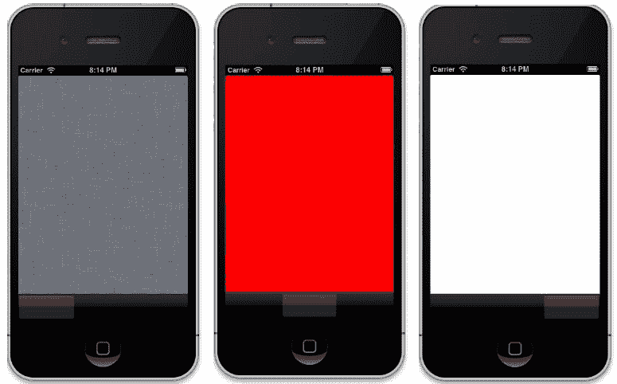

太好了！我们可以在屏幕底部看到一个标签栏，有三个标签，每个标签都有一个具有不同背景颜色的视图。

### 注意

屏幕底部的`UITabBar`高度为 44 像素。

### 定制标签栏

您始终需要在标签栏中使用标题或图标来标记标签。让我们为我们之前创建的标签添加一些标题，并为它们提供一些图像：

1.  使用以下代码更新`app`文件夹内的`tab1_controller.rb`文件：

    ```swift
    class Tab1Controller < UIViewController
      def init

        super
        self.title = "Tab 1"
        self.tabBarItem.image = UIImage.imageNamed('FirstTab.png') 
        self
      end

      def viewDidLoad
           view.backgroundColor = UIColor.scrollViewTexturedBackgroundColor
       end
    end
    ```

1.  在`app`文件夹内的`tab2_controller.rb`文件中添加以下方法：

    ```swift
    def init
         super

         self.tabBarItem = UITabBarItem.alloc.initWithTabBarSystemItem(UITabBarSystemItemSearch, tag: 1)
         self
       end
    ```

1.  类似地，在 `app` 文件夹内的 `tab3_controller.rb` 文件中添加以下方法：

    ```swift
     def init
         super

         self.tabBarItem = UITabBarItem.alloc.initWithTabBarSystemItem(UITabBarSystemItemTopRated, tag: 1)
         self
       end
    ```

1.  现在，让我们在 iOS 模拟器中测试一下更改：

    ```swift
    $rake

    ```

1.  这是我们得到的结果：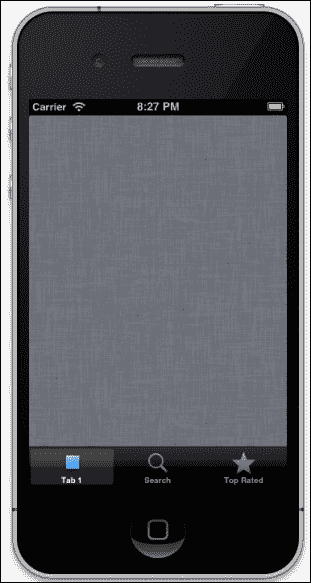

结果，如您所见，是一个带有图标和标题的标签栏。`UITabBarItem` 类负责实现标签栏上的任何项目或图像。默认情况下，它将使用蓝色渐变放置您传递的任何图像，丢弃图像的颜色信息，并使用 alpha 通道（透明度）信息来确定应用渐变的位置。标签栏始终以单选模式操作；这意味着一次只能选择一个项目。

### 小贴士

如果您想在标签被选中时显示自定义图像，可以使用以下代码：

```swift
tab_bar_item.setFinishedSelectedImage(UIImage.imageNamed("selectedImage"), withFinishedUnselectedImage:UIImage.imageNamed("UnselectedImage"))
```

在标签栏中添加图标有两种方式。根据您的需求，您可以选择添加自定义图标或使用苹果提供的常用图标。让我们简要讨论这两种方式：

+   **自定义图标**：您可以为每个标签设计图像并将其放入其中。`tabBarItem` 中有一个图像属性，可以接受图像：

    ```swift
    self.tabBarItem.image = UIImage.imageNamed('FirstTab.png')
    ```

    ### 小贴士

    如果您的图像是 PNG 格式，在提及文件名时可以省略扩展名，如下所示：

    ```swift
    self.tabBarItem.image = UIImage.imageNamed('FirstTab')
    ```

+   **iOS 提供的常用图标**：以下是一些 Cocoa 库提供的常用图标。这些图标将直接在我们的应用程序中使用：

    | 常量名称 | 图标 |
    | --- | --- |
    | `UITabBarSystemItemMore` | 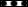 |
    | `UITabBarSystemItemFavorites` | 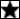 |
    | `UITabBarSystemItemFeatured` | 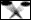 |
    | `UITabBarSystemItemRecents` | 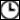 |
    | `UITabBarSystemItemContacts` |  |
    | `UITabBarSystemItemBookmarks` | 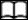 |
    | `UITabBarSystemItemSearch` | 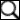 |
    | `UITabBarSystemItemDownloads` | 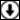 |
    | `UITabBarSystemItemMostRecent` | 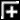 |
    | `UITabBarSystemItemMostViewed` | 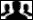 |

    ### 小贴士

    如果您想更改标签栏的背景以自定义图像，请使用以下代码：

    ```swift
    tab_bar_controller.tabBar.backgroundImage = UIImage.imageNamed "bgTabBar"
    ```

## 导航栏

导航栏允许在不同屏幕之间进行导航。您可以在应用程序屏幕的顶部看到导航栏和工具栏，位于状态栏下方。导航栏提供了一种用于分层内容的钻取式界面。您还可以为导航控制器管理的工具栏提供项目，例如按钮。让我们看看我们如何在应用程序中创建导航栏：

1.  使用以下代码更新 `app` 文件夹内的 `app_delegate.rb` 文件：

    ```swift
    def createTabBar

        tab_bar_controller = UITabBarController.alloc.init
        tab_bar_controller.viewControllers = [
           UINavigationController.alloc.initWithRootViewController(Tab1Controller.alloc.init),  
          Tab2Controller.alloc.init,
          Tab3Controller.alloc.init
        ]
        tab_bar_controller
      end
    ```

    在前面的代码中，我们在初始化 `UINavigationController` 时初始化了 `Tab1Controller`。这样，我们可以生成一个导航栏：

    ```swift
    UINavigationController.alloc.initWithRootViewController(Tab1Controller.alloc.init)
    ```

1.  让我们启动终端并执行以下命令：

    ```swift
    $rake

    ```

1.  执行命令后，我们得到以下结果：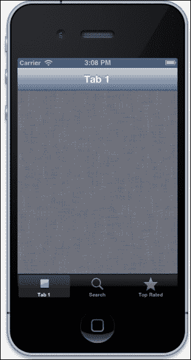

这真的很酷！我们可以看到导航栏出现在屏幕顶部。但现在它没有任何作用。让我们修改这个栏并给它添加按钮。

### 注意

导航栏会自动显示一些默认的标题文本。

### 自定义导航栏

现在，让我们使用半透明颜色自定义导航栏并给它添加一个按钮：

1.  将以下代码更新到`app`文件夹内的`tab1_controller.rb`文件中：

    ```swift
    class Tab1Controller < UIViewController
      def init
        super
        self.title = "Tab 1"
        self.tabBarItem.image = UIImage.imageNamed('FirstTab.png') 
        self
      end
      def viewDidLoad
         view.backgroundColor = UIColor.scrollViewTexturedBackgroundColor

     setupNavigationBar

       end
     def setupNavigationBar

     self.navigationController.navigationBar.barStyle = UIBarStyleBlackTranslucent;
     right_button_item = UIBarButtonItem.alloc.initWithTitle('Add',style:UIBarButtonItemStyleBordered,target: self, action: "click_add"  )
     self.navigationItem.setRightBarButtonItem(right_button_item)

     end 

     def click_add
     @alert_box = UIAlertView.alloc.initWithTitle("Add button popup",
     message:"You have pressed the 'Add' button",
     delegate: nil,
     cancelButtonTitle: "ok",
     otherButtonTitles:nil)
     @alert_box.show
     end

    end
    ```

1.  让我们启动终端并执行以下命令：

    ```swift
    $rake

    ```

1.  这是输出结果：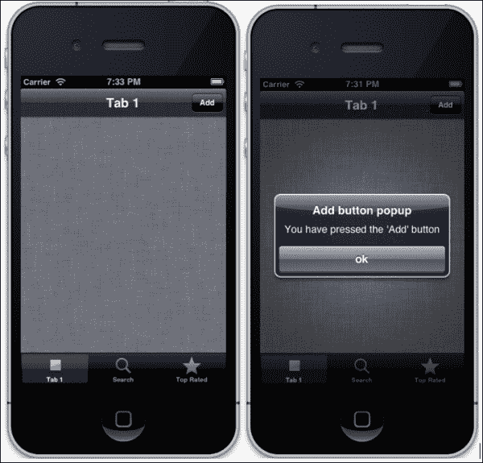

我们可以看到，导航栏控制器现在是半透明的，并且在左上角有一个**添加**按钮。当我们按下**添加**按钮时，将弹出一个带有消息**您已按下“添加”按钮**的警告框。

`UIBarButtonItem`类创建了一个按钮，对于每个按钮，我们必须定义一个当按钮被点击时将被调用的动作。在我们的例子中，我们为`Add`按钮创建了`click_add`动作：

```swift
UIBarButtonItem.alloc.initWithTitle('Add',style:UIBarButtonItemStyleBordered,target: self, action: "click_add"  )
```

在前面的代码片段中，我们创建了一个标题设置为`添加`的按钮。为了定义当按钮被点击时必须执行的动作，我们使用`action`参数。

接下来，我们将分配按钮在导航栏上的位置：

```swift
self.navigationItem.setRightBarButtonItem(right_button_item)
```

这样做将在导航栏的右侧放置一个按钮。

### 小贴士

要在屏幕左侧添加一个按钮，请使用以下代码行：

```swift
self.navigationItem.setLeftBarButtonItem(button_item)
```

## 状态栏

状态栏是一个 20 像素的栏，出现在窗口顶部。它显示重要的系统信息，例如信号强度、网络、当前时间和电池状态。

默认情况下，iOS 6.0 中的状态栏是半透明的黑色样式，但我们可以使用以下可用的样式来修改这种外观：

+   `UIStatusBarStyleDefault`

+   `UIStatusBarStyleBlackOpaque`

+   `UIStatusBarStyleBlackTranslucent`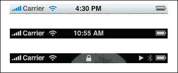

使用 RubyMotion，我们可以以下两种方式自定义状态栏：

+   **使用 Rakefile**：在你的 RubyMotion 项目的`Rakefile`中有一个设置；按照以下方式更新它：

    ```swift
    app.status_bar_style = :black_translucent
    ```

+   **使用应用代码**：将以下代码片段更新到你的代理文件中：

    ```swift
    application.setStatusBarStyle(UIStatusBarStyleBlackOpaque, animated:true)
    ```

### 注意

注意，这些方法各不相同。第一种方法在应用程序加载时设置状态栏的外观，而第二种方法在应用程序加载后使用。

以下代码片段展示了我们如何隐藏状态栏：

```swift
application.setStatusBarHidden(true,  withAnimation:UIStatusBarAnimationSlide)
```

### 小贴士

根据苹果的指导原则，不建议创建自定义状态栏，因为用户更喜欢系统提供的状态栏的一致性。

# 基本 UI 元素

在前面的章节中，我们学习了条形控件，这在创建应用视图时起着关键作用，尤其是在屏幕的头部和底部部分。在本节中，我们将学习其他对于创建交互式视图至关重要的用户界面元素。然而，由于 UI 元素众多，我们不会讨论所有元素；我们只会检查那些最常用的元素。

## 标签

标签显示只读文本视图，并用于显示信息。使用 iOS SDK，我们使用`UILabel`类在屏幕上生成标签。`UILabel`类有许多属性可以自定义标签。在以下示例中，我们将使用这些属性中的几个来创建我们自己的自定义标签：

1.  首先，在`app`文件夹内更新`tab1_controller.rb`文件，添加以下代码：

    ```swift
      def viewDidLoad
           view.backgroundColor = UIColor.scrollViewTexturedBackgroundColor
           setupNavigationBar
     add_form_elements
       end
    ```

1.  接下来，添加`add_form_elements`方法：

    ```swift
    def add_form_elements
        label = UILabel.alloc.init
        label.frame = [[0, 40], [300, 30]]
        label.backgroundColor = UIColor.clearColor
        label.textColor = UIColor.greenColor
        label.font = UIFont.fontWithName("HelveticaNeue-CondensedBold",size:18)
        label.text = "This is sample application"

        view.addSubview(label)
    end
    ```

1.  让我们启动终端并测试我们的应用：

    ```swift
    $rake

    ```

1.  我们将在屏幕上看到以下自定义标签：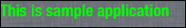

## 文本框

`UITextField`对象将在视图中创建一个文本框。在任何表单中，它都是一个非常常见的输入类型。这就是我们创建它的方法：

1.  更新`tab1_controller.rb`文件中的`add_form_elements`方法：

    ```swift
        @textbox = UITextField.alloc.initWithFrame([[10,80],[200,35]])
        @textbox.borderStyle = UITextBorderStyleRoundedRect
        @textbox.placeholder = "Type.."
        @textbox.textAlignment = UITextAlignmentCenter
        view.addSubview(@textbox)
    ```

1.  让我们启动终端并测试我们的应用：

    ```swift
    $rake

    ```

1.  我们将在屏幕上看到以下文本框：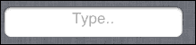

### 注意

当用户点击文本框时，系统会自动显示关联的键盘。当键盘从下方弹出时，有可能导致视图变得模糊。这是开发者的责任，相应地重新定位视图。

## 切换按钮

`UISwitch`对象将创建一个按钮来选择开/关状态。这就像我们在切换 Wi-Fi 开/关时常见的单选按钮。按照以下步骤在你的应用中创建切换按钮：

1.  在`tab1_controller.rb`文件中的`app`文件夹内添加以下代码，用于`add_form_elements`方法：

    ```swift
    @switch = UISwitch.alloc.initWithFrame([[10, 130], [200, 35]])
        @switch.addTarget(self,action:'switchIsChanged', forControlEvents:UIControlEventValueChanged)
        view.addSubview(@switch)
    ```

1.  当按钮从一个状态切换到另一个状态时，它会调用一个动作。让我们创建`switchIsChanged`动作，这是我们之前提到的：

    ```swift
      def switchIsChanged
      if @switch.on?
        #Some code 
      else
       #some code
      end 
    ```

1.  让我们启动终端并测试我们的应用：

    ```swift
    $rake

    ```

1.  我们将在屏幕上看到以下切换按钮：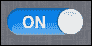

## 滑块

`UISlider`对象是一个用于从连续值范围内选择单个值的视觉控件。滑块始终以水平条的形式显示。在你的应用中创建滑块的步骤如下：

1.  在`tab1_controller.rb`文件中为`add_form_elements`方法添加以下代码：

    ```swift
       @customSlider = UISlider.alloc.initWithFrame([[10, 160],[200, 35]])
        #Setting the minimum value of slider 
        @customSlider.minimumValue = 0
        #Setting the maximum value of slider 
        @customSlider.maximumValue = 1000
        #Setting the default value of slider 
        @customSlider.value = @customSlider.maximumValue/2 
        #Setting the action value of slider to sliderValueChanged 
        @customSlider.addTarget(self, action:'sliderValueChanged', forControlEvents:UIControlEventValueChanged)
        view.addSubview(@customSlider)
    ```

1.  在前面的代码中，当滑块的值改变时，会调用`sliderValueChanged`动作。让我们在我们的`tab1_controller.rb`文件中添加这个动作：

    ```swift
    def sliderValueChanged
       #some code
      end
    ```

1.  让我们启动终端并测试我们的应用：

    ```swift
    $rake

    ```

1.  我们将在屏幕上看到以下滑块：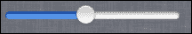

## 按钮

`UIButton`类在触摸屏上实现了一个按钮。按钮捕获触摸事件，并在被点击时执行操作。按照以下步骤在你的应用程序中创建一个按钮：

1.  在`tab1_controller.rb`中的`add_form_elements`方法中添加以下代码：

    ```swift
      @normalButton = UIButton.buttonWithType(UIButtonTypeRoundedRect)
      @normalButton.frame = [[10,200],[200,35]]
      @normalButton.setTitle("Click Me", forState:UIControlStateNormal)
      @normalButton.setTitle("You have clicked me", forState:UIControlStateHighlighted)
      @normalButton.setTitle(self, action:'buttonIsPressed', forControlEvents:UIControlEventTouchDown)
      view.addSubview(@normalButton)
    ```

1.  让我们启动终端并测试我们的应用程序：

    ```swift
    $rake

    ```

1.  我们将在屏幕上看到以下按钮：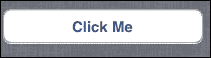

## 选择视图

选择视图用于从多个选项中选择一个值。它使用类似于旋转盘或老虎机的表示方式来显示一个或多个类似于网络应用程序中的选择框的值序列。

`UIPickerView`类实现了选择视图。让我们通过在我们的应用程序中添加一个来理解这一点：

1.  更新`tab2_controller.rb`文件，并带有高亮显示的代码。通过注释（以`#`开头）来更好地理解该部分的内容：

    ```swift
    class Tab2Controller < UIViewController
      def init
        super
        self.tabBarItem = UITabBarItem.alloc.initWithTabBarSystemItem(UITabBarSystemItemSearch, tag: 1)
        self
      end
      def viewDidLoad

        view.backgroundColor = UIColor.redColor
       # creating an array of country names
     @countryNames = ['United States', 'France', 'India', 'China', 'Russia']

     #calling add_label_and_button method to create label and button
     add_label_and_button
     #calling create_picker method to create piker
     @picker = create_picker
     view.addSubview(@picker)

      end   

     def create_picker
     picker =  UIPickerView.alloc.initWithFrame(CGRectMake(10,100, 220, 250))
     picker.hidden = true
     picker.showsSelectionIndicator = true
     picker.dataSource = self
     picker.delegate = self
     picker
     end

     def add_label_and_button
     @label = UILabel.alloc.init
     @label.frame = [[10, 40], [300, 30]]
     @label.backgroundColor = UIColor.clearColor
     @label.text = "Value"
     view.addSubview(@label) 

     @button = UIButton.buttonWithType(UIButtonTypeRoundedRect)
     @button.frame = [[120, 40], [150, 30]]
     @button.setTitle("Show Picker",forState:UIControlStateNormal)
     @button
     @button.addTarget(self,
     action: 'show_picker',
     forControlEvents:UIControlEventTouchUpInside) 
     view.addSubview(@button) 
     end

     def show_picker
     if @picker.isHidden
     @picker.hidden = false
     @button.setTitle("Hide Picker",forState:UIControlStateNormal)
     else
     @picker.hidden = true 
     @button.setTitle("Show Picker",forState:UIControlStateNormal)
     end
     end

     #This method returns number of components in picker.
     def numberOfComponentsInPickerView(pickerView)
     1
     end

     #This method returns number of rows in picker.
     def pickerView(pickerView,numberOfRowsInComponent:component)
     @countryNames.count
     end

     #This method returns value of rows in picker
     def pickerView(pickerView, titleForRow:row,forComponent:component)
     @countryNames[row]
     end

    #This method will be called when some value is selected in picker
     def pickerView(pickerView, didSelectRow:row, inComponent:component)
     @label.text = @countryNames[row]
     end

    end
    ```

1.  现在，让我们运行应用程序并点击第二个标签来检查我们到目前为止所做的工作：

    ```swift
    $rake

    ```

1.  我们可以看到一个**显示选择器**按钮，一旦我们点击它，我们就可以看到一个允许我们选择国家的选择视图：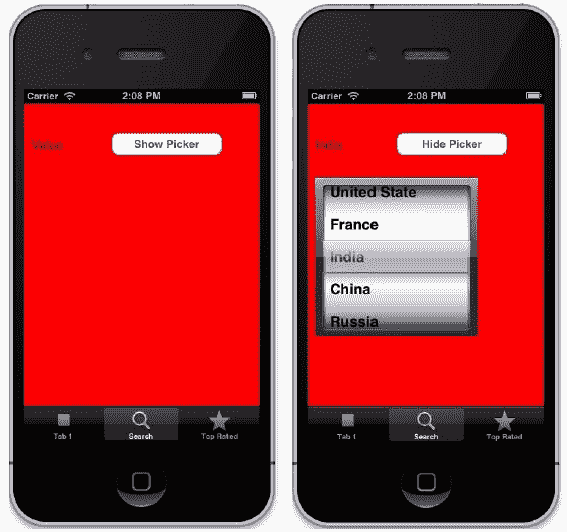

让我们通过使用`UIPickerView`类创建的代码来理解我们创建的选择器代码：

```swift
    picker =  UIPickerView.alloc.initWithFrame(CGRectMake(10,100, 220, 250))
    picker.hidden = true
    picker.showsSelectionIndicator = true
    picker.dataSource = self
    picker.delegate = self
    picker
```

在选择器中，我们必须始终提供`dataSource`和`delegate`，因为`dataSource`提供数据，而`delegate`提供选择器的行为。在前面的代码中，我们使用`picker.hidden = true`隐藏了选择器，因为它只会在用户点击按钮时显示。

要创建一个选择器，我们必须创建至少三个代理方法：

+   `numberOfComponentsInPickerView`: 这将由`PickerView`控件调用，以识别要显示给用户的组件数量，例如选择轮：

    ```swift
    def numberOfComponentsInPickerView(pickerView)
      1
    end
    ```

    在我们的代码中，我们返回`1`，因为我们只有一个组件要显示。

+   `numberOfRowsInComponent`: 这会通知`PickerView`控件在指定组件中存在的行数：

    ```swift
    def     pickerView(pickerView,numberOfRowsInComponent:component)
        @countryNames.count
        end
    ```

    因此，`@countryNames.count`将返回数组中的国家总数。

+   `titleForRow`: 它将由`PickerView`控件调用，以识别在特定组件中要显示的指定行的字符串：

    ```swift
    def pickerView(pickerView, titleForRow:row,forComponent:component)
        @countryNames[row]
      end
    ```

    `pickerView:titleForRow:forComponent`方法将被调用*n*次；这里的*n*是`pickerView:numberOfRowsInComponent`返回的值。

我们还可以在选择视图中选择任何值时执行操作。这可以通过使用`pickerView(pickerView, didSelectRow:row, inComponent:component)`代理方法来完成，如下面的代码所示：

```swift
def pickerView(pickerView, didSelectRow:row, inComponent:component)
    @label.text = @countryNames[row]
End
```

在这里，我们正在更改标签消息，使用我们从选择器中选择的国名字符串。

# 实际操作 – 添加一个 Restro 应用

到目前为止，在本章中，我们已经学习了不同的 UI 元素；现在是时候将这一知识应用到增强我们的 Restro 应用上了。

首先，我们将在我们的 Restro 应用程序中添加一个标签栏和导航栏，然后创建一个用于显示餐厅详细页面的视图：

1.  使用高亮代码更新 `app_delegate.rb`：

    ```swift
    class AppDelegate
      def application(application, didFinishLaunchingWithOptions:launchOptions)
     @window = UIWindow.alloc.initWithFrame(UIScreen.mainScreen.bounds)
     @window.makeKeyAndVisible
     about_tab =  UINavigationController.alloc.initWithRootViewController(AboutController.alloc.init)
     restro_tab = RestroController.alloc.initWithStyle(UITableViewStylePlain)
     restro_tab.tabBarItem = UITabBarItem.alloc.initWithTabBarSystemItem(UITabBarSystemItemSearch, tag: 1)
     @tabbar = UITabBarController.alloc.init 
     @tabbar.viewControllers = [ restro_tab, about_tab]
     @tabbar.wantsFullScreenLayout = true
     @window.rootViewController = @tabbar
        true
      end
    end
    ```

    在这里，我们使用 `UITabBarController` 创建了一个标签栏，并将其分配给了两个控制器，即 `RestroController` 和 `AboutController`。

1.  接下来，让我们在 `app` 文件夹中创建一个 `about_controller.rb` 文件，并添加以下代码：

    ```swift
    class AboutController < UIViewController
    def init
     if super
     self.tabBarItem.title = "About"
     self.tabBarItem.image = UIImage.imageNamed('FirstTab.png') 
     end
    super 
    end
    def viewDidLoad
          view.backgroundColor = UIColor.whiteColor
          @label = UILabel.new
          @label.text = 'Restro Application'
          @label.lineBreakMode = UILineBreakModeWordWrap;
          @label.numberOfLines = 0
          @label.frame = [[50,50],[250,50]]
          view.addSubview(@label)

    end
    end
    ```

    在这里，我们只创建了一个简单的视图，并添加了一个标签作为子视图。

1.  现在让我们运行应用程序来看看我们的进度：

    ```swift
    $rake

    ```

1.  这是我们的输出结果：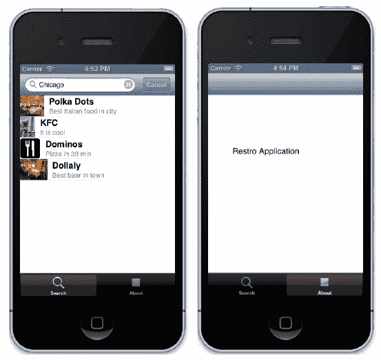

    在前面的屏幕截图中，我们可以看到屏幕底部有一个标签栏，包含两个标签：**搜索**和**关于**。

在上一章中，我们根据城市实现了搜索功能。让我们使搜索页面的搜索结果可点击；这将带我们到一个新的视图，显示我们选择的餐厅的详细信息：

1.  在 `app` 文件夹中创建一个 `detail_controller.rb` 控制器：

    ```swift
    class DetailController <  UIViewController
     attr_accessor :restaurant 
      def viewDidLoad
        view.backgroundColor = UIColor.whiteColor
        show_restaurant_detail
      end
      def show_restaurant_detail
         label = UILabel.alloc.init
          label.frame = [[120, 20], [300, 30]]
          label.backgroundColor = UIColor.clearColor
          label.font = UIFont.fontWithName("HelveticaNeue-CondensedBold",size:22)
          label.text = @restaurant.name
          view.addSubview(label)

          image = UIImage.alloc.initWithData(NSData.alloc.initWithContentsOfURL(NSURL.URLWithString(@restaurant.thumb_url_image)))
          view.addSubview(UIImageView.alloc.initWithImage(image))

          label = UILabel.alloc.init
           label.frame = [[20, 100], [300, 30]]
           label.backgroundColor = UIColor.clearColor
           label.font = UIFont.fontWithName("HelveticaNeue-CondensedBold",size:15)
           label.text = @restaurant.desc
           view.addSubview(label)
      end
    end
    ```

    在这些代码行中，我们正在显示将存储在 `@restaurant` 实例变量中的 `RestroController` 的所有详细信息。

1.  在 `app` 文件夹中的 `restro_controller.rb` 文件中添加以下代码：

    ```swift
      def tableView(tableView, didSelectRowAtIndexPath:indexPath)
      detail_controller = DetailController.alloc.init
        detail_controller.restaurant =  @restaurants[indexPath.row]
        self.navigationController.pushViewController(detail_controller,
          animated:true)
      end
    ```

    此代码将使表格的每一行成为一个链接，它将重定向到详细视图。

1.  此外，我们还需要在 `app_delegate.rb` 中替换以下行：

    ```swift
    RestroController.alloc.initWithStyle(UITableViewStylePlain) 
    ```

1.  以下代码片段将添加一个带有控制按钮的导航栏，以便在页面之间轻松导航：

    ```swift
    restro_tab = UINavigationController.alloc.initWithRootViewController(RestroController.alloc.initWithStyle(UITableViewStylePlain))
    ```

1.  让我们启动终端，并检查我们的进度：

    ```swift
    $rake

    ```

1.  这是我们的输出结果：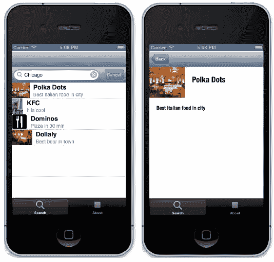

1.  我们可以看到一个导航栏和一个搜索栏，但我们只需要一个顶部的搜索栏。让我们在 `restro_application.rb` 中进行更改，将 `view.tableHeaderView = searchBar` 替换为以下内容：

    ```swift
    self.navigationItem.titleView = searchBar
    ```

1.  通常在 iOS 应用程序中，如果一行是一个指向另一个控制器的链接，则会在右侧角落显示一个箭头。让我们添加一个箭头，使其看起来更像 iOS 应用程序。更新 `restro_controller.rb`，并在创建 `TableView` 单元格的地方添加以下行：

    ```swift
    cell.accessoryType = UITableViewCellAccessoryDisclosureIndicator
    ```

1.  让我们运行应用程序来检查我们做了什么：

    ```swift
    $rake

    ```

1.  我们可以看到顶部的导航工具栏已经消失，但表格视图每一行的末尾都出现了箭头：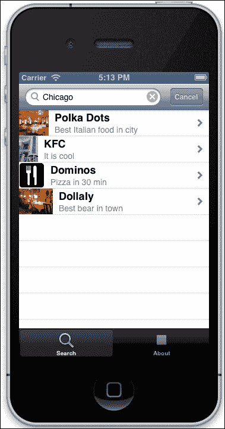

# 摘要

在本章中，我们学习了 iOS 用户界面的基础知识，这对于创建出色的用户友好型应用程序至关重要；我们涵盖了以下内容：

+   我们从了解标准 UI 元素开始，如条形，并学习了如何使用它们，以便我们不会失去 iOS 应用的基本结构

+   接下来，我们介绍了 UI 元素，如文本框、标签、滑块、选择器等

+   最后，我们将到目前为止学到的知识应用到我们的应用程序中，以获得一些实际经验

在下一章中，我们将把我们的重点转向使用 iOS 设备的强大设备功能，并学习如何使用 RubyMotion 来操作它们。我们还将学习如何利用相机、地理位置、联系人、手势以及许多其他功能来创建一些令人惊叹的演示应用程序。
