# 第六章. 设备功能 – 力量释放

*"软件会给你尊重，但硬件会给你力量。"*

*- 阿克夏特·保罗*

iPhone 不仅用于打电话、上网和播放音乐，它也是可以用来拍照、了解当前位置、理解手势以及做许多其他事情的最先进的硬件。那么，为什么不在你的应用程序中利用这些令人难以置信的设备功能呢。这些功能的美丽之处在于，只需通过 iPhone SDK 提供的工具进行操作，就可以快速导入图片、位置和地图，而代码行数最少。

在本章中，我们将重点关注以下主题：

+   相机

+   位置管理器（GPS）

+   手势

+   Core Data

+   地址簿

# 相机 – 微笑吧！

摄像头可能是 iOS 设备上最广泛使用的功能。在本节中，我们将通过创建一个应用程序来介绍最常用的相机事件，该应用程序将允许我们使用相机设备拍照，并从图库中选择图片。

iPhone 通过一个允许我们从不同的来源获取图像的选择器来实现图像选择，例如相机胶卷或照片库。`UIImagePickerController`类提供了基本的、可定制的用户界面（UI），用于拍照和录像，同时也为用户提供了对新捕获媒体的一些简单编辑功能。

`UIImagePickerController`类的角色和外观取决于分配给它的`sourceType`的值。有三种方式可以选择图像的来源，如下所示：

+   从相机中选择：

    ```swift
    imagePicker.sourceType = UIImagePickerControllerSourceTypeCamera;

    ```

+   从图库中的任何文件夹中选择：

    ```swift
    imagePicker.sourceType = UIImagePickerControllerSourceTypePhotoLibrary;

    ```

+   从照片专辑（相机胶卷）中选择：

    ```swift
    imagePicker.sourceType = UIImagePickerControllerSourceTypeSavedPhotosAlbum;

    ```

## 相机示例

让我们创建一个应用程序，允许我们从相机捕获照片并从照片图库中选择图像。执行以下步骤：

1.  使用`motion`命令创建一个应用程序：

    ```swift
    motion create CameraExample

    ```

1.  更新`app_delegate.rb`并将根控制器设置为`CameraController`：

    ```swift
    class AppDelegate
      def application(application, didFinishLaunchingWithOptions:launchOptions)
         @window = UIWindow.alloc.initWithFrame(UIScreen.mainScreen.bounds)
         @window.rootViewController = CameraController.alloc.init
         @window.makeKeyAndVisible
         true
      end
    end
    ```

1.  在`app`文件夹内创建一个名为`camera_controller.rb`的文件：

    ```swift
    class CameraController < UIViewController

      def viewDidLoad
        view.backgroundColor = UIColor.underPageBackgroundColor
        load_view
      end

      def load_view
        @camera_button = UIButton.buttonWithType(UIButtonTypeRoundedRect)
        @camera_button.frame  = [[50, 20], [200, 50]]
        @camera_button.setTitle("Click from camera", forState:UIControlStateNormal)
        @camera_button.addTarget(self, action: :start_camera, forControlEvents:UIControlEventTouchUpInside)
        view.addSubview(@camera_button)

        @gallery_button = UIButton.buttonWithType(UIButtonTypeRoundedRect)
        @gallery_button.frame  = [[50, 100], [200, 50]]
        @gallery_button.setTitle("Chose from Gallery", forState:UIControlStateNormal)
        @gallery_button.addTarget(self, action: :open_gallery, forControlEvents:UIControlEventTouchUpInside)
        view.addSubview(@gallery_button)

        @image_picker = UIImagePickerController.alloc.init
        @image_picker.delegate = self 
      end

      def imagePickerController(picker, didFinishPickingImage:image, editingInfo:info)
        self.dismissModalViewControllerAnimated(true)
        @image_view.removeFromSuperview if @image_view
        @image_view = UIImageView.alloc.initWithImage(image)
        @image_view.frame = [[50, 200], [200, 180]]
        view.addSubview(@image_view)
      end

      def start_camera
        if camera_present?
          @image_picker.sourceType = UIImagePickerControllerSourceTypeCamera
          presentModalViewController(@image_picker, animated:true)
        else
          show_alert
        end
      end
      def open_gallery
        @image_picker.sourceType = UIImagePickerControllerSourceTypePhotoLibrary
        presentModalViewController(@image_picker, animated:true)
      end
      def show_alert
        alert = UIAlertView.new  
        alert.message = ‘No Camera in device'
        alert.show
      end
      def camera_present?
        UIImagePickerController.isSourceTypeAvailable(UIImagePickerControllerSourceTypeCamera)
      end
    end
    ```

让我们通过在模拟器上使用以下命令测试我们的应用程序来看看我们已经做了什么：

```swift
$rake

```

我们可以看到以下截图所示的结果：

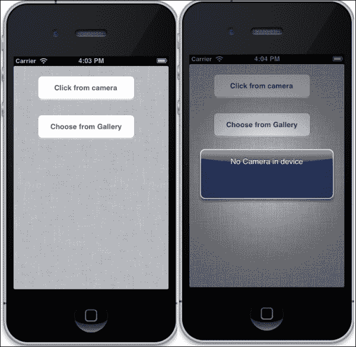

由于我们使用的是 iPhone 模拟器，我们无法访问相机硬件。然而，如果我们用 iPhone 设备测试我们的应用程序，我们将能够使用相机硬件并从中捕获图像。现在让我们通过点击**从图库选择**按钮来选择一个图像：

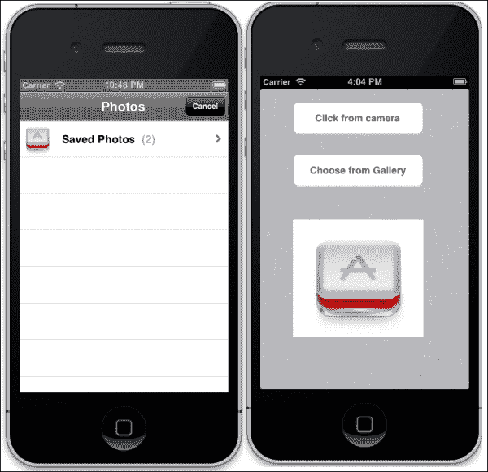

## 理解相机代码

首先，我们需要为拍照过程初始化两个按钮，并从图库中选择一张图片。我们还将创建一个图片选择器：

```swift
  def load_view
    @camera_button = UIButton.buttonWithType(UIButtonTypeRoundedRect)
    @camera_button.frame  = [[50, 20], [200, 50]]
    @camera_button.setTitle("Click from camera", forState:UIControlStateNormal)
    @camera_button.addTarget(self, action: :start_camera, forControlEvents:UIControlEventTouchUpInside)
    view.addSubview(@camera_button)
    @gallery_button = UIButton.buttonWithType(UIButtonTypeRoundedRect)
    @gallery_button.frame  = [[50, 100], [200, 50]]
    @gallery_button.setTitle("Choose from Gallery", forState:UIControlStateNormal)
    @gallery_button.addTarget(self, action: :open_gallery, forControlEvents:UIControlEventTouchUpInside)
    view.addSubview(@gallery_button)

    @image_picker = UIImagePickerController.alloc.init
    @image_picker.delegate = self 
  end
```

因此，当我们点击**从相机点击**和**从图库选择**按钮时，将分别调用`start_camera`和`open_gallery`操作：

```swift
  def start_camera
    if camera_present?
      @image_picker.sourceType = UIImagePickerControllerSourceTypeCamera
      presentModalViewController(@image_picker, animated:true)
    else
      show_alert
    end
  end

  def open_gallery
    @image_picker.sourceType = UIImagePickerControllerSourceTypePhotoLibrary
    presentModalViewController(@image_picker, animated:true)
  end
  def show_alert
    alert = UIAlertView.new  
    alert.message = ‘No Camera in device'
    alert.show
  end
```

因此，我们使用了 `UIImagePickerControllerSourceTypeCamera` 和 `UIImagePickerControllerSourceTypePhotoLibrary` 作为源类型；它们将分别打开相机和照片库工具。

### 提示

由于 iOS 应用程序也可以安装在如 iPod 这样的设备上，这些设备没有相机，因此为了检查设备是否有相机，使用 `UIImagePickerController.isSourceTypeAvailable(UIImagePickerControllerSourceTypeCamera)` 方法。

以下两个相机选择器代理可用：

+   `imagePickerController:didFinishPickingImage`: 当图像被选中时调用此方法

+   `imagePickerControllerDidCancel`: 当点击**取消**按钮时调用此方法

以下代理将在图像被选中时被调用：

```swift
  def imagePickerController(picker, didFinishPickingImage:image, editingInfo:info)
    self.dismissModalViewControllerAnimated(true)
    @image_view.removeFromSuperview if @image_view
    @image_view = UIImageView.alloc.initWithImage(image)
    @image_view.frame = [[50, 200], [200, 180]]
    view.addSubview(@image_view)
  end
```

明确调用 `self.dismissModalViewControllerAnimated(true)` 方法来移除弹出窗口，然后使用 `UIImageView` 显示图像。

# 位置管理器 – 应用程序指南

您必须已经观察到在许多 iOS 应用程序中，您的当前位置会自动被定位。使用 RubyMotion，我们可以轻松地使用设备的定位功能。这包括两个部分：第一是找到设备位置，第二是在我们的应用程序中显示它。

iOS SDK 包含各种层；其中之一是 **Core Services** 层，该层的一部分是 **Core Location** 框架。此框架使用可用的硬件来确定用户的当前位置以及他们正在前往的方向。Core Location 提供给我们坐标、文本字符串和数值，而不是像地图这样的视觉位置信息。在接下来的章节中，我们还将使用 Map Kit，这将帮助我们使用 Core Location 框架的知识直接在视图中嵌入地图。

## 位置管理器示例

让我们创建一个应用程序来演示如何使用 RubyMotion 应用程序与位置管理器一起使用。执行以下步骤：

1.  使用 `motion` 命令创建应用程序：

    ```swift
    $motion create LocationManager 

    ```

1.  更新 `app_delegate.rb` 文件：

    ```swift
    class AppDelegate
      def application(application, didFinishLaunchingWithOptions:launchOptions)
         @window = UIWindow.alloc.initWithFrame(UIScreen.mainScreen.bounds)
         @window.rootViewController = LocationController.alloc.init
         @window.makeKeyAndVisible
        true
      end
    end
    ```

1.  更新 `rake` 文件并添加以下行代码：

    ```swift
    app.frameworks = [‘CoreLocation', ‘MapKit']
    ```

1.  要使用位置服务，我们必须包含以下两个框架：

    +   `CoreLocation`: `CoreLocation` 框架允许您确定当前位置。此框架使用设备的可用硬件来确定设备的当前位置以及它们正在前往的方向。

    +   `MapKit`: `MapKit` 框架提供了一个将地图直接嵌入到您的应用程序视图中的接口。

1.  在 `app` 文件夹中创建 `location_controller.rb` 控制器并添加以下代码：

    ```swift
    class LocationController < UIViewController
      def viewDidLoad
        view.backgroundColor = UIColor.underPageBackgroundColor
        create_location_label
        check_location

      end 

      def check_location
        if (CLLocationManager.locationServicesEnabled)
         @location_manager = CLLocationManager.alloc.init
         @location_manager.desiredAccuracy = KCLLocationAccuracyKilometer
         @location_manager.delegate = self
         @location_manager.purpose = " Our applications functionality 
    is based on your current location "
         @location_manager.startUpdatingLocation
        else
          show_error_message(‘Please enable the Location Services for this app in Settings.')
        end
      end
      def create_location_label
      @latitudeLabel =  UILabel.alloc.initWithFrame( [[25, 30], [250, 40]] )
      @latitudeLabel.backgroundColor = UIColor.clearColor

      @longitudeLabel =  UILabel.alloc.initWithFrame( [[25, 80], [250, 40]] )
      @longitudeLabel.backgroundColor = UIColor.clearColor

       @latitudeLabel.text = "Latitude:"
       @longitudeLabel.text = "Longitude:"
       view.addSubview(@latitudeLabel)
       view.addSubview(@longitudeLabel)
      end
      def locationManager(manager, didUpdateToLocation:newLocation, fromLocation:oldLocation)
       @latitudeLabel.text =  @latitudeLabel.text + newLocation.coordinate.latitude.to_s
       @longitudeLabel.text =  @longitudeLabel.text + newLocation.coordinate.longitude.to_s
      end

      def locationManager(manager, didFailWithError:error)

         show_error_message(‘Please enable the Location Services for this app in Settings.')
      end
      def show_error_message msg
        alert = UIAlertView.new
        alert.message =  msg
        alert.show
      end

    end
    ```

在前面的代码中，我们使用以下步骤配置了 `CLLocationManager` 对象：

1.  在开始任何服务之前，始终检查所需的服务是否可用，如果不可用，则放弃操作。您可以通过触发 `CLLocationManager.locationServicesEnable` 来实现。如果此方法返回 `true`，则服务已为您的应用程序启用。

    ### 注意

    用户可以选择拒绝应用程序访问其位置服务数据的能力。在应用程序的初始使用过程中，Core Location 框架提示用户确认使用位置服务是否可接受。如果用户拒绝请求，`CLLocationManager`对象将在未来的请求中向代理报告适当的错误。

1.  然后，我们创建了一个`CLLocationManager`类的实例：

    ```swift
    @location_manager = CLLocationManager.alloc.init

    ```

1.  接下来，我们配置了与位置服务相关的其他属性：

    ```swift
     @location_manager.desiredAccuracy = KCLLocationAccuracyKilometer

    ```

    `desiredAccuracy`支持广泛的方法，提供不同级别的精度。您还可以使用`KCLLocationAccuracyBest`；这将提供更精确的结果，但也会耗电。`KCLLocationAccuracyKilometer`不会提供精确的位置，但在性能方面更有效。

    ```swift
     @location_manager.delegate = self
    @location_manager.purpose = "Our application provides functionality based on your current location"

    ```

    当应用程序请求权限时，此消息将显示。

1.  然后，我们创建了一个代理来处理我们应用程序的纬度和经度：

    ```swift
    def locationManager(manager, didUpdateToLocation:newLocation, fromLocation:oldLocation)
       @latitudeLabel.text =  @latitudeLabel.text + newLocation.coordinate.latitude.to_s
       @longitudeLabel.text =  @longitudeLabel.text + newLocation.coordinate.longitude.to_s
      end
    ```

1.  最后，我们调用了适当的启动方法以开始事件的传递：

    ```swift
    @location_manager.startUpdatingLocation

    ```

让我们启动终端并使用以下命令测试我们的应用程序：

```swift
$rake

```

输出如下：

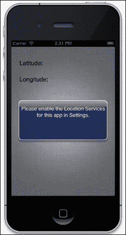

如果你的位置在模拟器中没有设置，你将得到一个弹出窗口显示错误，如前一个截图所示。

由于我们使用的是 iOS 模拟器，因此我们无法访问 iPhone 设备的物理 GPS。然而，iOS 模拟器确实提供了通过模拟器选择或添加值来模拟此功能的选择。从工具栏中，导航到**调试** | **位置**，然后选择或添加自定义经纬度值。

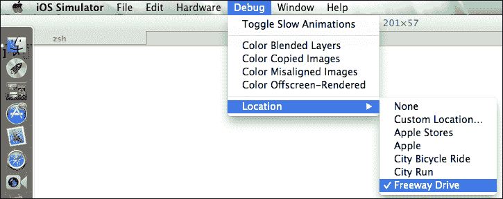

你可以在屏幕上看到一个带有自定义消息的弹出窗口，这是我们代码中描述的：

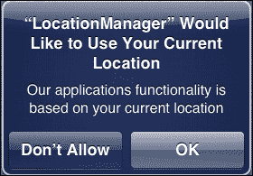

一旦我们点击**确定**，我们将在以下截图所示的位置看到经纬度：

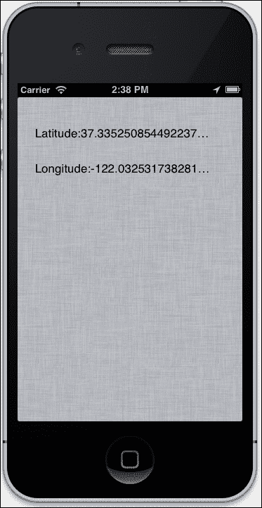

现在让我们在地图上绘制当前位置，并在屏幕上显示。

1.  将以下代码添加到`app`文件夹中的`location_controller.rb`文件：

    ```swift
      def show_map
         map= MKMapView.alloc.initWithFrame( [[20,190], [275, 150]] )
         map.mapType = MKMapTypeStandard
         self.view.addSubview(map)
      end
    ```

    我们选择了`MKMapTypeStandard`，但`MKMapView`提供了以下三种类型的地图：

    +   `MKMapTypeStandard`：这显示了街道和一些道路名称

    +   `MKMapTypeSatellite`：这显示了卫星图像

    +   `MKMapTypeHybrid`：这显示了该区域的卫星图像，包括道路及其名称以及其他叠加信息

1.  然后，在`location_controller.rb`文件中的`viewDidLoad`方法中添加以下代码：

    ```swift
      def viewDidLoad
        view.backgroundColor = UIColor.underPageBackgroundColor
        location_label
        check_location
        show_map
      end
    ```

1.  现在在模拟器中使用以下命令运行应用程序：

    ```swift
    $rake

    ```

    输出如下：

    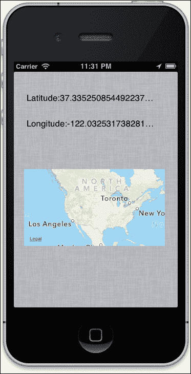

    上述代码将在屏幕上显示地图，但不会精确显示位置。我们现在将添加一个图钉——在 MapKit 术语中称为注释——到我们的地图上。

1.  更新`location_controller.rb`文件中的`show_map`方法：

    ```swift
      def show_map
         map= MKMapView.alloc.initWithFrame( [[20,190], [275, 150]] )
         map.mapType = MKMapTypeStandard
     location = CLLocationCoordinate2D.new(@latitude, @longitude) 
     map.setRegion( MKCoordinateRegionMake(location, MKCoordinateSpanMake(1, 1)),animated:true )
     pointer = MyAnnotation.alloc.initWithCoordinate(location, title:"Title", andSubTitle:"Sub Title")
     map.addAnnotation(pointer)
         self.view.addSubview(map)
      end
    ```

    `CLLocationCoordinate2D` 是一个包含位置地理坐标的结构体。

1.  要添加图钉（注释），你必须创建一个显式实现 `MKAnnotation` 协议的类。在这个类中，我们应该定义以下属性：

    +   `coordinate`

    +   `title`

    +   `subtitle`

1.  让我们在 `app` 文件夹内创建一个名为 `my_annotation.rb` 的文件。创建一个名为 `MyAnnotation` 的类，它具有以下属性：

    ```swift
    class MyAnnotation 
      def initWithCoordinate(coordinate, title:title, andSubTitle:subtitle)
        @coordinate = coordinate
        @title = title
        @subtitle = subtitle
        self
      end

      def coordinate
        @coordinate
      end
      def title
        @title
      end
      def subtitle
        @subtitle
      end
    end
    ```

1.  使用以下代码更新 `location_controller.rb` 文件：

    ```swift
      def locationManager(manager, didUpdateToLocation:newLocation, fromLocation:oldLocation)
     @latitude = newLocation.coordinate.latitude
     @longitude = newLocation.coordinate.longitude
        @latitudeLabel.text =  @latitudeLabel.text + newLocation.coordinate.latitude.to_s
        @longitudeLabel.text =  @longitudeLabel.text + newLocation.coordinate.longitude.to_s
     @location_manager.stopUpdatingLocation
     show_map
      end
    ```

1.  让我们打开终端，使用以下命令运行我们的应用程序：

    ```swift
    $rake

    ```

    输出如下：

    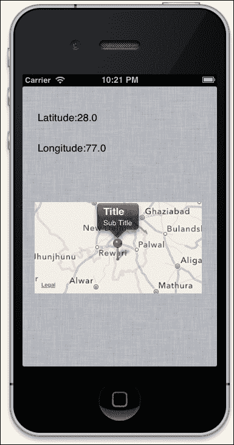

在前面的屏幕截图中，我们可以看到一个带有当前位置及其描述的地图。

### 小贴士

你可以通过导航到 **调试** | **更改位置** 来在模拟器中更改位置。

# 手势 – 非语言交流

手势是 iOS 应用程序的重要组成部分。例如，当我们捏住一张图片时，它会放大，或者当我们旋转设备时，图片的方向会改变。使用内置的 `UIGestureRecognizer` 类在你的应用程序中检测手势非常简单。

`UIGestureRecognizer` 有几个子类，每个子类都设计用来检测特定类型的手势。你可以使用以下子类来处理最常用的手势：

+   `UITapGestureRecognizer`：这个类可以检测用户在设备屏幕上所做的点击手势。

+   `UIPinchGestureRecognizer`：这个类可以检测用户在屏幕上所做的捏合手势。这种动作通常用于放大或缩小视图，或改变视觉组件的大小。

+   `UIPanGestureRecognizer`：这个类可以检测用户所做的拖动或平移手势。

+   `UISwipeGestureRecognizer`：这个类可以检测用户在屏幕上做出滑动手势的情况。这个类的实例可能被配置为只检测特定方向的运动。

+   `UIRotationGestureRecognizer`：这个类可以识别用户所做的旋转手势。（要做出旋转手势，请将两个相对的手指放在屏幕上接触，并使它们做圆形运动。）

+   `UILongPressGestureRecognizer`：这个类用于识别用户用一只或多只手指触摸屏幕一段时间的情况。

## 手势示例

以下是如何使用手势功能的示例：

1.  创建一个应用程序，帮助我们理解上一节中讨论的各种手势：

    ```swift
    $motion create gesture

    ```

1.  更新 `app` 文件夹中的 `app_delegate.rb` 文件：

    ```swift
    class AppDelegate
      def application(application, didFinishLaunchingWithOptions:launchOptions)

           @window = UIWindow.alloc.initWithFrame(UIScreen.mainScreen.bounds)
           @window.rootViewController = UINavigationController.alloc.initWithRootViewController(GestureController.new)
           @window.makeKeyAndVisible 
        true
      end
    end
    ```

1.  现在，在 `app` 文件夹中创建一个名为 `gesture_controller.rb` 的文件，并添加以下代码：

    ```swift
    class GestureController <  UIViewController
      def viewDidLoad
        view.backgroundColor = UIColor.whiteColor

        longPressRecognizer = UILongPressGestureRecognizer.alloc.initWithTarget(self, action:'longPressGestureRecognizer:')
        tap_gesture_recognizer = UITapGestureRecognizer.alloc.initWithTarget(self,action:'tabGestureRecognizer:')
        rotate_gesture_recognizer = UIRotationGestureRecognizer.alloc.initWithTarget(self, action:'rotationGestureRecognizer:')
        swipe_gesture_recognizer = UISwipeGestureRecognizer.alloc.initWithTarget(self, action:'swipeGestureRecognizer:')
        pan_gesture_recognizer = UIPanGestureRecognizer.alloc.initWithTarget(self, action:'panGestureRecognizer:')
        pinch_gesture_recognizer = UIPinchGestureRecognizer.alloc.initWithTarget(self, action:'pinchGestureRecognizer:')

        self.view.addGestureRecognizer(longPressRecognizer)
        self.view.addGestureRecognizer(tap_gesture_recognizer)
        self.view.addGestureRecognizer(rotate_gesture_recognizer) 
        self.view.addGestureRecognizer(swipe_gesture_recognizer)
        self.view.addGestureRecognizer(pan_gesture_recognizer)
        self.view.addGestureRecognizer(pinch_gesture_recognizer)
        load_labels
      end
        def longPressGestureRecognizer(longPressRecognizer)  
        show_alert("You've pressed the screen long enough!") if UIGestureRecognizerStateEnded == longPressRecognizer.state
      end
      def tabGestureRecognizer(tap_gesture_recognizer)
        show_alert("You've tapped the screen!")
      end
      def rotationGestureRecognizer(rotate_gesture_recognizer)
        show_alert("You've rotated the screen!") if UIGestureRecognizerStateEnded == rotate_gesture_recognizer.state
      end
      def swipeGestureRecognizer(swipe_gesture_recognizer)
        show_alert("You've just swiped!") if UIGestureRecognizerStateEnded == swipe_gesture_recognizer.state
      end
      def panGestureRecognizer(pan_gesture_recognizer)
        show_alert("You've Panned!") if UIGestureRecognizerStateEnded == pan_gesture_recognizer.state
      end
      def pinchGestureRecognizer(pinch_gesture_recognizer)
        show_alert("You've Pinched!") if UIGestureRecognizerStateEnded == pinch_gesture_recognizer.state
      end

      def load_labels
        label = UILabel.new
        label.frame = [[10,50],[300,100]]
        label.lineBreakMode = UILineBreakModeWordWrap;
        label.numberOfLines = 0
        label.text = " Try a different gesture such as tap, rotate, swipe, pan and pinch "
        view.addSubview(label) 
      end
      def show_alert(message)
        alert_box = UIAlertView.alloc.initWithTitle("Gesture Action",
        message:message,
        delegate: nil,
        cancelButtonTitle: "ok",
        otherButtonTitles:nil)

        alert_box.show
      end
    end
    ```

1.  使用以下命令运行应用程序：

    ```swift
    $rake

    ```

    输出如下：

    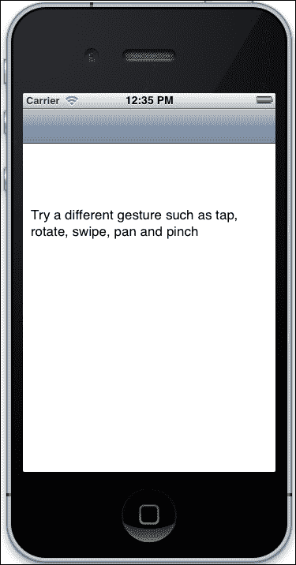

    ### 小贴士

    你可能想知道我们如何在模拟器上使用多点触控。要在模拟器上使用此功能，请按住*Option*键；这样做将在模拟器屏幕上显示两个圆圈。你可以将它们移动到所需的方向。

    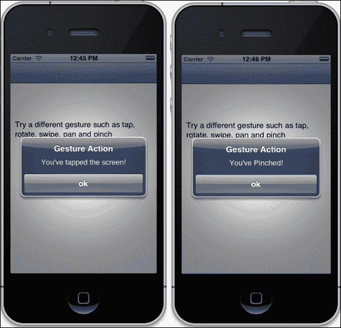

现在我们来理解一下代码。首先，我们为每个类创建了一个不同的识别器：

```swift
    longPressRecognizer = UILongPressGestureRecognizer.alloc.initWithTarget(self, action:'longPressGestureRecognizer:')
    tap_gesture_recognizer = UITapGestureRecognizer.alloc.initWithTarget(self,action:'tabGestureRecognizer:')
    rotate_gesture_recognizer = UIRotationGestureRecognizer.alloc.initWithTarget(self, action:'rotationGestureRecognizer:')
    swipe_gesture_recognizer = UISwipeGestureRecognizer.alloc.initWithTarget(self, action:'swipeGestureRecognizer:')
    pan_gesture_recognizer = UIPanGestureRecognizer.alloc.initWithTarget(self, action:'panGestureRecognizer:')
    pinch_gesture_recognizer = UIPinchGestureRecognizer.alloc.initWithTarget(self, action:'pinchGestureRecognizer:')
```

对于每个识别器，我们将调用一个动作。这意味着每当用户创建一个模式或做出一个手势，如旋转，其对应动作就会被调用。例如，当用户尝试捏合视图时，`pinchGestureRecognizer`就会被调用。

记住，在我们创建了识别器之后，我们需要将它们添加到视图中，以便用户可以与之交互。我们通过将识别器对象传递给`addGestureRecognizer()`方法来实现这一点：

```swift
    self.view.addGestureRecognizer(longPressRecognizer)
    self.view.addGestureRecognizer(tap_gesture_recognizer)
    self.view.addGestureRecognizer(rotate_gesture_recognizer)
    self.view.addGestureRecognizer(swipe_gesture_recognizer)
    self.view.addGestureRecognizer(pan_gesture_recognizer)
    self.view.addGestureRecognizer(pinch_gesture_recognizer)
```

接下来，我们为每个手势创建了动作。当用户展示任何常见手势时，我们只是显示一个弹出窗口。例如，当我们进行捏合操作时，以下代码会被调用：

```swift
def pinchGestureRecognizer(pinch_gesture_recognizer)
    show_alert("You have Pinch") if UIGestureRecognizerStateEnded == pinch_gesture_recognizer.state
  end
```

这个动作会在几个状态下被调用，例如捏合开始和捏合停止时。对于离散手势，如轻触手势，手势识别器会在每次识别时调用该方法；对于连续手势，手势识别器会在重复的间隔内调用该方法，直到手势结束（即，直到最后一个手指从手势识别器的视图中抬起）。因此，你可以通过`UIGestureRecognizerState`找到许多状态，其值可以是以下之一：

+   `UIGestureRecognizerStatePossible`

+   `UIGestureRecognizerStateBegan`

+   `UIGestureRecognizerStateChanged`

+   `UIGestureRecognizerStateEnded`

+   `UIGestureRecognizerStateCancelled`

+   `UIGestureRecognizerStateFailed`

+   `UIGestureRecognizerStateRecognized` = `UIGestureRecognizerStateEnded`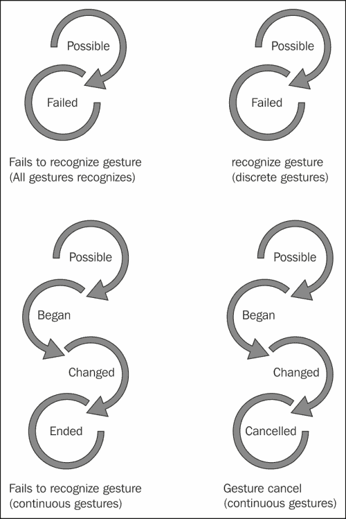

如前图所示，当一个手势被识别时，每个后续的状态转换都会导致向目标发送一个动作消息。当手势识别器达到**Recognized**或**Ended**状态时，它会被要求重置其内部状态，以便为新尝试识别手势做准备。

### 小贴士

对手势的响应应与用户期望的一致。例如，捏合手势应该缩放视图，使其放大和缩小；它不应被解释为，比如说，选择请求，对于这种请求，轻触更合适。

## 自己动手做

你可以实现自己的自定义手势识别器。要实现这一点，首先创建一个`UIGestureRecognizer`的子类。然后你可以重写以下方法：

+   `reset`

+   `touchesBegan`

+   `touchesMoved`

+   `touchesEnded`

+   `touchesCancelled`

# Core Data – 管理你的数据

有时应用程序需要保存和操作用户数据。iOS SDK 为此目的提供了一个名为 Core Data 的框架。

**Core Data** 框架提供了与对象生命周期及其搜索和持久化功能相关的全面和自动化的解决方案。它可以在对象级别上检索和操作数据，而不必担心存储和检索的细节。

使用 Core Data，可以通过表示实体及其关系的更高级对象来处理数据。Core Data 直接与 SQLite 交互，将开发者与底层的 SQL 分隔开来。

那么，这意味着 Core Data 是一个数据库吗？不；Core Data 不是一个数据库，最好的例子是 Core Data 可以完全在内存中使用，而不需要任何持久化形式。那么 Core Data 是否类似于 Active Record 或 Hibernate 这样的 ORM？不；Core Data 是一个具有生命周期、搜索和持久化功能的对象图管理器。使用 Core Data，应用程序可以定义数据库模式、创建数据库文件以及创建和管理记录数据。

## Core Data 示例

我们将创建一个简单的员工应用程序，允许我们添加员工的姓名和年龄。这个例子仅用于演示 Core Data 的工作原理：

1.  使用 `motion` 命令创建一个应用程序：

    ```swift
    $motion create CoreDataExample

    ```

1.  在 `rake.rb` 文件中添加 `CoreData` 框架：

    ```swift
    app.frameworks += [‘CoreData']
    ```

1.  这将是一个 MVC 应用程序，所以让我们在 `app` 文件夹中创建一个名为 `employee.rb` 的模型：

    ```swift
    class Employee < NSManagedObject
      #Attribute Name, Data Type, Default Value, Is Optional, Is Transient, Is Indexed
      @attributes ||= [
        [‘name', NSStringAttributeType, ‘', false, false, false],
        [‘age', NSInteger32AttributeType, 0, false, false, false]   
      ]
    end
    ```

    你一定注意到了，我们已经从 `NSManagedObject` 继承了 `Employee` 类。我们在 `employee` 表的属性中创建了一个数组数组，属性包括 `name` 和 `age`。你可能想知道这个数组中还有哪些其他参数。为了理解这一点，我们将在应用程序中编写一些辅助函数。

1.  创建一个名为 `helper` 的文件夹，并在其中添加一个名为 `NSEntityDescription.rb` 的文件，文件中包含以下代码：

    ```swift
    class NSEntityDescription
      def self.newEntityDescriptionWithName(name, attributes:attributes)
        entity = self.alloc.init
        entity.name = name
        entity.managedObjectClassName = name

        attributes = attributes.each.map do |name, type, default, optional, transient, indexed|
          property = NSAttributeDescription.alloc.init
          property.name = name
          property.attributeType = type
          property.defaultValue = default if default != nil
          property.optional = optional
          property.transient = transient
          property.indexed = indexed
          property
        end
        entity.properties = attributes 
        entity
      end 
    end
    ```

    我们在员工模型中创建的属性是通过这个类定义的。对于每个属性，将使用 `NSAttributeDescription` 类来定义它们。`NSAttributeDescription` 类用于描述由 `NSEntityDescription` 实例描述的实体的属性。它继承自 `NSPropertyDescription`，它提供了大部分基本行为。`NSAttributeDescription` 的实例用于描述属性，而不是关系。我们可以为 `NSAttributeDescription` 的对象定义许多属性；例如，我们可以在它上面添加验证，我们可以对属性进行索引，等等。

1.  接下来，在 `app` 文件夹中创建一个名为 `NSManagedObject.rb` 的文件，并添加以下代码：

    ```swift
      def self.entity
        @entity ||= NSEntityDescription.newEntityDescriptionWithName(name, attributes:@attributes)
      end

      def self.objects
        # Use if you do not want any section in your table view
        @objects ||= NSFetchRequest.fetchObjectsForEntityForName(name, withSortKey:@sortKey, ascending:false, inManagedObjectContext:Store.shared.context)
      end

    end

    class NSManagedObject
      def self.entity
        @entity ||= NSEntityDescription.newEntityDescriptionWithName(name, attributes:@attributes)
      end
      def self.objects
        # Use if you do not want any section in your table view
        @objects ||= NSFetchRequest.fetchObjectsForEntityForName(name, withSortKey:@sortKey, ascending:false, inManagedObjectContext:Store.shared.context)
      end
    end
    ```

    `NSEntityDescription`对象描述了 Core Data 中的一个实体。对于一个托管对象来说，实体就像类对于 ID 一样，或者用数据库的比喻来说，就像表对于行一样。`NSEntityDescription`对象可能包含`NSAttributeDescription`和`NSRelationshipDescription`对象，它们代表了模式中实体的属性。实体还可以有检索属性，由`NSFetchedPropertyDescription`的实例表示，模型还可以有检索请求模板，由`NSFetchRequest`的实例表示。

1.  现在，将以下代码添加到`app_delegate.rb`文件中：

    ```swift
    class AppDelegate
      def application(application, didFinishLaunchingWithOptions:launchOptions)      
          setting_core_data
          true
      end 

      def setting_core_data

        # First we need to create the NSManagedObjectModel with all the entities and their relationships. 
        managed_object_model = NSManagedObjectModel.alloc.init
        managed_object_model.entities = [Employee.entity]

        # The next object needed is the NSPersistentStoreCoordinator which will allow Core Data to persist the information.
        persistent_store_coordinator = NSPersistentStoreCoordinator.alloc.initWithManagedObjectModel(managed_object_model)

        # Now lets get a URL for where we want Core Data to create the persist file, in this case a SQLite Database File
        persistent_store_file_url = NSURL.fileURLWithPath(File.join(NSHomeDirectory(), 
                                                                    ‘Documents', 
                                                                    ‘EmployeeStore.sqlite'))

        error_pointer = Pointer.new(:object)

        # Add a new Persistent Store to our Persistent Store Coordinator which means that we are telling the Persistent Store Coordinator where to perform the save of our objects.
        # In this case we are stating that our objects must be stored in a SQLite database in the path we already created previously
       unless persistent_store_coordinator.addPersistentStoreWithType(NSSQLiteStoreType,
    configuration: nil,                                                                   URL: persistent_store_file_url,
    options: nil,                                                                   error: error_pointer)
          # In case we can't initialize the Persistance Store File
     raise "Cannot initialize Core Data Persistance Store Coordinator: #{error_pointer[0].description}"
        end
        # Finally our most important object, the Managed Object Context, is responsible for creating, destroying, and fetching the objects

        @managed_object_context = NSManagedObjectContext.alloc.init
        @managed_object_context.persistentStoreCoordinator = persistent_store_coordinator
      end
    end
    ```

    到目前为止，我们已经完成了一些基本的设置，这是在实际使用数据库操作之前必须做的。在这种情况下，我们声明我们的对象必须存储在我们代码中定义的位置的 SQLite 数据库中，文件名为`EmployeeStore.sqlite`。

    在前面的代码中，我们创建了一个包含所有实体的`NSManagedObjectModel`对象。你可以把这个对象想象成 Core Data 将要使用的对象的参考。下一个需要的对象是`NSPersistentStoreCoordinator`对象，它将允许 Core Data 持久化信息。它还负责选择一个位置来保存我们的对象。

    在我们代码的最后部分，我们使用了最重要的类，即`NSManagedObjectContext`类。这个类负责创建、销毁和检索对象。`NSManagedObjectContext`的一个实例代表应用程序中的一个单个“对象空间”或草稿板。它的主要职责是管理一组托管对象。这些对象形成了一个相关模型对象的组，代表了一个或多个持久存储的内部一致视图。单个托管对象实例存在于一个上下文中，并且只有一个上下文，但一个对象可以在不同的上下文中存在多个副本。

1.  让我们启动终端并使用以下命令运行我们的应用程序：

    ```swift
    $rake

    ```

    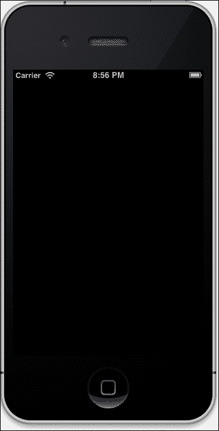

1.  你将看到一个空白的屏幕，因为我们还没有创建控制器和视图。我们将在下一节中创建它们，但在那之前，让我们首先使用以下代码更新`app_delegate`文件以适应控制器和视图：

    ```swift
      def application(application, didFinishLaunchingWithOptions:launchOptions)   
          setting_core_data
          employee_view_controller = EmployeeViewController.alloc.init

     # We need to pass the Managed Object Context to the next controller so we can use it later for creating, fetching or deleting objects
     employee_view_controller.managed_object_context = @managed_object_context
     @window = UIWindow.alloc.initWithFrame(UIScreen.mainScreen.bounds)
     @window.rootViewController  = UINavigationController.alloc.initWithRootViewController(employee_view_controller)
     @window.makeKeyAndVisible

          true
      end
    ```

### 创建员工

在上一段代码的最后部分，我们初始化了`EmployeeViewController`。接下来，我们将管理对象上下文传递给下一个控制器，该控制器将用于创建、检索或删除对象。最后，我们将创建一个窗口并将`EmployeeViewController`设置为它的根控制器：

1.  在`app`文件夹中创建一个名为`employee_view_controller.rb`的文件，并在其中添加以下代码：

    ```swift
    class EmployeeViewController < UIViewController
     attr_accessor :managed_object_context
     def loadView
       # Set up the title for the View Controller
       self.title = ‘Employee'

       # Create a new Table View for showing the Text Fields
       table_view = UITableView.alloc.initWithFrame(UIScreen.mainScreen.bounds,
                                                    style:UITableViewStyleGrouped)
       table_view.dataSource = self
       self.view = table_view

       # Create a new Bar Button Item with the Add System Default
       add_new_employee_item= UIBarButtonItem.alloc.initWithBarButtonSystemItem(UIBarButtonSystemItemAdd,
                                                                                     target: self,
                                                                                     action: ‘add_new_employee')
       # Add the Bar Button Item to the Navigation Bar
       self.navigationItem.rightBarButtonItem = add_new_employee_item
     end

     def viewWillAppear(animated)
       super
       reload_data
     end
    ```

1.  接下来，让我们使用`NSFetchRequest`对象检索特定对象。我们还需要告诉 Core Data 我们想要检索哪个实体。这可以通过`NSEntityDescription`来完成：

    ```swift
    def reload_data
    fetch_request = NSFetchRequest.alloc.init

    entity = NSEntityDescription.entityForName(Employee.name, 
                                                           inManagedObjectContext:@managed_object_context)
       fetch_request.setEntity(entity)

       # Sort the Employee by employee name
       fetch_sort = NSSortDescriptor.alloc.initWithKey(‘name',
                                                       ascending: true)
       fetch_request.setSortDescriptors([fetch_sort])

       # Update the fetch employee array and reload the table view
       update_fetched_employee_with_fetch_request(fetch_request)
     end

     def update_fetched_employee_with_fetch_request(fetch_request)

       # Create a new pointer for managing the errors
       error_pointer = Pointer.new(:object)

       # Using the NSManagedObjectContext execute the fetch request
       @fetched_employee = @managed_object_context.executeFetchRequest(fetch_request,
                                                                     error: error_pointer)

       # If the returning array of the fetch request is nil
       # means that a problem has occurred
       unless @fetched_employee
         raise "Error fetching employee: #{error_pointer[0].description}"
       end
       # refresh table view to reload its data
       self.view.reloadData
     end

     # UITableView Data Source
     def tableView(tableView, numberOfRowsInSection: section)
       @fetched_employee.count
     end

     def tableView(tableView, cellForRowAtIndexPath: indexPath)
       cell_identifier = ‘EmployeeCell'
       cell = tableView.dequeueReusableCellWithIdentifier(cell_identifier)
       # If we are not cells to use we need to create one
       if cell == nil
         # Lets create a new UITableViewCell with the identifier
         cell = UITableViewCell.alloc.initWithStyle(UITableViewCellStyleValue1, reuseIdentifier:cell_identifier)
         cell.selectionStyle = UITableViewCellSelectionStyleNone
       end

       employee = @fetched_employee[indexPath.row]
       cell.textLabel.text = employee.name
       cell.detailTextLabel.text = employee.age.to_s
       cell
     end

     def add_new_employee
       add_employee_view_controller = AddEmployeeViewController.alloc.init

       # We need to pass the Managed Object Context to the next controller so we can use it later for creating, fetching or deleting objects
       add_employee_view_controller.managed_object_context = @managed_object_context
       self.navigationController.pushViewController(add_employee_view_controller, 
                                                    animated:true)
     end

    end
    ```

    这段代码很多；让我们尝试理解它。首先，我们创建了一个 `tableView` 来创建表格，因为这是表示此类数据的最佳方式。然后，我们在导航栏顶部创建了一个 **+** 按钮，并将其与 `add_new_employee` 动作关联。当按下此按钮时，它会调用 `add_new_employee` 动作，该动作反过来调用一个新视图，显示表单，并添加一个新员工。

    然后，我们创建了一个 `reload_data` 方法，该方法将被调用来刷新视图并显示员工数据。它将使用 `NSFetchRequest` 对象获取员工数据。然后，我们声明了 `NSEntityDescription` 用于 `Employee` 对象，这样我们就可以告诉 Core Data 我们想要检索哪个实体。我们还使用 `NSSortDescriptor` 对结果按名称进行排序。

    在我们的示例的最后部分，我们创建了一个 `update_fetched_employee_with_fetch_request` 方法，该方法将获取员工数组并更新表格以显示所有数据。`NSManagedObjectContext` 执行我们创建的以下代码的获取请求：

    ```swift
    @fetched_employee = @managed_object_context.executeFetchRequest(fetch_request,
                                                                     error: error_pointer)
    ```

1.  接下来，我们将创建当点击 **+** 按钮时将被调用的视图。让我们创建一个名为 `add_employee_view_controller.rb` 的文件，并向其中添加以下代码：

    ```swift
    class AddEmployeeViewController < UIViewController
      attr_accessor :managed_object_context

      def viewDidLoad
        self.view.backgroundColor = UIColor.whiteColor
        self.title = ‘Add Employee'
        save_bar_button_item = UIBarButtonItem.alloc.initWithTitle(‘Save',
        style: UIBarButtonItemStyleDone,
        target: self,
        action: ‘save_employee')
       self.navigationItem.rightBarButtonItem = save_bar_button_item
        load_form
      end

      def save_employee
        # Using Core Data create a new instance of the object employee
        employee = NSEntityDescription.insertNewObjectForEntityForName(Employee.name, 
        inManagedObjectContext: @managed_object_context)
        # Assign the text of the name text field to the employee
        employee.name = @name.text
        employee.age = @age.text.intValue

        # Create a new pointer for managing the errors
        error_pointer = Pointer.new(:object)

        # Lets persist the new Movie object, saving the managed object context that contains it
        unless @managed_object_context.save(error_pointer)
          raise "Error saving a new Director: #{error_pointer[0].description}"
        end

        # Pop the Director View Controller
        self.navigationController.popViewControllerAnimated(true)
      end

      def load_form 
        @name = UITextField.alloc.initWithFrame([[50,50],[200,30]])
        @name.borderStyle = UITextBorderStyleRoundedRect
        @name.placeholder = "Name"
        self.view.addSubview(@name)
        @age = UITextField.alloc.initWithFrame([[50,100],[200,30]])
        @age.borderStyle = UITextBorderStyleRoundedRect
        @age.placeholder = "Age"
        self.view.addSubview(@age)
      end
    end
    ```

    使用前面的代码，我们创建了两个文本框，一个用于姓名，另一个用于年龄，并在视图顶部添加了一个 **保存** 按钮，通过调用 `save_employee` 动作来保存员工详细信息。在 `save_employee` 动作中，我们使用 Core Data 以以下方式创建 `employee` 对象的新实例：

    ```swift
    employee = NSEntityDescription.insertNewObjectForEntityForName(Employee.name, 
                                                                    inManagedObjectContext: @managed_object_context)
    ```

    然后，我们将文本框的值赋给 `employee` 对象，并最终保存该对象并导航到 `EmployeeViewController`。

1.  让我们启动终端，并使用以下命令运行我们的应用程序：

    ```swift
    $ rake

    ```

    输出如下：

    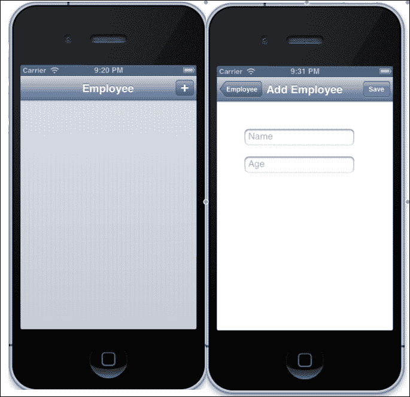

1.  现在，让我们使用视图向 **Employee** 表单添加数据：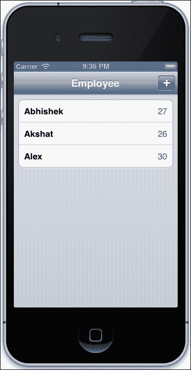

### 删除员工

完成最后部分后，我们的 Core Data 应用程序能够添加新的员工记录。但可能会有需要删除员工记录的情况。在本节中，我们将增强我们的应用程序以删除员工记录。此功能的用例将是，当我们滑动任何行时，系统将要求确认。一旦我们确认，记录将被删除：

1.  更新 `employee_view_controller.rb` 文件，添加以下代码：

    ```swift
    def tableView(tableView, canEditRowAtIndexPath: indexPath)
       true
     end

    def tableView(tableView, commitEditingStyle: editingStyle, forRowAtIndexPath: indexPath)

       employee = @fetched_employee[indexPath.row]
       # Ask the NSManagedObjectContext to delete the object
       @managed_object_context.deleteObject(employee)

       # Create a new pointer for managing the errors
       error_pointer = Pointer.new(:object)

       # Lets persist the deleted employee object, saving the managed object context that contains it
       unless @managed_object_context.save(error_pointer)
         raise "Error deleting an Employee: #{error_pointer[0].description}"
       end   

       # Create a new mutable copy of the fetched_employee array
       mutable_fetched_employee = @fetched_employee.mutableCopy

       # Remove the employee from the array
       mutable_fetched_employee.delete(employee)

       # Assign the modified array to our fetched_employee property
       @fetched_employee = mutable_fetched_employee

       # Tell the table view to delete the row
       tableView.deleteRowsAtIndexPaths([indexPath], 
                                        withRowAnimation:UITableViewRowAnimationFade)
     end
    ```

    使用 iOS 的 `tableView`，我们有直接创建或删除行的方法。在前面代码中，我们首先将值 `true` 传递给 `tableView(tableView, canEditRowAtIndexPath: indexPath)` 代理。然后为了执行删除操作，我们定义了 `tableView(tableView, commitEditingStyle: editingStyle, forRowAtIndexPath: indexPath)` 代理。

1.  一旦我们获取到要删除的行，我们使用 `NSManagedObjectContext` 来删除该对象：

    ```swift
       @managed_object_context.deleteObject(employee)
    ```

    ### 小贴士

    记住，我们必须始终调用`save`来将其持久化到我们的数据库中。

1.  让我们启动终端并使用以下命令运行应用程序：

    ```swift
    $rake

    ```

    输出如下：

    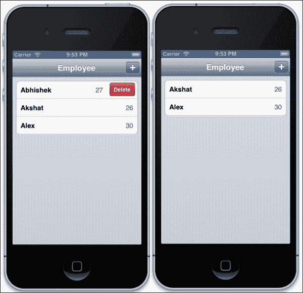

如前一个屏幕截图所示，当我们滑动行时，系统会提示我们删除该行。一旦我们点击**删除**，该行就会被删除。

# 通讯录 – 管理您的联系人

iOS 通讯录提供了一种方式，可以将人们的联系信息和其它个人信息存储在一个集中的数据库中，然后可以在各种应用程序之间共享。在本节中，我们将执行与通讯录相关的基本操作。

在本节中，我们将执行以下操作：

+   访问设备的通讯录

+   选择一个用户

+   将通讯录中的数据复制到我们的应用程序中

执行以下步骤以使用通讯录：

1.  让我们首先使用我们最喜欢的`motion`命令创建一个示例通讯录应用程序：

    ```swift
    $motion create AddressBook_example

    ```

1.  接下来，让我们创建一个名为`addressbook_controller.rb`的控制器，并在`app_delegate.rb`中替换以下代码，以便我们的代理指向通讯录控制器：

    ```swift
    class AppDelegate
      def application(application, didFinishLaunchingWithOptions:launchOptions)

      @window = UIWindow.alloc.initWithFrame(UIScreen.mainScreen.bounds)
      @window.rootViewController = AddressbookController.alloc.init
      @window.makeKeyAndVisible

        true
      end
    end
    ```

1.  接下来，在我们的`addressbook_controller.rb`控制器中，它最初将是空的，我们将添加一个按钮和两个标签。通过按钮，我们将访问我们的通讯录，然后选择所需的联系人。在标签中，我们将显示从通讯录中选定的用户的数据。让我们在我们的`addressbook_controller`控制器中添加以下代码：

    ```swift
    def viewDidLoad
        view.backgroundColor = UIColor.underPageBackgroundColor
        load_button
        load_labels
    end

    def load_button

           @phonebook_button = UIButton.buttonWithType(UIButtonTypeRoundedRect)
           @phonebook_button.frame = [[50, 20], [200, 50]]
           @phonebook_button.setTitle("Click from Contacts", forState:UIControlStateNormal)
    	    @phonebook_button.addTarget(self, action: :phonebook_access, forControlEvents:UIControlEventTouchUpInside)
           view.addSubview(@phonebook_button)    
    end

    def load_labels

           @first_name = UILabel.new
           @first_name.text = ‘First Name'
           @first_name.frame = [[100,100],[150,50]]

           @phone_number = UILabel.new
           @phone_number.text = ‘Phone Number'
           @phone_number.frame = [[100,200],[150,50]]

           view.addSubview(@first_name)
           view.addSubview(@phone_number)

    end
    ```

1.  让我们`rake`并查看到目前为止的进度：

    ```swift
    $rake

    ```

    输出如下：

    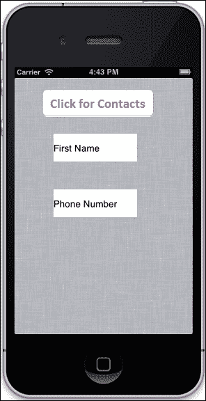

1.  在前一个步骤中，我们提到了`phonebook_access`方法；让我们创建它。这个方法将帮助我们访问设备的通讯录。此外，让我们将以下代码添加到我们的`addressbook_controller.rb`文件中：

    ```swift
    def addressbook_access
        @people_picker = ABPeoplePickerNavigationController.alloc.init
        @people_picker.peoplePickerDelegate = self
         presentModalViewController(@people_picker, animated:true)
    end
    ```

1.  再次执行`rake`命令，看看我们是否能够通过点击**点击以选择联系人**按钮访问通讯录：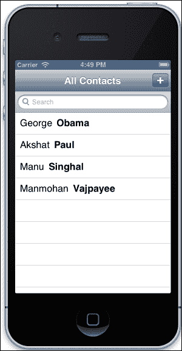

1.  在最后一步，我们已经进入了通讯录，可以看到联系人的列表。接下来，我们需要添加一个方法来复制所需的联系人并返回到我们的应用程序。这可以通过`peoplePickerNavigationController`来实现。此外，我们将在`addressbook_controller`中添加以下代码：

    ```swift
    def peoplePickerNavigationController(peoplePicker, shouldContinueAfterSelectingPerson:person)
       self.displayPerson(person)
       self.dismissModalViewControllerAnimated(true)

    end
    ```

1.  现在我们需要显示从通讯录复制的所有数据。这可以通过使用`displayPerson`方法来实现，它将允许我们使用保存的值。将以下方法添加到`addressbook_controller`：

    ```swift
    def displayPerson(person)
       firstname = ABRecordCopyValue(person, KABPersonFirstNameProperty)
       phoneNumbers = ABRecordCopyValue(person, KABPersonPhoneProperty)
       phone = ABMultiValueCopyValueAtIndex(phoneNumbers, 0)
       @phone_number.text = phone
       @first_name.text = firstname

    end
    ```

    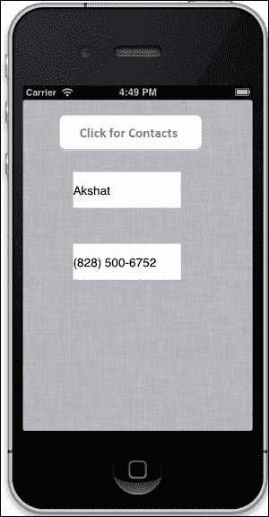

太好了！但我们遗漏了一些东西。如果用户改变主意，不想选择任何联系人怎么办？我们需要找到一种方法从通讯录返回到原始应用程序。这可以通过在`addressbook_controller`中添加以下三行方法来实现：

```swift
def peoplePickerNavigationControllerDidCancel(peoplePicker)
    self.dismissModalViewControllerAnimated(true)
end
```

# 亲自动手

到目前为止，我们已经学到了很多；现在让我们利用我们所获得的知识，通过实现以下更改来改进我们的 restro 应用程序：

## 任务 1 – 显示最近的餐厅

要从服务器获取数据，请使用`http://restro.nalwaya.com/restaurants/find_restaurent_distance.json?latitude=#{latitude}&&longitude=#{longitude}` API。

您必须与这个请求一起传递纬度和经度，然后您将获得一个包含餐厅列表的 JSON 格式。使用这个作为输入并创建一个显示结果的视图。

## 任务 2 – 在地图上用图钉标记每个餐厅

使用`http://restro.nalwaya.com/restaurants/search.json?city={city_name}` API，它将为您提供包含经纬度的餐厅列表，格式为 JSON。使用这些坐标在地图上显示他们的位置。

完成这个练习后，将你的解决方案与本书提供的章节代码中的解决方案进行比较。

# 摘要

以下是我们在本章中学到的内容：

+   如何访问相机

+   如何使用 Core Location

+   如何使用不同的设备手势

+   如何使用 Core Data 在手机上存储数据

+   如何访问通讯录

现在我们已经熟悉了 RubyMotion 的基础知识，在下一章中，我们将深入探讨 RubyMotion 的 iOS SDK 高级功能。iOS SDK 功能强大，具有广泛的功能。在下一章中，我们将详细讨论如何使用`.storyboard`、`.xib`和`WebView`，以创建一个真正交互式的应用程序。
