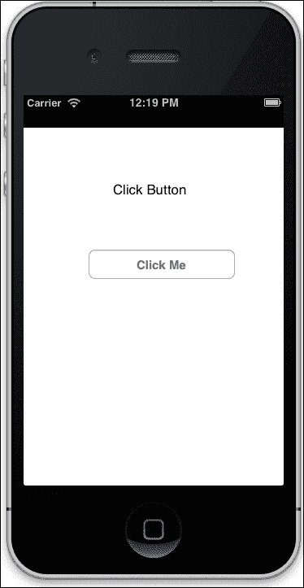
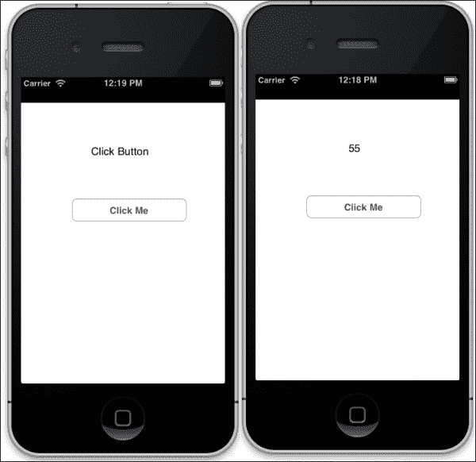
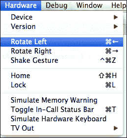
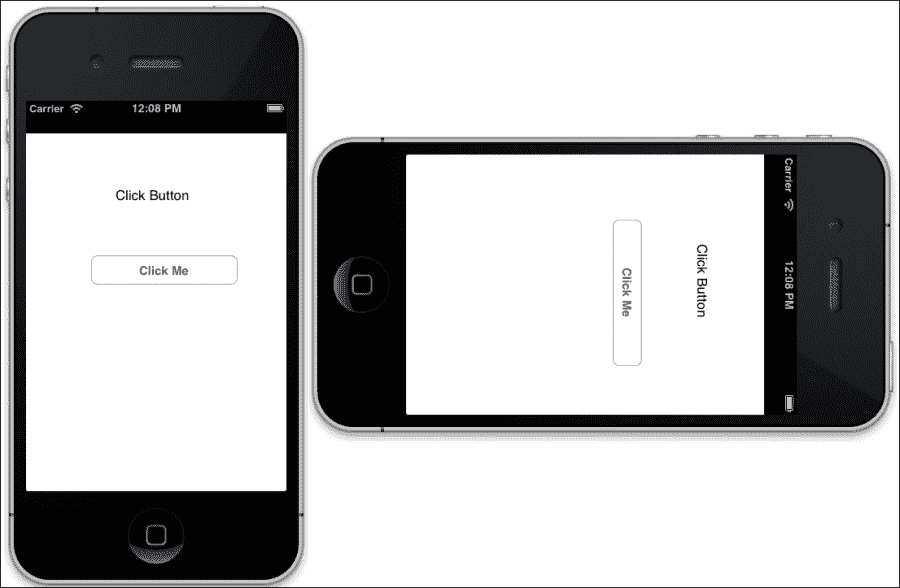
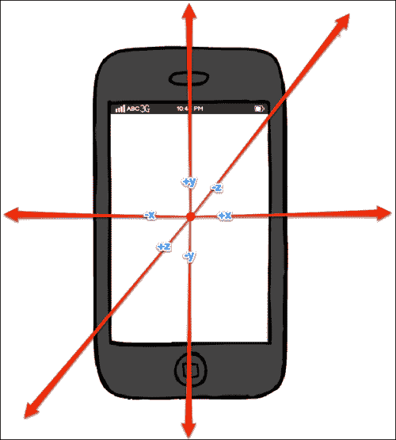

# 第八章。测试 - 让我们优雅地失败

*"真理往往比混乱更快地从错误中显现出来。"*

*——*弗朗西斯·培根**

为了保持软件产品的高质量，测试是软件开发生命周期中非常重要的一个部分。在本章中，我们将学习如何测试 RubyMotion 应用程序。我们将学习编写单元测试，它可以测试独立的代码，然后学习功能测试，这将帮助我们自动化 UI 测试。本章将涵盖以下主题：

+   单元测试

+   功能测试

+   设备事件

# 单元测试

单元测试的目标是隔离程序的每个部分，并证明各个部分能正常工作。RubyMotion 使用 MacBacon，它是 Bacon 的 iOS 版本。

### 注意

Bacon 是 RSpec 的一个较小的克隆。尽管少于 350 行代码，但我们仍然获得了所有基本功能。

在这里，我们也将遵循 **测试驱动开发**（**TDD**），这是一种在编写代码之前创建单元测试的工作方式。当然，测试最初会失败，因为我们没有任何东西。这就是 TDD 的哲学；首先我们编写测试用例，它失败了，然后我们重构代码，再次编写功能代码，这次我们的测试用例通过了，代码被认为是完整的。

这里的想法是开发者自己戴上测试者的帽子。我们首先以测试的形式记录功能，然后编写我们的代码并进行重构，然后再用测试用例记录下一个功能。

首先，让我们创建一个应用程序，我们将使用它来学习如何编写与 TDD 一起使用的测试用例。

```swift
$motion create LearnTest

```

在文件夹结构中，我们可以看到一个 `spec` 文件夹和一个位于此文件夹中的文件 `main_spec.rb`。这是 RubyMotion 生成器生成的默认测试文件；这是我们编写测试用例的地方。

让我们在 `spec` 文件夹内的 `main_spec.rb` 文件中编写我们的第一个测试用例，如下所示：

```swift
describe "Application 'LearnTest'" do
  before do
    @app = UIApplication.sharedApplication
  end

  it "has one window" do
    @app.windows.size.should == 1
  end
end
```

Bacon 通过 `describe` 块提供了一种封装你正在测试内容的方法。正如其名所示，`describe` 块用于描述类的行为如下：

```swift
describe "Application 'LearnTest'" do
end
```

测试是用 `it` 块编写的。测试有一个窗口，它检查我们的应用程序是否有一个窗口如下：

```swift
  it "has one window" do
    @app.windows.size.should == 1
  end
```

如你所见，这些测试的语法非常易读，你可以轻松理解其含义。在这种情况下，`@app.windows.size.should == 1` 意味着你的应用程序应该有一个窗口。

`describe()` 方法将 Bacon API 包围起来，并给我们 `Spec::ExampleGroup` 类。正如其名所示，它是一组示例。这些示例实际上是对象的预期行为。如果你熟悉 `Test::Unit` 等 xUnit 工具，你可以将 `ExampleGroup` 类视为类似于测试用例。

让我们使用以下命令运行测试用例：

```swift
$ rake spec
Build ./build/iPhoneSimulator-6.0-Development
 Compile ./app/app_delegate.rb
 Compile /Library/RubyMotion/lib/motion/spec.rb
 Compile /Library/RubyMotion/lib/motion/spec/helpers/ui.rb
 Compile ./spec/main_spec.rb
 Create ./build/iPhoneSimulator-6.0-Development/LearnTest_spec.app
 Link ./build/iPhoneSimulator-6.0-Development/LearnTest_spec.app/LearnTest
 Create ./build/iPhoneSimulator-6.0-Development/LearnTest_spec.app/Info.plist
 Create ./build/iPhoneSimulator-6.0-Development/LearnTest_spec.app/PkgInfo
 Create ./build/iPhoneSimulator-6.0-Development/LearnTest_spec.dSYM
 Simulate ./build/iPhoneSimulator-6.0-Development/LearnTest_spec.app
Application 'LearnTest'
 has one window [FAILED]

Bacon::Error: 0.==(1) failed
 spec.rb:649:in 'satisfy:': Application 'LearnTest' - has one window
 spec.rb:663:in 'method_missing:'
 spec.rb:279:in 'block in run_spec_block'
 spec.rb:403:in 'execute_block'
 spec.rb:279:in 'run_spec_block'
 spec.rb:294:in 'run'

1 specifications (1 requirements), 1 failures, 0 errors

```

我们可以看到有一个测试失败了（`Bacon::Error: 0.==(1)`）。这正是我们想要的。

这意味着 `@app.windows.size` 应该期望值为 1，但实际上现在的值是 0。这是因为到目前为止，我们还没有在我们的应用程序中创建窗口。

接下来，让我们编写创建窗口的代码，并使用以下代码更新 `app_delegate.rb` 文件：

```swift
class AppDelegate
  def application(application, didFinishLaunchingWithOptions:launchOptions)
    @window = UIWindow.alloc.initWithFrame(UIScreen.mainScreen.applicationFrame)
    @window.makeKeyAndVisible
  true
  end
end
```

让我们按照以下方式运行 `specs` 文件：

```swift
$rake spec
Application 'LearnTest'
 - has one window

1 specifications (1 requirements), 0 failures, 0 errors

```

我们看到测试已经通过，因此代码已经完成；任务完成！

以下是一些 MacBacon 中常用的断言：

+   `should.` 和 `should.be`

+   `should.equal`

+   `should.match`

+   `should.be.identical_to`/`should.be.same_as`

+   `should.raise(*exceptions) { }`

+   `should.change { }`

+   `should.throw(symbol) { }`

+   `should.satisfy { |object| }`

现在让我们通过向 `main_spec.rb` 文件添加以下代码创建另一个测试：

```swift
it "should set rootviewcontroller as RootViewController" do
   @app.keyWindow.rootViewController.class.should == RootViewController
end
```

这个测试检查我们是否在我们的应用程序中有一个名为 `rootViewController` 的属性，其名称应该是 `RootViewController`。运行这个测试用例，它应该失败，因为我们还没有创建 `RootViewController`。

让我们在 `app` 文件夹中创建一个名为 `root_view_controller.rb` 的文件，如下所示：

```swift
class RootViewController  < UIViewController
def viewDidLoad

 end
end

```

还通过添加以下行更新 `app_delegate.rb` 文件：

```swift
@window.rootViewController = RootViewController.alloc.init
```

现在我们运行 `specs` 文件时，我们会发现所有测试用例都已通过。

接下来，让我们给我们的应用程序添加一些功能。我们计算数字的平方和怎么样？让我们首先为这个功能编写测试。

将以下 `specs` 代码添加到 `spec` 文件夹中的 `main_spec.rb` 文件：

```swift
describe "sum_of_square_number" do  
  it "should return sum of squares of numbers" do
    array = [2,4,1]
    controller.sum_of_square_number(array).should.equal 21
  end

  it "should return 0 if array is blank" do
    array = []
    controller.sum_of_square_number(array).should.equal 0
  end
end
```

当我们运行测试时，它们肯定会失败，因为我们还没有创建 `sum_of_square_number` 方法。所以让我们创建这个方法和其逻辑，以便我们的 `specs` 测试通过，更新 `root_view_controller.rb` 文件，并添加以下方法：

```swift
def sum_of_square_number(array)
  sum = 0
  array.each do |number|  
    sum = sum + number*number
  end
  sum
end
```

这次，当我们运行我们的 `specs` 测试时，它们会通过。

到目前为止，我们已经学习了如何测试一段代码，但同样重要的是测试用户界面，因此在下一段我们将编写一个功能测试。

### 提示

你可以在你的 `spec` 文件夹中创建多个文件。RubyMotion 会自动运行所有扩展名为 `.rb` 的文件。你也可以使用以下命令运行单个文件，即使它们位于不同的位置：

```swift
rake spec files=foo_spec,spec/bar_spec.rb

```

# 功能测试

RubyMotion 允许我们为控制器编写功能测试，并通过一组高级事件生成 API 与其视图交互，利用 Apple 的 `UIAutomation` 框架的功能，而无需强迫我们用 JavaScript 编写测试。

现在让我们为同一应用程序的用户界面编写测试。在以下测试用例中，我们将测试屏幕上是否有标签和按钮。

在 `spec` 文件夹中创建 `restro_view_controller_spec.rb` 测试文件：

```swift
it "should have a label and a button" do
  view('Click Button').should.not.equal nil
  button = view('Click Me')
  button.should.not.equal nil
  button.isEnabled.should.equal true
end
```

`The view(label)` 属性返回与指定可访问标签匹配的视图。`view` 命令从当前窗口开始遍历视图层次结构。如果没有视图匹配我们的条件，它将一直重试，直到超时，默认为三秒。这意味着你不需要担心你正在寻找的视图是否仍在加载或动画中。

最后，如果超时通过且没有视图匹配，将抛出异常。

默认超时值可以通过 `Bacon::Functional.default_timeout` 属性更改。

### 提示

你还可以检查具有以下类名的视图上可用的按钮：

```swift
views(UIButton) # => [button1, button2]
```

现在为了通过这个测试，让我们编写这个功能的代码，并使用以下代码更新文件 `root_view_controller.rb`：

```swift
def viewDidLoad
  super
  view.backgroundColor = UIColor.whiteColor
  @label = UILabel.new
  @label.text = 'Click Button'
  @label.textAlignment = UITextAlignmentCenter
  @label.frame = [[80,50],[150,50]]
  view.addSubview(@label)
  @normal_button = UIButton.buttonWithType(UIButtonTypeRoundedRect)
  @normal_button.frame = [[80,150],[180,37]]
  @normal_button.setTitle("Click Me", forState:UIControlStateNormal)
  @normal_button.addTarget(self, action:'buttonIsPressed', forControlEvents:UIControlEventTouchDown)
  view.addSubview(@normal_button)
end
```

让我们启动终端并使用以下命令运行应用程序：

```swift
$rake

```

以下截图显示了前面命令的输出：



我们在这个视图中创建了一个标签和一个按钮，现在，当我们运行我们的 `spec test` 时，它通过了。接下来，我们想在按钮点击时计算前 5 个数的平方和。让我们首先编写这个功能的 `spec` 代码，并使用以下代码更新文件 `restro_view_controller_spec.rb`：

```swift
it "should show sum of squares on click of button" do
  tap 'Click Me'
  view('55').should.not.equal nil
end
```

`tap` 命令点击带有标签 **点击我** 的按钮。`tap` 命令有许多可用选项。随着我们继续本章的学习，我们将了解更多关于它们的信息。

现在让我们为这个 `spec` 测试编写相应的代码，并使用以下代码更新文件 `root_view_controller.rb`：

```swift
def buttonIsPressed
  array = [1,2,3,4,5]
  @label.text = sum_of_square_number(array).to_s
end
```

让我们启动终端并使用以下命令测试我们的应用程序：

```swift
$rake

```

以下截图显示了前面命令的输出：



我们现在熟悉了测试的基本功能。接下来，我们将学习如何使用 RubyMotion 测试设备事件。

# 设备事件

大多数 iOS 应用程序都利用了各种设备功能。作为一个好的实践，我们必须测试这些功能以提供高质量的应用程序。RubyMotion 给我们提供了一个测试一些设备功能的环境。让我们在本节中讨论其中的一些。

## 旋转设备

我们可以通过调用以下事件来测试设备的旋转：

```swift
rotate_device(:to => orientation, :button => location)
```

`rotate_device` 命令允许我们传递以下两个参数：

+   `to`：这传递了旋转设备的方向；它可以是纵向或横向的值。

+   `button`：这里的 `button` 指的是 **主页** 按钮的位置；如果我们根据方向的第一值传递值，这就有意义了。在纵向模式下，我们可以选择 `:bottom` 或 `:top button` 位置。在横向模式下，我们可以选择相对于按钮位置的 `:left` 或 `:right`，例如，`rotate_device` `:to` => `:portrait`，`:button` => `:bottom`。

此设备事件将使设备旋转到竖直方向，且**主页**按钮位于底部。

现在，让我们使用上一节中的示例应用中的这个旋转。我们想要确保我们的应用仅在竖直模式下工作。为此，我们必须禁用横屏模式。让我们为这种情况添加一个测试用例。在文件`root_view_controller_spec.rb`中添加以下代码：

```swift
it "has default orientations for portrait" do
   rotate_device :to => :landscape
   controller.interfaceOrientation.should == UIInterfaceOrientationPortrait

   rotate_device :to => :portrait
   controller.interfaceOrientation.should == UIInterfaceOrientationPortrait
end
```

在先前的测试用例中，我们首先在横屏模式下旋转设备，然后旋转到竖直模式，然后测试每次旋转实际上是否在竖直模式下。

让我们启动终端并按照以下方式运行测试：

```swift
$rake spec
Application 'LearnTest'
 has one window
 should set rootviewcontroller as RootViewController
RootViewController
 should have label and button
 should show sum of square on click of button
 has default orientations for portrait [FAILED]

sum_of_square_number
 should written sum of square of numbers
 should written 0 if array is blank

Bacon::Error: 4.==(1) failed
 spec.rb:649:in 'satisfy:': RootViewController - has default orientations for portrait
 spec.rb:663:in 'method_missing:'
 spec.rb:279:in 'block in run_spec_block'
 spec.rb:403:in 'execute_block'
 spec.rb:279:in 'run_spec_block'
 spec.rb:294:in 'run'

```

如预期的那样，它失败了。让我们编写相应的代码，使我们的应用仅在竖直模式下工作。

使用以下代码更新`Rakefile`：

```swift
app.interface_orientations = [:portrait]

```

让我们再次测试我们的`spec`文件，并检查控制台上的输出：

```swift
$rake spec

Application 'LearnTest'
 - has one window
 - should set rootviewcontroller as RootViewController

RootViewController
 - should have label and button
 - should show sum of square on click of button
 - has default orientations for portrait

sum_of_square_number
 - should written sum of square of numbers
 - should written 0 if array is blank

7 specifications (10 requirements), 0 failures, 0 errors

```

所有测试都如预期通过。现在，让我们使用以下命令在模拟器中运行应用：

```swift
$rake

```

如下截图所示，在模拟器菜单中选择**硬件** | **向左旋转**来旋转设备：



你可以看到，即使旋转后，界面方向也没有改变，如下截图所示：



## 加速度计设备事件

加速度计允许我们测量设备对应用线性加速度的测量。我们可以通过设备或以下`accelerate`事件来测试加速度计功能：

```swift
accelerate(:x => x_axis_acceleration, :y => y_axis_acceleration,
 :z => z_axis_acceleration, :duration => duration)

```

可以通过`accelerate`传递以下参数：

+   `x`: 如果你将设备竖直握持且屏幕朝向你，x 轴将从左到右运行，左侧的值为负，右侧的值为正。

+   `y`: 如果你将设备竖直握持且屏幕朝向你，y 轴将从底部到顶部运行，底部的值为负，顶部的值为正。

+   `z`: 如果你将设备竖直握持且屏幕朝向你，z 轴将从后向前运行，背部的值为负，朝向前的值为正。例如，加速：x => 0, :y => 0, :z => -1。



此测试用例事件模拟设备背面朝下。

### 注意

要触发摇动事件，我们可以使用以下方法：`shake()`

## 手势

iOS 应用程序的用户可以通过点击或触摸屏幕以及捏合或旋转等方式使用该应用。使用 RubyMotion，我们可以测试这些手势中的大多数；让我们在本节中讨论其中的一些。

大多数手势都作用于视图。我们可以通过使用 CGPoint 或以下常量来指定我们的事件在视图上的位置：

+   `:top`

+   `:top_left`

+   `:top_right`

+   `:bottom_right`

+   `:bottom`

+   `:bottom_left`

+   `:left`

+   `:right`

    ### 注意

    `CGPoint`让我们可以访问一个包含二维坐标系中点的结构，例如，CGPoint.new(100, 200)。

### 点击

要在视图中模拟点击事件，我们可以指定一个标签或视图，以及以下一些特定属性：

```swift
tap(label_or_view, :at => location, :times => number_of_taps, :touches => number_of_fingers)
```

让我们了解可选参数的目的是什么：

+   `at`: 我们可以指定视图上我们想要点击模拟的位置；默认位置是视图的中心。

+   `times`: 这指定了点击视图的次数。默认为单次点击。

+   `touches`: iPhone 和 iPad 是多点触控设备；许多应用程序利用 iOS 设备的这一特性。您可以指定用于点击视图的手指数量。默认为单指。

以下示例将使用单指点击视图一次的默认设置来点击`Test Label`：

```swift
tap "Test Label"
```

在下一个示例中，我们将通过用两个手指点击五次来测试标记为`Test Label`的视图：

```swift
tap 'Test Label', :times => 5, :touches => 2
```

### 轻扫

轻扫生成拖动手势的尖锐瞬间如下：

```swift
flick(label_or_view, :from => location, :to => location, :duration => duration)
```

我们可以通过`flick`方法传递以下选项：

+   `from`: 指定视图上开始拖动手势的位置。

+   `to`: 指定视图上结束拖动手势的位置。

以下示例生成向右滑动视图的轻扫手势：

```swift
flick "test label", :to => :right
```

### 捏合展开

捏合展开是使用两个手指的手势，通常用于放大图像。通过以下方法我们可以生成捏合展开手势：

```swift
pinch_open(label_or_view, :from => location, :to => location, :duration => duration)
```

我们可以通过`pinch_open`方法传递以下选项：

`from`: 这表示两个手指开始捏合展开手势的起点；默认情况下，它位于视图的左侧。

`to`: 这表示两个手指完成捏合展开手势的终点；默认为右侧。

以下示例将`UIScrollView`类的视图内容放大：

```swift
view('Test Zoom').zoomScale # => 1.0
pinch_open 'Test Zoom'
view('Test Zoom').zoomScale # => 2.0
```

### 捏合缩小

捏合缩小是使用两个手指的手势，通常用于缩小图像。通过以下方法我们可以生成捏合缩小手势：

```swift
pinch_close(label_or_view, :from => location, :to => location, :duration => duration)
```

我们可以通过`pinch_close`方法传递以下选项：

+   `from`: 这表示两个手指开始捏合缩小手势的起点；默认情况下，它位于视图的右侧。

+   `to`: 这表示两个手指完成捏合缩小手势的终点；默认情况下，它位于视图的左侧。

以下示例将`UIScrollView`类的视图内容缩小：

```swift
view('Test Zoom').zoomScale # => 1.0
pinch_close 'Test Zoom'
view('Test Zoom').zoomScale # => 0.5
```

### 拖动

拖动手势通常用于平移和滚动；它始终有一个起点和终点。通过以下方法我们可以生成拖动手势：

```swift
drag(label_or_view, :from => location, :to => location, :number_of_points => steps,
     :points => path, :touches => number_of_fingers, :duration => duration)
```

我们可以通过`drag`方法传递以下选项：

+   `from`: 这表示拖动手势将开始的视图部分。如果没有指定，则默认为无。

+   `to`: 这表示拖动手势将结束的视图部分。如果没有指定，则默认为无。

+   `number_of_points`: `:from`和`:to`之间点的数量。默认为 20。

+   `points`：一个指定拖动路径的 CGPoint 实例数组。

+   `touches`：用于拖动的手指数量。默认值为单指。

请记住，向一个方向滚动意味着在相反方向拖动。

以下代码将在滚动视图中向下滚动：

```swift
view('Some Scrollable scrollview').contentOffset.y # => 0
drag 'Some Scrollable scrollview', :from => :bottom
view('Some Scrollable scrollview').contentOffset.y # => 400
```

### 旋转

要测试顺时针和逆时针旋转手势，使用以下方法。此方法将在视图的中心点周围模拟旋转手势。

```swift
rotate(label_or_view, :radians => angle, :degrees => angle, :touches => number_of_fingers, :duration => duration)
```

我们可以使用`rotate`方法传递以下选项：

+   `radians`：旋转的角度（以弧度为单位）。默认值为π。

+   `degrees`：旋转的角度（以度为单位）。默认值为 180。

+   `touches`：用于旋转的手指数量。默认值为 2。

# 概述

让我们回顾一下在本章中学到的所有内容：

+   单元测试用例

+   功能测试用例

+   如何测试设备事件

到目前为止，我们已经涵盖了与 RubyMotion 相关的基础和高级主题。现在，我们准备做一些有趣的事情。在下一章中，我们将学习如何使用 RubyMotion 创建游戏。游戏应用是 App Store 上最受欢迎的应用类型之一（如果不是最受欢迎的话）。我们大多数人都会在 iOS 设备上玩游戏来消磨时间，那么为什么不学习如何使用 RubyMotion 来创建我们自己的游戏呢？在下一章中，我们将学习如何使用 RubyMotion 创建一个游戏。
