# 第九章 创建游戏

Apple App Store 有各种各样的应用程序。有许多流行的应用程序类型可供选择，如生产力、商业、娱乐等等。但在这其中，最受欢迎的类型是游戏应用，自己制作一个会更有趣。iOS 设备上的游戏是一个巨大的话题；在本章中，我们将介绍创建引人入胜游戏应用的一些基础知识。我们还将使用一个流行的库，这样在这次迭代结束时，我们将能够制作一个简单有趣的游戏应用。本章将涵盖以下主题：

+   Cocos2D

+   通过创建游戏应用来理解游戏基础知识

# Cocos2D

Cocos2D 是一个强大的游戏开发库，在构建游戏时通过处理琐碎的事情来节省大量时间。游戏开发中经常需要的一些常见事情，例如方向、精灵、酷炫的图形效果、动画、物理库、音效引擎等等，都已经由库和 API 提供。

Cocos2D 将游戏开发组织得像制作电影一样，让你坐在导演的位置上。例如，你将有一个用于游戏启动菜单的场景，另一个用于主游戏，然后还有一个用于游戏结束场景，其中包含结束游戏环节的选项。你必须真正使用 `Director` 类来创建一个导演对象，它推动整个应用程序向前发展。

Cocos2D 处理所有基本任务，例如开始游戏、暂停游戏和创建各种场景。

在场景内部，你可以有多个包含节点（如精灵、标签、菜单等）的层。这些节点还可以包含其他节点。以下图可以帮助我们很好地展示这一点：

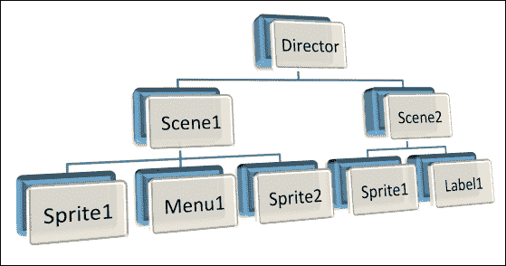

# 让我们创建一个游戏 - Whac-A-Mole

我们将创建一个流行的街机游戏 *Whac-A-Mole* 的 iPhone 版本。当游戏开始时，老鼠（一种动物）将从屏幕底部开始冒出来。游戏的目标是击中老鼠，从而增加玩家的分数：

1.  使用以下命令创建应用程序：

    ```swift
    motion create GameApp

    ```

1.  现在，由于我们正在为我们的应用程序使用外部库，让我们首先安装 `CocoaPods`。在你的终端上运行以下命令：

    ```swift
    $ sudo gem install cocoapods
    $ pod setup
    $ sudo gem install motion-cocoapods

    ```

1.  更新 `Rakefile`：

    ```swift
    $:.unshift("/Library/RubyMotion/lib")
    require 'motion/project'
    require 'motion-cocoapods'

    Motion::Project::App.setup do |app|
      # Use 'rake config' to see complete project settings.
      app.name = 'GameApp'
      app.pods do
        pod 'cocos2d'
      end
    end
    ```

现在我们已经准备好开始为我们的应用编码了。

## 让我们开始编码！

与 Cocos2D 一样，我们需要创建一个导演来启动游戏。让我们创建一个：

1.  使用以下代码更新 `app_delegate.rb` 文件：

    ```swift
    class AppDelegate
      def application(application, didFinishLaunchingWithOptions:launchOptions)

        # Create a window to present our director
        @window = UIWindow.alloc.initWithFrame(UIScreen.mainScreen.bounds)

        # Create CCGLView view that will be used by the director to present the game scenes

        game_view = CCGLView.viewWithFrame(@window.bounds, pixelFormat: KEAGLColorFormatRGBA8, depthFormat: 0, preserveBackbuffer: false, sharegroup: nil, multiSampling: false, numberOfSamples: 0)

        # Create Director shared instance 
        @director = CCDirector.sharedDirector
        @director.wantsFullScreenLayout = true
        @director.animationInterval = 1.0/60

        # Assign the view used for the director to present the game scenes
        @director.view = game_view

        # Create a navigation controller to store our game director and assign the navigation controller to the window
        @navigation_controller = UINavigationController.alloc.initWithRootViewController(@director)
        @navigation_controller.navigationBarHidden = true
        @window.rootViewController = @navigation_controller
        @window.makeKeyAndVisible

        # Configuration for our game images, this is very helpful when you want to use compressed images or those with a different
        # pixel format
        CCTexture2D.defaultAlphaPixelFormat = KCCTexture2DPixelFormat_RGBA8888
        CCTexture2D.PVRImagesHavePremultipliedAlpha(true)

        # Configuration for the names of the images that will be used on the game
        file_utils = CCFileUtils.sharedFileUtils
        file_utils.enableFallbackSuffixes = false
        true
      end

    end
    ```

1.  然后使用 `rake` 命令运行应用程序：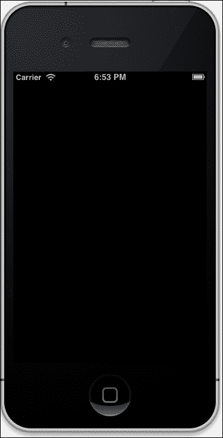

让我们了解到目前为止我们已经做了什么。

首先，我们创建了一个窗口和一个视图：

```swift
    @window = UIWindow.alloc.initWithFrame(UIScreen.mainScreen.bounds)
game_view = CCGLView.viewWithFrame(@window.bounds,
                                 pixelFormat: KEAGLColorFormatRGBA8,
                                 depthFormat: 0,
                                 preserveBackbuffer: false,
                                 sharegroup: nil,
                                 multiSampling: false,
                                 numberOfSamples: 0)
```

你必须已经注意到我们使用了 `CCGLView` 类来创建一个视图，它是 Cocos2D 中可用的。它继承自 `EAGLview`，而 `EAGLview` 又是 `UIView` 子类的子类，用于渲染 `OpenGL` 场景。

在此之后，我们定义了一个`CCDirector`类的对象，该对象创建并处理主窗口，并管理场景的创建和执行方式。它初始化`OpenGL ES`上下文。`CCDirector`类启动或暂停游戏；它还处理电话或短信到来时的情况，以便它可以自动暂停游戏。我们还将视图设置为`CCDirector`对象。

```swift
@director = CCDirector.sharedDirector
@director.wantsFullScreenLayout = true
@director.animationInterval = 1.0/60
@director.view = game_view
```

现在让我们创建一个场景，它将继承自`CCScene`：

1.  创建一个名为`game_scene.rb`的文件：

    ```swift
    class GameScene < CCScene
     def init
       if super
       end
       self
     end

    end
    ```

1.  在`app_delegate.rb`文件中添加以下代码：

    ```swift
    @director.pushScene(GameScene.node)
    ```

    基本上，它将告诉`@director`对象在应用程序加载时打开`GameScene`。

1.  现在，由于我们已经创建了一个空白场景，让我们开始向我们的游戏添加图形层。创建一个名为`background_layer.rb`的文件，并更新以下代码：

    ```swift
    class BackgroundLayer < CCLayer
      def init
        if super
          label = CCLabelTTF.labelWithString('We are creating a game',
                                             fontName:'Marker Felt',
                                             fontSize:24)

          window_size = CCDirector.sharedDirector.winSize
          label.position = CGPointMake(window_size.width / 2, window_size.height / 2)
          self.addChild(label)
        end
        self
      end
    end
    ```

    `CCLabelTTF`类用于在场景上显示文本。我们也可以在初始化标签时传递`fontName`和`fontSize`。然后我们必须将位置分配给标签。

    ### 提示

    `CCDirector`类还通过以下命令提供屏幕的高度和宽度：

    ```swift
    CCDirector.sharedDirector.winSize

    ```

1.  现在，要将此层添加到我们的场景中，更新`game_scene.rb`文件，代码如下：

    ```swift
    class GameScene < CCScene

     def init
       if super
     background_layer = BackgroundLayer.node
     # Add it to the scene
     self.addChild(background_layer)
       end
       self
     end

    end
    ```

1.  现在让我们运行应用程序来检查到目前为止的进度：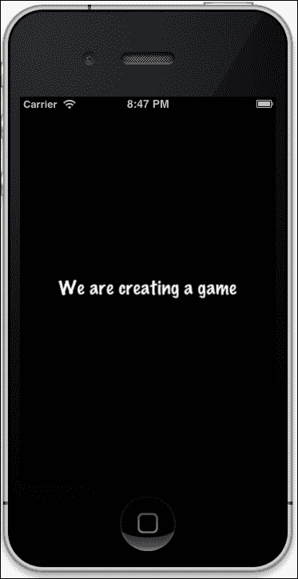

    我们可以看到屏幕上显示的文本。这是我们添加的一些测试文本，为什么不将其替换为背景图像呢。

    ### 注意

    您可以从资源文件夹中下载提供的图像，该图像与书中提供的练习代码一起提供。

1.  要显示背景图像，更新`background_layer.rb`文件，代码如下：

    ```swift
    class BackgroundLayer < CCLayer

      def init
        if super

     background_sprite = CCSprite.spriteWithFile('sky.png')
     # We need to get the screen size for positioning the sprite
     screen_size = CCDirector.sharedDirector.winSize

     # We need to get the screen size for positioning the sprite
     background_sprite.position = CGPointMake(screen_size.width / 2, screen_size.height / 2)

     # Setting the position for image
     self.addChild(background_sprite)
        end

        self
      end

    end
    ```

    我们创建了一个从名为`sky.png`的图像加载的`CCSprite`对象。

1.  现在运行应用程序，使用`rake`命令：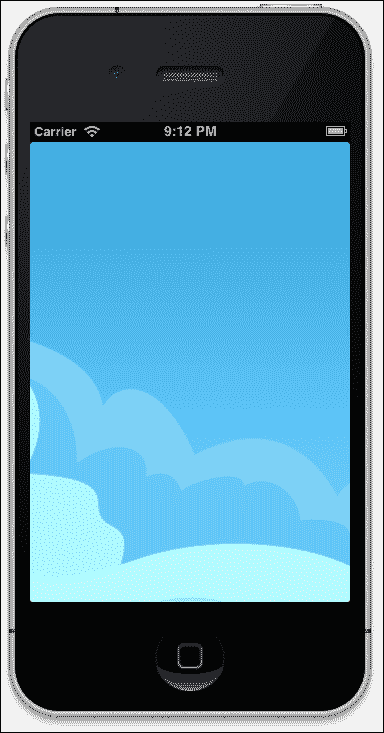

1.  现在，由于我们的游戏有很多对象，我们必须为横屏模式设计它，以便用户可以舒适地与游戏互动。为此，打开`Rake`文件，并在该文件中添加`app.interface_orientations = [:landscape_left]`，然后使用`rake`命令运行应用程序：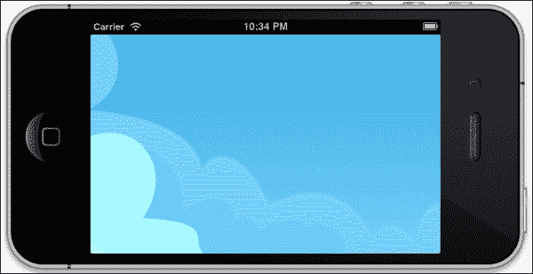

1.  非常酷！现在让我们在游戏层中添加草地。创建一个名为`game_layer.rb`的文件，并添加以下代码：

    ```swift
    class GameLayer < CCLayer

      def init

        if super
          # We need to get the screen size for positioning the sprite
          screen_size = CCDirector.sharedDirector.winSize
         @grass = CCSprite.spriteWithFile('Grass.png')
        @grass.position = CGPointMake(screen_size.width / 2, screen_size.height / 12)

          # Add the sprite to the Layer
          self.addChild(@grass)     
            end
            self
          end
        end
    ```

1.  然后将此层添加到我们的场景中，并更新`game_scene.rb`文件，代码如下：

    ```swift
         game_layer = GameLayer.node
          self.addChild(game_layer)
    ```

1.  让我们启动应用程序并查看我们做了什么：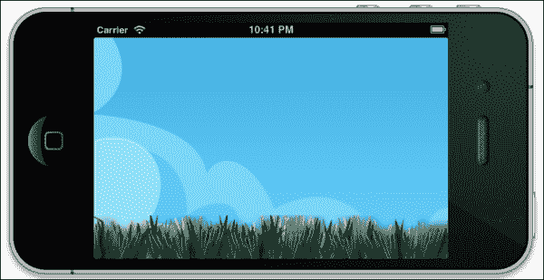

1.  哇！我们可以看到绿色的草地。接下来，让我们通过更新`game_layer.rb`文件来添加三个鼹鼠动物到我们的视图中，代码如下：

    ```swift
    class GameLayer < CCLayer

      def init
        if super
          # We need to get the screen size for positioning the sprite
          screen_size = CCDirector.sharedDirector.winSize
         @grass = CCSprite.spriteWithFile('Grass.png')

        @grass.position = CGPointMake(screen_size.width / 2, screen_size.height / 12)
          # Add the sprite to the Layer
          self.addChild(@grass)  

           @mole = []

     # Create a new sprite instance for drawing our mole
     @mole1 = CCSprite.spriteWithFile('mole.png')

     @mole1.position = CGPointMake(screen_size.width / 2, 0)
     # Add the sprite to the Layer
     self.addChild(@mole1, z: 0)
     # We need to get the screen size for positioning the sprite
     screen_size = CCDirector.sharedDirector.winSize

     @mole2 = CCSprite.spriteWithFile('mole.png')
     @mole2.position = CGPointMake(screen_size.width / 4, 0)
     self.addChild(@mole2)

     @mole3= CCSprite.spriteWithFile('mole.png')
     @mole3.position = CGPointMake(3* screen_size.width / 4, 0)
     self.addChild(@mole3)

     @moles = [@mole1, @mole2, @mole3]

            end
            self
          end
        end
    ```

1.  现在运行应用程序：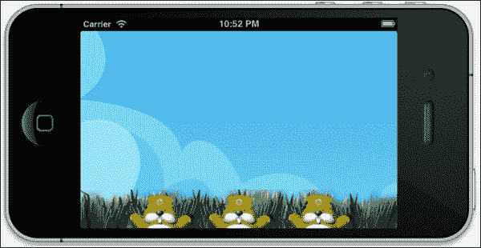

哇！我们可以看到页面的底部有三个鼹鼠。让我们给这些鼹鼠添加一些动作。

### 添加鼹鼠的动作

为了使事情更有趣，我们想让这些鼹鼠上下移动——这将给应用程序用户增加挑战：

1.  通过在`game_layer.rb`文件中添加以下方法来更新该文件：

    ```swift
          def popMole(mole)
            moveUp = CCMoveBy.actionWithDuration(0.2, position: CGPointMake(0, mole.contentSize.height));
            easeMoveUp = CCEaseInOut.actionWithAction(moveUp, rate: 3.0); 
            easeMoveDown = easeMoveUp.reverse 
            delay = CCDelayTime.actionWithDuration(0.5) 
            mole.runAction(CCSequence.actionsWithArray([easeMoveUp, delay, easeMoveDown])); 
          end
    ```

    `CCMoveBy`根据鼹鼠的高度沿着 Y 轴移动鼹鼠。为了使运动看起来更自然，我们使用了`CCEaseInOut`类。为了使鼹鼠再次向下移动，我们使用了`reverse`动作。动作上的`reverse`方法将对象拉向相反方向。然后，我们使用`CCDelayTime`类创建了一个动作来暂停鼹鼠的弹跳动作。

    现在，我们使用`CCSequence`类将所有动作组合成一个序列。`CCSequence`类允许我们将一系列按顺序执行的动作链接在一起。

1.  由于我们有三个鼹鼠，让我们为每个鼹鼠随机调用这个动作。我们还将通过向其中添加以下方法来更新`game_layer.rb`文件：

    ```swift
    def popAnyMole
            random = Random.new
            @moles.each do |mole|

              if (random.rand(1..100) % 3 == 0)
                if (@mole1.numberOfRunningActions == 0 and @mole2.numberOfRunningActions==0 and  @mole3.numberOfRunningActions==0 )
                  popMole(mole)
                end
              end
            end
          end
    ```

1.  在我们准备开始之前，我们还需要做一件事。我们需要通过向`game_layer.rb`文件的`init`方法中添加以下代码行来尽可能频繁地调度此方法运行：

    ```swift
    schedule :popAnyMole
    ```

1.  现在运行应用程序：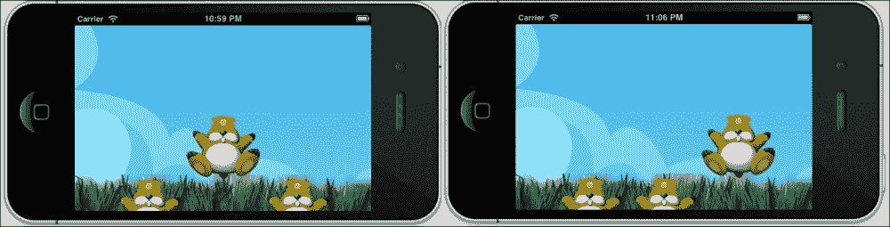

    我们可以看到鼹鼠正在随机地上下弹跳。

1.  让我们现在让这个鼹鼠隐藏在草的后面。要做到这一点，更新`game_layer.rb`文件并修改`init`方法，将`z`的值设置为`999`：

    ```swift
    self.addChild(@grass, z:999)
    ```

    z 值较高的层将显示出来。

    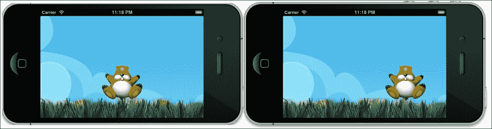

### 将触摸事件添加到游戏中

现在，让我们将一个触摸事件添加到游戏中：

1.  在`game_layer.rb`文件中添加以下代码：

    ```swift
    self.isTouchEnabled = true
    ```

1.  现在向其中添加以下方法：

    ```swift
         def ccTouchesBegan(touches, withEvent:event)
            touch = touches.anyObject

            touch_location = self.convertTouchToNodeSpace(touch)
            @moles.each do |mole|
              if CGRectContainsPoint(mole.boundingBox, touch_location) and !CGRectContainsPoint(@grass.boundingBox, touch_location) 
                puts "You have clicked a mole"
              end
            end
          end
    ```

    在第一部分，我们选择我们想要处理的触摸之一，获取当前视图中的位置，然后调用`convertToGL`将坐标转换为我们的当前布局。这对于我们处于横幅模式来说很重要。

    接下来，进入游戏逻辑。`CGRectContainsPoint(mole.boundingBox, touch_location)`方法将在有人点击鼹鼠时返回`true`。但如果用户点击在草后面的鼹鼠呢？为此，如果我们在草上点击，`CGRectContainsPoint(@grass.boundingBox, touch_location)`将返回`true`。因此，`CGRectContainsPoint(mole.boundingBox, touch_location)`和`!CGRectContainsPoint(@grass.boundingBox, touch_location)`只有在正确位置点击鼹鼠时才会返回`true`。我们还会在控制台打印一条消息来测试逻辑。

1.  让我们运行应用程序。当你点击鼹鼠时，你将在控制台看到一个消息打印出来：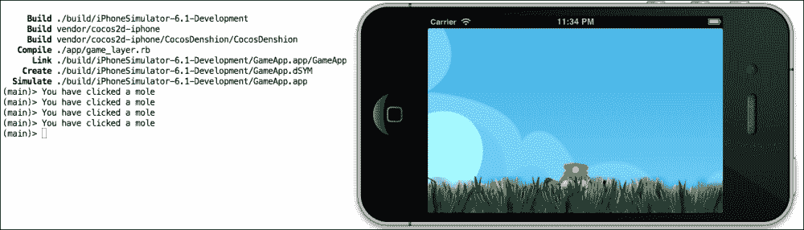

### 添加分数

我们需要给用户一个目的和成就感——这就是我们玩游戏的原因之一。这可以通过每次点击鼹鼠时为玩家计算分数来实现：

1.  将以下代码添加到`game_layer.rb`文件中：

    ```swift
       @score = 0
        @score_label = CCLabelTTF.labelWithString("Score: 0", fontName:"Verdana",fontSize: 14)
        @score_label.position = CGPointMake( 9*screen_size.width / 10, 9*screen_size.height / 10)
        self.addChild(@score_label, z:999)
    ```

1.  然后，更新`game_layer.rb`文件中的`ccTouchesBegan`委托：

    ```swift
       def ccTouchesBegan(touches, withEvent:event)
            touch = touches.anyObject

            touch_location = self.convertTouchToNodeSpace(touch)
            @moles.each do |mole|
              if CGRectContainsPoint(mole.boundingBox, touch_location) and !CGRectContainsPoint(@grass.boundingBox, touch_location) 
     @score = @score + 10
     @score_label.setString("Score:"+ @score.to_s)
         end
            end
          end
    ```

1.  现在运行应用程序：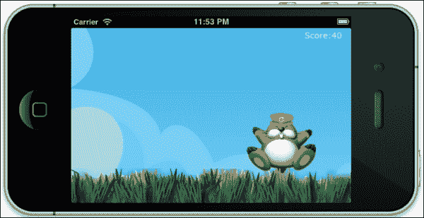

### 没有声音的游戏很无聊——让我们添加一些声音

现在我们离有一个可工作的游戏已经很近了。我们只需要添加一些音效和音乐，我们的游戏应用就完成了。在 Cocos2D 游戏中播放声音很简单。我们已经在`resource`文件夹中有了`noise.wav`文件；所以让我们在我们的几个事件中使用它：

添加以下代码，当有人正确点击鼹鼠时，将会播放声音：

```swift
      def ccTouchesBegan(touches, withEvent:event)
        touch = touches.anyObject

        touch_location = self.convertTouchToNodeSpace(touch)
        @moles.each do |mole|
          if CGRectContainsPoint(mole.boundingBox, touch_location) and !CGRectContainsPoint(@grass.boundingBox, touch_location) 
            @score = @score + 10
             @score_label.setString("Score:"+ @score.to_s)
             SimpleAudioEngine.sharedEngine.playEffect "noise.wav"
          end
        end
      end
```

在这里，我们终于使用 RubyMotion 完成了一个游戏应用。但不要将这个简单的应用提交到 App Store；发挥你的想象力，让它成为一个令人惊叹的应用。除了 Cocos2D，还有许多其他游戏库你可以探索，以创建令人叹为观止的应用。以下是我们推荐的一些：

+   iTGB 用于 2D 游戏：这是一个 2D 游戏引擎

+   Ston3D for iPhone：这是一个 3D 游戏引擎

+   SIO2Engine：这是一个 3D 游戏引擎

+   Unity3D 引擎：这是一个 3D 游戏引擎

# 摘要

这一章对我们来说非常激动人心，我们希望你也学到了很多。以下是一些涵盖的主题：

+   理解 Cocos2D

+   创建一个简单的游戏应用

到目前为止，我们已经学习了 RubyMotion 的所有主要功能，甚至创建了一个游戏应用，但发布我们的应用也同样重要。接下来，我们需要学习如何将我们宝贵的应用提交到苹果的 App Store，以便它们可以进入数百万部 iPhone 和 iPad 用户的手中。
