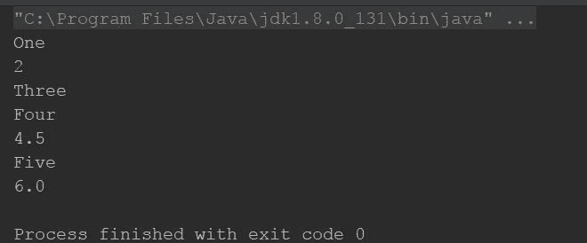
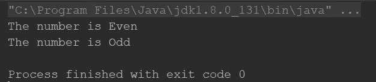
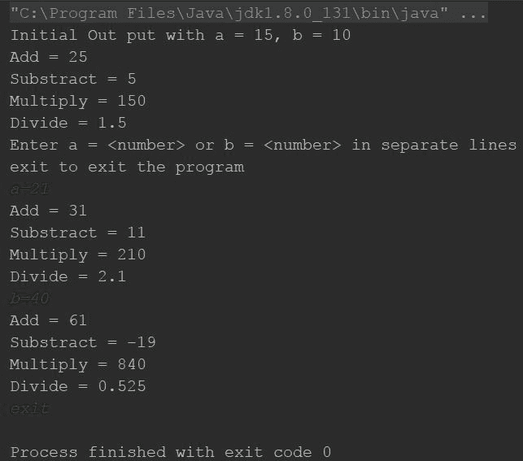

# 响应式编程简述

**响应式** 这个术语最近变得非常流行。它不仅成为趋势，而且每天都有新的博客文章、演讲、新兴的框架和库出现，开始统治软件开发领域。甚至那些经常被称为市场巨头的知名 IT 公司，如 Google、Facebook、Amazon、Microsoft 和 Netflix，不仅支持和使用响应式编程，甚至开始发布针对同一目的的新框架。

因此，作为一个程序员，我们在思考响应式编程。为什么每个人都对它如此疯狂？响应式编程究竟是什么意思？响应式编程有哪些好处？最后，我们应该学习它吗？如果是的话，那么应该如何学习？

另一方面，**Kotlin** 也是你最近听说的新编程语言（我们猜测你已经听说过 Kotlin，因为这本书假设你对这种语言有一定的了解）。作为一门语言，Kotlin 解决了 Java 中许多重要的问题。最好的部分是它与 Java 的互操作性。如果你仔细观察趋势，你就会知道 Kotlin 不仅创造了一股强大的风，还引发了一场风暴，影响了周围的一切。甚至 Google 在 *Google IO/17* 上也宣布了对 Kotlin 的官方支持，将其作为 Android 应用开发的官方编程语言，并指出这是自 Android 框架出现以来，Google 首次向 Android 家族添加了除 Java 之外的语言。不久之后，Spring 也表达了他们对 Kotlin 的支持。

用简单的话来说，Kotlin 已经足够强大，可以创建出色的应用程序，但如果你将响应式编程风格与 Kotlin 结合起来，构建出色的应用程序将会变得超级简单。

本书将使用 RxKotlin 和 Reactor 在 Kotlin 中介绍响应式编程，并展示它们在 Spring、Hibernate 和 Android 中的实现。

在本章中，我们将涵盖以下主题：

+   什么是响应式编程？

+   采用函数式响应式编程的原因

+   响应式宣言

+   `observer`（响应式）模式与熟悉模式的比较

+   开始使用 RxKotlin

# 什么是响应式编程？

响应式编程是一种围绕数据流和变化传播的异步编程范式。用更简单的话来说，那些将影响其数据/数据流的所有变化传播给所有相关方（如最终用户、组件和子组件，以及其他以某种方式相关的程序）的程序被称为 **响应式程序**。

例如，拿任何电子表格（比如说 Google Sheet），在 A1 单元格中输入任何数字，在 B1 单元格中写入 `=ISEVEN(A1)` 函数；它会显示 `TRUE` 或 `FALSE`，取决于你输入的是偶数还是奇数。现在，如果你修改 A1 中的数字，B1 的值也会自动改变；这种行为被称为 **响应式**。

如果还不够清楚？让我们看看一个编码示例，然后再尝试再次理解它。以下是一个用于确定数字是偶数还是奇数的正常 Kotlin 代码块：

```kt
    fun main(args: Array<String>) { 
      var number = 4 
      var isEven = isEven(number) 
      println("The number is " + (if (isEven) "Even" else "Odd")) 
      number = 9 
      println("The number is " + (if (isEven) "Even" else "Odd")) 
    } 

    fun isEven(n:Int):Boolean = ((n % 2) == 0) 
```

如果你检查程序的输出，那么你会看到，尽管数字被分配了新的值，`isEven`仍然是 true；然而，如果`isEven`被用来跟踪数字的变化，那么它将自动变为 false。响应式程序会做同样的事情。

# 采用函数式响应式编程的原因

那么，让我们首先讨论采用函数式响应式编程的原因。除非它带来一些真正显著的好处，否则改变你整个编码方式是没有意义的，对吧？是的，函数式响应式编程为你带来了一系列令人震惊的好处，如下所示：

+   **摆脱回调地狱**：

    回调是在预定义事件发生时被调用的方法。传递带有回调方法接口的机制称为**回调机制**。这种机制涉及大量的代码，包括接口、它们的实现等等。因此，它被称为**回调地狱**。

+   **标准错误处理机制**：

    通常，在处理复杂任务和 HTTP 调用时，错误处理是一个主要关注点，尤其是在没有标准机制的情况下，这会变成一个头疼的问题。

+   **比常规多线程简单得多**：

    虽然与 Java 相比，Kotlin 使线程处理变得更加容易，但它仍然足够复杂。响应式编程有助于使其更容易。

+   **异步操作的直接方法**：

    线程和异步操作是相互关联的。随着线程变得更容易，异步操作也是如此。

+   **一应俱全**，**每个操作都使用相同的 API**：

    响应式编程，尤其是 RxKotlin，为你提供了一个简单直接的 API。你可以用它做任何事情，无论是网络调用、数据库访问、计算还是 UI 操作。

+   **函数式方法**：

    响应式编程引导你编写可读的声明式代码，因为在这里，事情更加函数化。

+   **可维护和可测试的代码**：

    最重要的要点——通过正确地遵循响应式编程，你的程序将变得更加易于维护和测试。

# 响应式宣言

那么，什么是响应式宣言？响应式宣言([`www.reactivemanifesto.org`](http://www.reactivemanifesto.org))是一份定义四个响应式原则的文档。你可以将其视为响应式编程宝藏的地图，或者像响应式编程宗教的圣经一样。

每个开始学习响应式编程的人都应该阅读这份宣言，以了解响应式编程的实质及其原则。

因此，以下就是响应式宣言定义的四个原则的精髓：

+   **响应式**：

    系统能够及时响应。响应式系统专注于提供快速和一致的反应时间，因此它们提供一致的服务质量。

+   **弹性**：

    如果系统遇到任何故障，它仍然保持响应。通过复制、遏制、隔离和委派实现弹性。故障被限制在每个组件内部，隔离组件彼此之间，因此当某个组件发生故障时，它不会影响其他组件或整个系统。

+   **弹性**：

    反应式系统可以响应变化，并在不同的工作负载下保持响应性。它们在商品硬件和软件平台上以成本效益的方式实现弹性。

+   **消息驱动**：

    为了建立弹性原则，反应式系统需要通过依赖异步消息传递在组件之间建立边界。

通过实施前四个原则，系统变得可靠和响应，因此是反应式的。

# 反应式流标准规范

除了反应式宣言之外，我们还有关于反应式流的标准化规范。在反应式世界的每一件事都是通过反应式流完成的。2013 年，Netflix、Pivotal 和 Lightbend（之前称为 Typesafe）感觉到需要为反应式流制定标准规范，因为反应式编程开始传播，更多的反应式编程框架开始出现，因此他们启动了导致反应式流标准规范倡议的工作，现在它正在各种框架和平台上得到实施。

您可以查看反应式流标准规范——[`www.reactive-streams.org/`](http://www.reactive-streams.org/)。

# Kotlin 的反应式框架

要编写反应式程序，我们需要一个库或特定的编程语言；我们不能将 Kotlin 称为反应式语言（基本上，我不知道有任何这样的语言是本身反应式的），因为它是一种强大的灵活的编程语言，适用于现代多平台应用程序，完全与 Java 和 Android 互操作。然而，有一些反应式库可以帮助我们实现这些。因此，让我们看看可用的列表：

+   RxKotlin

+   Reactor-Kotlin

+   Redux-Kotlin

+   FunKTionale

+   RxJava 和其他反应式 Java 框架也可以与 Kotlin 一起使用（因为 Kotlin 与 Java 完全互操作）

在这本书中，我们将重点关注 RxJava 和 Reactor-kotlin（在后面的章节中，关于 Spring）。

# 开始使用 RxKotlin

RxKotlin 是针对 Kotlin 的反应式编程的具体实现，它受到函数式编程的影响。它倾向于函数组合、避免全局状态和副作用。它依赖于生产者/消费者模式的`observer`模式，有许多操作符允许组合、调度、节流、转换、错误处理和生命周期管理。

而 Reactor-Kotlin 也基于函数式编程，并且得到了 Spring 框架的广泛认可和支持。

# 下载和设置 RxKotlin

你可以从 GitHub 下载和构建 RxKotlin ([`github.com/ReactiveX/RxKotlin`](https://github.com/ReactiveX/RxKotlin))。我不需要任何其他依赖项。GitHub wiki 页面上的文档结构良好。以下是您如何从 GitHub 检出项目并运行构建的说明：

```kt
$ git clone https://github.com/ReactiveX/RxKotlin.git
$ cd RxKotlin/
$ ./gradlew build
```

你也可以按照页面上的说明使用 Maven 和 Gradle。

对于 Gradle，使用以下编译依赖项：

```kt
compile 'io.reactivex.rxjava2:rxkotlin:2.x.y' 
```

对于 Maven，使用以下依赖项：

```kt
    <dependency> 
      <groupId>io.reactivex.rxjava2</groupId> 
      <artifactId>rxkotlin</artifactId> 
      <version>2.x.y</version> 
    </dependency> 
```

本书针对 RxKotlin 2.x，所以请记住使用`io.reactive.rxjava2`而不是`io.reactivex.rxkotlin`，因为后者是针对 RxKotlin 1.x 的。

注意，我们在这本书中使用的是 RxKotlin 版本 2.1.0。

现在，让我们看看 RxKotlin 是什么。我们将从一个众所周知的东西开始，然后逐渐深入了解库的秘密。

# 比较拉取机制与 RxJava 推送机制

RxKotlin 围绕表示用于推送机制（而不是传统程序中`iterator`模式的拉取机制）的数据/事件系统的可观察类型，因此它是懒加载的，可以同步和异步使用。

如果我们从与数据列表一起工作的简单示例开始，我们会更容易理解。所以，这里是代码：

```kt
    fun main(args: Array<String>) { 
      var list:List<Any> = listOf("One", 2, "Three", "Four", 4.5,
      "Five", 6.0f) // 1 
      var iterator = list.iterator() // 2 
      while (iterator.hasNext()) { // 3 
        println(iterator.next()) // Prints each element 4 
      } 
    } 
```

以下截图是输出结果：



那么，让我们逐行分析程序，了解它是如何工作的。

在注释`1`中，我们创建了一个包含七个项目的列表（列表通过任何类帮助包含混合数据类型的数据）。在注释`2`中，我们是从列表中创建`iterator`，这样我们就可以遍历数据。在注释`3`中，我们创建了一个`while`循环，通过`iterator`从列表中提取数据，然后在注释`4`中打印它。

需要注意的是，我们在当前线程阻塞直到收到数据并准备就绪的同时，从列表中提取数据。例如，想象一下从网络调用/数据库查询中获取数据，而不是仅仅从`List`中获取，在这种情况下，线程将被阻塞多长时间。显然，你可以为这些操作创建一个单独的线程，但这样也会增加复杂性。

仅仅思考一下；哪种方法更好？让程序等待数据，还是当数据可用时将数据推送到程序？

ReactiveX 框架（无论是 RxKotlin 还是 RxJava）的构建块是可观察的。`observable`类与`iterator`接口正好相反。它有一个底层集合或计算，产生可以被消费者消费的值。然而，区别在于消费者不像在`iterator`模式中那样从生产者*拉取*这些值；相反，生产者将值作为通知*推送*给消费者。

那么，让我们再次以相同的例子为例，这次使用`observable`：

```kt
    fun main(args: Array<String>) { 
      var list:List<Any> = listOf("One", 2, "Three",
      "Four", 4.5, "Five", 6.0f) // 1 
      var observable: Observable<Any> = list.toObservable(); 

       observable.subscribeBy( // named arguments for
       lambda Subscribers 
         onNext = { println(it) }, 
         onError =  { it.printStackTrace() }, 
         onComplete = { println("Done!") } 
      ) 
    } 
```

这个程序输出与上一个相同——它打印出列表中的所有项。不同之处在于方法。那么，让我们看看它实际上是如何工作的：

1.  创建一个列表（与上一个相同）。

1.  使用该列表创建了一个`observable`实例。

1.  我们正在订阅`observer`实例（我们使用命名参数为`lambda`，稍后详细说明）。

当我们订阅`observable`时，每个数据都会被推送到`onNext`，当所有数据都推送完毕时，它将调用`onComplete`，如果发生任何错误，则调用`onError`。

所以，你学会了如何使用`observable`实例，它们与非常熟悉的`iterator`实例非常相似。我们可以使用这些`observable`实例来构建异步流并将数据更新推送到它们的订阅者（甚至是多个订阅者）。这是一个简单的响应式编程范式实现。数据正在传播到所有感兴趣的各方——订阅者。

# ReactiveEvenOdd 程序

现在，我们多少熟悉了`observables`，让我们以响应式的方式修改偶数奇数程序。以下是实现这一点的代码：

```kt
    fun main(args: Array<String>) { 
      var subject:Subject<Int> = PublishSubject.create() 

      subject.map({ isEven(it) }).subscribe({println
      ("The number is ${(if (it) "Even" else "Odd")}" )}) 

      subject.onNext(4) 
      subject.onNext(9) 
    } 
```

这里是输出：



在这个程序中，我们使用了`subject`和`map`，我们将在后面的章节中介绍。在这里，它只是展示了在响应式编程中通知变化是多么容易。如果你仔细查看程序，你也会发现代码是模块化和函数式的。当我们用数字通知`subject`时，它调用`map`中的方法，然后调用`subscribe`方法中的方法，该方法是`map`方法的返回值。`map`方法检查数字是否为偶数，并相应地返回 true 或 false；在`subscribe`方法中，我们接收该值并相应地打印偶数或奇数。`subject.onNext`方法是向主题发送新值的方式，以便它可以处理它。

# ReactiveCalculator 项目

那么，让我们从一个用户输入的事件开始。通过以下示例进行操作：

```kt
    fun main(args: Array<String>) { 
      println("Initial Out put with a = 15, b = 10") 
      var calculator:ReactiveCalculator = ReactiveCalculator(15,10) 
      println("Enter a = <number> or b = <number> in separate
      lines\nexit to exit the program") 
      var line:String? 
      do { 
        line = readLine(); 
        calculator.handleInput(line) 
      } while (line!= null && !line.toLowerCase().contains("exit")) 
    } 
```

如果你运行代码，你会得到以下输出：



在`main`方法中，我们并没有做很多操作，除了监听输入并将其传递给`ReactiveCalculator`类，所有其他操作都在类内部完成，因此它是模块化的。在后面的章节中，我们将为输入过程创建一个单独的`observable`，并将所有用户输入处理在那里。为了简化，我们遵循了用户输入的拉机制，你将在下一章学习如何移除它。现在，让我们看一下下面的`ReactiveCalculator`类：

```kt
    class ReactiveCalculator(a:Int, b:Int) { 
      internal val subjectAdd: Subject<Pair<Int,Int>> = 
        PublishSubject.create() 
      internal val subjectSub: Subject<Pair<Int,Int>> =
        PublishSubject.create() 
      internal val subjectMult: Subject<Pair<Int,Int>> =
        PublishSubject.create() 
      internal val subjectDiv: Subject<Pair<Int,Int>> =
        PublishSubject.create() 

      internal val subjectCalc:Subject<ReactiveCalculator> =
        PublishSubject.create() 

      internal var nums:Pair<Int,Int> = Pair(0,0) 

      init{ 
        nums = Pair(a,b) 

        subjectAdd.map({ it.first+it.second }).subscribe
        ({println("Add = $it")} ) 
        subjectSub.map({ it.first-it.second }).subscribe
        ({println("Substract = $it")} ) 
        subjectMult.map({ it.first*it.second }).subscribe
        ({println("Multiply = $it")} ) 
        subjectDiv.map({ it.first/(it.second*1.0) }).subscribe
        ({println("Divide = $it")} ) 

        subjectCalc.subscribe({ 
          with(it) { 
            calculateAddition() 
            calculateSubstraction() 
            calculateMultiplication() 
            calculateDivision() 
          } 
         }) 

         subjectCalc.onNext(this) 
        } 

        fun calculateAddition() { 
          subjectAdd.onNext(nums) 
        } 

        fun calculateSubstraction() { 
          subjectSub.onNext(nums) 
        } 

        fun calculateMultiplication() { 
          subjectMult.onNext(nums) 
        } 

        fun calculateDivision() { 
          subjectDiv.onNext(nums) 
        } 

        fun modifyNumbers (a:Int = nums.first, b: Int = nums.second) { 
          nums = Pair(a,b) 
          subjectCalc.onNext(this) 
       } 

       fun handleInput(inputLine:String?) { 
        if(!inputLine.equals("exit")) { 
            val pattern: Pattern = Pattern.compile
            ("([a|b])(?:\\s)?=(?:\\s)?(\\d*)"); 

            var a: Int? = null 
            var b: Int? = null 

            val matcher: Matcher = pattern.matcher(inputLine) 

            if (matcher.matches() && matcher.group(1) != null 
            &&  matcher.group(2) != null) { 
              if(matcher.group(1).toLowerCase().equals("a")){ 
                 a = matcher.group(2).toInt() 
              } else if(matcher.group(1).toLowerCase().equals("b")){ 
                 b = matcher.group(2).toInt() 
               } 
            } 

            when { 
              a != null && b != null -> modifyNumbers(a, b) 
              a != null -> modifyNumbers(a = a) 
              b != null -> modifyNumbers(b = b) 
              else -> println("Invalid Input") 
           } 
        } 
      } 
    }      
```

在这个程序中，我们只有对数据（而不是事件，即用户输入）有推送机制（`observable`模式）。虽然本书的初始章节将向你展示如何观察数据变化；RxJava 还允许你观察事件（如用户输入），我们将在本书末尾讨论 RxJava 在 Android 上的应用时涵盖这一点。所以，现在，让我们了解这个代码是如何工作的。

首先，我们创建了一个`ReactiveCalculator`类，它观察其数据甚至自身；因此，每当其属性被修改时，它都会调用所有的`calculate`方法。

我们使用`Pair`来配对两个变量，并在`Pair`上创建了四个`subject`来观察其变化并对其进行处理；我们需要四个`subject`因为存在四个独立的操作。在后面的章节中，你还将学习如何仅用一个方法来优化它。

在`calculate`方法上，我们只是通知主题处理`Pair`并打印新的结果。

如果你关注这两个程序中的`map`方法，那么你会了解到`map`方法接受我们通过`onNext`传递的值，并将其处理成结果值；这个结果值可以是任何数据类型，并且这个结果值会被传递给订阅者以进一步处理和/或显示输出。

# 摘要

在本章中，我们学习了什么是响应式编程以及我们应该学习它的原因。我们还开始了编码。响应式编程模式可能看起来很新或者有些不常见，但它并不难；在使用它时，你只需要声明一些额外的事情。

我们学习了`observable`及其用法。我们还介绍了`subject`和`map`，我们将在后面的章节中深入学习。

在后面的章节中，我们将继续使用`ReactiveCalculator`示例，并看看我们如何可以优化和增强这个程序。

本章中展示的三个示例可能一开始看起来有些混乱和复杂，但它们实际上非常简单，随着你继续阅读本书，它们将变得熟悉起来。

在下一章中，我们将学习更多关于函数式编程和 RxKotlin 中的函数式接口。
