# 第三章：可观察的、观察者和主题

可观察的、订阅者和响应式编程的基础。我们可以这样说，它们是响应式编程的构建块。在前两章中，你已经对`Observables`和`subject`有了一定的了解；我们通过`observable`/`subject`实例观察数据；但这并不是我们想要的全部；相反，我们希望将所有操作和数据更改以响应式的方式收集到`observable`实例中，使应用程序完全响应式。此外，在阅读前几章时，你可能想知道它究竟是如何操作的？在这一章中，让我们建立响应式编程支柱的基础——`Observables`、`Observers`和`subjects`：

+   我们将深入了解将各种数据源转换为`observable`实例的细节

+   你将了解各种类型的`Observables`。

+   如何使用`Observer`实例和订阅，最后是`subjects`及其各种实现

我们还将学习`Observable`的各种工厂方法。

在这一章中有很多东西需要理解，所以让我们首先了解`Observables`。

# 可观察的

正如我们之前讨论的，在响应式编程中，`Observable`有一个底层计算，它产生可以被消费者（`Observer`）消费的值。这里最重要的一点是，消费者（`Observer`）在这里不是拉取值；相反，`Observable`将值推送到消费者。因此，我们可以说，`Observable`是一个基于推送、可组合的迭代器，它通过一系列操作符将项目发射到最终的`Observer`，最终消费这些项目。现在让我们按顺序逐一分析，以便更好地理解：

+   `Observer`订阅`Observable`

+   `Observable`开始发射它内部拥有的项目

+   `Observer`对`Observable`发射的任何项目做出反应

因此，让我们深入了解一个`Observable`是如何通过其事件/方法工作的，即`onNext`、`onComplete`和`onError`。

# 可观察是如何工作的

正如我们之前所述，`Observable`有三个最重要的事件/方法；让我们逐一讨论它们：

+   `onNext`：`Observable`逐个将所有项目传递给此方法。

+   `onComplete`：当所有项目都通过`onNext`方法后，`Observable`调用`onComplete`方法。

+   `onError`：当`Observable`遇到任何错误时，它会调用`onError`方法来处理错误，如果已定义。请注意，`onError`和`onComplete`都是终止事件，如果调用`onError`，则永远不会调用`onComplete`，反之亦然。

这里需要注意的是，我们谈论的`Observable`中的项目可以是任何东西；它定义为`Observable<T>`，其中`T`可以是任何类；甚至可以将`array`/`list`分配为`Observable`。

让我们看看下面的图片：

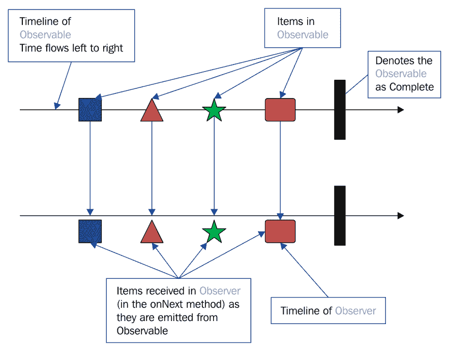

让我们通过以下代码示例来更好地理解它：

```java
    fun main(args: Array<String>) { 

      val observer:Observer<Any> = object :Observer<Any>{//1 
        override fun onComplete() {//2 
            println("All Completed") 
        } 

        override fun onNext(item: Any) {//3 
            println("Next $item") 
        } 

        override fun onError(e: Throwable) {//4 
            println("Error Occured $e") 
        } 

        override fun onSubscribe(d: Disposable) {//5 
            println("Subscribed to $d") 
        } 
      } 

      val observable: Observable<Any> = listOf
      ("One", 2, "Three", "Four", 4.5, "Five", 6.0f).toObservable() //6 

      observable.subscribe(observer)//7 

      val observableOnList: Observable<List<Any>> =
      Observable.just(listOf("One", 2, "Three", "Four", 
      4.5, "Five", 6.0f), 
        listOf("List with Single Item"), 
        listOf(1,2,3,4,5,6))//8 
       observableOnList.subscribe(observer)//9 
   } 
```

在前面的例子中，我们在注释（1）处声明了`observer`实例的`Any`数据类型。

在这里，我们正在利用 `Any` 数据类型的好处。在 Kotlin 中，每个类都是 `Any` 的子类。此外，在 Kotlin 中，一切都是类和对象；没有单独的原始数据类型。

`observer` 接口中有四个声明的方法。注释 `2` 中的 `onComplete()` 方法在 `Observable` 完成所有项目且没有任何错误时被调用。在注释 `3` 中，我们定义了 `onNext(item: Any)` 函数，该函数将由 `observable` 为其必须发出的每个项目调用。在该方法中，我们将数据打印到控制台。在注释 `4` 中，我们定义了 `onError(e: Throwable)` 方法，在 `Observable` 遇到任何错误时将被调用。在注释 `5` 中，`onSubscribe(d: Disposable)` 方法将在 `Observer` 订阅 `Observable` 时被调用。在注释 `6` 中，我们将从列表创建 `Observable`（`val observable`）并使用 `observer` 在注释 `7` 中订阅 `observable`。在注释 `8` 中，我们再次创建一个可观察的（`val observableOnList`），它包含列表作为项目。

程序的输出如下：

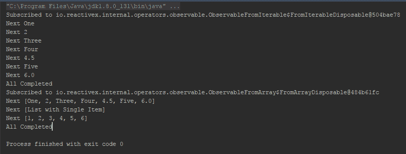

如您在输出中看到的，对于第一次订阅（注释 `7`），当我们订阅 `Observable` 时，它调用 `onSubscribe` 方法，然后 `Observable` 开始发出项目，当 `Observer` 在 `onNext` 方法中开始接收它们并打印它们时。当 `Observable` 发出所有项目后，它调用 `onComplete` 方法来表示所有项目都已成功发出。第二个也是一样，只是这里每个项目都是一个列表。

因此，随着我们在 `Observables` 方面获得了一些基础知识，让我们学习创建 `Observable` 的各种方法——`Observable` 的工厂方法。

# 理解 `Observable.create` 方法

您可以在任何时间使用 `Observable.create` 方法创建自己的 `Observable`。此方法接受 `ObservableEmitter<T>` 接口的一个实例作为观察的源。因此，让我们考虑以下示例：

```java
    fun main(args: Array<String>) { 

      val observer: Observer<String> = object : Observer<String> { 
        override fun onComplete() { 
          println("All Completed") 
        } 

        override fun onNext(item: String) { 
          println("Next $item") 
        } 

        override fun onError(e: Throwable) { 
          println("Error Occured ${e.message}") 
        } 

        override fun onSubscribe(d: Disposable) { 
          println("New Subscription ") 
        } 
    }//Create Observer 

    val observable:Observable<String> = Observable.create<String> {//1 
      it.onNext("Emit 1") 
      it.onNext("Emit 2") 
      it.onNext("Emit 3") 
      it.onNext("Emit 4") 
      it.onComplete() 
    } 

    observable.subscribe(observer) 

    val observable2:Observable<String> = Observable.create<String> {//2 
      it.onNext("Emit 1") 
      it.onNext("Emit 2") 
      it.onNext("Emit 3") 
      it.onNext("Emit 4") 
      it.onError(Exception("My Custom Exception")) 
    } 

    observable2.subscribe(observer) 
   } 
```

首先，我们创建了一个 `Observer` 接口的实例，就像之前的例子一样。我不会详细说明 `observer`，因为我们已经在之前的例子中看到了概述，我们将在本章后面详细讨论。

在注释 `1` 中，我们使用 `Observable.create` 方法创建了 `Observable`；我们通过 `onNext` 方法从 `Observable` 中发出四个 `string`，然后使用 `onComplete` 方法通知其完成。

在注释 `2` 中，我们做了几乎同样的事情，只是这里我们没有调用 `onComplete`，而是使用自定义 `Exception` 调用了 `onError`。

这是程序的输出：

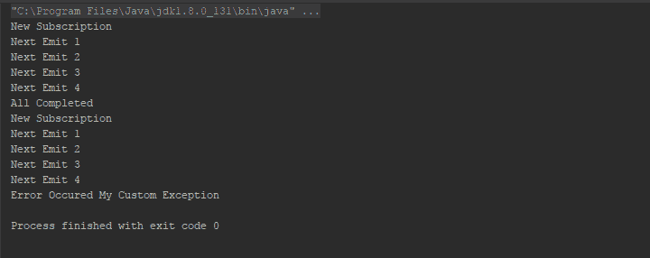

`Observable.create` 方法很有用，尤其是在您使用自定义数据结构并希望控制要发出的值时。您还可以从不同的线程向 `Observer` 发送值。

注意，`Observable`契约([`reactivex.io/documentation/contract.html`](http://reactivex.io/documentation/contract.html))规定`Observable`必须按顺序（不是并行）向`观察者`发出通知。它们可以从不同的线程发出这些通知，但通知之间必须存在正式的“发生之前”关系。

# 理解`Observable.from`方法

`Observable.from`方法相对于`Observable.create`方法来说比较简单。你可以使用`from`方法从几乎任何 Kotlin 结构创建`Observable`实例。

注意，在 RxKotlin 1 中，你将有一个`Observale.from`方法；然而，从 RxKotlin 2.0（与 RxJava2.0 一样），操作符重载已被重命名为后缀，例如`fromArray`、`fromIterable`、`fromFuture`等等。

因此，让我们看看这段代码：

```java
    fun main(args: Array<String>) { 

      val observer: Observer<String> = object : Observer<String> { 
        override fun onComplete() { 
          println("All Completed") 
        } 

        override fun onNext(item: String) { 
          println("Next $item") 
        } 

        override fun onError(e: Throwable) { 
          println("Error Occured ${e.message}") 
        } 

        override fun onSubscribe(d: Disposable) { 
          println("New Subscription ") 
        } 
      }//Create Observer 

      val list = listOf("String 1","String 2","String 3","String 4") 
      val observableFromIterable: Observable<String> =
      Observable.fromIterable(list)//1 
      observableFromIterable.subscribe(observer) 

      val callable = object : Callable<String> { 
        override fun call(): String { 
          return "From Callable" 
        } 
      } 
      val observableFromCallable:Observable<String> =
      Observable.fromCallable(callable)//2 
      observableFromCallable.subscribe(observer) 

      val future:Future<String> = object :Future<String> { 
        override fun get(): String = "Hello From Future" 

        override fun get(timeout: Long, unit: TimeUnit?): String  =
        "Hello From Future" 

        override fun isDone(): Boolean = true 

        override fun isCancelled(): Boolean = false 

        override fun cancel(mayInterruptIfRunning: Boolean):
        Boolean = false 

      } 
      val observableFromFuture:Observable<String> = 
      Observable.fromFuture(future)//3 
      observableFromFuture.subscribe(observer) 
    } 
```

在注释`1`中，我使用了`Observable.fromIterable`方法从`Iterable`实例（这里，`List`）创建`Observable`。在注释`2`中，我调用了`Observable.fromCallable`方法从`Callable`实例创建`Observable`，同样，在注释`3`中，我调用了`Observable.fromFuture`方法从`Future`实例派生出`Observable`。

这是输出：

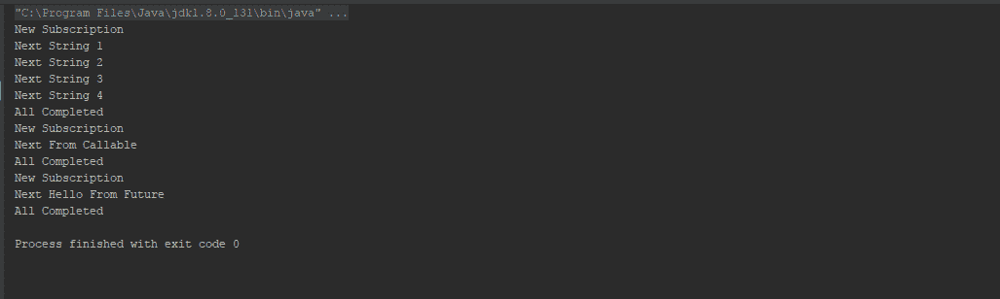

# 理解`toObservable`扩展函数

多亏了 Kotlin 的扩展函数，你可以轻松地将任何`Iterable`实例，如`List`，转换为`Observable`；我们已经在第一章，《反应式编程简介》中使用了这个方法，然而，看看这个：

```java
    fun main(args: Array<String>) { 

      val observer: Observer<String> = object : Observer<String> { 
        override fun onComplete() { 
            println("All Completed") 
        } 

        override fun onNext(item: String) { 
            println("Next $item") 
        } 

        override fun onError(e: Throwable) { 
            println("Error Occured ${e.message}") 
        } 

        override fun onSubscribe(d: Disposable) { 
            println("New Subscription ") 
        } 
      }//Create Observer 

      val list:List<String> = listOf
      ("String 1","String 2","String 3","String 4") 

      val observable:Observable<String> = list.toObservable() 

      observable.subscribe(observer) 
    } 
```

以下是其输出：


那么，你难道不好奇想看看`toObservable`方法吗？让我们来看看。你可以在`RxKotlin`包提供的`observable.kt`文件中找到这个方法：

```java
    fun <T : Any> Iterator<T>.toObservable(): Observable<T> = 
    toIterable().toObservable() 
    fun <T : Any> Iterable<T>.toObservable(): Observable<T> = 
    Observable.fromIterable(this) 
    fun <T : Any> Sequence<T>.toObservable(): Observable<T> =
    asIterable().toObservable() 

    fun <T : Any> Iterable<Observable<out T>>.merge(): Observable<T> = 
    Observable.merge(this.toObservable()) 
    fun <T : Any> Iterable<Observable<out T>>.mergeDelayError(): 
    Observable<T> = Observable.mergeDelayError(this.toObservable()) 
```

因此，它基本上内部使用了`Observable.from`方法；再次感谢 Kotlin 的扩展函数。

# 理解`Observable.just`方法

另一个有趣的工厂方法是`Observable.just`；此方法创建`Observable`并将传递给它的参数作为`Observable`的唯一项目。请注意，如果您将`Iterable`实例作为单个参数传递给`Observable.just`，它将整个`list`作为一个项目，这与`Observable.from`不同，后者将从`Iterable`中的每个项目创建`Observable`的项目。

当你调用`Observable.just`时，这是会发生的情况：

+   你用参数调用`Observable.just`

+   `Observable.just`将创建`Observable`

+   它将每个参数作为`onNext`通知发出

+   当所有参数成功发出后，它将发出`onComplete`通知

让我们通过这个代码示例来更好地理解它：

```java
    fun main(args: Array<String>) { 
      val observer: Observer<Any> = object : Observer<Any> { 
        override fun onComplete() { 
            println("All Completed") 
        } 

        override fun onNext(item: Any) { 
            println("Next $item") 
        } 

        override fun onError(e: Throwable) { 
            println("Error Occured ${e.message}") 
        } 

        override fun onSubscribe(d: Disposable) { 
            println("New Subscription ") 
        } 
       }//Create Observer 

       Observable.just("A String").subscribe(observer) 
       Observable.just(54).subscribe(observer) 
       Observable.just(listOf("String 1","String 2","String 3",
       "String 4")).subscribe(observer) 
       Observable.just(mapOf(Pair("Key 1","Value 1"),Pair
       ("Key 2","Value 2"),Pair("Key 3","Value
       3"))).subscribe(observer) 
       Observable.just(arrayListOf(1,2,3,4,5,6)).subscribe(observer) 
       Observable.just("String 1","String 2",
       "String 3").subscribe(observer)//1 
      } 
```

以下是输出：

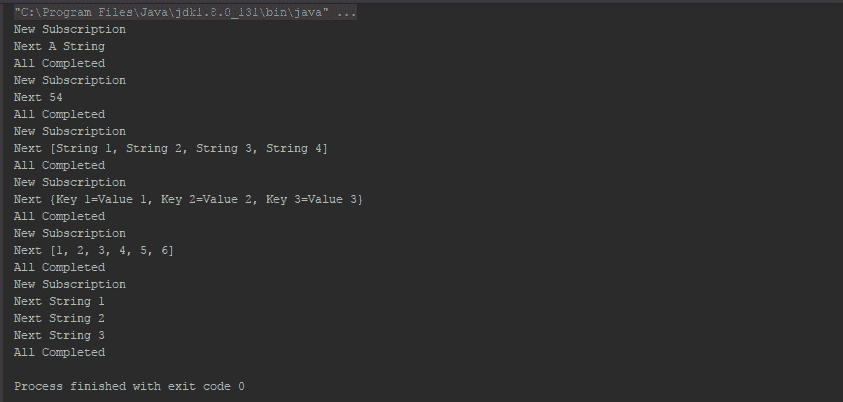

如您在输出中看到的，列表和映射也被视为单个项目，但请看代码中的注释 `1`，我在 `Observable.just` 方法的参数中传递了三个字符串。`Observable.just` 将每个参数作为单独的项目处理并相应地发出（参见输出）。

# 其他 `Observable` 工厂方法

在继续 `Observer`、订阅、取消订阅和 `Subjects` 之前，让我们尝试一些其他的 `Observable` 工厂方法。

因此，让我们首先看看这段代码，然后我们将逐行尝试学习它：

```java
    fun main(args: Array<String>) { 
      val observer: Observer<Any> = object : Observer<Any> { 
        override fun onComplete() { 
            println("All Completed") 
        } 

        override fun onNext(item: Any) { 
            println("Next $item") 
        } 

        override fun onError(e: Throwable) { 
            println("Error Occured ${e.message}") 
        } 

        override fun onSubscribe(d: Disposable) { 
            println("New Subscription ") 
        } 
      }//Create Observer 

      Observable.range(1,10).subscribe(observer)//(1) 
      Observable.empty<String>().subscribe(observer)//(2) 

      runBlocking {    
        Observable.interval(300,TimeUnit.MILLISECONDS).
        subscribe(observer)//(3) 
        delay(900) 
        Observable.timer(400,TimeUnit.MILLISECONDS).
        subscribe(observer)//(4) 
        delay(450) 
     }   

   } 
```

在注释 `(1)` 中，我们使用 `Observable.range()` 工厂方法创建了 `Observable`。该方法创建一个 `Observable` 并发出带有 `start` 参数的整数，直到根据 `count` 参数发出指定数量的整数。

在注释 `(2)` 中，我们使用 `Observable.empty()` 方法创建了 `Observable`。该方法创建 `Observable` 并立即发出 `onComplete()`，而不使用 `onNext()` 发出任何项目。

在注释 `(3)` 和注释 `(4)` 中，我们使用了两个有趣的 `Observable` 工厂方法。注释 `(3)` 中的方法 `Observable.interval()`，从 `0` 开始按顺序发出数字，在每次指定的间隔后继续发出，直到你取消订阅和程序运行。而注释 `(4)` 中的方法 `Observable.timer()`，在指定时间过后只会发出一次 `0`。

如果您好奇的话，以下是输出：

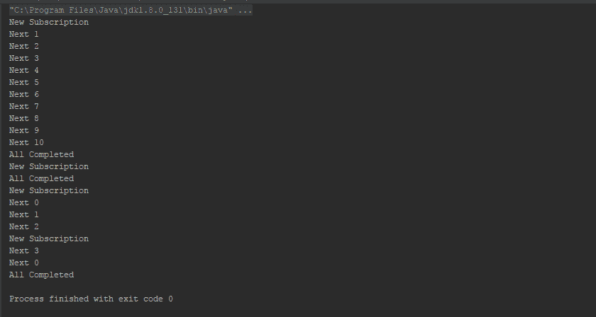

# 订阅者 - `Observer` 接口

来自 RxKotlin 1.x 的 `Subscriber` 在 RxKotlin 2.x 中本质上变成了 `Observer`。在 RxKotlin 1.x 中有一个 `Observer` 接口，但 `Subscriber` 是传递给 `subscribe()` 方法的，它实现了 `Observer`。然而，在 RxJava 2.x 中，`Subscriber` 只在谈论 `Flowables` 时存在，我们将在第四章 介绍背压和 `Flowables` 中介绍。

如您在本章前面的示例中所见，`Observer` 是一个包含四个方法的接口——`onNext(item:T)`、`onError(error:Throwable)`、`onComplete()` 和 `onSubscribe(d:Disposable)`。如前所述，当我们连接 `Observable` 到 `Observer` 时，它会在 `Observer` 中寻找这四个方法并调用它们。因此，以下是对这四个方法的简要描述：

+   `onNext`: `Observable` 调用 `Observer` 的此方法来逐个传递每个项目。

+   `onComplete`: 当 `Observable` 想要表示完成时，它通过传递项目到 `onNext` 方法来完成，然后调用 `Observer` 的 `onComplete` 方法。

+   `onError`: 当 `Observable` 遇到任何错误时，如果 `Observer` 中定义了 `onError` 方法，它会调用该方法来处理错误，否则，它会抛出异常。

+   `onSubscribe`: 每当新的 `Observable` 订阅到 `Observer` 时，都会调用此方法。

# 订阅和取消订阅

因此，我们有`Observable`（需要观察的事物）和`Observer`（需要观察者）；现在怎么办？如何将它们连接起来？`Observable`和`Observer`就像输入设备（无论是键盘还是鼠标）和计算机一样，我们需要某种东西来连接它们（即使是无线输入设备也有一些连接通道，无论是蓝牙还是 Wi-Fi）。

`subscribe`操作符的作用是将`Observable`连接到`Observer`，就像媒体的作用一样。我们可以向`subscribe`操作符传递一到三个方法（`onNext`、`onComplete`、`onError`），或者我们可以向`subscribe`操作符传递`Observer`接口的实例，以获取与`Observer`连接的`Observable`。

现在，让我们看看以下示例：

```java
    fun main(args: Array<String>) { 
      val observable:Observable<Int> = Observable.range(1,5)//1 

      observable.subscribe({//2 
        //onNext method 
        println("Next $it") 
      },{ 
        //onError Method 
        println("Error ${it.message}") 
      },{ 
        //onComplete Method 
        println("Done") 
     }) 

     val observer: Observer<Int> = object : Observer<Int> {//3 
        override fun onComplete() { 
          println("All Completed") 
        } 

        override fun onNext(item: Int) { 
          println("Next $item") 
        } 

        override fun onError(e: Throwable) { 
          println("Error Occurred ${e.message}") 
        } 

        override fun onSubscribe(d: Disposable) { 
          println("New Subscription ") 
        } 
    } 

    observable.subscribe(observer) 
  } 
```

在这个例子中，我们创建了`Observable`实例（在注释`1`处），并且两次使用了不同的重载`subscribe`操作符。在注释`2`处，我们将三个方法作为参数传递给了`subscribe`方法。第一个参数是`onNext`方法，第二个是`onError`方法，最后是`onComplete`。在注释`2`处，我们传递了一个`Observer`接口的实例。

输出可以很容易地预测如下：


因此，我们已经了解了订阅的概念，现在我们可以进行订阅了。如果你想在订阅一段时间后停止发射，那必须有一种方法，对吧？所以让我们来检查一下。

记得`Observer`的`onSubscribe`方法吗？在那个方法中有一个参数我们还没有讨论过。当你`subscribe`时，如果你传递方法而不是`Observer`实例，那么`subscribe`操作符将返回一个`Disposable`实例，或者如果你使用`Observer`的实例，那么你将在`onSubscribe`方法的参数中得到`Disposable`实例。

你可以使用`Disposable`接口的实例在任何给定时间停止发射。让我们看看这个示例：

```java
    fun main(args: Array<String>) { 
      runBlocking { 
        val observale:Observable<Long> = 
        Observable.interval(100,TimeUnit.MILLISECONDS)//1 
        val observer:Observer<Long> = object : Observer<Long> { 
          lateinit var disposable:Disposable//2 

          override fun onSubscribe(d: Disposable) { 
            disposable = d//3 
          } 

          override fun onNext(item: Long) { 
            println("Received $item") 
            if(item>=10 && !disposable.isDisposed) {//4 
              disposable.dispose()//5 
              println("Disposed") 
            } 
          } 

          override fun onError(e: Throwable) { 
            println("Error ${e.message}") 
          } 

          override fun onComplete() { 
            println("Complete") 
          } 

        } 

        observale.subscribe(observer) 
        delay(1500)//6 
     } 
    } 
```

我希望你能记得几页前的这个章节中提到的`Observable.interval`工厂方法。这个方法接受两个参数，描述了间隔期间和时间单位，然后，它按顺序打印整数，从`0`开始。使用间隔创建的`Observable`永远不会完成，也永远不会停止，除非你停止它们或者程序停止执行。我认为它非常适合这个场景，因为我们在这里想要在中间停止`Observable`。

所以，在这个例子中，在注释`1`处，我们使用`Observable.interval`工厂方法创建了一个`Observable`，该`Observable`将在每个`100`毫秒的间隔后发射一个整数。

在注释`2`处，我声明了一个`lateinit var disposable`类型的`Disposable`变量（`lateinit`意味着该变量将在稍后的时间点初始化）。在注释`3`处，在`onSubscribe`方法内部，我们将接收到的参数值赋给`disposable`变量。

我们打算在序列达到`10`后停止执行，也就是说，在`10`被发射后，应立即停止发射。为了实现这一点，我们在`onNext`方法内部放置了一个检查，检查发射项的值是否等于或大于`10`，并且如果发射尚未停止（已释放），则我们将释放发射（注释`5`）。

这里是输出结果：

```java
Received 0
Received 1
Received 2
Received 3
Received 4
Received 5
Received 6
Received 7
Received 8
Received 9
Received 10
Disposed
```

从输出中，我们可以看到在调用`disposable.dispose()`方法后没有发射任何整数，尽管执行等待了 500 毫秒更多（100*10=1000 毫秒来打印序列直到`10`，我们使用 1500 毫秒调用`delay`方法，因此发射`10`后 500 毫秒）。

如果你好奇想了解`Disposable`接口，那么以下是其定义：

```java
    interface Disposable { 
      /** 
      * Dispose the resource, the operation should be idempotent. 
      */ 
      fun dispose() 
      /** 
      * Returns true if this resource has been disposed. 
      * @return true if this resource has been disposed 
      */ 
      val isDisposed:Boolean 
    } 
```

它有一个属性表示是否已经通知停止发射（已释放）以及一个方法来通知停止发射（释放）。

# 热和冷可观测对象

因此，既然我们已经掌握了`Observables`和`Observers`的基本概念，让我们转向更有趣和高级的内容。我们一直在谈论的`Observables`可以根据其行为分为两类。正如标题所暗示的，这两类是`Hot Observables`和`Cold Observables`。我可以打赌，到现在为止，你一定渴望了解更多关于`Hot`和`Cold Observables`的信息，不是吗？那么，让我们深入探讨吧。

# 冷可观测对象

仔细查看所有之前的示例。在所有示例中，如果你多次订阅相同的`Observable`，你将获得所有订阅的开始处的发射。不相信？看看下面的示例：

```java
    fun main(args: Array<String>) { 
      val observable: Observable<String> = listOf
      ("String 1","String 2","String 3","String 4").toObservable()//1 

      observable.subscribe({//2 
        println("Received $it") 
      },{ 
        println("Error ${it.message}") 
      },{ 
        println("Done") 
      }) 

      observable.subscribe({//3 
        println("Received $it") 
      },{ 
        println("Error ${it.message}") 
      },{ 
        println("Done") 
     }) 
    } 
```

这里是它的输出结果：

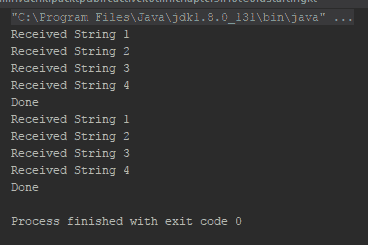

程序相当简单。在注释`1`处声明了一个`Observable`，在注释`2`和`3`处两次订阅了`Observable`。现在，看看输出结果。对于两次订阅调用，你从第一个到最后的发射都是完全相同的。

这些具有这种特定行为的`Observables`，即对每个订阅从开始处发射项目，被称为`Cold Observable`。更具体地说，`Cold Observables`在订阅时开始运行，`Cold Observable`在调用`subscribe`后开始推送项目，并在每个订阅上推送相同的项目序列。

我们在本章中使用的所有`Observable`工厂方法都返回`Cold Observables`。`Cold Observables`类似于数据。当我们处理数据时，例如，在 Android 中使用 SQLite 或 Room 数据库时，我们更依赖于`Cold Observables`而不是`Hot Observables`。

# 热可观测对象

`Cold Observables` 是被动的，它们在调用 `subscribe` 之前不会发出任何内容。`Hot Observables` 与 `Cold Observables` 相反；它不需要订阅就可以开始发射。虽然你可以将 `Cold Observables` 比喻为 CD/DVD 录音，但 `Hot Observables` 更像电视频道——它们继续广播（发射）其内容，无论是否有观众（观察者）观看。

`Hot Observables` 更像事件而不是数据。事件可能携带数据，但存在一个时间敏感的组件，其中最近订阅的 `Observers` 可能会错过之前发出的数据。它们在处理 Android/JavaFX/Swing 中的 UI 事件时特别有用。它们在模拟服务器请求时也非常有用。

# 介绍 `ConnectableObservable` 对象

`ConnectableObservable` 是 `Hot Observables` 的一个很好的例子。它是最有帮助的 `Hot Observables` 形式之一。它可以将任何 `Observable`，甚至是一个 `Cold Observable`，转换为 `Hot Observable`。它不会在 `subscribe` 调用时开始发射；相反，它在调用 `connect` 方法后才会激活。您必须在调用 `connect` 之前进行 `subscribe` 调用；任何在调用 `connect` 之后进行的 `subscribe` 调用都会错过之前发出的发射。

让我们考虑以下代码片段：

```java
    fun main(args: Array<String>) { 
      val connectableObservable = listOf
      ("String 1","String 2","String 3","String 4","String
      5").toObservable() 
      .publish()//1 
      connectableObservable.subscribe({ println
      ("Subscription 1: $it") })//2 
      connectableObservable.map(String::reversed)//3 
      .subscribe({ println("Subscription 2 $it")})//4 
      connectableObservable.connect()//5 
      connectableObservable.subscribe({ println
      ("Subscription 3: $it") })//6 //Will not receive emissions 
    } 
```

`ConnectableObservable` 的主要目的是为了具有多个订阅的 `Observables` 将一个 `Observable` 的所有订阅连接起来，以便它们可以响应单个推送；与重复操作以执行推送并针对每个订阅分别推送的 `Cold Observables` 相反，从而重复循环。`ConnectableObservable` 连接在 `connect` 方法之前调用的所有 `subscriptions`（`Observers`），并将单个推送传递给所有 `Observers`，然后 `Observers` 对该推送做出反应/处理。

在前面的示例中，我们使用 `toObservable()` 方法创建了 `Observable`，然后在注释 `1` 上，我们使用了 `publish` 操作符将 `Cold Observable` 转换为 `ConnectableObservable`。

在注释 `2` 上，我们订阅了 `connectableObservable`。在注释 `3` 上，我们使用了 `map` 操作符来反转 `String`，在注释 `4` 上，我们订阅了映射后的 `connectableObservable`。

在注释 `5` 上，我们调用了 `connect` 方法，并且发射开始对两个 `Observers` 进行。

注意，我们在示例中的注释 `3` 上使用了 `map` 操作符。我们将在第五章异步数据操作符和转换中详细讨论 `map` 操作符。然而，如果你好奇，这里就是定义：`map` 操作符将你选择的函数应用于源 `Observable` 发出的每个项目，并返回一个发出这些函数应用结果的 `Observable`。

这里是输出：

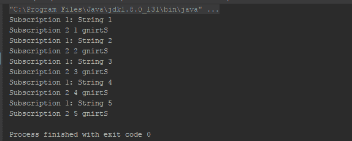

注意，正如输出所示，每次发射都会同时发送到每个`Observer`，并且它们以交错的方式处理数据。

这种从`Observable`一次发射然后将其发射传递给所有`Subscriptions`/`Observers`的机制被称为**多播**。

还要注意，在`connect`之后的注释`6`上的`subscribe`调用没有收到任何发射，因为`ConnectableObservable`是热的，并且任何在连接之后发生的新订阅都会错过之前发射的发射（记住，在`connect`方法的调用和新订阅之间，计算机可以在几毫秒内完成很多任务）；在这种情况下，它错过了所有的发射。

以下代码片段是另一个例子，以使你更好地理解它：

```java
    fun main(args: Array<String>) { 
      val connectableObservable =  
      Observable.interval(100,TimeUnit.MILLISECONDS) 
      .publish()//1 
      connectableObservable. 
      subscribe({ println("Subscription 1: $it") })//2 
      connectableObservable 
      .subscribe({ println("Subscription 2 $it")})//3 
      connectableObservable.connect()//4 
      runBlocking { delay(500) }//5 

      connectableObservable. 
      subscribe({ println("Subscription 3: $it") })//6 
      runBlocking { delay(500) }//7 
    } 
```

这个例子几乎和上一个例子一样，只是做了一些小的调整。

在这里，我们使用了`Observable.interval`方法来创建`Observable`；好处是，由于它在每次发射之前都有一个间隔，因此它会给订阅者在连接后提供一些空间来获取一些发射。

在注释`1`上，我们将`Cold Observable`转换为`ConnectableObservable`，就像上一个例子一样，然后进行了两次订阅，然后连接，就像上一个例子中的注释`2`、`3`、`4`一样。

我们在注释`5`上直接调用延迟，然后在注释`6`上再次订阅，然后在注释`7`上再次延迟，以允许第`3`次订阅打印一些数据。

以下输出将使我们更好地理解：

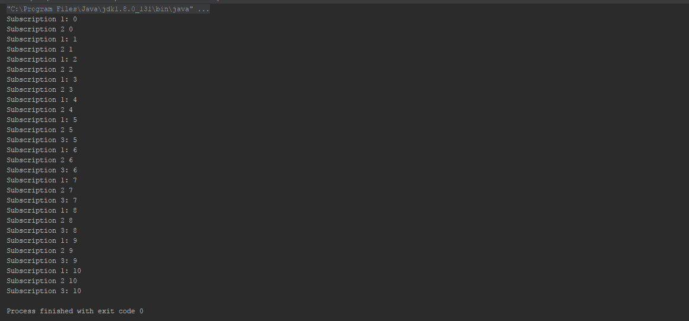

仔细查看输出，注意第`3`次订阅收到了序列`5`的发射，并且错过了所有之前的发射（在`3`次订阅之前有`5`次发射——500 毫秒延迟/100 毫秒间隔）。

# 主题

实现`Hot Observables`的另一种伟大方式是`Subject`。基本上，它是由`Observable`和`Observer`组合而成的，因为它具有许多与两者都共同的行为。就像`Hot Observables`一样，它维护一个内部的`Observer`列表，并在发射时将单个推送传递给当时订阅它的每个`Observer`。

那么，让我们来看看`Subject`能为我们提供什么。为什么它被称为`Observables`和`Observers`的组合？请参考以下要点：

+   它拥有`Observable`应该拥有的所有操作符。

+   就像`Observer`一样，它可以监听发送给它的任何值。

+   在`Subject`完成/出错/取消订阅后，它不能被重用。

+   最有趣的一点是它通过自己传递值。作为解释，如果你通过`onNext`将一个值传递给`Subject`（`Observer`）一侧，它将从中的一侧`Observable`出来。

因此，`Subject`是`Observable`和`Observer`的组合。您已经在之前的章节中看到了`Subject`的使用，但为了使事情更清晰，让我们举一个新的例子：

```java
    fun main(args: Array<String>) { 
      val observable = Observable.interval(100, 
      TimeUnit.MILLISECONDS)//1 
      val subject = PublishSubject.create<Long>()//2 
      observable.subscribe(subject)//3 
      subject.subscribe({//4 
        println("Received $it") 
    }) 
    runBlocking { delay(1100) }//5 
   } 
```

让我们先检查输出，然后我们将解释代码：


现在，让我们理解代码。在这个程序中，我们使用了古老的`Observable.interval`方法。所以，在注释`1`中，我们再次使用`Observable.interval`创建了一个`Observable`实例，间隔为 100 毫秒。

在注释`2`中，我们使用`PublishSubject.create()`创建了`Subject`。

可用的`Subject`类型有很多。`PublishSubject`就是其中之一。`PublishSubject`只会向`observer`发出那些在订阅时间之后由`Observable`源发出的项目。

我们将在本章下一节详细讨论`Subject`的各种类型。

在注释`3`中，我们像使用`Observer`一样使用了`Subject`实例，来订阅`Observable`实例的发射。在注释`4`中，我们像使用`Observable`一样使用了`Subject`实例，并用 lambda 表达式订阅以监听`Subject`实例的发射。

你可能已经习惯了注释`5`中的代码；如果没有，那么我们使用它来使程序等待`1100`毫秒，以便我们可以看到由间隔程序产生的输出。你可以将`delay`方法视为类似于 Java 中的`sleep`方法，唯一的区别在于在这里你必须在一个`Coroutine context`中使用`delay`，因此，为了使用`delay`方法，你必须指定并启动一个`Coroutine context`；这并不总是可能的。`runBlocking`方法就是为了帮助你在那种情况下；它在调用线程内部模拟一个`Coroutine context`，同时阻塞该线程直到`runBlocking`完成所有代码的执行。

`Subject`实例监听`Observable`实例的发射，然后将这些发射广播给它的`Observers`，很可能就像一个正在播放电影（从 CD/DVD 录制）的电视频道。

你可能想知道这有什么好处？当我可以直接将`subscribe`和`Observer`订阅到`Observable`上时，为什么要在中间使用`PublishSubject`？为了找到答案，让我们稍微修改一下这段代码，以便更好地理解它：

```java
    fun main(args: Array<String>) { 
      val observable = Observable.interval(100,
      TimeUnit.MILLISECONDS)//1 
      val subject = PublishSubject.create<Long>()//2 
      observable.subscribe(subject)//3 
      subject.subscribe({//4 
        println("Subscription 1 Received $it") 
      }) 
      runBlocking { delay(1100) }//5 
      subject.subscribe({//6 
        println("Subscription 2 Received $it") 
      }) 
      runBlocking { delay(1100) }//7 
    }  
```

这里，代码直到注释`5`几乎相同（除了注释`3`中的`Subscribe`，我在字符串输出前添加了`Subscription` `1`）。

在注释`6`中，我们又订阅了`subject`。由于我们在`1100`毫秒后订阅，它应该会在前 11 次发射之后接收发射。在注释`7`中，我们再次通过`1100`毫秒使程序等待。

让我们看看输出：

```java
Subscription 1 Received 0
Subscription 1 Received 1
Subscription 1 Received 2
Subscription 1 Received 3
Subscription 1 Received 4
Subscription 1 Received 5
Subscription 1 Received 6
Subscription 1 Received 7
Subscription 1 Received 8
Subscription 1 Received 9
Subscription 1 Received 10
Subscription 1 Received 11
Subscription 2 Received 11
Subscription 1 Received 12
Subscription 2 Received 12
Subscription 1 Received 13
Subscription 2 Received 13
Subscription 1 Received 14
Subscription 2 Received 14
Subscription 1 Received 15
Subscription 2 Received 15
Subscription 1 Received 16
Subscription 2 Received 16
Subscription 1 Received 17
Subscription 2 Received 17
Subscription 1 Received 18
Subscription 2 Received 18 Subscription 1 Received 19
Subscription 2 Received 19
Subscription 1 Received 20
Subscription 2 Received 20
Subscription 1 Received 21
Subscription 2 Received 21  
```

在输出中，它正在打印从第`12`次发射（序列`11`）开始的第二次订阅。所以，`Subject`不会重放像`Cold Observables`这样的操作，它只是将发射转发给所有`Observers`，将`Cold Observable`转换为`Hot Observers`。

# `Subject`的多样性

如我们之前提到的，`Subject`有很多种可用。既然我们在`Subject`上已经有所掌握，现在让我们深入了解`Subject`的各种类型，以更好地理解它。所以，这里是一些最有用和最重要的`Subject`类型，我们将在下面讨论：

+   `AsyncSubject`

+   `PublishSubject`

+   `BehaviorSubject`

+   `ReplaySubject`

# 理解`AsyncSubject`

`AsyncSubject`只发射源`Observable`（它监听的`Observable`）的最后一个值，并且只发射最后一个发射。为了更清楚地说明，`AsyncSubject`将发射它得到的最后一个值，并且只发射一次。

这是一个`AsyncSubject`的弹珠图，它来自 ReactiveX 文档（[`reactivex.io/documentation/subject.html`](http://reactivex.io/documentation/subject.html)）：

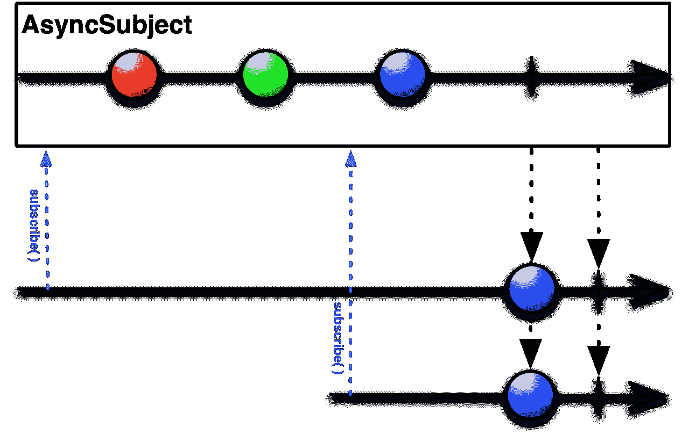

让我们考虑以下代码示例：

```java
    fun main(args: Array<String>) { 
      val observable = Observable.just(1,2,3,4)//1 
      val subject = AsyncSubject.create<Int>()//2 
      observable.subscribe(subject)//3 
      subject.subscribe({//4 
        //onNext 
        println("Received $it") 
      },{ 
        //onError 
        it.printStackTrace() 
      },{ 
        //onComplete 
        println("Complete") 
      }) 
      subject.onComplete()//5 
    } 
```

这里是输出：

```java
Received 4
Complete
```

在这个例子中，我们使用`Observable.just`创建了一个示例，包含`4`个整数（在注释`1`处）。然后，在注释`2`处，我们创建了一个`AsyncSubject`示例。之后，在注释`3`和`4`处，就像前面的例子一样，我们用`subject`订阅了`observable instance`，然后用 lambda 订阅了`Subject`实例；只是这次，我们传递了所有三个方法——`onNext`、`onError`和`onComplete`。

在注释`6`处，我们调用了`onComplete`。

如输出所示，`Subject`只发射了它得到的最后一个值，即`4`。

在`Subject`实例上，你可以直接通过`onNext`方法传递值，而不需要订阅任何`Observable`。回想一下前几章中的例子，我们使用了`Subject`（`PublishSubject`）；在那里，我们只使用了`onNext`来传递值。你可以用`Subject`订阅另一个`Observable`，或者用`onNext`传递值。基本上，当你用`Subject`订阅`Observable`时，`Subject`会在`Observable`值发射时内部调用其`onNext`。

有疑问吗？让我们稍微调整一下代码。我们不会订阅`Observable`，而只会调用`onNext`来传递值，并将有另一个订阅。以下是代码，以这样做：

```java
    fun main(args: Array<String>) { 
      val subject = AsyncSubject.create<Int>() 
      subject.onNext(1) 
      subject.onNext(2) 
      subject.onNext(3) 
      subject.onNext(4) 
      subject.subscribe({ 
        //onNext 
        println("S1 Received $it") 
      },{ 
        //onError 
        it.printStackTrace() 
      },{ 
        //onComplete 
        println("S1 Complete") 
      }) 
      subject.onNext(5) 
      subject.subscribe({ 
        //onNext 
        println("S2 Received $it") 
      },{ 
        //onError 
        it.printStackTrace() 
      },{ 
        //onComplete 
        println("S2 Complete") 
      }) 
      subject.onComplete() 
    } 
```

这里是输出：

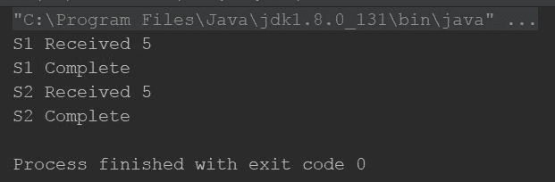

在这里，我们通过`onNext`传递了所有值；它只将得到的最后一个值（`5`）发射给两个订阅。仔细观察，第一个订阅是在传递最后一个值之前。由于`ConnectableObservable`在调用`connect`时开始发射，`AsyncSubject`只在调用`onComplete`时发射其唯一值。

注意，正如输出所示，`AsyncSubject`不是以交错方式发射的，也就是说，它会多次重放其操作以将值发射给多个`Observers`，尽管它只发射一个值。

# 理解`PublishSubject`

`PublishSubject`在订阅时发出它获取的所有后续值，无论它是通过`onNext`方法还是通过另一个订阅获取的。我们已经看到了`PublishSubject`的应用，它是最常见的`Subject`变体。

这里是`PublishSubject`的图形表示，它取自 ReactiveX 文档（[`reactivex.io/documentation/subject.html`](http://reactivex.io/documentation/subject.html)）：

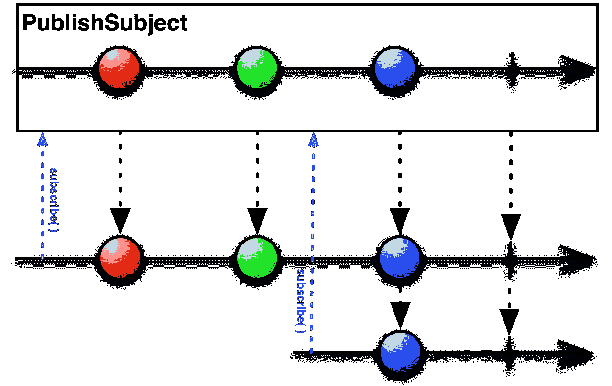

# 理解`BehaviorSubject`

如果我们将`AsyncSubject`和`PublishSubject`结合起来呢？或者混合两者的优点？在多播工作时，`BehaviorSubject`会发出在订阅之前获取的最后一个项目以及订阅时的所有后续项目，即它保持一个内部的`观察者列表`并将相同的发出传递给所有其`观察者`，而不进行重放。

这里是图形表示，取自 ReactiveX 文档（[`reactivex.io/documentation/subject.html`](http://reactivex.io/documentation/subject.html)）：


让我们用`BehaviorSubject`修改最后一个例子，看看会发生什么：

```java
    fun main(args: Array<String>) { 
      val subject = BehaviorSubject.create<Int>() 
      subject.onNext(1) 
      subject.onNext(2) 
      subject.onNext(3) 
      subject.onNext(4) 
      subject.subscribe({ 
        //onNext 
        println("S1 Received $it") 
      },{ 
        //onError 
        it.printStackTrace() 
      },{ 
        //onComplete 
        println("S1 Complete") 
      }) 
      subject.onNext(5) 
      subject.subscribe({ 
        //onNext 
        println("S2 Received $it") 
      },{ 
        //onError 
        it.printStackTrace() 
      },{ 
        //onComplete 
        println("S2 Complete") 
      }) 
      subject.onComplete() 
    } 
```

在这里，我选取了上一个例子，其中我们使用了`AsyncSubject`，并用`BehaviorSubject`进行了修改。那么，让我们看看输出并理解`BehaviorSubject`：

```java
S1 Received 4
S1 Received 5
S2 Received 5
S1 Complete
S2 Complete
```

当第一个订阅获得`4`和`5`时；`4`是在其订阅之前发出的，而`5`是在之后。对于第二个订阅，它只获得了`5`，这是在其订阅之前发出的。

# 理解`ReplaySubject`

它更像是`冷观察者`；无论`观察者`何时订阅，它都会重新播放它获取的所有项目。

这里是图形表示：

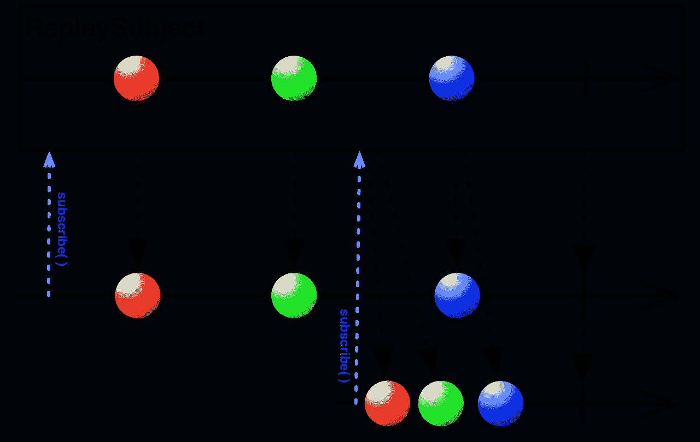

图片来源：[`reactivex.io/documentation/subject.html`](http://reactivex.io/documentation/subject.html)

让我们用`ReplaySubject`修改之前的程序：

```java
    fun main(args: Array<String>) { 
      val subject = ReplaySubject.create<Int>() 
      subject.onNext(1) 
      subject.onNext(2) 
      subject.onNext(3) 
      subject.onNext(4) 
      subject.subscribe({ 
        //onNext 
        println("S1 Received $it") 
      },{ 
        //onError 
        it.printStackTrace() 
      },{ 
        //onComplete 
        println("S1 Complete") 
      }) 
      subject.onNext(5) 
      subject.subscribe({ 
        //onNext 
        println("S2 Received $it") 
      },{ 
        //onError 
        it.printStackTrace() 
      },{ 
        //onComplete 
        println("S2 Complete") 
      }) 
      subject.onComplete() 
    } 
```

此外，这里是输出：

```java
S1 Received 1
S1 Received 2
S1 Received 3
S1 Received 4
S1 Received 5
S2 Received 1
S2 Received 2
S2 Received 3
S2 Received 4
S2 Received 5
S1 Complete
S2 Complete  
```

它为两个订阅都发出了所有项目。

# 摘要

在本章中，我们学习了`Observables`和`Observers`以及如何使用它们。我们通过几个例子来加强我们对它们的掌握。我们了解到`Observables`有两种类型——`热 Observables`和`冷 Observables`。我们还学习了几个`Subject`及其变体。几个`Subject`基本上是`Observables`和许多`Observer`的组合。

虽然`Observables`为我们提供了极大的灵活性和功能，但它也有一些缺点，比如背压。对此好奇吗？想了解更多关于`Observables`的缺点以及如何克服它们的信息？那么就赶快翻到第四章吧。
