# 背压和 Flowables 简介

到目前为止，我们一直在尝试理解基于推的响应式编程架构。到目前为止，我们已经对 `Observables` 有了一个很好的理解。我们现在明白，`Observable` 会发出项目供 `Observer` 消费以进行进一步处理。然而，在阅读前面的章节时，你是否曾经想过这样一个情况：`Observable` 发出项目的速度比 `Observer` 消费它们的速度快？整章都致力于这个问题。我们将首先尝试理解这个问题何时以及如何发生，然后我们将尝试解决这个问题。

因此，在本章中，我们将重点关注以下主题，并在本章结束时，我们应该有解决前面提到的问题的解决方案：

+   理解背压

+   Flowables 和 Subscriber

+   使用 `Flowable.create()` 创建 Flowables

+   一起使用 Observable 和 Flowables

+   背压操作符

+   `Flowable.generate()` 操作符

现在，让我们从背压——Observables 的问题开始。

# 理解背压

`Observable` 的唯一问题是当 `Observer` 无法跟上 `Observable` 的节奏时。默认情况下，`Observable` 通过将项目同步推送到 `Observer`，一次一个，来链式工作。然而，如果 `observer` 必须执行一些耗时的计算，这可能会比 `Observable` 每个项目发射间隔更长。困惑吗？让我们考虑这个例子：

```kt
    fun main(args: Array<String>) { 
      val observable = Observable.just(1,2,3,4,5,6,7,8,9)//(1) 
      val subject = BehaviorSubject.create<Int>() 
      subject.observeOn(Schedulers.computation())//(2) 
            .subscribe({//(3) 
                println("Subs 1 Received $it") 
                runBlocking { delay(200) }//(4) 
            }) 

            subject.observeOn(Schedulers.computation())//(5) 
            .subscribe({//(6) 
                println("Subs 2 Received $it") 
             }) 
             observable.subscribe(subject)//(7) 
            runBlocking { delay(2000) }//(8) 
    } 
```

代码相当简单。我们在注释 `(1)` 上创建了 `Observable`，然后，我们创建了 `BehaviorSubject`，然后在注释 `(3)` 和 `(6)` 上，我们订阅了 `BehaviorSubject`。在注释 `(7)` 上，在订阅 `BehaviorSubject` 之后，我们将使用 `BehaviorSubject` 来订阅 `Observable`，这样 `BehaviorSubject` 的 `Observers` 就应该接收到所有的发射。在注释 `(4)` 的第一个订阅中，我们使用了 `delay` 方法来模拟一个耗时订阅者。在注释 `(2)` 和 `(6)` 上有新的代码，`subject.observeOn(Schedulers.computation())`；我们将在后面的章节中详细讨论这个方法，但现在，只需记住这个 `observeOn` 方法帮助我们指定运行订阅的线程，而 `Scheduler.computation()` 提供了一个用于执行计算的线程。在注释 `(8)` 上，我们使用了 `delay` 方法来等待执行，因为执行将在后台进行。

基于我们从前面章节中获得的知识，我们可以说订阅应该以交错的方式打印出 `1` 到 `9` 的所有数字，对吗？让我们先看看输出：

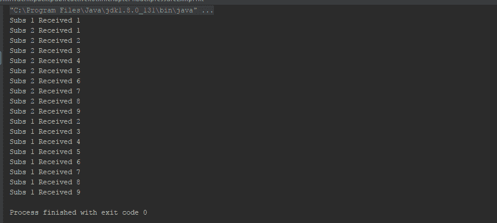

对输出感到震惊吗？订阅`2`并没有像预期的那样交错工作，它在订阅`1`打印第二个数字之前就已经完成了所有数字的打印，尽管它先开始打印。那么，为什么它打破了`Hot Observables`的行为？为什么两个`Observer`没有以交错的方式工作？让我们来检查一下。实际上，程序并没有打破`Hot Observables`的行为，`subject`实际上为两个`observer`各发射了一次；然而，对于第一个`observer`来说，每次计算都很长，**排放被排队**；这显然不是什么好事，因为这可能导致很多问题，包括`OutOfMemoryError`异常。

仍然有疑问？让我们看看另一个例子：

```kt
    fun main(args: Array<String>) { 
      val observable = Observable.just(1,2,3,4,5,6,7,8,9)//(1) 
      observable 
         .map { MyItem(it) }//(2) 
         .observeOn(Schedulers.computation())//(3) 
         .subscribe({//(4) 
           println("Received $it") 
           runBlocking { delay(200) }//(5) 
          }) 
          runBlocking { delay(2000) }//(6) 
    } 

    data class MyItem (val id:Int) { 
      init { 
        println("MyItem Created $id")//(7) 
      } 
    } 
```

在这个例子中，我们消除了`Subject`和多个`Subscribers`，使程序更简单、更容易理解。我们已经在上一章中介绍了`map`操作符，我们使用它来在注释`(2)`中将`Int`项目转换为`MyItem`对象。

如果你忘记了上一章中的`map`操作符，它接受一个源可观察对象，在运行时处理它们发出的项目，并创建另一个可观察对象来观察。简单来说，`map`操作符位于`subscribe`之前，用于在将新生成的项目传递给`observer`之前处理`observable`发出的每个项目。我们将在后面的章节中更详细地了解`map`操作符。

在这里，我们使用它来跟踪每次排放。每当发生排放时，它将立即传递给`map`操作符，在那里我们创建`MyItem`类的对象。在`MyItem`类的`init`块中，我们打印传递给它的值；因此，一旦有项目被排放，它就会被`MyItem`类打印出来。

在这里，`MyItem`类是一个`data class`，即它将默认拥有`val id`和`toString`方法的 getter。

程序的剩余部分几乎相同；让我们看看输出，然后我们继续讨论：

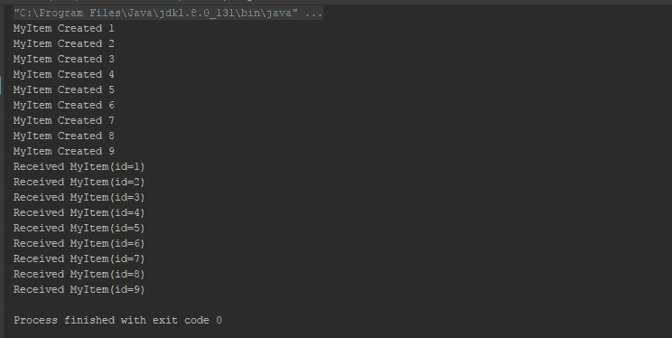

如我们在输出中看到的那样，许多`MyItem`（即排放）的创建非常快，甚至在`Observer`（即消费者）开始打印之前就已经完成了。

因此，问题是排放被消费者排队，而消费者正忙于处理生产者之前处理的排放。

解决这个问题的方法之一是消费者到生产者的反馈通道，通过这个通道，消费者可以告诉生产者等待它完成处理之前的排放。这样，消费者或消息中间件就不会在高负载下变得饱和和无响应；相反，它们可能会请求更少的消息，让生产者决定如何减速。这个反馈通道被称为**背压**。在`Observables`和`Observers`中不支持背压，解决方案可能是使用`Flowables`和`Subscribers`。让我们学习这些是什么。

# Flowable

我们可以将 Flowables 称为 Observables 的带背压版本。可能 Flowables 和 Observables 之间唯一的区别就是 Flowable 考虑了背压，而 Observable 没有。就是这样。Flowable 为操作符提供了默认的 128 个元素的缓冲区大小，因此，当消费者花费时间时，发出的项目可能会在缓冲区中等待。

注意，Flowables 是在 ReactiveX 2.x（RxKotlin 2.X）中添加的，而之前的版本不包括它们。相反，在之前的版本中，Observables 被修改以支持背压，这导致了许多意外的`MissingBackpressureException`。

如果你对发布说明感兴趣，请看以下内容：

[`github.com/ReactiveX/RxJava/wiki/What%27s-different-in-2.0#observable-and-flowable`](https://github.com/ReactiveX/RxJava/wiki/What%27s-different-in-2.0#observable-and-flowable)

我们已经进行了长时间的讨论；现在让我们动手写代码。首先，我们将尝试使用 Observable 的代码，然后我们将使用 Flowables 来做同样的事情，以观察和理解它们之间的区别：

```kt
    fun main(args: Array<String>) { 
      Observable.range(1,1000)//(1) 
        .map { MyItem3(it) }//(2) 
        .observeOn(Schedulers.computation()) 
        .subscribe({//(3) 
          print("Received $it;\t") 
          runBlocking { delay(50) }//(4) 
         },{it.printStackTrace()}) 
         runBlocking { delay(60000) }//(5) 
     } 
     data class MyItem3 (val id:Int) { 
     init { 
       print("MyItem Created $id;\t") 
     } 
    } 
```

一个简单的使用`Observable.range()`操作符的代码示例，该操作符应该从`1`到`1000`发出数字。在注释`(2)`中，我们使用了`map`操作符将`Int`转换为`MyItem3`对象。在注释`(3)`中，我们订阅了`Observable`。在注释`(4)`中，我们运行了一个阻塞延迟来模拟长时间运行的订阅代码。在注释`(5)`中，我们再次运行了一个阻塞延迟代码，等待消费者完成所有项目的处理后再停止程序执行。

整个输出将占用一些空间，因此我们将部分输出作为截图展示：

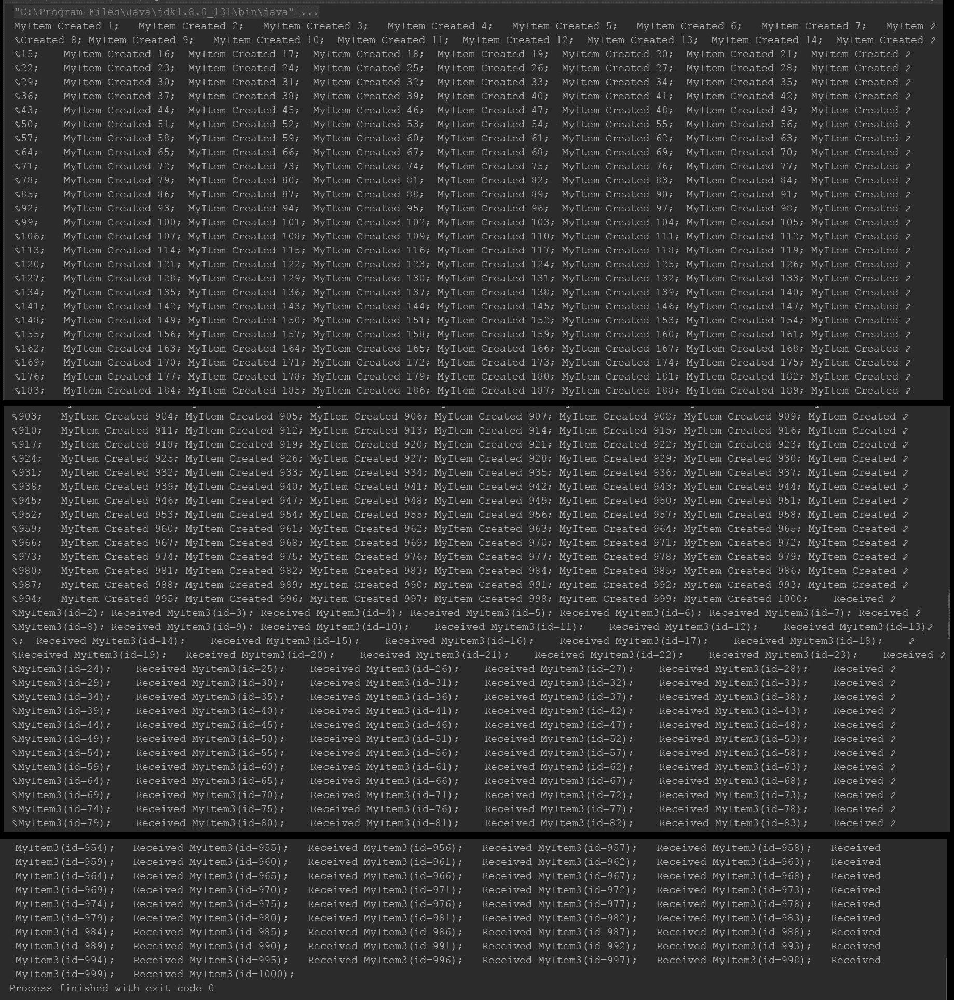

如果你仔细观察输出（截图），你会注意到 Observable（生产者）继续发出项目，尽管观察者（消费者）根本跟不上它的节奏。直到观察者（生产者）完成所有项目的发出，观察者（消费者）才处理了第一个项目（项目 1）。如前所述，这可能导致很多问题，包括`OutOfMemory`错误。现在，让我们将代码中的`Observable`替换为`Flowable`：

```kt
    fun main(args: Array<String>) { 
      Flowable.range(1,1000)//(1) 
        .map { MyItem4(it) }//(2) 
        .observeOn(Schedulers.io()) 
        .subscribe({//(3) 
          println("Received $it") 
          runBlocking { delay(50) }//(4) 
        },{it.printStackTrace()}) 
        runBlocking { delay(60000) }//(5) 
    } 
    data class MyItem4 (val id:Int) { 
      init { 
        println("MyItem Created $id") 
      }  
   } 
```

代码与上一个完全相同，唯一的区别是我们将`Observable`写成了`Flowable`。现在，让我们看看输出并注意区别：

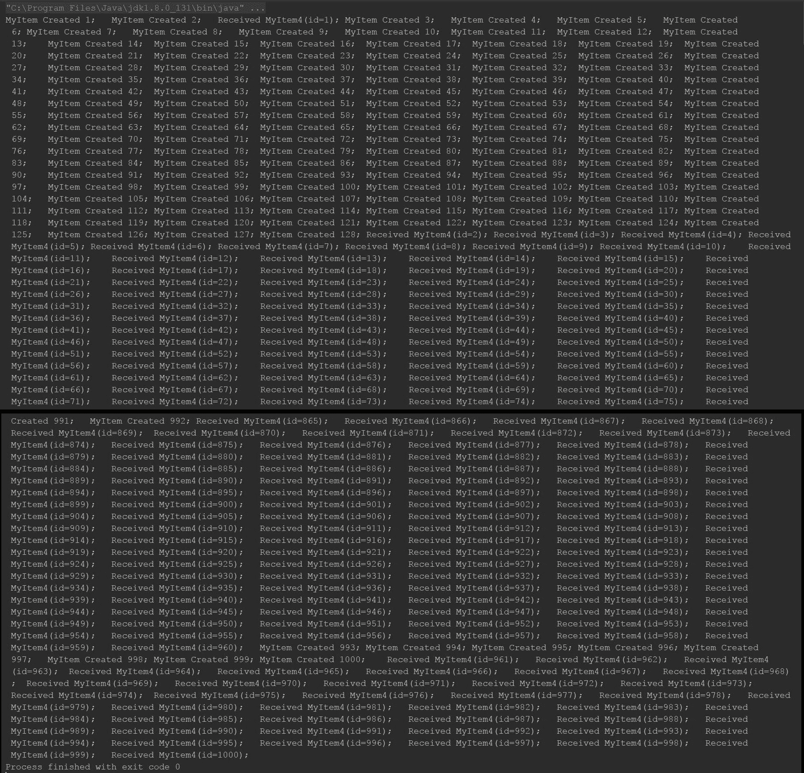

你注意到区别了吗？Flowable 不是一次性发出所有项目，而是分批发出少量项目，等待消费者处理完毕后再继续，并以交错的方式完成。这本身就能减少很多问题。

# 何时使用 Flowables 和 Observables

到目前为止，你可能认为 Flowable 是一个方便的工具，所以你可以在任何地方替换 Observable。然而，这并不总是如此。尽管 Flowable 为我们提供了背压策略，但 Observables 的存在是有原因的，它们各自都有优势和劣势。那么，何时使用哪一个？让我们看看。

# 何时使用 Flowables？

以下是你应该考虑使用 Flowables 的情况。记住，Flowables 比 Observables 慢：

+   Flowables 和背压旨在帮助处理大量数据。所以，如果你的源可能排放 10,000+项，请使用 Flowable。特别是当源是异步的，这样消费者链可以在需要时要求生产者限制/调节排放。

+   如果你正在读取/解析文件或数据库。

+   当你想从支持阻塞并返回结果的网络 IO 操作/流式 API 中发射时，这是许多 IO 源的工作方式。

# 何时使用 Observables？

现在你已经知道了何时使用 Flowables，让我们看看你应该优先考虑 Observables 的条件：

+   当你处理的数据量较小（少于 10,000 个排放量）时

+   当你执行严格同步操作或有限并发操作时

+   当你正在发射 UI 事件（在处理 Android、JavaFX 或 Swing 时）

此外，请记住，与 Observables 相比，Flowables 较慢。

# 流式处理和订阅者

相比于 Observer，Flowable 使用的是支持背压的 Subscriber。然而，如果你使用 lambda 表达式，那么你将不会注意到任何区别。那么，为什么使用 Subscriber 而不是 Observer 呢？因为 Subscriber 支持一些额外的操作和背压。例如，它可以向上游传达它希望接收多少项作为消息。或者，更确切地说，当我们使用 Subscriber 时；你必须指定你想要从上游接收（请求）多少项；如果你不指定它，你将不会收到任何排放。

正如我们之前提到的，使用`Subscriber`的 lambda 表达式与 Observe 类似；这种实现将自动从上游请求无界数量的排放。就像我们最后的代码一样，我们没有指定我们想要多少排放，但它内部请求了无界数量的排放，这就是为什么我们收到了所有排放的项目。

因此，让我们尝试用`Subscriber`实例替换之前的程序：

```kt
    fun main(args: Array<String>) { 
      Flowable.range(1, 1000)//(1) 
        .map { MyItem5(it) }//(2) 
        .observeOn(Schedulers.io()) 
        .subscribe(object : Subscriber<MyItem5> {//(3) 
          override fun onSubscribe(subscription: Subscription) { 
            subscription.request(Long.MAX_VALUE)//(4) 
           } 

           override fun onNext(s: MyItem5?) { 
             runBlocking { delay(50) } 
             println("Subscriber received " + s!!) 
           } 

           override fun onError(e: Throwable) { 
             e.printStackTrace() 
           } 

           override fun onComplete() { 
             println("Done!") 
           } 
          }) 
          runBlocking { delay(60000) } 
       } 

       data class MyItem5 (val id:Int) { 
       init { 
         println("MyItem Created $id") 
       } 
    } 
```

前一个程序输出的结果将与之前的相同，所以我们在这里省略输出。相反，让我们理解代码。程序几乎与上一个相同，直到注释（3）处，我们创建了一个`Subscriber`实例。`Subscriber`的方法与`Observer`相同；然而，正如我之前提到的，在`subscribe`方法上，你必须请求你想要初始的排放数量。我们在注释（4）处也做了同样的事情；然而，因为我们想要接收所有排放，所以我们用`Long.MAX_VALUE`请求。

那么，`request` 方法是如何工作的？`request()` 方法将请求 `Subscriber` 应该监听的上游发射的数量，从方法调用后开始计数。`Subscriber` 将忽略请求的发射之后的任何发射，直到你请求更多。

因此，让我们修改这个程序以更好地理解 `request` 方法：

```kt
    fun main(args: Array<String>) { 
      Flowable.range(1, 15) 
        .map { MyItem6(it) } 
        .observeOn(Schedulers.io()) 
        .subscribe(object : Subscriber<MyItem6> { 
           lateinit var subscription: Subscription//(1) 
           override fun onSubscribe(subscription: Subscription) { 
              this.subscription = subscription 
              subscription.request(5)//(2) 
           } 

           override fun onNext(s: MyItem6?) { 
             runBlocking { delay(50) } 
             println("Subscriber received " + s!!) 
               if(s.id == 5) {//(3) 
                  println("Requesting two more") 
                  subscription.request(2)//(4) 
                } 
            } 

            override fun onError(e: Throwable) { 
               e.printStackTrace() 
            } 

            override fun onComplete() { 
               println("Done!") 
            } 
           }) 
           runBlocking { delay(10000) } 
     } 

    data class MyItem6 (val id:Int) { 
      init { 
        println("MyItem Created $id") 
      } 
     } 
```

那么，我们在程序中做了哪些调整？让我们逐个检查。在注释 `(1)` 中，我们声明了一个 `lateinit` 类型的 `Subscription` 变量，并在注释 `(2)` 之前在 `onSubscribe` 方法中初始化了这个订阅。在注释 `(2)` 中，我们使用 `subscription.request(5)` 请求了 `5` 个项目。然后，在 `onNext` 中，注释 `(3)`，我们检查接收到的项目是否是第 `5` 个（因为我们使用的是范围，第 `5` 个项目的值将是 `5`）；如果项目是第 `5` 个，那么我们再次请求 `2` 个。所以，程序应该打印出七个项目，而不是 `1` 到 `15` 的范围。让我们检查以下输出：

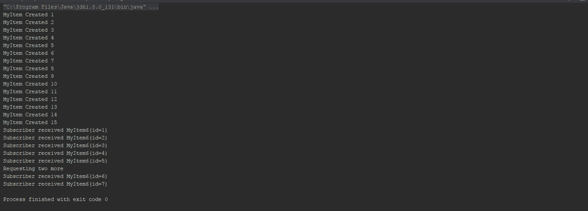

因此，尽管 `Flowable` 发射了该范围内的所有项目，但它们在 `7` 之后从未传递给 `Subscriber`。

注意，`request()` 方法并不是直接向上游传递，它只是将信息传递给最近的先前的操作符，该操作符随后决定是否以及如何将信息进一步传递到上游。

因此，我们对 `Flowable` 和 `Subscriber` 有了一些了解。现在，是时候深入探索它们了。我们将从从头创建一个 `Flowable` 实例开始。

# 从头创建 Flowable

在上一章中，我们学习了 `Observable.create` 方法，但为了使事情更简单，让我们快速回顾一下，然后我们可以继续使用 `Flowable.create`。看看以下代码片段：

```kt
    fun main(args: Array<String>) { 
      val observer: Observer<Int> = object : Observer<Int> { 
        override fun onComplete() { 
            println("All Completed") 
        } 

        override fun onNext(item: Int) { 
            println("Next $item") 
        } 

        override fun onError(e: Throwable) { 
            println("Error Occured ${e.message}") 
        } 

        override fun onSubscribe(d: Disposable) { 
            println("New Subscription ") 
        } 
       }//Create Observer 

       val observable: Observable<Int> = Observable.create<Int> {//1 
         for(i in 1..10) { 
            it.onNext(i) 
         } 
         it.onComplete() 
       } 

       observable.subscribe(observer) 

    } 
```

因此，在这个程序中，我们使用 `Observable.create` 操作符创建了 `Observable`。这个操作符允许我们定义自己的自定义 `Observable`。我们可以为 `Observable` 编写自己的规则来发射项目。它提供了极大的自由度，但 `Observable` 的问题也在这里。它不支持背压。如果我们可以创建一个具有背压支持的类似版本，那岂不是很好？我们将这样做，但让我们先看看输出：

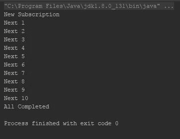

因此，正如预期的那样，它打印了从 `1` 到 `10` 的所有数字。现在，如前所述，让我们尝试使用 `Flowable`：

```kt
    fun main(args: Array<String>) { 
      val subscriber: Subscriber<Int> = object : Subscriber<Int> { 
        override fun onComplete() { 
          println("All Completed") 
        } 

        override fun onNext(item: Int) { 
          println("Next $item") 
        } 

        override fun onError(e: Throwable) { 
          println("Error Occured ${e.message}") 
        } 

        override fun onSubscribe(subscription: Subscription) { 
          println("New Subscription ") 
          subscription.request(10) 
        } 
      }//(1) 

      val flowable: Flowable<Int> = Flowable.create<Int> ({ 
        for(i in 1..10) { 
          it.onNext(i) 
        } 
        it.onComplete() 
      },BackpressureStrategy.BUFFER)//(2) 

      flowable 
        .observeOn(Schedulers.io()) 
        .subscribe(subscriber)//(3) 

      runBlocking { delay(10000) } 

    } 
```

因此，在注释 `(1)` 中，我们创建了一个 `Subscriber` 实例。然后，在注释 `(2)` 中，我们使用 `Flowable.create()` 方法创建了一个 `Flowable` 实例，并在注释 `(3)` 中订阅了它。然而，请注意注释 `(2)`——除了 `lambda` 之外，我们还向 `Flowable.create` 方法传递了另一个参数，即 `BackpressureStrategy.BUFFER`。那么，这是什么？`BackpressureStrategy.BUFFER` 有什么作用？让我们检查一下。

`Flowable.create()`接受两个参数来创建一个`Flowable`实例。以下是`Flowable.create()`方法的定义：

```kt
    fun <T> create(source:FlowableOnSubscribe<T>, 
    mode:BackpressureStrategy):Flowable<T> { 
      //... 
    } 
```

第一个参数是排放生成的源，第二个参数是`BackpressureStrategy`；它是一个`enum`，通过缓存/缓冲或丢弃一些排放来帮助支持背压（它基本上帮助选择遵循哪种策略进行背压）。`enum BackpressureStrategy`有五种底层选项，用于不同类型的背压实现。在这个例子中，`BackpressureStrategy.BUFFER`将所有排放缓冲在无界缓冲区中，直到下游能够消费它们。显然，这不是一个最优的背压实现，在处理大量排放时可能会导致`OutOfMemoryError`，但至少它可以防止`MissingBackpressureException`，并使你的自定义`Flowable`在一定程度上可行。我们将在本章后面使用`Flowable.generate()`学习实现背压的更稳健的方法；然而，现在，让我们了解一下可以从`BackpressureStrategyenum`中选择哪些选项：

+   `BackpressureStrategy.MISSING`: 这将导致完全没有背压实现；下游必须处理背压溢出。当使用`onBackpressureXXX()`操作符时，此选项很有帮助。我们将在本章后面学习这个例子。

+   `BackpressureStrategy.ERROR`: 这同样会导致没有背压实现，并且当下游无法跟上源生时，立即发出`MissingBackpressureException`。

+   `BackpressureStrategy.BUFFER`: 这将在无界缓冲区中缓冲所有排放，直到下游能够消费它们。如果有很多排放需要缓冲，这可能会导致`OutOfMemoryError`。

+   `BackpressureStrategy.DROP`: 这种策略会在下游忙碌且无法跟上时丢弃所有排放；当下游完成之前的操作后，它将在完成时间后立即获得第一个排放，并错过任何在此之间的排放。例如，假设源生发出五个值，分别是`1`、`2`、`3`、`4`和`5`，下游在接收到`1`后变得忙碌，而源生在发出`2`、`3`和`4`时，下游在源生发出`5`之前刚好准备好；下游只会接收到`5`，并错过所有剩余的排放。

+   `BackpressureStrategy.LATEST`：这个策略将允许你在下游忙碌且无法跟上时丢弃所有排放，但保留最新的一个；当下游完成之前的操作时，它将获得它完成之前的最后一个排放，并且会错过之间的任何排放。例如，假设源依次发射五个值 `1`、`2`、`3`、`4` 和 `5`，下游在收到 `1` 后变得忙碌，而此时源发射了 `2`、`3` 和 `4`，下游在源发射 `5` 之前变得准备好；下游将接收这两个值（如果它在收到 `4` 后没有再次变得忙碌，那么它将无法接收 `5`）。

让我们在从 Observables 创建 Flowables 的过程中实现一些这些背压策略作为操作符。

# 从 Observable 创建 Flowable

`Observable.toFlowable()` 操作符为你提供了另一种将 `BackpressureStrategy` 实现到非背压源的方法。这个操作符将任何 `Observable` 转换为 `Flowable`，所以让我们动手实践，首先，让我们尝试将一个 `Observable` 转换为使用缓冲策略的 `Flowable`，然后我们将在同一个例子中尝试其他一些策略，以更好地理解它。请参考以下代码：

```kt
    fun main(args: Array<String>) { 
      val source = Observable.range(1, 1000)//(1) 
      source.toFlowable(BackpressureStrategy.BUFFER)//(2) 
        .map { MyItem7(it) } 
        .observeOn(Schedulers.io()) 
        .subscribe{//(3) 
          print("Rec. $it;\t") 
          runBlocking { delay(1000) } 
        } 
        runBlocking { delay(100000) } 
    } 

    data class MyItem7 (val id:Int) { 
      init { 
        print("MyItem init $id") 
      } 
   } 
```

因此，在注释 `(1)` 中，我们使用 `Observable.range()` 方法创建了一个 `Observable`。在注释 `(2)` 中，我们使用 `BackpressureStrategy.BUFFER` 将其转换为 `Flowable`。然后，我们使用 lambda 作为 `Subscriber` 订阅它。让我们看看输出的一部分作为截图（因为完整的输出太长，无法粘贴在这里）：

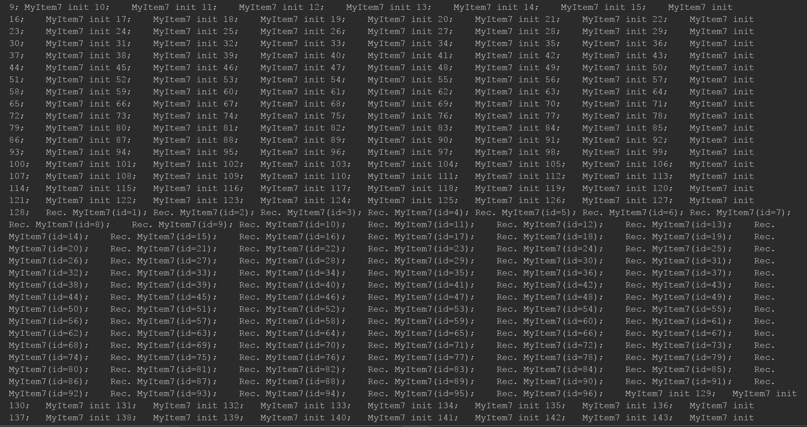

因此，正如预期的那样，下游在这里处理了所有的排放，因为 `BackpressureStrategy.BUFFER` 会将所有的排放缓冲到下游消费为止。

因此，现在，让我们尝试使用 `BackpressureStrategy.ERROR` 并查看会发生什么：

```kt
    fun main(args: Array<String>) { 
      val source = Observable.range(1, 1000) 
      source.toFlowable(BackpressureStrategy.ERROR) 
        .map { MyItem8(it) } 
        .observeOn(Schedulers.io()) 
        .subscribe{ 
           println(it) 
           runBlocking { delay(600) } 
        } 
        runBlocking { delay(700000) } 
      } 

      data class MyItem8 (val id:Int) { 
      init { 
        println("MyItem Created $id") 
      } 
    } 
```

以下是输出：

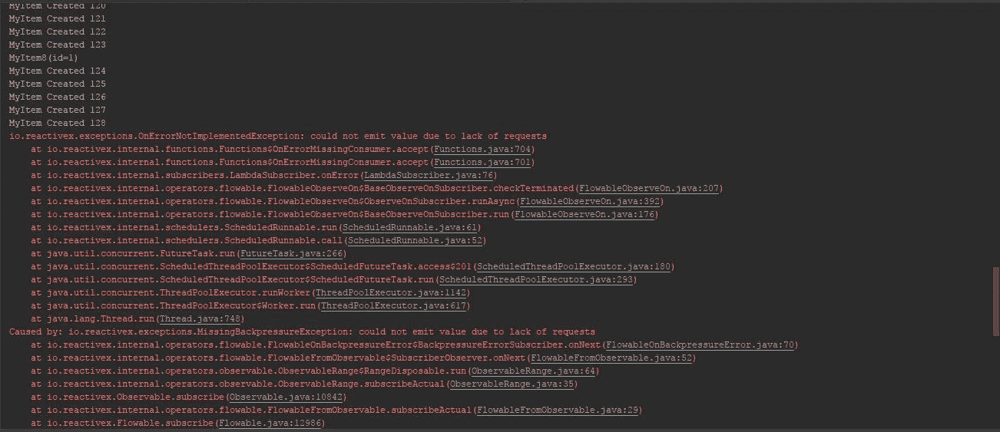

它显示了一个错误，因为下游无法跟上上游，正如我们之前所描述的。

如果我们使用 `BackpressureStrategy.DROP` 选项会发生什么？让我们检查：

```kt
    fun main(args: Array<String>) { 
      val source = Observable.range(1, 1000) 
      source.toFlowable(BackpressureStrategy.DROP) 
        .map { MyItem9(it) } 
        .observeOn(Schedulers.computation()) 
        .subscribe{ 
           println(it) 
           runBlocking { delay(1000) } 
        } 
        runBlocking { delay(700000) } 
     } 

     data class MyItem9 (val id:Int) { 
     init { 
        println("MyItem Created $id") 
     } 
    } 
```

一切都和上一个例子一样，只是这里我们使用了 `BackpressureStrategy.DROP` 选项。让我们检查输出：

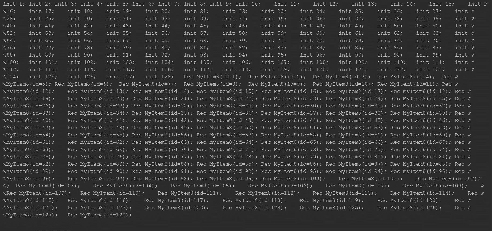

因此，正如我们可以在前面的输出中看到的那样，`BackpressureStrategy.DROP` 在 `128` 之后停止了 `Flowable` 的排放，因为下游无法跟上，正如我们之前所描述的。

现在，我们已经对 `BackpressureStrategy` 中可用的选项有了些了解，让我们专注于 `BackpressureStrategy.MISSING` 选项，以及如何使用 `onBackpressureXXX()` 操作符来使用它们。

# BackpressureStrategy.MISSING 和 onBackpressureXXX()

`BackpressureStrategy.MISSING`意味着它不会实现任何背压策略，所以你需要明确告诉`Flowable`要遵循哪种背压策略。`onBackpressureXXX()`操作符可以帮助你实现这一点，同时为你提供一些额外的配置选项。

可用的`onBackpressureXXX()`操作符主要有三种类型：

+   `onBackpressureBuffer()`

+   `onBackpressureDrop()`

+   `onBackpressureLatest()`

# `onBackpressureBuffer()`操作符

这个操作符的作用类似于`BackpressureStrategy.BUFFER`；不同之处在于，这里你会得到一些额外的配置选项，例如缓冲区大小、有界或无界等。你也可以省略配置以使用默认行为。

因此，让我们看看一些例子：

```kt
    fun main(args: Array<String>) { 
      val source = Observable.range(1, 1000) 
      source.toFlowable(BackpressureStrategy.MISSING)//(1) 
        .onBackpressureBuffer()//(2) 
        .map { MyItem11(it) } 
        .observeOn(Schedulers.io()) 
        .subscribe{ 
           println(it) 
           runBlocking { delay(1000) } 
         } 
         runBlocking { delay(600000) } 
     } 

     data class MyItem11 (val id:Int) { 
     init { 
        println("MyItem Created $id") 
     } 
    } 
```

再次，我们使用之前的程序，但做了一些小的调整。在注释`(1)`中，我们使用`BackpressureStrategy.MISSING`选项创建了`Flowable`实例。在注释`(2)`中，为了处理背压，我们使用了`onBackpressureBuffer`；输出与`BackpressureStrategy.BUFFER`示例中的输出类似，所以我们省略了这一点。

你可以通过使用`onBackpressureBuffer()`来指定缓冲区大小。所以让我们将`onBackpressureBuffer()`方法调用修改为`onBackpressureBuffer(20)`。以下是输出：

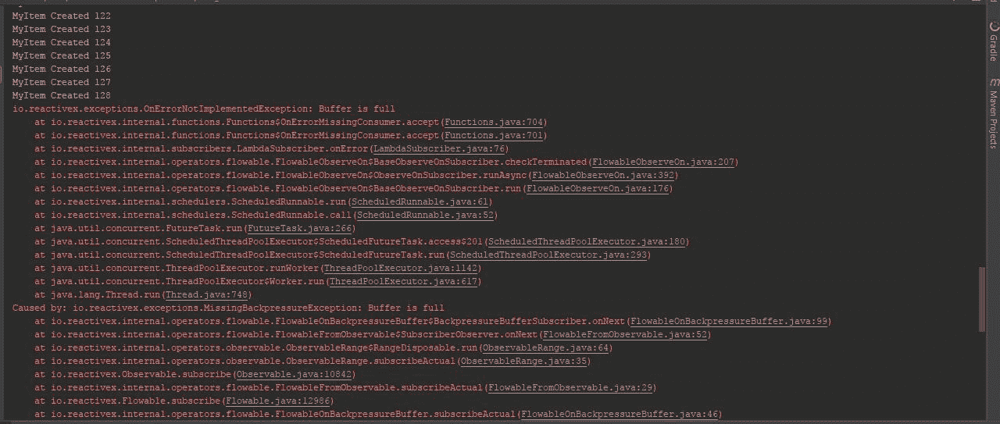

是的，这个更改导致了错误——缓冲区已满。我们定义`20`为缓冲区大小，但`Flowable`需要更多的空间。这可以通过实现`onError`方法来避免。

# `onBackpressureDrop()`操作符

例如，`onBackpressureBuffer`与`BackpressureStrategy.BUFFER`匹配，`onBackpressureDrop`在背压策略方面与`BackpressureStrategy.DROP`匹配，并提供了一些配置选项。

现在，让我们尝试一下：

```kt
    fun main(args: Array<String>) { 
      val source = Observable.range(1, 1000) 
      source.toFlowable(BackpressureStrategy.MISSING)//(1) 
        .onBackpressureDrop{ print("Dropped $it;\t") }//(2) 
        .map { MyItem12(it) } 
        .observeOn(Schedulers.io()) 
        .subscribe{ 
           print("Rec. $it;\t") 
           runBlocking { delay(1000) } 
        } 
        runBlocking { delay(600000) } 
    } 

    data class MyItem12 (val id:Int) { 
    init { 
        print("MyItem init $id;\t") 
    } 
   } 
```

如前一个程序所示，我们在注释`(1)`中使用了`BackpressureStrategy.MISSING`。在注释`(2)`中，我们使用了`onBackpressureDrop()`操作符。这个操作符提供了一个配置选项来传递一个消费者实例，该实例将消费丢弃的排放，以便你可以进一步处理它。我们使用了这个配置并传递了一个 lambda，它将打印丢弃的排放，如截图所示：

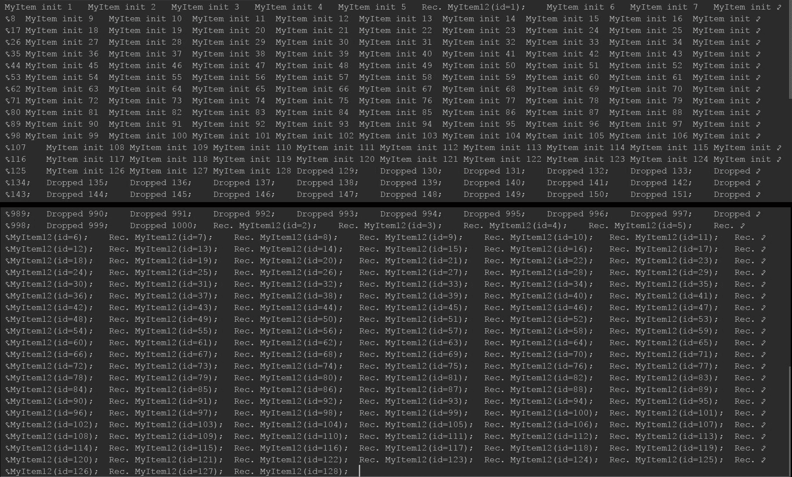

如输出所示，`Flowable`在`128`之后丢弃了排放（因为它有一个用于`128`排放的内部缓冲区）。`onBackpressureDrop`的消费者实例在`Subscriber`实例开始之前就完成了处理。

# `onBackpressureLatest()`操作符

这个操作符的工作方式与`BackpressureStrategy.LATEST`完全相同——当下游忙碌且无法跟上时，它会丢弃所有排放，只保留最新的一个。当下游完成之前的操作后，它将获得它完成之前的最后一个排放。不幸的是，这并不提供任何配置；你可能不需要它。

让我们看看这个代码示例：

```kt
    fun main(args: Array<String>) { 
      val source = Observable.range(1, 1000) 
      source.toFlowable(BackpressureStrategy.MISSING)//(1) 
        .onBackpressureLatest()//(2) 
        .map { MyItem13(it) } 
        .observeOn(Schedulers.io()) 
        .subscribe{ 
          print("-> $it;\t") 
          runBlocking { delay(100) } 
        } 
        runBlocking { delay(600000) } 
    }  
    data class MyItem13 (val id:Int) { 
    init { 
      print("init $id;\t") 
    } 
   } 
```

这里是输出：

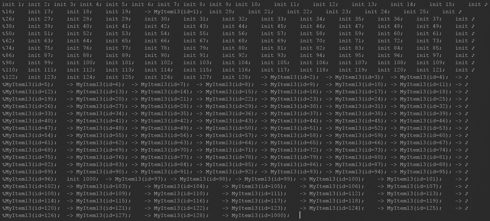

如我们所见，`Flowable` 在 `128` 之后丢弃了所有发射，只保留了最后一个（`1,000`）。

# 在源头处带有背压的生成 Flowable

到目前为止，我们已经学会了使用处理下游背压的标准库。然而，这是否是最优的？是否总是希望在下游无法跟上时缓存和丢弃发射？这两个问题的答案都是简单的“不”。相反，更好的策略是在源头处进行背压。

`Flowable.generate()` 具有完全相同的目的。它与 `Flowable.create()` 有一些相似之处，但有一些区别。让我们看看一个例子，然后我们将尝试理解它是如何工作的，以及 `Flowable.create()` 和 `Flowable.generate()` 之间的区别是什么。

注意使用 `Flowable.fromIterable()`，因为它尊重背压。所以，考虑在可以将源转换为 `Iterator` 的情况下使用 `Flowable.fromIterable()`。仅在你需要更具体的东西时使用 `Flowable.generate()`，因为它要复杂得多。

考虑以下代码：

```kt
    fun main(args: Array<String>) { 
      val flowable = Flowable.generate<Int> { 
        it.onNext(GenerateFlowableItem.item) 
      }//(1) 

      flowable 
        .map { MyItemFlowable(it) } 
        .observeOn(Schedulers.io()) 
        .subscribe { 
          runBlocking { delay(100) } 
          println("Next $it") 
         }//(2) 

         runBlocking { delay(700000) } 
     } 

     data class MyItemFlowable(val id:Int) { 
       init { 
        println("MyItemFlowable Created $id") 
       } 
     } 

     object GenerateFlowableItem {//(3) 
       var item:Int = 0//(4) 
        get() { 
            field+=1 
            return field//(5) 
        } 
    } 
```

在那个程序中，我们使用 `Flowable.generate()` 方法创建了 `Flowable`。与 `Flowable.create()` 不同，在 `Flowable.create()` 中 `Flowable` 发射项目，而 `Subscriber` 接收/等待/缓冲/丢弃它们，`Flowable.generate()` 在请求时生成项目并发射。`Flowable.generate()` 接受一个 lambda 作为源，这看起来与 `Flowable.create` 类似，并且每次请求项目时都会调用它（与 `Flowable.create` 不同）。所以，例如，如果你在 lambda 中调用 `onComplete` 方法，`Flowable` 将只发射一次。此外，你无法在 lambda 中多次调用 `onNext`。如果你调用了 `onError`，那么你将在第一次调用时得到错误。

在这个程序中，我们创建了 `object`，`GenerateFlowableItem`，使用 `var item`；每次你访问它时（使用自定义获取器），`var item` 将自动增加其值。所以，程序应该像 `Flowable.range(1, Int.MAX_VALUE)` 一样工作，除了当项目达到 `Int.MAX_VALUE` 时，而不是调用 `onComplete`，它将再次重复，从 `Int.MIN_VALUE` 开始。

在输出（此处省略，因为它太大）中，`Flowable` 首次发射了 `128` 个项目，然后等待下游处理 `96` 个项目，然后 `Flowable` 再次发射了 `128` 个项目，循环继续。直到你从 `Flowable` 取消订阅或程序执行停止，它将继续发射项目。

# 可连接的 Flowable

到目前为止，在本章中，我们处理了 `Cold Observables`。如果我们想处理热源怎么办？每种类型的 Observable 在 Flowable 中都有对应的类型。在前一章中，我们使用 `ConnectableObservable` 开始了热源，所以让我们从 `ConnectableFlowable` 开始。

与`Observable`类似，`ConnectableFlowable`类似于普通`Flowable`，不同之处在于它不是在订阅时开始发出项目，而是在其`connect()`方法被调用时才发出。这样，你可以在`Flowable`开始发出项目之前等待所有预期的`Subscribers`调用`Flowable.subscribe()`。请参考以下代码：

```kt
    fun main(args: Array<String>) { 
      val connectableFlowable = listOf
      ("String 1","String 2","String   3","String 4",
      "String  5").toFlowable()//(1) 
      .publish()//(2) 
      connectableFlowable. 
       subscribe({ 
         println("Subscription 1: $it") 
         runBlocking { delay(1000) } 
         println("Subscription 1 delay") 
       }) 
       connectableFlowable 
       .subscribe({ println("Subscription 2 $it")}) 
       connectableFlowable.connect() 
     } 
```

我们对上一章中`ConnectableObservable`的第一个例子进行了调整。与`Observable`一样，你可以在`Flowable.fromIterable()`的位置使用`Iterable<T>.toFlowable()`扩展函数。`Flowable.publish()`将普通`Flowable`转换为`ConnectableFlowable`。

在这个例子中，在注释（1）处，我们使用`Iterable<T>.toFlowable()`扩展函数从`List`创建`Flowable`，在注释（2）处，我们使用`Flowable.publish()`运算符从`Flowable`创建`ConnectableFlowable`。

以下为输出结果：

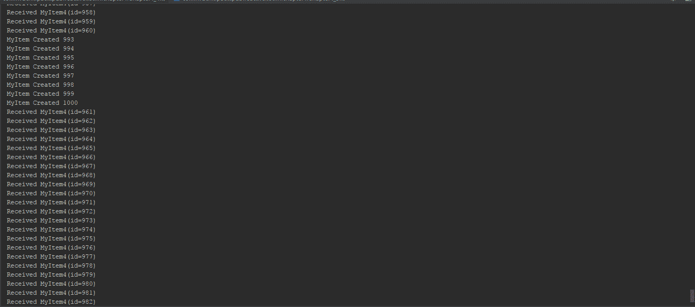

由于我们使用了`Flowable.fromIterable`（`Iterable<T>.toFlowable()`内部调用`Flowable.fromIterable`），它尊重源头的背压，因此我们可以看到`Flowable`等待所有下游完成处理，然后发出下一个项目，这样下游可以以交错的方式工作。

到现在为止，你可能已经在想`Subjects`了。这是一个很好的工具，但与`Observable`一样，`Subjects`也缺乏背压支持。那么，Flowable 中`Subjects`的对立面是什么？

# 处理器

处理器是 Flowable 中`Subjects`的对立面。每种类型的`Subject`都有一个对应的处理器，并支持背压。

在上一章（第三章，*Observables, Observers, and Subjects*），我们开始探索`Subject`，使用`PublishSubject`；因此，让我们在这里也这样做。让我们从`PublishProcessor`开始。

以下是一个`PublishProcessor`的示例：

```kt
    fun main(args: Array<String>) { 
      val flowable = listOf("String 1","String 2","String 3",
      "String 4","String 5").toFlowable()//(1) 

      val processor = PublishProcessor.create<String>()//(2) 

      processor.//(3) 
         subscribe({ 
           println("Subscription 1: $it") 
           runBlocking { delay(1000) } 
           println("Subscription 1 delay") 
         }) 
      processor//(4) 
      .subscribe({ println("Subscription 2 $it")}) 

      flowable.subscribe(processor)//(5) 

    } 
```

因此，在这个例子中，在注释（1）处，我们使用`Iterable<T>.toFlowable()`方法创建了一个`Flowable`。在注释（2）处，我们使用`PublishProcessor.create()`方法创建了一个`processor`实例。在注释（3）和（4）处，我们订阅了`processor`实例，在注释（5）处，我们使用`processor`实例订阅了`Flowable`。

以下为输出结果：

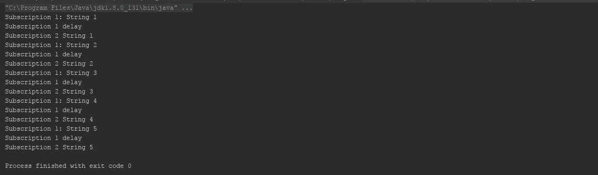

`processor`在推送下一个发射之前正在等待所有其`Subscribers`完成。

# 学习 Buffer、Throttle 和 Window 运算符

到目前为止，我们已经了解了背压。我们减缓了源头的速度，丢弃了项目，或者使用了缓冲区，它将持有项目直到消费者消费它；然而，这些是否足够？在下游处理背压并不是总是好的解决方案，我们也不能总是减缓源头。

当使用 `Observable.interval`/`Flowable.interval` 时，你不能减慢源的速度。一个临时的解决方案可能是某些操作符，它们可以以某种方式允许我们同时处理发射。

有三个操作符可以帮助我们实现这一点：

+   `Buffer`

+   `Throttle`

+   `Window`

# `buffer()` 操作符

与 `onBackPressureBuffer()` 操作符不同，后者缓冲发射直到消费者消费，`buffer()` 操作符将收集发射并将它们作为一批发射，作为列表或其他任何集合类型。

那么，让我们看看这个例子：

```kt
    fun main(args: Array<String>) { 
      val flowable = Flowable.range(1,111)//(1) 
      flowable.buffer(10)//(2) 
        .subscribe { println(it) } 
    } 
```

在注释 `(1)` 上，我们使用 `Flowable.range()` 方法创建了一个 `Flowable` 实例，它发射从 `1` 到 `111` 的整数。在注释 `(2)` 上，我们使用了带有缓冲区大小 `10` 的 `buffer` 操作符，因此 `buffer` 操作符从 `Flowable` 中收集 `10` 项并将它们作为列表发射。

以下为输出结果，它满足了理解的需求：

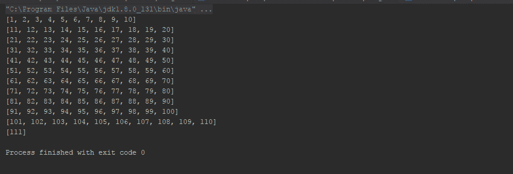

`buffer` 操作符有相当好的配置选项，例如 `skip` 参数。

它接受一个整数参数作为 `skip` 计数。它以一种非常有趣的方式工作。如果 `skip` 参数的值与 `count` 参数的值完全相同，那么它将不执行任何操作。否则，它将首先计算 `count` 和 `skip` 参数之间的正差值作为 `actual_numbers_to_skip`，然后，如果 `skip` 参数的值大于 `count` 参数的值，它将在每个发射的最后一项之后跳过 `actual_numbers_to_skip` 项。否则，如果 `count` 参数的值大于 `skip` 参数的值，你将得到滚动缓冲区，也就是说，不是跳过项，而是跳过之前发射的计数。

感到困惑？让我们看看这个例子来澄清：

```kt
    fun main(args: Array<String>) { 
      val flowable = Flowable.range(1,111) 
      flowable.buffer(10,15)//(1) 
       .subscribe { println("Subscription 1 $it") } 

      flowable.buffer(15,7)//(2) 
       .subscribe { println("Subscription 2 $it") } 
   } 
```

在注释 `(1)` 上，我们使用了带有计数 `10`、跳过 `15` 的 `buffer`。在注释 `(2)` 上，我们将其用作第二次订阅的 `count 15`、`skip 8`。以下为输出结果：

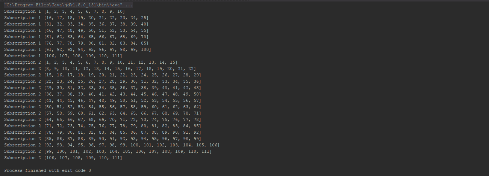

对于第一次订阅，它在每次订阅后跳过了 `5` 项（`15`-`10`）。然而，对于第二次订阅，它从每个发射的 `8`^(th) 项开始重复项（`15`-`7`）。

如果前面使用的 `buffer` 操作符不足以满足你的需求，那么让我告诉你，`buffer` 操作符还允许你进行基于时间的缓冲。简单来说，它可以收集来自源的发射并在时间间隔内发射。有趣吧？让我们来探索一下：

```kt
    fun main(args: Array<String>) { 
      val flowable = Flowable.interval(100, TimeUnit.MILLISECONDS)//(1) 
      flowable.buffer(1,TimeUnit.SECONDS)//(2) 
       .subscribe { println(it) } 

      runBlocking { delay(5, TimeUnit.SECONDS) }//(3) 
   } 
```

为了更好地理解，我们在本例中使用了 `Flowable.interval` 来创建一个在注释 `(1)` 上的 `Flowable` 实例。在注释 `(2)` 上，我们使用了 `buffer(timespan:Long, unit:TimeUnit)` 重载来指示操作符缓冲所有发射并在一秒后将它们作为列表发射。

这是输出结果：

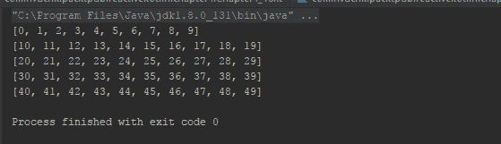

正如你在示例中看到的，每次排放都包含 `10` 个项目，因为 `Flowable.interval()` 每 `100` 毫秒发射一个，而 `buffer` 在一秒的时间框架内收集排放（1 秒 = 1000 毫秒，100 毫秒间隔的排放会在一秒内产生 10 次排放）。

缓冲操作符的另一个令人兴奋的特性是它可以接受另一个生产者作为边界，也就是说，`buffer` 操作符将收集源生产者在边界生产者两次排放之间的所有排放，并在每个边界生产者的排放时发出列表。

这里有一个例子：

```kt
    fun main(args: Array<String>) { 
      val boundaryFlowable = Flowable.interval(350, TimeUnit.MILLISECONDS) 

      val flowable = Flowable.interval(100, TimeUnit.MILLISECONDS)//(1) 
      flowable.buffer(boundaryFlowable)//(2) 
       .subscribe { println(it) } 

      runBlocking { delay(5, TimeUnit.SECONDS) }//(3) 

    } 
```

以下就是输出结果：

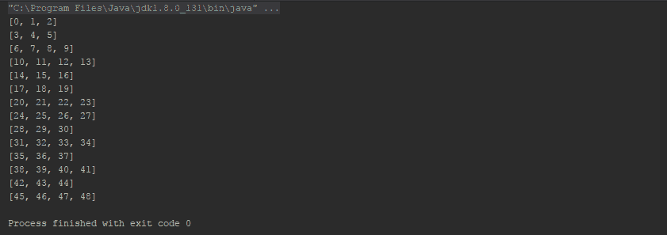

`buffer` 操作符在 `boundaryFlowable` 发射时发出一个收集到的列表。

# `window()` 操作符

`window()` 操作符几乎以相同的方式工作，除了它不是在 `Collection` 对象中缓冲项目，而是在另一个生产者中缓冲项目。

这里有一个例子：

```kt
    fun main(args: Array<String>) { 
      val flowable = Flowable.range(1,111)//(1) 
      flowable.window(10) 
        .subscribe { 
          flo->flo.subscribe {//(2) 
            print("$it, ") 
          } 
          println() 
       } 
    } 
```

在我们尝试理解它之前，让我们先看看输出结果，如下所示：

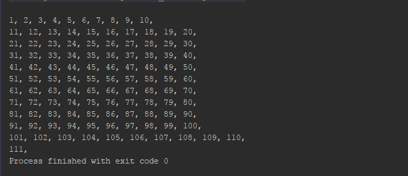

`window` 操作符在一个新的 `Flowable` 实例中缓冲 `10` 次排放，我们将在 `flowable.subscribe` lambda 中再次订阅它，并以逗号作为后缀打印它们。

`window` 操作符也具有与 `buffer` 操作符的其他重载相同的函数功能。

# `throttle()` 操作符

`buffer()` 和 `window()` 操作符收集排放。`throttle` 操作符省略排放。我们将在后面的章节中更详细地讨论它，但现在我们先看看：

```kt
    fun main(args: Array<String>) { 
      val flowable = Flowable.interval(100, TimeUnit.MILLISECONDS)//(1) 
      flowable.throttleFirst(200,TimeUnit.MILLISECONDS)//(2) 
        .subscribe { println(it) } 

      runBlocking { delay(1,TimeUnit.SECONDS) } 
    } 
```

这是输出结果：

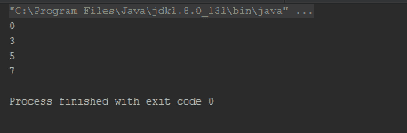

`throttleFirst` 跳过了每 `200` 毫秒内的第一次排放。

此外还有 `throttleLast` 和 `throttleWithTimeout` 操作符。

# 摘要

在本章中，我们学习了背压。我们学习了如何支持背压以及 `Flowables` 和 `processors`。我们还学习了如何从消费者和生产者那里支持背压。

尽管我们在处理实时项目时对生产者有了更多的了解，但我们还需要进行异步操作。在下一章中，我们将专注于同样的事情。我们将学习异步数据操作，并且我们将更多地了解我们已经在使用的 `map` 操作符。

好奇吗？现在就翻到 第五章，*异步数据操作符和转换*。
