# 第五章：异步数据操作符和转换

通过前面的章节，我们强烈掌握了生产者（Observable 和 Flowable）和消费者（Observer 和 Subscriber）。在学习它们的过程中，我们大量使用了`map`方法。如前所述，`map`方法实际上是一个 Rx-Operator。RxKotlin 中也有许多操作符。我可以猜到你从第一次使用`map`操作符时就有了一个迫切的问题。为什么它看起来像方法，我们却称之为操作符？好吧，在本章中，我们首先将尝试通过定义 RxKotlin 操作符来回答这个问题。然后我们将更深入地了解各种操作符及其实现。借助操作符，我们将高效且轻松地转换、累积、映射、分组和过滤我们的数据。

# 操作符

当我们第一次开始编程时，我们学习了操作符。我们了解到操作符是那些在操作数上执行特定任务并返回最终结果的特殊字符/字符序列。在响应式世界中，定义保持基本相同；它们接受一个或多个 Observable/Flowable 作为操作数，转换它们，并返回结果 Observable/Flowable。

操作符就像消费者一样作用于前面的 Observable/Flowable，监听它们的发射，转换它们，并将它们发射到下游消费者。例如，考虑`map`操作符，它监听上游生产者，对其发射执行一些操作，然后将修改后的项目发射到下游。

操作符帮助我们利用和表达业务逻辑和行为。RxKotlin 中有许多操作符可用。在本书中，我们将全面介绍各种类型的操作符，以便你知道何时使用哪个操作符。

记住，为了在应用程序中实现业务逻辑和行为，你应该使用操作符而不是编写阻塞代码或混合命令式编程与响应式编程。通过保持算法和过程纯粹响应式，你可以轻松利用较低的内存使用、灵活的并发性和可处置性，这些在混合响应式编程与命令式编程时可能会减少或无法实现。

这些是五种类型的操作符：

+   `过滤`/`抑制`操作符

+   转换操作符

+   减少操作符

+   集合操作符

+   错误处理操作符

+   工具操作符

因此，现在，让我们更仔细地看看它们。

# 过滤/抑制操作符

想象一下，当你想接收生产者的一些发射，但想丢弃其余的。可能有一些逻辑来决定合格的发射，或者你可能甚至希望批量丢弃。`过滤`/`抑制`操作符就是为了在这些情况下帮助你。

这里是一个简短的`过滤`/`抑制`操作符列表：

+   `debounce`

+   `distinct`和`distinctUntilChanged`

+   `elementAt`

+   `Filter`

+   `first`和`last`

+   `ignoreElements`

+   `skip`, `skipLast`, `skipUntil`, 和 `skipWhile`

+   `take`, `takeLast`, `takeUntil`, 和 `takeWhile`

让我们现在更仔细地看看所有这些操作符。

# `debounce`操作符

想象一下，你正在快速接收发射，并且愿意在等待一段时间以确保之后采取最后一个发射。

在开发应用程序的 UI/UX 时，我们经常会遇到这样的情况。例如，你已经创建了一个文本输入框，并希望在用户输入某些内容时执行某些操作，但你不想在每次按键时都执行这个操作。你希望等待用户停止输入（这样你就能得到一个与用户实际想要匹配的好查询），然后将它发送到下游操作员。`debounce`操作符正是为此目的而设计的。

为了简化，我们在这里不会使用任何平台上的 UI/UX 代码（我们将在学习如何在 Android 中实现 RxKotlin 的后续章节中尝试）。相反，我们将尝试使用`Observable.create`方法来模拟这种情况（如果您对`Observable.create`方法有任何疑问，请在阅读本节之前快速翻到第三章，*Observables, Observers, and Subjects*）。请参考以下代码：

```kt
    fun main(args: Array<String>) { 
      createObservable()//(1) 
        .debounce(200, TimeUnit.MILLISECONDS)//(2) 
        .subscribe { 
           println(it)//(3) 
         } 
    } 

    inline fun createObservable():Observable<String> = 
    Observable.create<String> { 
      it.onNext("R")//(4) 
      runBlocking { delay(100) }//(5) 
      it.onNext("Re") 
      it.onNext("Reac") 
      runBlocking { delay(130) } 
      it.onNext("Reactiv") 
      runBlocking { delay(140) } 
      it.onNext("Reactive") 
      runBlocking { delay(250) }//(6) 
      it.onNext("Reactive P") 
      runBlocking { delay(130) } 
      it.onNext("Reactive Pro") 
      runBlocking { delay(100) } 
      it.onNext("Reactive Progra") 
      runBlocking { delay(100) } 
      it.onNext("Reactive Programming") 
      runBlocking { delay(300) } 
      it.onNext("Reactive Programming in") 
      runBlocking { delay(100) } 
      it.onNext("Reactive Programming in Ko") 
      runBlocking { delay(150) } 
      it.onNext("Reactive Programming in Kotlin") 
      runBlocking { delay(250) } 
      it.onComplete() 
    } 
```

在这个程序中，我们试图通过将 Observable 的创建导出到另一个函数（`createObservable()`）来保持`main`函数的简洁，以帮助您更好地理解。在注释`(1)`中，我们调用了`createObservable()`函数来创建一个`Observable`实例。

在`createObservable()`函数内部，我们试图通过以间隔发射一系列递增的`Strings`来模拟用户的输入行为，直到达到最终版本（`Kotlin 中的响应式编程`）。我们在完成每个单词后提供了更大的间隔，以描绘理想用户的行为。

在注释`(2)`中，我们使用了`debounce()`操作符，参数为`200`和`TimeUnit.MILLISECONDS`，这将使下游在每次发射后等待`200`毫秒，并且只有在之间没有其他发射发生时才接收发射。

输出如下：

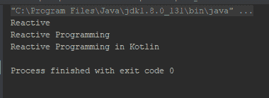

观察者只接收了三个发射，之后 Observable 至少等待了`200`毫秒才发射下一个。

# 独特的操作符 - `distinct`, `distinctUntilChanged`

这个操作符非常简单；它帮助您从上游过滤掉重复的发射。请看以下示例以更好地理解：

```kt
    fun main(args: Array<String>) { 
      listOf(1,2,2,3,4,5,5,5,6,7,8,9,3,10)//(1) 
        .toObservable()//(2) 
        .distinct()//(3) 
        .subscribe { println("Received $it") }//(4) 
   } 
```

在注释`(1)`中，我们创建了一个包含许多重复值的`Int`列表。在注释`(2)`中，我们使用`toObservable()`方法从这个列表创建了一个`Observable`实例。在注释`(3)`中，我们使用了`distinct`操作符来过滤掉所有重复的发射。

下面是输出：

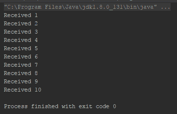

`distinct`操作符的作用是记住所有已经发生的发射，并过滤掉未来的任何此类发射。

`distinctUntilChange` 操作符略有不同。它不会丢弃所有重复的输出，只会丢弃连续重复的输出，其余的保持原位。请参考以下代码：

```kt
    fun main(args: Array<String>) { 
      listOf(1,2,2,3,4,5,5,5,6,7,8,9,3,10)//(1) 
        .toObservable()//(2) 
        .distinctUntilChanged()//(3) 
        .subscribe { println("Received $it") }//(4) 
    } 
```

这里是输出：

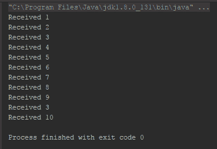

仔细观察输出；项目 `3` 被打印了两次，第二次在 `9` 之后。`distinct` 操作符会记住每个项目直到它收到 `onComplete`，但 `distinctUntilChanged` 操作符只会记住它们直到收到新的项目。

# `elementAt` 操作符

使用命令式编程，我们能够访问任何数组/列表的 *n^(th)* 元素，这是一个相当常见的需求。`elementAt` 操作符在这方面非常有用；它从生产者那里拉取 *n^(th)* 元素，并将其作为它自己的唯一输出。

看看以下代码片段：

```kt
    fun main(args: Array<String>) { 
      val observable = listOf(10,1,2,5,8,6,9) 
        .toObservable() 

      observable.elementAt(5)//(1) 
        .subscribe { println("Received $it") } 

      observable.elementAt(50)//(2) 
        .subscribe { println("Received $it") } 
    } 
```

在我们继续检查代码之前，先看看以下输出：

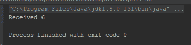

在注释 `(1)` 中，我们从 `Observable` 中请求了第 `5`^(th) 个元素，并输出了相同的（计数从零开始）。然而，在注释 `(2)` 中，我们请求了第 `50`^(th) 个元素，这在 `Observable` 中甚至不存在，所以它没有输出任何内容。

这个操作符通过使用稍后将要介绍的 `Maybe` monad 来实现这种行为。

# 过滤输出 - 过滤操作符

`filter` 操作符可以说是最常用的 `filtering`/`suppressing` 操作符。它允许你实现自定义逻辑来过滤输出。

以下代码片段是 `filter` 操作符的最简单实现：

```kt
    fun main(args: Array<String>) { 
      Observable.range(1,20)//(1) 
        .filter{//(2) 
          it%2==0 
     }
      .subscribe { 
         println("Received $it")  
      } 
   }
```

在注释 `(1)` 中，我们使用 `Observable.range()` 操作符创建了一个 `Observable` 实例。我们使用注释 `(2)` 中的 `filter` 操作符过滤掉了输出中的奇数。

以下是输出：

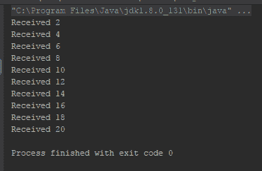

# 第一个和最后一个操作符

这些操作符可以帮助你只监听第一个或最后一个输出，并丢弃其余的。

查看以下示例：

```kt
    fun main(args: Array<String>) { 
      val observable = Observable.range(1,10) 
      observable.first(2)//(1) 
       .subscribeBy { item -> println("Received $item") } 

      observable.last(2)//(2) 
       .subscribeBy { item -> println("Received $item") } 

      Observable.empty<Int>().first(2)//(3) 
       .subscribeBy { item -> println("Received $item") } 
    }
```

输出如下：

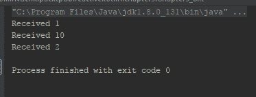

在注释 `(1)` 中，我们使用了 `first` 操作符，并将 `defaultValue` 参数设置为 `2`，这样如果无法访问第一个元素，它将输出 `defaultValue` 参数。在注释 `(2)` 中，我们使用了 `last` 操作符。在注释 `(3)` 中，我们再次使用了 `first` 操作符，这次使用了一个空的 `Observable`；因此，它不会输出第一个元素，而是输出 `defaultValue`。

# 忽略元素操作符

有时候，你可能只需要监听生产者的 `onComplete`。`ignoreElements` 操作符可以帮助你做到这一点。请参考以下代码：

```kt
    fun main(args: Array<String>) { 
      val observable = Observable.range(1,10) 
      observable 
        .ignoreElements() 
        .subscribe { println("Completed") }//(1) 
    } 
```

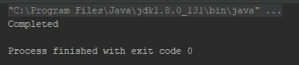

`ignoreElements` 操作符返回一个只有 `onComplete` 事件的 Completable monad。

我们将在第六章“更多关于操作符和错误处理”中探讨`skip`和`take`操作符，同时讨论条件操作符。

# 转换操作符

如其名所示，`transforming`操作符可以帮助你转换由生产者发出的项目。

这里是`transforming`操作符的简要列表：

+   `map`

+   `flatMap`, `concatMap`, 和 `flatMapIterable`

+   `switchMap`

+   `switchIfEmpty`

+   `scan`

+   `groupBy`

+   `startWith`

+   `defaultIfEmpty`

+   `sorted`

+   `buffer`

+   `window`

+   `cast`

+   `delay`

+   `repeat`

# 平铺操作符

`map`操作符对每个输出的项目执行一个给定的任务（lambda）并将它们输出到下游。我们已经看到了`map`操作符的一些用法。对于给定的`Observable<T>`或`Flowable<T>`，`map`操作符将通过应用提供的`Function<T,R>` lambda 将类型为`T`的输出项转换为类型为`R`的输出。

因此，现在，让我们通过`map`操作符来看另一个例子：

```kt
    fun main(args: Array<String>) { 
      val observable = listOf(10,9,8,7,6,5,4,3,2,1).toObservable() 
      observable.map {//(1) 
        number-> "Transforming Int to String $number" 
      }.subscribe { 
        item-> println("Received $item") 
      } 
    }
```

在注释（1）中，我们使用了`map`操作符，它将输出的类型为`Int`的项目转换为类型为`String`的输出。尽管我们清楚地知道输出会是什么样子，但让我们通过查看以下截图来验证这一点：

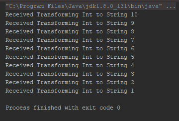

# 类型转换输出（`cast`操作符）

想象一个你想将 Observable 的输出转换为其他数据类型的情况。仅仅为了转换输出而传递一个 lambda 似乎不是一个好主意。`cast`操作符就是为了在这种情况下提供帮助。让我们看看：

```kt
    fun main(args: Array<String>) { 
      val list = listOf<MyItemInherit>( 
         MyItemInherit(1), 
         MyItemInherit(2), 
         MyItemInherit(3), 
         MyItemInherit(4), 
         MyItemInherit(5), 
         MyItemInherit(6), 
         MyItemInherit(7), 
         MyItemInherit(8), 
         MyItemInherit(9), 
         MyItemInherit(10) 
       )//(1) 

       list.toObservable()//(2) 
         .map { it as MyItem }//(3) 
         .subscribe { 
             println(it) 
         } 

        println("cast") 

        list.toObservable() 
            .cast(MyItem::class.java)//(4) 
            .subscribe { 
                println(it) 
            } 
      } 

      open class MyItem(val id:Int) {//(5) 
      override fun toString(): String { 
        return "[MyItem $id]" 
      } 
     } 

    class MyItemInherit(id:Int):MyItem(id) {//(6) 
      override fun toString(): String { 
        return "[MyItemInherit $id]" 
      } 
    } 
```

在这个程序中，我们在注释（5）和（6）分别定义了两个类：`MyItem`和`MyItemInherit`。我们将使用这两个类来展示`cast`操作符的用法。因此，在注释（1）中，我们创建了一个`MyItemInherit`列表；对于这个程序，我们的方法首先使用`map`操作符尝试相同的事情，然后我们将使用`cast`操作符做同样的事情。在注释（2）中，我们使用列表创建了一个可观察对象，然后在注释（3）中，我们使用了`map`操作符并传递了一个 lambda，其中我们将输出类型转换为`MyItemInherit`。

我们在注释（4）中做了同样的事情，但这次使用的是`cast`操作符。现在看看代码的简洁性，它看起来干净得多，简单得多。

# 平铺操作符

当`map`操作符对每个输出项执行给定任务（lambda）并将它们输出到下游时，`flatMap`操作符会创建一个新的生产者，将你传递给每个源生产者输出的函数应用于每个输出。

因此，让我们看看这个例子：

```kt
    fun main(args: Array<String>) { 
      val observable = listOf(10,9,8,7,6,5,4,3,2,1).toObservable() 
      observable.flatMap { 
        number-> Observable.just("Transforming Int to String $number") 
      }.subscribe { 
        item-> println("Received $item") 
      } 
   } 
```

这里是输出结果：

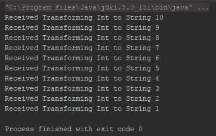

输出与上一个类似，但逻辑不同。我们不仅返回`String`，还返回具有所需`String`的`Observable`。尽管在这个例子中，你可能觉得使用它没有好处，但考虑一下你需要从单个发射中推导出多个项目的情况。考虑以下示例，我们将从每个发射中创建多个项目：

```kt
    fun main(args: Array<String>) { 
      val observable = listOf(10,9,8,7,6,5,4,3,2,1).toObservable() 
      observable.flatMap { 
        number-> 
        Observable.create<String> {//(1) 
          it.onNext("The Number $number") 
          it.onNext("number/2 ${number/2}") 
          it.onNext("number%2 ${number%2}") 
          it.onComplete()//(2) 
        } 
      }.subscribeBy ( 
         onNext = { 
            item-> println("Received $item") 
         }, 
         onComplete = { 
            println("Complete") 
         } 
       ) 
    }   
```

让我们看看输出，然后我们尝试理解程序：

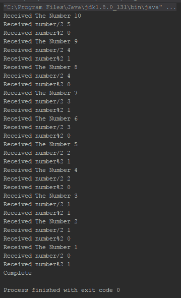

在这个程序中，我们在`flatMap`运算符内部创建了一个新的`Observable`实例，它将发射三个字符串。在注释（1）中，我们使用`Observable.create`运算符创建了`Observable`实例。我们将从`Observable.create`运算符发射三个字符串，并在注释（2）中，在从`Observable`发射三个项目后发送一个`onComplete`通知。

然而，看看输出；它在发送`onComplete`通知之前发射了所有项目。原因是所有`Observable`都被组合在一起，然后订阅到下游。`flatMap`运算符内部使用`merge`运算符来组合多个`Observable`。

`concatMap`使用`concat`运算符而不是`merge`运算符来执行相同的操作，以组合两个`Observable`/`Flowables`。

我们将在下一章中了解更多关于这些运算符（`merge`、`concat`和其他组合运算符）的信息。

我们将再次查看`flatMap`，以及`concatMap`、`switchMap`和`flatMapIterable`，在第六章，*更多关于运算符和错误处理*之后，我们将对合并和连接生产者有一些了解。

# defaultIfEmpty 运算符

当使用过滤运算符和/或处理复杂需求时，可能会遇到空的生产者（见以下代码块）：

```kt
    fun main(args: Array<String>) { 
      Observable.range(0,10)//(1) 
       .filter{it>15}//(2) 
       .subscribe({ 
         println("Received $it") 
      }) 
    } 
```

在这里，在注释（1）中，我们将创建范围从`0`到`10`的`Observable`；然而，在注释（2）中，我们将过滤它以发射值`>15`。所以，基本上，我们将得到一个空的`Observable`。

`defaultIfEmpty`运算符帮助我们处理这种情况。带有`defaultIfEmpty`的前一个例子看起来像这样：

```kt
    fun main(args: Array<String>) { 
      Observable.range(0,10)//(1) 
       .filter{it>15}//(2) 
       .defaultIfEmpty(15)//(3) 
       .subscribe({ 
           println("Received $it") 
        }) 
    } 
```

这是相同的程序，但在注释（3）中，我们添加了`defaultIfEmpty`运算符。

输出看起来如下截图：

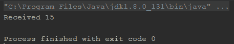

输出显示，尽管`Observable`不包含任何大于`10`的数字，但`defaultIfEmpty`在过滤后为空时向`Observable`添加了`15`。

# switchIfEmpty 运算符

此运算符类似于`defaultIfEmpty`运算符；唯一的区别是，对于`defaultIfEmpty`运算符，它向空的生产者添加一个发射项，但对于`switchIfEmpty`运算符，如果源生产者是空的，它将从指定的替代生产者开始发射。

与需要传递一个项目的`defaultIfEmpty`操作符不同，在这里，你必须将一个替代生产者传递给`switchIfEmpty`操作符。如果源生产者为空，它将从替代生产者开始取排放。

下面是一个例子：

```kt
    fun main(args: Array<String>) { 
      Observable.range(0,10)//(1) 
        .filter{it>15}//(2) 
        .switchIfEmpty(Observable.range(11,10))//(3) 
        .subscribe({ 
            println("Received $it") 
        }) 
    } 
```

这与上一个例子相同；只是在注释（3）中，我们使用了`switchIfEmpty`而不是`defaultIfEmpty`与一个替代的`Observable`。下面的输出显示，排放是从使用`switchIfEmpty`操作符传递的替代`Observable`中取出的：

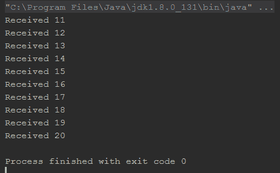

# `startWith`操作符

`startWith`操作符很简单；它允许你将一个项目添加到生产者的顶部，所有现有的项目之上。

让我们看看它是如何工作的：

```kt
    fun main(args: Array<String>) { 
      Observable.range(0,10)//(1) 
        .startWith(-1)//(2) 
        .subscribe({ 
           println("Received $it") 
        }) 

        listOf("C","C++","Java","Kotlin","Scala","Groovy")//(3) 
          .toObservable() 
          .startWith("Programming Languages")//(4) 
          .subscribe({ 
            println("Received $it") 
          }) 
    }
```

输出如下：

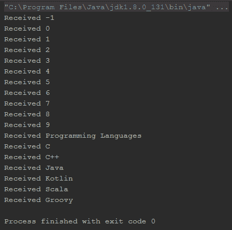

如我们所见，注释（2）和（4）中的`startWith`操作符就像现有排放列表的前缀一样工作。

# 排放排序（sorted 操作符）

有一些场景下，你可能想要对排放进行排序。`sorted`操作符可以帮助你做到这一点。它将在排序后内部收集并重新排放来自源生产者的所有排放。

让我们看看这个例子，并尝试更好地理解这个操作符：

```kt
     fun main(args: Array<String>) { 
       println("default with integer") 
       listOf(2,6,7,1,3,4,5,8,10,9) 
         .toObservable() 
         .sorted()//(1) 
         .subscribe { println("Received $it") } 

      println("default with String") 
      listOf("alpha","gamma","beta","theta") 
         .toObservable() 
         .sorted()//(2) 
         .subscribe { println("Received $it") } 

      println("custom sortFunction with integer") 
      listOf(2,6,7,1,3,4,5,8,10,9) 
         .toObservable() 
         .sorted { item1, item2 -> if(item1>item2) -1 else 1 }//(3) 
         .subscribe { println("Received $it") } 

      println("custom sortFunction with custom class-object") 
      listOf(MyItem1(2),MyItem1(6), 
         MyItem1(7),MyItem1(1),MyItem1(3), 
         MyItem1(4),MyItem1(5),MyItem1(8), 
         MyItem1(10),MyItem1(9)) 
        .toObservable() 
        .sorted { item1, item2 -> 
        if(item1.item<item2.item) -1 else 1 }//(4) 
        .subscribe { println("Received $it") } 
     } 

    data class MyItem1(val item:Int)
```

首先看看输出，然后我们将探索程序：

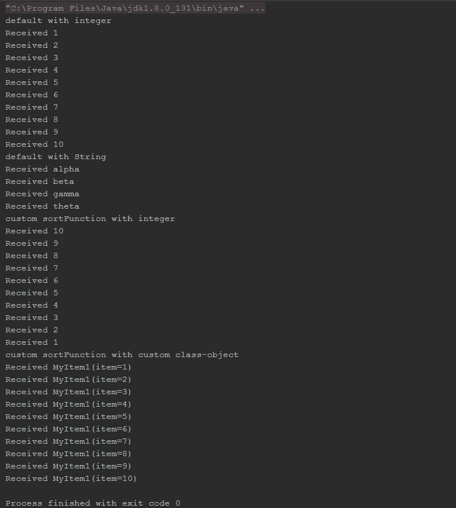

现在，让我们来探索这个程序。正如我们已经知道的，`sorted`操作符有助于排序排放；为了排序，我们需要比较，因此，`sorted`操作符需要一个`Comparable`实例来比较排放项并分别排序。这个操作符有两个重载版本，一个没有参数——它假设生产者（这里为`Observable`）类型将实现`Comparable`并调用`compareTo`函数，如果没有实现将生成错误；另一个重载版本是带有比较方法的（lambda）。在注释（1）和（2）中，我们使用默认的`sort`函数实现了`sorted`操作符，即它会调用项目实例的`compareTo`函数，如果数据类型没有实现`Comparable`将抛出错误。

在注释（3）中，我们使用我们自己的自定义`sortFunction`以降序对整数进行排序。

在注释（4）中，我们使用了一个类型为`MyItem1`的`Observable`，这显然是一个自定义类，没有实现`Comparable`，因此我们在这里也传递了`sortFunction` lambda。

**注意**：正如我们已经提到的，`sorted`操作符收集所有排放并排序后再以排序顺序重新排放；因此，使用此操作符可能会引起重大的性能影响。此外，在使用大型生产者时，它还可能导致`OutOfMemory Error`。所以，谨慎使用排序操作符，或者除非有广泛的需求，否则尽量避免使用。

# 累积数据 – scan 操作符

`scan`操作符是一个滚动聚合器；它通过将先前排放添加到其中来发出增量累积。

在深入探讨之前，让我们先看看以下例子：

```kt
    fun main(args: Array<String>) { 
      Observable.range(1,10) 
      .scan { previousAccumulation, newEmission ->
       previousAccumulation+newEmission }//(1) 
      .subscribe { println("Received $it") } 

      listOf("String 1","String 2", "String 3", "String 4") 
       .toObservable() 
       .scan{ previousAccumulation, newEmission -> 
        previousAccumulation+" "+newEmission }//(2) 
       .subscribe { println("Received $it") } 

       Observable.range(1,5) 
       .scan { previousAccumulation, newEmission -> 
        previousAccumulation*10+newEmission }//(3) 
        .subscribe { println("Received $it") } 
      } 
```

输出如下：

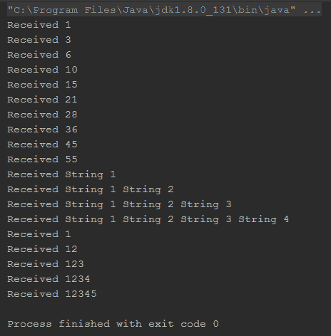

因此，在这个程序中，我们使用了`scan`操作符来实现三种类型的操作，我们将在详细讨论之前，首先尝试理解`scan`操作符本身。它接受一个带有两个参数的 lambda 表达式。第一个参数是所有先前排放的滚动聚合结果；第二个是当前排放。

以下图表将帮助您更好地理解：

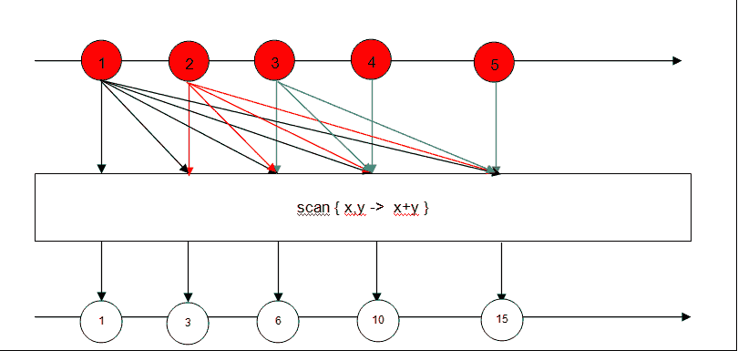

如图表所示，`scan`操作符将根据提供的累积函数将所有先前排放与当前排放累积起来。

因此，在先前的程序中，在注释`(1)`处，我们使用了`scan`操作符，正如图表中描述的那样。我们使用它来获取到目前为止发出的所有`整数`的总和。在注释`(2)`处，我们使用它与`Observable`类型的`String`一起，得到了连接的字符串。

在注释`(3)`处，我们使用了`scan`操作符通过将前一次累积乘以`10`并加上当前排放来连接`整数`。

有一个需要注意的事情是，只要返回相同的数据类型项，我们就可以使用`scan`操作符进行几乎任何操作，而不仅仅是求和。

注意，`scan`操作符与即将在本章中介绍的`reduce`操作符有相似之处；然而，请谨慎不要混淆。`scan`操作符是一个滚动聚合器，它将接收到的所有排放转换为累积；而`reduce`操作符在接收到`onComplete`通知后，通过累积所有排放将排放减少到只有一个。

# 减少操作符

在开发应用程序时，您可能会遇到需要累积和合并排放的情况。请注意，几乎符合这一标准的所有操作符都只会在调用`onComplete()`的有限生产者（Observable/Flowable）上工作，因为通常我们只能合并有限的数据集。我们将随着对这些操作符的介绍来探索这一行为。

这里有一个简短的减少操作符列表，我们将在本章中介绍：

+   `count`

+   `reduce`

+   `all`

+   `any`

+   `contains`

# 计算排放（计数操作符）

`count`操作符订阅一个生产者，计算排放量，并在生产者发出排放量的计数后发出一个`Single`。

这里有一个例子：

```kt
    fun main(args: Array<String>) { 
      listOf(1,5,9,7,6,4,3,2,4,6,9).toObservable() 
      .count() 
      .subscribeBy { println("count $it") } 
    } 
```

以下为输出：

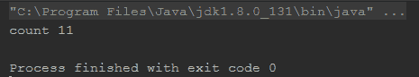

从输出中我们可以看到，这个操作符计算生产者的排放量，并在接收到`onComplete`通知后发出计数。

# 累积排放 - 减法操作符

减少（reduce）是一个完美的累积操作符。它累积生产者的所有排放，并在接收到生产者的`onComplete`通知后发出它们。

这里有一个例子：

```kt
    fun main(args: Array<String>) { 
      Observable.range(1,10) 
      .reduce { previousAccumulation, newEmission -> 
       previousAccumulation+newEmission  } 
      .subscribeBy { println("accumulation $it") } 

       Observable.range(1,5) 
       .reduce { previousAccumulation, newEmission -> 
        previousAccumulation*10+newEmission  } 
       .subscribeBy { println("accumulation $it") } 
      } 
```

输出如下所示：

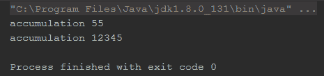

`reduce`操作符的工作方式与`scan`操作符类似，唯一的区别是它不是在每次发射时累积并发射，而是在接收到`onComplete`通知时累积所有发射并发射。

`all`和`any`操作符帮助验证生产者的发射；我们将在下一章中探讨它们。

# `collection`操作符

虽然这不是一个好的实践，但考虑到一些罕见的情况，RxKotlin 为你提供了可以监听所有发射并将它们累积到集合对象的操作符。

`collection`操作符基本上是减少操作符的一个子集。

以下列表包含最重要的`collection`操作符：

+   `toList`和`toSortedList`

+   `toMap`

+   `toMultiMap`

+   `collect`

我们将在本书的后面部分详细讲解`collection`操作符。

# 错误处理操作符

我们已经学习了 Subscriber/Observer 中的`onError`事件。然而，`onError`事件的问题在于错误被发射到下游消费者链，并且订阅立即终止。例如，看看以下程序：

```kt
    fun main(args: Array<String>) { 
      Observable.just(1,2,3,5,6,7,"Errr",8,9,10) 
       .map { it.toIntOrError() } 
       .subscribeBy ( 
           onNext = { 
              println("Next $it") 
           }, 
           onError = { 
              println("Error $it") 
           } 
        ) 
     } 
```

程序的输出显示在以下屏幕截图：

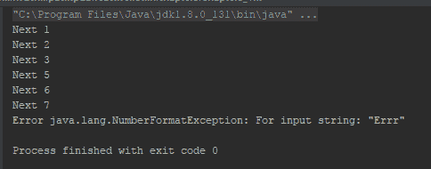

当 Observable 发出字符串**Errr**时，程序在`map`操作符中抛出异常。异常被`onError`处理器捕获，但订阅没有获得任何进一步的发射。

这可能不是每次都期望的行为。虽然我们不能假装错误从未发生并继续（我们也不应该这样做），但应该至少有重新订阅或切换到备用源生产者的方法。

错误处理操作符可以帮助你实现同样的效果。

以下是一些错误处理操作符。

+   `onErrorResumeNext( )`

+   `onErrorReturn( )`

+   `onExceptionResumeNext( )`

+   `retry( )`

+   `retryWhen( )`

我们将在第六章详细讲解错误处理操作符，*更多关于操作符和错误处理*。

# 工具操作符

这些操作符帮助我们执行各种工具操作，例如对发射执行某些操作，记住每个发射项的时间戳，缓存等等。

以下列出了工具操作符：

+   `doOnNext`、`doOnComplete`和`doOnError`

+   `doOnSubscribe`、`doOnDispose`和`doOnSuccess`

+   `serialize`

+   `cache`

我们将在下一章中详细讲解工具操作符。

# 概述

在本章中，我们学习了操作符和可用的操作符类型，我们详细学习了操作符，特别是那些用于转换、过滤和累积源生产者发射的操作符。我们还学习了错误处理操作符的必要性，我们将在下一章中介绍。

本章和下一章，即第六章“更多关于操作符和错误处理”，密切相关；在讨论本章主题时，我们对下一章的内容有了大致的了解。在下一章中，我们也将参考并使用本章学到的内容。

在本章中，我们专注于操作符、操作符类型以及特别适用于过滤、转换和累积排放（即数据）的操作符（也称为数据）的基础知识，而在下一章中，我们将介绍用于组合可观察的/流动的、错误处理以及条件目的的操作符。

立即翻到下一页开始吧。
