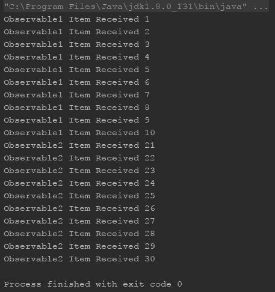
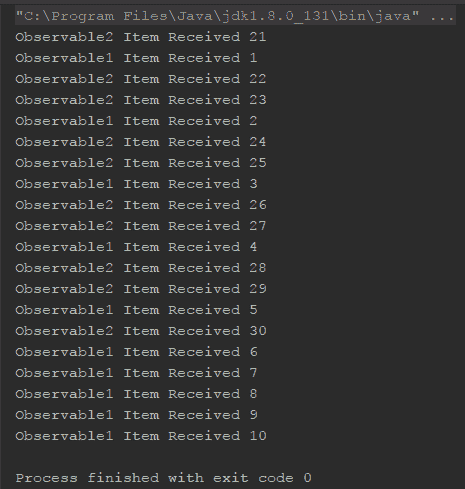
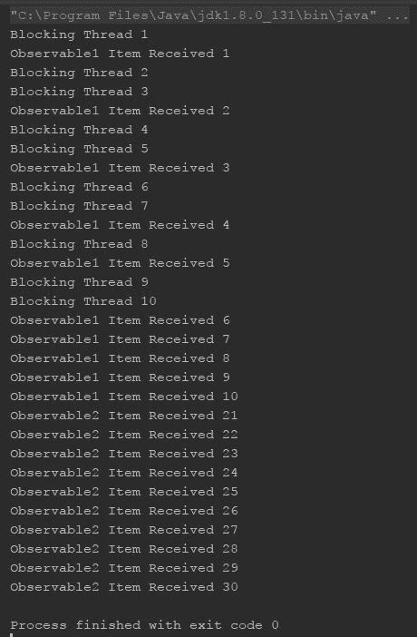
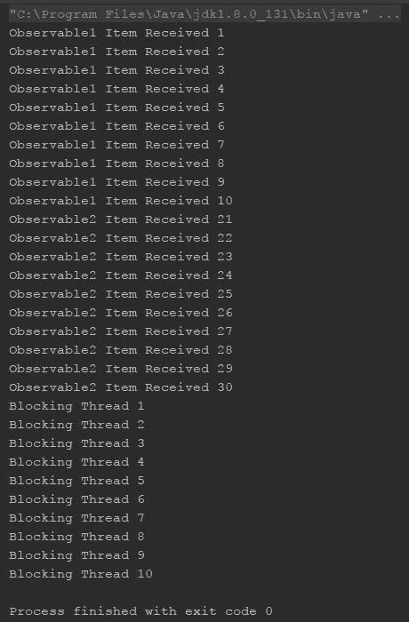
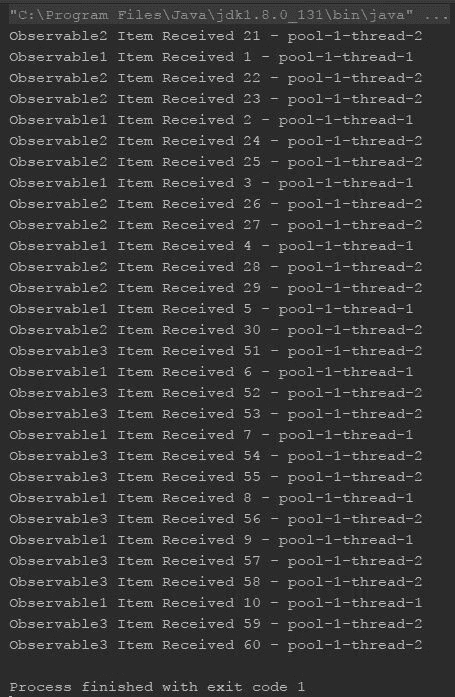
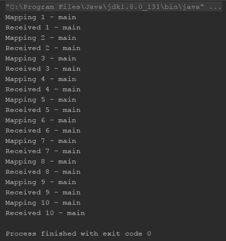
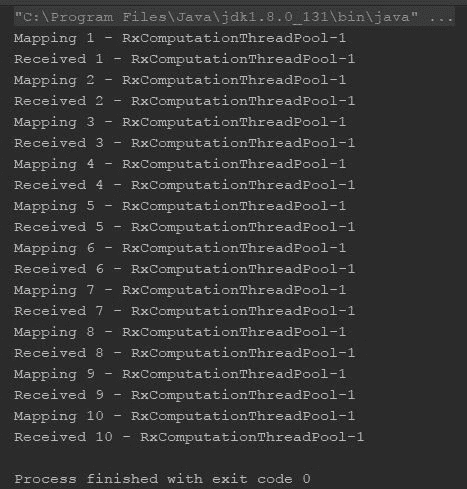
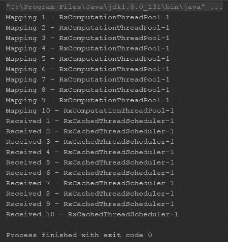

# 第七章：使用调度器在 RxKotlin 中进行并发和并行处理

因此，到目前为止，你已经学习了响应式编程的基础。你学习了 Observable、Observers 和 Subjects，以及背压、Flowable、处理器和操作符。现在，是我们学习响应式编程中一些其他新主题的时候了，可能是最重要的主题——并发和并行处理。

关于响应式编程的一个常见误解是响应式编程默认是多线程的。实际上，RxKotlin 默认是在单线程上工作的，尽管它为我们提供了大量的操作符，可以轻松地根据我们的业务逻辑和需求实现多线程。

在本章中，我们将涵盖以下主题：

+   并发编程简介

+   `subscribeOn()` 和 `observeOn()` 操作符

+   并行化

# 并发编程简介

并发的定义可以描述如下：

作为一种编程范式，并发计算是一种模块化编程，即把整体计算分解成可以并发执行的子计算。

– 维基百科

根据定义，并发就是将整个任务分解成小部分，然后并发执行（并发执行和并行执行之间有一个小的区别，我们将在稍后讨论）。

那么，并发执行子计算意味着什么呢？让我们看看一个现实生活中的例子。想象一下你在家做一道新菜，你有三项任务——拿调料、切蔬菜，以及腌制一些东西。现在，如果你一个人做，你必须一个接一个地做，但如果你有一个家庭成员可以帮忙，那么你们可以分担任务。你可以在另一个人拿调料的时候切蔬菜，而你们中谁先完成可以继续第三个任务——腌制食物。

你可以把你自己和帮助你的人（家庭成员）想象成两个线程，或者更具体地说，你作为程序的主要线程（在这里，烹饪）是整个工作的负责人，你将分配任务给你和家庭成员，他是工作线程。你们两个和你的家庭成员共同构成一个线程池。

如果有更多的线程并且整个任务被适当地分配给它们，整个程序将执行得更快。

# 并行执行与并发

并发和并行化的概念不仅相关，而且它们之间有着深刻的联系；你可以把它们想象成孪生兄弟。它们看起来几乎一样，但也有一些区别。让我们试着去发现。

在之前的例子中，我们讨论了并发，但它似乎是在并行执行的。现在，让我们用一个更好的例子来代替，这个例子不仅可以帮助我们理解并行化，还可以让我们理解并发和并行化之间的区别。

想象一下有一家酒店，有 5 位顾客点了 15 道菜。这 15 道菜代表的是相同的工作任务，每个任务都需要厨师来烹饪。现在，就像之前的例子一样，把厨师想象成线程（在之前的例子中，你和你的家庭成员扮演的是在家中的厨师角色），但他们不会共享菜肴的子部分，而是每次只烹饪一道菜（因为显然有 15 个订单！）。

现在，如果你有 15 名厨师可供使用（包括 15 个烤箱和其他资源），那么你可以一次性完成所有菜肴的烹饪，但这并不经济。你不能随着订单数量的增加无限地增加厨师和资源。更经济的方法是雇佣 5 名厨师，并创建一个订单池（或者你也可以说是一个队列），依次执行订单。因此，每位厨师需要制作三道菜（或任务的迭代）。如果有更多的订单，那么池子会变得更大。

并行化建议在池中明智地划分任务；而不是为每个任务创建线程，创建一个任务池，并将它们分配给现有的线程，并重复使用它们。

结论是，通过并发实现并行化，但这并不是同一件事；相反，它关乎如何使用并发。

现在，为什么这如此重要？或者更确切地说，为什么它真的有必要？我想你已经得到了答案，但让我们来检查一下。

想象一下你正在处理一个大型数据集，并且需要在将数据展示给用户之前对它们执行一系列长链操作。如果你是应用开发者，你可能希望在后台执行所有操作，并将结果数据传递到前台以展示给用户。并发对于这种情况非常有用。

正如我之前提到的，RxKotlin 不会并发执行操作，但它提供了大量的选项来并发执行选定的操作，并将选择权留给你。

你可能想知道，如果 RxKotlin 默认是单线程的，那么它是如何处理订阅的？订阅应该是并发的吗？在我们进一步使用 RxKotlin 进行并发计算之前，让我们找到答案。

所以，无论何时你订阅了一个 `Observable` 和/或 `Flowable`，当前线程都会被阻塞，直到所有项目都被观察者链发出和接收（除了具有间隔和定时器工厂方法的场景）。惊讶吗？然而，这实际上很好，因为对于 `Observable` 链，如果为每个操作符分配一个单独的线程（任何操作符通常订阅源 `Observable` 并对其发射进行操作，下一个操作符订阅当前操作符的发射），那么将会非常混乱。

为了解决这个场景，ReactiveX 为我们提供了调度器和调度操作符。通过使用它们，线程管理变得简单，因为同步几乎是自动的，并且线程之间没有共享数据（作为函数式编程的基本属性，因此是函数式响应式编程）。

现在我们已经了解了并发背后的理念，我们可以继续使用 RxKotlin 来实现并发。

# 什么是调度器？

在 ReactiveX 中，并发的核心在于调度器。正如我已经提到的，默认情况下，`Observable` 和应用于它的操作符链将在调用 `subscribe` 的同一线程上执行工作，并且线程将被阻塞，直到观察者收到 `onComplete` 或 `onError` 通知。我们可以使用调度器来改变这种行为。

调度器可以被视为一个线程池，ReactiveX 可以从中池化一个线程并在其上执行任务。它基本上是多线程和并发的抽象，使得在 ReactiveX 中实现并发变得更加容易。

# 调度器类型

作为线程池管理的抽象层，调度器 API 为你提供了一些预定义的调度器。它还允许你创建一个新的用户定义的调度器。让我们看看可用的调度器类型：

+   `Schedulers.io()`

+   `Schedulers.computation()`

+   `Schedulers.newThread()`

+   `Schedulers.single()`

+   `Schedulers.trampoline()`

+   `Schedulers.from()`

我们将探讨它们的定义和预定的使用场景，但首先，让我们从一些代码开始。

我们将从没有调度器的常规示例开始，然后在这个示例中实现一个调度器来观察差异，如下所示：

```java
    fun main(args: Array<String>) { 
      Observable.range(1,10) 
        .subscribe { 
           runBlocking { delay(200) } 
           println("Observable1 Item Received $it") 
         } 

      Observable.range(21,10) 
        .subscribe { 
           runBlocking { delay(100) } 
           println("Observable2 Item Received $it") 
        } 
    } 
```

在这个程序中，我们使用了两个 `Observable`；我们在它们的订阅中使用了延迟来模拟长时间运行的任务。

下面的输出显示了预期的结果。观察者一个接一个地运行：



这个程序的总执行时间大约为 3,100 毫秒（因为延迟是在打印之前执行的），而线程池在这期间处于空闲状态。使用调度器，这个时间可以显著减少。让我们来完成它：

```java
    fun main(args: Array<String>) { 
      Observable.range(1, 10) 
       .subscribeOn(Schedulers.computation())//(1) 
       .subscribe { 
          runBlocking { delay(200) } 
          println("Observable1 Item Received $it") 
        } 

       Observable.range(21, 10) 
         .subscribeOn(Schedulers.computation())//(2) 
         .subscribe { 
            runBlocking { delay(100) } 
            println("Observable2 Item Received $it") 
          } 
       runBlocking { delay(2100) }//(3) 
    }
```

与前一个程序相比，此程序包含三条新行。在注释`(1)`和`(2)`处，`subscribeOn(Schedulers.computation())`，以及在注释`(3)`处的`runBlocking { delay(2100) }`。在查看输出后，我们将检查这些行的意义：



如输出所示，此例中的`Observable`是并发发出的。`subscribeOn(Schedulers.computation())`代码的这一行使得两个下游都可以在不同的（后台）线程中订阅`Observable`，这影响了并发性。你应该已经习惯了在注释`(3)`中使用`runBlocking { delay(2100) }`；我们使用它来保持程序运行。由于所有操作都在不同的线程中执行，我们需要阻塞主线程以保持程序运行。然而，请注意我们传递的延迟时间；它仅为 2,100 毫秒，输出确认了两次订阅都处理了所有发射。因此，很明显，我们立即节省了 1,000 毫秒。

现在，让我们继续讨论可用的不同类型的调度器——然后我们将深入了解如何使用它们的不同方法。

# Schedulers.io() - I/O 密集型调度器

`Schedulers.io()`为我们提供了 I/O 密集型线程。更准确地说，`Schedulers.io()`为你提供了一个`ThreadPool`，它可以创建无限数量的工作线程，这些线程旨在执行 I/O 密集型任务。

现在，I/O 密集型线程究竟是什么意思？为什么我们称之为 I/O 密集型？让我们来检查一下。

此池中的所有线程都是阻塞的，并且旨在执行比计算密集型任务更多的 I/O 操作，从而减轻 CPU 的负载，但由于等待 I/O，可能会花费更长的时间。通过 I/O 操作，我们指的是与文件系统、数据库、服务或 I/O 设备的交互。

我们在使用此调度器时应谨慎，因为它可以创建无限数量的线程（直到内存耗尽），并可能导致`OutOfMemory`错误。

# Schedulers.computation() - CPU 密集型调度器

`Schedulers.computation()`可能是对程序员最有用的调度器。它为我们提供了一个有界线程池，该线程池可以包含与可用 CPU 核心数量相等的线程数。正如其名称所暗示的，此调度器旨在用于 CPU 密集型工作。

我们应该只将此调度器用于 CPU 密集型任务，而不用于任何其他原因。原因是此调度器中的线程会保持 CPU 核心忙碌，如果用于 I/O 密集型或涉及非计算任务的任何其他任务，可能会减慢整个应用程序的运行速度。

我们应该考虑使用 `Schedulers.io()` 来处理 I/O 密集型任务，以及使用 `Schedulers.computation()` 来处理计算任务的主要原因，是因为 `computation()` 线程更好地利用了处理器，并且不会创建超过可用 CPU 核心的线程，而是重用它们。而 `Schedulers.io()` 是无界的，如果你在 `io()` 上并行调度 10,000 个计算任务，那么每个任务都将拥有自己的线程，并竞争 CPU，从而产生上下文切换的成本。

# Schedulers.newThread()

`Schedulers.newThread()` 为我们提供了一个创建每个任务都分配一个新线程的调度器。虽然乍一看可能看起来与 `Schedulers.io()` 相似，但实际上存在巨大的差异。

`Schedulers.io()` 使用线程池，并且每当它得到一个新的工作单元时，它首先检查线程池，看是否有空闲的线程可以承担任务；如果没有可用的现有线程来承担工作，它将创建一个新的线程。

然而，`Schedulers.newThread()` 甚至不使用线程池；相反，它为每个请求创建一个新的线程，并且永远不再记住它们。

在大多数情况下，当你不使用 `Schedulers.computation()` 时，你应该考虑使用 `Schedulers.io()`，并且应该主要避免使用 `Schedulers.newThread()`；线程是非常昂贵的资源，你应该尽可能避免创建新的线程。

# Schedulers.single()

`Schedulers.single()` 为我们提供了一个只包含一个线程的调度器，并为每个调用返回单个实例。困惑吗？让我们澄清一下。想象一下你需要执行强顺序的任务的情况——`Schedulers.single()` 是你这里的最佳选择。因为它只提供给你一个线程，所以你在这里排队的每个任务都必然是顺序执行的。

# Schedulers.trampoline()

`Schedulers.single()` 和 `Schedulers.trampoline()` 听起来有些相似，这两个调度器都是用于顺序执行。虽然 `Schedulers.single()` 保证所有任务都将顺序执行，但它可能与被调用的线程并行运行（如果不是，那么该线程也是来自 `Schedulers.single()`）；而 `Schedulers.trampoline()` 在这一点上有所不同。

与 `Schedulers.single()` 一样维护一个线程不同，`Schedulers.trampoline()` 将任务排队到被调用的线程上。

因此，它将与被调用的线程顺序执行。

让我们看看 `Schedulers.single()` 和 `Schedulers.trampoline()` 的几个示例，以更好地理解它们：

```java
    fun main(args: Array<String>) { 

      async(CommonPool) { 
        Observable.range(1, 10) 
          .subscribeOn(Schedulers.single())//(1) 
          .subscribe { 
             runBlocking { delay(200) } 
             println("Observable1 Item Received $it") 
           } 

         Observable.range(21, 10) 
           .subscribeOn(Schedulers.single())//(2) 
           .subscribe { 
              runBlocking { delay(100) } 
              println("Observable2 Item Received $it") 
            } 

          for (i in 1..10) { 
            delay(100) 
            println("Blocking Thread $i") 
          } 
        } 

       runBlocking { delay(6000) } 
    } 
```

输出如下：



输出清楚地显示，尽管两个订阅都是顺序执行的，但它们与调用线程并行运行。

现在，让我们使用 `Schedulers.trampoline()` 实现相同的代码，并观察差异：

```java
    fun main(args: Array<String>) { 

      async(CommonPool) { 
        Observable.range(1, 10) 
          .subscribeOn(Schedulers.trampoline())//(1) 
          .subscribe { 
              runBlocking { delay(200) } 
              println("Observable1 Item Received $it") 
          } 

          Observable.range(21, 10) 
            .subscribeOn(Schedulers.trampoline())//(2) 
            .subscribe { 
               runBlocking { delay(100) } 
               println("Observable2 Item Received $it") 
             } 

          for (i in 1..10) { 
            delay(100) 
            println("Blocking Thread $i") 
          } 
       } 

       runBlocking { delay(6000) } 
    } 
```

以下输出显示了调度器是顺序运行到调用线程的：



# Schedulers.from

到目前为止，我们已经看到了 RxKotlin 中可用的默认/预定义的调度器。然而，在开发应用程序时，您可能需要定义自己的自定义调度器。考虑到这种情况，ReactiveX 为您提供了 `Schedulers.from(executor:Executor)`，这允许您将任何执行器转换为调度器。

让我们看看以下示例：

```java
    fun main(args: Array<String>) { 

      val executor:Executor = Executors.newFixedThreadPool(2)//(1) 
      val scheduler:Scheduler = Schedulers.from(executor)//(2) 

      Observable.range(1, 10) 
        .subscribeOn(scheduler)//(3) 
        .subscribe { 
           runBlocking { delay(200) } 
           println("Observable1 Item Received $it -
           ${Thread.currentThread().name}") 
         } 

      Observable.range(21, 10) 
        .subscribeOn(scheduler)//(4) 
        .subscribe { 
            runBlocking { delay(100) } 
            println("Observable2 Item Received $it -
            ${Thread.currentThread().name}") 
         } 

       Observable.range(51, 10) 
         .subscribeOn(scheduler)//(5) 
         .subscribe { 
             runBlocking { delay(100) } 
             println("Observable3 Item Received $it - 
             ${Thread.currentThread().name}") 
          } 
          runBlocking { delay(10000) }//(6) 
    } 
```

在这个示例中，我们从一个 `Executor`（为了简单起见，我们使用了标准的线程池执行器；您可以使用自己的自定义执行器）创建了一个自定义 `Scheduler`。

在注释 `(1)` 中，我们使用 `Executors.newFixedThreadPool()` 方法创建了执行器，在注释 `(2)` 中，我们使用 `Schedulers.from(executor:Executor)` 创建了 `scheduler` 实例。我们在注释 `(3)`、`(4)` 和 `(5)` 中使用了 `scheduler` 实例。

这是输出结果：



# 如何使用调度器 - `subscribeOn` 和 `observeOn` 操作符

现在我们已经对调度器有了基本的了解，知道了有多少种类型的调度器，以及如何创建 `scheduler` 实例，我们将关注如何使用调度器。

基本上有两个操作符帮助我们实现调度器。到目前为止，在本章中，我们在所有示例中都使用了带有调度器的 `subscribeOn` 操作符；然而，还有一个操作符——`observeOn`。我们现在将专注于这两个操作符，学习它们是如何工作的，以及它们之间的区别。

让我们从 `subscribeOn` 操作符开始。

# 在订阅时更改线程 - `subscribeOn` 操作符

在深入了解如何使用调度器之前，我们需要理解 `Observable` 的工作原理。让我们看看以下图形：



如前图所示，是线程负责通过操作符将项目从源传递到订阅者。在整个订阅过程中，这可能是一个线程，或者在不同级别上可能是不同的线程。

默认情况下，我们执行订阅的线程负责将所有排放项传递给订阅者，除非我们指示它这样做。

首先，让我们看看代码示例：

```java
    fun main(args: Array<String>) { 
      listOf("1","2","3","4","5","6","7","8","9","10") 
        .toObservable() 
        .map { 
           item-> 
           println("Mapping $item ${Thread.currentThread().name}") 
           return@map item.toInt() 
        } 
        .subscribe { 
           item -> println("Received $item 
           ${Thread.currentThread().name}") 
        } 

    } 
```

这是一个简单的 RxKotlin 代码示例；我们创建了一个 `Observable`，对其进行映射，然后订阅它。这里唯一的区别是我已经在 `map` 和 `subscribe` 独立函数中打印了 `Thread` 名称。

让我们看看输出结果：



从输出中，我们可以确定主线程执行了整个订阅过程。

`subscribeOn` 操作符，正如其名所示，帮助我们改变订阅的线程。让我们修改一次程序并查看结果：

```java
    fun main(args: Array<String>) { 
      listOf("1","2","3","4","5","6","7","8","9","10") 
        .toObservable() 
        .map { 
           item-> 
           println("Mapping $item - ${Thread.currentThread().name}") 
           return@map item.toInt() 
         } 
         .subscribeOn(Schedulers.computation())//(1) 
         .subscribe { 
            item -> println("Received $item - 
            ${Thread.currentThread().name}") 
         } 

         runBlocking { delay(1000) } 
    } 
```

整个程序保持不变，只是在 `map` 和 `subscribe` 之间，我们在注释 `(1)` 中使用了 `subscribeOn` 操作符。让我们查看输出结果：



`subscribeOn`操作符会改变整个订阅的线程；你可以在订阅流程的任何位置使用它。它将一次改变线程，并永久改变。

# 在不同的线程上进行观察——`observeOn`操作符

虽然`subscribeOn`看起来像是来自天堂的神奇礼物，但在某些情况下可能并不适用。例如，你可能想在`computation`线程上进行计算，并从`io`线程显示结果，这实际上是你应该做的。`subscribeOn`操作符需要所有这些事情的伴侣；虽然它将指定整个订阅的线程，但它需要其伴侣来指定特定操作符的线程。

`subscribeOn`操作符的完美伴侣是`observeOn`操作符。`observeOn`操作符指定了其后所有调用操作符的调度器。

让我们通过`observeOn`修改我们的程序，以在`Schedulers.computation()`中执行`map`操作，并在`Schedulers.io()`中接收订阅的结果（`onNext`）：

```java
    fun main(args: Array<String>) { 
      listOf("1","2","3","4","5","6","7","8","9","10") 
        .toObservable() 
        .observeOn(Schedulers.computation())//(1) 
        .map { 
           item-> 
           println("Mapping $item - ${Thread.currentThread().name}") 
           return@map item.toInt() 
         } 
         .observeOn(Schedulers.io())//(2) 
         .subscribe { 
            item -> println("Received $item - 
            ${Thread.currentThread().name}") 
         } 

         runBlocking { delay(1000) } 
    } 
```

以下输出清楚地表明我们成功地实现了我们的目标：


那么，我们做了什么呢？我们在`map`操作符之前通过调用`observeOn(Schedulers.computation())`来指定`computation`线程，并在订阅之前调用`observeOn(Schedulers.io())`以切换到`io`线程来接收结果。

在这个程序中，我们进行了上下文切换；我们轻松地与线程交换数据，并通过仅仅 7-8 行代码实现了线程间的通信——这就是调度器为我们提供的抽象。

# 摘要

在本章中，你学习了并发执行和并行性，以及如何在 RxKotlin 中实现多线程。在当今以应用程序驱动的时代，多线程是必要的，因为现代用户不喜欢等待，或者，为了避免阻塞，你需要不断地切换线程来执行计算和 UX 操作。

在本章中，你学习了 RxKotlin 中的调度器如何帮助你，或者更确切地说，调度器如何抽象出多线程的复杂性。

虽然并发执行和并行性是现代应用程序开发的一个基本组成部分，但测试可能是最关键的部分。我们无法在没有测试的情况下交付任何应用程序。敏捷方法（尽管我们在这里不讨论敏捷）表示我们应该反复进行测试，并且在我们产品的（应用程序）开发的每一次迭代中都要进行测试。

在第八章《测试 RxKotlin 应用程序》中，我们将讨论测试。不要错过它，现在就翻到下一页！
