# 第八章：测试 RxKotlin 应用程序

我们已经覆盖了这本书的 60%以上，学到了很多概念。从第一章开始，从反应式编程的概念到上一章关于并发执行和并行性的内容。但是，我们无法在不引入一些测试的情况下完成应用程序开发。这可能是应用程序开发过程中最关键的一点。

本章专门介绍测试。由于 Kotlin 本身相对较新，我们的第一个目标将是学习在 Kotlin 中进行测试。然后我们将继续学习在 RxKotlin 中的测试。以下是本章将要涵盖的主题：

+   单元测试简介及其重要性

+   Kotlin 和 JUnit，Kotlin-test

+   RxKotlin 中的测试工具

+   阻塞订阅者

+   阻塞操作符

+   `TestObserver`和`TestSubscriber`

那么，让我们开始吧。

# 单元测试简介及其重要性

虽然测试在应用程序开发中是绝对必要的，但许多新手开发者逃避了一些关于测试的基本问题。他们是：

+   什么是单元测试？为什么它是开发者的工作？

+   为什么单元测试如此重要？

+   那么，我们是否需要为程序的每个部分编写单元测试？

我们将从这个章节的开始就回答这些基本问题。如果你更愿意直接使用 RxKotlin 进行测试，你可以跳过本章的前几节，从*RxKotlin 中的测试工具*开始。尽管我鼓励你通读本章，即使你之前有使用 Kotlin 进行测试的经验。

让我们先定义一下单元测试。单元测试是软件测试的一个级别，其中软件（即应用程序）的最小可测试组件（称为**单元**）被测试。其目的是验证每个软件单元是否按预期执行。

单元测试可以手动进行，但通常都是自动化的。自动化单元测试的唯一目的是减少人为错误并消除由它们引起的任何额外错误/bug。为了解释这一点，我们首先记住这个谚语：

人非圣贤，孰能无过

因此，如果我们手动进行单元测试，额外的错误或 bug 的可能性会增加。自动化单元测试可以消除这种风险，因为它们包含最小的人为努力。

此外，我们需要记录我们进行的测试，并且我们需要在产品每次增量构建时使用新的测试重新执行相同的测试。自动化单元测试消除了这项额外的工作，因为你只需要编写一次测试，然后你可以在未来的任何时间运行它们。此外，自动化单元测试还可以减少文档工作。

为什么它是开发者的工作？除了开发者，还有谁会编写自动化测试的代码？

此外，在完成应用程序的每个小单元后，开发者无法向测试者提供理解。即使你可能已经完成了一些模块，这些模块尚未在 GUI 上，因此测试者或其他人可能甚至无法到达该单元进行测试。此外，它可能没有直接的影响或与 UI/UX 的关系，它可能是一个小的内部代码部分。

总结一下，开发者更好地理解他的代码，并且他知道他确切地想要从这堆代码中得到什么。因此，开发者是编写该模块单元测试的最佳人选。

# 为什么单元测试如此重要？

让我们用一个现实生活中的例子来说明。想象一个工程师，正在创建一个新的电机或设备。工程师将在完成该电机的每个单元后测试其功能，而不是在最后测试整个电机（尽管他/她最终也会测试整个电机，但在构建过程中也会反复和逐步地进行测试）。这种行为的背后主要原因是，如果他/她不这样做，最终将需要大量努力来识别确切的问题（如果有的话）。而逐步测试将允许你在问题出现时立即修复它。同样，这也适用于软件（应用程序）。

你应该定期和反复地执行单元测试，随着你开发应用程序的每个模块，测试越多，最终产品就越好。是的，**我们应该为应用程序的每个功能部分编写单元测试**。

通过 **功能部分** 我们指的是执行任何小操作和/或功能的每个部分。我们可以跳过测试只有获取器和设置器的 POJO 类，但我们必须测试使用该 POJO 类来完成某事的代码。

因此，既然我们已经理解了测试的重要性，让我们从在 Kotlin 中编写 JUnit 测试开始。

# 在 Kotlin 中编写 JUnit 测试

如果你有任何 Java 开发的经验，你一定听说过或最可能使用过 JUnit。它是一个用于 Java（以及 Kotlin）的测试框架。

通常情况下，单元测试是在与实际源代码分开的单独源文件夹中创建的，以保持其分离。标准的 Maven/Gradle 习惯使用 `src/main` 用于实际代码（Java/Kotlin 文件或类）和 `src/test` 用于测试类。以下截图显示了本书中使用的项目的结构：

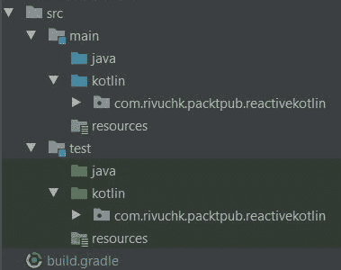

在开始编写测试用例之前，我们必须添加以下 Gradle 依赖项：

```kt
    testCompile 'junit:junit:4.12' 
    testCompile "org.mockito:mockito-core:1.9.5" 
    testCompile "org.jetbrains.kotlin:kotlin-test-   
      junit:$kotlin_version" 
```

我们还添加了对 Mockito 的依赖，我们将在不久的将来介绍它。

因此，我们已经准备好了所有东西，让我们编写我们的第一个测试用例。请参考以下代码：

```kt
    package com.rivuchk.packtpub.reactivekotlin 

    import org.junit.Test 
    import kotlin.test.assertEquals 

    class TestClass { 
      @Test//(1) 
      fun `my first test`() {//(2) 
        assertEquals(3,1+2)//(3) 
      } 
    } 
```

仔细看看前面的程序。每个 JUnit 测试用例都应该定义为一个类内的函数。包含 JUnit 测试函数的类应仅用于测试目的，不应具有其他用途。`test` 函数应使用 `@Test` 注解，就像我们在注释 `(1)` 中做的那样。这个注解帮助 JUnit 识别和执行测试。

现在，仔细看看包含注释 `(2)` 的那一行。函数名是 `` `my first test`() ``。是的，函数名中包含空格。这可能是你在 Kotlin 编写测试用例时能得到的最好的东西。Kotlin 允许你拥有没有空格的函数名，虽然这在编写代码时不是好的实践，但在编写测试时它们实际上可以救命；因为你不需要在其他地方调用 `test` 函数，它们实际上充当了可读的测试名称。

在注释 `(3)` 中，我们编写了实际的测试。`assertEquals` 测试检查 `expected` 和 `actual` 值之间的相等性。此测试的第一个参数是预期值，第二个参数是实际值，它应该与预期值相等。

如果您运行测试，您将得到以下输出：

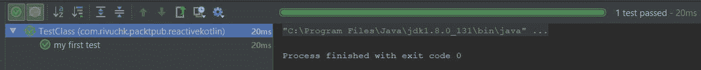

如果我们修改程序并将 `2+3` 而不是 `1+2` 作为实际参数传递，那么测试将失败，并给出以下输出：

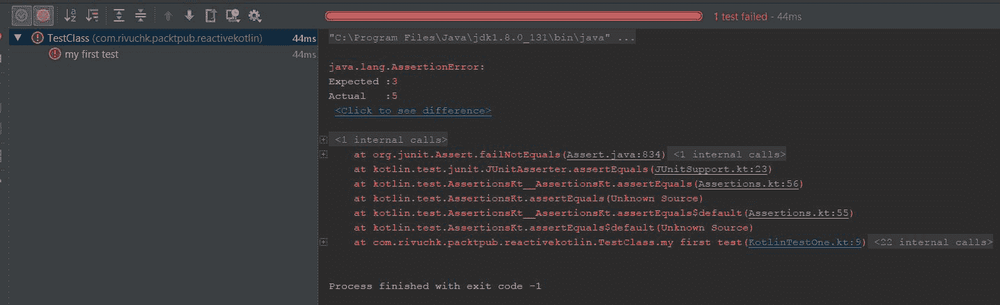

您还可以传递一个错误消息，该消息将在失败时显示，如下所示：

```kt
    class TestClass { 
      @Test//(1) 
      fun `my first test`() {//(2) 
        assertEquals(3,2+3, "Actual value is not equal to the expected 
        one.")//(3) 
      } 
    } 
```

如果测试失败，错误报告中将显示该消息。请查看以下输出：

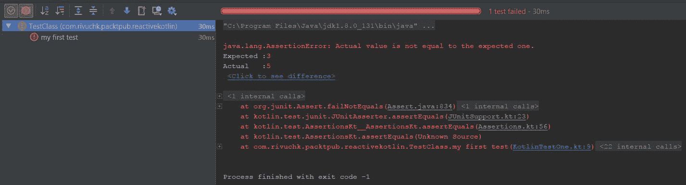

# 测试您的代码

在前面的部分，我们学习了如何编写测试用例，但我们测试了我们的代码吗？没有。我们使用一些无意识的值进行了测试。我们知道这不是测试的目的。测试是为了确保我们的函数、类和代码块按预期工作。

我们应该在现有的代码之上编写测试（除非我们正在遵循**测试驱动开发**（**TDD**））。

测试驱动开发是一种开发方法，其中首先编写测试，然后编写实际的源代码以通过测试用例。测试驱动开发在开发人员和架构师中非常受欢迎，许多公司将其作为其开发流程遵循的 TDD。

以下是一个包含一些计算方法的 Kotlin 小文件，我们将在该文件上执行测试：

```kt
    package com.rivuchk.packtpub.reactivekotlin.chapter8 

    fun add(a:Int, b:Int):Int = a+b 
    fun substract(a:Int, b:Int):Int = a-b 
    fun mult(a:Int, b:Int):Int = a*b 
    fun divide(a:Int, b:Int):Int = a/b 
```

然后，以下类包含测试用例，仔细查看代码，然后我们将对其进行描述：

```kt
    package com.rivuchk.packtpub.reactivekotlin.chapter8//(1) 

    import org.junit.Test 
    import kotlin.test.* 

    class TestCalculator { 
      @Test 
      fun `addition test`() {//(2) 
        assertEquals(1 + 2, add(1,2)) 
      } 
      @Test 
      fun `substraction test`() {//(3) 
        assertEquals(8-5, substract(8,5)) 
      } 
      @Test 
      fun `multiplication test`() {//(4) 
        assertEquals(4 * 2, mult(4,2)) 
       } 
      @Test 
      fun `division test`() {//(5) 
        assertEquals(8 / 2, divide(8,2)) 
      } 
    } 
```

看看包声明。两个文件共享相同的包名，我们故意这样做，这样我们就不需要导入函数。

我们在源代码中使用了最简单的函数，这样你可以轻松理解代码。同时请注意，我们像函数一样单独编写了每个测试用例。虽然显然可以在一个测试用例中调用多个测试函数。困惑吗？让我们详细说明一下，当你测试单个函数或属性的多个方面时，你可以（并且应该）将它们全部组合在一个测试函数（带有`@Test`注解的函数）中。通常，编译器在遇到测试函数时会显示测试结果，而不考虑每个测试函数执行了多少测试。所以请放心，如果你将它们组合在一个单独的测试函数中，你的测试将会被执行，但它们将作为一个单独的测试显示。然而，当你为不同的函数或属性编写测试时，你显然希望为所有这些函数生成单独的报告，在这种情况下，你应该像前面的例子一样单独编写它们。

现在看看输出结果：

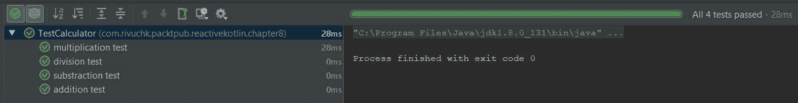

但在每个先前的例子中，我们只使用了`assertEquals`；看到这一点，你可能会有疑问，`assertEquals`是唯一的测试函数吗？答案是绝对不是。我们有大量的测试函数可用。以下是一些具有未知值的测试用例，只是为了让你了解 Kotlin 中最有用的测试函数。请参考以下代码：

```kt
    package com.rivuchk.packtpub.reactivekotlin.chapter8 

    import org.junit.Test 
    import java.util.* 
    import kotlin.test.* 

    class TestFunctions { 

      @Test 
      fun `expected block evaluation`() { 
        expect(10,{ 
          val x=5 
          val y=2 
          x*y 
        }) 
      } 

      @Test 
      fun `assert illegal value`() { 
        assertNotEquals(-1,Random().nextInt(1)) 
      } 

      @Test 
      fun `assert true boolean value`() { 
        assertTrue(true) 
      } 

      @Test 
      fun `assert false boolean value`() { 
        assertFalse(false) 
      } 

      @Test 
      fun `assert that passed value is null`() { 
        assertNull(null) 
      } 

      @Test 
      fun `assert that passed value is not null`() { 
        assertNotNull(null) 
      } 
    } 
```

在检查这里的测试用例之前，让我们看看以下测试输出截图：

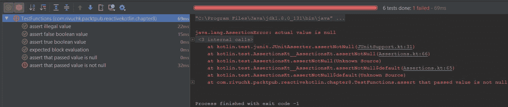

现在，让我们尝试理解代码。我们将从``` `expected block evaluation`() ``测试用例开始。`expect`测试函数将期望值作为第一个参数，将一个块（lambda）作为第二个参数，执行 lambda，并检查返回值与期望值是否相等。

第二个测试用例是``` `assert illegal value`() ``，在该测试用例中，我们使用了`assertNotEquals()`测试方法。这个测试方法与`assertEquals()`相反。如果两个参数相等，则测试失败。`assertNotEquals()`在有一个函数应该返回任何值除了特定值时特别有用。

在``` `assert true boolean value`() ``和``` `assert true boolean value`() ``测试用例中，我们分别使用了`assertTrue()`和`assertFalse()`。这两个测试方法都接受一个`Boolean`值作为参数。正如其名所示，`assertTrue()`期望值是`true`，而`assertFalse()`期望值是`false`。

接下来的两个测试用例是针对 null 值的。第一个``` `assert that passed value is null`() ``使用`assertNull()`，它期望传递的值包含`null`。第二个使用`assertNotNull()`，与`assertNull()`完全相反，它期望值不是`null`。

因此，在我们对编写测试用例有了实际了解之后，让我们开始使用**RxKotlin**进行测试。

# 在 RxKotlin 中进行测试

现在，既然您在 Kotlin 中有一些实际测试经验，也对 RxKotlin 有了一些了解，您可能想知道如何在 RxKotlin 中实现测试用例？在 RxKotlin 中进行测试可能看起来并不直接；原因是 ReactiveX 定义的是行为而不是状态，而包括 JUnit 和 kotlin—test 在内的大多数测试框架都适用于测试状态。

为了帮助开发者，RxKotlin 附带了一套用于测试的工具，您可以使用您喜欢的测试框架。在这本书中，我们将介绍如何使用 JUnit 和 Kotlin-test 在 RxKotlin 中进行测试。

那么，我们在等待什么呢？让我们开始吧。

# 阻塞订阅者

尝试回忆一下之前章节中的代码块，我们在使用 `delay` 使主线程等待时使用了它，无论我们使用的是在另一个线程上操作的 `Observable` 或 `Flowable`。一个完美的例子是当我们使用 `Observable.interval` 作为工厂方法或使用 `subscribeOn` 操作符时。为了让您回忆起来，以下是一个这样的代码示例：

```kt
    fun main(args: Array<String>) { 
      Observable.range(1,10) 
         .subscribeOn(Schedulers.computation()) 
         .subscribe { 
            item -> println("Received $item") 
          } 
      runBlocking { delay(10) } 
    } 
```

在这个例子中，我们将订阅切换到了 `Schedulers.computation`。现在让我们看看，我们如何测试这个 Observable 并检查我们是否接收到了正好 `10` 个发射：

```kt
    @Test 
    fun `check emissions count` () { 
      val emissionsCount = AtomicInteger()//(1) 
      Observable.range(1,10) 
         .subscribeOn(Schedulers.computation()) 
         .blockingSubscribe {//(2) 
          _ -> emissionsCount.incrementAndGet() 
         } 

        assertEquals(10,emissionsCount.get())//(3) 
    } 
```

在深入研究代码之前，我们先看看测试结果：

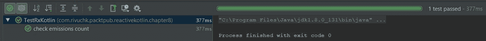

在这段代码中，有几件事情需要解释。首先是 `AtomicInteger`。`AtomicInteger` 是 Java 中整数的一个包装器，它允许 `Int` 值原子性地更新。尽管 `AtomicInteger` 扩展了 `Number` 以允许工具和实用程序以统一的方式访问基于数字的类，但它不能作为 `Integer` 的替代品。我们在代码中使用 `AtomicInteger` 来确保原子性，因为订阅是在 `computationScheduler`（因此是多线程）中运行的。

需要我们注意的行是我们在其中放置注释 `(2)` 的地方。我们使用了 `blockingSubscribe` 而不是仅仅使用 `subscribe`。当我们使用 `subscribe` 操作符订阅一个生产者，并且订阅不在当前线程时，当前线程不会等待订阅完成，而是立即移动到下一行。这就是为什么我们使用延迟来使当前线程等待。在 `tests` 中使用 `delay` 是麻烦的。而 `blockingSubscribe` 会阻塞当前运行的线程直到订阅完成（即使订阅发生在另一个线程），这在编写测试时是有用的。

# 阻塞操作符

虽然 `blockingSubscribe` 在测试中很有用，但它并不总是能满足您的需求。您可能需要测试生产者的第一个、最后一个或所有值。为此，您需要数据以纯命令式的方式。

在那种情况下，RxKotlin 中尚未发现的操作符集在你手中。阻塞操作符作为响应式世界和命令式世界之间立即可访问的桥梁。它们阻塞当前线程并使其等待结果被发出，但以非响应式的方式返回它们。

`blockingSubscribe` 和阻塞操作符之间唯一的相似之处在于，即使响应式操作在另一个线程中执行，两者都会阻塞声明线程。

除了这个之外，没有更多的相似之处。`blockingSubscribe` 将数据视为响应式，并且不返回任何内容。它而是将它们推送到指定的订阅者（或 lambda）那里。而阻塞操作符将以非响应式的方式返回数据。

以下列表包含我们将要介绍的阻塞操作符：

+   `blockingFirst()`

+   `blockingGet()`

+   `blockingLast()`

+   `blockingIterable()`

+   `blockingForEach()`

尽管我们应该避免在生产环境中使用它们，因为它们鼓励反模式并减少了响应式编程的好处，但是我们可以肯定地用于测试目的。

# 获取第一个发出的项 – blockingFirst()

我们将要讨论的第一个阻塞操作符是 `blockingFirst` 操作符。此操作符会阻塞调用线程，直到第一个项被发出并返回它。以下是一个理想的 `blockingFirst()` 测试用例，其中我们在 Observable 上执行排序操作，并通过检查第一个发出的项是否是最小的来测试它。请参考以下代码：

```kt
    @Test 
    fun `test with blockingFirst`() { 
      val observable = listOf(2,10,5,6,9,8,7,1,4,3).toObservable() 
            .sorted() 

      val firstItem = observable.blockingFirst() 
      assertEquals(1,firstItem) 
    } 
```

测试结果如下：

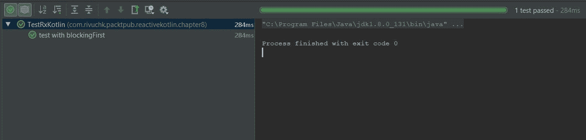

在程序中，我们创建了一个从 `1` 到 `10` 的未排序整数列表，并使用该列表创建了一个 Observable，因此从该 Observable 中最小的项应该是 `1`。我们获取了第一个项，并使用 `blockingFirst()` 操作符使线程等待，直到我们获取到它。

然后使用 `assertEquals` 测试函数来断言第一个发出的项是 `1`。

# 从单个或 maybe 中获取唯一项 – blockingGet

当你与 `single` 或 `maybe` 一起工作时，你只能使用 `blockingGet()` 以外的任何阻塞操作符。原因很简单，这两个单子只能包含一个项。

因此，让我们通过修改最后一个测试用例来创建两个新的测试用例，如下所示：

```kt
    @Test 
    fun `test Single with blockingGet`() { 
      val observable = listOf(2,10,5,6,9,8,7,1,4,3).toObservable() 
               .sorted() 

      val firstElement:Single<Int> = observable.first(0) 

      val firstItem = firstElement.blockingGet() 
      assertEquals(1,firstItem) 
    } 

    @Test 
    fun `test Maybe with blockingGet`() { 
      val observable = listOf(2,10,5,6,9,8,7,1,4,3).toObservable() 
               .sorted() 

      val firstElement:Maybe<Int> = observable.firstElement() 

      val firstItem = firstElement.blockingGet() 
      assertEquals(1,firstItem) 
    } 
```

在第一个测试用例中，我们使用了 `observable.first()` 并带有默认值，此操作符返回一个 `Single`；在第二个操作符中，我们使用了 `observable.firstElement()`，此操作符返回一个 `Maybe`。然后我们在两个测试用例中都使用了 `blockingGet` 来获取第一个元素作为 `Int` 并执行测试函数。

因此，以下截图是测试结果：

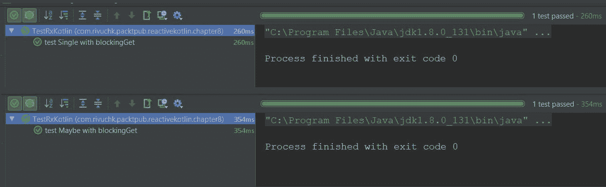

# 获取最后一个项 - blockingLast

我们有`blockingFirst`，所以很明显我们会有一个`blockingLast`。正如预期的那样，它会在阻塞线程直到源发出它之前获取最后一个发出项。以下是一个代码示例：

```kt
    @Test 
    fun `test with blockingLast`() { 
      val observable = listOf(2,10,5,6,9,8,7,1,4,3).toObservable() 
               .sorted() 

      val firstItem = observable.blockingLast() 
      assertEquals(10,firstItem) 
   } 
```

由于我们期望获取最后一个发出项，所以我们正在检查与`10`的等价性。

以下是测试结果的截图：

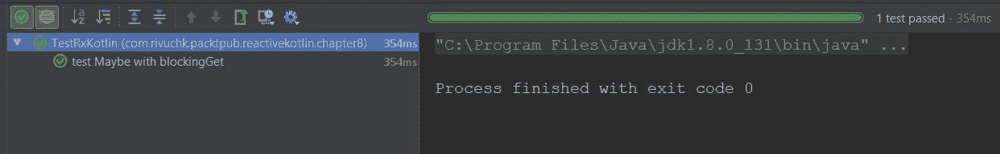

# 将所有发出项作为可迭代对象获取 - blockingIterable 操作符

因此，我们获取了第一个发出的项目，我们也获取了最后一个发出的项目，但如果我们想获取所有用于测试发出的项目呢？`blockingIterable`操作符可以提供同样的功能。`blockingIterable`操作符以一种有趣的方式工作，它将一个发出项传递给`Iterable`，然后`Iterable`将保持阻塞迭代线程，直到下一个发出项可用。这个操作符将未消费的值排队，直到`Iterator`可以消费它们，这可能会导致`OutOfMemory`异常。

所以以下是一个示例，其中我们获取了完整的列表，然后我们将返回的`Iterable`转换为`List`，并在排序后与源`list`进行比较以检查等价性。请参考以下代码：

```kt
    @Test 
    fun `test with blockingIterable`() { 
      val list = listOf(2,10,5,6,9,8,7,1,4,3) 

      val observable = list.toObservable() 
               .sorted() 

     val iterable = observable.blockingIterable() 
     assertEquals(list.sorted(),iterable.toList()) 
   } 
```

如果发出项是排序的，那么当转换为`list`时，`iterable`应该等于`list.sorted()`。

以下是测试结果的截图：

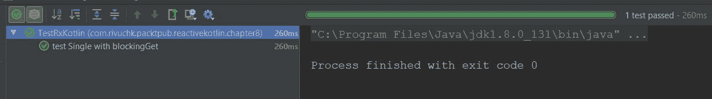

# 遍历所有发出项 - blockingForEach

如果你想要遍历所有发出项，那么`blockingForEach`可能是一个更好的解决方案。它比`blockingIterable`更好，因为它不会排队发出项。相反，它会阻塞调用线程，等待每个发出项被处理后再允许线程继续。

在下面的示例中，我们从一个`Int`列表创建了一个`Observable`，然后只应用了偶数的过滤器，然后在`blockingForEach`中测试是否所有接收到的数字都是偶数：

```kt
    @Test 
    fun `test with blockingForEach`() { 
      val list =  
      listOf(2,10,5,6,9,8,7,1,4,3,12,20,15,16,19,18,17,11,14,13) 

      val observable = list.toObservable() 
        .filter { item -> item%2==0 } 

      observable.forEach { 
         item-> 
         assertTrue { item%2==0 } 
     } 
   }  
```

测试的结果如下：

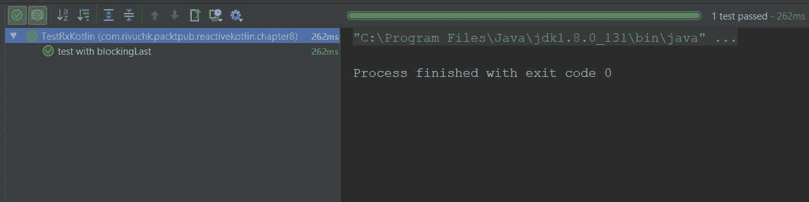

我们已经涵盖了到目前为止最有用的阻塞操作符。它们对于简单的断言很有用，并且可以有效地阻塞代码，以便我们可以执行我们的测试操作。

然而，在生产中使用阻塞代码并没有好处。虽然看起来在测试中使用阻塞代码是可以的，但实际上并不是这样。它可能会对你从测试中获得的利益造成重大损害。如何？只需想想多个 Observables/Flowables 并发地向你的应用程序发出，如果你将它们放在阻塞代码上，它们的完整行为可能会改变，结果你将失去单元测试的利益。

那么，出路在哪里呢？让我们看看。

# 介绍 TestObserver 和 TestSubscriber

随着你阅读这一章，你可能已经形成了一个想法，我们只能通过阻塞代码来执行测试，要么使用 `blockingSubscribe`，要么使用阻塞操作符。*但这并不是事实*。实际上，还有更多全面的方法来处理响应式代码，或者说我们可以以响应式的方式测试响应式代码。

更精确地说，在 Subscriber 中，我们有 `onError` 和 `onComplete`，它们需要与 `onNext` 一起测试，而仅仅使用阻塞并不总是可能的。是的，某种形式的阻塞是必要的，但它不能独自完成所有的事情，它还需要以响应式的方式进行管理。

因此，这里有你的两位超级英雄，让开发者的生活变得简单——`TestObserver` 和 `TestSubscriber`。与 `Subscriber` 和 `Observer` 一样，你可以使用 `TestSubscriber` 与 `Flowables`，使用 `TestObserver` 与 `Observables`，这两者之间除了这一点外，其他都是相似的。

那么，让我们从一个例子开始：

```kt
    @Test 
    fun `test with TestObserver`() { 
     val list = 
     listOf(2,10,5,6,9,8,7,1,4,3,12,20,15,16,19,18,17,11,14,13) 

     val observable = list.toObservable().sorted() 

     val testObserver = TestObserver<Int>() 

     observable.subscribe(testObserver)//(1) 

     testObserver.assertSubscribed()//(2) 

     testObserver.awaitTerminalEvent()//(3) 

     testObserver.assertNoErrors()//(4) 
     testObserver.assertComplete()//(5) 
     testObserver.assertValueCount(20)//(6) 
     testObserver.assertValues
     (1,2,3,4,5,6,7,8,9,10,11,12,13,14,15,16,17,18,19,20)//(7) 
    } 

    @Test 
    fun `test with TestSubscriber`() { 
     val list = 
     listOf(2,10,5,6,9,8,7,1,4,3,12,20,15,16,19,18,17,11,14,13) 

     val flowable = list.toFlowable().sorted() 

     val testSubscriber = TestSubscriber<Int>() 

     flowable.subscribe(testSubscriber)//(1) 

     testSubscriber.assertSubscribed()//(2) 

     testSubscriber.awaitTerminalEvent()//(3) 

     testSubscriber.assertNoErrors()//(4) 
     testSubscriber.assertComplete()//(5) 
     testSubscriber.assertValueCount(20)//(6) 
     testSubscriber.assertValues
     (1,2,3,4,5,6,7,8,9,10,11,12,13,14,15,16,17,18,19,20)//(7) 
    } 
```

因此，我们确实使用 `TestObserver` 和 `TestSubscriber` 执行了相同的测试集。测试结果显然是通过的：

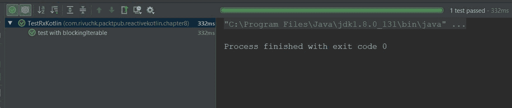

让我们现在理解测试用例。在注释 `(1)` 中，我们正在订阅 Observable/Flowable。在注释 `(2)` 中，我们正在检查订阅是否成功，并且只有一个，这是通过 `assertSubscribed()` 测试来实现的。在注释 `(3)` 中，我们正在使用 `awaitTerminalEvent()` 方法阻塞线程，直到 Observable/Flowable 完成其执行。这个终端事件可以是 `onComplete` 或 `onError`。在注释 `(4)` 和 `(5)` 中，我们正在检查 `Observable` 和/或 `Flowable` 是否成功完成而没有错误，`assertNoErrors()` 将测试订阅是否没有收到任何错误，而 `assertComplete()` 将测试生产者是否成功完成。在注释 `(6)` 中，我们正在测试接收到的总发射计数为 `20`（列表中有 20 个项目），`assertValuesCount()` 帮助我们实现这个目标。在注释 `(6)` 中，我们通过 `assertValues()` 测试每个发射的预期和实际值及其顺序。

所以，这很酷，对吧？接下来我要展示的可能会更酷。

# 理解 TestScheduler

想象一下使用 `Observable.interval()` / `Flowable.interval()` 工厂方法创建的 Observable/Flowable。如果你在其中给出了一个较长的间隔（比如说五分钟），并且至少测试了 100 次发射，那么测试完成将需要很长时间（500 分钟 = 8.3 小时，也就是说，仅仅为了测试一个生产者就需要一个完整的人时）。现在，如果你有更多类似这样的生产者，它们有更大的间隔和更多的发射需要测试，那么测试可能需要整个生命周期，那么你什么时候才能发货呢？

`TestScheduler` 的存在就是为了拯救你的生命。它们可以通过时间驱动的生产者有效地模拟时间，这样我们就可以通过向前快进特定的时间量来进行断言。

因此，以下是对应的实现：

```kt
    @Test 
    fun `test by fast forwarding time`() { 
      val testScheduler = TestScheduler() 

      val observable = 
      Observable.interval(5,TimeUnit.MINUTES,testScheduler) 
      val testObserver = TestObserver<Long>() 

      observable.subscribe(testObserver) 
      testObserver.assertSubscribed() 
      testObserver.assertValueCount(0)//(1) 

      testScheduler.advanceTimeBy(100,TimeUnit.MINUTES)//(2) 
      testObserver.assertValueCount(20)//(3) 

      testScheduler.advanceTimeBy(400,TimeUnit.MINUTES)//(4) 
      testObserver.assertValueCount(100)//(5) 
    } 
```

因此，在这里我们使用 `Observable.interval` 创建了一个具有 `5` 分钟间隔的 `Observable`，并将其 `Scheduler` 设置为 `TestScheduler`。

在评论 `(1)` 上，它不应该收到任何排放（因为还有 `5` 分钟它才应该收到第一次排放），我们使用 `assertValuesCount(0)` 进行测试。

我们然后在评论 `(2)` 上快进了 `100` 分钟，并测试了是否在评论 `(3)` 上收到了 `20` 次排放。`TestScheduler` 为我们提供了 `advanceTimeBy` 方法，该方法接受时间段和单位作为参数，并为我们模拟这一过程。

我们然后又快进了 `400` 分钟，并测试了是否在评论 `(4)` 和评论 `(5)` 上总共收到了 100 次排放。

如您所预期，测试通过了。

# 摘要

因此，在本章中，我们学习了 Kotlin 中的测试。我们从测试的好处开始，然后转向 Kotlin 中的测试，使用 JUnit 和 Kotlin-test 进行测试。

由于我们在 Kotlin 中获得了一些实际测试经验，我们逐渐转向了 RxKotlin 的测试，我们学习了一些测试 RxKotlin 的技巧，并了解了 RxKotlin 为我们提供的超级方便的测试工具。

由于我们在 RxKotlin 中建立了坚实的知识基础，在下一章——第九章，

在 *资源管理和扩展 RxKotlin* 中，我们将讨论一些高级主题。我们将讨论如何管理资源——如何释放分配的内存和防止内存泄漏。我们还将学习如何创建自己的自定义操作符，这些操作符可以在 RxKotlin 逻辑中像预定义的操作符一样链式使用。

那么，你还在等什么？现在就开始学习 第九章，*资源管理和扩展 RxKotlin*，并且从现在开始，不要忘记测试你写的每一行代码。
