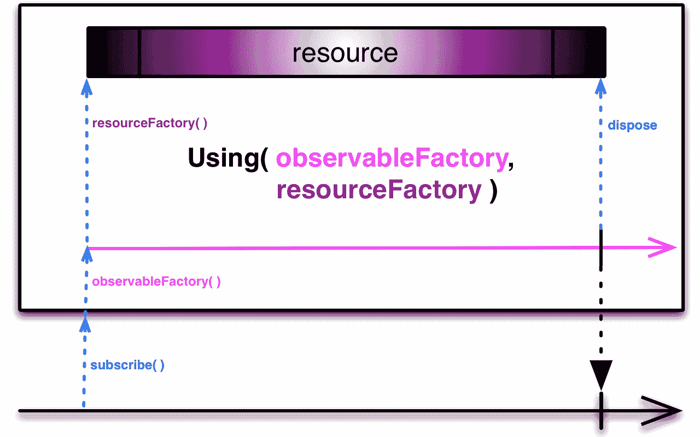
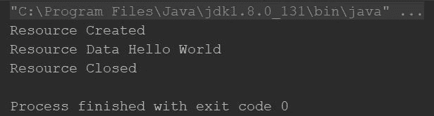
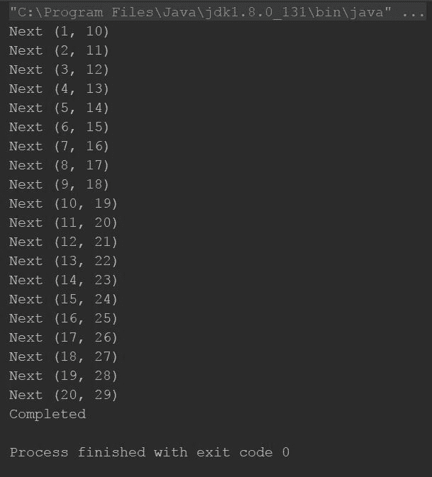
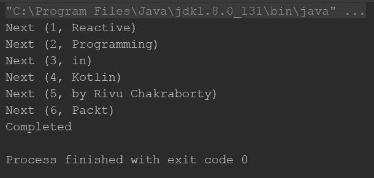
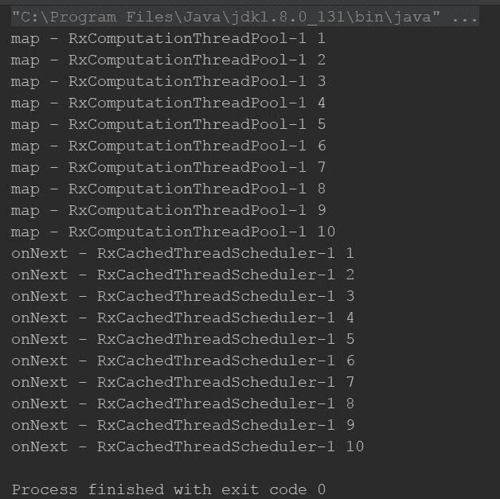
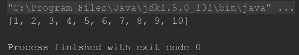

# 第九章：资源管理和扩展 RxKotlin

到目前为止，你已经学习了关于 Observables、Flowables、Subjects、处理器、操作符、组合生产者、测试以及许多其他内容。我们已经获得了开始编码应用程序所需的大部分必要知识。唯一剩下要关注的话题是资源管理——创建、访问和清理资源的技术。此外，如果你是那些渴望挑战的开发者之一，那么你总会寻找定制一切的方法。到目前为止，在这本书中，我们已经看到了如何按照规定的方式使用操作符。我们没有做任何创新，也没有尝试自定义操作符。因此，本章致力于资源管理和通过自定义操作符扩展 RxKotlin。

以下列表包含本章我们将要讨论的主题：

+   使用 `using` 方法进行资源管理

+   使用 `lift` 操作符创建自定义操作符

+   使用 `compose` 操作符创建自定义转换器（转换操作符）

因此，首先，让我们从资源管理开始。

# 资源管理

资源管理，这是什么意思？为什么我们应该关心它？如果你在 Java、Kotlin、JavaScript 或任何其他语言的 应用程序开发中有一点经验，那么你可能熟悉这样一个事实：在开发应用程序时，我们经常需要访问资源，并且在完成时必须关闭它们。

如果你对这个短语不熟悉，那么资源管理，让我们来分解一下。我们将从探索资源的定义开始。

那么，什么是资源？在开发应用程序时，你可能经常需要访问 API（通过 HTTP 连接）、访问数据库、从文件中读取/写入，或者你可能甚至需要访问任何 I/O 端口/套接字/设备。所有这些事情在一般情况下都被认为是 **资源**。

为什么我们需要管理/关闭它们？每当我们在访问资源时，尤其是写入时，系统通常会为我们锁定它，并阻止其他程序访问它。如果你在完成时没有释放或关闭资源，系统性能可能会下降，甚至可能出现死锁。即使系统没有为我们锁定资源，它也会保持打开状态，直到我们释放或关闭它，从而导致性能下降。

因此，每当我们在使用完资源后，我们必须关闭或释放它。

通常，在 JVM 上，我们通过一个类来访问资源。通常，这个类实现了 `Closable` 接口，通过调用其 `close` 方法，使我们能够轻松地释放资源。在命令式编程中这相当简单，但你可能想知道如何在响应式编程中做到这一点。

你可能正在考虑将命令式编程与响应式编程混合，并将资源作为全局属性，然后在 `subscribe` 方法中使用后将其丢弃。这基本上就是我们第五章中所做的。

*异步数据运算符和转换* HTTP 请求。

很抱歉让你失望，但这确实是错误的过程；在第五章，

*异步数据运算符和转换*，我们这样做是为了避免进一步的复杂性，以便你更好地理解代码，但现在我们应该学习正确的方法。

为了使事情不那么复杂，我们将创建一个具有自定义`Closable`接口实现的虚拟资源。所以，不再有悬念；看看下面的代码片段：

```java
    class Resource():Closeable { 
      init { 
        println("Resource Created") 
      } 

      val data:String = "Hello World" 

      override fun close() { 
        println("Resource Closed") 
      } 
    } 
```

在前面的代码中，我们创建了一个`Resource`类，并在该类中实现了`Closeable`接口（只是为了模拟一个典型的 Java 资源类）。我们还在该类内部创建了一个名为`data`的`val`属性，它将被用来模拟从`Resource`中获取数据。

现在，我们如何在响应式链中使用它呢？RxKotlin 提供了一个非常方便的方式来处理可丢弃的资源。为了用可丢弃的资源拯救你的生命，RxKotlin 为你准备了一个礼物——`using`运算符。

`using`运算符允许你创建一个仅在`Observable`的生命周期内存在的资源，并且一旦`Observable`完成，该资源就会被关闭。

以下图表描述了使用`using`运算符创建的`Observable`的生命周期与附加的资源之间的关系，该图表取自 ReactiveX 文档([`reactivex.io/documentation/operators/using.html`](http://reactivex.io/documentation/operators/using.html))：



前面的图像清楚地显示，资源仅在`Observable`的生命周期内存在——一个完美的伴侣，不是吗？

下面是`using`运算符的定义：

```java
    fun <T, D> using(resourceSupplier: Callable<out D>, sourceSupplier:    
    Function<in D, out ObservableSource<out T>>, 
     disposer: Consumer<in D>): Observable<T> { 
       return using(resourceSupplier, sourceSupplier, disposer, true) 
     } 
```

看起来很复杂，但当我们分解它时，就很容易了。`using`方法接受一个`Callable`实例，该实例将创建一个资源并将其返回（`out D`就是为了这个目的）。然后，最后一个是释放/关闭资源。`using`运算符将在创建`Resource`实例之前调用第一个 lambda。然后，它将`Resource`实例传递给第二个 lambda，以便你创建`Observable`并返回它，这样你就可以订阅了。最后，当`Observable`调用其`onComplete`事件时，它将调用第三个 lambda 来关闭`resource`。

你现在迫不及待地想看到示例，对吧？以下是一个示例：

```java
    fun main(args: Array<String>) { 
      Observable.using({//(1) 
        Resource() 
      },{//(2) 
        resource:Resource-> 
        Observable.just(resource) 
      },{//(3) 
        resource:Resource-> 
        resource.close() 
      }).subscribe { 
        println("Resource Data ${it.data}") 
      } 
    } 
```

在前面的程序中，我们向`using`运算符传递了三个 lambda。在第一个 lambda（注释一）中，我们创建了一个`Resource`实例并将其返回（在 lambda 中，最后一个语句充当返回，你不需要写它）。

第二个 lambda 将接受`resource`作为参数，并从它创建`Observable`以返回。

第三个 lambda 将再次以`resource`作为参数，并关闭它。

`using`运算符会返回你在第二个 lambda 中创建的`Observable`，以便你可以将其应用于 RxKotlin 链。

所以，这里有一个输出截图，如果你好奇的话：



因此，这就是资源管理变得简单。同时请注意，你可以创建并传递任意数量的资源到`using`操作符。我们为了便于理解实现了`Closable`接口，但这不是强制的；你可以轻松地创建并传递一个资源数组。

# 创建自己的操作符

到目前为止，我们已经使用了大量的操作符，但我们能确定它们能满足所有我们的需求吗？或者，我们是否总能找到适合每个我们面对的需求的操作符？不，这是不可能的。有时，我们可能必须为我们的需求创建自己的操作符，但如何做呢？

RxKotlin 始终致力于让你的生活更轻松。它有一个专门为此目的的操作符——`lift`操作符。`lift`操作符接收一个`ObservableOperator`的实例；因此，要创建自己的操作符，你必须实现该接口。

在我看来，学习某样东西的最佳方式是通过实践。那么，创建一个自定义操作符，为每个排放添加一个序列号，怎么样？让我们根据以下要求列表来创建它：

+   该操作符应该发射一个对，其中添加的序列号作为第一个元素。对中的第二个元素应该是实际的排放。

+   该操作符应该是泛型的，并且应该与任何类型的 Observable 一起工作。

+   与其他操作符一样，该操作符应该与其他操作符并发工作。

前面的点是我们的基本要求；根据前面的要求，我们必须使用`AtomicInteger`作为计数器（它将计算排放量，我们将这个计数作为序列号传递），这样操作符才能与任何`Scheduler`无缝工作。

每个自定义操作符都应该实现`ObservableOperator`接口，其外观如下：

```java
    interface ObservableOperator<Downstream, Upstream> { 
      /** 
      * Applies a function to the child Observer and returns a new
       parent Observer. 
      * @param observer the child Observer instance 
      * @return the parent Observer instance 
      * @throws Exception on failure 
      */ 
      @NonNull 
      @Throws(Exception::class) 
      fun apply(@NonNull observer: Observer<in Downstream>): 
      Observer<in Upstream>; 
    } 
```

`Downstream`和`Upstream`是这里的两个泛型类型。`Downstream`指定了将传递给操作符的`Downstream`的类型，而`Upstream`指定了操作符将从`upstream`接收的类型。

`apply`函数有一个名为`Observer`的参数，应该用来将排放传递给`Downstream`，并且函数应该返回另一个`Observer`，它将用于监听`upstream`的排放。

足够的理论了。以下是我们`AddSerialNumber`操作符的定义。请在这里仔细看看：

```java
    class AddSerialNumber<T> : ObservableOperator<Pair<Int,T>,T> { 
      val counter:AtomicInteger = AtomicInteger() 

      override fun apply(observer: Observer<in Pair<Int, T>>):
      Observer<in T> { 
        return object : Observer<T> { 
          override fun onComplete() { 
             observer.onComplete() 
          } 

          override fun onSubscribe(d: Disposable) { 
              observer.onSubscribe(d) 
          } 

          override fun onError(e: Throwable) { 
              observer.onError(e) 
          } 

          override fun onNext(t: T) { 
              observer.onNext(Pair(counter.incrementAndGet(),t)) 
          } 

         } 
      } 
    } 
```

让我们从第一个特性开始描述——`AddSerialNumber`类的定义。这个类实现了`ObservableOperator`接口。根据我们的要求，我们保持了类的泛型性，即我们指定了`Upstream`类型为泛型`T`。

我们使用了一个`AtomicInteger`作为类的`val`属性，它应该在`init`块中初始化（因为我们是在类内部声明和定义属性，所以它会在创建类的实例时自动在`init`中初始化）。这个`AtomicInteger`，即`counter`，应该在每次发射时增加，并返回发射值的序列号。

在`apply`方法中，我创建并返回了一个`Observer`实例，它将被用来监听前面描述的`upstream`。基本上，每个操作符都会通过传递一个`Observer`给`upstream`来接收事件。

在那个`observer`内部，每当收到任何事件，我们都会将其回声到下游的`Observer`（在那里它作为一个参数被接收）。

在`Upstream` `Observer`的`onNext`事件中，我们增加了`counter`的值，将其作为`Pair`实例的第一个元素，将接收到的项目（作为`onNext`中的参数）作为第二个值添加，最后将其传递给下游的`onNext`——`observer.onNext(Pair(counter.incrementAndGet(),t))`。

那么，接下来是什么？我们创建了一个可以用作操作符的类，但我们如何使用它？很简单，看看这段代码：

```java
    fun main(args: Array<String>) { 
      Observable.range(10,20) 
       .lift(AddSerialNumber<Int>()) 
        .subscribeBy ( 
           onNext = { 
             println("Next $it") 
           }, 
           onError = { 
             it.printStackTrace() 
           }, 
           onComplete = { 
             println("Completed") 
           } 
       ) 
    } 
```

你只需要创建你操作符的一个实例，并将其传递给`lift`操作符；这就是你所需要的一切，我们现在已经创建了我们的第一个操作符。

看看下面的输出：



我们已经创建了我们的第一个操作符，坦白说，这非常简单。是的，一开始可能有点令人困惑，但随着我们继续前进，它变得更容易了。

正如你可能已经注意到的，`ObservableOperator`接口只有一个方法，因此我们可以显然用 lambda 替换类声明以及一切，如下所示：

```java
    fun main(args: Array<String>) { 
      listOf("Reactive","Programming","in","Kotlin",
      "by Rivu Chakraborty","Packt") 
         .toObservable() 
         .lift<Pair<Int,String>> { 
            observer -> 
            val counter = AtomicInteger() 
            object :Observer<String> { 
              override fun onSubscribe(d: Disposable) { 
              observer.onSubscribe(d) 
            } 

            override fun onNext(t: String) { 
              observer.onNext(Pair(counter.incrementAndGet(), t)) 
            } 

            override fun onComplete() { 
              observer.onComplete() 
            } 

            override fun onError(e: Throwable) { 
               observer.onError(e) 
            } 

          } 
      } 
      .subscribeBy ( 
         onNext = { 
           println("Next $it") 
         }, 
         onError = { 
           it.printStackTrace() 
         }, 
         onComplete = { 
           println("Completed") 
          } 
            ) 
    } 
```

在这个例子中，我们使用了一个`String`列表来创建`Observable`，而不是使用`Int`范围。

下面的就是输出：



程序几乎与上一个类似，只是我们使用了一个 lambda，并使用`Pair<Int,String>`作为下游`Observer`的类型。

由于我们已经掌握了创建自定义操作符的技巧，让我们继续学习如何创建转换器——不，不是像电影系列中的机器人；它们只是 RxKotlin 转换器。它们是什么？让我们看看。

# 使用转换器组合操作符

因此，你已经学会了如何创建自定义操作符，但想想当你想要通过组合多个操作符来创建一个新操作符的情况。例如，我经常想要组合`subscribeOn`和`observeOn`操作符的功能，以便将所有计算推送到计算线程，当结果准备好时，我们可以在主线程上接收它们。

是的，可以通过将两个操作符一个接一个地添加到链中，来获得两个操作符的好处，如下所示：

```java
    fun main(args: Array<String>) { 
      Observable.range(1,10) 
        .map { 
           println("map - ${Thread.currentThread().name} $it") 
           it 
         } 
         .subscribeOn(Schedulers.computation()) 
         .observeOn(Schedulers.io()) 
         .subscribe { 
            println("onNext - ${Thread.currentThread().name} $it") 
         } 

        runBlocking { delay(100) } 
     } 
```

尽管你已经知道了输出结果，以下截图如果你需要刷新记忆的话：



现在，假设我们项目中有`subscribeOn`和`observeOn`操作符的组合，所以我们想要一个快捷方式。我们想要创建自己的操作符，其中我们将传递两个`Scheduler`，我们想要`subscribeOn`和`observeOn`，并且一切都应该完美工作。

RxKotlin 提供了`Transformer`接口（`ObservableTransformer`和`FlowableTransformer`是两个`Transformer`接口）用于此目的。就像`operator`接口一样，它只有一个方法——`apply`。唯一的区别是，在这里，你处理的是`Observable`而不是`Observers`。所以，在这里，你直接在源上操作，而不是操作单个发射和它们的项。

这是`ObservableTransformer`接口的签名：

```java
    interface ObservableTransformer<Upstream, Downstream> { 
       /** 
       * Applies a function to the upstream Observable 
       and returns an ObservableSource with 
       * optionally different element type. 
       * @param upstream the upstream Observable instance 
       * @return the transformed ObservableSource instance 
       */ 
       @NonNull 
      fun apply(@NonNull upstream: Observable<Upstream>):   
      ObservableSource<Downstream> 
    } 
```

接口签名几乎相同。与`ObservableOperator`的`apply`方法不同，这里的`apply`方法接收`Upstream` `Observable`并应返回应传递给`Downstream`的`Observable`。

所以，回到我们的主题，以下代码块应该满足我们的要求：

```java
    fun main(args: Array<String>) { 
      Observable.range(1,10) 
        .map { 
           println("map - ${Thread.currentThread().name} $it") 
           it 
         } 
         .compose(SchedulerManager(Schedulers.computation(), 
             Schedulers.io())) 
             .subscribe { 
               println("onNext - ${Thread.currentThread().name} $it") 
             } 

            runBlocking { delay(100) } 
    } 

    class SchedulerManager<T>(val subscribeScheduler:Scheduler,
    val   observeScheduler:Scheduler):ObservableTransformer<T,T> { 
      override fun apply(upstream: Observable<T>): 
      ObservableSource<T> { 
        return upstream.subscribeOn(subscribeScheduler) 
        .observeOn(observeScheduler) 
      } 

    } 
```

在前面的代码中，我们创建了一个用于我们需求的类——`SchedulerManager`——它将接受两个`Scheduler`作为参数。第一个是要传递给`subscribeOn`操作符的，第二个是要传递给`observeOn`操作符的。

在`apply`方法内部，我们在对其应用两个操作符之后返回了`Observable` `Upstream`。

我们省略了输出截图，因为它与上一个截图相同。

就像`lift`操作符一样，`compose`操作符也可以使用 lambda 函数实现。让我们再举一个例子，我们将把`Observable<Int>`转换成`Observable<List>`。以下是代码：

```java
    fun main(args: Array<String>) { 
      Observable.range(1,10) 
        .compose<List<Int>> { 
           upstream: Observable<Int> -> 
           upstream.toList().toObservable() 
         } 
         .first(listOf()) 
         .subscribeBy { 
            println(it) 
         } 
    } 
```

在前面的代码中，我们使用了`upstream.toList().toObservable()`作为`Observable$toList()`操作符，因为它将`Observable<T>`转换为`Single<List<T>>`，所以我们需要`toObservable()`操作符将其转换回`Observable`。

这是输出截图：



在 RxKotlin 中，组合多个操作符以创建一个新的操作符也非常简单；只需给它添加一个扩展函数，就可以看到事情变得更加愉快。

# 摘要

这是一章关于 RxKotlin 中资源管理和自定义操作符的简短章节。你学习了如何（或应该）创建、使用和销毁资源。你学习了如何创建自定义操作符。你还学习了如何组合多个操作符以创建你想要的操作符。

这就是关于 RxKotlin 基础知识的最后一章。从下一章开始，我们将开始将我们获得的知识应用到实际场景和项目中。

在今天以应用驱动时代，编写 API 是一个基本要求；在下一章，你将开始学习 Kotlin 中的 Spring，这样你就可以为你的项目开发自己的 API。
