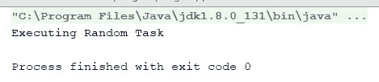
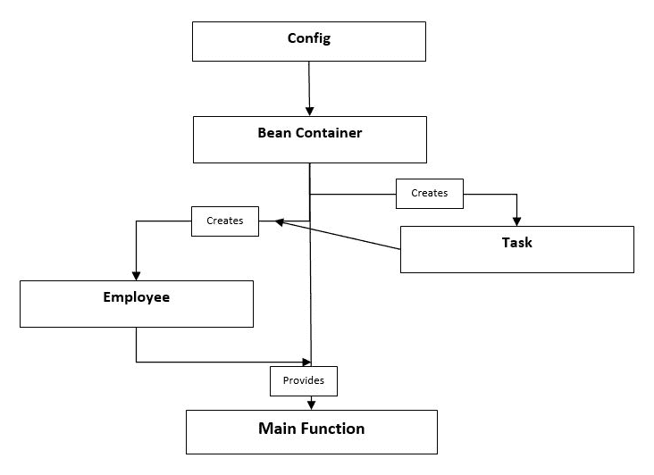
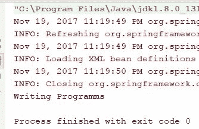
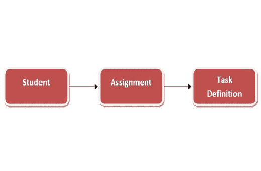
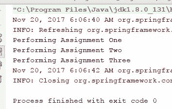
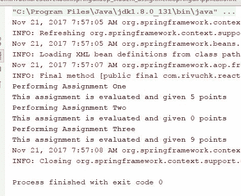
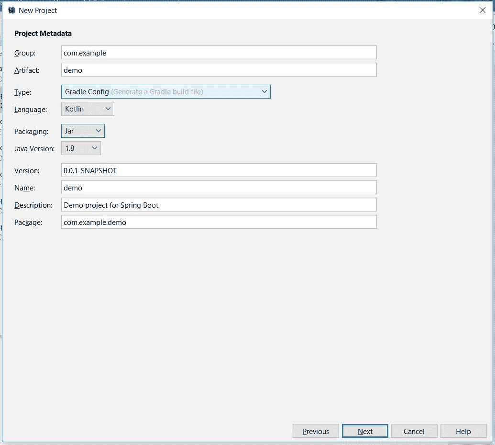
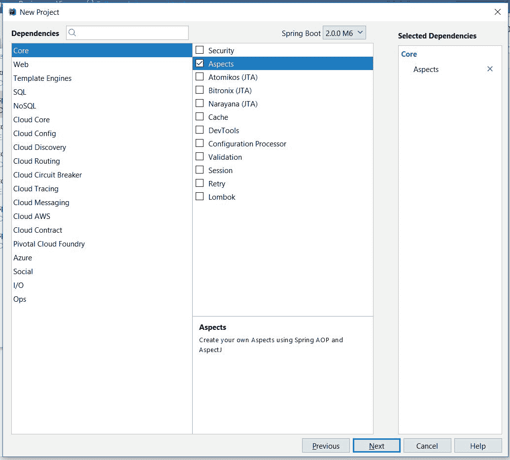
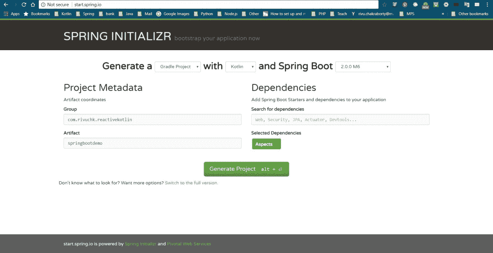

# 为 Kotlin 开发者介绍使用 Spring 进行 Web 编程

Kotlin 是一种强大的语言，当与 Spring 框架结合使用时，其力量更是倍增。到目前为止，你已经学习了响应式编程的概念以及如何将这些概念应用到 Kotlin 中。到目前为止，我们开发和编写的代码是与控制台交互的，但在开发专业应用程序时，我们不会这样做。我们将构建在移动设备上运行的应用程序，或者构建 Web 应用程序或 REST API。至少，这些都是最常见的专业软件解决方案。

那么，如何构建它们？如何创建 RESTful Web API 和 Android 应用程序？让我们来探索。本书的最后一章将致力于构建 REST API 和 Android 应用程序，最重要的是，使它们具有响应性。Spring 是一个如此广泛的话题，以至于在一个章节中涵盖它是不可能的，因此我们将有两个章节专门介绍 Spring。

本章将从介绍 Spring 开始，到本章结束时，你应该足够熟练，能够使用 Spring 在 Kotlin 中编写 REST API。我们不会在本章中添加响应式功能，因为我们不想让你分心于 Spring 的概念和思想。我们希望你在继续进行使它们具有响应性之前，能够充分掌握 Spring 的概念和知识。

在本章中，我们将涵盖以下主题：

+   Spring 简介，Spring 的历史和起源

+   Spring IoC 和依赖注入

+   Spring 中的面向方面编程

+   Spring Boot 简介

+   使用 Spring Boot 构建 REST API

那么，我们还在等什么呢？让我们开始，熟悉 Spring。

# Spring，Spring 的历史和起源

Spring 是什么？我们无法给出简短的答案。用一句话或两句话来定义 Spring 真的是很难。许多人可能会说 Spring 是一个框架，但这对于 Spring 来说也是一种低估，因为它也可能被称为“框架的框架”。Spring 为你提供了许多工具，例如 **DI**（**依赖注入**）、**IoC**（**控制反转**）和 **AOP**（**面向方面编程**）。虽然我们可以在几乎任何类型的 Java 或 Kotlin JVM 应用程序中使用 Spring，但在基于 Java EE 平台开发 Web 应用程序时，它最有用。在深入了解 Spring 之前，我们应该首先了解 Spring 的起源和为什么它会出现，以及它是如何演变的。

# Spring 的起源和历史

自 Java 诞生以来已经超过二十年了（大约 22 年）。对于企业级应用开发，Java 引入了一些重量级且非常复杂的技术。

在 2003 年，Rod Johnson 创建了 Spring，作为一种替代重量级和复杂的 Enterprise Java 技术（EJB）的方案，以便在 Java 中轻松开发企业应用程序。由于 Spring 轻量级、灵活且易于使用，它很快获得了人气。随着时间的推移，EJB 和 Java 企业版（当时称为 J2EE）演变为支持以 POJO 为导向的编程模型，如 Spring。不仅如此，可以说受到 Spring 的启发，EJB 也开始提供 AOP、DI 和 IoC。

然而，Spring 从未回头。随着 EJB 和 Java EE 开始包括受 Spring 启发的想法，Spring 开始探索更多非常规和未探索的技术领域，如大数据、云计算、移动应用开发，甚至反应式编程，将 EJB 和 Java EE 远远抛在后面。

在年初的 2017 年 1 月，Spring 通过宣布支持 Kotlin（是的，他们甚至在 Google 之前宣布了 Kotlin 支持）并发布了一些 Kotlin API，让所有人都感到惊讶。而且，当 Kotlin 的力量与已经强大的 Spring 框架结合时，两者都变得更加强大。他们添加 Kotlin 支持的原因如下：

Kotlin 的一个关键优势是它提供了与用 Java 编写的库非常好的互操作性。但是，有方法可以更进一步，允许在开发下一个 Spring 应用程序时编写完全符合 Kotlin 习惯的代码。除了 Kotlin 应用程序可以利用的 Spring 框架对 Java 8 的支持，如函数式 Web 或 Bean 注册 API 之外，还有额外的 Kotlin 专用功能，这应该允许你达到新的生产力水平。

正因如此，我们在 Spring 框架 5.0 中引入了专门的 Kotlin 支持。

由 Pivotal Spring 团队 [`spring.io/blog/2017/01/04/introducing-kotlin-support-in-spring-framework-5-0`](https://spring.io/blog/2017/01/04/introducing-kotlin-support-in-spring-framework-5-0)。

因此，让我们首先创建并设置我们的 Spring 项目。

# 依赖注入和 IoC

**控制反转**（**IoC**）是一种编程技术，其中对象耦合在运行时由一个组装对象绑定，通常在编译时通过静态分析是不可知的。IoC 可以通过依赖注入来实现。我们可以这样说，IoC 是一个理念，而依赖注入是其实现。那么，什么是依赖注入呢？让我们来了解一下。

依赖注入是一种在实例化时一个组件为另一个组件提供依赖的技术。这个定义听起来很复杂，对吧？让我们用一个例子来解释它。考虑以下接口：

```kt
    interface Employee { 
      fun executeTask() 
    } 
    interface Task { 
      fun execute() 
    } 
```

上述程序的一个常见实现如下。

`Employee` 类如下：

```kt
    class RandomEmployee: Employee { 
      val task = RandomTask() 
      override fun executeTask() { 
        task.execute() 
      } 
    } 
```

`Task` 接口实现如下：

```kt
    class RandomTask : Task { 
      override fun execute() { 
        println("Executing Random Task") 
      } 
    } 
```

然后，我们将在 `main` 方法中创建并使用 `RandomEmployee` 类的实例，如下所示：

```kt
    fun main(args: Array<String>) { 
      RandomEmployee().executeTask() 
    } 
```

`RandomTask`类是一个简单的类，实现了名为`Task`的接口，该接口有一个名为`execute`的函数。另一方面，`RandomEmployee`类依赖于`Task`类。那么，我们所说的依赖是什么意思呢？通过依赖，我们指的是`Employee`类实例的输出依赖于`Task`类。

让我们看看以下输出：



前面的程序将正常工作，实际上，它是一个教科书程序。在大学/学院，当我们第一次学习编码时，我们学习了在构造函数内部或构建时初始化变量和/或属性的方法。

现在，试着回忆一下你之前几章学到的内容。我们应该测试我们所写的一切。现在，再次看看代码——这段代码是否可测试？或者甚至可维护？你将如何确保正确的*Employee*被分配了正确的*Task*？这是一个紧密耦合的代码。

你应该始终使用简洁的耦合。诚然，没有耦合我们无法取得很大成就。另一方面，紧密耦合的代码使得测试和维护变得困难。

而不是让对象在构建时创建它们的依赖关系，依赖注入在创建时通过某个第三方类为对象提供它们的依赖关系。这个第三方类也将与系统中的每个对象进行协调。以下图表展示了依赖注入背后的基本思想：



这张图片清楚地描述了依赖注入的流程。将有一个 Config 类（在 Spring 中，可以有一个 XML 配置文件，也可以有一个 Config 类）来创建和驱动 Bean 容器。该 Bean 容器将控制 bean 或 POJO 的创建，并将它们传递到所需的位置。

感到困惑？让我们动手编写代码并实现前面的概念。让我们从`Employee`接口的新实现开始，如下所示：

```kt
    class SoftwareDeveloper(val task: ProgrammingTask) : Employee { 
      override fun executeTask() { 
        task.execute() 
      } 
    } 
```

`SoftwareDeveloper`类只能执行`ProgrammingTask`。现在，看看下面的 XML`config`文件：

```kt
    <?xml version="1.0" encoding="UTF-8"?> 
    <beans  

       xsi:schemaLocation="http://www.springframework.org/schema/beans 
       http://www.springframework.org/schema/beans/spring-beans.xsd"> 

      <bean id="employee"  
       class="com.rivuchk.reactivekotlin.springdi.SoftwareDeveloper"> 
       <constructor-arg ref="task"/> 
      </bean> 

      <bean id="task" class="com.rivuchk.reactivekotlin.
      springdi.ProgrammingTask"/> 

   </beans> 
```

`ProgrammingTask`类是`Task`接口的新实现，如下所示：

```kt
class ProgrammingTask: Task {
    override fun execute() {
        println("Writing Programms")
    }
}
```

此文件应位于`\src\main\resources\META-INF\employee.xml`。现在，让我们尝试理解`config`文件。我们使用`bean`标签声明了每个 bean。然后，我们使用`constructor-arg`标签来指示该 bean 中的构造函数参数。

如果你想在 bean 中将另一个对象作为`constructor-argref`传递，你必须将该引用对象声明为 bean。或者，你可以像本章后面讨论的那样传递`constructor-arg value`。

更新的`main`函数将如下所示：

```kt
    fun main(args: Array<String>) { 
 val context = ClassPathXmlApplicationContext( "META-INF/spring/employee.xml")//(1) val employee =  
        context.getBean(Employee::class.java)//(2) 
        employee.executeTask() 
 context.close()//(3) 
    } 
```

在深入了解前面程序的细节之前，让我们先看看它的输出：



DI 与 XML 配置程序的裁剪输出

前几行红色的输出是 Spring 框架的日志。然后，我们可以看到输出为 Writing Programms。

现在，让我们尝试理解这个程序。`ClassPathXmlApplicationContext`是我们图中提到的 Bean 容器。它创建并记录 XML 文件中提到的所有 bean，并在需要时提供给我们。传递给`ClassPathXmlApplicationContext`构造函数的`String`是 XML 配置文件的相对路径。

在注释`(2)`中，我们使用了`context.getBean()`来获取`Employee`实例。这个函数接受一个类名作为参数，并根据 XML 配置创建该类的实例。

在注释`(3)`中，我们关闭了`context`。`context`作为一个 Bean 容器，始终为你携带配置，这会阻塞内存。为了清理内存，我们应该关闭`context`。

现在，既然我们已经对通过 XML 配置文件进行依赖注入有了些了解，我们应该转向基于注解的配置类，看看它是如何工作的。

# Spring 注解配置

除了 XML 之外，我们还可以在 POJO 类中通过注解定义 Spring 配置，这个类不会被用作 bean。在上一节中，我们以`Employee`任务为例；现在让我们以`Student`-`Assignment`为例，一个类似的例子。然而，这次，我们不会使用接口；而是直接使用类。

因此，这是接受 lambda 作为构造函数参数的`Assignment`类：

```kt
    class Assignment(val task:(String)->Unit) { 
      fun performAssignment(assignmentDtl:String) { 
        task(assignmentDtl) 
      } 
    } 
```

这个类接受一个 lambda 作为`task`，在`performAssignment()`方法中稍后执行。以下是接受`Assignment`作为属性的`Student`类：

```kt
    class Student(val assignment: Assignment) { 
      fun completeAssignment(assignmentDtl:String) { 
        assignment.performAssignment(assignmentDtl) 
      } 
    } 
```

因此，`Student`将依赖于其`Assignment`，而`Assignment`将依赖于其任务定义（Lambda）。以下图描述了此示例的依赖流：



如何在代码中描述这个依赖流？使用注解配置就很容易。以下是我们所使用的`Configuration`类：

```kt
    @Configuration 
    class Configuration { 

      @Bean 
      fun student() = Student(assignment()) 

      @Bean 
      fun assignment()  
        = Assignment { assignmentDtl -> println
        ("Performing Assignment $assignmentDtl") } 
   } 
```

简单直接，不是吗？这个类被注解了`@Configuration`，返回`Student`和`Assignment`对象的函数被注解了`@Bean`。

现在，如何使用这个类？很简单，就像之前的那个一样，看看这里的`main`函数：

```kt
    fun main(args: Array<String>) { 
      val context = AnnotationConfigApplicationContext   
      (Configuration::class.java) 
      val student = context.getBean(Student::class.java) 
      student.completeAssignment("One") 
      student.completeAssignment("Two") 
      student.completeAssignment("Three") 

      context.close() 
    } 
```

我们没有使用`ClassPathXmlApplicationContext`，而是使用了`AnnotationConfigApplicationContext`并传递了`Configuration`类。程序的其他部分保持不变。

这是程序的输出：



DI with Annotation Configuration 程序的裁剪输出

因此，我们学习了使用 Spring 的依赖注入。这真的很简单，不是吗？实际上，Spring 框架让一切变得简单；无论他们提供什么功能，他们都让它像从 POJO 类中调用方法一样简单。Spring 真正利用了 POJO 的力量。

因此，既然我们已经掌握了依赖注入，让我们继续学习面向切面的编程。

# Spring – AOP

在学习如何使用 Spring 实现面向切面编程之前，我们首先应该了解什么是面向切面编程。面向切面编程的定义表明，它是一种旨在通过允许分离横切关注点来增加模块化的编程范式。它是通过向现有代码添加额外的行为（建议）来实现的，而不修改代码本身。

那么，我们所说的横切关注点是什么意思？让我们来探索一下。

在实际项目中，多个组件扮演着各自的角色。例如，如果我们考虑我们之前的场景，`Student`类本身就是一个组件，同样可能还有一个评估学生表现的教师组件。因此，让我们在我们的程序中添加一个教师。

`Faculty`类应该足够简单，只需要一个评估学生的方法。如下所示：

```kt
    class Faculty { 
      fun evaluateAssignment() { 
        val marks = Random().nextInt(10) 
        println("This assignment is evaluated and given $marks points") 
      } 
    } 
```

现在，教师应该如何评分学生？他/她必须以某种方式知道学生已经完成了作业。这种业务逻辑的常见实现方法是通过修改`Student`类，如下所示：

```kt
    class Student(val assignment: Assignment, 
      val faculty: Faculty) { 
        fun completeAssignment(assignmentDtl:String) { 
          assignment.performAssignment(assignmentDtl) 
          faculty.evaluateAssignment() 
        } 
      } 
```

`Faculty`实例将被传递给`Student`实例，一旦学生完成作业，它将调用`Faculty`实例并指示它评估作业。然而，再思考一下。这是否是一个合适的实现？为什么学生要指示他的/她的教师？评估学生的作业是教师的工作；它只需要以某种方式得到通知。

那正是所谓的横切关注点。`Faculty`和`Student`是程序的不同组件。在作业审查时，它们不应该有直接的交互。

AOP 让我们实现相同的功能。因此，在这里，`Student`类将恢复到几乎原始的状态：

```kt
    open class Student(public val assignment: Assignment) { 
      open public fun completeAssignment(assignmentDtl:String) { 
        assignment.performAssignment(assignmentDtl) 
      } 
    } 
```

你注意到了上一节中`Student`类实际代码中的差异吗？是的，在这里我们向类声明中添加了`open`关键字以及类的所有属性和函数。原因是，为了实现 AOP，Spring 会子类化我们的 bean 并覆盖方法（包括我们属性的 getter）。然而，在 Kotlin 中，除非你明确指定为`open`，否则一切都是最终的，这将阻止 Spring AOP 实现其目的。因此，为了使 Spring 工作，我们必须将每个属性和方法都指定为`open`。

`main`方法将类似，只是我们又回到了基于 XML 的配置。看看下面的代码片段：

```kt
    fun main(args: Array<String>) { 
      val context = ClassPathXmlApplicationContext( 
            "META-INF/spring/student_faculty.xml" 
      ) 
      val student = context.getBean(Student::class.java) 
      student.completeAssignment("One") 
      student.completeAssignment("Two") 
      student.completeAssignment("Three") 

      context.close() 
    } 
```

唯一包含新内容的文件是配置文件。在我们解释它之前，看看配置文件：

```kt
    <?xml version="1.0" encoding="UTF-8"?> 
    <beans  

       xsi:schemaLocation="http://www.springframework.org/schema/beans 
       http://www.springframework.org/schema/beans/spring-beans.xsd 
       http://www.springframework.org/schema/aop 
       http://www.springframework.org/schema/aop/spring-aop.xsd"> 

    <bean id="student" class="com.rivuchk.reactivekotlin.
      springdi.aop_student_assignment.Student"> 
      <constructor-arg ref="assignment"/> 
    </bean> 

    <bean id="assignment" class="com.rivuchk.reactivekotlin.springdi.
     aop_student_assignment.Assignment" /> 

 <bean id="faculty"    
    class="com.rivuchk.reactivekotlin.springdi.aop_student_assignment.
    Faculty" /><!--1--> <aop:config><!--2--> <aop:aspect  
    ref="faculty"><!--3--> <aop:pointcut                     
    id="assignment_complete"                      
    expression="execution(* *.completeAssignment(..))"/><!--4--> <aop:after pointcut-ref="assignment_complete" method="evaluateAssignment" /><!--5--> 
    </aop:aspect> 
    </aop:config> 

   </beans> 
```

因此，让我们解释一下配置。在注释`(1)`中，我们声明了一个名为`faculty`的新 bean，尽管这对你来说并不是什么新鲜事，你可能已经预料到了。我提到它是为了让你为接下来的几行代码做准备。

在评论 `(2)` 中，我们指出了 AOP 配置的开始。在评论 `(3)` 中，我们指出了这个 AOP 与 `Faculty` 类相关，因为 `Faculty` 类是应该得到通知的类。

在评论 `(4)` 中，我们声明了 `pointcut`。`pointcut` 就像方法上的书签，所以每当该方法被调用时，你的类都应该得到通知。`id` 字段表示该 `pointcut` 的 `id`，这样你就可以在代码中引用它。`expression` 字段表示我们应该为它创建 `pointcut` 的表达式。在这里，使用执行表达式，我们声明 `pointcut` 应该在 `completeAssignment` 方法的执行时触发。

在评论 `(5)` 中，我们声明了在 `Faculty` 类中应该调用的方法，该方法应在 `pointcut` 表达式执行后调用。我们也可以使用 `aop:before` 声明一个在 `pointcut` 之前执行的方法。

现在，让我们看看以下输出：



使用 Spring AOP 程序的 DI 剪影输出

如你所见，每次我们调用 `completeAssignment` 方法时，都会从 `Faculty` 类中调用 `evaluateAssignment` 方法，显然，这是没有代码，只有配置。

# Spring Boot 简介

因此，我们现在已经熟悉了 Spring，特别是 Spring DI 和 AOP。Spring Boot 使开发者的生活变得更简单。到目前为止，我们已经看到了如何仅通过使用 POJO 类和 Spring 配置来执行各种操作。如果告诉你我们可以进一步减少配置，你会作何反应？你会震惊吗？那么，请做好准备，因为这是真的。使用 Spring Boot，你可以通过最少的配置和几个步骤来准备你的代码。

那么，Spring Boot 是什么？它是一个为 Spring 框架提供 **RAD**（**快速应用开发**）功能的 Spring 模块。它旨在简化新 Spring 应用的启动和开发。该框架采用了一种有观点的配置方法，使开发者免于定义样板配置，从而进一步减少开发时间。

那么，让我们开始吧。如果你使用的是 IntelliJ IDEA Ultimate 版本，你可以按照以下步骤创建一个 Spring Boot 应用程序：

1.  开始一个新项目。

1.  从新项目对话框中，选择 Spring Initializr，定义项目 SDK，然后点击下一步，如图所示：


1.  在下一屏中，定义 Group、Artifact、Type（Gradle 或 Maven）、Language（Java/Kotlin）、Packaging（Jar/War）、Java Version、Name 和项目的根包，如图所示：



1.  下一屏允许你选择多个 Spring 依赖项。确保在此屏幕上将 Spring Boot 版本设置为 2.0.0 M6 或更高版本。对于 AOP 和 DI，你需要在核心部分下选择 Aspects，如图所示：



1.  提供项目名称和位置，然后点击完成。

难道不是很简单吗？如果你没有 IntelliJ IDEA Ultimate，请不要沮丧。Spring Boot 是面向每个人的。按照以下步骤，使用你拥有的任何 IDE 创建一个新的 Spring Boot 项目：

1.  前往 [`start.spring.io/`](http://start.spring.io/)。

1.  提供以下详细信息，这些与 IntelliJ IDEA 类似：



1.  点击生成项目。项目将被下载到你的机器上。

难道不是足够简单了吗？让我们尝试使用 Spring 创建 API。

# 使用 Spring Boot 创建 Rest API

我们已经看到了 Spring 和 Spring Boot 的力量。所以，让我们毫不拖延地使用它。我们将构建一个 RESTful 网络服务，该服务将返回一个 `Todo` 对象。我们将在下一章进一步增强这个项目，我们将添加 `Todo` 并从数据库中获取 `Todo` 列表。我们将为此目的使用 JPA 和 Hibernate，以及 Spring。

当我们完成这个示例时，我们应该得到以下响应：


浏览器输出的裁剪截图

那么，让我们先创建一个新的项目。你可以使用 [`start.spring.io/`](http://start.spring.io/)，或者你也可以使用 IntelliJ IDEA 来创建一个新项目。

在你创建了新项目之后，你会看到有一个 `Application` 类；不要过多关注它，它在几乎所有的 Spring Boot 应用程序中都有。我们需要创建一个新的类用于 `Todo`，如下所示：

```kt
    data class Todo ( 
        var id:Int = 0, 
        var todoDescription:String, 
        var todoTargetDate:String, 
        var status:String 
    ) 
```

REST API 要求我们创建 `RestController`，这将作为 API 请求的端点，所以这里是我们的 `RestController`：

```kt
 @RestController@RequestMapping("/api") 
    class TodoController { 
 @RequestMapping("/get_todo") 
      fun getTodo() = Todo(1,"TODO Project","31/11/2017","Running") 
   } 
```

仔细研究这个小类。首先，我们用 `@RestController` 和 `@RequestMapping` 注解了我们的类。它们的目的很简单：`@RestController` 表示这个类将作为 `Controller`，也就是说，所有的 API 请求都应该通过这个类，`@RequestMapping("/api")` 表示这个类的 URL 将在基本 URL 后添加一个 `/api` 后缀（注意截图中的 URL 是 `http://127.0.0.1:8080/api/get_todo`）。如果我们想省略第二个注解，也是可以的。

然后，我们有 `getTodo()` 函数；这个方法需要 `@RequestMapping` 注解，因为它将定义端点。这个方法也很简单——它只是返回一个静态创建的 `Todo` 新对象。

什么？你期待更多吗？很抱歉让你失望，但我们已经完成了 API。你只需运行项目，然后访问 `http://127.0.0.1:8080/api/get_todo` 来获取以下 JSON 响应：

```kt
    {"id":1,"todoDescription":"TODO   
    Project","todoTargetDate":"31/11/2017","status":"Running"} 
```

这不是足够简单了吗？

# 摘要

在本章中，你通过 Kotlin 了解了 Spring。我们学习了依赖注入和面向切面编程。我们学习了如何通过 Spring 框架，一个简单的 POJO 类可以展现出巨大的力量。在本章中，我们还学习了如何使用 Spring 创建简单的 API。

在下一章中，我们将专注于使用 JPA 和 Hibernate 来增强我们的 API，使其成为一个功能齐全的 API，以便与 MySQL 数据库协同工作。我们还将学习如何使用 Spring 实现响应式编程。

因此，不要等待！立即前往下一章。我们的 API 仍然不完整。
