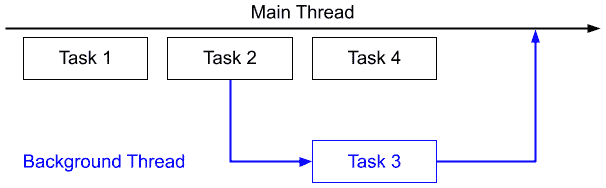
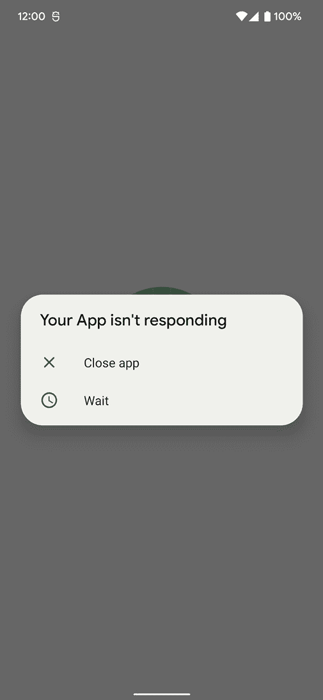
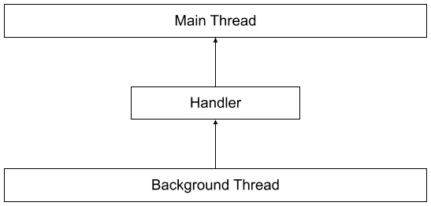
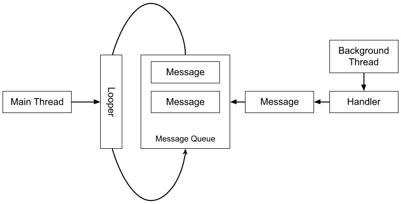
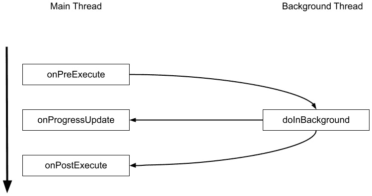
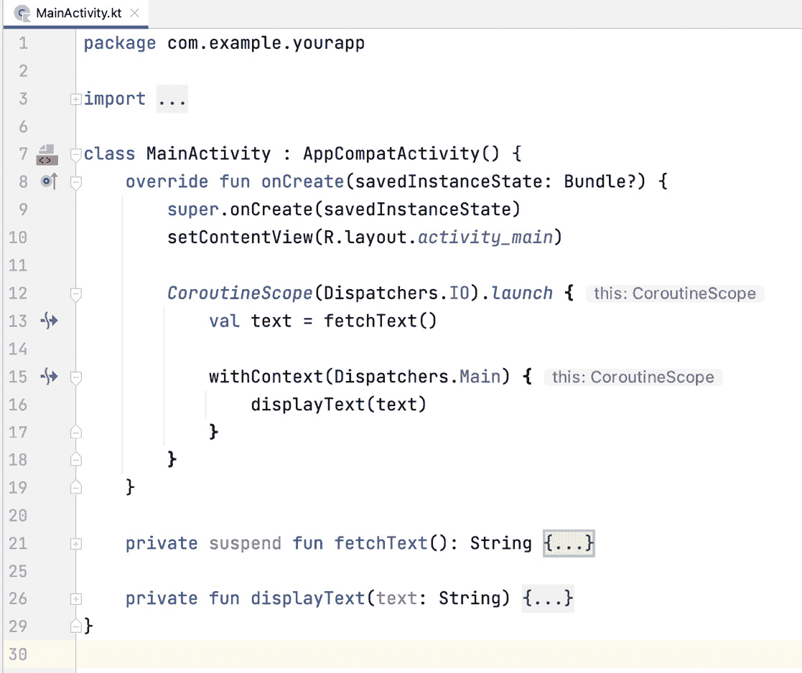
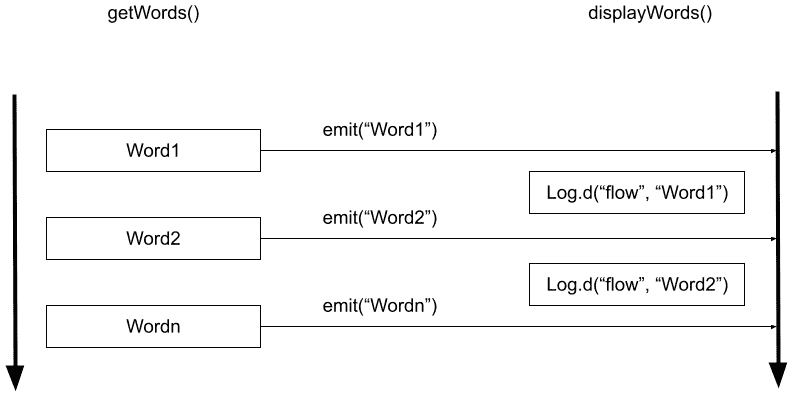

# 第一章：*第一章*：Android 异步编程简介

有些 Android 应用程序可以独立工作。但大多数应用程序从本地数据库或后端服务器检索数据或发送数据。这些例子包括从社交网络获取帖子、保存列表中的收藏、上传图片或更新个人资料信息。这些任务和其他资源密集型计算可能立即完成或需要一段时间才能完成。诸如互联网连接、设备规格和服务器设置等因素会影响这些操作所需的时间。

长时间运行的操作不应在主 UI 线程上执行，因为应用程序将在它们完成之前被阻塞。应用程序可能会对用户无响应。用户可能不知道发生了什么，这可能会促使他们关闭应用程序并重新打开它（取消原始任务或重新执行）。应用程序也可能突然崩溃。如果这种情况频繁发生，一些用户甚至可能停止使用你的应用程序。

为了防止这种情况发生，你需要使用异步编程。可能需要不定时长的任务必须异步执行。它们必须在后台运行，与其他任务并行。例如，当向你的后端服务器发送信息时，应用程序显示用户界面，用户可以与之交互。当操作完成时，你可以更新用户界面或通知用户（通过对话框或 Snackbar 消息）。

通过这本书，你将学习如何使用 Kotlin 协程和流简化 Android 中的异步编程。

在本章中，你将首先回顾异步编程的概念。然后，你将了解现在在 Android 中正在进行的各种方式，以及它们可能不再是未来最佳的方式。接着，你将介绍 Android 中执行异步编程的新、推荐方式：协程和流。

本章涵盖三个主要主题：

+   异步编程

+   线程、AsyncTasks 和 `Executors`

+   新的方法——协程和流

到本章结束时，你将基本了解异步编程，并知道如何在 Android 中使用线程、AsyncTasks 和 `Executors` 来实现它。最后，你将发现 Kotlin 协程和流，因为这些是 Android 中推荐进行异步编程的方式。

# 技术要求

你需要下载并安装 Android Studio 的最新版本。你可以在 [`developer.android.com/studio`](https://developer.android.com/studio) 找到最新版本。为了获得最佳学习体验，建议使用以下规格的计算机：Intel Core i5 或更高版本，至少 4 GB RAM，以及 4 GB 可用空间。

本书中的代码示例可以在 GitHub 上找到，网址为 https: [github.com/PacktPublishing/Simplifying-Android-Development-with-Coroutines-and-Flows](http://github.com/PacktPublishing/Simplifying-Android-Development-with-Coroutines-and-Flows)。

# 理解异步编程

在本节中，我们将首先探讨异步编程。异步编程是一种编程方法，允许工作独立于主应用程序线程进行。

一个正常的程序将按顺序运行。它将执行一个任务，并在前一个任务完成后移动到下一个任务。对于简单的操作，这是可以的。然而，有些任务可能需要很长时间才能完成，例如以下任务：

+   从数据库中获取数据或将数据保存到数据库

+   从网络获取、添加或更新数据

+   处理文本、图像、视频或其他文件

+   复杂的计算

当应用程序执行这些任务时，它将看起来冻结且对用户无响应。它们将无法在应用程序中执行其他任何操作，直到任务完成。

异步编程解决了这个问题。您可以在后台线程（与主线程并行）上运行可能无限期处理的任务，而不会冻结应用程序。这将使用户在原始任务运行时仍然可以与应用程序或用户界面进行交互。当任务完成或遇到错误时，您可以使用主线程通知用户。

异步编程的视觉表示如下所示：



图 1.1 – 异步编程

**任务 1** 和 **任务 2** 在主线程上运行。**任务 2** 在后台线程上启动 **任务 3**。当 **任务 3** 运行时，主线程可以继续执行其他任务，例如 **任务 4**。当 **任务 3** 完成后，它将返回主线程。

异步编程是开发人员必须掌握的重要技能，尤其是对于移动应用程序开发。移动设备功能有限，并非所有位置都有稳定的网络连接。

在 Android 中，如果您在主线程上运行一个任务并且它花费了太长时间，应用程序可能会变得无响应或看起来冻结。应用程序也可能意外崩溃。您可能会遇到**应用程序无响应**（**ANR**）错误，如下面的截图所示：



图 1.2 – ANR 对话框

从 Android 3.0（蜂巢）开始，在主线程上运行网络操作将导致 `android.os.NetworkOnMainThreadException`，这将使您的应用程序崩溃。

ANR 对话框和崩溃可能会让您的用户感到烦恼。如果它们经常发生，他们可能会完全停止使用您的应用程序，并选择另一个应用程序。为了防止它们在您的应用程序中发生，您必须在后台线程上运行可能需要很长时间的任务。

在本节中，你回顾了异步编程的概念以及如何使用它来运行长时间运行的任务而不会冻结应用程序。你将在下一节中探索在 Android 中使用异步编程的各种方法。

# 探索线程、AsyncTasks 和 Executors

在 Android 中，你可以通过多种方式在后台线程上运行任务。在本节中，你将探索在 Android 中进行异步编程的各种方法，包括使用线程、AsyncTask 和`Executors`。你将学习如何在后台线程上启动任务，然后使用结果更新主线程。

## 线程

线程是并发运行代码的执行单元。在 Android 中，UI 线程是主线程。你可以使用`java.lang.Thread`类在另一个线程上执行任务：

```kt
private fun fetchTextWithThread() {
```

```kt
  Thread {
```

```kt
        // get text from network
```

```kt
        val text = getTextFromNetwork()
```

```kt
  }.start()
```

```kt
}
```

要运行线程，调用`Thread.start()`。大括号内的所有内容将在另一个线程上执行。你可以在这里执行任何操作，但不能更新 UI，因为你将遇到`NetworkOnMainThreadException`。

要更新 UI，例如从网络中获取并显示在`TextView`中的文本，你需要使用`Activity.runOnUiThread()`。`runOnUIThread`内部的代码将在主线程上执行，如下所示：

```kt
private fun fetchTextWithThread() {
```

```kt
  Thread {
```

```kt
          // get text from network
```

```kt
          val text = getTextFromNetwork()
```

```kt
    runOnUiThread {
```

```kt
        // Display on UI
```

```kt
        displayText(text)
```

```kt
    }
```

```kt
  }.start()
```

```kt
}
```

`runOnUIThread`将在主 UI 线程上执行`displayText(text)`函数。

如果你不是从活动启动线程，你可以使用处理器而不是`runOnUiThread`来更新 UI，如图*1.3*所示：



图 1.3 – 线程和处理器

一个处理器（`android.os.Handler`）允许你在线程之间进行通信，例如从后台线程到主线程，如图所示。你可以将一个循环器传递给处理器构造函数以指定任务将在哪个线程上运行。循环器是一个在线程队列中运行消息的对象。

要将处理器附加到主线程，你应该使用`Looper.getMainLooper()`，如下例所示：

```kt
private fun fetchTextWithThreadAndHandler() {
```

```kt
  Thread {
```

```kt
    // get text from network
```

```kt
           val text = getTextFromNetwork()
```

```kt
    Handler(Looper.getMainLooper()).post {
```

```kt
      // Display on UI
```

```kt
      displayText(text)
```

```kt
    }
```

```kt
  }.start()
```

```kt
}
```

`Handler(Looper.getMainLooper())`创建一个与主线程绑定的处理器，并在主线程上发布`displayText()`可运行函数。

`Handler.post (Runnable)`函数将可运行的函数入队到指定线程上执行。post 函数的其他变体包括`postAtTime(Runnable)`和`postDelayed (Runnable, uptimeMillis)`。

或者，你也可以使用处理器发送一个`android.os.Message`对象，如图*1.4*所示：



图 1.4 – 线程、处理器和消息

一个线程的处理器允许你向线程的消息队列发送消息。处理器的循环器将执行队列中的消息。

要在您的 `Message` 对象中包含您想要发送的实际消息，您可以使用 `setData(Bundle)` 来传递一个包含数据的单个数据包。您还可以使用消息 `class` 的公共字段（`arg1`、`arg2` 和 `what` 用于整数值，以及 `obj` 用于对象值）。

您必须然后创建 `Handler` 的子类并重写 `handleMessage(Message)` 函数。在那里，您可以从消息中获取数据并在处理程序的线程中处理它。

您可以使用以下函数来发送消息：`sendMessage(Message)`、`sendMessageAtTime(Message, uptimeMillis)` 和 `sendMessageDelayed(Message, delayMillis)`。以下代码显示了使用 `sendMessage` 函数发送包含数据包的消息的用法：

```kt
private val key = "key"
```

```kt
private val messageHandler = object :
```

```kt
   Handler(Looper.getMainLooper()) {
```

```kt
    override fun handleMessage(message: Message) {
```

```kt
    val bundle = message.data
```

```kt
    val text = bundle.getString(key, "")
```

```kt
    //Display text
```

```kt
    displayText(text)
```

```kt
  }
```

```kt
}
```

```kt
private fun fetchTextWithHandlerMessage() {
```

```kt
  Thread {
```

```kt
    // get text from network
```

```kt
    val text = getTextFromNetwork()
```

```kt
    val message = handler.obtainMessage()
```

```kt
    val bundle = Bundle()
```

```kt
    bundle.putString(key, text)
```

```kt
    message.data = bundle
```

```kt
    messageHandler.sendMessage(message)
```

```kt
  }.start()
```

```kt
}
```

在这里，`fetchTextWithHandlerMessage()` 在后台线程中从网络获取文本。然后它创建一个包含具有 `key` 键的字符串的数据包对象的 `Message`，以发送该文本。然后处理程序可以通过 `handleMessage()` 函数获取消息的数据包，并使用相同的键从数据包中获取字符串。

您还可以发送具有整数值（即 `what`）的空消息，您可以在 `handleMessage` 函数中使用这些空消息来识别接收到的消息。这些发送空消息的函数是 `sendEmptyMessage(int)`、`sendEmptyMessageAtTime(int, long)` 和 `sendEmptyMessageDelayed(int, long)`。

此示例使用 `0` 和 `1` 作为值来表示什么（“what” 是 `Message` 类的一个字段，它是一个用户定义的消息代码，以便接收者可以识别这条消息的内容）：`1` 表示后台任务成功的情况，`0` 表示失败的情况：

```kt
private val emptymesageHandler = object :
```

```kt
  Handler(Looper.getMainLooper()) {
```

```kt
  override fun handleMessage(message: Message) {
```

```kt
    if (message.what == 1) {
```

```kt
      //Update UI
```

```kt
    } else {
```

```kt
      //Show Error
```

```kt
    }
```

```kt
  }
```

```kt
}
```

```kt
private fun fetchTextWithEmptyMessage() {
```

```kt
  Thread {
```

```kt
    // get text from network
```

```kt
...
```

```kt
    if (failed) {  
```

```kt
      emptyMessageHandler.sendEmptyMessage(0)
```

```kt
    } else {
```

```kt
      emptyMessageHandler.sendEmptyMessage(1)
```

```kt
    }
```

```kt
  }.start()
```

```kt
}
```

在前面的代码片段中，后台线程从网络获取文本。如果操作成功，则发送一个空的 `1` 消息，如果不成功，则发送 `0`。处理程序通过 `handleMessage()` 函数获取消息的 `what` 整数值，这对应于 `0` 或 `1` 的空消息。根据此值，它可以选择更新 UI 或向主线程显示错误。

使用线程和处理程序适用于后台处理，但它们有以下缺点：

+   每次您需要在后台运行任务时，都应该创建一个新的线程并使用 `runOnUiThread` 或一个新的处理程序来将消息回发到主线程。

+   创建线程可能会消耗大量的内存和资源。

+   它也可能减慢您的应用程序。

+   多个线程会使您的代码更难调试和测试。

+   代码可能变得难以阅读和维护。

使用线程会使处理异常变得困难，这可能导致崩溃。

由于线程是异步编程的低级 API，因此最好使用建立在线程之上的 API，例如 executors 和，直到它被弃用之前的 `AsyncTask`。您可以通过使用 Kotlin 协程来完全避免它，您将在本章后面了解更多关于 Kotlin 协程的内容。

在下一节中，您将探索回调，这是另一种异步 Android 编程的方法。

## 回调

在 Android 中进行异步编程的另一种常见方法是使用回调。回调是一个在异步代码执行完成后将运行的函数。一些库提供了回调函数，开发者可以在他们的项目中使用。

以下是一个简单的回调示例：

```kt
private fun fetchTextWithCallback() {
```

```kt
  fetchTextWithCallback { text ->
```

```kt
    //display text
```

```kt
    displayText(text)
```

```kt
    }
```

```kt
}
```

```kt
fun fetchTextWithCallback(onSuccess: (String) -> Unit) {    
```

```kt
     Thread {
```

```kt
          val text = getTextFromNetwork()    
```

```kt
          onSuccess(text)
```

```kt
    }.start()
```

```kt
}
```

在前面的例子中，在后台获取文本后，将调用 `onSuccess` 回调，并在 UI 线程上显示文本。

回调对于简单的异步任务工作得很好。然而，它们很容易变得复杂，尤其是在嵌套回调函数和处理错误时。这使得阅读和测试变得困难。你可以通过避免嵌套回调并将函数拆分为子函数来避免这种情况。在本章的稍后部分，你将了解更多关于协程的内容。

## AsyncTask

使用 `AsyncTask`，你不需要手动处理线程。

要使用 `AsyncTask`，你必须创建一个具有三个泛型类型的子类：

```kt
AsyncTask<Params?, Progress?, Result?>()
```

这些类型如下：

+   `Params`: 这是 `AsyncTask` 的输入类型，如果没有输入则需要，则为空。

+   `Progress`: 此参数用于指定后台操作的进度，如果没有需要跟踪进度，则为 `Void`。

+   `Result`: 这是 `AsyncTask` 的输出类型，如果没有输出要显示，则为空。

例如，如果你要创建用于从特定端点下载文本的 `AsyncTask`，你的 `Params` 将是 URL (`String`)，而 `Result` 将是文本输出 (`String`)。如果你想跟踪下载文本剩余时间的百分比，你可以使用 `Integer` 作为 `Progress`。你的类声明可能如下所示：

```kt
class DownloadTextAsyncTask : AsyncTask<String, Integer,
```

```kt
 String>()
```

你可以使用以下代码启动 `AsyncTask`：

```kt
DownloadTextAsyncTask().execute("https://example.com")
```

`AsyncTask` 有四个事件可以用于你的后台处理：

+   `doInBackground`: 此事件指定将在后台运行的实际任务，例如从远程服务器获取/保存数据。这是唯一一个你必须重写的事件。

+   `onPostExecute`: 此事件指定在后台操作完成后在 UI 线程上运行的任务，例如显示结果。

+   `onPreExecute`: 此事件在执行实际任务之前在 UI 线程上运行，通常显示进度加载指示器。

+   `onProgressUpdate`: 此事件在 UI 线程上运行，表示后台进程的进度，例如显示完成任务剩余的时间。

*图 1.5* 中的图表可视化了这些 `AsyncTask` 事件以及它们在哪些线程上运行：



图 1.5 – 主线程和后台线程中的 AsyncTask 事件

`onPreExecute`、`onProgressUpdate` 和 `onPostExecute` 函数将在主线程上运行，而 `doInBackground` 在后台线程上执行。

回到我们的例子，你的 `DownloadTextAsync` 类可能如下所示：

```kt
class DownloadTextAsyncTask : AsyncTask<String, Void,
```

```kt
 String>() {
```

```kt
        override fun doInBackground(vararg params:
```

```kt
          String?): String? {
```

```kt
            valtext = getTextFromNetwork(params[0] ?: "")
```

```kt
            //get text from network
```

```kt
            return text
```

```kt
        }
```

```kt
        override fun onPostExecute(result: String?) {
```

```kt
            //Display on UI
```

```kt
        }
```

```kt
}
```

在`DownloadTextAsync`中，`doInBackground`从网络获取文本并将其作为字符串返回。然后`onPostExecute`将被调用，并带有可以显示在 UI 线程中的字符串。

`AsyncTask`可能导致上下文泄露、错过回调或配置更改时崩溃。例如，如果你旋转屏幕，活动将被重新创建，并且可以创建另一个`AsyncTask`实例。原始实例不会自动取消，当它完成并返回`onPostExecute()`时，原始活动已经不存在了。

使用`AsyncTask`也会使你的代码更加复杂，可读性降低。截至 Android 11，`AsyncTask`已被弃用。建议使用`java.util.concurrent`或 Kotlin 协程。

在下一节中，你将探索用于异步编程的`java.util.concurrent`类之一，即`Executors`。

## 执行器

在`java.util.concurrent`包中，你可以使用`java.util.concurrent.Executor`类进行异步编程。执行器是一个高级 Java API，用于管理线程。它是一个接口，具有一个单一的功能，即`execute(Runnable)`，用于执行任务。

要创建执行器，你可以使用`java.util.concurrent.Executors`类中的实用方法。`Executors.newSingleThreadExecutor()`创建一个具有单个线程的执行器。

使用`Executor`的异步代码将如下所示：

```kt
val handler = Handler(Looper.getMainLooper())
```

```kt
private fun fetchTextWithExecutor() {
```

```kt
  val executor = Executors.newSingleThreadExecutor()
```

```kt
  executor.execute {
```

```kt
    // get text from network
```

```kt
           val text = getTextFromNetwork()
```

```kt
    handler.post {
```

```kt
      // Display on UI
```

```kt
    }
```

```kt
  }
```

```kt
}
```

使用`Looper.getMainLooper()`的处理器允许你在后台任务完成后与主线程通信，以便更新 UI。

`ExecutorService`是一个可以执行更多操作的执行器，其子类之一是`ThreadPoolExecutor`，这是一个实现了线程池的`ExecutorService`类，你可以自定义它。

`ExecutorService`有`submit(Runnable)`和`submit(Callable)`函数，可以执行后台任务。它们都返回一个表示结果的`Future`对象。

`Future`对象有两个你可以使用的功能，`Future.isDone()`用于检查执行器是否已完成任务，`Future.get()`用于获取任务的结果，如下所示：

```kt
val handler = Handler(Looper.getMainLooper()
```

```kt
private fun fetchTextWithExecutorService() {
```

```kt
  val executor = Executors.newSingleThreadExecutor()
```

```kt
  val future = executor.submit {
```

```kt
     displayText(getTextFromNetwork())    
```

```kt
  }
```

```kt
  ...
```

```kt
  val result = future.get()
```

```kt
}
```

在前面的代码中，使用新的单线程执行器创建的执行器被用来提交可运行函数以从网络获取并显示文本。`submit`函数返回一个`Future`对象，你可以稍后使用`Future.get()`来获取结果。

在本节中，你学习了可以在 Android 中进行异步编程的一些方法。虽然它们仍然有效，你仍然可以使用它们（除了现在已弃用的`AsyncTask`），但如今，它们并不是最佳的选择。

在下一节中，你将学习 Android 中异步编程的新推荐方法：使用 Kotlin 协程和流。

# 新的方法——协程和流

在本节中，你将了解 Android 异步编程的推荐方法：使用协程和流。协程是 Kotlin 库，你可以在 Android 中使用它来执行异步任务。协程是一个用于管理返回单个值的后台任务的库。流是在协程之上构建的，可以返回多个值。

## Kotlin 协程

协程是 Kotlin 库，用于管理后台任务，例如进行网络调用、访问文件或数据库，或执行长时间运行的后台任务。使用 Kotlin 协程是 Google 对 Android 异步编程的官方推荐。他们的 Android Jetpack 库，如 Lifecycle、WorkManager 和 Room-KTX，现在都支持协程。其他 Android 库，如 Retrofit、Ktor 和 Coil，为 Kotlin 协程提供了一级支持。

使用 Kotlin 协程，你可以以顺序方式编写代码。可以将长时间运行的任务制作成 `suspend` 函数。挂起函数是一种可以暂停线程而不阻塞它的函数，因此线程可以继续运行其他任务。当挂起函数完成后，当前线程将恢复执行。这使得代码更容易阅读、调试和测试。协程遵循结构化并发原则。

你可以通过在 `app/build.gradle` 文件依赖项中添加以下行来将协程添加到你的 Android 项目中：

```kt
implementation "org.jetbrains.kotlinx:kotlinx-coroutines-
```

```kt
  core:1.6.0"
```

```kt
implementation "org.jetbrains.kotlinx:kotlinx-coroutines-
```

```kt
  android:1.6.0"
```

`kotlinx-coroutines-core` 是 Kotlin 协程的主要库，而 `kotlinx-coroutines-android` 添加了对主 Android 线程（`Dispatchers.Main`）的支持。

要将一个函数标记为挂起函数，你可以向它添加 `suspend` 关键字；例如，这里有一个调用 `fetchText()` 函数的函数，它从端点检索文本，然后在 UI 线程中显示它：

```kt
fun fetchText(): String {
```

```kt
  ...
```

```kt
}
```

你可以通过在 `suspend` 关键字前缀来将 `fetchText()` 函数制作成挂起函数，如下所示：

```kt
suspend fun fetchText(): String { ... }
```

然后，你可以创建一个协程，该协程将调用 `fetchText()` 挂起函数并显示列表，如下所示：

```kt
lifecycleScope.launch(Dispatchers.IO) {
```

```kt
    val fetchedText = fetchText()  
```

```kt
    withContext(Dispatchers.Main) {
```

```kt
      displayText(fetchedText)
```

```kt
    }
```

```kt
}
```

`lifecycleScope` 是协程将运行的上下文。`launch` 创建一个在 `Dispatchers.IO` 中运行的协程，这是一个用于 I/O 或网络操作的线程。

`fetchText()` 函数将在开始网络请求之前暂停协程。在协程暂停期间，主线程可以执行其他工作。

获取文本后，它将恢复协程。`withContext(Dispatchers.Main)` 将协程上下文切换到主线程，其中 `displayText(text)` 函数将被执行（`Dispatchers.Main`）。

在 Android Studio 中，你的代码中的 `suspend` 函数调用会显示在行号旁边的横幅图标。如图所示，`fetchText()` 和 `withContext()` 行旁边有 `suspend` 函数调用的横幅图标：



图 1.6 – Android Studio 暂停功能调用凹槽图标

你可以在 *第二章*，*理解 Kotlin 协程* 中了解更多关于 Kotlin 协程的信息。

在下一节中，你将了解基于协程构建的 Kotlin Flows，它可以返回多个值序列。

## Kotlin Flows

Flow 是一个基于 Kotlin 协程构建的新 Kotlin 异步流库。Flow 可以发出多个值，而不是单个值，并在一段时间内发出。当需要异步返回多个值时，例如从数据源自动更新，Kotlin Flow 是理想的选择。

Flow 现在已用于 Jetpack 库如 Room-KTX，Android 开发者已经在他们的应用程序中使用 Flow。

要在你的 Android 项目中使用 Kotlin Flows，你必须添加协程。创建对象流的一个简单方法就是使用 `flow{}` 构建器。使用 `flow{}` 构建器函数，你可以通过调用 emit 向流中添加值。

假设在你的 Android 应用中，你有一个 `getTextFromNetwork` 函数，它从网络端点获取文本并将其作为 `String` 对象返回：

```kt
fun getTextFromNetwork(): String { ... }
```

如果我们想要创建一个包含文本中每个单词的流，我们可以用以下代码实现：

```kt
private fun getWords(): Flow<String> = flow {
```

```kt
  getTextFromNetwork().split(" ").forEach {
```

```kt
    delay(1_000)
```

```kt
    emit(it)
```

```kt
  }
```

```kt
}
```

Flow 不会运行或发出值，直到使用任何终端操作符（如 `collect`、`launchIn` 或 `single`）收集流。你可以使用 `collect()` 函数启动流并处理每个值，如下所示：

```kt
private suspend fun displayWords() {
```

```kt
          getWords().collect {
```

```kt
          Log.d("flow", it)
```

```kt
           }
```

```kt
}
```

以下图中展示了该流的可视化表示：



图 1.7 – Kotlin Flow 的可视化表示

如你在 *图 1.7* 中所见，一旦 `getWords()` 流发出字符串，`displayWords` 函数就会收集该字符串并立即在日志中显示。

你将在 *第五章*，*使用 Kotlin Flows* 中了解更多关于 Kotlin Flows 的信息。

在本节中，你学习了 Kotlin 协程和 Flows，这是在 Android 中执行异步编程的推荐方式。协程是 Kotlin 用于管理后台长时间运行任务的库。Flow 是一个基于协程构建的新 Kotlin 异步流库，可以在一段时间内发出多个值。

# 摘要

在本章中，你重新回顾了异步编程的概念。我们了解到异步编程可以帮助你在后台执行长时间运行的任务，而不会冻结应用并烦扰用户。

然后，你学习了在 Android 中进行异步编程的各种方法，包括使用线程、AsyncTask 和 `Executors`。我们还了解到，它们允许你在后台执行任务并更新主线程。AsyncTask 已经被弃用，而线程和 `Executors` 并不是在 Android 中执行异步编程的最佳方式。

最后，你被介绍到了在 Android 中执行异步编程的新推荐方法：使用 Kotlin 的协程和 Flow。我们了解到协程是一个 Kotlin 库，你可以用它轻松地在后台执行异步、非阻塞和长时间运行的任务。建立在协程之上的 Flow 允许你处理随时间返回多个值的函数。

在下一章中，你将更深入地了解 Kotlin 协程，并学习如何在你的 Android 项目中使用它们。

# 进一步阅读

本书假设你具有使用 Kotlin 进行 Android 开发的经验和技能。如果你想了解更多关于这方面的内容，你可以阅读书籍《如何使用 Kotlin 构建安卓应用》（Packt Publishing，2021，ISBN 9781838984113）。
