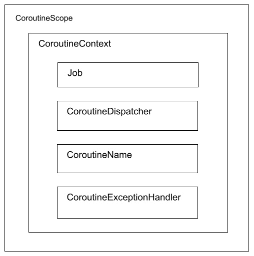
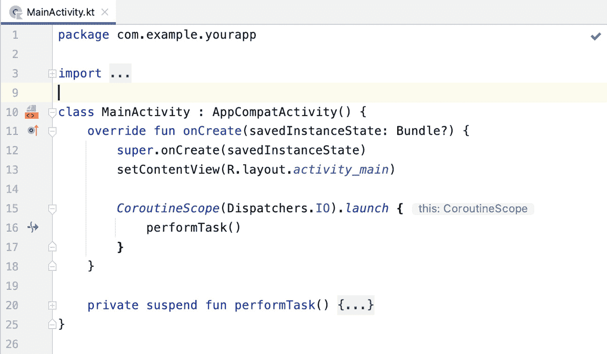
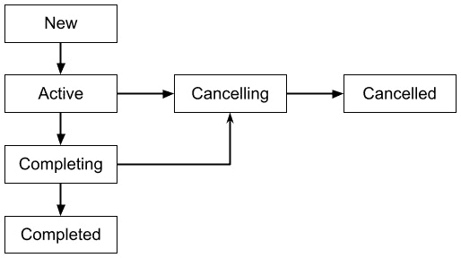

# 第二章：*第二章*：理解 Kotlin 协程

在上一章中，您回顾了异步编程的概念以及它是如何帮助您在后台执行长时间运行的任务，而不会冻结应用并烦扰应用的用户。您学习了如何使用线程、AsyncTasks 和 Executors 进行异步编程。最后，您被介绍到 Android 上执行此操作的新方法：Kotlin 协程和流。

协程是 Kotlin 用于多线程和异步编程的库，例如进行网络调用或访问文件或数据库。Kotlin 协程是 Google 对 Android 上异步编程的官方推荐。Android Jetpack 库，如 ViewModel、Lifecycle、WorkManager 和 Room，都包括对 Kotlin 协程的支持。第三方 Android 库，如 Retrofit，现在也提供了对 Kotlin 协程的支持。

在本章中，我们将深入探讨 Kotlin 协程。您将学习如何使用协程在 Android 中通过简单的代码执行异步编程。您还将学习如何在您的 Android 应用中创建协程。然后，我们将讨论协程的其他构建块，如构建器、作用域、调度器、上下文和任务。

在本章中，我们将涵盖以下主题：

+   在 Android 中创建协程

+   探索协程构建器、作用域和调度器

+   理解协程上下文和任务

+   练习 – 在 Android 应用中使用协程

到本章结束时，您将了解如何使用 Kotlin 协程。您将能够在您的 Android 应用中为各种情况添加协程。您还将了解协程的基本构建块：构建器、作用域、调度器、上下文和任务。

# 技术要求

对于本章，您需要下载并安装最新版本的 Android Studio。您可以在[`developer.android.com/studio`](https://developer.android.com/studio)找到最新版本。为了获得最佳的学习体验，建议使用以下配置的计算机：Intel Core i5 或更高性能的处理器，至少 4 GB 的 RAM，以及 4 GB 的可用空间。

本章的代码示例可以在 GitHub 上找到，地址为[`github.com/PacktPublishing/Simplifying-Android-Development-with-Coroutines-and-Flows/tree/main/Chapter02`](https://github.com/PacktPublishing/Simplifying-Android-Development-with-Coroutines-and-Flows/tree/main/Chapter02)。

# 在 Android 中创建协程

在本节中，我们将首先探讨如何在 Android 中创建协程。协程提供了一种使用 Kotlin 标准函数编写异步代码的简单方法。您可以在进行网络调用或从本地数据库获取或保存数据时使用协程。

一个简单的协程看起来如下所示：

```java
CoroutineScope(Dispatchers.IO).launch {
```

```java
    performTask()
```

```java
    ... 
```

```java
}
```

它有四个部分：`CoroutineScope`、`Dispatchers`、`launch` 以及协程将执行的 lambda 函数。为协程的作用域创建了一个 `CoroutineScope` 实例。`Dispatchers.IO` 是指定此协程将在 I/O 调度器上运行的调度器，通常用于 `launch` 的协程构建器是创建协程的协程构建器。我们将在本章后面详细探讨这些组件。

以下图表总结了协程的这些部分：



图 2.1 – 协程的部分

在 Android Studio 中，`performTask()` 调用旁边有暂停函数调用行号图标：



图 2.2 – Android Studio 暂停函数调用行号图标

假设你有一个显示当前电影院正在上映的电影列表的 Android 应用程序。那么，让我们看看你可以使用 `suspend` 函数并将协程添加到项目中的方法。

如果你正在使用 Retrofit 2.6.0 或更高版本，你可以使用 `suspend` 将端点函数标记为暂停函数，如下所示：

```java
@GET("movie/now_playing")
```

```java
suspend fun getMovies() : List<Movies>
```

然后，你可以创建一个协程，该协程将调用 `getMovies` 暂停函数并显示列表：

```java
CoroutineScope(Dispatchers.IO).launch {
```

```java
    val movies = movieService.getMovies()
```

```java
    withContext(Dispatchers.Main) {
```

```java
        displayMovies(movies)
```

```java
    }
```

```java
}
```

这将创建一个在后台获取电影的协程。`withContext` 调用将改变协程的上下文，使其使用 `Dispatchers.Main` 在主线程上显示获取到的电影。

如果你正在使用 Room-KTX 2.1 或更高版本，你可以在你的 **数据访问对象** (**DAO**) 函数中添加 `suspend` 关键字，这样查询或操作就可以在后台线程上执行，结果将在主线程上发布。以下是一个示例：

```java
@Dao
```

```java
interface MovieDao {
```

```java
    @Query("SELECT * from movies")
```

```java
    suspend fun getMovies(): List<Movies>
```

```java
    ...
```

```java
}
```

这将使 `getMovies` 查询成为一个暂停函数。当你调用此函数时，Room-KTX 内部会在后台线程上执行查询。结果可以在主线程上显示，而不会冻结你的应用。

当你在另一个协程内部创建协程时，新的协程成为原始协程的子协程。原始协程成为新协程的父协程。这可以在以下代码中看到：

```java
CoroutineScope(Dispatchers.IO).launch {
```

```java
    performTask1()
```

```java
    launch {
```

```java
        performTask2()
```

```java
    }
```

```java
    ... 
```

```java
}
```

使用 `performTask2` 启动的第二个协程是使用父协程的 `Coroutine Scope` 创建的。

在本节中，你探索了如何将协程添加到你的 Android 项目中，并学习了如何为你的应用程序创建协程。在下一节中，你将探索协程的一些构建块：构建器、作用域和调度器。

# 探索协程构建器、作用域和调度器

在本节中，你将学习如何使用协程构建器，并探索协程作用域和调度器。协程构建器是用于创建协程的函数。协程作用域是协程运行的作用域。调度器指定协程将在哪个线程上运行。

## 协程构建器

在前一节中，你使用 `launch` 创建了一个协程。然而，还有其他创建协程的方法。协程构建器是你可以用来创建协程的函数。要创建一个协程，你可以使用以下 Kotlin 协程构建器：

+   `launch`

+   `async`

+   `runBlocking`

`async` 和 `launch` 需要在协程作用域中启动。同时，`runBlocking` 不需要从协程作用域中启动。

`launch` 关键字创建一个协程，并且不返回任何值。相反，它返回一个表示协程的 `Job` 对象。

当你想运行一个任务然后忘记它（这意味着你不需要等待操作的结果）时，`launch` 协程构建器是理想的选择。以下是一个使用 `launch` 协程构建器的示例：

```java
 class MainActivity : AppCompatActivity() {
```

```java
    val scope = MainScope()
```

```java
    override fun onCreate(savedInstanceState: Bundle?) {
```

```java
        super.onCreate(savedInstanceState)
```

```java
        setContentView(R.layout.activity_main)
```

```java
        val progressBar =
```

```java
          findViewById<ProgressBar>(R.id.progressBar)
```

```java
        scope.launch {
```

```java
            delay(1_000)
```

```java
            progressBar.isVisible = true
```

```java
        }
```

```java
    }
```

```java
}
```

一旦创建了活动，就会启动一个协程。这个协程将调用 `delay` 暂停函数来延迟协程一秒，然后恢复，并显示进度条；然后，任务完成。

另一方面，`async` 构建器与 `launch` 类似，但它返回一个值：一个 `Deferred` 对象。稍后，你可以使用 `await` 函数获取这个值。当你想执行一个任务并获取该任务的输出时，应该使用 `async` 构建器。以下是一个使用 `async` 协程构建器的示例：

```java
 class MainActivity : AppCompatActivity() {
```

```java
    val scope = MainScope()
```

```java
    override fun onCreate(savedInstanceState: Bundle?) {
```

```java
        super.onCreate(savedInstanceState)
```

```java
        setContentView(R.layout.activity_main)
```

```java
        val textView =
```

```java
          findViewById<TextView>(R.id.textView)
```

```java
        scope.launch {
```

```java
            val text = async {
```

```java
                getText()
```

```java
            }
```

```java
            delay(1_000)
```

```java
            textView.text = text.await()
```

```java
        }
```

```java
    }
```

```java
}
```

这里，使用 `async` 启动了一个协程来调用 `getText` 函数。这将返回一个名为 `text` 的延迟对象。将会有 1 秒的延迟，然后使用 `text.await()` 调用 `text` 的实际值，这将作为 `textView` 的文本设置。使用 `async`，可以并行计算两个任务。

`runBlocking` 启动一个新的协程并阻塞当前线程，直到任务执行完毕。这在需要阻塞线程的情况下很有用。创建单元测试就是这种情况之一：

```java
 class MainActivity : AppCompatActivity() {
```

```java
    override fun onCreate(savedInstanceState: Bundle?) {
```

```java
        super.onCreate(savedInstanceState)
```

```java
        setContentView(R.layout.activity_main)
```

```java
        val progressBar =
```

```java
          findViewById<ProgressBar>(R.id.progressBar)
```

```java
        runBlocking {
```

```java
            delay(2_000)
```

```java
            progressBar.isVisible = true
```

```java
        }
```

```java
    }
```

```java
}
```

在前面的代码中，`runBlocking` 代码将创建一个协程并阻塞线程。在延迟 2,000 毫秒（2 秒）后，它将显示进度条。

在本节中，你了解了如何使用协程构建器创建协程。你还学习了 `async`、`launch` 和 `runBlocking` 协程构建器。

在下一节中，你将探索协程作用域。

## 协程作用域

`CoroutineScope` 是协程将运行的上下文。它定义了从它创建的协程的生命周期，从其开始到其结束。如果你取消一个作用域，它将取消它创建的所有协程。协程遵循结构化并发原则——即提供协程结构的机制。

`launch` 和 `async` 协程构建器是 `CoroutineScope` 的扩展函数，用于创建协程。

例如，假设我们使用 `MainScope` 创建了一个协程：

```java
 class MainActivity : AppCompatActivity() {
```

```java
    val scope = MainScope()
```

```java
    override fun onCreate(savedInstanceState: Bundle?) {
```

```java
        super.onCreate(savedInstanceState)
```

```java
        setContentView(R.layout.activity_main)
```

```java
        val progressBar =
```

```java
          findViewById<ProgressBar>(R.id.progressBar)
```

```java
        scope.launch {
```

```java
            progressBar.isVisible = true
```

```java
        }
```

```java
    }
```

```java
}
```

这将使用 `MainScope` 启动一个协程以显示进度条。

`MainScope` 是主线程的主要 `CoroutineScope`，它使用 `Dispatchers.Main` 进行其协程。它通常用于创建将更新用户界面的协程。

您也可以通过使用 `CoroutineScope` 工厂函数创建一个 `CoroutineScope` 来代替使用 `MainScope`。`CoroutineScope` 函数需要您传递一个协程上下文。`CoroutineContext` 是协程元素集合，用于指定协程应该如何运行。

在之前的示例中，您为协程上下文传递了一个调度器以及一个调度器和作业。调度器和作业是协程上下文元素。您将在本章后面了解更多关于协程上下文的内容。

您的 `CoroutineScope` 必须有一个作业以及一种取消协程的方式，例如当 `Activity`、`Fragment` 或 `ViewModel` 被关闭时。

在下一节中，我们将查看一个名为 `lifecycleScope` 的内置协程作用域，它是 Jetpack 的 Lifecycle 库的一部分。

### lifecycleScope

`lifecycleScope` 是 Jetpack 的 Lifecycle 库中的一个 `CoroutineScope`，您可以使用它来创建协程。它与 `Lifecycle` 对象（类似于您的活动或片段）相关联，并在生命周期被销毁时自动取消。因此，您不再需要手动取消它们。

`lifecycleScope` 简化了作用域的创建方式、作业的处理方式以及它们如何在您的活动或片段中被取消。`lifecycleScope` 使用 `Dispatchers.Main.immediate` 作为其调度器，并使用 `SupervisorJob` 作为其作业，例如 `viewModelScope`。

要使用 `lifecycleScope`，您必须将以下行添加到您的 `app/build.gradle` 文件依赖项中：

```java
implementation "androidx.lifecycle:lifecycle-runtime-ktx:2.4.1"
```

`lifeCycleScope` 的一个示例如下：

```java
 class MainActivity : AppCompatActivity() {
```

```java
    override fun onCreate(savedInstanceState: Bundle?) {
```

```java
        super.onCreate(savedInstanceState)
```

```java
        setContentView(R.layout.activity_main)
```

```java
        val progressBar =
```

```java
          findViewById<ProgressBar>(R.id.progressBar)
```

```java
        lifecycleScope.launch {
```

```java
            progressBar.isVisible = true
```

```java
        }
```

```java
    }
```

```java
}
```

当活动创建时，它从 `lifecycleScope` 启动一个协程来显示进度条。

要更改协程将使用的调度器，您可以在使用 `launch` 和 `async` 协程构建器时传递一个调度器：

```java
lifecycleScope.launch(Dispatchers.IO) { ... }
```

这将使用 `Dispatchers.IO` 调度器而不是启动的协程对象的默认 `Dispatchers.Main.immediate`。

除了 `launch` 之外，`lifecycleScope` 还具有额外的协程构建器，这取决于生命周期状态：

+   `launchWhenCreated`

+   `launchWhenStarted`

+   `launchWhenResumed`

如其名所示，`launchWhenCreated` 在生命周期创建时启动协程，`launchWhenStarted` 在生命周期启动时启动协程，而 `launchWhenResumed` 在生命周期回到 **Resumed** 状态时启动协程。

在下一节中，我们将查看从 `ViewModel` 中内置的 `CoroutineScope`，称为 `viewModelScope`。

### viewModelScope

`viewModelScope` 是 ViewModel 创建协程的默认 `CoroutineScope`。如果你需要从 `ViewModel` 执行长时间运行的任务，这是理想的选择。当 `ViewModel` 被清除（即调用 `onCleared`）时，此作用域和所有正在运行的任务将自动取消。

`viewModelScope` 简化了 `Scope` 的创建、作业处理和 `ViewModel` 内部的取消。`viewModelScope` 使用 `Dispatchers.Main.immediate` 作为其调度器，并使用 `SupervisorJob` 作为作业。`SupervisorJob` 是 `Job` 的一个特殊版本，允许其子协程相互独立地失败。

要使用 `viewModelScope`，你必须将以下行添加到你的 `app/build.gradle` 文件依赖项中：

```java
implementation "androidx.lifecycle:lifecycle-viewmodel-
```

```java
  ktx:2.4.1"
```

你可以这样使用 `viewModelScope`：

```java
class MovieViewModel: ViewModel() {
```

```java
    init {
```

```java
        viewModelScope.launch {
```

```java
            fetchMovies()
```

```java
        }
```

```java
    }
```

```java
}
```

这将从 `viewModelScope` 启动一个协程，用于运行 `fetchMovies()` 函数。

要更改协程将使用的调度器，你可以在使用 `launch` 和 `async` 协程构造器时传递一个调度器：

```java
viewModelScope.launch (Dispatchers.IO) { ... }
```

这将使用 `Dispatchers.IO` 为协程，而不是 viewModelScope 的默认值 `Dispatchers.Main`。

### coroutineScope{} 和 supervisorScope{}

`coroutineScope{}` 挂起构造器允许你创建一个具有其外部作用域协程上下文的 `CoroutineScope`。这调用代码块内部，直到所有事情都完成才完成。

你可以使用一个 `coroutineScope{}` 构造器，如下所示：

```java
private suspend fun fetchAndDisplay() = coroutineScope {
```

```java
        launch {
```

```java
            val movies = fetchMovies()
```

```java
            displayMovies(movies)
```

```java
        }
```

```java
        launch {
```

```java
            val shows = fetchShows()
```

```java
            DisplayShows(shows)
```

```java
        }
```

```java
}
```

这将创建一个作用域，它将调用 `fetchMovies` 函数，将返回值设置为 `movies` 对象，然后使用 `movies` 调用 `displayMovies` 函数。另一个子协程将调用 `fetchShows` 函数，将返回值设置为 `shows` 对象，然后使用 `shows` 调用 `displayShows` 函数。

当一个子协程失败时，它将取消父协程和兄弟协程。如果你不希望发生这种情况，你可以使用 `supervisorScope{}` 而不是 `coroutineScope{}`。

`supervisorScope{}` 构造器与 `coroutineScope{}` 构造器类似，但协程的 `Scope` 具有管理作业。这允许 `supervisorScope` 的子协程相互独立地失败。

`supervisorScope` 的一个示例如下：

```java
 private suspend fun fetchAndDisplayMovies() =
```

```java
   supervisorScope {
```

```java
        launch {
```

```java
            val movies = fetchMovies()
```

```java
            displayMovies(movies)
```

```java
        }
```

```java
        launch {
```

```java
            val shows = fetchShows()
```

```java
            displayShows(shows)
```

```java
        }
```

```java
}
```

这将创建一个带有 `SupervisorJob` 的管理作用域，它将调用 `fetchMovies` 函数。当一个子协程失败时，父协程和兄弟协程将继续工作，不会受到影响。

### GlobalScope

`GlobalScope` 是一个特殊的 `CoroutineScope`，它与对象或作业无关。它只应在必须运行在应用程序存活期间始终活跃的任务或任务的情况下使用。因此，如果你想使用 `GlobalScope`，你必须使用 `@OptIn(DelicateCoroutinesApi::class)` 注解调用。

对于 Android 中的所有其他情况，建议使用 `viewModelScope`、`lifecycleScope` 或自定义协程作用域。

### 测试作用域

Kotlin 有一个名为`kotlinx-coroutines-test`的库用于测试协程。这个测试库包括一个特殊的协程作用域，你可以用它来为你的协程创建测试。你将在*第四章*中了解更多关于测试协程的内容，*测试 Kotlin 协程*。

在本节中，你学习了`CoroutineScope`的相关知识，以及如何使用`CoroutineScope`函数创建协程作用域。你还了解了内置的作用域，例如`viewModelScope`和`lifecycleScope`。

在下一节中，你将学习关于协程调度器的内容。

## 协程调度器

协程有一个上下文，其中包括协程调度器。调度器指定协程将使用哪个线程来执行任务。以下调度器可以被使用：

+   `Dispatchers.Main`：这用于在 Android 的主线程上运行，通常用于用户界面的更新。`Dispatchers.Main`的一个特殊版本，称为`Dispatchers.Main.immediate`，用于立即在主线程中执行协程。`viewModelScope`和`lifecycleScope`协程作用域默认使用`Dispatchers.Main.immediate`。

+   `Dispatchers.IO`：这是为网络操作设计的，用于从文件或数据库中读取或写入。

+   `Dispatchers.Default`：这用于 CPU 密集型工作，如复杂的计算或处理文本、图像或视频。如果你没有设置调度器，默认将选择`Dispatchers.Default`。

+   `Dispatchers.Unconfined`：这是一个特殊的调度器，它不受任何特定线程的限制。它将在当前线程中执行协程，并在任何由挂起函数使用的线程中恢复它。

你可以在设置`CoroutineScope`中的上下文或使用协程构建器时设置调度器。

当使用`MainScope`作为你的协程作用域时，默认使用`Dispatchers.Main`：

```java
MainScope().launch { ... }
```

这个协程将自动使用`Dispatchers.Main`，因此你不再需要指定它。

如果你使用了不同的协程作用域，你可以传递协程将使用的调度器：

```java
CoroutineScope(Dispatchers.IO).launch {
```

```java
    fetchMovies()
```

```java
}
```

上一段代码创建了一个将使用`Dispatchers.IO`调度器的`CoroutineScope`。

你也可以在使用`launch`和`async`协程构建器时传递调度器：

```java
viewModelScope.launch(Dispatchers.Default) { ... }
```

这将使用`Dispatchers.Default`调度器启动一个协程。

要更改协程的上下文，你可以使用`withContext`函数来为想要使用不同线程的代码。例如，在你的挂起函数`getMovies`中，该函数从你的端点获取电影，你可以使用`Dispatchers.IO`：

```java
suspend fun getMovies(): List<Movies>  {
```

```java
    withContext(Dispatchers.IO) { ... }
```

```java
}
```

在前面的代码中，`getMovies`函数使用`Dispatchers.IO`从网络端点获取电影列表。

在本节中，你学习了调度器是什么，以及根据你的需求可以使用哪些调度器。你还学习了如何使用`withContext`来更改协程运行的特定线程。

在下一节中，你将探索协程上下文和任务。

# 理解协程上下文和任务

在本节中，你将了解协程上下文和任务。协程在协程上下文中运行。任务是指协程的上下文，它允许你管理协程的执行。

## 协程上下文

每个协程都在协程上下文中运行。协程上下文是一组元素，用于指定协程应该如何运行。协程作用域有一个默认的协程上下文；如果它是空的，它将有一个`EmptyCoroutineContext`。

当你创建一个`CoroutineScope`或使用协程构建器时，你可以传递一个`CoroutineContext`。在之前的示例中，我们传递了一个调度器：

```java
CoroutineScope(Dispatchers.IO) {
```

```java
    …
```

```java
}
```

```java
viewModelScope.launch(Dispatchers.Default) { ... }
```

之前的示例展示了如何在`CoroutineScope`函数或协程构建器中传递调度器。

你在这些函数中传递的是`CoroutineContext`。以下是一些你可以使用的`CoroutineContext`元素：

+   `CoroutineDispatcher`

+   `Job`

+   `CoroutineName`

+   `CoroutineExceptionHandler`

主要的`CoroutineContext`元素是调度器和任务。调度器指定协程运行的线程，而协程的任务允许你管理协程的任务。

任务允许你管理协程的生命周期，从协程的创建到任务的完成。你可以使用这个任务来取消协程本身。你将在*第三章*中了解更多关于协程取消和异常处理的内容。

`CoroutineName`是另一个你可以使用的`CoroutineContext`，用于设置一个字符串来命名协程。这个名称对于调试目的可能很有用。例如，你可以使用以下代码添加一个`CoroutineName`：

```java
val scope = CoroutineScope(Dispatchers.IO)
```

```java
scope.launch(CoroutineName("IOCoroutine")) {
```

```java
    performTask()
```

```java
}
```

这将为使用`Dispatchers.IO`调度器启动的协程赋予`IOCoroutine`的名称。

由于协程上下文是协程元素集合，你可以使用如`+`这样的运算符来组合上下文元素以创建一个新的`CoroutineContext`：

```java
val context = Dispatchers.Main + Job()
```

例如，`MainScope`、`viewModelScope`和`lifecycleScope`使用以下内容作为协程作用域上下文：

```java
SupervisorJob() + Dispatchers.Main.immediate
```

你还可以使用的另一个协程上下文元素是`CoroutineExceptionHandler`，这是一个你可以用来处理异常的元素。你将在*第三章*中了解更多关于`CoroutineExceptionHandler`的内容，*处理协程取消和异常*。

在上一节中，你使用了`withContext`函数来更改调度器以指定不同的线程来运行你的协程。正如其名所示，这会通过调度器更改协程上下文，调度器本身也是一个`CoroutineContext`元素：

```java
withContext(Dispatchers.IO) { ... }
```

这通过一个新的调度器`Dispatchers.IO`更改了协程上下文。

在下一节中，你将了解任务。

## 协程任务

一个`ContextCoroutine`元素，您可以使用它来创建协程上下文。您可以使用作业来管理协程的任务和其生命周期。作业可以被取消或合并。

`launch`协程构建器创建一个新的作业，而`async`协程构建器返回一个`Deferred<T>`对象。`Deferred`本身就是一个`Job`对象——也就是说，一个有结果的作业。

要从协程访问作业，您可以将其设置为一个变量：

```java
val job = viewModelScope.launch(Dispatchers.IO) { ... }
```

`launch`协程构建器创建一个在`Dispatchers.IO`线程上运行的协程，并返回一个作业。作业可以有子作业，使其成为父作业。`Job`有一个`children`属性，您可以使用它来获取作业的子作业：

```java
val job1 = viewModelScope.launch(Dispatchers.IO) { 
```

```java
    val movies = fetchMovies()
```

```java
    val job2 = launch {
```

```java
        ...
```

```java
    }
```

```java
    ...
```

```java
}
```

在此示例中，`job2`成为`job1`的子作业，即父作业。这意味着`job2`将继承父作业的协程上下文，尽管您也可以更改它。

如果父作业被取消或失败，其子作业也会自动取消。当一个子作业被取消或失败时，其父作业也会被取消。

`SupervisorJob`是作业的一个特殊版本，允许其子作业相互独立地失败。

使用作业还可以让您创建一个可以在以后启动的协程，而不是默认立即运行。为此，您必须在协程构建器中将`start`参数的值设置为`CoroutineStart.LAZY`，并将结果分配给一个`Job`变量。稍后，您可以使用`start()`函数来运行协程，如下所示：

```java
val lazyJob = viewModelScope.launch (start=CoroutineStart.LAZY) {
```

```java
    delay(1_000)
```

```java
    ...
```

```java
}
```

```java
...
```

```java
lazyJob.start()
```

这将创建一个懒加载的协程。当您准备好启动它时，您可以简单地调用`lazyJob.start()`。

使用`Job`对象，您还可以使用`join()`挂起函数等待作业完成，然后再继续另一个作业或任务：

```java
viewModelScope.launch {
```

```java
    val job1 = launch {
```

```java
        showProgressBar()
```

```java
    }
```

```java
    ...
```

```java
    job1.join()
```

```java
    ...
```

```java
    val job2 = launch {
```

```java
        fetchMovies()
```

```java
    }
```

```java
}
```

在此示例中，`job1`将首先运行，`job2`将不会执行，直到前面的作业（`job1`）完成。

在下一节中，您将了解更多关于协程作业的状态。

### 协程作业状态

作业有以下状态：

+   新建

+   活动

+   完成状态

+   已完成

+   取消中

+   已取消

以下图表总结了作业及其生命周期的这些状态：



图 2.3 – 协程作业生命周期

当您启动一个协程时，`start()`或`join()`函数中会创建一个作业。作业在运行时处于**活动**状态。

完成作业将其移动到**完成**状态，一旦其子任务完成，则进入**已完成**状态。

如果作业被手动取消或由于异常而失败，它将进入**取消中**状态，一旦其子任务完成，则进入**已取消**状态。

`Job`对象有三个属性，您可以使用它们来检查作业的状态：

+   `isActive`: 当作业正在运行或完成时，此属性为`true`，否则为`false`。

+   `isComplete`: 当作业完成其任务（已取消或完成）时，此属性为`true`，否则为`false`。

+   `isCancelled`：如果作业已被取消或正在被取消（手动或由于异常），则此属性为 `true`，否则为 `false`。

你将在 *第三章* 中学习更多关于作业的内容，以及它们是如何用于取消协程的，*处理协程取消和异常*。

在本节中，你学习了关于协程上下文和作业的内容。`CoroutineContext` 是协程上下文元素的集合，用于协程，它指定了协程应该如何运行。`CoroutineContext` 元素的例子包括调度器和作业。作业是由协程创建的。你可以用它来管理协程的任务和生命周期。

现在，你将使用到目前为止所学的内容，将协程添加到 Android 项目中。

# 练习 – 在 Android 应用中使用协程

在这个练习中，你将使用一个显示当前电影院正在上映的电影的应用程序。你将使用 The Movie Database API 版本 3 来获取电影列表。访问 [`developers.themoviedb.org/3`](https://developers.themoviedb.org/3) 并注册一个 API 密钥。完成此操作后，按照以下步骤进行：

1.  打开本书代码库中 `Chapter02` 目录下的 `Movie App` 项目。

1.  打开 `MovieRepository` 并使用 The Movie Database API 的值更新 `apiKey`：

    ```java
    private val apiKey = "your_api_key_here" 
    ```

1.  打开 `app/build.gradle` 文件，并添加 `kotlinx-coroutines-android` 的依赖项：

    ```java
    implementation ‘org.jetbrains.kotlinx:kotlinx-
      coroutines-android:1.6.0’
    ```

这将把 `kotlinx-coroutines-core` 和 `kotlinx-coroutines-android` 库添加到你的项目中，允许你在代码中使用协程。

1.  此外，添加 `ViewModel` 扩展库的依赖项：

    ```java
    implementation ‘androidx.lifecycle:lifecycle-
      viewmodel-ktx:2.4.1’
    ```

这将把 `ViewModel` KTX 库添加到你的项目中。它包括一个 `viewModelScope` 用于 `ViewModel`。

1.  打开 `MovieViewModel` 类，导航到 `fetchMovies` 函数，并添加以下代码：

    ```java
    fun fetchMovies() {
        _loading.value = true
        viewModelScope.launch(Dispatchers.IO) {
        }
    }
    ```

这将创建一个将在 `Dispatchers.IO`（网络操作的后台线程）上运行的协程。协程将通过 `viewModelScope` 启动。

1.  在 `fetchMovies` 协程中，调用 MovieRepository 的 `fetchMovies` 函数以从 The Movie Database API 获取电影列表：

    ```java
    fun fetchMovies() {
        _loading.value = true
        viewModelScope.launch(Dispatchers.IO) {
            movieRepository.fetchMovies()
            _loading.postValue(false)
        }
    }
    ```

协程将被启动，并将调用 `MovieRepository` 中的 `fetchMovies` 函数。

1.  运行应用程序。你将看到应用程序显示了一个电影列表（带有海报和标题），如下面的截图所示：

![图 2.4 – 显示电影列表的应用程序]


图 2.4 – 显示电影列表的应用程序

在这个练习中，你使用 ViewModel 的 `viewModelScope` 创建了一个协程，使用了 `launch` 协程构建器，并执行了一个从仓库获取电影的任务。

# 摘要

在本章中，你学习了更多关于 Kotlin 协程以及如何在 Android 中使用它们进行异步编程。

你学习了如何使用 `launch`、`async` 和 `runBlocking` 等协程构建器创建协程。然后，你学习了调度器以及如何使用它们来设置协程运行的线程。你还学习了协程作用域和内置作用域，如 `viewModelScope` 和 `lifecycleScope`。

之后，你学习了协程上下文和任务。`CoroutineContext` 是协程的上下文，包括协程将运行的调度器等元素，以及一个任务，你可以用它来管理协程的任务。

最后，你完成了一个练习，在其中你将一个协程添加到了 Android 项目中。你使用了 ViewModel 的 `viewModelScope` 作为协程作用域，`launch` 协程构建器，并实现了使用 `Dispatchers.IO` 获取电影列表的协程。

在下一章中，你将学习如何处理协程取消、超时和异常。
