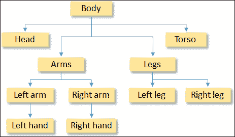
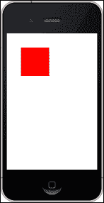
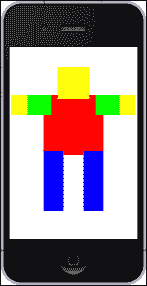
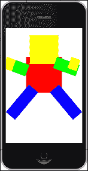

# 第二章 显示我们的第一个对象

*在前一章中，我们安装并配置了 Xcode 开发者工具，还下载了 Sparrow 框架并将其链接到一个示例项目中。我们接着在 iOS 模拟器和真实设备上进行了测试。我们还为本书中将要开发的整个游戏设定了范围。然而，在我们进入游戏开发过程之前，让我们先了解一下 Sparrow 的一些核心概念，并熟悉 Sparrow 中的工作方式。我们将在屏幕上绘制一些对象，并通过应用旋转和缩放变换来操作这些对象。*

# 理解显示对象

如其名所示，显示对象是将在屏幕上显示的东西。我们可以将显示对象视为包含不同类型图形数据的独立图形实体。虽然一开始这可能听起来有些抽象，但每个图像（`SPImage`）、四边形（`SPQuad`）或其他几何形状都是从`SPDisplayObject`类派生出来的，这是 Sparrow 中显示对象的表示。

## 解释显示对象容器

一个显示对象容器（`SPDisplayObjectContainer`）从`SPDisplayObject`继承，增加了拥有一组子显示对象的功能。当你将一个子显示对象添加到一个父显示对象容器中时，你可以将其视为将一个显示对象附加到另一个显示对象上。如果你移动、缩放或旋转父显示对象，所有这些变化都会被其可能拥有的任何子对象继承。这个概念与 Adobe Flash API 中屏幕上对象的管理方式大致相同。父节点和子节点的一整套被称为显示列表，有时也称为显示树。这是因为，就像一棵树一样，它包含许多分支，最终都汇聚到一个单一的树干上，通常被称为根。显示树的另一个名称是场景图。

显示列表按照它们被添加到父显示对象容器中的顺序绘制显示对象。如果我们向与之前添加的显示对象相同的父对象中添加第二个子显示对象，第二个显示对象将被绘制在第一个显示对象的前面。

让我们继续想象自己是一个纸板木偶娃娃。我们需要一个头部、一个躯干和一条腿，左边的手臂和手，右边的也是如此。参考以下显示这个概念的图示：



这个安排的根对象将是身体对象。头部、躯干、腿和手臂将直接绑定到身体上，而手将绑定到每只手臂上。

# 设置背景颜色

在我们在屏幕上绘制一些对象之前，让我们改变我们应用程序的背景颜色，这个应用程序最终将成为我们的游戏。

# 行动时间 - 改变背景颜色

让我们看看改变背景颜色的必要步骤：

1.  如果尚未打开，请打开我们的 Xcode 游戏模板。

1.  打开`Game.m`源文件。

1.  在初始化方法和现有的`SPQuad`对象之前，添加以下行：

    ```swift
    SPQuad *background = [SPQuad quadWithWidth:Sparrow.stage.width height:Sparrow.stage.height color:0xffffff];
    [self addChild:background];
    ```

1.  运行示例。

当示例运行时，我们会在以下屏幕截图所示的白色背景上看到我们的红色矩形：



## *发生了什么？*

在第 1 步，我们打开了我们在上一章中创建的 Xcode 模板，在第 2 步中，我们导航到`Game.m`文件，这是我们当前的游戏代码所在之处。游戏是一个不断出现的红色矩形。

在第 3 步，在我们绘制红色矩形之前，我们定义了`background`变量，它是一个指向`SPQuad`实例的指针。`SPQuad`类是从`SPDisplayObject`派生出来的。`SPQuad`的功能是绘制一个带有背景色的矩形形状。

`SPQuad`类提供了一些工厂方法，用于执行诸如创建具有宽度和高度的 quad 以及向其添加颜色值等操作。在这个例子中，我们正在创建一个具有预定义宽度和高度以及颜色值`0xffffff`的 quad。颜色定义为十六进制表示的`0xRRGGBB`，即`REDRED` `GREENGREEN` `BLUEBLUE`。

表面上看，调用`[SPQuad quadWithWidth:Sparrow.stage.width height:Sparrow.stage.height]`似乎与调用`[[SPQuad alloc] initWithWidth:Sparrow.stage.width height:Sparrow.stage.height]]`相同，但在底层有一个主要区别。当调用工厂方法时，它返回一个自动释放的对象，这意味着我们没有实例的所有权，它将在某个时刻被销毁。另一方面，如果我们使用 alloc-and-init 组合，我们就拥有所有权，需要自己释放实例。

由于我们的应用程序使用**自动引用计数**（**ARC**），我们不需要担心自己释放实例。另一方面，Sparrow 本身使用**手动引用计数**（**MRC**）。

要覆盖整个屏幕，我们需要获取屏幕本身的宽度和高度。这些值作为属性存在于`Sparrow.stage`对象中。

我们需要将背景添加到`Game`类中，这正是`[self addChild:background]`所做的事情。`self`关键字是对`Game`类的引用，它是从`SPSprite`类派生出来的。

现在，我们有一个白色背景，上面有一个红色矩形出现。

我们的`Game.m`源文件应该包含以下代码：

```swift
#import "Game.h" 

@implementation Game

- (id)init
{
    if ((self = [super init]))
    {
        SPQuad *background = [SPQuad quadWithWidth:Sparrow.stage.width height:Sparrow.stage.height color:0xffffff];
        [self addChild:background];

        SPQuad *quad = [SPQuad quadWithWidth:100 height:100];
        quad.color = 0xff0000;
        quad.x = 50;
        quad.y = 50;
        [self addChild:quad];
    }
    return self;
}

@end
```

### 小贴士

**下载示例代码**

您可以从您在[`www.packtpub.com`](http://www.packtpub.com)的账户中下载您购买的所有 Packt 书籍的示例代码文件。如果您在其他地方购买了这本书，您可以访问[`www.packtpub.com/support`](http://www.packtpub.com/support)并注册，以便将文件直接通过电子邮件发送给您。

也有一种更简单的方法来设置背景颜色。虽然在这个特定情况下性能损失并不高，以至于需要担心，但我们可以直接通过`Sparrow.stage`使用其颜色属性来设置颜色：`Sparrow.stage.color = 0xffffff`。这包含更少的行，更易于阅读，并且更好地展示了其意图。

## 什么是舞台？

我们简要地提到了`Sparrow.stage`的话题，到目前为止，它已经证明有一些有用的属性，可以获取屏幕的宽度和高度，并直接设置背景颜色。

舞台是任何 Sparrow 游戏的顶级元素，逻辑上是显示树的根元素，Sparrow 会为我们自动创建。

# 创建我们的纸板木偶娃娃

让我们实现本章开头提到的纸板木偶娃娃。移除屏幕上已经画出的红色矩形。

# 是时候动手制作纸板木偶娃娃了

要创建纸板木偶娃娃，我们需要执行以下步骤：

1.  如果`Game.m`文件还没有打开，请打开它。

1.  添加一个`body`容器，以下代码：

    ```swift
    SPSprite *body = [[SPSprite alloc] init];
    body.x = 85;
    body.y = 120;

    [self addChild:body];
    ```

1.  按照以下代码添加`torso`：

    ```swift
    SPQuad *torso = [SPQuad quadWithWidth:150 height:150];
    torso.color = 0xff0000;

    [body addChild:torso];
    ```

1.  现在添加一个局部变量`head`，如下所示：

    ```swift
    SPQuad *head = [SPQuad quadWithWidth:80 height:80 color:SP_YELLOW];
    head.x = 35;
    head.y = -70;

    [body addChild: head];
    ```

1.  按照以下代码添加一个用于`arms`局部变量的容器：

    ```swift
    SPSprite *arms = [[SPSprite alloc] init];

    [body addChild:arms];
    ```

1.  按照以下代码添加一个用于`legs`局部变量的容器：

    ```swift
    SPSprite *legs = [[SPSprite alloc] init];
    legs.y = 140;

    [body addChild:legs];
    ```

1.  按照以下代码添加左臂：

    ```swift
    SPQuad *leftArm = [SPQuad quadWithWidth:100 height:50 color:0x00ff00];
    leftArm.x = -80;

    [arms addChild:leftArm];
    ```

1.  按照以下代码添加右臂：

    ```swift
    SPQuad *rightArm = [SPQuad quadWithWidth:100 height:50 color:0x00ff00];
    rightArm.x = 130;

    [arms addChild:rightArm];
    ```

1.  每个手臂都需要一只手。让我们首先按照以下代码添加左手：

    ```swift
    SPQuad *leftHand = [SPQuad quadWithWidth:40 height:50 color:SP_YELLOW];
    leftHand.x = -80;

    [arms addChild:leftHand];
    ```

1.  现在为右手使用以下代码：

    ```swift
    SPQuad *rightHand = [SPQuad quadWithWidth:40 height:50 color:SP_YELLOW];
    rightHand.x = 190;

    [arms addChild:rightHand];
    ```

1.  让我们继续制作腿。我们将首先使用以下代码创建左腿：

    ```swift
    SPQuad *leftLeg = [SPQuad quadWithWidth:50 height:150 color:0x0000ff];

    [legs addChild:leftLeg];
    ```

1.  我们将使用以下代码创建右腿：

    ```swift
    SPQuad *rightLeg = [SPQuad quadWithWidth:50 height:150 color:0x0000ff];
    rightLeg.x = 100;

    [legs addChild:rightLeg];
    ```

1.  运行示例。

当我们运行示例时，一个由矩形组成的简单纸板木偶娃娃正对着我们，如下面的截图所示：



## *发生了什么？*

在第 1 步中，我们使用了我们已熟悉的`Game.m`源文件。

首先，我们需要一个容器对象，在这个例子中我们称之为`body`。在这种情况下，一个四边形不足以满足需求，因为`SPQuad`不继承自`SPDisplayObjectContainer`，因此不能向其添加子对象。我们设置了`x`和`y`属性，这样`body`元素的内容就出现在屏幕的中间位置。Sparrow 中的坐标系从屏幕的左上角开始，就像在 Flash 或传统应用程序开发中添加控制元素到窗口时的坐标系一样。来自传统图形开发的开发者可能需要一些时间来适应这一点。例如，在 OpenGL 中，*y*轴是反转的。然后我们将`body`元素添加到我们的游戏实例中。

在第 3 步中，我们将`torso`（一个四边形）添加到身体元素中。如果我们没有指定`x`或`y`属性，它们的默认值是`0`。

之后，我们添加了`头部`。`x`和`y`属性是相对于父显示对象测量的。因此，如果我们使用负值，这并不一定意味着元素被绘制在屏幕之外。这取决于父显示对象容器的位置。

虽然我们知道我们可以使用十六进制表示法来使用颜色，但我们在这个步骤中使用`SP_YELLOW`。这和输入`0xffff00`有相同的效果。

对于胳膊和腿，我们在第 5 步和第 6 步分别添加了每个的容器。`SPSprite`是最基本的轻量级容器类，当分组对象时应使用。腿的容器已经向下定位了一点点，所以其子元素只需要水平定位。

在剩余的步骤中，我们添加了每个肢体，当我们最终运行应用程序时，我们得到了一个由矩形组成的纸板木偶娃娃。

## 尝试一下英雄——改进纸板木偶娃娃

我们可以相当大地改进我们的代码；`legs`、`arms`和`hands`的代码实际上是一样的，但我们分别定义了每个元素。我们可以尝试分组和简化代码一点。

此外，在当前的布局中，手并没有直接连接到娃娃的胳膊上。相反，它们被绑定到`arms`容器对象上。所以如果我们移动一个胳膊，手不会随着胳膊移动。

下面是一些解决这些问题的想法：

+   为了将手连接到胳膊上，我们需要至少两个新的容器对象

+   创建一个纸板木偶娃娃类，其中其元素是继承自显示对象容器的类

# 解释宏

虽然我们知道我们可以使用十六进制表示法来使用颜色，但 Sparrow 为最常用的颜色提供了一些简写常量。在上一个例子中，我们使用`SP_YELLOW`代替了`0xffff00`的颜色黄色。

为了概括，宏是方便的小函数，允许我们在处理重复性任务时简化工作流程。

Objective-C 中的宏是预处理器指令，它们的工作方式与 C 和 C++中的宏相同。在代码编译之前，预处理器会遍历整个代码，并将所有宏的出现替换为宏的结果。

虽然我们可以用十六进制颜色值表示法写出每种颜色，但有时使用 RGB 值可能更有意义。`SP_COLOR`宏正是这样做的，它将 RGB 颜色转换为十六进制颜色值。

在本节中，我们将探讨不同类型的宏是什么以及如何使用它们。

## 角度宏

Sparrow 使用弧度来描述其显示对象的旋转。如果我们想用度来计算，我们需要以下宏：

| 名称 | 描述 | 示例 |
| --- | --- | --- |
| `SP_R2D` | 将弧度转换为度 | `SP_R2D(PI);``// 180` |
| `SP_D2R` | 将度转换为弧度 | `SP_D2R(180);``// PI` |

## 颜色宏

如果我们需要创建自定义颜色或将现有颜色分解，以下宏将适合我们的目的：

| 名称 | 描述 | 示例 |
| --- | --- | --- |
| `SP_COLOR_PART_ALPHA``SP_COLOR_PART_RED``SP_COLOR_PART_GREEN``SP_COLOR_PART_BLUE` | 获取颜色的部分值 | `SP_COLOR_PART_RED(0xff0000);``// 0xff` |
| `SP_COLOR` | 设置 RGB 颜色 | `SP_COLOR(255, 255, 0);``// 0xffff00` |
| `SP_COLOR_ARGB` | 设置 ARGB 颜色 | `SP_COLOR_ARGB(128, 255, 255, 0);``// 0x80ffff00` |

## 工具函数

让我们看看最后一组不是与角度或颜色相关的宏：

| 名称 | 描述 | 示例 |
| --- | --- | --- |
| `SP_IS_FLOAT_EQUAL` | 对两个值进行浮点比较。如果为假返回 0，如果为真返回 1。 | `SP_IS_FLOAT_EQUAL(0.11, 0.12);``// 0` |
| `SP_CLAMP` | 在两个值之间夹紧。第一个参数是初始值。其他两个参数分别是最小值和最大值。 | `SP_CLAMP(0.6, 1.0, 2.0);``// 1.0` |
| `SP_SWAP` | 交换两个值。 | `NSUInteger x = 0;``NSUInteger y = 1;``SP_SWAP(x, y, NSUInteger);``// x = 1; y = 0` |

## Sparrow 中的常量

我们已经了解了 `SP_YELLOW`，那么让我们看看 Sparrow 中定义了哪些常量。

### 数学

例如，`PI` 常量在宏中用于将弧度转换为度数，反之亦然。以下是一些 `PI` 常量的示例：

| 名称 | 描述 |
| --- | --- |
| `PI` | π 的值 |
| `PI_HALF` | π 值的一半 |
| `TWO_PI` | π 值乘以二 |

### 颜色

Sparrow 预定义了 16 种颜色以便于使用，因此我们不必每次都使用宏。这些是最基本的颜色，也定义在许多不同的库和框架中，例如，HTML 4.01。以下表格显示了 Sparrow 中预定义的 16 种颜色：

| 名称 | RGB 值 | 十六进制值 |
| --- | --- | --- |
| `SP_WHITE` | `255, 255, 255` | `0xffffff` |
| `SP_SILVER` | `208, 208, 208` | `0xc0c0c0` |
| `SP_GRAY` | `128, 128, 128` | `0x808080` |
| `SP_BLACK` | `0, 0, 0` | `0x000000` |
| `SP_RED` | `255, 0, 0` | `0xff0000` |
| `SP_MAROON` | `128, 0, 0` | `0x800000` |
| `SP_YELLOW` | `255, 255, 0` | `0xffff00` |
| `SP_OLIVE` | `128, 128, 0` | `0x808000` |
| `SP_LIME` | `0, 255, 0` | `0x00ff00` |
| `SP_GREEN` | `0, 128, 0` | `0x008000` |
| `SP_AQUA` | `0, 255, 255` | `0x00ffff` |
| `SP_TEAL` | `0, 128, 128` | `0x008080` |
| `SP_BLUE` | `0, 0, 255` | `0x0000ff` |
| `SP_NAVY` | `0, 0, 128` | `0x000080` |
| `SP_FUCHSIA` | `255, 0, 255` | `0xff00ff` |
| `SP_PURPLE` | `128, 0, 128` | `0x800080` |

# 显示对象的操作

现在我们已经在屏幕上有了我们的纸板木偶娃娃，让我们开始操作屏幕上的对象。

在这个例子中，我们将看看如何旋转、缩放和倾斜对象，然后设置这些对象的起点。

# 动手实践 - 操作显示对象

执行以下步骤来操作我们之前创建的显示对象：

1.  在 `Game.m` 中添加一个新的方法，位于我们用来创建身体部分的 `init` 方法下面：

    ```swift
    - (void)onLegTouch:(SPTouchEvent *)event
    {
      SPTouch *touch = [[event touchesWithTarget:self andPhase:SPTouchPhaseBegan] anyObject];
      if (touch) {
        SPQuad* target = (SPQuad *) event.target;

        float currentRotation = SP_R2D(target.rotation);
        currentRoration = currentRotation + 10;

        if (currentRotation >= 360.0)
        {
          currentRotation = currentRotation - 360.0;
        }
        target.rotation = SP_D2R(currentRotation);
      }
    }
    ```

1.  接下来，我们还需要在初始化器中设置我们腿部的锚点（枢轴），如下所示：

    ```swift
    leftLeg.pivotX = 25;
    leftLeg.pivotY = 10;

    rightLeg.pivotX = 25;
    rightLeg.pivotY = 10;
    ```

1.  使用以下代码更新腿部位置：

    ```swift
    SPQuad *leftLeg = [SPQuad quadWithWidth:50 height:150 color:0x0000ff];
    [legs addChild:leftLeg];
    leftLeg.x = 25;

    SPQuad *rightLeg = [SPQuad quadWithWidth:50 height:150 color:0x0000ff];
    rightLeg.x = 125;
    [legs addChild:rightLeg];
    ```

1.  使用以下代码为腿部设置事件监听器：

    ```swift
    [rightLeg addEventListener:@selector(onLegTouch:) atObject:self forType:SP_EVENT_TYPE_TOUCH];
    [leftLeg addEventListener:@selector(onLegTouch:) atObject:self forType:SP_EVENT_TYPE_TOUCH];
    ```

1.  让我们添加另一个方法，当触摸到我们的纸板木偶头部时应该被调用。这个方法应该在初始化器和 `onLegTouch` 方法下面：

    ```swift
    - (void)onHeadTouch:(SPTouchEvent *)event
    {
        SPTouch *touch = [[event touchesWithTarget:self andPhase:SPTouchPhaseBegan] anyObject];
        if (touch) {
            SPQuad* target = (SPQuad *) event.target;
            target.scaleX = (target.scaleX == 1.0) ? 1.5 : 1.0;
            target.scaleY = (target.scaleY == 1.0) ? 1.5 : 1.0;
        }
    }
    ```

1.  我们还需要设置头部的主轴（枢轴）：

    ```swift
    head.pivotX = head.width / 2;
    head.pivotY = head.height / 2;
    ```

1.  让我们根据以下代码更新头部位置：

    ```swift
    SPQuad *head = [SPQuad quadWithWidth:80 height:80 color:SP_YELLOW];
    head.x = 75;
    head.y = -30;
    [body addChild: head];
    ```

1.  让我们添加一个事件监听器，用于头部，如下所示：

    ```swift
    [head addEventListener:@selector(onHeadTouch:) atObject:self forType:SP_EVENT_TYPE_TOUCH];
    ```

1.  添加另一个方法，当触摸到手臂时应该被调用。这将在以下代码中展示：

    ```swift
    - (void)onArmsTouch:(SPTouchEvent *)event
    {
        SPTouch *touch = [[event touchesWithTarget:self andPhase:SPTouchPhaseBegan] anyObject];
        if (touch) {
            SPQuad* target = (SPQuad *) event.target;
            target.skewX = (target.skewX == SP_D2R(20)) ? SP_D2R(0) : SP_D2R(20);
            target.skewY = (target.skewY == SP_D2R(20)) ? SP_D2R(0) : SP_D2R(20);
        }
    }
    ```

1.  将事件监听器绑定到这个新添加的方法上：

    ```swift
    [arms addEventListener:@selector(onArmsTouch:) atObject:self forType:SP_EVENT_TYPE_TOUCH];
    ```

1.  运行示例并触摸我们的纸板木偶的一些肢体。现在我们应该在屏幕上看到我们的纸板木偶，如果我们触摸手臂、腿或头部，我们会看到这些对象旋转、倾斜或缩放。

## *发生了什么？*

在第 1 步中，我们定义了一个方法，当触摸到一条腿时应该被调用。我们需要获取触摸事件的引用，在 Sparrow 中，这被描述为 `SPTouchEvent`。为了获取触摸实例（`SPTouch`），我们在触摸开始阶段查找任何对象的触摸。每个触摸会经过三个阶段：首先 `SPTouchPhaseBegan`，然后 `SPTouchPhaseMoved`，最后 `SPTouchPhaseEnded`。我们需要检查触摸是否有效，因为可以通过在 `if`-语句中使用它作为条件来检查对象是否被触摸。事件当前的目标在 `event.target` 中可用，尽管它需要被转换为适当的显示对象类型，在这个案例中是 `SPQuad`。

然后我们获取了被触摸对象的当前旋转，并将其增加 10 度。新的旋转将被设置为四边形。如果旋转大于 360 度，我们将减去 360 度。

显示对象的默认原点是其自身的左上角。如果我们想要不同的原点，我们需要使用显示对象的 `pivotX` 和 `pivotY` 属性来修改它。

修改原点也会影响元素的位置；因此，如果我们想要保持相同的位置，我们需要将枢轴值添加到位置值中，这就是第 3 步中发生的事情。

在第 4 步中，我们为每条腿添加了一个事件监听器，所以当我们实际触摸到腿时，会发生某些事情。当使用 `addEventListener` 时，我们正在绑定一个在事件触发时将被调用的选择器，在我们的案例中，是 `SP_EVENT_TYPE_TOUCH`。如果指定的对象（在这个步骤中是 `self`，即 `Game` 实例）上发生任何触摸，这个事件将被调用。当使用 `addEventListener` 时，可以将多个选择器绑定到同一个事件。

对于下一步，我们添加了一个用于触摸我们纸板木偶头部的函数。我们还需要执行上一次相同的触摸检查和目标投射。这次当我们触摸头部时，它应该放大到原始大小的 150%，如果我们再次触摸头部，它将缩小回原始大小。

在第 6 步中，我们将原点设置为元素的中心。在第 7 步中，我们需要相应地更新位置，而在第 8 步中，我们将方法绑定到`head`元素。

我们定义的最后一个方法是我们触摸任何`arms`元素时会发生什么。如果我们将触摸事件绑定到`SPSprite`实例，它将为其所有子元素触发。同样的触摸检查也适用于此方法。第一次触摸时，我们将元素倾斜 20 度，当元素再次被触摸时，将其重置到原始状态。

在这里我们使用三元表达式来检查目标是否已经倾斜。我们检查括号内的条件。如果条件评估为`true`，则执行问号后面的语句；否则，执行冒号后面的语句。其优势是三元表达式是一个表达式，可以一次性赋值给一个变量。如果我们使用`if`语句，它将转换为以下代码：

```swift
if (target.skewX == SP_D2R(20)) {
  target.skewX = SP_D2R(0);
} else {
  target.skewX = SP_D2R(20);
}

if (target.skewY == SP_D2R(20)) {
  target.skewY = SP_D2R(0);
} else {
  target.skewY = SP_D2R(20);
}
```

第 10 步中，我们将`onArmsTouch`方法绑定到了`arms`对象。

当我们运行示例并触摸各种元素时，我们将看到所有的倾斜、缩放和旋转动作。

## 快速问答

Q1. 显示列表/树的另一个术语是什么？

1.  显示块

1.  显示对象

1.  场景图

Q2. 什么是 Sparrow 阶段？

1.  一个游戏关卡

1.  显示树的根元素

1.  `Game`类上的显示对象

Q3. 宏是什么？

1.  在运行时评估的函数

1.  在编译前评估的预处理器指令

1.  动态常量

# 摘要

在本章中，我们学到了很多关于如何在屏幕上显示对象以及如何操作它们的知识。

具体来说，我们涵盖了如何在屏幕上显示对象以及使用 Sparrow 提供的宏和常量。另一个重要方面是我们操作了我们在屏幕上绘制的对象。

我们还涉及了一些主题，例如 Sparrow 阶段，并概述了 Sparrow API 的工作方式。

现在我们知道了如何在屏幕上绘制对象，我们准备学习关于资源和场景管理的内容——这是下一章的主题。
