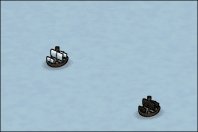
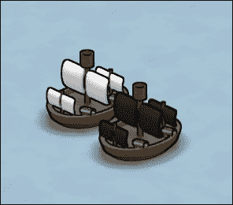
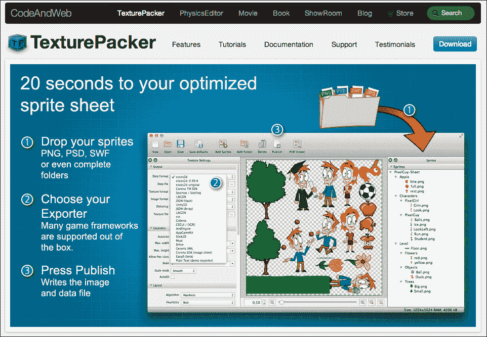
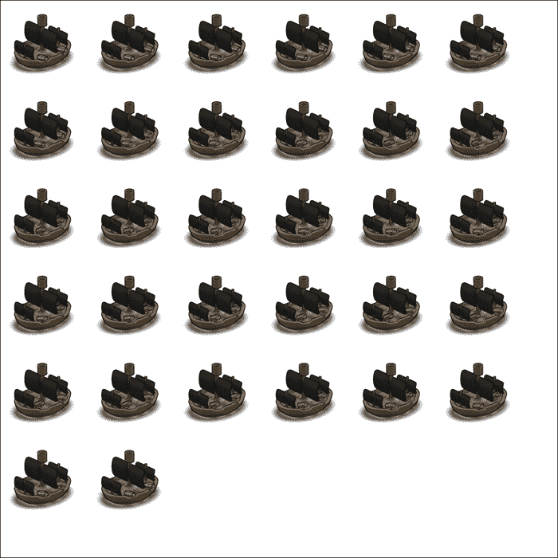
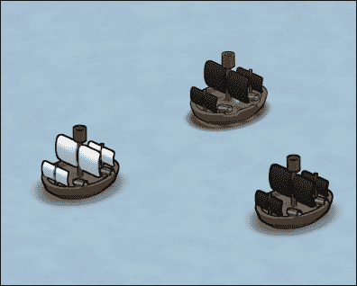

# 第五章. 美化我们的游戏

*在上一章中，我们学习了跨设备兼容性以及如果我们想要同时针对 iPhone 和 iPad，我们需要做什么。然后我们为我们的游戏设置了基础。在本章中，我们将开始为我们的游戏添加动画。*

# 使用缓动动画

假设我们想要将我们的船只移动到屏幕的边缘。我们该如何实现这一点？以下是有两种实现这一点的选项：

+   将船只移动到我们想要其移动的方向的每一帧

+   为我们的船只定义两个状态，并让处理器计算动画所需的全部步骤

乍一看，第二个选项似乎更有吸引力。我们首先需要知道船只的初始位置以及动画完成后船只应处的位置。Sparrow 提供了 `SPTween` 类，它正好能完成这个任务。

我们取两个值，也称为关键帧，并插值所有中间值。名称 "tween" 来自其中间状态。

在这个例子中，我们正在讨论显式移动位置，但在一般情况下，缓动动画并不仅限于动画化实体的位置，还可以用来动画化其颜色或其他任何属性。

在 Sparrow 中，特别是对象的任何数值属性都可以进行动画化。因此，所有在 `SPDisplayObject` 上可用的属性都可用于 `SPTween` 类及其动画能力。

如果我们想要实现淡出或淡入效果，我们只需要对显示对象的 `alpha` 属性进行动画化，从其最大值到最小值或反之。

让我们通过实际移动海盗船来尝试一下。

# 行动时间 - 移动海盗船

按照以下步骤移动船只：

1.  如果游戏项目文件尚未打开，请打开我们的游戏项目文件。

1.  添加一个名为 `_pirateShip` 的实例变量，类型为 `SPImage`，如下面的代码行所示：

    ```swift
    SPImage* _pirateShip;
    ```

1.  在 `Battlefield.m` 中将 `pirateShip` 的引用更新为 `_pirateShip`：

    ```swift
    _pirateShip = [SPImage imageWithTexture:[Assets texture:@"ship_pirate.png"]];
    _pirateShip.x = (Sparrow.stage.width - _pirateShip.width) / 2;
    _pirateShip.y = (Sparrow.stage.height - _pirateShip.height) / 2;
    ```

1.  在 `Battlefield.m` 文件中添加一个名为 `onBackgroundTouch` 的方法，如下面的代码行所示：

    ```swift
    -(void) onBackgroundTouch: (SPTouchEvent*) event
    ```

1.  在此方法中，获取触摸本身：

    ```swift
    SPTouch* touch = [[event touchesWithTarget:self andPhase:SPTouchPhaseBegan] anyObject];
    ```

1.  使用以下代码片段完成 `onBackgroundTouch` 方法：

    ```swift
    if (touch) {
      SPTween* tweenX = [SPTween tweenWithTarget:_pirateShip time:2.0f];
      SPTween* tweenY = [SPTween tweenWithTarget:_pirateShip time:2.0f];

      [tweenX animateProperty:@"x" targetValue:touch.globalX - (_pirateShip.width / 2)];
      [tweenY animateProperty:@"y" targetValue:touch.globalY - (_pirateShip.height / 2)];

      [Sparrow.juggler addObject:tweenX];
      [Sparrow.juggler addObject:tweenY];
    }
    ```

1.  将事件监听器注册到背景图像，如下面的代码行所示：

    ```swift
    [background addEventListener:@selector(onBackgroundTouch:) atObject:self forType:SP_EVENT_TYPE_TOUCH];
    ```

1.  切换到 `Game.m` 文件。

1.  更新场景导演以显示战场场景。

1.  运行示例，你将得到以下输出：

## *刚才发生了什么？*

在第 1 步中，我们从上一章结束的地方打开了我们的 Xcode 模板。为了在整个战场源文件中使用海盗船，我们应该将其移动到 `Battlefield` 类的实例变量中，这就是我们在第 2 步中做的。

现在，我们需要更新对海盗船的引用，这是第 3 步的任务。

在此之后，我们定义了方法，声明了如果我们触摸背景（在我们的例子中，是屏幕上的水）会发生什么。在第 5 步中，我们获取了当前的触摸。

在第 6 步中，我们实现了实际的补间动画。一旦我们确定我们有了当前的触摸对象（例如，不是像 `nil` 这样的假值），我们就开始动画化海盗船。

我们创建了两个补间动画：第一个用于海盗船的 `x` 位置，第二个用于其 `y` 位置。只要目标和补间动画的持续时间相同，我们实际上可以使用一个单一的补间动画，如下面的代码所示：

```swift
if (touch) {
  SPTween* tween = [SPTween tweenWithTarget:_pirateShip time:2.0f]; 

  [tween animateProperty:@"x" targetValue:touch.globalX - (_pirateShip.width / 2)];
  [tween animateProperty:@"y" targetValue:touch.globalY - (_pirateShip.height / 2)];

  [Sparrow.juggler addObject:tween];
}
```

由于我们稍后将要更改这些属性，我们最好将其留为两个独立的补间动画。

一个补间动画始终需要一个目标，我们将它设置为 `_pirateShip` 实例变量。我们必须指定的另一个值是补间动画将持续多长时间，这由 `time` 参数设置。补间动画所需的时间作为 `SPTween` 实例上的一个属性可用。`time` 参数是 `double` 类型，以秒为单位。

`tweenX` 实例正在绑定到 `x` 属性。我们需要通过其 `NSString` 标识符来访问该属性。因此，如果我们想动画化 `alpha` 属性，我们需要通过 `@"alpha"` 来访问它。内部，Sparrow 使用运行时类型信息（也称为反射）来在运行时更改属性。

我们将目标值设置为当前的触摸位置，即触摸的 x 坐标。现在，如果我们触摸背景，船的左上角将位于触摸位置。为了感觉更自然，我们应该将其改为船位于触摸的中心。这就是为什么我们从触摸位置减去船宽度的一半。

隐式地，初始值自动设置为要动画化的属性的当前值。

然后，我们分别对 `tweenY` 和 y 位置做了同样的操作。

为了实际动画化属性，我们将补间动画添加到一个名为 juggler 的对象中，该对象通过 `Sparrow.juggler` 可用。我们将在本章后面部分看看 juggler 的工作原理。

为了使触摸事件触发，我们将 `onBackgroundTouch` 方法与背景图像注册。

在第 8 步中，我们打开了 `Game.m` 文件，并将 `show` 调用更新为使用战场场景而不是第 9 步中发生的海盗湾场景。

然后，我们运行了示例。如果我们触摸屏幕上的任何地方，船将移动到我们刚刚触摸的位置。

让我们看看我们的源文件。

下面的代码是 `Battlefield.h` 文件中的代码：

```swift
#import "Scene.h"

@interface Battlefield : Scene {
    SPImage *_pirateShip;
}

@end
```

下面是相应的 `Battlefield.m` 文件：

```swift
#import "Battlefield.h"
#import "Assets.h"

@implementation Battlefield

-(void) onBackgroundTouch: (SPTouchEvent*) event
{
    SPTouch *touch = [[event touchesWithTarget:self andPhase:SPTouchPhaseBegan] anyObject];

  if (touch) {
    SPTween *tweenX = [SPTween tweenWithTarget:_pirateShip time:2.0f];
    SPTween *tweenY = [SPTween tweenWithTarget:_pirateShip time:2.0f];

    [tweenX animateProperty:@"x" targetValue:touch.globalX - (_pirateShip.width / 2)];
    [tweenY animateProperty:@"y" targetValue:touch.globalY - (_pirateShip.height / 2)];

    [Sparrow.juggler addObject:tweenX];
    [Sparrow.juggler addObject:tweenY];
  }
}
-(id) init
{
    if ((self = [super init])) {
        SPImage *background = [SPImage imageWithTexture:[Assets texture:@"water.png"]];
        background.x = (Sparrow.stage.width - background.width) / 2;
        background.y = (Sparrow.stage.height - background.height) / 2;

       _pirateShip = [SPImage imageWithTexture:[Assets texture:@"ship_pirate.png"]];
       _pirateShip.x = (Sparrow.stage.width - _pirateShip.width) / 2;
       _pirateShip.y = (Sparrow.stage.height - _pirateShip.height) / 2;

        SPImage *ship = [SPImage imageWithTexture:[Assets texture:@"ship.png"]];
        ship.x = 100;
        ship.y = 100;

        [background addEventListener:@selector(onBackgroundTouch:) atObject:self forType:SP_EVENT_TYPE_TOUCH];

        [self addChild:background];
        [self addChild:_pirateShip];
        [self addChild:ship];
    }

    return self;
}

@end
```

## 理解过渡

让我们更仔细地看看我们刚刚实现的动画。当我们移动我们的海盗船时，它以恒定的速度移动。这是一个线性过渡，这是每个新创建的 `SPTween` 实例的默认行为，如果创建实例时没有明确设置过渡值。

创建具有默认过渡的补间的标准方法如下：

```swift
SPTween *myTween = [SPTween tweenWithTarget:_pirateShip time:2.0f];
```

要使用具有非线性过渡的补间，只需将其指定为参数：

```swift
SPTween *myTween = [SPTween tweenWithTarget:_pirateShip time:2.0f transition:SP_TRANSITION_EASE_IN_OUT];
```

在这段代码中，我们使用了一个名为“ease-in-out”的过渡行为，在这种情况下，飞船不会立即移动，而是会花时间开始，在动画即将结束时，它会稍微慢下来一点。

### 注意

要查看所有可用过渡及其图形表示的完整列表，请查看 Sparrow 手册中的[`wiki.sparrow-framework.org/_detail/manual/transitions.png?id=manual%3Aanimation`](http://wiki.sparrow-framework.org/_detail/manual/transitions.png?id=manual%3Aanimation)。

## 解释杂技演员

**杂技演员**的目的是动画化其他对象。它是通过将它们保存在一个列表中，并在每一帧调用一个更新方法来实现的。更新方法（`advanceTime`）传递自上一帧以来经过的毫秒数。我们想要动画化的每个对象都需要添加到 `SPJuggler` 的一个实例中。

默认杂技演员可以通过 `Sparrow.juggler` 访问，这是在屏幕上动画化对象的简单方法。

由于 `Sparrow.juggler` 只是 `SPJuggler` 的一个实例，因此我们也可以为游戏的主要每个组件分别分离杂技演员。目前，使用默认的杂技演员就足够满足我们的需求了。

## 更新移动和取消补间

是时候做出我们的第一个游戏决策了。目前，海盗飞船的动画总是 2 秒长，如果玩家触摸屏幕的边缘而不是仅仅在屏幕上移动几个点，这将提供严重的优势。

我们需要引入的是，如果我们移动到屏幕边缘，则可能需要更多时间来推进飞船的某种形式的惩罚。

也是一个好主意，当飞船正在移动时，添加取消动画的可能性。这样，当事情变得紧张时，我们就有了一个从当前战斗中撤退的选项。

现在，我们如何实现当前动画的取消呢？让我们看看以下选项：

+   通过在屏幕上添加按钮

+   通过触摸飞船本身

我们应该尽可能地避免屏幕上的控制，因此让我们将此功能添加到触摸事件（当我们触摸海盗飞船时）。

# 行动时间 - 更新移动

要更新我们飞船的移动，请按照以下步骤操作：

1.  在初始化器内部，为敌对飞船添加一个补间。我们希望敌对飞船能够自行移动。我们还应该将飞船实例重命名为 `enemyShip`：

    ```swift
    SPImage *enemyShip = [SPImage imageWithTexture:[Assets texture:@"ship.png"]];
    enemyShip.x = 100;
    enemyShip.y = 100;

    SPTween *shipTween = [SPTween tweenWithTarget:enemyShip time:4.0f transition:SP_TRANSITION_EASE_IN_OUT];
    [shipTween animateProperty:@"y" targetValue:250];
    shipTween.repeatCount = 5;
    shipTween.reverse = YES;
    shipTween.delay = 2.0f;

    [Sparrow.juggler addObject:shipTween];

    ```

1.  更新 `onBackgroundTouch` 方法，使其类似于以下代码片段：

    ```swift
    SPTouch *touch = [[event touchesWithTarget:self] anyObject];

    if (touch) {
     [Sparrow.juggler removeObjectsWithTarget:_pirateShip];

     float targetX = touch.globalX - (_pirateShip.width / 2);
     float targetY = touch.globalY - (_pirateShip.height / 2);

     float distanceX = fabsf(_pirateShip.x - targetX);
     float distanceY = fabsf(_pirateShip.y - targetY);
     float penalty = (distanceX + distanceY) / 80.0f;

     float shipInitial = 0.25f + penalty;

     float speedX = shipInitial + (distanceX / Sparrow.stage.width) * penalty * penalty;
     float speedY = shipInitial + (distanceY / Sparrow.stage.height) * penalty * penalty;

     SPTween *tweenX = [SPTween tweenWithTarget:_pirateShip time:speedX];
     SPTween *tweenY = [SPTween tweenWithTarget:_pirateShip time:speedY];

     [tweenX animateProperty:@"x" targetValue:targetX];
     [tweenY animateProperty:@"y" targetValue:targetY]; 

      [Sparrow.juggler addObject:tweenX];
      [Sparrow.juggler addObject:tweenY];
    }
    ```

1.  添加一个名为 `onShipStop` 的新方法，如下面的代码行所示：

    ```swift
    -(void) onShipStop:(SPTouchEvent*) event
    ```

1.  使用所有触摸样板代码实现此方法并停止所有动画：

    ```swift
    SPTouch *touch = [[event touchesWithTarget:self andPhase:SPTouchPhaseBegan] anyObject];

    if (touch) {
      [Sparrow.juggler removeObjectsWithTarget:_pirateShip];
    }
    ```

1.  将 `onShipStop` 选择器注册到海盗飞船上：

    ```swift
    [_pirateShip addEventListener:@selector(onShipStop:) atObject:self forType:SP_EVENT_TYPE_TOUCH];
    ```

1.  当我们将飞船添加到战场场景中时，将敌对飞船与海盗飞船交换。

1.  运行示例，你会看到以下结果：

## *发生了什么？*

在步骤 1 中，我们在加载敌舰图像的代码下方添加了一个敌舰补间动画。

在创建实例时，我们将动画所需的时间设置为 4 秒，并使用 ease-in-out 过渡来查看与默认线性过渡直接比较时的差异。

这个补间将通过其`y`属性/位置移动敌舰。我们将目标值设置为`250`，这大致是屏幕的底部。

当设置`repeatCount`属性——它接受一个`int`类型的值时——我们希望动画重复的次数正好与我们设置的属性值相同。

通过将`reverse`属性设置为`YES`或`NO`，可以反转补间动画，因为它接受一个`BOOL`类型的值。如果我们没有在这个示例中设置`reverse`属性，当重复动画时，补间动画将从其初始值开始。当设置为`YES`时，动画将在初始值和目标值之间交替。我们应该记住，反转动画算作一个动画周期。

可以通过使用它们的`delay`属性来延迟补间动画。这个属性也需要一个`double`类型的值，并且像`time`属性一样以秒为单位来衡量。

现在，我们需要将动画添加到默认的杂技演员中。

在步骤 2 中，我们更新了触摸事件和动画。首先，我们移除了`andPhase`参数。之前，我们只能通过在屏幕上轻触来移动船。现在，我们可以通过轻触屏幕或触摸并拖动屏幕来移动船。

在我们知道触摸已经发生之后，我们从杂技演员中移除了之前绑定的所有补间动画。在这里，我们只是确保我们始终有一个新的补间，海盗船动画可能会产生任何随机的副作用，例如同时设置多个补间动画的不同目标值。

在下一行中，我们声明并分配了新位置的变量，然后我们得到了船的位置和触摸位置之间的绝对值。

惩罚是通过距离的总和除以 80 来计算的，这恰好是我们船的点大小。因此，触摸越接近船，这个值就越低，触摸离船越远，这个值就越高。

船的速度，即动画的持续时间，是通过相对于屏幕大小的相对距离乘以平方惩罚来计算的。我们还有一个初始值 250 毫秒，这是动画可能的最短时间。

除了`animateProperty`方法之外，我们还可以使用简写方法`moveToX:y:`，它与在`x`和`y`属性上调用`animateProperty`相同。

在第 3 步中，我们将`onShipStop`方法添加到了源文件中，并在接下来的步骤中实现了它。我们还移除了所有带有`_pirateShip`目标的所有补间动画。因此，如果当前有一个补间动画正在执行，它将被移除。

在第 5 步中，我们将`onShipStop`事件注册到了海盗船。

目前，如果我们移动到敌舰，敌舰将显示在我们的船的上方。为了使我们的船显示在敌舰上方，我们需要在将它们添加到显示树时交换这两个对象的顺序。

在这个示例之后，我们的`Battlefield.m`文件应该看起来像以下代码：

```swift
#import "Battlefield.h"
#import "Assets.h"

@implementation Battlefield

-(id) init
{
    if ((self = [super init])) {
        SPImage *background = [SPImage imageWithTexture:[Assets texture:@"water.png"]];
        background.x = (Sparrow.stage.width - background.width) / 2;
        background.y = (Sparrow.stage.height - background.height) / 2;

        _pirateShip = [SPImage imageWithTexture:[Assets texture:@"ship_pirate.png"]];
        _pirateShip.x = (Sparrow.stage.width - _pirateShip.width) / 2;
        _pirateShip.y = (Sparrow.stage.height - _pirateShip.height) / 2;

        SPImage *enemyShip = [SPImage imageWithTexture:[Assets texture:@"ship.png"]];
        enemyShip.x = 100;
        enemyShip.y = 100;

        SPTween *shipTween = [SPTween tweenWithTarget:enemyShip time:4.0f transition:SP_TRANSITION_EASE_IN_OUT];
        [shipTween animateProperty:@"y" targetValue:250];
        shipTween.repeatCount = 5;
        shipTween.reverse = YES;
        shipTween.delay = 2.0f;

        [Sparrow.juggler addObject:shipTween];

        [background addEventListener:@selector(onBackgroundTouch:) atObject:self forType:SP_EVENT_TYPE_TOUCH];
        [_pirateShip addEventListener:@selector(onShipStop:) atObject:self forType:SP_EVENT_TYPE_TOUCH];

        [self addChild:background];
        [self addChild:enemyShip];
        [self addChild:_pirateShip];
    }

    return self;
}

-(void) onBackgroundTouch:(SPTouchEvent*) event
{
    SPTouch *touch = [[event touchesWithTarget:self] anyObject];

    if (touch) {
        [Sparrow.juggler removeObjectsWithTarget:_pirateShip];

        float targetX = touch.globalX - (_pirateShip.width / 2);
        float targetY = touch.globalY - (_pirateShip.height / 2);

        float distanceX = fabsf(_pirateShip.x - targetX);
        float distanceY = fabsf(_pirateShip.y - targetY);

        float penalty = (distanceX + distanceY) / 80.0f;

        float shipInitial = 0.25f + penalty;

        float speedX = shipInitial + (distanceX / Sparrow.stage.width) * penalty * penalty;
        float speedY = shipInitial + (distanceY / Sparrow.stage.height) * penalty * penalty;

        SPTween *tweenX = [SPTween tweenWithTarget:_pirateShip time:speedX];
        SPTween *tweenY = [SPTween tweenWithTarget:_pirateShip time:speedY];

        [tweenX animateProperty:@"x" targetValue:targetX];
        [tweenY animateProperty:@"y" targetValue:targetY];

        [Sparrow.juggler addObject:tweenX];
        [Sparrow.juggler addObject:tweenY];
    }
}

-(void) onShipStop:(SPTouchEvent*) event
{
    SPTouch *touch = [[event touchesWithTarget:self andPhase:SPTouchPhaseBegan] anyObject];

    if (touch) {
        [Sparrow.juggler removeObjectsWithTarget:_pirateShip];
    }
}

@end
```

# 与精灵图集一起工作

到目前为止，我们已单独加载了每个图像并在屏幕上显示它们。精灵图集是将所有这些较小的图像组合成一个大图像的方法。当我们加载图像时，我们可以使用纹理的方式，就像我们习惯的那样。

当使用多个图像时，每当当前活动的纹理被另一个不同的纹理替换时，就会发生所谓的“纹理切换”。这种操作对性能影响很大，因此应尽可能避免。精灵图集允许我们通过使用相同的图像资产来表示多个不同的图像，从而避免纹理切换，并将绘制调用次数保持在最低。

精灵图集也可以用于精灵动画，其中一系列图像按顺序逐帧显示，这给人类眼睛造成了动画的错觉——就像翻书一样。

纹理图集是精灵图集的一种特殊化，它包含较小的图像，但它还提供了一个包含其子图像确切位置信息的元数据文件。在实践中，"纹理图集"和"精灵图集"通常被用作同义词。

### 注意

在我们开始之前，请下载本章所需的全部图形资源，链接为[`github.com/freezedev/pirategame-assets/releases/download/0.5/Graphics_05.zip`](https://github.com/freezedev/pirategame-assets/releases/download/0.5/Graphics_05.zip)。

# 学习纹理格式

到目前为止，我们只使用了 PNG 图像。然而，让我们看看 iOS 中是否有其他纹理格式更适合我们的目的。剧透：有的。不谈那些冒失的话，我们将分析哪种纹理格式最适合我们的目的。

以下表格显示了不同文件格式下的海盗船图像。让我们比较一下它们的文件大小：

| 压缩 | 文件格式 | 文件大小 |
| --- | --- | --- |
| 无 | BMP | 257 KB |
| 无损 | PNG | 36.6 KB |
| 依赖 | PVR（在这种情况下为 RGBA8888） | 257 KB |

当我们加载 PNG 文件时，内部会发生什么？图像在加载时被解压缩——这会消耗 CPU 资源。对于其他传统图像格式，如 JPEG，也是如此。一旦图像被解压缩，它就变成了纹理。

PVR 是一种针对 iOS 设备或所有 iOS 设备上使用的 PowerVR GPU 专门优化的纹理格式。例如，在加载 PVR 图像时，它将直接在 GPU 上解码图像，而不是 CPU。

PVR 包含许多不同的图像格式。如果我们追求包括 alpha 通道的无损质量，我们应该选择 RGBA8888 格式。如果我们不需要 alpha 通道，我们应该使用不带 alpha 通道的图像格式。RGBA8888 图像格式未压缩。因此，为了将应用程序大小保持在最小，我们应该使用 `pvr.gz` 格式，这是一种使用 GZIP 压缩的 PVR 文件。

## 使用 TexturePacker 创建精灵表

** TexturePacker ** 是一个用于创建精灵表和纹理图集的商业应用程序，可在 [`www.codeandweb.com/texturepacker`](http://www.codeandweb.com/texturepacker) 以约 30 美元的价格获得。为了能够创建我们自己的精灵表，我们需要 TexturePacker 的专业版或试用版。TexturePacker 下载窗口如下所示：



虽然工作流程相当直观，但让我们通过几个步骤来创建我们自己的纹理图集：

1.  将图像 `0001.png` 到 `0032.png` 拖放到应用程序的 ** Sprites ** 部分中。

1.  选择 ** Sparrow/Starling ** 作为 ** 数据格式 **。

1.  选择 ** GZIP compr. PVR ** 作为 ** 纹理格式 **。

1.  选择 ** RGBA8888 ** 作为 ** 图像格式 **。

1.  点击 ** AutoSD ** 按钮，并从预设中选择 ** corona @4x/@2x **。

1.  将数据文件和纹理文件的文件名设置为 `ship_pirate_small_cannon{v}.xml` 和 `ship_pirate_small_cannon{v}.pvr.gz`。

1.  点击 ** 发布 ** 按钮。

现在，我们的纹理图集已经为我们的每个支持分辨率生成。让我们看看结果。生成的图像之一输出如下截图：



这里是相应的 XML 文件的一个片段：

```swift
<?xml version="1.0" encoding="UTF-8"?>
<!-- Created with TexturePacker http://www.codeandweb.com/texturepacker-->
<!-- $TexturePacker:SmartUpdate:c58f88c054e0e917cc6c06d11cc04c15:0af47aa74ca5e538fac63da189c2b7ac:9e0a4549107632fbd952ab702bfc21e4$ -->
<TextureAtlas imagePath="ship_pirate_small_cannon.pvr.gz">
    <SubTexture name="e_0001" x="0" y="0" width="80" height="80"/>
    <SubTexture name="e_0003" x="80" y="0" width="80" height="80"/>
    <SubTexture name="e_0005" x="160" y="0" width="80" height="80"/>
    <SubTexture name="e_0007" x="240" y="0" width="80" height="80"/>
```

从这个片段中，我们可以看到对原始图像及其子纹理的引用。每个子纹理都有一个名称，它在较大图像中的位置以及其尺寸。

## Loading our first texture atlas

现在我们有了纹理图集，让我们使用 Sparrow 加载并显示它。

# Time for action – loading our first texture atlas

要加载我们的第一个纹理图集，我们需要遵循以下步骤：

1.  将必要的文件 (`ship_pirate_small_cannon*`) 复制到项目中。

1.  使用以下代码行加载纹理图集：

    ```swift
    SPTextureAtlas* atlas = [SPTextureAtlas atlasWithContentsOfFile:@"ship_pirate_small_cannon.xml"];
    ```

1.  从所有以 `00` 开头的纹理中创建一个数组：

    ```swift
    NSArray* textures = [atlas texturesStartingWith:@"00"];
    ```

1.  创建一个电影剪辑对象，并将其放置在原始海盗船的上方，如下面的代码所示：

    ```swift
    SPMovieClip *cannonShip = [SPMovieClip movieWithFrames:textures fps:20.0f];
    cannonShip.x = 200;
    cannonShip.y = 50;
    ```

1.  使用以下代码片段播放动画：

    ```swift
    [cannonShip play];
    [Sparrow.juggler addObject:cannonShip];
    ```

1.  按以下方式将动画海盗船添加到显示树中：

    ```swift
    [self addChild:background];
    [self addChild:enemyShip];
    [self addChild:_pirateShip];
    [self addChild:cannonShip];
    ```

1.  运行示例以查看以下结果：

## *发生了什么？*

要使用纹理图集，我们首先将所有相关文件复制到项目中。然后，使用`SPTextureAtlas`类，我们加载了 XML 文件。

在第 3 步中，我们需要从纹理图集中获取一个数组（或确切地说是一个`NSArray`），其中包含所有以`00`开头的图像，在我们的例子中这意味着这个精灵表中的每个图像都将用于动画。

`SPMovieClip`类是从`SPDisplayObject`派生出来的，也可以添加到显示树中。它可以播放我们在第 3 步中制作的数组中的动画。`fps`参数是必要的，因为它设置了动画的速度。

要播放动画本身，需要做两件事：首先，我们需要从电影剪辑中调用`play`方法；其次，我们需要将电影剪辑添加到表演者中。这正是我们在第 5 步中做的事情。

在下一步中，我们将电影剪辑添加到显示树中，当我们运行示例时，我们有了我们的海盗船，上下移动的敌舰，现在还有第二艘海盗船，它有开火动画。

如果你想查看这个示例的完整源文件，它可以在[`github.com/freezedev/pirategame/blob/71f42ded614c4917802dcba46a190476ff7b88c4/Classes/Battlefield.m`](https://github.com/freezedev/pirategame/blob/71f42ded614c4917802dcba46a190476ff7b88c4/Classes/Battlefield.m)找到。

## 突击测验

Q1\. 什么是补间动画？

1.  通过设置两个关键帧来定义动画的方法

1.  由多个精灵组成的动画

1.  一种优化屏幕上多个显示对象的方法

Q2\. 什么是精灵表？

1.  纸张上的草图

1.  包含几个较小图像的图像

1.  Sparrow 扩展以使用精灵

Q3\. 过渡用于修改动画随时间的变化率。

1.  正确

1.  错误

# 概述

在本章中，我们学习了补间动画和精灵表。

具体来说，我们介绍了如何使用补间动画来动画化显示对象，创建我们自己的精灵表，以及如何动画化这些精灵表。

我们还提到了纹理格式、表演者和过渡效果。

现在我们有了动画，我们的船在移动，让我们添加一些游戏逻辑——这是下一章的主题。
