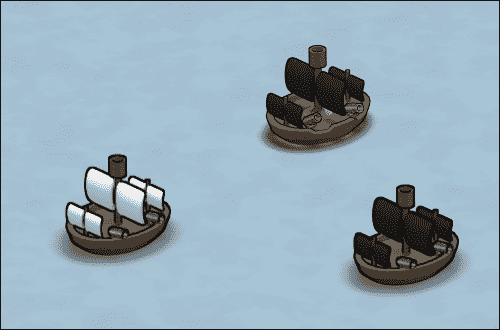
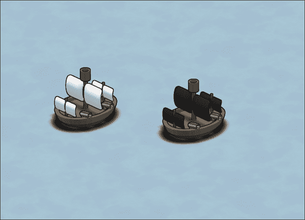
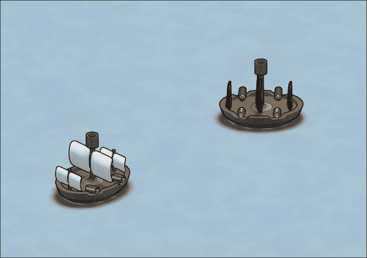
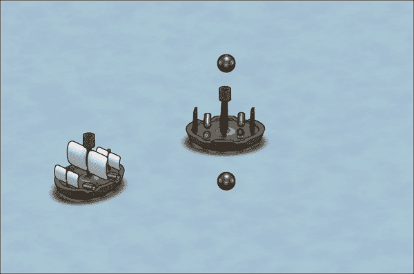
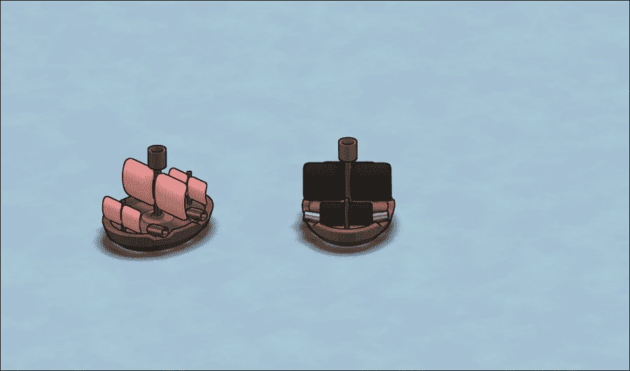
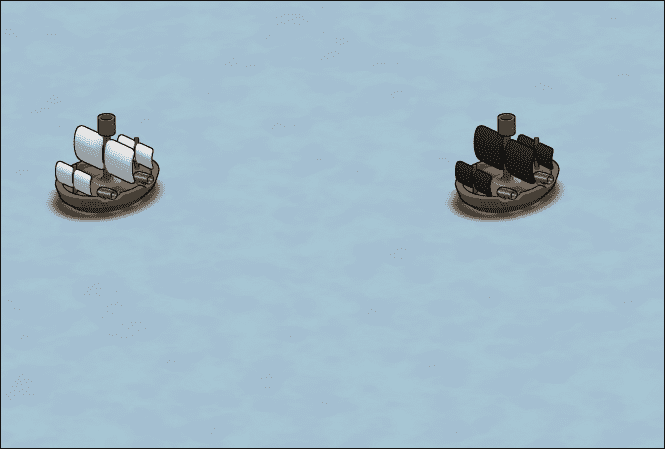

# 第六章。添加游戏逻辑

*在上一章中，我们学习了如何使用 tweens 在屏幕上动画化我们的对象；我们还学习了精灵图集，生成了带有纹理信息的自己的精灵图集，并对其进行了动画化。*

让我们快速看一下本章我们将解决哪些主题：

+   射击炮弹，这是我们游戏的一个基本机制

+   一旦在战场上展示出炮弹，它应该能够与敌舰相撞

+   如果足够的炮弹击中敌舰，则摧毁敌舰

# 扩展资源管理器

在上一章中，我们加载了我们第一个纹理图集，并将每个子纹理作为电影剪辑中的帧进行显示。我们没有使用资源管理器来做这件事，因为我们还没有实现这个功能。

因此，让我们继续并允许我们的资源管理器处理纹理图集。

# 开始行动时间 - 向资源管理器添加纹理图集

我们可以通过以下步骤扩展我们的资源管理器：

1.  如果尚未打开，请打开我们的游戏项目文件。

1.  切换到`TextureManager.h`文件并声明`registerTextureAtlas`方法，如下所示：

    ```swift
    -(SPTextureAtlas *) registerTextureAtlas:(NSString *) filename;
    ```

1.  切换到`TextureManager.m`文件并实现`registerTextureAtlas`方法，如下所示：

    ```swift
    -(SPTextureAtlas *) registerTextureAtlas:(NSString *) filename
    {
        if ([_dict objectForKey:filename] == nil) {
        return (SPTextureAtlas *) [self registerAsset:filename withContent:[SPTextureAtlas atlasWithContentsOfFile:filename]];
      } else {
        return (SPTextureAtlas *) [self registerAsset:filename withContent:nil];
      }
    }
    ```

1.  转到`Assets.h`文件并添加静态方法`textureAtlas`：

    ```swift
    +(SPTextureAtlas *) textureAtlas:(NSString*)filename;
    ```

1.  在`Assets.m`文件中，通过其`TextureManager`实例实现以下方法：

    ```swift
    +(SPTextureAtlas *) textureAtlas:(NSString*)filename
    {
        return [textureAssets registerTextureAtlas:filename];
    }
    ```

1.  在战场场景（`Battlefield.m`）中，导航到我们加载纹理图集和获取纹理的位置：

    ```swift
    SPTextureAtlas *atlas = [SPTextureAtlas atlasWithContentsOfFile:@"ship_pirate_small_cannon.xml"];

    NSArray *textures = [atlas texturesStartingWith:@"00"];
    ```

    将前面的代码替换为以下代码行：

    ```swift
    NSArray *textures = [[Assets textureAtlas:@"ship_pirate_small_cannon.xml"] texturesStartingWith:@"00"];
    ```

1.  运行示例。我们将在屏幕上看到以下舰船星座：

## *发生了什么？*

在步骤 1 中，我们从上一章结束的地方打开了我们的 Xcode 模板。为了加载纹理图集，我们需要切换到纹理管理器，我们指定它来加载所有与纹理有关联的内容。在步骤 2 中，我们声明了用于通过资产管理系统中使用纹理图集的方法。为了保持方法名称的一致性，我们将此方法命名为`registerTextureAtlas`，使其类似于`registerTexture`。签名类似于`registerTexture`，但它返回一个`SPTextureAtlas`实例而不是`SPTexture`。

在下一步中，我们实现了通过`filename`参数加载纹理的`registerTextureAtlas`方法，我们使用`SPTextureAtlas`工厂方法，就像我们学习纹理图集时做的那样。

一旦我们完成了扩展纹理管理器部分，我们需要扩展 `Assets` 类，我们在第 4 步中通过添加第 5 步中实现的函数头来实现这一点。为了保持命名方案一致，我们把这个方法命名为 `textureAtlas`。在这个方法中，我们只是调用了我们的纹理管理器的 `registerTextureAtlas` 方法，并返回了结果。

我们在战场上更新了行，通过资产管理系统加载电影剪辑的纹理图集。而不是两行——一行用于设置纹理图集实例，另一行用于从图集中获取所需的纹理——我们现在只有一行代码，它使用上两步中的 `textureAtlas` 方法获取我们的纹理图集，然后获取电影剪辑所需的纹理。

当我们在上一步运行示例时，我们得到了与上一章结尾完全相同的结果，这是一个好兆头，表明更改按预期工作。

# 结构化我们的船只

到目前为止，我们的船只只是 `SPImage` 的实例，它们在我们的战场场景中直接附加了补间动画。为了将代码重复性降到最低，让我们将船只逻辑重构到它自己的类中。

# 行动时间 - 创建船只类

为了结构化我们船只的代码，请遵循以下步骤：

1.  添加一个名为 `Entities` 的新组。

1.  在这个组中，添加一个名为 `Ship` 的新 Objective-C 类，它从 `SPSprite` 派生出来。

1.  打开 `Ship.h` 文件。为船只图像添加一个实例变量，并为船只射击炮弹的电影剪辑添加另一个实例变量，如下面的代码所示：

    ```swift
    SPMovieClip *_shootingClip;
    SPImage *_idleImage;
    ```

1.  声明一个名为 `initWithContentsOfFile` 的备用初始化器，它接受一个 `NSString` 作为参数：

    ```swift
    -(id)initWithContentsOfFile:(NSString *)filename;
    ```

1.  声明一个名为 `shoot` 的方法，如下面的代码所示：

    ```swift
    -(void) shoot;
    ```

1.  声明另一个名为 `moveTo` 的方法，它接受 `x` 值作为其第一个参数，`y` 值作为其第二个参数，如下面的代码所示：

    ```swift
    -(void) moveToX:(float) x andY:(float) y;
    ```

1.  声明一个名为 `stop` 的方法，如下面的代码所示：

    ```swift
    -(void) stop;
    ```

1.  使用以下代码定义 `Ship` 类的默认初始化器：

    ```swift
    -(id) init
    {
      if ((self = [super init])) {
        NSArray *textures = [[Assets textureAtlas:@"ship_pirate_small_cannon.xml"] texturesStartingWith:@"00"];

        _shootingClip = [SPMovieClip movieWithFrames:textures fps:20.0f];

        if (_idleImage == nil) {
          _idleImage = [[SPImage alloc] init];
        }

        [self addChild:_shootingClip];
        [self addChild:_idleImage];
      }

      return self;
    } 
    ```

1.  现在，定义一个接受 `filename` 作为参数的备用初始化器，如下面的代码所示：

    ```swift
    -(id) initWithContentsOfFile:(NSString *)filename
    {
      _idleImage = [[SPImage alloc] initWithTexture:[Assets texture:filename]];

      return [self init];
    }
    ```

1.  使用以下代码实现 `shoot` 方法：

    ```swift
    -(void) shoot
    {
      [_shootingClip play];
      [Sparrow.juggler addObject:_shootingClip];
    }
    ```

1.  `moveTo` 方法的具体内容应如下所示：

    ```swift
    -(void) moveToX:(float)x andY:(float)y
    {
      [self stop];

      float targetX = x - (self.width / 2);
      float targetY = y - (self.height / 2);

      float distanceX = fabsf(self.x - targetX);
      float distanceY = fabsf(self.y - targetY);

      float penalty = (distanceX + distanceY) / 80.0f;

      float shipInitial = 0.25f + penalty;

      float speedX = shipInitial + (distanceX / 
        Sparrow.stage.width) * penalty * penalty;
      float speedY = shipInitial + (distanceY / Sparrow.stage.height) * penalty * penalty;

      SPTween *tweenX = [SPTween tweenWithTarget:self time:speedX];
      SPTween *tweenY = [SPTween tweenWithTarget:self time:speedY];

      [tweenX animateProperty:@"x" targetValue:targetX];
      [tweenY animateProperty:@"y" targetValue:targetY];

      [Sparrow.juggler addObject:tweenX];
      [Sparrow.juggler addObject:tweenY];
    }
    ```

1.  实现名为 `stop` 的方法，如下面的代码所示：

    ```swift
    -(void) stop
    {
        [Sparrow.juggler removeObjectsWithTarget:self];
    }
    ```

1.  切换到 `Battlefield.h` 文件，并更新类，使实例变量 `_pirateShip` 是 `Ship` 类型，如下面的代码所示：

    ```swift
    #import "Scene.h"
    #import "Ship.h"

    @interface Battlefield : Scene {
     Ship *_pirateShip;
    }
    ```

1.  现在，切换到 `Battlefield.m` 文件。

1.  在场景中更新 `onBackgroundTouch` 方法，如下面的代码所示：

    ```swift
    SPTouch *touch = [[event touchesWithTarget:self] anyObject];

    if (touch) {
      [_pirateShip moveToX:touch.globalX andY:touch.globalY];
    }
    ```

1.  接下来，更新 `onShipStop` 方法，如下面的代码所示：

    ```swift
    SPTouch *touch = [[event touchesWithTarget:self andPhase:SPTouchPhaseBegan] anyObject];

    if (touch) {
      [_pirateShip stop];
    }
    ```

1.  更新剩余的从 `SPImage` 到 `Ship` 类的引用，并删除所有关于炮舰的引用，如下面的代码所示：

    ```swift
    _pirateShip = [[Ship alloc] initWithContentsOfFile:@"ship_pirate.png"];
    _pirateShip.x = (Sparrow.stage.width - _pirateShip.width) / 2;
    _pirateShip.y = (Sparrow.stage.height - _pirateShip.height) / 2;

    Ship *ship = [[Ship alloc] initWithContentsOfFile:@"ship.png"];
    ship.x = 100;
    ship.y = 100;
    ```

1.  运行示例。我们现在可以在屏幕上看到海盗船和敌舰：

## *发生了什么？*

在游戏开发中，术语实体通常指的是屏幕上的一个对象，它与其他对象进行交互。以一个 2D 动作侧滚动游戏为例：敌舰以及玩家控制的船只都是实体。子弹也是实体。例如，子弹从玩家船只产生时，会与玩家船只进行交互。敌舰会与子弹交互；如果子弹击中敌舰，它需要通过减少生命值或被摧毁来做出反应。同样的情况也适用于玩家船只。

实体也在更高级的游戏开发技术中发挥作用，例如实体-组件模式，其中交互被描述为组件。然后，这些组件被附加到实体上。

我们需要从我们的游戏中提取的是不同游戏元素之间的清晰分离。在步骤 1 中，我们添加了一个名为`Entities`的新组。在下一步中，我们定义了我们第一个实体`Ship`，它是`SPSprite`的子类。在类名前添加前缀也是可能的，就像所有 Sparrow 类都有前缀`SP`一样。对于我们的游戏，前缀`PG`是有意义的，因为它代表 PirateGame。

船只有两个实例变量，我们在步骤 3 中声明了它们：一个是我们在战场场景中之前看到的炮弹射击动画，另一个是船只本身的图像。

除了默认初始化器外，我们在步骤 4 中声明了第二个初始化器。该方法接受`filename`作为参数。我们不想为海盗船创建一个单独的类。我们可以使用相同的类来处理这两种类型。我们只需要为敌舰或海盗船提供不同的`filename`参数。

我们的船只类需要以下行为：

+   射击（步骤 5）

+   将船只移动到特定位置（步骤 6）

+   停止移动（步骤 7）

我们的`Ship.h`文件现在看起来像以下代码：

```swift
#import "SPSprite.h"

@interface Ship : SPSprite {
    SPMovieClip *_shootingClip;
    SPImage *_idleImage;
}

-(id)initWithContentsOfFile:(NSString *)filename;

-(void) shoot;

-(void) moveToX:(float) x andY:(float) y;
-(void) stop;

@end
```

在声明了`Ship`类的所有方法和实例变量之后，我们继续实现方法。在这样做之前，我们在步骤 8 中定义了初始化器：我们初始化了电影片段——使用射击海盗船的纹理图集——以及船只图像本身。与我们所知的不同之处在于，如果图像尚未初始化，我们将初始化它。

在步骤 9 中我们实现的第二个初始化器中，我们使用传递的文件名初始化了图像，并调用了默认初始化器。因此，如果调用了备用初始化器，我们不会用`SPImage`的新实例覆盖`_idleImage`实例变量。

到目前为止，`Ship.m`的完整代码如下：

```swift
#import "Ship.h"

#import "Assets.h"

@implementation Ship

-(id) init
{
    if ((self = [super init])) {
        NSArray *textures = [[Assets textureAtlas:@"ship_pirate_small_cannon.xml"] texturesStartingWith:@"00"];

        _shootingClip = [SPMovieClip movieWithFrames:textures fps:20.0f];

        if (_idleImage == nil) {
            _idleImage = [[SPImage alloc] init];
        }

        [self addChild:_shootingClip];
        [self addChild:_idleImage];
    }

    return self;
}

-(id) initWithContentsOfFile:(NSString *)filename
{
    _idleImage = [[SPImage alloc] initWithTexture:[Assets texture:filename]];

    return [self init];
}
```

在接下来的步骤中，我们实现了船只动作的方法：

+   **射击**：播放`_shooting`电影片段（步骤 10）。

+   **移动**：这是我们之前在战场场景中的`backgroundTouch`方法中拥有的船的移动逻辑。我们不是从船的实例中移除所有补间动画，而是从`ship`实例中调用了`stop`方法（步骤 11）。

+   **停止**：从当前实例（步骤 12）移除所有补间动画。

在其完整性方面，这些方法看起来像以下代码片段：

```swift
-(void) shoot
{
    [_shootingClip play];
    [Sparrow.juggler addObject:_shootingClip];
}

-(void) moveToX:(float)x andY:(float)y
{
    [self stop];

    float targetX = x - (self.width / 2);
    float targetY = y - (self.height / 2);

    float distanceX = fabsf(self.x - targetX);
    float distanceY = fabsf(self.y - targetY);

    float penalty = (distanceX + distanceY) / 80.0f;

    float shipInitial = 0.25f + penalty;

    float speedX = shipInitial + (distanceX / Sparrow.stage.width) * penalty * penalty;
    float speedY = shipInitial + (distanceY / Sparrow.stage.height) * penalty * penalty;

    SPTween *tweenX = [SPTween tweenWithTarget:self time:speedX];
    SPTween *tweenY = [SPTween tweenWithTarget:self time:speedY];

    [tweenX animateProperty:@"x" targetValue:targetX];
    [tweenY animateProperty:@"y" targetValue:targetY];

    [Sparrow.juggler addObject:tweenX];
    [Sparrow.juggler addObject:tweenY];
}

-(void) stop
{
    [Sparrow.juggler removeObjectsWithTarget:self];
}

@end
```

在最后几步中，我们更新了战场场景。首先，我们更新了头文件。我们需要导入`Ship.h`文件，并且`_pirateShip`实例变量不再是`SPImage`的指针，而是`Ship`类的指针。

在这一步之后，我们的`Battlefield.h`文件包含以下内容：

```swift
#import "Scene.h"
#import "Ship.h"

@interface Battlefield : Scene {
    Ship* _pirateShip;
}

@end
```

我们更新了战场场景中的触摸交互：

+   `onBackgroundTouch`：由于我们将移动逻辑移动到了`Ship`类，我们只需要调用正确的方法，即`moveTo`，并传递`touch`的*x*和*y*坐标（步骤 15）。

+   `onShipStop`：与`moveTo`方法类似，我们只需要调用船本身的`stop`方法（步骤 16）。

`Battlefield.m`文件中的触摸事件应该类似于以下代码片段：

```swift
#import "Battlefield.h"
#import "Assets.h"

@implementation Battlefield

-(void) onBackgroundTouch:(SPTouchEvent*) event
{
    SPTouch *touch = [[event touchesWithTarget:self] anyObject];

    if (touch) {
        [_pirateShip moveToX:touch.globalX andY:touch.globalY];
    }
}

-(void) onShipStop:(SPTouchEvent*) event
{
    SPTouch *touch = [[event touchesWithTarget:self andPhase:SPTouchPhaseBegan] anyObject];

    if (touch) {
        [_pirateShip stop];
    }
}
```

在下一步中，我们更新了船的初始化器。我们不再需要`cannonShip`电影剪辑，因为这个是`Ship`类中的一个实例变量。

让我们看看以下代码中的初始化器，它绑定这些触摸选择器并设置船本身：

```swift
-(id) init
{
    if ((self = [super init])) {
        SPImage *background = [SPImage imageWithTexture:[Assets texture:@"water.png"]];
        background.x = (Sparrow.stage.width - background.width) / 2;
        background.y = (Sparrow.stage.height - background.height) / 2;

        _pirateShip = [[Ship alloc] initWithContentsOfFile:@"ship_pirate.png"];
        _pirateShip.x = (Sparrow.stage.width - _pirateShip.width) / 2;
        _pirateShip.y = (Sparrow.stage.height - _pirateShip.height) / 2;

        Ship *ship = [[Ship alloc] initWithContentsOfFile:@"ship.png"];
        ship.x = 100;
        ship.y = 100;

        SPTween *shipTween = [SPTween tweenWithTarget:ship time:4.0f transition:SP_TRANSITION_EASE_IN_OUT];
        [shipTween animateProperty:@"y" targetValue:250];
        shipTween.repeatCount = 5;
        shipTween.reverse = YES;
        shipTween.delay = 2.0f;

        [Sparrow.juggler addObject:shipTween];
        [background addEventListener:@selector(onBackgroundTouch:) atObject:self forType:SP_EVENT_TYPE_TOUCH];
        [_pirateShip addEventListener:@selector(onShipStop:) atObject:self forType:SP_EVENT_TYPE_TOUCH];
        [self addChild:background];
        [self addChild:ship];
        [self addChild:_pirateShip];
    }

    return self;
}

@end
```

当我们运行示例时，我们在屏幕上看到了两艘船；如果我们触摸任何地方，我们的海盗船会移动到那个点，就像我们预期的那样。如果我们触摸船在移动过程中，它会停止。

# 扩展船类

现在我们已经完成了船类的基础，让我们考虑我们需要为船类添加什么：

+   **生命值**：如果一艘船被击中，生命值应该反映这种状态。船将从一个给定的生命值开始，比如 20，每次被击中都会失去一些。当它最终达到零生命值时，它将被完全摧毁。

+   **方向**：这是船面对的方向。根据方向，炮弹将从船的每一边发射。

我们应该避免在不必要的情况下使用文件名，例如现在，当我们初始化船的实例时。

在我们继续进行编码部分之前，让我们从[`github.com/freezedev/pirategame-assets/releases/download/0.6/Graphics_06.zip`](https://github.com/freezedev/pirategame-assets/releases/download/0.6/Graphics_06.zip)下载最新的图片。这些图片包括海盗船和炮弹的更新精灵表，我们将在以后使用。

删除`ship_small_cannon`文件，并将新文件复制到项目中。这可以轻松完成，但 Xcode 并不总是喜欢替换现有文件。

# 是时候采取行动了——为船类添加更多功能

让我们按照以下步骤扩展船类：

1.  打开`Ship.h`文件。

1.  添加一个用于船的八个方向的 `enum`，如下面的代码所示：

    ```swift
    typedef NS_ENUM(NSInteger, ShipDirection) {
        DirectionNorth,
        DirectionSouth,
        DirectionWest,
        DirectionEast,
        DirectionNorthWest,
        DirectionNorthEast,
        DirectionSouthWest,
        DirectionSouthEast
    };
    ```

1.  添加一个用于船类型的 `enum`，如下面的代码所示：

    ```swift
    typedef NS_ENUM(NSInteger, ShipType) {
        ShipPirate,
        ShipNormal
    };
    ```

1.  将 `_shootingClip` 实例变量改为指向 `NSArray` 类的指针，并移除 `_idleImage` 实例变量，如下面的代码所示：

    ```swift
    NSArray *_shootingClip;
    ```

1.  为船的 `hitpoints` 添加一个属性，如下面的代码行所示：

    ```swift
    @property int hitpoints;
    ```

1.  为 `type` 添加另一个属性，如下面的代码行所示：

    ```swift
    @property ShipType type;
    ```

1.  第三个属性是船的方向：

    ```swift
    @property (nonatomic) ShipDirection direction;
    ```

    因为我们将需要为这个属性编写自定义的获取器和设置器，所以我们需要一个同名的实例变量，前面加下划线：

    ```swift
    @interface Ship : SPSprite {
        NSArray *_shootingClip;
        ShipDirection _direction;
    }
    ```

1.  将 `initWithContentsOfFile` 方法声明替换为 `initWithType`。此方法以 `ShipType` 作为其参数，如下面的代码行所示：

    ```swift
    -(id)initWithType:(ShipType)type;
    ```

1.  切换到 `Ship.m` 文件。

1.  让我们使用以下代码实现 `initWithType` 方法：

    ```swift
    -(id) initWithType:(ShipType)type
    {
        if ((self = [super init])) {
            self.hitpoints = 100;
            self.type = type;

            SPTextureAtlas *atlas = (type == ShipPirate) ? [Assets textureAtlas:@"ship_pirate_small_cannon.xml"] : [Assets textureAtlas:@"ship_small_cannon.xml"] ;

            NSArray *texturesNorth = [atlas texturesStartingWith:@"n_00"];
            // ...

            float animationFPS = 12.0f;

            SPMovieClip *clipNorth = [SPMovieClip movieWithFrames:texturesNorth fps:animationFPS];
            // ...

            _shootingClip = [NSArray arrayWithObjects:clipNorth, clipSouth, clipWest, clipEast, clipNorthWest, clipNorthEast, clipSouthWest, clipSouthEast, nil];

            for (SPMovieClip* clip in _shootingClip) {
                clip.loop = NO;
                [self addChild:clip];
            }

            self.direction = DirectionSouthWest;
        }

        return self;
    }
    ```

1.  删除 `initWithContentsOfFile` 方法，并将默认初始化器更新为使用 `initWithType` 方法，如下面的代码所示：

    ```swift
    -(id) init
    {
        return [self initWithType:ShipNormal];
    }
    ```

1.  通过简单地返回 `_direction` 实例变量来实现 `direction` 属性的自定义获取器。

1.  `direction` 属性的设置器需要以下代码：

    ```swift
    _direction = direction;

    for (SPMovieClip* clip in _shootingClip) {
      clip.visible = NO;
    }

    ((SPMovieClip *) _shootingClip[_direction]).visible = YES;
    ```

1.  将 `shoot` 方法的内联内容替换为以下行：

    ```swift
    for (SPMovieClip* clip in _shootingClip) {
      [Sparrow.juggler removeObjectsWithTarget:clip];
    }

    [_shootingClip[self.direction] play];
    [Sparrow.juggler addObject:_shootingClip[self.direction]];

    [_shootingClip[self.direction] addEventListenerForType:SP_EVENT_TYPE_COMPLETED block:^(SPEvent *event)
    {
      [_shootingClip[self.direction] stop];
    }];
    ```

1.  在 `moveTo` 方法中，在创建 `tweenX` 和 `tweenY` 对象之后，声明并定义两个变量，这些变量应该检测船将旋转到的方向，如下面的代码所示：

    ```swift
    int signX = 0;
    int signY = 0;
    ```

1.  只有在达到某个特定阈值时才更新值，如下面的代码所示：

    ```swift
    if (distanceX > 40) {
      signX = (self.x - targetX) / distanceX;
    }

    if (distanceY > 40) {
      signY = (self.y - targetY) / distanceY;
    }
    ```

1.  如果 `signX` 的值为 `1` 且 `signY` 仍为 `0`，则将 `direction` 更改为 `DirectionEast`，如下面的代码所示：

    ```swift
    if ((signX == 1) && (signY == 0)) {
      self.direction = DirectionEast;
    }
    ```

1.  对所有剩余的方向重复此操作。

1.  切换到 `Battlefield.m` 文件。

1.  更新海盗船和敌船的初始化器。只有海盗船需要从 `ShipType` 类型中获取 `PirateShip` 值。

1.  在 `onShipStop` 方法内部，添加当海盗船被点击两次时射击以及当船被点击一次时停止的功能，如下面的代码所示：

    ```swift
    if (touch) {
      if (touch.tapCount == 1) {
        [_pirateShip stop];
      } else if (touch.tapCount == 2) {
        [_pirateShip shoot];
      }
    }
    ```

1.  将 `onShipStop` 及其所有引用重命名为 `onShipTap`。

1.  运行示例。

我们现在看到船正在移动到我们触摸屏幕的方向。



## *发生了什么？*

首先，我们打开了船的头文件，然后定义了一个包含所有方向状态的 `enum`。Objective-C 提供了一个方便的 `NS_ENUM` 宏，它允许我们做到这一点。作为第一个参数，我们需要 `enum` 将表示的类型。第二个参数是 `enum` 类型的名称。这个 `enum` 类型有八个状态：北、南、西、东以及这些方向的组合。

在第 3 步中，我们定义了一个用于船类型的第二个 `enum`。它可以是海盗船或没有黑旗的正常敌船。

在第 4 步中，我们重新定义了`_shootingClip`实例的类型。这种变化的理由是我们将所有电影剪辑保存在一个数组中，并且可以通过索引访问特定的电影剪辑。

在接下来的几个步骤中，我们向类中添加了一些属性，如下所示：

+   `hitpoints`：这表示船当前有多少生命值（第 5 步）

+   `type`：这表示船的类型（第 6 步）

+   `direction`：这表示船面向的方向（第 7 步）

当我们创建船类实例时，只需将文件名添加到每个初始化器调用中，这本来是可以的，但如果我们更改了所有这些文件名，或者屏幕上有不止几艘船，就会变得混乱。这就是为什么我们用`initWithType`方法替换了`initWithContentsOfFile`方法。

接下来，我们实现了我们刚刚声明的所有方法。我们从最后声明的方法开始。由于这是我们首选的初始化器，所以我们了解了这里发生的情况：

+   我们将`hitpoints`属性设置为`100`。虽然`100`或多或少是一个随机数字，但它是一个很好的起点，因为它很容易计算。例如，假设我们需要四次打击来摧毁任何船只；炮弹的破坏潜力是 25。

+   我们将`type`属性设置为`type`参数的值。

+   我们根据类型将纹理图集设置为海盗船图集或其他选项。三元运算只是编写一个`if`语句的一种花哨方式，如下面的代码行所示：

    ```swift
    if (type == ShipPirate) { ... } else { ... }
    ```

    三元运算的优势在于我们可以直接将结果分配给变量。

+   我们为每个方向获取了纹理。在纹理图集中，射击动画的每个方向都以方向的缩写前缀命名：`n`代表北，`nw`代表西北，依此类推。

+   然后，我们定义了动画的速度。我们将其设置为每秒 12 帧，因为我们不希望动画比平时慢。毕竟，操作大炮是困难的。

+   就像我们为每个方向创建了一个`NSArray`实例一样，我们还需要为所有电影剪辑做同样的事情。我们也可以将这一行写成以下形式：

    ```swift
    _shootingClip = @[clipNorth, clipSouth, clipWest, clipEast, clipNorthWest, clipNorthEast, clipSouthWest, clipSouthEast];
    ```

+   我们将所有电影剪辑添加到`_shootingClip`实例变量中。

+   通过遍历`_shootingClip`实例变量，我们将所有电影剪辑添加到显示树中。我们还希望电影剪辑只播放一次，这就是为什么我们将`loop`属性设置为`NO`。

+   船的默认方向是西南方向。

在第 11 步中，我们通过仅调用带有`ShipNormal`类型的`initWithType`初始化器，显著简化了默认初始化器。

我们从为`direction`属性创建自定义的 getter 和 setter 开始。我们在属性定义中添加了`nonatomic`关键字。这是一种性能优化方法，可以使生成的访问器更快，但不是线程安全的。由于 Sparrow 应该只用于单线程，所以在我们的游戏中使用`nonatomic`是安全的。在内部，Objective-C 已经将 getter 和 setter 定义为`propertyName`和`setPropertyName`，或者在我们的情况下，`direction`和`setDirection`。

要使用我们自己的代码，我们只需覆盖这些方法。`direction`属性的 getter 相对简单，因为它只需要返回`_direction`实例变量。

在我们为`direction`属性自定义的 setter 中，我们首先需要将实例变量`_direction`设置为参数的值。然后，我们遍历所有电影剪辑并将它们的`visible`属性设置为`NO`。接着，我们显示了当前方向的电影剪辑。这与我们通过场景导演展示场景的方式非常相似。

在第 14 步中，我们使用以下步骤更新了`shoot`方法：

+   我们从杂技演员中移除了所有来自任何电影剪辑的可动画对象。

+   我们播放了当前方向的电影剪辑并将其添加到杂技演员中。

+   我们为电影剪辑添加了一个事件监听器，当电影剪辑动画完成时触发。我们使用了一个块而不是选择器。块（在非 Objective-C 环境中也称为闭包）是一个可以访问非局部变量的函数。因此，虽然我们可以在块内部定义变量，但我们访问变量就像在`shoot`方法内部声明一个语句一样。块有一定的吸引力，因为我们不需要为几行代码定义一个单独的选择器。在使用块时，我们需要注意一些事情，但 Xcode 通常会警告我们潜在的副作用。

+   在我们的块内部，我们停止了电影剪辑，因为它不会重置自己。这就像倒带 VHS 磁带一样。

在这个时候，我们更新了当船移动时的方向。为了实现这一点，我们在`moveTo`方法内部定义了两个变量：`signX`和`signY`。它们的默认值都是`0`。

这个想法是将我们从`moveTo`方法中得到的方向值映射到`ShipDirection`值。如果`signY`是`1`，它将映射到`DirectionNorth`；如果`signX`是`-1`，它将映射到`DirectionWest`；如果两者同时具有相同的值，它们将映射到`DirectionNorthWest`。

我们将`signX`变量设置为对象的*x*坐标减去目标*x*坐标，然后除以`distanceX`。因此，我们的`signX`值要么是`1`，要么是`-1`。对于`signY`变量也是同样的情况。

现在，如果我们移动船，我们只能得到`DirectionNorthWest`、`DirectionNorthEast`、`DirectionSouthEast`和`DirectionSouthWest`这样的方向。在一条线上两次点击同一个像素点几乎是不可能的。这就是为什么我们需要一个阈值。只有当距离超过 40 个点时，我们才将`signX`和`signY`分别设置为`1`或`-1`。在这种情况下，40 不是一个随机的数字；根据 Apple 的说法，一个 40 x 40 点的矩形是点击的平均大小。

在步骤 17 和 18 中，我们将`signX`和`signY`变量映射到`ShipDirection`值，并相应地设置了`direction`属性。

在战场场景中，我们需要创建我们的船实例。对于敌船，我们使用了默认初始化器。

在步骤 21 中，我们更新了`onShipStop`方法。我们利用`touch`对象的`tapCount`属性来查看对象被点击了多少次。如果船被点击了一次，它会停止移动；如果被点击了两次，它会射击。

由于`onShipStop`方法不仅停止了船，而且在被双击时射击，因此将其重命名为`onShipTap`是一个好主意。

当我们运行示例时，船会根据我们在屏幕上点击的位置改变方向，当我们双击船时，我们会看到炮弹动画。

# 射击炮弹

当我们双击我们的船时，动画会播放。然而，有一个明显的东西缺失，那就是炮弹！让我们继续添加一些炮弹。

# 行动时间 - 允许船射击炮弹

让我们按照以下步骤允许海盗船射击炮弹：

1.  打开`Ship.h`文件。

1.  添加一个只读属性`isShooting`，它有一个实例变量对应项`_isShooting`，如下面的代码所示：

    ```swift
    @property (readonly) BOOL isShooting;
    ```

1.  为船的左侧和右侧添加一个炮弹。它们都是指向`SPImage`的指针，如下面的代码所示：

    ```swift
    @property SPImage *cannonBallLeft;
    @property SPImage *cannonBallRight;
    ```

1.  切换到`Ship.m`文件。

1.  在`initWithType`方法内部，将`_isShooting`实例变量设置为`NO`，位于方法顶部。

1.  在`initWithType`方法内部，使用`cannonball.png`图像创建两个炮弹，将它们的`visible`属性设置为`NO`，并将它们添加到显示树中。

1.  在`shoot`方法内部，如果`_isShooting`设置为`YES`则中止，否则将`_isShooting`设置为`YES`，如下所示：

    ```swift
    if (_isShooting) {
      return;
    }

    _isShooting = YES;
    ```

1.  为动画速度和目标位置设置一些默认值，如下面的代码所示：

    ```swift
    float shootingTime = 1.25f;
    float innerBox = 25.0f;
    float targetPos = 30.0f;
    ```

1.  添加对当前方向的影片剪辑的引用，如下面的代码行所示：

    ```swift
    SPMovieClip *currentClip = _shootingClip[self.direction];
    ```

1.  为每个炮弹及其相应的*x*和*y*属性创建一个补间对象：

    ```swift
    SPTween *tweenCbLeftX = [SPTween tweenWithTarget:self.cannonBallLeft time:shootingTime];
    SPTween *tweenCbLeftY = [SPTween tweenWithTarget:self.cannonBallLeft time:shootingTime];
    SPTween *tweenCbRightX = [SPTween tweenWithTarget:self.cannonBallRight time:shootingTime];
    SPTween *tweenCbRightY = [SPTween tweenWithTarget:self.cannonBallRight time:shootingTime];
    ```

1.  按照以下代码设置炮弹及其补间属性的方向对：

    ```swift
    switch (self.direction) {
      case DirectionNorth:
      case DirectionSouth:
        self.cannonBallLeft.x = (-self.cannonBallLeft.width / 2) + innerBox;
        self.cannonBallLeft.y = (currentClip.height - self.cannonBallLeft.height) / 2;

        self.cannonBallRight.x = (-self.cannonBallRight.width / 2) + currentClip.width - innerBox;
        self.cannonBallRight.y = (currentClip.height - self.cannonBallRight.height) / 2;

        [tweenCbLeftX animateProperty:@"x" targetValue:self.cannonBallLeft.x - targetPos];
        [tweenCbRightX animateProperty:@"x" targetValue:self.cannonBallRight.x + targetPos];

        break;

      default:
        break;
    }
    ```

1.  为`DirectionEast/DirectionWest`对设置炮弹。

1.  将两个炮弹设置为在屏幕上可见，并将所有与炮弹相关的补间添加到主杂技师中。

1.  在移除所有来自电影剪辑的缓动效果之后，立即移除所有来自炮弹的缓动效果。

1.  一旦电影剪辑播放完毕，将 `_isShooting` 实例变量设置为 `NO` 并隐藏两个炮弹。

1.  运行示例。现在我们的海盗船可以发射炮弹，如下面的截图所示：

## *刚才发生了什么？*

我们在这个示例中从 `Ship` 类的头文件开始，添加了一些新的属性，例如：

+   `isShooting`：这表示船当前是否在射击（步骤 2）

+   `cannonBallLeft`：这表示从船的左侧发射的炮弹（步骤 3）

+   `cannonBallRight`：这表示从船的右侧发射的炮弹（步骤 3）

在接下来的步骤中，我们使用以下步骤修改了 `initWithType` 方法：

+   我们将 `_isShooting` 设置为默认值，即 `NO`（步骤 5）

+   我们创建了炮弹对象（步骤 6）

+   我们隐藏了两个炮弹（步骤 6）

+   我们将炮弹添加到显示树中（步骤 6）

让我们进入 `shoot` 方法，看看这里有什么变化：

+   我们只有在船没有射击时才执行该方法，以最小化潜在的副作用并防止有人一直点击船（步骤 7）。

+   我们在射击发生时定义了变量 `shootingTime`。它被设置为 1.2 秒，因为这大约是电影剪辑动画的长度（步骤 8）。

+   变量 `innerBox` 是船图像边缘到实际图像本身的距离（步骤 8）。

+   变量 `targetPos` 存储了炮弹将飞行的距离（步骤 8）。

+   为了方便，我们定义了 `currentClip` 变量，这样我们就不必每次想要访问当前方向的动画剪辑时都输入 `_shootingClip[self.direction]`（步骤 9）。

+   我们为每个坐标和炮弹定义了一个缓动效果，所以到目前为止，我们总共有四个缓动效果（步骤 10）。

+   在步骤 11 和 12 中，我们设置了炮弹的位置和缓动效果。

+   我们需要在屏幕上看到炮弹，这就是为什么我们将它们设置为可见。为了看到相应的动画，我们需要将缓动效果添加到杂耍者中（步骤 13）。

+   在实际播放动画之前，我们还移除了所有来自炮弹的缓动效果（步骤 14）。

+   在 `shoot` 方法中最后需要更新的东西是将 `_isShooting` 实例变量设置为 `NO`，一旦动画完成，并在同一块中隐藏两个炮弹（步骤 15）。

当我们运行示例并双击我们的海盗船时，电影剪辑播放，两个巨大的炮弹从船的两侧出现。

## 尝试一下，英雄

到目前为止，船不能斜向射击。请自行实现这个功能。

# 碰撞检测

在我们实现碰撞检测之前，让我们看看不同类型的碰撞检测：

+   **边界框碰撞**：我们检查实体的边界（这是一个矩形）。如果这些矩形相交，则表示发生了碰撞。

+   **边界球体碰撞**：我们计算两个实体之间的距离。如果距离小于两个实体半径之和，则这些实体正在碰撞。

+   **像素碰撞**：我们检查一个实体的所有像素是否与另一个实体的像素相交。虽然这确实是最详细和全面的碰撞检查，但它也是最占用 CPU 资源的一种。

现在我们已经让海盗船实际上开始射击炮弹了，让我们实现可以击沉敌舰的功能。我们使用边界框碰撞，因为这是最容易实现的碰撞检测类型之一。

# 行动时间 – 让炮弹与船只碰撞

要检查炮弹是否与敌舰碰撞，请按照以下步骤操作：

1.  打开 `Ship.h` 文件。

1.  我们需要为 `hitpoints` 属性添加自定义的获取器和设置器，所以让我们将这个属性设置为 `nonatomic` 并添加一个名为 `_hitpoints` 的实例变量。

1.  声明 `abortShooting` 和 `hit` 方法。

1.  切换到 `Ship.m` 文件。

1.  自定义的 `hitpoints` 获取器仅返回实例变量 `_hitpoints`。

1.  `hitpoints` 的自定义设置器包含以下代码：

    ```swift
    -(void) setHitpoints:(int)hitpoints
    {
        _hitpoints = hitpoints;
        if (_hitpoints <= 0) {
            self.visible = NO;
        }
    }
    ```

1.  `abortShooting` 方法包含以下行：

    ```swift
    -(void) abortShooting
    {
        _isShooting = NO;

        [Sparrow.juggler removeObjectsWithTarget:self.cannonBallLeft];
        [Sparrow.juggler removeObjectsWithTarget:self.cannonBallRight];

        self.cannonBallLeft.visible = NO;
        self.cannonBallRight.visible = NO;
    }
    ```

1.  `hit` 方法包含以下内容：

    ```swift
    -(void) hit
    {
        self.hitpoints = self.hitpoints - 25;

        for (SPMovieClip* clip in _shootingClip) {
            SPTween *tween = [SPTween tweenWithTarget:clip time:0.3f];
            tween.reverse = YES;
            tween.repeatCount = 2;

            [tween animateProperty:@"color" targetValue:SP_RED];
            [Sparrow.juggler addObject:tween];
        }
    }
    ```

1.  在战场头文件中，我们需要添加一个名为 `_enemyShip` 的实例变量，它是指向 `Ship` 类的指针。

1.  更新从 `ship` 到 `_enemyShip` 的引用。

1.  添加一个事件监听器来监听 `SP_EVENT_TYPE_ENTER_FRAME` 事件，如下面的代码所示：

    ```swift
    [self addEventListener:@selector(onEnterFrame:) atObject:self forType:SP_EVENT_TYPE_ENTER_FRAME];
    ```

1.  使用以下代码实现 `onEnterFrame` 方法：

    ```swift
    -(void) onEnterFrame:(SPEvent *)event
    {
      if (_pirateShip.isShooting) {
        SPRectangle *enemyShipBounds = [_enemyShip boundsInSpace:self];
        SPRectangle *ball1 = [_pirateShip.cannonBallLeft boundsInSpace:self];
        SPRectangle *ball2 = [_pirateShip.cannonBallRight boundsInSpace:self];

        if ([enemyShipBounds intersectsRectangle:ball1] || [enemyShipBounds intersectsRectangle:ball2]) {
          if (_pirateShip.cannonBallLeft.visible || _pirateShip.cannonBallRight.visible) {
            [_pirateShip abortShooting];
            [_enemyShip hit];
          }
        }
      }
    }
    ```

1.  运行示例。当敌舰被击中时，它会短暂地闪烁红色，如下面的截图所示：

## *发生了什么？*

在步骤 2 中，我们更新了 `hitpoints` 属性，以便我们可以添加自定义的获取器和设置器。在下一步中，我们声明了 `abortShooting` 和 `hit` 方法。我们需要第一个方法来取消当前的射击动画，第二个方法则在船只被击中时执行某些操作。

我们在步骤 5 和 6 中分别定义了自定义的获取器和设置器。对于获取器，我们只是返回了我们在步骤 2 中声明的实例变量 `_hitpoints`。对于设置器，我们设置了该实例变量；但是当 `_hitpoints` 等于或低于零时，我们隐藏了船只。

步骤 7 中的 `abortShooting` 方法设置了 `_isShooting` 实例变量，从炮弹中移除了所有补间动画，并隐藏了炮弹。

`hit` 方法从 `hitpoints` 中减去 25 分，并添加了一个动画，让船只非常短暂地闪烁红色，以便在船只被击中时提供一些视觉反馈。

在接下来的两个步骤中，我们将敌舰实例重构为一个实例变量，而不是初始化器内部的局部变量。我们还更新了所有对敌舰的引用。

在步骤 11 中，我们添加了一个事件监听器。这个事件监听器在每个帧上被调用。在下一个步骤中，我们实现了敌舰和海盗船的炮弹之间的碰撞。

首先，我们需要从每个对象相对于当前场景的边界值。我们需要查看是否有任何炮弹与敌舰相交。为了确保大炮实际上在开火，我们检查了炮弹的可见性，然后从敌舰调用了 `hit` 方法，从海盗船调用了 `abortShooting` 方法。后者是必要的，否则检查会再次发生，并且结果为正，以至于敌舰会立即被摧毁，我们甚至看不到那艘闪烁的红船。

当我们运行示例时，我们需要准确击中敌舰四次，它才会消失。每次敌舰被击中，它都会短暂地闪烁红色。

# 加载游戏相关数据

让我们反思一下此刻我们拥有的游戏相关数据类型。它们是：

+   每艘船的生命值

+   炮弹造成的损伤

+   战场中每艘船的位置

我们应该将这些数据放在一个文件中，并在游戏中加载它。

# 行动时间 – 避免硬编码值

为了分离和加载我们的游戏相关数据，我们需要遵循以下步骤：

1.  在 `Resources` 文件夹中添加一个名为 `gameplay.json` 的新文件，内容如下：

    ```swift
    {
        "hitpoints": 100,
        "damage": 25,
        "battlefield": {
            "enemy": {
                "x": 100,
                "y": 100
            },
            "pirate": {
                "x": 300,
                "y": 100
            }
        }
    }
    ```

1.  打开 `Ship.h` 文件。

1.  添加一个名为 `maxHitpoints` 的属性，如下面的代码行所示：

    ```swift
    @property int maxHitpoints;
    ```

1.  在 `Ship` 初始化器内部，将设置 `hitpoints` 的代码段替换为以下几行代码：

    ```swift
    self.maxHitpoints = [(NSNumber *) [Assets dictionaryFromJSON:@"gameplay.json"][@"hitpoints"] intValue];

    self.hitpoints = self.maxHitpoints;
    ```

1.  在 `hit` 方法内部，将硬编码的损伤值替换为从 `gameplay.json` 文件中加载的值，如下面的代码所示：

    ```swift
    self.hitpoints = self.hitpoints - [(NSNumber *) [Assets dictionaryFromJSON:@"gameplay.json"][@"damage"] intValue];
    ```

1.  在 `Battlefield.m` 文件内部，将硬编码的船只位置替换为来自 `gameplay.json` 文件的那些，如下面的代码所示：

    ```swift
    NSDictionary *gameplayFile = [Assets dictionaryFromJSON:@"gameplay.json"];

    _pirateShip = [[Ship alloc] initWithType:ShipPirate];
    _pirateShip.x = [(NSNumber *) gameplayFile[@"battlefield"][@"pirate"][@"x"] floatValue];
    _pirateShip.y = [(NSNumber *) gameplayFile[@"battlefield"][@"pirate"][@"y"] floatValue];

    _enemyShip = [[Ship alloc] init];
    _enemyShip.x = [(NSNumber *) gameplayFile[@"battlefield"][@"enemy"][@"x"] floatValue];
    _enemyShip.y = [(NSNumber *) gameplayFile[@"battlefield"][@"enemy"][@"y"] floatValue];
    ```

1.  运行示例。

我们现在不再在代码中硬编码值，而是从文件中加载这些值。因此，船只处于不同的起始位置，如下面的截图所示：



## *刚才发生了什么？*

在步骤 1 中，我们创建了 JSON 文件，其中包含我们稍后将要加载的值。我们目前拥有的值包括生命值、损伤值，当然还有船只的位置。

在 `Ship.h` 文件内部，我们添加了一个名为 `maxHitpoints` 的新属性，它表示任何船只的最大健康值。

在第 4 步中，我们首先使用`gameplay.json`文件中的`hitpoints`属性设置`maxHitpoints`属性。由于属性是从`gameplay.json`文件加载的，并且其类型为`id`，我们需要将其转换为更熟悉的数据类型。我们将它转换为指向`NSNumber`的指针，然后通过`intValue`方法使用其整数值。

在下一步中，我们对`damage`属性也做了同样的处理。

在第 6 步中，我们切换到战场场景，并更新了船只的位置，以反映来自`gameplay.json`文件中的相同位置。

当我们运行示例时，我们的船只位于我们在`gameplay.json`文件中定义的位置。射击和摧毁敌人按预期工作。

## 突击测验

Q1. 如何描述事件监听器？

1.  使用块

1.  使用选择器

1.  使用选择器或块

Q2. 何时调用注册到`SP_TYPE_EVENT_ENTER_FRAME`的事件？

1.  一旦在添加到显示树的第一帧中

1.  每一帧一次

1.  从不

Q3. 使用 Sparrow 无法检测双击。

1.  正确

1.  错误

# 摘要

在本章中，我们学习了如何将基本游戏逻辑元素添加到我们的游戏中。

具体来说，我们介绍了如何构建我们的代码。我们对触摸、事件监听器和碰撞检测有了更深入的了解。

现在我们的小海盗船实际上可以射击并击中东西了，让我们添加用户界面元素——这是下一章的主题。
