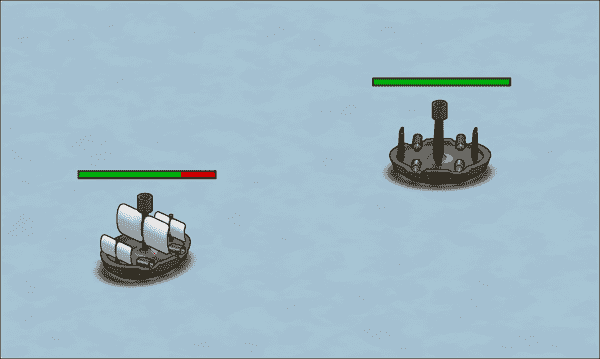
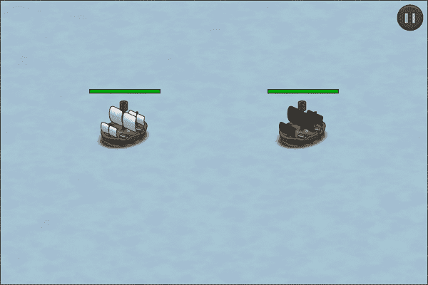
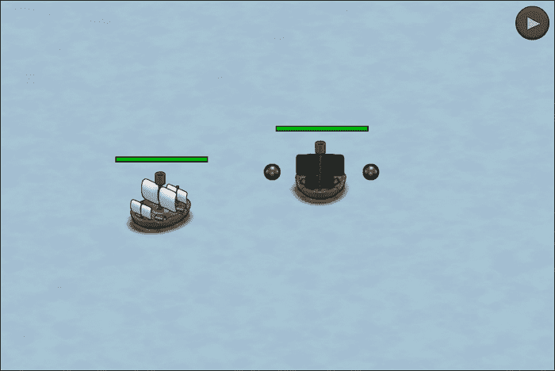
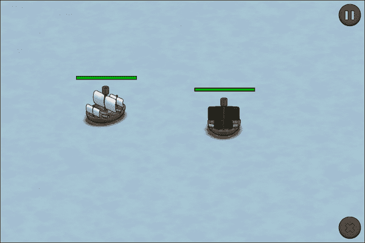
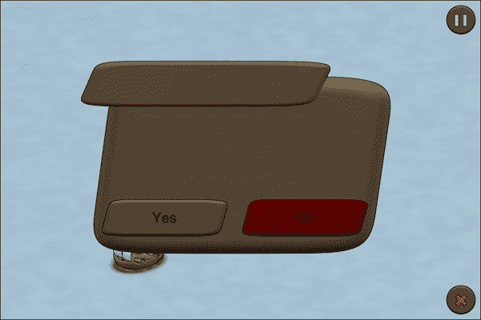
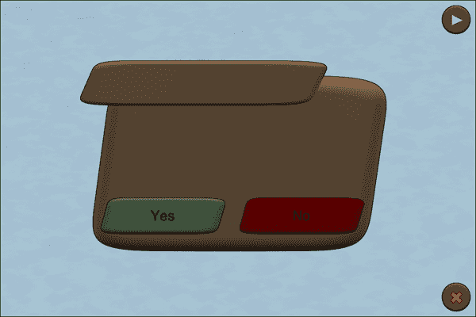
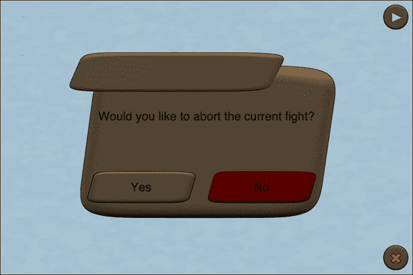
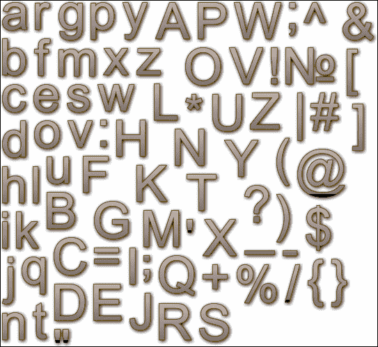
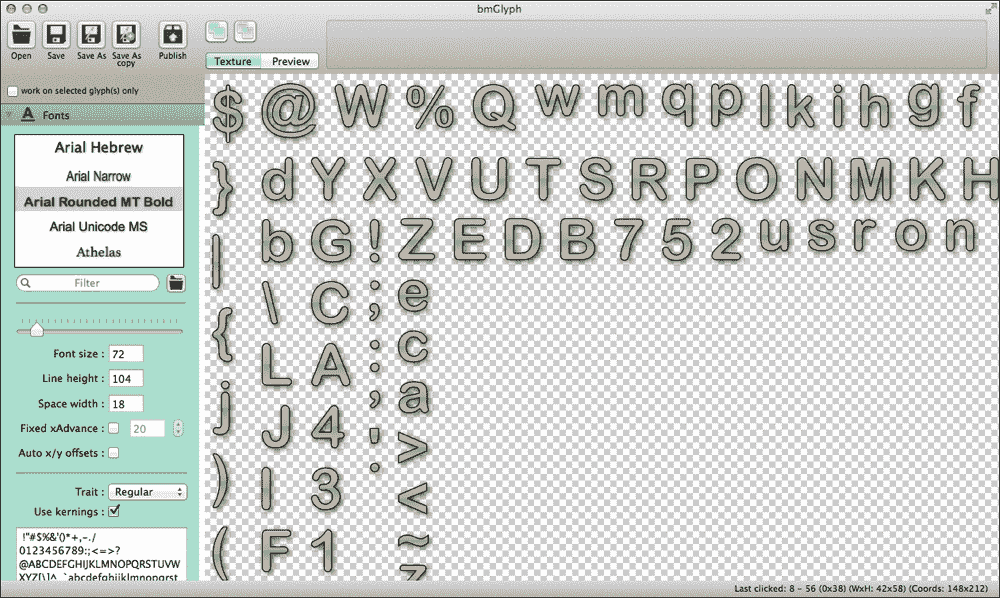
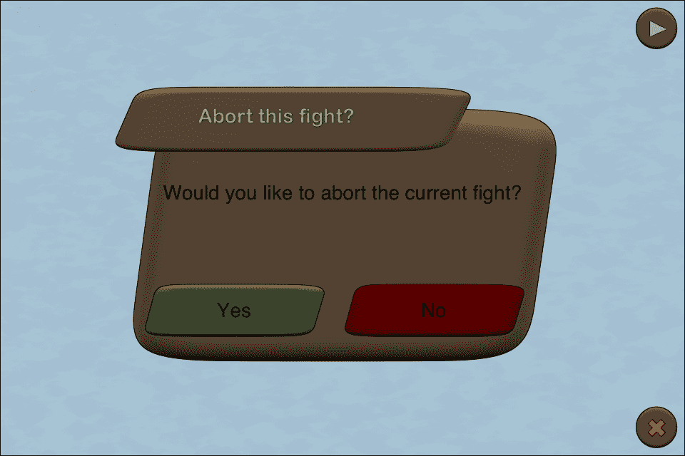

# 第七章。用户界面

*在前一章中，我们学习了如何将第一个游戏元素添加到我们的游戏中。现在，我们的海盗船可以发射炮弹，如果炮弹击中敌人足够多次，敌人的船就会被摧毁。*

在本章中，我们将添加用户界面元素。具体来说，我们将从以下方面改进我们的游戏：

+   显示和更新每艘船的生命值

+   在屏幕上添加按钮

+   在屏幕上显示文本

因此，让我们先在屏幕上添加生命值的视觉表示。

# 显示每艘船的生命值

默认情况下，每艘船有 100 点生命值，每颗炮弹对生命值造成 25 点伤害。当炮弹击中船时，我们确实有一些视觉反馈，但一旦被击中几次，我们就不知道船有多少生命值了。

# 行动时间 – 在每艘船顶部放置生命值条

要显示每艘船的生命值，我们只需遵循以下步骤：

1.  如果游戏项目文件尚未打开，请打开我们的游戏项目文件。

1.  切换到`Ship.h`文件。

1.  添加一个名为`_quadHitpoints`的实例变量，它是指向`SPQuad`的指针，如下面的代码行所示：

    ```swift
    SPQuad *_quadHitpoints;
    ```

1.  切换到`Ship.m`文件。在初始化器中创建炮弹图像之后，我们添加一个四边形，它应该是我们的生命值表示的边界，如下面的代码所示：

    ```swift
    float hitpointsHeight = 5.0f;
    SPQuad *hitpointsBorder = [SPQuad quadWithWidth:clipNorth.width height:hitpointsHeight color:SP_BLACK];
    ```

1.  我们添加了生命值框的背景，如下面的代码所示：

    ```swift
    uint redColor = SP_COLOR(200, 0, 0);
    SPQuad *quadMaxHitpoints = [SPQuad quadWithWidth:hitpointsBorder.width - 2.0f height:hitpointsHeight - 2.0f color:redColor];
    ```

1.  我们将生命值框的背景设置为一点边距，这意味着其位置需要相对于本地坐标系向左和向上各一点：

    ```swift
    quadMaxHitpoints.x = 1.0f;
    quadMaxHitpoints.y = 1.0f;
    ```

1.  然后，我们从`_quadHitpoints`实例变量创建`SPQuad`，如下面的代码所示：

    ```swift
    uint greenColor = SP_COLOR(0, 180, 0);
    _quadHitpoints = [SPQuad quadWithWidth:hitpointsBorder.width - 2.0f height:hitpointsHeight - 2.0f color:greenColor];
    ```

1.  如以下代码所示，我们将生命值设置为与背景相同的坐标：

    ```swift
    _quadHitpoints.x = quadMaxHitpoints.x;
    _quadHitpoints.y = quadMaxHitpoints.y;
    ```

1.  然后，我们将所有的生命值四边形添加到显示树中，如下面的代码所示：

    ```swift
    [self addChild:hitpointsBorder];
    [self addChild:quadMaxHitpoints];
    [self addChild:_quadHitpoints];
    ```

1.  在`setHitpoints`方法内部，在将实例变量设置为参数值的语句之后添加以下代码行：

    ```swift
    _quadHitpoints.scaleX = (float) _hitpoints / self.maxHitpoints;
    ```

1.  运行示例。

如以下截图所示，两艘船现在都以其红色和绿色条表示其生命值数量：



## *发生了什么？*

在第一步中，我们打开了我们在上一章中停止的 Xcode 模板。首先，我们需要一个实例变量来表示我们的生命值。如果我们考虑其他游戏如何显示当前的生命值，在策略游戏中通常，生命值以每个单位上方的绿色和红色条表示。在格斗游戏中，每个玩家的生命值显示在顶部左和右两侧。由于我们可能在屏幕上有多个敌人，最好的表示方法是在每个飞船上方都有红色和绿色的条。条上的绿色部分将是飞船当前拥有的生命值数量，而红色部分是当前缺失的数量。

在第二步中，我们切换到 `Ship.h` 文件，因为我们想要定义一个实例变量。为了表示生命值，我们选择了 `SPQuad` 并将我们的变量命名为 `_quadHitpoints`。为了实际实现生命值机制，我们切换到 `Ship.m` 文件。我们的生命值条实际上由三个不同的框组成：

+   围绕生命值的边界

+   生命值的背景（一个红色条）

+   实际的击中点生命值条（一个表示为我们的 `_quadHitpoints` 实例变量的绿色条）

在第五步中，我们定义了一个黑色矩形，它将作为我们的生命值条的边界。矩形的宽度应该是飞船的宽度。我们从 `clipNorth` 动画剪辑中获取了宽度。实际上，我们也可以从任何其他动画剪辑中获取飞船的宽度。我们将黑色矩形的长度设置为五点。我们不希望生命值条太粗，但它必须易于可见和识别。

在下一步中，我们设置了生命值的背景。我们定义了一个 `SPQuad` 实例，我们称之为 `quadMaxHitpoints`。它应该在每一边比黑色矩形小一个点。我们使用了 `hitpointsBorder` 实例的宽度，并将高度设置为三点。

我们将 `quadMaxHitpoints` 实例的左和上边距各设置为一点，这样它实际上看起来就像生命值条有一个边界。

然后，我们在第八步初始化了 `quadHitpoints` 实例变量。它也是一个 `SPQuad` 类，并且与我们的背景生命值条具有相同的尺寸。

使用 `quadMaxHitpoints` 实例，我们希望 `_quadHitpoints` 在边界内显示。因此，我们将 `_quadHitpoints` 的位置相对于飞船本身向左和向上调整一个点。在这种情况下，我们可以从 `quadMaxHitpoints` 四边形调整位置。

对于红色和绿色的矩形，我们避免使用鲜艳的颜色，因为这可能会使眼睛疲劳，并分散我们对动作的注意力。此外，由于我们总体上追求较暗的色调，鲜艳的颜色并不适合这个环境。在着色和设计用户界面时，请记住，元素应该在实际设备上进行测试。亮度通常不会达到最大值，尤其是如果设备正在使用电池。在某些情况下，图形甚至会被赋予额外的对比度或被调亮，这样在移动设备上看起来就不会太暗。

在第 10 步中，我们将所有四边形添加到显示树中；所有四边形都是 `Ship` 类的子类。

在这一点之后，我们的代码片段将看起来像以下这样：

```swift
SPMovieClip *clipSouthWest = [SPMovieClip movieWithFrames:texturesSouthWest fps:animationFPS];
SPMovieClip *clipSouthEast = [SPMovieClip movieWithFrames:texturesSouthEast fps:animationFPS];

_shootingClip = [NSArray arrayWithObjects:clipNorth, clipSouth, clipWest, clipEast, clipNorthWest, clipNorthEast, clipSouthWest, clipSouthEast, nil];

self.cannonBallLeft = [SPImage imageWithTexture:[Assets texture:@"cannonball.png"]];
self.cannonBallRight = [SPImage imageWithTexture:[Assets texture:@"cannonball.png"]];

float hitpointsHeight = 5.0f;
 SPQuad *hitpointsBorder = [SPQuad quadWithWidth:clipNorth.width height:hitpointsHeight color:SP_BLACK];

 uint redColor = SP_COLOR(200, 0, 0);
 SPQuad *quadMaxHitpoints = [SPQuadquadWithWidth:hitpointsBorder.width - 2.0fheight:hitpointsHeight - 2.0f color:redColor];
 quadMaxHitpoints.x = 1.0f;
 quadMaxHitpoints.y = 1.0f;

 uint greenColor = SP_COLOR(0, 180, 0);
 _quadHitpoints = [SPQuad quadWithWidth:hitpointsBorder.width - 2.0f height:hitpointsHeight - 2.0f color:greenColor];
 _quadHitpoints.x = quadMaxHitpoints.x;
 _quadHitpoints.y = quadMaxHitpoints.y;

for (SPMovieClip* clip in _shootingClip) {
  clip.loop = NO;
  [self addChild:clip];
}

self.cannonBallLeft.visible = NO;
self.cannonBallRight.visible = NO;

[self addChild:self.cannonBallLeft];
[self addChild:self.cannonBallRight];

[self addChild:hitpointsBorder];
[self addChild:quadMaxHitpoints];
[self addChild:_quadHitpoints];

self.direction = DirectionSouthWest;
```

如果我们要多次使用生命值创建代码，将这部分代码放入一个单独的方法中是一种最佳实践。

在下一步中，我们更新了生命值设置器。`_quadHitpoints` 实例将在水平方向上缩放。由于 `_hitpoints` 和 `self.maxHitpoints` 都是整数值，我们需要将其转换为浮点值。如果我们不这样做，生命值条要么是红色，要么是绿色，中间没有其他颜色。

在第 10 步之后，`setHitpoints` 方法将看起来像以下代码片段：

```swift
-(void) setHitpoints:(int)hitpoints
{
    _hitpoints = hitpoints;

 _quadHitpoints.scaleX = (float) _hitpoints / self.maxHitpoints;

    if (_hitpoints <= 0) {
        self.visible = FALSE;
    }
}
```

我们在最后一步运行了示例，并看到敌方飞船以及我们的飞船上方都有生命值条。当飞船移动时，生命值条也会随之移动，当我们击中敌方飞船时，生命值条会相应更新。

# 在屏幕上添加按钮

现在我们已经在屏幕上有了生命值条，让我们添加一些用户可以与之交互的东西。

## 暂停和继续游戏

我们将要添加的第一件事是能够随意暂停和继续游戏。这实际上非常重要，尤其是对于移动动作游戏。如果移动设备（iPhone）上有电话进来，而我们没有暂停功能，玩家可能会因为无法暂停游戏而感到沮丧，从而丢失进度或连胜。

在我们开始实现这些按钮之前，让我们下载本章所需的图形资源，这些资源可在[`github.com/freezedev/pirategame-assets/releases/download/0.7/Graphics_07.zip`](https://github.com/freezedev/pirategame-assets/releases/download/0.7/Graphics_07.zip)找到。将提取文件的 contents 复制到项目中。

让我们思考一下在暂停游戏时需要做什么：

+   显示暂停游戏的按钮

+   显示继续游戏的按钮

+   当玩家点击暂停按钮时，停止所有当前缓动

+   当玩家点击继续按钮时，恢复所有当前缓动

由于这是一个更大的任务，我们将它分为两部分；首先，我们将显示按钮，然后我们将实现功能。

### 在屏幕上显示暂停和继续按钮

在这个例子中，我们将添加所有需要的按钮，并将它们显示在屏幕的正确位置。

# 是时候采取行动——将按钮放置在屏幕上

要添加我们的第一个按钮，请按照以下步骤操作：

1.  打开`Battlefield.h`文件。

1.  为每个按钮添加一个实例变量。我们将使用`SPButton`类型，如下面的代码所示：

    ```swift
    SPButton *_buttonPause;
    SPButton *_buttonResume;
    ```

1.  切换到`Battlefield.m`文件。

1.  构建我们的两个实例变量，如下面的代码所示：

    ```swift
    _buttonPause = [SPButton buttonWithUpState:[[Assets textureAtlas:@"ui.xml"] textureByName:@"button_pause"]];
    _buttonResume = [SPButton buttonWithUpState:[[Assets textureAtlas:@"ui.xml"] textureByName:@"button_play"]];
    ```

1.  使用以下代码将暂停和恢复按钮的位置设置为屏幕的右上角：

    ```swift
    _buttonPause.x = Sparrow.stage.width - _buttonPause.width - 4.0f;
    _buttonPause.y = 4.0f;

    _buttonResume.x = _buttonPause.x;
    _buttonResume.y = _buttonPause.y;
    ```

1.  使用以下代码隐藏恢复按钮：

    ```swift
    _buttonResume.visible = NO;
    ```

1.  为了后续使用，创建点击暂停和恢复按钮的方法，如下面的代码所示：

    ```swift
    -(void) onButtonPause:(SPTouchEvent *)event
    {

    }

    -(void) onButtonResume:(SPTouchEvent *)event
    {

    }
    ```

1.  将新创建的方法绑定到暂停和恢复按钮上，如下面的代码所示：

    ```swift
    [_buttonPause addEventListener:@selector(onButtonPause:) atObject:self forType:SP_EVENT_TYPE_TRIGGERED ];
    [_buttonResume addEventListener:@selector(onButtonResume:) atObject:self forType:SP_EVENT_TYPE_TRIGGERED ];
    ```

1.  按照以下方式将两个按钮添加到显示树中：

    ```swift
    [self addChild:_buttonPause];
    [self addChild:_buttonResume];
    ```

1.  运行示例以查看结果。我们现在在屏幕上有一个暂停按钮，如下面的截图所示：

## *发生了什么？*

在第 1 步中，我们打开了`Battlefield.h`文件。我们向这个类添加了两个实例变量，一个用于暂停按钮，一个用于恢复按钮。我们使用了`SPButton`类，它基本上是一个图像，并且可以选择在上面显示一些文本。

接下来，我们切换到`Battlefield.m`文件。在第 4 步中，我们初始化了两个按钮。我们需要更仔细地查看以下两个点：

+   我们已经知道，如果我们使用`texturesStartingWith`方法，我们可以得到一个纹理数组。如果我们只想使用单个纹理，我们需要使用`textureByName`，并且我们还需要指定正确的名称。

+   `SPButton`提供了几个工厂方法。我们正在使用的是`buttonWithUpState`方法，我们必须传递一个`SPTexture`实例。正常状态是始终可见的纹理。如果我们指定了按下状态，按下状态将在按钮被点击时可见。另一个工厂方法允许我们指定按下状态，甚至是一些文本。

在下一步中，我们将按钮定位在屏幕的右上角。我们留出了一些空间（四个点），这样按钮就不会离屏幕边缘太近。

在第 6 步中，我们隐藏了简历按钮，这样在第一次显示场景时，我们只能看到暂停按钮。

在下一步中，我们添加了一些暂停和恢复游戏的方法。我们目前将这些方法留空，但稍后我们会填充它们。

接下来，我们将这些方法链接到按钮上，以便在触摸这些按钮时调用它们。

要在屏幕上实际显示按钮，我们需要将它们添加到显示树中，我们在第 9 步中已经做到了这一点。

让我们看看初始化器中具体发生了什么变化：

```swift
SPTween *shipTween = [SPTween tweenWithTarget:_enemyShip time:4.0f transition:SP_TRANSITION_EASE_IN_OUT];
[shipTween animateProperty:@"y" targetValue:250];
shipTween.repeatCount = 5;
shipTween.reverse = YES;
shipTween.delay = 2.0f;

_buttonPause = [SPButton buttonWithUpState:[[Assets textureAtlas:@"ui.xml"] textureByName:@"button_pause"]];
_buttonResume = [SPButton buttonWithUpState:[[Assets textureAtlas:@"ui.xml"] textureByName:@"button_play"]];

_buttonPause.x = Sparrow.stage.width - _buttonPause.width - 4.0f;
_buttonPause.y = 4.0f;

_buttonResume.x = _buttonPause.x;
_buttonResume.y = _buttonPause.y;

_buttonResume.visible = NO;

[_buttonPause addEventListener:@selector(onButtonPause:) atObject:self forType:SP_EVENT_TYPE_TOUCH];
[_buttonResume addEventListener:@selector(onButtonResume:) atObject:self forType:SP_EVENT_TYPE_TOUCH];

[Sparrow.juggler addObject:shipTween];

[_background addEventListener:@selector(onBackgroundTouch:) atObject:self forType:SP_EVENT_TYPE_TOUCH];
[_pirateShip addEventListener:@selector(onShipTap:) atObject:self forType:SP_EVENT_TYPE_TOUCH];

[self addEventListener:@selector(onEnterFrame:) atObject:self forType:SP_EVENT_TYPE_ENTER_FRAME];

[self addChild:_background];
[self addChild:_enemyShip];
[self addChild:_pirateShip];

[self addChild:_buttonPause];
[self addChild:_buttonResume];

```

现在，当我们运行示例时，我们在屏幕右上角看到了暂停按钮。当我们点击按钮时，除了按钮稍微缩小一点外，没有任何反应。

### 实现暂停和恢复游戏的逻辑

现在我们已经在屏幕上显示了按钮，让我们允许玩家暂停和恢复游戏。我们将利用自己的`juggler`，如果游戏被暂停，则将其保存到一个变量中，如果没有暂停，我们也前进我们的`juggler`以及子元素。

# 操作时间 – 允许玩家暂停和恢复

为了允许玩家暂停和恢复游戏，我们需要遵循以下步骤：

1.  打开`Ship.h`文件。

1.  添加一个名为`_juggler`的实例变量，它是一个指向`SPJuggler`的指针，如下面的代码行所示：

    ```swift
    SPJuggler *_juggler;
    ```

1.  声明一个名为`paused`的属性，其类型为`BOOL`，如下面的代码行所示：

    ```swift
    @property (nonatomic) BOOL paused;
    ```

1.  声明一个名为`advanceTime`的方法，如下面的代码行所示：

    ```swift
    -(void) advanceTime:(double)seconds;
    ```

1.  切换到`Ship.m`文件。

1.  在初始化器中，使用其实例变量将`paused`属性设置为`NO`，如下面的代码所示：

    ```swift
    _isShooting = NO;
    _paused = NO;

    SPTextureAtlas *atlas = (type == ShipPirate) ? [Assets textureAtlas:@"ship_pirate_small_cannon.xml"] : [Assets textureAtlas:@"ship_small_cannon.xml"];
    ```

1.  在初始化器中使用以下代码行初始化`_juggler`实例变量：

    ```swift
    _juggler = [SPJuggler juggler];
    ```

1.  将所有从`Sparrow.juggler`到`_juggler`的引用更新。

1.  使用以下代码行实现`advanceTime`方法：

    ```swift
    -(void) advanceTime:(double)seconds
    {
        if (!self.paused) {
            [_juggler advanceTime:seconds];
        }
    }
    ```

1.  切换到`Battlefield.h`文件。

1.  在这里也为`juggler`添加一个实例变量：

    ```swift
    SPJuggler *_juggler;
    ```

1.  使用以下代码行添加一个背景的实例变量：

    ```swift
    SPImage *_background;
    ```

1.  添加一个名为`paused`的属性，其类型为`BOOL`。由于我们将为这个属性添加自定义的获取器和设置器，我们还需要一个名为`_paused`的实例变量，如下面的代码所示：

    ```swift
    @interface Battlefield : Scene {
        Ship *_pirateShip;
        Ship *_enemyShip;

        SPImage *_background;

        SPButton *_buttonPause;
        SPButton *_buttonResume;

        SPJuggler *_juggler;

        BOOL _paused;
    }

    @property (nonatomic) BOOL paused;

    ```

1.  切换到`Battlefield.m`文件。

1.  在初始化器中，将本地背景变量更新为`_background`实例变量。

1.  在`Battlefield`初始化器中，初始化`_juggler`实例。这必须在将`shipTween`添加到`juggler`之前完成：

    ```swift
    [_buttonPause addEventListener:@selector(onButtonPause:) atObject:self forType:SP_EVENT_TYPE_TOUCH];
    [_buttonResume addEventListener:@selector(onButtonResume:) atObject:self forType:SP_EVENT_TYPE_TOUCH];

    _juggler = [SPJuggler juggler];

    [Sparrow.juggler addObject:shipTween];
    ```

1.  将所有从`Sparrow.juggler`到`_juggler`的引用更新。

1.  为`paused`属性添加一个自定义 setter，内容如下：

    ```swift
    -(void) setPaused:(BOOL)paused
    {
        _paused = paused;

        _buttonResume.visible = _paused;
        _buttonPause.visible = !_paused;

        _background.touchable = !_paused;

        _pirateShip.paused = _paused;
        _enemyShip.paused = _paused;
    }
    ```

1.  为`paused`属性添加一个自定义获取器，它返回`_paused`实例变量：

    ```swift
    -(BOOL) paused
    {
        return _paused;
    }
    ```

1.  通过设置`paused`属性的正确值（在`onButtonPause`方法中为`YES`，在`onButtonResume`方法中为`NO`）来实现`onButtonPause`和`onButtonResume`方法。

1.  将`onEnterFrame`中的参数类型从指向`SPEvent`更改为指向`SPEnterFrameEvent`。

1.  在`onEnterFrame`方法中添加以下代码行：

    ```swift
    double passedTime = event.passedTime;

    [_enemyShip advanceTime:passedTime];
    [_pirateShip advanceTime:passedTime];
    if (!self.paused) {
      [_juggler advanceTime:passedTime];
    }
    ```

1.  运行示例。

    现在我们可以点击暂停和恢复按钮。在下面的屏幕截图中，你可以看到当游戏被暂停时，所有动画都会停止，直到我们按下恢复按钮：

    

## *发生了什么？*

在`Ship.h`文件中，我们通过执行以下任务更新了接口：

+   添加一个新的`juggler`实例变量，它是一个指向`SPJuggler`的指针（步骤 2）。

+   添加一个类型为`BOOL`的`paused`属性（步骤 3）。

+   声明一个名为`advanceTime`的方法（步骤 4）。

Sparrow 没有为它的 juggler 提供暂停和恢复方法。我们通过引入我们自己的 juggler 并设置一个标志来处理这个问题，如果游戏被暂停，我们只前进所有的 juggler。

在第 5 步中，我们切换到`Ship.m`文件，并在初始化器中将`paused`属性定义为`NO`，因为默认情况下，船只不应该被暂停。这一步不是必需的，因为 Objective-C 默认将这个实例初始化为`NO`；这只是作为一个提醒，以便我们在稍后决定更改值时知道查看哪个实例变量，并且我们知道在哪里查找。

在下一步中，我们初始化了`_juggler`实例变量。在初始化器中，我们确切地在哪里定义 juggler 实例变量并不重要，因为我们不会在初始化方法中向 juggler 添加任何 tween。接下来，我们搜索并替换了所有从`Sparrow.juggler`到`_juggler`的引用。最简单的方法是使用*command* + *F*，从下拉列表中选择**Replace**，在第一个输入框中输入`Sparrow.juggler`，在第二个输入框中输入`_juggler`，并选择**All**以替换所有引用。

在第 9 步中，我们实现了`advanceTime`方法，其中我们调用`_juggler`的`advanceTime`方法，并将`double`作为`seconds`参数传递。这只有在`paused`属性设置为`NO`时才会调用。

接下来，我们切换到`Battlefield.h`文件。在这里，我们需要执行以下步骤：

+   添加一个与`Juggler`类类似的实例变量，就像我们在`Ship`类中做的那样（第 11 步）。

+   现在，我们需要一个引用背景图像实例的实例变量（第 12 步）。

+   我们需要一个`paused`属性。由于我们将要实现自定义的 getter 和 setter，我们还需要一个与该属性对应的实例变量（第 13 步）。

然后，我们切换到`Battlefield.m`文件。在下一步中，我们将所有从局部背景变量到实例变量`_background`的引用进行了更新。

在第 16 步中，我们初始化了我们的`_juggler`实例变量。在这里，初始化这个实例的位置很重要；它应该在`[Sparrow.juggler addObject:shipTween];`这一行之前。

接下来，我们更新了引用，在战场场景中使用`_juggler`而不是`Sparrow.juggler`。

然后，我们定义了`paused`属性的 setter。让我们更仔细地看看到底发生了什么：

+   我们将`_paused`实例变量设置为参数的值。

+   如果`_paused`设置为`YES`，则`_buttonPause`不可见，而`_buttonResume`可见。如果`_paused`设置为`NO`，则情况相反。

+   每个精灵都有一个`touchable`属性。如果这个设置为`NO`，则触摸处理程序不会触发。我们将这个设置为`NO`，以便游戏可以被暂停。

+   我们暂停了屏幕上的所有船只。

在第 19 步中，我们定义了`paused`属性的 getter。它只是返回了`_paused`实例变量。

然后，我们实现了`onButtonPause`和`onButtonResume`方法，我们将`paused`属性分别设置为`YES`和`NO`。

在第 21 步，我们需要更新`onEnterFrame`方法中的参数类型。它需要是一个指向`SPEnterFrame`的指针。

然后，我们在`onEnterFrame`方法中添加了一些代码。现在，事件是一个指向`SPEnterFrame`的指针，我们可以通过从事件参数中获取`passedTime`属性来获取已经过去的时间。然后，我们调用屏幕上所有船只的`advanceTime`方法，如果场景被暂停，我们调用`_juggler`的`advanceTime`方法。

当我们运行示例时，我们现在可以随意暂停和恢复游戏。

## 来试试吧，英雄

这里有一些我们可以改进的建议：

+   由于`onButtonPause`和`onButtonResume`方法中并没有发生太多事情，我们可以尝试使用代码块或将两个方法合并为一个。

+   我们可以将`Scene`类扩展以使用`juggler`实例变量，这样我们就不需要在需要它的任何地方重新定义一个自定义的 juggler。

+   目前，我们为每个场景都有自定义的用户界面元素。然而，如果这要改变，我们应该考虑将用户界面逻辑抽象成一个单独的类，并可能将其绑定到`Scene`类。

## 放弃当前游戏

到目前为止，我们还没有切换到海盗湾场景的能力。然而，我们应该引入放弃当前战斗的选项。

# 行动时间 – 放弃游戏

要放弃当前游戏，我们需要遵循以下步骤：

1.  打开`Battlefield.m`文件。

1.  在初始化器中，我们应该在恢复按钮之后立即添加放弃按钮：

    ```swift
    SPButton *buttonAbort = [SPButton buttonWithUpState:[[Assets textureAtlas:@"ui.xml"] textureByName:@"button_abort"]];
    ```

1.  将放弃按钮定位在右下角：

    ```swift
    buttonAbort.x = Sparrow.stage.width - buttonAbort.width - 4.0f;
    buttonAbort.y = Sparrow.stage.height - buttonAbort.height - 4.0f;
    ```

1.  导入`SceneDirector`类，如下面的代码行所示：

    ```swift
    #import "SceneDirector.h"
    ```

1.  使用代码块为放弃按钮添加一个监听器，如下所示：

    ```swift
    [buttonAbort addEventListenerForType:SP_EVENT_TYPE_TRIGGERED block:^(SPEvent *event)
    {
      [((SceneDirector *) self.director) showScene:@"piratecove"];
    }];
    ```

1.  按照以下代码将按钮添加到显示树中：

    ```swift
    [self addChild:buttonAbort];
    ```

1.  运行示例以查看结果。

    我们现在可以看到如下截图所示的放弃按钮：

    

## *刚才发生了什么？*

在第 1 步，我们打开了`Battlefield.m`文件。对于这个示例，我们只需要查看初始化方法。我们初始化放弃按钮的方式与之前初始化暂停和恢复按钮的方式相似，唯一的区别是我们使用了不同的纹理。

在下一步中，我们将放弃按钮定位在右下角。就像我们在暂停和恢复按钮中留出一些空间一样，这里我们也做了同样的事情。

然后，我们在下一步中导入了`SceneDirector.h`文件。

在第 5 步，我们为放弃按钮添加了一个事件监听器。在事件监听器内部，我们切换到了海盗湾场景。尽管我们确实通过`director`属性有一个场景导演的引用，但它是一个`id`类型。因此，我们需要将其重新转换为指向`SceneDirector`类的指针。

然后，我们将放弃按钮添加到显示树中。

当我们运行示例时，我们看到了中止按钮，当我们点击它时，我们跳转到了海盗湾场景。

# 向屏幕添加对话框

现在我们已经在屏幕上添加了中止按钮，我们可能会遇到一些问题，如下所述：

+   我们可能会不小心点击中止按钮

+   我们没有从海盗湾场景返回到战场场景的方法

因此，为了应对这种情况，至少表面上，让我们添加一个对话框，当我们在中止按钮上点击时应该显示。

# 动手实践 – 创建对话框类

要添加对话框，我们需要遵循以下步骤：

1.  在**类**文件夹内添加一个新的组，命名为**UI**。

1.  在**UI**组内，添加一个新的 Objective-C 类，命名为`Dialog`，它继承自`SPSprite`。

1.  使用以下代码实现对话框初始化器：

    ```swift
    -(id) init
    {
        if ((self = [super init])) {
            SPImage *background = [SPImage imageWithTexture:[[Assets textureAtlas:@"ui.xml"] textureByName:@"dialog"]];

            SPButton *buttonYes = [SPButton buttonWithUpState:[[Assets textureAtlas:@"ui.xml"] textureByName:@"dialog_yes"] text:@"Yes"];

            SPButton *buttonNo = [SPButton buttonWithUpState:[[Assets textureAtlas:@"ui.xml"] textureByName:@"dialog_no"] text:@"No"];

            buttonYes.x = 24.0f;
            buttonYes.y = background.height - buttonYes.height -40.0f;

            buttonNo.x = buttonYes.x + buttonYes.width - 20.0f;
            buttonNo.y = buttonYes.y;

            [self addChild:background];
            [self addChild:buttonYes];
            [self addChild:buttonNo];
        }

        return self;
    }
    ```

1.  切换到`Battlefield.m`文件。

1.  导入`Dialog.h`文件。

1.  在中止按钮事件之前，初始化对话框，如下面的代码所示：

    ```swift
    Dialog *dialog = [[Dialog alloc] init];

    dialog.x = (Sparrow.stage.width - dialog.width) / 2;
    dialog.y = (Sparrow.stage.height - dialog.height) / 2;
    ```

1.  对话框默认应该是隐藏的，如下面的代码行所示：

    ```swift
    dialog.visible = NO;
    ```

1.  更新中止按钮事件以显示对话框：

    ```swift
    [buttonAbort addEventListenerForType: SP_EVENT_TYPE_TRIGGERED  block:^(SPEvent *event)
    {
      dialog.visible = YES;
    }];
    ```

1.  运行示例以查看结果。

    当我们点击中止按钮时，我们现在看到对话框弹出：

    

## *发生了什么？*

首先，我们结构化了`Dialog`类。为了将其与游戏逻辑代码分开，我们在一个新的组中创建了它。`Dialog`类本身应该继承自`SPSprite`。

在第 3 步中，我们为`Dialog`类定义了初始化器，在那里我们执行了以下操作：

+   我们为对话框添加了背景图片。

+   我们添加了**是**和**否**按钮。我们调用了`SPButton`的工厂方法，我们在按钮上放置了一些文本，在我们的例子中是**是**和**否**。

+   我们将这些元素放置在对话框的底部。

在`Battlefield.m`文件中，我们导入了`Dialog.h`文件以便使用`Dialog`类。

在战场场景的初始化器中，我们需要初始化对话框，我们就在中止按钮事件之前做了这件事。

我们默认将对话框设置为不可见，并更新了中止按钮的事件以显示对话框。

当我们运行示例时，我们在点击中止按钮时看到了对话框。

## 尝试一下英雄

从可用性的角度来看，将中止按钮放置在屏幕的右下角并不理想。如果我们不小心点击了按钮，现在会显示一个对话框而不是仅仅中止当前战斗。尽管如此，这似乎也不太理想。以下是一些改进这种情况的建议：

+   将中止按钮（`buttonAbort`）放置在暂停按钮旁边。所有用户界面元素都会在同一区域。

+   将暂停按钮和中止按钮组合成一个游戏菜单按钮。点击该按钮将暂停游戏并打开菜单。可以在那里找到中止按钮。

# 向对话框添加自定义事件

现在对话框已经在屏幕上，我们希望将监听器附加到对话框按钮本身。虽然我们可以简单地附加触摸事件，但 Sparrow 提供了一种定义自定义事件的方法。

# 添加我们自己的按钮到对话框的行动时间

要为我们的对话框添加自定义事件，我们只需遵循以下步骤：

1.  在`Dialog.h`文件中，我们需要在接口声明之前定义事件名称：

    ```swift
    #define EVENT_TYPE_YES_TRIGGERED @"yesTriggered"
    #define EVENT_TYPE_NO_TRIGGERED  @"noTriggered"
    ```

1.  切换到`Dialog.m`。

1.  将以下监听器注册到我们的按钮上：

    ```swift
    [buttonYes addEventListener:@selector(onButtonYes:) atObject:self forType:SP_EVENT_TYPE_TRIGGERED];

    [buttonNo addEventListener:@selector(onButtonNo:) atObject:self forType:SP_EVENT_TYPE_TRIGGERED];
    ```

1.  实现以下代码中的`onButtonYes`和`onButtonNo`方法：

    ```swift
    - (void)onButtonYes:(SPEvent *)event
    {
        SPEvent *localEvent = [SPEvent eventWithType:EVENT_TYPE_YES_TRIGGERED];
        [self dispatchEvent:localEvent];
    }

    - (void)onButtonNo:(SPEvent *)event
    {
        SPEvent *localEvent = [SPEvent eventWithType:EVENT_TYPE_NO_TRIGGERED];
        [self dispatchEvent:localEvent];
    }
    ```

1.  切换到`Battlefield.m`。

1.  初始化器中的本地对话框变量需要重构为一个名为`_dialogAbort`的实例变量。

1.  将`#import "Dialog.h"`语句从`Battlefield.m`移动到`Battlefield.h`。

1.  在`Battlefield.m`中为两个对话框按钮添加事件监听器，如下所示：

    ```swift
    [_dialogAbort addEventListener:@selector(onDialogAbortYes:) atObject:self forType:EVENT_TYPE_YES_TRIGGERED];
    [_dialogAbort addEventListener:@selector(onDialogAbortNo:) atObject:self forType:EVENT_TYPE_NO_TRIGGERED];
    ```

1.  实现相应的函数，如下所示：

    ```swift
    -(void) onDialogAbortYes:(SPEvent *)event
    {
        [((SceneDirector *) self.director) showScene:@"piratecove"];
    }

    -(void) onDialogAbortNo:(SPEvent *)event
    {
        self.paused = NO;
        _dialogAbort.visible = NO;
    }
    ```

1.  更新中止按钮事件，以便在显示对话框时也暂停游戏：

    ```swift
    [buttonAbort addEventListenerForType:SP_EVENT_TYPE_TOUCH block:^(SPEvent *event)
    {
      self.paused = YES;
      _dialogAbort.visible = YES;
    }];
    ```

1.  运行示例以查看结果。当我们点击“中止”按钮时，我们现在可以点击对话框中的按钮：

## *发生了什么？*

在第一步中，我们为我们的按钮定义了事件名称。在`Dialog.m`文件中，我们需要为我们的对话框添加监听器。我们使用了`SP_EVENT_TYPE_TRIGGERED`，因此如果任一按钮上触发任何类型的事件，都会调用选择器。

在第 4 步中，我们实现了必要的方法。我们创建了一个自定义事件类型的事件，并在之后分发了该事件。

在下一步中，我们将战场初始化器中的本地对话框变量重构。现在它需要一个名为`_dialogAbort`的实例变量，它仍然是指向`Dialog`的指针。我们更新了所有引用和实例变量的初始化部分。因此，我们在头文件中导入了一个语句。

我们随后在我们的对话框上使用自定义事件调用了`addEventListener`方法。

在第 9 步中，我们实现了当按钮被点击时应触发的函数。如果我们选择“是”，我们需要显示海盗湾场景，如果我们选择“否”，我们需要对话框消失。在这种情况下，我们还需要恢复游戏。

如果我们点击“是”，在恢复游戏时，我们也需要更新中止按钮的事件，以便在显示对话框时实际暂停游戏。

当我们运行示例并点击中止按钮时，我们的对话框弹出，游戏暂停。如果我们点击“否”，对话框关闭，游戏继续。如果我们点击“是”，我们将切换到海盗湾场景。

# 在屏幕上绘制文本

在屏幕上显示文本有两种方式。我们可以使用 iOS 字体（所谓的系统字体）之一，或者尝试创建一个更适合我们需求的更定制化的字体。

## 显示我们的第一个文本字段

当我们添加对话框按钮时，我们已经利用 `SPButton` 的功能在屏幕上绘制了一些文本。然而，我们现在将绘制一些文本用于对话框消息。

# 是时候给对话框添加文本字段了

要在屏幕上绘制文本，我们需要遵循以下步骤：

1.  如以下代码行所示，在 `Dialog.h` 文件中添加一个名为 `content` 的属性，它是一个指向 `SPTextField` 的指针：

    ```swift
    @property SPTextField *content;
    ```

1.  在 `Dialog` 初始化器中，创建以下内容实例并将其放置在标题框和按钮之间：

    ```swift
    _content = [SPTextField textFieldWithWidth:background.width - 48.0f height:background.height - 150.0f text:@"Dialog default text"];
    _content.x = 24.0f;
    _content.y = 50.0f;
    ```

1.  如以下代码所示，将 `content` 属性添加到显示树中：

    ```swift
    [self addChild:background];
    [self addChild:buttonYes];
    [self addChild:buttonNo];
    [self addChild:_content];

    ```

1.  切换到 `Battlefield.m` 文件。

1.  为中止对话框添加一个自定义消息，如下面的代码所示：

    ```swift
    _dialogAbort = [[Dialog alloc] init];

    _dialogAbort.content.text = @"Would you like to abort the current fight?";

    _dialogAbort.x = (Sparrow.stage.width - _dialogAbort.width) / 2;
    _dialogAbort.y = (Sparrow.stage.height - _dialogAbort.height) / 2;
    ```

1.  运行示例。

    现在，我们看到了对话框内的文本消息。

    

## *发生了什么？*

首先，我们需要一个属性来表示我们将要显示的消息。`SPTextField` 类的工作方式是这样的：我们定义一个矩形和一些文本，文本将自动在矩形的边界内对齐。默认情况下，文本在水平和垂直方向上居中。如果我们想改变这一点，我们需要将 `hAlign` 和 `vAlign` 属性更改为我们想要的值。除了从显示对象继承的所有属性（如颜色或缩放）之外，文本字段还有一个 `fontName` 属性来使用不同的字体，以及一个 `fontSize` 属性来设置文本的大小。

在步骤 2 中，我们创建了 `_content` 实例，其中文本字段应该略小于对话框本身。我们为文本字段设置了一个默认文本，然后更新其位置，使其大致位于对话框的中心。

在步骤 3 中我们将文本字段添加到显示树之后，我们在 `Battlefield` 初始化器中更新了默认消息，一个自定义消息。

当我们运行示例时，我们在对话框中看到了我们的自定义消息。

## 解释系统字体

系统字体是 iOS 内置的字体，无需额外安装。选择范围从 Arial 和 Helvetica 到 Verdana，包括轻、粗体和斜体变体。要查看所有可用系统字体的完整列表，请访问 [`iosfonts.com/`](http://iosfonts.com/)。

## 解释位图字体

位图字体与纹理图集非常相似；每个字符都是一个图像。所有这些较小的图像都被放入一个大的图像中。尽管系统字体可以轻松显示 Unicode 字符，但如果我们需要变音符号或类似字符，我们就需要自己添加它们。因此，这将直接增加图像的大小。

一个示例位图字体可能看起来像以下截图：



数据的一部分可能看起来像以下代码片段：

```swift
<font>
  <info face="Arial" size="72" bold="0" italic="0" charset="" unicode="" stretchH="100" smooth="1" aa="1" padding="2,2,2,2" spacing="0,0" outline="0"/>
  <common lineHeight="83" base="65" scaleW="1024" scaleH="512" pages="1" packed="0"/>
  <pages>
    <page id="0" file="font.png"/>
  </pages>
  <chars count="80">
    <char id="97" x="2" y="2" width="45" height="50" xoffset="-1" yoffset="18" xadvance="40" page="0" chnl="15"/>
    <char id="98" x="2" y="54" width="44" height="64" xoffset="1" yoffset="5" xadvance="40" page="0" chnl="15"/>
    <char id="99" x="2" y="120" width="43" height="50" xoffset="-1" yoffset="18" xadvance="36" page="0" chnl="15"/>
    <char id="100" x="2" y="172" width="44" height="64" xoffset="-2" yoffset="5" xadvance="40" page="0" chnl="15"/>
    <char id="101" x="47" y="120" width="46" height="50" xoffset="-1" yoffset="18" xadvance="40" page="0" chnl="15"/>
    <char id="102" x="48" y="54" width="33" height="64" xoffset="-3" yoffset="4" xadvance="20" page="0" chnl="15"/>
    <char id="103" x="83" y="2" width="44" height="65" xoffset="-2" yoffset="18" xadvance="40" page="0" chnl="15"/>
    <char id="104" x="2" y="238" width="42" height="63" xoffset="1" yoffset="5" xadvance="40" page="0" chnl="15"/>
```

与纹理图集类似，实际数据以 XML 格式表示。

有多种工具可以创建位图字体，每个都有自己的优缺点。Littera 是一个免费的在线工具，可在[`kvazars.com/littera/`](http://kvazars.com/littera/)找到（需要 Adobe Flash Player）；其他流行的商业解决方案包括 71squared 的**Glyph Designer**和 Stéphane Queraud 的**bmGlyph**。

## 创建我们自己的位图字体

对于这个例子，我们将使用 bmGlyph，因为它允许我们创建多个缩放位图字体，类似于`TexturePacker`提供的机制。bmGlyph 解决方案可在 Mac App Store 中找到，价格为$9.99 或您所在地区的等值货币。[`itunes.apple.com/us/app/bmglyph/id490499048?mt=12`](https://itunes.apple.com/us/app/bmglyph/id490499048?mt=12)

如果你不想使用 bmGlyph，完整的位图字体也包含在图形包中。

# 行动时间 - 使用 bmGlyph 创建位图字体

要创建我们的第一个位图字体，我们只需遵循以下步骤：

1.  打开**bmGlyph**。

1.  将字体设置为**Arial Rounded MT Bold**。

1.  将**字体大小**设置为**72**点。

1.  滚动到**颜色工具**部分并勾选**阴影**。

1.  在**阴影**面板中，将**x**属性设置为**2**，**y**属性设置为**-2**，并将**半径**设置为**8**。

1.  在**填充模式**部分，选择棕色-黄色并勾选**光泽**复选框。

1.  点击**发布**按钮。

1.  在**默认**目标中，将**文件名**和字体名称（**强制字体名称**）输入为`PirateFont`。在**后缀**输入框中添加`@4x`。

1.  在**重复并缩放**框内点击**50**按钮并添加后缀`@2x`。

1.  点击**25**按钮。

1.  在**格式**下拉列表中选择**Sparrow**。

1.  确保在所有目标中**PirateFont**都显示为**文件名**和**强制字体名称**。

1.  点击**发布**然后点击**关闭**按钮。

    在这些步骤之后，我们应该看到以下屏幕：

    

## *发生了什么？*

在我们打开**bmGlyph**后，设置了位图字体的基本字体、大小、颜色和阴影。要导出位图字体，我们点击了**发布**按钮，这在第 7 步中已经完成。对于每个单独的图像，我们需要定义一个新的目标并设置缩放。在我们的例子中，这是`100%`、`50%`和`25%`，分别带有后缀`@4x`和`@2x`。对于`25%`的目标，我们不需要后缀。

要导出与 Sparrow 兼容的位图字体，我们需要在**格式**下拉列表中选择**Sparrow**。我们需要确保`PirateFont`在**文件名**和**强制字体名称**中都被写入。如果我们不这样做，字体将不会作为`PirateFont`可用，而是会替换**Arial Rounded MT Bold**。

当我们点击**发布**按钮时，我们的字体文件出现在我们想要保存它们的位置。

## 显示带有位图字体的文本字段

现在我们已经在对话框中显示了一个系统，让我们使用我们新创建的位图字体作为对话框的标题来显示文本。

# 现在行动起来——使用我们的位图字体进行文本字段

按照以下步骤在`SPTextField`中显示位图字体：

1.  我们需要在`Dialog.h`文件中添加另一个名为`title`的属性，它也是一个指向`SPTextField`的指针：

    ```swift
    @property SPTextField *title;
    ```

1.  我们注册了位图字体，如下面的代码所示：

    ```swift
    [SPTextField registerBitmapFontFromFile:@"PirateFont.fnt"];
    ```

1.  我们使用以下代码行创建并定位`_title`实例：

    ```swift
    _title = [SPTextField textFieldWithWidth:background.width * 0.6 height:30.0f text:@"Dialog"];
    _title.fontName = @"PirateFont";
    _title.color = SP_WHITE;

    _title.x = 24.0f;
    _title.y = 26.0f;
    ```

1.  我们需要将`_title`实例添加到显示树中，如下面的代码所示：

    ```swift
    [self addChild:background];
    [self addChild:buttonYes];
    [self addChild:buttonNo];
    [self addChild:_content];
    [self addChild:_title];

    ```

1.  在`Battlefield.m`文件中，我们用自定义标题替换了默认标题：

    ```swift
    _dialogAbort = [[Dialog alloc] init];

    _dialogAbort.title.text = @"Abort this fight?";
    _dialogAbort.content.text = @"Would you like to abort the current fight?";

    _dialogAbort.x = (Sparrow.stage.width - _dialogAbort.width) / 2;
    _dialogAbort.y = (Sparrow.stage.height - _dialogAbort.height) / 2;
    ```

1.  运行示例以查看结果。

    我们现在的对话框包含了一条消息和标题：

    

## *刚才发生了什么？*

显示位图字体与在屏幕上显示系统字体非常相似。在我们能够使用任何位图字体之前，我们需要首先注册它。当我们想要使用这种字体显示文本字段时，我们需要更新`fontName`属性以反映位图字体的名称。

另一件事需要考虑的是，Sparrow 默认将所有文本显示为黑色。我们需要更改这一点才能看到位图字体的颜色效果。

### 注意

请记住，本章的完整源代码也可以在 GitHub 上找到：[`github.com/freezedev/pirategame/tree/f742f6026e9ad129546d17e5d9e9728c27ff0733`](https://github.com/freezedev/pirategame/tree/f742f6026e9ad129546d17e5d9e9728c27ff0733)。

## 快速问答

Q1. 为了让自定义的 juggler 显示其 tween，需要调用哪种方法？

1.  `advanceTime`

1.  `update`

1.  `addJuggler`

Q2. 位图字体与纹理图集相似吗？

1.  是的

1.  否

Q3. 可以与`SPTextField`一起使用的字体类型有哪些？

1.  系统字体

1.  位图字体

1.  两者

# 概述

在本章中，我们学习了如何将用户界面元素添加到屏幕上。

具体来说，我们涵盖了健康条、按钮以及在屏幕上绘制文本，并且我们对 juggler 以及如何通过自定义 getter 和 setter 更新元素有了更深入的了解。

现在我们有了基本用户界面，让我们添加一些人工智能——这是下一章的主题。
