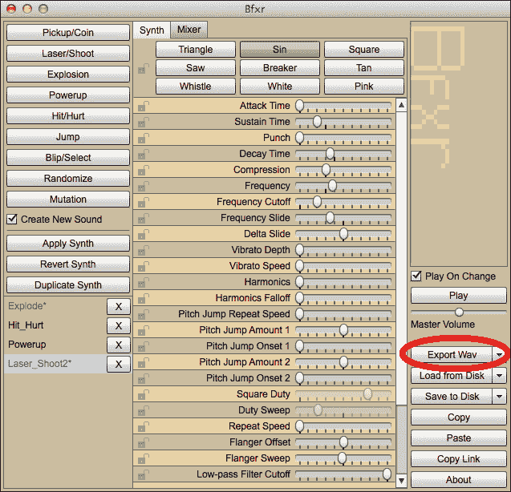
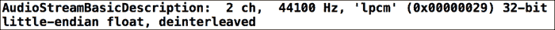
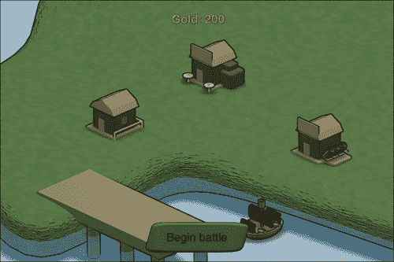
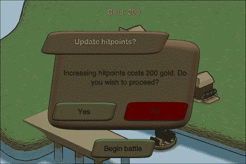

# 第九章：为我们的游戏添加音频

*在前一章中，我们学习了人工智能。我们学习了有限状态机和模糊逻辑的理论。我们将这些元素应用到我们的游戏中。我们还实现了剩余的游戏元素。在本章中，我们将向我们的游戏添加音乐和声音。音频本身是任何游戏的重要方面，因为它构成了玩家体验的一部分。尝试在没有音乐的情况下玩你最喜欢的游戏，你会发现游戏体验完全不同。*

在本章中，我们将涵盖以下主题：

+   加载声音和音乐文件

+   生成我们自己的声音效果

+   播放音频

让我们给我们的游戏添加音乐和声音，怎么样？

# 寻找音乐和声音

在开发游戏时，开发者通常不是全能的，在寻找声音和音乐时可能会遇到困难。苹果自家的 GarageBand 提供了一个简单的方法来创建音乐，可以使用预定义的循环或甚至自己的乐器。另一种可能性是找到能够帮助创建音频文件的有才能的人。可以关注的地方之一是 TIGSource 论坛——一个独立游戏开发者的聚集地，它有一个[`forums.tigsource.com/index.php?board=43.0`](http://forums.tigsource.com/index.php?board=43.0)的收藏夹部分，以及一个提供付费工作的[`forums.tigsource.com/index.php?board=40.0`](http://forums.tigsource.com/index.php?board=40.0)部分。

## 生成声音效果

**Bxfr**是一个常用于游戏快闪节的程序声音生成器。它可以在[`www.bfxr.net/`](http://www.bfxr.net/)在线找到；Windows 和 Mac OS X 的独立版本也可以从这个链接下载。它的目的是通过几步点击生成 8 位声音效果：



首先，我们需要选择一个类型，然后我们可以通过几个滑块来修改它，例如声音的频率或长度。

完成后，我们可以使用**导出 Wav**按钮导出声音效果。

## 了解音频格式

Sparrow 允许加载 iOS 支持的任何音频文件。一些音频编解码器支持硬件辅助解码，而另一些则不支持。

iOS 设备包含专门用于处理某些音频格式（例如，AIFC）的硬件，从而释放出原本用于处理这些昂贵操作的 CPU。硬件辅助方法的缺点是每次只能处理一个文件。例如，你不能同时用它播放背景音乐和声音效果。

关于 iOS 处理音频播放的更多信息，请查看苹果的文档：[`developer.apple.com/library/ios/documentation/audiovideo/conceptual/multimediapg/UsingAudio/UsingAudio.html`](https://developer.apple.com/library/ios/documentation/audiovideo/conceptual/multimediapg/UsingAudio/UsingAudio.html)。

Sparrow 中音频格式的最佳格式是 AIFC 和 CAFF。

让我们看看它们是什么：

+   AIFC 是一种压缩的 **音频交换格式** (**AIFF**) 文件。这通常是背景音乐的最好选择。还有一件事要考虑：如果音频播放是硬件辅助的（如 AIFC 的情况），一次只能播放一个文件。

+   **核心音频文件格式** (**CAFF**) 是一种未压缩的音频格式。这种格式最适合用于短音效。

这两种格式对 CPU 的占用最小。如果应用程序大小是一个问题，有一种非常规的方法可以解决这个问题：一些设备仍然只有单声道扬声器，所以如果有很多声音文件，将音频文件转换为单声道可能是一个有效的选择。

要转换音频文件，iOS SDK 提供了一个名为 **afconvert** 的命令行工具。假设我们的音频文件名为 `myAudioFile.wav`，我们可以使用以下示例：

+   **转换为 CAFF**：将文件转换为 CAFF 的命令是 `afconvert –f caff –d LE16 myAudioFile.wav`

+   **转换为 AIFC**：将文件转换为 AIFC 的命令是 `afconvert –f AIFC –d ima4 myAudioFile.wav`

## 游戏中的音乐和音效

必要的音频文件再次上传到我们的 GitHub 仓库。为了使用它们，从 [`github.com/freezedev/pirategame-assets/releases/download/0.9/Audio_09.zip`](https://github.com/freezedev/pirategame-assets/releases/download/0.9/Audio_09.zip) 下载它们，解压文件，并将内容复制到我们的模板中。在将文件复制到项目中时，我们需要确保将它们添加到目标中。

# 添加音频播放

现在我们已经了解了音频格式，如果需要，我们可以为自己生成声音，如果我们有必要的文件，我们也可以播放一些音频。

## 启动音频引擎

在我们可以播放任何声音之前，我们需要启动音频引擎。

# 行动时间 – 获取音频文件播放

执行以下步骤以启动音频引擎：

1.  如果它还没有打开，请打开我们的 Xcode 项目。

1.  切换到 `Game.m` 文件。

1.  在初始化器中，按照以下方式启动音频引擎；它应该是前几条语句之一：

    ```swift
    [SPAudioEngine start];
    ```

1.  添加一个 `dealloc` 方法来停止音频引擎：

    ```swift
    -(void) dealloc
    {
        [SPAudioEngine stop];
    }
    ```

1.  运行示例。

当我们在模拟器中运行此示例时，我们可能会在控制台中看到以下行：



## *发生了什么？*

要播放任何音频文件，我们需要在应用程序启动时启动音频引擎，在我们的例子中，是从 `Game` 类的初始化器开始。

音频引擎有不同的操作模式，这会影响我们在运行游戏时 iPod 音乐应用的行为。

如果音频被静音，游戏音频也会被静音。这是默认的操作模式；其他模式包括即使设备被静音，游戏音频也会继续播放，或者 iPod 音乐与游戏音频混合。看看后者在代码中会是什么样子：

```swift
[SPAudioEngine start: SPAudioSessionCategory_AmbientSound];

```

想要了解更多信息，请查看 Sparrow SPAudioEngine 文档，链接为 [`doc.sparrow-framework.org/v2/Classes/SPAudioEngine.html`](http://doc.sparrow-framework.org/v2/Classes/SPAudioEngine.html)。

当我们运行此示例时，我们在控制台中获取有关音频引擎的一些信息。

## 尝试一下

目前，音频引擎在游戏开始或停止时启动或停止。如果触发背景和前景事件（如 `applicationWillResignActive` 和 `applicationDidBecomeActive`），启动和停止引擎也是一个好主意。

## 在我们的场景中播放音乐

现在音频引擎已经启动并运行，让我们播放背景音乐。

# 行动时间 - 在我们的场景中播放音乐

执行以下步骤以在我们的场景中播放背景音乐：

1.  打开 `Scene.h` 文件。

1.  添加一个名为 `backgroundMusic` 的实例变量，它是一个指向 `SPSoundChannel` 的指针，使用以下代码行：

    ```swift
    SPSoundChannel *backgroundMusic;
    ```

1.  声明一个名为 `stop` 的方法，如下所示：

    ```swift
    -(void) stop;
    ```

1.  在 `Scene.m` 文件中，定义一个空的 `stop` 方法。

1.  更新 `SceneDirector.m` 文件中的 `showScene` 方法以适应以下代码块：

    ```swift
    -(void) showScene:(NSString *)name
    {
        for (NSString* sceneName in _dict) {
            ((Scene *) _dict[sceneName]).visible = NO;
            [((Scene *) _dict[sceneName]) stop];
        }
        if (_dict[name] != nil) {
            ((Scene *) _dict[name]).visible = YES;
            [((Scene *) _dict[name]) reset];

        }
    } 
    ```

1.  切换到 `PirateCove.m`。

1.  在初始化器中，在顶部添加以下行：

    ```swift
    SPSound *sound = [Assets sound:@"music_cove.aifc"];
    backgroundMusic = [sound createChannel];
    backgroundMusic.loop = YES;
    ```

1.  更新 `reset` 方法，使其看起来如下：

    ```swift
    -(void) reset
    {
        [backgroundMusic play];

        _goldDamage = (150 + (50 * (World.level - 1)));
        _dialogUpdateDamage.content.text = [NSString stringWithFormat:@"Increasing damage costs %d gold. Do you wish to proceed?", _goldDamage];

        _goldHitpoints = (200 + (75 * (World.level - 1)));
        _dialogUpdateHitpoints.content.text = [NSString stringWithFormat:@"Increasing hitpoints costs %d gold. Do you wish to proceed?", _goldHitpoints];

        [self updateGoldTextField];
    }
    ```

1.  按照以下方式实现场景的 `stop` 方法：

    ```swift
    -(void) stop
    {
        [backgroundMusic stop];
    }
    ```

1.  运行示例，您将看到以下输出。我们现在可以听到背景音乐。

## *发生了什么？*

首先，我们添加了一个实例变量（`backgroundMusic`）来存储背景音乐。`SPSound` 变量存储声音文件的数据，而 `SPSoundChannel` 则播放声音本身，这与 `SPTexture` 和 `SPImage` 之间的关系类似。建议您保留对 `SPSoundChannel` 的引用。如果我们想因任何原因停止播放声音，这是必需的。

为了让我们在多个场景中拥有背景音乐，我们需要停止当前场景的背景音乐并从下一个场景开始播放音乐，因为我们不希望遇到任何讨厌的副作用。这些副作用是第一个音乐文件将使用硬件编解码器，而第二个将使用软件解码，从而严重影响我们游戏的表现。两个音乐文件都将播放。

如果我们想在场景中停止背景音乐，我们可以利用场景的 `reset` 方法。现在，我们想在场景被停用时做同样的事情。我们在第 3 步中正好为此目的声明了 `stop` 方法，并在之后的步骤中实现了它作为一个空方法。在 `SceneManager` 类中，我们需要在隐藏场景时调用每个场景的 `stop` 方法。

在`PirateCove`场景的初始化器中，我们创建了一个局部的`SPSound`变量，通过我们的资产管理系统加载音乐文件。然后我们使用了`createChannel`方法并将结果保存在实例变量中。我们希望音乐无限循环，所以我们将`loop`属性设置为`YES`。

在第 8 步中，我们更新了`reset`方法以播放背景音乐，在第 9 步中，我们覆盖了`stop`方法并停止了背景音乐。

现在我们运行这个示例，我们可以听到音乐在循环播放。

## 尝试一下英雄

现在海盗湾场景已经有了一些背景音乐，接下来给战场添加一些音乐。

## 添加声音效果

我们的音频引擎已经启动并运行；因为我们已经播放了一些音乐，所以我们知道它是有效的，现在是我们添加声音效果的时候了。

# 行动时间 – 海盗湾中的声音效果

要将声音效果添加到海盗湾场景中，执行以下步骤：

1.  打开`PirateCove.m`文件。

1.  更新`onUpdateDamage`和`onUpdateHitpoints`方法以播放声音效果，如下面的代码所示：

    ```swift
    -(void) onUpdateDamage: (SPEvent *) event
    {
        World.damage = World.damage + (int) (World.damage / 10);
        World.gold = World.gold - _goldDamage;
        [self updateGoldTextField];

        [[Assets sound:@"powerup.caf"] play];
    }

    -(void) onUpdateHitpoints: (SPEvent *) event
    {
        World.hitpoints = World.hitpoints + (int) (World.hitpoints / 5);
        World.gold = World.gold - _goldHitpoints;
        [self updateGoldTextField];

        [[Assets sound:@"powerup.caf"] play];
    }
    ```

1.  运行示例，你将看到以下输出。现在，如果我们成功升级我们的海盗船，我们就能听到声音。

## *发生了什么？*

在海盗湾场景中，我们在`onUpdateDamage`和`onUpdateHitpoints`方法中添加了声音效果。我们通过资产管理系统获取了增益文件，然后直接播放声音。这种方法对于短声音和不需要后续操作音频通道引用的地方很有用。

现在，当我们运行这个示例时，一旦我们成功升级我们的船，我们就能听到声音效果。

## 尝试一下英雄

现在请添加以下战场声音效果：

+   当一艘船被击中时（`Ship`类中的`hit`方法）

+   当一艘船射击时（`Ship`类中的`shoot`方法）

+   当一艘船被摧毁（`Ship`类中的`hitPoints`获取器）

## 快速问答

Q1. AAC 音频文件提供硬件辅助编码。

1.  真的

1.  假的

Q2. 如果`SPSound`只包含声音数据，应该使用哪个类来播放音频文件？

1.  `AVAudioSession`

1.  `SPSoundChannel`

1.  `SPAudio`

Q3. 要播放任何声音，我们需要初始化音频引擎。

1.  真的

1.  假的

# 摘要

在本章中，我们学习了如何加载和播放音频文件。具体来说，我们涵盖了数据格式和在 Sparrow 中音频的基本用法。

现在我们游戏中已经有了一些音频，让我们完善我们的游戏——这是下一章的主题。
