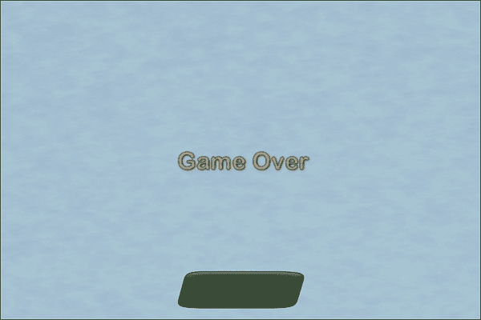
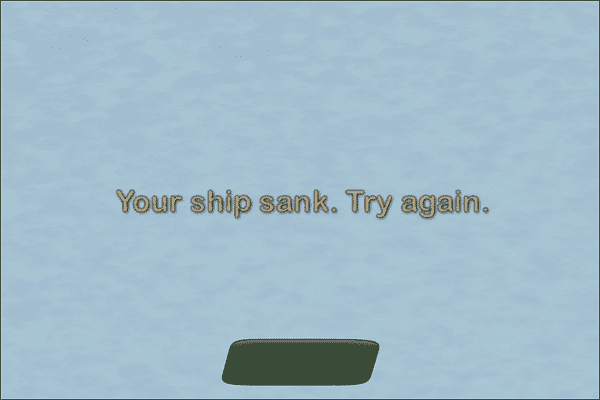
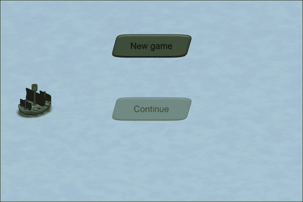
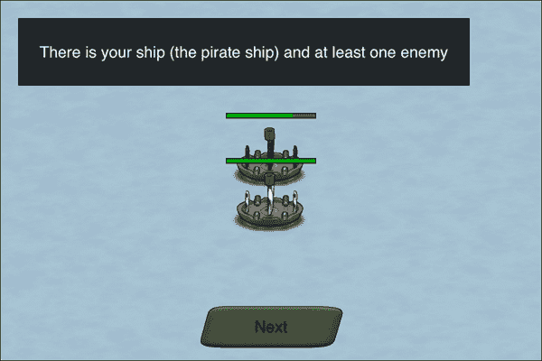
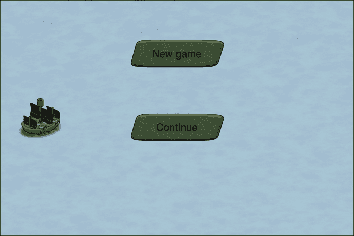

# 第十章。润色我们的游戏

*在上一章中，我们为游戏添加了声音和音乐。我们还学习了音频文件格式，甚至如何生成我们自己的音效。*

在本章中，我们将润色我们的游戏。在本章中，我们将涵盖以下主题：

+   改进游戏结束机制

+   添加一个简约的教程

+   加载和保存当前游戏状态

磨光是对游戏进行最后润色处理的过程。在软件开发中有一句话，即开发的最后 20%感觉和最初的 80%一样困难。有了这样的动力，让我们来润色我们的游戏，怎么样？

# 添加额外的场景

我们的游戏仍然感觉边缘粗糙。我们的首要任务是添加更多场景，这应该使游戏感觉更加完整，尤其是在开始游戏和游戏结束时。

## 游戏结束场景

目前，游戏结束机制有点过于简约。虽然玩家可以输赢游戏，但一旦游戏结束，他们就不能重新开始游戏。玩家需要关闭应用程序并重新打开。

这与直觉相反，因为 iOS 应用的默认行为是冻结应用而不是关闭它。所以，在最坏的情况下，带有**游戏结束**信息的我们的游戏将停留在内存中，直到设备重启或用户从应用切换器中杀死应用程序。

### 创建游戏结束场景

作为我们的第一个任务，我们将解耦游戏结束逻辑并将其移动到单独的场景中。我们的游戏结束场景应该显示游戏是赢了还是输了。

# 行动时间 – 显示游戏结束场景

使用以下步骤创建游戏结束场景：

1.  如果还没有打开，请打开我们的 Xcode 项目。

1.  在`GameScenes`组内创建一个新的 Objective-C 类。

1.  将这个类命名为`GameOver`，它应该是`Scene`的子类。

1.  切换到`GameOver.h`文件。

1.  使用以下代码行，添加一个名为`message`的属性：

    ```swift
    @property SPTextField *message;
    ```

1.  使用以下代码行，添加另一个属性以指示游戏是否赢了：

    ```swift
    @property (nonatomic) BOOL gameWon;
    ```

1.  切换到`GameOver.m`。

1.  按照以下代码导入`SceneDirector.h`、`Assets.h`和`World.h`文件：

    ```swift
    #import "SceneDirector.h"
    #import "Assets.h"
    #import "World.h"
    ```

1.  为这个新场景添加一个初始化器，如下面的代码所示：

    ```swift
    -(id) init
    {
        if ((self = [super init])) {

            SPImage *background = [SPImage imageWithTexture:[Assets texture:@"water.png"]];

            _message = [SPTextField textFieldWithWidth:Sparrow.stage.width height:Sparrow.stage.height text:@"Game Over" 
                  fontName:@"PirateFont" fontSize:24.0f color:SP_WHITE];

            SPTexture *yesButton = [[Assets textureAtlas:@"ui.xml"] textureByName:@"dialog_yes"];
    SPButton *resetButton = [SPButton buttonWithUpState:yesButton text:@"Start over"];

            resetButton.x = (Sparrow.stage.width - resetButton.width) / 2;
            resetButton.y = Sparrow.stage.height - resetButton.height - 8.0f;

            [resetButton addEventListenerForType:SP_EVENT_TYPE_TRIGGERED block:^(id event) {
                [World reset];
                [(SceneDirector *) self.director showScene:@"piratecove"];
            }];

            [self addChild:background];
            [self addChild:_message];
            [self addChild:resetButton];
        }

        return self;
    }
    ```

1.  添加`gameWon`属性的 getter，如下面的代码所示：

    ```swift
    -(BOOL) getGameWon
    {
        return _gameWon;
    }
    ```

1.  现在，添加`gameWon`属性的 setter，如下面的代码所示：

    ```swift
    -(void) setGameWon:(BOOL)gameWon
    {
        _gameWon = gameWon;

        if (_gameWon) {
            _message.text = @"You won the game. Congratulations.";
        } else {
            _message.text = @"Your ship sank. Try again.";
        }
    }
    ```

1.  切换到`Game.m`。

1.  使用以下代码行导入`GameOver.h`文件：

    ```swift
    #import "GameOver.h"
    ```

1.  然后，使用以下代码创建`GameOver`场景的一个实例：

    ```swift
    GameOver *gameOver = [[GameOver alloc] initWithName:@"gameover"];
    ```

1.  使用以下代码将游戏结束实例添加到场景导演中：

    ```swift
    [director addScene:gameOver];
    ```

1.  使用以下代码行默认显示游戏结束场景：

    ```swift
    [director showScene:@"gameover"];
    ```

1.  运行示例，我们将看到游戏结束场景，如下面的截图所示：

## *发生了什么？*

正如我们之前所做的那样，我们打开了我们的 Xcode 项目。然后，我们创建了一个类，这个类将成为我们的游戏结束场景。它被命名为`GameOver`，是`Scene`的子类。

在`GameOver`头文件中，我们在第 5 步和第 6 步分别添加了两个属性。第一个属性是将在屏幕上显示的消息。第二个是用来指示游戏是否获胜。稍后我们为这个属性添加了自定义的 getter 和 setter。我们将这个属性标记为非原子性，因为我们实际上不需要线程安全，而且我们只使用了一个线程。

在`GameOver.m`文件中，我们导入了所有必要的头文件，如下所示：

+   从`Assets.h`中的资源管理器，因为我们很可能要加载一个资源

+   从`SceneDirector.h`中的场景导演，因为我们需要切换到另一个场景

+   从`World.h`中的`World`类，因为我们需要重置游戏中的值

然后，我们添加了初始化器。我们的游戏结束场景由以下内容组成：

+   以水作为背景

+   作为`message`属性的文本字段

+   重置按钮

在这个例子中，我们使用了`SPTextField`工厂方法（也称为便利构造函数），它允许我们在一步中定义宽度、高度、文本、字体名称、字体大小和颜色。我们需要考虑的一件事是保持字体大小与原始位图字体大小相似。如果它比原始大小大得多，字体就会变得像素化并且模糊不清。

尽管如此，有一种方法可以绕过这个问题：如果我们将`SP_NATIVE_FONT_SIZE`设置为字体实例的字体大小，它将自动计算其实际大小，以便尽可能清晰地显示。

我们将重置按钮的触摸事件定义为块，并重置所有游戏中的值，并切换到海盗湾场景。之后，我们将所有显示对象添加到显示树中。

然后，我们为我们的`gameWon`属性定义了自定义的 getter 和 setter：

+   **Getter**：这仅仅返回内部的`_gameWon`值

+   **Setter**：在设置属性值后，我们根据其值更新了消息

在`Game`类中，我们需要创建`GameOver`场景的实例，然后将其添加到场景导演中。在第 16 步中，我们将默认场景更新为游戏结束场景。

当我们运行上一步的示例时，我们看到了游戏结束场景。

### 连接游戏结束场景

现在我们有了游戏结束场景，让我们将其集成到游戏中。

# 是时候让游戏结束场景出现了

要将游戏结束场景纳入游戏，请按照以下步骤操作：

1.  切换到`Battlefield.h`文件。

1.  删除`textGameWon`和`textGameLost`这两个属性。

1.  切换到`Battlefield.m`文件。

1.  删除对`textGameWon`和`textGameLost`属性的任何引用。

1.  在`GameOver.m`文件中，添加一个`reset`方法，如下所示：

    ```swift
    -(void) reset
    {
        self.gameWon = NO;
    }
    ```

1.  在`SceneDirector.h`文件中，使用以下代码添加一个名为`currentScene`的属性：

    ```swift
    @property (readonly) Scene *currentScene;
    ```

1.  在 `SceneDirector.m` 文件中，更新 `showScene` 方法以设置 `currentScene` 属性，如下面的代码所示：

    ```swift
    -(void) showScene:(NSString *)name
    {
        for (NSString* sceneName in _dict) {
            ((Scene *) _dict[sceneName]).visible = false;
            [((Scene *) _dict[sceneName]) stop];
        }

        if (_dict[name] != nil) {
            ((Scene *) _dict[name]).visible = YES;
            [((Scene *) _dict[name]) reset];
            _currentScene = (Scene *) _dict[name];
        }
    }
    ```

1.  切换到 `Battlefield.m` 文件。

1.  更新 `reset` 方法以设置船只的可见性，如下面的代码所示：

    ```swift
    -(void) reset
    {
        self.paused = NO;

        _pirateShip.x = [(NSNumber *) [Assets dictionaryFromJSON:@"gameplay.json"][@"battlefield"][@"pirate"][@"x"] floatValue];
        _pirateShip.y = [(NSNumber *) [Assets dictionaryFromJSON:@"gameplay.json"][@"battlefield"][@"pirate"][@"y"] floatValue];

        [_pirateShip reset];
     _pirateShip.visible = YES;

        for (int i = 0; i < [_enemyShip count]; i++) {
             ((Ship *) _enemyShip[i]).x = [(NSNumber *) [Assets dictionaryFromJSON:@"gameplay.json"][@"battlefield"][@"enemy"][i][@"x"] floatValue];
            ((Ship *) _enemyShip[i]).y = [(NSNumber *) [Assets dictionaryFromJSON:@"gameplay.json"][@"battlefield"][@"enemy"][i][@"y"] floatValue];
            [((Ship *) _enemyShip[i]) reset];
            ((Ship *) _enemyShip[i]).visible = NO;
        }

        for (int i = 0; i < World.level; i++) {
            ((Ship *) _enemyShip[i]).visible = YES;
            [self updateAI:_enemyShip[i] withState:_aiState];
        }
    }
    ```

1.  更新胜利游戏的条件，如下面的代码所示：

    ```swift
    if (deadCount == World.level) {
      if (World.level == World.levelMax) {
     [(SceneDirector *) self.director showScene:@"gameover"];
     ((GameOver *) ((SceneDirector *) self.director).currentScene).gameWon = YES;
      } else {
        World.gold = World.gold + (250 * World.level);
        World.level++;
        self.paused = YES;
        [((SceneDirector *) self.director) showScene:@"piratecove"];
      }
    }
    ```

1.  接下来，更新游戏失败的条件，如下面的代码所示：

    ```swift
    __weak typeof(self) weakSelf = self;
    _pirateShip.onDead = ^{
     [(SceneDirector *) weakSelf.director showScene:@"gameover"];
     ((GameOver *) ((SceneDirector *) weakSelf.director).currentScene).gameWon = NO;
    };
    ```

1.  在 `Game.m` 中，将默认场景切换回海盗湾。

1.  运行示例。当我们运行示例并实际输掉游戏时，我们会看到以下屏幕：

## *发生了什么？*

在 `Battlefield` 头文件中，我们移除了显示游戏胜利或失败时出现的文本字段属性。然后，我们在 `Battlefield.m` 中移除了所有引用这些属性的代码部分。

在第 5 步中，我们为 `GameOver` 场景添加了一个 `reset` 方法，其中我们将 `gameWon` 属性设置为 `NO`。与场景切换的区别在于，我们需要在场景切换后设置 `gameWon` 属性。为了方便这一操作，我们更新了场景导演。

在下一步中，我们添加了一个只读属性 `currentScene`，它为我们提供了对当前场景的引用。在此之后，我们更新了 `showScene` 方法以设置当前场景。这发生在我们将当前场景设置为可见并调用 `reset` 方法之后。

在战场场景中，我们首先更新了我们的船只的可见性。如果我们没有这样做，敌军船只即使在重置游戏后仍然可见。

在第 10 步和第 11 步中，我们更新了胜利和失败的条件。在这里，我们也导入了 `GameOver.h` 文件，以便将 `currentScene` 属性转换为指向 `GameOver` 类的指针。

我们最后做的事情是将场景切换回海盗湾。当我们运行示例，无论我们输赢游戏，都会显示游戏结束场景，并且我们可以重新开始游戏。

## 添加主菜单

接下来，我们将添加一个简单的主菜单。

# 行动时间 – 将主菜单集成到我们的游戏中

使用以下步骤添加主菜单：

1.  添加一个名为 `MainMenu` 的新类，它应该是 `Scene` 的子类。

1.  切换到 `MainMenu.m`。

1.  导入 `Assets.h` 和 `SceneDirector.h`。

1.  添加主菜单的初始化器，如下面的代码所示：

    ```swift
    -(id) init
    {
        if ((self = [super init])) {

            SPImage *background = [SPImage imageWithTexture:[Assets texture:@"water.png"]];

        SPTexture *shipTexture = [[Assets textureAtlas:@"ship_pirate_small_cannon.xml"] textureByName:@"ne_0001"];
            SPImage *ship = [SPImage imageWithTexture:shipTexture];
            ship.x = 16.0f;
            ship.y = (Sparrow.stage.height - ship.height) / 2;

        SPTexture *dialogTexture = [[Assets textureAtlas:@"ui.xml"] textureByName:@"dialog_yes"];
            SPButton *buttonNewGame = [SPButton buttonWithUpState:dialogTexture text:@"New game"];

            buttonNewGame.x = (Sparrow.stage.width - buttonNewGame.width) / 2;
            buttonNewGame.y = 50.0f;

            [buttonNewGame addEventListenerForType:SP_EVENT_TYPE_TRIGGERED block:^(id event) {
                [(SceneDirector *) self.director showScene:@"piratecove"];
            }];

            SPButton *buttonContinue = [SPButton buttonWithUpState:dialogTexture text:@"Continue"];

            buttonContinue.x = (Sparrow.stage.width - buttonContinue.width) / 2;
            buttonContinue.y = 150.0f;
            buttonContinue.enabled = NO;

            [self addChild:background];
            [self addChild:ship];
            [self addChild:buttonNewGame];
            [self addChild:buttonContinue];
        }

        return self;
    }
    ```

1.  切换到 `Game.m`。

1.  使用以下代码导入 `MainMenu.h`：

    ```swift
    #import "MainMenu.h"
    ```

1.  使用以下代码为 `MainMenu` 类创建一个局部变量，该变量将保存一个 `MainMenu` 类的实例。

    ```swift
    MainMenu *mainMenu = [[MainMenu alloc] initWithName:@"mainmenu"];
    ```

1.  将 `mainMenu` 实例添加到导演中，如下面的代码所示：

    ```swift
    [director addScene:mainMenu];
    ```

1.  更新 `showScene` 调用以显示主菜单场景，如下面的代码所示：

    ```swift
    [director showScene:@"mainmenu"];
    ```

1.  运行示例，我们将看到主菜单，如下面的截图所示：

## *发生了什么？*

要添加主菜单，我们需要一个从 `Scene` 继承的类。一旦创建了类，我们就导入了资产管理系统和场景导演。

在步骤 3 中，我们添加了初始化器。我们的主菜单包括以下内容：

+   与战场和其他场景中使用的相同背景

+   一艘海盗船

+   一个启动新游戏的按钮

+   一个继续游戏的按钮

对于新游戏，我们使用了一个用于触摸事件的块，它切换到海盗湾场景。**继续**按钮还没有事件并且被禁用。在此之后，我们需要将所有元素添加到显示树中。

在步骤 5 到 9 中，我们以类似于添加游戏结束场景的方式将主菜单添加到我们的游戏类中。

当我们运行示例时，我们看到了主菜单。

## 来试试英雄

现在主菜单只有两个按钮。通常，主菜单会提供更多选项，例如切换到选项菜单或信用屏幕的按钮。在某些情况下，主菜单甚至有按钮可以导航到社交网站。现在添加选项和信用屏幕，这些可以从主菜单打开。

## 添加开场场景

一个开场场景是向玩家介绍游戏角色、故事或艺术风格的完美方式。并非所有游戏都需要开场场景；实际上，如果它适合整体游戏和游戏风格，那么使用它是最合适的。

由于我们没有故事或角色，我们将展示两艘船相互靠近、相互射击，最终其中一艘船沉没。

# 是时候为我们的游戏创建一个开场了

使用以下步骤添加开场场景：

1.  现在是时候将碰撞检测代码移动到单独的文件中了。创建一个名为 `Logic` 的新组，并在该组内添加一个名为 `Collision` 的类，它是 `NSObject` 的子类。

1.  在 `Collision` 类中声明此静态方法，如下面的代码所示：

    ```swift
    +(void) checkShipCollision: (Ship *) ship1 againstShip: (Ship *) ship2 withReferenceToSprite: (SPSprite *) sprite;
    ```

1.  在 `Collision.m` 文件中，使用以下代码实现 `checkShipCollision` 方法：

    ```swift
    SPRectangle *enemyShipBounds = [ship1 boundsInSpace:sprite];
    SPRectangle *ball1 = [ship2.cannonBallLeft boundsInSpace:sprite];
    SPRectangle *ball2 = [ship2.cannonBallRight boundsInSpace:sprite];

    if ([enemyShipBounds intersectsRectangle:ball1] || [enemyShipBounds intersectsRectangle:ball2]) {
      if (ship2.cannonBallLeft.visible || ship2.cannonBallRight.visible) {
        [ship2 abortShooting];
        if (ship1.type == ShipPirate) {
          [ship1 hit: World.damage];
        } else {
          [ship1 hit:[(NSNumber *) [Assets dictionaryFromJSON:@"gameplay.json"][@"damage"] intValue]];
        }
      }
    }
    ```

1.  为了使此代码工作，我们需要在 `Collision.m` 文件中导入 `Assets.h` 和 `World.h`。

1.  在 `Battlefield.m` 中，删除碰撞代码，导入 `Collision.h`，并使用 `Collision` 类的新方法：

    ```swift
    for (int i = 0; i < World.level; i++) {
     [Collision checkShipCollision:_pirateShip againstShip:_enemyShip[i] withReferenceToSprite:self];
     [Collision checkShipCollision:_enemyShip[i] againstShip:_pirateShip withReferenceToSprite:self];

      [_enemyShip[i] advanceTime:passedTime];
      if (((Ship *) _enemyShip[i]).isDead) {
        deadCount++;
      }
    }
    ```

1.  通过继承 `Scene` 并命名为 `Intro` 来添加开场场景。这应该在 `GameScenes` 组内完成。

1.  在 `Intro.h` 中，导入 `Ship.h` 并添加两个实例变量，一个用于海盗船，一个用于敌船，如下面的代码所示：

    ```swift
    @interface Intro : Scene {
        Ship *_pirateShip;
        Ship *_enemyShip;
    }
    ```

1.  切换到 `Intro.m`。

1.  使用以下代码为 `Intro` 类添加一个初始化器：

    ```swift
    -(id) init
    {
        if ((self = [super init])) {

            SPImage *background = [SPImage imageWithTexture:[Assets texture:@"water.png"]];

            _pirateShip = [[Ship alloc] initWithType:ShipPirate];
            _pirateShip.x = 16.0f;
            _pirateShip.y = ((Sparrow.stage.height - _pirateShip.height) / 2) - 20.0f;

            _enemyShip = [[Ship alloc] initWithType:ShipNormal];
            _enemyShip.x = Sparrow.stage.width - _enemyShip.width - 16.0f;
            _enemyShip.y = ((Sparrow.stage.height - _enemyShip.height) / 2) + 20.0f;

            [self addEventListener:@selector(onEnterFrame:) atObject:self forType:SP_EVENT_TYPE_ENTER_FRAME];

            SPButton *buttonNext = [SPButton buttonWithUpState:[[Assets textureAtlas:@"ui.xml"] textureByName:@"dialog_yes"] text:@"Next"];

            buttonNext.x = (Sparrow.stage.width - buttonNext.width) / 2;
            buttonNext.y = Sparrow.stage.height - buttonNext.height - 8.0f;

            [buttonNext addEventListenerForType:SP_EVENT_TYPE_TRIGGERED block:^(id event) {
                [(SceneDirector *) self.director showScene:@"piratecove"];
            }];
            [self addChild:background];
            [self addChild:_pirateShip];
            [self addChild:_enemyShip];
            [self addChild:buttonNext];
        }

        return self;
    }
    ```

1.  添加 `onEnterFrame` 事件监听器，如下面的代码所示：

    ```swift
    -(void) onEnterFrame: (SPEnterFrameEvent *) event
    {
        double passedTime = event.passedTime;

        [Collision checkShipCollision:_pirateShip againstShip:_enemyShip withReferenceToSprite:self];
        [Collision checkShipCollision:_enemyShip againstShip:_pirateShip withReferenceToSprite:self];

        [_pirateShip advanceTime:passedTime];
        [_enemyShip advanceTime:passedTime];
    }
    ```

1.  添加一个重置方法，如下面的代码所示：

    ```swift
    -(void) reset
    {
        [_pirateShip reset];
        [_enemyShip reset];

        [_pirateShip moveToX:Sparrow.stage.width / 2 andY:(Sparrow.stage.height / 2) - 20.0f withBlock:^{
            [_pirateShip.juggler delayInvocationByTime:1.5f block:^{
                [_pirateShip shootWithBlock:^{
                    [_pirateShip shootWithBlock:^{
                        [_pirateShip shootWithBlock:^{
                            [_pirateShip.juggler delayInvocationByTime:1.0f block:^{
                                [_pirateShip shoot];
                            }];
                        }];
                    }];
                }];
            }];
        }];

        [_enemyShip moveToX:Sparrow.stage.width / 2 andY:(Sparrow.stage.height / 2) + 20.0f withBlock:^{
            [_enemyShip shoot];
        }];
    }
    ```

1.  在 `MainMenu.m` 中，如果新游戏按钮被触摸，则显示开场场景。

1.  在 `Game.m` 中，导入 `Intro.h`，创建 `Intro` 类的实例，并将其添加到导演中。

1.  运行示例。

    当我们开始新游戏时，我们看到简介正在运行，如下所示：

    

## *刚才发生了什么？*

由于我们需要在简介和游戏本身中实现碰撞检测，我们将它移动到了自己的类中。当我们移动`checkShipCollision`方法时，我们添加了一个额外的参数。然后这个参数被作为引用传递给了`boundsInSpace`方法。为了使这段代码正常工作，我们导入了资产管理类和`World`类。

在下一步中，我们更新了战场场景中的碰撞。

我们随后添加了一个名为`Intro`的新场景，我们首先添加了两个实例变量，一个用于我们的船只，一个用于海盗船。在步骤 9 中，我们添加了初始化器，它执行以下操作：

+   添加水背景

+   初始化两个船只实例

+   添加一个按钮来跳过简介

我们随后添加了一个事件监听器来跳过事件监听器并切换到海盗湾场景。我们还添加了一个事件监听器用于进入帧事件。然后我们将所有元素添加到显示树中

在步骤 10 中，我们实现了`onEnterFrame`事件监听器，它调用碰撞方法并推进两艘船的时间。

`reset`方法调用这些船只的`reset`方法，并将船只移动到屏幕中心。敌舰只能射击一次，而海盗船可以多次射击以击毁敌舰。

我们在主菜单中展示了简介场景。之后，我们将`Intro`类添加到游戏类中，当我们运行示例时，我们在开始新游戏时看到了简介场景。

# 实现教程机制

实现教程有许多不同的方法。它可能只是显示一个带有控制器的图像，到拥有一个交互式体验，再到每次玩家即将执行动作时显示控制方案。一般来说，后两种选项可以通过有限状态机实现，类似于我们用于人工智能的那个。

为了我们的目的，我们将更新简介场景，在动画播放时显示提示。

# 行动时间 – 将教程添加到我们的简介场景

按照以下步骤在简介期间显示提示：

1.  在`Intro.h`中添加一个名为`message`的实例变量：

    ```swift
    SPTextField *_message;
    ```

1.  切换到`Intro.m`。

1.  使用以下代码更新初始化器：

    ```swift
    [buttonNext addEventListenerForType:SP_EVENT_TYPE_TRIGGERED block:^(id event) {
      [(SceneDirector *) self.director showScene:@"piratecove"];
    }];

    SPQuad *quad = [SPQuad quadWithWidth:400.0f height:60.0f color:SP_BLACK];
    quad.alpha = 0.8f;
    quad.x = 16.0f;
    quad.y = 16.0f;

    _message = [SPTextField textFieldWithWidth:400.0f height:60.0f text:@"Welcome to the battlefield."];
    _message.color = SP_WHITE;
    _message.x = 16.0f;
    _message.y = 16.0f;

    [self addChild:background];
    [self addChild:_pirateShip];
    [self addChild:_enemyShip];
    [self addChild:buttonNext];
    [self addChild:quad];
    [self addChild:_message];

    ```

1.  更新`reset`方法，如下所示：

    ```swift
    [_pirateShip moveToX:Sparrow.stage.width / 2 andY:(Sparrow.stage.height / 2) - 20.0f withBlock:^{
     _message.text = @"There is your ship (the pirate ship) and at least one enemy";
      [_pirateShip.juggler delayInvocationByTime:2.5f block:^{
        [_pirateShip shootWithBlock:^{
           _message.text = @"Tap anywhere to move your ship.";
          [_pirateShip shootWithBlock:^{
            [_pirateShip shootWithBlock:^{
              _message.text = @"Double-tap on your ship to shoot.";
              [_pirateShip.juggler delayInvocationByTime:2.5f block:^{
                _message.text = @"In-between missions you can upgrade your ship.";
                [_pirateShip shoot];
              }];
            }];
          }];
        }];
      }];
    }];
    ```

1.  运行示例，当我们看到简介时，我们现在在屏幕上看到了提示信息：

## *刚才发生了什么？*

我们首先添加了一个实例变量来显示我们的提示。然后我们更新了初始化器来初始化这个实例变量，并有一个黑色但略微不透明的背景。我们将这两个元素添加到显示树中。

在步骤 4 中，我们更新了`reset`方法，以更改消息文本，显示核心游戏元素的工作方式。

当我们运行示例时，在简介期间显示了提示。

# 加载和保存当前状态

到目前为止我们可以玩游戏，但一旦游戏结束，我们必须从头开始玩游戏。

# 是时候行动了——加载和保存最后玩的游戏

按照以下步骤加载和保存当前状态：

1.  在 `World.h` 中声明序列化和反序列化数据的方法：

    ```swift
    +(NSDictionary *) serialize;
    +(void) deserialize: (NSDictionary *) dict;
    ```

1.  使用以下代码实现这些序列化器：

    ```swift
    +(NSDictionary *) serialize
    {
        return @{
                 @"level": [NSNumber numberWithInt:level],
                 @"gold": [NSNumber numberWithInt:gold],
                 @"damage": [NSNumber numberWithInt:damage],
                 @"hitpoints": [NSNumber numberWithInt:hitpoints]
        };
    }

    +(void) deserialize: (NSDictionary *) dict
    {
        level = [(NSNumber *) dict[@"level"] intValue];
        gold = [(NSNumber *) dict[@"gold"] intValue];
        damage = [(NSNumber *) dict[@"damage"] intValue];
        hitpoints = [(NSNumber *) dict[@"hitpoints"] intValue];
    }
    ```

1.  在 `MainMenu.m` 中，将 `World.h` 添加到导入部分并更新初始化器：

    ```swift
    buttonContinue.x = (Sparrow.stage.width - buttonContinue.width) / 2;
    buttonContinue.y = 150.0f;
    buttonContinue.enabled = NO;

    NSUserDefaults *userDefaults = [NSUserDefaults standardUserDefaults];
    id savedGame = [userDefaults objectForKey:@"game"];
    if (savedGame != nil) {
      [World deserialize:(NSDictionary *) [userDefaults objectForKey:@"game"]];
      buttonContinue.enabled = YES;
    }

    [buttonContinue addEventListenerForType:SP_EVENT_TYPE_TRIGGERED block:^(id event) {
      [(SceneDirector *) self.director showScene:@"piratecove"];
    }];

    [self addChild:background];
    ```

1.  在 `AppDelegate.m` 中，我们导入 `World.h` 并添加一个新方法，如下面的代码所示：

    ```swift
    - (void)applicationWillResignActiveNotification:(NSNotification*)notification
    {
        NSUserDefaults *userDefaults = [NSUserDefaults standardUserDefaults];
        [userDefaults setObject:[World serialize] forKey:@"game"];
        [userDefaults synchronize];
    }
    ```

1.  运行示例以查看结果。当我们开始游戏时，我们现在可以继续游戏：

## *刚才发生了什么？*

首先，我们将序列化和反序列化方法添加到我们的 `World` 类中。序列化方法从 `World` 类中提取值并将它们放置在 `NSDictionary` 中。反序列化方法则相反。它从 `NSDictionary` 中提取值并更新 `World` 类中的值。

在主菜单场景中，我们检查是否已经保存了某些内容，并在有数据的情况下反序列化数据。我们为我们的 **继续** 按钮添加了一个事件监听器，它直接切换到海盗湾场景。

在步骤 4 中，一旦应用程序不再活跃，我们就保存了游戏数据。

当我们运行示例时，我们能够继续游戏。

## 快速问答

Q1. 当我们在 SPTextField 中覆盖位图字体的大小时，它会缩放到那个大小。

1.  是

1.  否

Q2. 什么情况下将代码片段封装到它们自己的类或方法中是一个好主意？

1.  总是，即使只使用一次

1.  如果代码片段被多次使用

1.  从不

Q3. `NSUserDefaults` 提供了一种存储数据的方式。

1.  是

1.  否

# 摘要

在本章中，我们学习了如何润色我们的游戏。具体来说，我们涵盖了添加更多场景，如主菜单和简介，并简要介绍了教程机制。

现在我们几乎感觉我们的游戏就像一个真正的游戏，让我们看看我们如何集成第三方服务——这是下一章的主题。
