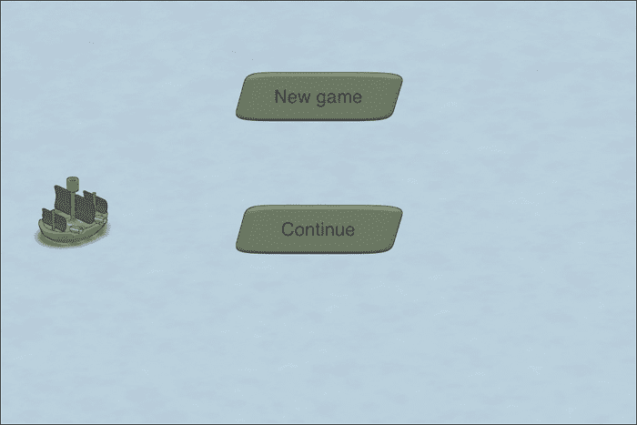
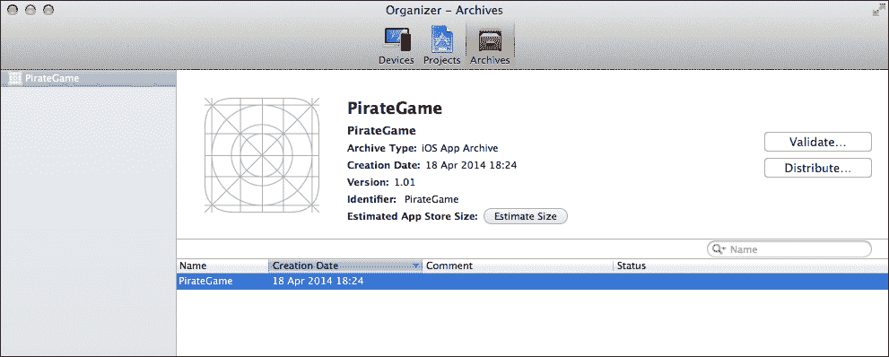
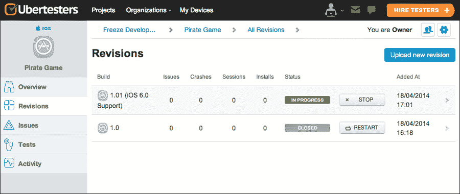
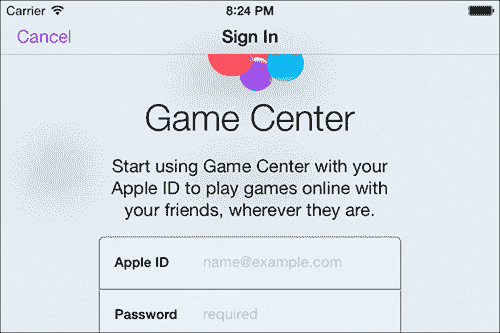
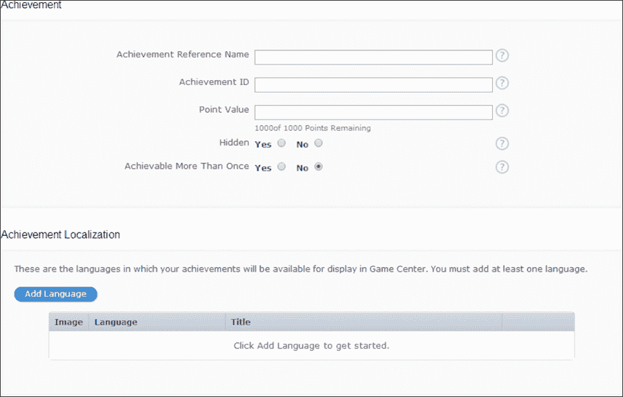
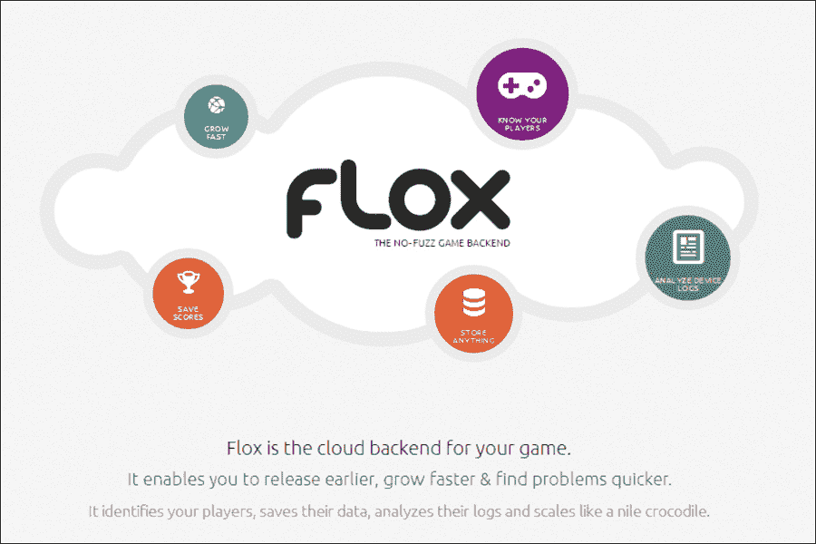

# 第十一章。集成第三方服务

*在前一章中，我们通过添加额外的场景和消除一些小瑕疵来打磨了我们的游戏。现在游戏结束后，它可以重新启动。既然我们的游戏已经基本完成，我们就需要做一些收尾工作，这些工作不会直接影响游戏，但会影响游戏的分发和玩家的体验。如果用户想要和朋友一起玩，我们就不需要自己实现服务器和网络机制。有一些服务可以处理这些问题；其中之一就是苹果游戏中心。*

在本章中，我们将集成第三方服务到我们的游戏中。以下是本章我们将涵盖的主题：

+   向潜在测试者传达信息

+   基本游戏中心集成

+   展示用于分析的不同平台

# 向潜在测试者传达信息

向潜在测试者分发可能是一项艰巨的任务。首先，我们需要获取每个测试设备的**唯一设备标识符**（**UDID**）。然后，我们需要编译一个特殊的构建版本，该版本仅限于在我们在构建中使用的配置文件中提供的 UDID 所对应的设备上运行。然后，我们需要将这些特殊构建版本发送给这些测试者，他们需要使用 iTunes 进行安装。在测试者安装了应用程序后，我们无法了解他们实际使用了多长时间，如果应用程序崩溃，他们需要将设备与 iTunes 同步，并在硬盘上搜索崩溃报告并发送给开发者。应用程序在测试者手中崩溃比在实际客户手中崩溃要好得多。

很长一段时间以来，**TestFlight** 为收集 UDID 和在测试者的设备上安装应用程序提供了一个简单的解决方案。TestFlight 为移动设备提供了一个应用程序，可以直接在设备上安装应用程序，而不是用户手动安装。TestFlight 还有一个网络应用程序，用于管理所有设备，收集崩溃报告，并跟踪会话。

TestFlight 背后的公司于 2014 年 2 月被苹果公司收购，结果是他们的 SDK 不再允许集成到应用程序中。TestFlight 的分发组件目前仍然可用。

**Ubertesters** 是一个非常类似的服务，它帮助我们收集设备的 UDID，并帮助测试者使用我们的应用程序。在撰写本书时，Ubertesters 仍然处于测试阶段。虽然 Ubertesters 是一项付费服务，但他们确实提供免费计划，只需在他们的网站上注册一个账户即可。以下是从 Ubertesters 网站截取的屏幕截图：


## 在 Ubertesters 上注册

为了使用 Ubertesters 分发我们的游戏，我们首先需要在 [`beta.ubertesters.com/sign_up`](http://beta.ubertesters.com/sign_up) 注册一个账户。在输入字段中输入所有必要的数据。

然后，我们需要创建我们自己的组织，在那里我们可以添加我们的第一个应用程序。当我们第一次注册时，Ubertesters 会引导我们完成此过程。

让我们的应用程序称为 "Pirate Game"，并选择 iOS 作为其平台。现在，我们将添加我们自己的设备；这就像在我们的移动 Safari 浏览器中打开 URL [`beta.ubertesters.com`](http://beta.ubertesters.com) 并遵循屏幕上的说明一样简单。这将在我们的设备上安装 Ubertesters 应用程序并收集设备的 UDID。

然后，我们在 Ubertesters 网页界面上看到我们刚刚注册的设备，在那里我们可以获取设备的相关数据，如设备名称、型号、操作系统、屏幕分辨率、地区和 UDID。

还可以设置空中分发，这意味着允许测试者从您的网站下载构建版本。有关此设置的说明，请参阅以下链接：[`aaronparecki.com/articles/2011/01/21/1/how-to-distribute-your-ios-apps-over-the-air`](http://aaronparecki.com/articles/2011/01/21/1/how-to-distribute-your-ios-apps-over-the-air)。

### 集成 Ubertesters

在我们能够获取一些测试者之前，我们需要将 Ubertesters SDK 集成到我们的游戏中。只有集成了 SDK 的包才能提供给测试者。

# 行动时间 - 集成 Ubertesters

使用以下步骤来集成 Ubertesters：

1.  如果 Xcode 项目尚未打开，请先打开它。

1.  从 [`ubertesters.com/sdk/ubertesters.sdk.ios.zip`](http://ubertesters.com/sdk/ubertesters.sdk.ios.zip) 下载 Ubertesters SDK。

1.  将下载的文件内容提取到硬盘上的某个位置。

1.  将提取的内容拖放到项目文件中。它们应该在根级别，与 **产品**、**框架** 和 **资源** 处在同一级别。

1.  通过点击项目导航器中的项目名称切换到项目配置。在 **通用** 选项卡中，向下滚动到 **链接框架和库**。

1.  通过点击加号按钮，选择正确的库，然后点击 **添加** 来添加以下库：

    +   `AdSupport.framework`

    +   `CoreImage.framework`

    +   `SystemConfiguration.framework`

    +   `CoreTelephony.framework`

    +   `CoreLocation.framework`

    +   `CoreMotion.framework`

1.  在项目配置中切换到 **信息** 选项卡。

1.  在 **自定义 iOS 目标属性** 中添加一个新键，通过选择任何项并点击加号按钮。

1.  将此键称为 `ubertesters_project_id`。

1.  作为其值，使用 Ubertesters 网站上的 ID，该 ID 位于 **SDK 集成** 选项卡中的应用程序中。

1.  切换到 `AppDelegate.m`。

1.  使用以下代码行导入 `Ubertesters` 头文件：

    ```swift
    #import <UbertestersSDK/Ubertesters.h>
    ```

1.  通过更新以下代码中的 `didFinishLaunchingWithOptions` 方法来初始化 Ubertesters SDK：

    ```swift
    - (BOOL)application:(UIApplication *)application didFinishLaunchingWithOptions:(NSDictionary *)launchOptions
    {
        CGRect screenBounds = [UIScreen mainScreen].bounds;
        _window = [[UIWindow alloc] initWithFrame:screenBounds];

        _viewController = [[SPViewController alloc] init];

        // Enable some common settings here:
        //
        // _viewController.showStats = YES;
        // _viewController.multitouchEnabled = YES;
        // _viewController.preferredFramesPerSecond = 60;

        [Ubertesters initialize];

        [_viewController startWithRoot:[Game class] supportHighResolutions:YES doubleOnPad:YES];

        [_window setRootViewController:_viewController];
        [_window makeKeyAndVisible];

        return YES;
    }
    ```

1.  运行示例。

    当我们启动示例时，我们没有看到任何可见的变化（参见图表），这是表明一切按预期工作的指标：

    

## *发生了什么？*

要开始，我们打开了我们的 Xcode 项目，这是我们步骤 1 中所做的事情。

然后，我们下载了 Ubertesters SDK 并解压了下载文件的 contents。在步骤 4 中，我们将解压文件的内容拖动到项目本身中。它应该位于项目文件正下方的根级别，与 **Sparrow**、**Classes**、**Other Sources**、**Resources**、**Frameworks** 和 **Products** 在同一级别。

为了使 Ubertesters SDK 正常工作，我们需要链接到各种框架。在步骤 5 中，我们通过点击 **General** 选项卡切换到一般配置，在那里我们可以找到页面底部的链接框架和库。我们添加了步骤 6 中描述的所有框架。

然后，我们在应用程序本身的 PLIST 文件中添加了一个条目。这可以在 **Info** 选项卡中完成。我们选择了 **Custom iOS Target Properties** 下的任何条目，并点击了它旁边的加号按钮。然后，我们为这个属性设置了一个键名，我们将其命名为 `ubertesters_project_id`。我们已经有项目 ID 了；我们在注册应用程序到 Ubertesters 时获得了它。在 Ubertesters 的网页界面中，可以通过点击 **Projects**，然后点击我们的项目（Pirate Game），之后点击左侧的 **SDK Integration** 选项卡来检索此 ID。这些步骤是必要的，以便 Ubertesters 知道我们在网页界面中注册的应用程序属于我们的游戏。

要使用 SDK，我们导入了 Ubertesters SDK 头文件并初始化了 SDK 本身。所有这些都在步骤 11 到 13 中的 `AppDelegate` 文件内完成。我们将 SDK 的初始化添加到 `didFinishLaunchingWithOptions` 中应用程序启动的地方。

当我们运行示例时，没有看到任何可见的变化，游戏按预期运行。在实际设备上运行游戏时，可能需要更长的时间来加载，因为 Ubertesters SDK 在启动时检查互联网连接。对于生产构建（例如，App Store 发布），不建议包含 SDK；SDK 应该包含为特定测试人员构建的版本。

### 为测试人员创建构建版本

现在我们已经将 Ubertesters SDK 集成到我们的游戏中，我们可以为我们的测试人员创建一个特殊的构建版本，目前这仅仅是我们自己，或者更具体地说，是我们的设备。

# 行动时间 – 为测试人员创建构建版本

使用以下步骤为测试人员创建一个特殊的构建版本：

1.  登录到配置门户[`developer.apple.com/account/ios/certificate/certificateList.action`](https://developer.apple.com/account/ios/certificate/certificateList.action)。

1.  在**标识符**中，点击**App IDs**。通过点击加号按钮添加一个新的。

1.  从**App ID 描述**中选择**PirateGame**。

1.  设置一个你选择的**App ID 前缀**。所有可用的前缀将以下拉列表的形式显示，其中默认为**Team ID**。如果你不确定使用哪个，请使用默认值。

1.  在**Bundle ID**输入框中，输入我们游戏的 bundle ID。如果你还没有选择，现在是时候做了。确保 bundle ID 与我们的应用程序的`App-Info.plist`文件中的**Bundle identifier**相同。建议使用反向域名。点击**继续**然后点击**完成**以完成过程。

1.  通过点击**设备**选项卡中的**所有**显示所有设备。

1.  点击加号按钮添加一个新设备。

1.  在**UDID**中，输入我们设备的 UDID。这可以从 Ubertesters 网络应用程序中获取。

1.  在**配置文件**中，选择**分发**并点击带有加号图标的按钮添加一个新的配置文件。

1.  选择**Ad Hoc**作为分发类型并点击**继续**。

1.  选择步骤 5 中创建的**App ID**并点击**继续**。

1.  如果没有可用的证书，你将在下一步被要求创建一个新的证书并选择**App Store 和 Ad Hoc**。按照说明生成证书。如果已经有可用的证书，你将被要求选择其中一个。

1.  打开新创建的证书并选择我们刚刚添加的设备。

1.  生成更新的证书。

1.  在 Xcode 项目中，选择**iOS 设备**作为目标。这可以通过构建菜单完成，其中显示产品和目标。

1.  在菜单中，选择**产品**并点击**归档**。

1.  通过点击**窗口**并选择**组织者**打开 Xcode 组织者。

1.  选择最新的构建并点击**分发**。

1.  在弹出的窗口中，选择**保存为企业或 Ad Hoc 部署**。通过点击**下一步**进行确认。

1.  选择我们之前创建的配置文件。

1.  点击**导出**并将包保存到硬盘上的某个位置。

在我们创建了构建后，我们返回到 Xcode 组织者，我们可以再次分发构建或验证它，如下面的截图所示：



## *刚才发生了什么？*

为了为测试者创建一个特殊的构建，我们为我们的游戏创建了一个仅针对我们的游戏的 ad-hoc 分发配置文件。这是我们每个应用程序只需做一次的事情，而不是每个构建。

要创建证书，我们需要从苹果开发者会员中心的配置门户。它包括以下三个任务：

+   **创建 App ID**：这标识了我们的游戏（步骤 2 到 5）

+   **添加新设备**：分发证书可以包含多个目标设备，在创建分发证书之前需要添加（步骤 6 到 9）

+   **创建分发证书**：用于签名特殊构建（步骤 10 到 14）

现在证书已生成，我们使用这个证书创建了构建。我们需要选择**iOS 设备**（或连接的 iOS 设备名称，如果有的话）。我们选择了一个产品来创建存档，这是在第 16 步完成的。存档创建后，我们可以从 Xcode 组织者中选择它。我们想要分发这个构建，所以我们在第 18 步点击了带有**分发**标签的按钮。

由于我们想要进行临时部署，我们选择了这个选项。**临时部署**意味着我们将应用程序分发给已知数量的设备，而**分发构建**（如苹果应用商店）意味着应用程序可以被安装在任何从苹果应用商店获取应用程序的设备上。当我们有选择配置文件选项时，我们选择了我们之前创建的那个。点击**导出**，我们得到了一个 IPA 文件，我们暂时将其放在了安全的地方。

### 部署应用程序

我们的特殊构建现在已完成，因此我们可以继续使用 Ubertesters 网页界面部署我们的游戏。

# 行动时间 – 部署应用程序

要部署应用程序，请执行以下步骤：

1.  登录到 Ubertesters，网址为 [`beta.ubertesters.com/sign_in`](http://beta.ubertesters.com/sign_in)。

1.  点击顶部菜单中的**项目**。

1.  点击**上传修订**并选择我们之前创建的特殊构建。

1.  我们现在可以输入修订标题和描述。

1.  选择我们刚刚上传的修订。

1.  点击**开始**以允许此修订安装到目标设备上。

1.  在我们注册的设备上，我们现在可以安装我们的游戏。

    在网页界面上，我们可以跟踪我们应用程序的安装情况，如下面的截图所示：

    

## **发生了什么？**

要使用 Ubertesters 部署应用程序，我们首先登录到 Ubertesters。当我们看到所有可用的项目时，我们可以为每个项目上传一个新的修订。目前，我们只有一个项目。

修订上传后，我们可以选择性地为构建设置标题和描述。上传构建时需要考虑以下两点：

+   Ubertesters SDK 需要集成到应用程序中。

+   每个上传的修订的包版本必须不同。此设置可以在`Info.plist`文件中找到。

在应用程序可以安装到目标设备之前，我们需要启动这个过程，我们使用**开始**按钮来启动。测试阶段可以停止和重新开始每个修订。

当我们在注册的设备上打开 Ubertesters 应用时，我们现在可以下载我们的游戏。当我们的游戏安装后，我们可以像预期的那样运行游戏。

# 解释游戏中心

游戏中心是苹果公司的一个社交媒体功能，它允许排行榜、成就和匹配。从某种意义上说，它与桌面平台的 Steam 非常相似。自然，游戏中心仅在 iOS 设备上工作。

## 集成游戏中心认证

我们需要做的第一件事是认证游戏中心，以便能够使用其功能。

# 行动时间 - 集成游戏中心认证

使用以下步骤来集成游戏中心认证：

1.  如果 Xcode 项目尚未打开，请打开我们的 Xcode 项目。

1.  将`GameKit.framework`添加到要链接的框架列表中。

1.  切换到`AppDelegate.m`。

1.  使用以下代码行导入`GameKit`头文件：

    ```swift
    #import <GameKit/GameKit.h>
    ```

1.  将`didFinishLaunchingWithOptions`方法更新为以下代码片段：

    ```swift
    - (BOOL)application:(UIApplication *)application didFinishLaunchingWithOptions:(NSDictionary *)launchOptions
    {
        CGRect screenBounds = [UIScreen mainScreen].bounds;
        _window = [[UIWindow alloc] initWithFrame:screenBounds];

        _viewController = [[SPViewController alloc] init];

        [Ubertesters initialize];

        [_viewController startWithRoot:[Game class] supportHighResolutions:YES doubleOnPad:YES];

     [GKLocalPlayer localPlayer].authenticateHandler = ^(UIViewController *viewController, NSError *error) {
     if ([GKLocalPlayer localPlayer].authenticated) {
     NSLog(@"Already authenticated");
     } else if(viewController) {
     [[Sparrow currentController] presentViewController:viewController animated:YES completion:nil];//present the login form
     } else {
     NSLog(@"Problem while authenticating");
     } 
     };

        [_window setRootViewController:_viewController];
        [_window makeKeyAndVisible];

        return YES;
    }
    ```

1.  运行示例。如果我们尚未认证，我们应该会得到一个登录**游戏中心**的对话框：

## *发生了什么？*

要集成游戏中心，我们链接了 GameKit 框架。

我们接下来做的事情是更新`AppDelegate`类，并且再次是处理应用程序启动后所有事情的方法。在第 4 步中，我们需要导入`GameKit`头文件。

在下一步中，我们在使用`Game`类启动视图控制器后立即认证了游戏中心。`localPlayer`返回与设备交互的当前玩家。

我们添加了一个认证处理程序，该处理程序在游戏中心认证后会被调用。如果玩家已经认证，我们只需登录即可。如果认证失败时发生错误，也会发生相同的情况。

如果玩家未认证，我们通过 Sparrow 当前视图控制器显示游戏中心视图控制器。

游戏中心通过 iTunes Connect 处理。工作流程在[`developer.apple.com/library/ios/documentation/LanguagesUtilities/Conceptual/iTunesConnectGameCenter_Guide/Introduction/Introduction.html`](https://developer.apple.com/library/ios/documentation/LanguagesUtilities/Conceptual/iTunesConnectGameCenter_Guide/Introduction/Introduction.html)中描述。

如果我们想在游戏中使用成就，我们需要在以下截图所示的 iTunes Connect 窗口中添加我们所有的成就：



我们需要一个类似于以下代码的代码片段来设置成就：

```swift
GKAchievement *achievement = [[GKAchievement alloc] initWithIdentifier: @"sankALotOfShips"];
if (achievement) {
   achievement.percentComplete = 100;
   [achievement reportAchievementWithCompletionHandler:^(NSError *error) {
      if (error != nil) {
        NSLog(@"Error in reporting achievements: %@", error);
      }
   }];
}
```

假设我们有一个名为`sankALotOfShips`的成就，正如其名所示，如果我们的船只沉没了很多船只，则应该显示。

我们检索了成就，如果成就存在，我们只需简单地将`percentComplete`属性调整为`100`，就可以将成就设置为完成状态。然后我们报告了更新的成就。如果出现错误，我们将错误记录到控制台。

想了解更多关于 Game Center 中成就的信息，请查看[`developer.apple.com/library/ios/documentation/NetworkingInternet/Conceptual/GameKit_Guide/Achievements/Achievements.html`](https://developer.apple.com/library/ios/documentation/NetworkingInternet/Conceptual/GameKit_Guide/Achievements/Achievements.html)。

## 来吧，英雄

Game Center 有很多事情可以做。以下是一些可以做的建议：

+   目前，我们只记录玩家已经认证或认证失败（因为玩家取消了认证）的情况。这可以通过一些基本的错误处理来改进。

+   Game Center 还提供排行榜。鉴于我们的游戏非常依赖高分或金币（更准确地说），你可以尝试利用这个功能为我们的游戏添加排行榜。如果你不太害怕进行一些重构，你可能甚至想引入一个不依赖金币的高分系统。这绝对是一个更难但更平衡的方法，因为玩家不应该因为使用游戏内货币升级装备而受到惩罚。查看官方苹果文档[`developer.apple.com/library/ios/documentation/NetworkingInternet/Conceptual/GameKit_Guide/LeaderBoards/LeaderBoards.html`](https://developer.apple.com/library/ios/documentation/NetworkingInternet/Conceptual/GameKit_Guide/LeaderBoards/LeaderBoards.html)以了解更多关于排行榜的信息。

+   由于前面的任务肯定更加困难，而且有些不切实际，你可以尝试使用匹配功能让两个玩家相互对战。这将导致现有代码的重大重构。一个良好的起点将是查看匹配文档[`developer.apple.com/library/ios/documentation/NetworkingInternet/Conceptual/GameKit_Guide/MatchmakingwithGameCenter/MatchmakingwithGameCenter.html`](https://developer.apple.com/library/ios/documentation/NetworkingInternet/Conceptual/GameKit_Guide/MatchmakingwithGameCenter/MatchmakingwithGameCenter.html)。

# 分析服务的概述

一些基本的分析可能由一个 beta 分发服务（如我们案例中的 Ubertesters）提供。当你在苹果 App Store 中有付费应用时，通常需要详细的信息，例如有多少内购以及关于游戏会话的准确细节。

分析通常是一项付费服务；在大多数情况下，要么是免费版，要么是试用版。让我们看看两个分析服务。

## Flurry 分析

Flurry 是一个存在了几年的服务，为多个平台提供支持。它提供以下功能：

+   用户地理位置数据

+   崩溃分析

+   游戏会话统计

## Flox

Flox 是由 Sparrow 框架背后的团队 Gamua 开发的一项服务。Flox 是一个相对较新的服务，可在[`gamua.com/flox/`](http://gamua.com/flox/)找到。



Flox 提供了以下功能：

+   远程日志

+   排行榜

+   保存游戏

+   会话和用户统计

Objective-C 头文件可在[`github.com/Gamua/Flox-ObjC`](https://github.com/Gamua/Flox-ObjC)找到。它甚至提供了 Game Center 集成。

让我们看看 Flox 集成看起来会是什么样子。在注册 Flox 服务之后的下一步是创建一个游戏。我们获得其游戏 ID 和游戏密钥。

在将 Flox SDK 集成到我们的游戏后，我们需要在应用程序代理（`AppDelegate.m`）中使用以下代码初始化 Flox：

```swift
[Flox startWithGameID:@"gameID" key:@"gameKey" version:@"1.0"];
```

在此之后，我们可以调度将在 Flox Web 界面中显示的事件：

```swift
[Flox logEvent:@"GameStarted"];
```

如果我们想通过 Flox 使用排行榜，我们需要使用 Web 界面创建排行榜本身。如果我们想从排行榜中加载所有分数，以下代码片段将为我们设置：

```swift
[Flox loadScoresFromLeaderboard:@"default" timeScope:FXTimeScopeAllTime onComplete:^(NSArray *scores, NSError *error)
{
     NSLog(@"So much scores. Got %d", (int)scores.count);
}];
```

要保存到排行榜，我们可以使用以下代码片段：

```swift
[Flox postScore:World.gold ofPlayer:@"playerName" toLeaderboard:@"default"];
```

## 突击测验

Q1. Ubertesters 是什么？

1.  它允许为测试者分发私有应用程序

1.  它是一个寻找测试者的平台

1.  它是一个在线杂志，测试移动应用程序

Q2. 什么是 Game Center？

1.  苹果为游戏提供的社交功能解决方案，如成就和高分排行榜

1.  移动游戏出版商

1.  在多个平台上运行的游戏

Q3. 分析平台通常提供什么？

1.  用户隐私数据

1.  匿名游戏会话

1.  统计数据

# 摘要

在本章中，我们学习了如何将第三方服务集成到我们的游戏中，特别是为了分发我们的游戏并将其与苹果的 Game Center 集成。

我们的游戏现在完成了。当然，我们还可以添加或更新很多东西，但总的来说，我们在本书的学习过程中掌握了创建可玩游戏的整个过程，同时了解了 Sparrow 框架以及分发我们的应用程序和创建游戏资源。
