# 第一章：软件架构的本质

**软件架构**是软件系统的蓝图。它可能不包含一行代码，但它描述了不同结构如何协同工作，从而使系统从这些结构中产生系统行为，从而系统实现其预期功能。

这本书是为那些希望提高他们的架构知识和思维方式以解决日常工程问题的人准备的。在本章中，我们将讨论软件架构的基本价值和它在组织中的位置。我们将涵盖以下主题：

+   软件架构的重要性

+   架构师的角色

+   康威定律

+   选择框架

+   文档和图表

# 软件架构的重要性

我们为什么要关心软件架构呢？从理论上讲，一个好的工程师可以直接开始编码。给定时间和努力，可以生产出一个软件系统以开始运行。这是一个典型的跳到结果而不从过程中提取价值的例子。

软件系统是一个需要适应环境变化的活生生的实体。让我们用一个现实生活中的例子来说明这个概念。

## 实际应用案例 - 社区服务交换作为合同

在一个村庄社区中，每个家庭都互相提供帮助。一个家庭的成员在另一个家庭缺少某些技能。家庭 A 的成员擅长管道工但不会做衣服，而家庭 B 的裁缝需要修理管道。

因此，家庭 A 提出为家庭 B 修理管道，以换取家庭 B 为家庭 A 的新生儿制作衣服。

每个家庭使用记账软件来记录每个家庭文件中的服务交换。每个家庭中的软件副本之间不进行通信。

它在一开始工作得很好，直到一些家庭在服务交换中发生争议。双方都声称他们的记录在软件中是正确的；然而，软件每个副本中的记录略有不同。由于软件的每个副本之间不进行通信，因此争议无法轻易解决。

记账软件可能的改进之一是将记录保存在中央数据存储中，以便家庭在执行服务之前可以查看并同意服务交换的细节。

然而，记账软件是在没有架构的情况下编写的。我们只有一行又一行的代码，散布在多个文件中，并且在多个地方存在一些重复的逻辑。代码本身可能写得很好且组织有序，但原始工程师已经离开了团队，而新工程师并不理解代码背后的逻辑。

## 软件架构作为沟通手段

软件架构本质上是一种沟通方式。首先，它以抽象的方式定义了它解决的问题，使得来自非工程背景的利益相关者可以理解和推理软件系统。

利益相关者会使用特定的术语来描述问题。有时，不同的利益相关者可能会使用不同的术语来表示相同的意思，或者他们可能会使用相同的术语但有不同的含义。工程师也需要与工程结构中的术语和用法保持一致。软件架构作为一种共同的语言和理解，使得所有利益相关者和工程师都可以使用明确的术语进行沟通。

通常，利益相关者会利用软件架构来整合他们的操作工作流程。他们可能需要与其他系统进行交互，或者需要团队在系统的不同部分工作。软件架构成为工作流程自动化部分的可视化。

## 软件架构作为培训材料

其次，软件架构提供了一个不同结构如何协同工作的抽象视图，并专注于某一方面的关注点。新加入团队的工程师通常有很多东西要学，才能理解当前系统的工作方式。源代码是真理的最终来源；然而，阅读所有内容可能会很费力且耗时。源代码通常充满了语言语法和多层函数调用的混乱。从代码底部向上建立对系统的理解当然是可能的，但这需要很长时间。

在具有引导新成员直接关注他们所关心领域的架构文档的帮助下，学习效果会更好。它比源代码更不令人感到压倒，并且避免了工程师将代码中的错误视为正确行为。新工程师可以在架构文档的帮助下一次学习系统的某个方面。

## 软件架构来体现系统质量属性

系统质量属性，也称为系统非功能性属性，是定义软件系统整体行为、操作和性能方面的特征。它们是非功能性的，因为它们与系统解决的功能或业务问题无关。

系统质量属性，例如可用性、可伸缩性、安全性、可测试性、可扩展性和可维护性，仅凭代码难以衡量。软件架构至少提供了一个视图来体现这些属性中的每一个，以便我们可以相应地调整系统。

在给定示例中，软件可能在冗余方面存在不足，即每个软件副本都将其数据存储在其自己的本地存储中，并且不与任何其他副本通信。如果一个副本停止工作，家庭将丢失所有数据。此外，由于每个副本不与其他副本通信，没有可靠的方法来保证交换服务的两个家庭在自己的软件副本中有相同的记录。

通过软件架构来描述系统属性，工程师将能够识别问题并设计变更以改善给定的属性。此外，它使我们能够衡量和监控这些属性随时间的变化，并将它们与软件变更相关联。当我们计划对当前软件架构进行变更时，我们甚至能够预测这些属性。

## 软件架构作为变更管理工具

通常，问题会随着时间的推移而变化和演变。在示例中，软件副本中服务交换的分离记录是足够的，因为没有争议。软件架构为变更和增强提供了基础。在许多情况下，不同的利益相关者心中有不同的优先级。软件架构促进了关于系统如何演变以及成本的讨论，以便可以按顺序优先考虑增强。

此外，由于系统属性在软件架构中得到了描述，我们可以识别和减轻风险，因为我们了解架构的哪个部分正在被更改。

## 软件架构作为可重用解决方案的记录

软件架构记录了一系列提出的问题和做出的决策。在账务软件的示例中，由于原始工程师已经离开村庄，没有人真正了解思维过程以及为什么当时做出了某些设计选择。增强系统变得非常危险，因为没有人知道更改一行代码的影响。中央数据存储的想法已经计划好了，我们只是落后一步，或者它从未被设计为共享数据。我们根本不知道。

这使我们无法安全地改进软件，甚至无法修复一个错误。我们可能会犯同样的错误。我们可能会误解软件的原始意图，甚至创建一个错误。如果问题像给定示例那样发展，继续使用软件变得困难。

软件架构充当了解决问题的决策记录集。它解释了驱动决策的理由以及考虑了哪些因素来做出选择。它还记录了任何考虑过的替代方案以及为什么最终没有选择它们。

软件架构还确定了系统所受的任何约束。包括约束很重要，因为任何新的技术进步都可能消除这些约束，例如新的框架，从而为改进创造新的机会。

所有这些信息为我们提供了一个坚实的基础，如果有一天我们决定从头开始构建一个新的系统来解决问题，我们不需要从头开始。我们可以从我们所学的知识和背后的旅程开始。如果适用，我们可以重用之前架构中的许多概念。我们可以通过在之前系统上施加更少的约束，显著改善下一个系统。

# 软件架构师的角色

软件架构师（*架构师*）似乎是一个创建软件架构的人，这似乎是显而易见的。然而，软件架构是多维思维过程的结果，涉及很多人。没有哪个架构师会单独产生架构，并且不需要从其他人那里获取输入。

需要指出的是，尽管在某些组织中软件架构师可能是一个职位名称，但软件架构师的角色并不局限于只有拥有该头衔的人。

## 工程师与利益相关者之间的接口

软件架构师协调并翻译工程师和非技术人员（*利益相关者*）使用的语言。他们通过使用文档和图表来阐述软件系统中的关键主题，以促进沟通。在软件架构师的协助下，工程师和不同利益相关者之间的接口工作方式存在差异。我们现在将探讨这些差异。

### 工程师和产品经理

软件架构师将产品需求转化为技术设计。工程师也可以做到这一点，但软件架构师在如何某些实现可能影响系统质量属性方面具有更广阔的视角。软件架构师不会指定实现的选择；然而，他们定义非功能性需求，这些需求可以预测系统质量属性。非功能性需求为实施提供了方向和约束。

在前面给出的例子中，如果软件架构师参与了技术设计过程，他们可以要求邻居之间的服务交换记录在两个软件副本中复制，从而可以避免不一致记录的争议。

软件架构师还参与将技术约束、错误和实现转化为产品经理可以消化并参与的信息。软件架构师提供代码实现的抽象视图，以促进与产品经理的沟通。

假设有一个新的框架，它促进了两个软件副本同步邻居之间的服务交换记录，从而永久解决了争议问题。软件架构师可以记录这种新的方法，并抽象出交互，为与产品经理讨论如何改善用户体验提供基础。

### 工程师和交付经理

当工程师开发功能而交付经理管理这些功能发布的时间表时，常常会出现紧张关系。工程师未能及时交付完整功能是常见的情况。软件架构师可以促进讨论如何分阶段交付功能，同时保持系统的运行。在每个阶段，软件架构师确定对系统质量属性的影响以及用户在此期间如何操作。

这只是软件架构师在完整功能无法及时提供时参与的例子。

### 监管机构和合规性

软件系统，尤其是在受监管的行业中，必须解决合规性问题。范围很广，可能包括个人数据处理、持久数据的审计或遵守监管程序。

软件架构师不仅参与设计符合规定的架构，还参与说明其实现方式。监管机构将审查技术文件，包括架构图，作为其尽职调查过程的一部分。

### 安全专业人士

专注于信息安全或网络安全领域的人士与软件架构师在多个领域合作。

他们根据安全政策、程序和指南提供安全需求。这些需求可能包括身份验证、访问控制和甚至加密算法的选择。

软件架构师与安全分析师合作，进行威胁建模和风险评估。他们分析系统架构，识别漏洞和风险，并发现潜在的攻击。威胁的可能性和影响驱动着架构选择。

软件架构师还可能与渗透测试人员或道德黑客合作，以发现安全漏洞和潜在修复方案。

安全架构师与软件架构师合作，确定和选择解决已识别风险和满足安全要求的方法。

### 利益相关者

利益相关者通常来自组织的多个部门，他们可能对系统如何运行有不同的需求和优先级。软件架构师可以导航这些错综复杂的需求，并确保系统能够按照商定的优先级顺序满足这些需求。

软件架构师还扮演着从多个领域专家和利益相关者中提取通用术语的角色，以便这些术语可以在架构文档中以清晰和明确的方式使用。

## 平衡适当的架构和预算

虽然一些软件架构师可能热衷于拥有最先进的技术和最新、最快的，但现实中，他们更倾向于与组织能够承担的预算保持平衡。

技术选择上的财务限制并不一定导致糟糕的架构；相反，它们鼓励软件架构师寻找更经济有效的方法来解决问题，并可能导致更精简、更简单的架构。如果两个架构可以解决相同的一组问题，那么更简单、更便宜的那个总是更好的。

是否购买或构建的决定通常受多个因素的影响，技术因素只是其中之一。尽管软件架构师可能没有决定走哪条路的权力，但他们提供技术和运营分析，以便组织可以做出明智的选择。

当组织负担不起最技术先进的服务或系统时，软件架构师会提出折衷方案、权衡利弊和影响分析，以提供“次级解决方案”。起初这可能看起来并不理想，但软件架构师可以设计系统，使其在未来有改进和扩展的空间。

## 技术演变的愿景和路线图

**传统系统**是组织仍在使用的过时软件系统。它们之所以成为传统系统，是因为它们的技术改进空间非常有限，并且可能至少落后几年。

有些系统由于外部因素（如技术支持中断和严重限制）而成为传统系统，并且没有可行或成本效益的方法来演进。

传统系统也可能是缺乏技术愿景和路线图的结果，其中软件架构师参与度很高。一些小型初创公司可能没有软件架构师的角色，或者没有人持续倡导软件架构。这些都可能是系统成为传统系统的原因。

然而，软件架构师仍然可以在任何时刻介入，对当前的架构进行现代化改造。他们首先了解当前系统做什么以及组织真正需要什么。然后，他们将系统分解成自主的部分，分别对其进行现代化改造，并以不同的方式重新组合，以便整个技术生态系统再次更新。

通常，技术愿景包括实现具有某些系统质量属性（如高度可用和可扩展的系统）的软件架构的灵感。而技术路线图包括实现短期到中期目标的微小步骤，以及一些对长期目标的更重大变化，它需要细致的计划和思考，以了解系统的演变。此外，技术路线图必须与外部技术演变互动，以便转向和适应更好的替代方案。

## 技术生态系统中的横切关注点

横切关注点通常是那些需要多个软件组件协同工作以产生预期结果的关注点。

一个例子可以是标准化日志消息，以便它们可以促进跨服务的日志搜索。

工程师通常被分成团队，每个团队负责一定的业务领域。他们不一定有足够的带宽来确保其他团队的服务遵守相同的约定以实现跨领域的成果。

软件架构师以整体的方式处理这些跨领域问题。他们与多个团队进行咨询、参与和讨论，以形成共识或约定，从而使跨领域问题得以解决。

软件架构师还推动共同的基础设施、框架和工具来解决这些跨领域问题。这些问题与系统的质量属性密切相关。

假设有多个服务需要相互通信，并且选择了 REST 端点作为通信方式。然而，如果没有在团队之间建立标准，系统很快就会陷入不一致的 API 集合。URI 资源层次结构可能不一致，错误响应有效载荷也可能不一致。所有这些都会影响系统的可维护性和可重用性。

软件架构师可以参与理解每个团队的需求以及他们对使用 REST 端点的担忧。然后，可以创建 REST 端点的指南，以便工程师遵循一定的模式。一个典型的例子是为错误响应定义一个通用有效载荷结构，以包含除 HTTP 响应状态之外的信息：

```kt
{
     "resource": "/users/32039/address/0",
     "shortMessage": "first line of address must be present",
     "longMessage": "A valid address must contain the first line",
     "details": {
           "addressLine1": null,
           "city": "London",
           "postCode": "EC12 10ED",
     }
}
```

这个示例有效载荷代表了一个地址输入的错误；它包含诸如`resource`、`shortMessage`和`longMessage`等通用字段，每个服务都可以遵守，同时还有一个`details`部分，可以由每个服务自定义。

通过这个标准，我们可以实现这些错误的总体可观察性，并以通用格式持久化，以便审计。工程师可以重用这个结构来减少开发新的 REST 端点所需的时间。即使是由其他工程师开发的 REST 端点，工程师也会发现维护它更容易。

在某种程度上，标准化 REST 错误有效载荷解决了整个技术生态系统中可观察性、可审计性、可维护性和可重用性的跨领域问题。

# 康威定律

**康威定律**是一个观察，即组织的系统设计反映了组织结构。计算机程序员梅尔文·康威在 1967 年提出了这个想法，他的原始措辞如下：

“任何设计系统（广义上）的组织都会产生一个结构，其结构与组织的沟通结构相匹配。”

在软件系统的背景下，软件架构反映了组织结构。经典的例子可以通过以下图表说明：

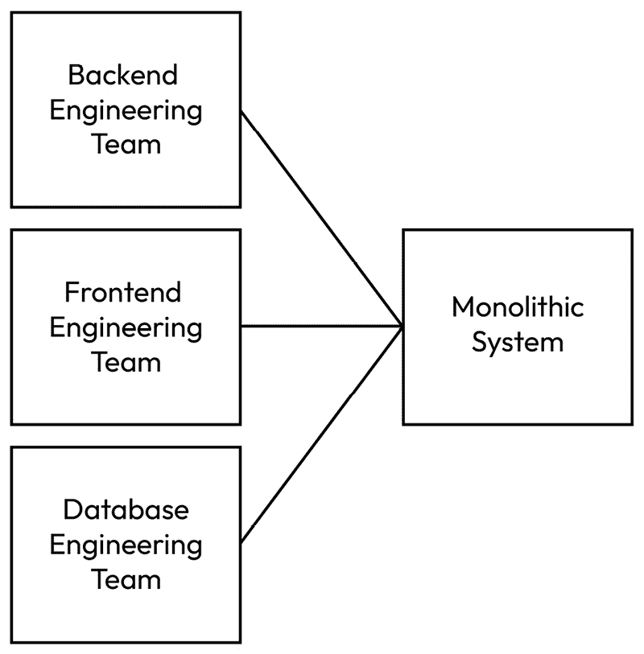

图 1.1 – 按技能集组织的企业

公司有一个**后端工程**（**BE**）团队、一个**前端工程**（**FE**）团队和一个**数据库工程**（**DE**）团队。这种组织根据技能集分组人员。团队中的每个人都负责所有业务功能。这种结构可能产生一个单体系统，通常表现为单个源代码库或一个单一的逻辑过程。

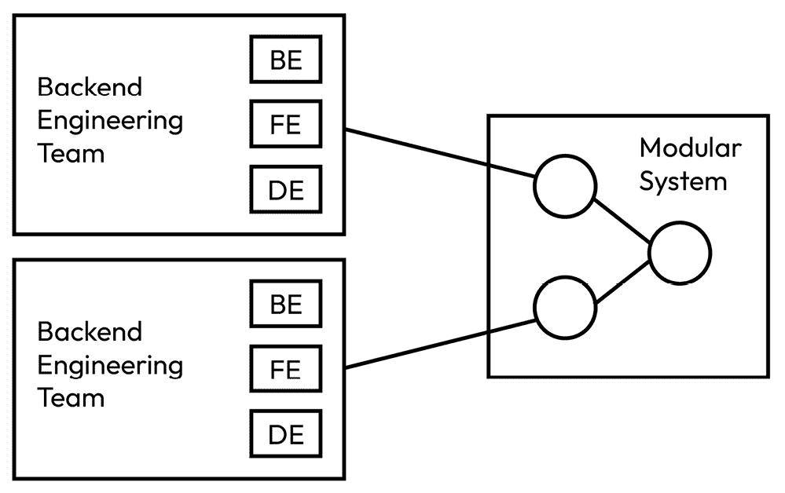

图 1.2 – 按业务功能组织的公司

图 1.2 中的组织根据业务功能分组人员。因此，团队中的每个人都负责一个指定的业务功能，但每个成员可能并不具备相同的技能集。这种结构可能产生一个模块化系统，其中包含多个相互交互的逻辑过程。通常，每个团队都有自己的源代码库。

当团队规模较小时，系统扩展性更好，因为人们相互交流所需的信息通道数量是 *n (n – 1) / 2*，因此它是指数级扩展的。亚马逊的杰夫·贝索斯提出了他的“两个披萨规则”：

“如果你在会议中不能用两个大披萨喂饱你的团队，那你就麻烦了。”

因此，如果团队不能太大，以至于无法扩展组织和系统，那么通常会有很多团队。这与我们很快将要讨论的架构概念非常吻合。

另一方面，尽管在现代化遗留系统架构方面做出了最大努力，但如果组织结构拒绝与之对齐，那么新的架构最终很可能会回归到其旧的习惯结构。

这是由工程管理和向上解决的事情。这超出了软件架构师可以解决的问题。然而，了解这一现象是值得的，这样问题可以尽快升级。

一些大型组织发现改变他们的结构极其困难。他们甚至创建了初创公司，以现代组织结构和现代软件架构一起运行。

# 选择软件框架

软件框架（一个 *框架*），或软件开发框架，是一套标准化的工具，旨在通过一致的方法解决某些问题。

一个软件系统通常需要相当多的框架，这样它们可以专注于业务功能，而不是像日志记录、JSON 转换和配置管理这样的底层关注点。这些框架提供了一种经过验证的方式来实现目标软件架构。选择框架是架构决策的一部分。

现在组织自己构建所有框架的情况很少见。主要原因在于大多数框架都是开源的，并由社区支持。当存在可以免费使用的类似竞争框架时，组织决定开发自己的框架需要很多正当理由。

一些科技公司会在没有现成的框架满足其需求时开发自己的框架。一些公司开发自己的框架是为了与其他框架竞争，并可能从咨询服务业务或交叉销售其他产品中获利。要实现这一点，需要大量的研究努力和人才。

另一个选择是选择市场上已经存在的框架，无论是商业的还是开源的。

## 新框架悖论

每个月都会发布新的框架，旨在解决现有框架的陈旧问题。通常，市场上有一到两个流行的框架，新的框架会宣传它们通过一种大家都一直想要的方法解决了旧框架。

当然，也有一些真正的范式转变型新框架，使工程师更加高效，并通过创新的方法真正推动了行业的发展。例如，**Ruby on Rails**将 Web 开发的重复性和样板代码配置转换成了推断和约定，从而大大减少了代码行数。

但也有很多情况是新框架以创新的方法开始，但并没有取得很好的效果。这就是新框架悖论。

如果一个新框架旨在取代存在多年的框架，那么新框架将需要覆盖很多领域，并在每个领域保持“新方法”。这对贡献者来说是一项巨大的任务。

例如，**Spring 框架**于 2002 年创建，旨在通过使用**依赖注入**（**DI**）和**控制反转**（**IOC**）来简化代码的依赖关系。但现在，这些框架已经发展到涵盖广泛的特性，如 Web、消息传递、安全、持久性等。要取代 Spring 框架的下一代框架将需要覆盖超过 20 年的发展，对技术领域的覆盖非常全面。

最显著的风险是新框架可能解决了框架长期存在的问题之一，但它却不足以覆盖基本和必要的领域。它将采用新框架的工程师困住，使他们面临是否修复新框架或返回旧框架的困境。

另一个风险是，社区可能无法就“新方法”达成一致，因此，为了解决旧框架的陈旧问题，可能会创建多个新的框架。想要尝试新框架的工程师面临着选择过载的问题。有时，这甚至变成了选择瘫痪，因为没有单一的明确更好的选择可供选择。

假设你的团队已经选择了一个框架，并且每个人都对它非常满意。然而，无论出于什么原因，主要贡献者已经决定不再参与这个项目。那么，你的团队就面临了框架无法及时更新修复和计划改进的风险。更不用说大多数开源框架都是由普通工程师无偿投入个人时间贡献的。

## 如何比较和决定软件框架

然而，在实际情况下，团队仍然需要选择一些框架来继续前进。一个例子是，为 Java 应用程序记录消息的框架。我们使用随标准**Java 开发工具包**（**JDK**）一起提供的**Java Logging**框架，**Apache Log4J**，还是**Logback**？我们如何做出最明智的选择？不幸的是，没有保证最佳选择的黄金法则，但在做出决定之前，团队应该考虑以下几个方面的几个方面。

### 社区

**社区**是你在考虑中的最重要的因素。人们是框架被创建、使用和维护的原因。没有人们，框架将无法继续。对于框架来说，至少有三个社区领域需要关注：

+   首先，社区越大，框架就越有可能有人持续支持和改进框架。一个框架应该像是一个有生命的实体，由社区中的人们提供动力。此外，一个框架拥有大社区的原因可能是因为它具有普遍适用性，并且对于一般使用来说是可接受的。

+   其次，我们需要看看社区对框架的支持情况如何。这可能是从另一个用户那里获得如何使用框架的帮助。也可能是社区成员撰写的关于如何将框架应用于问题的技术博客的质量和数量。这可以通过社区为新功能和改进提出的建议来衡量。

+   第三，我们需要看看社区成员之间的沟通方式。他们是否有 Slack 频道、Discord 服务器、电子邮件分发列表，或者任何即时通讯平台？当人们提出问题的时候，社区成员的反应有多快？人们是否乐于并积极接受反馈？

### 贡献

每次提交到源代码存储库都构成了现在框架的样子。值得检查一些统计数据，以了解框架的维护活动有多积极。

最后一次提交是什么时候？它是最近更新的吗？到目前为止已经提交了多少次？此外，我们可以查看上个月、上六个月或上一年内的提交次数。此外，我们可以查看贡献者的多样性。一个好的迹象是提交是由各种贡献者完成的，而不仅仅是那些常见的贡献者。这表明来自贡献者的多样化和健康增长。

有多少分支和版本？较大的数字通常表明健康的增长，这可能意味着社区的一些成员正在努力进行更改，或者很快可能会有框架的变体。很可能代码库中已经存在一些有用的功能，人们愿意投入精力。

标签的数量表示历史版本，可能对框架的演变和增长提供一些线索。然而，要注意低于 1.0 的版本（例如，0.67），或者仅仅是构建号。在这种情况下，贡献者可能不想承诺长期运行框架，未来可能会有破坏性的更改。

低于 1.0 的版本也可能意味着贡献者可能还没有确认他们承诺长期运行框架。如果你打算在生产系统中放置*0.x*库依赖项，必须格外小心。如果库停止服务或引入破坏性更改，这将变得困难。

我们还应该查看源代码，并了解代码的质量和测试用例。我们应该快速查看测试覆盖率，以了解代码被测试的深度和广度。这将帮助我们预测框架的可靠性和稳定性。

### 工具和文档

我们还应该考虑框架是否使用成熟的工具来自我管理。这可能包括一个问题跟踪系统，社区成员可以提交错误并跟踪错误从报告到修复所需的时间。

框架也可能使用一个已建立的**持续集成**（**CI**）系统。这也是一个健康、长期运行和成熟的框架的好迹象，因为需要自动化构建来处理提交的数量、控制质量并发布框架。

**文档**是一个需要考虑的关键因素，因为工程师在这里学习如何使用框架。文档不一定是经过抛光的或自动生成的。内容的质量才是关键。如果图表有助于工程师理解概念，那么它们将是很好的。

### 与其他框架的互操作性

许多框架被设计成与其他框架协同工作，其中一些框架对其他框架有内在的依赖。这是常见的，并不是一个坏信号；然而，必须谨慎对待其影响。

采用使用或与另一个框架一起工作的框架意味着我们也在间接地采用另一个框架。这个其他框架与团队采取的工程方法兼容吗？我们是否允许团队中的工程师直接在代码中使用传递依赖？

即使我们对其他框架没有问题，我们仍然需要确保版本兼容。例如，框架 A 可能使用了 Apache Commons IO 库，版本 2.14.0，而我们的项目目前使用的是 1.4。将框架 A 导入我们的项目会将版本 2.14.0 作为一个依赖项引入项目。幸运的是，构建框架如 Gradle 和 Maven 提供了一种优雅的方式来显式指定版本并排除特定的版本从传递依赖中。在这个例子中，我们将升级我们对 Apache Commons IO 的依赖，从 1.4 升级到 2.14.0 以使用框架 A。

### 建立而不是选择框架

工程师可能想要构建自己的框架而不是选择现有的框架。在特定条件下，这样做可能是有益的。

如果软件有现有框架无法满足的独特需求，那么构建定制的框架就是合理的。这可能是一个非常具体的领域，或者它可能有非常严格的非功能性需求。例如，**高频交易**（**HFT**）软件的工程师可能编写自己的框架以满足超低延迟的要求。

如果组织将其视为具有尖端技术的市场竞争优势，那么构建定制的专有框架也可能是合理的。

如果之前社区中不存在这样的框架，这也可能是社区中一个新的开源框架的开始。在这种情况下，从社区中聚集工程人才并合作可能是有益的。

## 如果我们做出了错误的选择怎么办？

尽管我们尽了最大努力，我们可能仍然选择了错误的框架。该框架可能没有实现预期的行为。贡献者可能已经放弃了这个项目。该框架可能采取了一种不再适合我们需求的新颖方法。

错误框架的采用变成了技术债务。不幸的是，我们需要寻找替代框架并计划重构工作以消除这种依赖。

尽管重构技术超出了本书的范围，但并非总是可以避免选择错误的框架。我们所能做的就是在这个过程中进行尽职调查。如果适当的话，我们还可以创建接口，以便只有代码库中的最小类直接引用框架，而框架对其他代码库的使用是透明的。

# 文档和图表

软件架构作为系统的蓝图，在文档和图表中得到了体现。其中一些可能被记录在配置文件和模板中，但当软件架构师需要展示系统或与利益相关者沟通时，文档和图表仍然是使用最广泛的格式。其中一些图表将在接下来的章节中使用。

## 业务流程模型与符号

软件系统在高级别上可以看作是自动化的业务流程，这些流程可以通过图表进行可视化。**业务流程模型与符号**（**BPMN**）标准化了图形符号，并为建模业务流程提供了一个共同的语言。它通常被工程师和利益相关者用于沟通和文档目的。

以两个家庭就他们交换的服务合同达成协议的例子（*服务合同*），业务流程可以建模如下：

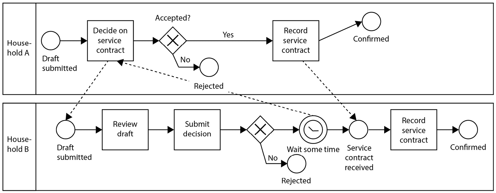

图 1.3 – BPMN 图例

**家庭 A**和**家庭 B**有自己的游泳道来展示各自的过程。**家庭 A**提交服务合同的草案，**家庭 B**接收它。**家庭 B**审查草案并提交其决定。如果**家庭 B**拒绝服务合同，那么**家庭 A**和**家庭 B**的流程都将结束。否则，**家庭 B**等待**家庭 A**的回应；同时，**家庭 A**记录服务合同，流程结束。最后，**家庭 B**从**家庭 A**那里收到服务合同并记录服务合同，流程结束。

BPMN 拥有丰富的符号集合来描述业务流程。它们可以分为四组。

### 流对象——活动、事件和网关

**活动**可以是业务流程中发生的任务和子流程。**事件**是已经发生的结果。**网关**是做出决策或流程分支的点。

### 连接对象——序列和关联

**序列**展示了控制流的流程以及流程对象之间的消息传递。**关联**描述了对象之间的关系，例如输入、输出或依赖关系。

### 游泳道

**游泳道**是根据参与业务流程的参与者的角色和责任对流程和连接对象进行分组。

### 艺术品

**艺术品**是图表的附加信息，它们提供了上下文，例如涉及的数据对象或简单的自由文本注释。

## 架构决策记录

软件架构可以看作是从问题发现到解决方案实施的过程。在这个过程中，会做出许多决策以推动系统前进。**架构决策记录**（**ADR**）是一份文档，它记录了基于当时情境所做的决策及其带来的后果。

互联网上有许多 ADR 模板，从概念上讲，涵盖了以下部分。

### 状态

这通常只是一个单词，用来描述过程中 ADR（抽象设计请求）的当前状态。以下是一个 ADR 过程的示例：

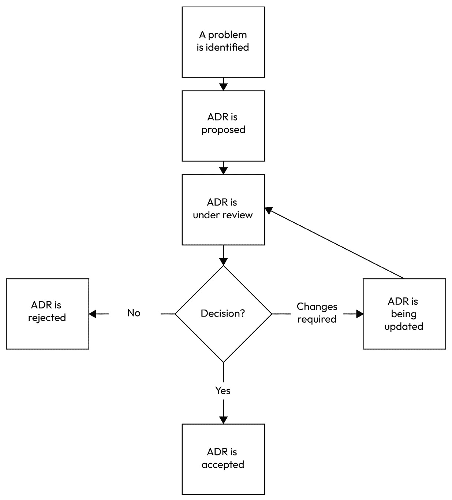

图 1.4 – ADR 过程的示例

基本可能的状态是**提议的**、**接受的**和**拒绝的**。在这个例子中，还有其他状态，例如**正在审查**和**需要更改**。这因组织而异。

### 背景

本节应介绍讨论开始的背景。一个好的介绍会将更改的需求带到当前情况，例如，当前运营的痛点、组织结构调整、业务扩张等）。

它还介绍了讨论中使用的术语，以便可以轻松引用而不会产生歧义。一些当前的组织结构和技术基础设施的信息也会有所帮助。

如果适用，本节可以提及当前系统的质量属性以及我们为什么要更改它们。例如，如果我们的系统只能处理 100 个并发登录，而公司希望在新的技术设计中支持 10,000 个，那么可扩展性就是本 ADR 提议要更改的系统属性。

它还应提及期望的结果。这设定了我们希望我们的更改实现的目标状态。这里的动机应参考之前提到的问题，并详细说明结果如何改善业务成果。

### 决策

本节详细描述了提议的更改。它应侧重于更改如何产生上一节中描述的期望结果。它还可以提及提出的问题以及决策是如何由讨论驱动的。

在某些情况下，会提到替代更改。如果提到了，应该对提议的更改和替代方案进行比较。一种比较的方法是列出每个选项的优缺点。另一种方法可能是将每个选项与一系列因素进行比较，并得出为什么提出该选项的结论。

### 后果

本节描述了选择提议的更改的影响。它是否改变了团队的操作方式？它会改变哪个系统属性以及如何改变？它是否优化了系统的一个方面但牺牲了另一个方面？系统的哪个部分可能会变得过时？

## 评论请求

**评论请求**（**RFC**）是一系列文档，其中提出了标准、协议、程序和指南，进行了讨论、达成一致并定义。**互联网工程任务组**（**IETF**），一个**标准开发组织**（**SDO**），通过 RFC 流程定义了众多对互联网具有重大意义的标准，例如**互联网协议**（**IP**）版本 4（RFC 791）和 6（RFC 2460），以及**超文本传输协议**（**HTTP**）版本 1.1（RFC 2616）。

任何人都可以提交 RFC，任何人都可以对现有的 RFC 进行评论。它们以公开和透明的方式经过迭代审查和反馈过程。它们通常由主题专家发起，但由更广泛的社区维护。RFC 的结果可能是被行业采纳的标准和协议，这对于框架扩展、进一步研究或作为下一个 RFC 的基础都是有用的。

RFC 文档的格式在不同组织之间有所不同。一般来说，文档应涵盖以下部分。

### 状态

存在几种可能的状态：**草稿**、**收集反馈**、**接受**、**拒绝**和**废弃**。

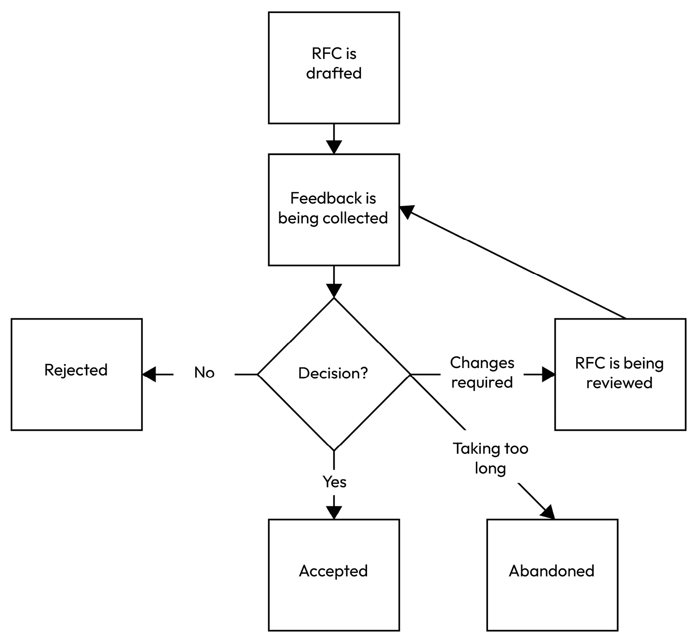

图 1.5 – RFC 流程的示例

一旦 RFC 被起草，它将经过审查和反馈的迭代过程。RFC 在以下情况下退出迭代：被接受、拒绝或废弃。

### 背景

本节解释提交此 RFC 的需要。可以提供一个示例来说明标准化的需要或缺乏一致协议引起的问题。

### 方法

本节解释在审查反馈过程之后与社区达成一致的方法。它应该尽可能详细，以捕捉方法的一致意见。

### 优点和缺点

应该详细说明该方法的优点和缺点，以便社区清楚是否应该进行另一轮反馈收集，或者至少让社区了解该方法的后果。

### 替代方案

本节提及了任何考虑过和讨论过但未采纳的替代方法。

### 参考文献

本节包括任何提到的先前 RFC、学术论文或任何其他提供更多讨论背景的材料。

### 更新日志

由于 RFC 可能引发漫长的审查反馈过程，更新日志有助于按时间顺序记录 RFC 的每个有意义的变化。

## RFC 和 ADR

RFC 和 ADR 在文档格式上有很多相似之处，但在使用方面也存在差异。RFC 侧重于大型社区中的行业标准和协议，而 ADR 侧重于组织内部的惯例。RFC 倾向于接近最佳实践，而 ADR 则倾向于接近解决方案和代码。

尽管存在差异，RFC 和 ADR 可以协作工作。对于需要达成共识、预期将进行长时间讨论或具有重大影响的话题，可以先编写 RFC 来就方法达成一致。然后，可以编写 ADR 作为决策的记录和方法的详细技术规范。

## UML 图

**统一建模语言**（**UML**）自 1994 年以来从不同的建模语言和符号中标准化而来。UML 1.0 于 1997 年被一个名为**对象管理组**（**OMG**）的国际标准联盟采纳为标准。

UML 拥有一系列定义良好的软件元素，可以形成各种图表，帮助工程师以结构和视觉方式建模业务问题。共有 14 种 UML 图表，分为两大类。

### 结构图

结构图表示系统的静态结构。它们关注诸如类、对象、组件和包等元素。它们强调这些元素在系统中的组织和相互连接方式。以下是一个类图的示例：

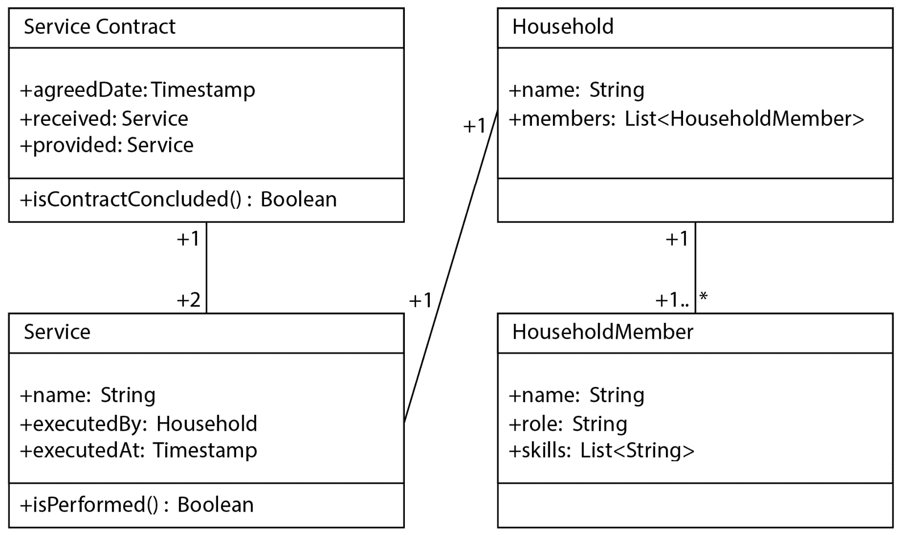

图 1.6 – UML 类图的示例

类图通常包含类和接口。每个类可以包含一些属性和一些函数。例如，`ServiceContract` 类有三个属性：`agreedDate`、`received` 和 `provided`。该类还有一个函数 `isContractConcluded`，返回一个 `boolean` 值。`ServiceContract` 类的 `received` 和 `provided` 字段引用了另一个类 `Service`。我们可以说 `ServiceContract` 类到 `Service` 类的多重性是一对二，如图所示。

从业务角度来看，`ServiceContract` 类是作为 `Service` 类的两个实例建模的服务交换合同：一个是“接收”服务，另一个是“提供”服务。如果合同是双方同意的，那么 `agreedDate` 字段应该记录合同达成的时间。

有七个 UML 结构图，每个图都有特定的用途，具体取决于关注的元素：

+   **类图**，如图所示，描述了类的静态结构，以及它们的属性、函数和与其他类的关联。

+   **对象图**可视化类在某一时间点的实例及其关系，通常从一个现实生活中的例子出发，以表示系统运行时结构的快照。

+   **包图**显示了类和组件如何组织到包中，以及包之间的关系。

+   **组件图**表示构成系统的较高层次的逻辑或物理组件及其关系。

+   **部署图**描述了软件组件在硬件基础设施上的物理部署以及它们与其他物理节点之间的连接。

+   **组合结构图**描述了一个类或组件的内部结构，重点关注内部字段和函数之间的协作。

+   **配置文件图**是可扩展和自定义的图表，它结合了其他 UML 图表。它们促进了 UML 语言扩展到特定领域。

### 行为图

行为图表示系统的动态交互。它们包括参与者、消息、活动、状态和转换等元素。这些图的关键重点是系统行为如何从控制流、交互或状态转换中产生。以下是一个状态图的示例：

，

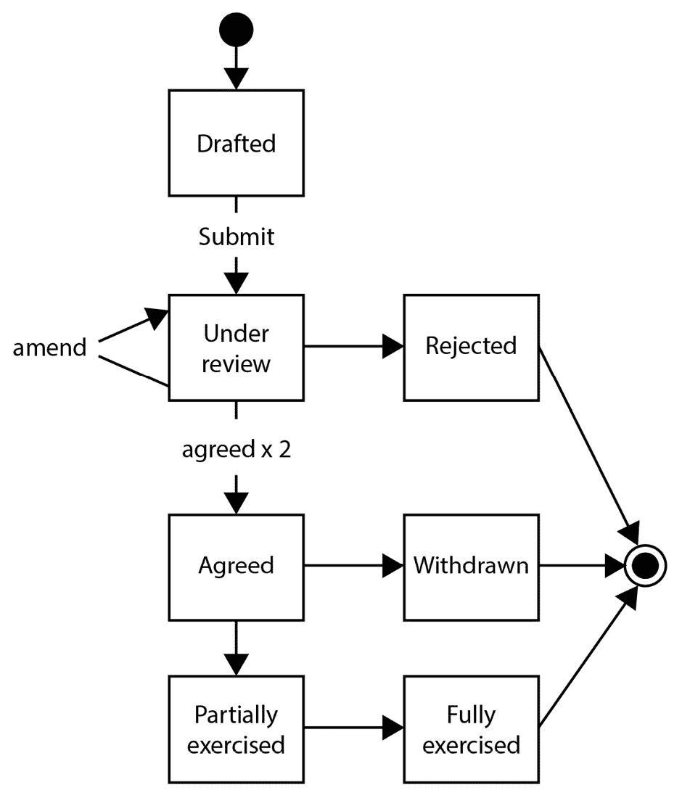

图 1.7 – UML 状态机图的示例

此状态机图描述了两个家庭之间服务合同的生命周期。它始于一个家庭起草的服务合同的提交。然后，在服务合同处于审查期间，任一家族都可以修改服务合同，直到它被拒绝或双方同意。之后，服务合同仍然可以被撤回。否则，涉及的家族将行使合同中的服务，直到双方都行使了服务，服务合同达到生命周期的终点。

有七个 UML 行为图。技术上可以使用它们中的任何一个来描述相同系统的行为。区别在于图中展示的行为方面：

+   **状态机图**，如图所示，模型化系统在每个状态下的不同响应以及状态如何从一个转换到另一个。

+   **通信图**，也称为**协作图**，强调对象或组件之间交换的消息。

+   **活动图**表示系统组件中的业务或操作流程作为序列。

+   **交互概览图**表示系统组件中的业务或操作流程，重点关注系统组件之间的交互。

+   **序列图**按时间顺序可视化对象和组件之间交换的消息。

+   **时序图**在一个时间段内可视化对象和组件之间交换的消息，重点关注时间约束和事件排序。

+   **用例图**捕捉了参与者与系统之间的交互。参与者可以是用户或外部系统，因此参与者可以通过系统的功能来实现他们的目标。

## C4 模型

**C4 模型**是在 2010 年代开发的一种视觉建模方法。这种方法源于观察许多软件架构图要么缺乏细节（过于高级）要么细节过多（过于低级）。这种方法旨在提供一套指南和约定，以在适当的抽象级别上记录架构。

随着时间的推移，它在希望以简单有效的方式记录其系统的软件架构师和工程师中获得了流行。**Structurizr**工具由 C4 模型创建者 Simon Brown 开发，允许以代码的形式创建架构模型。

C4 模型可以用地图的隐喻来描述：从街景视图，我们可以看到道路上的行人和汽车，然后放大到看到城市地图，了解城市中主要道路的连接，然后放大到看到国家地图，我们看到国家的主要城市和城镇，然后到世界地图，我们看到地球。

C4 模型有四个抽象级别。每个级别帮助不同的人与所讨论的主题进行沟通和协作，突出显示的主题。在会议或研讨会上提出正确的图示以开始对话是有帮助的。

### 级别 1 – 系统上下文图

**系统上下文图**是“整体图”，主要关注“系统”。该图应围绕系统中心，并与参与者、业务操作和外部系统交互。此图对于与非技术利益相关者和外部组织的沟通特别有用。

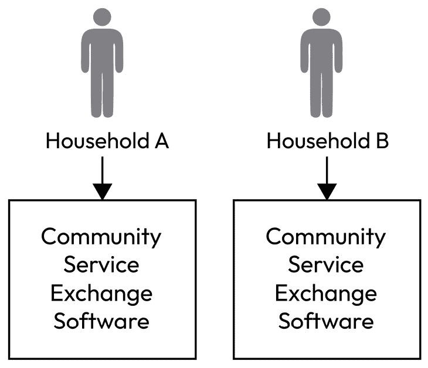

图 1.8 – 系统上下文图示例（C4 级别 1）

社区服务交换软件是作为每个家庭中独立副本安装的独立软件。软件的副本之间不相互通信。

### 级别 2 – 容器图

**容器图**聚焦于“系统”，关注系统内部多个容器如何协同工作。这里的每个容器都指一个可部署的过程，并在系统中拥有自己的角色、责任和边界。

容器图也可以用来说明系统使用的任何中间件或基础设施，例如消息代理、数据存储或文件系统。

此图对于与平台工程师、数据库管理员、网络工程师或安全工程师等技术利益相关者的沟通很有用。

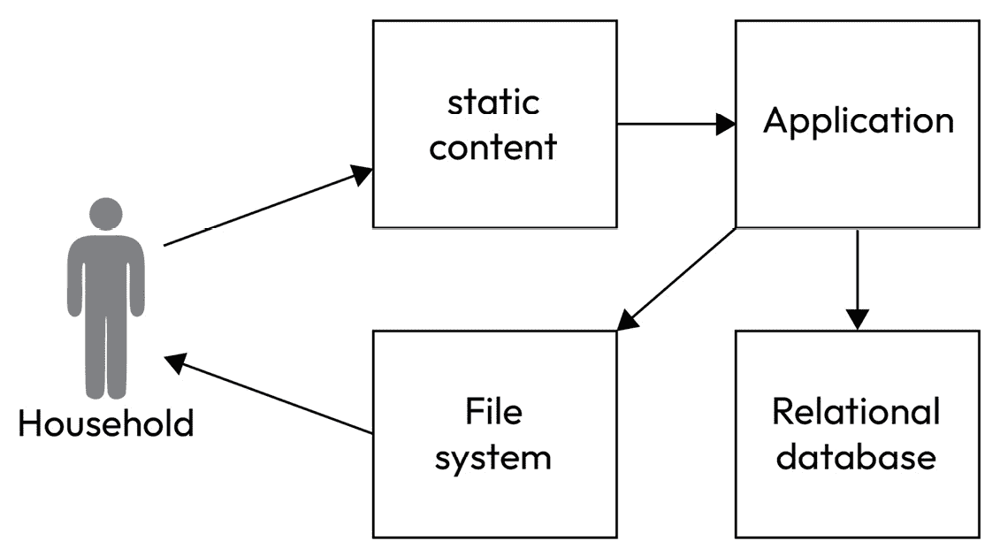

图 1.9 – 容器图示例（C4 级别 2）

社区服务交换软件包含一个模块来组织所有静态内容，如图像和字体。有一个应用程序模块来验证数据和运行检查。应用程序模块使用关系数据库来持久化所需数据。应用程序模块还从关系数据库检索报告数据并将其导出到文件系统。家庭可以从文件系统中读取报告文件。

### 级别 3 – 组件图

**组件图**聚焦于容器，提供了不同组件如何构成容器的视图。

它描述了组件的输入（例如，REST 端点、消息消费者或调度器）和组件的输出（例如，事件、对请求的响应等）。

此图的另一个重要功能是展示容器内用于业务操作的逻辑包。它们通常在为业务目的建模的实体多个表示形式上加载、转换、组合和计算功能。

此图更接近软件工程师，因此他们可以理解他们编写代码和脚本的上下文。

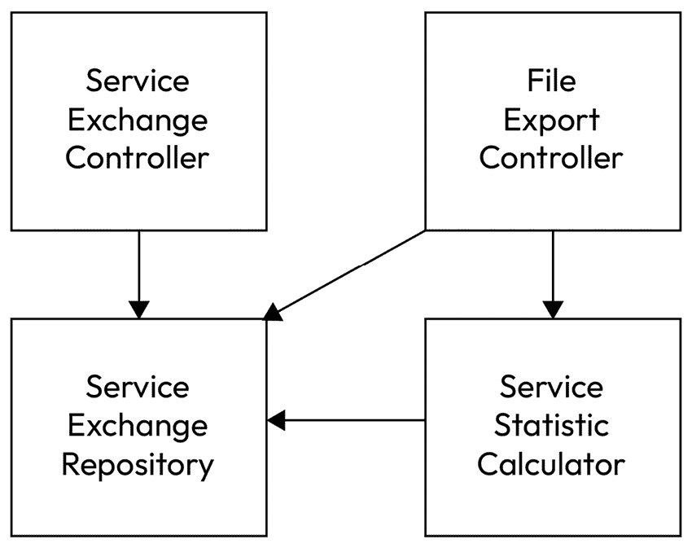

图 1.10 – 组件图示例（C4 级别 3）

社区服务交换软件的应用模块有一个服务交换控制器，它操作两个家庭之间的服务合同（即“合同”）。这是从开始到结束管理合同生命周期的业务逻辑。它将合同传递到服务交换存储库，以进行持久化逻辑，例如将合同实体转换为数据库表和列。

另一方面，文件导出控制器响应家庭生成其参与合同的报告的请求。文件导出控制器验证请求并生成文件，使其可在文件系统中可用，而该文件系统位于此应用模块之外。合同部分包含统计数据，计算由服务统计计算器完成。

### 级别 4 – 代码图

最后，我们来到了抽象层次最低的一层——**代码图**。这是工程师理解所使用的设计模式和源代码如何在抽象视图中相对于其他源文件表示的微观视图。

我们可以描述组件中建模的实体及其之间的关系。这可以转换为关系数据库模式。

我们可以描述一个涉及多个类的面向对象风格的过程。我们可以展示每个类中捕获的字段以及类如何相互交互。

并非系统每个部分都必须有代码图，因为简单的逻辑可以直接在源代码中表达。通常，代码图用于捕获更复杂的交互，以便工程师在编码时能够留心。这也是您会看到 UML 图的地方。

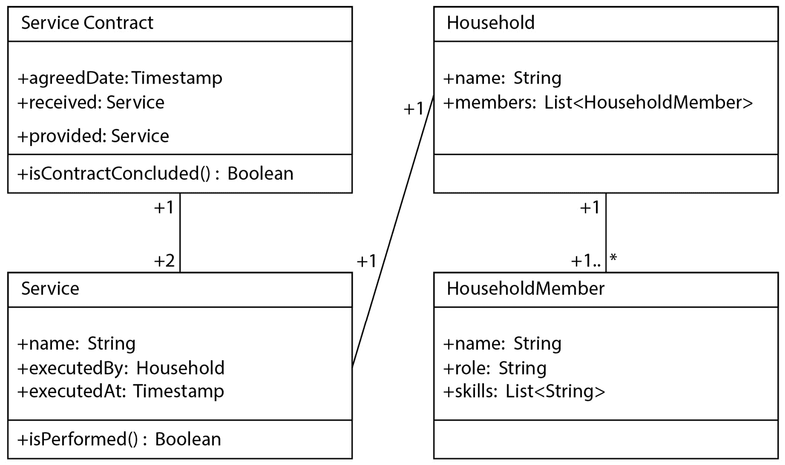

图 1.11 – 代码图示例（C4 级别 4）

在 `ServiceExchangeController` 中，有一个名为 `Household` 的数据类，它包含一个 `HouseholdMember` 对象的列表。`HouseholdMember` 数据类模拟了一个具有执行合同技能的家庭成员。

有一个 `Service` 类，它捕获家庭执行合同的执行细节。它提供了一个 `isExecuted` 函数，如果其 `executedBy` 和 `executedAt` 字段都不为空，则返回 `true` 的布尔值。

`ServiceContract` 类模拟了两个 `Service` 对象之间的服务合同。它记录了双方家庭达成合同的具体日期。合同的接收者和提供者都是一个 `Service` 对象。它提供了一个 `isContractConcluded` 函数，如果两个对象的 `isExecuted` 函数的结果都返回 `true`，则该函数返回一个布尔值 `true`。

# 摘要

我们通过一个现实世界的例子阐述了软件架构的重要性。我们讨论了软件架构在沟通、培训、预算、定义愿景以及在技术生态系统中解决跨领域关注点中的作用。

我们已经讨论了康威定律以及组织的结构如何影响系统架构。

我们在多个场景中探讨了选择软件框架的话题，并分析了其优缺点。

我们还涵盖了在软件架构中经常使用的文档和图表，例如 ADRs、RFC、UML 图和 C4 模型。

在下一章中，我们将介绍一些推动现代软件架构的基本架构原则。我们将分解和组合多个概念，并通过相同的现实世界例子进行说明。
