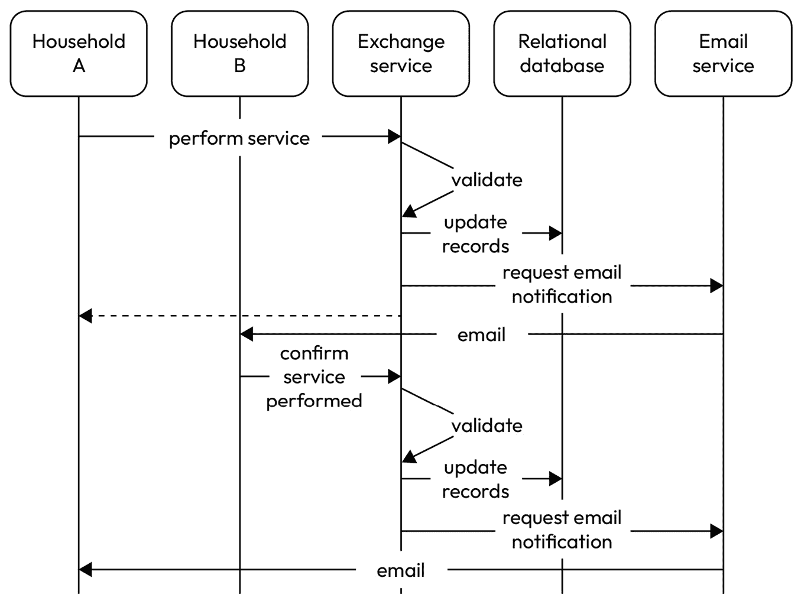
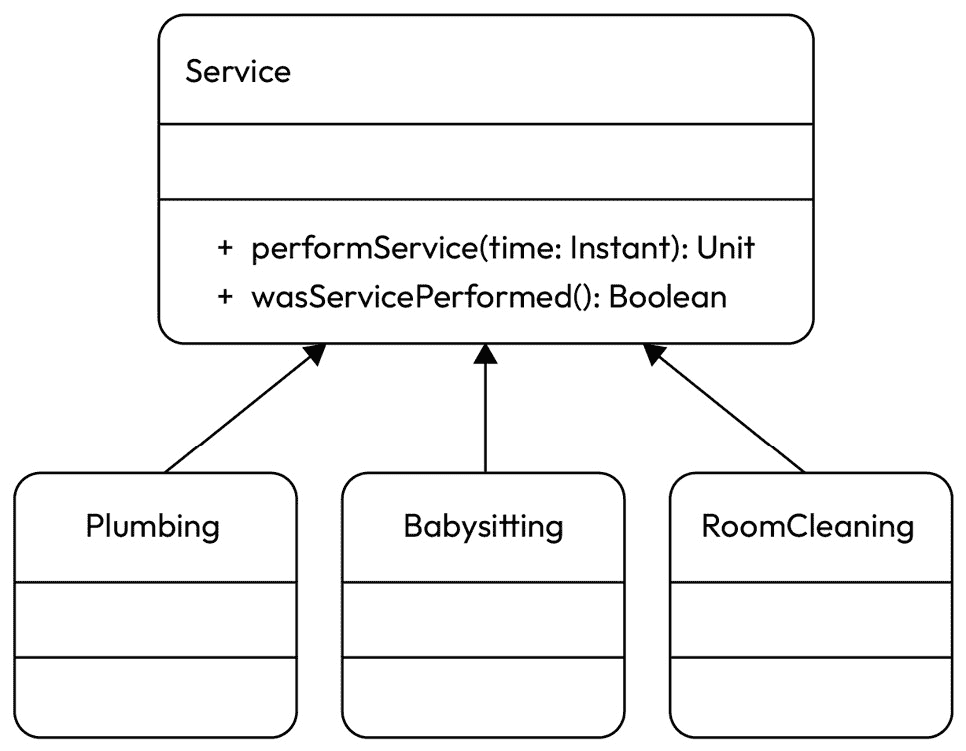
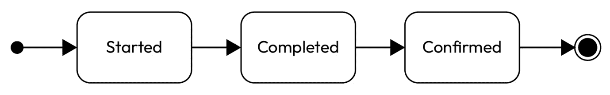
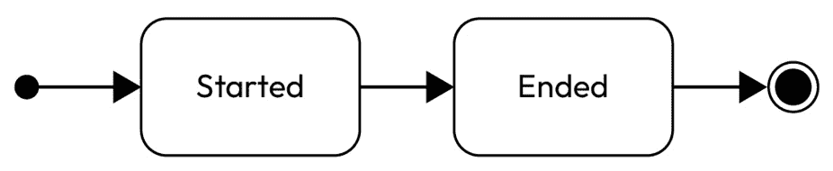
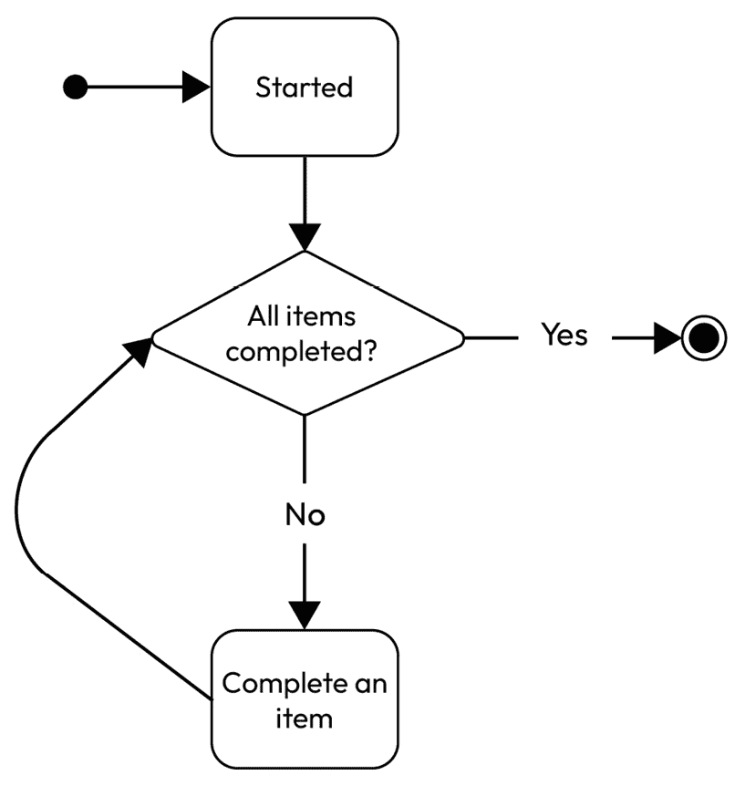
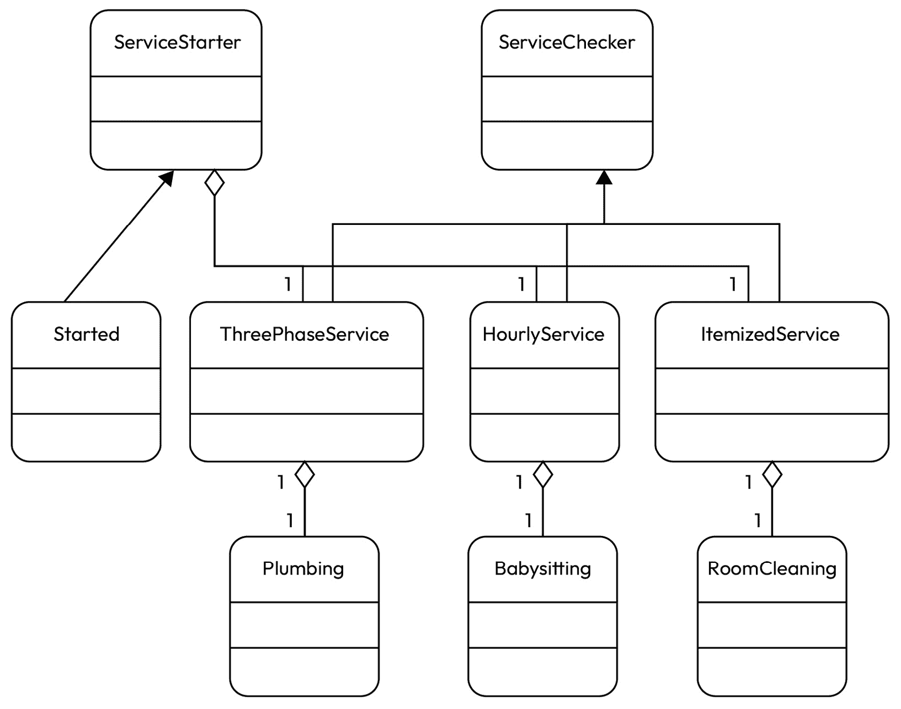

# 多态性和替代方案

在本章中，我们将通过实现各种不同的解决方案来解决一个真实生活中的例子问题。我们将使用**多态性**作为解决方案的基础。之后，我们将使用由 Kotlin 语言支持的其它方法。最后，我们将比较它们，并尝试理解在什么情况下哪种方法更合适。

在本章中，我们将涵盖以下主题：

+   为什么选择 Kotlin？

+   生活中的例子——重访

+   多态性解决方案

+   密封类解决方案

+   委派解决方案

+   函数式解决方案

+   比较和总结

# 技术要求

你可以在 GitHub 上找到本章使用的所有代码文件：[`github.com/PacktPublishing/Software-Architecture-with-Kotlin/tree/main/chapter-3`](https://github.com/PacktPublishing/Software-Architecture-with-Kotlin/tree/main/chapter-3)

# 为什么选择 Kotlin？

Kotlin 被选为本书所有例子的主要编程语言。选择这个语言有几个原因：

+   自从 2011 年发布以来，Kotlin 已经获得了显著的人气

+   它可以用于前端和后端应用程序，这使得可以使用相同的语言来展示广泛的架构主题

+   它具有简洁、易读和表达性强的语法，这有助于我们理解实现，而无需深入了解语言

+   它与 Java 兼容，因此如果适用，代码示例可以利用 Java 和 Kotlin 中现有的众多库

# 生活中的例子——重访

我们使用与*第一章*和*第二章*相同的真实生活例子。这个例子如下。在一个村庄里，家庭之间互相提供服务，并从其他家庭那里接受服务。为了使家庭之间服务交换的记录更加清晰，创建了一个软件来记录交换服务的合同（即“合同”）。

在双方家庭在合同中同意交换的服务后，每个家庭都需要提供服务。以下是一些例子：

+   修理家具

+   制作连衣裙

+   照顾*x*小时的小孩

+   在聚会上表演魔术

+   捐赠一件二手衣物

+   提供食物和饮料

+   清理房屋中的*n*个房间

我们需要能够捕捉这些服务的细节，并能够验证服务是否已经完成。一旦合同中的双方都完成了服务，合同就结束了，达到了其最终状态。让我们专注于一个场景，其中家庭 A 为家庭 B 提供服务，而家庭 B 确认家庭 A 按照合同完成了服务。交互的顺序可以简要描述如下 UML 序列图：



图 3.1 – 重访实时示例

在**交换服务**中，我们需要提供两个函数。一个函数是为一个家庭为另一个家庭提供服务而提供的。另一个函数是为一个家庭确认另一个家庭是否按照合同执行了服务。问题是，不同的服务类型需要不同的方式来声明和确认完成。

例如，如果服务是修理物品，那么只需要修理家庭确认物品已被修理。接收家庭会确认物品已被修理。如果服务是照看婴儿，那么保姆家庭可能会记录照看时间来确认服务已执行。有时，服务是多个子服务的组合。

至少应该有两个函数来执行服务并检查服务是否已执行：

```kt
interface Service {
    fun performService(time: Instant)
    fun wasServicePerformed(): Boolean
}
```

对于这个练习，让我们假设我们需要支持三种类型的服务：管道、保姆和房间清洁：

+   管道服务需要管道家庭报告服务开始和完成；然后另一个家庭确认这一点

+   保姆服务需要保姆家庭记录会话的开始，并跟踪它，直到另一个家庭接走婴儿并记录服务的总时长

+   房间清洁服务需要清洁家庭记录服务的开始和清洁的房间，然后另一个家庭确认按照合同所有房间都已清洁

让我们首先用多态方法解决这个问题。

# 多态解决方案

在面向对象编程中，多态提供了一种强大的方式来抽象多种形式的接口。多态在希腊语中字面意思是*多种形式*。

家庭的通用接口包含一个名为`performService`的函数，用于表示服务的开始，以及一个名为`wasServicePerformed`的函数，如果服务按照协议执行，则返回 true：

```kt
interface Service {
    fun performService(time: Instant)
    fun wasServicePerformed(): Boolean
}
```

这个解决方案可以用以下 UML 类图来表示：



图 3.2 – 多态解决方案

`Plumbing`类相对简单。它提供了一个家庭开始服务的函数，一个报告服务完成的函数，以及一个供另一个家庭确认服务已执行的函数。同时，记录了服务执行、完成和确认的时间戳：

```kt
class Plumbing : Service {
    var startedAt: Instant? = null
    var completedAt: Instant? = null
    var confirmedAt: Instant? = null
    override fun performService(time: Instant) {
        startedAt = time
    }
    fun completeService(time: Instant) {
        completedAt = time
    }
    fun confirmService(time: Instant) {
        confirmedAt = time
    }
    override fun wasServicePerformed(): Boolean {
        return startedAt != null && completedAt != null && confirmedAt != null
    }
}
```

`Babysitting`类不同，因为完成标准基于服务的持续时间。类的构造函数接受一个协议中约定的小时数来确定服务是否完成。有一个函数用于保姆家庭开始工作，另一个函数用于其他家庭确认工作的结束。如果持续时间与协议小时数相同或更长，则认为服务已完成：

```kt
class Babysitting(val agreedHours: Int) : Service {
    var startedAt: Instant? = null
    var endedAt: Instant? = null
    override fun performService(time: Instant) {
        startedAt = time
    }
    fun endService(time: Instant) {
        endedAt = time
    }
    override fun wasServicePerformed(): Boolean {
        return if (startedAt == null || endedAt == null) {
            false
        } else {
            Duration.between(startedAt, endedAt).toHours() >= agreedHours
        }
    }
}
```

当协议中的所有房间都被清洁时，`RoomCleaning`类已执行了服务。构造函数接受一个房间名称的`Set`，稍后用于检查协议中的所有房间是否都已清洁。它有一个函数用于清洁工开始工作，另一个函数用于其他家庭确认每个房间是否已被清洁：

```kt
class RoomCleaning(val agreedRooms: Set<String>) : Service {
    var startedAt: Instant? = null
    val roomCleaned: MutableSet<String> = mutableSetOf()
    var endedAt: Instant? = null
    override fun performService(time: Instant) {
        startedAt = time
    }
    fun cleaned(
        time: Instant,
        room: String,
    ) {
        roomCleaned.add(room)
        if (allAgreedRoomsCleaned()) {
            endedAt = time
        }
    }
    private fun allAgreedRoomsCleaned() = roomCleaned.containsAll(agreedRooms)
    override fun wasServicePerformed(): Boolean = allAgreedRoomsCleaned()
}
```

有一个`main`函数来让所有这些家庭执行服务，并将结果打印出来：

```kt
fun main() {
    val now = Instant.now()
    val plumbing = Plumbing()
    plumbing.performService(now)
    plumbing.completeService(now.plus(2, HOURS))
    plumbing.confirmService(now.plus(2, HOURS).plus(3, MINUTES))
    println("Was plumbing service performed? ${plumbing.wasServicePerformed()}")
    val babysitting = Babysitting(3)
    babysitting.performService(now)
    babysitting.endService(now.plus(3, HOURS))
    println("Was babysitting service performed? ${babysitting.wasServicePerformed()}")
    val roomCleaning = RoomCleaning(setOf("Kitchen", "Bathroom"))
    roomCleaning.performService(now)
    roomCleaning.cleaned(now.plus(3, HOURS), "Kitchen")
    println("Was room cleaning service performed? ${roomCleaning.wasServicePerformed()}")
}
```

程序应打印出类似以下内容：

```kt
Was plumbing service performed? true
Was babysitting service performed? true
Was room cleaning service performed? false
```

水暖服务从时间戳开始。然后，在两小时后用时间戳完成。三分钟后，它被确认完成，并附有时间戳。由于存在所有三个时间戳，因此服务已经完成。

在协议中，保姆服务持续时间为三小时。它从时间戳开始，并在三小时后结束，附有时间戳。持续时间正好是三小时。这与协议中的小时数相匹配，因此服务已经完成。

房间清洁服务在协议中列出了厨房和浴室。只有厨房被报告为已清洁，并附有时间戳，因此服务尚未完成。

这种方法产生了一种既统一又多态的风格，并促进了三种具有某些共享行为的不同服务。

# 密封类解决方案

Kotlin 语言有一个名为**密封类**的功能，它限制了类层次结构，并要求在编译时定义所有子类。所有子类都需要在定义密封类的同一包和模块中。这也意味着不能从密封类继承第三方类。

以下是之前提到的多态解决方案的一些观察结果。首先，所有子类都有一个`startedAt`字段和一个实现`performService`函数来设置`startedAt`字段的实现。因此，密封类解决方案可以从多态解决方案中修改。接口可以更改为具有`startedAt`字段和`performService`函数的密封类：

```kt
sealed class Service {
    var startedAt: Instant? = null
    fun performService(time: Instant) {
        startedAt = time
    }
    abstract fun wasServicePerformed(): Boolean
}
```

可以通过以下方式使用密封类实现来简化子类：

```kt
class Plumbing : Service() {
    var completedAt: Instant? = null
    var confirmedAt: Instant? = null
    fun completeService(time: Instant) {
        completedAt = time
    }
    fun confirmService(time: Instant) {
        confirmedAt = time
    }
    override fun wasServicePerformed(): Boolean {
        return startedAt != null && completedAt != null && confirmedAt != null
    }
}
```

`performService`函数已在`Service`超类中实现，因此无需在子类中实现它：

```kt
class Babysitting(val agreedHours: Int) : Service() {
    var endedAt: Instant? = null
    fun endService(time: Instant) {
        endedAt = time
    }
    override fun wasServicePerformed(): Boolean {
        return if (startedAt == null || endedAt == null) {
            false
        } else {
            Duration.between(startedAt, endedAt).toHours() >= agreedHours
        }
    }
}
```

同样的简化也适用于`RoomCleaning`子类：

```kt
class RoomCleaning(val agreedRooms: Set<String>) : Service() {
    val roomCleaned: MutableSet<String> = mutableSetOf()
    var endedAt: Instant? = null
    fun cleaned(
        time: Instant,
        room: String,
    ) {
        roomCleaned.add(room)
        if (allAgreedRoomsCleaned()) {
            endedAt = time
        }
    }
    private fun allAgreedRoomsCleaned() = roomCleaned.containsAll(agreedRooms)
    override fun wasServicePerformed(): Boolean = allAgreedRoomsCleaned()
}
```

封闭的 `Service` 类具有 `startedAt` 字段和 `performService` 函数，以方便服务的启动，而子类有自己的变体来完成它。

Kotlin 封闭类的强大之处不在于在编译时对所有子类进行限制。其强大之处在于编译器如何处理这种限制。如果我们使用 `when` 构造与封闭类一起，我们可以将我们的程序简化如下：

```kt
sealed class Service {
    var startedAt: Instant? = null
    fun performService(time: Instant) {
        startedAt = time
    }
    fun wasServicePerformed(): Boolean {
        return when (this) {
            is Babysitting -> durationCoversAgreedHours()
            is Plumbing -> areAllDatesPresent()
            is RoomCleaning -> allAgreedRoomsCleaned()
        }
    }
}
```

由于 `Service` 类使用了 `when` 构造实现 `wasServicePerformed` 函数，子类根本不需要实现这个函数：

```kt
class Plumbing : Service() {
    var completedAt: Instant? = null
    var confirmedAt: Instant? = null
    fun completeService(time: Instant) {
        completedAt = time
    }
    fun confirmService(time: Instant) {
        confirmedAt = time
    }
    internal fun areAllDatesPresent(): Boolean {
        return startedAt != null && completedAt != null && confirmedAt != null
    }
}
```

类似于 `Plumbing` 子类，其他子类现在将只包含以各种形式完成服务相关的函数体：

```kt
class Babysitting(val agreedHours: Int) : Service() {
    var endedAt: Instant? = null
    fun endService(time: Instant) {
        endedAt = time
    }
    internal fun durationCoversAgreedHours(): Boolean {
        return if (startedAt == null || endedAt == null) {
            false
        } else {
            Duration.between(startedAt, endedAt).toHours() >= agreedHours
        }
    }
}
class RoomCleaning(val agreedRooms: Set<String>) : Service() {
    val roomCleaned: MutableSet<String> = mutableSetOf()
    var endedAt: Instant? = null
    fun cleaned(
        time: Instant,
        room: String,
    ) {
        roomCleaned.add(room)
        if (allAgreedRoomsCleaned()) {
            endedAt = time
        }
    }
    internal fun allAgreedRoomsCleaned() = roomCleaned.containsAll(agreedRooms)
}
```

编译器强制要求所有子类都包含在 `when` 构造的分支中。如果没有，则无法编译。此外，`this` 实例在每个分支中自动转换为特定的子类（**智能转换**），因此我们可以直接访问在子类中定义的字段。

在这个实现中，对执行服务的检查的所有变体都被组合在 `when` 构造中的分支。这比 `enum` 实现更好，因为我们不会忽略任何子类，因为我们没有使用 `else` 作为分支。

此外，由于这些是封闭类的子类，所有子类都是已知的，我们可以轻松地在单个函数中比较这些变体。

然而，这种模式仅在存在少量子类且它们具有类似实现时才有用。此外，这种模式不支持在包外部扩展功能。

# 代理解决方案

**代理**通常被认为是多态解决方案的替代方案。在这种方法中，通过将部分责任委托给其他类并扩展其行为来实现函数的扩展。因此，没有创建子类的强制性要求。这有几个原因：

+   松散耦合与高度凝聚

+   关注点分离

+   易于替换

+   重构到代理解决方案

## 松散耦合与高度凝聚

使用代理，代码可以仅针对需要的部分进行重用和组合。这比继承一个可能给子类提供过多功能的类更灵活。这导致与重用代码的耦合更松，同时在类内部保持高度的凝聚性。

## 关注点分离

使用代理，可以将类分解成只有单一职责的小类（子类）。这些类仅在需要时才进行代理。因此，每个类都有一个清晰的关注点和职责。因此，类更容易维护、测试和理解。

我们还能够摆脱任何与无关实现相关的超类变更，这可能会导致行为上的意外变化。我们只需将无关的实现与真正需要的东西分开。

## 简单替换

如果我们需要有不同的行为，交换代理对象比交换继承的基类要容易。不仅代理对象中要实现的功能比不同的基类要少，而且还可以在运行时动态地交换代理对象。

只要子类符合**Liskov 替换原则**（**LSP**），替换子类时不会有行为变化。

## 重构到代理解决方案

为了重构到代理解决方案，我们将职责分解成更小的接口。我们将有一个启动服务的接口，另一个检查服务是否已执行的接口：

```kt
interface ServiceStarter {
  fun start(time: Instant)
}
interface ServiceChecker {
  fun wasServicePerformed(): Boolean
}
class Started : ServiceStarter {
  var startedAt: Instant? = null
  override fun start(time: Instant) {
    startedAt = time
  }
}
```

水暖、照看孩子和房间清洁是三种完成方式非常不同的服务。

水暖服务有三个阶段：*开始*、*完成*和*确认*。



图 3.3 – 三阶段服务

它可以表示为一个既是`ServiceStarter`又是`ServiceChecker`的`ThreePhaseService`。然而，我们已经有了一个作为`ServiceStarter`实现的`Started`具体类，因此我们可以使用 Kotlin 的代理功能来指定`ServiceStarter`的实现是通过构造函数中提供的具有`Started`默认值的`started`字段来实现的：

```kt
interface ThreePhaseService : ServiceStarter, ServiceChecker {
  fun complete(time: Instant)
  fun confirm(time: Instant)
}
class ThreePhaseServiceImpl(val started: Started = Started()) :
    ThreePhaseService, ServiceStarter by started {
  var completedAt: Instant? = null
  var confirmedAt: Instant? = null
  override fun complete(time: Instant) {
    completedAt = time
  }
  override fun confirm(time: Instant) {
    confirmedAt = time
  }
  override fun wasServicePerformed(): Boolean {
    return started.startedAt != null && completedAt != null && confirmedAt != null
  }
}
```

然后，`Plumbing`仅仅是`ThreePhaseServiceImpl`的一个特化，我们可以通过 Kotlin 的代理定义为一个单行代码：

```kt
class Plumbing : ThreePhaseService by ThreePhaseServiceImpl()
```

照看孩子的服务只有两个阶段：*开始*和*结束*。持续时间，即开始时间和结束时间之间的时间量，决定了服务是否已经执行。这里有一个简单的 UML 状态图来捕捉阶段转换。



图 3.4 – 按小时服务阶段转换

它可以表示为一个`HourlyService`。同样，我们可以利用 Kotlin 的代理来避免代码重复：

```kt
interface HourlyService : ServiceStarter, ServiceChecker {
  fun end(time: Instant)
}
class HourlyServiceImpl(val agreedHours: Int, val started: Started = Started()) :
    HourlyService, ServiceStarter by started {
  var endedAt: Instant? = null
  override fun end(time: Instant) {
    endedAt = time
  }
  override fun wasServicePerformed(): Boolean =
    if (started.startedAt == null || endedAt == null) {
      false
    } else {
       Duration.between(started.startedAt, endedAt).toHours() >= agreedHours
    }
}
```

然后，`Babysitting`被声明为一个单行代理类：

```kt
class Babysitting(agreedHours: Int) : HourlyService by HourlyServiceImpl(agreedHours)
```

最后，房间清洁服务会循环重复，直到所有约定的项目都已完成。这里有一个简单的 UML 状态图来捕捉阶段转换。



图 3.5 – 项目化服务阶段转换

我们可以将每个房间视为一个在`ItemizedService`的名义下单独完成的项目。我们还使用泛型`T`类型使其更灵活：

```kt
interface ItemizedService<T> : ServiceStarter, ServiceChecker {
  fun complete(time: Instant, item: T)
}
class ItemizedServiceImpl<T>(val agreed: Set<T>) : ItemizedService<T>, ServiceStarter by Started() {
  val completed: MutableSet<T> = mutableSetOf()
  var endedAt: Instant? = null
  override fun complete(time: Instant, item: T) {
    completed.add(item)
    if (allAgreedItemsCleaned()) {
      endedAt = time
    }
  }
  private fun allAgreedItemsCleaned() = completed.containsAll(agreed)
  override fun wasServicePerformed(): Boolean = allAgreedItemsCleaned()
}
```

`RoomCleaning`现在可以定义如下：

```kt
class RoomCleaning(agreedRooms: Set<String>) :
    ItemizedService<String> by ItemizedServiceImpl(agreedRooms)
```

这个代理解决方案的例子可以用以下 UML 类图来表示：



图 3.6 – 代理解决方案

将它们全部放在一起，我们只需要修改一下 `main` 函数，因为函数名不同。程序的行为方式相同：

```kt
fun main() {
    val now = Instant.now()
    val plumbing = Plumbing()
    plumbing.start(now)
    plumbing.complete(now.plus(2, HOURS))
    plumbing.confirm(now.plus(2, HOURS).plus(3, MINUTES))
    println("Was plumbing service performed? ${plumbing.wasServicePerformed()}")
    val babysitting = Babysitting(3)
    babysitting.start(now)
    babysitting.end(now.plus(3, HOURS))
    println("Was babysitting service performed? ${babysitting.wasServicePerformed()}")
    val roomCleaning = RoomCleaning(setOf("Kitchen", "Bathroom"))
    roomCleaning.start(now)
    roomCleaning.complete(now.plus(10, MINUTES), "Kitchen")
    println("Was room cleaning service performed? ${roomCleaning.wasServicePerformed()}")
}
```

从这个例子中，我们可以看到代码重用是多么容易。例如，如果有另一个服务需要运行约定的小时数，我们可以通过委托重用 `HourlyService`，而无需再次实现相同的逻辑。我们也不需要编写相同的测试。

这种模式减少了代码的重复和测试。它还促使每个类更加具体和专注于其职责。这使得对现有功能的任何扩展都变得更容易，因为它不强制继承一个具体的超类。

# 函数式解决方案

**函数式编程**在处理问题时采用了一种完全不同的思维方式。基本元素可以分为**不可变数据结构**和**纯函数**。

## 不可变数据结构

不可变数据结构一旦创建后就不能更改。如果需要新的值来捕捉变化，就需要创建新的数据结构实例，通常是从现有的实例转换而来。这种方法使得数据可靠且线程安全。

Kotlin 免费提供了 `toString`、`hashCode` 和 `equals` 方法。结合使用 `val` 关键字和对其他不可变数据的独占引用，我们可以轻松创建不可变数据结构。

这里是示例中等效的数据结构：

```kt
data class Plumbing(
    val startedAt: Instant? = null,
    val completedAt: Instant? = null,
    val confirmedAt: Instant? = null,
)
data class Babysitting(
    val agreedHours: Int,
    val startedAt: Instant? = null,
    val endedAt: Instant? = null,
)
data class RoomCleaning(
    val agreedRooms: Set<String>,
    val startedAt: Instant? = null,
    val completed: Set<String> = emptySet(),
    val endedAt: Instant? = null,
)
```

值得注意的是，所有字段都是用 `val` 声明的，因此引用不能更改。此外，在许多字段中使用的 `Instant` 类也是不可变的。

`Set` 接口没有声明可变函数。尽管可以注入一个可变的具体实现，使得数据类不是严格不可变的，但如果只使用接口中声明的函数以及具体实现符合 LSP，则不应该有行为上的变化。

此外，可能在不同实例中具有不同值的字段，要么带有可空声明（?），要么带有默认值。如果调用时未指定，Kotlin 构造函数可以提供这些值。

Kotlin 为数据类提供了一个 `copy` 函数，以便作为单独的实例进行可变操作。例如，可以通过以下代码启动管道服务：

```kt
  val plumbing = Plumbing()
  val started = plumbing.copy(started = Instant.now())
```

然而，仅仅使用 `copy` 函数可能显得太低级，并且不能帮助传达代码的意图。可能更好的是有一个更好的名字的函数，例如 `start`，它调用 `copy` 来使意图明显。

## 纯函数

当函数在给定相同输入时总是产生相同的输出并且没有副作用时，我们称这些函数为纯函数。为了实现这一点，函数不会修改任何外部数据或状态。它也不使用任何随机化或系统时钟函数。它不会调用任何创建副作用的功能，例如更新数据库或远程调用外部系统。它是确定性的、可预测的、可测试的和线程安全的。

在本章中使用的家庭实际例子中，尽管所有三种服务形式不同，但所有三种服务都需要启动服务。此外，我们希望有一个更好的函数名来传达意图。Kotlin 支持的`start`函数可以与多种类型一起工作。此外，我们使用**lambda 表达式**，以便每种类型都可以指定其创建新值实例的自己的方式。

`start`函数看起来可能如下所示：

```kt
fun <T> T.start(time: Instant, transform: T.(Instant) -> T): T = transform(time)
```

它声明了一个通用的`T`类型作为函数接收者，因此我们可以以`T.start`的风格调用函数，作为`T`类型来创建一个具有`startAt`时间的`T`类型的新实例。这是`start`函数调用的一个示例：

```kt
Plumbing().start(now) { startedAt -> copy(startedAt = startedAt) }
```

`Plumbing()`创建一个没有`startAt`时间的`Plumbing`新实例。然后通过提供一个`Instant`对象和一个 lambda 表达式来调用`start`函数，该 lambda 表达式指定使用`copy`函数设置`startedAt`字段以创建一个新的`Plumbing`实例。

## 其余的函数

可以单独声明针对服务类型特定的其他函数：

```kt
fun Plumbing.complete(time: Instant): Plumbing = copy(completedAt = time)
fun Plumbing.confirm(time: Instant): Plumbing = copy(confirmedAt = time)
fun Babysitting.end(time: Instant): Babysitting = copy(endedAt = time)
fun RoomCleaning.complete(
    time: Instant,
    room: String,
): RoomCleaning {
    val newCleaned = completed + room
    val newEnded = if (completed.containsAll(agreedRooms)) time else endedAt
    return copy(completed = newCleaned, endedAt = newEnded)
}
```

注意，使用扩展函数对于前面的函数不是强制的。它们可以声明在其对应的数据类体内。然而，将它们声明为扩展函数确实提供了灵活性，因为它们可以位于数据类不同的包中。

确定服务是否已执行的功能对于每种类型的服务都是不同的。

```kt
fun Plumbing.wasServicePerformed(): Boolean = startedAt != null && completedAt != null && confirmedAt != null
fun Babysitting.wasServicePerformed(): Boolean =
    if (startedAt == null || endedAt == null) {
        false
    } else {
        Duration.between(startedAt, endedAt).toHours() >= agreedHours
    }
fun RoomCleaning.wasServicePerformed(): Boolean = endedAt != null
```

最后，`main`函数与其他解决方案看起来不同，主要是因为在使用`main`函数时，对服务的每次更改都会导致一个新的实例：

```kt
fun main() {
    val now = Instant.now()
    val plumbing =
        Plumbing()
            .start(now) { startedAt -> copy(startedAt = startedAt) }
            .complete(now.plus(2, HOURS))
            .confirm(now.plus(2, HOURS).plus(3, MINUTES))
    println("Was plumbing service performed? ${plumbing.wasServicePerformed()}")
    val babysitting =
        Babysitting(3)
            .start(now) { startedAt -> copy(startedAt = startedAt) }
            .end(now.plus(3, HOURS))
    println("Was babysitting service performed? ${babysitting.wasServicePerformed()}")
    val roomCleaning =
        RoomCleaning(setOf("Kitchen", "Bathroom"))
            .start(now) { startedAt -> copy(startedAt = startedAt) }
            .complete(now.plus(10, MINUTES), "Kitchen")
    println("Was room cleaning service performed? ${roomCleaning.wasServicePerformed()}")
}
```

由于每个函数都使用数据类或通用类型作为接收者，因此调用可以在当前函数的输出是下一个函数的输入的意义上链式调用。

代码最终可能像`Babysitting`对象可以被重构为如下所示：

```kt
    val babysitting = Babysitting()
        .withAgreedHoursOf(3)
        .startAt(startTime)
        .endAt(endTime)
```

# 比较所有解决方案

所有这些解决方案都是有效的，尽管它们的风格差异很大。了解每种方法的优缺点非常重要，这样我们就可以在适当的地方做出明智的决定来应用解决方案：

+   **可扩展性**：

    +   **多态性**：可扩展到包和模块外部

    +   **密封类**：不可扩展到包或模块外部

    +   **委托**：可扩展到包和模块外部

    +   **功能性**：可扩展到包和模块外部

+   **可读性和** **代码整洁性**：

    +   **多态**：子类可能会从超类继承不必要的功能，在阅读代码时产生噪音；类可以很大

    +   **密封类**：所有子类在编译时都是已知的；没有缺失的分支；不适合太多子类

    +   **委托**：小接口；多个行为委托可能很复杂；促进每个接口的单个职责；仅在需要时委托行为

    +   **函数式**：小类和函数；易于推理不可变数据和纯函数；当使用递归、单子和高阶抽象时，可读性不是那么容易

+   **可测试性**：

    +   **多态**：每个子类都需要测试所有行为以确保其行为与其超类一致，即它符合 LSP；此外，每个子类都需要对其特定逻辑进行测试

    +   **密封类**：在超类中实现的行为只需要测试一次；任何 `when` 子句和子类特定逻辑都需要测试

    +   **委托**：每个小行为单元都可以单独测试，在其委托中不需要重复

    +   **函数式**：所有小类和函数都可以单独测试，无需重复；每个测试只需验证给定的输入所给出的输出

+   **线程安全**：

    +   **多态**：本质上不是线程安全的

    +   **密封类**：本质上不是线程安全的

    +   **委托**：本质上不是线程安全的

    +   **函数式**：由于不可变数据类和纯函数而线程安全

# 摘要

我们以家庭之间可以互相提供的三种类型的服务（管道、看护和房间清洁）为例，重点关注服务的开始、完成、确认以及是否执行了服务的检查。

我们提出了一种使用面向对象编程中的传统多态的解决方案。定义了一个接口，并由三个子类实现，每个子类对应一种服务类型。`main` 函数以同质且多态的方式使用这些子类。

我们随后使用了 Kotlin 的密封类特性来限制所有子类都必须是已知的。进一步的变体是，密封类与 `when` 构造一起使用来处理 `when` 块内的所有分支。这导致了一个包含适合包中少量且固定数量的子类的服务检查行为所有变体的函数。

我们提出了一种使用 Kotlin 委托而非多态的替代解决方案。我们为每个职责定义了更小的接口，并识别了一个服务启动类。然后我们创建了三个通过委托使用服务启动类的类。管道、看护和房间清洁服务随后被声明为单行代码，使用委托。这种风格允许我们重用代码，而无需继承可能提供比子类所需更多功能的超类。

然后，我们采用函数式方法为每种服务类型创建了不可变的数据类。我们使用参数多态性和 lambda 表达式为三种服务类型之间的共享行为创建了一个`start`函数。我们声明了几个以服务作为接收者的扩展函数，以在`main`函数中启用调用链。

最后，我们从可扩展性、代码可读性、可测试性和线程安全性等方面比较了所有解决方案。我们还简要说明了何时使用特定的解决方案以及何时不适用。

在接下来的章节中，我们将探讨当今行业中常用的几种架构模式。我们将把相似的模式分组在一起并进行比较，这样你就可以根据实际情况进行定制，以解决实际问题。
