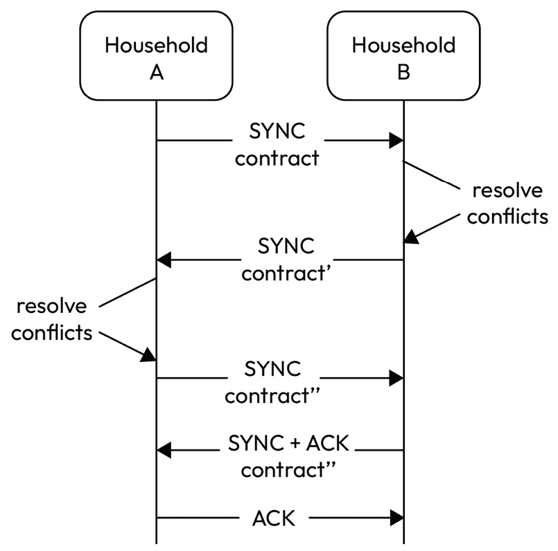
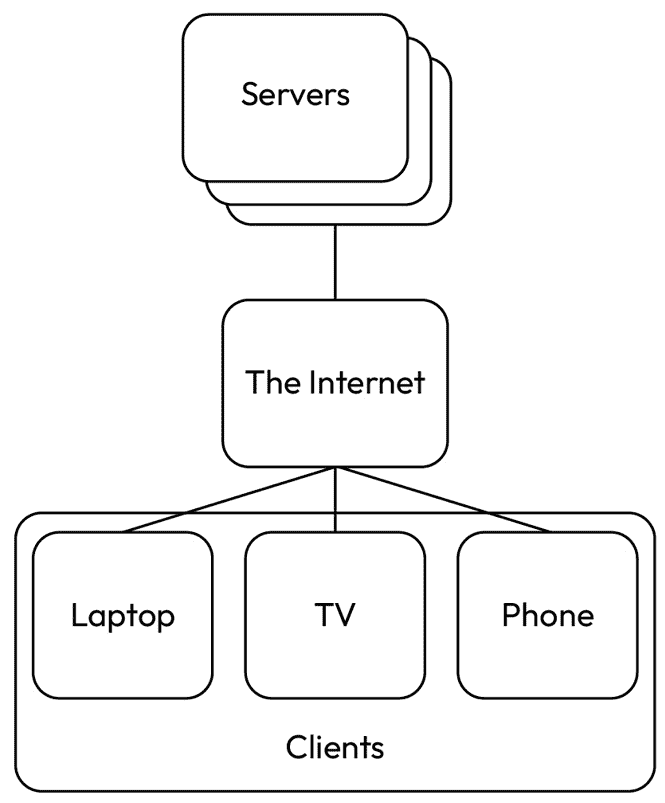
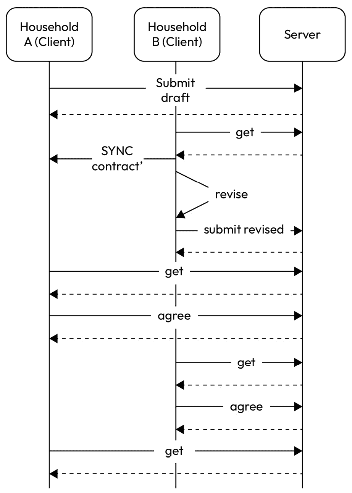
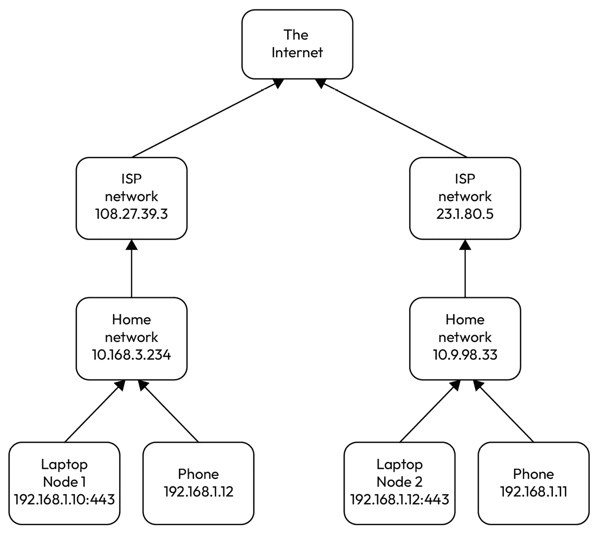
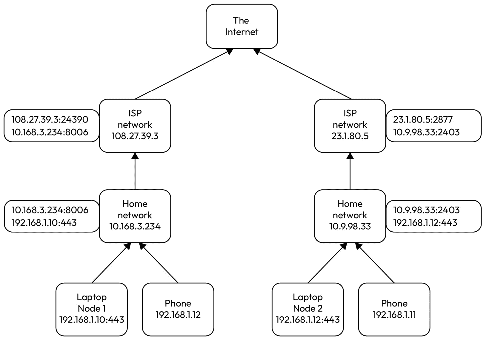
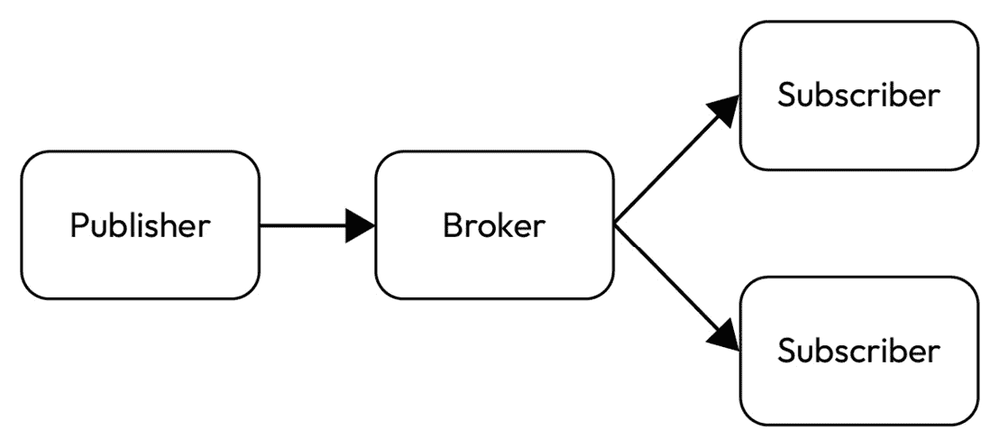
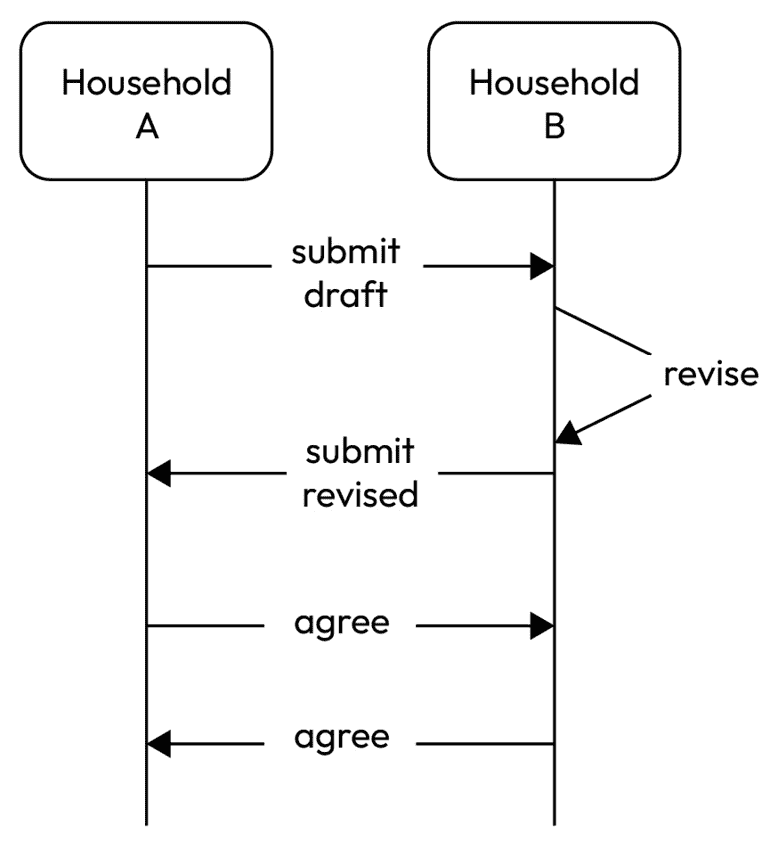
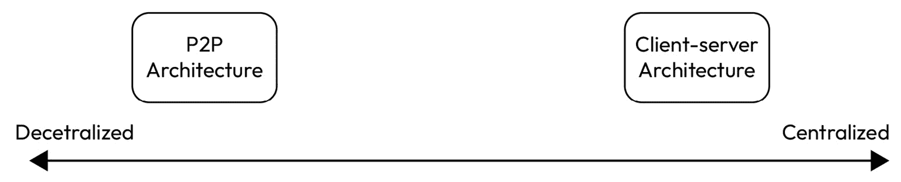

# 第四章：对等网络和客户端-服务器架构

本章探讨了两种组织和结构化通信系统的基本架构模式：**对等网络**（**P2P**）和**客户端-服务器**架构。这些架构模式对我们设计和实现各种现代网络系统的方式产生了重大影响。

本章从原理、特性和应用等方面全面介绍了 P2P 和客户端-服务器架构。之后，我们将比较并确定这两种方法之间的关键差异，并分析各自的优缺点。

我们将涵盖 P2P 和客户端-服务器架构的权衡利弊。更重要的是，我们将讨论在决定这两种模型时需要考虑的因素，包括期望的系统质量属性，如可扩展性、容错性、安全性和控制。我们还将探讨混合模型的可能性，以实现灵活性和适应性。

本章将介绍以下主题：

+   一个网络化系统的真实示例

+   客户端-服务器架构

+   P2P 架构

+   客户端-服务器架构与 P2P 架构的比较

# 技术要求

您可以在 GitHub 上找到本章使用的所有代码文件：[`github.com/PacktPublishing/Software-Architecture-with-Kotlin/tree/main/chapter-4`](https://github.com/PacktPublishing/Software-Architecture-with-Kotlin/tree/main/chapter-4)

# 一个网络化系统的真实示例

我们将使用我们在前几章中一直在使用的真实示例。村庄中的家庭相互交换服务。每个家庭都有一个独立的软件副本，用于保存交换服务的合同记录。

他们正在遭受一个持续的问题；那就是，有时两个交换服务的家庭在他们自己的软件副本中保留的合同记录之间存在差异。这导致了一些家庭之间的纠纷。

一个工程师希望通过同步两个软件副本之间的合同来消除这些纠纷。同步需要两个软件副本连接起来。同步的简化交互在*图 4**.1*中展示：



图 4.1 – 家庭间交换服务的合同同步

在图中，*家庭 A*将合同的详细信息发送给*家庭 B*。接收到的合同与*家庭 B*本地存储的合同进行比较。*家庭 B*解决发现的任何差异。然后，修改后的合同（*contract’*）被发送给*家庭 A*。*家庭 A*也对比合同并解决任何冲突。*家庭 A*将另一个修改后的合同（*contract’’*）发送给*家庭 B*。这次，*家庭 B*没有发现任何差异，因此用合同确认了*家庭 A*。*家庭 A*从*家庭 B*那里收到确认并发出最终确认，表明两个家庭已同步合同。

既然我们有一种在软件的两个副本之间同步合同的方法，我们还需要一种让它们发现彼此并通信的方法。

我们将在下一节中探讨 P2P 和客户端-服务器架构，并将它们与解决本例中问题的上下文联系起来。

# 客户端-服务器架构

客户端-服务器架构是一种组织分布式系统和计算机网络的模式。在这个架构中，客户端和服务器的作用被明确定义，每个组件至少扮演其中一个角色。

客户端是请求资源或服务的设备或组件，而服务器是处理请求或提供服务的设备或组件。互联网上的客户端-服务器架构的示例在*图 4.2*中说明：



图 4.2 – 客户端-服务器架构 (C1)

通常，客户端是面向日常用户的设备，如笔记本电脑、手机和电视。它们往往是轻量级的设备，计算能力有限，并且通常只需要在与服务器通信时可用。

服务器是专门用于处理请求的设备，通常托管在云或数据中心。它们通常具有更多的计算能力、更多的存储和更多的网络带宽，并且高度可用以服务来自客户端的请求。具有客户端-服务器架构的系统从服务器可用以服务客户端请求开始。

## 客户端与服务器之间的交互

客户端与服务器之间的交互属于请求-响应模型。客户端向服务器发送一个请求，该请求标识一个资源或指定所需服务的详细信息。服务器接收请求，验证它，处理它，并返回一个相应的响应，其中包含请求的资源或服务的结果。

注意，客户端总是发起交互，并知道如何定位服务器。相反，服务器只知道在相应请求的上下文中客户端的位置。

因此，提供的资源或服务集中在服务器上。客户端不直接与其他客户端通信。任何可能需要在客户端之间共享的资源都托管在服务器上，并可供客户端请求。

这种架构导致服务器相对于客户端具有更高的非功能性需求。我们现在将讨论服务器中的一些关键系统质量属性。

## 可用性

服务器通常需要尽可能多地保持可用状态，以便在需要时能够服务客户端的请求。通常这意味着有多个服务器实例同时运行。可能存在故障转移机制，将请求路由到可用的服务器，备份系统以恢复服务器最后已知状态，以及监控工具以主动确保服务器处于运行状态。

## 性能

服务器集中以同时为众多客户端提供服务。快速和高效对于维持服务器运行至关重要。延迟和吞吐量是性能的两个主要系统质量属性。

在客户端-服务器架构中，延迟是指从客户端发送请求到客户端接收到相应响应所经过的总时间。吞吐量是单位时间内到达服务器的请求数量。

服务器的性能取决于多个因素，例如处理能力、内存、网络带宽和磁盘 I/O。服务器中通常有多个组件有助于性能相关的系统质量属性，例如文件系统、数据库、消息中间件，甚至第三方系统。

## 可伸缩性

服务器有时需要应对客户端请求数量的增长和减少。以下是一些常见的管理方法。

可以部署负载均衡器来将客户端的请求分配到一组服务器。它跟踪每个服务器实例的健康状况和流量，以便可以将请求路由到较不繁忙的服务器，并在服务器之间实现均衡的工作负载。

服务器可以通过运行更多实例来水平扩展以分配负载，或者通过升级服务器的硬件能力来垂直扩展。

应该配置一个最小或期望运行的服务器实例数量，以便在负载不重时服务器数量可以减少。

## 安全性

请求被集中到服务器上提供服务，相应数据也集中存储在服务器上。安全性变得极为重要。至少有四个主要领域需要解决。

首先，服务器应仅处理来自可识别客户端的传入请求。客户端需要通过各种方式（如密码或多因素验证）进行身份验证。这些方法的细节将在*第十四章*中介绍。

服务器还应控制哪些请求可以被哪些客户端接受。例如，普通客户端无法访问系统设置，而管理员客户端可以。客户端通常通过服务器外部不可见的内部流程进行授权，因此客户端无法绕过检查。

请求和响应负载中的数据可能包含需要保护的个人或敏感信息。在这些情况下，客户端和服务器之间的通信可能需要在协议中实现加密。加密方法可以是个性化的，这样其他客户端就无法读取客户端的数据。

服务器还需要对常见的恶意攻击有基本的防御措施，例如，**拒绝服务**（**DOS**）、**跨站脚本**（**XSS**）和**中间人攻击**（**MitM**）。

## 服务器发现

客户端需要定位一个可用的服务器来发送它们的请求。存在几种常见的发现机制：

1.  静态和硬编码的地址作为客户端配置。

1.  **域名系统**（**DNS**），它将服务器 IP 地址转换为人类可读的域名。

1.  动态 DNS 服务，动态更改服务器地址。

1.  服务注册服务，允许客户端查询要连接的适当服务器。

1.  负载均衡器，将客户端请求分配到一组可用的服务器。

1.  服务网格，它通过专用基础设施层抽象化服务发现、负载均衡和其他网络问题。

## 常见的客户端-服务器架构

存在许多处理客户端和服务器之间通信的架构风格变体：

1.  `GET`、`POST`、`PATCH`和`DELETE`。

1.  在使用 GET 和 POST HTTP 方法时，主要使用`/place`或`/update`。

1.  **作为异步消息**：在这种架构中，客户端和服务器不直接相互联系。相反，它们通过消息基础设施作为队列和主题进行通信。

1.  **作为双向专用连接**：客户端和服务器在**传输控制协议**（**TCP**）连接上打开专用通道进行通信。这种通信方式通常出现在需要较低延迟和频繁消息的系统。

## 客户端-服务器解决方案

我们将应用客户端-服务器架构来解决两个家庭之间服务合同同步的现实生活示例。建议在编码之前制定客户端和服务器之间的交互。让我们假设 HTTP 作为通信协议。

在此解决方案中，我们将使用 REST 架构。我们需要定义服务器提供的端点，以便客户端可以使用这些端点来促进必要的通信。

### 第 1 步 - 定义客户端-服务器通信

让我们通过一个客户端-服务器通信的示例场景来说明：



图 4.3 - 服务合同同步的示例客户端-服务器交互

以下是在客户端和服务器之间发送的消息：

1.  *家庭 A* 向服务器提交服务合同的草稿。

1.  *家庭 B* 从服务器获取由 *家庭 A* 起草的服务合同。

1.  *家庭 B* 修订服务合同并将其提交给服务器。

1.  *家庭 A* 从服务器获取由 *家庭 B* 修订的服务合同。

1.  *家庭 A* 向服务器确认它同意服务合同。

1.  *家庭 B* 从服务器获取由 *家庭 A* 同意的服务合同。

1.  *家庭 B* 向服务器确认它同意服务合同。

1.  *家庭 A* 从服务器获取两个家庭都同意的服务合同。

从这些消息中，我们可以定义一些 HTTP 端点供客户端调用：

+   `PUT /contracts/{id}`: 提交草稿或修订后的服务合同

+   `GET /contracts/{id}`: 获取服务合同

+   `PATCH /contracts/{id}/agreedAt`: 确认同意服务合同

在这里，`{id}` 是作为服务合同的资源唯一标识符。

### 第 2 步 - 定义消息负载

用于 `PUT` 和 `GET` 端点的消息负载需要定义。服务合同本身是资源，因此其模型是负载。`PATCH` 端点不需要返回负载。负载将使用 **OpenAPI 3.0** 模型定义，如下所示：

```kt
    Party:
      type: object
      properties:
        householdName:
          type: string
        service:
          type: string
        agreedAt:
          type: string
          format: date-time
    ServiceContract:
      type: object
      properties:
        id:
          type: integer
          format: int32
        partyA:
          $ref: '#/components/schemas/Party'
        partyB:
          $ref: '#/components/schemas/Party'
```

为了简化起见，`ServiceContract` 类由一个整数 ID 和两个当事人定义。每个当事人都有家庭名称、提供的服务以及家庭同意服务合同的可选时间。

### 第 3 步 - 定义 API 规范

尽管在第 1 步中已识别了三个 HTTP 端点，但有必要深入了解每个端点并将它们定义为 API 规范。

假设只有服务合同中的两个家庭可以看到服务合同。这意味着我们需要某些方式来验证和授权 `GET` 端点。在这个例子中，我们强制执行 `GET` 请求应包含一个标题来指定哪个家庭请求。在生产系统中，它应该使用更安全的方法，例如由受信任的 **身份和访问管理**（**IAM**）系统签发的 **JSON Web Token**（**JWT**），解码的令牌包含会揭示家庭名称的声明。

因此，`GET` 端点有两个输入参数，如下所述的 OpenAPI 3.0 模型中：

```kt
      parameters:
        - in: path
          name: id
          required: true
          schema:
            type: integer
        - in: header
          name: household
          required: true
          schema:
            type: string
```

第一个输入参数是服务合同的标识符，显示在 URI 路径中。第二个输入参数是家庭名称，位于标题中。

对于响应，我们需要考虑成功和失败的情况。可能的输出应该作为 HTTP 状态码在响应中捕获，并在以下所示的 OpenAPI 3.0 模型中记录：

```kt
      responses:
        '200':
          description: Successful operation
          content:
            application/json:
              schema:
                $ref: '#/components/schemas/ServiceContract'
        '400':
          description: Failed request validation
        '403':
          description: Not authorized
        '404':
         description: Service contract not found
```

请求可能是有效的，并且服务合同存在，因此返回 HTTP 状态码 `200`（OK）和服务合同负载。请求可能是由服务合同中未提及的家庭发起的，因此未获授权，并返回 HTTP 状态码 403（禁止）。或者，给定的 ID 的服务合同根本不存在，并返回 HTTP 状态码 `404`（未找到）。

`PUT` 端点使用与 `GET` 端点相同的 URI 路径变量和头值，此外还有一个请求体，即服务合同本身：

```kt
      requestBody:
        description: The service contract to be created or updated
        content:
          application/json:
            schema:
              $ref: '#/components/schemas/ServiceContract'
        required: true
```

请求体是 `ServiceContract` 组件本身，因此模式引用了组件的规范。

`PUT` 端点的响应与 `GET` 端点大不相同。所有不同的场景都通过响应中的 HTTP 状态码捕获：

```kt
      responses:
        '200':
          description: Service contract updated
          content:
            application/json:
              schema:
                $ref: '#/components/schemas/ServiceContract'
        '201':
          description: Service contract created
          content:
            application/json:
              schema:
                $ref: '#/components/schemas/ServiceContract'
        '400':
          description: Failed request validation
        '403':
          description: Not authorized
```

首先，请求负载中的服务合同可能使用了双方相同的家庭名称，因此它无效，并返回 HTTP 状态码 `400`（错误请求）。此外，如果头部的家庭名称在服务合同的当事人部分中未出现，则它未获授权，并返回 HTTP 状态码 `403`（禁止）。如果请求有效，有两种结果。如果在服务器中创建新的服务合同，则返回 HTTP 状态码 `201`（已创建），并将服务合同作为负载。如果更新现有的服务合同，则返回 HTTP 状态码 `200`（OK），并附带服务合同作为负载。

最终端点，即 `PATCH` 端点，很简单。它使用与 `GET` 端点完全相同的输入参数集，因为没有必要请求体，请求只需识别现有的服务合同。所有响应都在此指定：

```kt
      responses:
        '204':
          description: Agreed service contract
        '400':
          description: Failed request validation
        '403':
          description: Not authorized
        '404':
          description: Service contract not found
```

`PATCH` 端点响应中的失败结果与 `GET` 端点相同，在识别现有服务合同方面。但 `PATCH` 端点的成功结果与其他两个端点不同，因为它没有请求体，因此返回 HTTP 状态码 `204`（无内容）。

### 第 4 步 – 服务器开发

现在我们有了 API 规范，我们准备开发服务器端点。相应的实体需要在 Kotlin 中定义：

```kt
data class ServiceContract(
    val id: Int,
    val partyA: Party,
    val partyB: Party,
)
data class Party(
    val householdName: String,
    val service: String,
    val agreedAt: Instant? = null,
)
```

注意，这与 OpenAPI 3.0 组件定义在语义上是等效的。

建议使用高度可用的存储系统来永久保存服务合同，例如，数据库。然而，在这个例子中，我们简化了存储库，将服务合同保存在内存中：

```kt
val contracts = ConcurrentHashMap<Int, ServiceContract>()
```

这个线程安全的内存映射使用服务合同的整数 ID 作为键，`ServiceContract` 对象作为值。

在这个例子中，**http4k**因其代码体积小而被用作服务器框架。我们需要设置读取和写入不同值的方法。这是通过声明几个**http4k Lenses**来验证和将有效负载转换为类型安全结构来实现的：

```kt
val serviceContractLens = Body.auto<ServiceContract>().toLens()
val householdHeader = Header.required("household")
```

在这里，我们将`ServiceContract`对象的 Lens 作为主体，家庭名称在头部。它们将在实际的端点实现中使用。

http4k 通过简单地使用`route()`函数声明一个`HTTPHandler`来配置端点路由：

```kt
val app: HttpHandler =
    routes(
...
)
```

在`route()`函数内部，声明了一个端点列表，并定义了实现的细节。以下是对`GET`端点的实现细节：

```kt
"/contracts/{id}" bind GET to { request ->
    val household = householdHeader(request)
    val id = request.path("id")?.toInt()
    val contract = id?.let { contracts[it] }
    if (contract == null) {
        Response(NOT_FOUND).body("Service contract of ID $id not found")
    } else if (contract.partyA.householdName != household && contract.partyB.householdName != household) {
        Response(FORBIDDEN).body("Household $household is not allowed to see the service contract of ID $id")
    } else {
        Response(OK).with(serviceContractLens of contract)
    }
}
```

此实现定义了`GET /contracts/{id}`的路由 URI。然后，它使用之前定义的 http4k Lens 从头部读取家庭名称。服务合同 ID 也从路径变量中读取。

然后尝试从之前定义的内存映射中获取`ServiceContract`对象。如果对象未找到，则返回 HTTP 状态`404`（未找到）。如果找到服务合同，但头部中的家庭名称不是服务合同任一方的，则返回 HTTP 状态`403`（禁止）。否则，一切正常，并返回 HTTP 状态`200`（OK），响应体由之前定义的 http4k Lens 转换自`ServiceContract`对象。

`PUT`端点也是类似定义的：

```kt
"/contracts/{id}" bind PUT to { request ->
    val household = householdHeader(request)
    val lens = Body.auto<ServiceContract>().toLens()
    val id = request.path("id")?.toInt()
    val contract = lens(request)°
    if (id == null || id != contract.id) {
        Response(BAD_REQUEST).body("Service contract ID in the payload and the URI path do not match")
    } else if (contract.partyA.householdName == contract.partyB.householdName) {
        Response(BAD_REQUEST).body("Service contract must have two different household: $household")
    } else if (contract.partyA.householdName != household && contract.partyB.householdName != household) {
        Response(FORBIDDEN).body("Household $household is not allowed to update the service contract of ID $id")
    } else {
        val previous = contracts.put(contract.id, contract)
        val status = if (previous == null) CREATED else OK
        Response(status).with(serviceContractLens of contract)
    }
}
```

然而，`PUT`端点使用 http4k Lens 将请求体转换为`ServiceContract`对象。

从 URI 路径变量中读取的服务合同 ID 与`ServiceContract`对象进行核对，以确保 ID 与对象内部的`id`字段相同。此外，还有一个验证确保`ServiceContract`对象中每一方的家庭名称是不同的。任何验证失败都会导致返回 HTTP 状态码`400`（错误请求）。

与`GET`端点一样，有一个检查确保头部中的家庭名称与`ServiceContract`对象中的任一方匹配；否则，返回 HTTP 状态码`403`（禁止）。

之后，将`ServiceContract`对象放入内存映射中。`put`函数返回与键关联的先前值。如果先前值为`null`，则返回 HTTP 状态`201`（已创建）；否则，返回 HTTP 状态`200`（OK）。两种情况都带有之前定义的 http4k Lens 转换自`ServiceContract`对象的响应体。

最后一个端点`PATCH`与第一个半部分的`GET`端点实现非常相似。读取相同的输入参数，服务器尝试从内存映射中获取`ServiceContract`对象。实现的第一部分以必要的验证结束：

```kt
"/contracts/{id}/agreedAt" bind PATCH to { request ->
    val household = householdHeader(request)
    val id = request.path("id")?.toInt()
    val contract = id?.let { contracts[id] }
    if (contract == null) {
        Response(NOT_FOUND).body("Service contract of ID $id not found")
    } else if (contract.partyA.householdName != household && contract.partyB.householdName != household) {
        Response(FORBIDDEN).body("Household $household is not allowed to see the service contract of ID $id")
```

在验证请求后，找到同意合同的家庭。为合同的有关方设置`agreedAt`时间戳。此外，修订后的合同被放入之前声明的共享`ConcurrentHashMap`中：

```kt
    } else {
        val now = Instant.now()
        val revisedContract =
            if (contract.partyA.householdName == household) {
                contract.copy(partyA = contract.partyA.copy(agreedAt = now))
            } else {
                contract.copy(partyB = contract.partyB.copy(agreedAt = now))
            }
        contracts[contract.id] = revisedContract
        Response(NO_CONTENT).with(serviceContractLens of contract)
    }
}
```

实现的第二部分专注于将`agreedAt`时间戳添加到`ServiceContract`对象的正确方。由于验证已经通过以确保家庭是两个之一，服务器确定它是哪一个，并使用`copy`函数创建原始`ServiceContract`对象的一个变体，将`agreedAt`时间戳设置为当前时间戳。然后更新内存中的值。随后返回 HTTP 状态码`204`（无内容）。

最后，是`main`函数：

```kt
fun main() {
    val printingApp: HttpHandler = PrintRequest().then(app)
    val server = printingApp.asServer(Undertow(9000)).start()
}
```

`main`函数启动服务器并开始监听端口`9000`上传入的请求。

### 第 5 步 – 客户端开发

如前所述，客户端总是首先与服务器进行交互。因此，本例中的客户端实现反映了图 4**.3**中的顺序图中的客户端-服务器交互。出于简化原因，我们在这个例子中使用`main`函数来模拟两个家庭。我们首先创建一个使用**OKHTTP**的 HTTP 客户端：

```kt
val client: HttpHandler = OkHttp()
val printingClient: HttpHandler = PrintResponse().then(client)
```

然后，由*家庭 A*起草的初始服务合同被创建：

```kt
val initialContractDraftedByHouseholdA =
    ServiceContract(
        id = 1,
        partyA = Party("A", "Plumbing"),
        partyB = Party("B", "Cleaning"),
    )
printingClient(
    Request(PUT, "http://localhost:9000/contracts/1").with(
        householdHeader of "A",
        Body.json().toLens() of
            initialContractDraftedByHouseholdA.asJsonObject(),
    ),
)
```

然后，通过调用`PUT`端点将初始服务合同提交给服务器。随后，*家庭 B*通过调用`GET`端点接收初始服务合同：

```kt
val contractReceivedByB =
    serviceContractLens(
        printingClient(
            Request(GET, "http://localhost:9000/contracts/1").with(householdHeader of "B"),
        ),
    )
val contractRevisedByB =
    contractReceivedByB.copy(
        partyB = contractReceivedByB.partyB.copy(service = "Babysitting"),
    )
printingClient(
    Request(PUT, "http://localhost:9000/contracts/1").with(
        householdHeader of "B",
        Body.json().toLens() of
            contractRevisedByB.asJsonObject(),
    ),
)
```

*家庭 B*通过调用`PUT`端点来修订合同，并将修订后的合同提交给服务器。然后，*家庭 A*通过调用`GET`端点接收修订后的合同：

```kt
val contractReceivedByA =
    serviceContractLens(
        printingClient(
            Request(GET, "http://localhost:9000/contracts/1").with(householdHeader of "A"),
        ),
    )
printingClient(Request(PATCH, "http://localhost:9000/contracts/1/agreedAt").with(householdHeader of "A"))
```

*家庭 A*对修订后的合同感到满意。*家庭 A*通过调用`PATCH`端点通过服务器确认其对服务合同的同意。现在轮到*家庭 B*接收并确认服务合同：

```kt
val revisedContractReceivedByB =
    serviceContractLens(
        printingClient(
            Request(GET, "http://localhost:9000/contracts/1").with(householdHeader of "B"),
        ),
    )
if (revisedContractReceivedByB.partyA.agreedAt != null) {
    printingClient(Request(PATCH, "http://localhost:9000/contracts/1/agreedAt").with(householdHeader of "B"))
}
```

*家庭 B*看到*家庭 A*同意了服务合同。然后，*家庭 B*也通过调用`PUT`端点通过服务器确认其对服务合同的同意。最后，它回到*家庭 A*接收双方同意的服务合同：

```kt
val contractAgreedByBoth =
    serviceContractLens(
        printingClient(
            Request(GET, "http://localhost:9000/contracts/1").with(householdHeader of "A"),
        ),
    )
```

本例中的客户端-服务交互已经结束。*家庭 A*和*家庭 B*之间的服务合同已经相互同意并同步。

在整个示例实现过程中，我们展示了如何使用客户端-服务器架构来解决服务合同同步问题中客户端和服务器角色的划分。

## 哪些系统使用客户端-服务器架构？

客户端-服务器架构在许多系统中被广泛使用。以下是一些例子：

+   **B2C 系统**：大多数**企业对消费者**（**B2C**）系统使用客户端-服务器架构，其中客户端要么是网页浏览器，要么是移动应用程序。客户端只保存很少的数据，只有关于用户的数据。同时，服务器保存了所有客户端的大部分数据。

+   **B2B 系统**：大多数**企业对企业**（**B2B**）系统使用客户端-服务器架构，其中一家公司的业务系统的一部分充当客户端，连接到另一家公司的业务系统的服务器。这些系统由于客户端和服务器之间的通信而共享一些数据。

+   **在线游戏**：许多在线游戏使用客户端-服务器架构来维护多个玩家之间的游戏共享状态。游戏客户端在玩家的设备上运行，并与游戏服务器通信以同步状态并与其他玩家互动。

+   **金融服务系统**：金融服务受到各种机构的严格监管，对数据的存储和分发有严格的规则。客户端-服务器架构可以将不必要的数据与客户端隔离开来，让服务器保存敏感数据并遵守监管和审计控制。

+   **即时通讯、聊天和电子邮件系统**：流行的消息平台，如 Slack、WhatsApp、Discord 和 Microsoft Outlook，都使用客户端-服务器架构。客户端连接到服务器以向其他客户端发送和接收消息，向一组客户端广播消息，共享文件，并参与实时聊天。

接下来，我们将探讨另一种选择，即对等网络架构，以及如何以不同的方式解决家庭及其服务合同的问题。

# 对等网络架构

对等网络架构基于没有中央权威机构进行协调的理念。一个对等网络由许多节点（“对等点”）组成，这些节点在相互通信中具有平等的角色。

每个节点可以从其他节点请求资源或服务，同时也可以向其他节点提供资源或服务。这种对等网络的分布式特性使得参与者之间能够有效地共享资源和协作。

来自对等网络架构的每个节点在计算能力、存储和网络带宽方面没有硬性非功能性要求。然而，一致性是许多对等网络系统中的一个主要非功能性关注点。

## 一致性

在对等网络系统中没有中央权威机构或服务器控制数据。每个节点存储和管理自己的数据，节点之间直接通信以共享和同步信息。这种对等网络的分布式特性带来了几个一致性挑战：

+   **数据复制和并发控制**：在 P2P 系统中，一个节点通常会在多个节点上复制其数据以提高可用性和容错性。如果数据在多个节点上同时修改，这种复制可能导致不一致。及时将更新传播到所有相关节点至关重要。

    此外，如果多个节点同时更新相同的数据，将存在关于哪个更新应该发生的冲突。实施有效的并发控制机制，如锁定、版本控制或冲突解决策略，对于维护数据一致性是必要的。

+   **最终一致性**：在节点分布广泛的分布式网络中，可能会出现延迟和分区，这使得实现强一致性变得困难。相反，**对等网络**（**P2P**）系统侧重于最终一致性，这意味着经过一段时间后，即使在网络中断或节点故障的情况下，最终也会达到一致状态。

+   **因果一致性**：另一种一致性选项是因果一致性，其中相关事件以相同的顺序被所有节点接收，而不相关的事件可以以任何顺序接收。

+   **共识和法定人数**：在某些 P2P 系统中，在更改被接受之前，所有节点必须达到特定状态或被更新。这被称为共识方法。另一种基于法定人数的方法只需要大多数节点的同意。这两种方法都有助于维护一定水平的一致性，但引入了额外的协调和通信开销。

+   **Merkle 树和哈希**：Merkle 树或基于哈希的方法可以用于高效地检测和解决分布式数据中的不一致性，使节点能够快速识别并同步其数据。这些方法在区块链网络等去中心化系统中被广泛使用。

## 引导和节点发现

P2P 网络从第一个可用的节点开始，然后其他节点加入。这个过程称为**引导**。在新的节点加入现有的 P2P 网络之前，新节点必须以某种方式发现网络中的至少一个其他节点。我们现在将介绍几种节点发现机制。

### 静态

发现节点最基本的方式是每个节点在其静态配置中都有所有其他节点的地址。这种方法的明显局限性是可以配置的节点数量。可以通过**中继服务器**、**网络地址转换**（**NAT**）和**打孔**等技术克服 IP 地址的限制。这是关于存储和内存限制，以在每个节点中存储所有节点的地址。 

具有静态节点发现的 P2P 网络可以通过尝试从静态配置连接每个节点来进行引导。

### 集中式目录

与去中心化的概念相反，一些 P2P 网络有一个集中的目录，维护网络中活动节点的列表。这意味着网络从集中的目录可用开始。当一个节点加入网络时，它在目录中列出自己为可用。此外，每个节点都可以从集中的目录中获取可用节点的列表。

集中的目录属于服务器类别，它需要与其他节点非常不同的系统质量属性。例如，集中的目录必须高度可用；否则，它不能接受新节点或提供可用节点列表。

### 多播或广播

在一个私有或**局域网**（**LAN**）中，可以通过每个节点向所有其他节点发送广播或多播消息来建立 P2P 网络。几台节点可以决定响应，原始节点能够发现它们。网络在第一次发现节点时启动。这种发现机制仅适用于节点数量有限的网络。

多播网络通常使用**用户数据报协议**（**UDP**）作为传输协议。这通常配置在指定的子网中，以避免广播洪水并限制安全风险。

### Kademlia

**Kademlia** 是 P2P 网络中使用的网络结构和消息协议的规范。在网络的多个节点之间出现了一个**分布式哈希表**（**DHT**）。网络通常使用多播 UDP 作为传输协议。

每个节点都有一个节点 ID，这通常是一个未签名的大的随机整数。节点 ID 前缀用于使用通用哈希函数计算哈希值。哈希值对应于哈希表中的一个桶，这就是每个节点如何在本地哈希表中维护其他节点的 ID 并将其用作路由表的方式。

当一个节点加入网络时，它会向网络中的所有节点广播其节点 ID。然后，其他节点在它们的路由表中找到一个桶来保存新节点的 ID。

相邻的节点 ID 也有相邻的桶。通过**异或**（**XOR**）函数计算的两个节点 ID 之间的“距离”用于节点发现。当一个节点想要在网络中查找另一个节点时，它从最接近其节点 ID 的桶开始，通过遍历桶（从最近到最远）迭代地找到一个响应的节点。

### 与其他节点交换信息

节点之间也可以共享它们自己的节点。节点之间的交换有一些变化。

如果 P2P 网络有一个已知的结构，例如 DHT，节点可以使用某种协议爬取结构，以查询其他节点的信息。缺点是，新加入的节点仍然需要另一种机制来获取初始节点列表。

新加入的节点也可以联系几个引导节点，以查询有关其他节点的信息。然而，这确实依赖于知名引导节点的可用性。

节点之间也可以采用 gossip 协议，定期与几个随机邻居节点共享信息。信息应该像八卦或流行病一样集体传播，尽管它需要一些时间才能显现。该协议从小型到大型网络都具有良好的可扩展性。它也是容错的，这意味着如果邻居节点失败，其他邻居节点仍然能够提供替代信息。

## 节点间的通信

一旦节点了解如何联系网络中的其他节点，它就可以开始通信。

### 直接使用 IP 地址进行通信

两个节点之间最基本的通信形式是使用 IP 地址让一个节点直接联系另一个节点。这种方法通常用于小型网络或局域网。网络中的节点使用 TCP 等传输协议来发送更可靠和有序的消息，或者使用 UDP 来发送更快但无序的消息。

### 穿孔打孔

对于一个本地网络下的节点要连接到另一个本地网络下的节点，这些节点无法使用 IP 地址进行直接通信。让我们考虑以下示例网络拓扑的情况。参见*图 4.4*：



图 4.4 – 带有家庭网络的示例网络拓扑

*节点 1*没有直接通过互联网与*节点 2*通信的方法，因为这两个节点都位于它们自己的家庭网络后面。然而，如果家庭网络和**互联网服务提供商**（**ISP**）网络支持 NAT，那么可以使用**穿孔打孔**技术允许*节点 1*通过这种中继机制间接与*节点 2*通信。

NAT 是一种将本地网络地址转换为公共和全球 IP 地址的机制。因此，*节点 1*和*节点 2*都有自己的全球 IP 地址，并且它们可以相互通信。这在本图中有说明：



图 4.5 – 带有家庭网络和 NAT 的示例网络拓扑

*节点 1*已打开其端口`443`以接收消息，并且可以通过其家庭网络下的私有 IP 地址`192.168.1.10`进行定位。其家庭网络将`192.168.1.10:443`（作为内部地址）映射到`10.168.3.234:80006`（作为外部地址）。然后，ISP 网络也将内部地址`10.168.3.234:80006`映射到全球地址`108.27.39.3:24390`。*节点 2*具有类似的 NAT 映射路径，但其全球地址是`23.1.80.0:2877`。

从这个点开始，我们可以逐步开始打孔，并假设 *节点 1* 已经发现了 *节点 2* 的全局地址。首先，*节点 1* 使用源本地地址 (*节点 1*) 和目标全局地址 (*节点 2*) 与其家庭网络进行联系。然后，家庭网络中继此信息，并类似地联系其 ISP 网络。

然后，*节点 1* 所在的 ISP 网络使用全局地址联系另一个 *节点 2* 所在的 ISP 网络。

*节点 2* 所在的 ISP 网络使用转换后的地址与目标本地家庭网络进行联系。然后，家庭网络使用转换后的地址与家庭网络中的目标 *节点 2* 进行联系。

NATs 在各自的表中临时打上 *孔洞*，以便将内部和外部地址进行转换。因此，*节点 A* 和 *节点 B* 可以与多个网络以及中间的 NATs 建立通信，以中继消息。

注意，如果防火墙是无状态的，那么防火墙后面的打孔就不会起作用。无状态防火墙不跟踪连接，也不记得地址的转换。

### 发布-订阅

**发布-订阅** 是 P2P 通信的另一种模型，其中不需要节点发现。相反，节点将消息发布到感兴趣的特定主题，订阅了这些主题的其他节点将接收到这些消息。如果消息通过代理传递，则节点仍然需要知道代理的地址来发布和接收消息。发布-订阅消除了节点发现的需求，并有效地将信息传播给相关接收者。

一个带有代理的发布-订阅架构示例显示在 *图 4**.6*：



图 4.6 – 发布-订阅架构

发布者不知道订阅者。它知道代理的地址以及消息应该发布的主题。订阅者将它们对某些主题的兴趣注册到代理，并接收与主题相关的消息。

代理是一种基础设施中间件，它从发布者那里接收消息。它存储消息并管理订阅者的订阅。最重要的是，它根据订阅者注册的兴趣将消息路由到适当的订阅者。

现在，我们将深入探讨 P2P 解决方案的实施。

## P2P 解决方案

我们将应用 P2P 架构来解决两个家庭之间服务合同同步的实际情况。为了简化，让我们假设这两个家庭已经发现彼此，并且它们的设备运行在同一个本地网络中。

### 步骤 1 – 定义 P2P 通信

我们将在编码之前制定节点之间的交互。让我们假设使用 UDP 作为通信协议。节点直接使用 IP 地址和端口相互通信。参见 *图 4**.7*：



图 4.7 – 示例 P2P 交互服务合同同步

以下是在 *家庭 A* 和 *家庭 B* 的节点之间发送的消息，如 *图 4.7* 所述：

1.  *家庭 A* 向 *家庭 B* 提交一份服务合同的草案。

1.  *家庭 B* 修改服务合同并将其提交给 *家庭 A*。

1.  *家庭 A* 向 *家庭 B* 确认它同意服务合同。

1.  *家庭 B* 向 *家庭 A* 确认它同意服务合同。

在定义了通信协议之后，下一步应该定义消息的负载。

### 第 2 步 – 定义消息负载

从之前定义的通信中，唯一传递的消息就是服务合同本身。服务合同的模式保持不变：

```kt
data class ServiceContract(
    val id: Int,
    val partyA: Party,
    val partyB: Party,
)
data class Party(
    val householdName: String,
    val service: String,
    val agreedAt: Instant? = null,
)
```

在这个例子中，我们将 `ServiceContract` 类外部化为一个字节数组，以便通过网络发送。

### 第 3 步 – 同伴开发

让我们从为节点使用 UDP 进行通信构建一些必要的传输函数开始。由于一个节点可以产生和消费消息，因此定义一个通用的 UDP 节点类如下似乎是合理的：

```kt
class UdpNode<T>(
    val address: SocketAddress,
    val convertor: DtoConvertor<T>,
    val transformer: (T) -> T?,
) {
    private val inbound: ByteBuffer = convertor.allocate()
    private val outbound: ByteBuffer = convertor.allocate()
    private var channel: DatagramChannel? = null
```

`UdpNode` 类使用 **非阻塞输入/输出**（**NIO**）包来支持三个主要功能：

+   启动节点

+   向目标节点发送消息

+   接收来自另一个节点的消息

在支持这些功能的同时，`UdpNode` 类只有在传输机制需要更改时才应进行更改，使其仅具有处理传输层面问题的单一职责，并符合 **单一职责原则**。

因此，`ServiceContract` 类的序列化和反序列化委托给具有泛型类型 `T` 的 `DtoConvertor` 接口，这样 `UdpNode` 类就不与 `ServiceContract` 类耦合。

处理和响应 `ServiceContract` 对象是应用层面的关注点，并且这个关注点由构造函数委托给转换器 lambda。

`UdpNode` 类的 `start` 函数很简单。它将节点绑定到配置的地址，并使其准备好消费消息：

```kt
    fun start() {
        channel =
            DatagramChannel.open()
                .bind(address)
     }
```

`produce` 函数在调用 `DtoConvertor` 写入之前清除输出缓冲区。然后，将缓冲区发送到通道：

```kt
    fun produce(
        payload: T,
        target: SocketAddress,
    ): Int {
        outbound.clear()
        convertor.toBuffer(payload, outbound)
        outbound.flip()
        return channel!!.send(outbound, target)
    }
```

`consume` 函数首先清除输入缓冲区，然后通道接收字节数组并将其写入缓冲区。然后，调用 `DtoConvertor` 将字节数组转换为 `ServiceContract` 对象：

```kt
    fun consume(): Int {
        return channel?.let { c ->
            inbound.clear()
            val address: SocketAddress = c.receive(inbound)
            inbound.rewind()
            val received = convertor.fromBuffer(inbound)
            transformer(received)?.let { transformed ->
                produce(transformed, address)
            }
        } ?: 0
    }
}
```

调用转换器 lambda 函数来确定对 `ServiceContract` 对象的响应。如果响应是 `null`，则不执行任何操作。如果响应是另一个 `ServiceContract` 对象，则调用 `produce` 函数将响应发送回发送原始消息的节点。

在这个例子中，另一个重要的类是`DtoConvertor`。它被设计成通用的，用于封装泛型类型`E`到字节数组的序列化和反序列化。只有三个函数：

```kt
interface DtoConvertor<E> {
    fun allocate(): ByteBuffer
    fun toBuffer(dto: E, buffer: ByteBuffer)
    fun fromBuffer(buffer: ByteBuffer): E
}
```

`allocate`函数创建一个足够大的`ByteBuffer`以容纳指定的类型。`toBuffer`函数将一个`E`写入`ByteBuffer`，而`fromBuffer`函数从`ByteBuffer`中读取类型为`E`的 DTO。

声明了一个 Kotlin 单例`ServiceContractConvertor`，以实现`DtoConvertor`接口，并具有`ServiceContract`类型：

```kt
object ServiceContractConvertor : DtoConvertor<ServiceContract> {
    override fun allocate(): ByteBuffer {
        return ByteBuffer.allocate(1024)
    }
```

`toBuffer`函数按照一定的顺序将`ServiceContract`对象中的每个字段写入：

```kt
    override fun toBuffer(dto: ServiceContract, buffer: ByteBuffer) { buffer.putInt(dto.id).putParty(dto.partyA).putParty(dto.partyB)
    }
    private fun ByteBuffer.putParty(dto: Party): ByteBuffer = putString(dto.householdName).putString(dto.service).putInstant(dto.agreedAt)
    private fun ByteBuffer.putInstant(dto: Instant?): ByteBuffer =
        if (dto == null) {
            putChar(ABSENT)
        } else {
            putChar(PRESENT).putLong(dto.epochSecond)
        }
    private fun ByteBuffer.putString(dto: String): ByteBuffer = putInt(dto.length).put(dto.toByteArray())
```

`fromBuffer`函数按照相同的顺序从`ByteBuffer`中读取`ServiceContract`对象的每个字段，并返回该对象：

```kt
    override fun fromBuffer(buffer: ByteBuffer): ServiceContract = ServiceContract(buffer.getInt(), buffer.getParty(), buffer.getParty())
    private fun ByteBuffer.getParty(): Party = Party(getString(), getString(), getInstant())
    private fun ByteBuffer.getInstant(): Instant? =
        if (getChar() == PRESENT) {
            Instant.ofEpochSecond(getLong())
        } else {
            null
        }
    private fun ByteBuffer.getString(): String {
        val bytes = ByteArray(getInt())
        get(bytes)
        return String(bytes)
    }
```

最后，有两个`main`函数，一个用于*家庭 A*，一个用于*家庭 B*，以表示它们如何协商服务合同。

*家庭 A*的行为定义在下面的代码块中，然后节点开始监听：

```kt
fun main() {
    val node =
        UdpNode(
            InetSocketAddress(HOST_A, PORT_A),
            ServiceContractConvertor,
        ) { it.receivedByHouseholdA() }
    node.start()
```

*家庭 A*在以下情况下不会对`ServiceContract`对象做出响应：

1.  双方都出现了相同的家庭名称，因为它是不合法的

1.  两个家庭都已经同意了合同

1.  *家庭 A*不参与任何一方

否则，*家庭 A*同意`ServiceContract`：

```kt
    val contract =
        ServiceContract(
            id = 1,
            partyA = Party(HOUSEHOLD_A, PLUMBING, null),
            partyB = Party(HOUSEHOLD_B, CLEANING, null),
        )
    node.produce(contract, InetSocketAddress(HOST_B, PORT_B))
    println("Submitted service contract: ${contract.id}")
    loopForever(1000) { node.consume() }
}
private fun ServiceContract.receivedByHouseholdA() =
    if (bothPartiesHaveDifferentNames().not() ||
        partyAgreed(HOUSEHOLD_A) ||
        isHouseholdInvolved(HOUSEHOLD_A).not()
    ) {
        println("No response to service contract: $this")
        null
    } else {
        println("Agreed to service contract: $id")
        agree(HOUSEHOLD_A) { Instant.now() }
    }
```

然后，*家庭 A*将草案合同发送给*家庭 B*。最后，*家庭 A*进入一个无限循环以尝试消费任何进一步的消息。

另一方面，*家庭 B*的行为定义在另一个`main`函数中，然后它开始监听：

```kt
fun main() {
    val node =
        UdpNode(
            InetSocketAddress(HOST_B, PORT_B),
            ServiceContractConvertor,
        ) { it.receivedByHouseholdB() }
    node.start()
    loopForever(1000) { node.consume() }
}
fun ServiceContract.receivedByHouseholdB() =
    if (bothPartiesHaveDifferentNames().not() ||
        partyAgreed(HOUSEHOLD_B) ||
        isHouseholdInvolved(HOUSEHOLD_B).not()
    ) {
        println("No response to service contract: ${this}")
        null
    } else if (serviceReceivedBy(HOUSEHOLD_B) == CLEANING) {
        println("Submitted revised service contract: $id")
        withReceivedService(HOUSEHOLD_B, BABYSITTING)
    } else if (serviceReceivedBy(HOUSEHOLD_B) == BABYSITTING) {
        println("Agreed to service contract: $id")
        agree(HOUSEHOLD_B) { Instant.now() }
    } else {
        println("No response to service contract: $id")
        null
    }
```

同样，*家庭 B*在以下情况下不会对`ServiceContract`对象做出响应：

+   由于家庭名称在双方都出现，因此它是不合法的

+   两个家庭都已经同意了合同

+   *家庭 B*不参与任何一方

*家庭 B*会将合同中从*清洁*服务更改为*育儿*服务，并且如果收到的服务是*育儿*，则*家庭 B*会接受。

当两个`main`函数运行时，我们应该看到代表*家庭 A*和*家庭 B*的两个节点协商服务合同。最终，服务合同被相互同意并同步。我们应该看到如下输出：

家庭 A：

```kt
Started on $localhost/127.0.0.1:7001
Submitted service contract: 1
Agreed to the service contract: 1
No response to service contract: ServiceContract
```

家庭 B：

```kt
Submitted to revised service contract: 1
Agreed to service contract: 1
```

在这一点上，我们已经展示了如何使用 UDP 解决服务合同同步问题。为了完全展示 P2P 网络，必须有大量的节点可供在多播 UDP 网络中发送和接收消息。此外，节点之间应该有一个数据复制和一致性机制。

## 使用 P2P 架构的系统有哪些？

P2P 架构在几个常见的系统中使用，例如以下：

+   **Napster**是人们常用以在互联网上共享文件的最早 P2P 系统之一。Napster 使用一个集中式目录服务器来维护可用文件及其位置的索引。

+   **BitTorrent** 是一种流行的 P2P 协议，用于在互联网上分发大文件。它将大文件分解成更小的片段，并允许每个片段独立共享。用户同时下载和上传这些片段。完成后，BitTorrent 将片段重新组合成文件供用户使用。BitTorrent 减少了文件共享对中心化的需求。

+   **去中心化金融** (**DeFi**) 是一个较新的例子。例如，**比特币**和**以太坊**这样的加密货币在 P2P 网络上运行。网络中的节点通过共识算法进行通信和验证交易，而不依赖于中央权威机构。这种分布式和同步的共享状态使得去中心化和无需信任的数字货币系统成为可能。

我们现在将比较这两种架构，客户端-服务器和 P2P，以了解在特定情况下哪种架构更有用。

# 客户端-服务器和 P2P 架构之间的比较

客户端-服务器和 P2P 架构应被视为从集中化到去中心化的一系列模型，两者之间有许多可行的混合模型。参见 *图 4.8*。



图 4.8 – 从去中心化到中心化架构的谱系

中心化架构有更简单的方式实现强一致性，而去中心化架构有更复杂的方式实现通常较弱的致性。

客户端-服务器架构在以下情况下是有用的：

+   需要中央控制和管理的需求，通常适用于受监管的行业

+   有一些任务关键流程需要系统具有高度可用性、弹性和一致性

+   需要收集和关联大量数据，并且数据需要一致、复制、安全，并以安全的方式访问

相反，P2P 架构在以下情况下是有用的：

+   需要避免托管服务器的昂贵成本，并利用对等节点的现有资源

+   需要在没有中央控制或审查的情况下自由共享资源

+   需要避免依赖于可能导致整个系统失败的子集处理

# 摘要

我们已经深入探讨了两种重要架构，**客户端-服务器**和**P2P**，以解决现实生活服务合同同步问题的背景。

我们已经介绍了每种架构的启动方式，以及每种架构所需的系统质量属性。

我们还通过 Kotlin 代码演示了如何通过每种架构解决同步问题。

我们已经描述了一些采用客户端-服务器和 P2P 架构的现实生活系统，并比较了这两种架构。

你现在应该对这两种架构及其解决的问题有一个简要的了解，并且能够推断出在不同情况下可以使用哪种架构。

在接下来的章节中，我们将探讨在前端中常用的一些架构模式。
