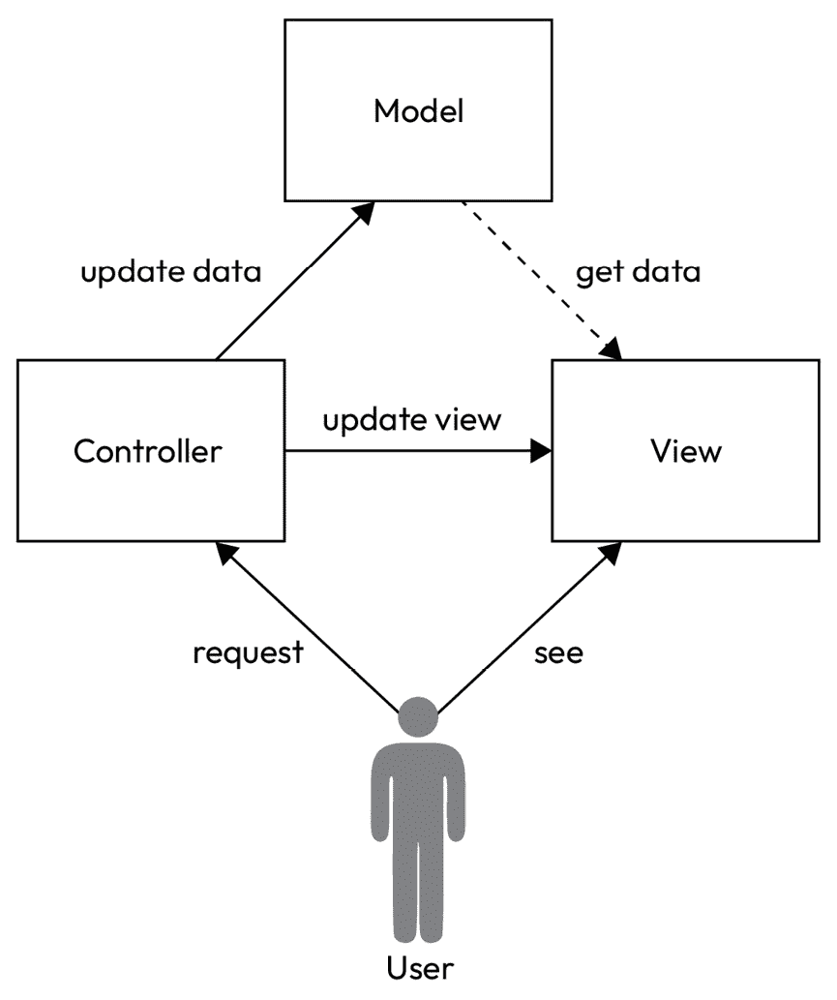
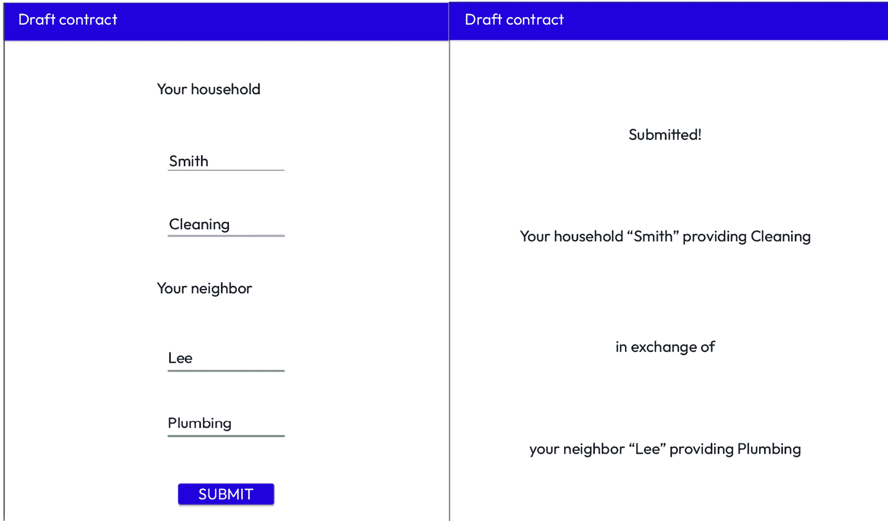
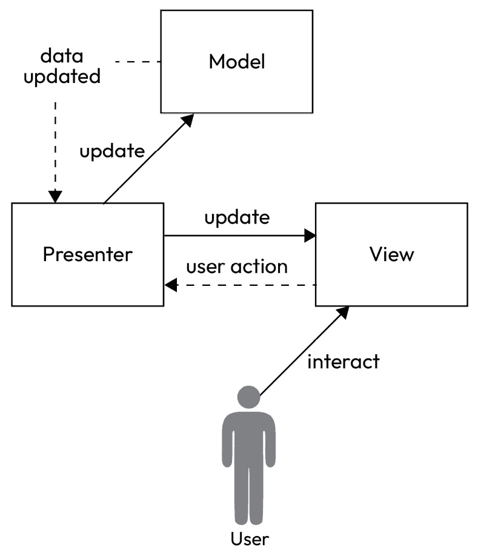
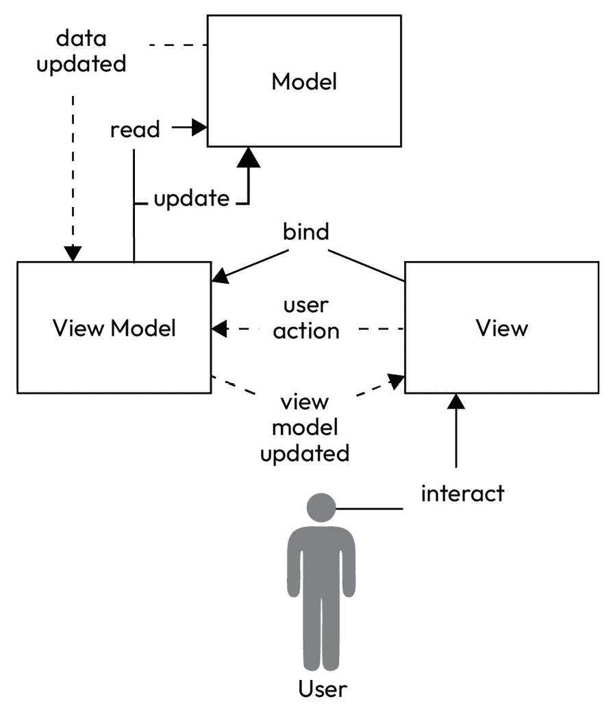
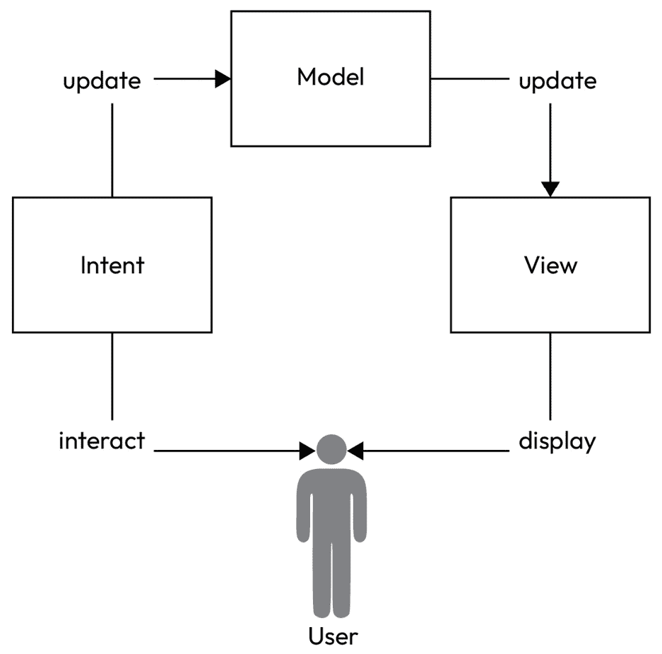

# 第五章：探索 MVC、MVP 和 MVVM

本章旨在全面比较 **模型-视图-控制器**（**MVC**）、**模型-视图-表示者**（**MVP**）和 **模型-视图-视图模型**（**MVVM**），展示它们的相似之处、不同之处以及它们各自的优势领域。通过了解每种模式的优缺点，开发者在架构应用程序时可以做出明智的决策。

本章首先探讨 MVC 的原则，这是一种在包括 Web 和移动应用开发在内的各种平台上广泛采用的模式。我们将深入研究其三个核心组件：*模型*，负责业务数据；*视图*，负责向用户展示信息的视觉呈现；以及*控制器*，模型和视图之间的中介。

接下来，我们将把重点转向 MVP，这是一种作为 MVC 进化而出现的模式。我们将研究 MVP 如何通过引入表示者（Presenter）来解决 MVC 的一些局限性，表示者负责在模型和视图之间协调数据交换和用户交互。我们将分析 MVP 中实现的 **关注点分离**（**SoC**）以及它如何提高可测试性和可维护性。

最后，我们将探索 MVVM，这是一种随着数据绑定框架的流行而变得流行的模式。我们将研究 MVVM 如何通过分离 *模型*、*视图* 和 *视图模型* 的关注点，以及数据绑定如何促进视图和视图模型之间数据的自动同步。我们将讨论声明性编程的好处以及 MVVM 提供的更高的 SoC（关注点分离）。

因此，本章将涵盖以下主题：

+   MVC

+   MVP

+   MVVM

+   比较 MVC、MVP 和 MVVM

+   不仅仅是 MVC、MVP 和 MVVM

# 技术要求

你可以在 GitHub 上找到本章使用的所有代码文件：[`github.com/PacktPublishing/Software-Architecture-with-Kotlin/tree/main/chapter-5`](https://github.com/PacktPublishing/Software-Architecture-with-Kotlin/tree/main/chapter-5)

# MVC

MVC 模式起源于 1970 年代，当时 MVC 的概念被开发出来，用于结构化代码并在桌面应用程序的 **图形用户界面**（**GUI**）中分离关注点。

在 1990 年代末和 2000 年代初，Web 开发变得流行。MVC 被作为 Web 开发框架的一部分采用；例如，**JavaServer Pages**（**JSP**）、Ruby on Rails、ASP.NET 等等。

MVC 模式将应用程序划分为三个相互关联的组件：模型（Model）、视图（View）和控制器（Controller）。每个组件都有其独特的职责，并以协调的方式与其他组件交互。此模式促进了 SoC（关注点分离）和职责的清晰划分。

你可能会在不同的框架和语言中找到三个组件之间不同版本的交互。MVC 代表了分离模型、视图和控制器的需求，而不是它们如何一起工作的规定。

## 模型

模型是应用程序的内部数据，独立于**用户界面**（**UI**）。数据在模型内进行验证、操作和转换成其他格式。它封装了核心行为和业务逻辑，并且可以在不同的视图中共享。

## 视图

视图负责向最终用户展示用户界面。它显示模型中的数据，并提供与用户交互的机制。视图是被动且对用户动作做出反应的。它只包含与渲染数据和响应用户输入相关的简单逻辑。

## 控制器

控制器是模型、视图和用户之间的中间协调者。它接收来自用户的请求，并请求更新模型中的数据。一旦模型接受请求，控制器就会更新视图中的展示。

控制器负责协调模型和视图之间数据流和变更序列。换句话说，控制器决定了应用程序的行为。

## 协作

模型、视图和控制器之间的一种协作方式如下所示：



图 5.1 – MVC 模式

用户看到视图并向控制器发出请求。控制器更新模型中的数据，然后更新视图中的展示，最后，用户看到对之前向控制器发出的请求的视觉响应。当模型发生变化时，视图也可以通过使用回调函数进行更新。

注意

值得指出的是，模型不依赖于视图或控制器。相反，视图依赖于模型。控制器依赖于视图和模型。

## MVC 的好处

MVC 模式将数据管理（模型）、用户界面（视图）和用户交互（控制器）的关注点分开。因此，它促进了模块化、代码重用性和可测试性。

模型捕获应用程序数据和业务逻辑，这些可以在多个 UI 和用户交互中重用。多个平台，如网络浏览器界面和移动应用界面，都可以将模型作为模块依赖。单个更新操作和批量更新操作可以在模型内重用相同的数据结构和验证逻辑。模型中的业务逻辑可以在不依赖视图和控制器的情况下独立测试。

此外，将模型、视图和控制器模块化使得它们中的任何一个都可以在不破坏或影响其他模块的情况下被替换。如果我们现在要重写当前的 UI，就可以将下一代 UI 作为独立模块与当前 UI 并行编写，而不用担心破坏任何现有功能或降低用户体验。我们可以在另一个团队构建新 UI 的同时，仍然维护当前 UI。

当下一代 UI 启动时，我们可以安全地退役旧 UI 模块。这减少了大量的依赖关系和软件发布的风险。

另一方面，重用视图和控制器并不常见。如前一个图所示，视图依赖于模型，控制器依赖于视图和模型。重用任何一个都会将模型作为传递依赖项，锁定要使用的模型。此外，控制器通常与视图紧密耦合，几乎没有重用的空间。

# MVC 的实际示例

我们将应用 MVC 架构来构建一个面向家庭的、用于与服务邻居交换服务（即“合同”）的前端应用程序。我们将使用 Android Studio 和 Android **软件开发** **工具包**（**SDK**）。

草稿合同应包含基本信息，例如每个家庭的名称和要交换的服务。家庭使用移动应用程序创建草稿合同记录。作为视图的应用程序只有两个屏幕，如下所示：



图 5.2 – 草拟合同的示例移动应用程序

第一个屏幕允许家庭输入其名称和提供的服务。在这种情况下，是史密斯家庭提供清洁服务。另一方面，家庭输入邻居的名称和交换的服务。具体来说，这里是由李家庭提供管道服务。

屏幕布局由位于 `/app/src/main/res/layout` 项目文件夹下的 XML 文件作为资源定义。例如，**您的家庭** 文本字段声明如下：

```kt
    <EditText
        android:id="@+id/your_household_name_edit"
        android:layout_width="wrap_content"
        android:layout_height="wrap_content"
        android:layout_marginTop="25dp"
        android:ems="10"
        android:text="Name"
        app:layout_constraintTop_toBottomOf="@id/your_household_header"
        app:layout_constraintLeft_toLeftOf="parent"
        app:layout_constraintRight_toRightOf="parent"
        app:layout_constraintBottom_toTopOf="@id/your_household_service_edit" />
```

XML 块定义了视图为一个具有分配 ID、对齐方式和尺寸的 `EditText` 组件。在 UI 中显示的副本（即显示文本）可以在单独的文件中定义，并使用标识符绑定到这里。这分离了文案编写和视觉布局的关注点。

在 XML 布局中的视图组件可以声明性地绑定到数据源，使用 Android Jetpack 库。当模型中的数据发生变化时，视图会自动更新，无需在代码中进行手动更新。这种机制创建了一个更动态和响应式的用户界面。数据绑定可以表示如下 XML：

```kt
    <data>
        <variable
            name="household"
            type="com.example.Household" />
    </data>
```

数据定义后，视图可以绑定到模型。在以下示例中，`TextView` 显示 `Household` 的名称：

```kt
        <TextView
            android:layout_width="wrap_content"
            android:layout_height="wrap_content"
            android:text="@{household.name}" />
```

当点击 **提交** 按钮时，应用程序导航到确认屏幕。在屏幕上，它确认草稿合同已提交，并显示交换服务的合同给用户。

模型应该有两个数据类。`HouseholdInput` 捕获家庭的名字和提供的服务，而 `DraftContractInput` 包含两个 `HouseholdInput` 对象以形成一个合同。这两个数据类如下所示：

```kt
data class DraftContractInput(
    val initiator: HouseholdInput,
    val neighbor: HouseholdInput
)
data class HouseholdInput(
    val householdName: String,
    val serviceProvided: String
)
```

此外，还有一个用于处理草稿合同提交的示例仓库类，`ContractRepository`。仓库类如下所示：

```kt
class ContractRepository {
    fun submit(contract: DraftContractInput): Boolean {
        return true.also {
            println("Persisted contract: $contract")
        }
    }
}
```

当前仓库的实现并没有做任何事情，但可以增强以验证和持久化草稿合同。

MVC 模式中的`Controller`接口是协调 View 和模型之间的接口。在这个例子中，定义了一个接口来描述 Controller 可以做什么：

```kt
interface Controller {
    fun submitContract(contract: DraftContractInput)
}
```

`MainActivity`类实现了`Controller`接口，并且是 Android SDK 中的`AppCompatActivity`的子类。它设置 View 的内容，控制屏幕导航，并与模型连接：

```kt
class MainActivity : AppCompatActivity(), Controller {
    private val contractRepository: ContractRepository = ContractRepository()
    override fun onCreate(savedInstanceState: Bundle?) {
        super.onCreate(savedInstanceState)
        setContentView(R.layout.activity_main)
        val contractDraftFragment = ContractDraftFragment()
supportFragmentManager.beginTransaction().replace(R.id.fragment_container, contractDraftFragment).commit()
    }
```

到`MainActivity`类的这部分，它从模型中创建了一个`ContractRepository`对象。它还创建了一个`ContractDraftFragment`屏幕作为第一个应用程序屏幕，如*图 5.2*中左侧所示。`Controller`接口中的`submitContract`函数调用模型中的函数以提交草稿合同：

```kt
    override fun submitContract(contract: DraftContractInput) {
        contractRepository.submit(contract)
         val bundle = Bundle()
        bundle.putString("yourHouseholdName", contract.initiator.householdName)
        bundle.putString("yourHouseholdService", contract.initiator.serviceProvided)
        bundle.putString("yourNeighborName", contract.neighbor.householdName)
        bundle.putString("yourNeighborService", contract.neighbor.serviceProvided)
        val confirmationFragment = ConfirmationFragment()
        confirmationFragment.arguments = bundle
        supportFragmentManager.beginTransaction().replace(R.id.fragment_container, confirmationFragment).commit()
    }
```

在 Controller 将 View 导航到确认屏幕之前，它创建一个包含提交数据的`Bundle`对象。数据传递给`ConfirmationFragment`，这是*图 5.2*中右侧显示的屏幕。`ContractDraftFragment`将用户操作发送到 Controller 以提交草稿合同。这是在`ContractDraftFragment`类的`onCreateView`函数中实现的：

```kt
class ContractDraftFragment : Fragment() {
    lateinit var controller: Controller
    lateinit var inflated: View
    override fun onCreateView(
        inflater: LayoutInflater, container: ViewGroup?,
        savedInstanceState: Bundle?
    ): View {
        inflated = inflater.inflate(R.layout.fragment_contract_draft, container, false)
        controller = activity as Controller
```

在 View 被填充之后，可以设置一个点击监听器到`EditText`组件，然后提取这些组件：

Android SDK 中的基本元素

Android SDK 提供了一套全面的工具和组件，用于构建 Android 应用程序。本章中使用了几个关键元素。Activity 是一个带有 UI 的单个屏幕，作为用户与应用程序交互的入口点。Fragment 是 Activity 的模块化部分，它们可以在多个 Activity 之间重用。View 是 UI 的基本构建块，例如按钮、文本字段和图像。Layout 是以 XML 格式声明的 UI 定义，它指定了 View 在屏幕上的排列方式。

```kt
        inflated.findViewById<Button>(R.id.submit_button)
            ?.setOnClickListener {
                controller.submitContract(
                    DraftContractInput(
                        initiator = HouseholdInput(
                            householdName = inflated.findViewById<EditText>(R.id.your_household_name_edit).text.toString(),
                            serviceProvided = inflated.findViewById<EditText>(R.id.your_household_service_edit).text.toString(),
                        ),
                        neighbor = HouseholdInput(
                            householdName = inflated.findViewById<EditText>(R.id.your_neighbor_name_edit).text.toString(),
                            serviceProvided = inflated.findViewById<EditText>(R.id.your_neighbor_service_edit).text.toString(),
                        )
                    )
                )
            }
        return inflated
    }
}
```

从`EditText`组件中提取的值创建了一个来自模型的`DraftContractInput`对象。然后，将`DraftContractInput`对象提交给`ContractRepository`类以进行进一步处理。

最后，`ContractDraftFragment`检索从上一屏幕传递过来的`Bundle`对象。然后，使用`Bundle`对象中的数据设置 View 组件，以显示包含草稿合同详细信息的确认屏幕：

```kt
class ConfirmationFragment : Fragment() {
    override fun onCreateView(
        inflater: LayoutInflater, container: ViewGroup?,
        savedInstanceState: Bundle?
    ): View? {
        val inflated = inflater.inflate(R.layout.fragment_confirmation, container, false)
        val yourHouseholdName = arguments?.getString("yourHouseholdName")
        val yourHouseholdService = arguments?.getString("yourHouseholdService")
        val yourNeighborName = arguments?.getString("yourNeighborName")
        val yourNeighborService = arguments?.getString("yourNeighborService")
        inflated.findViewById<TextView>(R.id.your_household_summary).text =
            "Your household \"$yourHouseholdName\" providing ${yourHouseholdService}"
        inflated.findViewById<TextView>(R.id.your_neighbor_summary).text =
            "your neighbor \"$yourNeighborName\" providing ${yourNeighborService}"
        return inflated
    }
}
```

在这个例子中，用户首先看到 UI 并填写文本字段。然后，用户点击**提交**按钮。这个用户操作调用 Controller 通过导航到确认屏幕来更新 View。Controller 还通过将草稿合同对象提交到仓库来更新模型。最后，用户看到确认屏幕。

值得指出的是，模型（Model）中的代码仅关注业务数据和逻辑，而视图（View）则完全负责渲染用户界面。控制器（Controller）负责视图和模型之间的所有协调，这就是 MVC 模式中如何实现 SoC（分离关注点）。

接下来，我们将转向 MVP，这是一种可以看作是从 MVC 演变而来的架构模式。

# MVP

MVP 可以被视为从 MVC 模式演变而来的一个模式。MVP 诞生于 20 世纪 90 年代，作为对将 MVC 应用于桌面和 Web 应用程序开发时遇到的局限性和挑战的回应。

MVP 建立在 MVC 的概念之上。视图和模型的概念在这两种模式之间是共享的，但视图和模型之间的交互方式发生了显著变化。

MVC 的主要局限性在于视图（View）和控制器（Controller）之间的紧密耦合。这导致独立测试视图和控制器的能力有限。此外，当视图复杂且包含大量展示逻辑时，测试和维护变得困难。

此外，对当前视图的任何变化或扩展都不可避免地需要控制器成比例的变化，因为控制器需要理解所有存在的变体和扩展。

MVP 通过引入演示者（Presenter）来促进视图和模型之间更加解耦的关系。以下图表展示了视图、模型和演示者之间新的关系：



图 5.3 – MVP 模式

如您所见，用户看到视图并与用户界面交互。然后视图将用户操作发送给演示者。演示者更新模型中的数据。当数据更新时，模型会回调演示者。然后演示者根据模型中变化的数据更新视图。最终，用户根据之前的交互看到更新后的用户界面。

## 与 MVC 的区别

MVP 与 MVC 之间的第一个明显区别是模型和视图不直接交互。所有消息都通过演示者（Presenter）传递，演示者依赖于视图和模型。视图是自包含的，不依赖于模型或演示者。

第二个区别是视图可以完全被动，即它只负责根据演示者请求更新视图来渲染用户界面。然而，*被动视图*被认为是 MVP 的一个选项。被动视图是 MVP 的一个变体，其中视图不做出任何决策，也不包含任何业务逻辑。

如果不是被动视图，视图可以包含某些不影响模型或演示者的展示逻辑。例如，简单的字段验证，如数据类型和长度。

第三个区别是 MVP 通常强制执行与视图和模型的显式通信。视图通知 Presenter 用户操作，然后 Presenter 解释并采取行动。定义显式通信有助于工程师理解和推理应用程序的行为，从而使得应用程序更容易维护。

## MVP 的好处

在视图、模型和 Presenter 之间进一步实现 SoC 带来了 MVC 模式之上的几个好处。

在 MVP 中，视图可以独立测试，无需 Presenter 的参与。显式传入视图的消息可以用作测试用例的输入，UI 用于验证。另一方面，用户交互可以是测试用例的输入，视图显式传出的消息用于验证。

使用 MVP，现在可以拥有没有改变 Presenter 的视图变体。视图变体以不同的方式解释来自 Presenter 的消息。变体可能从稍微不同的用户交互中产生相同的消息给 Presenter。这样，就无需更改 Presenter 以支持视图的变体。如今，在 iOS 应用程序、Android 应用程序、Web 应用程序以及电视等定制设备等不同平台上，有如此多的 UI 变体。这些不同的视图可以共享相同的模型和相同的 Presenter，同时仍然为用户提供针对平台的独特体验。

MVP 明确标准化了发送给和接收由 Presenter 的消息。它确保没有混淆，也没有不同框架或实现偏差的空间。它为工程师带来清晰，使应用程序易于理解。

## MVP 的真实生活示例

我们继续使用之前用于 MVC 模式的相同示例。我们使用 MVP 中使用的相同真实生活示例，其中一家家庭可以与另一家家庭起草一项交换服务的合同（即“合同”）。

从 MVC 模式演变而来，在 MVP 中，视图和模型可以保持不变，但通信方式将改变。

尽管声明的函数没有改变，但 `Controller` 接口被重命名为 `Presenter`：

```kt
interface Presenter {
    fun submitContract(contract: DraftContractInput)
}
```

Presenter 与视图和模型都有双向通信。因此，第一个变化是支持当模型发生变化时的回调：

```kt
typealias DraftContractSubmittedListener = (DraftContractInput) -> Unit
```

`DraftContractSubmittedListener` 类型别名在草案合同提交给模型时充当回调接口。`ContractRepository` 类被增强以保持一个 `DraftContractSubmittedListener` 对象，并在提交草案合同时调用回调。仓库类的实现如下所示：

```kt
class ContractRepository {
    var onSubmitListener: DraftContractSubmittedListener? = null
    fun submit(contract: DraftContractInput): Boolean {
        return true.also {
            onSubmitListener?.invoke(contract)
        }.also {
            println("Persisted contract: $contract")
        }
    }
}
```

当模型更新时，回调函数可用于导航到带有提交的草案合同的确认屏幕。这是 `MainActivity` 类中更新的 `submitContract` 函数：

```kt
    override fun submitContract(contract: DraftContractInput) {
        contractRepository.onSubmitListener = {
            val confirmationFragment = ConfirmationFragment()
            confirmationFragment.lastSubmittedContract = it           supportFragmentManager.beginTransaction().replace(R.id.fragment_container, confirmationFragment).commit()
        }
        contractRepository.submit(contract)
    }
```

另一方面，`ConfirmationFragment` 类被更新。屏幕直接从刚刚从 `DraftContractSubmittedListener` 设置到 `MainActivity` 的提交草稿合同中获取值：

```kt
class ConfirmationFragment : Fragment() {
    lateinit var lastSubmittedContract: DraftContractInput
    override fun onCreateView(
        inflater: LayoutInflater, container: ViewGroup?,
        savedInstanceState: Bundle?
    ): View? {
        val inflated = inflater.inflate(R.layout.fragment_confirmation, container, false)
        lastSubmittedContract?.also {
            inflated.findViewById<TextView>(R.id.your_household_summary).text =
                "Your household \"${it.initiator.householdName}\" providing ${it.initiator.serviceProvided}"
            inflated.findViewById<TextView>(R.id.your_neighbor_summary).text =
                "your neighbor \"${it.neighbor.householdName}\" providing ${it.neighbor.serviceProvided}"
        }
        return inflated
    }
}
```

与 MVC 示例相比，这个 MVP 示例的主要区别在于确认屏幕的加载是由模型的变化触发的，使用了回调函数。这样，视图和模型之间的所有通信都通过演示者（Presenter）进行。现在可以独立测试 `ConfirmationFragment` 类中的视图逻辑、`ContractRepository` 类中的模型逻辑和 `MainActivity` 类中的演示者逻辑。

在 MVP 之后，我们将深入探讨 MVVM 模式，该模式也旨在解决 MVC 和 MVP 相同的问题。

# MVVM

MVVM 首次由微软的 John Gossman 在 2005 年引入。它是为了使用 **Windows Presentation Foundation** （**WPF**） 框架进行 UI 开发而创建的。后来它被其他框架采用，如下所示：

+   React

+   Xamarin

+   AngularJS

MVVM 基本上保留了从较老的模型 MVC 和 MVP 中继承的模型和视图的概念。然而，它使用视图模型作为视图和模型之间的中介。还有大量偏好使用声明性数据绑定而不是编码。MVVM 的数据绑定功能支持视图和视图模型之间的自动同步。

## 视图模型

视图模型公开视图可以绑定到其上的数据和命令。数据绑定允许视图和视图模型之间自动双向同步。换句话说，视图模型中的更新会自动反映在视图中，视图模型也可以对视图中的用户操作做出反应。这减少了手动在视图和视图模型之间同步数据以及更新视图的样板代码。以下图表将更详细地说明视图、模型和视图模型之间的交互：



图 5.4 – MVVM 模式

如您所见，视图模型从模型读取数据，将其转换为展示格式，并为视图提供属性和函数。视图接收属性和函数回调以渲染用户界面。

在 *图 5.5* 中演示了一个用户与视图交互并最终在视图中看到变化的用例：


图 5.5 – 用户与视图交互并看到视图中的变化

当用户与视图交互时，用户操作会被传播到视图模型。视图模型执行命令以响应用户操作，这通常涉及更新模型中的数据。一旦模型中的数据被更新，视图模型就会接收到数据更新并将其转换为用于展示的形式。最后，视图接收到视图模型的变化并渲染 UI 作为对用户操作的响应。

## MVVM 的好处

MVVM 将业务逻辑的关注点进一步从视图的展示中分离出来。视图模型封装了展示逻辑，无需关心其视觉呈现方式。这意味着视图模型可以在隔离状态下进行测试，独立于 UI 的具体细节。

视图模型中的属性和命令可以在保持多个视图（如网页浏览器、桌面应用程序和移动应用程序）之间用户体验一致性的同时共享。此外，可以在不更新视图模型的情况下对视图进行更改。这促进了代码库的灵活性和可扩展性。

UI 设计师可以更好地与前端工程师协作。UI 设计师可以专注于样式、布局和视觉组件，无需干扰业务逻辑。这促进了并行工作并提高了生产力。

视图和视图模型之间的自动同步减少了手动更新视图的样板代码，反之亦然。

## MVVM 的真实生活示例

从我们之前用于 MVP 模式的示例继续，代码库将演变为 MVVM 模式。我们使用与 MVC 和 MVP 相同的真实生活示例，并使用 Android SDK 从它们中演变代码库。

视图模型被引入并命名为 `DraftContractViewModel`，用于在它准备好成为草稿联系人之前存储过渡数据：

```kt
class DraftContractViewModel : ViewModel() {
    var yourHouseholdName: String? = null
    var yourHouseholdService: String? = null
    var yourNeighborName: String? = null
    var yourNeighborService: String? = null
}
```

`DraftContractViewModel` 对象将在 `Fragments` 之间共享，以继续构建草稿合同所需的数据。这反映在可变字段（在 Kotlin 中称为 `var`）。此外，视图模型充当视图和模型之间的桥梁。`toModel` 函数将视图模型 `DraftContractViewModel` 对象转换为模型 `DraftContractInput` 对象：

```kt
fun DraftContractViewModel.toModel(): DraftContractInput? =
    if (yourHouseholdName != null
        && yourHouseholdService != null
        && yourNeighborName != null
        && yourNeighborService != null
    ) {
        DraftContractInput(
            initiator = HouseholdInput(
                householdName = yourHouseholdName!!,
                serviceProvided = yourHouseholdService!!
            ),
            neighbor = HouseholdInput(
                householdName = yourNeighborName!!,
                serviceProvided = yourNeighborService!!
            )
        )
    } else {
        null
    }
```

注意，已经应用了数据完整性逻辑到该函数中，以确保模型对象只能在所有字段都存在的情况下创建。这种转换逻辑也可以独立测试，如下所示：

```kt
    @Test
    fun `do not create model if the view model is empty`() {
        assertNull(DraftContractViewModel().toModel())
    }
    @Test
    fun `create model when all fields are present`() {
        val viewModel = DraftContractViewModel().apply {
            yourHouseholdName = "Smith"
            yourHouseholdService = "Cleaning"
            yourNeighborName = "Lee"
            yourNeighborService = "Cooking"
        }
        val model = DraftContractInput(
            HouseholdInput("Smith", "Cleaning"),
            HouseholdInput("Lee", "Cooking")
        )
        assertEquals(model, viewModel.toModel())
    }
```

这个单元测试由 `null` 运行。第二个测试创建了一个所有字段均非 `null` 的视图模型对象，因此它可以被转换为模型对象。

视图和视图模型之间的数据绑定和同步是自动进行的，使用以下自定义函数：

```kt
fun EditText.bind(consume: (String) -> Unit) {
    consume(text.toString())
    addTextChangedListener {
        consume(it.toString())
    }
}
```

初始时，当创建`EditText`视图组件时，默认值设置为视图模型`DraftContractViewModel`对象。随后，任何文本更改都会触发一个回调来更新视图模型。数据绑定过程在第一个屏幕的`onCreate`函数中启动，由`ContractDraftFragment`类表示：

```kt
    override fun onCreateView(
        inflater: LayoutInflater, container: ViewGroup?,
        savedInstanceState: Bundle?
    ): View {
        val inflated = inflater.inflate(R.layout.fragment_contract_draft, container, false)
        val command = activity as Command
        val viewModel = ViewModelProvider(activity as AppCompatActivity).get(DraftContractViewModel::class.java)
```

视图模型在这里查找，并将所有者设置为活动，以便它可以与下一个屏幕共享。然后，在点击`toModel`函数时注册一个回调，用于将视图模型转换为模型对象：

```kt
        inflated.findViewById<Button>(R.id.submit_button)
            ?.setOnClickListener {
                viewModel.toModel()?.let {
                    command.submitContract(it)
                }
            }
```

然后使用前面提到的`bind`函数，逐字段将`EditText`视图组件与视图模型绑定：

```kt
inflated.findViewById<EditText>(R.id.your_household_name_edit)?.bind {
            viewModel.yourHouseholdName = it
        } inflated.findViewById<EditText>(R.id.your_household_service_edit)?.bind {
            viewModel.yourHouseholdService = it
        } inflated.findViewById<EditText>(R.id.your_neighbor_name_edit)?.bind {
            viewModel.yourNeighborName = it
        } inflated.findViewById<EditText>(R.id.your_neighbor_service_edit)?.bind {
            viewModel.yourNeighborService = it
        }
        return inflated
    }
```

确认屏幕直接从视图模型获取提交的数据：

```kt
class ConfirmationFragment : Fragment() {
    override fun onCreateView(
        inflater: LayoutInflater, container: ViewGroup?,
        savedInstanceState: Bundle?
    ): View? {
        val inflated = inflater.inflate(R.layout.fragment_confirmation, container, false)
        val viewModel = ViewModelProvider(activity as AppCompatActivity).get(DraftContractViewModel::class.java)
```

视图模型在这里通过活动作为所有者与第一个屏幕共享来查找。然后，视图从相同的视图模型对象获取数据。现在有两个屏幕共享相同的视图模型对象，但视图的渲染方式不同：

```kt
inflated.findViewById<TextView>(R.id.your_household_summary).text =
            "Your household \"${viewModel.yourHouseholdName}\" providing ${viewModel.yourHouseholdService}"
        inflated.findViewById<TextView>(R.id.your_neighbor_summary).text =
            "your neighbor \"${viewModel.yourNeighborName}\" providing ${viewModel.yourNeighborService}"
        return inflated
    }
}
```

此示例中还可以添加一些其他潜在功能。当用户在文本字段中输入文本时，同步视图模型的回调函数会不断被调用。这使得向用户提供实时验证反馈成为可能。

由于视图模型在同一个活动中的多个屏幕之间共享，视图可以演变为一组屏幕，作为向导式多步骤活动。

此外，如果模型在两个应用程序的两个副本之间共享，可以使用某种协议（如**对等网络**（**P2P**））实时同步草拟合同的实时数据。当模型从网络外部更新时，模型更改的回调函数可以填充视图模型，然后实时更新视图。

# 比较 MVC、MVP 和 MVVM

MVC、MVP 和 MVVM 模式共享视图和模型的概念。然而，它们的关系和通信方式不同。

在 MVC 中，一个控制器可以访问多个视图，并且通常直接调用视图的功能。视图和模型紧密耦合。用户输入由控制器处理。单元测试仅限于业务逻辑的模型。修改视图或模型需要更改控制器。它仅适用于小型项目，因为代码占用空间最小。

在 MVP 中，一个演示者管理至少一个视图。视图和模型不知道演示者，但它们通过回调函数与演示者通信。此外，视图和模型是解耦的。用户输入由视图处理，然后视图调用演示者提供的回调函数。单元测试可以在模型上的业务逻辑中进行。模型和视图的回调函数的行为也可以进行测试。如果回调函数保持不变，修改视图或模型可能不需要修改演示者。它适用于从小型到更复杂的项目，这些项目需要更好的模型和视图的可测试性。

在 MVVM 中，一个 ViewModel 映射到一个或多个视图。视图和模型也是解耦的，但业务逻辑与视图的分离更加彻底，通信更加事件驱动，并得到底层框架的支持。用户输入由视图处理，然后视图调用 ViewModel 提供的回调函数。单元测试可以在模型上的业务逻辑中进行。模型、视图和 ViewModel 的回调函数的行为也可以进行测试。

关注点更容易分离，功能可以足够小，以符合 **单一职责原则** (**SRP**)。如果数据绑定没有改变，修改视图或模型可能不需要修改 ViewModel。它适用于可能部署到多个平台和因此需要更好的视图和模型之间隔离的大型和复杂项目。

比较总结在下表中：

| **MVC** | **MVP** | **MVVM** |
| --- | --- | --- |
| 视图和模型紧密耦合。 | 视图和模型解耦。 | 视图和模型解耦。 |
| 控制器依赖于视图和模型。 | 一个演示者通过回调函数管理至少一个视图。 | 一个 ViewModel 通过回调函数管理至少一个视图。 |
| 控制器处理用户输入。 | 视图处理用户输入。 | 视图处理用户输入。 |
| 仅在模型上进行单元测试。 | 在模型和视图上进行单元测试。 | 在模型、视图和 ViewModel 上进行单元测试。 |

表 5.1 – MVC、MVP 和 MVVM 的比较

# 除此之外 MVC、MVP 和 MVVM

更多的架构模式已经从我们之前讨论的三个模式中演变而来。这些模式的深入比较超出了本章的范围，但它们值得提及：

+   **模型-视图-意图 (MVI)**: MVI 在 2010 年左右作为受 MVC、MVP 和 MVVM 影响的模式在 Android 社区中兴起。MVI 对单向数据流有独特的关注，以简化状态管理。它还采用响应式编程范式，通过 RxJava 和 RxJS 等库异步管理单向数据流。它们之间的交互在 *图 5.6* 中展示：



图 5.6 – MVI 交互

+   **原子设计**：由布拉德·弗罗斯特在 2013 年他的书《原子设计》中提出，原子设计将 UI 分解为五个级别：

    +   **原子**：如文本字段等基本构建块

    +   **分子**：如搜索栏等原子的功能组织

    +   **有机体**：如导航面板等分子的部分组织

    +   **模板**：构成页面的有机体的视觉布局和组织

    +   **页面**：具有真实内容的业务感知和特定页面实例

+   **基于组件**：专注于将功能分离成自包含和可重用的组件。每个组件封装了行为，隐藏了其底层细节，并通过接口仅暴露高级功能。它与包含具有良好定义行为的可重用组件库的设计系统相结合。它的目的是在开发过程中提供一致的用户体验并优化生产力。每个组件都是独立开发、测试和部署的，这使得更新应用程序变得更容易。

+   **服务器端渲染（SSR）**：SSR 主要用于网页开发，但可以扩展到移动和桌面应用程序。页面的内容是在服务器上生成的，而不是在浏览器或客户端设备上。它的目的是通过减少浏览器或客户端设备上的负载来提高性能和响应时间，这些设备具有不同的计算能力。数据获取的优化可以在服务器端进行，从而减少客户端和服务器之间的不必要流量。然而，这确实增加了服务器处理负载。

# 摘要

我们以 MVC 模式开始本章。我们探讨了模型、视图以及控制器如何与它们交互。我们还用一个现实生活中的例子来说明这些概念，即家庭之间服务交换合同的起草。示例中使用了起草和确认屏幕的 UI，控制器驱动导航并提交草案合同。

然后，我们通过从 MVC 演化引入了 MVP 模式。引入了演示者来替代控制器，并将从模型中添加的回调函数添加到模式中，以进一步隔离视图和模型。然后，我们回到了同一个现实生活中的例子，并将 MVC 的原始代码库修改为 MVP。

之后，我们通过从 MVP 演变而来介绍了 MVVM 模式。在视图和模型之间添加了视图模型作为中介。支持数据绑定以自动同步视图和视图模型之间的数据。我们重用了相同的真实生活示例并将其重构为 MVVM 模式。引入了一个自定义的绑定函数，用于将视图组件中的值绑定到视图模型中的字段。提交时，视图模型可以转换为模型对象。我们讨论了 MVVM 模式提供的潜在增强，例如实时验证、视图的分布式处理和视图的多种变体。

我们从多个角度比较了这三种模式。我们讨论了视图和模型之间的关系以及在每个模式中它们是如何耦合的。然后比较了三种模式之间的通信方式以及单元测试的简便性。我们考察了在每个模式中需要的修改链。最后，我们讨论了根据项目规模选择哪种模式更合适。

最后，我们介绍了前端领域中从 MVC、MVP 和 MVVM 演变而来的几种架构模式。

在下一章中，我们将探讨另一组架构模式，并进行比较：单体架构、微前端、微服务、纳米服务和无服务器架构。它们应用于前端或后端系统，但它们确实共享一些值得讨论的相似的基本概念。
